# 二十五、Ajax 编程

## 25.1 简介

Ajax(异步 JavaScript 和 XML)是一组特殊的基于脚本的类。这些类使客户机和服务器能够以这样一种方式进行交互，即只有页面的一个*区域*被重新创建、重新格式化、发送回客户机，并在客户机的浏览器中重新呈现。为了理解 Ajax 类是如何工作的，我们需要对比一下*同步回发*和*全页面呈现*与*异步回发*和*部分页面呈现*的概念。

当一个页面被发送到服务器并被处理(所有的服务器端事件都被处理)，*和**整个*页面被重新创建、重新格式化、发送回客户端并在客户端的浏览器中重新呈现时，就会发生同步回发。由于*整个*页面被重新创建、重新格式化、发送回客户端，并在客户端的浏览器中重新呈现，因此*出现了全页面呈现*。由于一些原因，同步回发可能*效率低下*。首先，由于*整个*页面被重新创建、重新格式化、发送回客户端，并在客户端的浏览器中重新呈现，所以当只需要更新页面的一部分时，服务器必须执行一些不必要的处理。第二，由于*整个*页面被重新呈现在客户的浏览器中，他或她必须等待整个页面重新显示，然后才能继续他们在页面上的工作。第三，由于*整个*页面在客户端的浏览器中重新呈现，默认情况下，当页面重新显示时，页面的顶部会自动与浏览器的顶部重新对齐。 [1](#Fn1) 这可能会造成令人沮丧的体验，因为最终用户可能需要向下滚动页面，回到他们提交页面进行处理时所在的位置。默认情况下，ASP.NET 页面模型使用同步回发。

另一方面，异步回发发生在页面被发送到服务器并被处理时(所有的服务器端事件仍被*处理，*，但*只有页面的*部分*被重新创建、重新格式化、发送回客户端，并在客户端的浏览器中重新呈现。因为只有页面的*部分*被重新创建、重新格式化、发送回客户端，并在客户端的浏览器中重新呈现，所以*部分页面呈现*发生。由于几个原因，异步回发可能更有效率。首先，由于只有页面的*部分*被重新创建、重新格式化、发送回客户端并在客户端的浏览器中重新呈现，所以当只有页面的一部分需要更新时，服务器不需要执行那么多不必要的处理。第二，由于只有页面的*部分*被重新呈现在客户的浏览器中，他或她不需要等待整个页面重新显示，就可以继续他们在页面上的工作。第三，由于只有页面的*部分*被重新呈现在客户端的浏览器中，所以当页面重新显示时，页面的顶部不会自动与浏览器的顶部重新对齐。这可以减少令人沮丧的体验，因为最终用户可能不需要向下滚动页面到他们提交页面进行处理时的位置。*

Ajax 类是用 HTML、CSS 和 JavaScript 实现的。因此，Ajax 控件在不支持脚本或者禁用了浏览器脚本的浏览器中无法正常工作。此外，一些智能手机和其他特殊设备可能不支持使用 Ajax 控件。因此，当使用这种设备访问应用时，准备好替代的非 Ajax 代码是很重要的。

在本章中，我们将从查看 ScriptManager 类开始。这个类管理网页的 Ajax 资源，包括自动下载支持异步回发和部分页面呈现的 Ajax 脚本。接下来，我们将讨论 Ajax 扩展类，它们是。NET 框架，并将基本的 Ajax 功能添加到 Web 应用中。最后，我们将考虑 Ajax 控件工具包。这个工具包是一个开源类库，我们可以用它来增强我们开发的 Web 应用的交互性和整体体验。

## 25.2 ScriptManager 类

ScriptManager 类管理网页的 Ajax 资源。这种管理包括自动下载支持异步回发和部分页面呈现的 Ajax 脚本。一个 ScriptManager 控件*必须*包含在一个包含 Ajax 控件的 Page 类中，而*一个 Page 类中只能包含*一个 ScriptManager 控件。表 [25-1](#Tab1) 显示了 ScriptManager 类的一些属性、方法和事件。

表 25-1

ScriptManager 类的一些属性、方法和事件

<colgroup><col class="tcol1 align-left"> <col class="tcol2 align-left"></colgroup> 
| **班**编剧经理T3】2T5】 |
| **命名空间**系统。Web.UI |
| **属性** |
| (参见参考文献。) |   |
| **方法** |
| (参见参考文献。) |   |
| **事件** |
| (参见参考文献。) |   |
| **参考** |
| [T2`https://msdn.microsoft.com/en-us/library/system.web.ui.scriptmanager(v=vs.110).aspx`](https://msdn.microsoft.com/en-us/library/system.web.ui.scriptmanager%2528v%253Dvs.110%2529.aspx) |

## 25.3 扩展课程

Ajax 扩展类是。NET 框架并将基本的 Ajax 功能添加到 Web 应用中。Ajax 扩展类包括 UpdatePanel 类、UpdateProgress 类和 Timer 类。我们将在这一部分讨论前两个类。总之，它们将允许我们利用异步回发和部分页面呈现，并允许我们向最终用户提供关于异步回发状态的反馈。

### 更新面板类

UpdatePanel 类定义了一个*页面区域*，它将被异步发送回服务器并在浏览器中重新呈现。因此，这个类是 Ajax 模型的重要组成部分。UpdatePanel 控件的 ContentTemplate 属性定义更新面板的内容，通常包括一个或多个服务器控件。一个 Page 类中可以包含多个 UpdatePanel 控件，这允许我们在页面上定义可以独立回发和重新呈现的离散区域。

当第一次请求某个页面时，该页面上的所有页面区域(即所有 UpdatePanel 控件)都会在浏览器中呈现。但是，当请求单个页面区域(即单个 UpdatePanel 控件)时，只有该页面区域会在浏览器中重新呈现。UpdatePanel 控件可以包含在 MasterPage 类或 content Page 类中，可以在 FormView 控件或 ListView 控件等模板控件中定义，也可以嵌套在另一个 UpdatePanel 控件中。我们还可以使用 CSS 将样式应用于 UpdatePanel 控件。表 [25-2](#Tab2) 显示了 UpdatePanel 类的一些属性、方法和事件。

表 25-2

UpdatePanel 类的一些属性、方法和事件

<colgroup><col class="tcol1 align-left"> <col class="tcol2 align-left"></colgroup> 
| **类**更新面板T3】3T5】 |
| **命名空间**系统。Web.UI |
| **属性** |
| 内容模板 | 获取或设置定义 UpdatePanel 控件内容的模板。 |
| **方法** |
| (参见参考文献。) |   |
| **事件** |
| (参见参考文献。) |   |
| **参考** |
| [T2`https://msdn.microsoft.com/en-us/library/system.web.ui.updatepanel(v=vs.110).aspx`](https://msdn.microsoft.com/en-us/library/system.web.ui.updatepanel%2528v%253Dvs.110%2529.aspx) |

图 25-1 显示了一个 UpdatePanel 类的例子。

注意 01 处的 ScriptManager 控件，它自动下载异步回发和部分页面呈现所需的 Ajax 脚本。

注意 02 处的 UpdatePanel 控件。该控件定义将异步回发到服务器并在浏览器中重新呈现的页面区域。

请注意 03 处 UpdatePanel 控件的 ContentTemplate 属性，它定义了更新面板的内容。可以看到，更新面板的内容包括一个文本框、一个按钮和一个消息标签。

请注意 04 处的事件处理程序方法，当最终用户单击*保存*按钮时会调用该方法。发生这种情况时，只有由更新面板定义的页面区域将被重新创建、重新格式化、发送回客户端，并在客户端的浏览器中重新呈现。页面的其余部分将不会被更新。

图中结果部分的屏幕截图显示了保存电子邮件地址后显示的消息。如果我们能够观察到点击*保存*按钮时浏览器的行为，我们会注意到整个页面是*而不是*重新呈现在客户端的浏览器中。此外，我们还会注意到在同步回发过程中常见的“页面闪烁”已经消失了。

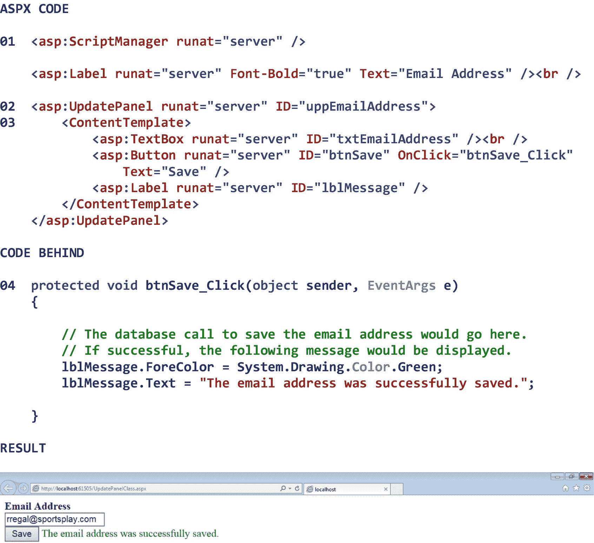

图 25-1

UpdatePanel 类的示例

### 25.3.2 更新进度类

UpdateProgress 类为最终用户提供有关异步回发进度的反馈。UpdateProgress 控件的 ProgressTemplate 属性定义控件的内容，该控件的内容通常包含某种消息，要求最终用户在进程(即异步回发)完成时等待。当页面最初在浏览器中呈现时，UpdateProgress 控件的 ProgressTemplate 属性中的内容是*而不是*显示的。但是，后续的*异步*回发可能会导致 ProgressTemplate 属性中的内容显示出来。

为了将 UpdateProgress 控件连接到其关联的 UpdatePanel 控件，我们将 UpdateProgress 控件的 AssociatedUpdatePanelID 属性设置为关联的 UpdatePanel 控件的 ID 属性。如果我们希望在给定时间(以毫秒为单位)后显示 UpdateProgress 控件的 ProgressTemplate 属性中的内容，我们可以设置 UpdateProgress 控件的 DisplayAfter 属性。默认情况下，UpdateProgress 控件在显示其 ProgressTemplate 属性中定义的内容之前将等待 500 毫秒(即 0.5 秒)。我们还可以使用 CSS 将样式应用于 UpdateProgress 控件。表 [25-3](#Tab3) 显示了 UpdateProgress 类的一些属性、方法和事件。

表 25-3

UpdateProgress 类的一些属性、方法和事件

<colgroup><col class="tcol1 align-left"> <col class="tcol2 align-left"></colgroup> 
| **类**更新进度T3】4T5】 |
| **命名空间**系统。Web.UI |
| **属性** |
| 关联更新面板 ID | 获取或设置 UpdateProgress 控件为其显示状态的 UpdatePanel 控件的 ID。 |
| 显示之后 | 获取或设置在显示 UpdateProgress 控件之前的值(以毫秒为单位)。 |
| 进度模板 | 获取或设置定义 UpdateProgress 控件内容的模板。 |
| **方法** |
| (参见参考文献。) |   |
| **事件** |
| (参见参考文献。) |   |
| **参考** |
| [T2`https://msdn.microsoft.com/en-us/library/system.web.ui.updateprogress(v=vs.110).aspx`](https://msdn.microsoft.com/en-us/library/system.web.ui.updateprogress%2528v%253Dvs.110%2529.aspx) |

图 [25-2](#Fig2) 显示了一个 UpdateProgress 类的例子。

注意 01 处的 ScriptManager 控件，它自动下载异步回发和部分页面呈现所需的 Ajax 脚本。

请注意 02 处的 UpdatePanel 控件，该控件定义了将在浏览器中异步回发和重新呈现的页面区域。

注意 03 处的 UpdateProgress 控件。可以看出，我们通过将 UpdateProgress 控件的 AssociatedUpdatePanelID 属性设置为 UpdatePanel 控件的 ID 属性，将此控件与 02 处的 UpdatePanel 控件关联起来。还要注意，我们已经将控件的 DisplayAfter 属性设置为 *2000* 。这意味着，如果异步回发时间超过 2，000 毫秒(即 2 秒)，我们希望显示 UpdateProgress 控件。

请注意 04 处的 UpdateProgress 控件的 ProgressTemplate 属性。可以看到，我们在这个模板中包含了一个标签，显示一条消息，要求最终用户等待异步回发完成。

请注意，在 05 中，我们在事件处理程序方法的最底部包含了一行代码，当最终用户单击 *Save* 按钮时会调用该代码。添加这行代码是为了降低服务器上的处理速度，也就是说，模拟 5000 毫秒(即 5 秒)的响应时间。这一行代码通常不会包含在这样的事件处理程序方法中，但它是如何测试 UpdateProgress 控件的一个很好的示例。

图中 Result 部分的第一个屏幕截图显示了由于异步回发过程中的(人为)延迟而显示的消息。第二个屏幕截图显示了保存电子邮件地址后显示的消息。

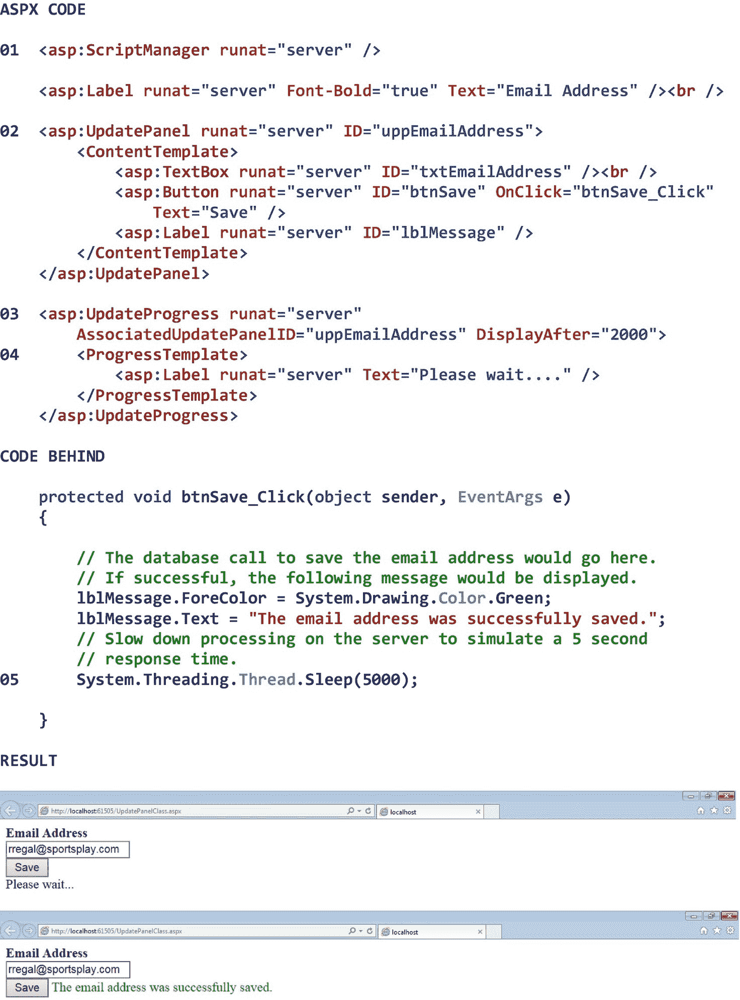

图 25-2

UpdateProgress 类的示例

## 25.4 Ajax 控件工具包

Ajax 控件工具包是一个开源类库，构建在。NET 框架。 [5](#Fn5) 这个类库包含 30 多个类，可以用来增强我们开发的 Web 应用的交互性和整体体验。Ajax Control Toolkit 中的所有类都可以“开箱即用”，并且不需要了解 Ajax 扩展类(前面讨论过)或 JavaScript(在第 [26](26.html) 章中讨论，标题为*“JavaScript 编程”*)。

Ajax 控件工具包中的类可以分为 *Ajax 控件类*和 *Ajax 控件扩展类*。控件类用于创建独立的(即自包含的)ASP.NET 服务器控件，而控件扩展程序类用于扩展或增强标准 ASP.NET 服务器控件的行为。Ajax 控件工具包中的控件类包括 Accordion 类和 AjaxFileUpload 类。Ajax 控件工具包中的控件扩展程序类包括 BalloonPopupExtender 类、CalendarExtender 类、ModalPopupExtender 类和 PasswordStrength (extender)类。尽管在 Ajax 控件工具箱中有比这些更多的类，但是我们将把我们的讨论限制在这六个。总之，它们将让我们对如何使用 Ajax 控件工具包来进一步利用异步回发和部分页面呈现有一个很好的感觉。鼓励感兴趣的读者自己探索 Ajax 控件工具箱中其他类的用法。

### 安装 Ajax 控件工具包

在 Ajax 控件工具包中的类工作之前，我们需要在我们的开发环境(即 Visual Studio)中安装该工具包。安装这个工具包可以获得使用 Ajax 控件和 Ajax 控件扩展器所需的所有 Ajax 脚本。如果没有安装 Ajax Control Toolkit，当请求包含 Ajax Control Toolkit 类的页面时，将会出现错误。要安装 Ajax 控件工具包

1.  导航到 [`www.devexpress.com/Products/ajax-control-toolkit/`](http://www.devexpress.com/Products/ajax-control-toolkit/) 。

2.  点击*下载*。

3.  遵循安装说明。

一旦安装了 Ajax 控件工具包，它的类将出现在 Visual Studio 工具箱中。没有必要为我们创建的每个新应用重新安装工具包，因为安装会导致工具包被安装在 Visual Studio 本身中。有关 Ajax 控件工具箱中所有控件和控件扩展程序的演示，请参见 [`https://ajaxcontroltoolkit.devexpress.com/`](https://ajaxcontroltoolkit.devexpress.com/) 。

在 Ajax 控件工具包安装完毕后*创建新项目时，我们*可能*需要将工具包的组装引用添加到项目中。为此*

1.  打开解决方案资源管理器。

2.  右击*引用*。

3.  选择*添加参考…* 。

4.  点击*浏览…* 。

5.  找到 AjaxControlToolkit.dll 的文件。

6.  选择文件。

7.  点击*添加*。

8.  确保在参照管理器中检查了 AjaxControlToolkit.dll 文件。

9.  点击*确定*关闭参考管理器。

默认情况下，Ajax 控件工具包的 Aspx 标记前缀是 *ajaxToolkit* 。虽然没有必要这样做，但我们将创建一个更短的标签前缀(例如， *act* )，它看起来类似于我们习惯的 *asp* 标签前缀(为了可读性和标准化)。为此，我们必须做的就是在 Web.config 文件的<system . web><pages><controls>部分中添加一个对新标记前缀的引用。图 [25-3](#Fig3) 显示了带有 *act* (Ajax 控制工具包)标签前缀参考的 Web.config 文件。

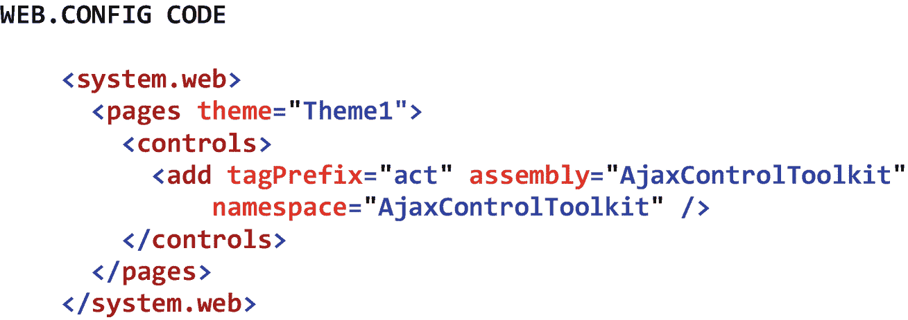

图 25-3

带有 act (Ajax 控件工具包)标记前缀引用的 Web.config 文件

### 控制类别

Ajax Control Toolkit 控件类用于创建独立的(即自包含的)ASP.NET 服务器控件。这些类包括 Accordion 类和 AjaxFileUpload 类。尽管 Ajax 控件工具包中的控件类要比这些多得多，但我们的讨论将仅限于这两个，因为它们将充分说明如何使用这些类来进一步利用异步回发和部分页面呈现。

#### 25.4.2.1 手风琴班

Accordion 类显示一个可展开/可折叠的窗格集合，最终用户可以使用该集合一次显示一个窗格的信息。相应控件的 AccordionPane 属性定义 accordion 的 Pane 集合中的*子窗格*的标题和内容区域。ContentCssClass 属性指示用于格式化可折叠面板的子窗格的内容区域的默认 CSS 类。FadeTransitions 属性指示从一个折叠窗格过渡到另一个折叠窗格时是否使用渐变效果。HeaderCssClass 属性指示用于设置折叠面板子窗格标题区域格式的默认 CSS 类。Panes 属性包含子折叠窗格的集合。最后，TransitionDuration 属性指示从一个折叠窗格过渡到另一个折叠窗格所需的时间长度。默认情况下，该转换为 500 毫秒(即 0.5 秒)。表 [25-4](#Tab4) 显示了 Accordion 类的一些属性、方法和事件。

表 25-4

Accordion 类的一些属性、方法和事件

<colgroup><col class="tcol1 align-left"> <col class="tcol2 align-left"></colgroup> 
| **类**手风琴6[手风琴](#Fn6)T5】 |
| 命名空间 NA |
| **属性** |
| 折叠窗格 | 手风琴中的子窗格。 |
| contentcsssclass | 用于格式化控件内容区域的 CSS 类。 |
| 渐变过渡 | 在选定的折叠窗格之间切换时是否使用淡入淡出效果。默认值为 false。 |
| headercsssclass | 用于格式化控件标题区域的 CSS 类。 |
| 窗格 | 手风琴中子窗格的集合。 |
| 过渡持续时间 | 转场动画的长度，以毫秒为单位。默认值为 500。 |
| **方法** |
| (参见参考文献。) |   |
| **事件** |
| (参见参考文献。) |   |
| **参考** |
| [T2`https://ajaxcontroltoolkit.devexpress.com/Accordion/Accordion.aspx`](https://ajaxcontroltoolkit.devexpress.com/Accordion/Accordion.aspx) |

图 [25-4](#Fig4) 显示了手风琴类的一个例子。

注意 01 处的 ScriptManager 控件，它自动下载异步回发和部分页面呈现所需的 Ajax 脚本。

请注意 02 处的手风琴控件。可以看到，我们已经将控件的 ContentCssClass 属性设置为 *AccordionContent* 来指示默认的 CSS 类选择器，用于格式化 accordion 子窗格的*内容*区域。这个类选择器可以在 07 看到。类似地，我们已经将 HeaderCssClass 属性设置为 *AccordionHeader* ，以指示用于格式化 accordion 子窗格的*标题*区域的默认 CSS 类选择器。这个类选择器可以在 08 看到。注意，类选择器也可以包含其他 CSS 格式声明。我们还可以看到，我们已经将 FadeTransitions 属性设置为 *true* ，以表明我们希望在从一个折叠窗格过渡到另一个折叠窗格时使用渐变效果。此外，我们可以看到我们已经将 TransitionDuration 属性设置为 *1000* 以表明我们希望控件花费 1000 毫秒(即 1 秒)从一个折叠窗格过渡到另一个折叠窗格。

请注意 03 处 accordion 控件的 Panes 属性，它包含子 Accordion 窗格的集合。在本例中，有三个折叠窗格。

请注意 04 处 Accordion 控件的 AccordionPane 属性。该属性定义了 accordion 的 pane 集合中的*子窗格*的标题和内容区域。这些区域分别出现在 05 和 06 处。

图中结果部分的第一个屏幕截图显示了 Accordion 控件的第一个子窗格。默认情况下，此子窗格会自动显示。第二个屏幕截图显示了单击第二个子窗格的标题区域的结果。

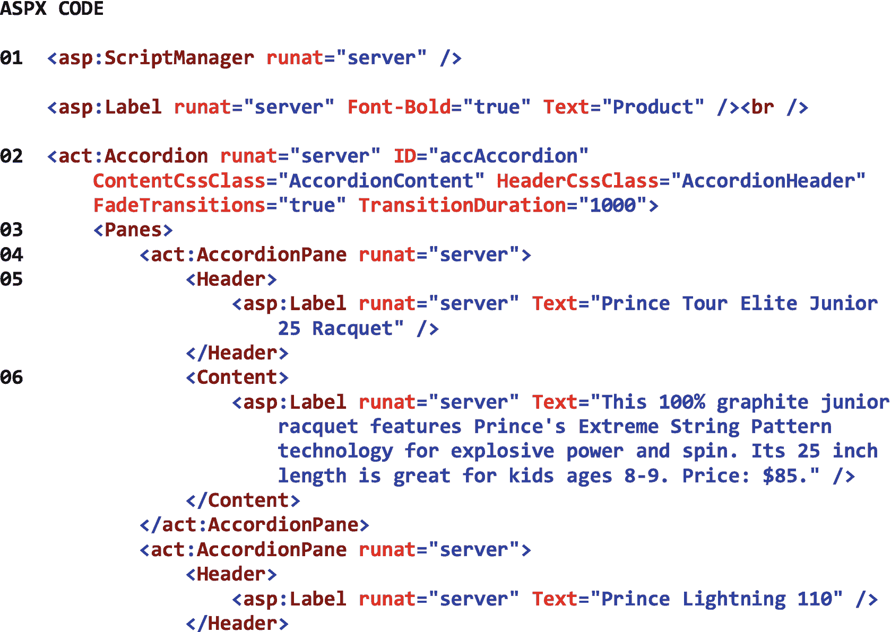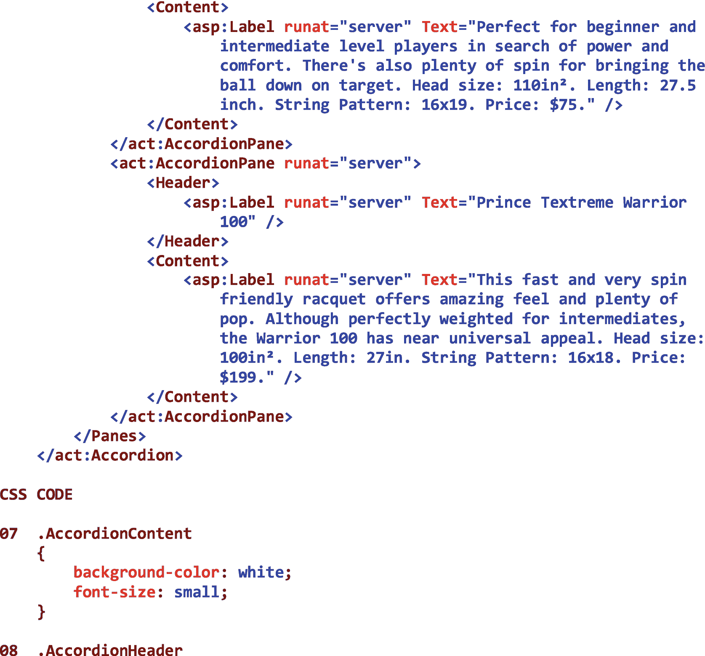T2】

图 25-4

手风琴课的例子

#### 25.4.2.2 Ajax file upload 类

AjaxFileUpload 类显示了一个最终用户可以用来将文件上传到服务器的控件。控件提供的 FileUpload 控件。NET Framework，因为它更加用户友好，异步执行文件上载，并包含更复杂的功能。当选择了要上传的文件时，AjaxFileUpload 控件会将文件临时存储在 Web 服务器硬盘上的一个临时文件夹中。然后，当调用控件的 SaveAs 方法时，该文件被复制到 Web 服务器硬盘上的永久位置(即在代码隐藏中指定的位置)，并且该临时文件从 Web 服务器硬盘上的临时文件夹中删除。

AjaxFileUpload 控件的 AllowedFileTypes 属性指示允许上载的文件类型(由文件扩展名指示)。CssClass 属性指示用于格式化控件的 CSS 类。MaxFileSize 属性指示控件可以上载的文件的最大大小(以千字节为单位)。如果要上载的文件的大小没有限制，则该属性应设置为非正整数。MaximumNumberOfFiles 属性表示一次可以选择和上载的文件的最大数量。SaveAs 方法将上传的文件保存到 Web 服务器硬盘上的永久位置。最后，当文件上载完成时，会引发 UploadComplete 事件。表 [25-5](#Tab5) 显示了 AjaxFileUpload 类的一些属性、方法和事件。

表 25-5

AjaxFileUpload 类的一些属性、方法和事件

<colgroup><col class="tcol1 align-left"> <col class="tcol2 align-left"></colgroup> 
| **类**Ajax file uploadT3】7T5】 |
| 命名空间 NA |
| **属性** |
| 允许的文件类型 | 允许的文件扩展名的逗号分隔列表。默认为空字符串。 |
| 设置一下 | 用于格式化控件的 CSS 类。 |
| 最大值 | 要上传的文件的最大大小，以千字节为单位。非正值表示大小不受限制。默认值为 0。 |
| MaximumNumberOfFiles | 上传队列中文件的最大数量。默认值为 10。 |
| **方法** |
| 保存文件（文件名） | 用指定的文件名保存上传的文件。 |
| **事件** |
| 上传完成 | 文件上载完成时引发的事件。 |
| **参考** |
| [T2`https://ajaxcontroltoolkit.devexpress.com/AjaxFileUpload/AjaxFileUpload.aspx`](https://ajaxcontroltoolkit.devexpress.com/AjaxFileUpload/AjaxFileUpload.aspx) |

图 25-5 显示了 AjaxFileUpload 类的一个例子。

注意 01 处的 ScriptManager 控件，它自动下载异步回发和部分页面呈现所需的 Ajax 脚本。

注意 02 处的 AjaxFileUpload 控件。可以看到，我们已经将控件的 AllowedFileTypes 属性设置为 *gif、jpg、png* 以表明仅。gif，。jpg，还有。允许上传 png 文件。我们还将 CssClass 属性设置为 *AjaxFileUpload* ，以指示用于格式化控件的默认 CSS 类选择器。这个类选择器可以在 06 看到。注意，类选择器也可以包含其他 CSS 格式声明。此外，我们已经将 MaxFileSize 属性设置为 *1000* ，以表明可以上传的最大文件是 1000KB(即 1MB)。我们还将 MaximumNumberOfFiles 属性设置为 *1* 以表明一次只能选择和上传一个文件。最后，我们将 OnUploadComplete 属性设置为 *afuImage_UploadComplete* ，以指示在最终用户选择要上传的文件并单击 *Upload* 按钮后将调用的*事件处理程序方法。*

请注意 03 处的 UploadComplete 事件处理程序方法，该方法将在最终用户选择要上传的文件并单击 *Upload* 按钮后被调用。

请注意，在 04 处，我们正在以编程方式构造要保存到服务器的文件的完整路径。首先，我们使用 HttpRequest 类的 PhysicalApplicationPath 属性来获取应用根目录的物理文件系统路径。使用这个属性允许我们获得应用根目录的路径，而不必对它进行硬编码。这样，如果我们将应用安装在另一台服务器上(或同一台服务器上的不同位置)，应用根目录的路径总是正确的。其次，我们将应用的根目录与其 Images 子目录连接起来。第三，我们将连接的结果与要保存的文件名连接起来。可以看到，要保存的文件名通过 AjaxFileUploadEventArgs 类传递给事件处理程序方法，该类的别名是 e。

请注意，在 05 中，我们使用 AjaxFileUpload 控件的 SaveAs 方法将文件永久保存在服务器上的所需位置。

请注意，在 07，我们在 Web.config 文件的 <system.webserver><handlers>部分添加了对 AjaxFileUploadHandler 的引用。如果我们不在 Web.config 文件中包含这个条目，AjaxFileUpload 控件将不起作用。</handlers></system.webserver>

图中结果部分的第一个屏幕截图显示了选择文件进行上传之前的 AjaxFileUpload 控件。请注意，最终用户可以将文件拖放到控件中，或者通过单击*选择文件*按钮来选择一个文件。点击*选择文件*按钮会出现一个*选择要上传的文件*对话框，最终用户可以用它来定位和选择想要的文件。第二个屏幕截图显示了选择要上传的文件后的控件。请注意，上传现在处于*挂起状态*，控件正在等待最终用户的进一步指示。此时，最终用户可以通过单击*删除*按钮从待定文件列表中删除文件，或者他或她可以通过单击*上传*按钮将文件永久上传到图像文件夹。最后，第三个屏幕截图显示了文件永久上传到 Images 文件夹后的控件。

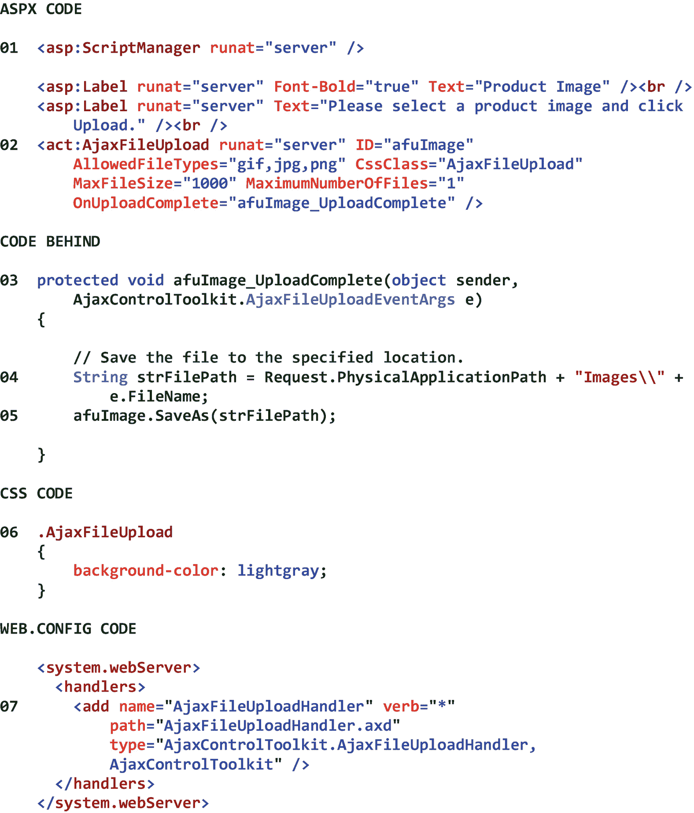 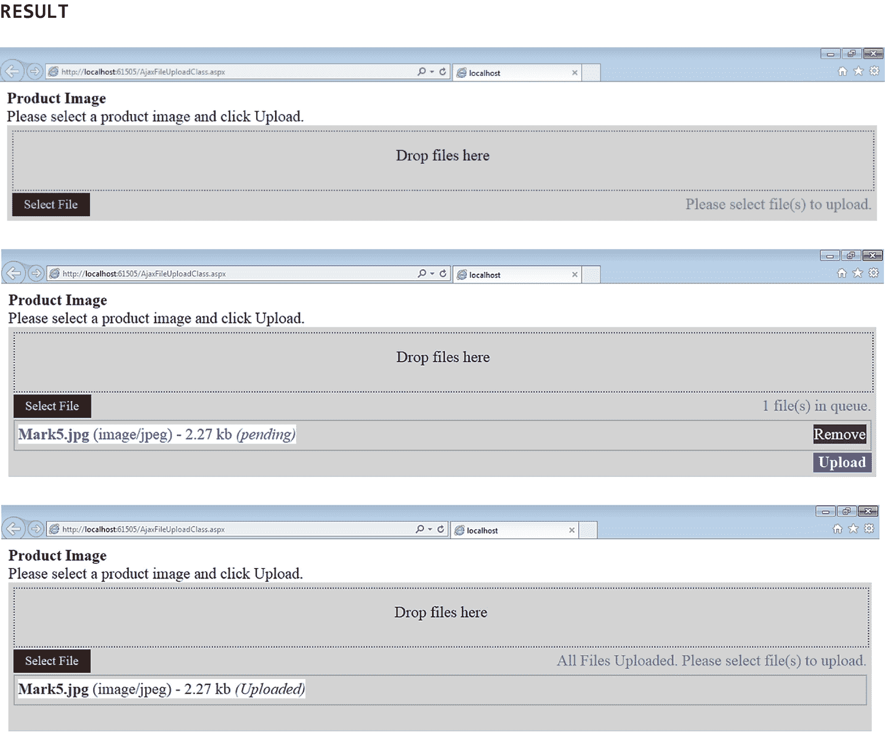

图 25-5

AjaxFileUpload 类的示例

### 控件扩展程序类

Ajax 控件工具包控件扩展程序类用于扩展或增强标准 ASP.NET 服务器控件的行为。这些类包括 BalloonPopupExtender 类、CalendarExtender 类、ModalPopupExtender 类和 PasswordStrength (extender)类。尽管在 Ajax 控件工具包中有比这些更多的控件扩展程序类，我们将把我们的讨论限制在这四个，因为它们将充分说明如何使用这些类来进一步利用异步回发和部分页面呈现。

#### 25.4.3.1 balloon popup extender 级

BalloonPopupExtender 类显示一个图形，最终用户可以使用该图形获取有关标准 ASP.NET 服务器控件的其他信息。BalloonPopupExtender 控件可以包含任何类型的内容，包括文本和图像。BalloonPopupExtender 控件的 BalloonPopupControlID 属性指示包含气球弹出内容的 Panel 控件的 ID。BalloonStyle 属性指示要显示的气球弹出的类型(即，云、自定义或矩形)。DisplayOnMouseOver 属性指示当最终用户悬停在关联的 ASP.NET 服务器控件上时，是否应显示气球弹出窗口。如果该属性设置为 *true* ，当最终用户*悬停在*相关联的服务器控件上时，将显示气球弹出窗口。如果设置为*假*，当最终用户*点击*相关联的服务器控件时，将显示气球弹出窗口。TargetControlID 属性指示 BalloonPopupExtender 控件扩展的 ASP.NET 服务器控件的 ID。最后，UseShadow 属性指示在显示气球弹出窗口时是否显示投影。阴影使气球弹出看起来更有立体感。表 [25-6](#Tab6) 显示了 BalloonPopupExtender 类的一些属性、方法和事件。

表 25-6

BalloonPopupExtender 类的一些属性、方法和事件

<colgroup><col class="tcol1 align-left"> <col class="tcol2 align-left"></colgroup> 
| **级**balloopupextender级 [8](#Fn8) 级 |
| 命名空间 NA |
| **属性** |
| BalloonPopupControlID | 要显示的控件的 ID。 |
| 气球造型 | 指定气球弹出窗口主题的可选设置。默认值是矩形。 |
| DisplayOnMouseOver | 指定是否在客户端 onMouseOver 事件上显示气球弹出的可选设置。默认值为 false。 |
| TargetControlID | 扩展程序扩展的控件的 ID。 |
| 使用阴影 | 指定是否显示气球弹出窗口阴影的可选设置。 |
| **方法** |
| (参见参考文献。) |   |
| **事件** |
| (参见参考文献。) |   |
| **参考** |
| [T2`https://ajaxcontroltoolkit.devexpress.com/BalloonPopup/BalloonPopup.aspx`](https://ajaxcontroltoolkit.devexpress.com/BalloonPopup/BalloonPopup.aspx) |

图 [25-6](#Fig6) 显示了 BalloonPopupExtender 类的一个例子。

注意 01 处的 ScriptManager 控件，它自动下载异步回发和部分页面呈现所需的 Ajax 脚本。

注意 02 处我们正在扩展的 ASP.NET 文本框控件。当最终用户悬停在该文本框上时，将显示气球弹出窗口。

请注意 03 处的 BalloonPopupExtender 控件。可以看到，我们已经将控件的 BalloonPopupControlID 设置为 *panPrice* 来表示包含气球弹出窗口内容的面板控件的 ID。该面板在 04 处示出。还要注意，我们已经将 BalloonStyle 属性设置为*云*，以指示要显示的气球弹出类型。我们还将 DisplayOnMouseOver 属性设置为 *true* ，以表明我们希望当最终用户悬停在相关文本框控件上时显示气球弹出窗口。此外，我们将 TargetControlID 属性设置为 *txtPrice* 以指示 BalloonPopupExtender 控件扩展的 ASP.NET 服务器控件的 ID。最后，我们将 UseShadow 属性设置为 *true* 以表明我们希望气球弹出窗口在显示时包含投影。

请注意 04 处的面板控件。此控件包含当 BalloonPopupExtender 控件可见时将显示的内容。在这种情况下，面板包含一个标签，该标签为最终用户提供了一些关于他或她应该在相关文本框中输入什么的说明。还要注意，我们已经将控件的 CssClass 属性设置为*balloopupextenderpanel*，以指示用于格式化控件的默认 CSS 类选择器。这个类选择器可以在 05 看到。注意，类选择器也可以包含其他 CSS 格式声明。

图中结果部分的截图显示了将鼠标悬停在价格文本框上的结果。请注意，当输入数据需要特定的说明时，气球弹出扩展程序是多么有用。

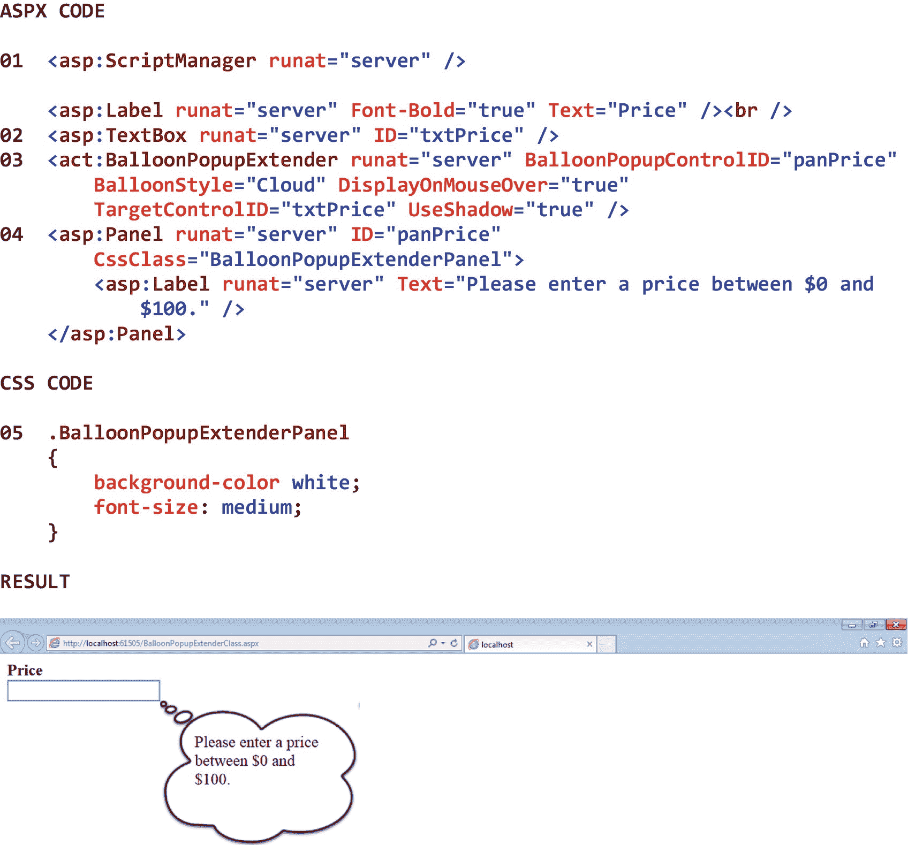

图 25-6

BalloonPopupExtender 类的示例

#### 25.4.3.2 calendar extender 类

CalendarExtender 类显示最终用户可以用来选择日期的月历。CalendarExtender 控件附加到 ASP.NET 文本框控件，从而扩展文本框。就外观而言，一个日历扩展器显示一个包含月份、年份的*标题*部分，以及用于向前和向后移动到上一个月和下一个月的链接，一个包含星期几标题和一组可选日期的*主体*部分，以及一个显示今天日期的*页脚*部分。通过单击控件的标题部分，最终用户可以直接选择其他月份或其他年份。默认情况下，日历扩展程序显示当前年份的当前月份。

Ajax CalendarExtender 控件的外观和行为在许多方面都优于 ASP.NET 日历控件。例如，ASP.NET 日历控件在页面上占用的空间比 Ajax CalendarExtender 控件多得多。而且，与 Ajax CalendarExtender 控件不同，ASP.NET 日历控件*总是*在选择日期时执行自动回发，这在不需要这种行为的时候非常烦人。另一方面，与 ASP.NET 日历控件不同，Ajax CalendarExtender 控件*不能*用于选择日期范围(例如，整周、整月)。

CalendarExtender 控件的 CssClass 属性指示应如何设置该控件的格式。CalendarExtender 控件可通过几个预定义的 CSS 类选择器进行高度自定义。感兴趣的读者应该看看表 [25-7](#Tab7) 底部的参考资料，了解更多关于这些类选择器的信息。FirstDayOfWeek 属性指示哪一天(即星期一、星期二、星期三、星期四、星期五、星期六或星期天)应该显示在日历的最左列中。SelectedDate 属性指示日历扩展程序应初始化到的日期或最终用户选择的日期。TargetControlID 属性指示日历扩展程序扩展的 TextBox 控件的 ID。最后，TodaysDateFormat 属性指示日历扩展程序的页脚部分中显示的日期(即，今天的日期)应如何格式化。表 [25-7](#Tab7) 显示了 CalendarExtender 类的一些属性、方法和事件。

表 25-7

CalendarExtender 类的一些属性、方法和事件

<colgroup><col class="tcol1 align-left"> <col class="tcol2 align-left"></colgroup> 
| **类**calendar extenderT3】9T5】 |
| 命名空间 NA |
| **属性** |
| 设置一下 | 用于格式化控件的 CSS 类。 |
| 可选 | 一周的第一天。默认值是星期日。 |
| 选定日期 | 日历的初始化日期。 |
| TargetControlID | 扩展程序扩展的控件的 ID。 |
| todaysdareformat | 用于显示今天日期的格式字符串。默认值是 MMMM d，yyyy。 |
| **方法** |
| (参见参考文献。) |   |
| **事件** |
| ClientDateSelectionChanged | 选择新日期时执行的脚本。 |
| **参考** |
| [T2`https://ajaxcontroltoolkit.devexpress.com/Calendar/Calendar.aspx`](https://ajaxcontroltoolkit.devexpress.com/Calendar/Calendar.aspx) |

图 [25-7](#Fig7) 显示了 CalendarExtender 类的一个例子。

注意 01 处的 ScriptManager 控件，它自动下载异步回发和部分页面呈现所需的 Ajax 脚本。

注意 02 处我们正在扩展的 ASP.NET 文本框控件。当最终用户单击此文本框时，将显示日历扩展程序，最终用户可以选择日期。

请注意 03 处的 CalendarExtender 控件。可以看出，我们已经将 TargetControlID 属性设置为 *txtDate* ，以指示日历扩展器扩展的文本框控件的 ID。还要注意，我们已经将控件的 CssClass 属性设置为 *CalendarExtender* ，以指示用于格式化控件的默认 CSS 类选择器。这个类选择器可以在 04 处看到。

注意在 04 处， *CalendarExtender* 类选择器已经被定义为一个 *ajax 日历容器*。这表明类选择器包含一个或多个*预定义的*子类选择器(参见表 [25-7](#Tab7) 底部的参考)及其相关的格式声明。

请注意 05 和 06 处的子类选择器分别是 *ajax 日历标题*类选择器(用于格式化日历扩展程序的标题)和 *ajax 日历页脚*类选择器(用于格式化日历扩展程序的页脚)。注意，类选择器也可以包含其他 CSS 格式声明。

图中结果部分的第一个屏幕截图显示了单击订单日期文本框的结果。请注意，日历扩展程序的背景色是浅灰色，而标题和页脚的背景色是深灰色。这些是在 CSS 代码中设置的。还要注意，当前日期是 4 月 17 日，可以在日历扩展程序的页脚看到。第二个屏幕截图显示了选择不同日期—4 月 10 日—的结果。

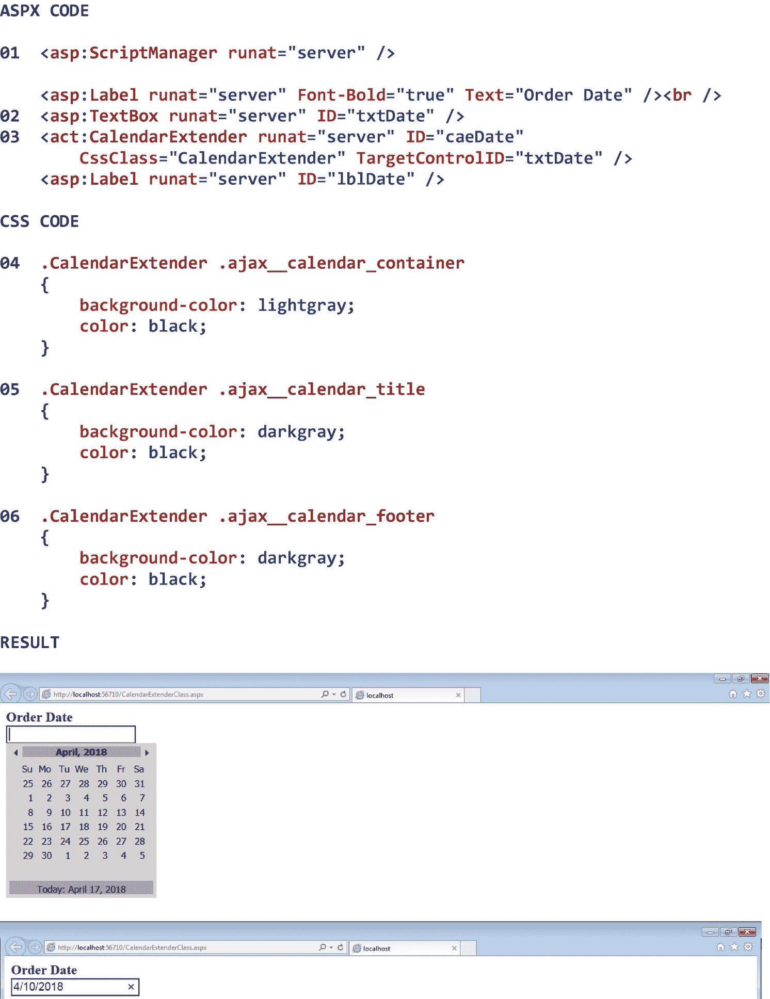

图 25-7

CalendarExtender 类的示例

#### 25.4.3.3 ModalPopupExtender 类

ModalPopupExtender 类显示一个面板，最终用户可以使用该面板来确认消息或做出决定。ModalPopupExtender 控件的行为类似于*模式对话框*，因为它不*也不*允许最终用户与页面的其他部分进行交互，直到他或她关闭模式弹出扩展程序。模式弹出扩展程序总是显示在其关联页面的顶部，并且默认情况下位于页面的中心。单击模式弹出扩展程序上的按钮后，该控件将被关闭，并执行所单击按钮的事件处理程序方法(如果有)来执行所需的处理。ModalPopupExtender 控件可以包含 Panel 控件中允许的任何 ASP.NET 服务器控件。

ModalPopupExtender 控件的 BackgroundCssClass 属性指示应如何设置控件背景的格式。当最终用户将注意力放在模式弹出扩展程序上时，该属性通常用于“灰显”关联的页面。DropShadow 属性指示是否应该将投影添加到模式弹出扩展程序中，以使其看起来更立体。PopupControlID 属性指示要显示的面板的 ID，该面板包含模式弹出扩展程序的内容。最后，TargetControlID 属性指示模式弹出扩展程序扩展的 ASP.NET 服务器控件的 ID。表 [25-8](#Tab8) 显示了 ModalPopupExtender 类的一些属性、方法和事件。

表 25-8

ModalPopupExtender 类的一些属性、方法和事件

<colgroup><col class="tcol1 align-left"> <col class="tcol2 align-left"></colgroup> 
| **类**ModalPopupExtenderT3】10T5】 |
| 命名空间 NA |
| **属性** |
| 背景 CssClass | 显示模式弹出窗口时应用于背景的 CSS 类。 |
| 阴影 | 设置为 True 将自动添加阴影到模式弹出窗口。 |
| PopupControlID | 显示为模式弹出窗口的元素的 ID。 |
| TargetControlID | 扩展程序扩展的控件的 ID。 |
| **方法** |
| (参见参考文献。) |   |
| **事件** |
| (参见参考文献。) |   |
| **参考** |
| [T2`https://ajaxcontroltoolkit.devexpress.com/ModalPopup/ModalPopup.aspx`](https://ajaxcontroltoolkit.devexpress.com/ModalPopup/ModalPopup.aspx) |

图 25-8 显示了一个 ModalPopupExtender 类的例子。

注意 01 处的 ScriptManager 控件，它自动下载异步回发和部分页面呈现所需的 Ajax 脚本。

请注意 02 处我们正在扩展的 ASP.NET 按钮控件。当最终用户单击此按钮时，将显示模式弹出扩展程序，最终用户可以选择一个发货人。

请注意 03 处的 ModalPopupExtender 控件。可以看出，我们已经将控件的 BackgroundCssClass 属性设置为*modalpopuextenderbuction*，以指示用于格式化控件的默认 CSS 类选择器。这个类选择器可以在 07 看到。注意，类选择器也可以包含其他 CSS 格式声明。我们还将 DropShadow 属性设置为 *true* ，以表明我们希望模式弹出扩展程序在显示时包含投影。此外，我们将 PopupControlID 属性设置为 *panSelectShipper* ，以指示包含模式弹出扩展内容的面板控件的 ID。该面板在 04 处示出。最后，我们将 TargetControlID 属性设置为*btnselectshiper*，以指示 ModalPopupExtender 控件扩展的 ASP.NET 服务器控件的 ID。

请注意 04 处的面板控件。此控件包含当 ModalPopupExtender 控件变得可见时将显示的内容。在这种情况下，面板包含一个标签，其中包含一些关于终端用户应该做什么的说明、三个单选按钮和两个按钮。可以看到，我们已经将控件的 CssClass 属性设置为 *ModalPopupExtenderPanel* ，以指示用于格式化控件的默认 CSS 类选择器。这个类选择器可以在 08 看到。注意，类选择器也可以包含其他 CSS 格式声明。

请注意 05 处的事件处理程序方法，当最终用户单击*选择*按钮时会调用该方法。如果最终用户选择了一个发货人，将显示一条消息，指示他或她选择了哪个发货人。如果最终用户没有选择发货人，则会显示相应的消息。

请注意 06 处的事件处理程序方法，当最终用户单击*取消*按钮时会调用该方法。当最终用户点击*取消*按钮时，会显示一条适当的消息。

图中结果部分的第一个屏幕截图显示了在点击*选择发货人*按钮之前的页面。第二个截图显示了点击*选择发货人*按钮并选择模式弹出扩展器上的 *UPS* 选项的结果。最后，第三个屏幕截图显示了单击模式弹出扩展程序上的*选择*按钮的结果。

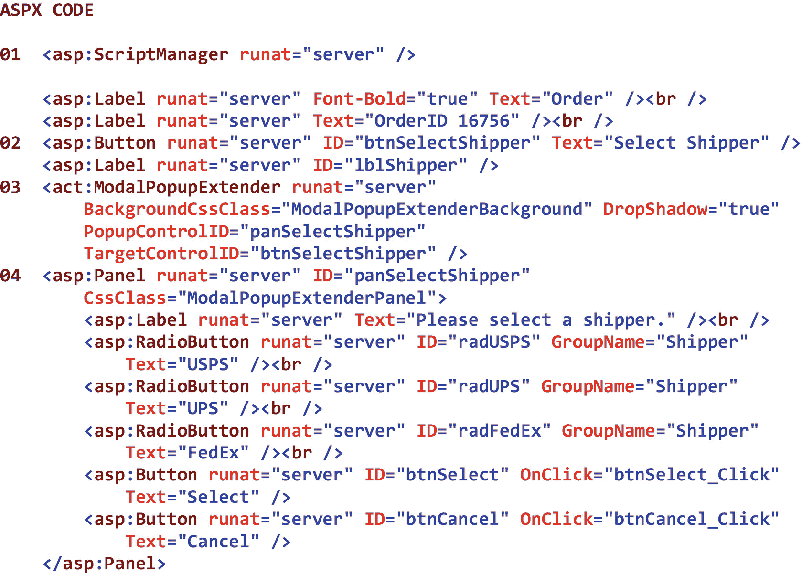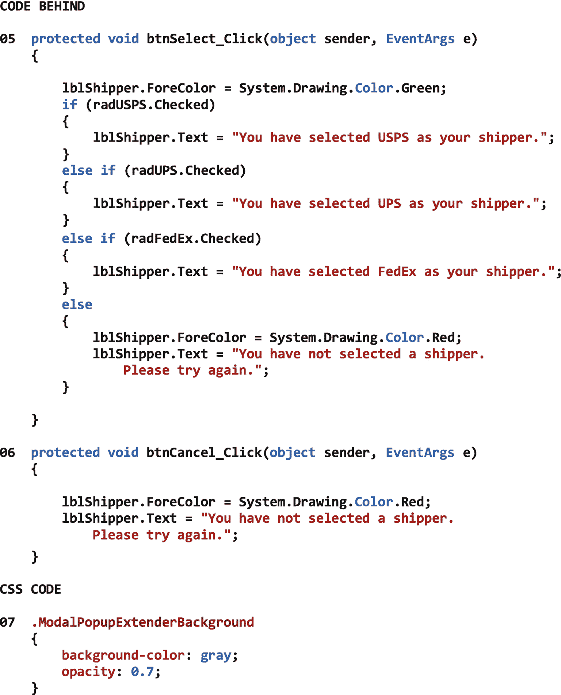T2】

图 25-8

ModalPopupExtender 类的示例

#### 25.4.3.4 密码强度等级

PasswordStrength (extender)类显示在文本框中输入的密码的强度，因此最终用户可以使用它来创建更安全的密码。PasswordStrength 控件扩展了 ASP.NET 文本框控件。我们在 PasswordStrength 控件的属性中定义了密码的强度标准。当最终用户输入密码时，密码强度控件默认显示*不存在*、*非常弱*、*弱*、*差*、*几乎可以*、*勉强可以*、*一般*、*良好*、*强*、*优秀*或*牢不可破*但是，这些说明可以通过控件的 TextStrengthDescriptions 属性进行自定义。

PasswordStrength 类的 DisplayPosition 属性指示 PasswordStrength 控件相对于其扩展的 TextBox 控件应显示在何处(即，左上、右上、左下、右下、左侧或右侧)。MinimumLowerCaseCharacters 属性、MinimumNumericCharacters 属性、MinimumSymbolCharacters 属性和 MinimumUpperCaseCharacters 属性表示完全满足密码的安全要求所需的最少字符数。PreferredPasswordLength 属性表示密码的首选长度。StrengthIndicatorType 属性指示强度指示器是显示文本还是条形指示器。后者需要使用关联的 CSS 类。TargetControlID 属性指示 PasswordStrength 控件扩展的 TextBox 控件的 ID。最后，当 StrengthIndicatorType 属性设置为 *Text* 时，TextCssClass 属性指示用于格式化控件的 CSS 类。表 [25-9](#Tab9) 显示了 PasswordStrength 类的一些属性、方法和事件。

表 25-9

PasswordStrength 类的一些属性、方法和事件

<colgroup><col class="tcol1 align-left"> <col class="tcol2 align-left"></colgroup> 
| **类**通行字强度T3】11T5】 |
| 命名空间 NA |
| **属性** |
| 显示位置 | 强度指示器相对于目标控件的位置。 |
| MinimumLowerCaseCharacters | 当需要混合大小写字符作为密码强度考虑因素的一部分时，所需的最小小写字符数。 |
| MinimumNumericCharacters | 数字字符的最小数量。 |
| MinimumSymbolCharacters 字符 | 符号字符的最小数量(例如，$ ^ *)。 |
| MinimumUpperCaseCharacters | 当需要混合大小写字符作为密码强度考虑因素的一部分时，所需的最小大写字符数。 |
| PreferredPasswordLength | 密码的首选长度。 |
| 强度指示器类型 | 强度指示器类型(文本或指示器)。 |
| TargetControlID | 扩展程序扩展的控件的 ID。 |
| TextCssClass | 当 StrengthIndicatorType=Text 时应用于文本显示的 CSS 类。 |
| 文本强度描述 | 当 StrengthIndicatorType=Text(最少 2 个，最多 10 个；秩序从最弱到最强)。 |
| **方法** |
| (参见参考文献。) |   |
| **事件** |
| (参见参考文献。) |   |
| **参考** |
| [T2`https://ajaxcontroltoolkit.devexpress.com/PasswordStrength/PasswordStrength.aspx`](https://ajaxcontroltoolkit.devexpress.com/PasswordStrength/PasswordStrength.aspx) |

图 25-9 显示了 PasswordStrength 类的一个例子。

注意 01 处的 ScriptManager 控件，它自动下载异步回发和部分页面呈现所需的 Ajax 脚本。

注意 02 处我们正在扩展的 ASP.NET 文本框控件。当最终用户在此文本框中输入密码时，密码强度扩展器将根据指定的密码强度标准显示密码的强度。

请注意 03 处的密码强度控件。可以看到，我们已经将控件的 DisplayPosition 属性设置为右侧的*以指示密码强度消息应该显示在密码文本框的右侧。我们还将 MinimumLowerCaseCharacters 属性、MinimumNumericCharacters 属性、MinimumSymbolCharacters 属性和 MinimumUpperCaseCharacters 属性设置为 *1* ，以指示完全满足密码安全要求所需的这些字符的最小数量。此外，我们将 PreferredPasswordLength 属性设置为 *10* ，以指示密码的首选长度。请注意，这是密码的*首选*长度。密码的长度是由该属性强制的*而不是*。我们还将 StrengthIndicatorType 属性设置为 *Text* ，以表明我们希望强度指示器显示为文本——而不是条形指示器。我们还将 TargetControlID 属性设置为 *txtPassword* ，以指示 PasswordStrength 控件扩展的文本框控件的 ID。最后，我们将 TextCssClass 属性设置为*passwordstrenghtext*，以指示用于格式化控件的默认 CSS 类选择器。这个类选择器可以在 04 处看到。注意，类选择器也可以包含其他 CSS 格式声明。*

图中 Result 部分的屏幕截图显示了输入一个密码的结果，根据我们在 PasswordStrength 控件的属性中设置的标准，该密码被认为是“平均”的。

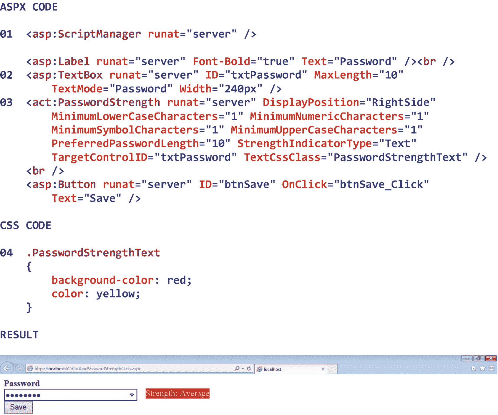

图 25-9

PasswordStrength 类的示例

<aside aria-label="Footnotes" class="FootnoteSection" epub:type="footnotes">Footnotes [1](#Fn1_source)

这可以通过在 Web.config 文件的< system.web >部分将<pages>标记的 maintainScrollPositionOnPostBack 属性设置为 *true* 来避免。</pages>

  [2](#Fn2_source)

所有属性、方法和事件描述都直接取自微软的官方文档。为了节省空间，省略了用于处理该类事件的事件处理程序方法。有关该类的所有方法，请参见参考。

  [3](#Fn3_source)

所有属性、方法和事件描述都直接取自微软的官方文档。为了节省空间，省略了用于处理该类事件的事件处理程序方法。有关该类的所有方法，请参见参考。

  [4](#Fn4_source)

所有属性、方法和事件描述都直接取自微软的官方文档。为了节省空间，省略了用于处理该类事件的事件处理程序方法。有关该类的所有方法，请参见参考。

  [5](#Fn5_source)

Ajax 控件工具包是微软和 ASP.NET Ajax 社区共同努力的结果。该工具包目前由 DevExpress 管理，DevExpress 是一个专门开发 GUI 类的软件组织，包括 ASP.NET 的 Ajax 类。

  [6](#Fn6_source)

有关该类的所有属性、方法和事件，请参见参考。

  [7](#Fn7_source)

有关该类的所有属性、方法和事件，请参见参考。

  [8](#Fn8_source)

有关该类的所有属性、方法和事件，请参见参考。

  [9](#Fn9_source)

有关该类的所有属性、方法和事件，请参见参考。

  [10](#Fn10_source)

有关该类的所有属性、方法和事件，请参见参考。

  [11](#Fn11_source)

有关该类的所有属性、方法和事件，请参见参考。

 </aside>