# 二十六、JavaScript 编程

## 26.1 导言

JavaScript 是一种复杂的、通用的、面向对象的解释编程语言，最初由 Netscape communication s Corporation 开发，用于构建需要*客户端处理*(即发生在浏览器中的处理)的 Web 应用。 <sup>[1](#Fn1)</sup> 另外，JavaScript 是一种*非类型安全编程语言*。这意味着对一个对象的无效操作(例如，将一个字符串值加到一个整数值上)将不会在*设计时*(即，当源代码被解析和编译时)被*检测到，但是将会在*运行时*(即，当操作被执行时)被检测到。然而，在执行过程中出现无效操作之前，JavaScript 将*尝试*将操作的对象(即操作数)转换为与操作兼容的类型，以便操作可以在不导致程序崩溃的情况下执行。例如，操作 x = "abc" + 123 将*而不是*在执行过程中抛出类型错误(从而导致程序崩溃)，即使 *abc* 是一个字符串而 *123* 是一个整数。这是因为 JavaScript 可以(并且将会)在连接发生之前将 *123* 转换成一个字符串。任何熟悉 C、C++、Java 或类似语言的人学习 JavaScript 都不会有什么困难，因为它有熟悉的花括号风格。*

在这一章中，我们将从浏览器兼容性和使用我们期望最终用户使用的所有浏览器来测试我们用 JavaScript 开发的应用的重要性开始。然后我们将讨论*脚本元素*。script 元素包含一个脚本标签(< script >)和一个关联的结束脚本标签(< /script >)，并在. aspx 文件中定义一个包含 JavaScript 代码的区域或指向一个包含 JavaScript 代码的外部文件。接下来，我们将讨论 JavaScript 函数，它包含一个或多个 JavaScript 语句，或者执行一个函数(即返回值的任务)，或者执行一个过程(即*不*返回值的任务)。之后，我们将研究 HTML 文档对象模型。这个模型是 HTML 文档的标准对象模型和应用编程接口，它将允许我们访问在浏览器中呈现的 HTML 元素。最后，我们将看一些 JavaScript 函数的例子。这些例子将说明如何使用 JavaScript 编程语言来执行一些常见的客户端任务。尽管 JavaScript 编程语言还有很多方面我们在本章中不会讨论，但我们将学到足够的东西，让我们对如何使用 JavaScript 执行客户端处理有一个好的感觉。鼓励感兴趣的读者自己更详细地探索 JavaScript 编程语言。

## 26.2 浏览器兼容性

所有现代 Web 浏览器(例如，Internet Explorer、Chrome、Firefox)都允许通过它们自己内置的 JavaScript 解释器来执行 JavaScript 代码。由于给定的网络浏览器有自己的 JavaScript 解释器，它可能支持也可能不支持 *ECMAScript 语言规范*中定义的所有 JavaScript 功能。<sup>[2](#Fn2)</sup>*ECMAScript 语言规范*的目的是在所有 JavaScript 解释器实现中标准化 JavaScript 编程语言。虽然 JavaScript 是最常用的 *ECMAScript 语言规范*的实现，但其他常用的实现还有 JScript(即微软在 Internet Explorer 中使用的 ECMAScript 标准的方言)、V8(即谷歌在 Chrome 中使用的 ECMAScript 标准的方言)、SpiderMonkey(即 Mozilla 在 Firefox 中使用的 ECMAScript 标准的方言)。

由于浏览器兼容性是健壮的 Web 应用的一个重要属性，所以使用我们期望最终用户使用的所有浏览器来彻底测试我们用 JavaScript 开发的应用是很重要的。记住 JavaScript 在不支持脚本的浏览器中不能运行也很重要。它在禁用浏览器脚本的浏览器中也不起作用。因此，我们应该对我们的页面进行编码，以便它们在缺少 JavaScript 提供的特性时仍然可用。确保这一点的一个好技术叫做*渐进增强*。渐进式增强要求我们对应用的页面进行编码，以便它们在没有 JavaScript 的*时能够很好地工作，然后对这些页面进行增强，以便它们在有 JavaScript 的*时能够很好地工作。这样，无论给定的浏览器是否允许执行 JavaScript 代码，使用 JavaScript 的应用都将正常工作。**

## 26.3 脚本元素

脚本元素包含一个脚本标签()。Script 元素或者在. aspx 文件中定义包含 JavaScript 代码的区域，或者指向包含 JavaScript 代码的外部文件(通过在 script 元素的 src 属性中指定的 URL)。虽然在本章中我们将重点讨论前一种方法，但是当在单个 Web 应用或跨多个 Web 应用的许多地方都必须执行 JavaScript 函数或过程时，后一种方法会很有帮助。因此，我们可以编写单个 JavaScript 函数或过程，将其保存在 JavaScript 文件中，然后根据需要调用该函数或过程，而不是编写一段 JavaScript 代码来执行函数或过程，然后将代码复制到许多地方。这样，当需要更改 JavaScript 代码的逻辑时，我们只需要在一个地方进行更改。

图 [26-1](#Fig1) 显示了一个脚本元素的例子。我们很快就会看到，我们将编写的 JavaScript 代码放在了<脚本>标签和相关的</脚本>标签之间。请记住，我们可以将脚本元素放在. aspx 文件中的任何位置。然而，我们的标准做法是将脚本元素放在我们的*底部*。aspx 文件。

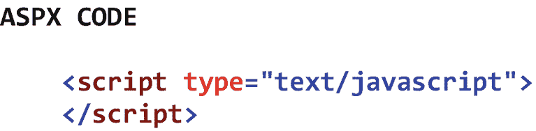

图 26-1

脚本元素的示例

## 26.4 功能

JavaScript 函数包含一个或多个 JavaScript 语句，或者执行一个函数(即返回值的任务)，或者执行一个过程(即*不*返回值的任务)。一个正确构造的 JavaScript 函数以单词 *function* (小写)开头，后面是函数名、左括号、逗号分隔的参数列表(如果有)、右括号、左花括号、一个或多个 JavaScript 语句和右花括号。

当参数实参是一个*原始数据类型*(例如，字符串、整数、小数)时，它通过值传递给*。这意味着参数的*副本*由调用*的*函数传递给被调用*的*函数。因此，如果参数的值在被调用的函数中被修改，那么只有参数的副本被修改。调用函数中的相关参数值保持不变。当参数实参是一个*对象*(即属性和方法的集合)时，它通过引用*传递*。这意味着对象内存位置的*引用*由调用*函数的*传递给被调用*函数的*。在这种情况下，如果对象在被调用的函数中被修改，那么修改也将出现在调用函数中。*

所有在 JavaScript 函数中声明的变量*在范围上都是*局部变量*。因此，它们只能由该函数中的代码访问和/或操作。另一方面，所有在 JavaScript 函数*外声明*的变量在作用域上都是*全局的*。因此，它们可以被任何函数中的代码访问和/或操作。请记住，使用全局变量可能会导致意想不到的结果，因为多个函数可以独立地访问和修改这些变量。因此，通常不鼓励使用全局变量。*

## 26.5 HTML 文档对象模型

HTML 文档对象模型(DOM)是 HTML 文档的对象模型和应用编程接口标准。在这个模型中，页面上的所有 HTML 元素都表示为对象，每个对象都可以包含属性、方法和事件。每当一个 HTML 页面被加载到 Web 浏览器中时，就会创建一个代表该页面及其 HTML 元素集合的 *HTML 文档对象*。正是这个对象的存在允许我们以编程方式*(通过 JavaScript)向页面添加新的 HTML 元素，修改页面上现有的 HTML 元素，以及从页面上删除现有的 HTML 元素。*

 *我们将在本章中大量使用的 HTML 文档对象的方法之一是 *getElementById* 方法。这个方法允许我们通过引用它的唯一 ID 属性来检索页面中的单个 HTML 元素。此方法的调用采用以下形式

```cs
document.getElementById(HTML Element ID)

```

其中 *HTML 元素 ID* 是我们希望通过 JavaScript 在客户端访问和/或操作的 HTML 元素的唯一 ID。

注意，getElementById 方法引用了页面中的一个 HTML 元素。然而，在开发 ASP.NET Web 应用时，我们通常不编码 HTML 元素。相反，我们编写了 ASP.NET 服务器控件的*代码。需要记住的是，在服务器将页面发送回浏览器进行渲染之前，页面上所有 ASP.NET 服务器控件的*都被服务器翻译成等效的 HTML 元素。因此，在浏览器中，没有 ASP.NET 服务器控件本身，只有它们等效的 HTML 元素。因此，问题就变成了:如果只有等价的 HTML 元素驻留在 document 对象中，我们如何通过 JavaScript 中的 ID 属性来引用 ASP.NET 服务器控件？答案是:我们将 ASP.NET 服务器控件的 ClientIDMode 属性设置为 *Static* 。当我们这样做时，当 ASP.NET 服务器控件被转换成它的等效 HTML 元素时，文档对象中的 HTML 元素被赋予与 ASP.NET 服务器控件相同的 ID(例如，ddlState、radBasic、txtLastName)。这使得我们很容易知道我们希望通过 JavaScript 在客户端访问和/或操作的 HTML 元素的名称。**

当我们编写 JavaScript 代码时，重要的是要记住，即使出现最小的语法错误，JavaScript 函数也不会执行(例如，用单词 *Function* 而不是 *function* 声明函数)。这使得 JavaScript 很难调试。因此，在部署包含 JavaScript 的应用之前，仔细编码和测试是非常重要的。

## 26.6 示例

在本章的剩余部分，我们将通过看一些 JavaScript 例子来学习。这些示例将说明如何使用 JavaScript 编程语言来执行一些常见的客户端处理任务。由于 JavaScript 在结构和语法上与 C# 非常相似，因此只需举几个例子来说明这种语言的基础。在接下来的部分中，我们将学习赋值操作、确认对话框和警告消息、控件属性操作、日期和时间显示以及迭代操作。

### 分配操作

在本节中，我们将学习如何为控件属性赋值。图 [26-2](#Fig2) 显示了一个设置运输信息的 JavaScript 函数的例子。

请分别注意 01 和 02 处的 txtBillingLastName 控件和 ddlBillingState 控件。这些控制与被计费人相关联。可以看到，这些控件的 ClientIDMode 属性被设置为 *Static* ，这样我们就可以在 JavaScript 代码中通过它们的 ASP.NET 服务器控件 id 来引用等效的 HTML 元素。

请注意 03 处的 chkSameAsBilling 控件。此控件指示发货信息是否应该与帐单信息相同。可以看到，这个控件的 onClick 属性被设置为 *SetShippingInformation()* 。这是单击 chkSameAsBilling 控件时将执行的 JavaScript 函数的名称。

请分别注意 04 和 05 处的 txtShippingLastName 控件和 ddlShippingState 控件。这些控制与接收货物的人相关联。可以看到，这些控件的 ClientIDMode 属性被设置为 *Static* ，这样我们就可以在 JavaScript 代码中通过它们的 ASP.NET 服务器控件 id 来引用等效的 HTML 元素。

请注意 06 和 20 处的脚本标签及其关联的结束标签。这些标记一起定义了。包含页面 JavaScript 代码的 aspx 文件。

请注意 07 处的 SetShippingInformation 函数，它是在单击 03 处的 chkSameAsBilling 控件时执行的。

请注意，在 08，我们正在检查 chkSameAsBilling 控件是否已被检查。如果已经选中，我们会将发货字段设置为其对应的账单字段。如果没有选中，我们会将 shipping 字段设置为默认值。

请注意，在 09 处，我们将 txtShippingLastName 控件的值设置为 txtBillingLastName 控件的值。

请注意，在第 10 页，我们创建了一个名为 ddlBillingState 的本地对象，并为它分配了同名的 HTML 元素。这将允许我们以速记的形式引用 HTML 元素。

请注意，在第 11 页，我们创建了一个名为 strBillingSelectedValue 的局部变量，并将最终用户选择的计费状态的值赋给它。

请注意，在第 12 页，我们创建了一个名为 strBillingSelectedText 的局部变量，并将最终用户选择的账单状态文本赋给它。

请注意，在 13 处，我们将 ddlShippingState 控件的值设置为 strBillingSelectedValue 变量中的值。

请注意，在 14 处，我们将 ddlShippingState 控件的文本设置为 strBillingSelectedText 变量中的文本。

请注意，在 15 处，我们将 txtShippingLastName 控件的值设置为默认值(即空白)。

请注意，在第 16 页，我们创建了一个名为 ddlShippingState 的本地对象，并为它分配了同名的 HTML 元素。这将允许我们以速记的形式引用 HTML 元素。

请注意，在 17 处，我们将 ddlShippingState 控件的值设置为其默认值(即 IN)。

请注意，在 18 处，我们将 ddlShippingState 控件的文本设置为其默认值(即 Indiana)。

注意在 19 处，我们结束了 JavaScript 函数的执行。

图中结果部分的第一个屏幕截图显示了最终用户输入的账单信息字段。第二个屏幕截图显示了*选中*复选框以使发货信息字段与其对应的账单信息字段相同的结果。第三个屏幕截图显示了*取消选中*复选框将发货信息字段设置回默认值的结果。

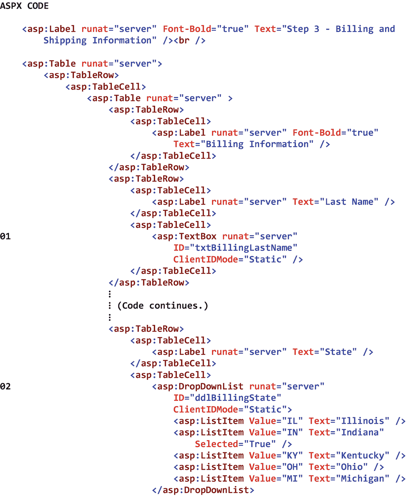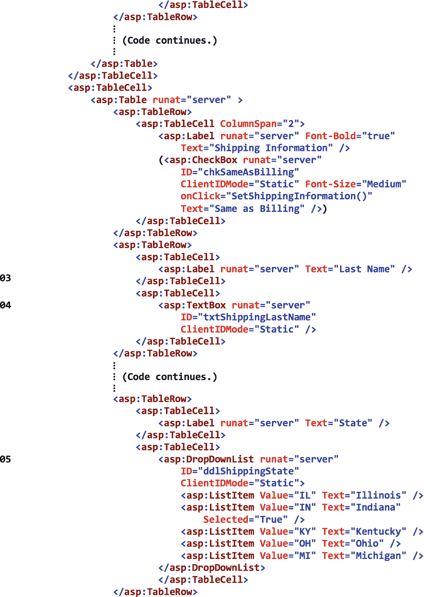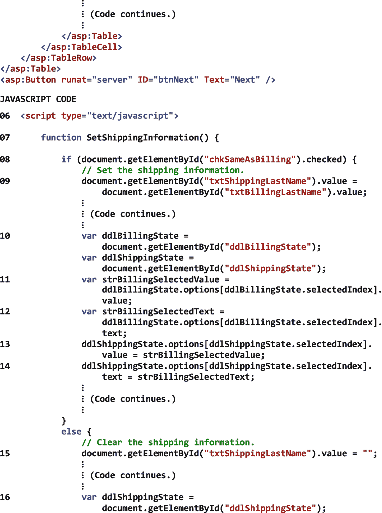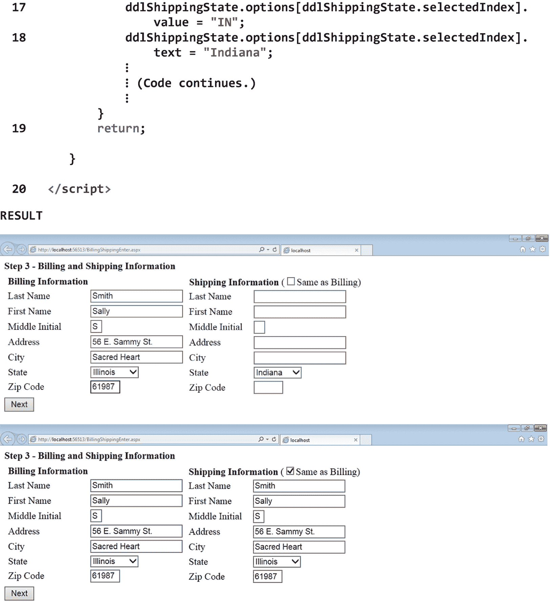T4】

图 26-2

设置运输信息的 JavaScript 函数示例

### 26.6.2 确认对话框和警告信息

在本节中，我们将学习如何显示确认对话框和警告消息。图 [26-3](#Fig3) 显示了一个确认修改电子邮件地址的 JavaScript 函数的例子。

请注意 01 处的 txtEmailAddress 控件，它包含要修改的电子邮件地址。

请注意 02 处的 btnModify 控件。可以看到，这个控件的 ClientIDMode 属性被设置为 *Static* ，这样我们就可以通过 JavaScript 代码中的 ASP.NET 服务器控件 ID 来引用等效的 HTML 元素。我们还可以看到控件的 OnClientClick 属性被设置为*return confirm modification()*。该属性的 *return* 部分表示被调用的 JavaScript 函数将向控件返回值。属性的 *ConfirmModification()* 部分表示单击 btnModify 控件时将执行的 JavaScript 函数的名称。

请注意 03 和 10 处的脚本标签及其关联的结束标签。这些标记一起定义了。包含页面 JavaScript 代码的 aspx 文件。

请注意 04 处的 ConfirmModification 函数，它是在单击 02 处的 btnModify 控件时执行的。

请注意，在 05，我们正在创建一个名为 booConfirm 的局部变量。从这个变量的命名可以看出，这个变量的目的是包含一个布尔值。

请注意，在 06，我们正在显示一个*确认*对话框，然后将*真*(如果最终用户选择确定)或*假*(如果最终用户选择取消)赋给 booConfirm 变量。

请注意 07，我们正在检查最终用户是否选择了“确定”或“取消”。如果他或她选择了确定，我们将显示一条*警告*消息，表明电子邮件地址将被更改。此外，我们将把 *true* 返回给 btnModify 控件，这样页面将被回发到服务器，09 处的代码将被执行。如果最终用户选择了取消，我们将显示一条警告消息，表明电子邮件地址*不会*更改。我们还将向 btnModify 控件返回 *false* ，这样页面将*而不是*被回发到服务器，09 处的代码将*而不是*被执行。

图中结果部分的第一个屏幕截图显示了单击页面上的 Modify 按钮的结果。可以看到，这显示了带有两个选项的确认对话框——确定和取消。第二个屏幕截图显示了在确认对话框中单击 OK 按钮的结果，该对话框显示一条警告消息，说明电子邮件地址将被更改。当单击该对话框上的 OK 按钮时，对话框将被关闭，页面将被回发到服务器，更新电子邮件地址所需的代码将被执行。最后，第三个屏幕截图显示了单击确认对话框上的 Cancel 按钮的结果，其中显示了一条警告消息，说明电子邮件地址*不会*被更改。当点击这个对话框上的 OK 按钮时，对话框将被关闭，但是页面将*而不是*被回发到服务器。因此，更新电子邮件地址所需的代码将*而不是*被执行。

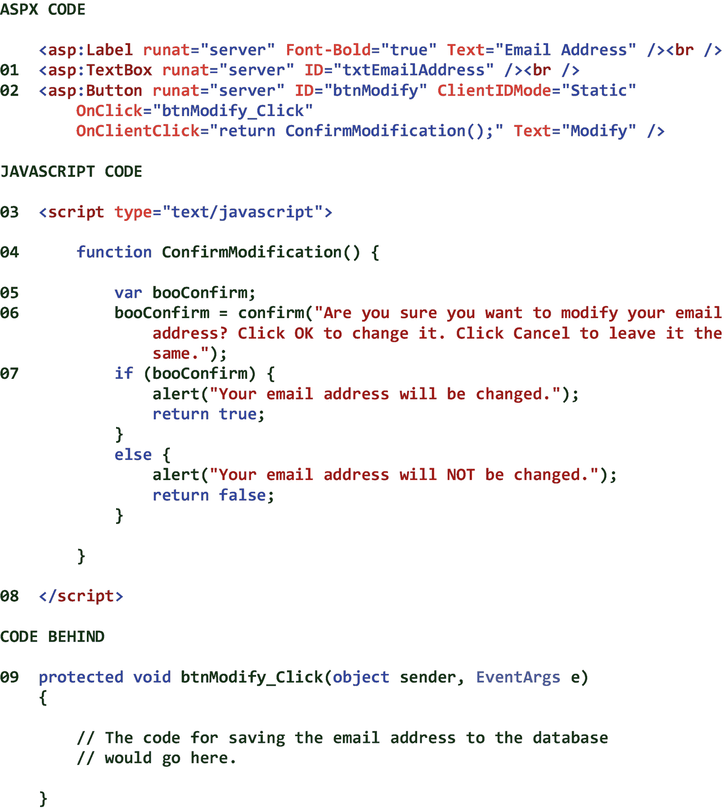 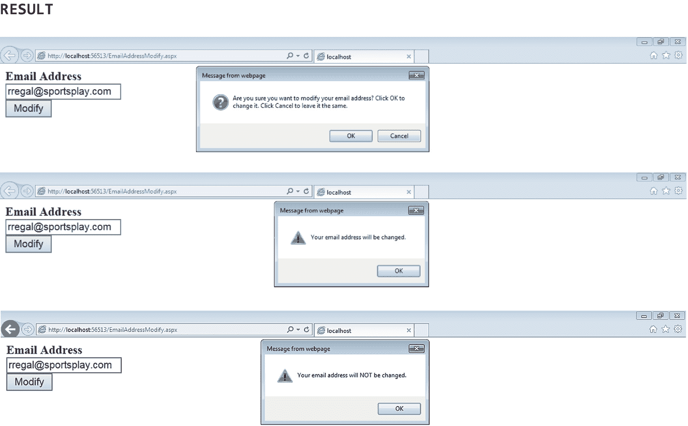

图 26-3

确认电子邮件地址修改的 JavaScript 函数示例

### 控制属性操作

在本节中，我们将学习如何操作控件属性。图 [26-4](#Fig4) 显示了一个选择和取消选择发货人并显示消息的 JavaScript 函数的例子。

注意 01 处的 chkAll 控件。单击此控件时，页面上所有其他复选框都将被选中或取消选中，具体取决于控件的 checked 属性的当前值。还要注意控件的 OnClick 属性被设置为 *CheckAll()* 。这表示单击 chkAll 控件时将执行的 JavaScript 函数的名称。

请注意 02–05 处的 chkFedEx、chkUPS、chkUPS 和 lblMessage 控件。可以看到，这些控件的 ClientIDMode 属性被设置为 *Static* ，这样我们就可以在 JavaScript 代码中通过它们的 ASP.NET 服务器控件 id 来引用等效的 HTML 元素。

请注意 06 和 09 处的脚本标签及其关联的结束标签。这些标记一起定义了。包含页面 JavaScript 代码的 aspx 文件。

请注意 07 处的 chkAll 函数，它是在单击 01 处的 chkAll 控件时执行的。

请注意 08 处，我们正在检查 chkAll 控件是否已检查。如果选中了 chkAll 控件，我们将选中其他三个复选框并禁用它们，以便最终用户无法操作它们。此外，我们正在将 lblMessage 控件的 innerText 属性设置为适当的消息。如果 chkAll 控件是*而不是*选中的，我们将取消选中其他三个复选框并启用它们，以便最终用户可以操作它们。此外，我们正在将 lblMessage 控件的 innerText 属性设置为适当的消息。

图中结果部分的第一个屏幕截图显示了在选择发货人之前的四个复选框控件。第二个截图显示了选中 *Any* 复选框的结果。可以看出，已经检查并禁用了三个发货人，表明应该通过最便宜的发货人发送货物。最后，第三个屏幕截图显示了取消选中 *Any* 复选框并选择两个单独的发货人的结果，表明货物应该通过最便宜的所选发货人发送。

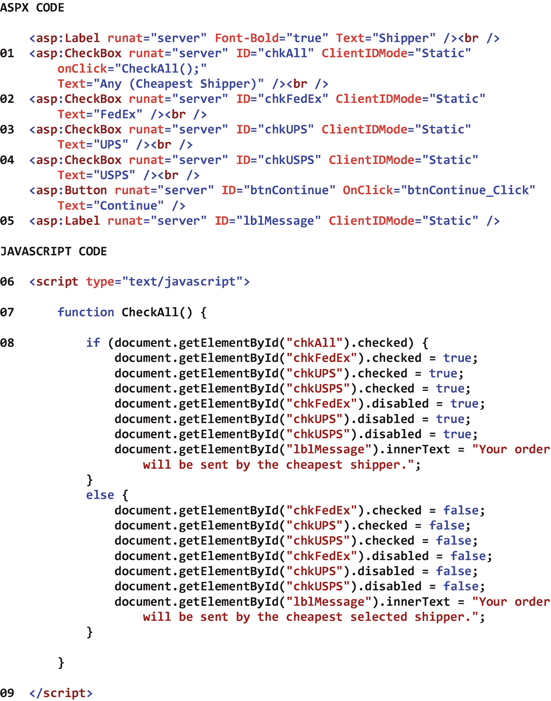 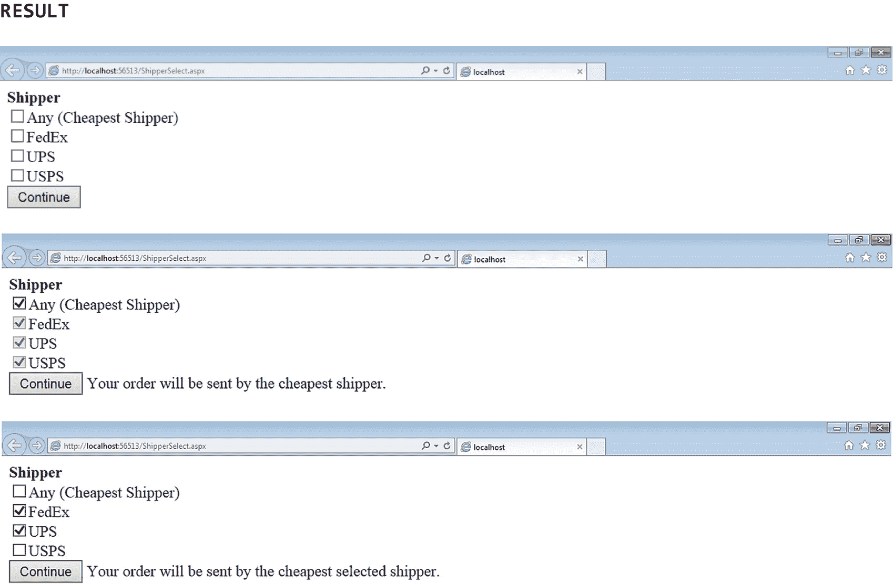

图 26-4

选择和取消选择发货人并显示消息的 JavaScript 函数示例

### 日期和时间显示

在本节中，我们将学习如何显示运行日期和时间。这个日期和时间将显示在一个标签内，并且每秒更新一次。图 [26-5](#Fig5) 显示了一个 JavaScript 函数的例子，它在一个标签中显示运行日期和时间。

注意 01 处的页面的 HTML body 元素。可以看到，这个元素的 onload 属性被设置为 *StartClock()* 。这表示当页面主体加载到浏览器中时将执行的 JavaScript 函数的名称。

请注意 02 处的 lblDateTime 控件。这个控件的 ClientIDMode 属性被设置为 *Static* ，这样我们就可以通过 JavaScript 代码中的 ASP.NET 服务器控件 ID 来引用等效的 HTML 元素。

请注意 03 和 10 处的脚本标签及其关联的结束标签。这些标记一起定义了。包含页面 JavaScript 代码的 aspx 文件。

请注意 04 处的 StartClock 函数，它是在页面主体加载到浏览器中时执行的。

注意在 05，当 StartClock 函数被执行时，我们立即调用了 UpdateClock 函数。这将启动持续更新的日期和时间。

请注意 06 处的 UpdateClock 函数，它显示并更新页面标签中显示的日期和时间。

请注意，在 07 中，我们从 Date 类中创建了一个名为 objDate 的新 Date 对象。请注意，这将自动从客户端的操作系统中检索当前日期和时间。

请注意，在 08，我们从 objDate 对象获取了区分地区(例如，区分语言)的日期和时间，将它们连接起来，并将结果分配给 lblDateTime 控件的 innerText 属性。

请注意，在 09，我们在等待 1，000 毫秒(即 1 秒)后再次调用 UpdateClock 函数。可以看出，这创建了一个无限循环，每秒钟在标签中重新显示一次日期和时间。

图中结果部分的屏幕截图显示了页面上日期/时间标签中显示的日期和时间。如果我们能够实时查看页面，我们将看到每秒钟更新的日期和时间。

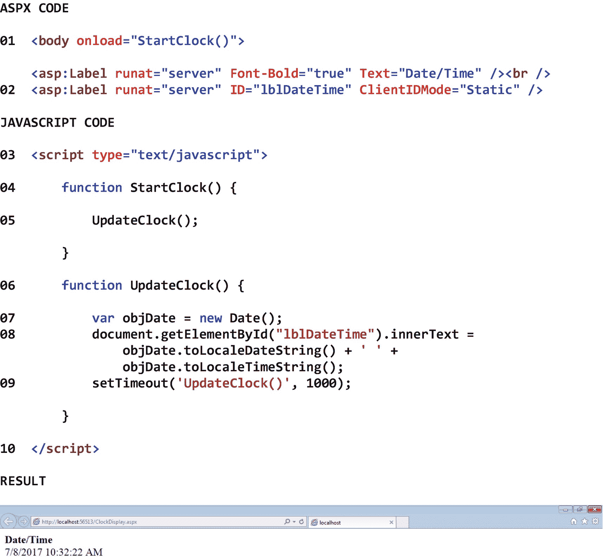

图 26-5

在标签中显示运行日期和时间的 JavaScript 函数示例

### 迭代操作

在本节中，我们将学习如何执行迭代操作(即重复操作、循环操作)。图 [26-6](#Fig6) 显示了一组修改下拉列表中产品信息的 JavaScript 函数的例子。

注意 01 处的页面的 HTML body 元素。可以看到，这个元素的 onload 属性被设置为 *SaveProductOptions()* 。这表示当页面主体加载到浏览器中时将执行的 JavaScript 函数的名称。

请注意 02–04 处的 radBasic、radPlus 和 radDeluxe 控件。当点击这些控件时，05 下拉列表中的项目价格将被修改。请注意，这些控件的 onClick 属性被设置为 *UpdateProductPrice()* 。这表示单击这些控件时将执行的 JavaScript 函数的名称。还要注意的是，*基本*、*加*或*豪华*的参数值被传递给所选单选按钮的功能。还要注意的是，这些控件的 ClientIDMode 属性被设置为 *Static* ，这样我们就可以在 JavaScript 代码中通过它们的 ASP.NET 服务器控件 id 来引用等效的 HTML 元素。

请注意 05 处的 DDL 产品控制。可以看到，该下拉列表中的商品价格将被修改，以反映最终用户对所选套餐的选择— *基本版*、*加*或*豪华版*。

请注意 06 和 11 处的脚本标签及其关联的结束标签。这些标记一起定义了。包含页面 JavaScript 代码的 aspx 文件。

请注意 07 处的 SaveProductOptions 函数，它是在页面主体加载到浏览器中时执行的。在这个函数中，我们从包含三个元素的 array 类创建一个新的 Array 对象。然后，我们将下拉列表中的三个产品选项保存到数组中，以便在必要时(例如，当选择了不同的单选按钮时)可以将它们恢复到原始值。这个函数只被调用一次。

请注意 08 处的 UpdateProductPrice 函数，它是在选择一个单选按钮时执行的。在此功能中，我们使用开关结构来识别最终用户选择的套餐类型—基本、高级或豪华。如果最终用户选择了*基本*包，我们调用 RestoreDropDownListOptions 函数将下拉列表中的选项恢复到它们的初始值。如果最终用户选择了*加*包，我们将调用 RestoreDropDownListOptions 函数将下拉列表中的选项恢复到它们的原始值，定义一个$10 的 upcharge，并使用 upcharge 调用 UpdateDropDownListOptions 函数来增加下拉列表中显示的商品的价格。如果最终用户选择了*豪华*套餐，我们将调用 RestoreDropDownListOptions 函数将下拉列表中的选项恢复到它们的原始值，定义一个$40 的 upcharge，并使用 upcharge 调用 UpdateDropDownListOptions 函数来提高下拉列表中显示的商品的价格。

请注意 09 处的 RestoreDropDownListOptions 函数。在这个函数中，我们遍历数组的元素，将下拉列表中的选项恢复为它们的初始值。

请注意 10 处的 UpdateDropDownListOptions 函数。可以看出，该函数在 08 从 UpdateProductPrice 函数接收一个 upcharge 值。在这个函数中，我们遍历产品下拉列表中的项目，并修改它们的相关价格。在循环中，我们从下拉列表中获取产品，并将其放入一个易于修改的产品字符串中，定位并提取字符串中产品的原始价格，计算产品的新价格并对其进行格式化，用新价格替换旧价格，并用修改后的产品字符串替换下拉列表中的产品。

图中结果部分的第一个截图显示了产品下拉列表，其中选择了*基本*产品包(默认)。第二个屏幕截图显示了单击下拉列表查看产品选项的结果。请注意下拉列表中的选项及其各自的价格。第三张截图显示选择*加*产品包，点击下拉列表查看修改后的产品选项的结果。请注意，下拉列表中的价格增加了 10 美元。最后，第四张截图显示了选择*豪华*产品包并点击下拉列表查看修改后的产品选项的结果。请注意，下拉列表中的价格增加了 40 美元。

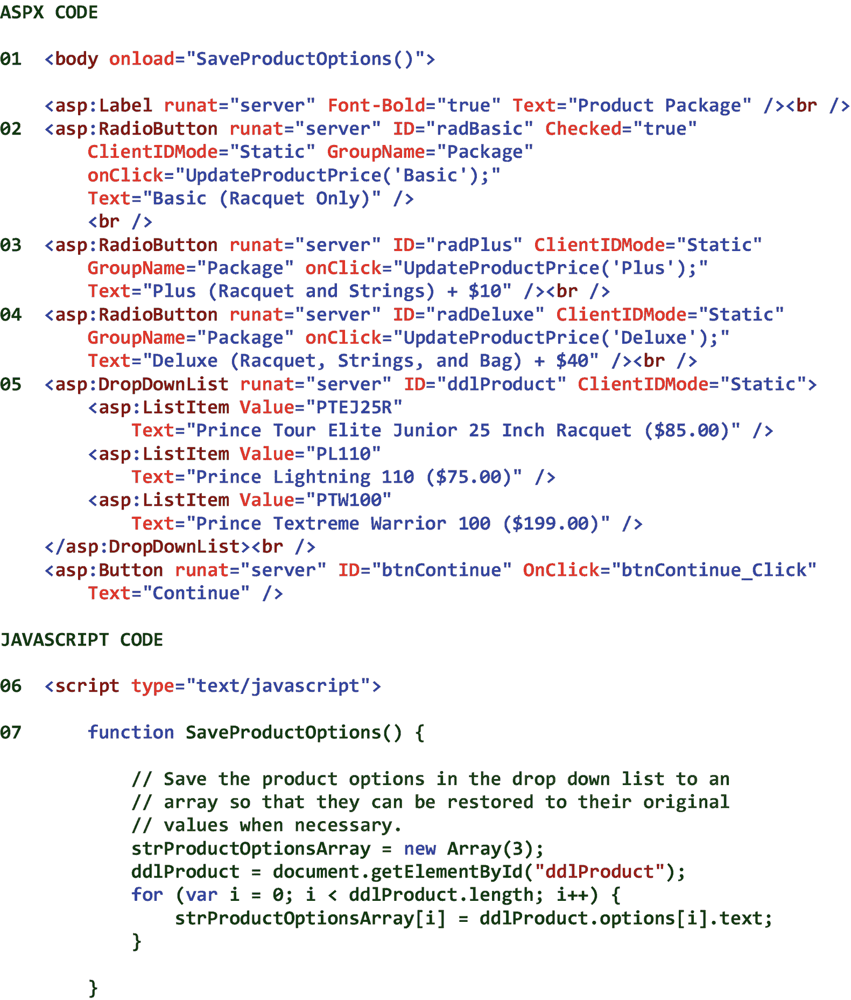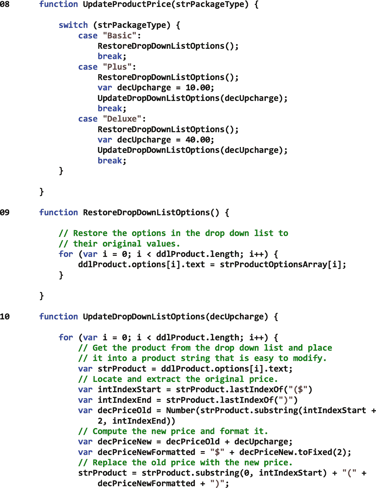T2】

图 26-6

修改下拉列表中产品信息的一组 JavaScript 函数的示例

<aside aria-label="Footnotes" class="FootnoteSection" epub:type="footnotes">Footnotes [1](#Fn1_source)

尽管 JavaScript 最初被设计为只在 Web 浏览器中执行，但现在它可以在 Web 服务器、桌面应用和运行时环境中执行。

  [2](#Fn2_source)

ECMA 代表欧洲计算机制造商协会。

 </aside>*