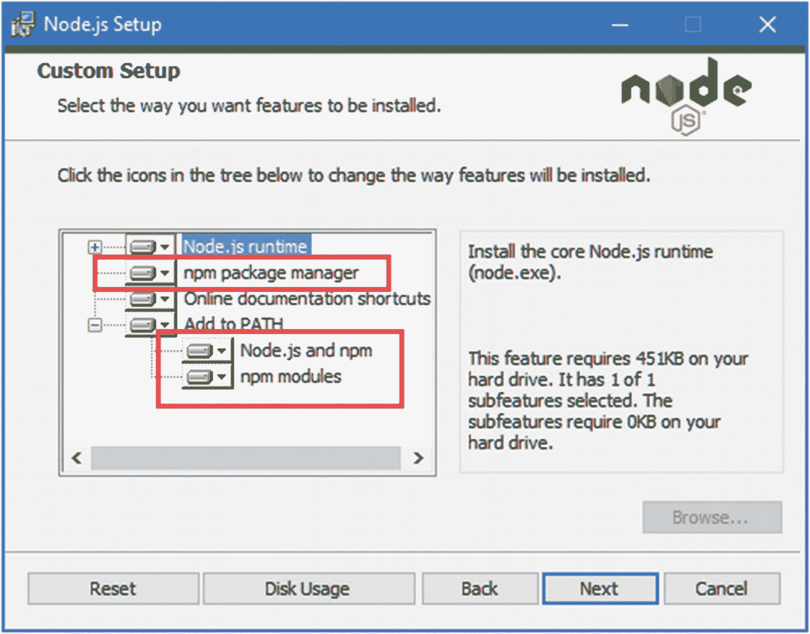
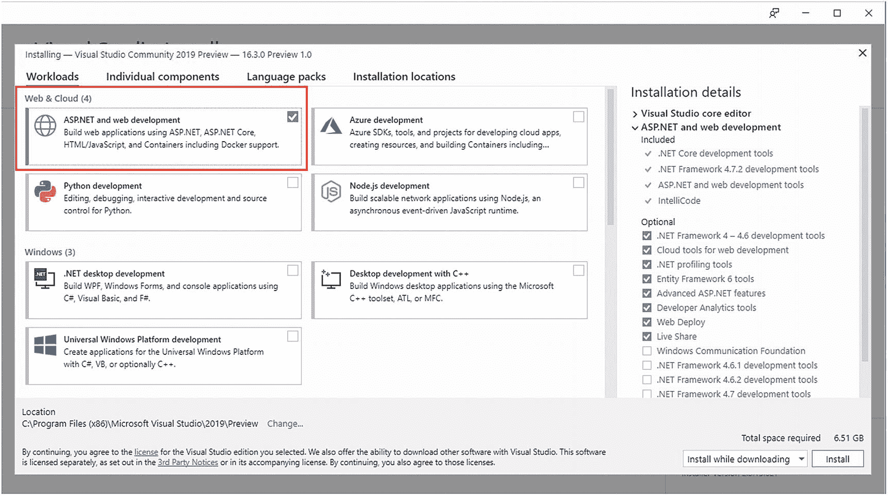
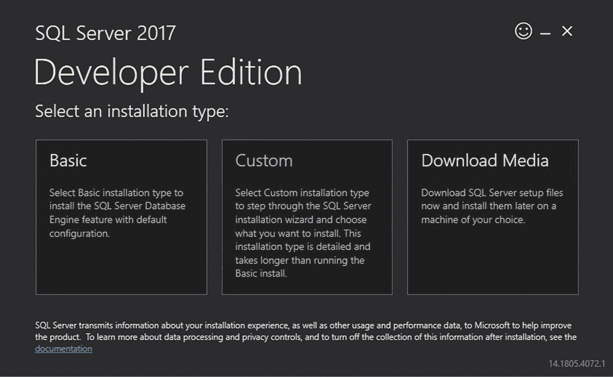
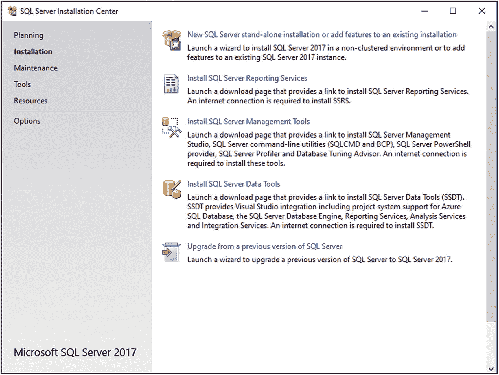
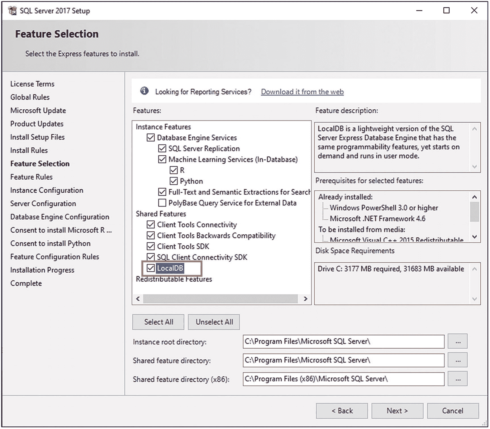
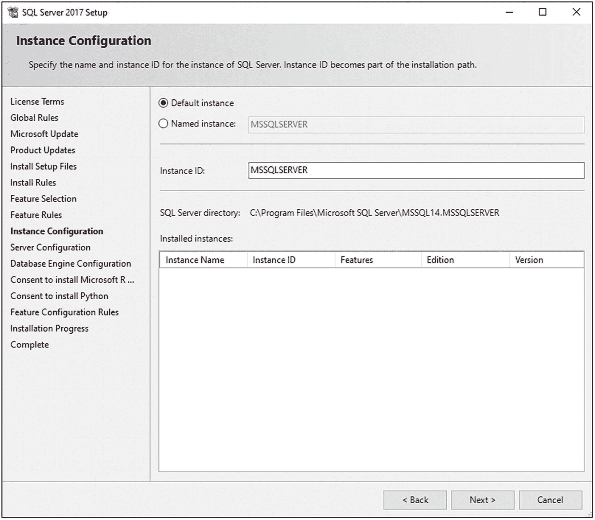

# 二、做好准备

在这一章中，我将解释如何建立 Angular 和 ASP.NET Core MVC 开发所需的工具包。为了快速参考，表 [2-1](#Tab1) 列出了这些包并解释了它们的用途。按照您的首选操作系统的说明安装本书其余部分所需的工具。

### 注意

这本书涵盖了 Windows 上的开发和 Linux 容器的部署。。NET Core 支持 Linux 和 macOS，但是大多数 ASP.NET Core MVC 开发都是在 Windows 上完成的，所以本章和本书其余部分的说明只针对那个平台。

表 2-1。

本书中使用的软件包

<colgroup><col class="tcol1 align-left"> <col class="tcol2 align-left"></colgroup> 
| 

名字

 | 

描述

 |
| --- | --- |
| 可视化工作室 | Visual Studio 是 Windows 专用的 IDE，它为. NET 提供了全功能的开发体验。 |
| Visual Studio 代码 | Visual Studio 代码是一个轻量级 IDE，可以在 Windows、macOS 和 Linux 上使用。它没有提供 Visual Studio 的全部功能；然而，它非常适合 Angular 和 ASP.NET Core MVC 开发，并且是我每天在自己的项目中使用的工具，包括这本书。 |
| 。NET SDK | 的。NET 核心软件开发工具包(SDK)包括。NET 运行时来执行。NET 应用以及构建和测试应用所需的开发工具。 |
| Node.js | Node.js 用于许多客户端开发工具，通过其包管理器 NPM 交付。它用于为浏览器准备 Angular 代码。 |
| 饭桶 | Git 是一个版本控制系统。它被一些常用于客户端开发的 NPM 包所使用。 |

## 做好准备

以下部分描述了 Windows 所需的设置。所使用的所有工具都是免费的，尽管有些工具在商业版本中提供了额外的特性(但是本书中的例子并不需要这些)。

您可以使用 Visual Studio，它是的传统 IDE。NET 项目或 Visual Studio 代码，它提供了一个轻量级的替代方案。Visual Studio 仍然是最受欢迎的选择，但我发现自己逐渐转向 Visual Studio 代码，它更轻、更快，只专注于核心开发任务，没有一些会让 Visual Studio 感觉笨拙的附加功能。

就本书的目的而言，你选择哪一个并不重要。将 Angular 和 ASP.NET Core MVC 结合起来的本质使其适合于使用命令行来处理一些关键的构建工具，如果你习惯于只通过 Visual Studio 来工作，这可能会感到奇怪，但这似乎是 for.NET 的发展方向。

### 正在安装。净核心

那个。NET 核心软件开发工具包包括启动开发项目和执行数据库操作所需的运行时和开发工具。

安装。Windows 上的 NET Core SDK，从 [`https://dotnet.microsoft.com/download/thank-you/dotnet-sdk-3.0.100-windows-x64-installer`](https://dotnet.microsoft.com/download/thank-you/dotnet-sdk-3.0.100-windows-x64-installer) 下载安装程序。此 URL 适用于 64 位。NET Core SDK 版本 3.0.0，这是我在本书中使用的版本，您应该安装它以确保从示例中获得预期的结果。无需键入复杂的 URL，您可以转到 [`https://www.microsoft.com/net/download/core`](https://www.microsoft.com/net/download/core) 并选择 64 位安装程序。NET Core SDK。(微软还发布了一个仅运行时安装程序，但这不包含本书所需的工具。)

运行安装程序；一旦安装过程完成，打开一个新的 PowerShell 命令提示符并运行清单 [2-1](#PC1) 中所示的命令进行检查。网芯在工作。

```cs
dotnet --version

Listing 2-1.Testing .NET Core

```

此命令的输出将显示最新版本的。已安装的. NET 核心运行时。如果您只安装了之前指定的版本，这将是`3.0.100`。

### 安装 Node.js

Node.js 是服务器端 JavaScript 应用的运行时，已经成为开发工具的流行平台。在本书中，Angular 构建工具使用 Node.js 来编译和准备 ASP.NET Core MVC 将发送到浏览器的代码。

重要的是，您下载的 Node.js 版本与我在本书中使用的版本相同。尽管 Node.js 相对稳定，但仍然会不时地出现 API 变化，它们可能会使示例停止工作。要安装 Node.js，从 [`https://nodejs.org/dist/v12.4.0/node-v12.4.0-x64.msi`](https://nodejs.org/dist/v12.4.0/node-v12.4.0-x64.msi) 下载并运行安装程序。这是 12.4.0 版的安装程序。对于您的项目，您可能更喜欢更新的版本，但是对于本书的其余部分，您应该坚持使用 12.4.0 版本。运行安装程序，确保选中“npm 包管理器”选项和两个添加到路径选项，如图 [2-1](#Fig1) 所示。



图 2-1。

在 Windows 上安装 Node.js

NPM 软件包管理器用于下载和安装节点软件包。将 Node.js 添加到路径中可以确保您只需在命令提示符下键入`node`就可以使用 Node.js 运行时。一旦安装完成，打开一个新的命令提示符并运行清单 [2-2](#PC2) 中所示的命令。

```cs
node -v

Listing 2-2.Checking That Node.js Is Installed Correctly

```

您应该会看到下面显示的版本号:`v12.4.0`。

### 安装 Git

从 [`https://git-scm.com/downloads`](https://git-scm.com/downloads) 下载并运行安装程序。当安装完成后，打开一个新的命令提示符并运行清单 [2-3](#PC3) 中的命令来检查 Git 是否已安装并正常工作。

```cs
git --version

Listing 2-3.Checking the Git Install

```

这个命令打印出安装的 Git 包的版本。在撰写本文时，Git for Windows 的最新版本是 2.23.0。

### 正在安装 Visual Studio 2019

Visual Studio 是 ASP.NET Core 和实体框架核心项目的传统开发环境。它提供了一个全功能的开发体验，但是它可能是资源饥渴的。如果您想要一个轻量级的开发体验，可以考虑使用 Visual Studio 代码，这将在下一节中介绍。

从 [`https://www.visualstudio.com/vs`](https://www.visualstudio.com/vs) 下载安装程序。Visual Studio 有不同的版本，但是免费的社区版对于本书中的示例来说已经足够了。

运行安装程序并确保“ASP。NET 与 web 开发”工作负载，如图 [2-2](#Fig2) 所示。该工作负载包含本书所需的所有 Visual Studio 功能。



图 2-2。

选择工作负荷

单击“安装”按钮开始下载和安装 Visual Studio 功能。

### 安装 Visual Studio 代码

Visual Studio 代码是一个轻量级编辑器，不具备完整 Visual Studio 产品的所有功能；然而，它可以跨平台工作，完全能够处理 ASP.NET Core 和 Angular 开发，并且可以用于本书中的示例。

要安装 Visual Studio 代码，请访问 [`http://code.visualstudio.com`](http://code.visualstudio.com) 并单击 Windows 的下载链接。运行安装程序，然后启动 Visual Studio 代码。

本书中的数据库示例需要 LocalDB，它是 SQL Server 的零配置版本，可以作为 SQL Server Express edition 的一部分安装，后者可以从 [`https://www.microsoft.com/en-in/sql-server/sql-server-downloads`](https://www.microsoft.com/en-in/sql-server/sql-server-downloads) 免费使用。下载并运行快速版安装程序，选择自定义选项，如图 [2-3](#Fig3) 所示。



图 2-3。

选择 SQL Server 的安装选项

出现提示时，选择安装新的 SQL Server 实例的选项，如图 [2-4](#Fig4) 所示。



图 2-4。

正在安装 SQL Server

完成安装过程，选择出现的默认选项。当你到达特性选择页面时，确保选择了 LocalDB 选项，如图 [2-5](#Fig5) 所示。



图 2-5。

选择 SQL Server 功能

在实例配置页面，选择“默认实例”选项，如图 [2-6](#Fig6) 所示。



图 2-6。

配置 SQL Server 实例

继续完成安装过程，选择默认值。安装完成后，安装 SQL Server 的最新累积更新。在撰写本文时，最新的更新可从 [`https://support.microsoft.com/en-gb/help/4498951/cumulative-update-15-for-sql-server-2017`](https://support.microsoft.com/en-gb/help/4498951/cumulative-update-15-for-sql-server-2017) 获得，尽管在您阅读本章时可能已经发布了更新的更新或 SQL Server 的更新版本。

### 警告

跳过更新阶段可能很诱人，但是执行这一步以从本书的示例中获得预期的结果是很重要的。例如，SQL Server 的基本安装有一个错误，它阻止 LocalDB 创建数据库文件，这将在您到达第 [3](03.html) 章时导致问题。

## 摘要

在这一章中，我解释了如何安装使用 Angular 和 ASP.NET Core MVC 所需的工具和软件包。在下一章中，我将向您展示如何创建一个将它们结合起来的项目。