# 三、创建项目

在这一章中，我将向你展示如何创建一个包含 ASP.NET Core MVC 和 Angular 应用的项目，这意味着项目的两个部分都可以使用 Visual Studio 或 Visual Studio 代码来开发。这个项目构成了本书其余部分的基础，因为我将解释如何一起使用 Angular 和 ASP.NET Core MVC 来创建一个富 web 应用。表 [3-1](#Tab1) 给出了组合项目的背景。

表 3-1。

将组合项目放在上下文中

<colgroup><col class="tcol1 align-left"> <col class="tcol2 align-left"></colgroup> 
| 

问题

 | 

回答

 |
| --- | --- |
| 这是什么？ | 一个合并的项目在一个文件夹结构中包含了 Angular 和 ASP.NET Core MVC。 |
| 为什么有用？ | 合并后的项目使得使用一个 IDE(如 Visual Studio)开发应用的两个部分变得容易，同时简化了使用 ASP.NET Core MVC web 服务向 Angular 提供数据的过程。 |
| 如何使用？ | 首先创建 Angular 应用，然后是 ASP.NET Core MVC。额外的 NuGet 包用于允许项目的两个部分在运行时一起工作。 |
| 有什么陷阱或限制吗？ | 一个合并的项目使管理开发过程变得更容易，但是你仍然需要 Angular 和 ASP.NET Core MVC 的良好工作知识来创建一个有效的应用。 |
| 有其他选择吗？ | 您可以分别开发应用的 Angular 和 ASP.NET Core MVC 部分，尽管这可能会使开发过程变得复杂。 |

### 小费

你可以从 [`https://github.com/Apress/esntl-angular-for-asp.net-core-mvc-3`](https://github.com/Apress/esntl-angular-for-asp.net-core-mvc-3) 下载本章的完整项目。这也是你可以找到这本书的更新和更正的地方。

## 准备创建项目

有几种不同的方法来创建一个结合 Angular 和 ASP.NET Core MVC 的项目。我在本书中使用的方法依赖于@angular/cli 包，它与。NET 工具来创建一个新的 MVC 项目。

### 使用点网新 Angular 命令

微软提供了一个模板，可以用来创建类似的项目结构(可以通过在命令行运行`dotnet new angular`来使用)。我在本章中使用的过程更加手动，但这意味着您将理解不同的构建模块如何组合在一起，因此当您没有得到预期的结果时，您会有一个更好的想法。

@angular/cli 包提供了一个命令行界面，简化了创建和使用新 angular 项目的过程。在开发过程中，Angular 代码被编译，包被自动交付给浏览器，很容易立即看到更改的效果。

组合开发的关键是通过 ASP.NET Core 运行时利用 Angular 开发工具，允许每个框架与其自己的工具链一起使用。要开始这个过程，打开一个新的 PowerShell 命令提示符并运行清单 [3-1](#PC1) 中的命令来安装@angular/cli 包。

```cs
npm install --global @angular/cli@8.1.2

Listing 3-1.Installing the @angular/cli Package

```

这个命令需要一段时间来运行，因为这个包有许多必须下载和安装的依赖项。

### 小费

你必须严格按照图中所示的步骤进行，不能遗漏任何一步或改变顺序。如果你卡住了，那么你可以从源代码库中下载一个现成的项目，可以在 [`https://github.com/Apress/esntl-angular-for-asp.net-core-mvc-3`](https://github.com/Apress/esntl-angular-for-asp.net-core-mvc-3) 找到。

## 创建项目的 Angular 部分

第一步是创建一个新的 Angular 项目，使用清单 [3-1](#PC1) 中安装的@angular/cli 包来完成。打开一个新的 PowerShell 提示符，导航到一个方便的位置，并运行清单 [3-2](#PC2) 中所示的命令。输入命令时，将所有参数放在同一行。

```cs
ng new SportsStore --directory SportsStore/ClientApp --routing true --style css
--skip-tests true --skip-git true

Listing 3-2.Creating an Angular Project

```

@angular/cli 包提供了`ng`命令，`ng new`创建了一个新的 angular 项目。这个项目被命名为 SportsStore，`--directory`参数指定了项目文件的位置。在 ASP.NET Core MVC 项目中使用 web 应用框架时，通常会使用`ClientApp`文件夹的名称。

`--routing`和`--style`参数将项目配置为使用 URL 路由进行导航，并使用常规 CSS 文件来设计 HTML 元素的样式。`--skipTests`和`--skipGit`参数创建一个没有单元测试和 Git 源代码设置的项目，这两者在本书中都没有使用。

在安装过程中，您可能会看到消息，告诉您可选的依赖项已被跳过。这是正常的，可以忽略。当设置完成时，结果是一个名为`SportsStore/ClientApp`的文件夹，其中包含 Angular 项目的工具和配置文件，以及一些占位符代码，以帮助启动开发并检查开发工具是否正常工作。

### 启动 Angular 开发工具

使用命令提示符运行清单 [3-3](#PC3) 中所示的命令，这些命令导航到项目文件夹并启动 Angular 开发工具。

```cs
cd SportsStore/ClientApp
npm start

Listing 3-3.Starting the Angular Development Tools

```

`npm start`命令启动 Angular 开发工具，这些工具负责生成交付给浏览器执行的 JavaScript 代码。项目准备就绪后，该命令将产生以下输出:

```cs
Hash: 38f7b5c53d9a2dfa3dbd
Time: 9000ms
chunk {main} main.js, main.js.map (main) 11.5 kB [initial] [rendered]
chunk {polyfills} polyfills.js, polyfills.js.map (polyfills) 248 kB [initial] [rendered]
chunk {runtime} runtime.js, runtime.js.map (runtime) 6.08 kB [entry] [rendered]
chunk {styles} styles.js, styles.js.map (styles) 16.4 kB [initial] [rendered]
chunk {vendor} vendor.js, vendor.js.map (vendor) 3.94 MB [initial] [rendered]
** Angular Live Development Server is listening on localhost:4200, open your browser on http://localhost:4200/ **
wdm: Compiled successfully.

```

第一次使用时，开发工具可能需要一些时间来启动和编译项目。一旦显示“编译成功”消息，打开一个新的浏览器窗口并导航到`http://localhost:4200`以查看添加到新 Angular 项目的占位符内容，如图 [3-1](#Fig1) 所示。

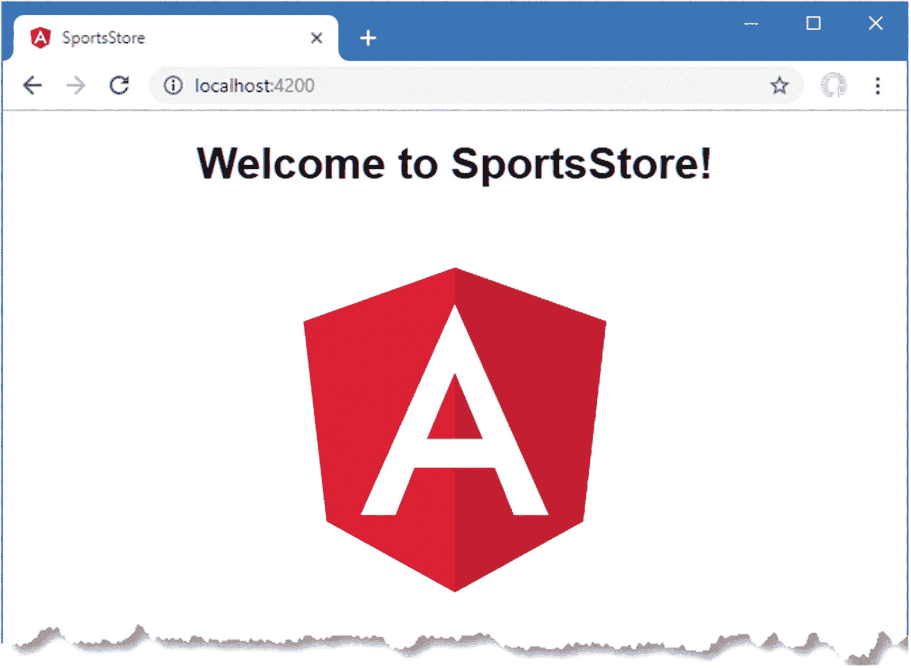

图 3-1。

运行 Angular 开发工具

### 编辑 Angular 项目

如果您使用的是 Visual Studio 代码，您可以通过在 PowerShell 提示符下在`SportsStore`文件夹中运行`code .`(单词*代码*，后跟一个句点)或者通过选择文件➤打开文件夹然后选择`SportsStore`文件夹来编辑项目。

如果您正在使用 Visual Studio，请在 Visual Studio 启动时选择“打开本地文件夹”选项(或者在 Visual Studio 已经运行时选择“文件”“➤”“打开➤文件夹”),然后选择`SportsStore`文件夹。

两个编辑器都会向你展示项目的内容，如图 [3-2](#Fig2) 所示，展示了 Visual Studio 代码和 Visual Studio 呈现的文件视图。

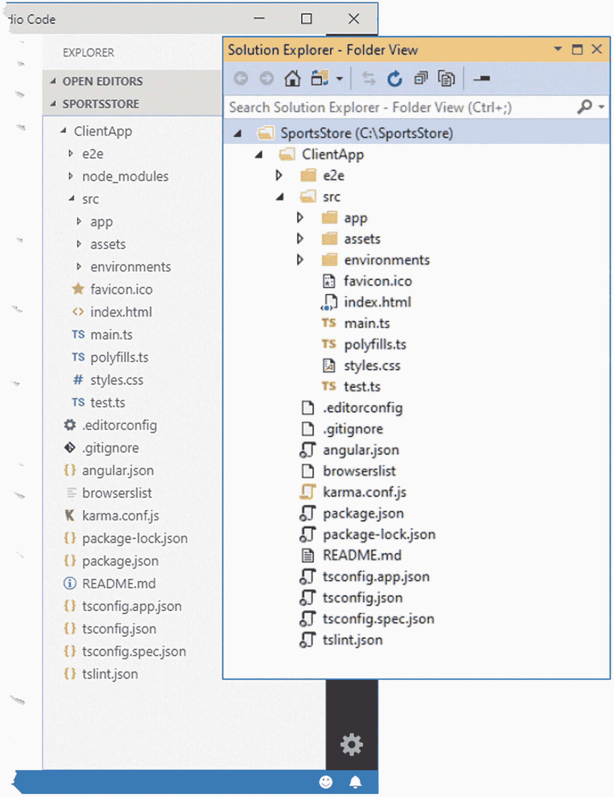

图 3-2。

编辑项目

表 [3-2](#Tab2) 描述了 SportsStore 项目中的关键文件，其中一些文件将在后面的章节中作为添加到示例应用中的功能使用。

表 3-2。

示例项目中的关键文件

<colgroup><col class="tcol1 align-left"> <col class="tcol2 align-left"></colgroup> 
| 

名字

 | 

描述

 |
| --- | --- |
| `ClientApp` | 这是 Angular 项目的根目录。 |
| `ClientApp/src` | 这是应用的目录。 |
| `ClientApp/src/app` | 这是包含 Angular 应用的逻辑和模板的目录，也是大多数 Angular 开发的焦点。 |
| `ClientApp/src/assets` | 该目录包含要包含在应用中的静态内容，例如图像。 |
| `ClientApp/src/environments` | 该目录包含不同开发环境的配置文件。项目是用开发和生产版本的配置创建的。 |
| `ClientApp/src/index.html` | 该文件包含加载应用的 HTML。 |
| `ClientApp/src/main.ts` | 这是 Angular 应用的入口点，这意味着该文件中的语句是应用启动时浏览器执行的语句。 |
| `ClientApp/src/polyfills.ts` | 该文件配置应用使用的 polyfills，它提供对旧浏览器可能不支持的现代 JavaScript 功能的支持。 |
| `ClientApp/src/styles.css` | 该文件定义了应用于整个应用的 CSS 样式。 |
| `ClientApp/angular.json` | 该文件配置 Angular 构建工具。 |
| `ClientApp/package.json` | 该文件跟踪 Angular 项目使用的包，并定义用于启动 Angular 开发工具和创建产品构建的命令。 |
| `ClientApp/tsconfig.json` | 该文件包含 TypeScript 编译器的配置。 |
| `ClientApp/tsconfig.app.json` | 该文件包含 TypeScript 编译器的附加配置设置，这些设置应用于`app`文件夹中的代码。 |

### 了解 Angular 工具链

Angular 开发中使用了三种重要的工具。第一个工具是 TypeScript 编译器，它负责将 TypeScript 代码编译成可由 web 浏览器执行的 JavaScript。

第二个工具是 webpack。TypeScript 编译器为它编译的每个 TypeScript 源文件生成一个 JavaScript 文件。这不是一种分发 web 应用的方便方法，因为每个文件都必须由浏览器请求，从而导致一系列对小代码文件的 HTTP 请求。相反，单独的 JavaScript 文件被组合成包，允许应用通过更少的 HTTP 请求被交付给浏览器。Angular 项目中的包是由 webpack 创建的，webpack 是 web 应用开发中最流行的包，与使用的框架无关(例如，React 和 Vue.js 开发中也使用 web pack)。命令的输出显示了 webpack 为示例项目创建的包；它们在表 [3-3](#Tab3) 中描述。这些是所有 Angular 应用将包含的包。

表 3-3。

示例应用包

<colgroup><col class="tcol1 align-left"> <col class="tcol2 align-left"></colgroup> 
| 

名字

 | 

描述

 |
| --- | --- |
| `main.js` | 这个包包含应用的代码和内容。 |
| `polyfills.js` | 这个包包含在旧浏览器中支持现代 JavaScript 特性的代码。这个包的内容是使用`ClientApp/src/polyfills.ts`文件配置的。 |
| `runtime.js` | 这个包包含加载和解包其他包文件所需的 JavaScript 代码。 |
| `styles.js` | bundler 将应用的 CSS 样式表包含在这个包中，表示为 JavaScript 字符串。该包还包含 JavaScript 代码，用于处理编码字符串，并使用浏览器的 CSS API 将样式添加到 HTML 文档中。 |
| `vendor.js` | 这个包包含 Angular 运行时，它负责处理`main.js`包的内容并将应用呈现给用户。 |

Angular 开发中的第三个重要工具是 Webpack 开发服务器(WDS ),它提供了一个 HTTP 服务器，将应用交付给浏览器。在开发过程中，交付给浏览器的包包含额外的 JavaScript 代码，这些代码打开一个到服务器的连接并等待信号。当检测到对项目文件的更改时，TypeScript 编译器用于编译代码，创建一组新的包，并将信号发送到浏览器以触发重新加载，从而确保更改的效果立即得到反映。图 [3-3](#Fig3) 显示了 Angular 工具链。

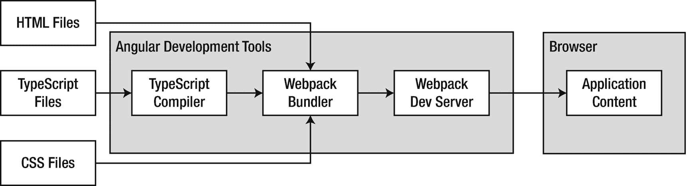

图 3-3。

Angular 开发工具链

要查看运行中的更新过程，用清单 [3-4](#PC5) 中显示的内容替换`ClientApp/src/app`文件夹中的`app.component.html`文件的内容。

```cs
<h2>SportStore</h2>
<span>Angular Content Will Go Here</span>

Listing 3-4.Replacing the Contents of the app.component.html File in the ClientApp/src/app Folder

```

当对`app.component.html`文件的更改被更改时，Angular 工具链响应并产生以下输出:

```cs
Hash: 91ce339c6f84319ad47b - Time: 160ms
4 unchanged chunks
chunk {main} main.js, main.js.map (main) 10.4 kB [initial] [rendered]
wdm: Compiled successfully.

```

使用`npm start`命令时的初始准备可能需要几分钟，但后续的更改会更快，并且 Angular 工具仅重建其内容受更改文件影响的包。在这种情况下，`main.js`包被更新，重新加载信号被发送到浏览器，显示图 [3-4](#Fig4) 中的内容。

### 小费

在开发过程中，为了提高性能，包文件只保存在内存中，不写入磁盘。如第 [13](13.html) 章所示，只有当应用准备好进行部署时，才会创建磁盘文件。

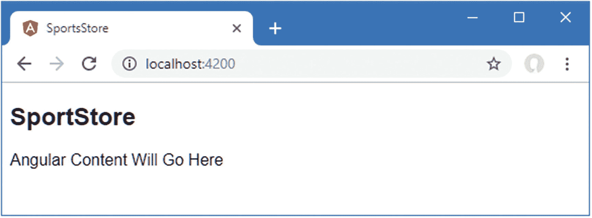

图 3-4。

Angular 项目中已更改文件的效果

一旦您确认了实时更新功能正在运行，请使用 Control+C 停止 Angular 开发工具。

## 创建项目的 ASP.NET Core MVC 部分

一旦 Angular 项目建立起来，下一步就是创建一个 ASP.NET Core 项目。使用 PowerShell 命令提示符运行在`SportsStore`文件夹中的清单 [3-5](#PC7) 中显示的命令。

```cs
mkdir ServerApp
cd ServerApp
dotnet new globaljson --sdk-version 3.0.100

Listing 3-5.Preparing for the ASP.NET Core MVC Project

```

这些命令创建了一个`SportsStore/ServerApp`文件夹，其中将包含 ASP.NET Core MVC 项目。`dotnet new globaljson`命令创建一个名为`global.json`的文件，指定。NET 核心运行时，这将有助于确保这些例子按预期工作。默认情况下，最新版本的。NET Core SDK 用于创建新项目，这可能意味着如果你安装的版本比第 [2](02.html) 章中指定的版本更高，你会得到不一致的结果。

运行`SportsStore/ServerApp`文件夹中清单 [3-6](#PC8) 所示的命令来创建 ASP.NET Core MVC 项目。

```cs
dotnet new mvc --language C# --auth None

Listing 3-6.Creating the ASP.NET Core Project

```

`dotnet new`命令将一个基本的 ASP.NET Core MVC 项目所需的所有文件添加到`SportsStore/ServerApp`文件夹中，与本章前一节创建的 Angular 项目放在一起。Visual Studio 和 Visual Studio 代码都会检测到新文件，并显示在文件列表中，如图 [3-5](#Fig5) 所示。

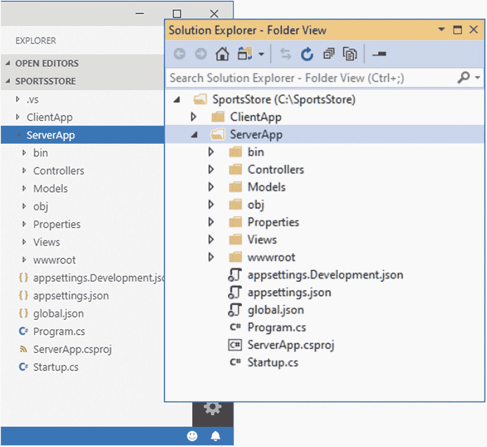

图 3-5。

将 ASP.NET Core MVC 项目添加到 SportsStore 文件夹中

如果您正在使用 Visual Studio 代码，当您打开项目文件夹时，可能会提示您添加 C# 扩展，并且您可能会看到如图 [3-6](#Fig6) 所示的提示。

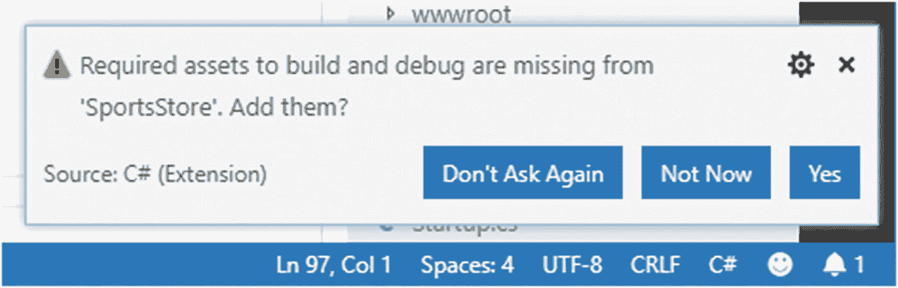

图 3-6。

提示安装 Visual Studio 代码的 C# 扩展

单击“是”按钮，Visual Studio 代码将下载并安装生成和调试 C# 代码所需的工具。Visual Studio 不需要添加任何内容。表 [3-4](#Tab4) 描述了示例 ASP.NET Core MVC 项目中的关键文件。

表 3-4。

示例项目中的关键文件

<colgroup><col class="tcol1 align-left"> <col class="tcol2 align-left"></colgroup> 
| 

名字

 | 

描述

 |
| --- | --- |
| `Controllers` | 该文件夹包含 MVC 控制器，负责接收请求和选择将被呈现以创建响应的视图。 |
| `Models` | 该文件夹包含描述 ASP.NET Core MVC 应用使用的数据的模型类。 |
| `Properties/launchSettings.json` | 该文件包含用于运行 ASP.NET Core MVC 应用的配置设置。 |
| `Views` | 该文件夹包含用于生成 HTML 内容的 Razor 视图。 |
| `wwwroot` | 该文件夹包含 ASP.NET Core MVC 应用使用的静态内容，如 CSS 样式表、图像和 JavaScript 包。 |
| `appsettings.json` | 该文件包含应用的配置设置。 |
| `appsettings.Development.json` | 该文件包含仅在开发过程中使用的附加配置设置。Visual Studio 解决方案资源管理器将该文件嵌套在`appsettings.json`文件中。 |
| `Program.cs` | 这是 ASP.NET Core MVC 应用的入口点，应用启动时会调用这个入口点。 |
| `ServerApp.csproj` | 这是项目文件，用于配置构建过程。该文件被 Visual Studio 隐藏。 |
| `Startup.cs` | 该文件包含在运行时设置 ASP.NET Core 的语句，以及相关的特性，如 MVC 和实体框架核心。 |

### 为 Visual Studio 准备项目

如果您使用的是 Visual Studio 代码，ServerApp 项目将被自动检测并显示在文件窗格中。

如果使用的是 Visual Studio，选择文件➤打开➤项目/解决方案菜单，导航到`SportsStore/ServerApp`文件夹，选择`SportsStore.csproj`文件。Visual Studio 将在中打开该项目。NET 模式，并将隐藏以前在解决方案资源管理器窗口中显示的一些文件。

右键单击解决方案资源管理器窗口顶部的解决方案项，并从弹出菜单中选择添加➤现有网站。导航到`SportsStore`文件夹，选择`ClientApp`文件夹，然后单击打开按钮。Visual Studio 会将`ClientApp`文件夹添加到解决方案资源管理器中，这样你就可以看到 Angular 项目的内容，如图 [3-7](#Fig7) 所示。

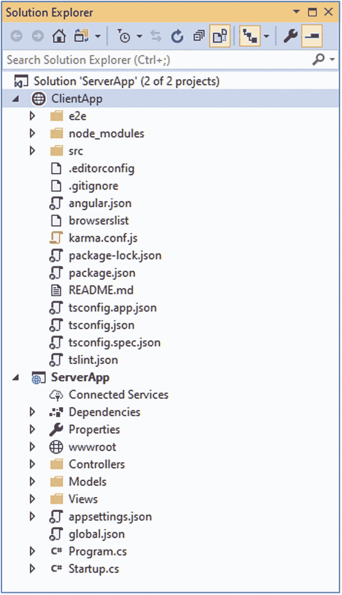

图 3-7。

在 Visual Studio 中打开项目

右键单击 ClientApp 项，从弹出菜单中选择属性页，并导航到构建部分。确保“将网站作为解决方案的一部分”选项未被选中，如图 [3-8](#Fig8) 所示。

### 小费

如果该选项已经被取消选中，再次打开和关闭它，以确保它被禁用。Visual Studio 并不总是正确显示此设置。

此配置更改阻止 Visual Studio 尝试编译 Angular 项目中的代码。

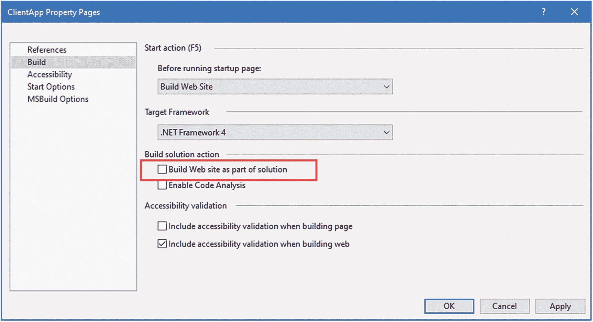

图 3-8。

更改生成配置

选择文件➤全部保存；Visual Studio 将提示您保存解决方案文件，当您想开始一个开发会话时，该文件可用于打开 Angular 和 ASP.NET Core MVC 项目。使用名称`SportsStore.sln`将文件保存在`SportsStore`文件夹中。当需要再次打开项目时，打开`SportsStore.sln`文件；项目的两个部分都将打开并显示在解决方案资源管理器窗口中。

### 准备构建 ASP.NET Core MVC 应用

为了配置在使用 Visual Studio 启动应用时使用的端口，对`ServerApp/Properties`文件夹中的`launchSettings.json`文件进行清单 [3-7](#PC9) 所示的更改。

```cs
{
  "iisSettings": {
    "windowsAuthentication": false,
    "anonymousAuthentication": true,
    "iisExpress": {
      "applicationUrl": "http://localhost:5000",
      "sslPort": 5001
    }
  },
  "profiles": {
    "IIS Express": {
      "commandName": "IISExpress",
      "launchBrowser": true,
      "environmentVariables": {
        "ASPNETCORE_ENVIRONMENT": "Development"
      }
    },
    "SportsStore": {
      "commandName": "Project",
      "launchBrowser": true,
      "applicationUrl": "https://localhost:5001;http://localhost:5000",
      "environmentVariables": {
        "ASPNETCORE_ENVIRONMENT": "Development"
      }
    }
  }
}

Listing 3-7.Changing IIS Ports in the launchSettings.json File in the ServerApp/Properties Folder

```

无论应用是如何启动的，这些更改都可以确保一致性，以便在端口 5000 上接收 HTTP 请求，在端口 5001 上接收 HTTPS 请求。

#### 再生发展 HTTPS 证书

最后的准备步骤是通过运行清单 [3-8](#PC10) 中所示的命令来重新生成开发 HTTPS 证书。对于 Windows 显示的每个提示，选择“是”选项。

```cs
dotnet dev-certs https –clean

dotnet dev-certs https --trust

Listing 3-8.Regenerating the Windows Development Certificates

```

### 构建和运行 ASP.NET Core MVC 应用

项目的 ASP.NET Core MVC 部分可以从命令行或使用代码编辑器进行编译和执行。要从命令行构建并运行项目，运行清单 [3-9](#PC11) 中的命令。

### 小费

如果您想构建项目而不执行它，请使用`dotnet build`命令。

```cs
dotnet watch run

Listing 3-9.Building and Running the ASP.NET Core MVC Project

```

ASP.NET Core MVC 项目将被编译，运行时将启动，产生以下输出:

```cs
...
watch: Started
info: Microsoft.Hosting.Lifetime[0] Now listening on: https://localhost:5001
info: Microsoft.Hosting.Lifetime[0] Now listening on: http://localhost:5000
info: Microsoft.Hosting.Lifetime[0] Application started. Press Ctrl+C to shut down.
info: Microsoft.Hosting.Lifetime[0] Hosting environment: Development
info: Microsoft.Hosting.Lifetime[0] Content root path: C:\SportsStore
...

```

输出报告用于监听 HTTP 和 HTTPS 请求的端口，默认情况下，HTTP 端口为 5000，HTTPS 端口为 5001。打开浏览器窗口并导航至`https://localhost:5001`；您将看到如图 [3-9](#Fig9) 所示的占位符内容。

### 注意

您可能会看到一个安全警告，这是由于用于开发的证书是自签名的而触发的。大多数浏览器会提供一个“高级”选项，允许你继续。如果您收到一个 ERR _ SPDY _ improval _ TRANSPORT _ SECURITY 错误，那么可能的原因是您跳过了清单 [3-8](#PC10) 中的`dotnet dev-certs`命令。

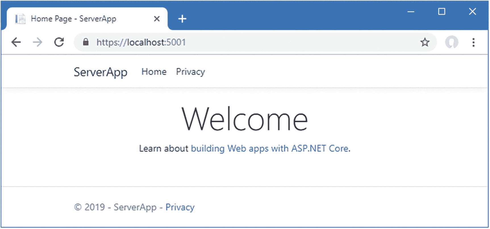

图 3-9。

运行 ASP.NET Core MVC 应用

### 了解 ASP.NET Core MVC 工具链

ASP.NET Core MVC 的开发工具与 Angular 使用的完全不同。C# 编译器处理 C# 代码文件中的语句，并生成可由。NET 核心运行时。当应用启动时，HTTP 请求由互联网信息服务(IIS)或独立的 ASP.NET Core Kestrel 服务器接收，并由 ASP.NET Core 请求管道处理，该管道是 ASP.NET Core 应用的主干，允许 MVC 应用、RESTful web 服务和其他框架在同一应用中共存。

用于创建项目的模板包括 MVC 框架。请求由定义在`ServerApp/Controllers`文件夹中的`Home`控制器处理，它选择`ServerApp/Views/Home`文件夹中的`Index.cshtml`视图文件。MVC 框架使用 Razor 视图引擎来处理视图，生成发送回浏览器并显示给用户的 HTML。图 [3-10](#Fig10) 为工具链。

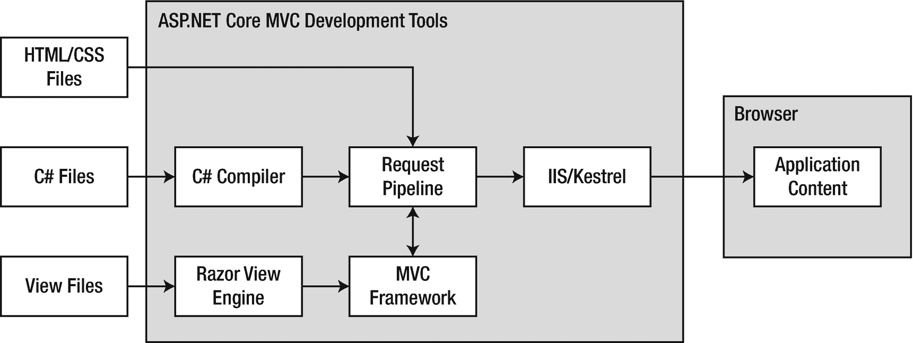

图 3-10。

ASP.NET Core MVC 工具链

请求管道是 ASP.NET Core 的心脏，它是围绕一系列中间件组件构建的，这些中间件组件能够检查请求并修改它们或产生结果。这本书最有趣的中间件集成了 MVC 框架，但几乎每个 ASP.NET Core 功能都在某种程度上依赖于中间件，包括提供静态内容和将 HTTP 请求重定向到 HTTPS URL。

用于启动应用的`dotnet watch run`命令。NET Core 进入监视模式，这样它可以检测到对`ServerApp`文件夹中文件的更改，并自动重新编译代码和重启应用。要查看更新过程，在`ServerApp/Views/Home`文件夹中添加一个名为`Placeholder.cshtml`的文件，内容如清单 [3-10](#PC13) 所示。

### 注意

`dotnet watch run`命令很有用，但是它有局限性，最严重的是它不能检测新文件。在这本书里，我会告诉你什么时候必须使用 Control+C 停止 ASP.NET Core 运行时，然后再启动。

如果您使用的是 Visual Studio，请在解决方案资源管理器中右击 ServerApp/Views/Home 项，并从弹出菜单中选择“添加➤视图”。将视图名称设置为占位符，选择“空(无模型)”模板，忽略其他设置，然后单击“添加”按钮。(添加视图时，您可能需要停止 ASP.NET Core 运行时，因为 Visual Studio 可以尝试构建项目，这需要访问由 ASP.NET Core 锁定的文件。)

如果您使用的是 Visual Studio 代码，右键单击`ServerApp/Views/Home`文件夹，从弹出菜单中选择 New File，并使用`Placeholder.cshtml`作为文件名。

```cs
@{
    ViewData["Title"] = "Placeholder";
}

<h2>SportStore</h2>
<span>ASP.NET Core MVC Content Will Go Here</span>

Listing 3-10.The Contents of the Placeholder.cshtml File in the ServerApp/Views/Home Folder

```

要应用新的视图，更改`ServerApp/Controllers`文件夹中`HomeController.cs`文件的内容，如清单 [3-11](#PC14) 所示。

```cs
using Microsoft.AspNetCore.Mvc;
using ServerApp.Models;
using System.Diagnostics;

namespace ServerApp.Controllers {

    public class HomeController : Controller {

        public IActionResult Index() {
            return View("Placeholder");
        }

        public IActionResult Privacy() {
            return View();
        }

        [ResponseCache(Duration = 0, Location = ResponseCacheLocation.None,
            NoStore = true)]
        public IActionResult Error() {
            return View(new ErrorViewModel { RequestId = Activity.Current?.Id
                ?? HttpContext.TraceIdentifier });
        }
    }
}

Listing 3-11.Using a New View in the HomeController.cs File in the ServerApp/Controllers Folder

```

文件更改将被`dotnet watch`命令检测到，这将停止 ASP.NET Core 运行时，构建项目，并再次启动运行时。与 Angular 不同，需要手动重新加载才能在浏览器中看到更改的效果，如图 [3-11](#Fig11) 所示。

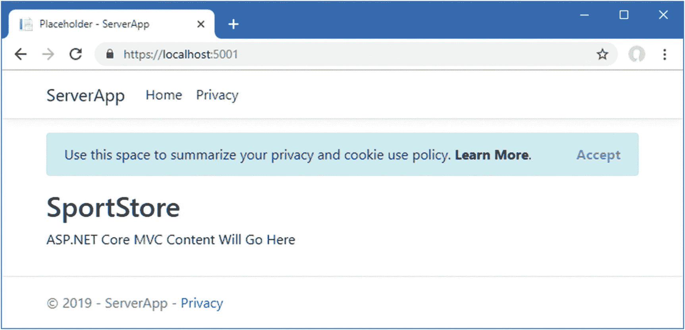

图 3-11。

改变 ASP.NET Core MVC 应用呈现的内容

## 连接 Angular 和 ASP.NET Core 应用

Angular 和 ASP.NET Core MVC 应用共享相同的父文件夹，但没有以任何方式连接。用这种方式开发应用是可能的，但是很笨拙。一个更有用的方法是连接这两个工具链，以便 HTTP 请求被 ASP.NET Core 接收，并被传递给 MVC 框架或基于请求 URL 的 Angular 开发工具。

连接工具链有两种方法，每种方法在项目生命周期的不同阶段都很有用。在接下来的小节中，我将演示这两种方法，并解释每种方法何时有用以及如何在它们之间切换。这两种方法都依赖于额外的。网包。打开一个新的 PowerShell 命令提示符，导航到`SportsStore/ServerApp`文件夹，运行清单 [3-12](#PC15) 中所示的命令。

```cs
dotnet add package Microsoft.AspNetCore.SpaServices.Extensions --version 3.0.0

Listing 3-12.Adding a Package to the ASP.NET Core Project

```

微软提供的`Microsoft.AspNetCore.SpaServices.Extensions`包允许单页应用(SPA)框架，如 Angular，与 ASP.NET Core 一起使用。

### 通过 ASP.NET Core 管理 Angular 服务器

最常用的连接技术是配置 ASP.NET Core 运行时，以便它在收到第一个 HTTP 请求时启动 Angular development server。这样做的好处是只需要一个命令就可以启动两个工具链，这可以通过命令行或使用 Visual Studio 和 Visual Studio 代码提供的内置功能来完成。缺点是重启 ASP.NET Core 也将重启 Angular development server，这意味着每次重启都会重复初始编译过程，每次可能需要 10 到 20 秒。

将清单 [3-13](#PC16) 中所示的代码添加到`Startup`类中，以配置 ASP.NET Core，使其负责管理 Angular development 服务器并根据配置设置选择连接方式。

```cs
using System;
using System.Collections.Generic;
using System.Linq;
using System.Threading.Tasks;
using Microsoft.AspNetCore.Builder;
using Microsoft.AspNetCore.Hosting;
using Microsoft.AspNetCore.HttpsPolicy;
using Microsoft.Extensions.Configuration;
using Microsoft.Extensions.DependencyInjection;
using Microsoft.Extensions.Hosting;

using Microsoft.AspNetCore.SpaServices.AngularCli;

namespace ServerApp {
    public class Startup {

        public Startup(IConfiguration configuration) {
            Configuration = configuration;
        }

        public IConfiguration Configuration { get; }

        public void ConfigureServices(IServiceCollection services) {
            services.AddControllersWithViews();
            services.AddRazorPages();
        }

        public void Configure(IApplicationBuilder app, IWebHostEnvironment env) {
            if (env.IsDevelopment()) {
                app.UseDeveloperExceptionPage();
            } else {
                app.UseExceptionHandler("/Home/Error");
                app.UseHsts();
            }

            app.UseHttpsRedirection();
            app.UseStaticFiles();
            app.UseRouting();
            app.UseAuthorization();

            app.UseEndpoints(endpoints => {
                endpoints.MapControllerRoute(
                    name: "default",
                    pattern: "{controller=Home}/{action=Index}/{id?}");
                endpoints.MapRazorPages();
            });

            app.UseSpa(spa => {
                spa.Options.SourcePath = "../ClientApp";
                spa.UseAngularCliServer("start");
            });
        }
    }
}

Listing 3-13.Configuring the Application in the Startup.cs File in the ServerApp Folder

```

新代码调用`UseSpa`方法向 ASP.NET Core 请求管道添加一个中间件组件。`UseSpa`方法的参数是一个接收配置对象的函数；在此示例中，参数用于指定 Angular 项目的位置，并指定用于启动 Angular 开发工具的 NPM 命令。`UseSpa`方法仅在开发中使用，在第 [13 章](13.html)部署应用之前将被移除。

ASP.NET Core 按照中间件组件被定义的顺序来处理它们，这意味着 Angular development server 将只接收那些没有被其他中间件组件处理的请求，比如那些应用 MVC 框架的组件。

使用 Control+C 来停止 Angular development server 和 ASP.NET Core 运行时，然后使用命令提示符来运行在`ServerApp`文件夹中的清单 [3-14](#PC17) 中显示的命令。

### 小费

您也可以选择“调试➤启动，不调试 Visual Studio 和 Visual Studio 代码”。但是，根据您选择的 IDE，您可能会发现对 C# 类的更改不会触发自动重新编译和重新启动。

```cs
dotnet watch run

Listing 3-14.Starting the Development Servers

```

打开网络浏览器并导航至`https://localhost:5001`；你会看到 MVC 框架生成的内容，如图 [3-12](#Fig12) 第一张截图所示。

接下来，导航到`https://localhost:5001/app`；您将看到 Angular 应用的输出，如图 [3-12](#Fig12) 中的第二个截图所示。

第一个 URL 由 MVC 框架处理，因为默认的 URL 被`Startup`类中的这个语句翻译成对`Home`控制器上的`Index`动作的请求:

```cs
...
app.UseEndpoints(endpoints => {
    endpoints.MapControllerRoute(
        name: "default",
        pattern: "{controller=Home}/{action=Index}/{id?}");
    endpoints.MapRazorPages();
});
...

```

第二个 URL 的`app`段不对应一个 MVC 控制器的名字，所以 MVC 框架不能处理这个请求，然后这个请求被转发到 Angular development server。`/app` URL 没有特殊的意义，任何包含与控制器名称不匹配的段的 URL 都会有同样的效果。(忽略当显示 Angular 应用时，您可能会在浏览器的 JavaScript 控制台中看到的错误。)

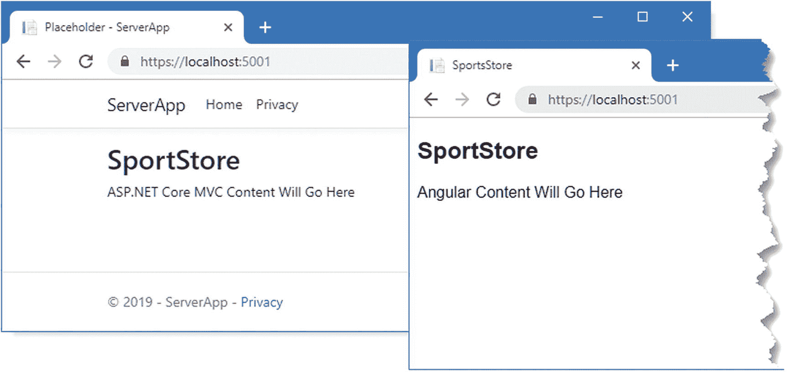

图 3-12。

将请求转发到 Angular development 服务器

在后台，ASP.NET Core 中间件启动 Angular development server，并转发其他中间件组件(如 MVC 框架)不处理的 HTTP 请求，如图 [3-13](#Fig13) 所示。

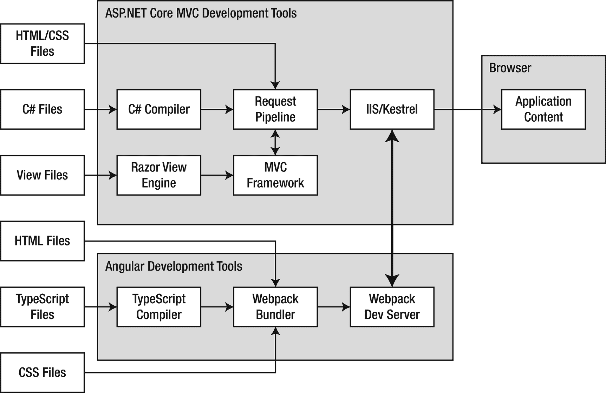

图 3-13。

使用单独的服务器进行开发

每次 ASP.NET Core 运行时重启时，Angular development server 也将重启，直到初始编译阶段完成后才能响应请求。

一旦您请求了这两个 URL，使用 Control+C 来停止 ASP.NET Core 运行时。Angular development 服务器也将被终止。

### 使用 ASP.NET Core MVC 代理特性

另一种连接技术是从 ASP.NET Core 运行时单独启动 Angular 开发工具。请求仍然被转发到 Angular 服务器，但是 ASP.NET Core 运行时不负责启动 Angular 工具。在这种方法中，重启更快，这可以在迭代开发期间创建更平滑的流程。项目的每个部分都独立响应，因此，例如，对 C# 类的更改不会影响 Angular development server。这种方法的缺点是，您需要运行两个命令并监视两个输出流来查看消息和错误。

将清单 [3-15](#PC19) 中所示的语句添加到`Startup`类中，以配置 ASP.NET Core MVC 将请求转发到 Angular development server，以及根据配置设置选择连接技术的语句。

```cs
using System;
using System.Collections.Generic;
using System.Linq;
using System.Threading.Tasks;
using Microsoft.AspNetCore.Builder;
using Microsoft.AspNetCore.Hosting;
using Microsoft.AspNetCore.HttpsPolicy;
using Microsoft.Extensions.Configuration;
using Microsoft.Extensions.DependencyInjection;
using Microsoft.Extensions.Hosting;
using Microsoft.AspNetCore.SpaServices.AngularCli;

namespace ServerApp {
    public class Startup {

        public Startup(IConfiguration configuration) {
            Configuration = configuration;
        }

        public IConfiguration Configuration { get; }

        public void ConfigureServices(IServiceCollection services) {
            services.AddControllersWithViews();
            services.AddRazorPages();
        }

        public void Configure(IApplicationBuilder app, IWebHostEnvironment env) {
            if (env.IsDevelopment()) {
                app.UseDeveloperExceptionPage();
            } else {
                app.UseExceptionHandler("/Home/Error");
                app.UseHsts();
            }

            app.UseHttpsRedirection();
            app.UseStaticFiles();
            app.UseRouting();
            app.UseAuthorization();

            app.UseEndpoints(endpoints => {
                endpoints.MapControllerRoute(
                    name: "default",
                    pattern: "{controller=Home}/{action=Index}/{id?}");
                endpoints.MapRazorPages();
            });

            app.UseSpa(spa => {
                string strategy = Configuration
                    .GetValue<string>("DevTools:ConnectionStrategy");
                if (strategy == "proxy") {
                    spa.UseProxyToSpaDevelopmentServer("http://127.0.0.1:4200");
                } else if (strategy == "managed") {
                    spa.Options.SourcePath = "../ClientApp";
                    spa.UseAngularCliServer("start");
                }
            });
        }
    }
}

Listing 3-15.Configuring the Application in the Startup.cs File in the ServerApp Folder

```

`Configuration`对象用于读取`DevTools`部分中`ConnectionStrategy`的值。如果设置为`managed`，则使用上一节的技术。如果设置是`proxy`，那么`UseSpa`方法用于指定 Angular 服务器的 URL 作为`UseProxyToSpaDevelopmentServer`方法的参数。

要选择管理选项，将清单 [3-16](#PC20) 中所示的配置设置添加到`appsettings.Development.json`文件中。(如果您使用的是 Visual Studio，可以通过在解决方案资源管理器窗口中展开`appsettings.json`文件项来访问该文件。)

```cs
{
  "Logging": {
    "LogLevel": {
      "Default": "Debug",
      "System": "Information",
      "Microsoft": "Information"
    }
  },
  "DevTools": {
      "ConnectionStrategy": "proxy"
  }
}

Listing 3-16.Adding Configuration Settings in the appsettings.Development.json File in the ServerApp Folder

```

要启动 Angular development server，打开一个新的 PowerShell 命令提示符，导航到`SportsStore/ClientApp`文件夹，并运行清单 [3-17](#PC21) 中所示的命令。

```cs
npm start

Listing 3-17.Starting the Angular Development Server

```

要启动 ASP.NET Core 服务器，打开第二个 PowerShell 提示符，导航到`SportsStore/ServerApp`文件夹，运行清单 [3-18](#PC22) 中所示的命令。

```cs
dotnet watch run

Listing 3-18.Starting the ASP.NET Core Server

```

一旦两个服务器都在运行，打开一个新的浏览器，导航到`https://localhost:5001`，然后是`https://localhost:5001/app`。您将看到与上一节相同的结果，因为请求是以相同的方式转发的。不同的是，Angular 服务器是独立启动的。

### 更新控制器、视图和布局

当 ASP.NET Core 无法处理请求时，它会被转发到 Angular development 服务器。如果请求 URL 没有指定其中一个包文件或来自`assets`文件夹的文件，Angular development server 会返回`ClientApp/src`文件夹中的`index.html`文件，静态内容通常存储在独立的 Angular 项目中。

为了增加 Angular 和 MVC 框架之间的集成，我将更新默认的 Razor 布局和`Views/Home/Index`视图，以便 Angular 服务器只交付包文件。首先，用清单 [3-19](#PC23) 中所示的元素替换`ServerApp/Views/Shared`文件夹中`_Layout.cshtml`文件的内容。

```cs
<!DOCTYPE html>
<html lang="en">
<head>
    <base href="/">
    <meta charset="utf-8" />
    <meta name="viewport" content="width=device-width, initial-scale=1.0" />
    <title>SportsStore</title>
    <link rel="stylesheet" href="~/lib/bootstrap/dist/css/bootstrap.css" />
</head>
<body>
    <h2 class="bg-dark text-white p-2">SportStore</h2>
    @RenderBody()
    @RenderSection("Scripts", required: false)
</body>
</html>

Listing 3-19.Replacing the Contents of the _Layout.cshtml File in the ServerApp/Views/Shared Folder

```

该布局包括 Bootstrap CSS 样式表，我将在本书中使用它来设计 HTML 元素的样式(Bootstrap 是通过用于创建项目的`dotnet new`命令添加到项目中的)。主体部分和`script`元件将包含 Angular 应用包。为了提供应用所需的内容和`script`元素，将`ServerApp/Views/Home`文件夹中的`Index.cshtml`文件的内容替换为清单 [3-20](#PC24) 中所示的元素。

```cs
@section scripts {
    <script src="runtime.js"></script>
    <script src="polyfills.js"></script>
    <script src="styles.js"></script>
    <script src="vendor.js"></script>
    <script src="main.js"></script>
}

<app-root></app-root>

Listing 3-20.Replacing the Contents of the Index.cshtml File in the ServerApp/Views/Home Folder

```

`scripts`部分包括表 [3-3](#Tab3) 中描述的每个包文件的`script`元素。`app-root`元素是应用运行时 Angular 应用的内容将被插入的目标。为了确保使用新视图，更改`Home`控制器上的`Index`动作，如清单 [3-21](#PC25) 所示。

```cs
using Microsoft.AspNetCore.Mvc;
using ServerApp.Models;
using System.Diagnostics;

namespace ServerApp.Controllers {

    public class HomeController : Controller {

        public IActionResult Index() {
            return View();
        }

        public IActionResult Privacy() {
            return View();
        }

        [ResponseCache(Duration = 0, Location = ResponseCacheLocation.None,
            NoStore = true)]
        public IActionResult Error() {
            return View(new ErrorViewModel { RequestId = Activity.Current?.Id
                ?? HttpContext.TraceIdentifier });
        }
    }
}

Listing 3-21.Using a Different View in the HomeController.cs File in the ServerApp/Controllers Folder

```

保存更改，允许 ASP.NET Core 运行时重新启动，并使用浏览器导航到`https://localhost:5001`。你会看到 Razor 视图已经包含了显示 Angular 应用所需的元素和包文件，如图 [3-14](#Fig14) 所示。

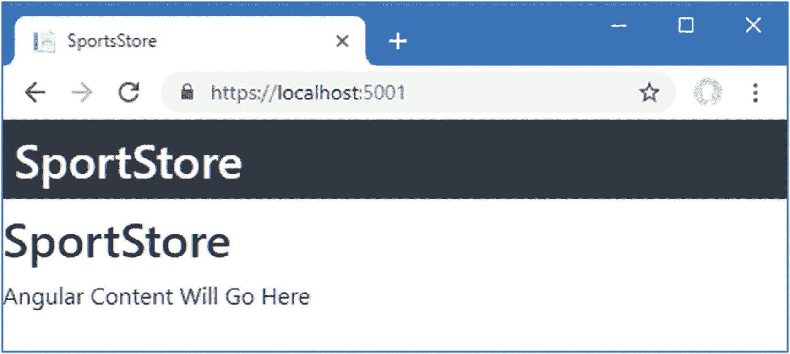

图 3-14。

使用 Razor 视图显示应用

## 摘要

在这一章中，我向你展示了如何创建一个结合 Angular 和 ASP.NET Core MVC 的项目。这个过程有点复杂，但结果是一个坚实的基础，允许应用的 Angular 和 MVC 部分一起工作，同时保留它们各自使用的工具链。在下一章中，我将开始数据模型的工作，它将支撑 ASP.NET Core MVC 和项目的 Angular 部分。