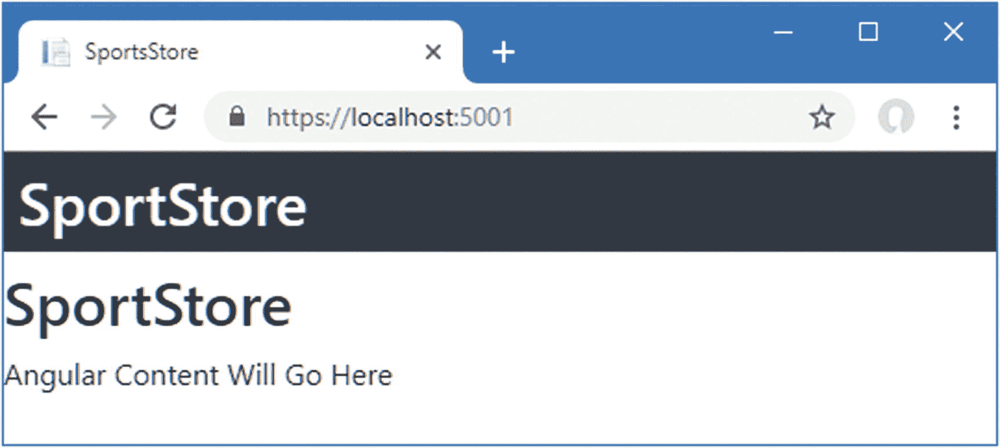
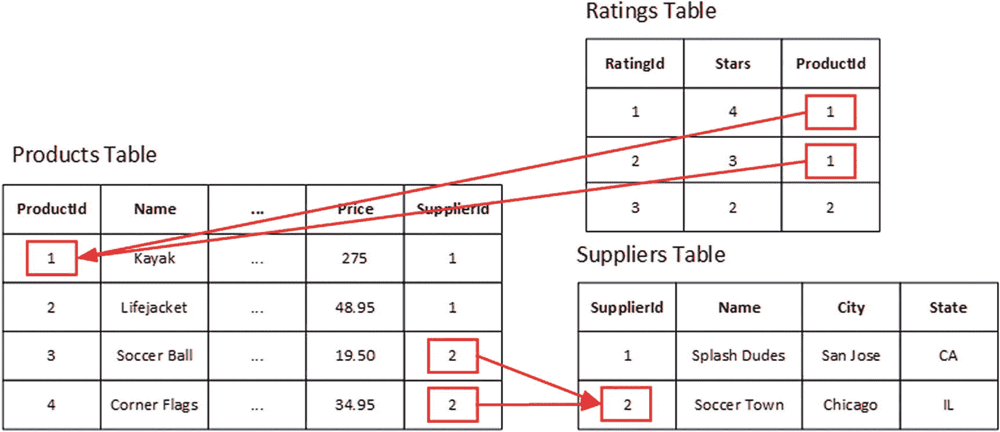
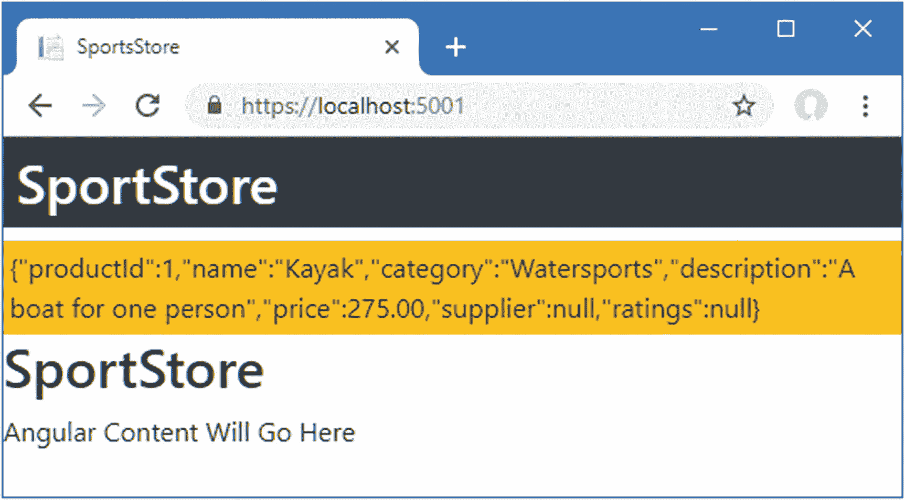
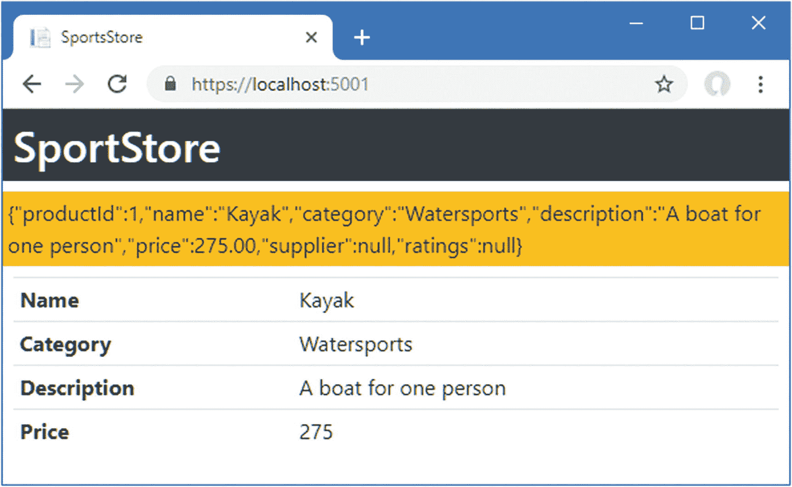
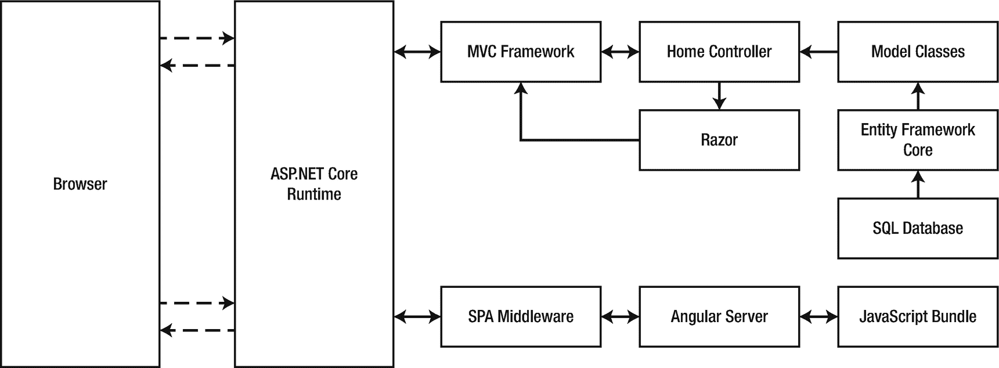
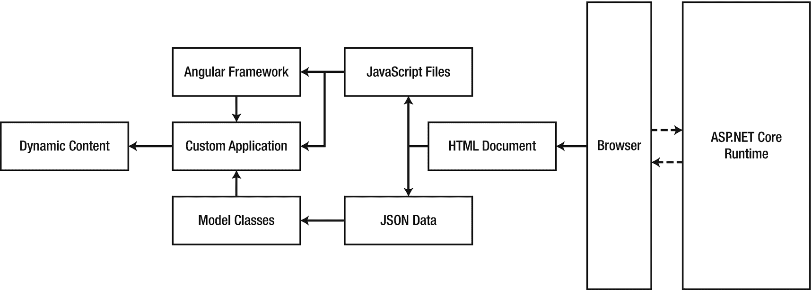

# 四、创建数据模型

在这一章中，我开始向 ASP.NET Core MVC 和项目的 Angular 部分添加功能，以创建一个数据模型。我将建立一个 SQL Server 数据库来存储应用数据，并定义实体框架核心用来表示数据的模型类。在 Angular 方面，我将定义表示数据的 TypeScript 类，并定义一个使数据在整个应用中可用的存储库。表 [4-1](#Tab1) 将创建数据模型放入上下文中。

表 4-1。

将数据模型放在上下文中

<colgroup><col class="tcol1 align-left"> <col class="tcol2 align-left"></colgroup> 
| 

问题

 | 

回答

 |
| --- | --- |
| 这是什么？ | 数据模型描述了应用两个部分中的数据。 |
| 为什么有用？ | 一致的数据模型允许数据在 Angular 和 ASP.NET Core MVC 中被一致地表示，并且容易地从一个流到另一个。 |
| 如何使用？ | 数据模型被定义为成对的 TypeScript 和 C# 类，在 Angular 应用中有一个存储库，在 ASP.NET Core MVC 应用中有数据上下文类，允许使用实体框架核心存储数据。 |
| 有什么陷阱或限制吗？ | 数据模型类应该尽可能简单，以确保它们可以在 TypeScript 和 C# 中一致地表示，并且对于大多数应用，确保它们可以序列化为 JSON。 |
| 有其他选择吗？ | 不，如果一个应用需要 Angular 和 ASP.NET Core MVC，那么它几乎肯定需要一个数据模型。 |

## 为本章做准备

这一章依赖于我在第三章中创建的 SportsStore 项目。为了准备这一章，在`appsettings.Development.json`文件中更改清单 [4-1](#PC1) 中显示的设置，以便 ASP.NET Core 运行时将启动 Angular 开发工具。

```cs
{
  "Logging": {
    "LogLevel": {
      "Default": "Debug",
      "System": "Information",
      "Microsoft": "Information"
    }
  },
  "DevTools": {
    "ConnectionStrategy": "managed"
  }
}

Listing 4-1.Changing the Configuration in the appsettings.Development.json File in the ServerApp Folder

```

打开一个新的 PowerShell 命令提示符，导航到`SportsStore/ServerApp`文件夹，运行清单 [4-2](#PC2) 中所示的命令，启动 ASP.NET Core 运行时和 Angular 开发工具。

```cs
dotnet watch run

Listing 4-2.Starting the Development Tools

```

打开新的浏览器窗口并导航至`https://localhost:5001`；您将看到如图 [4-1](#Fig1) 所示的内容。

### 小费

你可以从源代码库 [`https://github.com/Apress/esntl-angular-for-asp.net-core-mvc-3`](https://github.com/Apress/esntl-angular-for-asp.net-core-mvc-3) 免费下载每章的完整项目。运行`ClientApp`文件夹中的`npm install`，安装 Angular 开发所需的包，然后按照指示启动开发工具。



图 4-1。

运行示例应用

一旦您检查了示例应用的运行，使用 Control+C 停止 ASP.NET Core 运行时

## 启动数据模型

就像独立的 ASP.NET Core MVC 项目一样，最好的起点是数据模型。与独立项目不同，这个应用的数据类型必须向应用的 Angular 和 MVC 部分描述。

### 创建 ASP.NET Core MVC 数据模型

大多数 MVC 开发人员都熟悉为应用的 MVC 部分创建数据模型的过程:一系列 C# 模型类用于创建数据库模式，该模式用于准备数据库以存储应用的数据。

与传统的 ASP.NET Core 开发的一个重要区别是，我没有在项目的 MVC 部分创建存储库接口和实现类。相反，我在 Angular 应用中创建存储库，这是使用数据的地方。随着应用的成形，这两个应用的结构将变得清晰。

#### 定义模型数据类型

结合了 Angular 和 ASP.NET Core MVC 的项目中的数据类型应该尽可能简单，以便可以使用 C# 和 TypeScript 类一致地描述它们，并且容易序列化为 JSON 数据，允许它们使用 HTTP 请求在 Angular 和 ASP.NET Core MVC 之间发送。

为了启动 SportsStore 应用的数据模型，我将定义三个类，分别代表产品、这些产品的供应商和客户反馈。将名为`Product.cs`的 C# 类文件添加到`ServerApp/Models`文件夹中，并添加清单 [4-3](#PC3) 中所示的代码。

如果您使用的是 Visual Studio，请在解决方案资源管理器中右键单击`Models`文件夹，并从弹出菜单中选择“添加➤类”,向项目中添加一个新的 C# 类文件。如果您使用的是 Visual Studio 代码，右键单击`Models`文件夹并从弹出菜单中选择 New File。

```cs
using System.Collections.Generic;
using System.ComponentModel.DataAnnotations.Schema;

namespace ServerApp.Models {
    public class Product {

        public long ProductId { get; set; }

        public string Name { get; set; }
        public string Category { get; set; }
        public string Description { get; set; }

        [Column(TypeName = "decimal(8, 2)")]
        public decimal Price { get; set; }

        public Supplier Supplier { get; set; }
        public List<Rating> Ratings { get; set; }
    }
}

Listing 4-3.The Contents of the Product.cs File in the ServerApp/Models Folder

```

在数据库中存储`Product`对象时，`ProductId`属性将被用作主键。`Name`、`Category`、`Description`和`Price`属性是存储简单数据值的常规属性。应用于`Price`属性的`Column`属性告诉实体框架核心如何在数据库中设置相应的列，以确保应用将存储的值范围具有足够的精度。

`Supplier`和`Ratings`属性是*导航属性*，实体框架核心使用它们将`Product`对象与数据库中的其他数据相关联。通过导航属性访问的对象被称为*相关数据*。在这种情况下，每个`Product`对象可能与一个`Supplier`对象和多个`Rating`对象相关。

### 小费

这是一个比我在*专业 ASP.NET Core MVC* 和*专业 Angular* 书籍中的 SportsStore 示例中使用的更复杂的数据模型，因为当 Angular 和 ASP.NET Core MVC 一起使用时，使用相关数据会出现一些常见问题，我将在后面的章节中描述这些问题。

将名为`Supplier.cs`的 C# 类文件添加到`ServerApp/Models`文件夹中，并添加清单 [4-4](#PC4) 中所示的代码。

```cs
using System.Collections.Generic;

namespace ServerApp.Models {
    public class Supplier {

        public long SupplierId { get; set; }

        public string Name { get; set; }
        public string City { get; set; }
        public string State { get; set; }

        public IEnumerable<Product> Products { get; set; }
    }
}

Listing 4-4.The Contents of the Supplier.cs File in the ServerApp/Models Folder

```

当数据存储在数据库中时，`SupplierId`属性提供主键，`Name`、`City,`和`State`属性是用于存储简单数据值的常规属性。`Products`属性是一个导航属性，用于浏览数据库中的相关数据。

为了完成数据模型类文件的初始设置，将名为`Rating.cs`的 C# 类文件添加到`ServerApp/Models`文件夹中，并添加清单 [4-5](#PC5) 中所示的语句。

```cs
namespace ServerApp.Models {
    public class Rating {

        public long RatingId { get; set; }

        public int Stars { get; set; }

        public Product Product { get; set; }

    }
}

Listing 4-5.The Contents of the Rating.cs File in the ServerApp/Models Folder

```

在数据库中存储`Rating`对象时，`RatingId`属性被用作主键。`Stars`属性是一个常规属性，用于存储客户的评级。`Product`属性是一个导航属性，用于将一个`Rating`对象关联到一个`Product`对象。

#### 添加实体框架核心包

本书中示例的数据将存储在 LocalDB 中，这是 SQL Server 的零配置版本，安装在第 [2](02.html) 章中。数据将由实体框架核心管理，这是 ASP.NET Core MVC 应用的标准数据访问层。

要安装为实体框架核心提供命令的全局工具包，请使用 PowerShell 命令提示符运行清单 [4-6](#PC6) 中所示的命令。

```cs
dotnet tool uninstall --global dotnet-ef
dotnet tool install --global dotnet-ef --version 3.0.0

Listing 4-6.Installing the Entity Framework Core Tools Package

```

第一个命令删除任何可能安装的现有实体框架核心工具包。第二个命令安装用于本书的包。

添加。NET 包，使用命令提示符导航到`SportsStore/ServerApp`文件夹，并运行清单 [4-7](#PC7) 中所示的命令。

```cs
dotnet add package Microsoft.EntityFrameworkCore.Design --version 3.0.0
dotnet add package Microsoft.EntityFrameworkCore.SqlServer --version 3.0.0

Listing 4-7.Adding the Entity Framework Core Packages

```

这些命令安装使用 SQL Server 所需的实体框架核心功能，以及用于迁移的命令行工具，这些工具允许从 C# 类创建数据库架构。

#### 定义数据库配置字符串

实体框架核心需要知道它应该如何连接到数据库，这是使用连接字符串完成的。为了定义示例项目的连接字符串，将清单 [4-8](#PC8) 中所示的配置属性添加到`ServerApp`文件夹中的`appsettings.Development.json`文件中。

### 警告

确保将连接字符串(包括其所有参数)放在一行中。由于图书页面的布局，它在清单中被分成两行显示。

```cs
{
  "Logging": {
    "LogLevel": {
      "Default": "Debug",
      "System": "Information",
      "Microsoft": "Information"
    }
  },
  "DevTools": {
      "ConnectionStrategy": "managed"
  },
  "ConnectionStrings": {
    "DefaultConnection": "Server=(localdb)\\MSSQLLocalDB;Database=EssentialApp; MultipleActiveResultSets=true"
  }
}

Listing 4-8.Defining a Connection in the appsettings.Development.json File in the ServerApp Folder

```

这些设置创建了`ConnectionStrings`配置部分，并定义了一个名为`DefaultConnection`的连接字符串。连接字符串选择 LocalDB 作为数据库名为`EssentialApp`的数据存储。如果您在正确输入连接字符串方面有问题，那么请访问本书的 GitHub 资源库，找到本章的文件夹，将连接字符串从`appsettings.Development.json`文件直接复制并粘贴到您的项目中。

#### 创建数据库上下文类和种子数据

下一步是创建数据库上下文类，通过实体框架核心提供对数据的访问。将名为`DataContext.cs`的 C# 类文件添加到`ServerApp/Models`文件夹中，并添加清单 [4-9](#PC9) 中所示的语句。

```cs
using Microsoft.EntityFrameworkCore;

namespace ServerApp.Models {

    public class DataContext : DbContext {

        public DataContext(DbContextOptions<DataContext> opts)
            : base(opts) { }

        public DbSet<Product> Products { get; set; }
        public DbSet<Supplier> Suppliers { get; set; }
        public DbSet<Rating> Ratings { get; set; }
    }
}

Listing 4-9.The Contents of the DataContext.cs File in the ServerApp/Models Folder

```

context 类遵循实体框架核心的标准模式，并定义了一个接受`DbContextOptions<T>`对象的构造函数，该构造函数是在 ASP.NET Core 启动序列期间配置的。三个`DbSet`属性提供了对数据库中数据的访问，允许对每个模型类型进行独立的查询。您不需要为每个模型类添加`DbSet`属性，尤其是相关的数据类型，但是我发现这样做很方便。

每章都会重置数据库，以确保您从本书的示例中获得预期的结果。这意味着用种子数据自动填充数据库是有用的，这样应用就总是有数据可以使用。将名为`SeedData.cs`的类文件添加到`ServerApp/Models`文件夹中，并添加清单 [4-10](#PC10) 中所示的语句。

### 注意

Entity Framework Core 具有通过 context 类管理种子数据的特性，但这种方法有一些严重的限制，定义一个定制的种子类，如清单 [4-10](#PC10) 中的那个，为大多数项目提供了更多的灵活性。

```cs
using System.Collections.Generic;
using System.Linq;
using Microsoft.EntityFrameworkCore;
using ServerApp.Models;

namespace ServerApp {

    public class SeedData {

        public static void SeedDatabase(DataContext context) {

            context.Database.Migrate();

            if (context.Products.Count() == 0) {
                var s1 = new Supplier { Name = "Splash Dudes",
                    City = "San Jose", State = "CA"};
                var s2 = new Supplier { Name = "Soccer Town",
                    City = "Chicago", State = "IL"};
                var s3 = new Supplier { Name = "Chess Co",
                    City = "New York", State = "NY"};

                context.Products.AddRange(
                    new Product { Name = "Kayak",
                         Description = "A boat for one person",
                         Category = "Watersports", Price = 275, Supplier = s1,
                         Ratings = new List<Rating> {
                             new Rating { Stars = 4 }, new Rating { Stars = 3 }}},
                     new Product { Name = "Lifejacket",
                         Description = "Protective and fashionable",
                         Category = "Watersports", Price = 48.95m , Supplier = s1,
                         Ratings = new List<Rating> {
                             new Rating { Stars = 2 }, new Rating { Stars = 5 }}},
                     new Product {
                         Name = "Soccer Ball",
                         Description = "FIFA-approved size and weight",
                         Category = "Soccer", Price = 19.50m, Supplier = s2,
                         Ratings = new List<Rating> {
                             new Rating { Stars = 1 }, new Rating { Stars = 3 }}},
                     new Product {
                         Name = "Corner Flags",
                         Description = "Give your pitch a professional touch",
                         Category = "Soccer", Price = 34.95m, Supplier = s2,
                         Ratings = new List<Rating> { new Rating { Stars = 3 }}},
                     new Product {
                         Name = "Stadium",
                         Description = "Flat-packed 35,000-seat stadium",
                         Category = "Soccer", Price = 79500, Supplier = s2,
                         Ratings = new List<Rating> { new Rating { Stars = 1 },
                             new Rating { Stars = 4 }, new Rating { Stars = 3 }}},
                     new Product {
                         Name = "Thinking Cap",
                         Description = "Improve brain efficiency by 75%",
                         Category = "Chess", Price = 16, Supplier = s3,
                         Ratings = new List<Rating> { new Rating { Stars = 5 },
                             new Rating { Stars = 4 }}},
                     new Product {
                         Name = "Unsteady Chair",
                         Description = "Secretly give your opponent a disadvantage",
                         Category = "Chess", Price = 29.95m, Supplier = s3,
                         Ratings = new List<Rating> { new Rating { Stars = 3 }}},
                     new Product {
                         Name = "Human Chess Board",
                         Description = "A fun game for the family",
                         Category = "Chess", Price = 75, Supplier = s3 },
                     new Product {
                         Name = "Bling-Bling King",
                         Description = "Gold-plated, diamond-studded King",
                         Category = "Chess", Price = 1200, Supplier = s3 });
                context.SaveChanges();
            }
        }
    }
}

Listing 4-10.The Contents of the SeedData.cs File in the ServerApp/Models Folder

```

`SeedDatabase`方法通过调用`DataContext.Database.Migrate`方法开始，这确保了在应用种子数据之前已经创建并更新了数据库。`SeedDatabase`方法的其余部分创建一系列模型对象，将它们相互关联，然后使用`DataContext.SaveChanges`方法将它们保存到数据库中。

为了向实体框架核心注册上下文类，并确保在 ASP.NET Core 启动时应用种子数据，将清单 [4-11](#PC11) 中所示的语句添加到`ServerApp`文件夹中的`Startup`类中。

```cs
using System;
using System.Collections.Generic;
using System.Linq;
using System.Threading.Tasks;
using Microsoft.AspNetCore.Builder;
using Microsoft.AspNetCore.Hosting;
using Microsoft.AspNetCore.HttpsPolicy;
using Microsoft.Extensions.Configuration;
using Microsoft.Extensions.DependencyInjection;
using Microsoft.Extensions.Hosting;
using Microsoft.AspNetCore.SpaServices.AngularCli;

using ServerApp.Models;

using Microsoft.EntityFrameworkCore;

namespace ServerApp {
    public class Startup {

        public Startup(IConfiguration configuration) {
            Configuration = configuration;
        }

        public IConfiguration Configuration { get; }

        public void ConfigureServices(IServiceCollection services) {

            string connectionString =
                Configuration["ConnectionStrings:DefaultConnection"];
            services.AddDbContext<DataContext>(options =>
                options.UseSqlServer(connectionString));

            services.AddControllersWithViews();
            services.AddRazorPages();
        }

        public void Configure(IApplicationBuilder app, IWebHostEnvironment env,
                IServiceProvider services) {

            if (env.IsDevelopment()) {
                app.UseDeveloperExceptionPage();
            } else {
                app.UseExceptionHandler("/Home/Error");
                app.UseHsts();
            }

            app.UseHttpsRedirection();
            app.UseStaticFiles();
            app.UseRouting();
            app.UseAuthorization();

            app.UseEndpoints(endpoints => {
                endpoints.MapControllerRoute(
                    name: "default",
                    pattern: "{controller=Home}/{action=Index}/{id?}");
                endpoints.MapRazorPages();
            });

            app.UseSpa(spa => {
                string strategy = Configuration
                    .GetValue<string>("DevTools:ConnectionStrategy");
                if (strategy == "proxy") {
                    spa.UseProxyToSpaDevelopmentServer("http://127.0.0.1:4200");
                } else if (strategy == "managed") {
                    spa.Options.SourcePath = "../ClientApp";
                    spa.UseAngularCliServer("start");
                }
            });

            SeedData.SeedDatabase(services.GetRequiredService<DataContext>());
        }
    }
}

Listing 4-11.Registering the Context Class in the Startup.cs File in the ServerApp Folder

```

需要进行数据库迁移来创建允许数据库存储应用数据的数据库模式。使用命令提示符运行`ServerApp`文件夹中清单 [4-12](#PC12) 所示的命令。(如果您收到找不到该命令的错误，请关闭 PowerShell 窗口，打开一个新的 PowerShell 窗口，然后重试)。

```cs
dotnet ef migrations add Initial

Listing 4-12.Creating the Database Migration

```

运行该命令的结果是将一个`Migrations`文件夹添加到包含 C# 类文件的项目中，这些 c# 类文件包含在将迁移应用到数据库时生成数据库模式的语句。

为迁移创建的文件以时间戳开始。如果您检查`ServerApp/Migrations`文件夹中的`<timestamp>_Initial.cs`文件中的语句，您将看到实体框架核心将如何存储应用的数据。数据库将包含三个表，分别叫做`Products`、`Suppliers`和`Ratings`，对应于三种数据模型类型中的每一种。每个表都有对应于等效数据模型类定义的属性的列，而导航属性被转换成表之间的外键关系。图 [4-2](#Fig2) 显示了由迁移和种子数据创建的数据库的简化表示。(这不是一本关于实体框架核心的书，但它有助于理解在查询数据库以向应用提供其数据时，数据是如何存储的。)



图 4-2。

基本数据库结构

`Products`表用于存储`Product`对象，并包含一个`SupplierId`列，用于通过存储来自`Suppliers`表的`SupplierId`属性的值来捕获与`Supplier`对象的关系。`Ratings`表用于存储`Rating`对象，并有一个`ProductId`列，用于捕获与相关`Product`对象的关系。

#### 测试 ASP.NET Core MVC 数据模型

在继续之前，有必要确保实体框架核心可以连接到数据库，并且种子数据被正确应用。检查数据模型最简单的方法是在视图中包含一些数据。编辑`Home`控制器的`Index`动作，以便它通过其构造函数接收一个`DataContext`对象并将数据传递给它的视图，如清单 [4-13](#PC13) 所示。

```cs
using Microsoft.AspNetCore.Mvc;
using ServerApp.Models;
using System.Diagnostics;

using System.Linq;

namespace ServerApp.Controllers {

    public class HomeController : Controller {
        private DataContext context;

        public HomeController(DataContext ctx) {
            context = ctx;
        }

        public IActionResult Index() {
            return View(context.Products.First());
        }

        public IActionResult Privacy() {
            return View();
        }

        [ResponseCache(Duration = 0, Location = ResponseCacheLocation.None,
            NoStore = true)]
        public IActionResult Error() {
            return View(new ErrorViewModel { RequestId = Activity.Current?.Id
                ?? HttpContext.TraceIdentifier });
        }
    }
}

Listing 4-13.Working with Data in the HomeController.cs File in the ServerApp/Controllers Folder

```

传递给视图的数据是存储在数据库中的第一个`Product`对象。要显示数据，编辑`ServerApp/Views/Home`文件夹中的`Index.cshtml`文件，如清单 [4-14](#PC14) 所示。

```cs
@section scripts {
    <script src="runtime.js"></script>
    <script src="polyfills.js"></script>
    <script src="styles.js"></script>
    <script src="vendor.js"></script>
    <script src="main.js"></script>
}

<div id="data" class="p-1 bg-warning">

  @Json.Serialize(Model)

</div>

<app-root></app-root>

Listing 4-14.Displaying Data in the Index.cshtml File in the ServerApp/Views/Home Folder

```

`@Json.Serialize`方法生成 action 方法提供的视图模型数据的 JSON 表示。保存对控制器和视图的更改，然后通过运行`ServerApp`文件夹中清单 [4-15](#PC15) 中所示的命令启动 ASP.NET Core。

```cs
dotnet watch run

Listing 4-15.Starting the ASP.NET Core Runtime

```

### 小费

如果您试图重复本章中的步骤，您可能希望删除数据库，尤其是如果它包含后续章节中的更改。运行`ServerApp`文件夹中的`dotnet ef database drop --force`命令，然后运行`dotnet ef database update`删除并重新创建数据库。最后，运行清单 [4-15](#PC15) 中的命令来启动 ASP.NET Core 运行时。

启动完成后，打开一个新的浏览器窗口并导航至`https://localhost:5001`。浏览器显示的内容包括一块 JSON 数据，如图 [4-3](#Fig3) 所示。



图 4-3。

在视图中包含 JSON 数据

下面是添加到发送到浏览器的 HTML 中的 JSON 数据:

```cs
{
  "productId":1,"name":"Kayak","category":"Watersports",
  "description":"A boat for one person","price":275.00,
  "supplier":null,"ratings":null
}

```

`supplier`和`ratings`属性是针对`null`的，因为我没有告诉实体框架核心遵循`Product`类定义的导航属性来加载相关的`Supplier`和`Rating`数据。我将在第 [5](05.html) 章向你展示如何处理相关数据。

### 警告

不要继续，直到你在视图中看到 JSON 数据，如图 [4-3](#Fig3) 所示。返回并确保您遵循了准备和填充数据库的所有步骤。如果需要重置数据库，停止 ASP.NET Core，运行`dotnet ef database drop --force`命令，然后再次启动 ASP.NET Core MVC。

### 启动 Angular 数据模型

在项目的 Angular 部分创建数据模型使得处理从 MVC 框架接收的数据变得更加容易。创建一个`ClientApp/src/app/models`文件夹，并向其中添加一个名为`product.model.ts`的文件，代码如清单 [4-16](#PC17) 所示。如果您使用的是 Visual Studio，右键单击`models`文件夹，从弹出菜单中选择添加➤添加新项，并使用 TypeScript 文件模板创建`product.model.ts`文件。如果你使用的是 Visual Studio 代码，右击`models`文件夹，输入文件名。

```cs
import { Supplier } from "./supplier.model";
import { Rating } from "./rating.model";

export class Product {
    constructor(
        public productId?: number,
        public name?: string,
        public category?: string,
        public description?: string,
        public price?: number,
        public supplier?: Supplier,
        public ratings?: Rating[] ) { }
}

Listing 4-16.The Contents of the product.model.ts File in the ClientApp/src/app/models Folder

```

Angular 文件的惯例是在文件名中包含类似于`model`和`component`的术语，以使文件的目的显而易见。例如，`product.model.ts`这个名字表明这是一个包含名为`Product`的模型类的类型脚本文件。

接下来，在`ClientApp/src/app/models`文件夹中创建一个名为`supplier.model.ts`的文件，并添加清单 [4-17](#PC18) 中所示的语句。

```cs
export class Supplier {

    constructor(
        public supplierId?: number,
        public name?: string,
        public city?: string,
        public state?: string) { }
}

Listing 4-17.The Contents of the supplier.model.ts File in the ClientApp/src/app/models Folder

```

最后，在`ClientApp/src/app/models`文件夹中创建一个名为`rating.model.ts`的文件，并添加清单 [4-18](#PC19) 中所示的语句。

```cs
import { Product } from "./product.model";

export class Rating {

    constructor(
        public ratingId?: number,
        public stars?: number,
        public product?: Product) { }
}

Listing 4-18.The Contents of the rating.model.ts File in the ClientApp/src/app/models Folder

```

### 了解 TypeScript 数据模型类

因为这些是我在本书中创建的第一个 TypeScript 类，所以我将深入研究一些细节并解释 TypeScript 做什么以及它是如何工作的。TypeScript 是 JavaScript 的超集，它增加了一个强类型系统，类似于您已经熟悉的 C# 中的类型系统。但是 TypeScript 不是 C#，从事一个结合 Angular 和 ASP.NET Core MVC 的项目意味着用两种不同的语言编写代码，有两套不同的规则和特性。TypeScript 和 C# 之间有一个共同点，正如你可能从微软创造的两种语言中所期待的那样，但是也有重要的区别。

如果您是 TypeScript 的新手，您可能会觉得有些困惑，但是不要担心，随着您获得使用它的经验，TypeScript 开始变得有意义。如果你迷路了，不要陷入细节中；继续读下去，尽可能地跟着读下去，即使不是所有的东西马上都有意义。

当您阅读下面的章节时，请记住 Angular 数据模型类的目的是从项目的 MVC 部分镜像 C# 类，以便从服务器发送的数据可以在客户机中表示并显示给用户。

### JavaScript、ECMAScript 和 TypeScript

*JavaScript* 是一个宽泛的术语，描述了用于在浏览器中执行代码的语言和运行时。所有现代浏览器都提供了对 JavaScript 的支持，这使得创建 Angular 应用成为可能。

描述 JavaScript 语言的技术标准的名称是 *ECMAScript* ，也称为 es。标准的每个版本都有一个版本号，因此 ECMAScript 的版本 6 称为 ES6，版本 7 称为 ES7，依此类推。为了混淆视听，ES6 和 ES7 也被称为 ECMAScript 2015 和 ECMAScript 2016，通常表示为 ES2015 和 ES2016。ES6 的发布标志着语言规范向年度更新的转变，这也是为什么 2016、2017 和 2018 版只包含少量变化的原因。

语言规范的每个新版本都增加了一些特性，但是浏览器需要时间来支持它们。不支持新功能的浏览器退出使用也需要时间，这使得假设运行 Angular 应用的所有浏览器都支持某个特定功能变得很危险。

好消息是 TypeScript 提供了两个有用的特性，有助于在混乱的 JavaScript 标准和实现中导航。首先是 TypeScript 提供了一个类似于 C# 使用的类型系统，这使得在编译 TypeScript 代码时更容易检测到常见问题。(TypeScript 类型系统仅在编译 TypeScript 代码文件时应用，而不在运行时应用。TypeScript 编译器必须删除 C# 样式类型的细节，并使用 JavaScript 类型系统来生成向后兼容的 JavaScript 代码。)

第二个特性是 TypeScript 允许您在项目中使用最新的 JavaScript 语言特性，而不必担心您的用户是否有支持它们的浏览器。当 TypeScript 编译器处理 TypeScript 文件时，它会生成在不支持 ES6 或 ES7 的浏览器中运行的向后兼容的 JavaScript。TypeScript 编译器所针对的 JavaScript 版本在`tsconfig.json`文件中配置，默认为 ES2015。

#### 检查产品构造器

最好从`Product`类开始。该类只包含一个构造函数，这是 TypeScript 数据模型类的典型构造函数。下面是突出显示构造函数的`Product`类:

```cs
import { Supplier } from "./supplier.model";
import { Rating } from "./rating.model";

export class Product {
    constructor(
        public productId?: number,
        public name?: string,
        public category?: string,
        public description?: string,
        public price?: number,
        public supplier?: Supplier,
        public ratings?: Rating[] ) { }
}

```

TypeScript 构造函数由`constructor`关键字表示，而不是由类名表示，但是它们执行与 C# 中相同的目的，并且每个参数接收一个可用于配置该类的新实例的值。

##### 使用正确的名称大写约定

JavaScript 对其属性名使用 Camel 大小写约定，这意味着第一个字母是小写的，每个后续连接单词的第一个字母是大写的。这意味着项目的 ASP.NET Core MVC 部分中的 C# 属性`ProductId`变成了 Angular 中的`productId`。

##### 使参数可选

参数名称后面的问号表示该参数是可选的。

```cs
...
public productId?: number,
...

```

可选参数对于模型类很有用，因为在创建新对象时，您并不总是拥有所有可用字段的值。这可能是因为您逐渐通过多个 HTML 表单从用户那里获取数据，或者因为数据是通过对服务器的多个 HTTP 请求构建的。将所有的构造函数参数都设为可选参数会给您带来额外的灵活性，允许您创建具有全部、部分甚至没有数据值的新对象。

##### 打开属性包

`Product`类只包含一个构造函数的原因是 TypeScript 有一个有用的特性，可以避免在模型类中特别普遍的常见编码模式。

当您在构造函数参数(如`public`)中包含访问修饰符时，TypeScript 会创建一个与该参数具有相同名称和访问级别的属性，并将构造函数接收到的值赋给它。例如，`Product`类是这样解包的:

```cs
...
export class Product {

        constructor(
               productId?: number,
               name?: string,
               category?: string,
               description?: string,
               price?: number,
               supplier?: Supplier,
               ratings?: Rating[]) {

               this.productId = productId;
               this.name = name;
               this.category = category;
               this.description = description;
               this.price = price;
               this.supplier = supplier;
               this.ratings = ratings;
        }

        productId: number;
        name: string;
        category: string;
        description: string;
        price: number;
        supplier: Supplier
        ratings: Rating[];
}
...

```

当手动定义属性并将值复制到属性时，很容易出错，要么忘记为属性赋值，要么赋值错误。自动执行此过程的 TypeScript 功能会产生相同的结果，但会以更简洁、更不容易出错的方式产生。

##### 了解参数类型

每个参数的类型在其名称后使用内置 JavaScript 类型之一或项目中定义的其他类之一来指定。这就是所谓的*类型注释*。

```cs
...
public productId?: number,
public name?: string,
...

```

`Product`类的构造函数参数依赖于内置的`string`和`number`类型，它们分别用于表示字符数据和数字。表 [4-2](#Tab2) 列出了 JavaScript 支持的基本类型集。

表 4-2。

JavaScript 内置类型

<colgroup><col class="tcol1 align-left"> <col class="tcol2 align-left"></colgroup> 
| 

名字

 | 

描述

 |
| --- | --- |
| `number` | 此类型用于表示数值。与其他编程语言不同，JavaScript 不区分整数和浮点值，这两种值都可以用这种类型表示。 |
| `string` | 此类型用于表示文本数据。 |
| `boolean` | 这种类型可以有`true`和`false`值。 |
| `symbol` | 此类型用于表示唯一的常数值，如集合中的键。 |
| `null` | 该类型只能赋值`null`，用于指示不存在或无效的引用。 |
| `undefined` | 当变量已定义但尚未赋值时，使用此类型。 |
| `object` | 此类型用于表示由单个属性和值组成的复合值。 |

TypeScript 定义了 JavaScript 提供的类型之外的其他类型。特别有趣的是`any`类型，它允许属性或变量被赋予任何值。

#### 理解 JavaScript 模块

当您刚接触 Angular 开发时，最容易混淆的术语是*模块*，它用于描述应用的不同部分，它们之间只有松散的联系。这个术语的一个用途是描述一个 *JavaScript 模块*，它是一段可重用的代码，包含可以在应用的其他地方使用的特性。

JavaScript 模块允许确定 JavaScript 应用中代码之间的依赖关系，允许将一个项目中的代码分成多个文件。当构建项目时，webpack bundler 从 Angular 应用的入口点开始，它通常是`main.ts`文件，并遵循所有的依赖关系将每个 JavaScript 模块合并到它创建的包中。

每个 TypeScript 文件包含一个单独的 JavaScript 模块，Angular 应用中的约定是在一个单独的文件中定义每个类。`export`关键字用于使类在其文件之外可用，如下所示:

```cs
...
export class Product {
...

```

如果没有`export`关键字，`Product`类将不能在定义它的模块之外被访问，这意味着它只能被`product.model.ts`文件中的其他代码使用。

与之相对应的是`import`关键字，它声明了对从另一个 JavaScript 模块导出的类的依赖。在`product.module.ts`文件中有两个`import`语句，它们声明了对另外两个类的依赖，如下所示:

```cs
...
import { Supplier } from "./supplier.model";
import { Rating } from "./rating.model";
...

```

TypeScript `import`语句指定所需的类型及其位置。这些语句从`supplier.model` JavaScript 模块导入`Supplier`，从`rating.model` JavaScript 模块导入`Rating`。

有两种方法可以指定 JavaScript 模块的位置。`product.model.ts`文件中的`import`语句是相对于的*导入，这意味着它们指定了相对于当前文件的文件路径。这种类型的位置以句点开始，包括目标文件的路径，但省略了文件扩展名，因此不包括类型脚本文件的`.ts`或编译到的 JavaScript 文件的`.js`。*

另一种类型的导入省略了目标位置的句点，并声明了对 NPM 包的依赖，例如提供 Angular 功能的 JavaScript 模块。例如，下面是来自`ClientApp/src/app`文件夹中的`app.component.ts`文件的`import`语句，它声明了对`@angular/core`模块的依赖:

```cs
...
import { Component } from '@angular/core';
...

```

该语句声明了对名为`@angular/core`的包中定义的`Component`类的依赖。(`@`字符是 Google 用于 Angular 模块的 JavaScript 模块名称的一部分。)TypeScript 编译器和 webpack 工具通过在项目的`node_modules`文件夹中进行搜索来解决这种依赖性。

#### 了解 TypeScript 访问控制

TypeScript 支持三种级别的访问控制:`public`、`private`和`protected`。默认的访问级别是`public`，这意味着可以从应用中的任何地方访问一个方法或属性。`private`关键字意味着一个方法或属性只能在它的定义类中被访问。关键字`protected`意味着一个方法或属性只能在其定义类或派生类中被访问。

对于大多数有 Angular 的开发，您可以忽略访问控制关键字。例外情况是，当您想要处理构造函数参数解包特性时，该特性仅在将访问控制关键字应用于参数时才起作用。正是由于这个原因，`Product`类中的所有构造函数参数都用`public`关键字修饰，结果是 TypeScript 自动生成在应用的其他地方可以访问的`public`属性。

### 集成 Angular 数据模型

仅仅定义代表应用中数据的类是不够的。为了完成数据模型，我需要将这些类集成到应用的其余部分，这将在下面的小节中进行。

#### 定义存储库

存储库模式将管理数据的代码与应用的其他部分隔离开来，使得向需要数据的应用的任何部分提供数据访问变得容易。要创建一个存储库，在`ClientApp/src/app/models`文件夹中添加一个名为`repository.ts`的新的类型脚本文件，并添加清单 [4-19](#PC27) 中所示的代码。

### 为什么 Angular 知识库只是类

如果您已经在 ASP.NET Core MVC 应用中实现了存储库模式，您可能会惊讶于 Angular 等价是多么的基本。英寸 NET 中，存储库通常由一个 C# 接口和一个或多个实现类组成。接口和提供细节的实现类之间的映射是使用 ASP.NET Core 依赖注入系统配置的，并对数据消费类隐藏，数据消费类声明它们对接口的依赖。

TypeScript 确实支持接口，但是 Angular 依赖注入系统不支持它们，这意味着存储库被定义为一个简单的类，破坏了存储库模式的一些好处。

```cs
import { Product } from "./product.model";

export class Repository {

    constructor() {
        this.product = JSON.parse(document.getElementById("data").textContent);
    }

    product: Product;
}

Listing 4-19.The Contents of the repository.ts File in the ClientApp/src/app/models Folder

```

`Repository`类定义了一个名为`product`的属性，它返回一个`Product`对象。稍后我会在 Angular 存储库中添加更多的特性，但这已经足够开始了。

`Repository`类的构造函数设置`product`属性的值，方法是做一些对书本示例有帮助但在实际项目中应该仔细考虑的事情，即直接与文档对象模型(DOM) API 交互。DOM API 是浏览器提供的一组 JavaScript 对象和函数，允许以编程方式管理 HTML 文档。正是这个 API 让 Angular 这样的框架向用户呈现内容，并对交互做出响应。

`Repository`构造函数使用 DOM API 来定位包含 JSON 数据的元素并获取其内容。然后使用`JSON.parse`方法将该内容从 JSON 字符串转换为 JavaScript 对象，并分配给 product 属性。

```cs
...
this.product = JSON.parse(document.getElementById("data").textContent);
...

```

使用 DOM 允许我访问 Razor 视图中包含的数据，但这不是通常向 Angular 应用提供数据的方式，一旦创建了 HTTP web 服务来直接向 Angular 应用交付数据，我就替换 DOM 代码。

#### 定义 Angular 特征模块

我之前提到过术语*模块*在 Angular 应用中有多种含义，我解释过每个 TypeScript 文件都包含一个 JavaScript 模块，使用`import`和`export`关键字进行管理。

下一种类型的模块是 Angular *feature 模块*，它用于将相关的功能组合在一起，比如数据模型中的数据存储库类。使用功能模块使 Angular 应用更容易管理和维护，尽管真正的好处是在使用组件等 Angular 构建模块时，我将在第 7 章[中详细介绍。](07.html)

对于这一章，我将创建一个特性模块，这样数据模型就可以很容易地集成到 Angular 应用的其余部分。在`ClientApp/src/app/models`文件夹中添加一个名为`model.module.ts`的文件，并添加清单 [4-20](#PC29) 中所示的语句。

```cs
import { NgModule } from "@angular/core";
import { Repository } from "./repository";

@NgModule({
    providers: [Repository]
})
export class ModelModule { }

Listing 4-20.The Contents of the model.module.ts File in the ClientApp/src/app/models Folder

```

清单中的代码定义了一个名为`ModelModule`的 TypeScript 类。这个类没有属性和方法，只是一个*装饰器*的载体，用于向 Angular 提供关于构建块的元数据，执行一个与 C# 属性大致相似的角色。这是装修工:

```cs
...
@NgModule({
    providers: [Repository]
})
...

```

装饰器以`@`字符开始，后跟装饰器类型。这个装饰器的类型是`NgModule`，它告诉 Angular`ModelModule`类是一个 Angular 特征模块。装饰类型后面跟有`(`和`{`字符以及一个或多个配置属性，后面跟有`}`和`)`字符。这个装饰器中只有一个配置属性，叫做`providers`，用于注册依赖注入的类。

就像 ASP.NET Core MVC 一样，Angular 允许应用构建块使用它们的类构造函数来指定它们需要的服务。这些依赖关系通过依赖注入来解决，使用在 Angular 模块的`providers`属性中注册的类。在这种情况下，应用的其他部分将能够使用依赖注入来接收一个`Repository`对象。

```cs
...
@NgModule({
    providers: [Repository]
})
...

```

Decorators 必须像任何其他 TypeScript 类型一样被导入，这就是清单中包含以下语句的原因:

```cs
...
import { NgModule } from "@angular/core";
...

```

JavaScript 模块包含了提供最重要的 Angular 特性的类型，包括装饰器。

#### 配置角根模块

*根模块*是一个特殊的 Angular 模块，用于配置整个应用。它的作用之一是给出应用所需的特征模块的 Angular 细节。要编辑根模块，打开`ClientApp/src/app`文件夹中的`app.module.ts`文件，如清单 [4-21](#PC33) 所示进行修改。

```cs
import { BrowserModule } from '@angular/platform-browser';
import { NgModule } from '@angular/core';
import { AppRoutingModule } from './app-routing.module';
import { AppComponent } from './app.component';

import { ModelModule } from "./models/model.module";

@NgModule({
  declarations: [AppComponent],
  imports: [BrowserModule, AppRoutingModule, ModelModule],
  providers: [],
  bootstrap: [AppComponent]
})
export class AppModule { }

Listing 4-21.Configuring the Root Module in the app.module.ts File in the ClientApp/src/app Folder

```

根模块是通过将`@NgModule`装饰器应用于一个类来定义的，这个类按照惯例被称为`AppModule`，并且使用四个属性来提供应用的配置，这些属性在表 [4-3](#Tab3) 中进行了描述。

表 4-3。

Angular 模块配置属性

<colgroup><col class="tcol1 align-left"> <col class="tcol2 align-left"></colgroup> 
| 

名字

 | 

描述

 |
| --- | --- |
| `imports` | 此属性用于指定应用所需的 Angular 模块。`BrowserModule`和`AppRoutingModule`模块提供核心 Angular 功能。`ModelModule`是包含示例应用数据模型的定制特性模块。 |
| `providers` | 此属性用于为依赖注入功能指定服务。此属性在根模块中为空，因为 Angular 应用中当前唯一的服务是在模型特征模块中定义的。 |
| `declarations` | 该属性用于向 Angular 提供应用中使用的构造块的列表。对于根模块，该属性指定了`AppComponent`，这是目前应用中唯一的构建块。 |
| `bootstrap` | 此属性指定应用的根组件，它将用于启动应用。对于示例应用，该属性被设置为`AppComponent`，这是目前 Angular 应用中唯一的组件。 |

### 显示数据

Angular 数据模型的基础工作已经完成。有一个已配置为与 Angular 从属注射特征一起使用的存储库。存储库最终将使用通过 HTTP 请求从 ASP.NET Core MVC 获得的数据，但是现在，存储库通过实例化一个 TypeScript 模型类来创建它的数据，这个类对应于服务器端的一个用 C# 定义的对应对象。

下一步是使用存储库获取数据并显示给用户。在 Angular 应用中，关键的构建块是一个*组件*，它提供向用户显示 HTML 内容所需的逻辑和数据。通俗地说，Angular 组件相当于 ASP.NET Core MVC 控制器，而 Angular 组件的模板相当于 Razor 视图。关键的区别在于，MVC 控制器和视图用于生成对 HTTP 请求的响应，在此之后，它们完成了自己的工作，但是 Angular 组件及其模板负责管理显示给用户的 HTML，并响应用户交互和对数据模型的更改。

在后面的示例中，您将了解更多关于组件如何工作的信息。目前，我要做的是更新应用中的现有组件，它是在项目设置期间创建的，因此它声明了对`Repository`类的依赖，并为其模板提供了它所包含的数据。编辑`ClientApp/src/app`文件夹中的`app.component.ts`文件，如清单 [4-22](#PC34) 所示进行修改。

```cs
import { Component } from '@angular/core';

import { Repository } from "./models/repository";

import { Product } from "./models/product.model";

@Component({
  selector: 'app-root',
  templateUrl: './app.component.html',
  styleUrls: ['./app.component.css']
})
export class AppComponent {

    constructor(private repo: Repository) { }

    get product(): Product {
        return this.repo.product;
    }
}

Listing 4-22.Working with the Repository in the app.component.ts File in the ClientApp/src/app Folder

```

`app.component.ts`文件定义了一个名为`AppComponent`的类。你可以看出这是一个组件，因为它已经用`@Component`装饰器进行了装饰，该装饰器为 Angular 提供了组件工作所需的配置设置，如表 [4-4](#Tab4) 所述。

表 4-4。

组件配置属性

<colgroup><col class="tcol1 align-left"> <col class="tcol2 align-left"></colgroup> 
| 

名字

 | 

描述

 |
| --- | --- |
| `selector` | 该属性用于指定组件将负责管理的 HTML 元素。对于这个组件，`selector`属性告诉 Angular 组件将管理`app-root`元素，这个元素可以在`ClientApp/src/app`文件夹的 HTML 文件中找到。 |
| `templateUrl` | 该属性用于指定组件的模板，即显示给用户的 HTML 内容。 |
| `styleUrls` | 此属性用于指定一个或多个将应用于组件模板内容的 CSS 样式表。我在本书中没有使用这个特性，而是依赖于 Bootstrap CSS 框架来设计示例中所有内容的样式。 |

目标是为组件的模板提供对存储库中数据的访问，以便可以向用户显示这些数据，这是通过向`AppComponent`类添加两个内容来实现的。

第一个添加的是构造函数。构造函数有一个名为`repo`的`Repository`参数，这是在 Angular 应用中声明依赖关系的方式。该参数告诉 Angular,`AppComponent`类需要一个`Repository`对象，并在创建新的`AppComponent`对象时提供该对象。`private`关键字已经被应用到了`repo`参数中，这意味着同名的属性将被定义并被赋予构造函数参数的值；只能在`AppComponent`类中访问`repo`参数。

### 小费

在将类用于依赖注入之前，必须使用 Angular 模块的`providers`属性将类注册为服务。在清单 [4-20](#PC29) 中，`Repository`类被注册为服务。

清单 [4-22](#PC34) 中的第二个添加是一个名为`product`的只读属性，它返回`Repository`对象的`product`属性的值。注意，`this`关键字用于访问`repo`属性，如下所示:

```cs
...
return this.repo.product;
...

```

必须使用`this`关键字来访问 TypeScript 实例方法和属性。如果你忘记使用`this`，如果你习惯了 C# 的工作方式，这是很容易做到的，那么你会看到一个错误，告诉你编译器`cannot find name <name>`。

为了向用户显示数据，用清单 [4-23](#PC36) 中所示的元素替换`app.component.html`文件的内容。

```cs
<div class="p-2">

  <table class="table table-sm">
    <tr><th>Name</th><td>{{product?.name}}</td></tr>
    <tr><th>Category</th><td>{{product?.category}}</td></tr>
    <tr><th>Description</th><td>{{product?.description}}</td></tr>
    <tr><th>Price</th><td>{{product?.price}}</td></tr>
  </table>

</div>

Listing 4-23.The Contents of the app.component.html File in the ClientApp/src/app Folder

```

这个 HTML 片段依赖于一个重要的 Angular 特性:数据绑定*。数据绑定将控制器提供的数据合并到模板中，在这种情况下，显示由组件的`product`属性返回的`Product`对象定义的属性值。*

 *在这个例子中，我使用了最基本的数据绑定类型，用双括号字符(`{{`和`}}`)表示。我将在后面的章节中演示更复杂的绑定，但是这种类型的绑定会评估其内容以产生一个插入到元素中的值。例如，这个绑定显示组件提供的`Product`对象的`name`属性的值:

```cs
...
<tr><th>Name</th><td>{{product?.name}}</td></tr>
...

```

问号是 TypeScript 安全导航操作符，它与 C# 等效项的作用相同，防止在尚未初始化`product`属性时读取`name`属性。

保存对 TypeScript 文件的更改，浏览器将重新加载以显示静态 JSON 数据，以及根据数据动态生成的表格，如图 [4-4](#Fig4) 所示。



图 4-4。

使用 Angular 动态生成内容

## 查看应用结构

示例应用正在成形。项目的 MVC 和 Angular 部分都有一个数据模型，尽管它们还没有连接起来。我将在下一章中删除测试数据，并用 HTTP web 服务替换它，但是使用本地数据是确保应用的每个部分都正常工作的好方法。在继续之前，有必要花点时间考虑一下 SportsStore 应用的新兴结构，并理解服务器端和客户端的不同特性是如何融合在一起的。

### 回顾 ASP.NET Core MVC 应用结构

当您使用浏览器导航到`https://localhost:5001`时，HTTP 请求被传递到 MVC 框架，MVC 框架将其路由到由`Home`控制器定义的`Index`动作方法。该操作方法使用实体框架核心从 SQL Server LocalDB 数据库中读取`Product`数据，并将其用作`Index.cshtml`视图的视图模型数据。

Razor 处理`Index.cshtml`视图并为浏览器生成一个 HTML 响应，其中包括来自数据库的`Product`数据的 JSON 表示、`script`元素(加载 Angular 应用所需的 JavaScript 包文件)和 Angular 应用将应用到的`app-root`元素。浏览器跟随`script`元素中的 URL 来加载 JavaScript 文件，这些文件被转发给 Angular development server。JavaScript 包文件由 Angular 开发工具从 TypeScript 文件中自动生成。图 [4-5](#Fig5) 显示了应用的结构。



图 4-5。

应用的 ASP.NET Core MVC 部分的结构

应用的 ASP.NET Core MVC 部分由熟悉的构建块组成。控制器、动作方法和 Razor 视图与实体框架核心一起为 HTTP 请求生成响应。发送给客户端的响应包含 HTML 元素，这些元素提供了浏览器运行 Angular 应用所需的一切，除了 JavaScript 包文件。对这些文件的请求被转发到 Angular 服务器，该服务器向浏览器提供应用的代码。

应用的 ASP.NET Core MVC 部分没有关于 Angular 应用的特殊知识。它通过呈现视图来响应 HTTP 请求，就像任何其他 MVC 应用一样。

### 查看 Angular 应用结构

这个应用的 Angular 部分还不成熟，但是有足够的功能来生成一个向用户显示数据的表格。浏览器收到的 HTML 文档包含由 Angular 应用生成的动态内容插入其中的`app-root`元素，以及包含 Angular 框架和自定义应用和数据模型类的 JavaScript 捆绑文件的`script`元素。HTML 文档还包含用于填充数据表的 JSON 数据，不过我将用一个 web 服务来代替它，这是一种向 Angular 应用交付数据的更传统的方法。图 [4-6](#Fig6) 显示了应用的 Angular 部分的结构。



图 4-6。

应用的 Angular 部分的结构

应用的 Angular 部分没有洞察 ASP.NET Core MVC。它不知道(或不关心)ASP.NET Core 和实体框架核心如何存储或表示数据。应用的这两个部分协同工作，向用户交付应用和数据，但是它们独立存在和运行。

## 摘要

在这一章中，我开始向应用的 ASP.NET Core MVC 和 Angular 部分添加功能，重点是数据模型。我创建了一个 SQL Server 数据库，用种子数据填充它，并创建了 C# 数据模型类，以便 MVC 控制器和视图能够向应用发送 JSON 数据。

在客户端，我定义了表示应用数据的 TypeScript 类，以及一个通过依赖注入特性对 Angular 应用的其余部分可用的存储库。我通过更新默认的 Angular 组件和模板来生成显示 JSON 数据的表格，从而完成了这一章。在下一章中，我将开始创建 HTTP web 服务并将其集成到应用中的过程。*