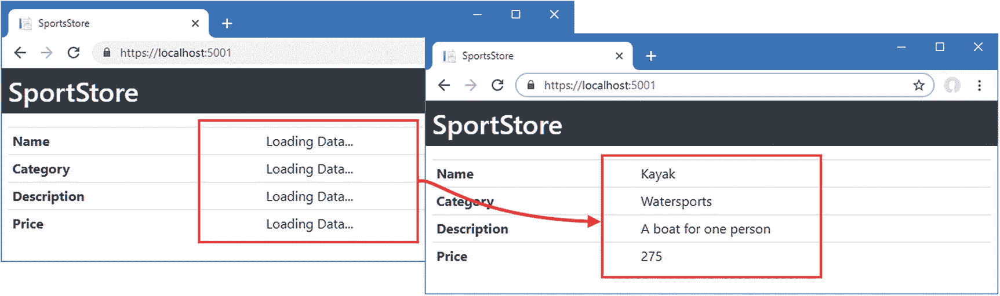
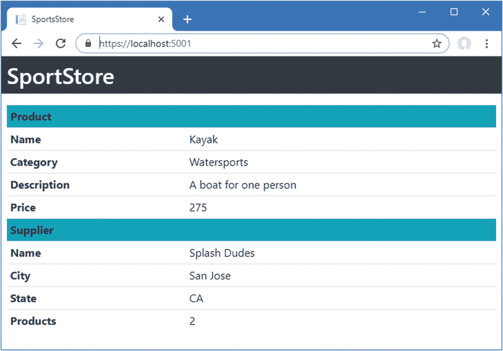

# 五、创建 Web 服务

在这一章中，我开始创建一个 HTTP web 服务的过程，Angular 应用可以用它从 ASP.NET Core MVC 请求数据。由于应用的 MVC 和 Angular 部分中不同特性的交互方式，这个过程并没有想象中那么简单，但结果是访问数据的坚实基础，我在第 [6](06.html) 章中构建了这个基础来支持一组完整的数据操作。

在这一章中，我的重点是启动 web 服务，并检查每个新添加的服务是否按预期工作。这意味着我在项目的 Angular 部分请求和显示数据，而没有构建将数据呈现给用户的最终特征。在这一章中，我编写了足够的代码来获取数据并在浏览器中显示出来。表 [5-1](#Tab1) 将本章放在上下文中。

### 注意

本章和第 [6 章](06.html)中的 web 服务特性是不安全的，这意味着任何客户端都可以访问数据并进行更改。我将在第 12 章[和第 13 章](12.html)中向您展示如何向 web 服务添加认证和授权，以及如何保护您的应用免受跨站点请求伪造(CSRF)攻击。

表 5-1。

将 Web 服务放在上下文中

<colgroup><col class="tcol1 align-left"> <col class="tcol2 align-left"></colgroup> 
| 

问题

 | 

回答

 |
| --- | --- |
| 这是什么？ | HTTP web 服务为 Angular 提供了对由 ASP.NET Core MVC 和实体框架核心管理的数据的访问。 |
| 为什么有用？ | web 服务以 Angular 应用容易请求和使用的格式公开数据。 |
| 如何使用？ | Angular 应用向 ASP.NET Core MVC 应用发送 HTTP 请求，并接收相应的数据响应。响应通常使用 JSON 数据格式表示数据，这种格式在 ASP.NET Core MVC 中很容易创建，在 Angular 中也很容易使用。 |
| 有什么陷阱或限制吗？ | 让实体框架核心、ASP.NET Core MVC 和 Angular 协同工作需要仔细的开发和测试才能得到正确的结果。粗心的人容易犯错误，尤其是在处理 GET 请求时。 |
| 还有其他选择吗？ | 您不必使用 web 服务，但是这样做会使在项目的 Angular 和 ASP.NET Core MVC 部分之间发送数据变得困难。 |

## 为本章做准备

本章使用了我在第 [3 章](03.html)中创建并在第 [4 章](04.html)中修改的 SportsStore 项目。准备本章不需要做任何改动。打开一个新的 PowerShell 命令提示符，导航到`SportsStore/ServerApp`文件夹，运行清单 [5-1](#PC1) 中所示的命令来删除数据库。

```cs
dotnet ef database drop --force

Listing 5-1.Resetting the Database

```

运行`ServerApp`文件夹中清单 [5-2](#PC2) 所示的命令，启动 Angular development server 和 ASP.NET Core 运行时。

```cs
dotnet watch run

Listing 5-2.Starting the Development Tools

```

在初始启动序列之后，打开一个新的浏览器窗口并导航至`https://localhost:5001`；您将看到如图 [5-1](#Fig1) 所示的内容。

### 小费

你可以从源代码库 [`https://github.com/Apress/esntl-angular-for-asp.net-core-mvc-3`](https://github.com/Apress/esntl-angular-for-asp.net-core-mvc-3) 免费下载每章的完整项目。运行`ClientApp`文件夹中的`npm install`，安装 Angular 开发所需的包，然后按照指示启动开发工具。


图 5-1。

运行示例应用

## 介绍网络服务

项目的 Angular 部分是通过由`Home`控制器发送的 HTML 响应从 MVC 框架获取数据。这在为数据模型做准备时很有帮助，因为它让我专注于模型类和存储库，但是在 HTML 文档中包含 JSON 数据有一些缺点。首先，也是最明显的一点，用户通常不希望看到应用数据和常规内容。第二个缺点是，将数据导入 Angular 需要使用浏览器的 DOM API，这限制了应用只能在浏览器中运行，尽管 Angular 有可能在一系列平台上运行。

为了改进应用，我将引入一个 HTTP web 服务。在这种安排下，Angular 应用将在没有任何数据的情况下启动，然后向 ASP.NET Core MVC 应用发出一个 HTTP 请求。HTTP 请求将被异步发出，被称为 *Ajax 请求*，它曾经代表异步 JavaScript 和 XML，但现在已经成为一个独立的术语，尤其是因为 XML 很少被使用，并且已经在很大程度上被 JSON 取代，成为 HTTP 数据请求的标准数据格式。在接下来的章节中，我将向您展示如何使用 ASP.NET Core MVC 来规划和创建一个 web 服务，并将其集成到 Angular 中。

### 理解 RESTful Web 服务

对于 web 服务应该如何工作，没有严格的规则，但是最常见的方法是采用表述性状态转移(REST)模式。REST 没有权威的规范，关于 RESTful web 服务的构成也没有一致的意见，但是有一些通用的主题被广泛用于 web 服务。

缺乏详细的规范导致了关于 REST 的含义和如何创建 RESTful web 服务的无休止的争论，只要您创建的 web 服务为您的项目服务，所有这些都可以被安全地忽略。

REST 的核心前提——也是唯一达成广泛共识的方面——是 web 服务通过 URL 和 HTTP 方法(如 GET 和 POST)的组合来定义 API，这些方法也被称为 *HTTP 动词*。动词指定操作的类型，而 URL 指定操作所应用的数据对象。

举例来说，下面是一个 URL，它可以在示例应用中标识一个`Product`对象:

```cs
/api/products/1

```

该 URL 可以标识其`ProductId`属性的值为`1`的`Product`对象。URL 标识了`Product`，但是是 HTTP 方法指定了应该如何处理它。表 [5-2](#Tab2) 列出了 web 服务中常用的 HTTP 方法以及它们通常表示的操作。

表 5-2。

HTTP 方法和操作

<colgroup><col class="tcol1 align-left"> <col class="tcol2 align-left"></colgroup> 
| 

HTTP 方法

 | 

描述

 |
| --- | --- |
| `GET` | 此方法用于检索一个或多个数据对象。 |
| `POST` | 此方法用于创建新的对象。 |
| `PUT` | 此方法用于更新现有对象。 |
| `PATCH` | 此方法用于更新现有对象的一部分。 |
| `DELETE` | 此方法用于删除对象。 |

在开始开发之前，考虑一下将要通过 web 服务呈现的 API 是一个好主意。值得特别注意可以用 GET 方法执行的操作，因为它们可能比您想象的更复杂。

### 了解 gRPC

ASP.NET Core 3 引入了对 gRPC 的支持，gRPC 是传统 HTTP web 服务的替代方案，它解决了传统 HTTP web 服务中出现的一些低效和不一致问题。在撰写本文时，gRPC 不适合 web 应用，因为它需要 HTTP/2，而浏览器并不广泛支持 HTTP/2。

在可预见的未来，常规 web 服务是向 web 应用交付数据的最佳方式。

### 创建 Web 服务

一旦您在设计和实现 web 服务方面变得有经验，您将会达到这样一种境界，您可以首先编写所有的 C# 代码，然后将代码添加到 Angular 应用中，以使用您创建的服务。对于这本书，我将采用一种更加迭代的方法，在应用的两个部分中集成每个新功能，以强调应用的不同部分如何协同工作，并检查所有功能是否都符合预期。在接下来的小节中，我将建立一个 web 服务，并将其集成到 Angular 应用中。

#### 创建 Web 服务控制器

ASP.NET Core MVC 使得使用标准控制器特性向应用添加 web 服务变得容易。在`ServerApp/Controllers`文件夹中创建一个名为`ProductValuesController.cs`的 C# 类文件，并添加清单 [5-3](#PC4) 中所示的代码。

```cs
using Microsoft.AspNetCore.Mvc;
using ServerApp.Models;

namespace ServerApp.Controllers {

    [Route("api/products")]
    [ApiController]
    public class ProductValuesController : Controller {
        private DataContext context;

        public ProductValuesController(DataContext ctx) {
            context = ctx;
        }

        [HttpGet("{id}")]
        public Product GetProduct(long id) {
            return context.Products.Find(id);
        }
    }
}

Listing 5-3.The Contents of the ProductValuesController.cs File in the ServerApp/Controllers Folder

```

这是一个常规的 ASP.NET Core MVC 控制器，从`Microsoft.AspNetCore.Mvc`名称空间中的`Controller`类派生而来，就像现有的`Home`控制器一样，到目前为止已经为示例呈现了 Razor 视图。这个新控制器类的名称是`ProductValuesController`，它遵循了在名称中包含单词`Values`的惯例，以表明控制器将向其客户端而不是 HTML 返回数据。

web 服务控制器的另一个约定是创建路由模式的独立部分，专门用于处理数据请求。最常见的方法是为 web 服务创建以`/api`开头的 URL，后跟 web 服务处理的数据类型名称的复数形式。对于处理`Product`对象的 web 服务，这意味着 HTTP 请求应该被发送到`/api/products` URL，我已经使用`Route`属性对其进行了配置，如下所示:

```cs
...
[Route("api/products")]
...

```

`ApiController`属性告诉 MVC 框架只为 web 服务请求配置控制器。这是一个可选属性，它设置了一些有用的行为，尤其是在处理参数数据时。

控制器定义的唯一动作是`GetProduct`方法，该方法基于主键返回单个`Product`对象，主键是分配给其`ProductId`属性的值。action 方法用`HttpGet`方法修饰，这将允许 ASP.NET Core MVC 使用这个动作来处理 HTTP GET 请求。

```cs
...

[HttpGet("{id}")]

public Product GetProduct(long id) {
...

```

该属性的参数扩展了由`Route`属性定义的 URL 模式，以便通过形式为`/api/products/{id}`的 URL 可以到达`GetProduct`方法。

web 服务的操作方法可以返回。NET 对象，这些对象被自动序列化并发送到客户端。`GetProduct`方法的结果是一个`Product`对象。

#### 测试 Web 服务

为了测试新的 web 服务，使用 Control+C 停止 ASP.NET Core 运行时，并通过运行`ServerApp`文件夹中清单 [5-4](#PC7) 中的命令再次启动它。

```cs
dotnet watch run

Listing 5-4.Starting the ASP.NET Core Runtime

```

一旦运行时启动，打开 web 浏览器并请求清单 [5-5](#PC8) 中所示的 URL。

```cs
https://localhost:5001/api/products/1

Listing 5-5.Testing the Web Service

```

ASP.NET Core 接收来自浏览器的 HTTP 请求，并将其传递给 MVC 框架。`Route`和`HttpGet`属性的组合表明`ProductValues`控制器中的`GetProduct`方法可以处理请求。`GetProduct`方法使用由数据库上下文的`DbSet`属性定义的`Find`方法从数据库中检索一个`Product`对象并将其作为结果返回。`Product`对象被序列化并返回给浏览器，浏览器将显示它接收到的数据。

```cs
{
  "productId":1,"name":"Kayak","category":"Watersports",
  "description":"A boat for one person","price":275.00,
  "supplier":null,"ratings":null
}

```

`Product`对象被序列化为 JSON，这是用于 web 服务的标准数据格式。每个属性都自动从 C# 大写约定(`ProductId`)转换为 JavaScript 约定(`productId`)。

注意，相关的`Supplier`和`Rating`对象的导航属性已经包含在 JSON 数据中，但是被设置为`null`。这是因为除非特别要求，否则实体框架核心不会加载相关数据，并且没有对象被分配给实体框架核心从数据库读取数据时创建的`Product`对象的`Supplier`和`Ratings`产品。在本章的后面，我将向您展示如何处理相关数据。

#### 使用 Swagger 开发 Web 服务

发送 HTTP GET 请求是测试 web 服务的一种简单方法，但是测试其他类型的请求可能会比较困难。测试 web 服务的一种更优雅的方式是使用 Swagger，也称为 OpenAPI。Swagger 提供了一个 web 服务的标准描述，可以通过一系列附加包来显示。对于这本书，我将使用 Swashbuckle 包，它是 ASP.NET Core MVC 最成熟的 Swagger 实现之一。要安装这个包，打开一个新的命令提示符，导航到`SportsStore/ServerApp`文件夹，运行清单 [5-6](#PC10) 中所示的命令。

```cs
dotnet add package Swashbuckle.AspNetCore --version 5.0.0-rc2

Listing 5-6.Installing the Swashbuckle Package

```

要启用和配置 Swashbuckle，请将清单 [5-7](#PC11) 中所示的语句添加到`Startup`类中。

```cs
using System;
using System.Collections.Generic;
using System.Linq;
using System.Threading.Tasks;
using Microsoft.AspNetCore.Builder;
using Microsoft.AspNetCore.Hosting;
using Microsoft.AspNetCore.HttpsPolicy;
using Microsoft.Extensions.Configuration;
using Microsoft.Extensions.DependencyInjection;
using Microsoft.Extensions.Hosting;
using Microsoft.AspNetCore.SpaServices.AngularCli;
using ServerApp.Models;
using Microsoft.EntityFrameworkCore;

using Microsoft.OpenApi.Models;

namespace ServerApp {
    public class Startup {

        public Startup(IConfiguration configuration) {
            Configuration = configuration;
        }

        public IConfiguration Configuration { get; }

        public void ConfigureServices(IServiceCollection services) {

            string connectionString =
                Configuration["ConnectionStrings:DefaultConnection"];
            services.AddDbContext<DataContext>(options =>
                options.UseSqlServer(connectionString));

            services.AddControllersWithViews();
            services.AddRazorPages();

            services.AddSwaggerGen(options => {
                options.SwaggerDoc("v1",
                    new OpenApiInfo { Title = "SportsStore API", Version = "v1" });
            });
        }

        public void Configure(IApplicationBuilder app, IWebHostEnvironment env,
                IServiceProvider services) {

            if (env.IsDevelopment()) {
                app.UseDeveloperExceptionPage();
            } else {
                app.UseExceptionHandler("/Home/Error");
                app.UseHsts();
            }

            app.UseHttpsRedirection();
            app.UseStaticFiles();
            app.UseRouting();
            app.UseAuthorization();

            app.UseEndpoints(endpoints => {
                endpoints.MapControllerRoute(
                    name: "default",
                    pattern: "{controller=Home}/{action=Index}/{id?}");
                endpoints.MapRazorPages();
            });

            app.UseSwagger();
            app.UseSwaggerUI(options => {
                options.SwaggerEndpoint("/swagger/v1/swagger.json",
                    "SportsStore API");
            });

            app.UseSpa(spa => {
                string strategy = Configuration
                    .GetValue<string>("DevTools:ConnectionStrategy");
                if (strategy == "proxy") {
                    spa.UseProxyToSpaDevelopmentServer("http://127.0.0.1:4200");
                } else if (strategy == "managed") {
                    spa.Options.SourcePath = "../ClientApp";
                    spa.UseAngularCliServer("start");
                }
            });

            SeedData.SeedDatabase(services.GetRequiredService<DataContext>());
        }
    }
}

Listing 5-7.Configuring the Package in the Startup.cs File in the ServerApp Folder

```

配置更改有两个部分。第一个是生成 web 服务的描述。保存对`Startup`类的更改，打开一个新的浏览器窗口，并请求`https://localhost:5001/swagger/v1/swagger.json` URL。响应是 web 服务支持的数据类型和请求类型的 JSON 表示，开始是这样的:

```cs
...
{
  "openapi": "3.0.1",
  "info": { "title": "SportsStore API", "version": "v1" },
  "paths": { "/api/products/{id}": {
      "get": {
        "tags": ["ProductValues" ],
        "parameters": [
          {
            "name": "id", "in": "path",
            "required": true,
            "schema": { "type": "integer", "format": "int64" }
          }
        ],
        "responses": {
          "200": {
            "description": "Success",
            "content": {
              "text/plain": { "schema": { "$ref": "#/components/schemas/Product" }
             },
             "application/json": {
                "schema": { "$ref": "#/components/schemas/Product" }
              },
              "text/json": { "schema": { "$ref": "#/components/schemas/Product" }
              }
           }
...

```

描述很全面，但很难理解。清单 [5-7](#PC11) 中配置的第二部分设置了一个更友好的界面。打开新的浏览器窗口并导航至`https://localhost:5001/swagger`；您将看到由`SwaggerUI`中间件提供的接口，它显示了更容易理解的 web 服务表示，并允许测试每种类型的请求。点击获取按钮，点击试用按钮，在`id`文本字段中输入 **1** ，然后点击执行按钮。将发送一个 GET 请求，结果将显示在浏览器窗口中，如图 [5-2](#Fig2) 所示。


图 5-2。

测试 web 服务

### 在 Angular 应用中使用 Web 服务

web 服务目前没有做太多事情，但是有足够的功能将它集成到 Angular 应用中，我将在接下来的小节中演示。

#### 从 Razor 视图中移除静态数据

第一步是从 Razor 视图中删除静态数据，因为 web 服务将直接向 Angular 应用提供数据，所以不再需要静态数据。在`Index.cshtml`视图中注释掉生成 JSON 数据的语句，如清单 [5-8](#PC13) 所示。

```cs
@section scripts {
    <script src="runtime.js"></script>
    <script src="polyfills.js"></script>
    <script src="styles.js"></script>
    <script src="vendor.js"></script>
    <script src="main.js"></script>
}

<!-- <div id="data" class="p-1 bg-warning">

  @Json.Serialize(Model)

</div> -->

<app-root></app-root>

Listing 5-8.Removing the Static Data from the Index.cshtml File in the ServerApp/Views/Home Folder

```

#### 使用存储库中的 Web 服务数据

要在 Angular 应用中发出 HTTP 请求，我需要在`ClientApp/src/app/models`文件夹的`model.module.ts`文件中导入`HttpClientModule`，如清单 [5-9](#PC14) 所示。

```cs
import { NgModule } from "@angular/core";
import { Repository } from "./repository";

import { HttpClientModule } from '@angular/common/http';

@NgModule({
    imports: [HttpClientModule],
    providers: [Repository]
})
export class ModelModule { }

Listing 5-9.Importing a Module in the model.module.ts File in the ClientApp/src/app/models Folder

```

这个模块包含了发出 HTTP 请求和处理响应的 Angular 功能。接下来，更新 Angular `Repository`类，使其从 web 服务而不是静态 HTML 元素获取数据，如清单 [5-10](#PC15) 所示。

```cs
import { Product } from "./product.model";

import { Injectable } from "@angular/core";

import { HttpClient } from "@angular/common/http";

@Injectable()
export class Repository {
    product: Product;

    constructor(private http: HttpClient) {
        this.getProduct(1);
    }

    getProduct(id: number) {
         this.http.get<Product>("/api/products/" + id)
          .subscribe(p => this.product = p);
    }
}

Listing 5-10.Getting Web Service Data in the repository.ts File in the ClientApp/src/app/models Folder

```

##### 了解 HttpClient 类

在 Angular 应用中对 HTTP 请求的支持是由`HttpClient`类提供的，该类是在清单 [5-9](#PC14) 中添加到应用的`@angular/common/http`模块中定义的。`Repository`类的新构造函数声明了对`HttpClient`类的依赖，如下所示:

```cs
...
constructor(private http: HttpClient) {}
...

```

Angular 将在创建新的`Repository`对象时提供一个`HttpClient`对象作为构造函数参数，该对象将被分配给一个名为`http`的`private`实例变量。`HttpClient`类提供了进行 HTTP 请求的方法，包括`get`方法，它发送 HTTP GET 请求并且被`getProduct`方法使用，就像这样:

```cs
...
getProduct(id: number) {
    this.http.get<Product>("/api/products/" + id)
        .subscribe(p => this.product = p);
}
...

```

`get`方法接受一个 URL 作为它的参数。清单中指定的 URL 是一个相对 URL，将从加载应用的同一位置请求该 URL。这意味着请求将被发送到`https://localhost:5001/api/products/1`，这是本章前面用于测试 web 服务的同一个 URL。

web 服务预期返回的数据类型是使用泛型类型参数指定的。在这种情况下，类型参数是`Product`，它告诉 Angular 应该使用服务器返回的数据来创建一个`Product`对象。

##### 理解可观测量

`get`方法的结果是一个`Observable<Product>`对象，它是一个*可观察对象*的例子。Observables 是名为 Reactive Extensions 的库的一部分，Angular 使用它来连接应用的不同部分。在大多数情况下，您不会在 Angular 应用中直接使用 observables，因为它们是在后台使用的，但是有一个例外，就是当您需要将数据引入应用时，比如从 web 服务引入。

一个可观察对象代表一项工作，它将被异步执行，并在未来的某个时刻产生结果，大致相当于一个. NET `Task`。例如，`HttpClient.get`方法返回的`Observable<Product>`结果表示一个异步活动，当它完成时将产生一个`Product`对象。

`subscribe`方法用于在由`Observable`表示的工作完成时调用一个函数。该函数接收`Observable`结果，在本例中是一个`Product`对象，并将其赋给`product`属性，如下所示:

```cs
...
getProduct(id: number) {
    this.http.get<Product>("/api/products/" + id)
        .subscribe(p => this.product = p);
}
...

```

总体效果是，当创建一个新的`Repository`类实例时，构造函数调用`getProduct`方法，该方法向 web 服务发送一个 HTTP 请求，并使用接收到的 JSON 数据来设置`product`属性，应用的其余部分可以访问该属性。

### 小费

你只需要充分了解 observables 如何将数据导入 Angular 应用，但如果你想了解更多可用的功能，那么你可以咨询 Reactive Extensions 项目网站: [`https://github.com/Reactive-Extensions/RxJS`](https://github.com/Reactive-Extensions/RxJS) 。

##### 理解@ Injectable Decorator

如果您正在定义一个将使用 Angular 依赖性注入特性实例化的类，并且该类的构造函数有自己的依赖性，那么您必须应用`@Injectable`装饰器。在第四章[的](04.html)中，我不需要将这个装饰器应用到`Repository`类，因为没有构造函数，但是现在有了对`HttpClient`对象的依赖，必须应用`@Injector`装饰器。

```cs
...

@Injectable()

export class Repository {
...

```

当您保存更改并导航至`https://localhost:5001`时，Angular 应用将显示数据，如图 [5-3](#Fig3) 所示。


图 5-3。

从 web 服务获取数据

#### 了解实时数据和异步响应

`Respository`类处理数据的方式可能看起来很奇怪:构造函数调用`getProduct`方法，接收到的数据被分配给一个属性。

您可能想简化`Repository`类的结构，以便在读取 product 属性的值时发送 HTTP 请求，但是，如果您这样做，您将最终向 web 服务发送重复的 HTTP 请求，所有这些请求都要求相同的数据。为了理解为什么会这样，将清单 [5-11](#PC20) 中所示的语句添加到`Repository`类中。

```cs
import { Product } from "./product.model";
import { Injectable } from "@angular/core";
import { HttpClient } from "@angular/common/http";

@Injectable()
export class Repository {
    productData: Product;

    constructor(private http: HttpClient) {
        this.getProduct(1);
    }

    getProduct(id: number) {
         this.http.get<Product>("/api/products/" + id)
          .subscribe(p => {
            this.productData = p;
            console.log("Product Data Received");
          });
    }

    get product(): Product {
      console.log("Product Data Requested");
      return this.productData;
    }
}

Listing 5-11.Adding Logging Statements in the repository.ts File in the ClientApp/src/app/models Folder

```

`console.log`语句将消息写入浏览器的 JavaScript 控制台，指示 HTTP 请求何时向应用传送数据，以及 Angular 何时读取`product`属性的值以获取需要在应用的数据绑定中显示的数据。

当您保存更改时，浏览器将重新加载，您将在浏览器 JavaScript 控制台中看到一系列类似这样的消息:

```cs
...
Product Data Requested
Product Data Requested

Product Data Received

Product Data Requested
Product Data Requested
...

```

Angular 应用中的数据模型是 *live* ，这意味着对数据模型的更改会自动反映在显示给用户的内容中。这是一个强大的特性，你将在后面的章节中看到这个特性被添加到示例中，但是 Angular 处理变化的过程意味着数据绑定被重复评估，这就是为什么 JavaScript 控制台中显示了这么多的`Product Data Requested`消息。

如果我将导致 HTTP 请求的代码放在`product`属性的 getter 中，那么每当 Angular 评估它的数据绑定时，就会有一个新的 HTTP 请求被发送到 web 服务，每个数据绑定都会请求相同的数据。

还要注意，一些`Product Data Requested`消息出现在`Product Data Received`消息之前，显示 Angular 在接收和处理来自 web 服务的 HTTP 响应之前开始评估它的数据绑定。

#### 添加占位符内容

使用异步请求获取数据的一个后果是有一段时间没有数据显示给用户。您可能没有注意到这个时间间隔，因为当浏览器和 ASP.NET Core 运行时在同一台机器上时，来自 web 服务的响应是即时的。但是一旦部署了应用，并且客户端通过公共网络连接到服务器，对用户来说效果就很明显了。为了模拟实际的延迟，将清单 [5-12](#PC22) 中所示的语句添加到 web 服务控制器中，以引入 5 秒的延迟来处理数据请求。

```cs
using Microsoft.AspNetCore.Mvc;
using ServerApp.Models;

namespace ServerApp.Controllers {

    [Route("api/products")]
    [ApiController]
    public class ProductValuesController : Controller {
        private DataContext context;

        public ProductValuesController(DataContext ctx) {
            context = ctx;
        }

        [HttpGet("{id}")]
        public Product GetProduct(long id) {
            System.Threading.Thread.Sleep(5000);
            return context.Products.Find(id);
        }
    }
}

Listing 5-12.Adding a Delay in the ProductValuesController.cs File in the ServerApp/Controllers Folder

```

保存更改，让 ASP.NET Core 运行时重新启动，并使用浏览器导航到`https://localhost:5001`。一旦加载了 Angular 应用，就会向 web 服务发送一个 HTTP 请求，以获取将显示给用户的数据。您将看到该表显示几秒钟而没有内容，然后被填充，如图 [5-4](#Fig4) 所示。


图 5-4。

接收 web 服务数据延迟的影响

延迟强调了数据在 Angular 上的动态特性。当 HTTP 请求完成并且数据被引入到应用中时，Angular 自动更新它显示给用户的内容，不需要任何显式的指令就能反映这种变化。但是接收数据的延迟会让用户看到一个空表，所以在等待数据加载时引入一些占位符内容来显示给用户是一个好习惯。为了让用户明白应用正在等待数据，对清单 [5-13](#PC23) 中所示的 HTML 模板进行修改。

```cs
<div class="p-2">
  <table class="table table-sm">
    <tr><th>Name</th><td>{{product?.name || 'Loading Data...'}}</td></tr>
    <tr><th>Category</th><td>{{product?.category || 'Loading Data...'}}</td></tr>
    <tr><th>Description</th>
        <td>{{product?.description || 'Loading Data...'}}</td>
    </tr>
    <tr><th>Price</th><td>{{product?.price  || 'Loading Data...'}}</td></tr>
  </table>
</div>

Listing 5-13.Displaying a Placeholder in the app.component.html File in the ClientApp/src/app Folder

```

出现在`{{`和`}}`字符之间的数据绑定中的表达式是 JavaScript 代码的片段，对其进行评估以产生将呈现给用户的内容。这个清单使用了 JavaScript 逻辑 OR 操作符(`||`)，与 C# 的 null 合并操作符有些类似，如下所示:

```cs
...
<td>{{product?.name || 'Loading Data...'}}</td>
...

```

这个效果是显示`name`属性的值，如果`product`属性已经被赋值，当没有赋值时显示`Loading Data`消息。只有当 HTTP 请求完成时，才会分配`product`属性，其效果是显示加载消息，直到数据可用，如图 [5-5](#Fig5) 所示。



图 5-5。

显示加载消息

### 加载相关数据

为了避免加载可能不需要的数据，除非特别指示，否则实体框架核心不会加载相关数据。要包含与一个`Product`对象相关联的`Supplier`和`Rating`对象，请更改 web 服务控制器执行的查询，如清单 [5-14](#PC25) 所示。

```cs
using Microsoft.AspNetCore.Mvc;
using ServerApp.Models;

using Microsoft.EntityFrameworkCore;

using System.Linq;

namespace ServerApp.Controllers {

    [Route("api/products")]
    [ApiController]
    public class ProductValuesController : Controller {
        private DataContext context;

        public ProductValuesController(DataContext ctx) {
            context = ctx;
        }

        [HttpGet("{id}")]
        public Product GetProduct(long id) {
            //System.Threading.Thread.Sleep(5000);
            return context.Products
                .Include(p => p.Supplier)
                .Include(p => p.Ratings)
                .FirstOrDefault(p => p.ProductId == id);
        }
    }
}

Listing 5-14.Query for Data in the ProductValuesController.cs File in the ServerApp/Controllers Folder

```

`Include`方法告诉实体框架核心遵循导航属性并加载相关数据。在清单中，`Include`方法用于选择`Product.Supplier`和`Product.Ratings`属性，并加载相关的`Supplier`和`Rating`对象。

在`IQueryable<T>`接口上调用`Include`方法，该接口由数据库上下文类定义的`DbSet`属性实现。`IQueryable<T>`接口是从`IEnumerable<T>`中派生出来的，但是它代表了一个数据库查询，该查询将由实体框架核心数据库提供者进行评估，以最小化从数据库中读取的数据量。`Include`方法可以链接在一起选择多个导航属性，但不能与`Find`方法一起使用。因此，选择带有指定键的`Product`对象必须使用`FirstOrDefault`方法，该方法选择第一个匹配查询的对象，如果数据库中没有匹配，则返回`null`。

#### 理解循环引用问题

清单 [5-14](#PC25) 中的代码包含了一个导致如此多混乱的问题，值得详细探究。保存清单 [5-14](#PC25) 中的更改并允许 ASP.NET Core 运行时重启后，重新加载浏览器窗口。当 Angular 应用发送 HTTP 请求时，ASP.NET Core MVC 应用将报告以下异常:

```cs
...
System.InvalidOperationException: CurrentDepth (32) is equal to or larger than the maximum allowed depth of 32\. Cannot write the next JSON object or array.
   at System.Text.Json.ThrowHelper.ThrowInvalidOperationException(String message)
   at System.Text.Json.ThrowHelper.ThrowInvalidOperationException(Int32 currentDepth)
...

```

该异常由 ASP.NET Core 中负责 JSON 序列化的包报告。当序列化程序处理一个对象时，它遵循其属性并序列化它找到的值。如果属性返回一个对象，那么该对象将以相同的方式序列化。在这种情况下，当序列化程序试图序列化由`ProductValues`控制器中的查询返回的`Product`对象并为 32 个对象生成序列化数据时，它报告了一个错误。问题的原因是对象之间的循环引用，序列化程序没有跟踪它已经处理过的对象。

### 小费

早期版本的 ASP.NET Core MVC 使用不同的 JSON 序列化程序来检测循环引用并抛出不同的异常。结果是一样的，但是遇到这个问题时，您可能会熟悉不同的错误消息。

查看清单 [5-14](#PC25) 中的代码，您可能很难理解为什么使用`Include`方法会创建一个循环引用。该问题是由一个意图良好的实体框架核心功能引起的，该功能试图最小化从数据库读取的数据量，但在 ASP.NET Core MVC 应用中引起了问题。

当实体框架核心创建对象时，它用已经由相同数据库上下文创建的对象填充导航属性。这在某些类型的应用中可能是一个有用的特性，比如桌面应用，其中数据库上下文对象具有很长的生命周期，用于随着时间的推移发出许多请求。对于为每个 HTTP 请求创建一个新的上下文对象的 ASP.NET Core MVC 应用来说，这是没有用的。

在示例应用中，实体框架核心创建的唯一对象是当前查询的对象，该查询以一个`Product`对象开始，包括相关的`Supplier`和`Rating`对象。

实体框架核心很容易在`Product`对象上填充`supplier`导航属性，因为`supplierId`属性的值对应于由`Supplier`对象定义的值。这是一个明智的动作，因为清单 [5-14](#PC25) 中的查询使用`Include`方法显式请求与`Product`对象相关的`Supplier`。

当实体框架核心填充`Supplier`对象上的`products`导航属性时，问题就出现了，它使用任何由查询返回的`Product`对象，这些对象的`supplierId`属性与`Supplier`的属性相匹配。对于 ASP.NET Core MVC 应用来说，这是一个无益的步骤，因为它在`Product`和`Supplier`对象的导航属性之间创建了一个循环引用，如图 [5-6](#Fig6) 所示。


图 5-6。

了解实体框架核心如何使用对象

当控制器的 action 方法返回`Product`对象时，JSON 序列化程序会遍历这些属性，并跟踪对`Supplier`对象的引用，后者有一个对`Product`对象的引用，依此类推，直到达到最大深度并抛出异常。

#### 打破循环引用

没有办法阻止实体框架核心使用导航属性的现有对象。防止这个问题意味着向 JSON 序列化程序提供不包含循环引用的数据。最简单的方法是在 action 方法返回数据对象之前改变它们，如清单 [5-15](#PC27) 所示。

```cs
using Microsoft.AspNetCore.Mvc;
using ServerApp.Models;
using Microsoft.EntityFrameworkCore;
using System.Linq;

namespace ServerApp.Controllers {

    [Route("api/products")]
    [ApiController]
    public class ProductValuesController : Controller {
        private DataContext context;

        public ProductValuesController(DataContext ctx) {
            context = ctx;
        }

        [HttpGet("{id}")]
        public Product GetProduct(long id) {
            Product result = context.Products
                .Include(p => p.Supplier)
                .Include(p => p.Ratings)
                .FirstOrDefault(p => p.ProductId == id);

            if (result != null) {
                if (result.Supplier != null) {
                    result.Supplier.Products = null;
                }

                if (result.Ratings != null) {
                    foreach (Rating r in result.Ratings) {
                        r.Product = null;
                    }
                }
            }
            return result;
        }
    }
}

Listing 5-15.Fixing References in the ProductValuesController.cs File in the ServerApp/Controllers Folder

```

为了打破这种关系，清单将`Supplier.Products`属性设置为`null`。在`Product`和`Rating`对象之间还有一个循环引用，所以清单列举了由`Product`对象的`Ratings`属性返回的`Rating`对象，将它们的`Product`属性设置为`null`。

要查看效果，将更改保存到控制器，允许 ASP.NET Core 运行时重新启动，并使用浏览器请求`https://localhost:5001/api/products/1` URL，这将产生以下数据:

```cs
...
{"productId":1,"name":"Kayak","category":"Watersports",
  "description":"A boat for one person","price":275.00,
   "supplier":{"supplierId":1,"name":"Splash Dudes","city":"San Jose",
       "state":"CA","products":null},
    "ratings":[{"ratingId":1,"stars":4,"product":null},
               {"ratingId":2,"stars":3,"product":null}]}
...

```

我强调了在清单 [5-15](#PC27) 中设置为`null`的属性，这些属性确保 JSON 序列化程序能够处理`Product`对象及其中继的`Supplier`和`Rating`对象。

#### 打破附加相关数据中的循环引用

Entity Framework Core 填充导航属性的方式的一个奇怪效果是相关数据通常不完整。在前面的例子中，实体框架核心必须处理的唯一的`Product`对象是被查询的对象，这意味着与该`Supplier`相关联的所有其他`Product`对象都不可用，因此不包括在结果中。

如果您想要包含额外的相关数据，您可以使用`ThenInclude`方法加载它，这将确保数据库中的所有数据都将被使用，而不仅仅是到目前为止已经加载的数据。例如，要包含与一个`Supplier`关联的所有`Product`对象，向 web 服务查询添加`ThenInclude`方法，如清单 [5-16](#PC29) 所示。

```cs
using Microsoft.AspNetCore.Mvc;
using ServerApp.Models;
using Microsoft.EntityFrameworkCore;
using System.Linq;

namespace ServerApp.Controllers {

    [Route("api/products")]
    [ApiController]
    public class ProductValuesController : Controller {
        private DataContext context;

        public ProductValuesController(DataContext ctx) {
            context = ctx;
        }

        [HttpGet("{id}")]
        public Product GetProduct(long id) {
            Product result = context.Products
                .Include(p => p.Supplier).ThenInclude(s => s.Products)
                .Include(p => p.Ratings)
                .FirstOrDefault(p => p.ProductId == id);

            if (result != null) {
                if (result.Supplier != null) {
                    result.Supplier.Products = result.Supplier.Products.Select(p =>
                        new Product {
                            ProductId = p.ProductId,
                            Name = p.Name,
                            Category = p.Category,
                            Description = p.Description,
                            Price = p.Price,
                        });
                }

                if (result.Ratings != null) {
                    foreach (Rating r in result.Ratings) {
                        r.Product = null;
                    }
                }
            }
            return result;
        }
    }
}

Listing 5-16.Including Data in the ProductValuesController.cs File in the ServerAppControllers Folder

```

这个例子需要一种不同的技术来处理循环引用。没有循环引用`Supplier`的新的`Product`对象是使用 LINQ `Select`方法创建的，而不是将属性设置为`null`。

要理解为什么这很重要，重启 ASP.NET Core MVC 应用，并使用浏览器导航到`https://localhost:5001/api/products/1` URL。web 服务返回的 JSON 数据包括`Product`对象、`Product`对象的相关`Supplier`和`Supplier`对象的相关`Product`对象(以及`Rating`对象，但它们对本例并不重要)。

```cs
{
  "productId":1,"name":"Kayak","category":"Watersports",
  "description":"A boat for one person","price":275.00,
  "supplier":{"supplierId":1,"name":"Splash Dudes","city":"San Jose",
  "state":"CA",
  "products":[
    { "productId":1,"name":"Kayak","category":"Watersports",
      "description":"A boat for one person", "price":275.00,
      "supplier":null,"ratings":null},
    { "productId":2,"name":"Lifejacket","category":"Watersports",
      "description":"Protective and fashionable","price":48.95,
      "supplier":null,"ratings":null}]},
  "ratings":[{"ratingId":1,"stars":4,"product":null},
             {"ratingId":2,"stars":3,"product":null}]
}

```

突出显示了同一个`Product`对象在 JSON 数据中出现了两次，这在使用`Include`和`ThenInclude`方法获取导航属性两端的数据时很典型。

实体框架核心只为`Kayak`产品创建一个`Product`对象，这意味着将它的`Supplier`属性设置为`null`不仅会破坏嵌套相关数据的关系；它还会破坏被查询的主`Product`对象和它的`Supplier`对象之间的关系，这将排除所有相关的数据。

#### 省略空属性

使用导航属性的一个后果是，无论是否遵循这些属性，发送到客户机的 JSON 数据都包含值为`null`的属性。这通常不会引起问题，但它确实会消耗带宽，忽略它们是一个好习惯。将清单 [5-17](#PC31) 中所示的配置语句添加到`Startup`类中，以告知 JSON 序列化程序忽略属于`null`的属性。

```cs
...
public void ConfigureServices(IServiceCollection services) {

    string connectionString =
        Configuration["ConnectionStrings:DefaultConnection"];
    services.AddDbContext<DataContext>(options =>
        options.UseSqlServer(connectionString));

    services.AddControllersWithViews()
        .AddJsonOptions(opts => {
            opts.JsonSerializerOptions.IgnoreNullValues = true;
        });
    services.AddRazorPages();

    services.AddSwaggerGen(options => {
        options.SwaggerDoc("v1",
            new OpenApiInfo { Title = "SportsStore API", Version = "v1" });
    });
}

Listing 5-17.Configuring the JSON Serializer in the Startup.cs File in the ServerApp Folder

```

让 ASP.NET Core MVC 重启，用浏览器请求`https://localhost:5001/api/products/1`；您会看到 web 服务返回的 JSON 中不再包含`null`属性，如下所示:

```cs
{
  "productId":1,"name":"Kayak","category":"Watersports",
  "description":"A boat for one person","price":275.00,
  "supplier":{
    "supplierId":1,"name":"Splash Dudes","city":"San Jose","state":"CA",
    "products":[{"productId":1,"name":"Kayak","category":"Watersports",
                 "description":"A boat for one person","price":275.00},
                {"productId":2,"name":"Lifejacket","category":"Watersports",
                 "description":"Protective and fashionable","price":48.95}]},
  "ratings":[{"ratingId":1,"stars":4},{"ratingId":2,"stars":3}]
}

```

#### 显示相关数据

在项目的 Angular 部分显示相关数据不需要特殊的步骤，这是在处理 JSON 数据时自动处理的。为了显示相关数据，将清单 [5-18](#PC33) 中所示的元素添加到 Angular 组件的模板中。

```cs
<div class="p-2">
    <table class="table table-sm">
        <tr><th colspan="2" class="bg-info">Product</th></tr>
        <tr><th>Name</th><td>{{product?.name || 'Loading Data...'}}</td></tr>
        <tr><th>Category</th><td>{{product?.category || 'Loading Data...'}}</td></tr>
        <tr>
                <th>Description</th>
                <td>{{product?.description || 'Loading Data...'}}</td>
        </tr>
        <tr><th>Price</th><td>{{product?.price  || 'Loading Data...'}}</td></tr>
        <tr><th colspan="2" class="bg-info">Supplier</th></tr>
        <tr><th>Name</th><td>{{product?.supplier?.name}}</td></tr>
        <tr><th>City</th><td>{{product?.supplier?.city}}</td></tr>
        <tr><th>State</th><td>{{product?.supplier?.state}}</td></tr>
        <tr><th>Products</th><td>{{product?.supplier?.products?.length}}</td></tr>
    </table>
</div>

Listing 5-18.Displaying Related Data in the app.component.html File in the ClientApp/src/app Folder

```

新元素使用带有表达式的数据绑定，这些表达式使用安全导航操作符从相关的`Supplier`对象中选择属性。当您保存对模板的更改并导航到`https://localhost:5001`时，浏览器将显示如图 [5-7](#Fig7) 所示的内容。(您可能需要手动重新加载浏览器才能看到更改。)



图 5-7。

在 Angular 应用中显示相关数据

## 为多个对象实现 GET 方法

在 RESTful web 服务中，HTTP GET 方法通常具有双重功能，用于表示对一个对象的查询以及对多个对象的查询，请求 URL 用于指定查询的目的。在这一节中，我将演示如何支持对多个对象的查询，以及如何在 Angular 应用中显示数据。结果将是扩展 web 服务提供的 API，如表 [5-3](#Tab3) 所示。

表 5-3。

具有针对多个对象的 GET 的 Web 服务 API

<colgroup><col class="tcol1 align-left"> <col class="tcol2 align-left"> <col class="tcol3 align-left"></colgroup> 
| 

方法

 | 

统一资源定位器

 | 

描述

 |
| --- | --- | --- |
| `GET` | `/api/products/<id>` | 检索单个`Product`对象 |
| `GET` | `/api/products` | 检索多个`Product`对象 |

### 实现 Web 服务动作方法

由于序列化相关数据的复杂性，解释如何实现单个对象的 GET 方法花了很长时间。但是一旦理解了如何处理循环引用，处理多个对象的过程就简单多了。为了添加对查询多个对象的支持，将清单 [5-19](#PC34) 中所示的动作方法添加到`ProductValues`控制器中。

```cs
using Microsoft.AspNetCore.Mvc;
using ServerApp.Models;
using Microsoft.EntityFrameworkCore;
using System.Linq;

using System.Collections.Generic;

namespace ServerApp.Controllers {

    [Route("api/products")]
    [ApiController]
    public class ProductValuesController : Controller {
        private DataContext context;

        public ProductValuesController(DataContext ctx) {
            context = ctx;
        }

        [HttpGet("{id}")]
        public Product GetProduct(long id) {
            Product result = context.Products
                .Include(p => p.Supplier).ThenInclude(s => s.Products)
                .Include(p => p.Ratings)
                .FirstOrDefault(p => p.ProductId == id);

            if (result != null) {
                if (result.Supplier != null) {
                    result.Supplier.Products = result.Supplier.Products.Select(p =>
                        new Product {
                            ProductId = p.ProductId,
                            Name = p.Name,
                            Category = p.Category,
                            Description = p.Description,
                            Price = p.Price,
                        });
                }

                if (result.Ratings != null) {
                    foreach (Rating r in result.Ratings) {
                        r.Product = null;
                    }
                }
            }
            return result;
        }

        [HttpGet]
        public IEnumerable<Product> GetProducts(bool related = false) {
            IQueryable<Product> query = context.Products;
            if (related) {
                query = query.Include(p => p.Supplier).Include(p => p.Ratings);
                List<Product> data = query.ToList();
                data.ForEach(p => {
                    if (p.Supplier != null) {
                        p.Supplier.Products = null;
                    }
                    if (p.Ratings != null) {
                        p.Ratings.ForEach(r => r.Product = null);
                    }
                });
                return data;
            } else {
                return query;
            }
        }
    }
}

Listing 5-19.Adding an Action in the ProductValuesController.cs File in the ServerApp/Controllers Folder

```

`GetProducts`方法是用`HttpGet`属性修饰的，它告诉 MVC 框架它可以用来处理 GET 请求。动作方法定义了一个`related`参数，用于指示相关数据是否应该包含在响应中；该参数默认为`false`。

在 action 方法中，如果不需要相关数据，则结果是通过读取数据库上下文对象的`Product`属性获得的`IQueryable<Product>`对象。如果需要相关数据，那么我使用`ToList`方法强制执行查询，并创建一个`List<Product>`，在数据被序列化之前，我可以在其上使用`ForEach`方法打破循环引用。

为了测试这个新动作，重启 ASP.NET Core MVC 应用并使用浏览器请求`https://localhost:5001/api/products`。这个 URL 请求没有相关数据的产品，并将产生这样的数据结果(为简洁起见，我只展示了两个`Product`对象):

```cs
...
[{"productId":1,"name":"Kayak","category":"Watersports",
  "description":"A boat for one person","price":275.00},
 {"productId":2,"name":"Lifejacket","category":"Watersports",
  "description":"Protective and fashionable","price":48.95},
...

```

要在请求中包含相关数据，请使用浏览器请求`https://localhost:5001/api/products?related=true`，它将生成如下数据:

```cs
...
[{"productId":1,"name":"Kayak","category":"Watersports",
  "description":"A boat for one person","price":275.00,
  "supplier":{"supplierId":1,"name":"Splash Dudes",
              "city":"San Jose","state":"CA"},
  "ratings":[{"ratingId":1,"stars":4},{"ratingId":2,"stars":3}]},
{"productId":2,"name":"Lifejacket","category":"Watersports",
  "description":"Protective and fashionable","price":48.95,
  "supplier":{"supplierId":1,"name":"Splash Dudes",
  "city":"San Jose","state":"CA"},
  "ratings":[{"ratingId":3,"stars":2},{"ratingId":4,"stars":5}]},
...

```

### 小费

您可以扩展 ASP.NET Core MVC 路由配置，这样您就不必在 URL 中使用查询参数。我没有这样做，因为我向这个动作方法添加了一些额外的特性，这会导致复杂的路由配置。在我自己的项目中，为了简单起见，我倾向于使用查询参数，尤其是当 Angular 应用是 web 服务的唯一客户端时。

### 在 Angular 应用中查询多个对象

从 Angular 应用发送获取多个对象的请求的过程遵循与单个对象相同的模式。第一步是在`Repository`类中定义一个新方法来发送请求和处理响应，如清单 [5-20](#PC37) 所示。我还借此机会简化了`Repository`类，删除了我之前使用的`console.log`语句和属性 getter。

```cs
import { Product } from "./product.model";
import { Injectable } from "@angular/core";
import { HttpClient } from "@angular/common/http";

const productsUrl = "/api/products";

@Injectable()
export class Repository {
    product: Product;
    products: Product[];

    constructor(private http: HttpClient) {
        this.getProducts(true);
    }

    getProduct(id: number) {
        this.http.get<Product>(`${productsUrl}/${id}`)
            .subscribe(p => this.product = p);
    }

    getProducts(related = false) {
        this.http.get<Product[]>(`${productsUrl}?related=${related}`)
            .subscribe(prods => this.products = prods);
    }
}

Listing 5-20.Adding a Method in the repository.ts File in the ClientApp/src/app/model Folder

```

`getProducts`方法向`/api/products` URL 发送一个 HTTP 请求，URL 获取所有可用的`Product`数据。该方法定义了一个可选参数，用于设置请求 URL 中的`related`查询字符串参数，以指定响应是否应该包括相关数据。

#### 更新组件

下一步是更新组件，以便它定义一个属性，模板可以用它来访问产品数据，如清单 [5-21](#PC38) 所示。模板只能通过其组件访问数据，这就是这些映射属性有用的原因。我可以直接在模板中访问`repo`产品并获得产品，但是结果是一个更复杂的模板，我发现映射属性是一种更好的方法。

```cs
import { Component } from '@angular/core';
import { Repository } from "./models/repository";
import { Product } from "./models/product.model";

@Component({
    selector: 'app-root',
    templateUrl: './app.component.html',
    styleUrls: ['./app.component.css']
})
export class AppComponent {

    constructor(private repo: Repository) { }

    get product(): Product {
        return this.repo.product;
    }

    get products(): Product[] {
        return this.repo.products;
    }
}

Listing 5-21.Defining a Property in the app.component.ts File in the ClientApp/src/app Folder

```

#### 更新组件的模板

为了显示从 web 服务获得的数据，用清单 [5-22](#PC39) 中显示的内容替换`app.component.html`文件的内容。

```cs
<div class="p-2">
    <table class="table table-sm table-striped">
        <tbody>
            <tr>
                <th>Name</th><th>Category</th><th>Price</th>
                <th>Supplier</th><th>Ratings</th>
            </tr>
            <tr *ngFor="let product of products">
                <td>{{product.name}}</td>
                <td>{{product.category}}</td>
                <td>{{product.price}}</td>
                <td>{{product.supplier?.name || 'None'}}</td>
                <td>{{product.ratings?.length || 0}}</td>
            </tr>
        </tbody>
    </table>
</div>

Listing 5-22.Displaying Data in the app.component.html File in the ClientApp/src/app Folder

```

模板的重要部分是 Angular *指令*，用于根据模型中的数据改变呈现给用户的 HTML。以下是应用了该指令的元素，指令本身以粗体显示:

```cs
...
<tr *ngFor="let product of products">
...

```

这是一个结构指令的例子，它改变了 HTML 元素的结构或内容。在这种情况下，名为`ngFor`的指令负责为数组中的每个对象重复应用它的 HTML 元素。该指令的表达式指定数组，并告诉 Angular 将组件的`products`属性返回的集合中的每个对象依次分配给一个名为`product`的变量，该变量可用于元素内容中的数据绑定，如下所示:

```cs
...
<td>{{product.name}}</td>
...

```

其效果类似于 Razor `@foreach`表达式，但是`ngFor`表达式是作为将被复制的 HTML 元素的属性来应用的。

清单 [5-22](#PC39) 中的一些数据绑定表达式使用了`||`操作符，即使没有数据可显示，它也会产生有用的结果。这与 C# `??`操作符做的事情大致相同，但是有一些小问题，如“理解 JavaScript 真相”边栏中所解释的。

### 理解 JavaScript 真相

JavaScript 有一种不寻常的方法来评估表达式为`true`或`false`，您需要理解这种方法来创建有效的 Angular 数据绑定表达式。所有表达式都可以是 *truthy* 或 *falsy* ，这意味着它们将被求值为`true`或`false`。这可能会导致一些意想不到的结果。以下表达式始终为假，并且在 Angular 数据绑定表达式中始终计算为`false`:

*   `false` ( `boolean`)值

*   `0` ( `number`)值

*   空字符串(`""`)

*   `null`

*   `undefined`

*   `NaN`(一个特殊的`number`值)

所有其他值都是真实的，并且将评估为`true`，这可能会令人困惑。例如，`"false"`(内容为单词`false`的字符串)为 truthy。

在清单 [5-22](#PC39) 中，数据绑定表达式之一依赖于这样一个事实，即`product.supplier.name`属性可能是`null`，这将是 falsy，在这种情况下应该显示占位符内容。

```cs
...
<td>{{product.supplier?.name || 'None'}}</td>
...

```

`||`操作符执行 or 比较来合并空值。如果`product.supplier.name`值的值不是 falsy，那么它将被用作数据绑定表达式的结果。如果它是 falsy，通常是因为它是`null`，那么`None`字符串值将被用作表达式结果。

结果是为从 web 服务获得的每个对象创建了一个`tr`元素，以及它包含的`td`元素，您可以通过导航到`https://localhost:5001`来查看，如图 [5-8](#Fig8) 所示。


图 5-8。

显示多个对象

### 过滤数据

web 服务通过发送所有已经存储在数据库中的`Product`对象来响应发送到`/api/products` URL 的 GET 请求。对于一个有九个条目的示例应用来说，这没什么问题，但是大多数真正的应用都存储了足够多的数据，对于每个请求都将这些数据发送给客户机是没有意义的。

为了结束这一章，我将添加支持，允许客户机向 web 服务提供过滤它接收的数据的指令。我将为客户选择`Product`对象定义三种不同的方式:按类别过滤、按名称搜索或按描述搜索。客户端将能够通过向基本 URL 添加查询字符串来指定类别，如下所示:

```cs
/api/products?category=soccer

```

这个 URL 将只返回那些`Category`属性等于`soccer`的`Product`对象。

对于第二个过滤器，客户端将能够通过向查询字符串添加一个`search`项来执行搜索，如下所示:

```cs
/api/products?category=soccer&search=stadium

```

这个 URL 将只返回那些属于`soccer`类别并且其`Name`或`Description`属性包含`stadium`的`Product`对象。

#### 在 Web 服务中应用过滤

并非所有的过滤器都将应用于每个请求，这意味着 web 服务必须仔细地构建实体框架核心要执行的查询。为了增加对三个数据过滤器的支持，将清单 [5-23](#PC45) 中所示的代码添加到`ProductValues`控制器中的`GetProducts`方法中。

```cs
...
[HttpGet]

public IEnumerable<Product> GetProducts(string category, string search,

        bool related = false) {
    IQueryable<Product> query = context.Products;

    if (!string.IsNullOrWhiteSpace(category)) {
        string catLower = category.ToLower();
        query = query.Where(p => p.Category.ToLower().Contains(catLower));
    }
    if (!string.IsNullOrWhiteSpace(search)) {
        string searchLower = search.ToLower();
        query = query.Where(p => p.Name.ToLower().Contains(searchLower)
            || p.Description.ToLower().Contains(searchLower));
    }

    if (related) {
        query = query.Include(p => p.Supplier).Include(p => p.Ratings);
        List<Product> data = query.ToList();
        data.ForEach(p => {
            if (p.Supplier != null) {
                p.Supplier.Products = null;
            }
            if (p.Ratings != null) {
                p.Ratings.ForEach(r => r.Product = null);
            }
        });
        return data;
    } else {
        return query;
    }
}
...

Listing 5-23.Filtering Data in the ProductValuesController.cs File in the ServerApp/Controllers Folder

```

`IQueryable<T>`接口对于过滤数据特别有用，因为它允许一步一步地构造查询，并且只有当结果被枚举时才会执行。在清单中，我检查了参数值，并使用它们通过 LINQ 构建查询。

为了测试过滤数据的能力，重启 ASP.NET Core MVC 应用并使用浏览器请求`https://localhost:5001/api/products?category=soccer`。该 URL 请求`Soccer`类别中的`Product`对象，并将产生以下结果:

```cs
...
[{"productId":3,"name":"Soccer Ball","category":"Soccer",
  "description":"FIFA-approved size and weight","price":19.50},
{ "productId":4,"name":"Corner Flags","category":"Soccer",
  "description":"Give your pitch a professional touch","price":34.95},
{ "productId":5,"name":"Stadium","category":"Soccer",
  "description":"Flat-packed 35,000-seat stadium","price":79500.00}]
...

```

您也可以搜索数据。使用浏览器请求`https://localhost:5001/api/products?category=soccer&search=flat`，您将收到`Soccer`类别中名称或描述包含`flat`的产品。只有一个匹配的产品。

```cs
...
[{"productId":5,"name":"Stadium","category":"Soccer",
  "description":"Flat-packed 35,000-seat stadium","price":79500.00}]
...

```

#### 在 Angular 应用中应用过滤

Angular 存储库中需要一组相应的更改来支持数据过滤。首先，将一个名为`configClasses.repository.ts`的类型脚本文件添加到`models`文件夹中，并使用它来定义清单 [5-24](#PC48) 中所示的类。

```cs
export class Filter {
    category?: string;
    search?: string;
    related: boolean = false;

    reset() {
        this.category = this.search = null;
        this.related = false;
    }
}

Listing 5-24.The Content of the configClasses.repository.ts File in the ClientApp/src/app/models Folder

```

此类将用于指定将应用于产品数据的筛选。要更新存储库以使用这个类并实现过滤，请进行清单 [5-25](#PC49) 中所示的更改。

```cs
import { Product } from "./product.model";
import { Injectable } from "@angular/core";
import { HttpClient } from "@angular/common/http";

import { Filter } from "./configClasses.repository";

const productsUrl = "/api/products";

@Injectable()
export class Repository {
    product: Product;
    products: Product[];
    filter: Filter = new Filter();

    constructor(private http: HttpClient) {
        this.filter.category = "soccer";
        this.filter.related = true;
        this.getProducts();
    }

    getProduct(id: number) {
        this.http.get<Product>(`${productsUrl}/${id}`)
            .subscribe(p => this.product = p);
    }

    getProducts() {
        let url = `${productsUrl}?related=${this.filter.related}`;
        if (this.filter.category) {
            url +=  `&category=${this.filter.category}`;
        }
        if (this.filter.search) {
            url += `&search=${this.filter.search}`;
        }
        this.http.get<Product[]>(url).subscribe(prods => this.products = prods);
    }
}

Listing 5-25.Filtering Data in the repository.ts File in the ClientApp/src/app/models Folder

```

`Repository`类定义了一个`filter`属性，该属性提供了对`Filter`对象的访问，并且在`getProducts`方法中使用该属性来构成 HTTP 请求的 URL。为了测试，构造函数也被更新为使用过滤器，这样 web 服务将被要求选择属于`Soccer`类别的`Product`对象。当保存对 TypeScript 文件的更改并导航到`https://localhost:5001`时，浏览器将显示过滤后的数据，如图 [5-9](#Fig9) 所示。


图 5-9。

在 Angular 应用中过滤数据

## 理解 Web 服务的结构

web 服务还没有完成，但是它的基本结构已经定义好了，允许客户发送对单个或多个产品对象的请求。应用的 MVC 部分的结构将为大多数 ASP.NET Core MVC 开发人员所熟悉，因为它遵循用于往返应用的方法，除了动作方法返回序列化为 JSON 的数据，如图 [5-10](#Fig10) 所示。


图 5-10。

ASP.NET Core MVC web 服务的结构

Angular 应用比 ASP.NET Core MVC 应用更复杂。具体来说，Angular 对通过其数据绑定显示的数据变化立即做出响应的方式意味着请求数据的方法和用于使数据对应用的其余部分可用的属性之间存在分离，如图 [5-11](#Fig11) 所示。


图 5-11。

Angular 应用中存储库的结构

这种间接性将在第 7 章中开始变得有意义，在那里我将解释 Angular 应用的结构如何允许特性相互协作，以及数据模型如何成为应用的核心。

## 摘要

在本章中，我用遵循 REST 基本原则的 HTTP web 服务替换了 Razor 视图中的静态 JSON 数据。我创建了一个新的 MVC 控制器来处理数据请求，并解释了相关数据和 JSON 序列化程序之间的交互。我在 Angular 应用中创建了一个存储库，并使用它来演示 Angular 如何为异步 HTTP 请求提供支持，并解释了如何使用 observables 来表示响应。在下一章中，我将继续研究提供创建、修改和删除数据对象所需特性的 web 服务。