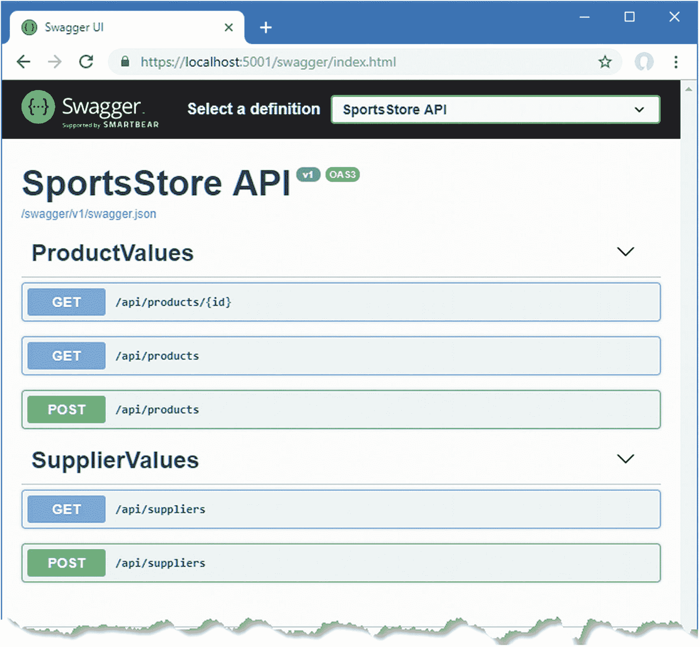

# 六、完成 Web 服务

在第 5 章中，我创建了 web 服务并添加了对处理 HTTP GET 请求的支持。在本章中，我通过添加对 POST、PUT、PATCH 和 DELETE 方法的支持来完成实现，这允许客户端创建、更新和删除数据。

本章中的 web 服务功能是不安全的，这意味着任何客户端都可以访问数据并进行更改。在第 [12 章](12.html)中，我将向您展示如何向 web 服务添加认证和授权。

## 为本章做准备

这一章使用了我在第 3 章中创建的 SportsStore 项目，并在之后的章节中进行了修改。打开一个新的 PowerShell 命令提示符，导航到`SportsStore/ServerApp`文件夹，运行清单 [6-1](#PC1) 中所示的命令，启动 ASP.NET Core 运行时和 Angular 开发工具。如果需要重置数据库，在运行清单 [6-1](#PC1) 中的命令之前，运行`ServerApp`文件夹中的`dotnet ef database drop --force`命令。

```cs
dotnet watch run

Listing 6-1.Starting the Development Tools

```

打开新的浏览器窗口并导航至`https://localhost:5001`；您将看到如图 [6-1](#Fig1) 所示的内容。

### 小费

你可以从源代码库 [`https://github.com/Apress/esntl-angular-for-asp.net-core-mvc-3`](https://github.com/Apress/esntl-angular-for-asp.net-core-mvc-3) 免费下载每章的完整项目。运行`ClientApp`文件夹中的`npm install`，安装 Angular 开发所需的包，然后按照指示启动开发工具。


图 6-1。

运行示例应用

## 实现 POST 方法

HTTP POST 方法用于在数据库中存储新的数据对象。第 [5](05.html) 章表明，让 Angular、ASP.NET Core MVC 和实体框架核心协同工作需要一些小心，尤其是当涉及到相关数据时，实现 POST 请求也有其缺陷。在接下来的小节中，我将向您展示如何添加对创建数据的支持，同时避免最常见的问题。

### 了解 API 增强

添加对 POST 方法的支持将扩展 web 服务提供的 API，如表 [6-1](#Tab1) 所示。

表 6-1。

具有 POST 支持的 Web 服务 API，用于存储新对象

<colgroup><col class="tcol1 align-left"> <col class="tcol2 align-left"> <col class="tcol3 align-left"></colgroup> 
| 

方法

 | 

统一资源定位器

 | 

描述

 |
| --- | --- | --- |
| `GET` | `/api/products/<id>` | 检索单个`Product`对象 |
| `GET` | `/api/products` | 检索多个`Product`对象 |
| `POST` | `/api/products` | 存储一个新的`Product`对象 |
| `POST` | `/api/suppliers` | 存储一个新的`Product`对象 |

表 [6-1](#Tab1) 中的附加内容为数据模型中的`Product`和`Supplier`类提供了 URL。允许客户机在一个请求中提供新的相关数据是很诱人的，这样一个`Product`对象和一个新的`Supplier`对象一起被接收，并且都被存储在数据库中。这种方法在开始时工作得很好，但很快变得复杂，最终会产生一个需要深入了解 web 服务内部工作方式的客户端，而一个需要不断修补的 web 服务对应用中其他地方的变化响应很差。

一种更健壮的方法是分别处理每种类型数据的创建。这需要最初做更多的工作，但会产生更好的结果，更容易响应变化。

### 避免 URL 中的键值

注意，表 [6-1](#Tab1) 中的 URL 不包括 ID，比如`/api/products/100`，例如，告诉 web 服务存储一个新的`Product`对象，其`ProductId`值为`100`，反映了使用 GET 方法查询单个对象的 URL 格式。

将应用数据存储为关系数据会对可用于`Product`对象的`ProductId`属性的值产生限制，因为该值被用作数据库中的主键。`ProductId`值必须是数字，并且不能超过 SQL 数据类型的最大值，该数据类型已被分配用于在数据库表中存储`ProductId`值。最关键的是，值必须唯一。客户端必须了解所有这些限制，并且在它们发生变化时进行更新，客户端的活动必须以某种方式进行协调，以避免选择重复的值。所有这些都是可能的，但是让数据库服务器在存储数据时自动生成值要简单得多，这是 Entity Framework Core 默认配置数据库的方式。这确保了只使用有效的值，并避免了处理多个客户端同时使用同一个密钥存储数据的需要。

### 创建数据绑定类

我将定义一个单独的类，MVC 模型绑定器将使用它来获取应该从 POST 请求中创建的`Product`对象的详细信息。创建一个`Models/BindingTargets`文件夹，并添加一个名为`ProductData.cs`的 C# 类文件，代码如清单 [6-2](#PC2) 所示。

```cs
using System.ComponentModel.DataAnnotations;

namespace ServerApp.Models.BindingTargets {

    public class ProductData {

        [Required]
        public string Name { get; set; }

        [Required]
        public string Category { get; set; }

        [Required]
        public string Description { get; set; }

        [Range(1, int.MaxValue, ErrorMessage = "Price must be at least 1")]
        public decimal Price { get; set; }

        public long Supplier { get; set; }

        public Product Product => new Product {
            Name = Name, Category = Category,
            Description = Description, Price = Price,
            Supplier = Supplier == 0 ? null : new Supplier { SupplierId = Supplier }
        };
    }
}

Listing 6-2.The Contents of the ProductData.cs File in the ServerApp/Models/BindingTargets Folder

```

在下一节中，我将使用`ProductData`类作为接收 POST 请求的动作方法的参数。这将允许我从客户端接收如下所示的 JSON 数据:

```cs
{ "name": "X-Ray Scuba Mask", "category": "Watersports",
  "description": "See what the fish are hiding", "price": 49.99,
  "supplier": 1 }

```

由`ProductData`类定义的`Product`属性创建了一个`Product`对象和一个`Supplier`对象，我将用它们来执行数据库操作，如下一节所示。

### 使用数据绑定类

你不必像清单 [6-2](#PC2) 中那样使用单独的类，但是使用原始的数据模型类，在这个例子中是`Product`，会变得太复杂而难以管理。

我可以使用`Product`类获得我需要的数据，但是试图从 MVC 模型绑定器获得正确的结果，同时避免实体框架核心和 JSON 序列化器的问题，这将是复杂的。

首先，我不希望客户端提供一个`ProductId`值或者包含一个`Supplier`对象作为相关数据，而是希望通过指定键来接收`Product`应该与之相关联的`Supplier`的详细信息。为了允许客户端发送我想要的数据，我必须给`Product`类添加一个属性。但是这并不简单；例如，我不能添加名为`Supplier`的属性，因为它已经被用作导航属性。我可以添加一个名为`SupplierId`的属性，但是它会被实体框架核心检测到并用来更新数据库模式，以防止`Product`对象在没有与`Supplier`建立关系的情况下被存储。该属性的值将由实体框架核心在读取数据时设置，然后由 JSON 序列化程序包含在 GET 请求的响应中。如果我使用不同的属性名，Entity Framework Core 将向数据库中的`Products`表添加一个新列。

MVC 模型绑定器使用的验证属性，包括清单 [6-2](#PC2) 中使用的`Required`和`Range`属性，也被实体框架核心用来对数据库模式应用约束。将这些属性应用到`Product`类将会在下次创建和应用数据库迁移时改变模式，导致意想不到的结果，甚至在某些情况下丢失数据。

所有这些问题都可以使用属性来解决。JSON 序列化程序支持一个属性，该属性告诉它忽略一个属性。实体框架核心支持一个属性，该属性告诉它不要在数据库表中创建新列。MVC 框架支持防止模型绑定器从请求数据中填充属性的属性，并支持指定 buddy 类来提供验证元数据，以便它不会被实体框架核心检测到。

但是结果是`Product`类被装饰在试图管理序列化器、模型绑定器和数据层的交互的属性中。随着应用变得越来越复杂，管理模型类及其行为变得越来越困难。添加一个专门用于数据绑定的类可以让我划分功能，这样我就可以以合理的格式从客户端获得我想要的数据，而不用担心会导致意外的副作用。

创建`Supplier`对象时，需要一个类似的类来处理数据。用清单 [6-3](#PC4) 中所示的语句将一个名为`SupplierData.cs`的 C# 类文件添加到`Models/BindingTargets`文件夹中。

```cs
using System.ComponentModel.DataAnnotations;

namespace ServerApp.Models.BindingTargets {

    public class SupplierData {

        [Required]
        public string Name { get; set; }

        [Required]
        public string City { get; set; }

        [Required]
        [StringLength(2, MinimumLength = 2)]
        public string State { get; set; }

        public Supplier Supplier => new Supplier {
            Name = Name, City = City, State = State
        };
    }
}

Listing 6-3.The Contents of the SupplierData.cs File in the ServerApp/Models/BindingTargets Folder

```

### 实现 Web 服务动作方法

处理 POST 请求的 action 方法的实现比第 5 章[的 GET 操作简单。为了增加对创建对象的支持，将清单](05.html) [6-4](#PC5) 中所示的方法添加到`ProductValues`控制器中。

```cs
using Microsoft.AspNetCore.Mvc;
using ServerApp.Models;
using Microsoft.EntityFrameworkCore;
using System.Linq;
using System.Collections.Generic;

using ServerApp.Models.BindingTargets;

namespace ServerApp.Controllers {

    [Route("api/products")]
    [ApiController]
    public class ProductValuesController : Controller {
        private DataContext context;

        public ProductValuesController(DataContext ctx) {
            context = ctx;
        }

        // ..other action methods omitted for brevity...

        [HttpPost]
        public IActionResult CreateProduct([FromBody] ProductData pdata) {
            if (ModelState.IsValid) {
                Product p = pdata.Product;
                if (p.Supplier != null && p.Supplier.SupplierId != 0) {
                    context.Attach(p.Supplier);
                }
                context.Add(p);
                context.SaveChanges();
                return Ok(p.ProductId);
            } else {
                return BadRequest(ModelState);
            }
        }
    }
}

Listing 6-4.Adding an Action in the ProductValuesController.cs File in the ServerApp/Controllers Folder

```

`CreateProduct`方法有一个`ProductData`参数，它将由 MVC 模型绑定器用客户端发送的数据填充。这个参数用`FromBody`属性修饰，该属性告诉模型绑定器从请求体获取数据值，如果没有数据值，客户端发送的 JSON 数据将被忽略。

`CreateProduct`方法的结果是一个`IActionResult`方法，如果客户端发送的数据没有通过使用`Required`和`Range`属性应用的验证检查，它提供了返回错误的灵活性。如果数据没有执行验证，那么一个 400 错误请求响应将被发送到客户机，同时发送的还有包含验证错误列表的 JSON 数据。

```cs
...
return BadRequest(ModelState);
...

```

如果数据确实通过了验证，那么我通过调用`ProductData.Product`属性来获取`Product`对象。为了确定`Product`是否与`Supplier`相关，我检查了`Product.Suppler.SupplierId`属性的值，如果它被定义并且不为零，我调用数据库上下文对象的`Attach`方法，如下所示:

```cs
...
if (p.Supplier != null && p.Supplier.SupplierId != 0) {
    context.Attach(p.Supplier);
}
...

```

默认情况下，实体框架核心将自动创建相关对象，这意味着它将尝试创建新的`Supplier`对象和新的`Product`对象。这是因为实体框架核心不知道任何关于`Product`和`Supplier`对象的事情，只是假设它们都是新的并且必须存储在数据库中。这就产生了一个问题，因为当指定了`SupplierId`值时，数据库不允许创建`Supplier`对象，因为应该已经有一个具有该`SupplierId`值的`Supplier`。`Attach`方法使实体框架核心知道一个对象，并告诉它只有对它的后续更改才应该写入数据库。

### 小费

注意，`Supplier`对象只有一个`SupplierId`值。因为 POST 操作的目的是创建一个`Product`对象，所以只需要`Products`表中新行所需的数据。这意味着实体框架核心只需要知道`SupplierId`属性的值，这样它就可以创建外键关系，并忽略其余的`Supplier`属性，这意味着客户端不需要向 web 服务发送这些属性的值。

数据库上下文的`Add`方法告诉实体框架核心`Product`对象应该存储在数据库中，并且当调用`SaveChanges`方法时执行操作。

```cs
...
context.Add(p);
context.SaveChanges();
...

```

当数据被存储时，数据库将为`ProductId`属性生成一个值，并用该值自动更新`Product`对象。为了给客户端提供值，我将它传递给`Ok`方法，这样它就可以包含在 200 OK 响应中。

```cs
...
return Ok(p.ProductId);
...

```

#### 为供应商对象创建 Web 服务控制器

MVC 框架足够灵活，可以在单个 web 服务控制器中支持多种数据类型和 URL，但是为每种数据类型定义一个控制器会产生更易于理解和管理的代码。将名为`SupplierValuesController.cs`的新 C# 类文件添加到`ServerApp/Controllers`文件夹中，并添加清单 [6-5](#PC10) 中所示的代码。

```cs
using Microsoft.AspNetCore.Mvc;
using ServerApp.Models;
using ServerApp.Models.BindingTargets;
using System.Collections.Generic;

namespace ServerApp.Controllers {

    [Route("api/suppliers")]
    public class SupplierValuesController : Controller {
        private DataContext context;

        public SupplierValuesController(DataContext ctx) {
            context = ctx;
        }

        [HttpGet]
        public IEnumerable<Supplier> GetSuppliers() {
            return context.Suppliers;
        }

        [HttpPost]
        public IActionResult CreateSupplier([FromBody]SupplierData sdata) {
            if (ModelState.IsValid) {
                Supplier s = sdata.Supplier;
                context.Add(s);
                context.SaveChanges();
                return Ok(s.SupplierId);
            } else {
                return BadRequest(ModelState);
            }
        }
    }
}

Listing 6-5.The Contents of the SupplierValuesController.cs File in the ServerApp/Controllers Folder

```

这个控制器使用`Route`属性，这样它就可以处理发送到`/api/suppliers` URL 的请求。GET 和 POST 请求有动作方法，遵循查询和创建`Supplier`对象的相同模式。

使用 Control+C 停止 ASP.NET Core 运行时，并使用命令提示符运行在`ServerApp`文件夹中的清单 [6-6](#PC11) 中显示的命令，以重启运行时并将新类合并到构建过程中。

```cs
dotnet watch run

Listing 6-6.Starting the ASP.NET Core Runtime

```

一旦 ASP.NET Core 运行时重新启动，您可以通过导航到`https://localhost:5001/swagger`来探索对 web 服务的更改，这将显示在第 [5](05.html) 章中安装和配置的工具。新的控制器和动作被自动检测并显示在图 [6-2](#Fig2) 的操作列表中。



图 6-2。

使用 Swagger 探索 web 服务的变化

单击 GET 和 POST 按钮允许将 HTTP 请求发送到服务器。发送 POST 请求可能会很麻烦，因为所需的数据结构很复杂，但是 Swagger 是检查对 web 服务所做的更改是否达到预期效果的好方法。

### 在 Angular 应用中创建数据对象

要添加对在 Angular 应用中创建新的`Product`和`Supplier`对象的支持，请将清单 [6-7](#PC12) 中所示的方法添加到`Repository`类中，以便它可以向 web 服务发送 POST 请求。

```cs
import { Product } from "./product.model";
import { Injectable } from "@angular/core";
import { HttpClient } from "@angular/common/http";
import { Filter } from "./configClasses.repository";

import { Supplier } from "./supplier.model";

const productsUrl = "/api/products";

const suppliersUrl = "/api/suppliers";

@Injectable()
export class Repository {
    product: Product;
    products: Product[];
    suppliers: Supplier[] = [];
    filter: Filter = new Filter();

    constructor(private http: HttpClient) {
        //this.filter.category = "soccer";
        this.filter.related = true;
        this.getProducts();
    }

    getProduct(id: number) {
        this.http.get<Product>(`${productsUrl}/${id}`)
            .subscribe(p => this.product = p);
    }

    getProducts() {
        let url = `${productsUrl}?related=${this.filter.related}`;
        if (this.filter.category) {
            url +=  `&category=${this.filter.category}`;
        }
        if (this.filter.search) {
            url += `&search=${this.filter.search}`;
        }
        this.http.get<Product[]>(url).subscribe(prods => this.products = prods);
    }

    getSuppliers() {
      this.http.get<Supplier[]>(suppliersUrl)
          .subscribe(sups => this.suppliers = sups);
    }

    createProduct(prod: Product) {
        let data = {
            name: prod.name, category: prod.category,
            description: prod.description, price: prod.price,
            supplier: prod.supplier ? prod.supplier.supplierId : 0
        };

        this.http.post<number>(productsUrl, data)
            .subscribe(id => {
                prod.productId = id;
                this.products.push(prod);
            });
    }

    createProductAndSupplier(prod: Product, supp: Supplier) {
        let data = {
            name: supp.name, city: supp.city, state: supp.state
        };

        this.http.post<number>(suppliersUrl, data)
          .subscribe(id => {
              supp.supplierId = id;
              prod.supplier = supp;
              this.suppliers.push(supp);
              if (prod != null) {
                  this.createProduct(prod);
              }
          });
    }
}

Listing 6-7.Sending POST Requests in the repository.ts File in the ClientApp/src/app Folder

```

`createProduct`方法接受一个`Product`对象，用它创建一个 web 服务所需格式的对象，并通过调用`HttpClient.post`方法使用 POST 请求发送它。

泛型类型参数用于指定 POST 请求返回的数据类型，它是`number`，因为服务器发回了分配给新对象的 ID。请求结果通过`post`方法返回的`Observable`上的`subscribe`方法接收，并用于更新`Product`对象，然后将其添加到`Product`对象的本地数组中。

`createProductAndSupplier`方法基于`createProduct`方法创建一个`Supplier`，然后创建一个相关的`Product`。

#### 添加对在组件中创建对象的支持

下一步是在 Angular 组件中定义方法，当用户想要创建新产品或供应商时，可以调用这些方法，如清单 [6-8](#PC13) 所示。

```cs
import { Component } from '@angular/core';
import { Repository } from "./models/repository";
import { Product } from "./models/product.model";

import { Supplier } from "./models/supplier.model";

@Component({
    selector: 'app-root',
    templateUrl: './app.component.html',
    styleUrls: ['./app.component.css']
})
export class AppComponent {

    constructor(private repo: Repository) { }

    get product(): Product {
        return this.repo.product;
    }

    get products(): Product[] {
        return this.repo.products;
    }

    createProduct() {
        this.repo.createProduct(new Product(0, "X-Ray Scuba Mask", "Watersports",
            "See what the fish are hiding", 49.99, this.repo.products[0].supplier));
    }

    createProductAndSupplier() {
        let s = new Supplier(0, "Rocket Shoe Corp", "Boston", "MA");
        let p = new Product(0, "Rocket-Powered Shoes", "Running",
            "Set a new record", 100, s);
        this.repo.createProductAndSupplier(p, s);
    }
}

Listing 6-8.Adding Methods in the app.component.ts File in the ClientApp/src/app Folder

```

`createProduct`方法创建一个新的`Product`对象，并要求存储库将其发送给 web 服务。将与`Product`关联的`Supplier`取自`products`数组中的第一个元素，这样就可以测试 web 服务了。`createProductAndSupplier`创建`Product`和`Supplier`对象，并将它们传递给相应的存储库方法。

#### 更新组件模板

最后一步是在 Angular 应用的 HTML 模板中添加一个新元素，这将允许用户通过调用组件中的`createProduct`来触发新对象的创建，如清单 [6-9](#PC14) 所示。

```cs
<div class="p-2">
  <table class="table table-sm table-striped">
      <tbody>
          <tr>
              <th>Name</th><th>Category</th><th>Price</th>
              <th>Supplier</th><th>Ratings</th>
          </tr>
          <tr *ngFor="let product of products">
              <td>{{product.name}}</td>
              <td>{{product.category}}</td>
              <td>{{product.price}}</td>
              <td>{{product.supplier?.name || 'None'}}</td>
              <td>{{product.ratings?.length || 0}}</td>
          </tr>
      </tbody>
  </table>
    <button class="btn btn-primary m-1" (click)="createProduct()">
        Create Product
    </button>
    <button class="btn btn-primary m-1" (click)="createProductAndSupplier()">
        Create Product and Supplier
    </button>
</div>

Listing 6-9.Adding Elements in the app.component.html File in the ClientApp/src/app Folder

```

已经使用 Angular*事件绑定*特性配置了`button`元素，该特性通过评估表达式来响应 HTML 元素生成的事件。该元素突出显示的部分是事件绑定:

```cs
...
<button class="btn btn-primary m-1" (click)="createProduct()">
...

```

括号(`(`和`)`字符)表示一个事件绑定，并包围事件的名称，即`click`。当用户点击按钮时，触发`click`事件，此时 Angular 计算表达式并调用组件的`createProduct`方法，在清单 [6-8](#PC13) 中定义。事件绑定表达式只能访问组件定义的方法和属性。结果是点击按钮将创造新产品。

导航到`https://localhost:5001`并点击 Create Product 按钮，一个新项目将出现在表格中，与现有的 Splash Dudes 供应商相关联。点击 Create Product And Supplier 按钮，将会出现一个新的条目，它与一个新的 Rocker Shoe Corp .供应商相关联。图 [6-3](#Fig3) 显示了两个按钮的效果。如果您重复单击这些按钮，将会创建多个对象，但是每个对象都有不同的`ProductId`或`SupplierId`属性值，这些属性值将由数据库服务器分配。

### 注意

Angular 应用的结构将创建新对象的过程与显示它们的过程分开。web 服务返回的对象被添加到数据模型中，并由 Angular 通过`ngFor`指令自动显示，该指令向表中添加一个新行。您可能会发现这种方法很复杂，但是它简化了创建应用特性的过程，因为对数据模型的任何更改都会自动显示给用户。


图 6-3。

创造新产品

## 实现 PUT 方法

HTTP PUT 方法用于用一个新的数据对象替换一个现有的数据对象，它需要的方法类似于前一节中 POST 方法所需要的方法。支持 PUT 方法导致了 web 服务 API 的扩展，如表 [6-2](#Tab2) 所述。对于所有新的 URL，正在更新的对象将使用请求 URL 的`id`段来标识。

### 小费

使用 PUT 方法时，客户端必须为新对象的所有属性提供值。如果您想执行更具选择性的更新，请参阅关于实现修补方法的部分。

表 6-2。

支持更新对象的 PUT 的 Web 服务 API

<colgroup><col class="tcol1 align-left"> <col class="tcol2 align-left"> <col class="tcol3 align-left"></colgroup> 
| 

方法

 | 

统一资源定位器

 | 

描述

 |
| --- | --- | --- |
| `GET` | `/api/products/<id>` | 检索单个`Product`对象 |
| `GET` | `/api/products` | 检索多个`Product`对象 |
| `POST` | `/api/products` | 存储一个新的`Product`对象 |
| `POST` | `/api/suppliers` | 存储一个新的`Supplier`对象 |
| `PUT` | `/api/products/<id>` | 替换现有的`Product`对象 |
| `PUT` | `/api/suppliers/<id>` | 替换现有的`Supplier`对象 |

### 实现 Web 服务动作方法

为了增加对更新`Product`数据的支持，在`ProductValues`控制器中增加清单 [6-10](#PC16) 所示的动作方法。

```cs
using Microsoft.AspNetCore.Mvc;
using ServerApp.Models;
using Microsoft.EntityFrameworkCore;
using System.Linq;
using System.Collections.Generic;
using ServerApp.Models.BindingTargets;

namespace ServerApp.Controllers {

    [Route("api/products")]
    [ApiController]
    public class ProductValuesController : Controller {
        private DataContext context;

        public ProductValuesController(DataContext ctx) {
            context = ctx;
        }

        // ...other methods omitted for brevity...

        [HttpPut("{id}")]
        public IActionResult ReplaceProduct(long id, [FromBody] ProductData pdata) {
            if (ModelState.IsValid) {
                Product p = pdata.Product;
                p.ProductId = id;
                if (p.Supplier != null && p.Supplier.SupplierId != 0) {
                    context.Attach(p.Supplier);
                }
                context.Update(p);
                context.SaveChanges();
                return Ok();
            } else {
                return BadRequest(ModelState);
            }
        }
    }
}

Listing 6-10.Adding an Action in the ProductValuesController.cs File in the ServerApp/Controllers Folder

```

MVC 模型绑定器将从请求数据中创建`ProductData`对象，然后用它来创建`Product`，它的`ProductId`属性是从`id`参数中设置的，以便实体框架核心知道哪个现有的对象将被更新。

数据上下文对象的`Attach`方法用于防止实体框架核心试图存储新的`Supplier`对象，而`Update`方法用于向实体框架核心注册`Product`对象，以便它将替换现有数据。

通过调用`SaveChanges`方法更新数据库，使用`Ok`方法向客户端返回 200 OK 响应。如果请求数据没有通过验证，将会发送 400 错误请求响应，并且不会执行任何更新。

替换`Supplier`对象需要类似的代码。将清单 [6-11](#PC17) 所示的动作方法添加到`SupplierValues`控制器中。

```cs
using Microsoft.AspNetCore.Mvc;
using ServerApp.Models;
using ServerApp.Models.BindingTargets;
using System.Collections.Generic;

namespace ServerApp.Controllers {

    [Route("api/suppliers")]
    [ApiController]
    public class SupplierValuesController : Controller {
        private DataContext context;

        public SupplierValuesController(DataContext ctx) {
            context = ctx;
        }

        // ...other methods omitted for brevity...

        [HttpPut("{id}")]
        public IActionResult ReplaceSupplier(long id,
                [FromBody] SupplierData sdata) {
            if (ModelState.IsValid) {
                Supplier s = sdata.Supplier;
                s.SupplierId = id;
                context.Update(s);
                context.SaveChanges();
                return Ok();
            } else {
                return BadRequest(ModelState);
            }
        }
    }
}

Listing 6-11.Adding an Action in the SupplierValuesController.cs File in the ServerApp/Controllers Folder

```

替换`Supplier`对象不需要特殊的措施，上下文对象的`Update`方法用于告诉实体框架核心替换从`SupplierData`参数中获得的`Supplier`。

### 更换 Angular 应用中的产品

到目前为止，利用新的 web 服务特性的过程已经很熟悉了，尽管并不是所有关于 Angular 如何工作的细节都很清楚。首先，向 Angular `Repository`类添加新方法，该类将接受`Product`或`Supplier`对象，并向 web 服务发送一个 PUT 请求，如清单 [6-12](#PC18) 所示。

```cs
import { Product } from "./product.model";
import { Injectable } from "@angular/core";
import { HttpClient } from "@angular/common/http";
import { Filter } from "./configClasses.repository";
import { Supplier } from "./supplier.model";

const productsUrl = "/api/products";
const suppliersUrl = "/api/suppliers";

@Injectable()
export class Repository {
    product: Product;
    products: Product[];
    suppliers: Supplier[] = [];
    filter: Filter = new Filter();

    constructor(private http: HttpClient) {
        this.filter.related = true;
        this.getProducts();
    }

    // ...other methods omitted for brevity...

    replaceProduct(prod: Product) {
        let data = {
            name: prod.name, category: prod.category,
            description: prod.description, price: prod.price,
            supplier: prod.supplier ? prod.supplier.supplierId : 0
        };
        this.http.put(`${productsUrl}/${prod.productId}`, data)
            .subscribe(() => this.getProducts());
    }

    replaceSupplier(supp: Supplier) {
        let data = {
            name: supp.name, city: supp.city, state: supp.state
        };
        this.http.put(`${suppliersUrl}/${supp.supplierId}`, data)
            .subscribe(() => this.getProducts());
    }
}

Listing 6-12.Adding Methods in the repository.ts File in the ClientApp/src/app Folder

```

我通过调用`HttpClient.put`方法发送 HTTP PUT 请求，并使用`subscribe`方法刷新`Product`数据。这是一种低效的方法，但是它证明了您可以通过启动另一个请求来处理来自一个 HTTP 请求的响应。

#### 添加对替换组件中对象的支持

下一步是向 Angular 组件添加方法，可以使用组件模板中的事件绑定来调用这些方法，如清单 [6-13](#PC19) 所示。

```cs
import { Component } from '@angular/core';
import { Repository } from "./models/repository";
import { Product } from "./models/product.model";
import { Supplier } from "./models/supplier.model";

@Component({
    selector: 'app-root',
    templateUrl: './app.component.html',
    styleUrls: ['./app.component.css']
})
export class AppComponent {

    constructor(private repo: Repository) { }

    // ...other methods omitted for brevity...

    replaceProduct() {
        let p = this.repo.products[0];
        p.name = "Modified Product";
        p.category = "Modified Category";
        this.repo.replaceProduct(p);
    }

    replaceSupplier() {
        let s = new Supplier(3, "Modified Supplier", "New York", "NY");
        this.repo.replaceSupplier(s);
    }
}

Listing 6-13.Adding Methods in the app.component.ts File in the ClientApp/src/app Folder

```

新方法`replaceProduct`和`replaceSupplier`创建替换对象，并使用存储库将它们发送到 web 服务。将清单 [6-14](#PC20) 中所示的元素添加到组件的模板中，以便可以调用新的组件方法。

```cs
<div class="p-2">
    <table class="table table-sm table-striped">
        <tbody>
            <tr>
                <th>Name</th><th>Category</th><th>Price</th>
                <th>Supplier</th><th>Ratings</th>
            </tr>
            <tr *ngFor="let product of products">
                <td>{{product.name}}</td>
                <td>{{product.category}}</td>
                <td>{{product.price}}</td>
                <td>{{product.supplier?.name || 'None'}}</td>
                <td>{{product.ratings?.length || 0}}</td>
              </tr>
        </tbody>
    </table>
    <button class="btn btn-primary m-1" (click)="createProduct()">
        Create Product
    </button>
    <button class="btn btn-primary m-1" (click)="createProductAndSupplier()">
        Create Product and Supplier
    </button>
    <button class="btn btn-primary m-1" (click)="replaceProduct()">
        Replace Product
    </button>
    <button class="btn btn-primary m-1" (click)="replaceSupplier()">
        Replace Supplier
    </button>
</div>

Listing 6-14.Adding Elements in the app.component.html File in the ClientApp/src/app Folder

```

新的`button`元素通过调用组件方法的表达式使用`click`事件绑定。允许 ASP.NET Core 运行时重启，使用浏览器导航到`https://localhost:5001`，点击替换产品和替换供应商按钮，效果如图 [6-4](#Fig4) 所示。


图 6-4。

替换对象

点击替换产品按钮时，表格中的第一个`Product`将被替换。当您点击替换供应商按钮时，与`Chess`产品相关的`Supplier`被替换。

## 实施修补方法

对于简单的数据类型，可以通过使用 PUT 方法替换现有对象来处理编辑操作。例如，即使您只需要更改`Product`类中的一个属性值，使用 PUT 方法并包含所有其他`Product`属性的值也不会太麻烦。

但是并不是所有的数据类型都很容易处理，要么是因为它们定义了更多的属性，要么是因为出于安全原因客户端不能访问所有的属性。解决方案是使用一个补丁请求，它只将更改发送给 web 服务，而不是一个完整的替换对象。支持补丁方法导致 web 服务 API 的扩展，如表 [6-3](#Tab3) 所述。

### 小费

您可以选择实现修补方法的数据类型。对于 SportsStore 应用，我将只为`Product`对象提供支持，这意味着对`Supplier`对象的更改只能使用 PUT 请求来执行。

表 6-3。

支持更新对象的 PUT 的 Web 服务 API

<colgroup><col class="tcol1 align-left"> <col class="tcol2 align-left"> <col class="tcol3 align-left"></colgroup> 
| 

方法

 | 

统一资源定位器

 | 

描述

 |
| --- | --- | --- |
| `GET` | `/api/products/<id>` | 检索单个`Product`对象 |
| `GET` | `/api/products` | 检索多个`Product`对象 |
| `POST` | `/api/products` | 存储一个新的`Product`对象 |
| `POST` | `/api/suppliers` | 存储一个新的`Supplier`对象 |
| `PUT` | `/api/products/<id>` | 替换现有的`Product`对象 |
| `PUT` | `/api/suppliers/<id>` | 替换现有的`Supplier`对象 |
| `PATCH` | `/api/products/<id>` | 更新一个`Product`对象 |

### 了解 JSON 补丁

ASP.NET Core MVC 支持使用 JSON 补丁标准，该标准允许以统一的方式指定变更。JSON 补丁标准允许描述一组复杂的更改，但是对于 SportsStore 应用，我只需要处理两种对`Product`对象的更改:修改属性值和删除属性。更改属性值将允许客户端有选择地编辑现有数据，而删除属性将允许客户端中断`Product`和它的`Supplier`之间的关系。

我不打算深入 JSON 补丁标准的细节，您可以在 [`https://tools.ietf.org/html/rfc6902`](https://tools.ietf.org/html/rfc6902) 阅读，但是客户端将在它的 HTTP 补丁请求中发送这样的 web 服务 JSON 数据:

```cs
[
 { "op": "replace", "path": "name", "value": "Green Kayak"},
 { "op": "replace", "path": "price", "value": 200},
 { "op": "replace", "path": "supplier", "value": null}
]

```

JSON 补丁文档被表示为一组操作。每个操作都有一个指定操作类型的`op`属性和一个指定操作应用位置的`path`属性。

对于 SportsStore 应用——事实上，对于大多数应用——只需要`replace`操作，它用于更改属性值。这个 JSON 补丁文档为`name`、`price`和`supplier`属性设置了新值。(将`supplier`属性设置为`null`的效果是中断与供应商的关系。)JSON 补丁文档中没有包含的由`Product`类定义的属性将不会被修改。

### 增强产品绑定目标

我需要增强`Product`对象的模型绑定目标，让 JSON 补丁文档与 ASP.NET Core MVC 和实体框架核心无缝协作，以确保只有受补丁请求影响的值才会被修改。为此，对`ProductData`类进行清单 [6-15](#PC22) 中所示的更改。

```cs
using System.ComponentModel.DataAnnotations;

namespace ServerApp.Models.BindingTargets {

    public class ProductData {

        [Required]
        public string Name {
            get => Product.Name; set => Product.Name = value;
        }

        [Required]
        public string Category {
            get => Product.Category; set => Product.Category = value;
        }

        [Required]
        public string Description {
            get => Product.Description; set => Product.Description = value;
        }

        [Range(1, int.MaxValue, ErrorMessage = "Price must be at least 1")]
        public decimal Price {
            get => Product.Price; set => Product.Price = value;
        }

        public long? Supplier {
            get => Product.Supplier?.SupplierId ?? null;
            set {
                if (!value.HasValue) {
                    Product.Supplier = null;
                } else {
                    if (Product.Supplier == null) {
                        Product.Supplier = new Supplier();
                    }
                    Product.Supplier.SupplierId = value.Value;
                }
            }
        }

        public Product Product { get; set; } = new Product();
    }
}

Listing 6-15.Adding an Object in the ProductData.cs File in the ServerApp/Models/BindingTargets Folder

```

这些变化将由`ProductData`类定义的属性映射到一个`Product`对象上。这允许我利用`Product`对象上的实体框架核心变更跟踪特性，确保只有被 JSON 补丁文档中的操作所变更的值才会在数据库中被更新。

### 实现 Web 服务动作方法

为了增加对处理`Product`对象的补丁请求的支持，将清单 [6-16](#PC23) 中所示的动作方法添加到`ProductValues`控制器中。

```cs
using Microsoft.AspNetCore.Mvc;
using ServerApp.Models;
using Microsoft.EntityFrameworkCore;
using System.Linq;
using System.Collections.Generic;
using ServerApp.Models.BindingTargets;

using Microsoft.AspNetCore.JsonPatch;

using System.Text.Json;

using System.Reflection;

using System.ComponentModel;

namespace ServerApp.Controllers {

    [Route("api/products")]
    [ApiController]
    public class ProductValuesController : Controller {
        private DataContext context;

        public ProductValuesController(DataContext ctx) {
            context = ctx;
        }

        // ...other methods omitted for brevity...

        [HttpPatch("{id}")]
        public IActionResult UpdateProduct(long id,
                [FromBody]JsonPatchDocument<ProductData> patch) {

            Product product = context.Products
                                .Include(p => p.Supplier)
                                .First(p => p.ProductId == id);
            ProductData pdata = new ProductData { Product = product };

            patch.ApplyTo(pdata, ModelState);

            if (ModelState.IsValid && TryValidateModel(pdata)) {

                if (product.Supplier != null && product.Supplier.SupplierId != 0) {
                    context.Attach(product.Supplier);
                }
                context.SaveChanges();
                return Ok();
            } else {
                return BadRequest(ModelState);
            }
        }

    }
}

Listing 6-16.Adding an Action in the ProductValuesController.cs File in the ServerApp/Controllers Folder

```

`UpdateProduct`方法用`HttpPatch`属性修饰，并定义了一个`long`参数和一个`JsonPatchDocument<ProductData>`参数，前者标识被修改的`Product`，后者表示 JSON 补丁文档(该参数必须用`FromBody`属性修饰)。描述操作的`JsonPatchDocument`在`Microsoft.AspNetCore.JsonPatch`名称空间中定义。

为了从数据库中获取当前数据，我检索由`id`参数标识的`Product`对象，并使用它创建一个`ProductData`对象。

```cs
...
Product product = context.Products
                       .Include(p => p.Supplier)
                       .First(p => p.ProductId == id);
ProductData pdata = new ProductData { Product = product };
...

```

实体框架核心对它创建的对象执行变更跟踪，这意味着只有对`Product`对象的修改才会被写入数据库。下一步是将 JSON 补丁文档中的操作应用到`ProductData`对象，这将把这些更改传递给`Product`对象。

```cs
...
patch.ApplyTo(pdata, ModelState);
...

```

`ApplyTo`方法更新控制器的模型状态，以记录 JSON 补丁文档中的任何错误，比如对不是由`ProductData`类定义的属性的操作。在将更改存储到数据库之前，我检查了`ModelState.IsValid`属性，并显式验证了`ProductData`对象，以确保更改没有产生无效的结果。

```cs
...
if (ModelState.IsValid && TryValidateModel(pdata)) {
...

```

如果没有验证错误，则通过调用上下文对象的`SaveChanges`方法将更改写入数据库，并将修改后的`Product`对象返回给客户端。为了支持解析 JSON 补丁请求，将清单 [6-17](#PC27) 中所示的语句添加到`Startup`类中。

```cs
...
public void ConfigureServices(IServiceCollection services) {

    string connectionString =
        Configuration["ConnectionStrings:DefaultConnection"];
    services.AddDbContext<DataContext>(options =>
        options.UseSqlServer(connectionString));

    services.AddControllersWithViews()
        .AddJsonOptions(opts => {
            opts.JsonSerializerOptions.IgnoreNullValues = true;
    }).AddNewtonsoftJson();

    services.AddRazorPages();

    services.AddSwaggerGen(options => {
        options.SwaggerDoc("v1",
            new OpenApiInfo { Title = "SportsStore API", Version = "v1" });
    });
}
...

Listing 6-17.Enabling JSON Patch Parsing in the Startup.cs File in the ServerApp Folder

```

`AddNewtonsoftJson`启用了早期版本的 ASP.NET Core 中使用的 JSON 解析器，它仍然是 JSON 补丁支持所需要的。要安装提供 JSON 特性的包，打开一个新的命令提示符并运行清单`ServerApp`文件夹中的 [6-18](#PC28) 所示的命令。

```cs
dotnet add package Microsoft.AspNetCore.Mvc.NewtonsoftJson --version 3.0.0

Listing 6-18.Installing the JSON Package

```

### 在 Angular 应用中更新对象

要添加对向 web 服务发送补丁请求的支持，请将清单 [6-19](#PC29) 中所示的方法添加到 Angular 应用的`Repository`类中。

```cs
import { Product } from "./product.model";
import { Injectable } from "@angular/core";
import { HttpClient } from "@angular/common/http";
import { Filter } from "./configClasses.repository";
import { Supplier } from "./supplier.model";

const productsUrl = "/api/products";
const suppliersUrl = "/api/suppliers";

@Injectable()
export class Repository {
    product: Product;
    products: Product[];
    suppliers: Supplier[] = [];
    filter: Filter = new Filter();

    constructor(private http: HttpClient) {
        this.filter.related = true;
        this.getProducts();
    }

    // ...other methods omitted for brevity...

    updateProduct(id: number, changes: Map<string, any>) {
        let patch = [];
        changes.forEach((value, key) =>
            patch.push({ op: "replace", path: key, value: value }));
        this.http.patch(`${productsUrl}/${id}`, patch)
            .subscribe(() => this.getProducts());
    }
}

Listing 6-19.Adding a Method in the repository.ts File in the ClientApp/src/app/models Folder

```

`updateProduct`方法接收一个`number`参数，该参数标识要修改的`Product`和一个`Map`对象，该对象的键是已经更改的属性的名称。使用`replace`操作为`Map`中的每个条目创建一个简单的 JSON 补丁文档，然后使用 HTTP 补丁请求将其发送给 web 服务。`subscribe`方法用于从 web 服务中重新加载数据。

#### 在组件中添加对更新对象的支持

下一步是向 Angular 组件添加一个方法，该方法可以使用组件模板中的事件绑定来调用，并通过调用存储库中的新方法来响应，如清单 [6-20](#PC30) 所示。

```cs
import { Component } from '@angular/core';
import { Repository } from "./models/repository";
import { Product } from "./models/product.model";
import { Supplier } from "./models/supplier.model";

@Component({
    selector: 'app-root',
    templateUrl: './app.component.html',
    styleUrls: ['./app.component.css']
})
export class AppComponent {

    constructor(private repo: Repository) { }

    // ...other methods omitted for brevity...

    updateProduct() {
        let changes = new Map<string, any>();
        changes.set("name", "Green Kayak");
        changes.set("supplier", null);
        this.repo.updateProduct(1, changes);
    }
}

Listing 6-20.Adding a Method in the app.component.ts File in the ClientApp/src/app Folder

```

新方法`updateproduct`更改了`name`属性，并将`supplier`属性设置为`null`。将清单 [6-21](#PC31) 中所示的元素添加到组件的模板中，以便可以调用新的组件方法。

```cs
<div class="p-2">
    <table class="table table-sm table-striped">
        <tbody>
            <tr>
                <th>Name</th><th>Category</th><th>Price</th>
                <th>Supplier</th><th>Ratings</th>
            </tr>
            <tr *ngFor="let product of products">
                <td>{{product.name}}</td>
                <td>{{product.category}}</td>
                <td>{{product.price}}</td>
                <td>{{product.supplier?.name || 'None'}}</td>
                <td>{{product.ratings?.length || 0}}</td>
              </tr>
        </tbody>
    </table>
    <button class="btn btn-primary m-1" (click)="createProduct()">
        Create Product
    </button>
    <button class="btn btn-primary m-1" (click)="createProductAndSupplier()">
        Create Product and Supplier
    </button>
    <button class="btn btn-primary m-1" (click)="replaceProduct()">
        Replace Product
    </button>
    <button class="btn btn-primary m-1" (click)="replaceSupplier()">
        Replace Supplier
    </button>
    <button class="btn btn-primary m-1" (click)="updateProduct()">
        Update Product
    </button>
</div>

Listing 6-21.Adding an Element in the app.component.html File in the ClientApp/src/app Folder

```

新的`button`元素使用`click`事件绑定和一个调用组件的`updateProduct`方法的表达式。重启 ASP.NET Core 运行时，用浏览器导航到`https://localhost:5001`，点击更新产品按钮，效果如图 [6-5](#Fig5) 所示。


图 6-5。

更新对象

### 小费

更新操作的代码只是为了检查特性是否工作。如果您想要重复更新，那么停止 ASP.NET Core 运行时，运行`ServerApp`文件夹中的`dotnet ef database drop --force`命令，然后再次启动 ASP.NET Core 运行时。数据库将作为启动序列的一部分重新创建，您将在 Angular 应用中看到原始的、未修改的数据。

## 实现删除方法

web 服务必须支持的最后一个 HTTP 方法是 DELETE，它用于删除数据。支持删除方法导致了 web 服务 API 的扩展，如表 [6-4](#Tab4) 所述。要删除的对象将由请求 URL 中的最后一段来标识。

表 6-4。

支持更新对象的 PUT 的 Web 服务 API

<colgroup><col class="tcol1 align-left"> <col class="tcol2 align-left"> <col class="tcol3 align-left"></colgroup> 
| 

方法

 | 

统一资源定位器

 | 

描述

 |
| --- | --- | --- |
| `GET` | `/api/products/<id>` | 检索单个`Product`对象 |
| `GET` | `/api/products` | 检索多个`Product`对象 |
| `POST` | `/api/products` | 存储一个新的`Product`对象 |
| `POST` | `/api/suppliers` | 存储一个新的`Supplier`对象 |
| `PUT` | `/api/products/<id>` | 替换现有的`Product`对象 |
| `PUT` | `/api/suppliers/<id>` | 替换现有的`Supplier`对象 |
| `PATCH` | `/api/products/<id>` | 更新一个`Product`对象 |
| `DELETE` | `/api/products/<id>` | 删除一个`Product`对象 |
| `DELETE` | `/api/suppliers/<id>` | 删除一个`Supplier`对象 |

### 配置数据库

数据库不允许删除数据，如果这样做会造成不一致。对于 SportsStore 应用，不一致的情况是删除了一个`Product`，但将其相关的`Rating`对象留在数据库中，导致表行与不存在的数据有外键关系。避免不一致意味着要么删除相关数据，要么更新数据，使其引用另一个对象。

避免不一致的最简单方法是让数据库自动为您处理相关数据。要更改数据库的配置，请将清单 [6-22](#PC32) 中所示的方法添加到数据库上下文类中。

```cs
using Microsoft.EntityFrameworkCore;

namespace ServerApp.Models {

    public class DataContext : DbContext {

        public DataContext(DbContextOptions<DataContext> opts)
            : base(opts) { }

        public DbSet<Product> Products { get; set; }
        public DbSet<Supplier> Suppliers { get; set; }
        public DbSet<Rating> Ratings { get; set; }

        protected override void OnModelCreating(ModelBuilder modelBuilder) {
            modelBuilder.Entity<Product>().HasMany<Rating>(p => p.Ratings)
                .WithOne(r => r.Product).OnDelete(DeleteBehavior.Cascade);
            modelBuilder.Entity<Product>().HasOne<Supplier>(p => p.Supplier)
                .WithMany(s => s.Products).OnDelete(DeleteBehavior.SetNull);
        }
    }
}

Listing 6-22.Configuring Delete Operations in the DataContext.cs File in the ServerApp/Models Folder

```

创建数据库迁移时，Entity Framework Core 通过查看数据模型类并遵循一组约定来决定如何存储这些类的实例以及如何表示它们之间的关系，从而构建将应用于数据库的模式。在很大程度上，这个过程对 ASP.NET Core 开发人员是不可见的，他们只是使用 context 类来存储和检索数据。NET 对象。

从上下文类派生而来的`DbContext`类提供了`OnModelCreating`方法，该方法可用于覆盖用于创建数据库模式的约定。`OnModelCreating`方法接收一个`ModelBuilder`对象，该对象用于使用一个称为实体框架核心 *Fluent API* 的特性来配置模式，通过该特性可以以编程方式描述模式。

在清单 [6-22](#PC32) 中，我使用了 Fluent API 来描述`Product`和`Rating`类之间的关系，如下所示:

```cs
...
modelBuilder.Entity<Product>().HasMany<Rating>(p => p.Ratings)
    .WithOne(r => r.Product).OnDelete(DeleteBehavior.Cascade);
...

```

`Entity`方法告诉实体框架核心我想要配置哪个数据模型类，`HasMany`和`WithOne`方法用于描述`Product`和`Rating`类之间一对多关系的双方。这三种方法简单地描述了实体框架核心已经通过遵循其通常的约定而确定的关系，只有`OnDelete`方法引入了新的变化。该方法用于指定当使用表 [6-5](#Tab5) 中描述的`DeleteBehavior`枚举的三个值之一删除一个对象时，数据库应该如何操作。

表 6-5。

由 DeleteBehavior 枚举定义的值

<colgroup><col class="tcol1 align-left"> <col class="tcol2 align-left"></colgroup> 
| 

名字

 | 

描述

 |
| --- | --- |
| `Restrict` | 该值防止对象被删除，除非没有相关数据。 |
| `Cascade` | 删除对象时，该值会自动删除相关数据。 |
| `SetNull` | 删除对象时，该值将相关数据中的外键列设置为`NULL`。 |

`Restrict`值是我在第 [5](05.html) 章创建数据库迁移时，Entity Framework Core 默认使用的值。在清单 [6-22](#PC32) 中，我为`Product`和`Rating`对象之间的关系指定了`Cascade`行为，并为`Product`和`Supplier`对象之间的关系指定了`SetNull`行为。这意味着删除`Product`数据会自动删除相关的`Rating`数据，而删除`Supplier`会将相关的`Product`数据留在数据库中，但会导致这些对象的`Supplier`属性被设置为`NULL`。

要创建一个将新行为应用到数据库模式的迁移，请停止 ASP.NET Core 运行时，并运行在`ServerApp`文件夹中的清单 [6-23](#PC34) 中显示的命令。此迁移将更改数据库中的删除行为，并将在应用启动时自动应用。

```cs
dotnet ef migrations add ChangeDeleteBehavior

Listing 6-23.Creating a New Database Migration

```

### 实现 Web 服务动作方法

一旦更改了数据库配置，执行删除操作就很简单了。为了添加对删除`Product`对象的支持，将清单 [6-24](#PC35) 中所示的方法添加到`ProductValues`控制器中。

```cs
using Microsoft.AspNetCore.Mvc;
using ServerApp.Models;
using Microsoft.EntityFrameworkCore;
using System.Linq;
using System.Collections.Generic;
using ServerApp.Models.BindingTargets;
using Microsoft.AspNetCore.JsonPatch;
using System.Text.Json;
using System.Reflection;
using System.ComponentModel;

namespace ServerApp.Controllers {

    [Route("api/products")]
    [ApiController]
    public class ProductValuesController : Controller {
        private DataContext context;

        public ProductValuesController(DataContext ctx) {
            context = ctx;
        }

        // ...other methods omitted for brevity...

        [HttpDelete("{id}")]
        public void DeleteProduct(long id) {
            context.Products.Remove(new Product { ProductId = id });
            context.SaveChanges();
        }
    }
}

Listing 6-24.Adding a Method in the ProductValuesController.cs File in the ServerApp/Controllers Folder

```

`DeleteProduct`方法创建一个新的`Product`对象，该对象具有客户端提供的 ID 值，并将其传递给数据库上下文的`Remove`方法。这给了实体框架核心足够的信息，以便在调用`SaveChanges`方法时执行删除操作。

同样的技术可以用来删除`Supplier`对象，即使数据库的行为会有所不同。为了支持从数据库中删除`Supplier`数据，将清单 [6-25](#PC36) 中所示的动作添加到`SupplierValues`控制器中。

```cs
using Microsoft.AspNetCore.Mvc;
using ServerApp.Models;
using ServerApp.Models.BindingTargets;
using System.Collections.Generic;

namespace ServerApp.Controllers {

    [Route("api/suppliers")]
    [ApiController]
    public class SupplierValuesController : Controller {
        private DataContext context;

        public SupplierValuesController(DataContext ctx) {
            context = ctx;
        }

        // ...other methods omitted for brevity...

        [HttpDelete("{id}")]
        public void DeleteSupplier(long id) {
            context.Remove(new Supplier { SupplierId = id });
            context.SaveChanges();
        }
    }
}

Listing 6-25.Deleting Data in the SupplierValuesController.cs File in the ServerApp/Controllers Folder

```

### 在 Angular 应用中删除对象

要添加对向 web 服务发送删除请求的支持，请将清单 [6-26](#PC37) 中所示的方法添加到 Angular 应用的`Repository`类中。

```cs
import { Product } from "./product.model";
import { Injectable } from "@angular/core";
import { HttpClient } from "@angular/common/http";
import { Filter } from "./configClasses.repository";
import { Supplier } from "./supplier.model";

const productsUrl = "/api/products";
const suppliersUrl = "/api/suppliers";

@Injectable()
export class Repository {
    product: Product;
    products: Product[];
    suppliers: Supplier[] = [];
    filter: Filter = new Filter();

    constructor(private http: HttpClient) {
        this.filter.related = true;
        this.getProducts();
    }

    // ...other methods omitted for brevity...

    deleteProduct(id: number) {
        this.http.delete(`${productsUrl}/${id}`)
            .subscribe(() => this.getProducts());
    }

    deleteSupplier(id: number) {
        this.http.delete(`${suppliersUrl}/${id}`)
            .subscribe(() => {
                this.getProducts();
                this.getSuppliers();
            });
    }
}

Listing 6-26.Adding a Method in the repository.ts File in the ClientApp/src/app/models Folder

```

HTTP 请求是使用`HttpClient`类发送的，当请求完成时，这两种方法都会刷新应用的数据。

#### 添加对删除组件中对象的支持

下一步是向组件中添加方法，作为用户将要点击的按钮和存储库之间的桥梁，如清单 [6-27](#PC38) 所示。

```cs
import { Component } from '@angular/core';
import { Repository } from "./models/repository";
import { Product } from "./models/product.model";
import { Supplier } from "./models/supplier.model";

@Component({
    selector: 'app-root',
    templateUrl: './app.component.html',
    styleUrls: ['./app.component.css']
})
export class AppComponent {

    constructor(private repo: Repository) { }

    // ...other methods omitted for brevity...

    deleteProduct() {
        this.repo.deleteProduct(1);
    }

    deleteSupplier() {
        this.repo.deleteSupplier(2);
    }
}

Listing 6-27.Adding Methods in the app.component.ts File in the ClientApp/src/app Folder

```

要使用这些方法，将清单 [6-28](#PC39) 中所示的元素添加到组件的模板中。当这些`button`元素被点击时，它们使用 Angular 事件绑定来调用`deleteProduct`或`deleteSupplier`方法。

```cs
<div class="p-2">
    <table class="table table-sm table-striped">
        <tbody>
            <tr>
                <th>Name</th><th>Category</th><th>Price</th>
                <th>Supplier</th><th>Ratings</th>
            </tr>
            <tr *ngFor="let product of products">
                <td>{{product.name}}</td>
                <td>{{product.category}}</td>
                <td>{{product.price}}</td>
                <td>{{product.supplier?.name || 'None'}}</td>
                <td>{{product.ratings?.length || 0}}</td>
              </tr>
        </tbody>
    </table>
    <button class="btn btn-primary m-1" (click)="createProduct()">
        Create Product
    </button>
    <button class="btn btn-primary m-1" (click)="createProductAndSupplier()">
        Create Product and Supplier
    </button>
    <button class="btn btn-primary m-1" (click)="replaceProduct()">
        Replace Product
    </button>
    <button class="btn btn-primary m-1" (click)="replaceSupplier()">
        Replace Supplier
    </button>
    <button class="btn btn-primary m-1" (click)="updateProduct()">
        Update Product
    </button>
    <button class="btn btn-primary m-1" (click)="deleteProduct()">
        Delete Product
    </button>
    <button class="btn btn-primary m-1" (click)="deleteSupplier()">
        Delete Supplier
    </button>
</div>

Listing 6-28.Adding Elements in the app.component.html File in the ClientApp/src/app Folder

```

使用命令提示符运行清单`ServerApp`文件夹中的 [6-29](#PC40) 所示的命令，以重启 ASP.NET Core 运行时，这将应用新的迁移。

```cs
dotnet watch run

Listing 6-29.Starting the ASP.NET Core Runtime

```

运行时启动后，使用浏览器导航至`https://localhost:5001`。点击删除产品按钮将删除`ProductId`值为 1 的`Product`对象(即`Kayak`产品)，点击删除供应商按钮将删除`SupplierId`值为 2 的`Supplier`对象(足球小镇供应商)，如图 [6-6](#Fig6) 所示。


图 6-6。

删除产品和供应商

### 小费

删除操作的代码只是为了检查功能是否正常工作。如果你想重复删除，那么停止 ASP.NET Core MVC 运行时，运行`ServerApp`文件夹中的`dotnet ef database drop --force`命令，然后使用清单 [6-29](#PC40) 中的命令启动 ASP.NET Core 运行时。当运行时启动时，将重新创建数据库，并且 Angular 客户端将显示原始的、未修改的数据。

## 摘要

在本章中，我向您展示了如何在 web 服务中添加对 HTTP 方法的支持，这些方法允许客户端修改应用数据。我向您展示了如何使用 POST 方法存储新对象，使用 PUT 和 PATCH 方法替换或修改现有数据，使用 DELETE 方法删除数据。在下一章中，我将向您展示如何构建一个 Angular 应用，围绕数据模型和 HTTP web 服务构建功能。