# 七、构建 Angular 应用

造成混乱的最大原因之一是 Angular 应用的构造方式。初看起来，Angular 应用的构建块与 ASP.NET Core MVC 应用中的构建块是直接对应的。但是，如果您以与 ASP.NET 应用相同的方式对待 Angular 构建块，那么您最终会得到一个无法工作或无法修改的客户端应用。

在这一章中，我将解释塑造 Angular 应用结构的两个关键特性，并演示如何使用它们来使特性协同工作。第一个 Angular 特性是动态数据模型，它是 Angular 应用的心脏，反映显示给用户的内容中的数据变化。第二个特性是 URL 路由，用于决定用户看到哪些内容。应用的 ASP.NET Core MVC 部分也使用数据模型和 URL 路由，但是正如您将看到的，它们在工作方式和使用方式上都有重要的区别。表 [7-1](#Tab1) 将这些特征放在上下文中。

表 7-1。

将 Angular 应用结构放在上下文中

<colgroup><col class="tcol1 align-left"> <col class="tcol2 align-left"></colgroup> 
| 

问题

 | 

回答

 |
| --- | --- |
| 这是什么？ | Angular 应用是通过组合小特征构建的。应用的结构允许这些功能协同工作，为用户提供复杂的功能。 |
| 为什么有用？ | 这些特性使得编写和维护 Angular 应用变得更加容易。 |
| 如何使用？ | 特性可以使用数据模型或使用 Angular URL 路由系统进行协作。 |
| 有什么陷阱或限制吗？ | 如果您是 Angular 开发的新手，那么使用数据模型进行协作的想法可能会令人困惑，并且可能需要大量的迭代开发，直到一切都按照您想要的方式运行。 |
| 有其他选择吗？ | 您可以构建单片 Angular 应用。这些不需要太多的计划或结构开发，但是更难增强和维护。 |

## 为本章做准备

本章使用了我在第 [3 章](03.html)中创建的 SportsStore 项目，并在之后的章节中进行了修改。要删除数据库以便应用使用新的种子数据，打开一个新的命令提示符，导航到`ServerApp`文件夹，并运行清单 [7-1](#PC1) 中所示的命令。

```cs
dotnet ef database drop --force

Listing 7-1.Resetting the Database

```

运行清单 [7-2](#PC2) 中所示的命令，启动 ASP.NET Core 运行时和 Angular 开发工具。

```cs
dotnet watch run

Listing 7-2.Starting the Development Tools

```

打开新的浏览器窗口并导航至`https://localhost:5001`；您将看到如图 [7-1](#Fig1) 所示的内容。

### 小费

你可以从源代码库 [`https://github.com/Apress/esntl-angular-for-asp.net-core-mvc-3`](https://github.com/Apress/esntl-angular-for-asp.net-core-mvc-3) 免费下载每章的完整项目。运行`ClientApp`文件夹中的`npm install`，安装 Angular 开发所需的包，然后按照指示启动开发工具。

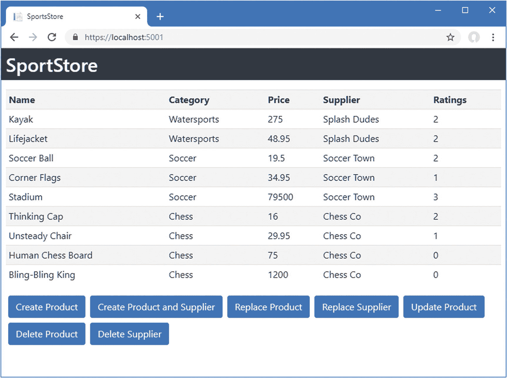

图 7-1。

运行示例应用

## 使用数据模型进行组件协作

组件是 Angular 应用的构建模块。每个组件都是一个 TypeScript 类，提供支持包含指令和数据绑定的 HTML 模板所需的方法和属性。Angular 应用中的每个功能通常都有自己的组件，可以组合起来创建更多的功能。让组件协同工作的关键是应用的数据模型。

在第 [5](05.html) 和 [6](06.html) 章中，提供应用数据访问的 Angular `Repository`类有两组特性。第一组`Repository`特性由三个属性组成，提供对应用数据的访问:`product`属性提供对单个`Product`对象的访问，`products`属性提供对一组`Product`对象的访问，`suppliers`属性提供对一组`Supplier`对象的访问。第二组`Repository`特性是向 web 服务发送 HTTP 请求并使用结果更新`product`、`products`和`suppliers`属性的一组方法。

这种由两部分组成的设计使得组件无需紧密耦合就能更容易地协作，为构建应用提供了一种灵活的方式。这不是组件合作的唯一方式，但它是最简单的，并且利用了 Angular 自动响应数据变化的方式。在接下来的小节中，我将创建一些新的 Angular 组件，并使用它们来演示它们如何通过数据模型进行协作。

### 创建显示组件

为了保持这个例子的简单，第一个组件将只显示来自数据模型的数据，它将通过由`Repository`类定义的`products`属性获得该数据。

#### 创建组件类

创建一个`ClientApp/src/app/structure`文件夹，并向其中添加一个名为`productTable.component.ts`的类型脚本文件。惯例是在 Angular 项目中使用描述性文件名，这个名称告诉您这是一个名为`productTable`的组件的 TypeScript 类，这给了您一个组件用途的提示。一旦创建了文件，添加清单 [7-3](#PC3) 中所示的代码。

```cs
import { Component } from '@angular/core';
import { Repository } from "../models/repository";
import { Product } from "../models/product.model";

@Component({
    selector: "product-table",
    templateUrl: "./productTable.component.html"
})
export class ProductTableComponent {

    constructor(private repo: Repository) { }

    get products(): Product[] {
        return this.repo.products;
    }
}

Listing 7-3.The Contents of the productTable.component.ts File in the ClientApp/src/app/structure Folder

```

大多数组件都像清单中所示的那样开始，并随着功能添加到应用中而增长。因为这是我添加到 SportsStore 项目中的第一个新组件，所以我将仔细检查每个语句并解释其目的。

##### 理解导入语句

前三个语句使用`import`关键字来声明组件所依赖的类型的依赖关系。

```cs
...
import { Component } from '@angular/core';
import { Repository } from "../models/repository";
import { Product } from "../models/product.model";
...

```

在任何组件中，`import`语句将是 Angular 类和定制类的混合，Angular 类位于名称以`@angular`开头的模块中，定制类是特定于应用的，使用相对文件路径指定。在这种情况下，组件依赖于`@angular/core`模块中的`Component`，用于告诉 Angular 一个类何时是组件，以及依赖于`Repository`和`Product`文件，它们在`models`文件夹中定义。

### 小费

`import`语句中使用的路径不包括文件扩展名。这意味着如果你想声明一个对`Product`类的依赖，例如，你使用路径`"../models/product.model"`，而不是`"../models/product.model.ts"`或`"../models.product.model.js"`。

##### 理解课程

组件是提供支持模板所需的方法和属性的类型脚本类。惯例是在类名中包含术语`Component`，这就是清单 [7-3](#PC3) 中的类被称为`ProductTableComponent`的原因。您不必遵循这一约定，但它有助于保持项目中的文件有组织。

```cs
...
export class ProductTableComponent {

    constructor(private repo: Repository) { }

    get products(): Product[] {
        return this.repo.products;
    }
}
...

```

`constructor`用于声明对`Repository`类的依赖，这将在创建组件的新实例时使用依赖注入特性来解决。组件类中的另一个特性是一个名为`products`的只读属性，它返回由`Repository`类定义的`products`属性的值。HTML 模板中的指令和绑定只能访问由其组件定义的方法和属性。这意味着大多数组件开始只是提供对模型中数据的访问，并随着应用的开发开始定义更复杂的逻辑。

##### 了解装修工

装饰器赋予组件生命，并为 Angular 提供在应用中应用组件所需的信息。

```cs
...

@Component({

    selector: "product-table",
    templateUrl: "productTable.component.html"

})

export class ProductTableComponent {
...

```

`@Component`装饰器的配置属性告诉 Angular 应该如何使用组件。属性告诉 Angular，当它在 HTML 模板中遇到一个`product-table`元素时，它应该应用这个组件。(您将很快看到我是如何创建这个元素的。)属性指定了组件的 HTML 模板文件，它提供了组件将要显示的内容。

#### 创建 HTML 模板

组件的模板提供了将向用户显示的 HTML 内容，以及将向用户呈现动态内容的指令和数据绑定。在`ClientApp/src/app/structure`文件夹中创建一个名为`productTable.component.html`的 HTML 文件，并添加清单 [7-4](#PC7) 中所示的内容。(模板文件的名称必须与组件装饰器中的`templateUrl`属性的值完全匹配，这一点很重要。)

如果您使用的是 Visual Studio，右键单击`structure`文件夹，从弹出菜单中选择添加➤新项，并使用 HTML 页面模板添加新文件。如果您使用的是 Visual Studio 代码，那么右键单击`structure`文件夹并从弹出菜单中选择 New File。

```cs
<table class="table table-striped">
    <tbody>
        <tr><th>Name</th><th>Category</th><th>Price</th></tr>
        <tr *ngFor="let product of products">
            <td>{{product.name}}</td>
            <td>{{product.category}}</td>
            <td>{{product.price}}</td>
        </tr>
    </tbody>
</table>

Listing 7-4.The productTable.component.html File in the ClientApp/src/app/structure Folder

```

这个模板使用了前面章节中的特性。`ngFor`指令用于读取组件的`products`属性的值，并为返回的数组中的每个`Product`生成一个`tr`元素。每个对象被分配给一个名为`product`的临时变量，然后在数据绑定中使用该变量来设置`td`元素的内容。结果是一个表格，其中包含存储库中每个`Product`的一行，显示了`name`、`category`和`price`属性的值。

### 创建过滤器组件

下一个组件将为用户提供一组按钮，用于过滤存储库中的`Product`对象。在`ClientApp/src/app/structure`文件夹中添加一个名为`categoryFilter.component.ts`的类型脚本文件，并添加清单 [7-5](#PC8) 中所示的代码。

```cs
import { Component } from '@angular/core';
import { Repository } from "../models/repository";

@Component({
    selector: "category-filter",
    templateUrl: "categoryFilter.component.html"
})
export class CategoryFilterComponent {
    public chessCategory = "chess";

    constructor(private repo: Repository) { }

    setCategory(category: string) {
        this.repo.filter.category = category;
        this.repo.getProducts();
    }
}

Listing 7-5.The Contents of the categoryFilter.component.ts File in the ClientApp/src/app/structure Folder

```

这个文件定义了已经应用了`@Component`装饰器的`CategoryFilterComponent`类。装饰器告诉 Angular 在遇到一个`category-filter` HTML 元素时使用这个组件，并使用一个名为`categoryFilter.component.html`的模板文件。组件类定义了一个构造函数，允许它通过依赖注入来接收一个`Repository`对象。`setCategory`方法接受一个类别，该类别用于配置`Repository`对象的过滤器并刷新应用的数据。

#### 创建 HTML 模板

为了创建过滤器组件的模板，将名为`categoryFilter.component.html`的文件添加到`ClientApp/src/app/structure`文件夹中，并添加清单 [7-6](#PC9) 中所示的标记。

```cs
<div>
    <button class="btn btn-primary m-1" (click)="setCategory('soccer')">
        Soccer
    </button>
    <button class="btn btn-primary m-1" (click)="setCategory(chessCategory)">
        Chess
    </button>
    <button class="btn btn-primary m-1" (click)="setCategory('Water' + 'Sports')">
        Watersports
    </button>
    <button class="btn btn-primary m-1" (click)="setCategory(null)">All</button>
</div>

Listing 7-6.The categoryFilter.component.html File in the ClientApp/src/app/structure Folder

```

事件绑定特性告诉 Angular 在事件被触发时对表达式求值。该模板中的事件绑定用于`click`事件，表达式调用组件的`setCategory`方法。注意事件绑定指定`setCategory`方法参数的不同方式。第一个绑定指定表达式中的类别。

```cs
...
<button class="btn btn-primary" (click)="setCategory('soccer')">
...

```

值`soccer`是一个文字字符串，必须用引号括起来。JavaScript 支持双引号和单引号(`"`和`'`字符),我用双引号表示表达式，用单引号表示文字值。

第二个事件绑定中不需要引号，它将组件定义的属性指定为参数。

```cs
...
<button class="btn btn-primary" (click)="setCategory(chessCategory)">
...

```

这个绑定将使用`chessCategory`属性的值作为`setCategory`方法的值。第三个绑定显示 Angular 将计算表达式，允许在表达式中执行操作。

```cs
...
<button class="btn btn-primary"  (click)="setCategory('Water' + 'Sports')">
...

```

单击该按钮时，Angular 将计算表达式，该表达式将两个文字字符串值连接起来，并将结果传递给`setCategory`方法。

### 应用新组件

Angular 必须被配置为使用新的组件，这与 ASP.NET Core MVC 的“约定胜于配置”的理念形成了对比。在大多数应用中，会为应用中的每个主要功能区域创建一个新的 Angular 模块，例如模型模块，但是为了简单起见，在 Angular 应用的根模块中注册新的组件，如清单 [7-7](#PC13) 所示。

```cs
import { BrowserModule } from '@angular/platform-browser';
import { NgModule } from '@angular/core';
import { AppRoutingModule } from './app-routing.module';
import { AppComponent } from './app.component';
import { ModelModule } from "./models/model.module";

import { ProductTableComponent } from "./structure/productTable.component"

import { CategoryFilterComponent } from "./structure/categoryFilter.component"

@NgModule({
    declarations: [AppComponent, ProductTableComponent, CategoryFilterComponent],
    imports: [BrowserModule, AppRoutingModule, ModelModule],
    providers: [],
    bootstrap: [AppComponent]
})
export class AppModule { }

Listing 7-7.Registering Components in the app.module.ts File in the ClientApp/src/app Folder

```

组件类注册在`NgModule`装饰器的`declarations`属性中，这使得 Angular 知道它们的存在，并且可以应用于 HTML 元素。

下一步是添加由新组件的`selector`属性指定的 HTML 元素。用清单 [7-8](#PC14) 中显示的元素替换`app.component.html`文件的内容，该文件是清单 [7-7](#PC13) 中根组件的`bootstrap`属性指定的组件的模板。

```cs
<category-filter></category-filter>
<product-table></product-table>

Listing 7-8.Replacing the Contents of the app.component.html File in the ClientApp/src/app Folder

```

这些元素取代了用户先前显示的内容。当应用启动时，Angular 将处理模板，发现`category-filter`和`product-table`元素，并查看已经注册的组件列表，以确定应该应用哪些组件。结果如图 [7-2](#Fig2) 所示，尽管您可能需要重新加载浏览器以使更改生效。

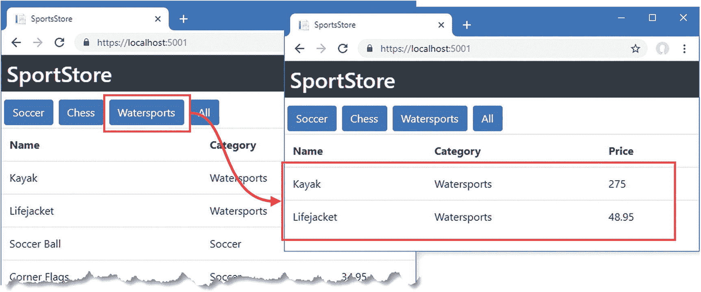

图 7-2。

向 Angular 应用添加组件

单击其中一个按钮可更改应用于数据的过滤器。图中显示了单击 Watersports 按钮的效果，该按钮的效果是只选择 Watersports 类别中的产品。

### 了解应用结构

这两个新组件彼此没有直接的了解，但是使用一个组件执行的操作(单击按钮)会反映在另一个组件中(过滤数据)。这是可行的，因为组件利用了我在本节开始时描述的数据存储库的两个部分，如图 [7-3](#Fig3) 所示。

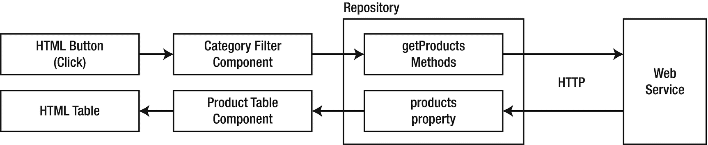

图 7-3。

了解协作组件

当用户单击按钮时，事件绑定调用类别过滤器组件的`setCategory`方法，该方法更新存储库过滤器并重新加载数据。至此，类别过滤器组件的工作已经完成。

存储库向 ASP.NET Core MVC web 服务发送 HTTP 请求，并接收经过过滤的`Product`数据，该数据被分配给`products`属性。这是在产品表组件的模板中的`ngFor`指令的表达式中使用的属性，Angular 更新该模板显示的内容以反映变化。

### 添加另一个组件

这两个新组件可能会给您留下这样的印象:一些组件只从模型中读取数据，而另一些组件只进行更改。事实上，组件更加灵活，可以用来创建复杂的关系集，同时仍然依赖数据模型来帮助协调。要了解这是如何工作的，在`ClientApp/src/app/structure`文件夹中创建一个名为`productDetail.component.ts`的文件，并添加清单 [7-9](#PC15) 中所示的代码。

```cs
import { Component } from '@angular/core';
import { Repository } from "../models/repository";
import { Product } from "../models/product.model";

@Component({
    selector: "product-detail",
    templateUrl: "productDetail.component.html"
})
export class ProductDetailComponent {

    constructor(private repo: Repository) { }

    get product(): Product {
        return this.repo.product;
    }
}

Listing 7-9.The Contents of the productDetail.component.ts File in the ClientApp/src/app/structure Folder

```

`ProductDetailComponent`类有一个接收`Repository`对象的构造函数，该对象将通过依赖注入特性提供，还有一个`product`属性，该属性返回与`Repository`同名的属性值。

`@Component`装饰器告诉 Angular 在遇到`product-detail`元素时应用这个组件，并提供组件模板的位置。要创建模板，在`ClientApp/src/app/structure`文件夹中添加一个名为`productDetail.component.html`的文件，并添加清单 [7-10](#PC16) 中所示的 HTML 元素。

```cs
<table class="table table-striped">
    <tbody>
        <tr><th colspan="2" class="bg-info">Product</th></tr>
        <tr><th>Name</th><td>{{product?.name || 'No Data'}}</td></tr>
        <tr><th>Category</th><td>{{product?.category || 'No Data'}}</td></tr>
        <tr>
            <th>Description</th>
            <td>{{product?.description || 'No Data'}}</td>
        </tr>
        <tr><th>Price</th><td>{{product?.price  || 'No Data'}}</td></tr>
        <tr><th colspan="2" class="bg-info">Supplier</th></tr>
        <tr><th>Name</th><td>{{product?.supplier?.name}}</td></tr>
        <tr><th>City</th><td>{{product?.supplier?.city}}</td></tr>
        <tr><th>State</th><td>{{product?.supplier?.state}}</td></tr>
    </tbody>
</table>

Listing 7-10.The productDetail.component.html File in the ClientApp/src/app/structure Folder

```

要注册该组件以便 Angular 可以使用它，请更改根模块的配置，如清单 [7-11](#PC17) 所示。

```cs
import { BrowserModule } from '@angular/platform-browser';
import { NgModule } from '@angular/core';
import { AppRoutingModule } from './app-routing.module';
import { AppComponent } from './app.component';
import { ModelModule } from "./models/model.module";
import { ProductTableComponent } from "./structure/productTable.component"
import { CategoryFilterComponent } from "./structure/categoryFilter.component"

import { ProductDetailComponent } from "./structure/productDetail.component";

@NgModule({
    declarations: [AppComponent, ProductTableComponent, CategoryFilterComponent,
        ProductDetailComponent],
    imports: [BrowserModule, AppRoutingModule, ModelModule],
    providers: [],
    bootstrap: [AppComponent]
})
export class AppModule { }

Listing 7-11.Registering a Component in the app.module.ts File in the ClientApp/src/app Folder

```

`import`语句提供对`ProductDetailComponent`类的访问，该类被添加到`NgModule`装饰器的声明属性中。现在组件可以使用了，编辑根组件的模板来添加将应用新组件的元素，如清单 [7-12](#PC18) 所示。

```cs
<div class="container">

    <div class="row">
        <div class="col">
            <category-filter></category-filter>
            <product-table></product-table>
        </div>
        <div class="col">
            <product-detail></product-detail>
        </div>
    </div>

</div>

Listing 7-12.Adding an Element in the app.component.html File in the ClientApp/src/app Folder

```

该清单还向 HTML 文档添加了一些结构，使用引导 CSS 类将新组件与现有组件并排放置。

#### 选择产品

新的组件将在单个产品被选中时显示其详细信息，这意味着下一步是为用户提供进行选择的方法。首先，将清单 [7-13](#PC19) 中所示的元素添加到 product 表的模板中。

```cs
<table class="table table-striped">
    <tbody>
        <tr><th>Name</th><th>Category</th><th>Price</th><th></th></tr>
        <tr *ngFor="let product of products">
            <td>{{product.name}}</td>
            <td>{{product.category}}</td>
            <td>{{product.price}}</td>
            <td>
                <button class="btn btn-primary btn-sm"
                        (click)="selectProduct(product.productId)">
                    Details
                </button>
            </td>
        </tr>
    </tbody>
</table>

Listing 7-13.Elements in the productTable.component.html File in the ClientApp/src/app/structure Folder

```

新元素向表中添加一列，该表包含由`ngFor`指令生成的每一行的细节按钮。当点击`button`时，`click`事件绑定将调用一个名为`selectProduct`的方法，提供相应产品的 ID 值。为了定义事件绑定调用的方法，将清单 [7-14](#PC20) 中所示的代码添加到产品表组件中。

```cs
import { Component } from '@angular/core';
import { Repository } from "../models/repository";
import { Product } from "../models/product.model";

@Component({
    selector: "product-table",
    templateUrl: "productTable.component.html"
})
export class ProductTableComponent {

    constructor(private repo: Repository) { }

    get products(): Product[] {
        return this.repo.products;
    }

    selectProduct(id: number) {
        this.repo.getProduct(id);
    }
}

Listing 7-14.Adding a Method in the productTable.component.ts File in the ClientApp/src/app/structure Folder

```

`selectProduct`方法调用存储库对象的`getProduct`方法，这将导致它向 web 服务发送请求。保存更改后，您将看到新的内容，点击其中一个细节按钮将导致详细视图被数据填充，如图 [7-4](#Fig4) 所示。

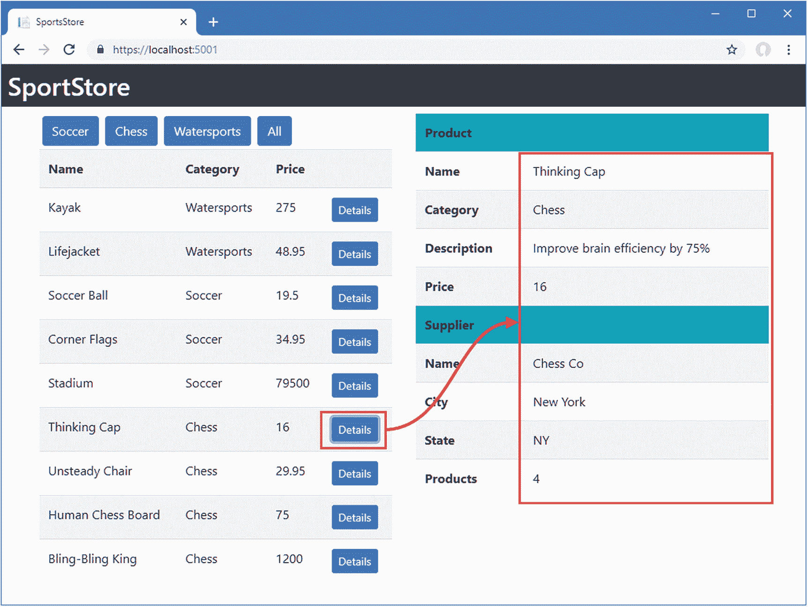

图 7-4。

显示详细数据

#### 了解修改后的应用结构

这三个新组件依赖于数据模型，要么作为它们为用户执行的操作的目标，要么作为它们显示的数据源。没有一个组件直接依赖于其他任何组件，它们中的任何一个都可以被改变，而不需要其他组件的相应改变。此外，正如第三个组件的添加所示，组件既可以是模型中数据的消费者，也可以是数据变更的来源，如图 7-5 所示。

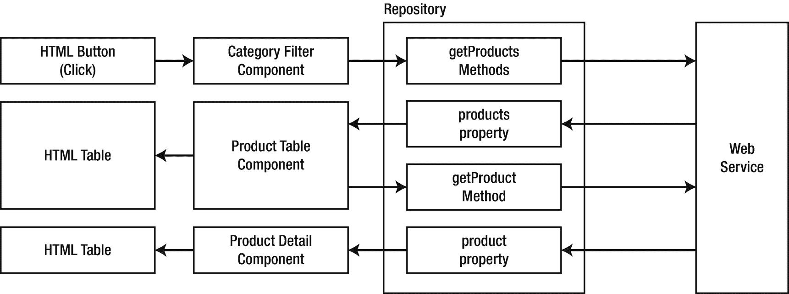

图 7-5。

Angular 应用的修订结构

## 了解 Angular 布线

使用数据模型作为 Angular 应用的核心，可以很容易地添加和集成添加新特性的组件。然而，对于除了最简单的应用之外的所有应用，您很快就会希望在不同的时间向用户显示不同的组件。例如，对于 SportsStore 应用，同时显示产品表和产品详细信息组件是没有意义的。相反，应用应该显示该表，直到用户单击 Details 按钮，此时应该显示详细视图。

在 Angular 应用中，这是使用 URL 路由完成的，它为组件提供了另一种协作方式。作为一名 ASP.NET Core MVC 开发人员，您可能已经熟悉了 URL 路由的概念，其中 URL 的各个部分用于选择一个控制器和动作方法来处理 HTTP 请求。在 Angular 应用中，URL 中的段用于决定应该向用户显示哪些组件。这个特性依赖于这样一个事实，即浏览器允许对 URL 进行小的修改，而无需向服务器发送新的请求，这个过程通过一个例子变得更加清晰。在接下来的小节中，我将为 SportsStore 应用添加对 URL 路由的支持，并使用它来显示产品表或详细视图。

### 创建路由配置

在第 [3](03.html) 章创建项目时，其中一个命令行参数启用了 Angular 路由特性，这意味着路由的包和基本配置是在创建过程中设置的。

Angular 路由需要 HTML 文档头部分的`base`元素，该文档包含包文件的`script`元素。我在第三章[的 Razor 布局中添加了这个元素，就像这样:](03.html)

```cs
...
<head>
    <base href="/">
    <meta charset="utf-8" />
    <meta name="viewport" content="width=device-width, initial-scale=1.0" />
    <title>SportsStore</title>
    <link rel="stylesheet" href="~/lib/bootstrap/dist/css/bootstrap.css" />
</head>
...

```

`href`元素的值告诉 Angular 路由特征应该响应的起始 URL。当使用默认 URL 交付 Angular 应用时，使用值`/`。如果通过特定的 URL 段(如`https://localhost:5001/myapp`)访问应用，则`base`元素的`href`属性必须更改，在这种情况下为`/myapp`。

该项目是用`ClientApp/src/app`文件夹中的`app-routing.module.ts`文件创建的，该文件用于定义 Angular 应用支持的路线。要为示例应用配置路由，添加清单 [7-15](#PC22) 中所示的语句。

```cs
import { NgModule } from '@angular/core';
import { Routes, RouterModule } from '@angular/router';

import { ProductTableComponent } from "./structure/productTable.component"

import { ProductDetailComponent } from "./structure/productDetail.component";

const routes: Routes = [
    { path: "table", component: ProductTableComponent },
    { path: "detail", component: ProductDetailComponent },
    { path: "", component: ProductTableComponent }
];

@NgModule({
  imports: [RouterModule.forRoot(routes)],
  exports: [RouterModule]
})
export class AppRoutingModule { }

Listing 7-15.Adding Routes in the app-routing.module.ts File in the ClientApp/src/app Folder

```

与 ASP.NET Core MVC 一样，Angular 中的 URL 路由有很多选项，这是一个简单的配置。第一步是定义一组 URL 段和它们将显示的组件，这些组件与来自 HTML 文档的`base`元素的`href`属性值相结合。路线准备使用`RouterModule.forRoot`方法，该方法产生的结果可用于 Angular 组件的`imports`属性。

```cs
...
@NgModule({
  imports: [RouterModule.forRoot(routes)],
  exports: [RouterModule]
})
export class AppRoutingModule { }
...

```

正如 ASP.NET Core MVC 一样，Angular 路由按照定义的顺序进行评估，这意味着必须首先定义最具体的路由。使用`path`属性定义路线将匹配的路段，并且将显示的组件由`component`属性指定。列表中有三条路由，它们产生表 [7-2](#Tab2) 中描述的映射。

### 小费

通过在浏览器中手动输入 URL，您将无法导航到表中显示的 URL。我将在本章的后面解释为什么以及如何解决这个问题。

表 7-2。

URL 路由和组件

<colgroup><col class="tcol1 align-left"> <col class="tcol2 align-left"></colgroup> 
| 

统一资源定位器

 | 

描述

 |
| --- | --- |
| `https://localhost:5001` | 这个 URL 与清单中的最后一个路由匹配，并显示产品表组件。 |
| `https://localhost:5001/table` | 该 URL 由路径为`table`的路由匹配，并显示产品表组件。 |
| `https://localhost:5001/detail` | 该 URL 与路径为`detail`的路由相匹配，并显示产品详细信息组件。 |

### 应用路由配置

Angular 使用一个特殊的 HTML 元素`router-outlet`来显示路由配置选择的组件。这个元素用在根组件的模板中，替换现有的内容，如清单 [7-16](#PC24) 所示。

```cs
<router-outlet></router-outlet>

Listing 7-16.Replacing the Contents of the app.component.html File in the ClientApp/src/app Folder

```

当保存了对 Angular 文件的更改并且重新编译了应用后，您将只看到产品表，如图 [7-6](#Fig6) 所示。这是因为来自清单 [7-16](#PC24) 的路径为空字符串(`""`)的路由已经与浏览器显示的 URL 匹配，并且路由系统已经选择了要在`router-outlet`元素中显示的产品表组件。

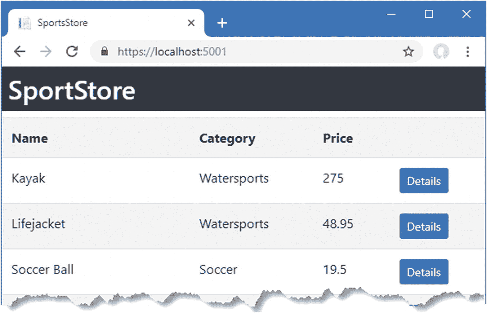

图 7-6。

由路由系统选择的组件

### 使用路线导航

单击 Details 按钮目前没有可见的效果，因为应用于`button`元素的事件绑定只是触发了对 web 服务的 HTTP 请求。为了导航到将显示产品细节组件的 URL，将清单 [7-17](#PC25) 中所示的代码添加到`ProductTableComponent`类中。

```cs
import { Component } from '@angular/core';
import { Repository } from "../models/repository";
import { Product } from "../models/product.model";

import { Router } from "@angular/router";

@Component({
    selector: "product-table",
    templateUrl: "productTable.component.html"
})
export class ProductTableComponent {

    constructor(private repo: Repository,
                private router: Router) { }

    get products(): Product[] {
        return this.repo.products;
    }

    selectProduct(id: number) {
        this.repo.getProduct(id);
        this.router.navigateByUrl("/detail");
    }
}

Listing 7-17.Navigating in the productTable.component.ts File in the ClientApp/src/app/structure Folder

```

在`@angular/router`模块中定义的`Router`类通过它的`navigateByUrl`方法为导航到一个 URL 提供支持。`ProductTableComponent`的构造函数接受一个由依赖注入提供的`Router`对象，并在`selectProduct`方法中使用它来移动到`/detail` URL，这将显示产品细节组件。

编译完应用并重新加载浏览器后，单击其中一个详细信息按钮。产品详细信息组件将替换表格，显示所选产品的详细信息。注意浏览器显示的 URL 发生了变化，如图 [7-7](#Fig7) 所示。

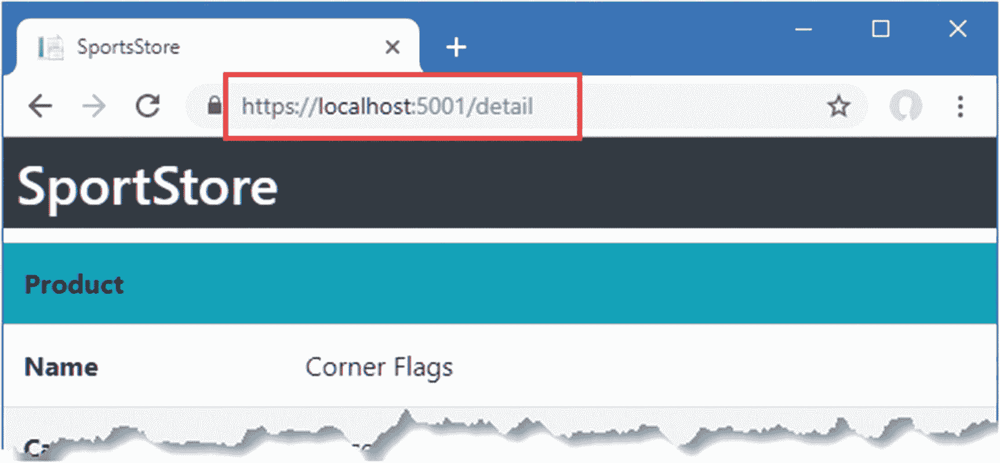

图 7-7。

使用 URL 路由功能

#### 使用指令导航

`Router.navigateByUrl`方法并不是使用路线系统导航的唯一方法。Angular 还提供了一个可以应用于元素的指令，它允许在模板中指定 URL，而不需要在组件中有相应的方法。为了允许用户从详细的组件导航回表格，添加清单 [7-18](#PC26) 中所示的元素。

```cs
<table class="table table-striped">
    <tbody>
        <tr><th colspan="2" class="bg-info">Product</th></tr>
        <tr><th>Name</th><td>{{product?.name || 'No Data'}}</td></tr>
        <tr><th>Category</th><td>{{product?.category || 'No Data'}}</td></tr>
        <tr>
            <th>Description</th>
            <td>{{product?.description || 'No Data'}}</td>
        </tr>
        <tr><th>Price</th><td>{{product?.price  || 'No Data'}}</td></tr>
        <tr><th colspan="2" class="bg-info">Supplier</th></tr>
        <tr><th>Name</th><td>{{product?.supplier?.name}}</td></tr>
        <tr><th>City</th><td>{{product?.supplier?.city}}</td></tr>
        <tr><th>State</th><td>{{product?.supplier?.state}}</td></tr>
    </tbody>
</table>

<div class="text-center">

    <button class="btn btn-primary" routerLink="/table">Back</button>

</div>

Listing 7-18.Navigating in the productDetail.component.html File in the ClientApp/src/app/structure Folder

```

`routerLink`属性应用一个指令，告诉 Angular 在点击`button`时导航到`/table` URL。保存修改，使用浏览器导航到`https://localhost:5001`，使用详细信息和后退按钮在组件间导航，如图 [7-8](#Fig8) 所示。

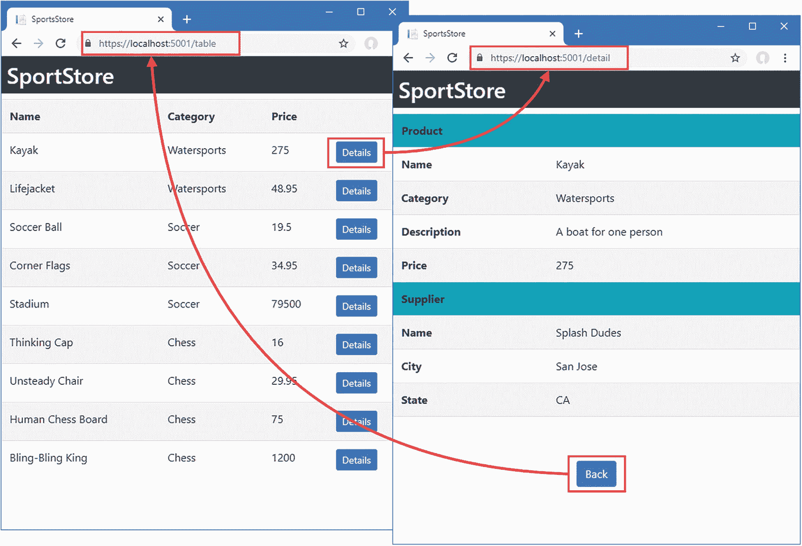

图 7-8。

使用指令导航

### 改进导航

路由系统用于处理 SportsStore 应用中的导航，但它有一些粗糙的边缘，会让用户感到困惑。在接下来的部分中，我将描述这些问题并解释如何解决它们。

#### 允许直接导航

如果您试图通过在浏览器的 URL 栏中输入来手动导航到路由配置中的某个 URL，例如`https://localhost:5001/table`，您将会收到一个奇怪的响应，如图 [7-9](#Fig9) 所示。

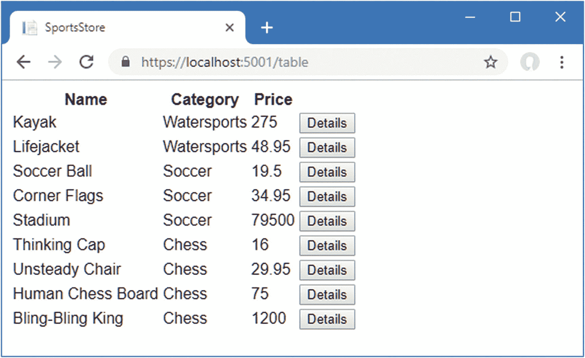

图 7-9。

直接请求 URL

导航到 Angular 应用中的 URL 和用户输入的 URL 是有区别的。当应用执行导航时，不发送 HTTP 请求，应用继续运行。当用户输入 URL 时，总是会发送一个 HTTP 请求。这是一种明智的方法，因为它可以防止 JavaScript 应用劫持浏览器，并防止用户导航离开。

由此产生的问题是，HTTP 请求的目标 URL 没有对应的 MVC 控制器。ASP.NET Core 路由配置将与控制器不匹配的请求转发给 Angular development server，后者返回`ClientApp/src`文件夹中的`index.html`文件。这个文件不包含引导 CSS 样式表的链接，也不包含 Razor 布局中的 header 元素。当 Angular 启动时，它响应已经选择的 URL，但是浏览器没有正确显示应用所需的所有资源。

捕捉角路由系统支持的 URL 请求需要在 ASP.NET Core 路由中有一个相应的条目，如清单 [7-19](#PC27) 所示。这是一个特定于项目开发阶段的问题，其中 Angular 开发服务器负责生成捆绑包文件，但其余内容来自 ASP.NET Core。当应用在第 [13 章](13.html)中准备部署时，将不会使用 Angular development server，路由配置将被简化。

```cs
...
public void Configure(IApplicationBuilder app, IWebHostEnvironment env,
        IServiceProvider services) {

    if (env.IsDevelopment()) {
        app.UseDeveloperExceptionPage();
    } else {
        app.UseExceptionHandler("/Home/Error");
        app.UseHsts();
    }

    app.UseHttpsRedirection();
    app.UseStaticFiles();
    app.UseRouting();
    app.UseAuthorization();

    app.UseEndpoints(endpoints => {
        endpoints.MapControllerRoute(
            name: "default",
            pattern: "{controller=Home}/{action=Index}/{id?}");

        endpoints.MapControllerRoute(
            name: "angular_fallback",
            pattern: "{target:regex(table|detail)}/{*catchall}",
            defaults: new { controller = "Home", action = "Index" });

        endpoints.MapRazorPages();
    });

    app.UseSwagger();
    app.UseSwaggerUI(options => {
        options.SwaggerEndpoint("/swagger/v1/swagger.json",
            "SportsStore API");
    });

    app.UseSpa(spa => {
        string strategy = Configuration
            .GetValue<string>("DevTools:ConnectionStrategy");
        if (strategy == "proxy") {
            spa.UseProxyToSpaDevelopmentServer("http://127.0.0.1:4200");
        } else if (strategy == "managed") {
            spa.Options.SourcePath = "../ClientApp";
            spa.UseAngularCliServer("start");
        }
    });

    SeedData.SeedDatabase(services.GetRequiredService<DataContext>());
}
...

Listing 7-19.Adding a Route in the Startup.cs File in the ServerApp Folder

```

新路由匹配`/table`和`/detail`URL，并将它们发送到`Home`控制器上的`Index`动作。这确保了当用户直接导航到 Angular 应用支持的 URL 之一时，Razor 视图——及其相关布局——被用于响应，如图 [7-10](#Fig10) 所示。

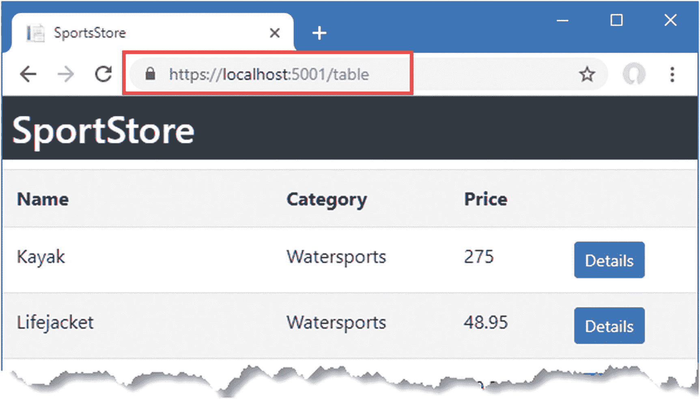

图 7-10。

直接导航的效果

#### 使用段变量

允许用户直接导航到 Angular 应用的一个 URL 是一个进步，但并不完美。请求`https://localhost:5001/detail`就能看出问题。Angular 应用将显示详细的视图组件，但占位符数据永远不会被真实数据替换，如图 [7-11](#Fig11) 所示。

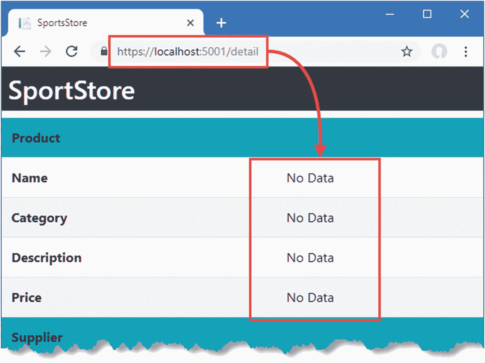

图 7-11。

直接导航到详细视图 URL

当用户单击触发 Angular 应用中导航的细节按钮时，模板的组件要求存储库获取产品数据，然后导航到显示详细视图的 URL。但是当用户直接导航到一个 URL 时，从来不会要求存储库获取产品数据，所以组件没有什么可显示的。解决这个问题意味着扩展 product detail 组件，以便它可以请求自己的数据，并在 URL 中包含要显示的产品的详细信息。

第一步是更改路由配置，添加一个段变量，这将允许路由匹配一系列 URL。Angular 路由段与 ASP.NET Core MVC 中的相似，尽管语法不同。要为产品细节组件的 Angular 路线添加一段，添加清单 [7-20](#PC28) 中所示的路线。

```cs
import { NgModule } from '@angular/core';
import { Routes, RouterModule } from '@angular/router';
import { ProductTableComponent } from "./structure/productTable.component"
import { ProductDetailComponent } from "./structure/productDetail.component";

const routes: Routes = [
    { path: "table", component: ProductTableComponent },
    { path: "detail", component: ProductDetailComponent },
    { path: "detail/:id", component: ProductDetailComponent },
    { path: "", component: ProductTableComponent }
];

@NgModule({
  imports: [RouterModule.forRoot(routes)],
  exports: [RouterModule]
})
export class AppRoutingModule { }

Listing 7-20.Adding a Route in the app-routing.module.ts File in the ClientApp/src/app Folder

```

segment 变量用冒号(`:`字符)表示，所以清单中的新路由将匹配一个类似于`/table/1`的 URL，最后一个段的值将被赋给一个名为`id`的段变量。要访问 segment 变量的值并使用它从存储库中请求数据，进行清单 [7-21](#PC29) 中所示的更改。

```cs
import { Component } from '@angular/core';
import { Repository } from "../models/repository";
import { Product } from "../models/product.model";

import { Router, ActivatedRoute } from "@angular/router";

@Component({
    selector: "product-detail",
    templateUrl: "productDetail.component.html"
})
export class ProductDetailComponent {

    constructor(private repo: Repository,
                router: Router,
                activeRoute: ActivatedRoute) {

        let id = Number.parseInt(activeRoute.snapshot.params["id"]);
        if (id) {
            this.repo.getProduct(id);
        } else {
            router.navigateByUrl("/");
        }
    }

    get product(): Product {
        return this.repo.product;
    }
}

Listing 7-21.Routing in the productDetail.component.ts File in the ClientApp/src/app/structure Folder

```

当前路线可通过在`@angular/router`模块中定义的`ActivatedRoute`类获得。在清单中，组件接收一个由依赖注入提供的`ActivatedRoute`对象，并使用其`snapshot.params`属性获取`id`段变量的值。如果变量有一个值，并且它可以被解析成一个整数，那么通过存储库请求产品的详细信息。如果`id`段没有值或者无法解析，那么使用`Router`对象导航到`/` URL，这将显示产品表。

最后的调整是改变用户从表格导航到产品详细视图的方式。此时，单击 Details 按钮会调用一个方法，该方法触发 HTTP 请求，然后导航到详细视图，但现在不再需要这个方法了。为了利用产品细节组件的自包含特性，在产品表组件的模板中更改细节按钮元素，如清单 [7-22](#PC30) 所示。

```cs
<table class="table table-striped">
    <tbody>
        <tr><th>Name</th><th>Category</th><th>Price</th><th></th></tr>
        <tr *ngFor="let product of products">
            <td>{{product.name}}</td>
            <td>{{product.category}}</td>
            <td>{{product.price}}</td>
            <td>
                <button class="btn btn-primary btn-sm"
                        [routerLink]="['/detail', product.productId]">
                    Details
                </button>
            </td>
        </tr>
    </tbody>
</table>

Listing 7-22.Navigating in the productTable.component.html File in the ClientApp/src/app/structure Folder

```

当您需要在导航 URL 中包含一个变量时，`routerLink`指令的应用是不同的。属性的名称用方括号括起来(`[`和`]`字符)，值是一个值的数组，将组合这些值来创建导航 URL。单个值可以是字符串值，比如`'/detail'`，也可以是变量，比如`product.productId`。当用户单击元素时，Angular 将评估数组中的每个元素，合并结果，并导航到 URL。在清单中，这意味着单击一个`button`元素将导航到一个 URL，比如`/detail/2`。

保存更改并重新加载应用后，单击产品表中的详细信息按钮。路由系统将导航到一个带有段变量的 URL，该变量为产品详细信息组件提供了从存储库中请求数据所需的信息，如图 [7-12](#Fig12) 所示。

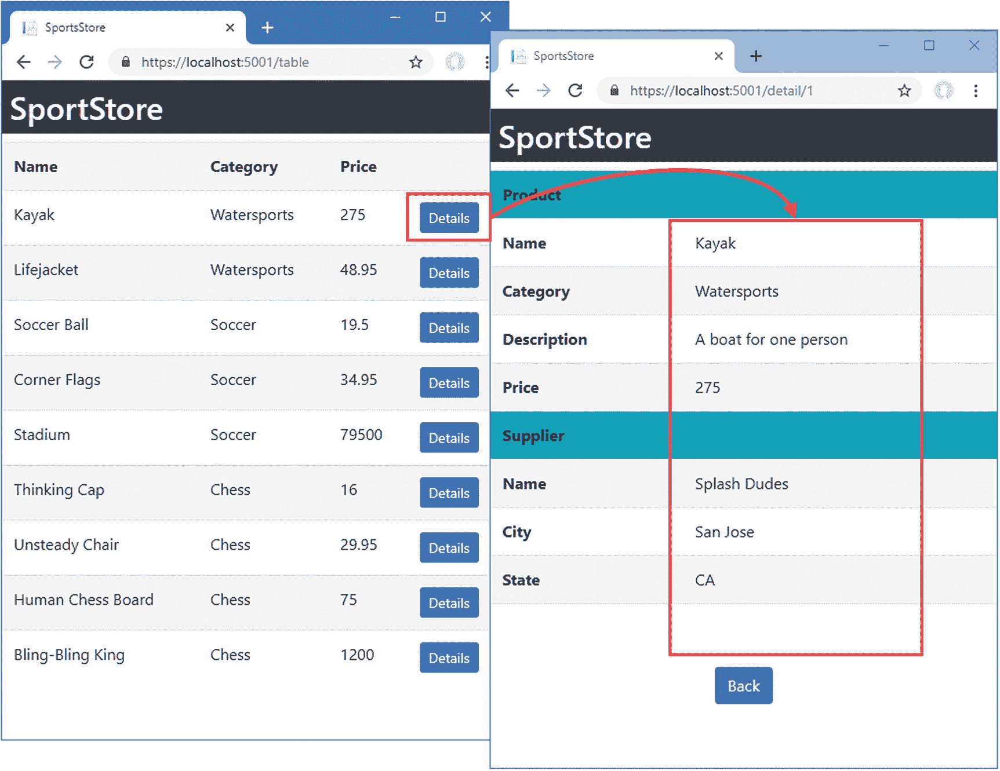

图 7-12。

使用段变量导航

这一更改允许用户通过直接输入 URL 来查看详细信息。例如，如果您输入`https://localhost:5001/details/2`，您将看到 ID 为 2 的商品的详细信息。但是，请记住，HTTP 请求被发送到服务器，Angular 应用被重新启动，这意味着任何不包含在 URL 中的上下文数据都将丢失。

### 了解应用结构

URL 路由功能为 Angular 组件提供了一种无需紧密耦合即可协作的替代方式。单击 SportsStore 应用中的 Details 按钮可以让 table 组件告诉 detail 组件应该显示哪个产品，但是这两个组件都不知道对方是谁，也不依赖于它们定义的代码。引入 URL 路由改变了应用的结构，如图 [7-13](#Fig13) 所示。

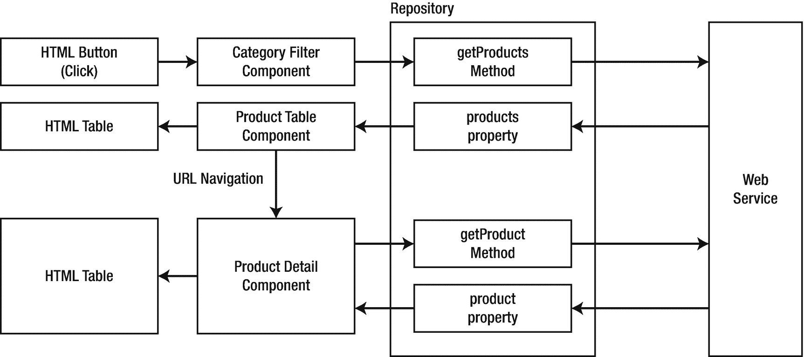

图 7-13。

URL 路由对应用结构的影响

能够选择组件如何协调允许在开发过程中有更多的灵活性。在这种情况下，使用 URL 路由允许用户直接导航到详细视图，也意味着应用中的其他组件可以触发详细显示，而无需显式加载数据。

## 摘要

在这一章中，我解释了 Angular 应用是如何围绕数据模型构建的，我还解释了 URL 导航特性。数据模型为应用提供共享状态，允许 Angular 组件一致地一起工作。URL 功能选择将向用户显示的组件，允许使用功能而不会用内容淹没用户。在下一章中，我将使用本章中描述的技术开始研究 SportsStore 应用的最终用户特性。