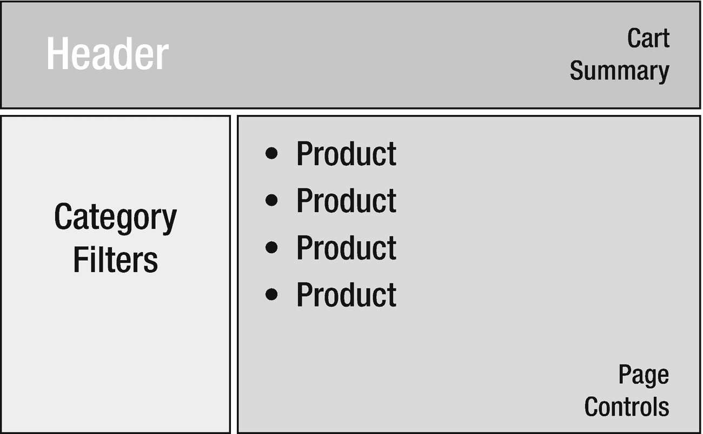

# 八、创建商店

SportsStore 应用的公共可访问部分将允许客户查看正在销售的产品，将商品添加到购物车，进行结账过程，并为他们购买的产品提供评级。所有这些功能对于大多数在线商店来说都是标准的，但是正如你现在所期望的，有一些技巧和技术需要让 Angular 和 ASP.NET Core MVC 一起工作来创造一个良好的用户体验。在这一章中，我创建了 Angular 应用的 store 特性的结构，并开始添加特性。表 [8-1](#Tab1) 将商店特征放在上下文中。

表 8-1。

将最终用户功能放在上下文中

<colgroup><col class="tcol1 align-left"> <col class="tcol2 align-left"></colgroup> 
| 

问题

 | 

回答

 |
| --- | --- |
| 它们是什么？ | 最终用户功能提供应用的公共可访问特性。 |
| 它们为什么有用？ | 对于大多数应用，最终用户功能是项目最重要的部分，也是开发开始的原因。其他功能，比如管理应用所需的功能，往往受到较少的关注和关注。 |
| 它们是如何使用的？ | 最终用户将使用他们的浏览器导航到一个 URL，向他们展示 Angular 应用，该应用显示可公开访问的功能。告诉浏览器加载 Angular 应用的 HTML 文档由 ASP.NET Core MVC 生成，它还负责通过 web 服务控制器将数据传递给 Angular 应用。 |
| 有什么陷阱或限制吗？ | 从应用的结构开始是很重要的，这样您就可以了解所需的 Angular 组件，它们将如何协作，以及 web 服务需要什么数据。没有这个基础，项目的 Angular 部分会变得复杂和难以管理。 |
| 有其他选择吗？ | 不。如果你在同一个项目中使用 Angular 和 ASP.NET Core MVC，会有一些类型的最终用户。 |

## 为本章做准备

本章使用了我在第 [3 章](03.html)中创建的 SportsStore 项目，并在之后的章节中进行了修改。要删除数据库以便应用使用新的种子数据，打开一个新的命令提示符，导航到`ServerApp`文件夹，并运行清单 [8-1](#PC1) 中所示的命令。

```cs
dotnet ef database drop --force

Listing 8-1.Resetting the Database

```

运行清单 [8-2](#PC2) 中所示的命令，启动 ASP.NET Core 运行时和 Angular 开发工具。

```cs
dotnet watch run

Listing 8-2.Starting the Development Tools

```

打开新的浏览器窗口并导航至`https://localhost:5001`；您将看到如图 [8-1](#Fig1) 所示的内容。

### 小费

你可以从源代码库 [`https://github.com/Apress/esntl-angular-for-asp.net-core-mvc-3`](https://github.com/Apress/esntl-angular-for-asp.net-core-mvc-3) 免费下载每章的完整项目。运行`ClientApp`文件夹中的`npm install`，安装 Angular 开发所需的包，然后按照指示启动开发工具。


图 8-1。

运行示例应用

## 启动产品选择功能

商店功能的起点是向用户展示待售产品的详细信息。前面的章节包括了该特性所需的一些功能，但是还有一些重要的附加功能，允许用户过滤内容、浏览数据以及执行其他常见任务。

为了提供一些背景，图 [8-2](#Fig2) 显示了我将努力的结构。产品选择的布局将为用户提供一个产品列表，用户可以选择该列表将产品添加到购物车中。用户将能够通过选择类别过滤器和在产品页面之间移动来浏览产品。这是展示产品的常规布局，如果你看过我其他书中的 SportsStore 示例，你会很熟悉。



图 8-2。

预期的产品选择结构

在接下来的小节中，我将向您展示如何使用 Angular 创建这个布局，以及如何增强应用的 ASP.NET Core MVC 部分。

### 封锁特征组件

在开发新功能时，我发现从创建显示占位符内容的组件开始很有用，这样我就可以定义如图 [8-2](#Fig2) 所示的基本结构。一旦占位符完成，我就可以返回到每个组件并实现将呈现给用户的功能。

#### 创建产品列表组件

创建`ClientApp/src/app/store`文件夹。这是产品选择特性的 Angular 类和 HTML 模板将存在的地方。在`store`文件夹中创建一个名为`productList.component.ts`的类型脚本文件，并添加清单 [8-3](#PC3) 中所示的代码。

```cs
import { Component } from "@angular/core";
import { Repository } from "../models/repository";
import { Product } from "../models/product.model";

@Component({
    selector: "store-product-list",
    templateUrl: "productList.component.html"
})
export class ProductListComponent {

    constructor(private repo: Repository) { }

    get products(): Product[] {
        return this.repo.products;
    }
}

Listing 8-3.The Contents of the productList.component.ts File in the ClientApp/src/app/store Folder

```

该组件将负责向用户显示产品列表。尽管此刻我只是屏蔽了内容，但我知道存储库中的产品集是需要的，所以我在构造函数中声明了一个`Repository`依赖项，并定义了一个返回数据的 get-only `products`属性。为了给组件提供一个模板，在`store`文件夹中创建一个名为`productList.component.html`的 HTML 文件，并添加清单 [8-4](#PC4) 中所示的元素。

```cs
<h4 class="border border-dark bg-primary p-2">
    Placeholder: Product List
</h4>

Listing 8-4.The Contents of the productList.component.html File in the ClientApp/src/app/store Folder

```

一旦应用的结构完成，我将用更有用的元素替换这些 HTML 内容，但这已经足够开始了。

#### 创建分页组件

分页组件允许用户在较小的页面中导航，从而使长长的产品列表更易于管理。在`store`文件夹中添加一个名为`pagination.component.ts`的类型脚本文件，并添加清单 [8-5](#PC5) 中所示的代码。

```cs
import { Component } from "@angular/core";

@Component({
    selector: "store-pagination",
    templateUrl: "pagination.component.html"
})
export class PaginationComponent {

}

Listing 8-5.The Contents of the pagination.component.ts File in the ClientApp/src/app/store Folder

```

为了给组件提供模板，在`store`文件夹中创建一个名为`pagination.component.html`的 HTML 文件，并添加清单 [8-6](#PC6) 中所示的元素。

```cs
<h4 class="border border-dark bg-info p-2">
    Placeholder: Page Controls
</h4>

Listing 8-6.The Contents of the pagination.component.html File in the ClientApp/src/app/store Folder

```

#### 创建类别过滤器组件

类别过滤器组件将允许用户选择要显示的单个类别。用清单 [8-7](#PC7) 中所示的代码将一个名为`categoryFilter.component.ts`的脚本文件添加到`store`文件夹中。

```cs
import { Component } from "@angular/core";
import { Repository } from "../models/repository";

@Component({
    selector: "store-categoryfilter",
    templateUrl: "categoryFilter.component.html"
})
export class CategoryFilterComponent {

    constructor(private repo: Repository) { }

}

Listing 8-7.The Contents of the categoryFilter.component.ts File in the ClientApp/src/app/store Folder

```

该组件遵循定义构造函数的模式，该构造函数声明一个`Repository`依赖项，该依赖项将使用依赖项注入特性进行解析，并提供对第 [5](05.html) 章中定义的过滤器特性的访问。为了给组件提供模板，在`store`文件夹中创建一个名为`categoryFilter.component.html`的 HTML 文件，并添加清单 [8-8](#PC8) 中所示的元素。

```cs
<h4 class="border border-dark bg-secondary p-2 h-100">
    Placeholder: Category Filter
</h4>

Listing 8-8.The Contents of the categoryFilter.component.html File in the ClientApp/src/app/store Folder

```

#### 创建购物车摘要组件

购物车摘要组件将显示用户购物车的概览。在`store`文件夹中创建一个名为`cartSummary.component.ts`的类型脚本文件，并添加清单 [8-9](#PC9) 中所示的代码。

```cs
import { Component } from "@angular/core";

@Component({
    selector: "store-cartsummary",
    templateUrl: "cartSummary.component.html"
})
export class CartSummaryComponent {

}

Listing 8-9.The Contents of the cartSummary.component.ts File in the ClientApp/src/app/store Folder

```

与本章创建的大多数其他组件不同，cart summary 组件不需要访问数据存储库。为了给组件提供由`@Component`装饰器中的`templateUrl`属性指定的模板，在`store`文件夹中创建一个名为`cartSummary.component.html`的 HTML 文件，并添加清单 [8-10](#PC10) 中所示的元素。

```cs
<div>Placeholder: Cart Summary</div>

Listing 8-10.The Contents of the cartSummary.component.html File in the ClientApp/src/app/store Folder

```

#### 创建评级组件

评级组件将显示产品的评级。在`store`文件夹中创建一个名为`ratings.component.ts`的类型脚本文件，并添加清单 [8-11](#PC11) 中所示的代码。

```cs
import { Component } from "@angular/core";
import { Product } from "../models/product.model";

@Component({
    selector: "store-ratings",
    templateUrl: "ratings.component.html"
})
export class RatingsComponent {

}

Listing 8-11.The Contents of the ratings.component.ts File in the ClientApp/src/app/store Folder

```

这个组件不需要存储库来完成它的工作，所以它没有定义构造函数。为了给组件提供由`@Component`装饰器中的`templateUrl`属性指定的模板，在`store`文件夹中创建一个名为`ratings.component.html`的 HTML 文件，并添加清单 [8-12](#PC12) 中所示的元素。

```cs
<h5>Placeholder: Ratings</h5>

Listing 8-12.The Contents of the ratings.component.html File in the ClientApp/src/app/store Folder

```

#### 创建结构组件

本章所需的最后一个组件将为其他组件提供布局。Angular 不支持创建独立的 HTML 模板，这意味着即使只需要 HTML 结构，也需要一个组件。用清单 [8-13](#PC13) 中所示的代码将一个名为`productSelection.component.ts`的脚本文件添加到`store`文件夹中。

```cs
import { Component } from "@angular/core";

@Component({
    selector: "store-products",
    templateUrl: "productSelection.component.html"
})
export class ProductSelectionComponent {

}

Listing 8-13.The Contents of the productSelection.component.ts File in the ClientApp/src/app/store Folder

```

为了给组件提供它的模板，也就是提供布局结构的模板，在`store`文件夹中创建一个名为`productSelection.component.html`的 HTML 文件，并添加清单 [8-14](#PC14) 中所示的元素。

```cs
<div class="container-fluid">
    <div class="row">
        <div class="col bg-dark text-white">
            <div class="navbar-brand">SPORTS STORE</div>
            <div class="float-right navbar-text">
                <store-cartsummary></store-cartsummary>
            </div>
        </div>
    </div>
</div>
<div class="row no-gutters">
    <div class="col-3">
        <store-categoryfilter></store-categoryfilter>
    </div>
    <div class="col">
        <store-product-list></store-product-list>
        <store-pagination></store-pagination>
    </div>
</div>

Listing 8-14.The productSelection.component.html File in the ClientApp/src/app/store Folder

```

这个模板使用 Bootstrap 类来创建一个网格布局，这使得定位内容变得容易，而不会陷入 CSS 的复杂性。布局中不包括 ratings 组件，但是我将在本章的后面将其集成到应用中。

#### 创建和注册商店功能模块

要为产品选择特性创建一个特性模块，在`store`文件夹中创建一个名为`store.module.ts`的类型脚本文件，并添加清单 [8-15](#PC15) 中所示的代码。

```cs
import { NgModule } from "@angular/core";
import { BrowserModule } from '@angular/platform-browser';
import { CartSummaryComponent } from "./cartSummary.component";
import { CategoryFilterComponent } from "./categoryFilter.component";
import { PaginationComponent } from "./pagination.component";
import { ProductListComponent } from "./productList.component";
import { RatingsComponent } from "./ratings.component";
import { ProductSelectionComponent } from "./productSelection.component";

@NgModule({
    declarations: [CartSummaryComponent, CategoryFilterComponent,
        PaginationComponent, ProductListComponent, RatingsComponent,
        ProductSelectionComponent],
    imports: [BrowserModule],
    exports: [ProductSelectionComponent]
})
export class StoreModule { }

Listing 8-15.The Contents of the store.module.ts File in the ClientApp/src/app/store Folder

```

`StoreModule`特征模块的`declarations`属性用于注册在本节中创建的组件，以便它们能被 Angular 应用使用。`exports`属性告诉 Angular 哪些组件可以在特征模块之外使用，并被用来指定负责管理其他组件的`ProductSelectionComponent`。(默认情况下，由`declarations`属性指定的组件只能在同一个特征模块中定义的模板中引用。)

属性告诉 Angular 这个模块依赖于其他哪些模块。在这种情况下，这就是`BrowserModule`，它提供了在浏览器中运行的 Angular 应用所需的标准指令和数据绑定。

为了告诉 Angular 关于 store 特性模块的信息，向根模块注册它，如清单 [8-16](#PC16) 所示。

```cs
import { BrowserModule } from '@angular/platform-browser';
import { NgModule } from '@angular/core';
import { AppRoutingModule } from './app-routing.module';
import { AppComponent } from './app.component';
import { ModelModule } from "./models/model.module";

// import { ProductTableComponent } from "./structure/productTable.component"

// import { CategoryFilterComponent } from "./structure/categoryFilter.component"

// import { ProductDetailComponent } from "./structure/productDetail.component";

import { FormsModule } from '@angular/forms';

import { StoreModule } from "./store/store.module";

@NgModule({
    declarations: [AppComponent],
    imports: [BrowserModule, AppRoutingModule, ModelModule,FormsModule, StoreModule],
    providers: [],
    bootstrap: [AppComponent]
})
export class AppModule { }

Listing 8-16.Registering a Feature Module in the app.module.ts File in the ClientApp/src/app Folder

```

与 ASP.NET Core MVC 不同，Angular 不会自动发现它的构建块，所以你所依赖的每个模块或组件都必须直接注册到根模块，或者在一个特性模块中注册，然后在根模块中注册。

### 配置 Angular URL 路由

Angular 应用的布线配置仍由第 [7](07.html) 章中的组件设置。为了更新本章中组件的配置，用清单 [8-17](#PC17) 中所示的路线替换这些路线。

```cs
import { NgModule } from '@angular/core';
import { Routes, RouterModule } from '@angular/router';

// import { ProductTableComponent } from "./structure/productTable.component"

// import { ProductDetailComponent } from "./structure/productDetail.component";

import { ProductSelectionComponent } from "./store/productSelection.component";

const routes: Routes = [
    // { path: "table", component: ProductTableComponent },
    // { path: "detail", component: ProductDetailComponent },
    // { path: "detail/:id", component: ProductDetailComponent },
    // { path: "", component: ProductTableComponent }
    { path: "store", component: ProductSelectionComponent },
    { path: "", redirectTo: "/store", pathMatch: "full" }];

@NgModule({
  imports: [RouterModule.forRoot(routes)],
  exports: [RouterModule]
})
export class AppRoutingModule { }

Listing 8-17.Configuring the Routes in the app-routing.module.ts File in the ClientApp/src/app Folder

```

在这个配置中有两条路由，将显示`/store` URL 的`ProductSelectionComponent`,并重定向到默认 URL 的`/store`。为了确保新的 URL 在被直接请求时能够正确工作，我更新了项目的 ASP.NET Core 部分的路由配置，如清单 [8-18](#PC18) 所示。

```cs
...
app.UseEndpoints(endpoints => {
    endpoints.MapControllerRoute(
        name: "default",
        pattern: "{controller=Home}/{action=Index}/{id?}");

    endpoints.MapControllerRoute(
        name: "angular_fallback",
        pattern: "{target:regex(store)}/{*catchall}",
        defaults: new  { controller = "Home", action = "Index"});

    endpoints.MapRazorPages();
});
...

Listing 8-18.Changing Routes in the Startup.cs File in the ServerApp Folder

```

### 删除布局标题

ASP.NET Core MVC 使用的 shard Razor 布局复制了产品选择组件模板中包含的 SportsStore 头。我希望 Angular 负责标题，这样我就可以创建一个总结购物车内容的组件，所以我注释掉了重复的元素，如清单 [8-19](#PC19) 所示。

```cs
<!DOCTYPE html>
<html lang="en">
<head>
    <base href="/">
    <meta charset="utf-8" />
    <meta name="viewport" content="width=device-width, initial-scale=1.0" />
    <title>SportsStore</title>
    <link rel="stylesheet" href="~/lib/bootstrap/dist/css/bootstrap.css" />
</head>
<body>
    <!-- <h2 class="bg-dark text-white p-2">SportStore</h2> -->
    @RenderBody()
    @RenderSection("Scripts", required: false)
</body>
</html>

Listing 8-19.Commenting Out a Header in the _Layout.cshtml File in the ServerApp/Views/Shared Folder

```

一旦保存了更改并且浏览器重新加载，您将会看到如图 [8-3](#Fig3) 所示的内容。(您可能需要手动导航至`https://localhost:5001`或重新加载浏览器以查看更改。)它看起来并不怎么样，但是它提供了产品选择特性的基本结构，并且提供了一个我可以添加单独特性的结构。


图 8-3。

为产品选择功能创建结构

## 显示产品列表

显示可用产品的列表相对容易，因为这是第 5 章[中用来创建 web 服务的特性之一。产品列表组件有一个`products`属性，它提供对存储库中`Product`对象的访问。编辑组件的模板，如清单](05.html) [8-20](#PC20) 所示，显示`Repository`和组件提供的`Product`对象。

```cs
<div *ngIf="products?.length > 0; else nodata" class="">
    <div *ngFor="let product of products" class="card m-1 p-1 bg-light">
        <h4>
            {{ product.name }}
            <span class="float-right badge badge-pill badge-primary">
                {{ product.price  | currency:"USD":"symbol" }}
            </span>
        </h4>
        <div class="card-text">
            {{ product.description }}
            <button class="float-right btn btn-sm btn-success"
                    (click)="addToCart(product)">
                Add to Cart
            </button>
        </div>
    </div>
</div>

<ng-template #nodata>
    <h4 class="m-2">Waiting for data...</h4>
</ng-template>

Listing 8-20.Displaying Data in the productList.component.html File in the ClientApp/src/app/store Folder

```

保存对模板的更改并重新加载 Angular 应用，以查看图 [8-4](#Fig4) 所示的产品列表。


图 8-4。

显示产品列表

### 了解产品列表模板功能

这个模板使用了前几章中看到的一些 Angular 特征，但也引入了一些新的特征。在接下来的小节中，我将描述清单 [8-20](#PC20) 中使用的每个模板特性。

#### 理解 ngIf 指令

模板中使用的第一个 Angular 特征是`ngIf`指令，它分为两部分，如下所示:

```cs
<div *ngIf="products?.length > 0; else nodata">
  <!-- content to be displayed if expression evaluates as true -->
</div>

<ng-template #nodata>
  <!-- content to be displayed if expression evaluates as false -->
</ng-template>

```

如果`ngIf`指令的表达式计算结果为`true`，那么它所应用的元素及其内容将被插入到显示给用户的 HTML 中。如果表达式是`false`，那么元素被删除。像其他 Angular 指令一样，`ngIf`在数据发生变化时重新评估它的表达式，这允许动态地创建或删除元素。在这种情况下，表达式检查是否有`Product`对象要显示，如果有，应用了`ngIf`指令的`div`元素将被添加到 HTML 文档中。

这个清单使用了`ngIf`指令的一个可选特性。指令的表达式后面是分号(`;`字符)和`else`关键字，后面是一个名称。该名称对应于`ng-template`元素，当`ngIf`指令的表达式为`false`时，该元素将被添加到 HTML 文档中。在这种情况下，效果是当没有`Product`数据显示时，将显示一条`Waiting for Data`消息。

### 结构指令需要星号

一些 Angular 指令在其名称前带有星号，如`*ngIf`和`*ngFor`，如果您忽略它，您将收到一个错误。添加或删除元素内容的指令被称为*结构指令*，它们有两种用法:完整语法和简洁语法。

星号告诉 Angular 你想使用简洁的语法，这更容易使用，也是我在本书中使用的。只有当你不能将指令直接应用到一个元素时，才需要完整的语法，我将在第 [11](11.html) 章中演示。当您第一次开始使用 Angular 时，可能很难记住哪些指令需要星号，但是这很快就成了习惯。

#### 了解 ngFor 指令

`ngFor`指令为序列中的每个对象生成相同的内容，比如一个数组。指令将每个对象分配给一个临时变量，该变量的名称在表达式中定义，可用于指令元素内的数据绑定(和其他指令)。在这种情况下，`ngFor`指令应用于由组件的`products`属性返回的对象集，并依次将每个对象分配给一个名为`product`的变量，如下所示:

```cs
...
<div *ngFor="let product of products" class="card m-1 p-1 bg-light">
...

```

应用于包含在`div`元素中的元素的指令和数据绑定可以通过使用`product`变量来访问当前对象，如下所示:

```cs
...
<h4>
    {{ product.name }}
    <span class="float-right badge badge-pill badge-primary">
        {{product.price  | currency:"USD":"symbol" }}
    </span>
</h4>
...

```

在清单 [8-20](#PC20) 中，`ngFor`指令为每个`Product`对象生成内容，生成的内容和数据绑定为用户提供每个可用产品的名称、价格和描述。

#### 了解货币管道

角管道负责格式化数据值，以便将它们呈现给用户。Angular 包括一些执行常见格式化任务的管道，如表 [8-2](#Tab2) 中所述。

表 8-2。

内置角形管

<colgroup><col class="tcol1 align-left"> <col class="tcol2 align-left"></colgroup> 
| 

名字

 | 

描述

 |
| --- | --- |
| `number` | 此管道用于指定数值显示的整数和分数位数。 |
| `currency` | 此管道用于将数字值格式化为货币金额。 |
| `percent` | 此管道用于将数字值格式化为百分比。 |
| `uppercase` | 这个管道用于将字符串值转换为大写字符。 |
| `lowercase` | 此管道用于将字符串值转换为小写字符。 |
| `json` | 这个管道用于将对象序列化为 JSON 数据。 |
| `slice` | 此管道用于从数组中选择元素。 |

我使用清单 [8-20](#PC20) 中的`currency`管道将产品价格格式化为货币值，如下所示:

```cs
...
{{ product.price  | currency:"USD":"symbol" }}
...

```

使用竖线(`|`字符)，后跟管道名称及其配置设置，将管道应用于数据值。每个内置管道都有自己的选项，本例中使用的选项将美元指定为货币，并选择货币符号而不是货币代码，因此显示的是`$`而不是`USD`。

#### 了解点击处理程序

清单 [8-20](#PC20) 中使用的最后一个模板特性是事件绑定，它用于处理`button`元素上的`click`事件，并允许用户向购物车添加产品。

```cs
...
<button class="float-right btn btn-sm btn-success"
        (click)="addToCart(product)">
    Add to Cart
</button>
...

```

绑定告诉 Angular 调用一个名为`addToCart`的方法，使用由`ngFor`指令创建的`product`变量的值作为参数。`addToCart`方法还不存在，但是我将在第 [9](09.html) 章创建购物车功能时创建它。在此之前，单击`button`元素会在浏览器的 JavaScript 控制台中产生一个错误。

## 创建类别过滤器

实现类别过滤器的挑战是获取完整的类别集。由`Repository`类向 web 服务发出的获取`Product`对象的请求可能只返回可用数据的一个子集，这意味着从该数据派生类别可能会返回一个不完整的列表。

因此，我需要额外的信息来描述完整的可用数据集，即使不是所有的数据都发送到客户端。在接下来的部分中，我将增强 ASP.NET Core MVC web 服务，以提供可用数据的描述，并演示如何在 Angular 应用中使用这些数据。

### 增强 ASP.NET Core MVC 应用

为了向客户端提供类别信息，向`ProductValues`控制器添加一个新方法并更新`GetProducts`方法，如清单 [8-21](#PC26) 所示。

```cs
using Microsoft.AspNetCore.Mvc;
using ServerApp.Models;
using Microsoft.EntityFrameworkCore;
using System.Linq;
using System.Collections.Generic;
using ServerApp.Models.BindingTargets;
using Microsoft.AspNetCore.JsonPatch;
using System.Text.Json;
using System.Reflection;
using System.ComponentModel;

namespace ServerApp.Controllers {

    [Route("api/products")]
    [ApiController]
    public class ProductValuesController : Controller {
        private DataContext context;

        public ProductValuesController(DataContext ctx) {
            context = ctx;
        }

        // ...other methods omitted for brevity...

        [HttpGet]
        public IActionResult GetProducts(string category, string search,
                bool related = false, bool metadata = false) {
            IQueryable<Product> query = context.Products;

            if (!string.IsNullOrWhiteSpace(category)) {
                string catLower = category.ToLower();
                query = query.Where(p => p.Category.ToLower().Contains(catLower));
            }
            if (!string.IsNullOrWhiteSpace(search)) {
                string searchLower = search.ToLower();
                query = query.Where(p => p.Name.ToLower().Contains(searchLower)
                    || p.Description.ToLower().Contains(searchLower));
            }

            if (related) {
                query = query.Include(p => p.Supplier).Include(p => p.Ratings);
                List<Product> data = query.ToList();
                data.ForEach(p => {
                    if (p.Supplier != null) {
                        p.Supplier.Products = null;
                    }
                    if (p.Ratings != null) {
                        p.Ratings.ForEach(r => r.Product = null);
                    }
                });
                return metadata ? CreateMetadata(data) : Ok(data);
            } else {
                return metadata ? CreateMetadata(query) : Ok(query);
            }
        }

        private IActionResult CreateMetadata(IEnumerable<Product> products) {
            return Ok(new {
                data = products,
                categories = context.Products.Select(p => p.Category)
                    .Distinct().OrderBy(c => c)
            });
        }

        // ...other methods omitted for brevity...
    }
}

Listing 8-21.Adding an Action in the ProductValuesController.cs File in the ServerApp/Controllers Folder

```

这个清单向`GetProducts`方法添加了一个名为`metadata`的可选参数。当该参数为`true`时，则使用`CreateMetadata`方法生成具有`data`和`categories`属性的结果，这允许产品数据和类别数据被组合在一个响应中。将`data`属性设置为客户端请求的`Product`对象的序列，并使用 LINQ 查询设置`categories`属性，该查询生成不同类别名称的有序集合。

### 接收 Angular 数据储存库中的类别数据

为了允许 Angular 应用接收类别数据，对`Repository`类进行清单 [8-22](#PC27) 中所示的更改。

```cs
import { Product } from "./product.model";
import { Injectable } from "@angular/core";
import { HttpClient } from "@angular/common/http";
import { Filter } from "./configClasses.repository";
import { Supplier } from "./supplier.model";

const productsUrl = "/api/products";
const suppliersUrl = "/api/suppliers";

type productsMetadata = {

    data: Product[],
    categories: string[];

}

@Injectable()
export class Repository {
    product: Product;
    products: Product[];
    suppliers: Supplier[] = [];
    filter: Filter = new Filter();
    categories: string[] = [];

    constructor(private http: HttpClient) {
        //this.filter.category = "soccer";
        this.filter.related = true;
        this.getProducts();
    }

    getProduct(id: number) {
        this.http.get<Product>(`${productsUrl}/${id}`)
            .subscribe(p => this.product = p);
    }

    getProducts() {
        let url = `${productsUrl}?related=${this.filter.related}`;
        if (this.filter.category) {
            url += `&category=${this.filter.category}`;
        }
        if (this.filter.search) {
            url += `&search=${this.filter.search}`;
        }
        url += "&metadata=true";

        this.http.get<productsMetadata>(url)
            .subscribe(md => {
                this.products = md.data;
                this.categories = md.categories;
            });
    }

    // ...other methods omitted for brevity...
}

Listing 8-22.Receiving Category Data in the repository.ts File in the ClientApp/src/app/models Folder

```

虽然可以有选择地获取类别数据，但我选择了在应用每次通过调用`getProducts`方法刷新产品数据时接收一组新的类别，以确保对数据库中存储的数据的任何更改都会反映在客户端中。

web 服务返回的类别名称集通过`Repository`类的`categories`属性变得可用，该属性被初始化为一个空数组，直到来自 web 服务的数据被分配给它。

类型别名用于描述将从 web 服务接收的数据，如下所示:

```cs
...
type productsMetadata = {
    data: Product[],
    categories: string[];
}
...

```

这是一种向 TypeScript 描述数据类型的有用方法，可用于泛型类型参数，如下所示:

```cs
...
this.http.get<productsMetadata>(url)
    .subscribe(md => {
        this.products = md.data;
        this.categories = md.categories;
});
...

```

### 定义导航服务

我想通过 URL 导航管理类别选择。有很多方法可以将组件和 URL 路由功能连接在一起，我将为这个应用采用的方法是定义一个简单的共享服务，该服务将定义组件可以调用来更改应用状态的方法，例如选择一个类别，并触发导航更改。要创建服务，将名为`navigation.service.ts`的文件添加到`ClientApp/src/app/models`文件夹中，代码如清单 [8-23](#PC30) 所示。

```cs
import { Injectable } from "@angular/core";
import { Router, ActivatedRoute, NavigationEnd } from "@angular/router";
import { Repository } from '../models/repository';
import { filter } from "rxjs/operators";

@Injectable()
export class NavigationService {

    constructor(private repository: Repository, private router: Router,
            private active: ActivatedRoute) {
        router.events
            .pipe(filter(event => event instanceof NavigationEnd))
            .subscribe(ev => this.handleNavigationChange());
    }

    private handleNavigationChange() {
        let active = this.active.firstChild.snapshot;
        if (active.url.length > 0 && active.url[0].path === "store") {
            let category = active.params["category"];
            this.repository.filter.category = category || "";
            this.repository.getProducts();
        }
    }

    get categories(): string[] {
        return this.repository.categories;
    }

    get currentCategory(): string {
        return this.repository.filter.category || "";
    }

    set currentCategory(newCategory: string) {
        this.router.navigateByUrl(`/store/${(newCategory || "").toLowerCase()}`);
    }
}

Listing 8-23.The Contents of the navigation.service.ts File in the ClientApp/src/app/models Folder

```

`NavigationService`类定义了从存储库中返回状态数据的`categories`和`currentCategory`属性。设置`currentCategory`属性会触发导航更改。

当响应服务中的导航变化时，需要一种不同于我在第 7 章[中为组件使用的方法。该服务使用`Router.events`属性订阅通知事件，然后使用`ActivatedRoute.firstChild`属性获取关于新路由的信息。响应由同一服务触发的导航变化可能看起来是一种奇怪的方法，但这意味着当用户直接导航到一个 URL 时，应用将一致地响应。](07.html)

Angular 在应用首次启动时发出一个路由事件，这意味着由`Repository`构造函数触发的 HTTP 请求可以被移除，如清单 [8-24](#PC31) 所示。

```cs
...
constructor(private http: HttpClient) {
    this.filter.related = true;
    //this.getProducts();
}
...

Listing 8-24.Commenting a Statement in the repository.ts File in the ClientApp/src/app/model Folder

```

#### 注册服务

为了启用服务，向数据模型的模块注册`NavigationService`类，如清单 [8-25](#PC32) 所示。

```cs
import { NgModule } from "@angular/core";
import { Repository } from "./repository";
import { HttpClientModule } from '@angular/common/http';

import { NavigationService } from "./navigation.service";

@NgModule({
    imports: [HttpClientModule],
    providers: [Repository, NavigationService]
})
export class ModelModule {}

Listing 8-25.Registering a Service in the model.module.ts File in the ClientApp/src/app/models Folder

```

#### 更新 Angular 路由配置

要添加对包含所选类别的 URL 格式的支持，请将清单 [8-26](#PC33) 中所示的路由添加到应用的路由模块中。

```cs
import { NgModule } from '@angular/core';
import { Routes, RouterModule } from '@angular/router';
import { ProductSelectionComponent } from "./store/productSelection.component";

const routes: Routes = [
    { path: "store/:category", component: ProductSelectionComponent },
    { path: "store", component: ProductSelectionComponent },
    { path: "", redirectTo: "/store", pathMatch: "full" }
];

@NgModule({
  imports: [RouterModule.forRoot(routes)],
  exports: [RouterModule]
})
export class AppRoutingModule { }

Listing 8-26.Adding a Route in the app-routing.module.ts File in the ClientApp/src/app Folder

```

### 更新过滤器组件和模板

剩下的工作就是为用户提供一个类别列表，并使用用户的选择来更改类别，这两项工作都是通过上一节定义的服务来完成的。第一步是更新组件类，这样它就声明了对服务的构造函数依赖，如清单 [8-27](#PC34) 所示。

```cs
import { Component } from "@angular/core";

import { NavigationService } from '../models/navigation.service';

@Component({
    selector: "store-categoryfilter",
    templateUrl: "categoryFilter.component.html"
})
export class CategoryFilterComponent {

    constructor(public service: NavigationService) { }
}

Listing 8-27.Using a Service in the categoryFilter.component.ts File in the ClientApp/src/app/store Folder

```

我通常在一个组件中定义本地属性和方法，该组件提供对模板中服务特性的访问，但是对于这个组件，我将通过组件属性直接访问服务，只是为了展示 Angular 的不同使用方式。要使用服务定义的方法和属性，用清单 [8-28](#PC35) 中所示的元素替换组件模板中的内容。

```cs
<div class="m-1">
    <button class="btn btn-outline-primary btn-block"
    [class.active]="service.currentCategory == ""
            (click)="service.currentCategory = "">
        All Categories
    </button>
    <button *ngFor="let category of service.categories"
            class="btn btn-outline-primary btn-block"
            [class.active]="service.currentCategory.toLowerCase()
                == category.toLowerCase()"
            (click)="service.currentCategory = category">
        {{category}}
    </button>
</div>

Listing 8-28.Categories in the categoryFilter.component.html File in the ClientApp/src/app/store Folder

```

模板有两个`button`元素。第一个`button`元素允许用户选择所有的类别，并且有一个`click`事件绑定，它调用带有`null`作为参数的`setCurrentCategory`方法。

`ngFor`指令已经应用于另一个元素，有一个表达式对类别名称进行操作，并为每个类别名称生成一个`button`。有一个`click`事件绑定调用`setCurrentCategory`方法来选择一个类别。还有一种新的绑定，被称为*类绑定*:

```cs
...
<button *ngFor="let category of service.categories"
        class="btn btn-outline-primary btn-block"
        [class.active]="service.currentCategory.toLowerCase()
            == category.toLowerCase()"
        (click)="service.currentCategory = category">
    {{category}}
</button>
...

```

使用包含`class`关键字的方括号(`[`和`]`字符)来应用类绑定，后跟一个句点，后跟一个类的名称，例如 Bootstrap `active`类，该类将样式应用于显示其被选中的元素。当表达式的值为`true`时，元素被添加到类中，当值为`false`时，元素被移除。当数据模型改变时，表达式被求值，这意味着按钮元素将随着所选类别的改变而自动地从`active`类中添加和删除。

应用重新加载后，将显示类别按钮。点击该按钮过滤产品，只显示所选类别的产品，如图 [8-5](#Fig5) 所示。所选类别反映在 URL 中，因此当选择了`Chess`类别时，应用将导航到`/store/chess`。用户也可以直接导航到 URL 来选择类别。


图 8-5。

过滤类别

## 创建分页控件

大多数应用的数据太多，无法一次显示，甚至无法一次发送到客户端。最常见的解决方案是将数据分成页面，并允许用户按需在页面之间导航。

### 更新路由配置

为了提供对分页数据的支持，对 Angular 应用的 URL 路由配置进行清单 [8-29](#PC37) 中所示的更改。

```cs
import { NgModule } from '@angular/core';
import { Routes, RouterModule } from '@angular/router';
import { ProductSelectionComponent } from "./store/productSelection.component";

const routes: Routes = [
    { path: "store/:category/:page", component: ProductSelectionComponent },
    { path: "store/:categoryOrPage", component: ProductSelectionComponent },
    { path: "store", component: ProductSelectionComponent },
    { path: "", redirectTo: "/store", pathMatch: "full" }
];

@NgModule({
  imports: [RouterModule.forRoot(routes)],
  exports: [RouterModule]
})
export class AppRoutingModule { }

Listing 8-29.Supporting Pagination in the app-routing.module.ts File in the ClientApp/src/app Folder

```

这些路由的综合效果是 URL 可以指定类别或页码，或者两者都指定。这意味着`/store`、`/store/chess`、`/store/1`和`/store/chess/1`都被支持。

### 表示分页状态

我将创建多个构建块来实现分页控件。为了帮助他们合作，我将创建一个表示当前分页状态的类，并通过`Repository`类提供对它的访问。将清单 [8-30](#PC38) 中所示的类添加到`configClasses.repository.ts`文件中。

```cs
export class Filter {
    category?: string;
    search?: string;
    related: boolean = false;

    reset() {
        this.category = this.search = null;
        this.related = false;
    }
}

export class Pagination {

    productsPerPage: number = 4;
    currentPage = 1;

}

Listing 8-30.Adding a Class in the configClasses.repository.ts File in the ClientApp/src/app/model Folder

```

`Pagination`类定义了指定每页显示多少产品以及当前选择哪个页面的属性。这些是简单的数据值，但是通过`Repository`类使它们可用将使编写提供分页特性的构建块并使它们一起工作变得容易。对`Repository`类进行清单 [8-31](#PC39) 所示的更改，以创建共享分页状态，并在通过`getProducts`方法刷新产品数据时重置所选页面。

```cs
import { Product } from "./product.model";
import { Injectable } from "@angular/core";
import { HttpClient } from "@angular/common/http";

import { Filter, Pagination } from "./configClasses.repository";

import { Supplier } from "./supplier.model";

const productsUrl = "/api/products";
const suppliersUrl = "/api/suppliers";

type productsMetadata = {
    data: Product[],
    categories: string[];
}

@Injectable()
export class Repository {
    product: Product;
    products: Product[];
    suppliers: Supplier[] = [];
    categories: string[] = [];
    filter: Filter = new Filter();
    paginationObject = new Pagination();

    constructor(private http: HttpClient) {
        this.filter.related = true;
    }

    // ...methods omitted for brevity...
}

Listing 8-31.Exposing Page Data in the repository.ts File in the ClientApp/src/app/models Folder

```

### 更新导航服务和路由配置

我将使用我定义的用于处理类别选择的服务来处理页面选择。将清单 [8-32](#PC40) 中显示的语句添加到`NavigationService`类中。

```cs
import { Injectable } from "@angular/core";
import { Router, ActivatedRoute, NavigationEnd } from "@angular/router";
import { Repository } from '../models/repository';
import { filter } from "rxjs/operators";

@Injectable()
export class NavigationService {

    constructor(private repository: Repository, private router: Router,
            private active: ActivatedRoute) {
        router.events
            .pipe(filter(event => event instanceof NavigationEnd))
            .subscribe(ev => this.handleNavigationChange());
    }

    private handleNavigationChange() {
        let active = this.active.firstChild.snapshot;
        if (active.url.length > 0 && active.url[0].path === "store") {
            if (active.params["categoryOrPage"] !== undefined) {
                let value = Number.parseInt(active.params["categoryOrPage"]);
                if (!Number.isNaN(value)) {
                    this.repository.filter.category = "";
                    this.repository.paginationObject.currentPage = value;
                } else {
                    this.repository.filter.category
                        = active.params["categoryOrPage"];
                    this.repository.paginationObject.currentPage = 1;
                }
            } else {
                let category = active.params["category"];
                this.repository.filter.category = category || "";
                this.repository.paginationObject.currentPage
                    = Number.parseInt(active.params["page"]) || 1
            }
            this.repository.getProducts();
        }
    }

    get categories(): string[] {
        return this.repository.categories;
    }

    get currentCategory(): string {
        return this.repository.filter.category;
    }

    set currentCategory(newCategory: string) {
        this.router.navigateByUrl(`/store/${(newCategory || "").toLowerCase()}`);
    }

    get currentPage(): number {
        return this.repository.paginationObject.currentPage;
    }

    set currentPage(newPage: number) {
        if (this.currentCategory === "") {
            this.router.navigateByUrl(`/store/${newPage}`);
        } else {
            this.router.navigateByUrl(`/store/${this.currentCategory}/${newPage}`);
        }
    }

    get productsPerPage(): number {
        return this.repository.paginationObject.productsPerPage;
    }

    get productCount(): number {
        return (this.repository.products || []).length;
    }
}

Listing 8-32.Adding Features in the navigation.service.ts File in the ClientApp/src/app/models Folder

```

方法的变化决定了 URL 是指定一个类别、一个页面，还是两者都指定。新的属性公开了分页状态数据。

### 更新分页按钮组件

既然导航服务提供了对分页数据的访问，我可以更新组件，使其能够提供页面导航按钮所需的支持，如清单 [8-33](#PC41) 所示。

```cs
import { Component } from "@angular/core";

import { NavigationService } from "../models/navigation.service";

@Component({
    selector: "store-pagination",
    templateUrl: "pagination.component.html"
})
export class PaginationComponent {

    constructor(public navigation: NavigationService) { }

    get pages(): number[] {
        if (this.navigation.productCount > 0) {
            return Array(Math.ceil(this.navigation.productCount
                    / this.navigation.productsPerPage))
                .fill(0).map((x, i) => i + 1);
        } else {
            return [];
        }
    }
}

Listing 8-33.Adding Page Support in the pagination.component.ts File in the ClientApp/src/app/store Folder

```

`pages`属性使用添加到`NavigationService`类中的特性来生成页码序列，这将为`ngFor`指令提供创建和配置将改变页面的按钮所需的对象。(`ngFor`指令不能用来创建一个`for`循环，必须始终提供一系列对象来处理。)

编辑组件的模板以生成允许用户改变页面的元素，如清单 [8-34](#PC42) 所示。

```cs
<div *ngIf="pages.length > 1" class="text-right my-2">
    <button *ngFor="let page of pages"
            class="btn btn-outline-primary mx-1"
            [class.active]="navigation.currentPage == page"
            (click)="navigation.currentPage = page">
        {{page}}
    </button>
</div>

Listing 8-34.Adding Page Support in the pagination.component.html File in the ClientApp/src/app/store Folder

```

这个模板中使用的所有特性在前面的例子中已经描述过了。`ngIf`指令用于确保页面按钮仅在有多页产品可用时才显示。`ngFor`指令用于为每个页面生成按钮元素，`class`绑定显示活动页面，`click`事件绑定允许用户更改页面。保存更改并重新加载浏览器，您会看到页面按钮显示在产品列表的末尾，如图 [8-6](#Fig6) 所示。只有当有四个以上的产品要显示时，才会显示这些按钮，这意味着在应用类别过滤器时不会显示这些按钮，因为在任何类别中都没有足够的产品需要分页。


图 8-6。

页面导航按钮

### 产品数据分页

页面导航按钮已经就位，单击它们会触发导航更改，但不会更改向用户显示的产品列表。为了完成这个特性，更新产品列表组件，使其属性考虑分页数据，如清单 [8-35](#PC43) 所示。

```cs
import { Component } from "@angular/core";
import { Repository } from "../models/repository";
import { Product } from "../models/product.model";

@Component({
    selector: "store-product-list",
    templateUrl: "productList.component.html"
})
export class ProductListComponent {

    constructor(private repo: Repository) { }

    get products(): Product[] {
        if (this.repo.products != null && this.repo.products.length > 0) {
            let pageIndex = (this.repo.paginationObject.currentPage - 1)
                * this.repo.paginationObject.productsPerPage;
            return this.repo.products.slice(pageIndex,
                pageIndex + this.repo.paginationObject.productsPerPage);
        }
    }
}

Listing 8-35.Paging Data in the productList.component.ts File in the ClientApp/src/app/store Folder

```

`products` getter 的实现使用 JavaScript 数组`slice`方法来选择存储库中可用的`Product`对象的子集。保存更改，您将看到产品列表被分页，并在选择新页面时发生变化，如图 [8-7](#Fig7) 所示。


图 8-7。

产品分页

## 显示评级

显示评级需要一些不同的技术，因为将创建评级组件的多个实例，每个实例将负责显示单个产品的评级。在接下来的小节中，我将向项目添加一个包，它将提供评级所需的图形，并向您展示如何创建一个处理单个数据对象的组件。

### 添加字体 Awesome 包

字体 Awesome 包提供了对大量图标的访问，这些图标可以很容易地集成到 web 应用中。使用 Angular 创建独立项目时，会使用 NPM 将包添加到项目中。对于组合项目，需要更多的思考。如果一个包包含的代码将包含在 Angular 构建工具生成的包文件中，那么应该使用 NPM。对于包含由浏览器直接处理的内容的包，比如图像或 CSS 样式表，比如字体 Awesome，那么应该将该包添加到 ASP.NET Core MVC 项目中，并使用 Razor 视图或布局中的元素进行引用。当涉及到处理客户端包时，微软在方向上已经有了一些改变，并且最近引入了用于这个目的的库管理器工具。

打开一个新的命令提示符，导航到`ServerApp`文件夹，运行清单 [8-36](#PC44) 中所示的命令，使用库管理器工具来安装 Font Awesome 包。

```cs
dotnet tool install -g Microsoft.Web.LibraryManager.Cli

libman install font-awesome@5.9.0 -p cdnjs -d wwwroot/lib/font-awesome

Listing 8-36.Adding a Client-Side Package Using Library Manager

```

这些命令安装 LibMan 工具并使用它将字体 Awesome 的 5.9.0 版本安装到`wwwroot/lib`文件夹中，使用 CNDJS 作为包的源。(您可能会收到来自 libman 命令的错误，告诉您。找不到 NET Core SDK。如果发生这种情况，那么您需要下载并安装错误消息中指定的 SDK 版本。这不会影响的版本。示例项目使用的 NET Core，仅在运行 libman 命令时需要它。的。NET Core SDKs 可以从 [`https://dotnet.microsoft.com/download`](https://dotnet.microsoft.com/download) 下载)。

要在发送到浏览器的内容中包含字体 Awesome，请将清单 [8-37](#PC45) 中所示的元素添加到 Razor 布局中。

```cs
<!DOCTYPE html>
<html lang="en">
<head>
    <base href="/">
    <meta charset="utf-8" />
    <meta name="viewport" content="width=device-width, initial-scale=1.0" />
    <title>SportsStore</title>
    <link rel="stylesheet" href="~/lib/bootstrap/dist/css/bootstrap.css" />
    <link rel="stylesheet" href="~/lib/font-awesome/css/all.css"  />
</head>
<body>
    @RenderBody()
    @RenderSection("Scripts", required: false)
</body>
</html>

Listing 8-37.Adding an Element in the _Layout.cshtml File in the ServerApp/Views/Shared Folder

```

### 更新评级组件和模板

为了显示某个产品的评级，我将对获得的星级数进行平均。该组件将显示五个星形图标，这些图标将以纯色或轮廓显示，以表示总体评分。组件需要为它的模板提供一个五个值的序列，指示一个星应该是实心的还是有轮廓的，如清单 [8-38](#PC46) 所示。

```cs
import { Component, Input } from "@angular/core";

import { Product } from "../models/product.model";

@Component({
    selector: "store-ratings",
    templateUrl: "ratings.component.html"
})
export class RatingsComponent {

    @Input()
    product: Product;

    get stars(): boolean[] {
        if (this.product != null && this.product.ratings != null) {
            let total = this.product.ratings.map(r => r.stars)
                .reduce((prev, curr) => prev + curr, 0);
            let count = Math.round(total / this.product.ratings.length);
            return Array(5).fill(false).map((value, index) => {
                return index < count;
            });
        } else {
            return [];
        }
    }
}

Listing 8-38.Generating Rating Data in the ratings.component.ts File in the ClientApp/src/app/store Folder

```

组件需要知道它负责哪个`Product`对象，为此我使用了一个 Angular*输入属性*。输入属性用在`@angular/core`模块中定义的`@Input`装饰器来装饰，如下所示:

```cs
...

@Input()

product: Product;
...

```

输入属性允许组件从应用它们的模板中接收数据。您将在下一节中看到这是如何使用的，但是当 Angular 创建这个组件时，它会将`product`属性的值设置为应该显示评级信息的`Product`对象。

`stars`函数使用`Product`对象来生成一个可用于`ngFor`指令的`boolean`值数组。例如，如果一个`Product`平均有三颗星，那么`stars`属性将返回一个包含值`true`、`true`、`true`、`false`、`false`的数组。要显示星级，将清单 [8-39](#PC48) 中所示的元素添加到组件的模板中。

```cs
<span class="h6 ml-1">
    <i *ngFor="let s of stars"
        [class]="s ? 'fas fa-star' : 'far fa-star'"
        [style.color]="s ? 'goldenrod' : 'gray'">
    </i>
</span>

Listing 8-39.Displaying Ratings in the ratings.component.html File in the ClientApp/src/app/store Folder

```

元素是字体牛逼图标的应用方式，该元素所属的类决定了显示哪个图标。

`ngFor`指令为由`stars`属性返回的数组中的五个条目的每一个创建一个`i`元素。为了配置`i`元素，清单使用了两个数据绑定，它们是名称在方括号中的属性。

`class`数据绑定评估一个表达式，并使用结果来设置元素所属的类。在清单中，这个绑定用于在两组不同的类之间进行选择，这些类选择字体很棒的图标。

```cs
...
[class]="s ? 'fas fa-star' : 'far fa-star'"
...

```

这是`class`数据绑定的另一个例子，除了它使用元素表达式的结果设置元素被分配的所有类。在这种情况下，表达式使用 JavaScript 三元运算符来检查`s`变量的值，如果是`true`(创建实心星形图标)，则选择`fas`和`fa-star`类，如果是`false`(创建轮廓星形图标)，则选择`far`和`fa-star`类。注意，表达式中的类被指定为字符串文字，并且两个结果都需要`fa-star`类，因为这个绑定替换了所有现有的类。

CSS 属性用来设置字体图标的颜色。`style`数据绑定用于设置样式属性，并在本清单中用于设置`color`属性。

```cs
...
[style.color]="s ? 'goldenrod' : 'gray'">
...

```

这个数据绑定的表达式使用三元运算符来检查`s`变量，如果是`true`就选择`goldenrod`，如果是`false`就选择`gray`。

### 应用评级组件

显示产品评级所需的最后一步是添加`store-ratings`元素，它告诉 Angular 应用评级组件。将清单 8-40 中所示的元素添加到产品列表组件的模板中。

```cs
<div *ngIf="products?.length > 0; else nodata" class="">
    <div *ngFor="let product of products" class="card m-1 p-1 bg-light">
        <h4>
            {{ product.name }}
            <store-ratings [product]="product"></store-ratings>
            <span class="float-right badge badge-pill badge-primary">
                {{ product.price  | currency:"USD":"symbol" }}
            </span>
        </h4>
        <div class="card-text">
            {{ product.description }}
            <button class="float-right btn btn-sm btn-success"
                    (click)="addToCart(product)">
                Add to Cart
            </button>
        </div>
    </div>
</div>

<ng-template #nodata>
    <h4 class="m-2">Waiting for data...</h4>
</ng-template>

Listing 8-40.Adding an Element in the productList.component.html File in the ClientApp/src/app/model Folder

```

在由`ngFor`指令生成的内容中应用了`store-ratings`元素，这意味着 Angular 将为显示给用户的每个产品创建一个控制器类的实例。为了向 ratings 组件提供将显示其评级的`Product`对象，数据绑定被应用到`store-ratings`元素，如下所示:

```cs
...
<store-ratings [product]="product"></store-ratings>
...

```

方括号用于表示绑定，包含清单 [8-40](#PC51) 中定义的输入属性的名称。输入属性的值是使用绑定表达式设置的，它是由`ngFor`指令创建的`product`变量的值。

保存更改并让应用重新启动。您将看到产品列表已经更新，因此每个产品都包括其评级数据，如图 [8-8](#Fig8) 所示。


图 8-8。

显示评级

## 摘要

在这一章中，我开始使用 Angular 应用向用户展示产品选择特性。我创建了协作为用户提供功能的组件，并用占位符内容组织它们以创建整体结构。然后，我添加了对列出可用产品、按类别过滤产品、当产品太多而无法显示时翻阅产品以及显示每个产品的评级的支持。在下一章中，我将完成 SportsStore 商店。