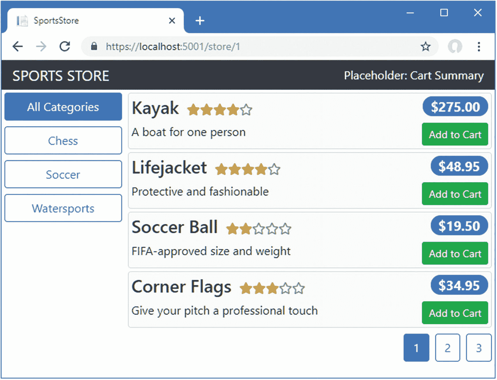
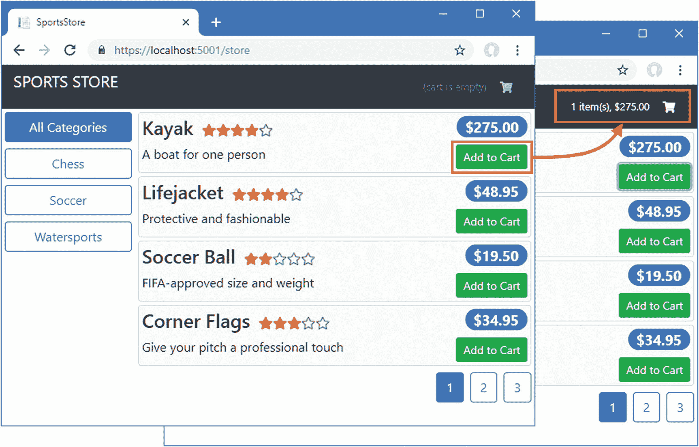
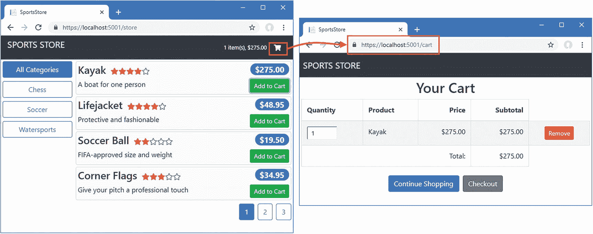
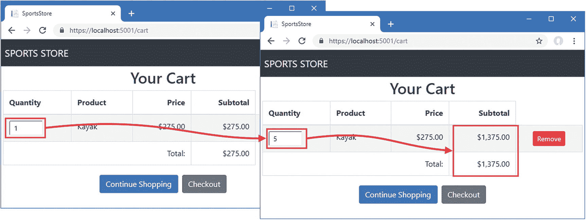
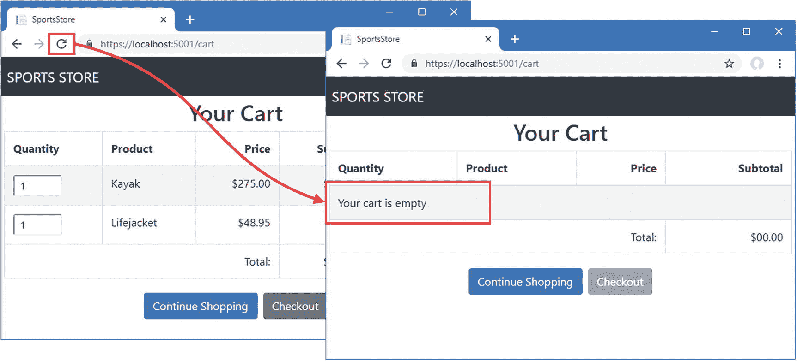
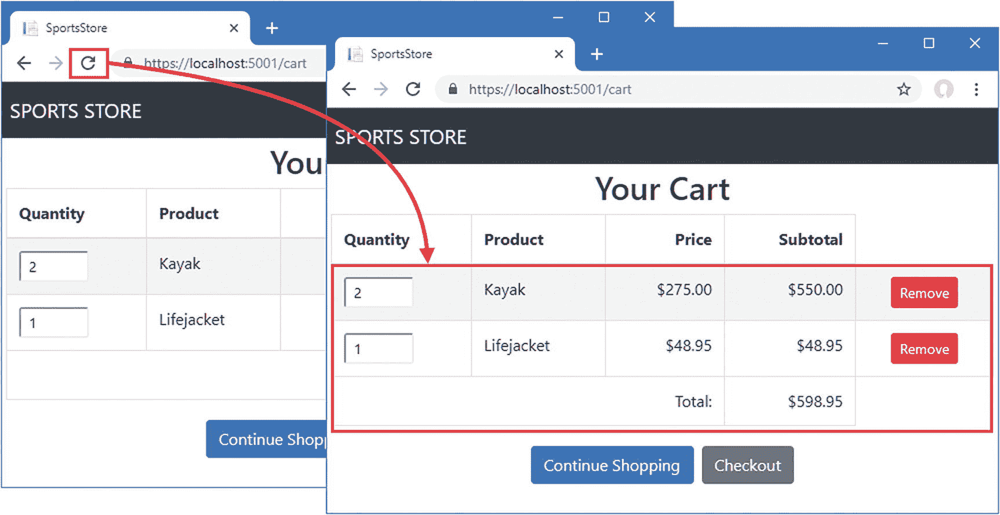
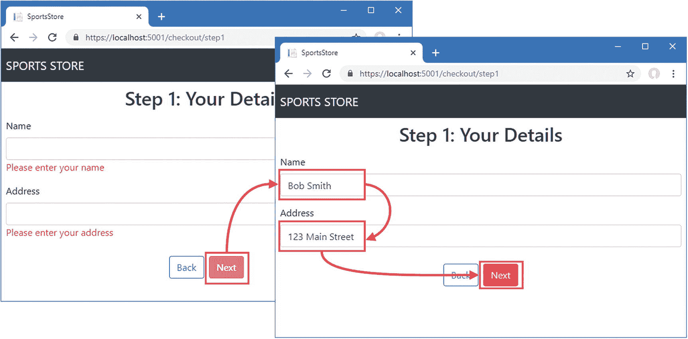
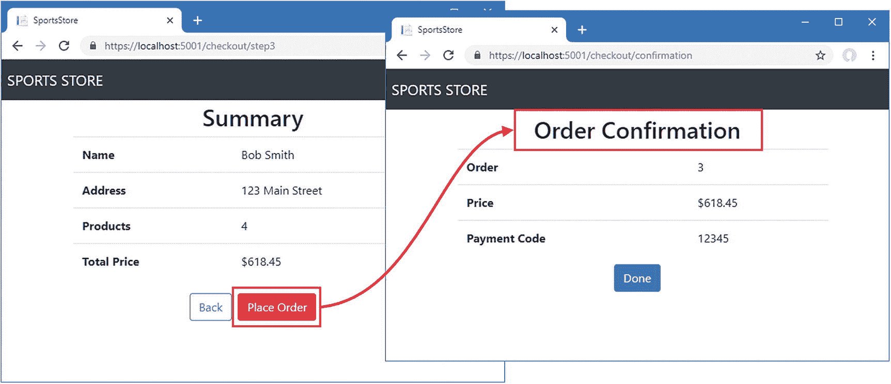
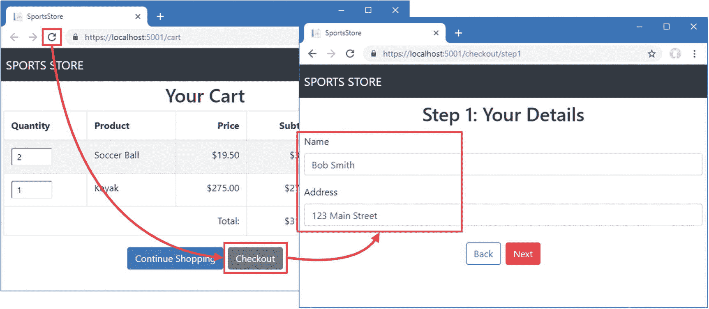

# 九、完成 Angular 存储

在这一章中，我完成了 SportsStore 应用的面向客户的特性，允许用户将产品添加到购物车中，然后结账下订单。

## 为本章做准备

本章使用了我在第 [3 章](03.html)中创建的 SportsStore 项目，并在之后的章节中进行了修改。要删除数据库以便应用使用新的种子数据，打开一个新的命令提示符，导航到`ServerApp`文件夹，并运行清单 [9-1](#PC1) 中所示的命令。

```cs
dotnet ef database drop --force

Listing 9-1.Resetting the Database

```

运行清单 [9-2](#PC2) 中所示的命令，启动 ASP.NET Core 运行时和 Angular 开发工具。

```cs
dotnet watch run

Listing 9-2.Starting the Development Tools

```

打开新的浏览器窗口并导航至`https://localhost:5001`；您将看到如图 [9-1](#Fig1) 所示的内容。

### 小费

你可以从源代码库 [`https://github.com/Apress/esntl-angular-for-asp.net-core-mvc-3`](https://github.com/Apress/esntl-angular-for-asp.net-core-mvc-3) 免费下载每章的完整项目。运行`ClientApp`文件夹中的`npm install`，安装 Angular 开发所需的包，然后按照指示启动开发工具。



图 9-1。

运行示例应用

## 创建购物车

大多数网上商店允许用户将他们需要的产品收集到购物车中，然后用于完成购买。在接下来的部分中，我将演示如何在 Angular 应用中创建购物车，以及如何使用 ASP.NET Core MVC 和实体框架核心来存储购物车的内容。

### 扩展 Angular 数据模型

起点是定义一个新的类，它将在 Angular 应用中表示 cart。在`ClientApp/src/app/models`文件夹中添加一个名为`cart.model.ts`的新类型脚本文件，并使用它来定义清单 [9-3](#PC3) 中所示的类。

```cs
import { Injectable } from "@angular/core";

import { Product } from "./product.model";

@Injectable()
export class Cart {
    selections: ProductSelection[] = [];
    itemCount: number = 0;
    totalPrice: number = 0;

    addProduct(product: Product) {
        let selection = this.selections
            .find(ps => ps.productId == product.productId);
        if (selection) {
            selection.quantity++;
        } else {
            this.selections.push(new ProductSelection(this,
                product.productId, product.name,
                product.price, 1));
        }
        this.update();
    }

    updateQuantity(productId: number, quantity: number) {
        if (quantity > 0) {
            let selection = this.selections.find(ps => ps.productId == productId);
            if (selection) {
                selection.quantity = quantity;
            }
        } else {
            let index = this.selections.findIndex(ps => ps.productId == productId);
            if (index != -1) {
                this.selections.splice(index, 1);
            }
            this.update();
        }
    }

    clear() {
        this.selections = [];
        this.update();
    }

    update() {
        this.itemCount = this.selections.map(ps => ps.quantity)
            .reduce((prev, curr) => prev + curr, 0);
        this.totalPrice = this.selections.map(ps => ps.price * ps.quantity)
            .reduce((prev, curr) => prev + curr, 0);
    }
}

export class ProductSelection {

    constructor(public cart: Cart,
        public productId?: number,
        public name?: string,
        public price?: number,
        private quantityValue?: number) { }

    get quantity() {
        return this.quantityValue;
    }

    set quantity(newQuantity: number) {
        this.quantityValue = newQuantity;
        this.cart.update();
    }
}

Listing 9-3.The Contents of the cart.model.ts File in the ClientApp/src/app/models Folder

```

`Cart`类表示用户的购物车，使用`ProductSelection`类表示单个产品选择。`Cart`类提供了允许管理产品选择的方法，并提供了这些值报告购物车中商品数量及其总成本的属性。

每次产品选择改变时，必须调用`update`方法来重新计算总成本和购物车中的商品数量。请记住，Angular 在有更新时会重复计算数据绑定表达式，只有在需要避免重复检查购物车中的产品时才执行这种计算是一个好主意。

### 将购物车注册为服务

我将把`Cart`类注册为服务，这将允许其他类(包括组件)声明一个构造函数依赖关系，该依赖关系将使用依赖关系注入来解决，并将确保整个应用共享一个`Cart`对象。要注册服务，将`Cart`类添加到模型特征模块的`providers`属性中，如清单 [9-4](#PC4) 所示。

```cs
import { NgModule } from "@angular/core";
import { Repository } from "./repository";
import { HttpClientModule } from '@angular/common/http';
import { NavigationService } from "./navigation.service";

import { Cart } from "./cart.model";

@NgModule({
    imports: [HttpClientModule],
    providers: [Repository, NavigationService, Cart]
})
export class ModelModule {}

Listing 9-4.Registering a Service in the model.module.ts File in the ClientApp/src/app/models Folder

```

Angular 将创建一个`Cart`对象，并使用它来满足组件的构造函数依赖性，这些组件将提供面向用户的购物车功能。

### 给按钮接线

为列表中每个产品显示的“添加到购物车”按钮调用模板组件中的一个方法。这种方法还不存在，但却是必需的，这样用户就可以选择他们想要购买的产品。为了允许用户将产品添加到购物车，对产品列表组件进行清单 [9-5](#PC5) 中所示的更改。

```cs
import { Component } from "@angular/core";
import { Repository } from "../models/repository";
import { Product } from "../models/product.model";

import { Cart } from '../models/cart.model';

@Component({
    selector: "store-product-list",
    templateUrl: "productList.component.html"
})
export class ProductListComponent {

    constructor(private repo: Repository, private cart: Cart) { }

    get products(): Product[] {
        if (this.repo.products != null && this.repo.products.length > 0) {
            let pageIndex = (this.repo.paginationObject.currentPage - 1)
                * this.repo.paginationObject.productsPerPage;
            return this.repo.products.slice(pageIndex,
                pageIndex + this.repo.paginationObject.productsPerPage);
        }
    }

    addToCart(product: Product) {
        this.cart.addProduct(product);
    }
}

Listing 9-5.Adding Cart Items in the productList.component.ts File in the ClientApp/src/app/store Folder

```

构造函数接收一个`Cart`对象，其`addProduct`方法由组件的`addToCart`方法调用。

### 创建购物车摘要组件

第一个与购物车相关的组件将出现在产品列表的顶部，并显示用户购物车中的产品数量及其总成本。对`store`文件夹中的`cartSummary.component.ts`文件进行修改，如清单 [9-6](#PC6) 所示。

```cs
import { Component } from "@angular/core";

import { Cart } from "../models/cart.model";

@Component({
    selector: "store-cartsummary",
    templateUrl: "cartSummary.component.html"
})
export class CartSummaryComponent {

    constructor(private cart: Cart) { }

    get itemCount(): number {
        return this.cart.itemCount;
    }

    get totalPrice(): number {
        return this.cart.totalPrice;
    }
}

Listing 9-6.Adding Code in the cartSummary.component.ts File in the ClientApp/src/app/store Folder

```

新的构造函数声明了对`Cart`类的依赖，这将使用清单 [9-3](#PC3) 中定义的服务来解析，该服务用于提供只读`itemCount`和`totalPrice`属性的值。为了向用户显示购物车的摘要，用清单 [9-7](#PC7) 中所示的元素替换组件模板中的占位符内容。

```cs
<div class="text-right p-1">
    <small *ngIf="itemCount > 0; else empty">
        {{ itemCount }} item(s), {{ totalPrice | currency:"USD":"symbol" }}
    </small>
    <button class="btn btn-sm ml-1"
            [disabled]="itemCount == 0"
            routerLink="/cart">
        <i class="text-white fa fa-shopping-cart"></i>
    </button>
</div>

<ng-template #empty>
    <small class="text-muted">
        (cart is empty)
    </small>
</ng-template>

Listing 9-7.The cartSummary.component.html File in the ClientApp/src/app/store Folder

```

该模板使用前面示例中显示的特性向用户显示购物车的摘要。`ngIf`指令用于根据购物车中的商品数量改变显示给用户的内容。如果没有项目，则显示`empty`模板。如果购物车包含商品，则显示商品数量和总费用。

有一个`button`元素为购物车使用了字体 Awesome 图标，并在`disabled`属性上配置了一个数据绑定，如下所示:

```cs
...
<button class="btn btn-sm ml-1" [disabled]="itemCount == 0" routerLink="/cart">
...

```

当购物车中没有商品时，该数据绑定会禁用按钮。button 元素还配置了`routerLink`属性，这样当单击按钮时，应用将导航到`/cart` URL。该 URL 尚未定义，但它将显示购物车内容的详细列表，并允许用户开始结帐过程。

保存更改并在浏览器中重新加载应用，以查看购物车摘要。摘要将指示购物车为空，直到您为一个或多个产品单击 Add to Cart 按钮，之后将显示购物车中的商品数量及其成本，如图 [9-2](#Fig2) 所示。



图 9-2。

显示购物车摘要

### 显示购物车详细信息

下一步是创建显示购物车详细视图的组件，允许用户更改每个产品的数量，从购物车中删除产品，并开始结帐过程。在`store`文件夹中创建一个名为`cartDetail.component.ts`的类型脚本文件，并添加清单 [9-8](#PC9) 中所示的代码。

```cs
import { Component } from "@angular/core";
import { Cart } from "../models/cart.model";

@Component({
    templateUrl: "cartDetail.component.html"
})
export class CartDetailComponent {

    constructor(public cart: Cart) { }
}

Listing 9-8.The Contents of the cartDetail.component.ts File in the ClientApp/src/app/store Folder

```

该组件定义了一个构造函数`Cart`参数，用于创建一个可以被模板访问的`cart`属性。要创建模板，在`store`文件夹中创建一个名为`cartDetail.component.html`的 HTML 文件，内容如清单 [9-9](#PC10) 所示。

### 小费

注意，这个组件的装饰器没有定义一个`selector`属性。只有当您希望 Angular 将组件应用到 HTML 模板中的特定 HTML 元素时，才需要选择器，如果 URL 路由系统将组件仅显示在`router-outlet`元素中，则可以省略选择器。

```cs
<div class="bg-dark text-white p-2">
    <div class="navbar-brand">SPORTS STORE</div>
</div>

<div class="m-1">
    <h2 class="text-center">Your Cart</h2>
    <table class="table table-bordered table-striped p-1">
        <thead>
            <tr>
                <th>Quantity</th><th>Product</th>
                <th class="text-right">Price</th>
                <th class="text-right">Subtotal</th>
            </tr>
        </thead>
        <tbody>
            <tr *ngIf="cart.selections.length == 0">
                <td colspan="4" class="text-xs-center">
                    Your cart is empty
                </td>
            </tr>
            <tr *ngFor="let sel of cart.selections">
                <td>
                    <input type="number" class="form-control-sm"
                            style="width:5em" [(ngModel)]="sel.quantity" />
                </td>
                <td>{{sel.name}}</td>
                <td class="text-right">
                    {{sel.price | currency:"USD":"symbol":"2.2-2"}}
                </td>
                <td class="text-right">
                    {{(sel.quantity * sel.price) | currency:"USD":"symbol":"2.2-2" }}
                </td>
                <td class="text-center">
                    <button class="btn btn-sm btn-danger"
                            (click)="cart.updateQuantity(sel.productId, 0)">
                        Remove
                    </button>
                </td>
            </tr>
        </tbody>
        <tfoot>
            <tr>
                <td colspan="3" class="text-right">Total:</td>
                <td class="text-right">
                    {{cart.totalPrice | currency:"USD":"symbol":"2.2-2"}}
                </td>
            </tr>
        </tfoot>
    </table>
</div>
<div class="text-center">
    <button class="btn btn-primary m-1" routerLink="/store">Continue Shopping</button>
    <button class="btn btn-secondary m-1" routerLink="/checkout"
            [disabled]="cart.selections.length == 0">
        Checkout
    </button>
</div>

Listing 9-9.The Contents of the cartDetail.component.html File in the ClientApp/src/app/store Folder

```

模板中的 HTML 元素列出了购物车的内容，以及每个商品的小计和总计。这是通过使用标准数据绑定(由字符`{{`和`}}`表示)、内置指令(`ngFor`和`ngIf`)和管道(用于格式化货币金额)来完成的。该模板中有一个新特性，允许用户通过改变`input`元素中的值来改变购物车中产品的数量，如下所示:

```cs
...
<input type="number" class="form-control-sm"
    style="width:5em" [(ngModel)]="sel.quantity" />
...

```

这是一个双向数据绑定，这意味着单个绑定可以读取数据值并修改它。双向数据绑定用于表单元素，由方括号和圆括号(`[(`和`)]`)表示，这被称为“盒子里的香蕉”，其中圆括号是香蕉，方括号是盒子。双向数据绑定最常与`ngModel`指令一起使用，该指令知道如何设置表单元素显示的值，以及为了检测变化要监听哪些事件。与`ngModel`绑定一起使用的表达式指定了一个属性，该属性的值将由表单元素显示，并且将在用户进行更改时更新。在这种情况下，产品选择的`quantity`属性被指定。

为了使组件在应用中可用，在 store feature 模块中注册它，如清单 [9-10](#PC12) 所示。

```cs
import { NgModule } from "@angular/core";
import { BrowserModule } from '@angular/platform-browser';
import { CartSummaryComponent } from "./cartSummary.component";
import { CategoryFilterComponent } from "./categoryFilter.component";
import { PaginationComponent } from "./pagination.component";
import { ProductListComponent } from "./productList.component";
import { RatingsComponent } from "./ratings.component";
import { ProductSelectionComponent } from "./productSelection.component";

import { CartDetailComponent } from "./cartDetail.component";

import { FormsModule } from "@angular/forms";

import { RouterModule } from "@angular/router";

@NgModule({
    declarations: [CartSummaryComponent, CategoryFilterComponent,
        PaginationComponent, ProductListComponent, RatingsComponent,
        ProductSelectionComponent, CartDetailComponent],
    imports: [BrowserModule, FormsModule, RouterModule],
    exports: [ProductSelectionComponent]
})
export class StoreModule { }

Listing 9-10.Registering a Component in the store.module.ts File in the ClientApp/src/app/store Folder

```

除了将`CartDetailComponent`类添加到`NgModule`装饰器的声明属性中，该清单还将两个 Angular 模块添加到`imports`属性中。

`RouterModule`是必需的，因为清单 [9-9](#PC10) 中的模板中有`button`元素已经应用了`routerLink`指令，如果`RouterModule`还没有被导入到组件的特征模块中，这就不起作用了。需要`FormsModule`来启用`ngModel`指令，该指令用于允许用户更改产品数量的双向数据绑定。

要创建显示购物车详细信息的 URL 路由，请将配置条目添加到路由配置中，如清单 [9-11](#PC13) 所示。

```cs
import { NgModule } from '@angular/core';
import { Routes, RouterModule } from '@angular/router';
import { ProductSelectionComponent } from "./store/productSelection.component";

import { CartDetailComponent } from "./store/cartDetail.component";

const routes: Routes = [
    { path: "cart", component: CartDetailComponent },
    { path: "store/:category/:page", component: ProductSelectionComponent },
    { path: "store/:categoryOrPage", component: ProductSelectionComponent },
    { path: "store", component: ProductSelectionComponent },
    { path: "", redirectTo: "/store", pathMatch: "full" }
];

@NgModule({
  imports: [RouterModule.forRoot(routes)],
  exports: [RouterModule]
})
export class AppRoutingModule { }

Listing 9-11.Adding a Route in the app-routing.module.ts File in the ClientApp/src/app Folder

```

为了确保用户可以直接导航到`/cart` URL，更新项目的 ASP.NET Core MVC 部分使用的回退路径，如清单 [9-12](#PC14) 所示。

```cs
...
app.UseEndpoints(endpoints => {
    endpoints.MapControllerRoute(
        name: "default",
        pattern: "{controller=Home}/{action=Index}/{id?}");

    endpoints.MapControllerRoute(
        name: "angular_fallback",
        pattern: "{target:regex(store|cart)}/{*catchall}",
        defaults: new  { controller = "Home", action = "Index"});

    endpoints.MapRazorPages();
});
...

Listing 9-12.Updating the Fallback Route in the Startup.cs File in the ServerApp Folder

```

允许应用重新加载，并单击“添加到购物车”按钮之一，将产品添加到购物车。点击页面顶部的购物车图标，导航到`/cart` URL，显示购物车的详细视图，如图 [9-3](#Fig3) 所示。



图 9-3。

显示购物车详细信息

双向数据绑定允许用户使用`input`元素更改产品的数量。例如，如果您将输入元素中的值`1`更改为`5`，小计和总计将会更新以反映这一更改，如图 [9-4](#Fig4) 所示。



图 9-4。

更改产品数量

## 储存推车

目前手推车的工作方式存在一个隐藏的问题。要查看问题，请在购物车中添加一些产品，然后重新加载浏览器窗口。Angular 应用被重新加载，这意味着购物车的内容丢失，如图 [9-5](#Fig5) 所示。



图 9-5。

重新加载浏览器窗口的效果

在接下来的部分中，我将演示如何使用 ASP.NET Core MVC 会话数据特性来存储购物车数据，并解释如何使用它来防止出现图中所示的问题。

### 扩展 ASP.NET Core MVC 数据模型

第一步是定义一个表示购物车的 C# 模型类。我将用来存储数据的机制可以用来存储任何字符串数据，但是使用 C# 类和 MVC 模型绑定特性将确保只能存储购物车数据，防止该特性被滥用来存储客户端发送的任何任意数据。将名为`CartProductSelection.cs`的新 C# 类文件添加到`ServerApp/Models`文件夹中，并使用它来定义清单 [9-13](#PC15) 中所示的类。

```cs
namespace ServerApp.Models {

    public class ProductSelection {
        public long productId { get; set; }
        public string name { get; set; }
        public decimal price { get; set; }
        public int quantity { get; set; }
    }
}

Listing 9-13.The Contents of the CartProductSelection.cs File in the ServerApp/Models Folder

```

这个类将允许 MVC 模型绑定器处理客户端发送的数据，并表示用户添加到购物车中的每个产品。

### 小费

注意，在清单 [9-13](#PC15) 中，属性名以小写字母开头。这使得在直接处理 JSON 字符串时更容易正确解析 JSON 会话数据，这就是 Angular 应用将购物车数据发送到服务器进行存储的方式。

### 创建购物车存储 Web 服务

下一步是创建一个 HTTP web 服务，允许客户端将购物车数据发送到 ASP.NET Core MVC 进行存储。web 服务将使用 ASP.NET Core MVC 会话数据特性存储数据，这将自动管理数据的生命周期。并非所有的购物车数据都会导致完成购买，使用会话数据将确保被放弃的购物车数据会自动过期，并且正如您将看到的，当用户重新加载浏览器时，向客户端提供其客户端数据变得简单。

#### 安装 NuGet 包

要安装这个特性所需的包，打开一个新的命令提示符，导航到`ServerApp`文件夹，运行清单 [9-14](#PC16) 中显示的命令。

```cs
dotnet add package Microsoft.Extensions.Caching.SqlServer --version 3.0.0
dotnet tool uninstall --global dotnet-sql-cache
dotnet tool install --global dotnet-sql-cache --version 3.0.0

Listing 9-14.Installing Packages

```

#### 准备数据库

下一步是准备数据库，以便它可以用于存储会话数据。运行`ServerApp`文件夹中列表 [9-15](#PC17) 所示的命令。

### 注意

ASP.NET Core MVC 可以以多种不同的方式存储其会话数据，包括使用内存存储。对于这个例子，我选择了 SQL Server，因为它简化了部署应用所需的基础结构。内存选项意味着每台 ASP.NET Core MVC 服务器都有自己的会话数据，可能需要额外的工作来确保来自单个客户端的请求总是由同一台服务器处理。使用数据库允许 ASP.NET Core MVC 共享会话数据，这意味着任何服务器都可以处理任何请求。

```cs
dotnet sql-cache create "Server=(localdb)\MSSQLLocalDB;Database=EssentialApp" "dbo" "SessionData"

Listing 9-15.Creating the Session Database Table

```

`dotnet sql-cache`命令为连接字符串、模式(将相关数据库分组在一起的 SQL Server 特性)和将用于存储会话数据的表名设置模式和必需的参数。连接字符串与`appsettings.Development.json`文件中指定的字符串相同，必须准确复制并输入到一行中。模式参数是`dbo`(这是 SQL Server 使用的默认值)，最后一个参数是`SessionData`，它指定将要创建的表的名称。

### 小费

注意清单 [9-15](#PC17) 中的`Server`设置在`(localdb)\MSSQLLocalDB`中只有一个`\`字符，而在 app 设置文件中有两个。文件中的附加字符是必需的，因为反斜杠在 JSON 中有特殊的含义，在使用时必须进行转义。

#### 配置 ASP.NET Core MVC 应用

为了设置 ASP.NET Core MVC 以使用会话数据库，将清单 [9-16](#PC18) 中所示的语句添加到`Startup`类中。

```cs
using System;
using System.Collections.Generic;
using System.Linq;
using System.Threading.Tasks;
using Microsoft.AspNetCore.Builder;
using Microsoft.AspNetCore.Hosting;
using Microsoft.AspNetCore.HttpsPolicy;
using Microsoft.Extensions.Configuration;
using Microsoft.Extensions.DependencyInjection;
using Microsoft.Extensions.Hosting;
using Microsoft.AspNetCore.SpaServices.AngularCli;
using ServerApp.Models;
using Microsoft.EntityFrameworkCore;

using Microsoft.OpenApi.Models;

namespace ServerApp {
    public class Startup {

        public Startup(IConfiguration configuration) {
            Configuration = configuration;
        }

        public IConfiguration Configuration { get; }

        public void ConfigureServices(IServiceCollection services) {

            string connectionString =
                Configuration["ConnectionStrings:DefaultConnection"];
            services.AddDbContext<DataContext>(options =>
                options.UseSqlServer(connectionString));

            services.AddControllersWithViews()
                .AddJsonOptions(opts => {
                    opts.JsonSerializerOptions.IgnoreNullValues = true;
                });
            services.AddRazorPages();

            services.AddSwaggerGen(options => {
                options.SwaggerDoc("v1",
                    new OpenApiInfo { Title = "SportsStore API", Version = "v1" });
            });

            services.AddDistributedSqlServerCache(options => {
                options.ConnectionString = connectionString;
                options.SchemaName = "dbo";
                options.TableName = "SessionData";
            });

            services.AddSession(options => {
                options.Cookie.Name = "SportsStore.Session";
                options.IdleTimeout = System.TimeSpan.FromHours(48);
                options.Cookie.HttpOnly = false;
                options.Cookie.IsEssential = true;
            });
        }

        public void Configure(IApplicationBuilder app, IWebHostEnvironment env,
                IServiceProvider services) {

            if (env.IsDevelopment()) {
                app.UseDeveloperExceptionPage();
            } else {
                app.UseExceptionHandler("/Home/Error");
                app.UseHsts();
            }

            app.UseHttpsRedirection();
            app.UseStaticFiles();

            app.UseSession();

            app.UseRouting();
            app.UseAuthorization();

            app.UseEndpoints(endpoints => {
                endpoints.MapControllerRoute(
                    name: "default",
                    pattern: "{controller=Home}/{action=Index}/{id?}");

                endpoints.MapControllerRoute(
                    name: "angular_fallback",
                    pattern: "{target:regex(store|cart)}/{*catchall}",
                    defaults: new { controller = "Home", action = "Index" });

                endpoints.MapRazorPages();
            });

            app.UseSwagger();
            app.UseSwaggerUI(options => {
                options.SwaggerEndpoint("/swagger/v1/swagger.json",
                    "SportsStore API");
            });

            app.UseSpa(spa => {
                string strategy = Configuration
                    .GetValue<string>("DevTools:ConnectionStrategy");
                if (strategy == "proxy") {
                    spa.UseProxyToSpaDevelopmentServer("http://127.0.0.1:4200");
                } else if (strategy == "managed") {
                    spa.Options.SourcePath = "../ClientApp";
                    spa.UseAngularCliServer("start");
                }
            });

            SeedData.SeedDatabase(services.GetRequiredService<DataContext>());
        }
    }
}

Listing 9-16.Configuring Session Data in the Startup.cs File in the ServerApp Folder

```

`AddDistributedSqlServerCache`扩展方法告诉 ASP.NET Core MVC 使用 SQL Server 作为数据缓存，配置选项对应于清单 [9-15](#PC17) 中命令行上使用的参数。

`AddSession`扩展方法设置会话状态并配置将用于识别会话的 cookie。配置选项将 cookie 的名称设置为`SportsStore.Session`，有效期为 48 小时。必须将`CookieHttpOnly`属性设置为`false`，以便 Angular 应用可以访问它。ASP.NET Core 应用中的`UseSession`方法启用会话。

#### 创建 Web 服务控制器

既然 ASP.NET Core MVC 已经被配置为使用会话数据，那么是时候创建允许 Angular 应用存储其购物车数据的 web 服务了。在`ServerApp/Controllers`文件夹中添加一个名为`SessionValuesController.cs`的 C# 类文件，并使用它来定义清单 [9-17](#PC19) 中所示的类。

```cs
using Microsoft.AspNetCore.Http;
using Microsoft.AspNetCore.Mvc;
using Newtonsoft.Json;
using ServerApp.Models;

namespace ServerApp.Controllers {

    [Route("/api/session")]
    [ApiController]
    public class SessionValuesController : Controller {

        [HttpGet("cart")]
        public IActionResult GetCart() {
            return Ok(HttpContext.Session.GetString("cart"));
        }

        [HttpPost("cart")]
        public void StoreCart([FromBody] ProductSelection[] products) {
            var jsonData = JsonConvert.SerializeObject(products);
            HttpContext.Session.SetString("cart", jsonData);
        }
    }
}

Listing 9-17.The Contents of the SessionValuesController.cs File in the ServerApp/Controllers Folder

```

该控制器定义了 HTTP GET 和 POST 请求可以针对的操作，允许检索和存储购物车数据。在动作方法中，通过`HttpContext.Session`属性访问会话数据，使用`GetString`和`SetString`扩展方法来读取和写入字符串数据。

`StoreCart`动作方法定义了一个用`FromBody`属性修饰的`ProductSelection`数组参数，这样 MVC 模型绑定器将从 HTTP 请求的主体中读取数据。然后，数据被转换回 JSON，并存储为会话数据，这些数据将被写入 SQL 数据库。将 JSON 数据解析成. NET 对象，然后序列化回 JSON 的过程确保了客户端不能存储任意数据。

### 存储和检索购物车数据

现在，项目的 ASP.NET Core MVC 部分可以存储购物车数据，我可以修改 Angular 应用，以便每当用户对购物车进行更改时，它就向服务器发送 HTTP POST 请求。向`Repository`类添加新方法，以便它可以获取和创建会话数据，如清单 [9-18](#PC20) 所示。

```cs
import { Product } from "./product.model";
import { Injectable } from "@angular/core";
import { HttpClient } from "@angular/common/http";
import { Filter, Pagination } from "./configClasses.repository";
import { Supplier } from "./supplier.model";

import { Observable } from "rxjs";

const productsUrl = "/api/products";
const suppliersUrl = "/api/suppliers";

const sessionUrl = "/api/session";

type productsMetadata = {
    data: Product[],
    categories: string[];
}

@Injectable()
export class Repository {
    product: Product;
    products: Product[];
    suppliers: Supplier[] = [];
    filter: Filter = new Filter();
    categories: string[] = [];
    paginationObject = new Pagination();

    constructor(private http: HttpClient) {
        this.filter.related = true;
    }

    // ...other methods and properties omitted for brevity...

    storeSessionData<T>(dataType: string, data: T) {
        return this.http.post(`${sessionUrl}/${dataType}`, data)
            .subscribe(response => { });
    }

    getSessionData<T>(dataType: string): Observable<T> {
        return this.http.get<T>(`${sessionUrl}/${dataType}`);
    }
}

Listing 9-18.Handling Session Data in the repository.ts File in the ClientApp/src/app/models Folder

```

`storeSessionData`和`getSessionData`方法发送针对 web 服务的请求，以存储和检索会话数据。这些方法并不专门用于处理购物车，因为在本章的后面我将使用相同的特性来存储其他类型的数据。

### 小费

在调用`subscribe`方法之前，`HttpClient`类不会发送请求。这就是为什么在清单 [9-18](#PC20) 的`storeSessionData`方法中调用了`subscribe`方法，即使结果被丢弃。

对清单 [9-19](#PC21) 中所示的`Cart`类进行修改，以便通过存储库存储和检索购物车数据。

```cs
import { Injectable } from "@angular/core";
import { Product } from "./product.model";

import { Repository } from './repository';

@Injectable()
export class Cart {
    selections: ProductSelection[] = [];
    itemCount: number = 0;
    totalPrice: number = 0;

    constructor(private repo: Repository) {
        repo.getSessionData<ProductSelection[]>("cart").subscribe(cartData => {
            if (cartData != null) {
                cartData.forEach(item => this.selections.push(item));
                this.update(false);
            }
        });
    }

    addProduct(product: Product) {
        let selection = this.selections
            .find(ps => ps.productId == product.productId);
        if (selection) {
            selection.quantity++;
        } else {
            this.selections.push(new ProductSelection(this,
                product.productId, product.name,
                product.price, 1));
        }
        this.update();
    }

    updateQuantity(productId: number, quantity: number) {
        if (quantity > 0) {
            let selection = this.selections.find(ps => ps.productId == productId);
            if (selection) {
                selection.quantity = quantity;
            }
        } else {
            let index = this.selections.findIndex(ps => ps.productId == productId);
            if (index != -1) {
                this.selections.splice(index, 1);
            }
            this.update();
        }
    }

    clear() {
        this.selections = [];
        this.update();
    }

    update(storeData: boolean = true) {
        this.itemCount = this.selections.map(ps => ps.quantity)
            .reduce((prev, curr) => prev + curr, 0);
        this.totalPrice = this.selections.map(ps => ps.price * ps.quantity)
            .reduce((prev, curr) => prev + curr, 0);
        if (storeData) {
            this.repo.storeSessionData("cart", this.selections.map(s => {
                return {
                    productId: s.productId, name: s.name,
                    price: s.price, quantity: s.quantity
                }
            }));
        }
    }
}

export class ProductSelection {

    constructor(public cart: Cart,
        public productId?: number,
        public name?: string,
        public price?: number,
        private quantityValue?: number) { }

    get quantity() {
        return this.quantityValue;
    }

    set quantity(newQuantity: number) {
        this.quantityValue = newQuantity;
        this.cart.update();
    }
}

Listing 9-19.Persisting Cart Data in the cart.model.ts File in the ClientApp/src/app/models Folder

```

构造函数通过依赖注入接收一个`Repository`对象，该对象用于获取用户会话的任何存储的购物车数据。如果有可用的数据，就用它来填充购物车，并调用`update`方法来更新数据绑定中使用的属性，这样，触发 Angular 来重新评估这些绑定，以便将修改后的购物车呈现给用户。

每当有变化时，`update`方法使用`Repository`将购物车存储为会话数据。`Cart`类的结构使其易于与`ngModel`指令一起使用，但在序列化时会创建一个引用循环，所以我使用 JavaScript 数组`map`方法来选择应该发送到服务器并存储的属性。存储会话数据时，Angular 应用不检查 web 服务返回的结果，产生一种“一劳永逸”的效果。

要查看效果，重启 ASP.NET Core 运行时，然后使用浏览器请求`https://localhost:5001`。使用“添加到购物车”按钮选择一些产品，单击窗口顶部的购物车图标，然后重新加载浏览器窗口。现在购物车数据是使用 ASP.NET Core MVC 会话特性存储的，重新加载浏览器并不会清除购物车，如图 [9-6](#Fig6) 所示。ASP.NET Core MVC 将 cookie 添加到响应中，浏览器将 cookie 包含在后续的 HTTP 请求中，允许 Angular 应用存储和检索它的购物车数据。



图 9-6。

存储购物车数据的效果

## 创建结账流程

在接下来的部分中，我扩展了项目的 ASP.NET Core MVC 和 Angular 部分，以支持结帐过程并允许用户完成订单。在实际项目中，这将包括与支付系统的集成，但为了简单起见，我将在 SportsStore 应用中为支付留出一个占位符。支付系统因国家而异，通常需要银行账户详细信息和反洗钱检查，所有这些都超出了本书的范围。

### 警告

在接下来的部分中，我将付款细节存储在 SportsStore 数据库中。您的支付提供商或当地法律并不总是允许这样做。如果您确实存储了支付数据，那么您应该特别注意安全性，以避免泄露敏感数据。

### 扩展 ASP.NET Core MVC 数据模型

结账过程的大部分工作将由 Angular 应用完成，但该项目的 ASP.NET Core MVC 部分将负责验证用户提供的支付细节，并在结账过程结束时存储订单。

在`ServerApp/Models`文件夹中创建一个名为`Order.cs`的 C# 文件，并添加清单 [9-20](#PC22) 中所示的代码，以创建一个代表用户订单的模型类。

```cs
using Microsoft.AspNetCore.Mvc.ModelBinding;
using System.Collections.Generic;
using System.ComponentModel.DataAnnotations;
using System.ComponentModel.DataAnnotations.Schema;

namespace ServerApp.Models {

    public class Order {

        [BindNever]
        public long OrderId { get; set; }
        [Required]
        public string Name { get; set; }

        public IEnumerable<CartLine> Products { get; set; }

        [Required]
        public string Address{ get; set; }
        [Required]
        public Payment Payment { get; set; }
        [BindNever]
        public bool Shipped { get; set; } = false;
    }

    public class Payment {
        [BindNever]
        public long PaymentId { get; set; }
        [Required]
        public string CardNumber { get; set; }
        [Required]
        public string CardExpiry { get; set; }
        [Required]
        public string CardSecurityCode { get; set; }
        [BindNever]
        [Column(TypeName = "decimal(8, 2)")]
        public decimal Total { get; set; }
        [BindNever]
        public string AuthCode { get; set; }
    }

    public class CartLine {
        [BindNever]
        public long CartLineId { get; set; }
        [Required]
        public long ProductId { get; set; }
        [Required]
        public int Quantity { get; set; }
    }
}

Listing 9-20.The Contents of the Order.cs File in the ServerApp/Models Folder

```

这是一个订单的简化表示，它将让我演示捕获数据的过程，而不会陷入太多的细节。

### 小费

注意，`CartLine`类没有使用`Product`对象来表示用户的选择。这是因为实体框架核心会尝试向`Products`表中添加一列，以将`Product`对象与`CartLine`对象相关联，这不是应用所需的关系，因为单个`Product`可以在多个`CartLine`对象中使用。为了避免这个问题，我只存储了`ProductId`值，该值可以用作查询`Product`数据的键。

#### 创建新的实体框架核心迁移

订单将存储在数据库中，这意味着必须配置实体框架核心，以便它知道`Order`对象。编辑数据库上下文类以添加清单 [9-21](#PC23) 中所示的属性。

```cs
using Microsoft.EntityFrameworkCore;

namespace ServerApp.Models {

    public class DataContext : DbContext {

        public DataContext(DbContextOptions<DataContext> opts)
            : base(opts) { }

        public DbSet<Product> Products { get; set; }
        public DbSet<Supplier> Suppliers { get; set; }
        public DbSet<Rating> Ratings { get; set; }
        public DbSet<Order> Orders { get; set; }

        protected override void OnModelCreating(ModelBuilder modelBuilder) {
            modelBuilder.Entity<Product>().HasMany<Rating>(p => p.Ratings)
                .WithOne(r => r.Product).OnDelete(DeleteBehavior.Cascade);
            modelBuilder.Entity<Product>().HasOne<Supplier>(p => p.Supplier)
                .WithMany(s => s.Products).OnDelete(DeleteBehavior.SetNull);
        }
    }
}

Listing 9-21.Adding a Property in the DataContext.cs File in the Models Folder

```

停止 ASP.NET Core 运行时，并使用命令提示符运行清单 [9-22](#PC24) 中所示的命令(在`ServerApp`文件夹中)来创建数据库迁移，这将允许实体框架核心在数据库中存储`Order`对象。

```cs
dotnet ef migrations add Orders

Listing 9-22.Creating a Database Migration

```

该命令创建的迁移将在 ASP.NET Core MVC 应用重启时更新数据库模式，并允许存储`Order`数据。

### 创建 ASP.NET Core MVC Web 服务

为了允许 Angular 应用访问`Order`对象，在`Controllers`文件夹中添加一个名为`OrderValuesController.cs`的新 C# 类文件，并使用它来定义清单 [9-23](#PC25) 中所示的 web 服务控制器。

```cs
using Microsoft.AspNetCore.Mvc;
using Microsoft.EntityFrameworkCore;
using ServerApp.Models;
using System.Collections.Generic;
using System.Linq;

namespace ServerApp.Controllers {

    [Route("/api/orders")]
    [ApiController]
    public class OrderValuesController : Controller {
        private DataContext context;

        public OrderValuesController(DataContext ctx) {
            context = ctx;
        }

        [HttpGet]
        public IEnumerable<Order> GetOrders() {
            return context.Orders
                .Include(o => o.Products).Include(o => o.Payment);
        }

        [HttpPost("{id}")]
        public void MarkShipped(long id) {
            Order order = context.Orders.Find(id);
            if (order != null) {
                order.Shipped = true;
                context.SaveChanges();
            }
        }

        [HttpPost]
        public IActionResult CreateOrder([FromBody] Order order) {
            if (ModelState.IsValid) {

                order.OrderId = 0;
                order.Shipped = false;
                order.Payment.Total = GetPrice(order.Products);

                ProcessPayment(order.Payment);
                if (order.Payment.AuthCode != null) {
                    context.Add(order);
                    context.SaveChanges();
                    return Ok(new {
                        orderId = order.OrderId,
                        authCode = order.Payment.AuthCode,
                        amount = order.Payment.Total
                    });
                } else {
                    return BadRequest("Payment rejected");
                }
            }
            return BadRequest(ModelState);
        }

        private decimal GetPrice(IEnumerable<CartLine> lines) {
            IEnumerable<long> ids = lines.Select(l => l.ProductId);
            IEnumerable<Product> prods
                = context.Products.Where(p => ids.Contains(p.ProductId));
            return prods.Select(p => lines
                    .First(l => l.ProductId == p.ProductId).Quantity * p.Price)
                .Sum();
        }

        private void ProcessPayment(Payment payment) {
            // integrate your payment system here
            payment.AuthCode = "12345";
        }
    }
}

Listing 9-23.The Contents of the OrderValuesController.cs File in the ServerApp/Controllers Folder

```

该控制器支持 HTTP POST 请求在`CreateOrder`方法中创建新订单，依靠 MVC 模型绑定特性创建一个`Order`对象，使用模型验证过程检查该对象。

注意，`CreateOrder`方法调用了`GetPrice`方法，后者查询数据库以获取用户选择的产品的价格，从而确定订单的总成本。不要相信客户端会提供关键信息，这一点很重要，因为恶意用户很容易创建包含任意数据的 HTTP 请求，例如将所有产品的成本指定为一美元。

`CreateOrder`方法调用`ProcessPayment`方法来处理订单的付款。这是将支付系统集成到项目中的地方，但是这个方法只是返回一个占位符授权代码，这个代码连同事务金额和用于在数据库中存储订单的 ID 值一起返回给客户端。

### 创建 Angular 检验过程

既然后端服务已经就绪，下一步就是扩展 Angular 应用，这样它就可以获得创建提交给项目 ASP.NET Core MVC 部分的订单所需的数据。在接下来的小节中，我将创建一个表示订单的模型类。我还将创建一个组件，它使用 HTML 表单元素从用户那里获取所需的数据，并使用 HTTP POST 请求发送数据。

#### 扩展 Angular 数据模型

为了描述将被发送到服务器的顺序，在`models`文件夹中添加一个名为`order.model.ts`的类型脚本文件，并添加清单 [9-24](#PC26) 中所示的代码。

```cs
import { Injectable } from "@angular/core";
import { Cart } from "./cart.model";
import { Repository } from "./repository";

@Injectable()
export class Order {
    orderId: number;
    name: string;
    address: string;
    payment: Payment = new Payment();

    submitted: boolean = false;
    shipped: boolean = false;
    orderConfirmation: OrderConfirmation;

    constructor(private repo: Repository, public cart: Cart) { }

    get products(): CartLine[] {
        return this.cart.selections
            .map(p => new CartLine(p.productId, p.quantity));
    }

    clear() {
        this.name = null;
        this.address = null;
        this.payment = new Payment();
        this.cart.clear();
        this.submitted = false;
    }

    submit() {
        this.submitted = true;
        this.repo.createOrder(this);
    }
}

export class Payment {
    cardNumber: string;
    cardExpiry: string;
    cardSecurityCode: string;
}

export class CartLine {

    constructor(private productId: number,
        private quantity: number) { }
}

export class OrderConfirmation {

    constructor(public orderId: number,
        public authCode: string,
        public amount: number) { }
}

Listing 9-24.The Contents of the order.model.ts File in the ClientApp/src/app/models Folder

```

结账过程可能很复杂，我将通过向用户展示一系列单独的步骤来请求创建订单所需的不同信息，从而使用户更容易完成结账过程。为了更容易编码，`Order`和`Payment`类在其构造函数之外定义属性，这意味着我将能够使用数据绑定来逐步构建数据。

`Order`类定义了一个`submit`方法，该方法将使用由`Repository`类定义的名为`createOrder`的方法向服务器发送数据，如清单 [9-25](#PC27) 所示。

```cs
import { Product } from "./product.model";
import { Injectable } from "@angular/core";
import { HttpClient } from "@angular/common/http";
import { Filter, Pagination } from "./configClasses.repository";
import { Supplier } from "./supplier.model";
import { Observable } from "rxjs";

import { Order, OrderConfirmation } from "./order.model";

const productsUrl = "/api/products";
const suppliersUrl = "/api/suppliers";
const sessionUrl = "/api/session";

const ordersUrl = "/api/orders";

type productsMetadata = {
    data: Product[],
    categories: string[];
}

@Injectable()
export class Repository {
    product: Product;
    products: Product[];
    suppliers: Supplier[] = [];
    filter: Filter = new Filter();
    categories: string[] = [];
    paginationObject = new Pagination();
    orders: Order[] = [];

    constructor(private http: HttpClient) {
        this.filter.related = true;
    }

    // ...other methods omitted for brevity...

    getOrders() {
        this.http.get<Order[]>(ordersUrl)
            .subscribe(data => this.orders = data);
    }

    createOrder(order: Order) {
        this.http.post<OrderConfirmation>(ordersUrl, {
            name: order.name,
            address: order.address,
            payment: order.payment,
            products: order.products
        }).subscribe(data => {
            order.orderConfirmation = data
            order.cart.clear();
            order.clear();
        });
    }

    shipOrder(order: Order) {
        this.http.post(`${ordersUrl}/${order.orderId}`, {})
            .subscribe(() => this.getOrders())
    }
}

Listing 9-25.Creating Orders in the repository.ts File in the ClientApp/src/app/models Folder

```

新方法向`/api/orders` URL 发送一个 POST 请求，其中包含 MVC 模型绑定器能够轻松处理的数据负载。来自 web 服务的响应被分配给`Order`对象的`orderConfirmation`属性，当结帐过程完成时，我将把它呈现给用户。

为了确保在结帐过程中使用单一的`Order`对象，注册一个新的服务，如清单 [9-26](#PC28) 所示。

```cs
import { NgModule } from "@angular/core";
import { Repository } from "./repository";
import { HttpClientModule } from '@angular/common/http';
import { NavigationService } from "./navigation.service";
import { Cart } from "./cart.model";

import { Order } from './order.model';

@NgModule({
    imports: [HttpClientModule],
    providers: [Repository, NavigationService, Cart, Order]
})
export class ModelModule {}

Listing 9-26.Registering a Service in the model.module.ts File in the ClientApp/src/app/models Folder

```

将`Order`类添加到模型特征模块的`providers`属性将允许应用的其他部分声明将使用依赖注入解析的`Order`构造函数参数。

### 创建签出组件

为了向用户提供完成结帐过程所需的 HTML 表单，我将创建一系列 Angular 组件，每个组件将呈现一组表单元素，并使用 URL 路由系统在它们之间导航。在接下来的小节中，我将创建组件，并使用它们来构建向项目的 ASP.NET Core MVC 部分发送订单所需的数据。

#### 创建结帐详细信息组件

第一个组件将要求用户提供他们的姓名和地址。创建一个`ClientApp/src/app/store/checkout`文件夹，添加一个名为`checkoutDetails.component.ts`的类型脚本文件，代码如清单 [9-27](#PC29) 所示。

```cs
import { Component } from "@angular/core";
import { Router } from "@angular/router";
import { Order } from "../../models/order.model";

@Component({
    templateUrl: "checkoutDetails.component.html"
})
export class CheckoutDetailsComponent {

    constructor(private router: Router,
                public order: Order) {
        if (order.products.length == 0) {
            this.router.navigateByUrl("/cart");
        }
    }
}

Listing 9-27.The Contents of the checkoutDetails.component.ts File in the ClientApp/src/app/store/checkout Folder

```

该组件定义了一个构造函数，它通过依赖注入接收一个`Order`对象，这样就可以在模板中访问它。它还接收一个`Router`对象，如果用户没有选择任何产品就直接导航到组件，那么这个对象用于导航到购物车。为组件创建模板，在`store/checkout`文件夹中添加一个名为`checkoutDetails.component.html`的文件，内容如清单 [9-28](#PC30) 所示。

```cs
<div class="bg-dark text-white p-2">
    <div class="navbar-brand">SPORTS STORE</div>
</div>

<h2 class="text-center mt-2">Step 1: Your Details</h2>

<div class="p-2">
    <form novalidate #detailsForm="ngForm">
        <div class="form-group">
            <label>Name</label>
            <input #name="ngModel" name="name" class="form-control"
                   [(ngModel)]="order.name" required />
            <div *ngIf="name.invalid" class="text-danger">
                Please enter your name
            </div>
        </div>
        <div class="form-group">
            <label>Address</label>
            <input #address="ngModel" name="street" class="form-control"
                   [(ngModel)]="order.address" required />
            <div *ngIf="address.invalid" class="text-danger">
                Please enter your address
            </div>
        </div>
        <div class="text-center pt-2">
            <button type="button" class="btn btn-outline-primary m-1"
                    routerLink="/cart">Back</button>
            <button type="button" class="btn btn-danger m-1"
                    [disabled]="detailsForm.invalid"
                    routerLink="/checkout/step2">
                Next
            </button>
        </div>
    </form>
</div>

Listing 9-28.The checkoutDetails.component.html File in the ClientApp/src/app/store/checkout Folder

```

该模板利用 Angular 提供的特性来管理 HTML 表单和验证用户输入的数据。使用`ngModel`指令和香蕉盒括号定义的双向数据绑定告诉 Angular 哪个数据值应该与`input`元素相关联，如下所示:

```cs
...
<input #name="ngModel" name="name" class="form-control"
    [(ngModel)]="order.name" required />
...

```

这个数据绑定在组件的`order.name`属性上创建了一个双向绑定，它将用于设置`input`元素的值，并且将在用户编辑元素内容时更新。

为了支持数据验证，Angular 使用标准的 HTML 验证属性，这些属性应用于`input`元素，如下所示:

```cs
...
<input #name="ngModel" name="name" class="form-control"
    [(ngModel)]="order.name" required />
...

```

`required`属性指定这个`input`元素需要一个值。为了允许检查`input`元素的验证状态，使用`#name`属性创建一个名为`name`的变量，并赋予值`ngModel`，该变量可以在模板的其他地方使用。在这种情况下，验证消息显示在元素旁边，如下所示:

```cs
...
<div *ngIf="name.invalid" class="text-danger">Please enter your name</div>
...

```

给`name`变量分配一个对象，该对象定义了`invalid`和`valid`属性，这些属性指示元素的内容是否满足应用于它的验证约束。在这种情况下，`invalid`属性与一个`ngIf`指令一起使用来显示一条消息。

### 警告

不要将 ASP.NET Core MVC 客户端验证属性应用于 Angular 应用中的 HTML 元素。这样做会对相同的内容应用两种不同的验证系统，并给用户带来错误和困惑。

同样的方法可以用来检查整个表单的验证状态。模板变量在 form 元素上声明如下:

```cs
...
<form novalidate #detailsForm="ngForm">
...

```

该属性创建一个名为`detailsForm`的变量，该变量被赋值为`ngForm`以提供对表单整体验证状态的访问。提供了相同的`valid`和`invalid`属性，但是它们反映了表单中单个元素的组合状态，例如，如果表单中的任何`input`元素包含无效值，则`invalid`属性将返回`true`。这些属性可以通过`detailsForm`来访问，以防止用户继续结帐过程，如下所示:

```cs
...
<button type="button" class="btn btn-danger" [disabled]="detailsForm.invalid"
        routerLink="/checkout/step2">Next</button>
...

```

这个绑定在`button`元素上设置了`disabled`属性，这样它将被禁用，除非表单中的所有`input`元素都满足应用于它们的验证约束。

#### 创建结帐付款组件

结帐过程的第二步是提供付款细节。在`store/checkout`文件夹中添加一个名为`checkoutPayment.component.ts`的类型脚本文件，代码如清单 [9-29](#PC36) 所示。

```cs
import { Component } from "@angular/core";
import { Router } from "@angular/router";
import { Order } from "../../models/order.model";

@Component({
    templateUrl: "checkoutPayment.component.html"
})
export class CheckoutPaymentComponent {

    constructor(private router: Router,
                public order: Order) {
        if (order.name == null || order.address == null) {
            router.navigateByUrl("/checkout/step1");
        }
    }
}

Listing 9-29.The checkoutPayment.component.ts File in the ClientApp/src/app/store/checkout Folder

```

该组件遵循与流程中上一步相同的模式，并定义了一个构造函数，该构造函数将为模板提供对`Order`的访问，并且如果用户没有提供姓名和地址就直接导航，该构造函数将使用`Router`返回到上一步。

### 分量是基本的 Angular 单位

对于 MVC 开发人员来说，创建几乎相同的类来提供模板支持的过程可能会感到尴尬，因为它与 ASP.NET Core MVC 模型(单个控制器类可以选择多个模板)相冲突。

Angular 的架构使组件成为应用功能的基本单位，没有办法创建与 Razor 视图工作方式相对应的可互换模板。尽管这可能让人觉得奇怪，但是您应该接受 Angular 设计理念，并接受每个模板都有自己的组件，即使该组件只是为了提供对共享服务的访问，并且与同一应用中的其他组件非常相似。

要定义模板，在`store/checkout`文件夹中创建一个名为`checkoutPayment.component.html`的 HTML 文件，并添加清单 [9-30](#PC37) 中所示的元素。

```cs
<div class="bg-dark text-white p-2">
    <div class="navbar-brand">SPORTS STORE</div>
</div>

<h2 class="text-center mt-1">Step 2: Payment</h2>

<div class="p-2">
    <form novalidate #paymentForm="ngForm">
        <div class="form-group">
            <label>Card Number</label>
            <input #cardNumber="ngModel" name="cardNumber" class="form-control"
                   [(ngModel)]="order.payment.cardNumber" required />
            <div *ngIf="cardNumber.invalid" class="text-danger">
                Please enter your card number
            </div>
        </div>
        <div class="form-group">
            <label>Card Expiry</label>
            <input #cardExpiry="ngModel" name="cardExpiry" class="form-control"
                   [(ngModel)]="order.payment.cardExpiry" required />
            <div *ngIf="cardExpiry.invalid" class="text-danger">
                Please enter your card expiry
            </div>
        </div>
        <div class="form-group">
            <label>Security Code</label>
            <input #cardCode="ngModel" name="cardCode" class="form-control"
                   [(ngModel)]="order.payment.cardSecurityCode" required />
            <div *ngIf="cardCode.invalid" class="text-danger">
                Please enter your security code
            </div>
        </div>
        <div class="text-center pt-2">
            <button type="button" class="btn btn-outline-primary m-1"
                    routerLink="/checkout/step1">
                Back
            </button>
            <button type="button" class="btn btn-danger m-1"
                    [disabled]="paymentForm.invalid"
                    routerLink="/checkout/step3">Next</button>
        </div>
    </form>
</div>

Listing 9-30.The checkoutPayment.component.html File in the ClientApp/src/app/store/checkout Folder

```

该模板的工作方式与清单 [9-28](#PC30) 中的模板相同，除了它是由双向数据绑定选择属性的`Payment`对象。出现在模板末尾的`button`元素允许用户导航到结账流程中的前一个阶段或前进到下一个阶段。

#### 创建签出摘要组件

结帐过程的第三步是向用户提供将要下的订单的摘要。在`store/checkout`文件夹中创建一个名为`checkoutSummary.component.ts`的类型脚本文件，并添加清单 [9-31](#PC38) 中所示的代码。

```cs
import { Component } from "@angular/core";
import { Router } from "@angular/router";
import { Order } from "../../models/order.model";

@Component({
    templateUrl: "checkoutSummary.component.html"
})
export class CheckoutSummaryComponent {

    constructor(private router: Router,
                public order: Order) {
        if (order.payment.cardNumber == null
            || order.payment.cardExpiry == null
            || order.payment.cardSecurityCode == null) {
            router.navigateByUrl("/checkout/step2");
        }
    }

    submitOrder() {
        this.order.submit();
        this.router.navigateByUrl("/checkout/confirmation");
    }
}

Listing 9-31.The checkoutSummary.component.ts File in the ClientApp/src/app/store/checkout Folder

```

这个组件使用它的构造函数来接收一个`Order`对象，这个对象将由依赖注入提供，并且可以被它的模板访问，如果没有提供上一步所需的值，还可以使用`Route`来导航离开摘要。它还定义了一个`submitOrder`方法，该方法将订单发送到 web 服务并导航到流程的最后一步。

要创建模板，将名为`checkoutSummary.component.html`的 HTML 文件添加到 store/checkout 文件夹，其元素如清单 [9-32](#PC39) 所示。

```cs
<div class="bg-dark text-white p-2">
    <div class="navbar-brand">SPORTS STORE</div>
</div>

<h2 class="text-center m-1">Summary</h2>

<div class="container">
    <table class="table m-2">
        <tr><th>Name</th><td>{{order.name}}</td></tr>
        <tr><th>Address</th><td>{{order.address}}</td></tr>
        <tr><th>Products</th><td>{{order.cart.itemCount}}</td></tr>
        <tr>
            <th>Total Price</th>
            <td>{{order.cart.totalPrice | currency:"USD":"symbol" }}</td>
        </tr>
    </table>
    <div class="text-center pt-2">
        <button type="button" class="btn btn-outline-primary m-1"
                routerLink="/checkout/step2">
            Back
        </button>
        <button type="button" class="btn btn-danger m-1" (click)="submitOrder()">
            Place Order
        </button>
    </div>
</div>

Listing 9-32.The checkoutSummary.component.html File in the ClientApp/src/app/store/checkout Folder

```

Place Order 按钮使用 click 事件绑定来调用组件的`submitOrder`方法，以完成结帐过程。

#### 创建确认组件

结帐序列所需的最后一个组件显示订单摘要，显示其 ID、支付授权码和价格。在`store/checkout`文件夹中创建一个名为`orderConfirmation.component.ts`的类型脚本文件，并添加清单 [9-33](#PC40) 中所示的代码。

```cs
import { Component } from "@angular/core";
import { Router } from "@angular/router";
import { Order } from "../../models/order.model";

@Component({
    templateUrl: "orderConfirmation.component.html"
})
export class OrderConfirmationComponent {

    constructor(private router: Router,
                public order: Order) {
        if (!order.submitted) {
            router.navigateByUrl("/checkout/step3");
        }
    }
}

Listing 9-33.The orderConfirmation.component.ts File in the ClientApp/src/app/store/checkout Folder

```

该组件通过检查订单是否已提交来防止直接导航，如果没有，则导航到上一步。为了给组件提供模板，将一个名为`orderConfirmation.component.html`的 HTML 文件添加到`store/checkout`文件夹中，其元素如清单 [9-34](#PC41) 所示。

```cs
<div class="bg-dark text-white p-2">
    <div class="navbar-brand">SPORTS STORE</div>
</div>

<h2 class="text-center m-2">Order Confirmation</h2>

<div class="container">
    <table *ngIf="order.orderConfirmation; else nodata" class="table m-2">
        <tr><th>Order</th><td>{{order.orderConfirmation.orderId}}</td></tr>
        <tr><th>Price</th><td>{{order.orderConfirmation.amount}}</td></tr>
        <tr><th>Payment Code</th><td>{{order.orderConfirmation.authCode}}</td></tr>
    </table>
    <div class="text-center">
        <button class="btn btn-primary m-1" routerLink="/">Done</button>
    </div>

    <ng-template #nodata>
        <h3 class="text-center m-1">Submitting Order...</h3>
    </ng-template>
</div>

Listing 9-34.The orderConfirmation.component.html File in the ClientApp/src/app/store/checkout Folder

```

该模板在一个表中显示确认数据，以及一个导航回商店的 Done 按钮。

### 注册组件并创建路线

要设置结账流程，必须向商店功能模块注册四个新组件，并且必须更新 Angular 应用的 URL 路由配置，以包括用于在它们之间导航的路线。

首先，注册组件，使它们包含在应用中，如清单 [9-35](#PC42) 所示。

```cs
import { NgModule } from "@angular/core";
import { BrowserModule } from '@angular/platform-browser';
import { CartSummaryComponent } from "./cartSummary.component";
import { CategoryFilterComponent } from "./categoryFilter.component";
import { PaginationComponent } from "./pagination.component";
import { ProductListComponent } from "./productList.component";
import { RatingsComponent } from "./ratings.component";
import { ProductSelectionComponent } from "./productSelection.component";
import { CartDetailComponent } from "./cartDetail.component";
import { FormsModule } from "@angular/forms";
import { RouterModule } from "@angular/router";

import { CheckoutDetailsComponent } from "./checkout/checkoutDetails.component";

import { CheckoutPaymentComponent } from "./checkout/checkoutPayment.component";

import { CheckoutSummaryComponent } from "./checkout/checkoutSummary.component";

import { OrderConfirmationComponent } from "./checkout/orderConfirmation.component";

@NgModule({

    declarations: [CartSummaryComponent, CategoryFilterComponent,
        PaginationComponent, ProductListComponent, RatingsComponent,
        ProductSelectionComponent, CartDetailComponent, CheckoutDetailsComponent,
        CheckoutPaymentComponent, CheckoutSummaryComponent, OrderConfirmationComponent],
    imports: [BrowserModule, FormsModule, RouterModule],
    exports: [ProductSelectionComponent]
})
export class StoreModule { }

Listing 9-35.Registering Components in the store.module.ts File in the ClientApp/src/app/store Folder

```

最后，添加清单 [9-36](#PC43) 中所示的路线，这将允许用户完成结帐过程。

```cs
import { NgModule } from '@angular/core';
import { Routes, RouterModule } from '@angular/router';
import { ProductSelectionComponent } from "./store/productSelection.component";
import { CartDetailComponent } from "./store/cartDetail.component";

import { CheckoutDetailsComponent }

    from "./store/checkout/checkoutDetails.component";

import { CheckoutPaymentComponent }

    from "./store/checkout/checkoutPayment.component";

import { CheckoutSummaryComponent }

    from "./store/checkout/checkoutSummary.component";

import { OrderConfirmationComponent }

    from "./store/checkout/orderConfirmation.component";

const routes: Routes = [
    { path: "checkout/step1", component: CheckoutDetailsComponent },
    { path: "checkout/step2", component: CheckoutPaymentComponent },
    { path: "checkout/step3", component: CheckoutSummaryComponent },
    { path: "checkout/confirmation", component: OrderConfirmationComponent },
    { path: "checkout", redirectTo: "/checkout/step1", pathMatch: "full" },
    { path: "cart", component: CartDetailComponent },
    { path: "store/:category/:page", component: ProductSelectionComponent },
    { path: "store/:categoryOrPage", component: ProductSelectionComponent },
    { path: "store", component: ProductSelectionComponent },
    { path: "", redirectTo: "/store", pathMatch: "full" }
];

@NgModule({
  imports: [RouterModule.forRoot(routes)],
  exports: [RouterModule]
})
export class AppRoutingModule { }

Listing 9-36.Creating Routes in the app-routing.module.ts File in the ClientApp/src/app Folder

```

更新项目的 ASP.NET Core MVC 部分使用的回退路径，如清单 [9-37](#PC44) 所示，这样用户可以直接导航到`/checkout` URL，或者在显示结账时重新加载浏览器。

```cs
...
app.UseEndpoints(endpoints => {
    endpoints.MapControllerRoute(
        name: "default",
        pattern: "{controller=Home}/{action=Index}/{id?}");

    endpoints.MapControllerRoute(
        name: "angular_fallback",
        pattern: "{target:regex(store|cart|checkout)}/{*catchall}",
        defaults: new  { controller = "Home", action = "Index"});

    endpoints.MapRazorPages();
});
...

Listing 9-37.Modifying the Fallback Route in the Startup.cs File in the ServerApp Folder

```

启动 ASP.NET Core 运行时，使用浏览器导航到`https://localhost:5001`，并向购物车添加一些商品。单击购物车图标，然后单击结帐按钮开始结帐过程。对于流程中的每个步骤，验证消息将显示在表单元素旁边，直到您输入值，此时它们将消失。当所有表单元素都有有效值时，允许您进行下一步的按钮将被激活，如图 [9-7](#Fig7) 所示。



图 9-7。

使用 Angular 数据验证

继续完成结帐过程，并提供创建订单所需的数据。当你进入总结阶段时，点击 Place Order 按钮，Angular 应用将数据发送到 ASP.NET Core MVC web 服务并给出确认，如图 [9-8](#Fig8) 所示。



图 9-8。

向 web 服务发送订单

### 将结帐详细信息存储为会话数据

如果用户在结帐过程中重新加载浏览器窗口，他们输入的数据将会丢失，当一项任务显示为一系列不同的步骤时，这可能会特别令人困惑。这个问题可以通过将结帐过程中的进度存储为会话数据来解决，类似于存储购物车的方式。

#### 扩展会话数据 Web 服务

为了给 MVC 模型绑定器提供一个可以用来解析来自 HTTP 请求的检验数据值的类，在`Models/BindingTargets`文件夹中创建一个名为`CheckoutState.cs`的 C# 类文件，并添加清单 [9-38](#PC45) 中所示的代码。

```cs
namespace ServerApp.Models.BindingTargets {

    public class CheckoutState  {

        public string name { get; set; }
        public string address { get; set; }
        public string cardNumber { get; set; }
        public string cardExpiry { get; set; }
        public string cardSecurityCode { get; set; }
    }
}

Listing 9-38.The Contents of the CheckoutState.cs File in the ServerApp/Models/BindingTargets Folder

```

由`CheckoutState`类定义的属性名称遵循 JavaScript 大写约定，这将使数据在项目的 Angular 部分更容易处理。要添加对存储签出状态数据的支持，请将清单 [9-39](#PC46) 中所示的方法添加到`SessionValues`控制器中。

```cs
using Microsoft.AspNetCore.Http;
using Microsoft.AspNetCore.Mvc;
using Newtonsoft.Json;
using ServerApp.Models;

using ServerApp.Models.BindingTargets;

namespace ServerApp.Controllers {

    [Route("/api/session")]
    [ApiController]
    public class SessionValuesController : Controller {

        [HttpGet("cart")]
        public IActionResult GetCart() {
            return Ok(HttpContext.Session.GetString("cart"));
        }

        [HttpPost("cart")]
        public void StoreCart([FromBody] ProductSelection[] products) {
            var jsonData = JsonConvert.SerializeObject(products);
            HttpContext.Session.SetString("cart", jsonData);
        }

        [HttpGet("checkout")]
        public IActionResult GetCheckout() {
            return Ok(HttpContext.Session.GetString("checkout"));
        }

        [HttpPost("checkout")]
        public void StoreCheckout([FromBody] CheckoutState data) {
            HttpContext.Session.SetString("checkout",
                JsonConvert.SerializeObject(data));
        }
    }
}

Listing 9-39.Adding Methods in the SessionValuesController.cs File in the ServerApp/Controllers Folder

```

`StoreCheckout`方法通过 MVC 模型绑定器从客户端接收数据，序列化为 JSON，存储为会话数据。与购物车数据一样，这意味着数据作为 JSON 从客户端接收，解析以创建. NET 对象，然后再次序列化为 JSON，这是一个冗余的过程，但有助于确保客户端不能使用这个 web 服务来存储任意数据。`GetCheckout`方法检索序列化的数据，并将其原样返回给客户端。

#### 存储结账数据

最后一项更改是将用户在结帐过程中输入的值存储为会话数据。每次用户进行更改时，Angular checkout 组件使用的双向数据绑定都会更新，如果用作 HTTP 请求的触发器，这会生成太多的 HTTP 请求。相反，当应用导航到一个以`checkout`开头的新 URL 时，我将存储数据，这将表明结帐阶段之间的转换已经发生。我在第 [7](07.html) 章中使用的`Router`类在一个组件中导航，它生成可以被观察到的事件以了解路由变化。将清单 [9-40](#PC47) 中所示的代码添加到 Angular `Order`类中，以注册这些事件并使用它们向服务发送会话数据。

```cs
import { Injectable } from "@angular/core";
import { Cart } from "./cart.model";
import { Repository } from "./repository";

import { Router, NavigationStart } from "@angular/router";

import { filter } from "rxjs/operators";

type OrderSession = {

    name: string,
    address: string,
    cardNumber: string,
    cardExpiry: string,
    cardSecurityCode: string

}

@Injectable()
export class Order {
    orderId: number;
    name: string;
    address: string;
    payment: Payment = new Payment();

    submitted: boolean = false;
    shipped: boolean = false;
    orderConfirmation: OrderConfirmation;

    constructor(private repo: Repository,
        public cart: Cart,
        router: Router) {

        router.events
            .pipe(filter(event => event instanceof NavigationStart))
            .subscribe(event => {
                if (router.url.startsWith("/checkout")
                        && this.name != null && this.address != null) {
                    repo.storeSessionData<OrderSession>("checkout", {
                        name: this.name,
                        address: this.address,
                        cardNumber: this.payment.cardNumber,
                        cardExpiry: this.payment.cardExpiry,
                        cardSecurityCode: this.payment.cardSecurityCode
                    });
                }
            });

        repo.getSessionData<OrderSession>("checkout").subscribe(data => {
            if (data != null) {
                this.name = data.name;
                this.address = data.address;
                this.payment.cardNumber = data.cardNumber;
                this.payment.cardExpiry = data.cardExpiry;
                this.payment.cardSecurityCode = data.cardSecurityCode;
            }
        })
    }

    // ...other methods and properties omitted for brevity...
}

Listing 9-40.Using Session Data in the order.model.ts File in the ClientApp/src/app/models Folder

```

属性返回路由事件的可观察值。我使用 Reactive Extensions `filter`操作符来只选择`NavigationStart`事件，这样我就不会为同一个导航更改向服务器发送多个请求(例如，导航结束时有相应的事件类型)。

我使用`subscribe`方法通过向服务器发送会话数据来处理事件，但前提是有分配给`name`和`address`属性的值，这确保了我不会在用户向表单元素中输入内容并开始结帐过程之前尝试存储数据。

为了检索以前存储的会话数据，构造函数使用`Repository.getSessionData`方法，并使用接收到的数据来填充属性。请注意，我不必担心处理产品选择，这些选择已经存储为购物车会话数据。

结果是，在结帐过程中重新加载浏览器将使用户返回到购物车详细信息组件，但要确保表单元素在恢复结帐过程时被正确填充。允许 ASP.NET Core 运行时重新启动，导航到`https://localhost:5001`，并在结帐过程中重新加载浏览器，以确保您输入的值已被持久化，如图 [9-9](#Fig9) 所示。



图 9-9。

继续结帐过程

## 摘要

在本章中，我向您展示了如何使用 ASP.NET Core MVC 会话状态来存储购物车数据，这弥补了 Angular URL 路由的工作方式与用户可以重新加载浏览器或直接导航到 URL 的方式之间的差距。我还向您展示了如何创建一个多阶段结帐过程，该过程验证用户提供的数据并将其发送到 ASP.NET Core MVC web 服务。在下一章中，我将为 SportsStore 应用添加管理特性。