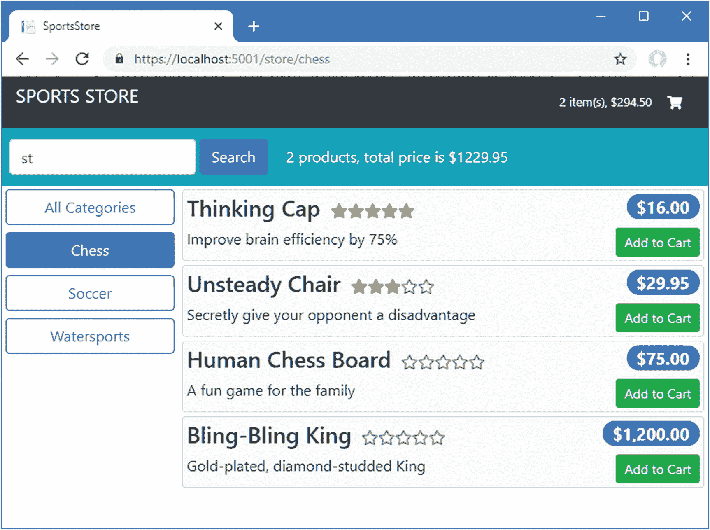

# 十、与 Blazor 一起使用 Angular

在这一章中，我简要介绍了 Blazor，并描述了它与 Angular 一起使用的不同方式。正如我所解释的，Angular 对于大多数项目来说仍然是一个更好的选择，但是如果你别无选择只能两者都用，我在本章中描述的技术将会很有帮助。请记住，结合两个框架可能很脆弱，容易出现问题，所以尽可能保持简单，并始终考虑是否可以将所有内容整合到一个框架中。本章使用 Blazor 的预发布版本，因为最终版本不包含在 ASP.NET Core 3.0 中。如果最终版本引入了任何突破性的变化，我会发布一个 GitHub 库的更新。

### 警告

本章中的例子介绍了另一个。NET 项目复制到 SportsStore 文件夹中。请密切注意每个列表的文件名，以确保您修改的是正确的文件。如果您没有得到预期的结果，请将您的项目与 GitHub 资源库上本章的源代码 [`https://github.com/Apress/esntl-angular-for-asp.net-core-mvc-3`](https://github.com/Apress/esntl-angular-for-asp.net-core-mvc-3) 进行比较。

## 为本章做准备

本章使用了我在第 [3 章](03.html)中创建的 SportsStore 项目，并在之后的章节中进行了修改。要删除数据库以便应用使用新的种子数据，打开一个新的命令提示符，导航到`ServerApp`文件夹，并运行清单 [10-1](#PC1) 中所示的命令。

### 小费

你可以从源代码库 [`https://github.com/Apress/esntl-angular-for-asp.net-core-mvc-3`](https://github.com/Apress/esntl-angular-for-asp.net-core-mvc-3) 免费下载每章的完整项目。运行`ClientApp`文件夹中的`npm install`，安装 Angular 开发所需的包，然后按照指示启动开发工具。

```cs
dotnet ef database drop --force
dotnet ef database update
dotnet sql-cache create "Server=(localdb)\MSSQLLocalDB;Database=EssentialApp" "dbo" "SessionData"

Listing 10-1.Resetting the Database

```

这些命令与前面的章节不同，因为第 [9](09.html) 章介绍了对会话数据的支持，并且必须从命令行配置数据库。

### 创建 Blazor 项目

要将 Blazor 项目添加到示例中，打开一个新的命令提示符，导航到`SportsStore`应用，并运行清单 [10-2](#PC2) 中所示的命令。

```cs
dotnet new -i Microsoft.AspNetCore.Blazor.Templates::3.0.0-preview9.19465.2
dotnet new blazorwasm -o BlazorApp

Listing 10-2.Creating a Blazor Project

```

Visual Studio 代码将自动检测添加到 SportsStore 文件夹中的新文件。如果您使用的是 Visual Studio，在解决方案资源管理器中右键单击 SportsStore 解决方案项，从弹出菜单中选择添加➤现有项目，在`BlazorApp`文件夹中选择`BlazorApp.csproj`文件，然后单击打开按钮。

### 运行 Angular 和 Blazor 应用

使用命令提示符运行清单`ServerApp`文件夹中的 [10-3](#PC3) 所示的命令，启动 ASP.NET Core 运行时和 Angular 开发工具。

```cs
dotnet watch run

Listing 10-3.Starting the Development Tools

```

打开新的浏览器窗口并导航至`https://localhost:5001`；您将看到 Angular 应用，如图 [10-1](#Fig1) 所示。


图 10-1。

运行示例应用

停止 ASP.NET Core 运行时并运行在`BlazorApp`文件夹中的清单 [10-4](#PC4) 中显示的命令。

```cs
dotnet watch run --urls=https://127.0.0.1:5500

Listing 10-4.Starting a Server for the Blazor Project

```

导航到`https://localhost:5500`；你会看到占位符内容被添加到 Blazor 项目中，如图 [10-2](#Fig2) 所示。


图 10-2。

占位符 Blazor 内容

## 了解 Blazor

Blazor 是一个使用 C# 编写客户端应用的框架。和 Angular 一样，Blazor 的功能是由一系列使用 HTML 元素组合而成的组件构成的。为了理解 Blazor 组件如何工作，将清单 [10-5](#PC5) 中所示的语句添加到`BlazorApp/Pages`文件夹中的`Counter.razor`文件中。

```cs
@page "/counter"

<h1>Counter</h1>

<p>Current count: @currentCount</p>

<button class="btn btn-primary" @onclick="@IncrementCount">Click me</button>

@code {
    int currentCount = 0;

    void IncrementCount() {
        currentCount++;
        System.Console.WriteLine("Counter: " + currentCount);
    }
}

Listing 10-5.Adding a Statement in the Counter.razor File in the BlazorApp/Pages Folder

```

Blazor 组件在同一个文件中结合了 HTML 元素和 C# 代码。HTML 内容包含前缀为`@,`的表达式，用于引用在`code`部分定义的属性和方法。

保存对组件的更改，允许 Blazor 项目的 ASP.NET Core 重新启动，然后重新加载浏览器(在编写本文时，Blazor 开发没有自动重新加载)。按 F12 打开浏览器的开发人员工具，并切换到控制台选项卡。在主浏览器窗口中，点击计数器，然后点击单击我按钮，如图 [10-3](#Fig3) 所示。


图 10-3。

使用 Blazor 组件

每次单击该按钮时，浏览器 JavaScript 控制台中都会出现一条消息，如下所示:

```cs
...
WASM: Counter: 1
WASM: Counter: 2
WASM: Counter: 3
...

```

清单 [10-5](#PC5) 中的 C# 代码已经被转换成可以被浏览器执行，这就是为什么对`Console.WriteLine`方法的调用在 F12 控制台窗口中产生消息，而不是在 ASP.NET Core 运行时的输出中。

### 了解 Blazor 的工作原理

Blazor 依赖于 WebAssembly，通常缩写为 Wasm，这是一种用于 web 应用的低级语言，允许将 JavaScript 以外的语言编译成浏览器可以执行的格式。Microsoft 已经创建了一个版本的。NET Core runtime for WebAssembly，它提供了在 Blazor 组件中执行代码的方法。Blazor 组件的开发工具链与普通 C# 类的开发工具链相同，如图 [10-4](#Fig4) 所示。不同之处在于。NET 核心运行时由浏览器通过 WebAssembly 功能执行。


图 10-4。

Blazor 工具链

在 WebAssembly 上运行的应用可以完全访问浏览器提供的功能，例如改变呈现给用户的 HTML 内容和发送 HTTP 请求。还有与 JavaScript 的互操作性，这样 Blazor 组件就可以与 Angular 交互，我将在本章后面演示。

当您导航到`https://localhost:5500`时，`BlazorApp`项目的 ASP.NET Core 服务器用`BlazorApp/wwwroot`文件夹中的`index.html`文件的内容进行响应，其中包含以下元素:

```cs
<!DOCTYPE html>
<html>
<head>
    <meta charset="utf-8" />
    <meta name="viewport" content="width=device-width" />
    <title>BlazorApp</title>
    <base href="/" />
    <link href="css/bootstrap/bootstrap.min.css" rel="stylesheet" />
    <link href="css/site.css" rel="stylesheet" />
</head>
<body>
    <app>Loading...</app>
    <script src="_framework/blazor.webassembly.js"></script>
</body>
</html>

```

`script`元素加载运行应用所需的`WebAssembly`代码。Blazor 应用中的`Startup`类包含一条语句，该语句将 HTML 文件中的`app`元素标识为客户端应用的目标，如下所示:

```cs
using Microsoft.AspNetCore.Components.Builder;
using Microsoft.Extensions.DependencyInjection;

namespace BlazorApp {
    public class Startup {

        public void ConfigureServices(IServiceCollection services) {
        }

        public void Configure(IComponentsApplicationBuilder app) {
            app.AddComponent<App>("app");
        }
    }
}

```

`app`元素由在`BlazorApp/App.razor`文件中定义的组件产生的 HTML 填充。Blazor 提供了一个路由系统，根据每个组件的`@page`指令指定的 URL 来选择显示给用户的组件。对于根 URL，Blazor 将选择在`BlazorApp/Pages/Index.razor`文件中定义的`Index`组件。

```cs
@page "/"

<h1>Hello, world!</h1>

Welcome to your new app.

<SurveyPrompt Title="How is Blazor working for you?" />

```

组件的默认布局在`Pages/_Imports.razor`文件中指定，该文件为占位符内容提供菜单和导航链接。例如，单击`Counter`会触发到`/counter` URL 的导航，这对应于由`Counter`组件定义的`@page`指令。

Blazor 组件生成的 HTML 元素使用普通的 CSS 特性进行样式化，就像 JavaScript 应用创建的元素一样。`BlazorApp`项目中的组件依赖于 Bootstrap CSS 框架和一个`site.css`文件，尽管如果你检查 Blazor `index.html`文件中的`link`元素，你会发现 Bootstrap 文件与 MVC 应用中通常使用的位置不同。

### 注意

Blazor 也有一个服务器端模式，在这种模式下，浏览器保持一个 HTTP 连接返回到 ASP.NET Core 服务器。当用户与浏览器显示的内容交互时，会向服务器发送一条消息，服务器执行 Blazor 组件逻辑，并以更新显示给用户的 HTML 的指令作为响应。在本书中，我不描述服务器端 Blazor。

### 理解 Blazor 的局限性

Blazor 对 ASP.NET Core MVC 开发人员的吸引力是显而易见的:用 C# 编写客户端应用，避免学习 TypeScript 和弄清楚 Angular 是如何工作的。不幸的是，Blazor 有局限性，这使得 Angular 成为大多数项目的更好选择。

第一个问题是 WebAssembly 是一个新标准，不被旧的浏览器支持。如果你确定只需要针对较新版本的 Chrome、Firefox、Safari 和 Edge，可以使用 Blazor，但如果你需要支持较旧版本或支持 Internet Explorer，则不要使用 Blazor，后者仍广泛用于企业桌面。

第二个问题是浏览器必须下载。NET Core 运行时来执行 Blazor 应用，在编写时需要大约 2 MB 的文件。文件由浏览器缓存，微软可能会在未来的 Blazor 版本中减少文件大小，但 Blazor 需要更大的初始下载，而 Angular 应用需要 400 KB。

第三个问题是 Blazor 的采用仍然不确定。微软有放弃不受欢迎的技术的历史。ASP.NET Core 是最广泛使用的业务线应用，这将是缓慢接受 Blazor，因为 WebAssembly 依赖与 Internet Explorer 使用的长尾冲突。如果 Blazor 的采用没有获得足够的市场份额来创建 Angular，React 和 Vue.js 的可行替代方案，那么微软将把资源集中在其他地方的风险很大，Blazor 将被允许消亡。

## 使用 ASP.NET Core MVC 服务 Blazor

最简单的集成方式是配置 ASP.NET Core 运行时，使其能够通过同一组 URL 支持 Angular 和 Blazor 应用，因此只需要一个 HTTP 服务器。我将配置该项目，以便当请求`/blazor` URL 时，它将交付来自`BlazorApp`项目的组件。

### 警告

现在有两个。NET 项目，它们有相似的文件夹结构。请务必严格按照说明运行命令，并严格按照显示的内容在指定的文件夹中运行命令。如果您在创建项目时遇到问题，那么您可以从 GitHub 资源库下载本章所需的所有内容，这本书名为 [`https://github.com/Apress/esntl-angular-for-asp.net-core-mvc-3`](https://github.com/Apress/esntl-angular-for-asp.net-core-mvc-3) 。

### 更改 Blazor 根 URL

第一步是更改 Blazor 应用使用的根 URL，如清单 [10-6](#PC10) 所示。这确保了 Blazor 应用知道如何执行相对于用来加载它的 URL 的导航。

### 警告

清单 [10-6](#PC10) 中`href`属性的值以正斜杠字符开始和结束。两者都是必需的，省略任何一个字符都会导致问题。

```cs
<!DOCTYPE html>
<html>
<head>
    <meta charset="utf-8" />
    <meta name="viewport" content="width=device-width" />
    <title>BlazorApp</title>
    <base href="/blazor/" />
    <link href="css/bootstrap/bootstrap.min.css" rel="stylesheet" />
    <link href="css/site.css" rel="stylesheet" />
</head>
<body>
    <app>Loading...</app>
    <script src="_framework/blazor.webassembly.js"></script>
</body>
</html>

Listing 10-6.Changing the Root URL in the index.html File in the BlazorApp/wwwroot Folder

```

#### 配置 MVC 项目以提供 Blazor 内容

需要额外的配置，以便 Blazor 功能可以通过应用的 MVC 部分交付。停止 Blazor 服务器，使用命令提示符导航到`ServerApp`文件夹，运行清单 [10-7](#PC11) 中所示的命令，将一个包添加到 MVC 项目中。

### 注意

这些命令在`ServerApp`文件夹中运行，而不是在`BlazorApp`文件夹中。

```cs
dotnet add package Microsoft.AspNetCore.Blazor.Server --version 3.0.0-preview9.19465.2

Listing 10-7.Adding a Package to the MVC Project

```

运行`ServerApp`文件夹中清单 [10-8](#PC12) 中所示的命令，从 MVC 项目添加一个引用到 Blazor 项目，这样`BlazorApp`项目中的类型可以在 MVC 项目中使用。

```cs
dotnet add reference ..\BlazorApp

Listing 10-8.Adding a Project Reference to the MVC Project

```

要配置 ASP.NET Core 运行时，使其服务于 Blazor 内容，将清单 [10-9](#PC13) 中所示的语句添加到`ServerApp`文件夹中的`Startup.cs`文件中。

```cs
using System;
using System.Collections.Generic;
using System.Linq;
using System.Threading.Tasks;
using Microsoft.AspNetCore.Builder;
using Microsoft.AspNetCore.Hosting;
using Microsoft.AspNetCore.HttpsPolicy;
using Microsoft.Extensions.Configuration;
using Microsoft.Extensions.DependencyInjection;
using Microsoft.Extensions.Hosting;
using Microsoft.AspNetCore.SpaServices.AngularCli;
using ServerApp.Models;
using Microsoft.EntityFrameworkCore;
using Microsoft.OpenApi.Models;

using Microsoft.AspNetCore.ResponseCompression;

using Microsoft.Extensions.FileProviders;

using System.IO;

namespace ServerApp {
    public class Startup {

        public Startup(IConfiguration configuration) {
            Configuration = configuration;
        }

        public IConfiguration Configuration { get; }

        public void ConfigureServices(IServiceCollection services) {

            string connectionString =
                Configuration["ConnectionStrings:DefaultConnection"];
            services.AddDbContext<DataContext>(options =>
                options.UseSqlServer(connectionString));

            services.AddControllersWithViews()
                .AddJsonOptions(opts => {
                    opts.JsonSerializerOptions.IgnoreNullValues = true;
                });
            services.AddRazorPages();

            services.AddSwaggerGen(options => {
                options.SwaggerDoc("v1",
                    new OpenApiInfo { Title = "SportsStore API", Version = "v1" });
            });

            services.AddDistributedSqlServerCache(options => {
                options.ConnectionString = connectionString;
                options.SchemaName = "dbo";
                options.TableName = "SessionData";
            });

            services.AddSession(options => {
                options.Cookie.Name = "SportsStore.Session";
                options.IdleTimeout = System.TimeSpan.FromHours(48);
                options.Cookie.HttpOnly = false;
                options.Cookie.IsEssential = true;
            });

            services.AddResponseCompression(opts => {
                opts.MimeTypes = ResponseCompressionDefaults.MimeTypes.Concat(
                    new[] { "application/octet-stream" });
            });
        }

        public void Configure(IApplicationBuilder app, IWebHostEnvironment env,
                IServiceProvider services) {

            if (env.IsDevelopment()) {
                app.UseDeveloperExceptionPage();
            } else {
                app.UseExceptionHandler("/Home/Error");
                app.UseHsts();
            }

            app.UseHttpsRedirection();
            app.UseStaticFiles();
            app.UseStaticFiles(new StaticFileOptions {
                RequestPath = "/blazor",
                FileProvider = new PhysicalFileProvider(
                    Path.Combine(Directory.GetCurrentDirectory(),
                        "../BlazorApp/wwwroot"))
            });

            app.UseSession();

            app.UseRouting();
            app.UseAuthorization();

            app.UseEndpoints(endpoints => {
                endpoints.MapControllerRoute(
                    name: "default",
                    pattern: "{controller=Home}/{action=Index}/{id?}");

                endpoints.MapControllerRoute(
                    name: "angular_fallback",
                    pattern: "{target:regex(store|cart|checkout)}/{*catchall}",
                    defaults: new { controller = "Home", action = "Index" });

                endpoints.MapFallbackToClientSideBlazor<BlazorApp
                     .Startup>("blazor/{*path:nonfile}", "index.html");

                endpoints.MapRazorPages();
            });

            app.Map("/blazor", opts =>
                opts.UseClientSideBlazorFiles<BlazorApp.Startup>());

            app.UseSwagger();
            app.UseSwaggerUI(options => {
                options.SwaggerEndpoint("/swagger/v1/swagger.json",
                    "SportsStore API");
            });

            app.UseSpa(spa => {
                string strategy = Configuration
                    .GetValue<string>("DevTools:ConnectionStrategy");
                if (strategy == "proxy") {
                    spa.UseProxyToSpaDevelopmentServer("http://127.0.0.1:4200");
                } else if (strategy == "managed") {
                    spa.Options.SourcePath = "../ClientApp";
                    spa.UseAngularCliServer("start");
                }
            });

            SeedData.SeedDatabase(services.GetRequiredService<DataContext>());
        }
    }
}

Listing 10-9.Adding Support for Blazor in the Startup.cs File in the ServerApp Folder

```

这些变化增加了对将`/blazor` URL 映射到`BlazorApp`项目以及从`BlazorApp/wwwroot`文件夹提供静态文件的支持。结果是对`/blazor`的请求将返回`BlazorApp/wwwroot/index.html`文件的内容，这将加载 Blazor 应用。对以`/blazor`开头的 URL 的请求将从`BlazorApp/wwwroot`文件夹提供服务，如果有匹配的文件，或者使用为 Blazor 应用生成的 WebAssembly 文件。

使用 PowerShell 命令提示符运行清单`ServerApp`文件夹中的 [10-10](#PC14) 所示的命令来启动 ASP.NET Core 运行时。

```cs
dotnet watch run

Listing 10-10.Starting the ASP.NET Core Runtime for the ServerApp Project

```

运行时启动后，导航至`https://localhost:5001/blazor`；您将看到来自`BlazorApp`项目的占位符内容。清单 [10-9](#PC13) 中使用的路由配置允许直接导航到 Blazor 应用理解的 URL，例如`https://localhost:5001/blazor/fetchdata`，它产生如图 [10-5](#Fig5) 所示的内容。


图 10-5。

直接导航到 Blazor 组件的 URL

### 在 MVC Razor 视图中显示 Blazor 组件

上一节中的配置使用 MVC 项目的 ASP.NET Core 来交付加载 Blazor 应用的 HTML 文件。这类似于我在使用 ASP.NET Core 交付加载 Angular 应用的静态 HTML 文件时采用的方法。这两种情况下的问题是静态 HTML 文件不能从 MVC 应用使用的共享布局中获益。

更好的方法是使用 Razor 视图来交付 Blazor 组件，这允许相同的布局用于 Blazor、Angular 和传统的 MVC 应用。为了让 Angular 和 Blazor 共享一个共同的布局，对`ServerApp/Views/Shared`文件夹中的`_Layout.cshtml`文件进行清单 [10-11](#PC15) 所示的修改。

```cs
<!DOCTYPE html>
<html lang="en">
<head>
    <base href="@( ViewData["RootUrl"] ?? "/")">
    <meta charset="utf-8" />
    <meta name="viewport" content="width=device-width, initial-scale=1.0" />
    <title>SportsStore</title>
    <link rel="stylesheet" href="~/lib/bootstrap/dist/css/bootstrap.css" />
    <link rel="stylesheet" href="~/lib/font-awesome/css/all.css"  />
    @RenderSection("ExtraCSS", required: false)
</head>
<body>
    @RenderBody()
    @RenderSection("Scripts", required: false)
</body>
</html>

Listing 10-11.Preparing the Layout in the _Layout.cshtml File in the ServerApp/Views/Shared Folder

```

添加到视图中的内容允许应用的根 URL 由视图指定，并提供了用于添加 CSS 文件的部分。要创建一个呈现 placeholder Blazor 应用的视图，在`ServerApp/Views/Home`文件夹中添加一个名为`Blazor.cshtml`的文件，其内容如清单 [10-12](#PC16) 所示。

```cs
@{
     ViewData["RootUrl"] = "/blazor/";
}

@section scripts {
    <script src="_framework/blazor.webassembly.js"></script>
}

@section extraCSS {
    <link href="css/site.css" rel="stylesheet" />
}

<div class="bg-dark text-white p-2">
    <div class="navbar-brand">SPORTS STORE</div>
</div>

<app>Loading...</app>

Listing 10-12.The Contents of the Blazor.cshtml File in the ServerApp/Views/Home Folder

```

该视图将根 URL 设置为`/blazor/`，为 Blazor WebAssembly 文件添加一个`script`元素，并为`BlazorApp`项目中的`site.css`文件添加一个`link`元素。我还添加了一个 SportsStore header 元素，这样就可以看到 Blazor 应用交付方式的变化。

接下来，将清单 [10-13](#PC17) 中所示的动作添加到`ServerApp/Controllers`文件夹中的`Home`控制器中。

```cs
using Microsoft.AspNetCore.Mvc;
using ServerApp.Models;
using System.Diagnostics;
using System.Linq;

namespace ServerApp.Controllers {

    public class HomeController : Controller {
        private DataContext context;

        public HomeController(DataContext ctx) {
            context = ctx;
        }

        public IActionResult Index() {
            return View(context.Products.First());
        }

        public IActionResult Blazor() {
            return View();
        }

        public IActionResult Privacy() {
            return View();
        }

        [ResponseCache(Duration = 0, Location = ResponseCacheLocation.None,
            NoStore = true)]
        public IActionResult Error() {
            return View(new ErrorViewModel { RequestId = Activity.Current?.Id
                ?? HttpContext.TraceIdentifier });
        }
    }
}

Listing 10-13.Adding an Action in the HomeController.cs File in the ServerApp/Controllers Folder

```

要配置 ASP.NET Core 运行时将对`/blazor`的请求定向到新的动作，对在`ServerApp`项目的`Startup`类中定义的路由配置进行清单 [10-14](#PC18) 中所示的更改。

```cs
...
app.UseEndpoints(endpoints => {
    endpoints.MapControllerRoute(
        name: "default",
        pattern: "{controller=Home}/{action=Index}/{id?}");

    endpoints.MapControllerRoute(
        name: "angular_fallback",
        pattern: "{target:regex(store|cart|checkout)}/{*catchall}",
        defaults: new  { controller = "Home", action = "Index"});

    endpoints.MapControllerRoute(
        name: "blazor_integration",
        pattern: "/blazor/{*path:nonfile}",
        defaults: new  { controller = "Home", action = "Blazor"});

    // endpoints.MapFallbackToClientSideBlazor<BlazorApp
    //      .Startup>("/blazor/{*path:nonfile}", "index.html");

    endpoints.MapRazorPages();
});
...

Listing 10-14.Changing the Routing Configuration in the Startup.cs File in the ServerApp Folder

```

新的路径不是从`BlazorApp`项目返回`index.html`文件，而是以清单 [10-13](#PC17) 中定义的动作为目标。一旦 ASP.NET Core 运行时重新启动，导航到`https://localhost:5001/blazor`；您将看到来自`BlazorApp`项目的 Blazor 应用，通过`ServerApp`项目的 Razor 视图交付，如图 [10-6](#Fig6) 所示。


图 10-6。

使用 Razor 视图交付 Blazor 应用

## 在同一视图中使用 Angular 和 Blazor

前面几节演示了如何通过 ASP.NET Core MVC 服务器交付 Blazor 应用，使用 Razor 视图来保证一致性。如果你正在处理一个单独的应用，这是一个有用的方法，但是 Blazor 也可以与 MVC 视图和控制器一起被集成到 ASP.NET Core 项目中，Blazor 组件可以与 Angular 应用一起显示，并与之进行互操作。

### 警告

只有在不能使用单一框架时，才应该进行这种类型的集成。让一切都正常工作可能很困难，而且结果可能很脆弱。

### 定义 Blazor 组件

在本书中，我的重点是 Angular，这将仍然是主要的应用框架，Blazor 提供了一些额外的功能。首先，用清单 [10-15](#PC19) 中显示的内容替换`BlazorApp`文件夹中`App.razor`文件的内容。

```cs
@inject HttpClient Http

<div class="p-2 bg-info text-white">
    <EditForm Model="@search" OnValidSubmit="@HandleSearch" class="form-inline">
        <InputText class="form-control" @bind-Value="@search.searchTerm"
            placeholder="Enter search term" />
        <button type="submit" class="btn btn-primary m-1">Search</button>
        <span class="ml-3">@results</span>
    </EditForm>
</div>

@code {
    static readonly string productsUrl = "/api/products";
    SearchSettings search = new SearchSettings();
    string results = "No results to display";

    async void HandleSearch() {
        if (search.searchTerm != String.Empty) {
            Product[] prods = await Http.GetJsonAsync<Product[]>
                ($"{productsUrl}/?search={search.searchTerm}");
            decimal totalPrice = prods.Select(p => p.Price).Sum();
            results = $"{ prods.Length } products, total price is ${ totalPrice }";
            StateHasChanged();
        }
    }

    class Product {
        public decimal Price {get; set; }
    }

    class SearchSettings {
        public string searchTerm;
    }
}

Listing 10-15.Replacing the Contents of the App.razor File in the BlazorApp Folder

```

项目中的占位符内容是一个完整但简单的应用，它使用 URL 路由选择呈现给用户的组件。当 Blazor 和 Angular 一起使用时，简单性是关键，像 URL 路由这样的功能不会起作用，因为两个框架都假设它们对导航负有唯一的责任，这导致了不可预测的结果。最好的方法是使用单个 Blazor 组件的应用，比如清单 [10-15](#PC19) 中的那个。这个组件提供了一个简单的搜索接口，它向 RESTful web 服务发送一个 HTTP 请求，并提供一个摘要，报告与搜索查询匹配的产品数量及其总价。更新交付 Blazor 应用的视图，删除`site.css`样式表，如清单 [10-16](#PC20) 所示。不再需要样式表，它会干扰清单 [10-15](#PC19) 中使用的布局。

```cs
@{
     ViewData["RootUrl"] = "/blazor/";
}

@section scripts {
    <script src="_framework/blazor.webassembly.js"></script>
}

@section extraCSS {
    <!-- <link href="css/site.css" rel="stylesheet" /> -->
}

<div class="bg-dark text-white p-2">
    <div class="navbar-brand">SPORTS STORE</div>
</div>

<app>Loading...</app>

Listing 10-16.Removing a Stylesheet in the Blazor.cshtml File in the ServerApp/Views/Home Folder

```

保存更改并允许 ASP.NET Core 运行时重新启动。使用浏览器导航到`https://localhost:5001/blazor`，您将看到新组件。输入搜索词，组件将查询 web 服务并提供匹配项的汇总，如图 [10-7](#Fig7) 所示。


图 10-7。

使用 Blazor 组件

### 配置 ASP.NET Core

单独使用时，Blazor 依赖 HTML 文件中的`base`元素来创建文件的 URL。本章前面使用的`base`元素将`/blazor`指定为根 URL，这允许 Blazor 应用通过与 Angular 应用相同的服务器交付。

这对于更紧密的集成是一个问题，因为 Angular 也使用`base`元素。这意味着在`ServerApp`文件夹的`Startup`类中需要一个配置变更，以便当`base`元素被设置为`/`时，Blazor 需要的文件被提供，如清单 [10-17](#PC21) 所示。

```cs
...
public void Configure(IApplicationBuilder app, IWebHostEnvironment env,
        IServiceProvider services) {

    if (env.IsDevelopment()) {
        app.UseDeveloperExceptionPage();
    } else {
        app.UseExceptionHandler("/Home/Error");
        app.UseHsts();
    }

    app.UseHttpsRedirection();
    app.UseStaticFiles();
    app.UseStaticFiles(new StaticFileOptions {
        RequestPath = "/blazor",
        FileProvider = new PhysicalFileProvider(
            Path.Combine(Directory.GetCurrentDirectory(),
                "../BlazorApp/wwwroot"))
    });

    app.UseSession();

    app.UseRouting();
    app.UseAuthorization();

    app.UseEndpoints(endpoints => {
        endpoints.MapControllerRoute(
            name: "default",
            pattern: "{controller=Home}/{action=Index}/{id?}");

        endpoints.MapControllerRoute(
            name: "angular_fallback",
            pattern: "{target:regex(store|cart|checkout)}/{*catchall}",
            defaults: new { controller = "Home", action = "Index" });

        endpoints.MapControllerRoute(
            name: "blazor_integration",
            pattern: "/blazor/{*path:nonfile}",
            defaults: new { controller = "Home", action = "Blazor" });

        //endpoints.MapFallbackToClientSideBlazor<BlazorApp
        //     .Startup>("blazor/{*path:nonfile}", "index.html");

        endpoints.MapRazorPages();
    });

    app.Map("/blazor", opts =>
        opts.UseClientSideBlazorFiles<BlazorApp.Startup>());

    app.UseClientSideBlazorFiles<BlazorApp.Startup>();

    app.UseSwagger();
    app.UseSwaggerUI(options => {
        options.SwaggerEndpoint("/swagger/v1/swagger.json",
            "SportsStore API");
    });

    app.UseSpa(spa => {
        string strategy = Configuration
            .GetValue<string>("DevTools:ConnectionStrategy");
        if (strategy == "proxy") {
            spa.UseProxyToSpaDevelopmentServer("http://127.0.0.1:4200");
        } else if (strategy == "managed") {
            spa.Options.SourcePath = "../ClientApp";
            spa.UseAngularCliServer("start");
        }
    });

    SeedData.SeedDatabase(services.GetRequiredService<DataContext>());
}
...

Listing 10-17.Updating the Blazor Configuration in the Startup.cs File in the ServerApp Folder

```

### 更新 Angular 应用

在 Angular 应用呈现的内容中包含 Blazor 组件需要一个新的组件。将名为`blazorLoader.component.ts`的文件添加到`ClientApp/src/app/store`文件夹中，并添加清单 [10-18](#PC22) 中所示的代码。

```cs
import { Component } from "@angular/core";

@Component({
    selector: "blazor",
    template: "<app></app>"
})
export class BlazorLoader {
    template: any = "";

    ngOnInit() {
        if (!document.getElementById("blazorScript")) {
            let scriptElem = document.createElement("script");
            scriptElem.type = "text/javascript";
            scriptElem.id = "blazorScript";
            scriptElem.src = "_framework/blazor.webassembly.js";
            document.getElementsByTagName("head")[0].appendChild(scriptElem);
        }
    }
}

Listing 10-18.The Contents of the blazorLoader.component.ts File in the ClientApp/src/app/store Folder

```

Angular 不允许在模板中定义`script`元素，作为一种安全预防措施，它会悄悄地删除这些元素。这是集成 Blazor 的一个障碍，因为我需要能够加载`_framework/blazor.webassembly.js`文件。为了适应这种限制，清单 [10-18](#PC22) 中的组件使用 JavaScript DOM API 创建一个`script`元素，并将其插入到 HTML 文档的`head`元素中。该组件使用`template`属性来定义`app`元素，Blazor 将在其中呈现其内容。

在清单 [10-19](#PC23) 中，我已经为应用的商店部分注册了新组件。

```cs
import { NgModule, NO_ERRORS_SCHEMA } from "@angular/core";

import { BrowserModule } from '@angular/platform-browser';
import { CartSummaryComponent } from "./cartSummary.component";
import { CategoryFilterComponent } from "./categoryFilter.component";
import { PaginationComponent } from "./pagination.component";
import { ProductListComponent } from "./productList.component";
import { RatingsComponent } from "./ratings.component";
import { ProductSelectionComponent } from "./productSelection.component";
import { CartDetailComponent } from "./cartDetail.component";
import { FormsModule } from "@angular/forms";
import { RouterModule } from "@angular/router";
import { CheckoutDetailsComponent } from "./checkout/checkoutDetails.component";
import { CheckoutPaymentComponent } from "./checkout/checkoutPayment.component";
import { CheckoutSummaryComponent } from "./checkout/checkoutSummary.component";
import { OrderConfirmationComponent } from "./checkout/orderConfirmation.component";

import { BlazorLoader } from "./blazorLoader.component";

@NgModule({
    declarations: [CartSummaryComponent, CategoryFilterComponent,
        PaginationComponent, ProductListComponent, RatingsComponent,
        ProductSelectionComponent, CartDetailComponent, CheckoutDetailsComponent,
        CheckoutPaymentComponent, CheckoutSummaryComponent,
        OrderConfirmationComponent, BlazorLoader],
    imports: [BrowserModule, FormsModule, RouterModule],
    exports: [ProductSelectionComponent],
    schemas: [NO_ERRORS_SCHEMA]
})
export class StoreModule { }

Listing 10-19.Registering a Component in the store.module.ts File in the ClientApp/src/app/store Folder

```

清单 [10-19](#PC23) 还向模块添加了一个`schema`属性。默认情况下，如果 Angular 遇到没有相应组件的自定义 HTML 元素，它将报告一个错误。`NO_ERRORS_SCHEMA`选项阻止 Angular 报告关于清单 [10-18](#PC22) 中组件定义的`app`元素的错误，这是 Blazor 的目标。要应用将加载 Blazor 应用的 Angular 组件，请将清单 [10-20](#PC24) 中所示的元素添加到`ProductSelection`组件的模板中。

```cs
<div class="container-fluid">
    <div class="row">
        <div class="col bg-dark text-white">
            <div class="navbar-brand">SPORTS STORE</div>
            <div class="float-right navbar-text">
                <store-cartsummary></store-cartsummary>
            </div>
        </div>
    </div>
</div>

<div class="row no-gutters">

    <div class="col"><blazor></blazor></div>

</div>

<div class="row no-gutters">
    <div class="col-3">
        <store-categoryfilter></store-categoryfilter>
    </div>
    <div class="col">
        <store-product-list></store-product-list>
        <store-pagination></store-pagination>
    </div>
</div>

Listing 10-20.Updating the productSelection.component.html File in the ClientApp/src/app/store Folder

```

最后一步是调整 Angular 布线配置。每当不同的 Angular 路线匹配当前 URL 时，由该路线指定的组件的新实例被创建并显示给用户。这对于 Blazor 应用来说是一个问题，因为它要求每次都从服务器请求 Blazor 文件。对 Angular 布线配置的更改使布线之间的过渡最小化，以防止这个问题，如清单 [10-21](#PC25) 所示。

```cs
import { NgModule } from '@angular/core';
import { Routes, RouterModule } from '@angular/router';
import { ProductSelectionComponent } from "./store/productSelection.component";
import { CartDetailComponent } from "./store/cartDetail.component";
import { CheckoutDetailsComponent }
    from "./store/checkout/checkoutDetails.component";
import { CheckoutPaymentComponent }
    from "./store/checkout/checkoutPayment.component";
import { CheckoutSummaryComponent }
    from "./store/checkout/checkoutSummary.component";
import { OrderConfirmationComponent }
    from "./store/checkout/orderConfirmation.component";

const routes: Routes = [
    { path: "checkout/step1", component: CheckoutDetailsComponent },
    { path: "checkout/step2", component: CheckoutPaymentComponent },
    { path: "checkout/step3", component: CheckoutSummaryComponent },
    { path: "checkout/confirmation", component: OrderConfirmationComponent },
    { path: "checkout", redirectTo: "/checkout/step1", pathMatch: "full" },
    { path: "cart", component: CartDetailComponent },
    { path: "store/:category/:page", component: ProductSelectionComponent },
    { path: "store/:categoryOrPage", component: ProductSelectionComponent },
    { path: "store", redirectTo: "store/", pathMatch: "full" },
    { path: "", redirectTo: "store/", pathMatch: "full" }
];

@NgModule({
  imports: [RouterModule.forRoot(routes)],
  exports: [RouterModule]
})
export class AppRoutingModule { }

Listing 10-21.Adjusting Routes in the app-routing.module.ts File in the ClientApp/src/app Folder

```

保存更改，让运行时重新启动，然后导航到`https://localhost:5001`，在这里你会看到 Blazor 组件显示在 Angular 呈现的内容里面，如图 [10-8](#Fig8) 所示。

### 小费

如果您在 JavaScript 控制台中遇到错误消息，那么重新启动 ASP.NET Core 运行时，并在一切重新开始后重新加载浏览器。


图 10-8。

使用 Angular 显示 Blazor 应用

## 增加 Angular 和 Blazor 之间的互操作性

Angular 应用将 Blazor 应用显示为其内容的一部分，但这是集成的范围。Blazor 应用发出自己的 HTTP 请求，这些请求完全独立于 Angular 应用发出的请求。在接下来的小节中，我将向您展示如何在两个不同的应用之间进行通信。

### 从 Blazor 调用 Angular 方法

需要一个全局 JavaScript 变量来创建 Angular 和 Blazor 之间的桥梁，这允许定义 Blazor 应用可以调用的函数。将名为`external.service.ts`的文件添加到`ClientApp/src/app`文件夹中，并添加清单 [10-22](#PC26) 中所示的代码。

```cs
import { Injectable } from "@angular/core";
import { Repository } from './models/repository';
import { Product } from './models/product.model';

@Injectable()
export class ExternalService {

    constructor(private repository: Repository) {
        window["angular_searchProducts"] = this.doSearch.bind(this);
    }

    doSearch(searchTerm: string): Product[] {
        let lowerTerm = searchTerm.toLowerCase();
        return this.repository.products
            .filter(p => p.name.toLowerCase().includes(lowerTerm)
                || p.description.toLowerCase().includes(lowerTerm));
    }
}

Listing 10-22.The Contents of the external.service.ts File in the ClientApp/src/app Folder

```

`ExternalService`类由`@Injectable`指令修饰，并定义了一个`doSearch`方法，该方法使用`Repository`服务根据搜索词过滤`Product`对象。这是标准的 TypeScript/JavaScript，与任何其他 Angular 服务没有什么不同。重要的语句在构造函数中，如下所示:

```cs
...
window["angular_searchProducts"] = this.doSearch.bind(this);
...

```

`window`对象提供了对 JavaScript 运行时的全局范围的访问，并允许读取和定义全局变量。该语句创建了一个名为`angular_searchProducts`的全局属性，Blazor 应用将使用它来定位 Angular 功能。全局变量被赋予了`doSearch`方法，重要的是使用了`bind`方法。

```cs
...
window["angular_searchProducts"] = this.doSearch.bind(this);
...

```

`doSearch`方法使用`this`关键字来访问它的`repository`属性，并获得所需的数据。`this`的 JavaScript 值根据调用函数的方式而变化，默认情况下，当 Blazor 应用调用`doSearch`方法时，`this`将是`null`。bind 方法用于创建一个 JavaScript function 对象，该对象有一个固定值，确保`doSearch`方法按预期工作。结果是一个名为`angular_searchProducts`的全局函数，它返回一个经过过滤的`Product`对象列表。

#### 注册 Angular 服务

对主 Angular 模块进行清单 [10-23](#PC29) 所示的更改，以注册服务。

```cs
import { BrowserModule } from '@angular/platform-browser';
import { NgModule } from '@angular/core';
import { AppRoutingModule } from './app-routing.module';
import { AppComponent } from './app.component';
import { ModelModule } from "./models/model.module";
import { FormsModule } from '@angular/forms';
import { StoreModule } from "./store/store.module";

import { ExternalService } from "./external.service";

@NgModule({
    declarations: [AppComponent],
    imports: [BrowserModule, AppRoutingModule, ModelModule,FormsModule, StoreModule],
    providers: [ExternalService],
    bootstrap: [AppComponent]
})
export class AppModule {

    constructor(external: ExternalService) {}
}

Listing 10-23.Registering a Service in the app.module.ts File in the ClientApp/src/app Folder

```

除了将`ExternalService`类添加到模块的`providers`之外，清单 [10-23](#PC29) 还添加了一个通过依赖注入接收`ExternalService`对象的构造函数。这确保了将创建一个`ExternalService`对象来为 Blazor 提供一个要调用的全局函数。

保存更改并允许 Angular developer 工具重新构建应用。浏览器重新启动后，打开 F12 开发人员工具并切换到控制台选项卡。在控制台提示符下输入以下代码片段，然后按 Enter 键:

```cs
angular_searchProducts("kayak")[0].name

```

代码执行 Angular 提供的方法，并从返回的第一个对象中打印出`name`属性，产生以下输出:

```cs
"Kayak"

```

#### 从 Blazor 组件调用 Angular 方法

对`BlazorApp`文件夹中的`App.razor`文件进行清单 [10-24](#PC32) 中所示的更改，将 HTTP 请求替换为对 Angular 服务定义的方法的调用。

```cs
@inject HttpClient Http

@inject IJSRuntime JSRuntime

<div class="p-2 bg-info text-white">
    <EditForm Model="@search" OnValidSubmit="@HandleSearch" class="form-inline">
        <InputText class="form-control" @bind-Value="@search.searchTerm"
            placeholder="Enter search term" />
        <button type="submit" class="btn btn-primary m-1">Search</button>
        <span class="ml-3">@results</span>
    </EditForm>
</div>

@code {
    //static readonly string productsUrl = "/api/products";
    SearchSettings search = new SearchSettings();
    string results = "No results to display";

    async void HandleSearch() {
        if (search.searchTerm != String.Empty) {
            Product[] prods =
                await JSRuntime.InvokeAsync<Product[]>("angular_searchProducts",
                    search.searchTerm);
            decimal totalPrice = prods.Select(p => p.Price).Sum();
            results = $"{ prods.Length } products, total price is ${ totalPrice }";
            StateHasChanged();
        }
    }

    class Product {
        public decimal Price {get; set; }
    }

    class SearchSettings {
        public string searchTerm;
    }
}

Listing 10-24.Calling an Angular Method in the App.razor File in the BlazorApp Folder

```

Blazor 为 JavaScript 互操作性提供了`IJSRuntime`接口，可以使用`InvokeAsync`方法调用全局 JavaScript 函数，如下所示:

```cs
...
await JSRuntime.InvokeAsync<Product[]>("angular_searchProducts", search.searchTerm);
...

```

JavaScript 函数的名称被指定为一个字符串，作为`InvokeAsync`方法的第一个参数，后面是应该传递给 JavaScript 函数的任何参数。`InvokeAsync`方法的泛型类型参数告诉 Blazor 结果是哪种数据类型，在本例中是一个`Product`对象的数组。

结果是 Blazor 组件从 Angular 对象接收它的`Product`对象，避免了对 web 服务的重复 HTTP 请求。

那个。NET watch 模式不会检测到对`App.razor`文件的更改，所以停止运行时并运行清单 [10-25](#PC34) 中的命令在`ServerApp`文件夹中再次启动它。

```cs
dotnet watch run

Listing 10-25.Starting the ASP.NET Core Runtime

```

允许运行时启动，然后重新加载浏览器窗口，单击象棋类别按钮，在 Blazor 应用的`input`元素中输入`st`，然后单击搜索按钮。搜索在 Angular 应用提供的`Product`对象上执行，该对象被限制在`Chess`类别。只有两个产品符合搜索，如图 [10-9](#Fig9) 。



图 10-9。

从 Blazor 调用 Angular 方法

#### 修改 Angular 应用状态

Angular 将自动响应应用内部发生的状态变化，比如单击按钮。当从应用外部触发变更时，比如当 Blazor 调用一个方法时，需要一个额外的步骤来触发变更过程。

为了准备应用状态的变化，对 Angular 项目中的`Repository`类的`getProducts`方法进行清单 [10-26](#PC35) 中所示的更改，以便该方法在解析时返回一个从 web 服务产生数据的`Promise`。

```cs
...

getProducts(): Promise<productsMetadata> {

    let url = `${productsUrl}?related=${this.filter.related}`;
    if (this.filter.category) {
        url += `&category=${this.filter.category}`;
    }
    if (this.filter.search) {
        url += `&search=${this.filter.search}`;
    }
    url += "&metadata=true";

    return this.http.get<productsMetadata>(url)
        .toPromise<productsMetadata>()
        .then(md => {
            this.products = md.data;
            this.categories = md.categories;
            return md;
        });
}
...

Listing 10-26.Returning a Promise in the repository.ts File in the ClientApp/src/app/models Folder

```

Angular 使用`Observable`类来表示未来将生成的一个或多个值，这些值可以使用`toPromise`对象表示为标准的 JavaScript `Promise`。对`getProducts`方法进行了修改，使其返回一个可以与 JavaScript `async` / `await`关键字一起使用的`Promise`，这使得编写可以被 Blazor 调用的方法变得更加容易。接下来，更新清单 [10-27](#PC36) 中所示的`ExternalService`类，以便它调用存储库`getProducts`方法并从`Promise`返回数据作为结果。

```cs
import { Injectable, NgZone } from "@angular/core";

import { Repository } from './models/repository';
import { Product } from './models/product.model';

@Injectable()
export class ExternalService {

    constructor(private repository: Repository, private zone: NgZone) {
        window["angular_searchProducts"] = this.doSearch.bind(this);
    }

    async doSearch(searchTerm: string): Promise<Product[]> {
        return this.zone.run(async () => {
            this.repository.filter.search = searchTerm;
            return (await this.repository.getProducts()).data;
        })
    }
}

Listing 10-27.Using a Promise in the external.service.ts File in the ClientApp/src/app Folder

```

`doSearch`方法将从 Blazor 应用接收到的搜索词传递给存储库，然后调用存储库的`getProducts`方法。这具有更新存储库存储的产品的效果，但是 Angular 应用不会自动响应新数据，因为更改是由 Blazor 触发的，这超出了 Angular 应用的范围。这个问题通过使用一个`NgZone`对象来解决，这个对象是通过构造函数接收的，用于执行改变 Angular 应用状态的语句。

```cs
...
async doSearch(searchTerm: string): Promise<Product[]> {
    return this.zone.run(async () => {
        this.repository.filter.search = searchTerm;
        return (await this.repository.getProducts()).data;
    })
}
...

```

一旦传递给`NgZone.run`方法的函数被执行，Angular 就会运行它的更新周期，并反映呈现给用户的内容中发生的任何变化。在这种情况下，变化意味着在 Blazor 应用中输入一个搜索词并单击 search 按钮会在 Angular 应用中触发一个 HTTP 请求，该请求只向用户显示匹配的项目，如图 [10-10](#Fig10) 所示。


图 10-10。

从 Blazor 更新 Angular 应用的状态

### 从 Angular 调用 Blazor 方法

Angular 应用可以调用 Blazor 应用定义的方法，但是这个过程更复杂。在准备过程中，我在`NavigationService`类中添加了一个`Subject`，这是创建一个`Observable`对象的简单方法，该对象在导航发生变化时向相关方提供更新，如清单 [10-28](#PC38) 所示。

```cs
import { Injectable } from "@angular/core";
import { Router, ActivatedRoute, NavigationEnd } from "@angular/router";
import { Repository } from '../models/repository';
import { filter } from "rxjs/operators";

import { Subject, Observable } from 'rxjs';

export type NavigationUpdate = {

    category: string,
    page: number

}

@Injectable()
export class NavigationService {
    private  changeSubject = new Subject<NavigationUpdate>();

    constructor(private repository: Repository, private router: Router,
            private active: ActivatedRoute) {
        router.events
            .pipe(filter(event => event instanceof NavigationEnd))
            .subscribe(ev => this.handleNavigationChange());
    }

    private handleNavigationChange() {
        let active = this.active.firstChild.snapshot;
        if (active.url.length > 0 && active.url[0].path === "store") {
            this.repository.filter.search = "";
            if (active.params["categoryOrPage"] !== undefined) {
                let value = Number.parseInt(active.params["categoryOrPage"]);
                if (!Number.isNaN(value)) {
                    this.repository.filter.category = "";
                    this.repository.paginationObject.currentPage = value;
                } else {
                    this.repository.filter.category
                        = active.params["categoryOrPage"];
                    this.repository.paginationObject.currentPage = 1;
                }
            } else {
                let category = active.params["category"];
                this.repository.filter.category = category || "";
                this.repository.paginationObject.currentPage
                    = Number.parseInt(active.params["page"]) || 1
            }
            this.repository.getProducts();
            this.changeSubject.next({
                category: this.currentCategory,
                page: this.currentPage
            });
        }
    }

    get change(): Observable<NavigationUpdate> {
        return this.changeSubject;
    }

    // ...other properties omitted for brevity...
}

Listing 10-28.Adding a Subject in the navigation.service.ts File in the ClientApp/src/app/models Folder

```

使用`next`方法在`Subject`中生成事件，每次导航发生变化时都会向订阅者提供一个事件。下一步是接收并处理`ExternalService`类中的事件，并将它们传递给 Blazor 应用，如清单 [10-29](#PC39) 所示。

```cs
import { Injectable, NgZone } from "@angular/core";
import { Repository } from './models/repository';
import { Product } from './models/product.model';

import { NavigationService } from "./models/navigation.service";

interface DotnetInvokable {

    invokeMethod<T>(methodName: string, ...args: any): T;
    invokeMethodAsync<T>(methodName: string, ...args: any): Promise<T>;

}

@Injectable()
export class ExternalService {
    private resetFunction: (msg: string) => {};

    constructor(private repository: Repository,
            private zone: NgZone,
            private navService: NavigationService) {

        window["angular_searchProducts"] = this.doSearch.bind(this);
        window["angular_receiveReference"] = this.receiveReference.bind(this);

        navService.change.subscribe(update => {
            if (this.resetFunction) {
                this.resetFunction("Results reset");
            }
        });
    }

    async doSearch(searchTerm: string): Promise<Product[]> {
        return this.zone.run(async () => {
            this.repository.filter.search = searchTerm;
            return (await this.repository.getProducts()).data;
        })
    }

    receiveReference(target: DotnetInvokable) {
        this.resetFunction =
            (msg: string) => target.invokeMethod("resetSearch", msg);
    }
}

Listing 10-29.Receiving Navigation Events in the external.service.ts File in the ClientApp/src/app Folder

```

在这个例子中 Angular 和 Blazor 之间的关系有点奇怪。首先，Angular 应用创建一个全局函数，从 Blazor 应用接收一个对象。这是清单 [10-29](#PC39) 中的`receiveReference`方法，它接收的对象是一个. NET 对象的包装器，通过`invokeMethod`和`invokeMethodAsync`方法访问。当`NavigationService`通过`Observer`发送事件时，`ExternalService`通过调用 Blazor 对象上的`resetSearch`方法做出响应，这是通过调用它收到的包装器对象上的`invokeMethod`来完成的。

```cs
...
(msg: string) => target.invokeMethod("resetSearch", msg);
...

```

Angular 不能调用 Blazor 方法，直到 Blazor 调用了`receiveReference`方法，如清单 [10-30](#PC41) 所示。

```cs
@inject HttpClient Http
@inject IJSRuntime JSRuntime

<div class="p-2 bg-info text-white">
    <EditForm Model="@search" OnValidSubmit="@HandleSearch" class="form-inline">
        <InputText class="form-control" @bind-Value="@search.searchTerm"
            placeholder="Enter search term" />
        <button type="submit" class="btn btn-primary m-1">Search</button>
        <span class="ml-3">@results</span>
    </EditForm>
</div>

@code {
    SearchSettings search = new SearchSettings();
    string results = "No results to display";

    protected override void OnAfterRender(bool firstRender) {
        JSRuntime.InvokeAsync("angular_receiveReference",
            DotNetObjectReference.Create(this));
    }

    async void HandleSearch() {
        if (search.searchTerm != String.Empty) {
            Product[] prods =
                await JSRuntime.InvokeAsync<Product[]>("angular_searchProducts",
                    search.searchTerm);
            decimal totalPrice = prods.Select(p => p.Price).Sum();
            results = $"{ prods.Length } products, total price is ${ totalPrice }";
            StateHasChanged();
        }
    }

    [JSInvokable]
    public void resetSearch(string message) {
        search.searchTerm = "";
        results = message;
        StateHasChanged();
    }

    class Product {
        public decimal Price {get; set; }
    }

    class SearchSettings {
        public string searchTerm;
    }
}

Listing 10-30.Providing Angular with an Object in the App.razor File in the BlazorApp/Pages Folder

```

可以被 Angular 调用的方法用`JSInvokable`属性修饰，这个属性已经被应用到清单 [10-30](#PC41) 中的`resetSearch`方法。为了给 Angular 提供要使用的对象，`OnAfterRender`方法调用 Angular 设置的`angular_receiveReference`函数，并使用静态的`DotnetObjectReference.Create`方法创建包装器对象。

```cs
...
JSRuntime.InvokeAsync<object>("angular_receiveReference",
            DotNetObjectReference.Create(this));
...

```

因此，当 Angular 应用启动时，它会创建一个全局函数来接收包装器对象。当 Blazor 应用启动时，它调用 Angular 全局函数并提供包装器。然后，Angular 应用可以使用`InvokeMethod`方法来调用由`JSInvokable`属性修饰的方法。

那个。NET watch 模式不会检测到对`App.razor`文件的更改，所以停止运行时并运行清单 [10-31](#PC43) 中的命令在`ServerApp`文件夹中再次启动它。

```cs
dotnet watch run

Listing 10-31.Starting the ASP.NET Core Runtime

```

允许运行时启动，然后重新加载浏览器窗口。你会看到在 Angular 应用中点击一个类别或页面按钮会重置 Blazor 应用中的搜索词和结果，如图 [10-11](#Fig11) 所示。


图 10-11。

从 Angular 应用调用 Blazor 方法

## 摘要

在本章中，我向您展示了 Angular 和 Blazor 结合使用的不同方式，从简单地为 Blazor 提供与 MVC 和 Angular 应用相同的 ASP.NET Core 运行时，到双向调用方法。应该谨慎使用这些技术，但是当您别无选择只能同时使用这两种框架时，它们会非常有用。在下一章中，我将为 SportsStore 应用创建管理特性。