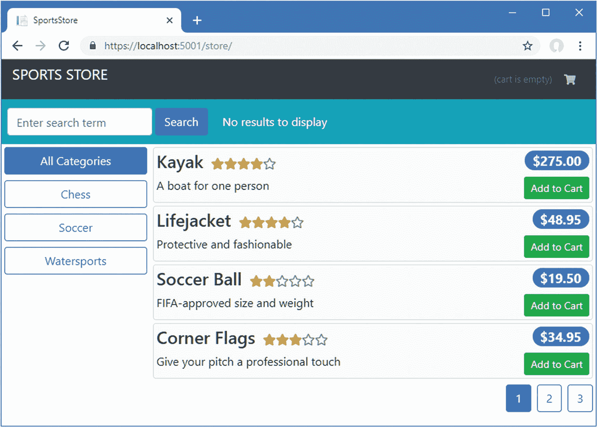
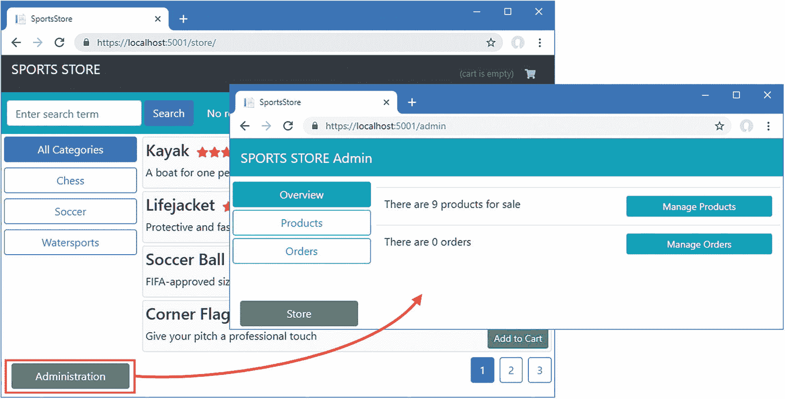
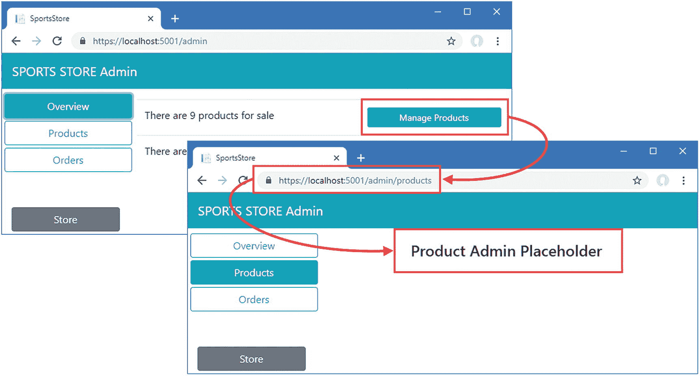
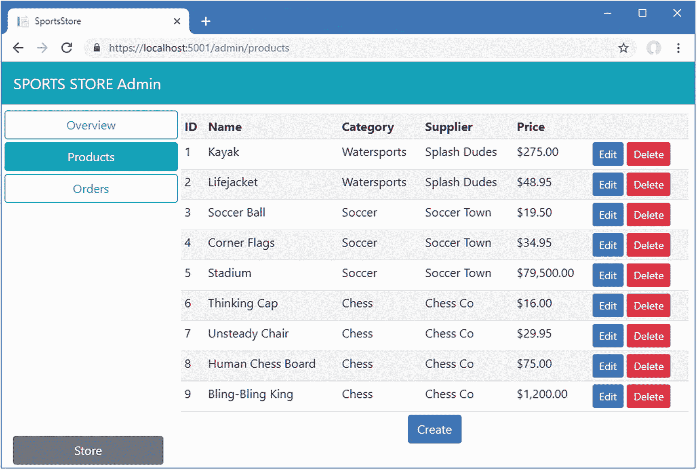
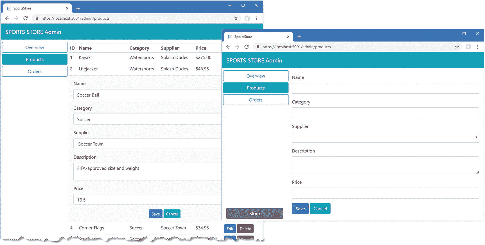
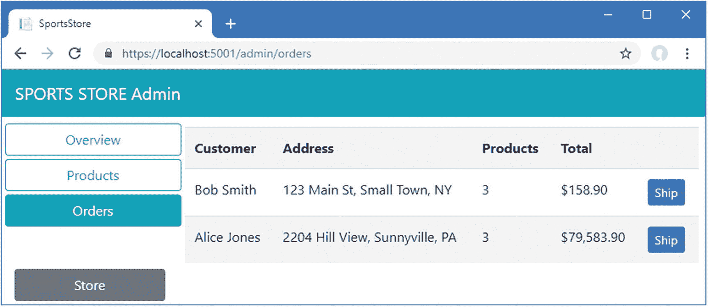
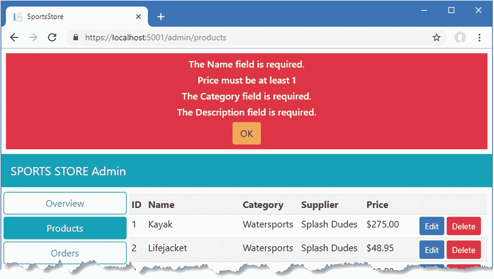

# 十一、创建管理功能

在这一章中，我在前面章节的 Angular 和 ASP.NET Core MVC 特性的基础上创建了应用所需的基本管理特性。为了保持示例应用的可管理性，我没有使用在前面章节中允许我演示 Angular 或 ASP.NET Core MVC 编程的不同方面的所有功能，但是我创建了足够多的新功能来说明一旦有了正确的基础，就可以快速轻松地组装新的功能。表 [11-1](#Tab1) 将本章放在上下文中。

表 11-1。

将管理功能放在上下文中

<colgroup><col class="tcol1 align-left"> <col class="tcol2 align-left"></colgroup> 
| 

问题

 | 

回答

 |
| --- | --- |
| 它们是什么？ | 管理功能允许管理应用及其数据。 |
| 它们为什么有用？ | 大多数应用都需要某种管理，要么管理公共可访问的数据，要么管理用户帐户。 |
| 它们是如何使用的？ | 管理功能可以使用与最终用户功能相同的技术来构建。 |
| 有什么陷阱或限制吗？ | 根据管理功能的复杂性，创建一个完全独立的管理应用可能是有意义的。在本章中，我将管理代码作为 Angular 应用的一部分，这样就可以使用`/admin` URL 来访问它。 |
| 还有其他选择吗？ | 并非所有应用都需要管理功能。 |

## 为本章做准备

本章使用了我在第 [3 章](03.html)中创建的 SportsStore 项目，并在之后的章节中进行了修改。要删除数据库以便应用使用新的种子数据，打开一个新的命令提示符，导航到`ServerApp`文件夹，并运行清单 [11-1](#PC1) 中所示的命令。

### 小费

你可以从源代码库 [`https://github.com/Apress/esntl-angular-for-asp.net-core-mvc-3`](https://github.com/Apress/esntl-angular-for-asp.net-core-mvc-3) 免费下载每章的完整项目。运行`ClientApp`文件夹中的`npm install`，安装 Angular 开发所需的包，然后按照指示启动开发工具。

```cs
dotnet ef database drop --force
dotnet ef database update
dotnet sql-cache create "Server=(localdb)\MSSQLLocalDB;Database=EssentialApp" "dbo" "SessionData"

Listing 11-1.Resetting the Database

```

使用命令提示符运行清单`ServerApp`文件夹中的 [11-2](#PC2) 所示的命令，启动 ASP.NET Core 运行时和 Angular 开发工具。

```cs
dotnet watch run

Listing 11-2.Starting the Development Tools

```

打开新的浏览器窗口并导航至`https://localhost:5001`；您将看到 Angular 应用，如图 [11-1](#Fig1) 所示。



图 11-1。

运行示例应用

## 添加管理功能

Angular 提供了许多方法来定义不会被所有用户使用的特征，尽管它们各有不同的优缺点。如果您想避免将管理代码和内容发送给普通用户，您可以创建一个特性模块，该模块仅在 Angular 应用导航到特定 URL 时加载。这是我在本书中采用的方法，尽管这意味着引入允许导航到管理功能的用户界面元素，但并非所有用户都会使用。

或者，您可以创建一个完全独立的应用，只包含管理功能。您仍然可以使用为主 SportsStore Angular 应用定义的组件和内容，但是您必须创建一个完全独立的基础架构，包括根模块、路由配置和根组件，这使得开发过程变得复杂，并且容易出错。

### 小费

适用于 SportsStore 示例应用的选择可能不适合您的项目。您应该对所有可用的选项进行一些考虑，在开发和配置复杂性与交付代码和内容所需的额外带宽之间进行权衡，大多数客户端不太可能使用这些带宽。

### 创建管理组件

创建`ClientApp/src/app/admin`文件夹，并添加一个名为`admin.component.ts`的类型脚本文件，代码如清单 [11-3](#PC3) 所示。这将是管理功能的顶级组件。

```cs
import { Component } from "@angular/core";
import { Repository } from "../models/repository";

@Component({
    templateUrl: "admin.component.html"
})
export class AdminComponent {

    constructor(private repo: Repository) {
        repo.filter.reset();
        repo.filter.related = true;
        this.repo.getProducts();
        this.repo.getSuppliers();
        this.repo.getOrders();
    }
}

Listing 11-3.The Contents of the admin.component.ts File in the ClientApp/src/app/admin Folder

```

构造函数清除用于查询产品数据的过滤器，并调用存储库的`getProducts`、`getSuppliers`和`getOrders`方法来请求应用数据，确保管理特性拥有它们需要的所有数据。

要创建模板，将一个名为`admin.component.html`的 HTML 文件添加到`admin`文件夹中，其内容如清单 [11-4](#PC4) 所示。

```cs
<div class="navbar bg-info mb-1">
    <a class="navbar-brand text-white">SPORTS STORE Admin</a>
</div>

<div class="col-3 fixed-bottom mb-1">
    <a class="btn btn-block btn-secondary" routerLink="/store">
        Store
    </a>
</div>

<div class="row no-gutters">
    <div class="col-3">
        <button class="btn btn-block btn-outline-info m-1" routerLink="/admin"
                routerLinkActive="active" [routerLinkActiveOptions]="{exact: true}">
            Overview
        </button>
        <button class="btn btn-block btn-outline-info m-1"
                routerLink="/admin/products" routerLinkActive="active">
            Products
        </button>
        <button class="btn btn-block btn-outline-info m-1"
                routerLink="/admin/orders" routerLinkActive="active">
            Orders
         </button>
    </div>
    <div class="col p-2">
        <router-outlet></router-outlet>
    </div>
</div>

Listing 11-4.The Contents of the admin.component.html File in the ClientApp/src/app/admin Folder

```

该模板提供了一个横幅，让用户清楚地知道这是应用的管理部分。有些按钮元素使用`routerLink`指令导航到将由路由系统管理的 URL，并与`routerLinkActive`指令结合使用，后者在元素导航到的路由被选择时将元素分配给一个类。在这个清单中，`button`元素被分配给了`active`类，它为一个激活的按钮应用了引导 CSS 样式。

该模板还包括一个`router-outlet`元素，它将显示基于当前 URL 的组件，这些组件是通过单击按钮元素选择的，并通过 URL 路由系统进行管理。Angular 应用可以有多个`router-outlet`元素，这允许复杂的导航方案。

#### 创建管理功能组件

定义了顶级管理组件后，就可以创建用于管理产品和订单的各个组件了。我将显示占位符内容，以便在本章后面实现管理功能之前，我可以专注于应用的结构和路由配置。

当导航到`/admin` URL 时，管理员将看到的组件将提供可用数据和操作的概述。对于这个组件，在`admin`文件夹中创建一个名为`overview.component.ts`的类型脚本文件，代码如清单 [11-5](#PC5) 所示。

```cs
import { Component } from "@angular/core";
import { Repository } from "../models/repository";
import { Product } from "../models/product.model";
import { Order } from "../models/order.model";

@Component({
    templateUrl: "overview.component.html"
})
export class OverviewComponent {

    constructor(private repo: Repository) { }

    get products(): Product[] {
        return this.repo.products;
    }

    get orders(): Order[] {
        return this.repo.orders;
    }
}

Listing 11-5.The Contents of the overview.component.ts File in the ClientApp/src/app/admin Folder

```

为了给概览组件提供模板，在`admin`文件夹中创建一个名为`overview.component.html`的 HTML 文件，并添加清单 [11-6](#PC6) 中所示的元素。

```cs
<table class="table m-1">
    <tr>
        <td>There are {{products?.length || 0}} products for sale</td>
        <td><button class="btn btn-sm btn-info btn-block"
                    routerLink="/admin/products">Manage Products</button></td>
    </tr>
    <tr>
        <td>There are {{orders?.length || 0}} orders</td>
        <td><button class="btn btn-sm btn-info btn-block"
                    routerLink="/admin/orders">Manage Orders</button></td>
    </tr>
</table>

Listing 11-6.The Contents of the overview.component.html File in the ClientApp/src/app/admin Folder

```

该模板包含一个显示产品和订单数量的表格，以及导航到管理每个产品和订单的 URL 的按钮。

对于将用于管理产品的组件，在`admin`文件夹中创建一个名为`productAdmin.component.ts`的类型脚本文件，代码如清单 [11-7](#PC7) 所示。

```cs
import { Component } from "@angular/core";

@Component({
    templateUrl: "productAdmin.component.html"
})
export class ProductAdminComponent {
}

Listing 11-7.The Contents of the productAdmin.component.ts File in the ClientApp/src/app/admin Folder

```

将名为`productAdmin.component.html`的 HTML 文件添加到`admin`文件夹中，标记如清单 [11-8](#PC8) 所示。这是占位符内容，一旦应用的管理部分的结构设置好了，我将用更有用的功能替换它。

```cs
<h4 class="text-center m-2">Product Admin Placeholder</h4>

Listing 11-8.The Contents of the productAdmin.component.html File in the ClientApp/src/app/admin Folder

```

为了创建用于管理订单的组件，在`admin`文件夹中添加一个名为`orderAdmin.component.ts`的类型脚本文件，代码如清单 [11-9](#PC9) 所示。

```cs
import { Component } from "@angular/core";

@Component({
    templateUrl: "orderAdmin.component.html"
})
export class OrderAdminComponent {
}

Listing 11-9.The Contents of the orderAdmin.component.ts File in the ClientApp/add/admin Folder

```

为了给组件提供一个模板，在`admin`文件夹中创建一个名为`orderAdmin.component.html`的 HTML 文件，并添加清单 [11-10](#PC10) 中所示的占位符元素，我将在本章后面替换这些元素。

```cs
<h4 class="text-center m-2">Order Admin Placeholder</h4>

Listing 11-10.The Contents of the orderAdmin.component.html File in the ClientApp/src/app/admin Folder

```

#### 创建特征模块和路由配置

要创建一个特性模块，将新组件合并到应用中，在`admin`文件夹中添加一个名为`admin.module.ts`的类型脚本文件，代码如清单 [11-11](#PC11) 所示。

```cs
import { NgModule } from "@angular/core";
import { RouterModule, Routes } from "@angular/router";
import { FormsModule } from "@angular/forms";
import { AdminComponent } from "./admin.component";
import { OverviewComponent } from "./overview.component";
import { ProductAdminComponent } from "./productAdmin.component";
import { OrderAdminComponent } from "./orderAdmin.component";

const routes: Routes = [
    {
    path: "", component: AdminComponent,
    children: [
        { path: "products", component: ProductAdminComponent },
        { path: "orders", component: OrderAdminComponent },
        { path: "overview", component: OverviewComponent },
        { path: "", component: OverviewComponent }]
    }
];

@NgModule({
    imports: [RouterModule,
        FormsModule, RouterModule.forChild(routes)],
    declarations: [AdminComponent, OverviewComponent,
        ProductAdminComponent, OrderAdminComponent]
})
export class AdminModule { }

Listing 11-11.The Contents of the admin.module.ts File in the ClientApp/src/app/admin Folder

```

特性模块遵循前面章节中建立的模式，并使用`@NgModule`装饰器在`declarations`属性中注册`AdminComponent`类，使其可用于应用的其余部分。`imports`属性需要`RouterModule`来支持组件间的 URL 导航。

与早期模块的主要区别在于，该模块还定义了自己的路由。这些路由不能在应用的主路由模块中定义，因为这需要依赖组件类，这将导致 webpack 将代码包含在主应用包中。

添加到主路由集中的唯一路由是针对`/admin` URL 的，如清单 [11-12](#PC12) 所示，它动态加载`AdminModule`。

```cs
import { NgModule } from '@angular/core';
import { Routes, RouterModule } from '@angular/router';
import { ProductSelectionComponent } from "./store/productSelection.component";
import { CartDetailComponent } from "./store/cartDetail.component";
import { CheckoutDetailsComponent }
    from "./store/checkout/checkoutDetails.component";
import { CheckoutPaymentComponent }
    from "./store/checkout/checkoutPayment.component";
import { CheckoutSummaryComponent }
    from "./store/checkout/checkoutSummary.component";
import { OrderConfirmationComponent }
    from "./store/checkout/orderConfirmation.component";

const routes: Routes = [
    {
        path: "admin",
        loadChildren: () =>
            import("./admin/admin.module").then(module => module.AdminModule),
    },
    { path: "checkout/step1", component: CheckoutDetailsComponent },
    { path: "checkout/step2", component: CheckoutPaymentComponent },
    { path: "checkout/step3", component: CheckoutSummaryComponent },
    { path: "checkout/confirmation", component: OrderConfirmationComponent },
    { path: "checkout", redirectTo: "/checkout/step1", pathMatch: "full" },
    { path: "cart", component: CartDetailComponent },
    { path: "store/:category/:page", component: ProductSelectionComponent },
    { path: "store/:categoryOrPage", component: ProductSelectionComponent },
    { path: "store", redirectTo: "store/", pathMatch: "full" },
    { path: "", redirectTo: "store/", pathMatch: "full" }
];

@NgModule({
  imports: [RouterModule.forRoot(routes)],
  exports: [RouterModule]
})
export class AppRoutingModule { }

Listing 11-12.Loading a Module in the app-routing.module.ts File in the ClientApp/src/app Folder

```

新的路由使用一个动态的`import`语句，只有当应用第一次导航到`/admin` URL 时，该语句才会为管理模块加载包文件。为了允许导航，将清单 [11-13](#PC13) 中所示元素添加到应用商店部分的`ProductSelection`组件的模板中。

```cs
<div class="container-fluid">
    <div class="row">
        <div class="col bg-dark text-white">
            <div class="navbar-brand">SPORTS STORE</div>
            <div class="float-right navbar-text">
                <store-cartsummary></store-cartsummary>
            </div>
        </div>
    </div>
</div>

<div class="col-3 fixed-bottom mb-1">

    <a class="btn btn-block btn-secondary" routerLink="/admin">
        Administration
    </a>

</div>

<div class="row no-gutters">
    <div class="col"><blazor></blazor></div>
</div>
<div class="row no-gutters">
    <div class="col-3">
        <store-categoryfilter></store-categoryfilter>
    </div>
    <div class="col">
        <store-product-list></store-product-list>
        <store-pagination></store-pagination>
    </div>
</div>

Listing 11-13.Elements in the productSelection.component.html File in the ClientApp/src/app/store Folder

```

最后一个变化是扩展 ASP.NET Core MVC 应用将指向`Home`控制器的路由集，以适应新的 URL，如清单 [11-14](#PC14) 所示。

```cs
...
app.UseEndpoints(endpoints => {
    endpoints.MapControllerRoute(
        name: "default",
        pattern: "{controller=Home}/{action=Index}/{id?}");

    endpoints.MapControllerRoute(
        name: "angular_fallback",
        pattern: "{target:regex(admin|store|cart|checkout):nonfile}/{*catchall}",
        defaults: new  { controller = "Home", action = "Index"});

    endpoints.MapControllerRoute(
        name: "blazor_integration",
        pattern: "/blazor/{*path:nonfile}",
        defaults: new  { controller = "Home", action = "Blazor"});

    endpoints.MapRazorPages();
});
...

Listing 11-14.Configuring Routes in the Startup.cs File in the ServerApp Folder

```

需要`nonfile`过滤器，因为当新的 Angular 模块被动态加载时，将被请求的文件的名称是`admin-admin-module.js`，必须注意不要将对该文件的请求指向 MVC 控制器。

保存更改，等待运行时重启，然后导航到`https://localhost:5001`。单击管理按钮；将加载新模块，并显示如图 [11-2](#Fig2) 所示的内容。



图 11-2。

加载管理模块

点击管理界面提供的按钮将导航到清单 [11-12](#PC12) 中定义的路由所处理的 URL。例如，点击管理产品按钮将导航到`/admin/products` URL，如图 [11-3](#Fig3) 所示。



图 11-3。

在管理界面中导航

## 管理产品

现在，基本结构已经就绪，我可以开始定义管理员需要的功能，从管理可供销售的产品的能力开始。正如您将在接下来的章节中看到的，大部分繁重的工作已经在前面的章节中完成了，并且管理特性可以利用数据模型和存储库来协调对 ASP.NET Core MVC web 服务的访问。

### 创建编辑器组件

首先，在`admin`文件夹中创建一个名为`productEditor.component.ts`的新类型脚本文件，并添加清单 [11-15](#PC15) 中所示的代码。该组件将用于向用户显示一组字段，以便他们可以创建或编辑产品。

```cs
import { Component } from "@angular/core";
import { Repository } from "../models/repository";
import { Product } from "../models/product.model";
import { Supplier } from "../models/supplier.model";

@Component({
    selector: "admin-product-editor",
    templateUrl: "productEditor.component.html"
})
export class ProductEditorComponent {

    constructor(private repo: Repository) { }

    get product(): Product {
        return this.repo.product;
    }

    get suppliers(): Supplier[] {
        return this.repo.suppliers;
    }

    compareSuppliers(s1: Supplier, s2: Supplier) {
        return s1 && s2 && s1.name == s2.name;
    }
}

Listing 11-15.The Contents of the productEditor.component.ts File in the ClientApp/src/app/admin Folder

```

该组件通过其`product`属性提供对当前编辑的`Product`对象的访问。对`Product`对象的选择和对其执行的操作留给了其他组件。该组件的工作仅仅是提供对数据的访问，以便可以呈现相同的 HTML 表单字段集，而不需要重复来支持编辑和创建数据。`suppliers`属性和`compareSuppliers`方法支持编辑产品和其供应商之间的关系，我将简单描述一下。

为了给组件提供模板，在`admin`文件夹中添加一个名为`productEditor.component.html`的 HTML 文件，其元素如清单 [11-16](#PC16) 所示。

```cs
<div class="form-group">
    <label>Name</label>
    <input class="form-control" [(ngModel)]="product.name" />
</div>
<div class="form-group">
    <label>Category</label>
    <input class="form-control" [(ngModel)]="product.category" />
</div>
<div class="form-group">
    <label>Supplier</label>
    <select class="form-control" [(ngModel)]="product.supplier"
            [compareWith]="compareSuppliers">
        <option *ngFor="let s of suppliers" [ngValue]="s">{{s.name}}</option>
    </select>
</div>
<div class="form-group">
    <label>Description</label>
    <textarea class="form-control" [(ngModel)]="product.description"></textarea>
</div>
<div class="form-group">
    <label>Price</label>
    <input type="number" class="form-control" [(ngModel)]="product.price" />
</div>

Listing 11-16.The Contents of the productEditor.component.html File in the ClientApp/src/app/admin Folder

```

该模板使用双向数据绑定和`ngModel`指令来允许用户编辑`Product`对象的属性。大多数属性都是简单的`input`或`textarea`元素，但是需要一些额外的工作来让`select`元素正常工作。

`select`元素上的`ngModel`指令与`option`元素上的`ngValue`指令一起工作，以确保默认情况下选择了适当的选项，这是通过比较模型值和选项值来完成的。如果两个值相同，则选择`option`向用户显示当前值。

在处理从 ASP.NET Core MVC web 服务获得的复杂数据时，一个常见的问题是被比较的对象是使用单独的 HTTP 请求获得的。在这种情况下，`Product.supplier`属性返回的`Supplier`对象是通过解析发送到`/api/products` URL 的 GET 请求的响应创建的。然而，用于创建`option`元素的`Supplier`对象是通过解析发送到`/api/suppliers` URL 的 GET 请求的响应创建的。这意味着`ngModel`指令必须比较来自两个不同来源的对象，这阻止了`select`元素正确显示当前值。为了解决这个问题，`compareWith`指令用于为 Angular 提供一个由组件定义的方法，该方法可用于确定两个对象是否相等。在这种情况下，`compareSuppliers`方法是特定的，它使用`name`属性的值来比较`Supplier`对象。

进行清单 [11-17](#PC17) 中所示的更改，在管理特性模块中注册新的组件，以及`CommonModule`，它包含下一节中使用的指令。

```cs
import { NgModule } from "@angular/core";
import { RouterModule, Routes } from "@angular/router";
import { FormsModule } from "@angular/forms";
import { AdminComponent } from "./admin.component";
import { OverviewComponent } from "./overview.component";
import { ProductAdminComponent } from "./productAdmin.component";
import { OrderAdminComponent } from "./orderAdmin.component";

import { ProductEditorComponent } from "./productEditor.component";

import { CommonModule } from '@angular/common';

const routes: Routes = [
    {
    path: "", component: AdminComponent,
    children: [
        { path: "products", component: ProductAdminComponent },
        { path: "orders", component: OrderAdminComponent },
        { path: "overview", component: OverviewComponent },
        { path: "", component: OverviewComponent }]
    }
];

@NgModule({
    imports: [RouterModule,
        FormsModule, RouterModule.forChild(routes), CommonModule],
    declarations: [AdminComponent, OverviewComponent,
        ProductAdminComponent, OrderAdminComponent, ProductEditorComponent]
})
export class AdminModule { }

Listing 11-17.Registering a Component in the admin.module.ts File in the ClientApp/src/app/admin Folder

```

### 创建产品表

下一步是完成主要的产品管理组件，以便为用户提供产品列表，并支持创建、编辑和删除产品。将清单 [11-18](#PC18) 中所示的代码添加到`ProductAdminComponent`类中。

```cs
import { Component } from "@angular/core";

import { Repository } from "../models/repository";

import { Product } from "../models/product.model";

import { Supplier } from "../models/supplier.model";

@Component({
    templateUrl: "productAdmin.component.html"
})
export class ProductAdminComponent {

    constructor(private repo: Repository) {}

    tableMode: boolean = true;

    get product(): Product {
        return this.repo.product;
    }

    selectProduct(id: number) {
        this.repo.getProduct(id);
    }

    saveProduct() {
        if (this.repo.product.productId == null) {
            this.repo.createProduct(this.repo.product);
        } else {
            this.repo.replaceProduct(this.repo.product);
        }
        this.clearProduct()
        this.tableMode = true;
    }

    deleteProduct(id: number) {
        this.repo.deleteProduct(id);
    }

    clearProduct() {
        this.repo.product = new Product();
        this.tableMode = true;
    }

    get products(): Product[] {
        return this.repo.products;
    }

}

Listing 11-18.Adding Features to the productAdmin.component.ts File in the ClientApp/src/app/admin Folder

```

组件定义的属性和方法提供对产品数据的访问，以允许选择产品进行编辑，并将更改发送到 web 服务。还有一个`tableMode`属性，用于在用户创建新产品时显示编辑器字段。为了显示内容，用清单 [11-19](#PC19) 中显示的元素替换组件模板中的元素。

```cs
<table *ngIf="tableMode; else create" class="table table-sm table-striped">
    <tbody>
        <tr>
            <th>ID</th><th>Name</th><th>Category</th><th>Supplier</th>
            <th>Price</th><th></th>
        </tr>
        <tr *ngFor="let p of products">
            <ng-template [ngIf]="product?.productId != p.productId"
                    [ngIfElse]="edit">
                <td>{{p.productId}}</td>
                <td>{{p.name}}</td>
                <td>{{p.category}}</td>
                <td>{{p.supplier?.name || '(None)'}}</td>
                <td>{{p.price | currency:"USD":"symbol"}}</td>
                <td>
                    <button class="btn btn-sm btn-primary"
                            (click)="selectProduct(p.productId)">Edit</button>
                    <button class="btn btn-sm btn-danger ml-1"
                            (click)="deleteProduct(p.productId)">Delete</button>
                </td>
            </ng-template>
        </tr>
    </tbody>
    <tfoot>
        <tr>
            <td colspan="6" class="text-center">
                <button class="btn btn-primary"
                    (click)="clearProduct(); tableMode = false">Create</button>
            </td>
        </tr>
    </tfoot>
</table>

<ng-template #edit>
    <td colspan="6" class="bg-light border p-3">
        <admin-product-editor></admin-product-editor>
        <div class="text-center">
            <button class="btn btn-sm btn-primary" (click)="saveProduct()">
                Save
            </button>
            <button class="btn btn-sm btn-info ml-1" (click)="clearProduct()">
                Cancel
            </button>
        </div>
    </td>
</ng-template>

<ng-template #create>
    <div class="m-2">
        <admin-product-editor></admin-product-editor>
        <button class="btn btn-primary" (click)="saveProduct()">
            Save
        </button>
        <button class="btn btn-info ml-1" (click)="clearProduct()">
            Cancel
        </button>
    </div>
</ng-template>

Listing 11-19.Displaying Data in the productAdmin.component.html File in the ClientApp/src/app/admin Folder

```

模板的核心是一个表格，其中包含每个产品的一行，您可以通过重新加载应用并导航到`https://localhost:5001/admin/products`来查看该表格。每行包含编辑和删除按钮，如图 [11-4](#Fig4) 所示。



图 11-4。

产品管理表

如果您点击其中一个编辑按钮，表格行将被一个内嵌编辑器替换，该编辑器允许属性值被更改，如图 [11-5](#Fig5) 所示，该图还显示了当点击创建按钮时如何使用相同的编辑器。



图 11-5。

使用产品编辑器

在大多数情况下，结构指令的简洁语法更方便，因为它允许指令直接应用于元素。在清单 [11-19](#PC19) 中，`ngIf`指令的简明语法用于显示产品表或创建新产品的编辑器，如下所示:

```cs
...
<table *ngIf="tableMode; else create" class="table table-sm table-striped">
...

```

当没有合适的元素来应用简洁的语法时，它就不能被使用。该模板更改表格行的内容，以便当用户编辑产品时，在表格行中使用不同组的`td`元素。`ngIf`指令不能应用于`tr`元素，因为每一行的内容对于每一种产品都是不同的，并且在`tr`和`td`元素之间没有合适的应该显示的中间元素。在这种情况下，可以使用完整的语法，如下所示:

```cs
...

<ng-template [ngIf]="product?.productId != p.productId" [ngIfElse]="edit">

    <td>{{p.productId}}</td>
    <td>{{p.name}}</td>
    <td>{{p.category}}</td>
    <td>{{p.supplier?.name || '(None)'}}</td>
    <td>{{p.price | currency:USD:true}}</td>
    <td>
        <button class="btn btn-sm btn-primary"
            (click)="selectProduct(p.productId)">Edit</button>
        <button class="btn btn-sm btn-danger"
            (click)="deleteProduct(p.productId)">Delete</button>
    </td>

</ng-template>

...

```

元素允许在不改变表结构的情况下应用指令。使用完整语法时，指令的名称前面没有星号，并且需要一组不同的数据绑定来控制指令的工作方式。在这种情况下，`ngIf`绑定指定了指令应该评估的条件，而`ngIfElse`绑定指定了当表达式为`false`时应该显示的模板。

## 管理订单

处理订单的过程遵循与产品相同的基本模式，并依赖于前面章节中创建的数据模型和存储库。用清单 [11-20](#PC22) 中所示的代码替换`OrderAdminComponent`类。

```cs
import { Component } from "@angular/core";

import { Repository } from "../models/repository";

import { Order } from "../models/order.model";

@Component({
    templateUrl: "orderAdmin.component.html"
})
export class OrderAdminComponent {

    constructor(private repo: Repository) {}

    get orders(): Order[] {
        return this.repo.orders;
    }

    markShipped(order: Order) {
        this.repo.shipOrder(order);
    }
}

Listing 11-20.Adding Features in the orderAdmin.component.ts File in the ClientApp/src/app/admin Folder

```

该组件通过依赖注入接收一个`Repository`对象，并使用它为其模板提供订单数据和一个将订单标记为已发货的方法。要使用这些成员，用清单 [11-21](#PC23) 中显示的内容替换组件模板的内容。

```cs
<table *ngIf="orders?.length > 0; else nodata" class="table table-striped">
    <tbody>
        <tr>
            <th>Customer</th><th>Address</th><th>Products</th>
            <th>Total</th><th></th>
        </tr>
        <tr *ngFor="let o of orders">
            <td>{{o.name}}</td>
            <td>{{o.address}}</td>
            <td>{{o.products.length}}</td>
            <td>{{o.payment.total | currency:"USD":"symbol"}}</td>
            <td *ngIf="!o.shipped; else shipped">
                <button class="btn btn-sm btn-primary"
                        (click)="markShipped(o)">
                    Ship
                </button>
            </td>
        </tr>
    </tbody>
</table>

<ng-template #shipped>
    <td>Shipped</td>
</ng-template>

<ng-template #nodata>
    <h3 class="text-center">There are no orders</h3>
</ng-template>

Listing 11-21.Managing Orders in the orderAdmin.component.html File in the ClientApp/src/app/admin Folder

```

此模板中没有使用新的 Angular 特征。有一个表格只在有可用订单时显示，使用`ngIf`指令管理。在表中，使用`ngFor`指令为每个订单生成行。每行包含一个使用 click 事件绑定来调用组件的`markShipped`方法的`button`元素，这导致存储库向 ASP.NET Core MVC 发送一个 HTTP POST 请求来更新订单，然后发送一个 HTTP GET 请求来刷新数据。

要查看结果，使用 SportsStore 应用的 store 部分创建一个或多个订单，然后导航到`https://localhost:5001/admin/orders`来管理它们，如图 [11-6](#Fig6) 所示。



图 11-6。

管理订单

## 处理请求错误

并非所有的 HTTP 请求都会产生成功的结果，尤其是在处理用户输入的数据时，这可能无法通过 ASP.NET Core MVC 模型验证过程。

理想情况下，当应用收到错误响应时，它会以这样一种方式处理它，即用户能够理解哪里出错了，并且能够以最少的努力和损失来纠正问题。但是，如果不增加应用的复杂性，这在实际项目中很难实现，这本身就存在出错的风险。

对于大多数项目来说，最好的折衷办法是尽量避免错误，但在出现错误时简单地向用户显示，然后尝试将应用恢复到已知的良好状态。避免错误的最有效方法是使用 Angular 数据验证功能，该功能在第 [9](09.html) 章中使用，以确保用户提供结账过程所需的所有数据值。Angular 验证特性可能很难使用，但是它们是有效的，并且可以被定制来处理定制的验证需求。

Angular 还可以很容易地确定错误发生的时间，并显示给用户，这是本章这一部分的重点。在接下来的小节中，我将创建一个显示错误的组件，然后将它集成到应用中。

### 创建错误处理和分发服务

Angular 使得通过定义一个新的服务来改变错误的处理方式变得很容易。在`app`文件夹中添加一个名为`errorHandler.service.ts`的类型脚本文件，并使用它来定义清单 [11-22](#PC24) 中所示的类。

```cs
import { Injectable } from "@angular/core";
import { HttpEvent, HttpInterceptor, HttpHandler,
         HttpRequest, HttpErrorResponse } from "@angular/common/http";
import { Observable, throwError, Subject } from "rxjs";
import { catchError } from "rxjs/operators"

@Injectable()
export class ErrorHandlerService implements HttpInterceptor {
    private errSubject = new Subject<string[]>();

    intercept(request: HttpRequest<any>, next: HttpHandler):
            Observable<HttpEvent<any>> {
        return next.handle(request).pipe(
            catchError((resp: HttpErrorResponse) => {
                if (resp.error.errors) {
                    this.errSubject
                        .next([...Object.values(resp.error.errors) as string[]]);
                } else if (resp.error.title) {
                    this.errSubject.next([resp.error.title]);
                } else {
                    this.errSubject.next(["An HTTP error occurred"]);
                }
                return throwError(resp);
            })
        );
    }

    get errors(): Observable<string[]> {
        return this.errSubject;
    }
}

Listing 11-22.The Contents of the errorHandler.service.ts File in the ClientApp/src/app Folder

```

Angular 提供的用于发出 HTTP 请求的`HttpClient`类支持拦截器，拦截器是接收请求和响应的类，可以在它们被处理之前改变它们。拦截器也可以用来接收 HTTP 错误，清单 [11-22](#PC24) 中的代码就是这么做的。`ErrorHandlerService`提供了一个`Observable`,当错误消息出现时，它会产生错误消息，并特别支持处理来自 ASP.NET Core MVC 控制器的验证消息，这样它们就可以很容易地显示给用户。

在清单 [11-23](#PC25) 中，我在主应用模块中将服务注册为拦截器，这意味着它将接收应用中发出的所有 HTTP 请求。

```cs
import { BrowserModule } from '@angular/platform-browser';
import { NgModule, ErrorHandler } from '@angular/core';
import { AppRoutingModule } from './app-routing.module';
import { AppComponent } from './app.component';
import { ModelModule } from "./models/model.module";
import { FormsModule } from '@angular/forms';
import { StoreModule } from "./store/store.module";
import { ExternalService } from "./external.service";

import { HTTP_INTERCEPTORS } from "@angular/common/http";

import { ErrorHandlerService } from "./errorHandler.service";

@NgModule({
    declarations: [AppComponent],
    imports: [BrowserModule, AppRoutingModule, ModelModule, FormsModule,
        StoreModule],
    providers: [ExternalService, ErrorHandlerService,
        { provide: HTTP_INTERCEPTORS,
          useExisting: ErrorHandlerService, multi: true}],
    bootstrap: [AppComponent],

})
export class AppModule {

    constructor(external: ExternalService) {}
}

Listing 11-23.Registering an Interceptor in the app.module.ts File in the ClientApp/src/app Folder

```

`ErrorHandlerService`需要两次注册。第一个允许通过常规的依赖注入来消费服务，第二个使用`HTTP_INTERCEPTORS`令牌，它告诉 Angular 服务应该拦截 HTTP 请求和响应。

### 显示错误

为了提供对应用中出现的错误的访问，将清单 [11-24](#PC26) 中所示的语句添加到根组件中。(这个类包含了前一章的方法和属性，为了简洁起见，我已经把它们删除了。)

```cs
import { Component } from '@angular/core';

import { ErrorHandlerService } from "./errorHandler.service";

@Component({
    selector: 'app-root',
    templateUrl: './app.component.html',
    styleUrls: ['./app.component.css']
})
export class AppComponent {
    private lastError: string[];

    constructor(errorService: ErrorHandlerService) {
        errorService.errors.subscribe(error => {
            this.lastError = error;
        });
    }

    get error(): string[] {
        return this.lastError;
    }

    clearError() {
        this.lastError = null;
    }
}

Listing 11-24.Accessing Errors in the app.component.ts File in the ClientApp/src/app Folder

```

为了向用户显示错误，将清单 [11-25](#PC27) 中所示的元素添加到根组件的模板中。

```cs
<div class="bg-danger text-white text-center p-2 m-2" *ngIf="error != null">

    <h6 *ngFor="let e of error">{{e}}</h6>
    <button class="btn btn-warning" (click)="clearError()">OK</button>

</div>

<router-outlet></router-outlet>

Listing 11-25.Displaying Errors in the app.component.html File in the ClientApp/src/app Folder

```

有一个`div`元素，只有出现错误时才显示；它包含为描述错误所需的每个字符串生成的`h6`元素。在用户单击`button`元素之前，会一直显示一个错误，该元素有一个调用错误处理程序的`clearError`方法的`click`事件绑定。

要查看结果，请在浏览器中重新加载应用，导航到`https://localhost:5001/admin` URL，然后单击 Products 按钮显示产品列表。单击“创建”按钮，然后单击“保存”按钮，无需在任何字段中输入值。发送到 web 服务的 HTTP 请求在 MVC 模型绑定过程中失败，并产生如图 [11-7](#Fig7) 所示的错误消息。



图 11-7。

显示验证错误

请记住，HTTP 请求的异步特性意味着在 Angular 应用导航到另一个 URL 之后，才会收到来自 ASP.NET Core MVC web 服务的响应。正是由于这个原因，应该使用 Angular 形式验证来避免产生这种错误，并且像这样处理错误应该是最后的手段。

## 摘要

在本章中，我在前面章节中创建的特性的基础上，为应用创建了管理特性。我还添加了对向用户显示错误的支持，这为应用代码中无法处理的问题以及使用表单验证等功能无法避免的问题提供了最后的解决方法。在下一章中，我将解释如何保护应用，以便管理功能只能由授权用户使用。