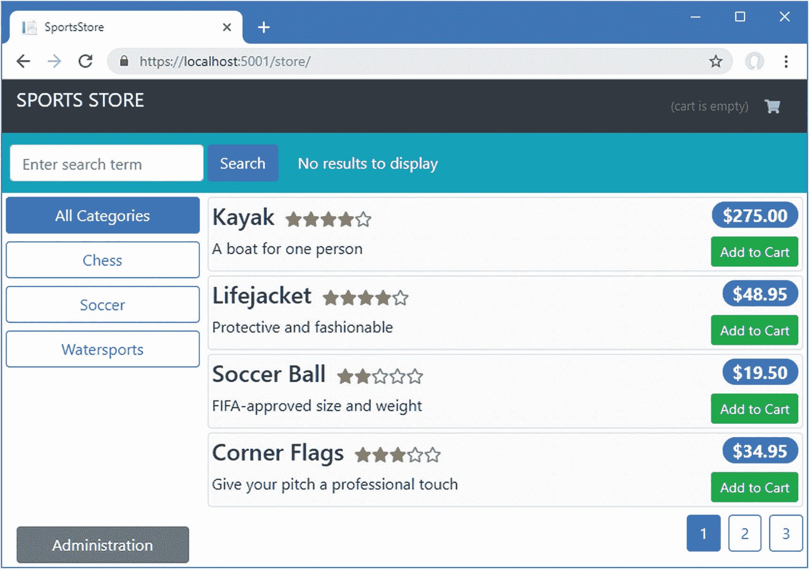
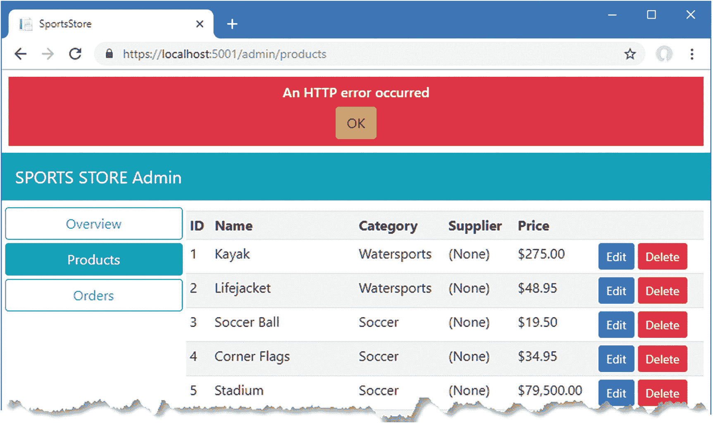
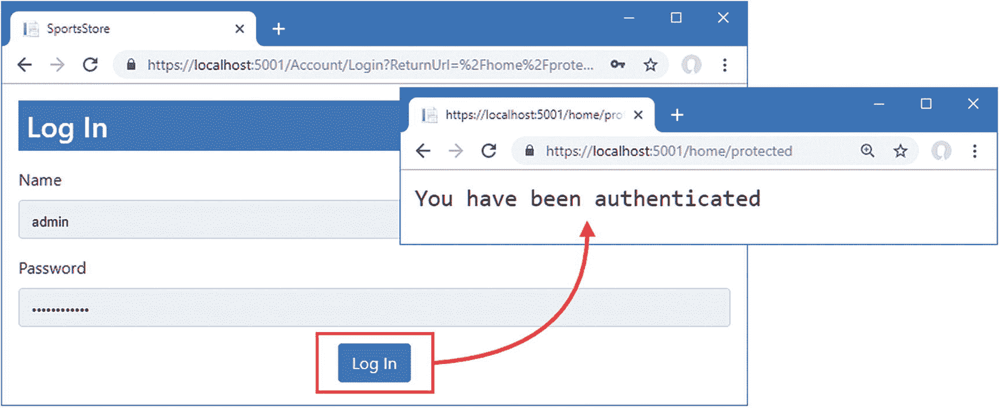
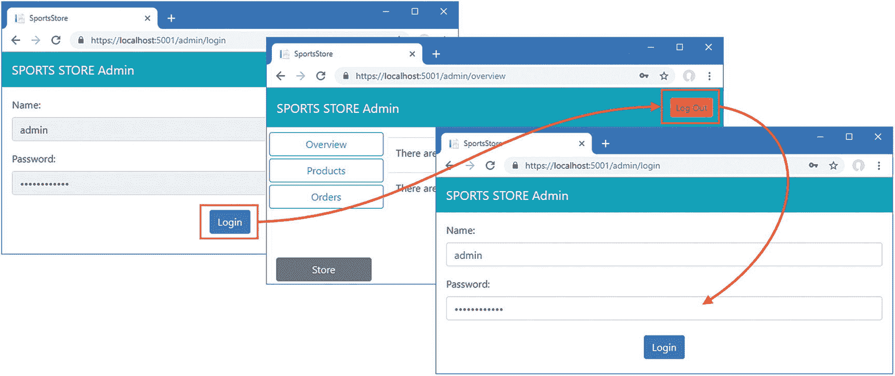

# 十二、保护应用

在本章中，我通过设置认证和授权来完成 SportsStore 应用，以便只有经过批准的用户才能执行管理任务，如修改或删除数据。我解释了如何限制对 web 服务的访问，如何使用 ASP.NET Core Identity 来提供安全服务，以及如何使用 Angular 来认证用户。表 [12-1](#Tab1) 将应用安全置于上下文中。

表 12-1。

将应用安全性置于环境中

<colgroup><col class="tcol1 align-left"> <col class="tcol2 align-left"></colgroup> 
| 

问题

 | 

回答

 |
| --- | --- |
| 这是什么？ | 应用安全性防止未经授权的用户使用敏感的 web 服务操作。 |
| 为什么有用？ | 未经授权，任何用户都可以管理该应用。 |
| 如何使用？ | ASP.NET Core Identity 用于管理用户和角色，并可以与 ASP.NET Core MVC 的内置功能相结合，以验证或授权用户。 |
| 有什么陷阱或限制吗？ | 您必须注意保护管理所需的 API 部分，同时确保可公开访问的特性所需的部分对匿名访问是开放的。 |
| 还有其他选择吗？ | 并非所有应用都需要授权和认证，尤其是在没有管理功能的情况下。 |

## 为本章做准备

本章使用了我在第 [3 章](03.html)中创建的 SportsStore 项目，并在之后的章节中进行了修改。要删除数据库以便应用使用新的种子数据，打开一个新的命令提示符，导航到`ServerApp`文件夹，并运行清单 [12-1](#PC1) 中所示的命令。

### 小费

你可以从源代码库 [`https://github.com/Apress/esntl-angular-for-asp.net-core-mvc-3`](https://github.com/Apress/esntl-angular-for-asp.net-core-mvc-3) 免费下载每章的完整项目。运行`ClientApp`文件夹中的`npm install`，安装 Angular 开发所需的包，然后按照指示启动开发工具。

```cs
dotnet ef database drop --force
dotnet ef database update
dotnet sql-cache create "Server=(localdb)\MSSQLLocalDB;Database=EssentialApp" "dbo" "SessionData"

Listing 12-1.Resetting the Database

```

使用命令提示符运行清单`ServerApp`文件夹中的 [12-2](#PC2) 所示的命令，启动 ASP.NET Core 运行时和 Angular 开发工具。

```cs
dotnet watch run

Listing 12-2.Starting the Development Tools

```

打开新的浏览器窗口并导航至`https://localhost:5001`；您将看到 Angular 应用，如图 [12-1](#Fig1) 所示。



图 12-1。

运行示例应用

## 限制对操作方法的访问

限制对敏感 web 服务特性的访问需要应用`Authorize`属性，该属性为 ASP.NET Core MVC 控制器或动作方法指定授权策略。对于 SportsStore 应用，我将把对管理特性的访问限制在已经被分配了名为`Administrator`的角色的经过认证的用户。

### 限制接触供应商

从简单的事情开始，将`Authorize`属性应用到`SupplierValuesController`类，如清单 [12-3](#PC3) 所示，以限制对用于处理供应商数据的所有动作方法的访问。

```cs
using Microsoft.AspNetCore.Mvc;
using ServerApp.Models;
using ServerApp.Models.BindingTargets;
using System.Collections.Generic;

using Microsoft.AspNetCore.Authorization;

namespace ServerApp.Controllers {

    [Route("api/suppliers")]
    [Authorize(Roles = "Administrator")]
    public class SupplierValuesController : Controller {
        private DataContext context;

        // ...methods omitted for brevity...
    }
}

Listing 12-3.Restricting Access in the SupplierValuesController.cs File in the ServerApp/Controllers Folder

```

将`Authorize`属性应用到类会影响控制器定义的所有动作方法。清单 [12-3](#PC3) 中属性的作用是限制对`Supplier`对象的所有操作，除了被分配了`Administrator`角色的认证用户。

### 限制访问订单

对由`OrderValuesController`类定义的动作方法的访问稍微复杂一些:所有用户都应该能够创建订单，但是检索和修改订单的能力应该受到限制。添加清单 [12-4](#PC4) 中所示的属性，在这个控制器上设置授权策略。

```cs
using Microsoft.AspNetCore.Mvc;
using Microsoft.EntityFrameworkCore;
using ServerApp.Models;
using System.Collections.Generic;
using System.Linq;

using Microsoft.AspNetCore.Authorization;

namespace ServerApp.Controllers {

    [Route("/api/orders")]
    [Authorize(Roles = "Administrator")]
    public class OrderValuesController : Controller {
        private DataContext context;

        // ...other methods omitted for brevity...

        [HttpPost]
        [AllowAnonymous]
        public IActionResult CreateOrder([FromBody] Order order) {
            if (ModelState.IsValid) {

                order.OrderId = 0;
                order.Shipped = false;
                order.Payment.Total = GetPrice(order.Products);

                ProcessPayment(order.Payment);
                if (order.Payment.AuthCode != null) {
                    context.Add(order);
                    context.SaveChanges();
                    return Ok(new {
                        orderId = order.OrderId,
                        authCode = order.Payment.AuthCode,
                        amount = order.Payment.Total
                    });
                } else {
                    return BadRequest("Payment rejected");
                }
            }
            return BadRequest(ModelState);
        }
    }
}

Listing 12-4.Restricting Access in the OrderValuesController.cs File in the ServerApp/Controllers Folder

```

应用`Authorize`属性限制了对所有动作方法的访问，但是这个策略被`AllowAnonymous`属性覆盖，这确保了任何用户都可以将`CreateOrder`动作作为目标。

### 限制对产品的访问

最后一个需要保护的控制器是`ProductValuesController`类，它应该允许所有用户查看数据，但只允许管理员进行修改。该控制器需要做一些额外的工作，以确保对相关数据的访问与其他控制器提供的策略一致，从而避免提供对在其他地方受到限制的数据的后门访问。为了实现授权策略，进行清单 [12-5](#PC5) 中所示的更改。

```cs
using Microsoft.AspNetCore.Mvc;
using ServerApp.Models;
using Microsoft.EntityFrameworkCore;
using System.Linq;
using System.Collections.Generic;
using ServerApp.Models.BindingTargets;
using Microsoft.AspNetCore.JsonPatch;
using System.Text.Json;
using System.Reflection;
using System.ComponentModel;

using Microsoft.AspNetCore.Authorization;

namespace ServerApp.Controllers {

    [Route("api/products")]
    [ApiController]
    [Authorize(Roles = "Administrator")]
    public class ProductValuesController : Controller {
        private DataContext context;

        public ProductValuesController(DataContext ctx) {
            context = ctx;
        }

        [HttpGet("{id}")]
        [AllowAnonymous]
        public Product GetProduct(long id) {
            IQueryable<Product> query = context.Products
                .Include(p => p.Ratings);

            if (HttpContext.User.IsInRole("Administrator")) {
                query = query.Include(p => p.Supplier)
                    .ThenInclude(s => s.Products);
            }

            Product result = query.First(p => p.ProductId == id);

            if (result != null) {
                if (result.Supplier != null) {
                    result.Supplier.Products = result.Supplier.Products.Select(p =>
                        new Product {
                            ProductId = p.ProductId,
                            Name = p.Name,
                            Category = p.Category,
                            Description = p.Description,
                            Price = p.Price,
                        });
                }

                if (result.Ratings != null) {
                    foreach (Rating r in result.Ratings) {
                        r.Product = null;
                    }
                }
            }
            return result;
        }

        [HttpGet]
        [AllowAnonymous]
        public IActionResult GetProducts(string category, string search,
                bool related = false, bool metadata = false) {
            IQueryable<Product> query = context.Products;

            if (!string.IsNullOrWhiteSpace(category)) {
                string catLower = category.ToLower();
                query = query.Where(p => p.Category.ToLower().Contains(catLower));
            }
            if (!string.IsNullOrWhiteSpace(search)) {
                string searchLower = search.ToLower();
                query = query.Where(p => p.Name.ToLower().Contains(searchLower)
                    || p.Description.ToLower().Contains(searchLower));
            }

            if (related && HttpContext.User.IsInRole("Administrator")) {
                query = query.Include(p => p.Supplier).Include(p => p.Ratings);
                List<Product> data = query.ToList();
                data.ForEach(p => {
                    if (p.Supplier != null) {
                        p.Supplier.Products = null;
                    }
                    if (p.Ratings != null) {
                        p.Ratings.ForEach(r => r.Product = null);
                    }
                });
                return metadata ? CreateMetadata(data) : Ok(data);
            } else {
                return metadata ? CreateMetadata(query) : Ok(query);
            }
        }

        // ...other methods omitted for brevity...
    }
}

Listing 12-5.Restricting Access in the ProductValuesController.cs File in the ServerApp/Controllers Folder

```

`Authorize`属性已经应用于整个类，但是已经被`AllowAnonymous`属性覆盖，因此任何人都可以向`GetProduct`或`GetProducts`方法发送请求。在这些方法中，检查用户的角色成员资格，以确保只有授权用户才能接收到与`Product`对象相关的`Supplier`数据。

### 测试限制

要查看应用到控制器的属性的效果，使用浏览器导航到`https://localhost:5001`。Angular 项目的存储部分将正常工作，因为它依赖于可以匿名访问的 web 服务动作方法。

然而，如果你点击管理按钮，你会看到管理功能是一个不同的故事。例如，点击产品按钮，你会看到产品列表被显示出来，但是所有的产品都在`Supplier`栏中显示有`(None)`，因为对相关数据的访问受到限制，如图 [12-2](#Fig2) 所示。



图 12-2。

授权限制的影响

显示错误消息是因为管理功能发出的一些 HTTP 请求完全失败。当管理特性第一次显示时，请求被发送到 web 服务以获取产品、供应商和订单数据。产品请求成功(尽管没有相关数据)，但是供应商和订单请求失败，这产生了图中所示的错误。

如果您查看 ASP.NET Core MVC 应用的输出，您会发现这些请求产生了如下异常:

```cs
...
No authenticationScheme was specified, and there was no DefaultChallengeScheme found
...

```

`Authorize`属性告诉 ASP.NET Core MVC 限制对动作方法的访问，但是应用还没有配置任何方式来建立用户的身份，也没有提供用户和角色的数据库。在下一节中，我将设置 ASP.NET Core Identity，并对其进行配置以提供缺失的功能。

## 安装和配置 ASP.NET Core Identity

我将使用 ASP.NET Core Identity 为 ASP.NET Core MVC 提供管理认证和授权所需的后端支持。在接下来的小节中，我将 ASP.NET Core Identity 包添加到项目中，并添加传统 MVC 应用所需的配置。一旦各部分就绪，我将解释如何通过 RESTful web 服务使用 Identity 来支持 Angular 应用。

### 安装 ASP.NET Core Identity NuGet 包

要安装 ASP.NET Core Identity 的 NuGet 包，使用命令提示符运行清单 [12-6](#PC7) 中的命令。

```cs
dotnet add package Microsoft.AspNetCore.Identity.EntityFrameworkCore --version 3.0.0

Listing 12-6.Installing NuGet Packages

```

### 创建身份上下文类和种子数据

ASP.NET Core Identity 系统依赖于实体框架核心来访问其数据，这意味着需要一个数据库上下文类。在`ServerApp/Models`文件夹中添加一个名为`IdentityDataContext.cs`的 C# 类文件，代码如清单 [12-7](#PC8) 所示。

```cs
using Microsoft.AspNetCore.Identity;
using Microsoft.AspNetCore.Identity.EntityFrameworkCore;
using Microsoft.EntityFrameworkCore;

namespace ServerApp.Models {

    public class IdentityDataContext : IdentityDbContext<IdentityUser> {

        public IdentityDataContext(DbContextOptions<IdentityDataContext> options)
            : base(options) { }
    }
}

Listing 12-7.The Contents of the IdentityDataContext.cs File in the ServerApp/Models Folder

```

`IdentityDbContext`基类提供了访问数据的属性，创建子类允许定制和扩展`Identity`特性。我使用了本书的所有默认选项，这些选项适用于大多数项目，因此创建 context 类的主要好处是更容易创建和应用设置数据库模式的迁移，这将在本章后面介绍。

设置身份时，使用用户帐户植入数据库会很有帮助。在`ServerApp/Models`文件夹中添加一个名为`IdentitySeedData.cs`的 C# 类文件，并添加清单 [12-8](#PC9) 中所示的代码。

### 小费

您必须确保种子数据使用符合身份密码策略的密码，该策略要求混合使用大小写字母、符号和数字。如果您不遵守该政策，数据库将不会被植入。

```cs
using System;
using System.Linq;
using System.Threading.Tasks;
using Microsoft.AspNetCore.Identity;
using Microsoft.EntityFrameworkCore;
using Microsoft.Extensions.DependencyInjection;

namespace ServerApp.Models {

    public static class IdentitySeedData {
        private const string adminUser = "admin";
        private const string adminPassword = "MySecret123$";
        private const string adminRole = "Administrator";

        public static async Task SeedDatabase(IServiceProvider provider) {
            provider.GetRequiredService<IdentityDataContext>().Database.Migrate();

            UserManager<IdentityUser> userManager
                = provider.GetRequiredService<UserManager<IdentityUser>>();
            RoleManager<IdentityRole> roleManager
                = provider.GetRequiredService<RoleManager<IdentityRole>>();

            IdentityRole role = await roleManager.FindByNameAsync(adminRole);
            IdentityUser user = await userManager.FindByNameAsync(adminUser);

            if (role == null) {
                role = new IdentityRole(adminRole);
                IdentityResult result = await roleManager.CreateAsync(role);
                if (!result.Succeeded) {
                    throw new Exception("Cannot create role: "
                        + result.Errors.FirstOrDefault());
                }
            }

            if (user == null) {
                user = new IdentityUser(adminUser);
                IdentityResult result
                    = await userManager.CreateAsync(user, adminPassword);
                if (!result.Succeeded) {
                    throw new Exception("Cannot create user: "
                        + result.Errors.FirstOrDefault());
                }
            }

            if (! await userManager.IsInRoleAsync(user, adminRole)) {
                IdentityResult result
                    = await userManager.AddToRoleAsync(user, adminRole);
                if (!result.Succeeded) {
                    throw new Exception("Cannot add user to role: "
                        + result.Errors.FirstOrDefault());
                }
            }
        }
    }
}

Listing 12-8.The Contents of the IdentitySeedData.cs File in the ServerApp/Models Folder

```

清单中定义的静态`SeedDatabase`方法接收一个定义`IServiceProvider`接口的参数，该接口将由`Startup`类提供，可用于访问在应用配置期间定义的服务。这用于获取身份数据库的数据库上下文对象，以确保已经应用了迁移，并确保数据库中有一个密码为`MySecret123`并且是`Administrator`角色成员的`admin`用户。

### 注意

当您依赖于数据库中的用户帐户时，最好在应用部署到生产环境中时更改密码。

### 向应用配置添加标识

要设置 ASP.NET Core Identity，以便与 ASP.NET Core 应用的其余部分集成，请将清单 [12-9](#PC10) 中所示的配置语句添加到`ServerApp`文件夹中的`Startup`类中。

```cs
using System;
using System.Collections.Generic;
using System.Linq;
using System.Threading.Tasks;
using Microsoft.AspNetCore.Builder;
using Microsoft.AspNetCore.Hosting;
using Microsoft.AspNetCore.HttpsPolicy;
using Microsoft.Extensions.Configuration;
using Microsoft.Extensions.DependencyInjection;
using Microsoft.Extensions.Hosting;
using Microsoft.AspNetCore.SpaServices.AngularCli;
using ServerApp.Models;
using Microsoft.EntityFrameworkCore;
using Microsoft.OpenApi.Models;
using Microsoft.AspNetCore.ResponseCompression;
using Microsoft.Extensions.FileProviders;
using System.IO;

using Microsoft.AspNetCore.Identity;

namespace ServerApp {
    public class Startup {

        public Startup(IConfiguration configuration) {
            Configuration = configuration;
        }

        public IConfiguration Configuration { get; }

        public void ConfigureServices(IServiceCollection services) {

            string connectionString =
                Configuration["ConnectionStrings:DefaultConnection"];
            services.AddDbContext<DataContext>(options =>
                options.UseSqlServer(connectionString));

            services.AddDbContext<IdentityDataContext>(options =>
                options.UseSqlServer(Configuration["ConnectionStrings:Identity"]));
            services.AddIdentity<IdentityUser, IdentityRole>()
                 .AddEntityFrameworkStores<IdentityDataContext>();

            services.AddControllersWithViews()
                .AddJsonOptions(opts => {
                    opts.JsonSerializerOptions.IgnoreNullValues = true;
                });
            services.AddRazorPages();

            services.AddSwaggerGen(options => {
                options.SwaggerDoc("v1",
                    new OpenApiInfo { Title = "SportsStore API", Version = "v1" });
            });

            services.AddDistributedSqlServerCache(options => {
                options.ConnectionString = connectionString;
                options.SchemaName = "dbo";
                options.TableName = "SessionData";
            });

            services.AddSession(options => {
                options.Cookie.Name = "SportsStore.Session";
                options.IdleTimeout = System.TimeSpan.FromHours(48);
                options.Cookie.HttpOnly = false;
                options.Cookie.IsEssential = true;
            });

            services.AddResponseCompression(opts => {
                opts.MimeTypes = ResponseCompressionDefaults.MimeTypes.Concat(
                    new[] { "application/octet-stream" });
            });
        }

        public void Configure(IApplicationBuilder app, IWebHostEnvironment env,
                IServiceProvider services) {

            if (env.IsDevelopment()) {
                app.UseDeveloperExceptionPage();
            } else {
                app.UseExceptionHandler("/Home/Error");
                app.UseHsts();
            }

            app.UseHttpsRedirection();
            app.UseStaticFiles();
            app.UseStaticFiles(new StaticFileOptions {
                RequestPath = "/blazor",
                FileProvider = new PhysicalFileProvider(
                    Path.Combine(Directory.GetCurrentDirectory(),
                        "../BlazorApp/wwwroot"))
            });

            app.UseSession();

            app.UseRouting();
            app.UseAuthentication();
            app.UseAuthorization();

            app.UseEndpoints(endpoints => {
                endpoints.MapControllerRoute(
                    name: "default",
                    pattern: "{controller=Home}/{action=Index}/{id?}");

                endpoints.MapControllerRoute(
                    name: "angular_fallback",
                    pattern:
                    "{target:regex(admin|store|cart|checkout):nonfile}/{*catchall}",
                    defaults: new { controller = "Home", action = "Index" });

                endpoints.MapControllerRoute(
                    name: "blazor_integration",
                    pattern: "/blazor/{*path:nonfile}",
                    defaults: new { controller = "Home", action = "Blazor" });

                //endpoints.MapFallbackToClientSideBlazor<BlazorApp
                //     .Startup>("blazor/{*path:nonfile}", "index.html");

                endpoints.MapRazorPages();
            });

            app.Map("/blazor", opts =>
                opts.UseClientSideBlazorFiles<BlazorApp.Startup>());

            app.UseClientSideBlazorFiles<BlazorApp.Startup>();

            app.UseSwagger();
            app.UseSwaggerUI(options => {
                options.SwaggerEndpoint("/swagger/v1/swagger.json",
                    "SportsStore API");
            });

            app.UseSpa(spa => {
                string strategy = Configuration
                    .GetValue<string>("DevTools:ConnectionStrategy");
                if (strategy == "proxy") {
                    spa.UseProxyToSpaDevelopmentServer("http://127.0.0.1:4200");
                } else if (strategy == "managed") {
                    spa.Options.SourcePath = "../ClientApp";
                    spa.UseAngularCliServer("start");
                }
            });

            SeedData.SeedDatabase(services.GetRequiredService<DataContext>());
            IdentitySeedData.SeedDatabase(services).Wait();
        }
    }
}

Listing 12-9.Configuring Identity in the Startup.cs File in the ServerApp Folder

```

在`ConfigureServices`中调用的`AddDbContext`方法向实体框架核心注册身份数据库上下文类，而`AddIdentity`方法告诉身份使用默认类来表示用户和角色，并通过上下文类存储数据。对`Wait`方法的调用确保了当数据库被播种时，数据库上下文仍然可用。

为了提供告诉实体框架核心在哪里存储身份数据的连接字符串，将清单 [12-10](#PC11) 中所示的配置条目添加到`appsettings.Development.json`文件中，确保连接字符串在一行中。

```cs
{
  "Logging": {
    "LogLevel": {
      "Default": "Debug",
      "System": "Information",
      "Microsoft": "Information"
    }
  },
  "DevTools": {
    "ConnectionStrategy": "managed"
  },
  "ConnectionStrings": {
    "DefaultConnection": "Server=(localdb)\\MSSQLLocalDB;Database=EssentialApp; MultipleActiveResultSets=true",
    "Identity": "Server=(localdb)\\MSSQLLocalDB;Database=EssentialAppIdentity; MultipleActiveResultSets=true"
  }
}

Listing 12-10.Adding a Connection String in the appsettings.Development.json File in the ServerApp Folder

```

连接字符串使用存储其余 SportsStore 数据的同一个 SQL Server 容器，但是使用一个名为`EssentialAppIdentity`的数据库。

### 创建数据库迁移

要创建数据库迁移，停止 ASP.NET Core MVC 运行时，并使用命令提示符运行清单 [12-11](#PC12) 中的命令。

```cs
dotnet ef migrations add Identity --context IdentityDataContext

Listing 12-11.Creating a Database Migration

```

下一次启动应用时，迁移将应用于数据库，然后再播种给用户`admin`，该用户将被分配`Administrator`角色。

## 创建认证控制器和视图

虽然 ASP.NET Core Identity 提供了支持认证和授权所需的所有管道，但它需要添加一个控制器，以便在用户尝试访问受限操作方法时向用户显示登录屏幕。在`ServerApp/Controllers`文件夹中创建一个名为`AccountController.cs`的 C# 类文件，并添加清单 [12-12](#PC13) 中所示的代码。

```cs
using Microsoft.AspNetCore.Identity;
using Microsoft.AspNetCore.Mvc;
using System.ComponentModel.DataAnnotations;
using System.Threading.Tasks;

namespace ServerApp.Controllers {

    public class AccountController : Controller {
        private UserManager<IdentityUser> userManager;
        private SignInManager<IdentityUser> signInManager;

        public AccountController(UserManager<IdentityUser> userMgr,
                               SignInManager<IdentityUser> signInMgr) {
            userManager = userMgr;
            signInManager = signInMgr;
        }

        [HttpGet]
        public IActionResult Login(string returnUrl) {
            ViewBag.returnUrl = returnUrl;
            return View();
        }

        [HttpPost]
        public async Task<IActionResult> Login(LoginViewModel creds,
                string returnUrl) {

            if (ModelState.IsValid) {
                if (await DoLogin(creds)) {
                    return Redirect(returnUrl ?? "/");
                } else {
                    ModelState.AddModelError("", "Invalid username or password");
                }
            }
            return View(creds);
        }

        [HttpPost]
        public async Task<IActionResult> Logout(string redirectUrl) {
            await signInManager.SignOutAsync();
            return Redirect(redirectUrl ?? "/");
        }

        private async Task<bool> DoLogin(LoginViewModel creds) {
            IdentityUser user = await userManager.FindByNameAsync(creds.Name);
            if (user != null) {
                await signInManager.SignOutAsync();
                Microsoft.AspNetCore.Identity.SignInResult result =
                    await signInManager.PasswordSignInAsync(user, creds.Password,
                        false, false);
                return result.Succeeded;
            }
            return false;
        }
    }

    public class LoginViewModel {
        [Required]
        public string Name {get; set;}
        [Required]
        public string Password { get; set;}
    }
}

Listing 12-12.The Contents of the AccountController.cs File in the ServerApp/Controllers Folder

```

接受 GET 请求的`Login` action 方法呈现一个 Razor 视图，提示用户输入凭证。POST `Login`操作方法验证凭证并让用户登录。认证是在`DoLogin`方法中执行的，我已经定义了这个方法，所以我可以在本章的后面使用相同的代码进行 web 服务认证。

为了提供提示用户输入凭证的视图，创建一个`ServerApp/Views/Account`文件夹，并向其中添加一个名为`Login.cshtml`的 Razor 文件，其内容如清单 [12-13](#PC14) 所示。

```cs
@model ServerApp.Controllers.LoginViewModel

<div class="m-3">
    <h3 class="bg-primary p-2 text-white">Log In</h3>
    <div class="text-danger" asp-validation-summary="All"></div>
    <form asp-action="Login" method="post">
        <input type="hidden" name="returnUrl" value="@ViewBag.returnUrl" />
        <div class="form-group">
            <label>Name</label>
            <input asp-for="Name" class="form-control" />
        </div>
        <div class="form-group">
            <label>Password</label>
            <input type="password" asp-for="Password" class="form-control" />
        </div>
        <div class="text-center">
            <button class="btn btn-primary" type="submit">Log In</button>
        </div>
    </form>
</div>

Listing 12-13.The Contents of the Login.cshtml File in the ServerApp/Views/Account Folder

```

该视图包含一个 HTML 表单，该表单使用`input`元素收集用户名和密码，并将它们发送给`Account`控制器。

### 了解传统的认证流程

清单 [12-13](#PC14) 和 [12-14](#PC15) 中的控制器和视图是传统往返应用处理认证的标准方式。要查看请求流是如何处理的，将清单 [12-14](#PC15) 中所示的动作方法添加到`Home`控制器中，这样就有了一个使用浏览器的往返动作方法。

```cs
using Microsoft.AspNetCore.Mvc;
using ServerApp.Models;
using System.Diagnostics;
using System.Linq;

using Microsoft.AspNetCore.Authorization;

namespace ServerApp.Controllers {

    public class HomeController : Controller {
        private DataContext context;

        public HomeController(DataContext ctx) {
            context = ctx;
        }

        public IActionResult Index() {
            return View(context.Products.First());
        }

        public IActionResult Blazor() {
            return View();
        }

        public IActionResult Privacy() {
            return View();
        }

        [ResponseCache(Duration = 0, Location = ResponseCacheLocation.None,
            NoStore = true)]
        public IActionResult Error() {
            return View(new ErrorViewModel { RequestId = Activity.Current?.Id
                ?? HttpContext.TraceIdentifier });
        }

        [Authorize]
        public string Protected() {
            return "You have been authenticated";
        }
    }
}

Listing 12-14.Adding an Action Method in the HomeController.cs File in the ServerApp/Controllers Folder

```

新的动作方法被称为`Protected`，它已经用`Authorize`属性进行了修饰，这意味着任何经过认证的用户都能够访问该动作。使用命令提示符运行清单[12-15`ServerApp`文件夹中的](#PC16)所示的命令来启动 ASP.NET Core 运行时。

```cs
dotnet watch run

Listing 12-15.Starting the ASP.NET Core Runtime

```

一旦运行时启动，使用浏览器请求 URL `https://localhost:5001/home/protected`。当提示输入凭证时，在`Name`字段输入`admin`，在`Password`字段输入`MySecret123$`，点击登录按钮，可以看到受保护动作方法产生的消息，如图 [12-3](#Fig3) 所示。



图 12-3。

往返认证

当 ASP.NET Core MVC 发现`Authorize`属性已经被应用到一个动作方法时，浏览器被重定向到`/account/login` URL 以便用户可以输入凭证。当用户提交他们的名称和密码时，登录过程会将用户重定向回受保护操作方法的 URL。第二次重定向包括一个 cookie，浏览器将在后续的 HTTP 请求中包含该 cookie，该 cookie 用于识别用户，而无需再次提示用户输入凭据。

cookie 的使用意味着 Angular 应用也从登录过程中受益。使用您进行认证时使用的同一个浏览器选项卡导航到`https://localhost:5001/admin/products`，您将看到管理功能正常工作，并显示每个产品的相关数据。这是因为浏览器会自动将认证 cookie 包含在 Angular 应用发送的 HTTP 请求中，这意味着使用应用的往返部分进行认证也会对应用的 web 服务部分产生影响。

### 直接在 Angular 上认证

就目前的情况而言，用户需要知道在启动 Angular 应用使用管理特性之前，他们必须对自己进行认证，这远远不够理想。但是，只需做一点工作，就可以让用户直接在 Angular 应用中验证自己，这样就不需要往返验证系统了。

#### 创建 Web 服务认证方法

第一步是创建一个 ASP.NET Core MVC 动作方法，该方法将允许客户端进行认证，而无需尝试将它们重定向到 URL 或返回 HTML 响应，以及相应的结束已验证会话的动作。将清单 [12-16](#PC17) 中所示的方法添加到`Account`控制器中。

```cs
using Microsoft.AspNetCore.Identity;
using Microsoft.AspNetCore.Mvc;
using System.ComponentModel.DataAnnotations;
using System.Threading.Tasks;

namespace ServerApp.Controllers {

    public class AccountController : Controller {
        private UserManager<IdentityUser> userManager;
        private SignInManager<IdentityUser> signInManager;

        public AccountController(UserManager<IdentityUser> userMgr,
                               SignInManager<IdentityUser> signInMgr) {
            userManager = userMgr;
            signInManager = signInMgr;
        }

        // ...other methods omitted for brevity...

        [HttpPost("/api/account/login")]
        public async Task<IActionResult> Login([FromBody] LoginViewModel creds) {
            if (ModelState.IsValid && await DoLogin(creds)) {
                return Ok("true");
            }
            return BadRequest();
        }

        [HttpPost("/api/account/logout")]
        public async Task<IActionResult> Logout() {
            await signInManager.SignOutAsync();
            return Ok();
        }
    }

    public class LoginViewModel {
        [Required]
        public string Name {get; set;}
        [Required]
        public string Password { get; set;}
    }
}

Listing 12-16.Adding Action Methods in the AccountController.cs File in the Controllers Folder

```

新方法是往返客户端操作的简化版本，只支持认证，不需要重定向，也不需要提供 HTML 内容来获取用户凭证。

#### 创建存储库方法

下一步是向 Angular `Repository`类添加方法，这样客户端就可以执行认证，如清单 [12-17](#PC18) 所示。

```cs
import { Product } from "./product.model";
import { Injectable } from "@angular/core";
import { HttpClient } from "@angular/common/http";
import { Filter, Pagination } from "./configClasses.repository";
import { Supplier } from "./supplier.model";
import { Observable } from "rxjs";
import { Order, OrderConfirmation } from "./order.model";

const productsUrl = "/api/products";
const suppliersUrl = "/api/suppliers";
const sessionUrl = "/api/session";
const ordersUrl = "/api/orders";

type productsMetadata = {
    data: Product[],
    categories: string[];
}

@Injectable()
export class Repository {
    product: Product;
    products: Product[];
    suppliers: Supplier[] = [];
    filter: Filter = new Filter();
    categories: string[] = [];
    paginationObject = new Pagination();
    orders: Order[] = [];

    constructor(private http: HttpClient) {
        this.filter.related = true;
    }

    // ...other methods omitted for brevity...

    login(name: string, password: string) : Observable<boolean> {
        return  this.http.post<boolean>("/api/account/login",
            { name: name, password: password});
    }

    logout() {
        this.http.post("/api/account/logout", null).subscribe(response => {});
    }
}

Listing 12-17.Performing Authentication in the repository.ts File in the ClientApp/src/app/models Folder

```

`login`方法向 web 服务发送 HTTP POST 请求，与存储库中的其他方法不同，它返回一个`Observable<Response>`，这将允许监控认证请求的结果。与 SportsStore 支持的数据相关操作不同，认证需要向用户提供即时反馈，因此更新不能留给正常的 Angular 更新系统。`logout`方法也向 web 服务发送 HTTP POST 请求，但是不允许观察响应(但是调用`subscribe`方法，没有它请求将不会被发送)。

#### 创建认证服务

在 Angular 应用中管理认证的最简单的方法是使用一个简单的服务，它可以提供对存储库方法的访问，并提供用户当前是否通过认证的一致视图。创建`ClientApp/src/app/auth`文件夹，并用清单 [12-18](#PC19) 中所示的代码向`ClientApp/src/app/auth`文件夹添加一个名为`authentication.service.ts`的脚本文件。

```cs
import { Injectable } from "@angular/core";
import { Repository } from "../models/repository";
import { Observable, of } from "rxjs";
import { Router } from "@angular/router";
import { map, catchError } from 'rxjs/operators';

@Injectable()
export class AuthenticationService {

    constructor(private repo: Repository,
                private router: Router) { }

    authenticated: boolean = false;
    name: string;
    password: string;
    callbackUrl: string;

    login() : Observable<boolean> {
        this.authenticated = false;
        return this.repo.login(this.name, this.password).pipe(
            map(response => {
                if (response) {
                    this.authenticated = true;
                    this.password = null;
                    this.router.navigateByUrl(this.callbackUrl || "/admin/overview");
                }
                return this.authenticated;
            }),
            catchError(e => {
                this.authenticated = false;
                return of(false);
            }));
    }

    logout() {
        this.authenticated = false;
        this.repo.logout();
        this.router.navigateByUrl("/admin/login");
    }
}

Listing 12-18.The Contents of the authentication.service.ts File in the ClientApp/src/app/auth Folder

```

该服务打包了对存储库方法的访问，并提供了一个`authenticated`属性，可用于确定用户当前是否通过了认证。`login`方法使用存储库向 web 服务发送 HTTP 请求，并观察响应以生成可观察到的`true`或`false`结果。

#### 创建认证组件

要创建一个组件来提示用户输入他们的凭证，用清单 [12-19](#PC20) 所示的代码向`ClientApp/src/app/auth`文件夹添加一个名为`authentication.component.ts`的类型脚本文件。

```cs
import {Component } from "@angular/core";
import { AuthenticationService } from "./authentication.service";

@Component({
    templateUrl: "authentication.component.html"
})
export class AuthenticationComponent {

    constructor(public authService: AuthenticationService) {}

    showError: boolean = false;

    login() {
        this.showError = false;
        this.authService.login().subscribe(result => {
            this.showError = !result;
        });
    }
}

Listing 12-19.The Contents of the authentication.component.ts File in the ClientApp/src/app/auth Folder

```

组件使用其构造函数通过依赖注入来接收一个`AuthenticationService`对象，这样就可以从模板中访问它。它还定义了一个`showError`属性，该属性将在显示错误消息时向模板发出信号，还有一个`login`方法启动登录过程并使用结果来设置`showError`属性。

要定义模板，将一个名为`authentication.component.html`的 HTML 文件添加到`auth`文件夹中，其元素如清单 [12-20](#PC21) 所示。

```cs
<div class="navbar bg-info mb-1">
    <a class="navbar-brand text-white">SPORTS STORE Admin</a>
</div>

<h4 *ngIf="showError" class="p-2 bg-danger text-white">
    Invalid username or password
</h4>

<form novalidate #authForm="ngForm" class="m-3">
    <div class="form-group">
        <label>Name:</label>
        <input #name="ngModel" name="name" class="form-control"
               [(ngModel)]="authService.name" required />
        <div *ngIf="name.invalid" class="text-danger">
            Please enter your user name
        </div>
    </div>
    <div class="form-group">
        <label>Password:</label>
        <input type="password" #password="ngModel" name="password"
               class="form-control" [(ngModel)]="authService.password" required />
        <div *ngIf="password.invalid" class="text-danger">
            Please enter your password
        </div>
    </div>
    <div class="text-center pt-2">
        <button class="btn btn-primary" [disabled]="authForm.invalid"
                (click)="login()">Login</button>
    </div>
</form>

Listing 12-20.The Contents of the authentication.component.html File in the ClientApp/src/app/auth Folder

```

该模板向用户显示表单元素以获取他们的凭证，Angular validation 使用这些凭证来确保在提供值之前不能提交表单。组件的`showError`属性与`ngIf`指令一起使用，在出现认证问题时向用户显示错误。

#### 创建认证路由保护

Angular route guard 功能用于防止导航到 URL 路由，直到满足特定条件，在这种情况下就是认证。要创建 route guard，在`auth`文件夹中添加一个名为`authentication.guard.ts`的类型脚本文件，并添加清单 [12-21](#PC22) 中所示的代码。

```cs
import { Injectable } from "@angular/core";
import { Router, ActivatedRouteSnapshot, RouterStateSnapshot }
    from "@angular/router";
import { AuthenticationService } from "./authentication.service";

@Injectable()
export class AuthenticationGuard {

    constructor(private router: Router,
                private authService: AuthenticationService) {}

    canActivateChild(route: ActivatedRouteSnapshot,
            state: RouterStateSnapshot): boolean {
        if (this.authService.authenticated) {
            return true;
        } else {
            this.authService.callbackUrl = route.url.toString();
            this.router.navigateByUrl("/admin/login");
            return false;
        }
    }
}

Listing 12-21.The Contents of the authentication.guard.ts File in the ClientApp/src/app/auth Folder

```

当用户试图导航到受保护的子 URL 时，调用`canActivateChild`方法。如果用户已经通过认证，则`canActivateChild`方法返回`true`，这允许导航继续进行。如果用户没有被认证，那么应用被指示导航到`/admin/login`，这将允许他们进行认证。守卫使用目标 URL 的值来设置由认证服务定义的`callbackUrl`属性，当认证成功时，该属性被自动导航到，从而再现了本章前面描述的用于往返客户端的重定向方案。

#### 创建和注册认证功能模块

在`auth`文件夹中添加一个名为`auth.module.ts`的类型脚本文件，并使用它来定义清单 [12-22](#PC23) 中所示的 Angular 特征模块，这将允许在应用的结果中使用认证服务、组件和防护。

```cs
import { NgModule } from "@angular/core";
import { FormsModule } from '@angular/forms';
import { RouterModule } from "@angular/router";
import { CommonModule } from '@angular/common';
import { AuthenticationService } from "./authentication.service";
import { AuthenticationComponent } from "./authentication.component";
import { AuthenticationGuard } from "./authentication.guard";

@NgModule({
    imports: [RouterModule, FormsModule, CommonModule],
    declarations: [AuthenticationComponent],
    providers: [AuthenticationService, AuthenticationGuard],
    exports: [AuthenticationComponent]
})
export class AuthModule { }

Listing 12-22.The Contents of the auth.module.ts File in the ClientApp/src/app/auth Folder

```

要注册新功能模块，请将清单 [12-23](#PC24) 中所示的语句添加到管理功能模块中。

```cs
import { NgModule } from "@angular/core";
import { RouterModule, Routes } from "@angular/router";
import { FormsModule } from "@angular/forms";
import { AdminComponent } from "./admin.component";
import { OverviewComponent } from "./overview.component";
import { ProductAdminComponent } from "./productAdmin.component";
import { OrderAdminComponent } from "./orderAdmin.component";
import { ProductEditorComponent } from "./productEditor.component";
import { CommonModule } from '@angular/common';

import { AuthModule } from '../auth/auth.module';

import { AuthenticationComponent } from '../auth/authentication.component';

import { AuthenticationGuard } from '../auth/authentication.guard';

const routes: Routes = [
    { path: "login", component: AuthenticationComponent },
    {
        path: "", component: AdminComponent,
        canActivateChild: [AuthenticationGuard],
        children: [
            { path: "products", component: ProductAdminComponent },
            { path: "orders", component: OrderAdminComponent },
            { path: "overview", component: OverviewComponent },
            { path: "", component: OverviewComponent }
        ]
    }
];

@NgModule({
    imports: [RouterModule,
        FormsModule, RouterModule.forChild(routes), CommonModule, AuthModule],
    declarations: [AdminComponent, OverviewComponent,
        ProductAdminComponent, OrderAdminComponent, ProductEditorComponent]
})
export class AdminModule { }

Listing 12-23.Registering a Module in the admin.module.ts File in the ClientApp/src/app/admin Folder

```

这些更改设置了用于处理认证的`/admin/login` URL，并应用了路由保护来防止任何其他管理路由在执行认证之前被激活。

#### 创建注销按钮

允许用户终止会话是很重要的，尤其是当他们有权使用管理功能时。添加清单 [12-24](#PC25) 中所示的代码，准备向用户显示注销按钮。

```cs
import { Component } from "@angular/core";
import { Repository } from "../models/repository";

import { AuthenticationService } from "../auth/authentication.service";

@Component({
    templateUrl: "admin.component.html"
})
export class AdminComponent {

    constructor(private repo: Repository,
                public authService: AuthenticationService) {
        repo.filter.reset();
        repo.filter.related = true;
        this.repo.getProducts();
        this.repo.getSuppliers();
        this.repo.getOrders();
    }
}

Listing 12-24.Preparing for Logout in the admin.component.ts File in the ClientApp/src/app/admin Folder

```

变更通过依赖注入接收认证服务，这样就可以通过模板访问它。要创建注销按钮，请将清单 [12-25](#PC26) 中所示的元素添加到组件的模板中。

```cs
<div class="navbar bg-info mb-1">
    <a class="navbar-brand text-white">SPORTS STORE Admin</a>
    <div class="float-right navbar-text">
        <button class="btn btn-sm btn-warning"
                (click)="authService.logout()">
            Log Out
        </button>
    </div>
</div>

<div class="col-3 fixed-bottom mb-1">
    <a class="btn btn-block btn-secondary" routerLink="/store">
        Store
    </a>
</div>

<div class="row no-gutters">
    <div class="col-3">
        <button class="btn btn-block btn-outline-info m-1" routerLink="/admin"
                routerLinkActive="active" [routerLinkActiveOptions]="{exact: true}">
            Overview
        </button>
        <button class="btn btn-block btn-outline-info m-1"
                routerLink="/admin/products" routerLinkActive="active">
            Products
        </button>
        <button class="btn btn-block btn-outline-info m-1"
                routerLink="/admin/orders" routerLinkActive="active">
            Orders
            </button>
    </div>
    <div class="col p-2">
        <router-outlet></router-outlet>
    </div>
</div>

Listing 12-25.Adding a Button in the admin.component.html File in the ClientApp/src/app/admin Folder

```

新按钮调用认证服务提供的`logout`方法，该方法将向 web 服务发送一个 HTTP 请求，以结束用户的会话，并阻止用户访问任何管理功能，直到他们再次通过认证。

### 测试客户端认证过程

重启 ASP.NET Core MVC 应用，并使用浏览器导航至`https://localhost:5001/admin`。Angular 应用将加载并显示`/admin/login` URL。在`Name`字段输入`admin`，在`Password`字段输入`MySecret123$`，点击登录按钮。Angular 应用将使用 web 服务进行认证，然后导航到管理概述。点击退出按钮，将返回登录提示，如图 [12-4](#Fig4) 所示。



图 12-4。

使用 Angular 应用进行认证

在 Angular 应用中对用户进行认证为用户提供了一种更加集成的体验，但使用的认证系统与往返客户端相同。当 Angular 应用向认证 web 服务提供有效凭据时，ASP.NET Core Identity 会在响应中添加一个 cookie，浏览器会自动将其包含在未来的请求中，这允许建立用户的身份并满足使用`Authorize`属性应用的限制。

## 摘要

在这一章中，我解释了如何使用 ASP.NET Core MVC 和 ASP.NET Core Identity 来保护拥有 Angular 客户端的应用。我向您展示了如何应用`Authorize`属性来限制对动作方法的访问，以及如何设置 ASP.NET Core Identity 来管理用户及其角色。在下一章中，我将向您展示如何为部署准备应用。