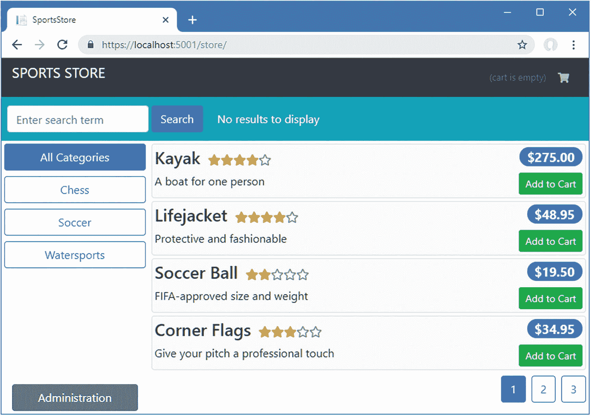
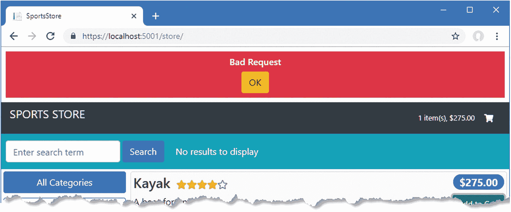
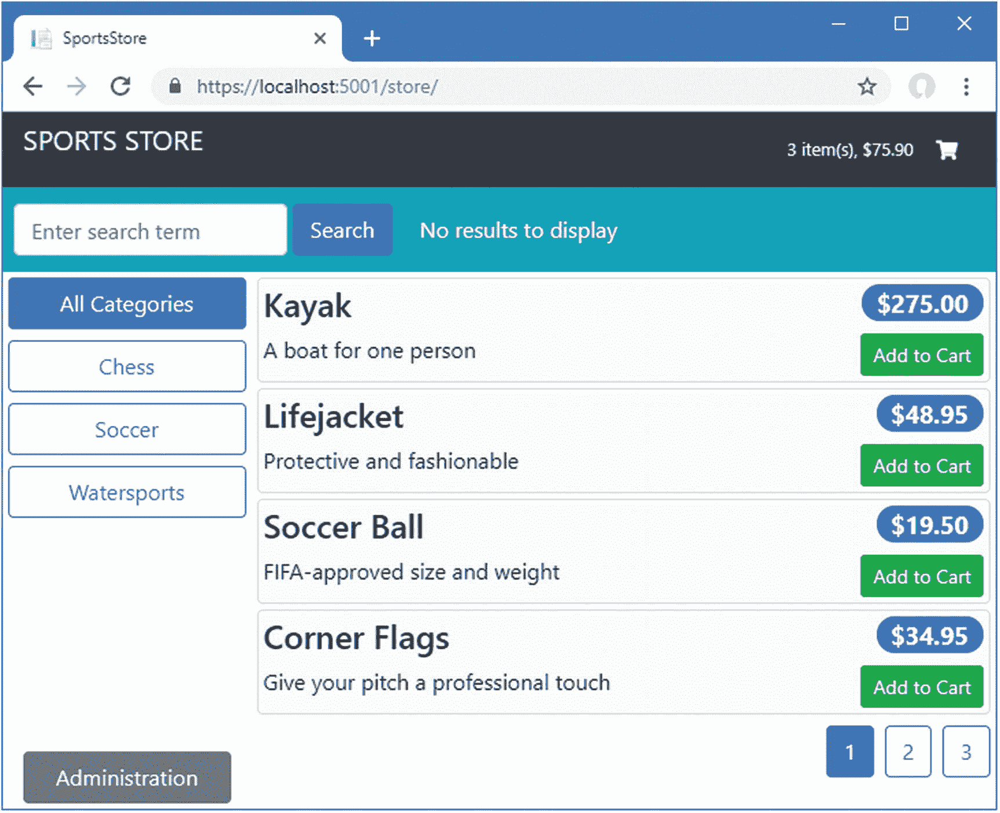
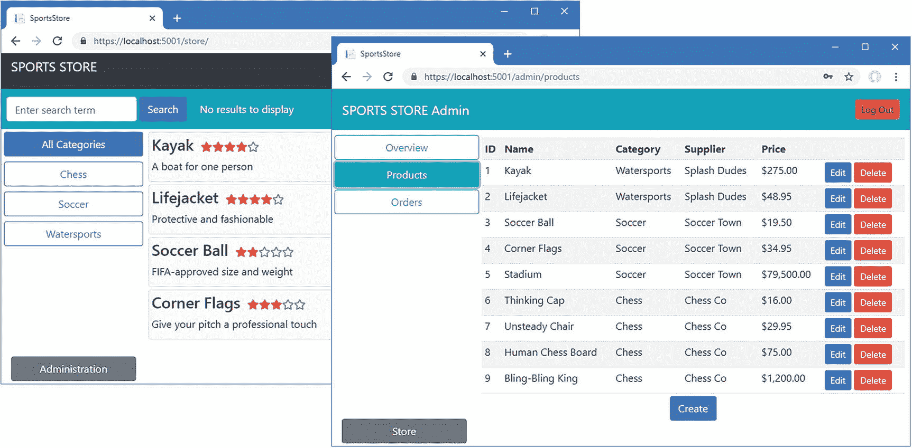

# 十三、准备部署

部署 ASP.NET Core MVC 应用有很多种方法，我不会在本书中讨论这些方法，但是无论应用是如何托管的，都需要做一些改变。

在这一章中，我将展示如何保护 web 服务免受跨站点伪造攻击，使用一个在开发过程中可能具有破坏性但对于生产应用来说却是必不可少的特性。我还将向您展示如何禁用开发人员友好的特性，这些特性确保数据库保持最新，TypeScript 文件自动编译，以及 Angular 应用中的更改自动发送到浏览器。对于开发人员来说，这些都是有用的特性，但是对于生产应用来说，它们不应该被保留。

## 为本章做准备

本章使用了我在第 [3 章](03.html)中创建的 SportsStore 项目，并在之后的章节中进行了修改。要删除数据库以便应用使用新的种子数据，打开一个新的命令提示符，导航到`ServerApp`文件夹，并运行清单 [13-1](#PC1) 中所示的命令。

### 小费

你可以从源代码库 [`https://github.com/Apress/esntl-angular-for-asp.net-core-mvc-3`](https://github.com/Apress/esntl-angular-for-asp.net-core-mvc-3) 免费下载每章的完整项目。运行`ClientApp`文件夹中的`npm install`，安装 Angular 开发所需的包，然后按照指示启动开发工具。

```cs
dotnet ef database drop --force --context DataContext
dotnet ef database drop --force --context IdentityDataContext
dotnet ef database update --context DataContext
dotnet ef database update --context IdentityDataContext
dotnet sql-cache create "Server=(localdb)\MSSQLLocalDB;Database=EssentialApp" "dbo" "SessionData"

Listing 13-1.Resetting the Database

```

这些命令与之前的章节不同，因为第 [12](12.html) 章引入了对 ASP.NET Core Identity 的支持。

使用命令提示符运行清单`ServerApp`文件夹中的 [13-2](#PC2) 所示的命令，启动 ASP.NET Core 运行时和 Angular 开发工具。

```cs
dotnet watch run

Listing 13-2.Starting the Development Tools

```

打开新的浏览器窗口并导航至`https://localhost:5001`；您将看到 SportsStore 应用，如图 [13-1](#Fig1) 所示。



图 13-1。

运行示例应用

## 防止跨站点请求伪造攻击

每当您使用 cookies 来识别用户时，您必须小心保护您的应用免受跨站点请求伪造(CSRF)攻击。CSRF 攻击的想法是欺骗用户加载恶意网页，并向您的应用发送 HTTP 请求。浏览器会自动在请求中包含从您的应用收到的任何 cookies，这使得攻击者能够在模拟用户的同时执行操作，通常是授予攻击者访问应用的权限，或者更改或删除应用的数据。

防范 CSRF 攻击需要在来自应用的 HTTP 响应中包含随机加密令牌，并要求客户端在后续 HTTP 请求中包含相同的令牌。对于往返应用，令牌通常作为隐藏的表单字段包含在内，但是对于 Angular 客户端，令牌作为 cookie 发送。Angular 检测 cookie，并使用它来设置 HTTP 请求中报头的值，这是 CSRF 攻击无法做到的，它将请求识别为来自 Angular 应用，而不是来自攻击。ASP.NET Core MVC 包含了对反 CSRF 令牌的内置支持，但是需要做一些额外的工作才能以一种与 Angular 协同工作的方式来使用它们，如下面几节所述。

### 启用反 CSRF 令牌

防范 CSRF 的第一步是应用属性，该属性告诉 ASP.NET Core MVC 仅当请求包含有效的加密令牌时才接受请求。保护应用最简单的方法是对控制器应用`AutoValidateAntiforgeryToken`属性，告诉 ASP.NET Core MVC 只接受那些具有有效令牌的请求。应用如清单 [13-3](#PC3) 所示的属性来保护产品 API 控制器。

### 小费

如果您想将动作方法从由类范围的属性创建的反 CSRF 策略中排除，您可以将`IgnoreAntiforgeryToken`属性应用于该动作方法。

```cs
using Microsoft.AspNetCore.Mvc;
using ServerApp.Models;
using Microsoft.EntityFrameworkCore;
using System.Linq;
using System.Collections.Generic;
using ServerApp.Models.BindingTargets;
using Microsoft.AspNetCore.JsonPatch;
using System.Text.Json;
using System.Reflection;
using System.ComponentModel;
using Microsoft.AspNetCore.Authorization;

namespace ServerApp.Controllers {

    [Route("api/products")]
    [Authorize(Roles = "Administrator")]
    [AutoValidateAntiforgeryToken]
    public class ProductValuesController : Controller {
        private DataContext context;

        public ProductValuesController(DataContext ctx) {
            context = ctx;
        }

        // ...methods omitted for brevity...
    }
}

Listing 13-3.Requiring Tokens in the ProductValuesController.cs File in the ServerApp/Controllers Folder

```

将相同的属性应用于会话 API 控制器，如清单 [13-4](#PC4) 所示，这样就可以只使用包含有效反 CSRF 令牌的请求来存储会话数据。

```cs
using Microsoft.AspNetCore.Http;
using Microsoft.AspNetCore.Mvc;
using Newtonsoft.Json;
using ServerApp.Models;
using ServerApp.Models.BindingTargets;

namespace ServerApp.Controllers {

    [Route("/api/session")]
    [AutoValidateAntiforgeryToken]
    public class SessionValuesController : Controller {

        // ...methods omitted for brevity...
    }
}

Listing 13-4.Requiring Tokens in the SessionValuesController.cs File in the ServerApp/Controllers Folder

```

将属性应用于供应商数据的控制器，如清单 [13-5](#PC5) 所示。

```cs
using Microsoft.AspNetCore.Mvc;
using ServerApp.Models;
using ServerApp.Models.BindingTargets;
using System.Collections.Generic;
using Microsoft.AspNetCore.Authorization;

namespace ServerApp.Controllers {

    [Route("api/suppliers")]
    [Authorize(Roles = "Administrator")]
    [AutoValidateAntiforgeryToken]
    public class SupplierValuesController : Controller {
        private DataContext context;

        public SupplierValuesController(DataContext ctx) {
            context = ctx;
        }

        // ...methods omitted for brevity...
    }
}

Listing 13-5.Requiring Tokens in the SupplierValuesController.cs File in the ServerApp/Controllers Folder

```

将属性应用于订单数据的控制器，如清单 [13-6](#PC6) 所示。

```cs
using Microsoft.AspNetCore.Mvc;
using Microsoft.EntityFrameworkCore;
using ServerApp.Models;
using System.Collections.Generic;
using System.Linq;
using Microsoft.AspNetCore.Authorization;

namespace ServerApp.Controllers {

    [Route("/api/orders")]
    [Authorize(Roles = "Administrator")]
    [AutoValidateAntiforgeryToken]
    public class OrderValuesController : Controller {
        private DataContext context;

        public OrderValuesController(DataContext ctx) {
            context = ctx;
        }

        // ...methods omitted for brevity...
    }
}

Listing 13-6.Requiring Tokens in the OrderValuesController.cs File in the ServerApp/Controllers Folder

```

由于这些更改，只有当请求包含应用提供的令牌时，才能访问所有 web 服务操作方法。重启 ASP.NET Core MVC 应用，导航到`https://localhost:5001`，点击 Add to Cart 按钮；你会看到请求失败，如图 [13-2](#Fig2) 所示。



图 13-2。

要求反 CSRF 代币的影响

### 发送和接收反 CSRF 令牌

Angular 在 HTTP 响应中查找名为`XSRF-TOKEN`的 cookie，并将自动使用 cookie 值在后续请求中设置名为`X-XSRF-TOKEN`的头。为了给 Angular 客户端提供 cookie 并告诉 ASP.NET Core MVC Angular 使用的头部，将清单 [13-7](#PC7) 中所示的语句添加到`Startup`类中。

```cs
using System;
using System.Collections.Generic;
using System.Linq;
using System.Threading.Tasks;
using Microsoft.AspNetCore.Builder;
using Microsoft.AspNetCore.Hosting;
using Microsoft.AspNetCore.HttpsPolicy;
using Microsoft.Extensions.Configuration;
using Microsoft.Extensions.DependencyInjection;
using Microsoft.Extensions.Hosting;
using Microsoft.AspNetCore.SpaServices.AngularCli;
using ServerApp.Models;
using Microsoft.EntityFrameworkCore;
using Microsoft.OpenApi.Models;
using Microsoft.AspNetCore.ResponseCompression;
using Microsoft.Extensions.FileProviders;
using System.IO;
using Microsoft.AspNetCore.Identity;

using Microsoft.AspNetCore.Antiforgery;

using Microsoft.AspNetCore.Http;

namespace ServerApp {
    public class Startup {

        public Startup(IConfiguration configuration) {
            Configuration = configuration;
        }

        public IConfiguration Configuration { get; }

        public void ConfigureServices(IServiceCollection services) {

            // ...other statements omitted for brevity...

            services.AddAntiforgery(options => {
                options.HeaderName = "X-XSRF-TOKEN";
            });
        }

        public void Configure(IApplicationBuilder app, IWebHostEnvironment env,
            IServiceProvider services, IAntiforgery antiforgery) {

            if (env.IsDevelopment()) {
                app.UseDeveloperExceptionPage();
            } else {
                app.UseExceptionHandler("/Home/Error");
                app.UseHsts();
            }

            app.UseHttpsRedirection();
            app.UseStaticFiles();
            app.UseStaticFiles(new StaticFileOptions {
                RequestPath = "/blazor",
                FileProvider = new PhysicalFileProvider(
                    Path.Combine(Directory.GetCurrentDirectory(),
                        "../BlazorApp/wwwroot"))
            });

            app.UseSession();

            app.UseRouting();
            app.UseAuthentication();
            app.UseAuthorization();

            app.Use(nextDelegate => context => {
                string path = context.Request.Path.Value;
                string[] directUrls = { "/admin", "/store", "/cart", "checkout" };
                if (path.StartsWith("/api") || string.Equals("/", path)
                        || directUrls.Any(url => path.StartsWith(url))) {
                    var tokens = antiforgery.GetAndStoreTokens(context);
                    context.Response.Cookies.Append("XSRF-TOKEN",
                        tokens.RequestToken, new CookieOptions() {
                            HttpOnly = false, Secure = false, IsEssential = true
                        });
                }
                return nextDelegate(context);
            });

            app.UseEndpoints(endpoints => {
                endpoints.MapControllerRoute(
                    name: "default",
                    pattern: "{controller=Home}/{action=Index}/{id?}");

                endpoints.MapControllerRoute(
                    name: "angular_fallback",
                    pattern:
                    "{target:regex(admin|store|cart|checkout):nonfile}/{*catchall}",
                    defaults: new { controller = "Home", action = "Index" });

                endpoints.MapControllerRoute(
                    name: "blazor_integration",
                    pattern: "/blazor/{*path:nonfile}",
                    defaults: new { controller = "Home", action = "Blazor" });

                //endpoints.MapFallbackToClientSideBlazor<BlazorApp
                //     .Startup>("blazor/{*path:nonfile}", "index.html");

                endpoints.MapRazorPages();
            });

            app.Map("/blazor", opts =>
                opts.UseClientSideBlazorFiles<BlazorApp.Startup>());

            app.UseClientSideBlazorFiles<BlazorApp.Startup>();

            app.UseSwagger();
            app.UseSwaggerUI(options => {
                options.SwaggerEndpoint("/swagger/v1/swagger.json",
                    "SportsStore API");
            });

            app.UseSpa(spa => {
                string strategy = Configuration
                    .GetValue<string>("DevTools:ConnectionStrategy");
                if (strategy == "proxy") {
                    spa.UseProxyToSpaDevelopmentServer("http://127.0.0.1:4200");
                } else if (strategy == "managed") {
                    spa.Options.SourcePath = "../ClientApp";
                    spa.UseAngularCliServer("start");
                }
            });

            SeedData.SeedDatabase(services.GetRequiredService<DataContext>());
            IdentitySeedData.SeedDatabase(services).Wait();
        }
    }
}

Listing 13-7.Using Anti-Forgery Tokens in the Startup.cs.cs File in the ServerApp Folder

```

`ConfigureServices`方法中的新语句告诉 ASP.NET Core MVC 在名为`X-XSRF-TOKEN`的 HTTP 头中寻找反 CSRF 令牌。`Configure`方法中的新语句为对`/` URL、用户可能直接导航到的任何顶级 URL 以及以`/api`开头的 URL 的请求添加了一个令牌。

保存更改，重启 ASP.NET Core MVC 应用，并导航到`https://localhost:5001`。现在 Angular 正在接收和发送令牌，ASP.NET Core MVC 将处理它的请求，如图 [13-3](#Fig3) 所示。



图 13-3。

配置反 CSRF 令牌

## 准备部署

该项目是为开发而配置的，其特性可以很容易地看到代码更改的效果，但不应该在生产中使用。在接下来的小节中，我将为部署准备应用。

### 注意

本章没有向您展示如何部署应用，因为有太多不同的部署选项需要介绍。如果你没有现成的平台可以部署，那么我建议你考虑使用容器，比如 Docker 提供的容器，这些容器可以在大多数托管平台或者本地服务器上部署和管理。详见`docker.com`。

### 创建数据库迁移命令

在本书中，当 ASP.NET Core MVC 应用启动时，我依靠实体框架核心来应用数据库迁移，这确保了数据库模式是最新的。

当应用处于生产状态时，不应自动应用迁移，因为删除并重新创建表或列时，架构更改可能会导致数据丢失。能够初始化数据库仍然是有用的，但重要的是明确地这样做，而不是每次 ASP.NET Core MVC 应用启动。我采用的方法是添加对配置设置的支持，配置设置可以作为环境变量或命令行参数提供。当设置为`true`时，数据库将被初始化，然后应用将退出。当设置为`false`或未提供时，ASP.NET Core MVC 应用将正常启动。

要添加 NuGet 包，该包提供对通过命令行提供的变量的访问，请运行清单 [13-8](#PC8) 中的命令(在`ServerApp`文件夹中)。

```cs
dotnet add package Microsoft.Extensions.Configuration.CommandLine --version 3.0.0

Listing 13-8.Installing the Command-Line NuGet Package

```

为了增加对配置选项的支持，将清单 [13-9](#PC9) 中所示的语句添加到`Startup`类中。

### 使用配置环境

ASP.NET Core 提供对配置环境的支持，其中配置设置用于指定应用运行的环境，该环境可用于加载不同的配置文件或分支到`Startup`类中的不同配置代码。

这是一个需要小心的特性，应该谨慎使用，因为很少有项目团队有能力或纪律在部署应用之前测试生产设置的效果，这会导致部署失败和回滚。我建议在每次部署之前经历一个明确的准备过程，并且只依靠环境来处理诸如数据库连接字符串之类的设置。

```cs
using System;
using System.Collections.Generic;
using System.Linq;
using System.Threading.Tasks;
using Microsoft.AspNetCore.Builder;
using Microsoft.AspNetCore.Hosting;
using Microsoft.AspNetCore.HttpsPolicy;
using Microsoft.Extensions.Configuration;
using Microsoft.Extensions.DependencyInjection;
using Microsoft.Extensions.Hosting;
using Microsoft.AspNetCore.SpaServices.AngularCli;
using ServerApp.Models;
using Microsoft.EntityFrameworkCore;
using Microsoft.OpenApi.Models;
using Microsoft.AspNetCore.ResponseCompression;
using Microsoft.Extensions.FileProviders;
using System.IO;
using Microsoft.AspNetCore.Identity;
using Microsoft.AspNetCore.Antiforgery;
using Microsoft.AspNetCore.Http;

namespace ServerApp {
    public class Startup {

        public Startup(IWebHostEnvironment env) {
            var builder = new ConfigurationBuilder()
              .SetBasePath(env.ContentRootPath)
              .AddJsonFile("appsettings.json", optional: false, reloadOnChange: true)
              .AddJsonFile($"appsettings.{env.EnvironmentName}.json", optional: true)
              .AddEnvironmentVariables()
              .AddCommandLine(System.Environment.GetCommandLineArgs()
                  .Skip(1).ToArray());
            Configuration = builder.Build();
        }

        public IConfiguration Configuration { get; }

        public void ConfigureServices(IServiceCollection services) {

            // ...statements omitted for brevity...
        }

        public void Configure(IApplicationBuilder app, IWebHostEnvironment env,
            IServiceProvider services, IAntiforgery antiforgery,
            IHostApplicationLifetime lifetime) {

            // ...statements omitted for brevity...

            //SeedData.SeedDatabase(services.GetRequiredService<DataContext>());
            //IdentitySeedData.SeedDatabase(services).Wait();

            if ((Configuration["INITDB"] ?? "false") == "true") {
                System.Console.WriteLine("Preparing Database...");
                SeedData.SeedDatabase(services.GetRequiredService<DataContext>());
                IdentitySeedData.SeedDatabase(services).Wait();
                System.Console.WriteLine("Database Preparation Complete");
                lifetime.StopApplication();
            }
        }
    }
}

Listing 13-9.Adding Explicit Database Initialization in the Startup.cs File in the ServerApp Folder

```

如果有一个名为`INITDB`的配置设置，并且它是`true`，那么数据库将被迁移和播种。准备好数据库后，应用将退出。

### 为生产构建 Angular 应用

Angular development server 负责在开发过程中构建 Angular 应用。为了准备部署，Angular 构建工具用于创建应用的优化版本，该版本不包括自动浏览器重新加载等功能。

#### 创建虚拟模块

生产编译是严格的，并报告生产期间未标记的错误。在第 7 章[中，我在项目中添加了组件来演示一个 Angular 应用的结构。组件不是最终项目的一部分，也不会包含在优化的构建中，但是当组件与模块无关时，Angular 编译器会报告一个错误。我可以删除组件，但这是项目中常见的问题，在这些项目中，相同的代码基础被用来生成不同的应用，删除文件并不理想。为了解决这个问题，我将添加一个虚拟模块来满足编译器，而不需要从项目中删除文件。在`ClientApp/src/app/structure`文件夹中添加一个名为`dummy.module.ts`的文件，代码如清单](07.html) [13-10](#PC10) 所示。

```cs
import { NgModule } from '@angular/core';
import { CommonModule } from "@angular/common";
import { RouterModule } from "@angular/router";
import { CategoryFilterComponent } from "./categoryFilter.component";
import { ProductDetailComponent } from "./productDetail.component";
import { ProductTableComponent } from "./productTable.component";

@NgModule({
    declarations: [CategoryFilterComponent, ProductDetailComponent, ProductTableComponent],
    imports: [CommonModule, RouterModule]
})
export class DummyModule {}

Listing 13-10.The Contents of the dummy.module.ts File in the ClientApp/src/app/structure Folder

```

要创建 Angular 应用的生产版本，运行在`ClientApp`文件夹中的清单 [13-11](#PC11) 中显示的命令。

```cs
ng build --prod --output-path ../ServerApp/wwwroot/app --output-hashing none

Listing 13-11.Creating the Production Angular Build

```

该命令创建包含 Angular 应用和运行时的 JavaScript 文件的优化版本，并将它们放在`ServerApp/wwwroot/app`文件夹中，从这里它们将被提供给浏览器。

### 注意

`output-hashing`参数用于防止构建过程向生成的文件名添加校验和，我这样做是为了简化示例。在实际的项目中，可以省略这个参数来产生基于其内容而改变的文件名，这是防止缓存问题的一个有用的技巧，尽管在更新清单 [13-12](#PC12) 中所示的`script`元素时，您必须使用这些文件名。

### 更新脚本元素

要使用产品 Angular 文件，在 Razor 视图中更改`script`元素，将 Angular 应用交付给浏览器，如清单 [13-12](#PC12) 所示。

```cs
@section scripts {
    <script src="runtime-es2015.js" type="module"></script>
    <script src="polyfills-es2015.js" type="module"></script>
    <script src="main-es2015.js" type="module"></script>
    <script src="runtime-es5.js" nomodule></script>
    <script src="polyfills-es5.js" nomodule></script>
    <script src="main-es5.js" nomodule></script>
}

<!-- <div id="data" class="p-1 bg-warning">
  @Json.Serialize(Model)
</div> -->

<app-root></app-root>

Listing 13-12.Changing File Locations in the Index.cshtml File in the ServerApp/Views/Home Folder

```

在`src`属性中指定的新位置将选择由清单 [13-11](#PC11) 中的 Angular 构建命令创建的文件。构建处理两组 JavaScript 文件以支持称为差异加载的过程，这允许现代浏览器以较小的文件为目标，因为它们不需要解决缺少的 JavaScript 特性。旧的浏览器仍然受支持，但是会接收包含额外代码的更大的 JavaScript 文件。文件的选择由添加到清单 [13-12](#PC12) 中`script`元素的`type`和`nomodule`属性驱动。

### 为生产配置 ASP.NET Core

该项目的 ASP.NET Core 部分的`Startup`类设置了在开发中有用但在生产中无用的特性。为了准备部署，我已经注释掉了添加支持使用 Angular development server 和检查 web 服务的部分，如清单 [13-13](#PC13) 所示。我还添加了一个新的静态文件处理程序，它将服务于`wwwroot/app`文件夹中的文件，这将确保清单 [13-12](#PC12) 中定义的`script`元素能够工作，并允许 Angular 应用在需要时加载管理模块。

```cs
using System;
using System.Collections.Generic;
using System.Linq;
using System.Threading.Tasks;
using Microsoft.AspNetCore.Builder;
using Microsoft.AspNetCore.Hosting;
using Microsoft.AspNetCore.HttpsPolicy;
using Microsoft.Extensions.Configuration;
using Microsoft.Extensions.DependencyInjection;
using Microsoft.Extensions.Hosting;
using Microsoft.AspNetCore.SpaServices.AngularCli;
using ServerApp.Models;
using Microsoft.EntityFrameworkCore;
using Microsoft.OpenApi.Models;
using Microsoft.AspNetCore.ResponseCompression;
using Microsoft.Extensions.FileProviders;
using System.IO;
using Microsoft.AspNetCore.Identity;
using Microsoft.AspNetCore.Antiforgery;
using Microsoft.AspNetCore.Http;

namespace ServerApp {
    public class Startup {

        public Startup(IWebHostEnvironment env) {
            var builder = new ConfigurationBuilder()
              .SetBasePath(env.ContentRootPath)
              .AddJsonFile("appsettings.json", optional: false, reloadOnChange: true)
              .AddJsonFile($"appsettings.{env.EnvironmentName}.json", optional: true)
              .AddEnvironmentVariables()
              .AddCommandLine(System.Environment.GetCommandLineArgs()
                  .Skip(1).ToArray());
            Configuration = builder.Build();
        }

        public IConfiguration Configuration { get; }

        public void ConfigureServices(IServiceCollection services) {

            string connectionString =
                Configuration["ConnectionStrings:DefaultConnection"];
            services.AddDbContext<DataContext>(options =>
                options.UseSqlServer(connectionString));

            services.AddDbContext<IdentityDataContext>(options =>
                options.UseSqlServer(Configuration["ConnectionStrings:Identity"]));
            services.AddIdentity<IdentityUser, IdentityRole>()
                 .AddEntityFrameworkStores<IdentityDataContext>();

            services.AddControllersWithViews()
                .AddJsonOptions(opts => {
                    opts.JsonSerializerOptions.IgnoreNullValues = true;
                });
            services.AddRazorPages();

            //services.AddSwaggerGen(options => {
            //    options.SwaggerDoc("v1",
            //        new OpenApiInfo { Title = "SportsStore API", Version = "v1" });
            //});

            services.AddDistributedSqlServerCache(options => {
                options.ConnectionString = connectionString;
                options.SchemaName = "dbo";
                options.TableName = "SessionData";
            });

            services.AddSession(options => {
                options.Cookie.Name = "SportsStore.Session";
                options.IdleTimeout = System.TimeSpan.FromHours(48);
                options.Cookie.HttpOnly = false;
                options.Cookie.IsEssential = true;
            });

            services.AddResponseCompression(opts => {
                opts.MimeTypes = ResponseCompressionDefaults.MimeTypes.Concat(
                    new[] { "application/octet-stream" });
            });

            services.AddAntiforgery(options => {
                options.HeaderName = "X-XSRF-TOKEN";
            });
        }

        public void Configure(IApplicationBuilder app, IWebHostEnvironment env,
            IServiceProvider services, IAntiforgery antiforgery,
            IHostApplicationLifetime lifetime) {

            if (env.IsDevelopment()) {
                app.UseDeveloperExceptionPage();
            } else {
                app.UseExceptionHandler("/Home/Error");
                app.UseHsts();
            }

            app.UseHttpsRedirection();
            app.UseStaticFiles();
            app.UseStaticFiles(new StaticFileOptions {
                RequestPath = "/blazor",
                FileProvider = new PhysicalFileProvider(
                    Path.Combine(Directory.GetCurrentDirectory(),
                        "../BlazorApp/wwwroot"))
            });
            app.UseStaticFiles(new StaticFileOptions {
                RequestPath = "",
                FileProvider = new PhysicalFileProvider(
                    Path.Combine(Directory.GetCurrentDirectory(),
                        "./wwwroot/app"))
            });

            app.UseSession();

            app.UseRouting();
            app.UseAuthentication();
            app.UseAuthorization();

            app.Use(nextDelegate => context => {
                string path = context.Request.Path.Value;
                string[] directUrls = { "/admin", "/store", "/cart", "checkout" };
                if (path.StartsWith("/api") || string.Equals("/", path)
                        || directUrls.Any(url => path.StartsWith(url))) {
                    var tokens = antiforgery.GetAndStoreTokens(context);
                    context.Response.Cookies.Append("XSRF-TOKEN",
                        tokens.RequestToken, new CookieOptions() {
                            HttpOnly = false, Secure = false, IsEssential = true
                        });
                }
                return nextDelegate(context);
            });

            app.UseEndpoints(endpoints => {
                endpoints.MapControllerRoute(
                    name: "default",
                    pattern: "{controller=Home}/{action=Index}/{id?}");

                endpoints.MapControllerRoute(
                    name: "angular_fallback",
                    pattern:
                    "{target:regex(admin|store|cart|checkout):nonfile}/{*catchall}",
                    defaults: new { controller = "Home", action = "Index" });

                endpoints.MapControllerRoute(
                    name: "blazor_integration",
                    pattern: "/blazor/{*path:nonfile}",
                    defaults: new { controller = "Home", action = "Blazor" });

                endpoints.MapRazorPages();
            });

            //app.Map("/blazor", opts =>
            //    opts.UseClientSideBlazorFiles<BlazorApp.Startup>());

            app.UseClientSideBlazorFiles<BlazorApp.Startup>();

            //app.UseSwagger();
            //app.UseSwaggerUI(options => {
            //    options.SwaggerEndpoint("/swagger/v1/swagger.json",
            //        "SportsStore API");
            //});

            //app.UseSpa(spa => {
            //    string strategy = Configuration
            //        .GetValue<string>("DevTools:ConnectionStrategy");
            //    if (strategy == "proxy") {
            //        spa.UseProxyToSpaDevelopmentServer("http://127.0.0.1:4200");
            //    } else if (strategy == "managed") {
            //        spa.Options.SourcePath = "../ClientApp";
            //        spa.UseAngularCliServer("start");
            //    }
            //});

            if ((Configuration["INITDB"] ?? "false") == "true") {
                System.Console.WriteLine("Preparing Database...");
                SeedData.SeedDatabase(services.GetRequiredService<DataContext>());
                IdentitySeedData.SeedDatabase(services).Wait();
                System.Console.WriteLine("Database Preparation Complete");
                lifetime.StopApplication();
            }

        }
    }
}

Listing 13-13.Preparing for Deployment in the Startup.cs File in the ServerApp Folder

```

### 执行生产试运行

最后一步是执行一次试运行，并确保在前面几节的更改后一切正常。

#### 准备数据库

第一项检查是确保清单 [13-9](#PC9) 中的更改允许从命令行初始化和播种数据库。首先运行`ServerApp`文件夹中清单 [13-14](#PC14) 中所示的命令来删除现有的数据库。

```cs
dotnet ef database drop --force --context DataContext
dotnet ef database drop --force --context IdentityDataContext

Listing 13-14.Resetting the Databases

```

运行`ServerApp`文件夹中清单 [13-15](#PC15) 中所示的命令，初始化用于存储应用和身份数据的数据库。

```cs
dotnet run -- --INITDB=true

Listing 13-15.Preparing the Databases

```

接下来，运行`ServerApp`文件夹中清单 [13-16](#PC16) 所示的命令，以便存储会话数据。

```cs
dotnet sql-cache create "Server=(localdb)\MSSQLLocalDB;Database=EssentialApp" "dbo" "SessionData"

Listing 13-16.Preparing the Database for Session Data

```

#### 启动 ASP.NET Core MVC 应用

最后一步是通过运行`SportsStore`文件夹中清单 [13-17](#PC17) 所示的命令来启动应用。

```cs
dotnet run

Listing 13-17.Running the ASP.NET Core MVC Application

```

应用启动后，使用浏览器导航至`https://localhost:5001`；你应该会看到如图 [13-4](#Fig4) 所示的产品列表。导航到`https://localhost:5001/admin`并使用`admin`作为用户名和`MySecret123$`作为密码进行认证，以确保与 ASP.NET Core Identity 的集成正在工作，也如图 [13-4](#Fig4) 所示。



图 13-4。

检查应用是否工作

如果一切正常，您可以进行任何必要的最终调整，比如新的数据库连接字符串，并打包应用进行部署。

## 摘要

在本章中，我向您展示了如何为部署准备应用。我演示了如何添加验证令牌来防止跨站点请求伪造，如何使用命令行准备数据库，以及如何禁用开发人员特性。

这就是我要教你的关于一起使用 Angular 和 ASP.NET Core MVC 的全部内容。我首先创建了一个包含 Angular 和 ASP.NET Core MVC 的项目，并向您展示了如何让它们协同工作，如何在它们之间共享数据，以及如何创建和使用 web 服务。在这个过程中，我向您展示了如何使用核心 Angular 构建块来构建客户端应用，以及如何将 Angular 和 Blazor 结合使用。

我祝你在你的角力/ASP 中一切顺利。NET 核心 MVC 项目，我只能希望你喜欢读这本书，就像我喜欢写它一样。