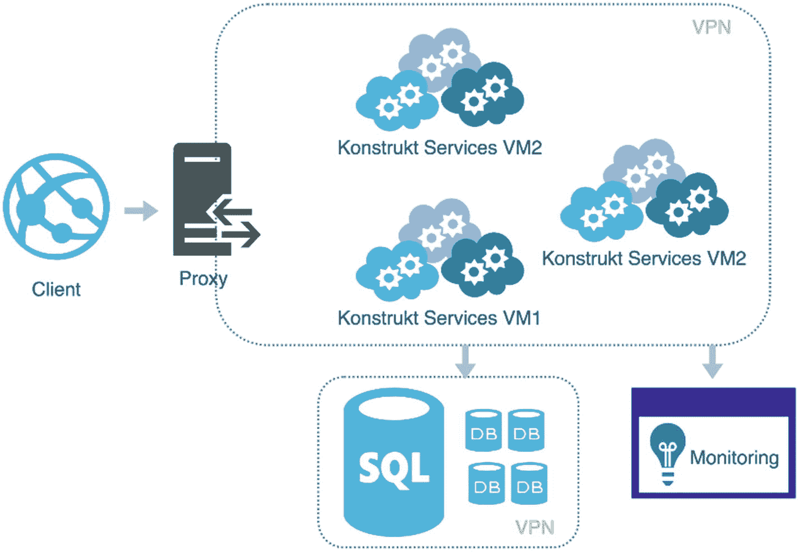
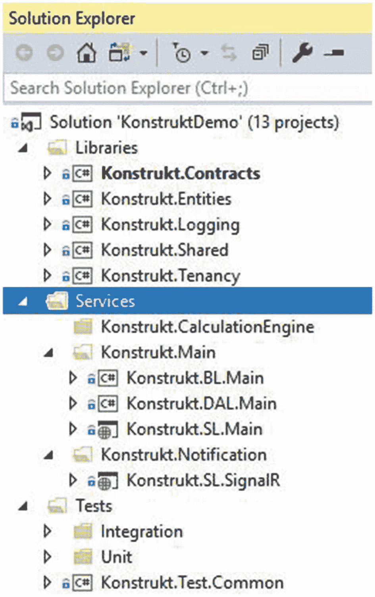
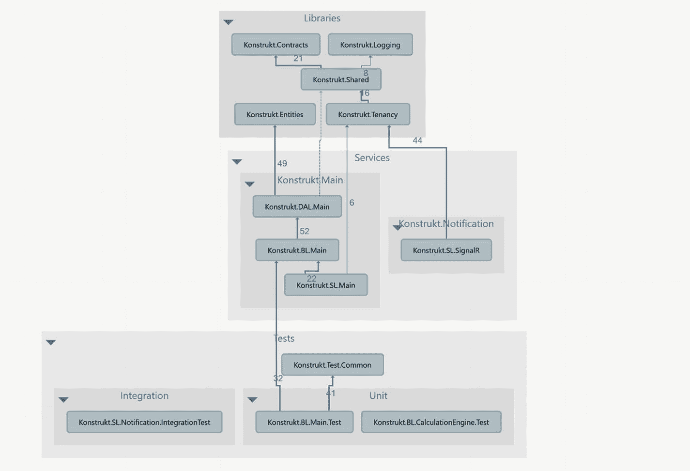

# 一、有问题的 SaaS 系统

我从未想象过自己在创业公司工作。自从我成为一名开发人员以来，大部分时间都是咨询工作，对我来说，创业意味着不合理的工作时间，低工资，一群潮人在会议室里争论该买什么玩具和游戏，以及很少甚至没有稳定性。但是，永远不要说不，尤其是在科技领域。

一天晚上，我和我的一个朋友一起参加了他的商业伙伴 Johan(也是一名开发人员)的深夜编码会议。他们一直与性能问题和 bug 斗争到凌晨。一个晚上变成了连续几个周末，到处都是精选混合糖果(一种瑞典特产)，比任何人应该摄入的都多的咖啡因，扬声器里传出沙哑的音乐。我们在那个俯瞰市中心的办公室里不知疲倦地编码，最后我主动提出帮助描述他们遇到问题的服务。这些服务是 ASP.NET 服务，存在严重的性能和内存使用问题。当时，问题的答案是为每个客户创建一个本地解决方案。每个客户都有一个本地安装，没什么大不了的，因为只有两个客户。但是，了解到他们的客户名单在不断增长，我想我们都认识到了将系统带到云上以实现多租户解决方案的价值。合作伙伴选择了 Azure，我认为这是一个很好的选择，因为我对 Azure 有相当多的体验，并且印象深刻。然后大象进入房间，我们如何从本地迁移到多租户？这难道不意味着大量的代码重写和返工吗？我们向当前和潜在客户承诺的所有功能和缺陷修复怎么样了？我可以看到这对所有参与的人来说都是令人畏惧的，但我也认识到这是一个很好的机会。很快，我发现自己可以全天工作，完全访问他们所有的 Azure 账户和服务器。长话短说，我签了一份合同，现在正式成为一家初创公司的一员。

你可能想知道我为什么要告诉你这些。背景故事在我们开始迁移的地方结束，这是一个与您分享我的经验、建议、捷径和来之不易的教训的好起点。那么，我们开始吧。

我们将从了解系统的功能、组成部分以及它们是如何组合在一起开始我们的旅程。在本书中，我将使用大量的示例代码。我希望尽可能保持一切真实，因此您将看到的服务和代码将是来自我们系统的实际工作代码(为了保护无辜而做了一些小的修改)，是的，好的、坏的和难看的。我的目标是为你提供一个现实的工作场景，一些可转移的和与你工作相关的东西。

## 安装要求

虽然您可以在 Linux 上运行 ASP.NET Core，并使用例如 Visual Studio 代码作为您的编辑器，但我选择在 Windows 上使用 Visual Studio Community Edition(免费),以利用一些额外的工具和扩展来简化迁移。这些工具只是简化了迁移，迁移的关键步骤并不依赖于这些工具，替代方法将在本书中介绍。

使用书中描述的步骤进行迁移的要求:

*   Windows 10

*   Visual Studio 社区版 2017(免费)

*   。NET Core SDK(最新版本或您的目标版本)

运行书中示例的附加要求:

*   IIS 7 或更高版本

*   饭桶和饭桶狂欢

*   SQL Server Express 2016

## 多租户软件即服务(SaaS)

正如我提到的，该系统本身是一个多租户解决方案。这是一个 SaaS 系统(软件即服务)，这意味着它有一个云计算服务模型，系统是集中托管的。我们称之为租户的客户端不需要管理或控制基础架构。除非他们选择，或者更确切地说，坚持本地安装(我们有一些政府机构由于法律原因不能使用云解决方案)。租户仅仅是应用的消费者，虽然感觉上他们每个人都有自己的系统专用云安装，但他们使用的是相同的应用和服务。我们的好处是不必管理 x 数量的基础架构设置，也不必讨论硬件和软件要求及许可证，支持变得更易于管理，并且我们可以随心所欲地推出补丁和更新。这也有很大的经济收益，这是另一个重要因素。但是，挑战是巨大的。数据安全性是一个明显的挑战，正常运行时间也是如此。我们对我们的租户有 SLA(服务水平协议),但我们也对我们的云供应商和我们在那里使用的服务有 SLA。负载、延迟和性能是我们最大的挑战之一，也是 SaaS 解决方案最常见的挑战。负载是不确定的，很难预测。当我们采用云模型时，我们在本地实施中看到的性能问题显著增加。为什么呢？我们处理数据，很多数据。

## 这个系统做什么

Konstrukt 是一个规划平台，旨在为各种组织处理不同类型的规划方案。

任何定量规划和数据整合，无论简单还是复杂，都可以以安全和用户友好的方式进行管理，取代许多组织中对 Excel 的误用。该系统非常灵活，涵盖了广泛的规划方案，如战略规划、滚动预测、数据驱动的预算、劳动力能力规划、薪酬和股权规划等。系统非常复杂，我们面临的一个反复出现的挑战是性能，这可能并不令人惊讶。我将在下一章讨论迁移的利弊时回到这个话题。

## 体系结构

Konstrukt 由九个 ASP.NET Web API 服务和一个用 JavaScript、HTML 和 CSS 编写的无状态解耦客户端组成(图 [1-1](#Fig1) )。每个租户都有自己的数据库，我们目前只使用 SQL Server 作为我们的数据库。大多数服务在同一个服务器集群上共享相同的数据库，有些被模式分开，我们还有一些服务使用的 NoSQL 数据库(MongoDB)。这看起来像是我们拥有真正的微服务架构，但事实并非如此。我们混合了微服务和我经常提到的分布式整体服务。分布式整体是一个部署为几个小服务的系统，类似于微服务，范围很小，但依赖于同一个数据存储，不具备抗故障能力。一些开发人员仍然称这样的服务为微服务，而一些人会不同意。虽然书名是关于迁移微服务的，但我们将迁移具有不同程度解耦和抗故障能力的服务，让您真实地了解如何迁移现有的复杂系统，无论是遗留系统还是非遗留系统。如果你有一个整体，换句话说，一个单层的应用，不要担心。我们的一些服务或多或少都是独一无二的，我将确保涵盖包括这些在内的迁移示例。

图 1-1

我们正在迁移的系统

我将只使用一些服务作为迁移的示例，但如果您想知道系统是什么样子，这些是主要的服务及其功能:

证明

*   管理认证。我们支持多种认证方法，例如
    *   内部数据库登录

    *   断续器

    *   SAML2

    *   还有一些

*   在初始认证之后，会提供一个 JWT (JSON Web Token)作为认证头。该令牌保存在客户端上，用于后续请求。

管理

*   管理可供系统管理员使用的所有逻辑，例如设置访问权限和导入用户。

主要的

*   该服务主要关注由客户端中的动作驱动的动作。两个例子是当用户提交预算进行审批时，以及当用户添加对预算的评论时。

聚合引擎

*   向用户预算行表中写入和读取预算数据。

计算引擎

*   对为不同计划和预算生成数据的计算进行排队和处理。

应用服务

*   管理通知，当前为 WebSocket 通知。通知可以是聊天中的消息，也可以是预算提交审批后的用户通知。我们将 SignalR 用于通知，这是一个用于实时 web 通信的流行库。

## 本书中使用的示例系统

正如你可能已经得出的结论，该系统是相当大的规模。它并不巨大，但仍然很大。出于本书的目的，我已经对解决方案进行了修整，我想到了一些将在本书中受到更多关注的特定服务，如图 [1-2](#Fig2) 所示。

图 1-2

我在本书中作为例子使用的 Konstrukt 的精简版本

这本书主要关注 Konstrukt 的迁移。SL.Main service 及其依赖项(如图 [1-3](#Fig3) 所示)，同时确保它所依赖的解决方案库也可以被未迁移的服务使用。这意味着当服务将目标。NET 核心，它的解决方案依赖项将被迁移到。NET 标准。Konstrukt。SL.Main 是 Konstrukt 的起点，随后多年来积累了相当多的代码。当我们转向微服务架构时，我们已经将职责区域划分为独立的服务和 Konstrukt。SL.Main 是一个优秀的候选人。我将在本书的后面回到这一点。

我还想提一下通知服务，它目前使用 SignalR 管理 WebSocket 通知。这是一个轻量级的服务，只有一些流行的依赖库——这使它成为完全迁移的一个很好的候选。然而，Asp.NET Core SignalR 与 SignalR 有很大的不同，迁移需要一本关于这个主题的单独的书，因此我省略了服务的代码。

图 1-3

示例代码的依赖关系图

## 管道

在本书的后面，我们还将了解在迁移服务和库时，我们必须如何修改管道。我们目前的管道是这样的。

我们使用 Git 作为我们的版本控制系统，使用 GitHub 作为我们的存储库。我们有一个运行 TeamCity 的构建服务器——team city 是一个构建服务器服务。它按顺序运行以下构建步骤，如果一个步骤失败，其他步骤将不会运行:

1.  构建后端(构建后端代码，并将每个服务打包成一个 NuGet 包)

2.  运行后端单元测试(运行我们的单元测试)

3.  构建客户端(构建我们的客户端，缩小和捆绑资源)

4.  运行客户端测试(在无头浏览器中运行客户端测试)

5.  提升到边缘(将我们的包推送到我们的边缘服务器环境，并验证所有服务都可以正常启动和运行)

在构建服务器上，我们还运行一个名为 Octopus Deploy 的服务。Octopus Deploy 是一个用于 Windows 的自动化发布管理工具。您可以从一个中心位置自动化和管理远程机器上的部署，这是通过在接收机器上安装被称为“触角”的东西来完成的。触须创造了沟通渠道，我们可以推动我们的包裹通过。这些机器被组织在标记为一个环境的组中。根据环境的不同，我们有不同数量的机器。我们的边缘环境只是一个虚拟机，因为我们只想有一个第一部署位置，并确保一切正常运行。我们的第二个环境是我们的 QA(质量保证)环境。这是我们进行测试的地方，我们将服务分散在两台机器上。我们的 AT 环境(验收测试)有四台机器，与生产环境相同，因为它是部署到生产环境之前的最后一站。验收测试是我们进行的最后一项测试，我们有特定的客户和实施顾问(帮助租户配置数据和计算的顾问)在 at 进行测试。最后一个环境也有四台虚拟机，是生产环境。理想情况下，我们会让每个服务运行在一个虚拟机上，这样我们就可以进行适当的隔离，但不幸的是，这对我们来说太昂贵了。这也是我们想要迁移我们的服务的原因之一，我将在下一章详细讨论这一点。

## 摘要

在本章中，我们已经了解了 Konstrukt 架构以及该系统的功能。该系统由九个服务、各种工具和一个用于存储的 SQL server 组成。Konstrukt 为企业进行数字规划，并管理与规划和数据整合相关的性能敏感型操作。在整本书中，我们将使用系统的一部分来指导您逐步完成迁移，包括对部署管道的更改。

在下一章，我们将讨论迁移的利与弊。