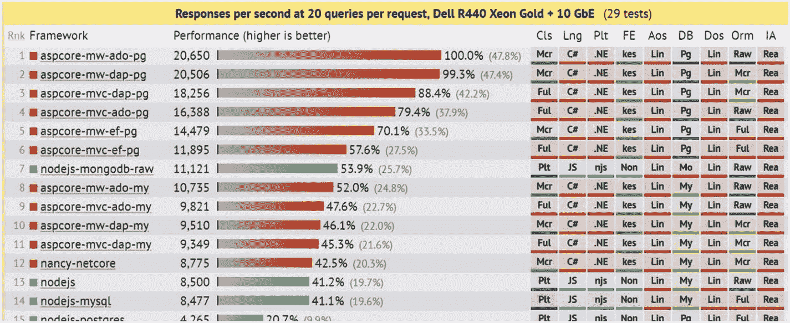
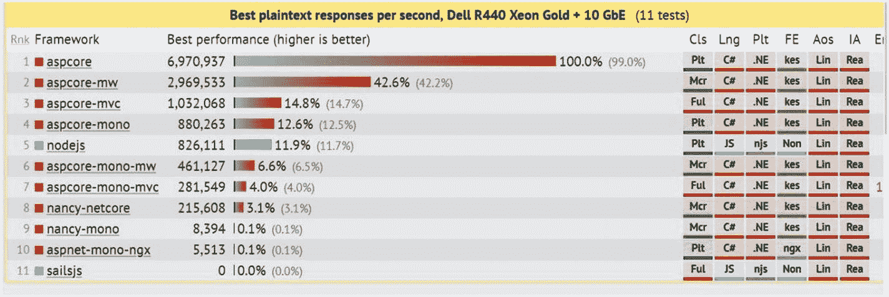
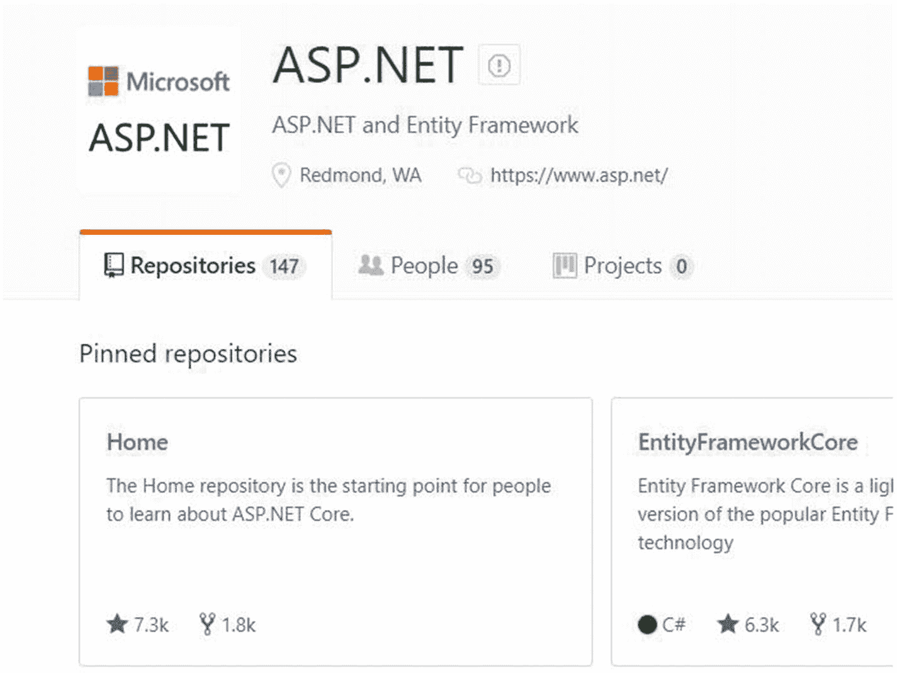
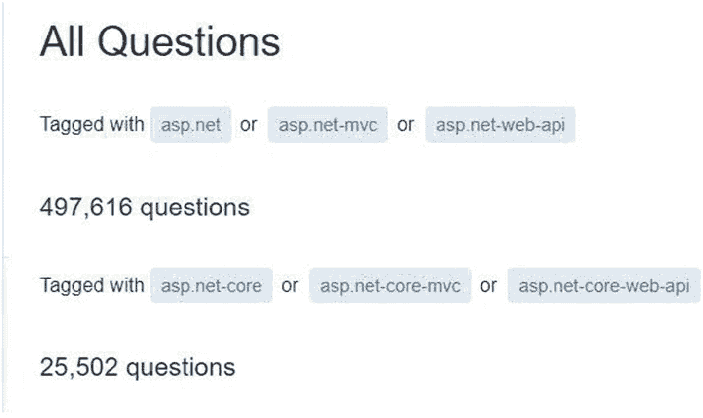
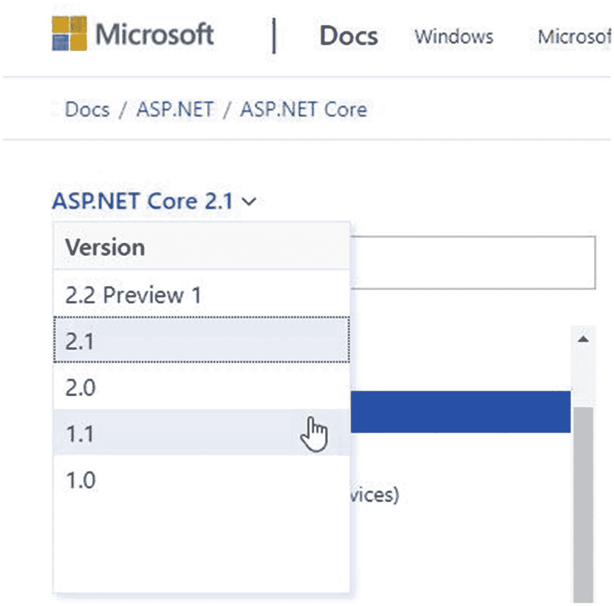
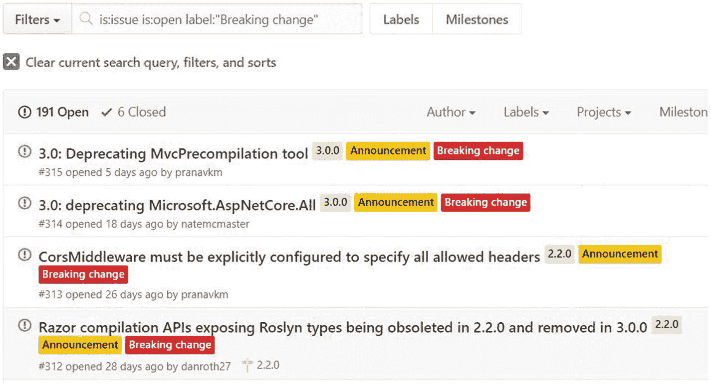

# 二、我们应该迁移吗？

到目前为止，当我向人们讲述我们的迁移时，或者当我就这个主题召开会议时，这是我最常被问到的问题。没有简单明了的答案，就像科技领域的大多数决策一样——这要看情况。

当我们第一次开始讨论迁移到时，我们正在匈牙利进行为期一周的工作启动。NET 核心。动员会是一年一度的传统，我们留出整整一周的时间来学习新东西，而没有回复客户、提供新功能或做其他典型工作的压力。。NET Core 是新的和性感的，它已经在谈话中出现了几次。

我有一个新同事 Tobias，他检查了我们的解决方案，并删除了所有我们不使用的组件*。此外，我们决定看看是否可以迁移到。网芯没有太大的麻烦。我们花了一周时间研究这个问题，并讨论了利弊。了解一般的利弊可能会让您快速了解迁移是否有好处。以下是对利弊的概述。

* ReSharper 是一个商业 Visual Studio 扩展，它有一个让您发现并移除未使用的程序集的功能。还有一个免费的扩展 ResolveUR 也可以做到这一点。慢慢来，一次删除一个，不要忘记在中间进行测试。我们将在后面的章节中讨论这一点。

## 好处

这里概述了许多人认为的迁移的主要好处，或对 ASP.NET Core 的改进。有些取决于 ASP.NET Core 的版本，有些也取决于你是否瞄准。NET Core(相对于针对完整的。NET 框架)。这些项目不是按重要性排列的。

### 表演

预期的性能提升对我们来说非常重要，因为我们有一个做繁重工作、大量计算的系统，并且还需要能够处理许多并发请求。ASP.NET Core 的性能在很多方面都得到了改善(图 [2-1](#Fig1) 和[2-2](#Fig2))——库本身在重写过程中得到了改善，而。NET 核心框架。此外，模块化和独立主机等其他重大变化也有助于提高性能。

ASP.NET Core 比 ASP.NET 快 6 到 23 倍，比 Node.js 快，到第二个版本时每秒可以处理超过 150 万个请求。在 ASP.NET Core 2.2 中，性能有了进一步的提高。如果您想了解有关基准测试的更多信息，请访问位于 [`https://github.com/aspnet/benchmarks`](https://github.com/aspnet/benchmarks) 的知识库。

图 2-2

ASP.NET Core、Node.js 和 ASP.NET Mono 在每个请求 20 个查询时每秒响应的基准测试结果

图 2-1

ASP.NET Core、Node.js 和 ASP.NET Mono 的每秒纯文本响应的基准测试结果

### 内置的依赖注入和日志记录

与任何重写一样，微软团队与社区一起，从一开始就着手编写一个更好的版本，并鼓励良好的实践。两个值得注意的新改进是内置的依赖注入(DI)和日志记录。如果你已经大量使用了依赖注入，这可能没什么大不了的——但是 ASP.NET Core 可以让你轻松地插入你喜欢的容器解析器，从那里开始一切都正常工作。将 DI 集成到一个库中并不是革命性的，但与以前相比，一个显著的不同是 DI 现在如何自然地融入 ASP.NET Core。例如，读取和处理配置文件也使用 DI，您可以将设置部分映射到抽象类型 IOptions <mysettings>的具体类，并使用强类型访问器来处理您的设置。我们已经建立了我们自己的版本，但这无疑使一切更干净。</mysettings>

ASP.NET Core 鼓励更好的实践——有了更好的实践，你可以期待更容易测试和维护的代码。如果你有一个经历了很多变化的系统，你经历了把自己锁在坏的解决方案中，这可能是一个重要的好处。

依赖注入是指将一个具体的类型映射到一个抽象，比如一个接口，并将这个接口注入到另一个类的构造函数中，而不是在那个类中创建一个新的具体实例。抽象和实现通常从容器中映射和解析。这允许松散耦合，更容易的测试和模仿，并允许您以不同的方式解决您的依赖性——作为单例，每个请求或每个解决方案。

### 灵活部署

我所说的灵活部署指的是这样一个事实，即您可以选择 HTTP 服务器，并且可以选择部署模式——独立的或依赖于框架的。

默认情况下，ASP.NET Core 提供了两个服务器实现，Kestrel(跨平台)和 HTTP.sys (Windows)，但是您可以使用另一个 web 服务器，只要它是兼容的。仍然建议使用反向代理服务器，例如 IIS、NGINX 或 Apache。不依赖于特定的 web 服务器使我们更加灵活，这也是我们能够部署到不同操作系统的部分原因。ASP.NET 与 IIS 紧密相连，这使得移植变得不可能。它还具有严重的依赖性，无论是否使用都会被拉进来，缓慢的请求管道具有不必要的障碍。OWIN，打开网页界面。NET 是一个旨在将 web 服务器从 web 应用中分离出来的规范，ASP.NET 的项目 Katana(现已退役)是微软的 OWIN 实现。ASP.NET Core 接管并完全符合 OWIN 规范。如果你想建立一个定制的 web 服务器，你可以作为 ASP.NET Core 完全支持 OWIN。仔细想想，ASP.NET 的核心应用。处理传入 HTTP 请求的. NET 核心应用。

再来说说部署。部署时，您可以选择将应用或服务部署为自包含应用，这意味着它需要的所有 dll 都打包在一起，并且您不依赖于系统范围的库安装(属于 ASP.NET Core 和。NET Core)应用所依赖的。完成的包更大，但您拥有所需的一切，这可以简化部署，特别是当您希望将一切打包并在任何机器上运行时。缺点是您要负责管理版本，并且在发布和打包之前需要考虑目标框架。另一种选择是我们更熟悉的来自 ASP.NET 的基于框架的部署。库必须安装在系统范围内；换句话说，必须准备和维护您部署到的系统。我稍后将回到这一点，因为这两个选项都有一些警告。重要的一点是，您拥有 ASP.NET 没有的选项，这些选项允许您调整和定制部署，以更好地适应您的场景和需求。

### 模块化的

在上一节中我没有提到的一件事是模块化的 HTTP 请求管道，它是实现 OWIN 规范的结果。这在 ASP.NET 有武士刀，但在 ASP.NET Core 更自然。简单地解释一下，您可以非常容易地插入自己的中间件，在请求和响应进出的过程中与它们进行交互。我们用它来修改我们的请求、自定义日志记录和其他一些东西。它让我们在请求处理的早期返回或重定向。这种模块化是贯穿 ASP.NET Core 的主题。比如一切都是 NuGet 包。你不添加引用，你添加 NuGet 包。还有很多包，因为大 ASP.NET 框架已经在 ASP.NET Core 中完全重写，由许多较小的库组成。好处是微软可以更频繁地发布，坏处当然是版本一致性和依赖性。这已经用元包进行了排序，元包是一个引用其他包的包。它包括 ASP.NET Core 团队和实体框架团队支持的所有包。我们稍后会详细讨论这一点。

### 开源和社区驱动

我之前提到过 ASP.NET Core 是开源的，这太棒了。随之而来的有很多好处，我认为透明度是最大的好处。如果我愿意，我可以看到路线图并加入讨论；我可以看到问题和突破性的变化、建议和讨论。一个活跃的社区也在做同样的事情，在确保遵循最佳实践和考虑未来可能出现的问题的同时，继续推进项目。目前有超过 147 个存储库(包括实体框架核心存储库)并且还在增长！(图 [2-3](#Fig3) )。

图 2-3

ASP.NET GitHub 页面

可以投稿，而且比你想象的容易！例如，我提交问题，参与讨论，并帮助其他开发人员解决问题。对代码的访问意味着调试要容易得多，您可以熟悉代码并查看代码的历史。当类突然消失或者一个问题解决了，你想知道是怎么解决的时候，这非常有用。当然，您可以反编译。但根据用户协议和您所在的国家，可能会有法律限制。无论如何，你都不会将历史、问题和讨论与特定的代码行联系起来。

### 非常适合集装箱

天性使然。NET Core 是轻量级和模块化的，这使得它更容易与容器一起使用。容器是操作系统级别的虚拟化概念。从容器内部看，它是一台独立的机器。它认为它有自己的操作系统和所有附带的东西。对于运行在容器内部的服务(虚拟边界)，感觉它们运行在专用的机器上。实际上，它们与使用同一主机的其他容器共享同一台机器，并且只能访问容器内的资源或显式可用的资源。感觉就像一个虚拟机，但是你没有客户操作系统的开销、启动时间等等。操作系统被重用，相反，虚拟边界让我们可以像处理独立的机器一样处理容器。基本上，您将应用与它需要的一切捆绑在一起，在一个包中获得了一致性、可移植性、灵活性、可测试性和隔离性。

容器在 Linux 世界已经存在很长时间了，但是安全和隔离问题阻碍了容器在 Windows 上的移动。谢天谢地，在过去的几年里我们已经看到了巨大的变化，现在容器甚至在 Windows 和 Visual Studio 中都是一等公民。事实上，您可以直接从 IDE 的容器中运行您的应用。它要么只是一个复选框，您需要在创建新项目时勾选，要么您可以将该功能添加到现有项目中。Visual Studio 将创建容器文件(称为 Docker 文件)以及合成文件，这些文件使用 Docker Compose 来运行几个可以相互通信的容器。

在后台运行的服务器应用非常适合容器，而 ASP.NET Core 应用是很好的候选，因为它们是轻量级的，很好的“文化契合”让我们来看看其他的好处。

### 跨平台

。NET Core 也可以在 Linux 环境中运行——这也适用于面向。NET 核心框架。这意味着我们可以有更轻的容器，也可以有不需要许可证的主机。因此，我们可以增加并发服务的密度。此外，这允许我们在没有成本或硬件开销的情况下，将我们的隔离测试环境扩展到几个环境，如质量保证(QA)和验收测试(AT)。然而，如果你不能瞄准。NET 核心框架，你有一些服务，必须针对完整的。NET 框架，您仍然可以从容器和跨平台能力中受益。一种叫做“混合群”的东西(群是容器的集群)让我们可以运行混合环境容器——换句话说，我们可以在一个集群中运行 Windows 和 Linux 应用。

作为一家初创公司，成本从一开始就是我们的一个问题，也是阻碍我们部署渠道的一个因素，因为我们为了省钱，在一台机器上塞进了几个服务。隔离越好，扩展、调试和部署就越容易。

除此之外，在其他平台上运行还有其他好处——对我们来说，这就是使用成熟且维护良好的工具。虽然大多数 Linux 工具都有 Windows 的等价物，但是仍然有一些工具在 Linux 上有更高的成熟度，我们很乐意利用它们。

如果您想了解更多关于 Linux 平台上可用于管理多种服务的工具的信息，我强烈推荐一本我最喜欢的相关书籍， *DevOps 2.0* 。

## 挑战

既然我们已经讨论了主要卖点，那么我们也应该看看缺点，这样我们在做决定时就可以考虑到这些缺点。

### 缺乏资源和文件

与 ASP.NET 相比，ASP.NET Core 银行的许多不利之处都与缺乏成熟度有关。对于论坛、文章和文档，网上提供的帮助较少。如果我们将 StackOverflow 上的问题与 asked 核心标签和 asked 标签进行比较，我们会发现一个显著的差异。ASP.NET 有时间收集资源，被很多开发者采用(图 [2-4](#Fig4) )。

图 2-4

在撰写本文时，StackOverflow 上的 asked 核心与 asked 标签的问题

这将随着时间的推移而改变，值得记住的是，整理解决 ASP 的许多不同方法也是一个挑战。NET 相关的问题，因为该框架也随着时间的推移而变化。然而，迁移到 ASP.NET Core 的最大缺点之一是可用资源较少，尽管 ASP.NET Core 正在迎头赶上。知道去哪里找会有所帮助，我推荐的前五个地方是

*   文件

*   GitHub 存储库

*   微软博客

*   论坛，如 MSDN 和 StackOverflow

*   开发者博客，如微软 MVP 的博客

您还可以在 Twitter 和支持论坛等社交媒体上联系团队，并在 GitHub 上提交或评论问题。有问题不要犹豫；你很可能不是一个人。

### 要学的东西很多

这个挑战有两个部分——第一部分是你和团队的其他成员必须重新学习一个框架，第二部分是寻找新的队友需要他们要么已经知道 ASP.NET Core，要么愿意学习。虽然这两者看起来都不是一个不合理的要求，但是考虑到这一点仍然很重要——尤其是在做评估的时候。

好在有很多学习 ASP.NET Core 的优秀资源；以下是我最喜欢的一些:

*   ASP.NET Core 文档有关于如何开始以及解决特定问题的非常好的文章。从那里开始，因为文档是由社区维护的，并且是最新的。

*   出版社有几本书可供你选择。确保您获得了最新版本和正确的 ASP.NET Core 版本。

*   微软虚拟学院提供免费培训和实践范例，你也可以找到一些微软出版社的免费书籍。

*   例如，通过 Pluralsight 进行在线视频学习。这些网站中的大多数都有免费试用。也有 YouTube 视频，但不经过同样的审核流程。你也可以找到免费观看和下载的会议视频。

*   Channel 9 托管来自微软会议的视频，如 BUILD(发布变更和新产品的会议)以及微软制作的教育视频和 ASP.NET Core 团队录制的视频流。

*   其他大型会议如 NDC 和。NET Conf 也免费发布他们会议录音。

### 版本和变更

虽然微软和社区都在尽力避免重大变更，但总会有一些变更——尤其是在开始阶段。ASP.NET Core 的最初几个版本有一些不受欢迎的突破性变化，比如回到 csproj 项目格式而不是使用 JSON。

在版本、信息和版本文档之间导航是一件痛苦的事情。更不用说版本之间的迁移，或部署不同的版本(部署已经简化，我想说，如果您的目标是 ASP.NET Core 2.0 和更高版本，部署不同的版本比处理 ASP.NET 版本部署更容易)。

之所以会有突破性的变化，很大程度上是因为 ASP.NET Core 是新的，并没有在一开始就找到自己的身份。它也是开源的，来自社区的巨大推动力是实现可能的最佳解决方案，即使这意味着回到以前的决定。我建议关注 ASP.NET Core 资源库中带有重大变更标签的问题(图 [2-5](#Fig5) )。此外，在浏览文档时，请务必仔细检查您使用的文档版本是否正确(图 [2-6](#Fig6) )。

图 2-6

阅读文档时，请确保选择正确的版本

图 2-5

确保你关注标有“突破性改变”的问题

ASP.NET Core 正在走向成熟，采用率很高，社区参与度也很高。这意味着它变得更加稳定，避免突破性变化的压力更大，而且随着基础的建立，大的变化也更少了。

我总是建议开发人员关注他们使用的框架——尤其是像 ASP.NET Core 这样的大型框架。

有两种方法可以做到这一点，我推荐这两种方法:

*   订阅存储库并启用电子邮件通知。

*   订阅微软 ASP.NET 和 ASP.NET Core 博客和公告。

## 摘要

我们现在已经详细了解了迁移到 ASP.NET Core 的利弊。从好的方面来说，我们有一个模块化的、高性能的、跨平台的框架，它是根据最佳实践重新编写的。缺点是不够成熟，变化频繁，当然还有很多东西要学。在下一章中，我们将做一个广泛的分析来找出有多少工作要做，以及我们有什么事务破坏者吗？