# 三、第一阶段：分析

2016 年初夏，团队在匈牙利参加为期一周的研讨会和娱乐活动。每年，我们都会花一周时间去偏远的地方，白天学习新的但相关的技能，下午和晚上建立良好的公司文化并交流知识。我们的团队最近雇佣了另一名后端开发人员 Tobias，他和我一样渴望探索。NET 核心。我们花了两天时间进行渗透测试，并完成了系统的安全评估。当我们坐在一家可爱的咖啡馆里时，我们开始讨论 ASP.NET Core，以及这是否是我们应该考虑的事情。很自然地，我们开始谈论依赖关系和可以迁移的内容——以及我们是否有任何事务破坏者。我打开我的笔记本电脑，我们开始一个接一个地检查我们的软件包和参考资料。

那是我们迁移到 ASP.NET Core 的旅程的开始。尽管那年夏天我们没有做全面的分析，甚至没有尝试迁移，但它创造了一个起点。我们正在转向新的云提供商，忙得不可开交，但我们已经探讨了迁移的利弊，并开始分析我们的解决方案。不管你和你的团队决定如何着手这件事，我建议你留出几天时间，没有产生结果或慢跑故事的压力。有了适当的基础，您就可以进行良好的分析，并使迁移变得更容易。

因此，在这一章中，我将使用一个真实世界的例子(为了可读性，已经进行了删减)带您进行深入的分析。我们将准备、分析和计划。我们开始吧。在本章中，我将使用主项目及其依赖项作为示例，并在本章末尾简要介绍其他服务。

主服务就是这样分层的(图 [3-1](#Fig1) ):

*   SL。Main:服务层(端点和 web 服务)

*   BL。主:业务逻辑层

*   达尔。主:数据访问层

这些项目在解决方案中有以下依赖关系(图 [3-2](#Fig2) ):

*   “Konstrukt。Share”:包含普通对象、扩展和实用程序类

*   “Konstrukt。契约”:在几个项目中使用的接口，通常定义基础设施逻辑

*   “Konstrukt。租赁”:使服务成为多租户的图书馆。它在主数据库中查询租户连接字符串，这些字符串是根据请求动态解密和更改的

*   “Konstrukt。实体”:实体对象和 EF 上下文模型

*   “Konstrukt。Logging”:管理不同源的日志记录的库

相关测试项目:

*   “Konstrukt。主测试”:单元测试

*   “Konstrukt。单元测试的基类、助手和模拟

Konstrukt 不包括集成测试。本例中的 Main。

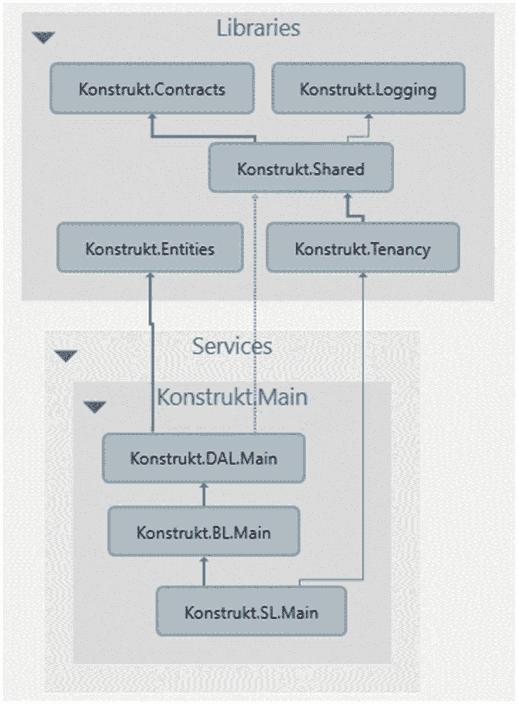

图 3-2

SL。主依赖图

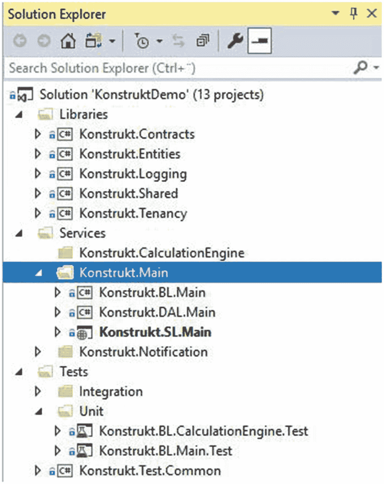

图 3-1

项目结构

## 准备项目

当我们进行分析时，我们希望噪音尽可能小。我们当然也不想对我们不使用的依赖项做任何无意义的分析和规划。因此，我们将移除未使用的成员、类型和引用。但是在我们继续这样做之前，我们将首先升级项目，并以。NET 框架。

### 重定向

您可能需要更新 Visual Studio 以适应新的框架。如果您在“属性”“➤应用”“➤目标框架”下没有看到您要作为目标的框架版本，请检查 Visual Studio 更新，运行它们，然后打开 Visual Studio 安装程序并确保安装了目标框架。

通过在解决方案资源管理器中右击项目节点并选择“属性”,可以重定目标。在应用选项卡下，您可以更改目标框架，如图 [3-3](#Fig3) 所示。

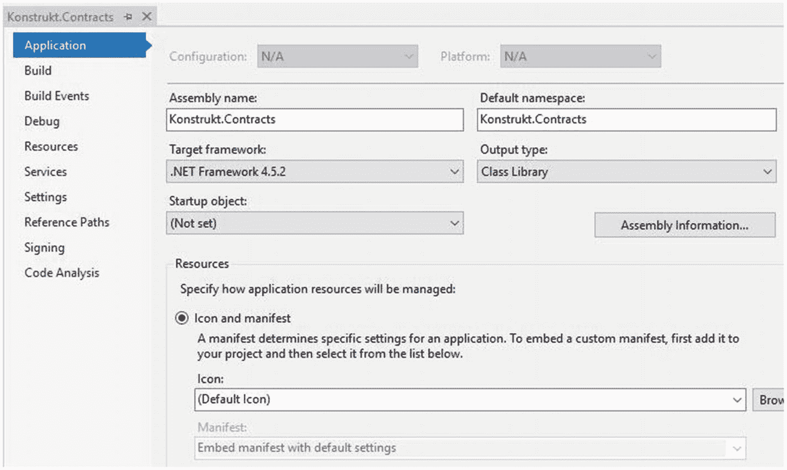

图 3-3

Konstrukt 的属性。合同库

您也可以通过卸载项目并在 csproj 文件中更改 TargetFrameWorkVersion 来完成此操作。我喜欢 ASP.NET Core 的一个小细节是，和其他的一样。NET 核心项目，您不必先卸载项目来编辑项目文件——您只需打开它。您还会注意到项目文件要干净得多——因此也更容易处理。根据你有多少个项目，改变每个项目可能是一项很大的工作，我想推荐一个扩展，你可以用它来一次重定目标。我更愿意以最新的框架版本为目标，但是如果这不是你的选择，那么至少要以 6.2 为目标。

为了重定向项目，我们将使用 Pavel Samokha 的目标框架迁移器。关闭 Visual Studio，从 [`https://marketplace.visualstudio.com/items?itemName=PavelSamokha.TargetFrameworkMigrator`](https://marketplace.visualstudio.com/items%253FitemName%253DPavelSamokha.TargetFrameworkMigrator) 下载扩展。

选择目标框架，以及您想要重定目标的项目，并等待几分钟。如果下拉菜单中缺少目标框架，您可以手动将其添加到扩展使用的 frameworks.xml 文件中。该文件可以在用户 AppData/Local 文件夹的 extensions 下找到(图 [3-4](#Fig4) )。例如，下面是我的路径:% local appdata % \ Microsoft \ visual studio \ 15.0 _ 3 eebc 2 a 9 \ Extensions \ 0 uwpe 4cg . cv5

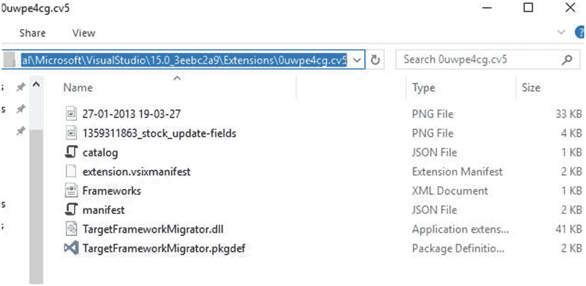

图 3-4

扩展所在的位置

修改 XML 文件，添加目标框架，如图 [3-5](#Fig5) 所示。

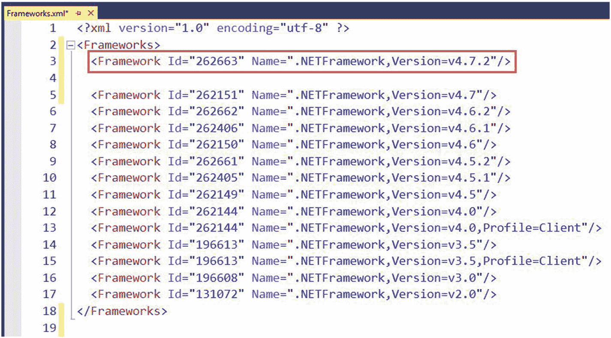

图 3-5

您可以通过添加名称和 Id 来添加框架

选择所有项目，然后单击“迁移”。您可以在编辑项目文件时跟踪进度(图 [3-6](#Fig6) )。

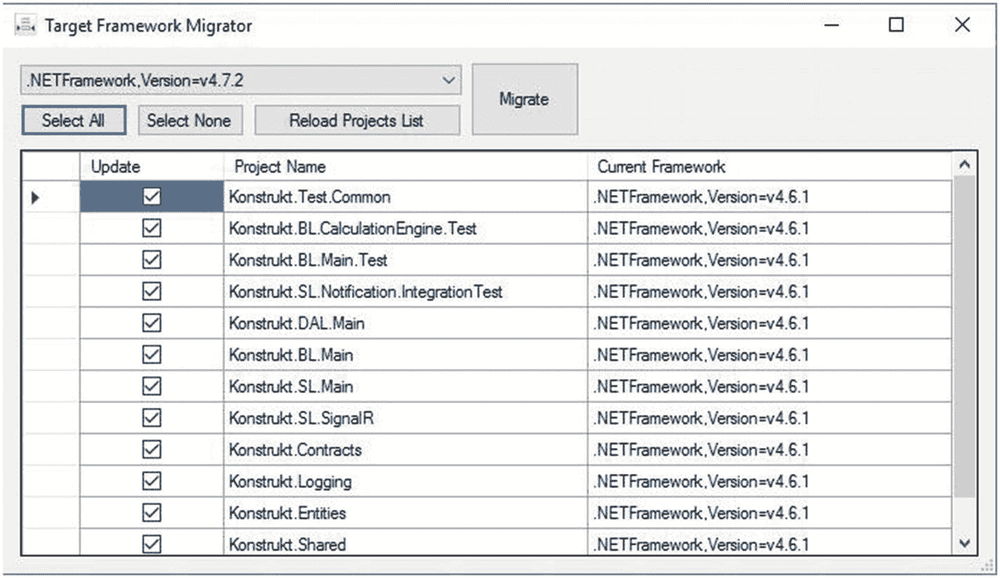

图 3-6

visual studio 中的目标框架迁移窗口

编译并运行您的测试(图 [3-7](#Fig7) )，确保一切都按预期编译并运行。我们的单元测试使用 NUnit，因此需要 NUnit 测试适配器。由于 Visual Studio 更新后的回归错误，我还需要禁用以下扩展:测试资源管理器的 Dotnet 扩展。在撰写本文时，这个问题尚未解决，建议的解决方案是禁用测试资源管理器的 Dotnet 扩展。另一种方法是使用 ReSharper 的单元测试运行器——我们将在分析中使用这个扩展。

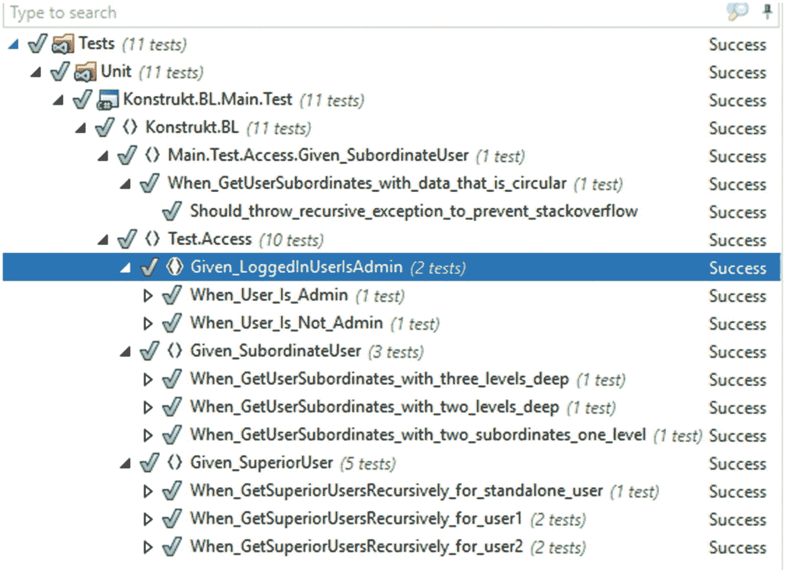

图 3-7

运行单元测试

我们的下一步是移除未使用的类型、成员和引用。我们将使用我们在前一章安装的 ReSharper 扩展，正如我提到的，如果您没有许可证，只需获取 30 天的试用期。

### 注意

如果您使用 Git 进行版本控制，或者至少使用解决方案的副本，请确保您已经创建了一个单独的分支来进行分析。最好在每一个主要步骤之后提交，这样你就可以在出错时撤销。

### 移除未使用的类型和成员

从技术上来说，你不必真的做这一步，但它不需要很长时间，可以简化以后的事情。这是我们无论如何都应该时不时做的事情，这是一个绝佳的机会。对于遗留的应用和库，随着时间的推移，您经常会发现没有使用的类型或成员，所以首先快速检查一下是值得的。这些又可能引用程序集，我们只想根据我们正在使用的程序集、类型和成员来分析这种迁移需要多少工作。

### 小费

进行这种清理还有另一个好处——可维护性指数可能会更好，因为依赖性通常会增加版本和升级的复杂性和问题。

如果您右键单击一个项目(或解决方案)并选择`Analyze` ➤ `Calculate Code`度量(图 [3-8](#Fig8) ，您将获得项目可维护性指数以及其他指标，如圈依赖、继承深度、类耦合和代码行数(图 [3-9](#Fig9) )。

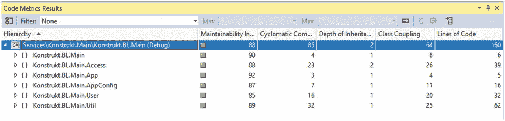

图 3-9

`Konstrukt.BL.Main`的代码度量结果

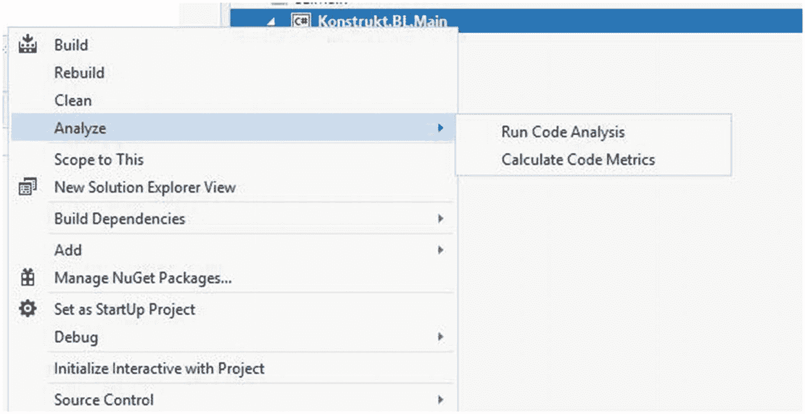

图 3-8

计算代码度量可以在项目的上下文菜单中找到

作为分析步骤的一个有趣的附加组件，为什么不继续获取代码度量并将它们导出到 Excel。整理参考资料后，您可以再次运行它并进行比较。

### 注意

维修性指数是由阿曼和哈格梅斯特于 1991 年提出的。该指标受到了严厉的批评，有许多论文和文章讨论了该指标的价值，其中许多强调了没有考虑其他可维护性指标，如命名、用于文档目的的注释、必要的复杂性、编译器如何解析 lambdas 以及其他因素。可维护性指数的计算方法如下:

可维护性指数= MAX(0，(171 - 5.2 * log(Halstead 卷)- 0.23 *(圈复杂度)- 16.2 * log(代码行数))*100 / 171)

安装并激活 ReSharper 后，在主菜单中选择 Resharper ➤检查当前项目中的➤代码问题(如果您的解决方案较小，则选择解决方案)(图 [3-10](#Fig10) )。

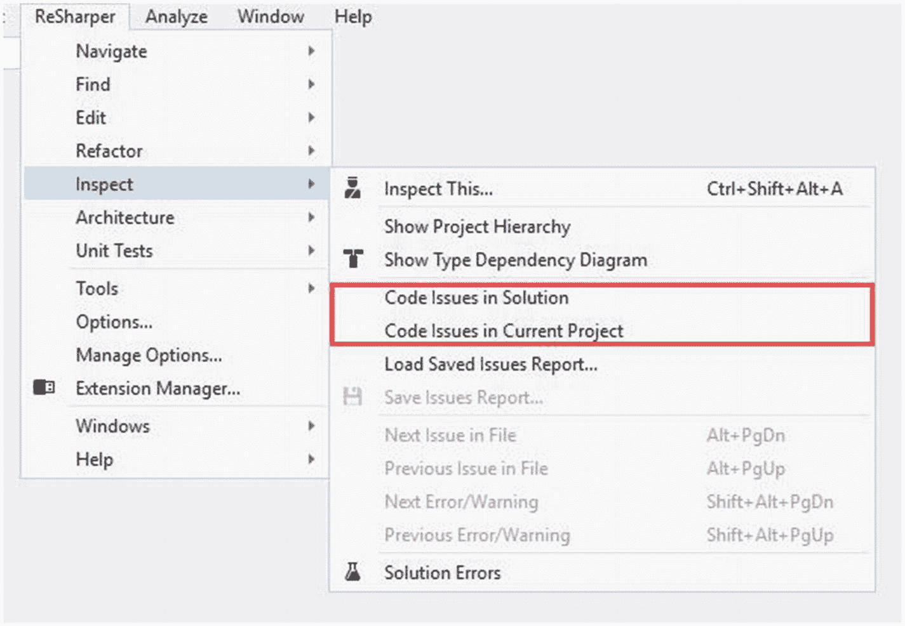

图 3-10

代码问题可以在 ReSharper 菜单中找到

按问题类型分组，向下滚动到如图 [3-11](#Fig11) 所示的“从不使用类型或成员”。图 [3-12](#Fig12) 显示了应用过滤器的结果。

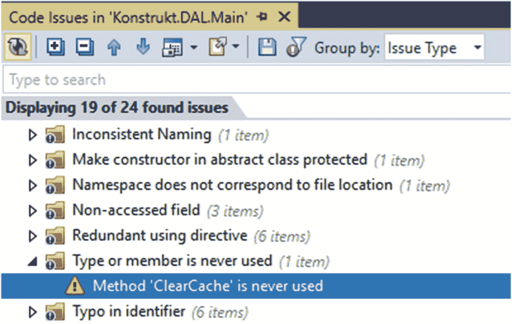

图 3-12

示例结果

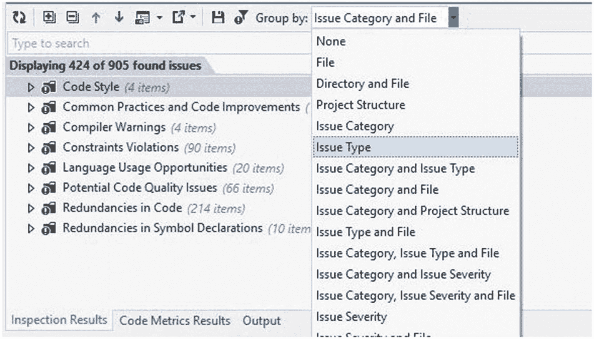

图 3-11

问题可以按问题类型分组

如果我导航到 ClearCache 方法，ReSharper 建议我移除 ClearCache 方法，这也将从接口中移除该方法。我也可以选择注释掉未使用的方法——我个人不太喜欢这样，因为我们有源代码控制，所以我将删除它。总共有 176 个类型和成员从未在示例解决方案中使用过——它们可能会保留对与我们的迁移不兼容的程序集的引用。如果您使用依赖注入和程序集扫描进行自动连接，那么在删除未使用的类时要小心，因为使用 Inspect 工具可能会得到误报。

一旦我们完成了这些，我们就可以以类似的方式继续分析引用程序集。

### 移除未使用的引用

为了避免在进行装配分析时出现误报，让我们继续并移除未使用的引用。这和前面提到的一样容易做到——除非您动态加载程序集。ReSharper 可能会意外删除正在使用的程序集——所以测试对于确保我们不会删除重要的引用非常重要。如果您知道您正在动态加载程序集，或者您不确定，请小心移除程序集。制作一个副本，或者更好，如前所述，使用源代码控制并在两次更改之间提交。

由于我们需要细粒度的控制，我们将围绕主项目及其依赖项一次做一个项目。在下面的例子中，我将使用 BL。主项目。

选择一个项目，选择`ReSharper` ➤ `Find` ➤ `Optimize References`或按`Ctrl+Alt+Y`(图 [3-13](#Fig13) )。

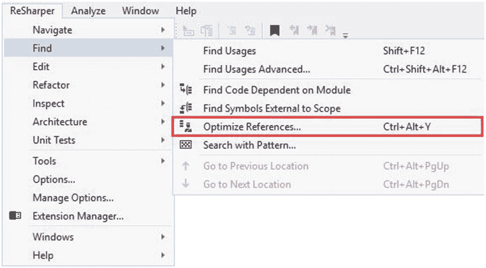

图 3-13

优化引用可以在 ReSharper 菜单中找到

结果将根据结果显示不同的组。例如(图 [3-14](#Fig14) ):

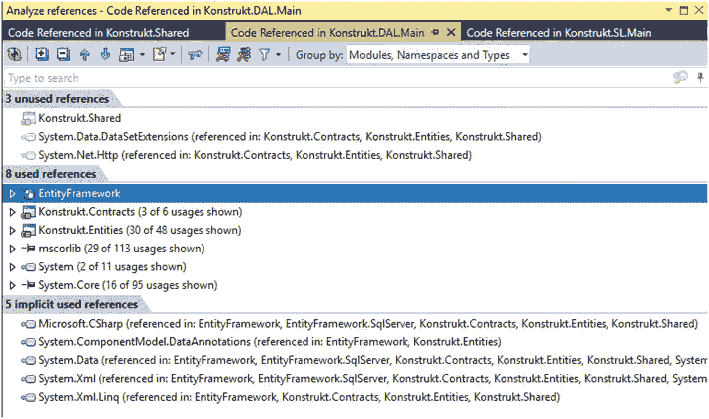

图 3-14

数据层项目的示例结果

*   未使用的参考

*   使用的参考

*   隐式使用的引用

*   具有已用依赖项的未使用的包

我们将通过选择`Analyze References`窗口菜单中的`Remove unused references`图标来移除未使用的参考。当它们被删除时，ReSharper 也会删除项目中多余的名称空间导入指令。

让我们看看另一个项目。共享项目(图 [3-15](#Fig15) )。

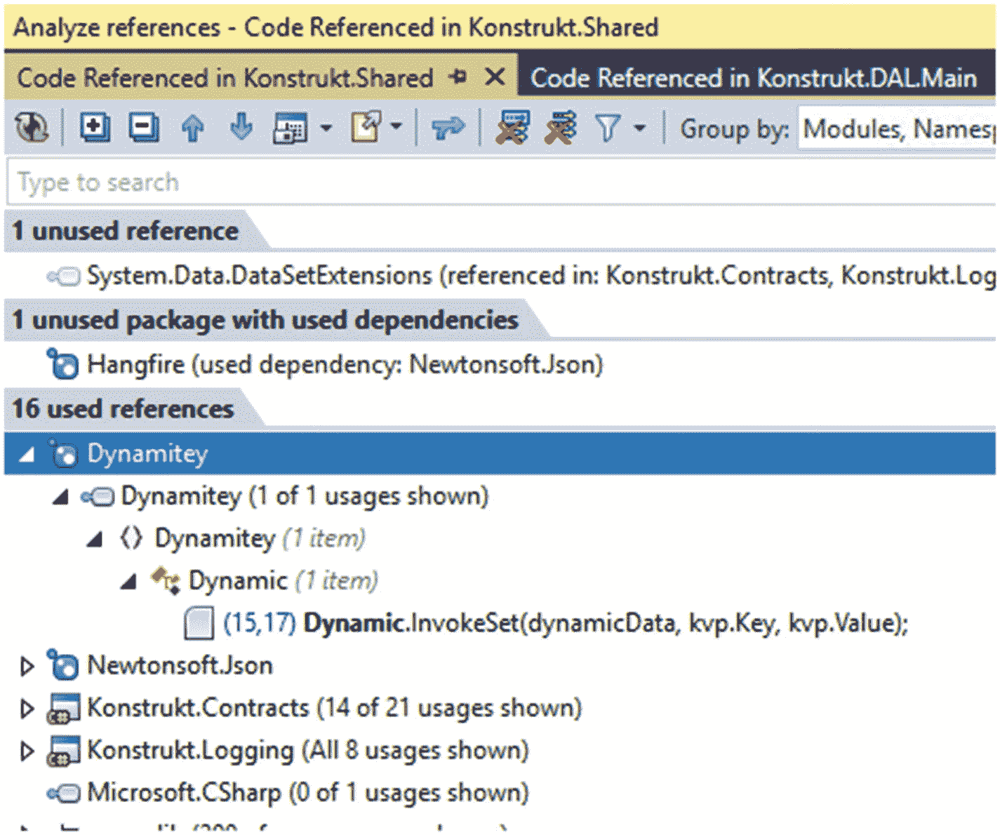

图 3-15

共享项目的示例结果

在 used references 选项卡中，我们将查看是否有不常用且可以轻松移除的程序集。

对于这个项目，有一个只使用一次的库`Dynamitey`(我稍后将回到这个库)——可能值得看看用法并决定我们是否需要这个库。我将暂时把它留下。如果您有一个程序集，上面写着“显示 0/X 的使用”，那么您可以使用 ReSharper 来查看依赖于该程序集的代码。在`Solution Explorer`中定位项目，在`References`下找到有问题的参考，选择`Find Code Dependent on the Module`(图 [3-16](#Fig16) )。示例结果如图 [3-17](#Fig17) 所示。

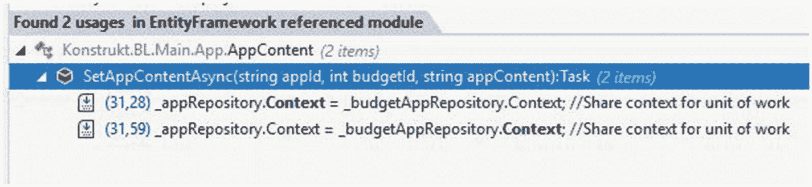

图 3-17

示例结果

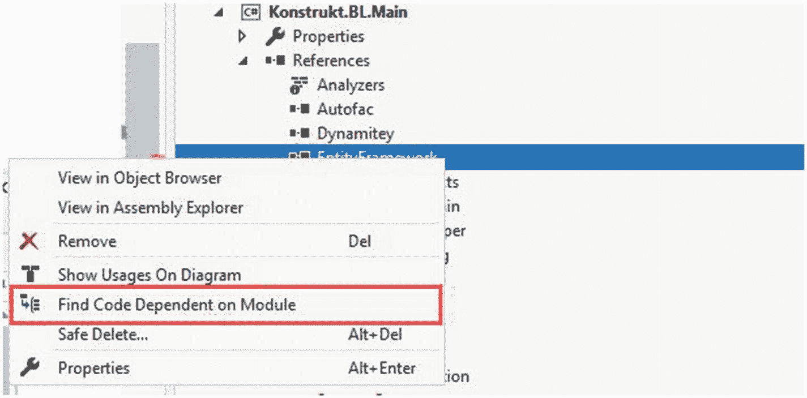

图 3-16

如果安装了 ReSharper，可以在项目上下文菜单中找到依赖于模块的代码

这些信息可以帮助您判断该程序集是否重要，是否可以被替换或删除。

对所有项目重复前面的步骤，确保清理和构建解决方案，并在每次修改后再次运行测试。记笔记，并按项目和/或名称空间组织它们。当我们运行可移植性分析器时，我们将需要下一部分的注释。

我们终于可以运行`.NET Portability Analyzer`工具了。有一个 Visual Studio 的扩展以及一个单独的命令行工具可供您使用。后者在撰写本文时并不是最新的，有一些错误，尽管我们可以下载 GitHub 库并构建一个更新的版本，但我们将使用扩展来代替。扩展可以在这里下载: [`https://marketplace.visualstudio.com/items?itemName=ConnieYau.NETPortabilityAnalyzer`](https://marketplace.visualstudio.com/items%253FitemName%253DConnieYau.NETPortabilityAnalyzer)

关闭 Visual Studio 并安装扩展，然后再次打开 Visual Studio。选择一个项目并调出上下文菜单(右键单击)。选择`Portability Analyzer Settings`，如图 [3-18](#Fig18) 所示。

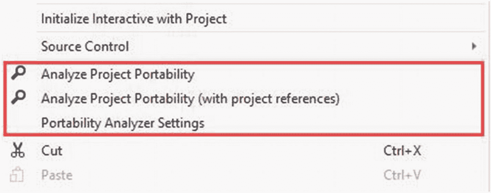

图 3-18

可移植性分析器选项可以在项目或解决方案的上下文菜单中找到

正如我们感兴趣的。网，。NET Core (2.1)以及。NET Standard 2.0，我们将选择它们。关闭设置窗口，再次调出菜单，这次为 SL 选择`Analyze Project Portability (with project references)`。主项目。我们选择项目引用的原因是，我们希望从整体上分析项目的可移植性——包括它所具有的依赖关系——正如我们在本章前面的依赖关系图中所看到的，服务层位于树的最高层。分析应该相当快，并产生一个结果 Excel 表以及相当多的新行在`Error List`窗口。我们将使用`Error List`窗口中的表单和信息(图 [3-19](#Fig19) )。

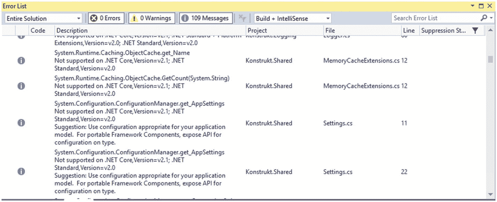

图 3-19

示例结果

让我们从 Excel 表开始。Excel 表格由三个选项卡组成:

*   可移植性摘要

*   细节

*   缺少程序集

### 可移植性摘要

在第一个选项卡中，我们得到了一个高层次的概述(图 [3-20](#Fig20) )。

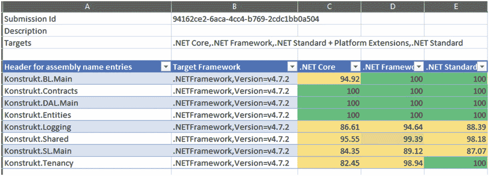

图 3-20

分析 Excel 文件中的摘要选项卡

看起来我们对主要服务的业务层有了好消息。只有少数依赖项缺乏可移植性。网络核心:`Konstrukt.Logging`库、`Konstrukt.Share, Konstrukt.Logging`、`and Konstrukt.Tenancy`。

`Konstrukt.Tenancy`似乎不太兼容。净标准比。NET 核心，这是可疑的考虑结果。NET 核心。可移植性分析器并不完美，如果它不能解决依赖关系，它们就不会被分析，并且会产生假阴性。所以，我们直接去`Missing Assemblies`选项卡看看吧。`Konstrukt.BL.Main`和参考库缺少的程序集是

*   汽车保险公司

*   炸药

*   实体框架

*   Log4Net

*   微软。应用洞察

*   微软。practices . enterprise library . transientfaulthandling . data

“Used By”是空的，但是我们可以通过在解决方案资源管理器中使用 Search 找到它是哪个项目，然后像前面一样“查找依赖于模块的代码”。

`TransientFaultHandling`用于将租户映射到正确的数据库`Konstrukt.Tenancy`的项目中。我写了这个库，我知道它使用的是`ReliableSQLConnection`类型。我们自己编写重试策略应该不会有很多工作。作为一个例子，我们也可以使用开源库，比如 Polly。净标准 1.1。Polly 可以在这里下载: [`https://github.com/App-vNext/Polly`](https://github.com/App-vNext/Polly)

让我们一个接一个地检查剩下的部分。

#### 汽车保险公司

Autofac 是一个依赖注入库，经过快速搜索，我可以确认它可以很好地工作。NET 核心。

#### 炸药

这是一个旧的开源库，用于处理动态对象。最近它在 GitHub 上很安静，我们真的应该消除对它的依赖。你还记得之前的事吗？它只在一个项目中使用过一次。让我们再来看一下，来衡量写出对动态库的依赖性的工作量。下面是一个用法示例:

```cs
        public static void SetFieldName(this IList<dynamic> data, string fieldName, string fieldValue)
        {
            if (data.Count==0) return;
            foreach (var dataItem in data)
            {
                Dynamic.InvokeSet(dataItem, fieldName, fieldValue);
            }
        }

```

我们似乎主要在`Dynamic`型上使用`InvokeSet`和`InvokeGet`。这两个成员使用动态语言运行库(DLR)动态调用 set 和 get 成员。我们自己也能做到。我们还需要一些测试，所以需要做一些工作。

#### 实体框架

`EntityFramework(EF)` `,`一种流行的 ORM。NET mapper 是一个完全不同的故事——我们大量使用它，即使我们想删除它，如果不进行重大的重写，我们也无法做到。有。NET Core 版 EF——但是 EF Core 是对 EF 的完全改写，两者有很多显著的区别。不应该认为是升级。如果你一直在使用 EDMX 模型，就像我们一样，那么就有更多的工作要做。除了迁移本身之外，您应该预料到测试会花费很多时间。行为是不同的，在测试所有方面之前，您可能不会发现问题。

总而言之，关于实体框架，您有三种选择:

*   迁移到 EF 核心

*   使用不同的 ORM(我们在一些新的。核心服务网)

*   迁移到 ASP.NET Core，但以整个框架为目标

只要针对全框架，也可以并排做一个，两个版本都运行:EF Core 和 EF6。

### 小费

看看 MSDN 上的功能对比图，以及 GitHub 上最新的路线图。你可以在这里找到它们: [`https://docs.microsoft.com/en-us/ef/efcore-and-ef6/index`](https://docs.microsoft.com/en-us/ef/efcore-and-ef6/index) 和 [`https://docs.microsoft.com/en-us/ef/core/what-is-new/roadmap`](https://docs.microsoft.com/en-us/ef/core/what-is-new/roadmap)

经过讨论后，我们同意了一种方法，其中一些服务将针对全部。NET Framework，直到我们可以迁移到 EF Core，并用一个更精简的选项(比如服务中的`Dapper`)替换 EF，在这些服务中，除了对象映射之外，我们并不真正使用 EF。

#### Log4Net

在撰写本文时，它还没有实现。NET Standard 2.0，从以前的问题来看，似乎只有文件日志可以在早期版本中使用。另一方面，它将是一个很好的替代品——因为我们已经抽象出了日志记录，所以我们不应该做太多的工作。

#### 微软。应用洞察

Application Insights 是 Azure 为应用监控提供的服务。它由强大的分析工具和一种叫做 Kusto 的查询语言组成。我们将其用于性能监控、主机诊断、错误监控等。我们希望继续使用这个应用性能管理(APM)工具，因为我们还没有找到任何替代方案来实现我们的目标。谢天谢地微软。ApplicationInsights 在 nu get:Microsoft . application insights . aspnetcore 上有一个. NET 核心版本。

### 详细信息选项卡

让我们转到细节选项卡，如图 [3-21](#Fig21) 所示。这会给我们提供详细的信息。对于任何给定的程序集，您将能够看到哪个类型和/或成员不受支持。在 Visual Studio 的`Error List`窗口中，作为`Messages`下的信息行，您可以获得更多的详细信息——并直接转到有问题的文件和位置。

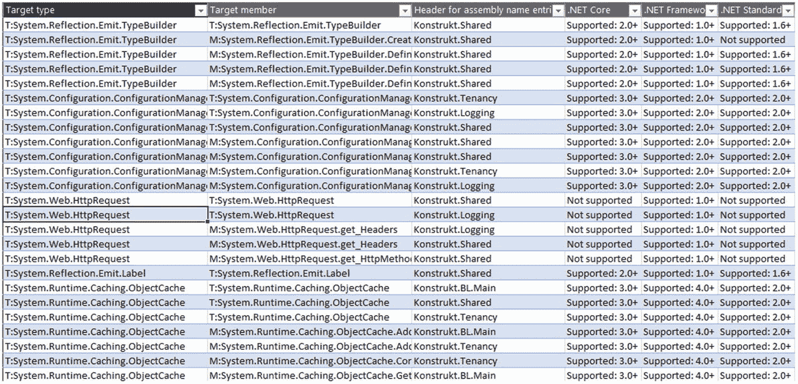

图 3-21

Excel 分析文件中的详细信息选项卡

Let’s move on to the

这个清单很长，但如果我们仔细看看，它并不那么令人生畏。清单上的主要问题类型有

*   超高速缓冲存储系统

*   上下文对象

*   SQLClient(一些不支持的成员)

*   ExceptionHandlerContext

经过一些调查，我们可以得出以下结论。

缓存将需要一些重写。为了。NET 标准有`Microsoft.Extensions.Caching.Memory`，但是成员有很大的不同，我们将不得不重写我们的缓存管理。这需要一些工作，但可行。`ASP.NET Core MemoryCache`不同于。NET 程序集。可用的成员更少，并且不能迭代缓存项。我们可以探索其他的选择，但是现在`Microsoft.Extensions.Caching.Memory`似乎是一个足够好的替代者。

在 ASP.NET Core 区已经不能直接进入了。相反，我们将通过依赖注入来注入上下文。这根本不需要太多的工作，并且是改进我们代码的简单方法。

`SQLClient`有一些成员不被支持，但微软团队一直在积极解决这个[问题](https://github.com/dotnet/corefx/issues/17126)，通过一些临时的变通办法，我们应该能够没有太多麻烦地解决这个问题。

对于 ASP.NET Core 中的全局异常处理，我们需要实现一个中间件。没有多少工作，但它需要一些测试。

### 总结迁移 Konstrukt 所需的工作。BL.Main 及其依赖项

`Konstrukt.BL.Main`及其依赖项总体上与兼容。NET 标准 2.0 以及。网芯 2.0。需要做一些工作，比如替换日志库，删除 Dynamitey 库并用我们自己的库替换，可能迁移到 EF Core 或其他 ORM 库，重写和抽象我们的缓存逻辑，修改异常处理，注入 HTTP 上下文而不是直接使用它。如果我不得不猜测的话，我会说两个开发人员需要 2-3 天的时间来实现这些变化并进行彻底的测试，另外还需要一两天的时间来完成使用 EF 的数据访问逻辑。

我的同事乔纳斯总是告诉我，然后用圆周率乘以我的估计。我不相信这是获得估计的最佳方式——但他说的对，开发人员往往低估了工作量(经常忘记考虑调试回归错误、随机窗口和 Visual Studio 更新等所需的时间)。).集成和部署管道也需要更新，这可能需要时间。显然，我已经完成了这项工作，可以告诉你它实际上花了多少时间。举个例子，我花了一周的时间迁移主服务(不包括迁移 EF)。为所有新变化修改管道需要 2-3 天。

### 与 ICanHasDot.Net 一起分析

[ICanHasDot。Net](https://icanhasdot.net/) 是由 Octopus Deploy 提供的 web 服务。你提供一个包文件，然后服务递归地查找所有的包，找出所有的依赖，直接的和传递的(间接的)。然后，它检查程序集与。NET 标准或 PCL(可移植类库)。如图 [3-22](#Fig22) 所示，它给出了一个清晰的概览和一个漂亮的可视化。结果摘要建议替换库，并为更容易使用进行了颜色编码。

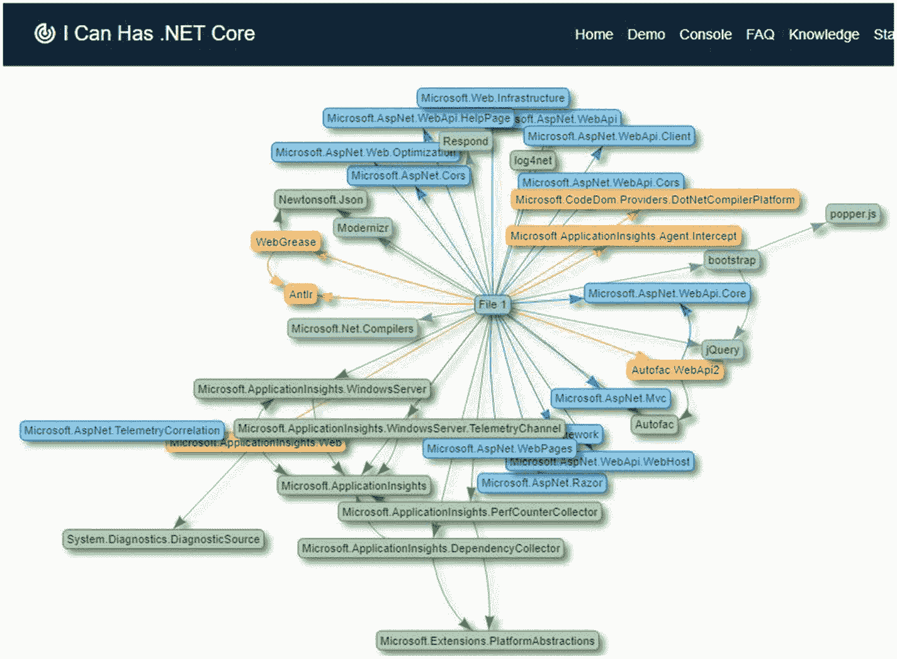

图 3-22

Konstrukt 的分析。SL .主要

但是 GitHub repo 最近很安静，所以我开始使用核心团队的工具作为我分析项目可移植性的主要工具。使用该工具快速浏览项目，但是我建议您将核心团队的工具作为兼容性信息的主要来源。

### 分析解决方案的其余部分

为了简单起见，我不会给你分析其余项目的总结结果，因为结果与我们之前得到的结果相似，只有几个例外。

我们有两个很难迁移的服务。其中之一是我们的 Hangfire 服务，它不包括在示例解决方案中。Hangfire 是一个用于 Windows 的队列管理器——它可以让您设置队列，对短期或长期运行的 CPU 或 I/O 密集型任务进行队列管理。Hangfire 不支持。NET 标准，但我们仍然有一些选择。一种选择是保持 Hangfire 服务不变，不迁移该服务。另一个选择是用别的东西代替 Hangfire。我们使用 Hangfire 的方式是使用它来调度对其他服务的 API 调用，这些服务将启动诸如计算和数据聚合之类的任务。对于我们的场景，我们可以用消息总线和一些基础设施代码来替换 Hangfire 因为我们计划在系统中添加消息总线，所以我们可能会这样做。但是现在，我们已经决定让这个服务保持原样，专注于其他服务。Hangfire 迁移不是我在本书中要讨论的内容。

第二个挑战，也是比 Hangfire 更大的挑战，是我们的通知服务。我们的通知服务做的不多，但它做的几件事很重要。该服务使用 SignalR 来启动 WebSocket 连接，以更新和通知客户端发生的变化，反之亦然。SignalR 与 ASP.NET Core 不兼容。我看到有人试图让它与 ASP.NET Core 的完整框架一起工作，但 SignalR 团队不鼓励这样做。SignalR 已经完全改写为 ASP.NET Core SignalR(不要与 SignalR 核心混淆，后者是 SignalR 的一部分)。NET 框架)。SignalR 有一个客户端和一个服务器，你需要更换两者，这意味着我们也需要改变我们的客户端。本书不会涵盖 SignalR 服务的迁移，因为该主题值得单独成书。

### 关于成本的说明

在您决定迁移之前，明智的做法是考虑迁移的成本——根据您团队的规模和设置，这可能包括 CTO、项目经理，甚至可能包括投资者。你应该警惕所谓的“简历驱动开发”

“简历驱动的开发”是指开发人员和/或架构师根据简历上的好看之处来选择技术栈、架构、方法和协议。通常这不一定是在考虑简历的情况下完成的，但我们会感到无聊，自然会喜欢新的和性感的东西，并且很容易跳到下一个新的闪亮的堆栈、库或方法上。信息应该推动决策，不幸的是，我不能告诉你它是否值得，因为它取决于几个因素。不过，我已经尽了最大努力来强调这些因素，并为您提供信息和工具来收集您需要的信息。在您做出最终决定之前，还有一件事需要讨论，那就是如果您进行迁移，该如何进行迁移。部分还是全部？部分迁移可能不那么痛苦，并且可以让您进行试验，但是同时，它增加了复杂性。在下一章，我们将开始计划，看看这个计划是否站得住脚。

### 摘要

在本章中，我们进行了深入的分析，并收集了迁移所需工作的数据。我们已经得出结论，迁移是可行的，但在得到明确的是或否之前，我们还没有决定如何迁移。我们知道，我们有一些服务将更难迁移，如果我们想运行 ASP.NET Core，我们将需要重做我们的数据访问层的一部分。NET 核心。此时，我们对所需的工作有了一个相当好的想法，在下一章中，我们可以开始计划我们的迁移。