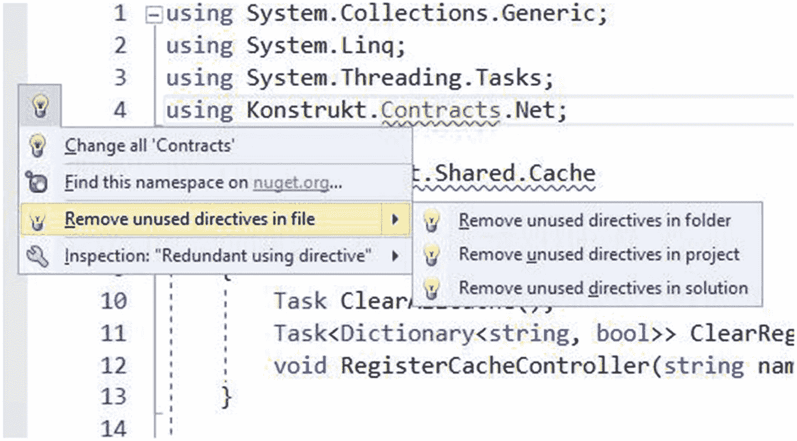
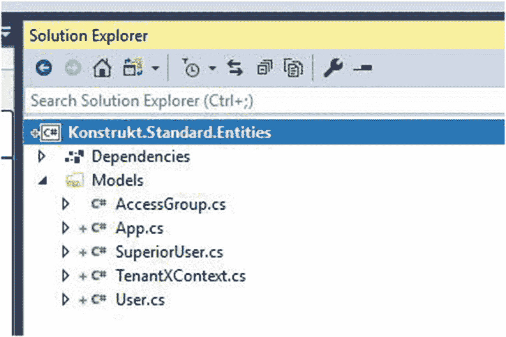

# 五、第三阶段：迁移

我已经参与了许多不同类型的迁移和重写——似乎大多数开发人员迟早都会遇到类似的情况。随着技术的发展，用户的期望也在迅速改变，随着编程变得越来越流行，可供选择的库和平台也在不断增加。迁移不仅很有诱惑力，因此我们可以尝试新的解决方案，而且经常需要跟上期望和不断增长的技术堆栈。我见过一些迁移非常糟糕，它们的共同点是缺乏规划和不明确的最终目标。幸运的是，我们已经做了广泛的分析并计划了迁移。这有助于我们创建一个路线图，我们可以参考，这样我们就知道我们在哪里，我们要去哪里。

这些是我根据您的最终目标推荐的迁移步骤。

## 完全迁移

创建 ASP.NET Core 项目以及你可能有的库(不是第三方)。如果你的目标是全部。或者如果您想通过。NET 框架库，那么我的目标是。净标准。。NET 标准给你更多的自由，但也给你更多的工作。

创建单元和集成测试项目。如前所述，如果您计划通过。NET 框架库(以及。NET Core)，那么您将不得不针对您支持的所有平台进行测试。特定平台不支持的方法和类型将抛出 PlatformNotSupportedException，这将帮助您尽早发现问题。我将在本章的后面详细介绍如何做到这一点。

给定一个简单的设置，包括一个 web 服务、一个库和一个单元测试库，您的目标将是下面的最终结果(图 [5-1](#Fig1) )。


图 5-1

简单设置的完整迁移的目标是什么

如果您有几个 ASP.NET 服务，我会从其中一个开始，迁移自己的依赖项，然后解决第三方的依赖项。我没有特别推荐的顺序，但是如果您的应用是数据库驱动的，那么从数据访问层开始是一个好的起点。否则，从对第三方依赖最少的库开始。

之后，我将继续迁移测试项目，测试您迁移的库中的逻辑，然后迁移 ASP.NET 服务和测试 ASP.NET 服务中的逻辑。

### 注意

使用依赖关系图(见图 [5-3](#Fig3) 中的例子)来可视化依赖关系，这样你就知道依赖关系是什么。例如，ReSharper 在解决方案资源管理器上下文菜单中添加了一个选项来显示项目依赖关系图。

对他们拥有的其他服务和依赖项进行清洗并重复。

### 部分迁移

完全迁移和部分迁移的主要区别在于，您需要确保迁移的依赖项被未迁移的其他库或服务使用，并且仍然可以按预期使用和工作。您也可以选择分离服务或库的一部分，并且只迁移那部分，并且您将必须为所有的目标平台运行测试。对于部分迁移，您还必须维护一个混合的持续集成和部署管道。我将带您经历的迁移(图 [5-2](#Fig2) )是部分迁移，因为它更具挑战性。除了额外的考虑，我们所做的一切也适用于完全迁移。


图 5-2

部分迁移的示例

### 部分迁移演练

让我们回顾一下我们将要迁移的内容以及我们想要实现的目标。目前，解决方案有三个服务，五个库(我们自己的)，一些单元测试库，和一个测试库的助手库，如图 5-3 左侧所示。最终目标可以在右边看到(图 [5-3](#Fig3) )。


图 5-3

左侧显示了示例解决方案的起点，右侧显示了迁移后的结果

在本演练中，我们将迁移主服务，它依赖于我们不会迁移的其他服务所使用的库。

我总是建议查看依赖图，以便更好地理解事物之间的联系。有时一个服务有什么依赖关系并不明显，因为一个图可能很深。依赖图也帮助我们找到一个好的起点——通常在图的外部边缘。图 5-4 向我们展示了 Konstrukt 的依赖图。SL .主要服务。如果安装了 ReSharper 插件，可以通过在 Visual Studio 的解决方案资源管理器中右键单击某个项目来获得依赖关系图。


图 5-4

Konstrukt。SL .主依赖图

根据依赖关系图，我们将从具有最少第三方依赖关系的外部依赖关系开始进行迁移，然后朝着 ASP.NET 服务本身(包括单元测试)前进。

高级概述:

每个库都迁移到新的。NET 标准(服务本身除外)库。对旧库的引用随后被更新到新库，在确认一切都编译好了并且测试是绿色的之后，旧库被删除。对于每一个部分，我们都做一个 Git commit，这样如果出现问题，我们就可以很容易地恢复更改。只有当我们可以验证解决方案可以编译并且测试是绿色的时，我们才推送到原点。

步骤:

*   迁移 Konstrukt。契约

*   迁移 Konstrukt。分享

*   迁移 Konstrukt。记录

*   迁移测试。普通

*   用新测试运行旧测试。公共图书馆

*   删除旧测试。公共图书馆

*   尝试迁移测试库

*   迁移 Konstrukt。租用

*   迁移 Konstrukt。实体(包括将实体框架迁移到实体框架核心)

*   migrate construction . from . main-移转建构

*   移转建构. BL.Main

*   迁移测试库

*   migrate construction . sl . main

### 迁移合同

合同库是第一个被迁移的。在开始之前，我们需要做出一个重要的决定，那就是如何组织代码。我们可以将项目保存在单独的解决方案中，或者保存在同一个解决方案中。对于这个例子，我们将在迁移时将它们保存在同一个解决方案中，但是我们将在本书的后面讨论使用几个解决方案文件的利弊。我们需要决定的第二件事是命名约定。不知何故，我们需要将新的库与旧的库分开，因为我们将有两个相似的库并排在一起，直到我们可以验证所有的东西都被正确迁移，我们无论如何都不能使用相同的名称。如您所知，在 Windows 上，路径可能会太长，所以如果项目驻留在嵌套文件夹中，您可能会遇到问题。与。网芯和。NET 标准项目，您可能会得到关于恢复包的神秘错误，如“操作失败，因为无法加载项目的详细信息”，而问题是路径。

例如，对于此次迁移，我们将为创建一个解决方案文件夹。NET 标准库，并用“标准”作为库的前缀。您可以在前面的解决方案前后对比中看到库和服务是如何组织的。我们开始吧！

创建新的项目目标。NET 标准放在一个名为 Libraries 的文件夹下。标准如图 [5-5](#Fig5) 所示。所有的项目都会。NET 标准项目，因为我们有其他。NET 图书馆和依赖它们的服务。唯一的例外是 ASP.NET 的核心服务。NET 核心和单元测试库。NET 平台和。NET 核心。


图 5-5

创建新的。网络标准库

删除 Class1.cs 文件，并复制旧合同项目中的文件。您可以复制一个文件夹、几个文件或所有文件。这完全取决于您，您可能需要权衡项目的大小以及文件之间的相互依赖程度。合同是一个小图书馆，所以我们将复制所有的文件和文件夹。

打开一个随机文件，在名称空间上设置标记，在名称空间下面应该有一条蓝色的曲线，然后打开 ReSharper 辅助工具(Alt+Enter)。选择移动到，并使用箭头选择调整项目中的名称空间(图 [5-6](#Fig6) )。如果它建议打开所有文件以便撤销，选择否(图 [5-7](#Fig7) )。


图 5-7

打开所有编辑过的文件可能会导致 Visual Studio 无响应


图 5-6

调整项目中所有命名空间的快捷方式

如果有很多文件，Visual Studio 可能会崩溃。取而代之的是 Git commit before and after，因为如果出现问题，您总是可以恢复最近的提交。

下一步是修复所有产生错误的东西，比如缺失的引用，在这个例子中这相当简单。打开错误列表窗口，过滤“当前项目”，并使用该列表作为指南(图 [5-8](#Fig8) )。


图 5-8

“错误列表”窗口具有筛选选项，如“筛选当前项目”

键盘快捷键 F8 将带您到列表中的下一个错误，而 Shift+F8 将转到上一个错误。

如果你停在一个红色的参考点上，在那个位置按 Alt+Enter 应该会调出 ReSharper 辅助对象。在建议中，你会看到“在 nuget.org 上查找此类型”(图 [5-9](#Fig9) )。有时这很有效，如果你想试一试，选择那个选项并滚动列表。


图 5-9

ReSharper 为 NuGet 搜索提供了一个快捷菜单

在列表中找到软件包后，单击+图标展开信息，并确保。支持. NET 标准(图 [5-10](#Fig10) )。如果是，单击下载图标并下载软件包。另一个选择是使用软件包管理器进行手动搜索。


图 5-10

软件包摘要通常会指定支持的平台

导入名称空间来解决引用错误，如果我们有更多的错误，我们将继续下一个错误。你应该知道的一件重要的事情是 ReSharper 喜欢在解决方案中添加对库的引用，而不是导入 NuGet 包。这意味着在您的项目文件中，您将对另一个库使用的库有一个硬依赖，通过物理路径链接。

Konstrukt。契约是一个非常简单的迁移的例子。它没有不支持的类型或依赖项，我们只需移动代码并重命名名称空间。

和 Konstrukt 一起。标准。合同汇编好了，我们现在要卸载 Konstrukt。通过右键单击项目并选择“卸载项目”来收缩项目(而不是删除它)这会导致许多错误，这些错误来自于依赖它的项目。我们将错误列表视为我们的待办事项列表。

Konstrukt。Share 是对 Konstrukt.Contracts 有依赖关系的项目之一。我们可以看到导入的名称空间是红色的，因为依赖关系无法解析。

对于项目，选择“参照”并删除 Konstrukt。合同并添加 Konstrukt。标准。合同代替。错误仍然存在，因为以前的名称空间与新名称空间不对应。我们可以用两种方法来解决这个问题。一种是使用“搜索和替换”，第二种是使用 ReSharper。

### 搜索和替换

调出搜索和替换(Ctrl+F，然后展开窗口)，将其设置为“当前项目”，并对 Konstrukt 进行搜索和替换。Konstrukt 的合同。标准合同(图 [5-11](#Fig11) )。


图 5-11

搜索和替换有助于加速向新名称空间的迁移

启用撤销会导致 Visual Studio 崩溃，如果我们改为执行 Git commit，我们可以跳过启用撤销并冒着 Visual Studio 暂时不响应的风险(图 [5-12](#Fig12) )。


图 5-12

打开所有编辑过的文件可能会导致 Visual Studio 的性能问题

### 使用 ReSharper 删除和导入名称空间

整理名称空间的第二种方法是使用 ReSharper。在红色参考上设置标记，调出助手，并选择“删除项目中未使用的指令”(图 [5-13](#Fig13) )。



图 5-13

ReSharper 有一个快捷菜单，用于删除未使用的名称空间

如果转到标记为红色的缺失类型，可以在项目中导入缺失的引用(图 [5-14](#Fig14) )。我要提醒您，只有在确保您拥有对该项目或该名称空间的 NuGet 包的引用之后，才能使用它。


图 5-14

还有一个导入缺少的名称空间的快捷方式

进行重建并验证一切正常。运行单元测试，如果可能的话，也运行服务，进行一些测试调用，并进行另一次 Git 提交。

下一步是替换解决方案中的所有库——除非您已经决定继续维护两个库(这不是我推荐的),也就是使用旧版本的地方。如果你右击 Konstrukt。合同项目，并在右键菜单中选择“查找依赖于模块的代码”，您将获得所有引用的列表。使用“项目结构”分组以获得良好的概述(图 [5-15](#Fig15) )。


图 5-15

按项目结构分组

我们还有四个项目需要修改:

*   建构. BL.Main

*   建构，从. Main

*   建构. SL.Main

*   建构. sl . signalr

我们将不得不重复前面的步骤，一次进行一个项目，并在每个项目之间进行 Git 提交。构建、验证没有错误、运行测试和运行服务。显然，这意味着大量的点击，因此我建议您为 Add Reference 指定一个快捷键。

在主菜单中，进入工具➤选项➤环境➤键盘，如图 [5-16](#Fig16) 所示。

将命令类型设置为 AddReference 并选择一个组合。我用了 Ctrl+Shift+Alt+R. Assign，你就可以走了。


图 5-16

您可以在键盘部分创建自己的快捷键

如果您愿意，也可以手动编辑项目文件。但是不要忘记在变更之间进行构建和测试，并经常提交。

验证 Konstrukt。合同在任何地方都没有被引用，删除它。打开文件资源管理器，确保项目确实被删除。从 Visual Studio 中删除通常只是将它从解决方案文件中移除，但是文件夹和项目仍然在那里，并且将在下次执行 Git 推送时被签入。保存所有文件，构建并运行测试，如果一切正常，提交。

Contracts 库很容易迁移，因为它没有任何不支持的依赖项或类型，但是通常您会遇到更多的挑战。因此，我们将以其他库为例，来看看一些具体的挑战。我不会一步一步地进行迁移，因为我们刚刚完成了迁移，步骤是相同的。如果您想看到所有的步骤，您可以看看我在存储库中的提交。在迁移其余部分时，我们遇到了几个挑战；以下是我将介绍的一些内容:

*   解析不支持的类型(例如 ConfigurationManager 和 HttpContext。当前)

*   删除不必要的依赖关系

*   解析不支持的库(例如 Log4Net 和 NLog)

*   在依赖选项之间选择(MemoryCache 示例)

一旦我们迁移了库，我们将继续迁移测试，然后是数据访问层和我们的对象关系映射器(实体框架)，最后迁移 ASP.NET 服务本身。

## 缺少类型:ConfigurationManager

标题有点误导，因为类型不再丢失。但它失踪了直到。NET 标准 2.0。我想包括这个例子，因为我们有几个关于如何处理访问配置设置的选项。在的早期版本中。NET Core 和 Standard，这种类型不可用。团队鼓励使用依赖注入来访问配置设置。

这是通过创建一个映射到您想要访问的设置的类来实现的，然后通过使用 IOptions <mycustomsettings>来访问这些设置。如果您决定在服务中使用 JSON 文件进行设置，那么依赖注入是一个更好的选择(一般来说，我会推荐使用依赖注入的特定类型)。否则，如果不想使用映射类，也可以使用 IConfiguration 接口和 GetSection 方法。在 Konstrukt。我们有一个设置类，用于访问配置文件中的设置。这个类可以重写为。NET Core 使用前面两个选项。然而，由于我们想要支持几个平台，我们需要一个通用的解决方案。之前。NET Standard 2.0，处理这个问题的两种方法是使用条件编译或依赖注入。但是幸运在我们这边，现在有一个我们可以使用的 NuGet 包，所以我们现在要使用它。</mycustomsettings>

我们总是可以在以后的某个时间点返回并重构掉这种依赖和暂时的依赖。如你所见，有几个。

请记住，你必须选择你的战斗，有时一个不太理想的选择是最好的，因为有其他紧迫的问题需要花费大量的时间。同时，您不希望维护不必要的依赖关系。

## 重写以避免不必要的依赖

共享库有一个扩展方法 ToDynamicObject，它使用了一个直到最近还不支持的库。网络标准-动态。这种支持是一年前添加的，但在此之前已经有好几年没有维护了。如果我们只使用一个库的很小一部分，并且这是我们自己可以做的事情，我宁愿不依赖它。关于一个叫做 Pad-Left 的 Node.js 包有一个有趣的故事。它只有几行 JavaScript 代码，而且它所做的就是——你猜对了——左填充。它在任何地方都被使用，当作者从 NPM 取出包裹时，互联网中断了一天。为了一些非常简单的事情而拉进一个库，现在我称之为“左补”依赖性越少，迁移就越容易，而且，在进行更新时，可以避免突然的重大变化。

在我们的例子中，InvokeSet 仅用于从字典创建动态对象，并且可以从

```cs
        public static dynamic ToDynamicObject(this Dictionary<string, object> data)
        {
            dynamic dynamicData = new ExpandoObject();
            foreach (var kvp in data)
            {
                Dynamic.InvokeSet(dynamicData, kvp.Key, kvp.Value);
            }
            return dynamicData;
        }

to

        public static dynamic ToDynamicObject2(this Dictionary<string, object> data)
        {
            IDictionary<string, object> dynamicData = new ExpandoObject();
            foreach (var kvp in data)
            {
                dynamicData.Add(kvp);
            }
            return dynamicData;
        }

```

不要害怕重写，但是一定要确保你有足够的测试！正如我之前提到的，明智地选择你的战斗。

### 缺少类型:HttpContext。目前的

我们养成了在库中传递 HTTP 上下文的坏习惯。它创建了硬依赖，如果我们使用几个线程并丢失了原始的线程上下文，可能会导致额外的问题，以及许多其他问题。

从其他库中访问 HttpContext 并不是一件理想的事情；HTTP 上下文实际上应该局限于服务本身，在外部库中传递它会创建一个混乱的体系结构。这就是为什么你不会发现这种类型的 ASP.NET Core。相反，通过使用依赖注入和接口 IHttpContextAccessor，可以通过 HttpContextAccessor 类型来访问 HTTP 上下文。可以找到一些难看的变通办法，这样就可以继续使用 HttpContext。目前(某种程度上)，但是让我向您展示用依赖注入来解决我们的问题是多么容易。这是我们需要重构的类:

```cs
public class CurrentRequest : ICurrentRequest
{
    readonly Regex _subDomainRegex = new Regex(@"^(https?:\/\/)?([^\.]+)", RegexOptions.Compiled);

    public string Origin =>
        HttpContext.Current.Request.Headers["X-Origin"] ??
        HttpContext.Current.Request.Headers["Origin"] ??
        HttpContext.Current.Request.Headers["Referer"];

    public string Authorization =>
        HttpContext.Current.Request.Headers["Authorization"];

    public string HttpMethod =>
        HttpContext.Current.Request.HttpMethod;

    public string SubDomain =>
        _subDomainRegex.Match(Origin).Groups[2].Value;
}

```

我们可以创建一个名为 IRequest 的接口:

```cs
public interface IRequest
{
    NameValueCollection Headers();
    string HttpMethod { get; }

}

```

然后将其注入到 CurrentRequest 构造函数中:

```cs
public class CurrentRequest : ICurrentRequest
{
    private readonly IRequest _request;

    public CurrentRequest(IRequest request)
    {
        _request = request;
    }
    readonly Regex _subDomainRegex = new Regex(@"^(https?:\/\/)?([^\.]+)", RegexOptions.Compiled);

    public string Origin =>
        _request.Headers()["X-Origin"] ??
        _request.Headers()["Origin"] ??
        _request.Headers()["Referer"];

    public string Authorization =>
        _request.Headers()["Authorization"];

    public string HttpMethod
        => _request.HttpMethod;

    public string SubDomain =>
        _subDomainRegex.Match(Origin).Groups[2].Value;
}

```

当我们使用它时，我们只需要有一个实现该接口的自定义类型，对于一个标准的 ASP.NET 应用，我们可以做以下事情:

```cs
public class SlimRequest : IRequest
{
    public NameValueCollection Headers() => HttpContext.Current.Request.Headers;
    public string HttpMethod => HttpContext.Current.Request.HttpMethod;
}

```

对于 ASP.NET Core 应用:

```cs
public class SlimRequest : IRequest
{
    private readonly IHttpContextAccessor _httpContextAccessor;

    public SlimRequest(IHttpContextAccessor httpContextAccessor)=>
        _httpContextAccessor = httpContextAccessor;

    public NameValueCollection Headers()
    {
        var collection = new NameValueCollection();

        foreach (var item in _httpContextAccessor.HttpContext.Request.Headers)
            collection.Add(item.Key, item.Value);

        return collection;
    }

    public string HttpMethod => 

_httpContextAccessor.HttpContext.Request.Method;
}

```

### 依赖选项:新的与旧的内存缓存

MemoryCache 是后来才被支持的类型之一。网芯和。净标准。图书馆系统。缓存有一个我们在 ASP.NET 习惯使用的 MemoryCache 对象。在 ASP.NET，核心缓存得到了更好的集成，并通过使用 IMemoryCache 服务来完成。支持不同的缓存，最基本的是 IMemoryCache，它支持任何对象值。服务返回的对象驻留在[微软。扩展。缓存。记忆](https://www.nuget.org/packages/Microsoft.Extensions.Caching.Memory)组件。那里的 MemoryCache 对象与我们习惯的系统中的对象有很大的不同。运行时。缓存程序集。

而微软的[。扩展。缓存。记忆](https://www.nuget.org/packages/Microsoft.Extensions.Caching.Memory)。推荐使用 MemoryCache，因为它可以更好地与 ASP.NET Core 系统集成。出于兼容性原因，在迁移时，Runtime.Caching.MemoryCache 可能更好。它们都与兼容。NET Standard 2.0–这意味着您可以在. NET Standard 2.0(及更高版本)库中使用，就像我们要迁移到的库一样。你可以在这里阅读更多关于这两个选项: [`https://github.com/aspnet/Docs/blob/master/aspnetcore/performance/caching/memory.md`](https://github.com/aspnet/Docs/blob/master/aspnetcore/performance/caching/memory.md)

在共享库中，我们有一个名为 MemoryCacheExtensions 的类。它有一个方法可以遍历 MemoryCache 对象并输出键。

```cs
public static CacheStatistics Statistics(this MemoryCache cache)
{
    return new CacheStatistics
    {
        Name = cache.Name,
        NumberOfObjects = cache.GetCount(),
        Items = cache.Select(s =>
        {
            var info = s.Key;
            var list = s.Value as IEnumerable;
            if (list != null)
                info += ", Count: " + Count(list);
            return info;
        })
    };
}

```

微软。扩展。缓存。内存。MemoryCache 不允许您遍历这些键(有些开发人员不同意这一点，但是团队已经决定不允许这样做)，因为键可能已经改变了。从使用的角度来看，这是有意义的，但是我们一直出于诊断的原因使用 Statistics 扩展，因为我们的缓存经常出现问题。如果您想遍历这些键，可以使用一些技巧来解决这个限制，但是由于我们还使用了其他不支持的成员(例如。Contains())在我们的缓存处理程序中，我们将使用系统。从遗留系统移植或迁移到核心系统时，推荐使用 Runtime.Caching.MemoryCache。

### 替换依赖关系:日志记录

为了完成共享库的迁移，我们需要一个日志记录器。日志由一个单独的库管理，名为 Konstrukt.Logging。我们使用的日志适配器是 Log4Net，这是一个流行的开源库，已经存在很久了。然而，该库适应和采用更改的速度有点慢，而且在撰写本文时，如果您使用。NET 核心。因此，我们将使用 NLog 替换 Log4Net，NLog 是一个非常相似的库，性能非常好并且支持。净标准 1.6 及以上。

我唯一要做的就是创建一个新项目，Konstrukt。Share.Logging，添加对 NLog 的引用，并设置代码和配置。我还确保数据库中的日志消息遵循与 Log4Net 相同的模式，因此我们可以使用现有的数据库。我添加了一个临时类来封装全局异常处理程序，作为我们迁移服务之前的一种变通方法。

虽然配置在日志库中，但我确保在启动时在 Global.asax.cs 中设置数据库，并将连接字符串从 Log4Net 重命名为 NLog，并删除了 Log4Net 引用。我们将在稍后为我们的 ASP.NET Core 服务更改此设置。

```cs
            LogManager.Configuration.Variables["configurationDb"] = ConfigurationManager.ConnectionStrings["NLog"].ConnectionString;

```

ApplicationInsights 参考更新为支持。NET 标准(微软。ApplicationInsights)，并且不需要重写。

#### 静态日志实例与依赖注入

出于各种原因，我们选择使用静态 logger 实例，尽管使用依赖注入也是访问日志对象的一种流行方式。事实上，这是 ASP.NET Core 推荐的方式。然而，这样我们就不必重写大部分代码并开始注入我们的日志记录程序，而不是使用静态实例，我们现在要像现在一样迁移日志记录。在迁移过程的后面，我将向您展示如何在日志记录器中使用依赖注入。正如我之前提到的，我们的日志不是记录到文件，而是记录到数据库，因此我们不必太担心并发性。

### 迁移单元测试

。正如我们前面所讨论的，NET 标准是一个规范，而不是一个平台。因此，如果我们想要编写测试，我们需要针对我们希望我们的测试项目支持的平台。如果我们只瞄准。NET Core，那么我们就可以创建。NET 核心测试库，但由于我们有共享库，我们想确保我们测试的是正确的平台。

我们的第一步是迁移测试库可能有的任何助手库。例如，我们有 Test.Common，这个库建立了我们的依赖模仿器。将此库迁移到。NET 标准很简单，因为它所依赖的所有第三方库都受支持。替换对旧测试的引用后。公共库，我们可以验证所有的测试运行没有问题，具有预期的结果。如果您的单元测试项目只测试已经移植的库中的代码，并且不依赖于特定于平台的库，那么您可以迁移这些测试。您创建了一个. NET 标准库(我们将在后面进行修改),并插入您需要的引用，包括测试。公共图书馆。

如果您在任何时候得到如图 [5-17](#Fig17) 所示的错误，您需要运行包恢复。


图 5-17

CS0246:找不到类型或命名空间名称系统

打开 NuGet 包管理器控制台并运行“dotnet restore”

下面是一个非常简单的例子，有一个名为 Test.Example 的项目。该项目具有以下依赖项:

*   NUnit

*   最小订货量

*   Konstrukt。测试.标准.通用

*   建构. Standard.Shared

“ArrangeBase”基类设置模拟、其他配置以及测试的主题(LoggedInUserRetriever):

```cs
namespace Test.Example.Given_LoggedInUserRetriever
{
    public class Arrange : ArrangeBase<LoggedInUserRetriever>
    {
        protected virtual string UserName => "SomeUser";

        [SetUp]
        public void Init()
        {
            DependencyMocker.MockOf<IPrincipal>().SetupGet(x => x.Identity.Name).Returns(UserName);
        }
    }
}

```

此基类设置在 Given_LoggedInUserRetriever 文件夹中的单元测试之间共享，但是虚拟成员可以在从该类继承的类中被重写。

ArrangeBase.cs 驻留在测试中。它是一个基类，通过 type DependencyMocker 自动模仿给定类型的注入依赖关系。定义的类型被设置为单元测试的主题。在 Init()方法中，我们设置了特定的模拟，在本例中，我们希望注入到我们正在测试的类中的 IPrincipal 具有用户名“SomeUser”。当 _User_Is_Logged_In.cs 只有一个测试断言对主题(LoggedInUserRetriever)上的 GetLoggedInUserId()方法进行操作的结果返回预期的用户名，在本例中为“SomeUser”。

这个例子很简单，它只是运行一个测试——并展示更复杂的单元测试设置，因为大多数系统都有复杂的测试和模拟设置。在这一点上，我们实际上不能运行测试。我们将项目创建为. NET 标准库，因此 NUnit 不知道在哪个平台上运行测试。我们需要改变这种情况。这是在项目文件中完成的。新的 csproj 文件比以前更容易使用。NET 项目。我们可以直接编辑文件，而不必卸载项目。你会看到一个名为 TargetFramework 的部分，该部分设置为 netstandard2.0 .由于我们希望支持两个平台，。NET Core 2.0 和. NET4.7.1，我们改为添加它们，用分号分隔，并将元素改为复数——target frameworks。

```cs
<TargetFrameworks>netcoreapp2.0;net472</TargetFrameworks>

```

您还需要添加另外两个 NuGet 包，NUnit3TestAdapter 和 Microsoft.NET.Test.SDK。通过包管理器或使用项目文件中的 PackageReference 来完成此操作:

```cs
  <ItemGroup>
    <PackageReference Include="nunit" Version="3.10.1" />
    <PackageReference Include="NUnit3TestAdapter" Version="3.10.0" />
    <PackageReference Include="Microsoft.NET.Test.Sdk" Version="15.7.2" />
  </ItemGroup>

```

您现在应该能够运行测试了，它们将在两个目标平台上运行(图 [5-18](#Fig18) )。


图 5-18

为面向多个平台的项目运行单元测试

出于某种奇怪的原因，测试浏览器认为 Arrange 类有一个测试；如果你在使用基类的时候得到了一个额外的测试，那就忽略它。只要所有测试和通过的测试的数字匹配，您应该是好的。不幸的是，测试浏览器和 ReSharper 扩展仍然有一些错误。

针对特定平台的项目应该有针对该特定平台的测试。这意味着您很可能最终会有几个测试项目，有些项目针对几个平台，因为它们测试. NET 标准库中的代码，而有些测试项目只测试特定平台的代码。

你可以这样做:

*   项目目标。NET 标准:多平台测试

*   项目目标。NET Core:测试。净核心

*   项目目标。NET:测试。网

## 条件编译

另一种选择是使用所谓的条件编译和预处理器符号，这种选择在针对多个平台的开源项目中很流行。当您必须根据目标框架使用不同的实现时，您也可以使用它。如果您的目标是几个平台，您可以使用条件编译来只编译特定平台的一段代码。这是通过使用编译符号来实现的。这些可以用于任何代码，包括导入命名空间时。

```cs
#if NET472
using Konstrukt.BL.Main;
#else
using Konstrukt.Standard.BL.Main;
#endif

```

你甚至可以有更复杂的逻辑。下面是流行的 Newtonsoft 库中的一个典型示例:

```cs
#if !(NET20 || NET35 || PORTABLE40 || PORTABLE) || NETSTANDARD1_3 || NETSTANDARD2_0
using System.Numerics;
#endif

```

目标框架和符号可在以下位置找到:

```cs
https://docs.microsoft.com/en-us/dotnet/csharp/language-reference/preprocessor-directives/preprocessor-if

```

您可以在测试中直接使用条件编译，甚至包装整个测试，以便它们只在特定平台上运行。然而，这确实意味着代码覆盖率会有所不同，仅仅看测试并不十分明显——更不用说这会变得非常混乱。如果你决定走这条路，请确保你已经彻底考虑过这一点，并考虑过其他选择。不要用这个作为快速解决办法，因为它会回来咬你。

在 csproj 文件中添加条件项目引用，如下所示:

```cs
<ItemGroup Condition=" '$(TargetFramework)' == 'net472' ">
    <Reference Include="System.Net" />
    <ProjectReference Include="Konstrukt.BL.Main" />
</ItemGroup>

```

当您在文件中工作时，您可以从文件的左侧下拉列表中选择您想要的 IntelliSense 平台(图 [5-19](#Fig19) )。


图 5-19

为 IntelliSense 选择平台

在撰写本文时，这仍然是一个漏洞百出的问题，这个问题仍然是开放的: [`https://github.com/dotnet/project-system/issues/2733`](https://github.com/dotnet/project-system/issues/2733) 。

根据我的经验，使用条件编译可能会非常麻烦和令人沮丧，我个人只在别无选择时才使用它。如果必须的话，我会尝试将不同项目或文件中不同的代码分开，并且只在名称空间和引用级别使用条件编译。

在理想的情况下，你的代码被限制在你的测试可以一次迁移一大块的范围内——但是我们有一个复杂的系统，在这个系统中，除了支持库之外，即使是最简单的单元测试也需要引用服务的所有三层。因此，在我们迁移其余的测试之前，我们需要整理出将成为迁移一部分的其余项目。除了条件编译(我已经认为它不太适合我们)之外，另一种选择是将测试分成单独的测试项目。因为我们有某种程度的分离，至少每个服务，我们不需要这样做。我们要做的是迁移与主服务相关的其余库。

## 建构. Tenancy

Konstrukt。租赁很容易迁移，只需要两个更大的变化。其中之一是将用于 SQL 调用重试策略的第三方库替换为支持。网络标准，波利。为了简洁起见，源代码中省略了这段代码，因为我们已经介绍了如何替换库。

第二个变化是使用 DbContext 类型的类。DbContext 创建了对实体框架的依赖，除了不想只为几个方法引入这种依赖，我们还必须决定是使用实体框架核心还是实体框架. NET。在本书的前面，我谈到了使用 ASP.NET Core 的完整框架，以及这将如何允许您使用，例如，实体框架. NET。问题是，根据 ASP.NET Core 路线图，这将在 3.0 之后不受支持。尽管如此，我们不希望 EF 依赖于管理多承租逻辑的库中，因此我们简单地抽象出上下文。ASP.NET Core 路线图可在此处找到:

[T2`https://github.com/aspnet/AspNetCore/wiki/roadmap`](https://github.com/aspnet/AspNetCore/wiki/roadmap)

相反，我们现在注入一个 IDataStoreContext 对象，该对象可用于更改正确租户的连接字符串或目录，而到具体实现的映射是在使用它的库中完成的。在 Konstrukt。我们现在将 IDataStoreContext 映射到 DataStoreContext 对象。

## 迁移到实体框架核心

Konstrukt。实体必须被迁移。要么我们迁移到。NET 核心，让所有的服务都使用实体框架核心，或者我们可以同时运行两者——但这很快会变得非常混乱，所以我们不想这样做。如你所知，你可以在。NET 库，只要目标框架比 4.61 更新。

除了迁移到 EF 核心之外，我们还有一个额外的挑战。我们首先使用不支持的数据库，因此我们需要先将其更改为模型。这意味着没有更多的 EDMX 模型和脚手架的痛苦，但一些额外的痛苦，让我们的模型建立起来，因为他们已经为我们免费搭建了这一点。

在 Konstrukt。实体项目，我们有我们的 EDMX 模型和脚手架实体(图 [5-20](#Fig20) )。


图 5-20

EDMX 模式和脚手架实体

EF 核心不支持 EDMX 模式，将来也没有支持这一模式的计划。该模型用于呈现设计器(实体设计器),并用于数据库优先的方法，这种方法不再被推荐。相反，建议采用模型优先的方法，在这种方法中，您创建的模型类决定了数据库的外观和行为。但是，您可以通过使用`Scaffold-DbContext` PowerShell cmdlet，基于现有的数据库来搭建实体类。这就是我们将如何从目前数据库优先的方法迁移到 EF 核心。

### 搭建数据库上下文

我们首先创建一个新的。NET 标准项目，我们安装 EF 工具包和我们的提供者:

```cs
Install-Package Microsoft.EntityFrameworkCore.Tools
Install-Package Microsoft.EntityFrameworkCore.SqlServer

```

暂时将 csproj 中的 TargetFramework 更改为 netcoreapp2.0，因为 PowerShell cmdlet 需要一个可执行文件才能进行搭建。

将项目设置为启动项目。

在包管理器控制台中运行以下命令(确保您首先已经导航到该项目)。

```cs
Scaffold-DbContext "Server=AspCoreVM\SQLEXPRESS;;Database=TenantX;Integrated Security=true;" Microsoft.EntityFrameworkCore.SqlServer -OutputDir Models

```

我们现在应该在模型文件夹中搭建实体，如图 [5-21](#Fig21) 所示。



图 5-21

模型文件夹中的脚手架实体

请注意，连接字符串将被添加到 OnConfiguring 方法中——显然我们不希望这样。有几种方法可以解决这个问题；您可以从配置文件中提取连接字符串，或者使用依赖注入。我们的解决方案是一个多租户解决方案，其中每个租户都有自己的数据库，但为了简单起见，我们将假装只处理一个数据库，并从配置文件中提取连接字符串。

将`System.Configuration.ConfigurationManager`包、配置文件和连接字符串添加到项目中。

```cs
protected override void OnConfiguring(DbContextOptionsBuilder optionsBuilder)
{
    if (!optionsBuilder.IsConfigured)
    {
        var connectionString = ConfigurationManager.ConnectionStrings["KonstruktEntities"].ConnectionString;
        optionsBuilder.UseSqlServer(connectionString);
    }
}

```

下一步是更新其他项目中的引用。请确保删除对实体框架的引用。NET 并在项目中添加正确的 NuGet 包。使用. NET。Konstrukt 就是这样一个例子。因为我们在仓库基类中引用了 DbContext 类型。此外，还需要其他一些小的修复，比如将配置文件中的连接字符串从 EF 连接字符串更新为普通的 SQL 连接字符串，以及更改我们从 EF 上下文中检索连接字符串的方式。

来自:

```cs
_context.Database.Connection.ConnectionString

```

致:

```cs
_context.Database.GetDbConnection().ConnectionString;

```

在确认一切都构建好了，主服务运行了，测试通过了之后，我们就可以开始最后的步骤了。迁移 Konstrukt。SL.Main 层、DAL(数据访问层)和 BL(业务层)的实现方式与之前的库相同。您可能会注意到，当您沿着依赖链向下移动时，您迁移的库越多，所需的工作就越少。DAL 和 BL 就是这种情况，有了它们，迁移单元测试项目就像迁移项目中的所有引用一样容易。净标准参考。

我们现在准备好了最后一步，也是压轴戏——迁移 ASP.NET 服务 Konstrukt。SL .主要到 ASP.NET Core。

## 从 ASP.NET 迁移到 ASP.NET Core

创建新的 ASP.NET Core 项目目标。NET 核心。如前所述，您可以针对完整的。NET 框架，但这在未来将不会得到支持，所以我们不妨一路走下去。我们将一部分一部分地分解迁移，突出常见的差异。

### 服务启动

在 ASP.NET Core 中，没有 App_Start 文件夹或 Global.asax 文件，因为 Startup.cs 类管理服务的启动。所有与应用服务配置相关的代码都是在 Startup.cs 类或 Program.cs 类(在 Startup 类之前执行)中完成的。

#### 路由配置

在我们的旧项目中，我们通过使用 httpconfiguration . maphttpattributeutroutes 来映射 App_Start 中的 WebApiConfig 类中的路由。cs 类中的 UseMVC()方法在 ASP.NET Core 中为我们连接了这个。

#### 扶持 CORS

启用 CORS 也是在 WebApiConfig 类中完成的；这段代码被移到启动类中。

这可以通过两种方式实现。第一种方法是声明一个 CORS 策略，然后通过使用属性在控制器中引用它:

*Startup.cs*

```cs
public void ConfigureServices(IServiceCollection services)
{
    services.AddCors(o => o.AddPolicy("CORSPolicy", builder =>
    {
         builder.AllowAnyOrigin()
                .AllowAnyMethod()
                .AllowAnyHeader();
    }));
    services.AddMvc().SetCompatibilityVersion(CompatibilityVersion.Version_2_1);
}

```

*SomeController.cs*

```cs
[EnableCors("CORSPolicy")]
[HttpGet]
public ActionResult<IEnumerable<string>> Get()
{
    return new string[] { "value1", "value2" };
}

```

或者在全球范围内应用:

```cs
public void Configure(IApplicationBuilder app, IHostingEnvironment env)
{
    app.UseCors("CORSPolicy");

    if (env.IsDevelopment())
    {
        app.UseDeveloperExceptionPage();
    }
    else
    {
        app.UseHsts();
    }

    app.UseHttpsRedirection();
    app.UseMvc();
}

```

请确保在应用之前添加此内容。全局添加就用 MVC！

#### 依赖注入

依赖注入是 ASP.NET Core 的核心。虽然这是一种常见的做法，已经存在很长时间了，但还没有被所有人采用，尽管它被认为是一种好的做法。我不会详细解释原因，但它有助于维护性和可测试性，并提供了灵活性。

内置的依赖注入非常好，但是您可以使用自己的依赖解析器——我们希望继续使用 Autofac 来简化迁移。

首先，我们从 Konstrukt 复制 IOC 文件夹。SL . Main–包含容器的类型注册和构建。让我们还记得创建我们前面谈到的 SlimRequest(当我们通过传递一个抽象来解决缺少的 HttpContext 时)，并确保我们连接了我们需要的所有类型。这带来了一些错误，因为我们还没有安装 Autofac。

安装 Autofac NuGet 包以及扩展:

```cs
Install-Package Autofac
Install-Package Autofac.Extensions.DependencyInjection

```

其次，更改 Startup.cs 中的 ConfigureServices 以返回一个 IServiceProvider，并从该方法返回一个 AutofacServiceProvider，将构建的容器传递给其构造函数。

我们还连接了上下文实体:

```cs
services.AddDbContext<KonstruktEntities>(options => options.UseSqlServer(Configuration.GetConnectionString("Configurations")));

```

这应该是最终结果:

```cs
public IServiceProvider ConfigureServices(IServiceCollection services)
{
    services.AddCors(o => o.AddPolicy("CORSPolicy", builder =>
    {
        builder.AllowAnyOrigin()
            .AllowAnyMethod()
            .AllowAnyHeader();
    }));

 services.AddMvc().SetCompatibilityVersion(CompatibilityVersion.Version_2_1);
services.AddDbContext<KonstruktEntities>(options => options.UseSqlServer(Configuration.GetConnectionString("Configurations")));
    var containerBuilder = new ContainerBuilderFactory().Create();
    containerBuilder.Populate(services);
    // Register internal types
    containerBuilder.RegisterType<HttpContextAccessor>().As<IHttpContextAccessor>();
    return new AutofacServiceProvider(containerBuilder.Build());
}

```

#### 读取配置文件

我们需要迁移的 WebApiConfig 文件中的最后一段代码是设置日志记录连接字符串的代码行。连接字符串是从 Web.config 文件中获取的:

```cs
LogManager.Configuration.Variables["configurationDb"] = ConfigurationManager.ConnectionStrings["Configurations"].ConnectionString;

```

正如我前面提到的，有一个 ConfigurationManager NuGet 包可以让你读取核心项目中的配置文件，但是在 ASP.NET Core 中还有一种更好的处理设置文件的新方法。因为我们上次使用了 ConfigurationManager，所以我们将转而使用 JSON 文件。ASP.NET Core 支持不同类型的配置提供商，如表 [5-1](#Tab1) 所示。

表 5-1

ASP.NET Core 支持不同类型的配置提供程序

<colgroup><col class="tcol1 align-left"> <col class="tcol2 align-left"></colgroup> 
| 

供应者

 | 

从…提供配置

 |
| --- | --- |
| [Azure Key Vault 配置提供者](https://docs.microsoft.com/en-us/aspnet/core/security/key-vault-configuration%253Fview%253Daspnetcore-2.1) ( *安全*主题) | 蓝色钥匙保险库 |
| 命令行配置提供程序 | 命令行参数 |
| 自定义配置提供程序 | 委托源 |
| 环境变量配置提供程序 | 环境变量 |
| 文件配置提供程序 | 文件(INI、JSON、XML) |
| 每文件密钥配置提供程序 | 目录文件 |
| 内存配置提供程序 | 内存中集合 |
| [用户秘密(秘密管理者)](https://docs.microsoft.com/en-us/aspnet/core/security/app-secrets%253Fview%253Daspnetcore-2.1) ( *安全*话题) | 用户配置文件目录中的文件 |

这些提供程序是在 Program.cs 中的 CreateWebHostBuilder 方法中配置的，这是要执行的第一个类和方法。提供程序是在 ConfigureAppConfiguration 方法中配置的:

```cs
public static IWebHostBuilder CreateWebHostBuilder(string[] args) =>
    WebHost.CreateDefaultBuilder(args)
        .ConfigureAppConfiguration(config =>
        {
            config.AddJsonFile("appsettings.json", optional: false, reloadOnChange: false);
            config.AddXmlFile("Web.config", optional: true, reloadOnChange: false);
        })
        .UseStartup<Startup>();

```

默认情况下，会读入 appsettings.json 文件，因此，如果这是您拥有的唯一配置文件，则不需要调用 ConfigureAppConfiguration 方法并传入该文件的提供程序。

由于此方法在 Startup.cs 中的 ConfigureServices 之前被调用，因此您可以访问通过那里的提供程序读取的数据。这可以通过几种方式实现；其中一种方法是在 JSON 文件中定义一个 ConnectionStrings 节点，使用连接字符串对象。

```cs
 "AllowedHosts": "∗",
  "ConnectionStrings": {
    "Configurations": "db connection"
  },

```

在 Startup.cs 的 Configure 方法中，您可以访问设置:

```cs
var dbConnectionString = Configuration.GetConnectionString("Configurations");

```

您还可以使用选项模式，并将设置部分映射到普通对象:

```cs
  "ImportantSettings": {
    "SettingA": "important"
  }

```

在 Startup.cs 中:

```cs
var settings = Configuration.GetSection(nameof(ImportantSettings)).Get<ImportantSettings>();

```

您可以通过在 Startup.cs 的 ConfigureServices 方法中注册 services 集合中的映射来对此进行永久配置:

```cs
services.Configure<ImportantSettings>(Configuration.GetSection(nameof(ImportantSettings)));

```

这意味着我们可以通过依赖注入来访问设置，方法是在需要它们的类的构造函数中传递一个 IOptions <>对象:

```cs
IOptions<ImportantSettings> settings

```

听起来很熟悉？实际上，我们正在 Konstrukt 中使用 ISettings(作为设置实现，并使用 ConfigurationManager 读取设置)进行手动操作。

下面的代码总结了这一部分

```cs
LogManager.Configuration.Variables["configurationDb"] = ConfigurationManager.ConnectionStrings["Configurations"].ConnectionString;

```

可以替换为

```cs
LogManager.Configuration.Variables["configurationDb"] = Configuration.GetConnectionString("Configurations");

```

确保添加 NLog。Web.AspNetCore 包到项目以及 NLog。

现在我们已经完成了将启动代码从旧项目转移到新项目的工作，让我们来更多地讨论日志记录。

#### 记录

ASP.NET Core 已经将日志记录作为优先事项，我可以就这个主题写一本小一点的书。但是我们会保持简单。日志记录集成在 ASP.NET Core 中，其配置方式类似于配置对象。

有多种提供程序，这些提供程序是在 WebHostBuilder 的 ConfigureLogging 方法中配置的。默认情况下，会添加以下内容:

*   安慰

*   调试

*   事件源(从 ASP.NET Core 2.2 开始)

您也可以插入许多第三方日志提供程序。它们通常提供一个扩展方法来插入该提供者，您可以通过使用依赖注入和 ILoggerFactory 来进行日志记录。

在本章的前面，我们在日志库中使用了日志记录器的静态实例来写入日志，但是正如我们承诺的，我们现在将在我们的 ASP.NET Core 应用中使用依赖注入。

我们必须做以下事情:

1.  添加依赖项。

2.  为 NLog 创建配置文件。

3.  启用 NLog。

#### 添加依赖关系

我们需要的两个依赖项已在上一步中安装:

```cs
<PackageReference Include="NLog.Web.AspNetCore" Version="4.5.4" />
<PackageReference Include="NLog" Version="4.5.4" />

```

#### 添加 NLog 配置文件

我们将从日志项目中复制 NLog 配置文件，并确保将构建操作设置为内容，并复制到输出目录以始终复制，如图 [5-22](#Fig22) 所示。


图 5-22

您可以在文件的属性窗口中将“复制到输出目录”设置为“总是复制”

#### 启用 NLog

配置文件就绪后，我们可以通过 NLog 库在 Program.cs 类中为 WebHostBuilder 提供的扩展方法来启用 NLog:

```cs
public static IWebHostBuilder CreateWebHostBuilder(string[] args) =>
    WebHost.CreateDefaultBuilder(args)
        .ConfigureAppConfiguration(config =>
        {
            config.AddJsonFile("appsettings.json", optional: false, reloadOnChange: false);
            config.AddXmlFile("Web.config", optional: true, reloadOnChange: false);
        })
        .UseNLog()
        .UseStartup<Startup>();

```

我们还可以从启动类中删除为 NLog 设置连接字符串的代码，假设我们现在在 NLog 配置文件中有连接字符串:

```cs
LogManager.Configuration.Variables["configurationDb"] = Configuration.GetConnectionString("Configurations");

```

默认情况下，日志级别是在 appsettings.json 文件中设置的，因此要确保级别是正确的。创建新项目时的默认日志记录级别是警告。

使用记录器是通过在将使用记录器的类的构造函数中传递 ILogger <t>来完成的。以下是一个使用 ValuesController 的示例，该控制器是在您使用 ASP.NET Core 的默认项目模板时创建的:</t>

```cs
[Route("api/[controller]")]
[ApiController]
public class ValuesController : ControllerBase
{
    private readonly ILogger<ValuesController> _logger;

    public ValuesController(ILogger<ValuesController> logger)
    {
        _logger = logger;
    }

    [HttpGet]
    public ActionResult<IEnumerable<string>> Get()
    {
        _logger.LogInformation("GET values called");

        return new string[] { "value1", "value2" };
    }
}

```

#### 证明

我们在本书中没有过多讨论的一件事是认证。示例代码中有意省略了认证服务和用于在服务中对用户进行认证的代码，因为我们不想公开它们。我确实想谈谈认证和授权，以及迁移时的区别，因为您可能需要某种方式的帮助。

首先，重要的是要知道认证是在 Startup.cs 类中的 Configure services 方法中管理的。这是您使用注册身份系统配置的地方

```cs
Services.AddDefaultIdentity
Previous versions of ASP.NET Core used: Services.AddIdentity

```

两者的区别在于使用了不同的 API，但除了一点不同，两者还是挺像的。默认情况下，AddDefaultIdentity 不添加角色功能。这可以通过在 AddDefaultIdentity 之后调用 AddRoles 来添加。

#### OpenIdConnect 示例

当您为认证配置服务时，您可以配置几种类型，在我们的系统中，我们支持多种认证方式。其中之一就是 OpenIdConnect。这里有一个例子，展示了设置它是多么容易(假设你只使用一个权威，如谷歌):

```cs
public void ConfigureServices(IServiceCollection services)
{
    services.AddAuthentication().AddOpenIdConnect(options =>
    {
        options.ClientId = Configuration["ClientId"];
        options.ClientSecret = Configuration["ClientSecret"];
        options.Authority = Configuration["Authority"];
        options.ResponseType = OpenIdConnectResponseType.Code;
        options.GetClaimsFromUserInfoEndpoint = true;
    });

    services.AddMvc().SetCompatibilityVersion(CompatibilityVersion.Version_2_1);
}
appsettings.json:

{
  "Logging": {
    "LogLevel": {
      "Default": "Warning"
    }
  },
  "AllowedHosts": "∗",
  "ClientId": "",
  "ClientSecret": "",
  "Authority": ""
}

```

认证用户的方式有很多种，涵盖所有不同的方式超出了本书的范围。但在我们进入下一部分之前，我想谈谈迁移到 ASP.NET Core Identity，不幸的是这不是一个简单的过程。在我们的系统中，我们不使用身份或成员身份，但我想强调一些您将会遇到的问题，以及如何最好地解决这些问题。请参考 ASP.NET Core 文档获取详细信息，因为这方面的事情在未来会发生变化。

#### ASP.NET Core Identity

虽然 ASP.NET 身份和 ASP.NET Core Identity 之间有一些相似之处，但也有一些显著的差异，这意味着迁移时需要做一些额外的工作。您必须迁移到新的模式，推荐的方法是迁移用户。例如，有新的列，更重要的是，密码标准和散列法发生了变化。

以下是使用 ASP.NET 身份散列的相同密码:

```cs
AOstUiMCRZkeV7mQqj4ZygJGtZuKQXxp9Ir+5vQQBikFfGScUcCVYks/N9E/5zC9Xg==
And hashed in ASP.NET Core Identity
AQAAAAEAACcQAAAAEAYCHwW5Nf0nVU84CAhX7xnMEDrXTqq6X0/d7kIv1+HTlcPfelFEgu5mtKEq+LT61A==

```

Microsoft 建议您在将用户迁移到新架构后将密码留空，并提示用户更改密码。

图 [5-23](#Fig23) 显示了用 ASP.NET 和 ASP.NET Core 创建的身份表的高级比较。甚至在栏目层面也有差异。


图 5-23

ASP.NET Core 和 ASP.NET 的身份表不同

#### 当前用户

您应该注意的另一个变化是不再有 ClaimsPrincipal 了。它代表静态，这不是你想要的。相反，要访问当前用户，可以使用 HttpContext。用户(就是不要传来传去！取而代之的是抽象出用户，并使用依赖注入)或控制器库。MVC 控制器中的用户。

#### 批准

如果您一直在服务中使用自定义授权属性，那么您也需要迁移这些属性。在 ASP.NET Core 中，鼓励使用类似于配置 CORS 策略的策略模式。

您为策略定义一个需求，实现一个处理程序，注册策略，然后使用它。

以下是我们第三方认证服务的一个简单示例:

```cs
public class HandshakeTokenRequirement : IAuthorizationRequirement
{}

public class HandshakeTokenHandler : AuthorizationHandler<HandshakeTokenRequirement>
{
    private readonly IHttpContextAccessor _httpContextAccessor;
    private readonly IJwtParser _jwtParser;

    public HandshakeTokenHandler(IHttpContextAccessor httpContextAccessor, IJwtParser jwtParser)
    {
        _httpContextAccessor = httpContextAccessor;
        _jwtParser = jwtParser;
    }
    protected override Task HandleRequirementAsync(AuthorizationHandlerContext context,
        HandshakeTokenRequirement requirement)
    {
        var httpContext = _httpContextAccessor.HttpContext;

        if (httpContext.Request.Query.TryGetValue("handshaketoken", out var handshakeToken) && !String.IsNullOrEmpty(handshakeToken))
        {
            if(!_jwtParser.IsValid(handshakeToken))
                context.Fail();

            // DO stuff, for example - get identity claim

                httpContext.User.AddIdentity(identity);

                context.Succeed(requirement);
            }
        }
        else
        {
            // Log error
            context.Fail();
        }
        return Task.CompletedTask;
    }
}

public class Startup
{
 ...
    public void ConfigureServices(IServiceCollection services)
    {
        ConfigureIoC(services);

        services.AddAuthorization(options =>
        {
            options.AddPolicy(nameof(HandshakeTokenRequirement), policy =>
                policy.Requirements.Add(new HandshakeTokenRequirement()));
        });
...

[Route("api/[controller]")]
[ApiController]
public class OauthController : ControllerBase
{
    [HttpGet]
    [Authorize(Policy = nameof(HandshakeTokenRequirement))]
    [Authorize]
    public ActionResult<string> Get(string handshaketoken, string redirect_uri)
    {
...

```

#### 迁移控制器

在设置了配置、认证和授权之后，我们只剩下控制器了。有一个简洁的 shim 包，我们可以用它来使迁移变得简单一点。此垫片仅推荐用于 3.0 以下的 ASP.NET Core 版本。在 3.0 中不再支持它。如果您仍然选择使用它，请安装该软件包:

```cs
Install-Package Microsoft.AspNetCore.Mvc.WebApiCompatShim

```

在 Startup.cs 中注册 shim:

```cs
services.AddMvc()
    .SetCompatibilityVersion(CompatibilityVersion.Version_2_1)
    .AddWebApiConventions();

```

复制控制器，更新名称空间，并整理任何遗留的错误，如修复引用。

`RoutePrefix`不再存在，因为路由属性充当路由前缀。如图 [5-24](#Fig24) 所示的搜索和替换会解决这个问题。


图 5-24

搜索并替换 RoutePrefix

导入所有控制器的路由类型(控制器文件夹)，如图 [5-25](#Fig25) 所示。


图 5-25

在 ReSharper 的帮助下，我们可以很容易地修复缺失的类型

IHttpActionResult 现在是 IActionresult，因此需要另一个搜索和替换来解决这个问题。

```cs
[EnableCors(origins: "∗", headers: "∗", methods: "∗")]

```

EnableCors 属性被替换为指定我们在启动时注册的 Cors 策略。

我们现在已经完全迁移了主服务(图 [5-26](#Fig26) )！


图 5-26

迁移主服务后的最终结果

#### 静态文件

我们没有提供任何静态文件，但这种情况并不少见，ASP.NET Core 就是这样做的。

在启动时调用 UseStaticFiles 方法。配置:

```cs
public void Configure(IApplicationBuilder app)
{
    app.UseStaticFiles();
}

```

默认情况下，该服务将在 wwwroot 文件夹中查找静态文件，但是您可以通过配置文件驻留的位置来更改这一点:

```cs
public void Configure(IApplicationBuilder app)
{
    app.UseStaticFiles(); // For the wwwroot folder

    app.UseStaticFiles(new StaticFileOptions
    {
        FileProvider = new PhysicalFileProvider(
            Path.Combine(Directory.GetCurrentDirectory(), "Resources")),
        RequestPath = "/Files"
    });
}

```

除此之外还有更多；您可以设置缓存头、设置 MIME 类型、启用目录浏览等等。有关详细信息，请参考文档。但是请确保不要暴露你不想暴露的内容，比如你的配置文件！

## 摘要

无论您是进行部分迁移还是完全迁移，一个好的开始方式是迁移服务的依赖关系图的叶子。叶子通常较少依赖第三方，因此理论上应该更容易迁移。一旦一个库被迁移，您只需替换对新迁移的库的引用，并遍历依赖图，直到所有的东西都被迁移。由于没有官方工具来自动移植代码，所以必须手动完成。对我来说，最初的几个项目需要一段时间来迁移，但是老实说，在您迁移了几个项目之后，您就进入了流程，这就变得更容易了。正如本书中所建议的，确保通过使用 ReSharper、内置 Visual Studio 工具、扩展和简单的编辑器功能(如搜索和替换)等工具来自动化您可以自动化的内容。此外，我艰难地学会的一件事是，当您进行迁移时，要频繁地提交，并确保不断地运行单元测试。有一些工具可以在后台运行单元测试，只要任何影响测试的事情发生了变化。不久前，我们决定不使用那种工具，因为当时的性能很糟糕，而且工具也不可靠。Visual Studio 实际上有一个自动运行单元测试的特性，但是我们没有使用它，因为我们有太多的单元测试，因此不能使用这个特性。

无论您决定如何进行迁移，都要确保先确定要迁移的区域，然后一步一步地进行迁移。我的建议是要有条理和细致，并记录你正在做的事情。一个很好的记录方法是使用频繁的源代码管理提交和描述性消息。

除了前面的建议，同样重要的是集成和部署管道。因此，在接下来的一章中，我们将看看我们必须在管道中做的一些改变。很可能你的渠道会有所不同；因此，下一章的目的不是给你一个管道的蓝图，而是为你可能遇到的一些挑战做准备。