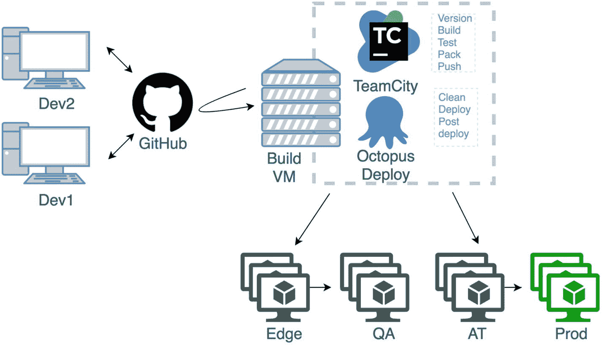
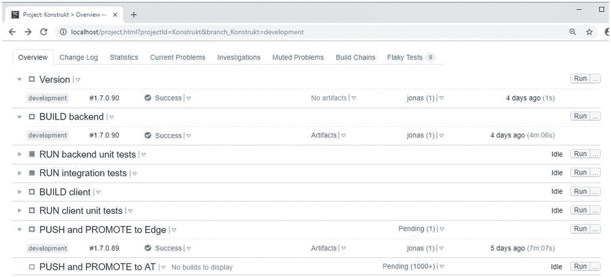
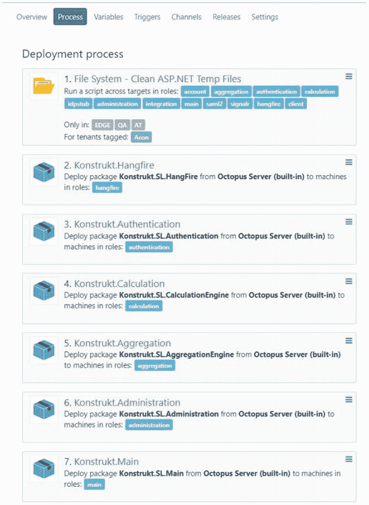

# 六、第四阶段：升级部署管道

当我们迁移到 ASP.NET Core 时，我们学到了很多经验，其中之一就是您可能需要对您的部署管道进行重大更改。如果您有一个混合的解决方案，它可能会变得棘手，这取决于管道是如何设置的。在这一章中，我想强调一下我们遇到的一些变化和挑战。

本章不是关于如何建立持续集成和部署管道的指南。有许多方法可以做到这一点，并且有各种工具和服务可供选择。但是有一点我可以肯定的是，当您进行迁移时，您将需要改变您的管道。如果您有一个混合解决方案，就像我们一样，您将会面临更多需要解决的挑战。根据我的经验，当团队估算迁移的时间和精力时，设置和修补管道所花费的时间和精力经常被遗忘。这可能需要大量的工作，尤其是如果你没有准备好的话。我希望这一章能给你一些提示，告诉你会遇到什么样的挑战，也希望能给你一些解决方案。

## Konstrukt 持续集成和部署管道

当我第一次建立我们的管道时，我们在 Azure 中托管我们所有的服务。我们在 web 服务中使用了一种叫做云服务的东西，虚拟机在一个虚拟 IP 下捆绑在一起。当我们转向本地云提供商时，我们改变了设置，但我们保留了管道，包括工具和步骤。管道是这样工作的(图 [6-1](#Fig1) )。

图 6-1

Konstrukt 持续集成和部署管道工程

源代码托管在 GitHub(几个存储库)上，我们使用 Git 进行版本控制。我们的开发分支是我们的主分支，我们在两周的周期中分支发布。对于主要的补丁和特性，我们使用临时分支，但是我们尽量避免不必要的分支。每个开发人员都在他们自己的本地副本上工作，频繁地将变更提交和推送到远程存储库。我们的构建机器使用一个名为 TeamCity 的构建服务，这个构建服务监听存储库中的变更。提交完成后，它会获取最新版本，并经历一系列构建配置，如图 [6-2](#Fig2) 所示，每个配置包含几个步骤。构建代理执行构建配置，我们有几个并行运行的代理。

图 6-2

Konstrukt 在将包推送到部署服务之前构建配置

我不会深入到配置的细节，但这是过程。我们的解决方案由三个独立的部分构建和运行:客户端、web API 服务和工具。它们都要经历下面的配置，只有在前一个配置成功的情况下，下一个配置才会运行。

## 创建版本

我们使用构建服务来设置版本号。如果提交是在发布分支上进行的，则版本被附加到版本号的末尾。这将在我们部署包时被解析和使用。

## 构建和打包

在这一步中，包被恢复，项目被构建，并且部署包被创建(NuGet 包)。

## 运行单元测试和集成测试

这两种测试类型作为单独的配置运行，因为集成测试依赖于物理数据库。

## 推

由于我们同时部署所有的服务，我们需要同步包，因为前端和后端服务是由不同的代理创建的。因此，在最后一步，我们要确保一切都是成功的，并且所有创建的包都是同一个版本的。然后，这些包被推送到我们的 NuGet 服务器，并部署到边缘服务器 NuGet 服务器或 AT(验收测试服务器)——这取决于这是否是一个版本。

## 部署流程

一旦前面的步骤完成，Octopus Deploy 就会接管。Octopus Deploy 是我们的部署服务，管理各种环境的部署。一旦一个包被成功地部署到边缘环境，并且我们可以 ping 所有的服务，相同的包就被部署到 QA(质量保证)环境进行手工测试(由开发人员和我们的测试人员共同完成)。一旦所有的东西都被测试了，一个发布就通过一个发布分支被创建了；在发布到生产环境之前，测试人员和早期采用者在 AT(验收测试)环境中对包进行测试。

服务的部署本身相当简单，如图 [6-3](#Fig3) 所示。经过一些清理之后，我们将服务部署为 IIS web 服务，对于 ASP.NET Core 服务只有一些小的不同。

图 6-3

一些 Octopus 部署 Konstrukt 的部署步骤

## 管道修改

正如我之前提到的，我们必须对我们的管道做一些改变。您需要进行的修改取决于您当前的设置，并且您可能会像我们一样更改几次。当我们第一次开始迁移一些服务时，我们决定通过使用单独的解决方案文件来分离项目。解决方案文件通常用于对相关的项目进行分组，通常是为了简化开发(可以在同一个 Visual Studio 实例中打开相关的项目)和部署(可以在解决方案级别运行 build 之类的命令)。我们在迁移之前的 CI/CD 设置依赖于解决方案文件，我们使用内置步骤来恢复包，并通过添加解决方案本身的路径来构建解决方案。开箱即用真的很好，直到你添加。网芯和。混合使用. NET 标准项目。

## 两种解决方案

我们有三种方法可以解决这个问题。第一个是为添加第二个解决方案文件。网芯和。NET 标准项目，并为还原和生成创建单独的步骤。第二种方法是在一个解决方案文件中包含所有内容，但是改变现有的步骤，使用命令行工具，而不是插件或 TeamCity 特性。第三种方法是删除解决方案文件，并像第二种方法一样编写脚本。不幸的是，我们的系统在某种程度上仍然是一个分布式的整体，因此第三个选项对我们来说还不是一个选项。我们决定使用多个解决方案文件。

## CLI 优先

。NET Core 有一个命令行优先的方法，带有优秀的 CLI 工具。TeamCity 建议您使用他们的。NET 核心插件，用于恢复包，构建和创建部署包。当时这个插件有几个问题；其中之一是它不支持多个项目的通配符选择来恢复包和构建程序集。为每个构建添加一个单独的步骤将会很难维护，并且如果您将解决方案文件作为目标，它也不能用于解决方案中的混合项目。使用单独的解决方案文件，我们可以运行针对 Konstrukt.Core.sln 的恢复或构建命令。接下来，我们开始整合这些步骤，不再使用内置功能，而是倾向于为这些步骤编写脚本(通过使用本机 CLI 工具而不是插件)。

## 创建 NuGet 包

我们的部署包是 NuGet 包，它是通过使用 Octopus Deploy 的 NuGet 包作为构建过程的一部分创建的，Octopus Deploy 在构建时使用 NuGet.exe 在后台创建包。我们从一开始就有这个设置，但不幸的是这个工具不支持。净核心项目。因为我们有两个独立的解决方案，所以我们决定保留 Konstrukt.sln 的构建步骤。NET)并启用“运行 OctoPack”选项。为了 Konstrukt。我们使用 PowerShell 脚本通过使用 octo.exe 来创建包。您可以在构建时自动创建包，只需在项目文件中将 GeneratePackageOnBuild 设置为 true。我们需要额外的调整，并选择退出该选项，而是写我们自己的脚本。

## 运行测试

我们的测试也遇到了问题。我们所有的测试(后端)都使用 NUnit，而且我们一直使用 NUnit 控制台运行程序——不幸的是，它目前不支持。NET 核心。在撰写本文时，他们正在考虑一个单独的跑步者，但它仍处于规划阶段。因此，我们使用了“dotnet test”命令。当您将解决方案文件作为目标时，NET Core SDK 有一个错误，会产生错误，而不是跳过不是测试项目的项目。幸运的是，这个问题现在已经解决了。

要点是，您很可能需要维护单独的步骤，合并类似步骤的最简单方法是编写步骤脚本，而不是依赖插件和内置特性。我确信这取决于您正在使用的构建服务，但是通常我发现 GUI 驱动的工具和服务适应变化的速度较慢，并且非常有限。

## 部署

部署对我们来说需要最少的工作量。我们决定不创建自包含的包，因为我们不需要并行运行多个版本，我们宁愿保持部署包较小。我们的服务也使用 IIS，并将继续这样做，直到我们部署到不同的操作系统。我们必须做的更改是确保我们安装了 IIS 模块(。NET 核心托管包)并设置。NET CLR 版本转换为无托管代码。我们在 Octopus Deploy 中创建了两个单独的模板，一个用于我们的“旧”服务，另一个用于 ASP.NET Core 服务。如果您部署自包含包并使用进程内宿主模型，您将需要为 32 位(x86)进程禁用应用池。不要忘记确保用于该流程的身份具有所需的权限。我们对所有部署服务都有一个单独的帐户，并在 Octopus Deploy 中设置了使用该身份的部署步骤。

## 摘要

我们得到的教训之一是，您可能会花费大量时间来调整混合部署或新部署管道的管道。所需的时间取决于几个因素，例如您所使用的工具和服务的灵活性、解决方案的规模以及设置的刚性等等。在准备迁移时请记住这一点，一旦有了构建的东西，就调整管道，这样您就可以尽早运行您的构建过程，以避免常见的“它在我的机器上构建”问题，更不用说您可能不得不花费相当多的时间来修复破裂的管道这一令人失望的意外了。