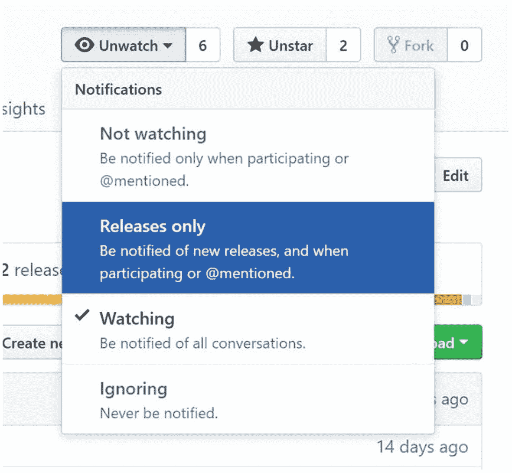
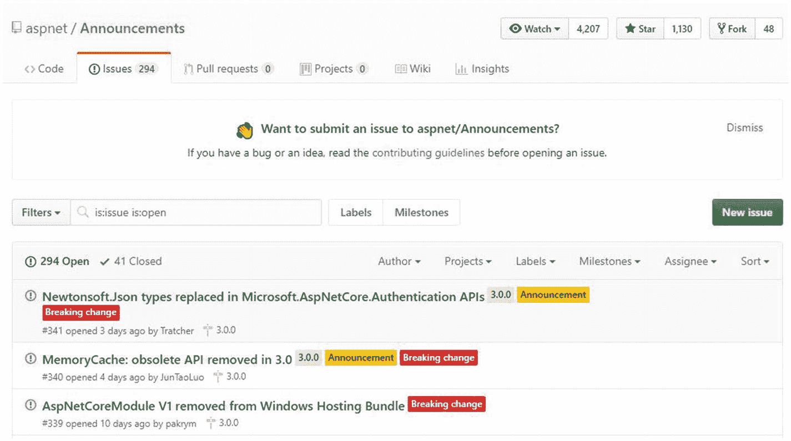
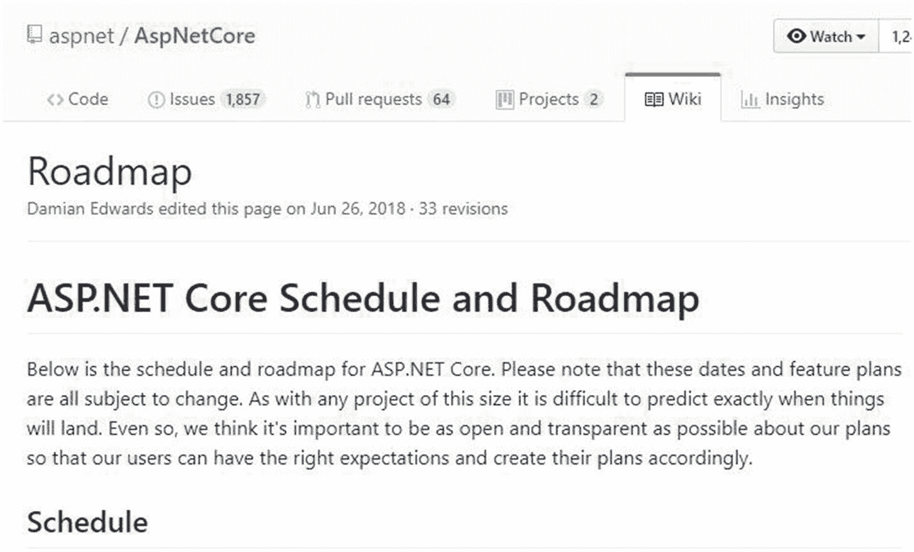

# 七、维护和资源

当我们迁移的时候，我们是如此的热情和天真。我们没有想到 ASP.NET Core 服务的未来技术债务(毕竟它们是全新的！)，而且我们肯定也没有花很多精力去思考和规划维护。然后，ASP.NET Core 上的一个新版本出来了，突然之间，如果我们想跟上时代，我们有很多工作要做。当我们进行第二次迁移时，我们落后于两个版本，有几个突破性的变化已经提前宣布了——这是我们本可以做好准备的。

计划不周且未受管理的迁移可能会导致未来的技术债务问题。这适用于我们编写的所有代码，不仅仅是当我们迁移到一些新的有趣的东西时。然而，根据我的经验，迁移到新事物的兴奋和挑战很容易忘记提前计划。在接下来的几页中，我想给出一些建议和资源，可以减少未来的技术债务，并有希望使这一旅程更加平稳。

## 框架变化

我在第一章中提到过，开源框架的一个可能的缺点是它们经常变化——而且突破性的变化也不是闻所未闻。您可能会使用一些团队协作软件与团队进行交流，无论是 Slack 还是 team(或其他)，我都建议您为核心存储库设置警报和通知。

Slack 有一个插件，可以让你很容易地订阅一个存储库，但是总是有使用 web 挂钩的选项(基于触发器对 URL 的自定义回调)。这是大多数协作工具都支持的，包括微软团队: [`https://docs.microsoft.com/en-us/microsoftteams/platform/concepts/connectors/connectors-using`](https://docs.microsoft.com/en-us/microsoftteams/platform/concepts/connectors/connectors-using)

在这里阅读更多关于 Slack integration 的内容: [`https://github.com/integrations/slack`](https://github.com/integrations/slack)

web 钩子支持多种触发器: [`https://developer.github.com/webhooks/`](https://developer.github.com/webhooks/)

也可以邮件订阅，也可以只订阅新发布的如图 [7-1](#Fig1) 所示。如果你使用未过滤订阅，预计会有很多噪音，并考虑应用过滤器。

图 7-1

GitHub 允许你订阅所有通知或发布的存储库

如果您使用的是旧版本，您可能还想看看不同版本框架的支持政策。你可以在这里找到扶持政策: [`https://dotnet.microsoft.com/platform/support/policy`](https://dotnet.microsoft.com/platform/support/policy)

## 公告和路线图

在上一节中，我提到了订阅存储库，ASP.NET 团队通过创建公告存储库使我们更容易保持最新状态(图 [7-2](#Fig2) )。如果您订阅了它，您将会收到关于所有问题和相关讨论的通知。这些问题有“公告”、“违反变更”和版本号的标签，以便于搜索。

图 7-2

公告库是您可以找到公告和重大变更的地方

在 ASP.NET Core 知识库中，您可以在 Wiki 中找到路线图(图 [7-3](#Fig3) )。虽然很小，但应该是相当新的。除了高层次的概述，它还包含更多信息的链接。

图 7-3

ASP.NET Core 路线图可以在 GitHub 上找到

实体框架核心路线图位于文档中，而不在回购的 Wiki 下。然而，Wiki 确实有路线图和其他有用链接的链接。路线图可以在这里找到: [`https://docs.microsoft.com/en-us/ef/core/what-is-new/roadmap`](https://docs.microsoft.com/en-us/ef/core/what-is-new/roadmap)

## 文件

在我开始下一条建议之前，我想补充一点关于文档的补充说明。虽然微软的文档来源于不同的地方，不仅仅是 GitHub，但是你会在 GitHub 上找到很多相关的文档。理论上，您可以订阅存储库并获得变更通知——但请记住，并非所有内容都是相关的，相反，这可能会产生很多噪音。你可以在这里找到文档库: [`https://github.com/aspnet/Docs`](https://github.com/aspnet/Docs)

## 使架构符合新的惯例

在整本书中，我们都在谈论惯例。展望未来，我建议您和您的团队尽可能地将您的架构与您决定采用的新约定保持一致。有不同的方法可以做到这一点，但通常某种分析仪/林挺工具会有所帮助。有许多 Roslyn 代码分析器可以直接与编译器集成，例如 Microsoft。ASPNETCore . MVC . APi . analyzer(包含在 ASP.NET Core 2.2 中)，当 API 没有遵循一组推荐的规则时，它会产生警告。它是在 ASP.NET Core 2.2 中引入的，但也适用于 2.1。我就不赘述了，但是如果你想了解更多，可以看看这里: [`https://docs.microsoft.com/en-us/aspnet/core/web-api/advanced/analyzers`](https://docs.microsoft.com/en-us/aspnet/core/web-api/advanced/analyzers)

## 。网络标准

随着系统的增长，您为服务、工具和库添加新的项目，目标。NET 标准，以确保将来的兼容性。除非你真的需要一些晦涩难懂的东西，否则真的没有理由不让一个新的库成为. NET 标准库。通过使它成为. NET 标准库，您可以自由选择。

## 测试，测试，然后再测试一些

通过依赖注入和模块化架构等测试友好的约定，ASP.NET Core 是单元和集成测试友好的。在 2.1 版本中，微软还发布了一个测试包， [Microsoft。AspNetCore。Mvc。测试](https://blogs.msdn.microsoft.com/webdev/2018/03/05/asp-net-core-2-1-0-preview1-functional-testing-of-mvc-applications)。它允许您在内存中托管完整的 web 堆栈，同时提供一个测试客户端。这包括一个数据库。您不必担心网络或数据库设置(老实说，这对我们来说是一种痛苦！)，并且您可以测试整个应用堆栈。除了测试包，你还可以发现 ASP.NET Core 引入了几个简化单元测试的对象，而不仅仅是集成测试。例如，涉及 HttpContext 的测试很容易被 DefaultHttpContext 对象模仿。

## 社区资源和工具

。NET Core 是面向命令行的，这使得社区更容易创建适合。NET Core SDK。这里有一些我最喜欢的工具和软件包，它们可以让我们的生活变得更简单。其中一些在本书前面已经提到过。

### 点网模板

你可以在 [`https://dotnetnew.azurewebsites.net/`](https://dotnetnew.azurewebsites.net/) 找到有用的(省时的)点网模板。我使用过 NUnit 测试模板(在创建自己的模板之前)和各种 ASP.NET Core SPA 模板。为创建您自己的模板。NET Core 并不难，而且非常有用，尤其是在一个团队中，并不是每个人都愿意从头开始。本文档指导您完成创建自定义模板所需的几个步骤: [`https://docs.microsoft.com/en-us/dotnet/core/tutorials/create-custom-template`](https://docs.microsoft.com/en-us/dotnet/core/tutorials/create-custom-template)

### 便携性分析器

可移植性分析器分析项目到。网芯和标准。你可以在这里找到工具和更多信息: [`https://docs.microsoft.com/en-us/dotnet/standard/analyzers/portability-analyzer`](https://docs.microsoft.com/en-us/dotnet/standard/analyzers/portability-analyzer)

### Windows 兼容包

如果你需要一个垫片。NET 框架-只有 API，这样你就可以将代码移植到. NET 标准库并且仍然能够编译，你可以使用 NuGet 包 Windows 兼容包: [`www.nuget.org/packages/Microsoft.Windows.Compatibility`](https://www.nuget.org/packages/Microsoft.Windows.Compatibility)

### 。Visual Studio 代码的. NET 核心测试资源管理器

如果您想要一个类似于 Visual Studio 中的测试资源管理器，但对于 Visual Studio 代码，您可以使用。NET 核心测试浏览器: [`https://marketplace.visualstudio.com/items?itemName=formulahendry.dotnet-test-explorer`](https://marketplace.visualstudio.com/items%253FitemName%253Dformulahendry.dotnet-test-explorer)

### Visual Studio 代码的 C#

对于 C# 编辑支持，轻量级开发，以及[的调试工具。NET Core](https://dotnet.github.io/) ，可以用现在流行的 C# 扩展: [`https://marketplace.visualstudio.com/items?itemName=ms-vscode.csharp`](https://marketplace.visualstudio.com/items%253FitemName%253Dms-vscode.csharp)

### 众包工具和框架

Thang Chung 维护了一个流行的众包列表，列出了。净芯: [`https://github.com/thangchung/awesome-dotnet-core`](https://github.com/thangchung/awesome-dotnet-core)

### 众包。网络核心全球工具

内特.麦克马斯特有一个资料库。NET Core 全局工具，比如创建 dacpac 文件、管理证书、清理解决方案、命令行 HTTP 服务器等工具: [`https://github.com/natemcmaster/dotnet-tools`](https://github.com/natemcmaster/dotnet-tools)

如果你有兴趣建立自己的。网芯全球工具，这里有一个阅读: [`https://docs.microsoft.com/en-us/dotnet/core/tools/global-tools`](https://docs.microsoft.com/en-us/dotnet/core/tools/global-tools)

## 保持最新

在这一点上，你可能已经注意到，这里的许多建议都是为了克服本书前面列出的缺点。其中之一是开发人员很难保持最新状态。这里有一些额外的资源来保持最新。

### 微软博客

网页开发: [`https://blogs.msdn.microsoft.com/webdev/`](https://blogs.msdn.microsoft.com/webdev/)

Dotnet: [`https://blogs.msdn.microsoft.com/dotnet/`](https://blogs.msdn.microsoft.com/dotnet/)

开发者工具: [`https://blogs.msdn.microsoft.com/developer-tools/`](https://blogs.msdn.microsoft.com/developer-tools/)

不是微软的官方博客，但仍然相关:

汉塞尔曼(混合微软内容): [`www.hanselman.com/blog/`](http://www.hanselman.com/blog/)

点网基础: [`www.dotnetfoundation.org/blog`](http://www.dotnetfoundation.org/blog)

### 播客

波浪网: [`https://channel9.msdn.com/Shows/On-NET`](https://channel9.msdn.com/Shows/On-NET)

那个。NET 核心播客(非微软): [`https://dotnetcore.show/`](https://dotnetcore.show/)

### 现场表演

。NET 社区单口相声: [`www.twitch.tv/events/RNn48aCNTZ6w0SQET48uOg`](http://www.twitch.tv/events/RNn48aCNTZ6w0SQET48uOg)

ASP.NET 社区单口相声: [`https://live.asp.net/`](https://live.asp.net/)

### 推特

ASP。NET: [`https://twitter.com/aspnet`](https://twitter.com/aspnet)

。NET: [`https://twitter.com/DotNet`](https://twitter.com/DotNet)

。NET 基础: [`https://twitter.com/dotnetfdn`](https://twitter.com/dotnetfdn)

这些记录也可以在脸书上找到。

### 论坛

点网基础: [`https://forums.dotnetfoundation.org/`](https://forums.dotnetfoundation.org/)

ASP.NET 论坛:[`https://forums.asp.net/`T2】](https://forums.asp.net/)

ASP.NET 网目: [`https://gitter.im/aspnet/Home`](https://gitter.im/aspnet/Home)

Gitter Dotnet 社区: [`https://gitter.im/dotnet/community`](https://gitter.im/dotnet/community)

### 注意

Gitter 是一个围绕 GitHub 项目的消息传递和协作论坛。

### 视频(常规)

MS Build 和 Ignite 视频是很好的资源。你可以在第九频道的事件: [`https://channel9.msdn.com/Events/Build`](https://channel9.msdn.com/Events/Build) 下找到它们

### 视频培训

如果你想或者需要做一些技术培训，可以找很多官方资源。尽管有许多技术培训提供者，我仍然建议先看看微软能提供什么，因为他们通常在新内容方面领先一步。除了包含大多数框架和工具的教程的文档之外，还有 Microsoft Learn——其中包含了以前称为 Microsoft Virtual Academy 的内容。你可以在那里找到大量的实践教程和其他资源。

## 摘要

维护和技术债不是容易的话题。作为一家初创公司，我们努力在投资者和客户的新功能与管理我们不断增长的系统之间取得平衡，以使我们积累技术债务的速度不超过我们管理技术债务的速度。除了我在本章给出的建议之外，我们还做了一些其他的事情，这些事情不是特定于平台或框架的。我们是一个敏捷的团队，在 sprint 中工作，我们交替使用 sprint 和重点关注技术深度、重构和 bug 的 sprint。我们的产品处于永久测试阶段，这意味着产品版本总是处于公开测试阶段，客户参与测试并给出反馈。我们的开发人员参与支持，一线、二线和三线支持。我们每两周进行一次架构讨论，并在每次冲刺后进行一整天的回顾。虽然我们没有做很多结对编程，但是我们有一个循环的代码评审时间表(所以我们交替谁评审谁)，我们让每个人都参与到 sprint 的问题中。每日站立帮助我们保持联系，即使我们中的一些人在家工作或工作时间表不同。然而，仅仅这些是不够的。

你在积累债务之前所做的工作非常重要。因此，当您进行迁移时，请抓住机会，采用更灵活、更易维护的架构，如 ASP.NET Core 所提倡的那样，保持最新状态，全面测试，并使用可用的工具和资源。

我已经尽我所能与你分享我从迁移中学到的经验。当我们开始迁移时，关于这个主题的信息非常少，甚至当我几年后结束这本书时，我也找不到任何真实的迁移例子。我知道你的情况会有所不同，我推荐的东西可能并不适合你，但我真诚地希望这本书能让你更容易理解，并回答你的大部分问题。如果你有没有答案的问题，请联系我，我会确保为你找到一些答案。我还想提醒大家，ASP.NET Core 和。NET Core 并不是不可及的，根据我的经验，当我有问题时，它们非常有帮助和通融。

ASP.NET Core 和。NET 会一直存在，所以请确保您与社区和团队保持联系。对我们许多人来说，编程不仅仅是一份工作——它是一种超越我们工作日的热情，GitHub 上繁忙的存储库就是证明。社区用户群，如 MeetUp、 [`www.meetup.com/`](https://www.meetup.com/) 上的用户群，可以成为结识志同道合者或学习新事物的好地方。