# 二、你的第一个 Identity 应用

欣赏一个软件开发框架的最好方式是直接投入使用它。在这一章中，我将解释如何为 ASP.NET Core 开发做准备，以及如何创建和运行使用 ASP.NET Core Identity 的 ASP.NET Core 应用。

Updates to this Book

微软有一个积极的开发计划。NET 和 ASP.NET Core，这意味着在您阅读本书时，可能会有新的版本推出。期望读者每隔几个月就买一本新书似乎不太公平，尤其是因为大多数变化都相对较小。相反，我会在 GitHub 知识库中发布这本书的免费更新( [`https://github.com/Apress/pro-asp.net-core-identity`](https://github.com/Apress/pro-asp.net-core-identity) )以获得突破性的变化。

这种更新对我来说是一个正在进行的实验(对 Apress 来说也是),它将继续发展——尤其是因为我不知道 ASP.NET Core 的未来主要版本将包含什么——但目标是通过补充书中包含的示例来延长这本书的寿命。

我不承诺更新会是什么样的，它们会采取什么形式，或者在我把它们折叠成这本书的新版本之前，我会花多长时间来制作它们。当新的 ASP.NET Core 版本发布时，请保持开放的心态并检查这本书的存储库。如果你有关于如何改进更新的想法，请发电子邮件到`adam@adam-freeman.com`告诉我。

## 设置开发环境

ASP.NET Core 项目中使用了 Identity，所以您应该已经具备了遵循示例所需的一切，尽管您必须安装。我在本书中使用的. NET SDK 和第 [12 章](12.html)中使用的 Node.js 包。在这一节中，我将回顾基本的设置过程，它将为遵循本书中的示例准备一个合适的开发环境。

Note

这本书描述了 Windows 的 ASP.NET Core Identity 开发。在 Linux 和 macOS 上开发和运行 ASP.NET Core 应用是可能的，但是大多数读者使用 Windows，这就是我选择关注的。本书中的许多示例都依赖于 LocalDB，这是 SQL Server 提供的一个仅适用于 Windows 的特性，在其他平台上不可用。如果你想在另一个平台上跟进这本书，那么你可以使用第 [1](01.html) 章中的电子邮件地址联系我，我会尽力帮助你开始。

### 安装。NET SDK

您必须安装我用来遵循示例的相同版本的 SDK。您可以自由地为您的项目使用任何 SDK 版本，但是要获得预期的结果，版本 5.0.100 是必需的。前往 [`https://dotnet.microsoft.com/download/dotnet/5.0`](https://dotnet.microsoft.com/download/dotnet/5.0) 下载版本 5.0.100，这是的 SDK 版本。NET 5.0.0。运行安装程序；安装完成后，从 Windows 开始菜单打开一个新的 PowerShell 命令提示符，并运行清单 [2-1](#PC1) 中所示的命令，其中显示了已安装的。NET Core SDKs。

```cs
dotnet --list-sdks

Listing 2-1.Listing the Installed SDKs

```

以下是以前未使用的 Windows 计算机上全新安装的输出。净发展:

```cs
5.0.100 [C:\Program Files\dotnet\sdk]

```

### 安装 Node.js

Node.js 是一个服务器端 JavaScript 运行时，我在第 [12](12.html) 章中使用它来解释如何向 API 客户端提供认证。你必须下载我在本书中使用的 Node.js 的相同版本。虽然 Node.js 相对稳定，但仍不时有突破性的 API 变化。

我使用的版本是 14.15.4，这是我撰写本文时的长期支持版本。在您阅读本文时，可能会有更高的版本，但是对于本书中的示例，您应该坚持使用 14.15.4 版本。一套完整的 Windows 14 . 15 . 4 安装程序可从 [`https://nodejs.org/dist/v14.15.4`](https://nodejs.org/dist/v14.15.4) 获得。运行安装程序，确保选中“npm 包管理器”选项和两个添加到路径选项，如图 [2-1](#Fig1) 所示。

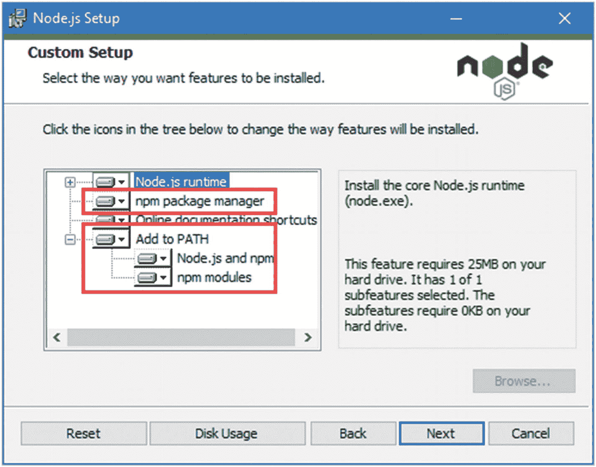

图 2-1。

配置节点安装

安装完成后，运行清单 [2-2](#PC3) 中所示的命令。

```cs
node -v

Listing 2-2.Running Node.js

```

如果安装正常进行，您将会看到下面显示的版本号:

```cs
v14.15.4

```

Node.js 安装程序包括节点包管理器(NPM)，用于管理项目中的包。运行清单 [2-3](#PC5) 中所示的命令，确保 NPM 正在工作。

```cs
npm -v

Listing 2-3.Running NPM

```

如果一切正常，您将看到以下版本号:

```cs
6.14.10

```

### 安装代码编辑器

您可以使用任何代码编辑器来遵循本书中的示例。最流行的选择是 Visual Studio 和 Visual Studio 代码，我将在接下来的小节中提供安装说明。Visual Studio 对 C# 开发有更好的支持，但是 Visual Studio 代码更轻更快。无论您选择哪一个，或者是否使用完全不同的编辑器，都没有关系，因为所有用于构建和运行项目的命令都是从命令行运行的。

但是，不管使用什么编辑器，您都需要。NET SDK，并且必须确保安装了 LocalDB(有关详细信息，请参见下面的说明)。

Muddling Through the Microsoft Naming Scheme

微软似乎无法确定命名惯例。那个。NET 框架演变成了。NET Core，现在已经成为。网(就。NET，没有*框架*或者*核心*。让事情变得更加混乱的是，ASP.NET 成为了 ASP.NET Core，但没有被重新命名。NET 核心到. NET。

名称变更是长达数年的破坏性变化、180 度大转弯、混乱以及普遍缺乏领导力和方向的一部分，所有这些都影响到了开发人员。我确信微软有人认为这一切都是值得的，但是我还没有见到他们。这是一个耻辱，因为我有一个关于这个话题的广泛而充满咒骂的咆哮，我一直保存到那个时候。

ASP.NET Core 和 ASP.NET Core 认同在 2010 年至 2011 年的过渡期内保持相对稳定。网芯到。NET，对这本书的主要影响是我可能用错了。地方网。所以如果你看到提到。网芯，请随便拿支铅笔，把芯的部分划掉。

### 安装 Visual Studio

安装 Visual Studio 之前，请确保您已经安装了。NET SDK，如前一节所述。ASP.NET Core 5 需要 Visual Studio 2019。我用的是免费的 Visual Studio 2019 社区版，可以从 [`www.visualstudio.com`](http://www.visualstudio.com) 下载。运行安装程序，你会看到如图 [2-2](#Fig2) 所示的提示。

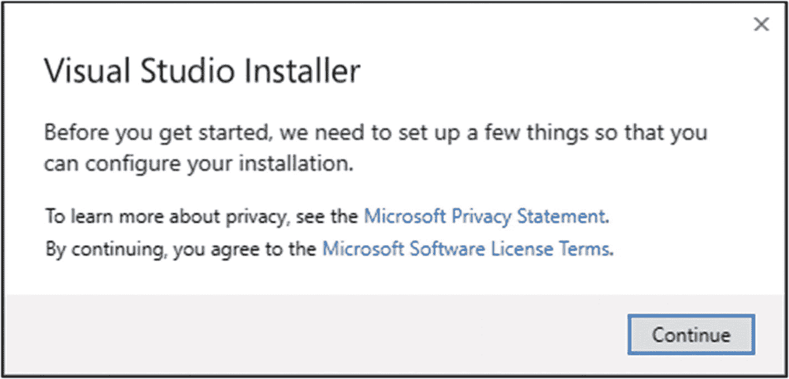

图 2-2。

启动 Visual Studio 安装程序

点击继续按钮，安装程序将下载安装文件，如图 [2-3](#Fig3) 所示。


图 2-3。

下载 Visual Studio 安装程序文件

下载完安装程序文件后，您将看到一组安装选项，这些选项被分组到工作负载中。确保“ASP。NET 和 web 开发”工作量进行检查，如图 [2-4](#Fig4) 所示。

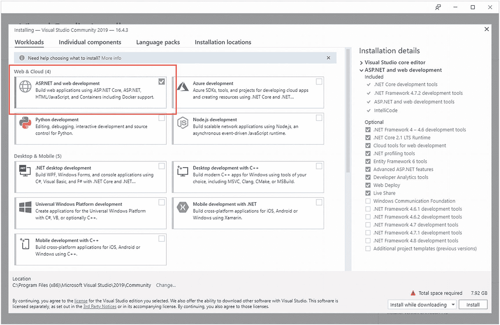

图 2-4。

选择工作负荷

选择窗口顶部的“单个组件”部分，确保选中 SQL Server Express 2016 LocalDB 选项，如图 [2-5](#Fig5) 所示。这是我将用来存储数据的数据库组件。

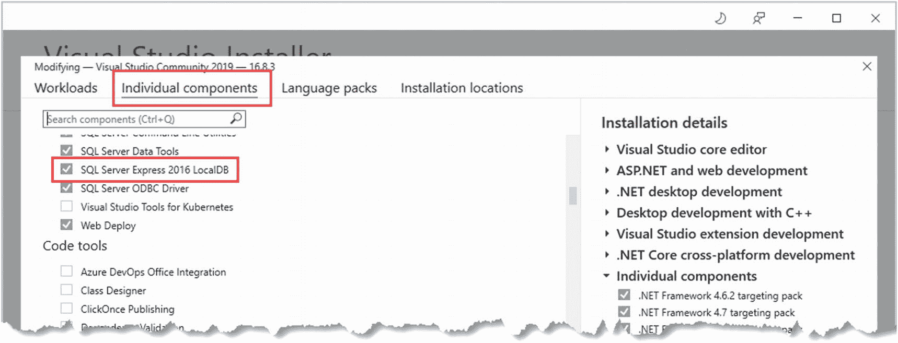

图 2-5。

确保安装了 LocalDB

单击 Install 按钮，将下载并安装所选工作负载所需的文件。要完成安装，需要重启，如图 [2-6](#Fig6) 所示。

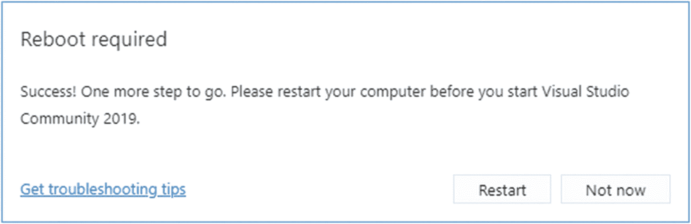

图 2-6。

完成安装

### 安装 Visual Studio 代码

如果您选择了使用 Visual Studio 代码，请从 [`https://code.visualstudio.com`](https://code.visualstudio.com) 下载安装程序。不需要特定的版本，您应该选择当前的稳定版本。运行安装程序，确保选择添加到路径选项，如图 [2-7](#Fig7) 所示。

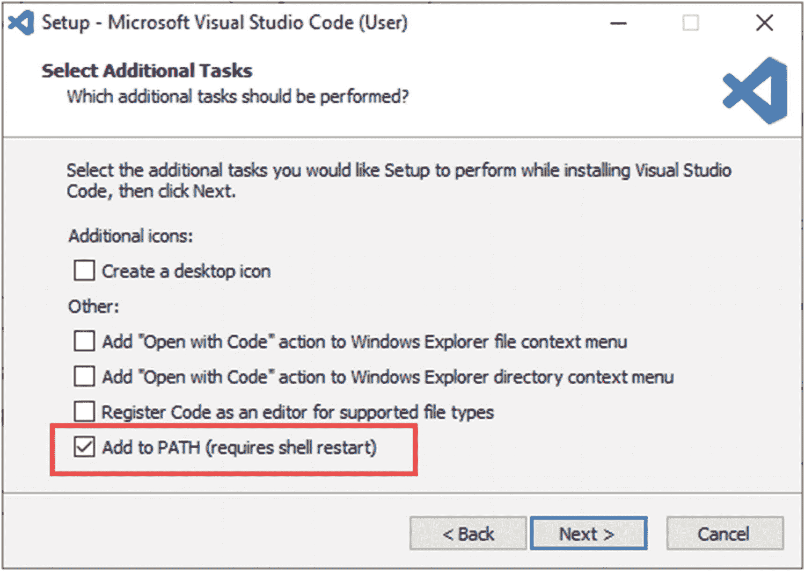

图 2-7。

配置 Visual Studio 代码安装

#### 正在安装 SQL Server LocalDB

本书中的许多示例都需要 LocalDB，它是 SQL Server 的零配置版本，可以作为 SQL Server Express edition 的一部分安装，可以从 [`https://www.microsoft.com/en-in/sql-server/sql-server-downloads`](https://www.microsoft.com/en-in/sql-server/sql-server-downloads) 免费使用。下载并运行快速版安装程序，选择自定义选项，如图 [2-8](#Fig8) 所示。

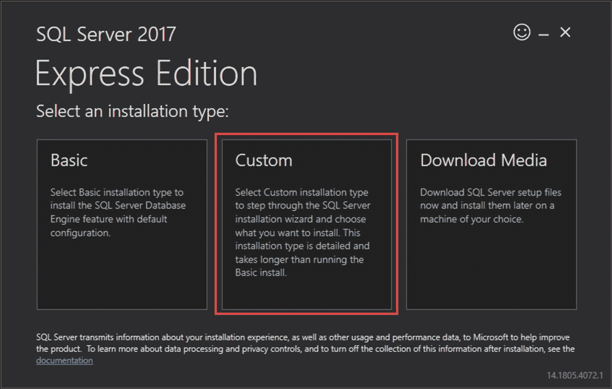

图 2-8。

选择 SQL Server 的安装选项

选择自定义选项后，系统会提示您选择安装文件的下载位置。单击安装按钮，下载将开始。

出现提示时，选择创建新的 SQL Server 安装的选项，如图 [2-9](#Fig9) 所示。

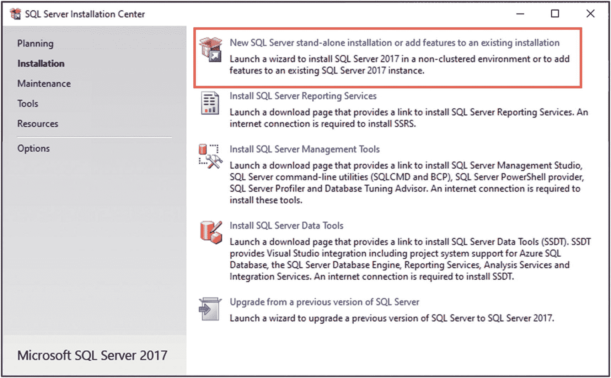

图 2-9。

选择安装选项

完成安装过程，选择出现的默认选项。当你到达特性选择页面时，确保选择了 LocalDB 选项，如图 [2-10](#Fig10) 所示。(您可能希望取消选择 R 和 Python 的选项，这两个选项在本书中没有使用，并且需要很长时间来下载和安装。)

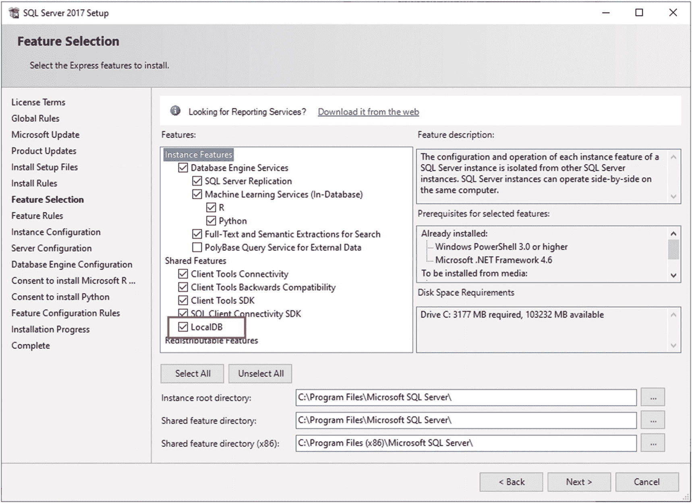

图 2-10。

选择 LocalDB 功能

在实例配置页面，选择“默认实例”选项，如图 [2-11](#Fig11) 所示。

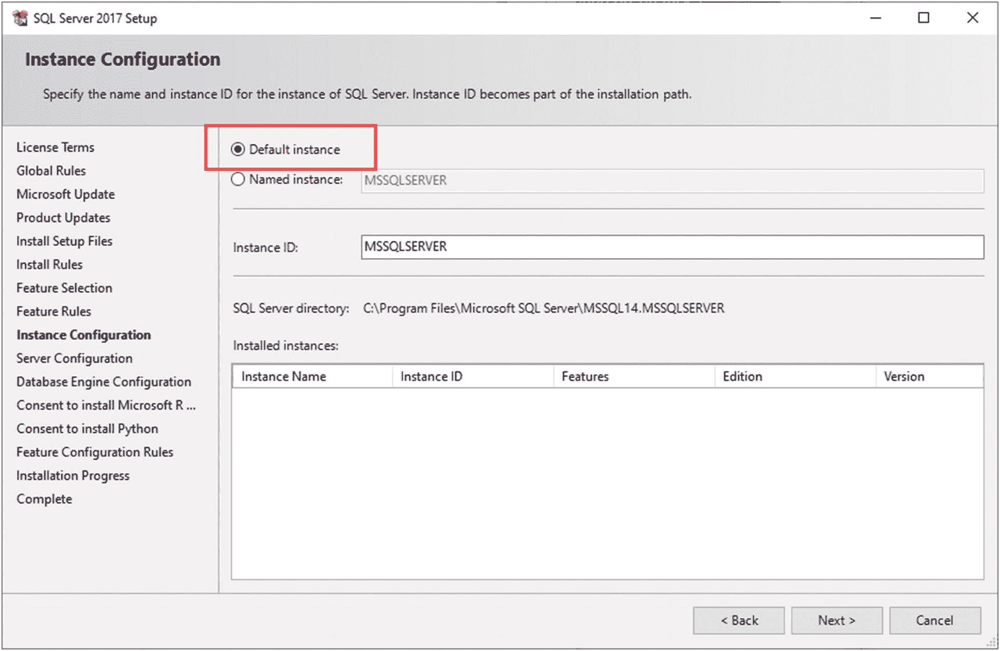

图 2-11。

配置数据库

继续完成安装过程，选择默认值。安装完成后，安装 SQL Server 的最新累积更新。在撰写本文时，最新的更新可从 [`https://support.microsoft.com/en-us/help/4577467/kb4577467-cumulative-update-22-for-sql-server-2017`](https://support.microsoft.com/en-us/help/4577467/kb4577467-cumulative-update-22-for-sql-server-2017) 获得，尽管在您阅读本章时可能已经发布了更新的更新。

Caution

跳过更新阶段可能很诱人，但是执行这一步以从本书的示例中获得预期的结果是很重要的。例如，SQL Server 的基本安装有一个阻止 LocalDB 创建数据库文件的错误，这将在您在本章后面创建项目时导致问题。

## 创建带有标识的应用

在本节中，我将创建一个使用 ASP.NET Core 标识的 ASP.NET Core 项目。这不是一个复杂的过程，因为我选择了一个非常适合默认 Identity 的项目，这是一个用户可以自己注册的应用，不需要任何管理工具。该应用是一个待办事项列表，支持多用户，其结果是一个简单的演示，说明了如何以最小的配置或对正常的 ASP.NET Core 开发实践的干扰来使用 Identity。

Tip

你可以从 [`https://github.com/Apress/pro-asp.net-core-identity`](https://github.com/Apress/pro-asp.net-core-identity) 下载本章以及本书其他章节的示例项目。如果在运行示例时遇到问题，请参见第 [1](01.html) 章获取帮助。

打开一个新的 PowerShell 命令提示符，导航到一个方便的位置，运行清单 [2-4](#PC7) 中所示的命令，创建一个名为`IdentityTodo`的新项目。第二个命令包含一个尾随的反勾号，因此这两行将被 PowerShell 视为同一命令的一部分。

```cs
dotnet new globaljson --sdk-version 5.0.100 --output IdentityTodo
dotnet new webapp --auth Individual --use-local-db true `
  --output IdentityTodo --framework net5.0
dotnet new sln -o IdentityTodo
dotnet sln IdentityTodo add IdentityTodo

Listing 2-4.Creating a New Project

```

这些命令创建一个包含 ASP.NET Core 标识的基本项目。一旦创建了项目，运行清单 [2-5](#PC8) 中所示的命令，导航到项目文件夹并构建项目。

```cs
cd IdentityTodo
dotnet build

Listing 2-5.Building the Project

```

如果构建成功，`dotnet build`命令将没有输出。您可能会收到以下错误:

```cs
Could not execute because the application was not found or a compatible .NET SDK is not installed.

```

这意味着您没有安装正确版本的。NET SDK。返回到本章开头的说明并安装 SDK，即使在使用 Visual Studio 时也是必需的。

### 准备项目

在本书中，我使用命令行工具来构建和运行 ASP.NET Core 项目。打开项目(通过用 Visual Studio 打开`IdentityTodo.sln`文件或在 Visual Studio 代码中打开`IdentityTodo`文件夹)并更改`Properties`文件夹中`launchSettings.json`文件的内容，如清单 [2-6](#PC10) 所示，以设置将用于监听 HTTP 请求的端口。

```cs
{
  "iisSettings": {
    "windowsAuthentication": false,
    "anonymousAuthentication": true,
    "iisExpress": {
      "applicationUrl": "http://localhost:5000",
      "sslPort": 44350
    }
  },
  "profiles": {
    "IIS Express": {
      "commandName": "IISExpress",
      "launchBrowser": true,
      "environmentVariables": {
        "ASPNETCORE_ENVIRONMENT": "Development"
      }
    },
    "IdentityTodo": {
      "commandName": "Project",
      "dotnetRunMessages": "true",
      "launchBrowser": true,
      "applicationUrl": "https://localhost:44350;http://localhost:5000",
      "environmentVariables": {
        "ASPNETCORE_ENVIRONMENT": "Development"
      }
    }
  }
}

Listing 2-6.Setting Ports in the launchSettings.json File in the Properties Folder

```

在本书中，我对 HTTP 请求使用端口 5000，对 HTTPS 使用端口 44350，这些更改适用于命令行和用 Visual Studio 启动项目时的端口。

### 创建数据模型

将名为`TodoItem.cs`的类文件添加到`Data`文件夹中，代码如清单 [2-7](#PC11) 所示。在后面的章节中，我使用了一个名为`Models`的文件夹，这是 ASP.NET Core 约定，但是对于这一章，我将使用模板提供的文件夹结构。

```cs
namespace IdentityTodo.Data {

    public class TodoItem {

        public long Id { get; set; }

        public string Task { get; set; }

        public bool Complete { get; set; }

        public string Owner { get; set; }
    }
}

Listing 2-7.The Contents of the TodoItem.cs File in the Data Folder

```

这个类将用于表示待办事项，这些事项将使用实体框架核心存储在数据库中。实体框架核心还用于存储 Identity 数据，项目模板创建了一个数据库上下文类。

我通常建议将 Identity 数据保存在一个单独的数据库中，但是在本章中，我将着眼于简单性，对所有数据使用同一个数据库。将清单 [2-8](#PC12) 中显示的属性添加到`Data`文件夹中的`ApplicationDbContext.cs`文件中。

```cs
using System;
using System.Collections.Generic;
using System.Text;
using Microsoft.AspNetCore.Identity.EntityFrameworkCore;
using Microsoft.EntityFrameworkCore;

namespace IdentityTodo.Data {

    public class ApplicationDbContext : IdentityDbContext {

        public ApplicationDbContext(DbContextOptions<ApplicationDbContext> options)
            : base(options) {}

        public DbSet<TodoItem> TodoItems { get; set; }
    }
}

Listing 2-8.Adding a Property in the ApplicationDbContext.cs File in the Data Folder

```

### 创建和应用数据库迁移

示例应用需要两个数据库:一个用于存储待办事项，另一个用于存储 Identity 用户帐户。要安装将用于管理数据库的命令行工具包，请使用 PowerShell 命令提示符运行清单 [2-9](#PC13) 中所示的命令。

```cs
dotnet tool uninstall --global dotnet-ef
dotnet tool install --global dotnet-ef --version 5.0.0

Listing 2-9.Installing the Entity Framework Core Tools Package

```

第一个命令删除实体框架核心工具包的任何现有版本，如果没有安装该工具包的任何版本，您可能会看到一个错误。第二个命令安装本书中的示例所需的工具包版本。

使用 PowerShell 提示符运行清单 [2-10](#PC14) 中的命令，创建一个数据库迁移，它将增加对存储待办事项的支持。

```cs
dotnet ef migrations add AddTodos

Listing 2-10.Creating the Database Migrations

```

在`IdentityTodo`文件夹中运行清单 [2-11](#PC15) 中所示的命令，删除任何现有的数据库，如果您正在重新阅读本章，这些数据库可能是以前创建的，并使用清单 [2-11](#PC15) 中创建的迁移创建一个新的数据库。

```cs
dotnet ef database drop --force
dotnet ef database update

Listing 2-11.Creating the Database

```

### 配置 ASP.NET Core Identity

需要进行配置更改来准备 ASP.NET Core 标识，如清单 [2-12](#PC16) 所示。

```cs
using System;
using System.Collections.Generic;
using System.Linq;
using System.Threading.Tasks;
using Microsoft.AspNetCore.Builder;
using Microsoft.AspNetCore.Identity;
using Microsoft.AspNetCore.Identity.UI;
using Microsoft.AspNetCore.Hosting;
using Microsoft.AspNetCore.HttpsPolicy;
using Microsoft.EntityFrameworkCore;
using IdentityTodo.Data;
using Microsoft.Extensions.Configuration;
using Microsoft.Extensions.DependencyInjection;
using Microsoft.Extensions.Hosting;

namespace IdentityTodo {
    public class Startup {
        public Startup(IConfiguration configuration) {
            Configuration = configuration;
        }

        public IConfiguration Configuration { get; }

        public void ConfigureServices(IServiceCollection services) {
            services.AddDbContext<ApplicationDbContext>(options =>
                options.UseSqlServer(
                    Configuration.GetConnectionString("DefaultConnection")));
            services.AddDatabaseDeveloperPageExceptionFilter();

            services.AddDefaultIdentity<IdentityUser>(options =>
                    options.SignIn.RequireConfirmedAccount = false)
                .AddEntityFrameworkStores<ApplicationDbContext>();
            services.AddRazorPages();
        }

        public void Configure(IApplicationBuilder app, IWebHostEnvironment env) {
            if (env.IsDevelopment()) {
                app.UseDeveloperExceptionPage();
                app.UseMigrationsEndPoint();
            } else {
                app.UseExceptionHandler("/Error");
                app.UseHsts();
            }

            app.UseHttpsRedirection();
            app.UseStaticFiles();

            app.UseRouting();

            app.UseAuthentication();
            app.UseAuthorization();

            app.UseEndpoints(endpoints => {
                endpoints.MapRazorPages();
            });
        }
    }
}

Listing 2-12.Configuring the Application in the Startup.cs File in the IdentityTodo Folder

```

使用`AddDefaultIdentity`扩展方法将 Identity 添加到应用中，由项目模板创建的默认配置设置配置，以便用户帐户在确认之前不能使用，这需要用户单击他们通过电子邮件收到的链接。我在第 [8](08.html) 和 [9](09.html) 章节解释了确认过程，并在第 [17](17.html) 章节详细描述，但我不想在本章使用，所以我将`RequireConfirmedAccount`配置选项设置为`false`。(所有 Identity 配置选项在第 [5 章](05.html)中描述。)

### 创建应用内容

为了向用户展示他们的待办事项列表，用清单 [2-13](#PC17) 中显示的内容替换`Pages`文件夹中的`Index.cshtml`文件的内容。

```cs
@page
@model IndexModel
@{
    ViewData["Title"] = "To Do List";
}

<h2 class="text-center">To Do List</h2>
<h4 class="text-center">(@User.Identity.Name)</h4>

<form method="post" asp-page-handler="ShowComplete" class="m-2">
    <div class="form-check">
        <input type="checkbox" class="form-check-input" asp-for="ShowComplete"
               onchange="this.form.submit()"/>
        <label class="form-check-label">Show Completed Items</label>
    </div>
</form>

<table class="table table-sm table-striped table-bordered m-2">
    <thead><tr><th>Task</th><th/></tr></thead>
    <tbody>
        @if (Model.TodoItems.Count() == 0) {
            <tr>
                <td colspan="2" class="text-center py-4">
                    You have done everything!
                </td>
            </tr>
        } else {
            @foreach (TodoItem item in Model.TodoItems) {
                <tr>
                    <td class="p-2">@item.Task</td>
                    <td class="text-center py-2">
                        <form method="post" asp-page-handler="MarkItem">
                            <input type="hidden" name="id" value="@item.Id" />
                            <input type="hidden" asp-for="ShowComplete" />
                            <button type="submit" class="btn btn-sm btn-secondary">
                                @(item.Complete ? "Mark Not Done" : "Done")
                            </button>
                        </form>
                    </td>
                </tr>
            }
        }
    </tbody>
    <tfoot>
        <tr>
            <td class="pt-4">
                <form method="post" asp-page-handler="AddItem" id="addItem">
                    <input type="hidden" asp-for="ShowComplete" />
                    <input name="task" placeholder="Enter new to do"
                        class="form-control" />
                </form>
            </td>
            <td class="text-center pt-4">
                <button type="submit" form="addItem"
                        class="btn btn-sm btn-secondary">
                    Add
                </button>
            </td>
        </tr>
    </tfoot>
</table>

Listing 2-13.Replacing the Contents of the Index.cshtml File in the Pages Folder

```

该内容为用户提供了一个包含其待办事项列表的表格，以及向列表添加项目、将项目标记为完成以及在表格中包含已完成项目的能力。为了定义支持清单 [2-13](#PC17) 中内容的特性，用清单 [2-14](#PC18) 中所示的代码替换`Pages`文件夹中`Index.cshtml.cs`文件的内容。

```cs
using IdentityTodo.Data;
using Microsoft.AspNetCore.Authorization;
using Microsoft.AspNetCore.Mvc;
using Microsoft.AspNetCore.Mvc.RazorPages;
using System.Collections.Generic;
using System.Linq;
using System.Threading.Tasks;

namespace IdentityTodo.Pages {

    [Authorize]
    public class IndexModel : PageModel {
        private ApplicationDbContext Context;

        public IndexModel(ApplicationDbContext ctx) {
            Context = ctx;
        }

        [BindProperty(SupportsGet = true)]
        public bool ShowComplete { get; set; }

        public IEnumerable<TodoItem> TodoItems { get; set; }

        public void OnGet() {
            TodoItems = Context.TodoItems
                .Where(t => t.Owner == User.Identity.Name).OrderBy(t => t.Task);
            if (!ShowComplete) {
                TodoItems = TodoItems.Where(t => !t.Complete);
            }
            TodoItems = TodoItems.ToList();
        }

        public IActionResult OnPostShowComplete() {
            return RedirectToPage(new { ShowComplete });
        }

        public async Task<IActionResult> OnPostAddItemAsync(string task) {
            if (!string.IsNullOrEmpty(task)) {
                TodoItem item = new TodoItem {
                    Task = task,
                    Owner = User.Identity.Name,
                    Complete = false
                };
                await Context.AddAsync(item);
                await Context.SaveChangesAsync();
            }
            return RedirectToPage(new { ShowComplete });
        }

        public async Task<IActionResult> OnPostMarkItemAsync(long id) {
            TodoItem item = Context.TodoItems.Find(id);
            if (item != null) {
                item.Complete = !item.Complete;
                await Context.SaveChangesAsync();
            }
            return RedirectToPage(new { ShowComplete });
        }
    }
}

Listing 2-14.Replacing the Contents of the Index.cshtml.cs File in the Pages Folder

```

清单 [2-14](#PC18) 中的代码和清单 [2-13](#PC17) 中的 Razor 内容都没有直接使用 Identity。这是因为 Identity 恰好符合 ASP.NET Core 平台提供的特性。清单 [2-14](#PC18) 中修饰页面模型类的`Authorize`属性告诉 ASP.NET Core，只有经过认证的用户才能访问这个 Razor 页面，清单 [2-12](#PC16) 中显示的`Startup`类中的配置已经将 Identity 设置为创建和使用用户帐户的方式。

### 运行示例应用

通过运行`IdentityTodo`文件夹中清单 [2-15](#PC19) 所示的命令来启动 ASP.NET Core。

```cs
dotnet run

Listing 2-15.Running the Example Application

```

项目将被编译并启动。几秒钟后，您将看到 ASP.NET Core 正在监听已配置端口上的请求的消息，如下所示:

```cs
...
Building...
info: Microsoft.Hosting.Lifetime[0]
      Now listening on: https://localhost:44350
info: Microsoft.Hosting.Lifetime[0]
      Now listening on: http://localhost:5000
info: Microsoft.Hosting.Lifetime[0]
      Application started. Press Ctrl+C to shut down.
info: Microsoft.Hosting.Lifetime[0]
      Hosting environment: Development
info: Microsoft.Hosting.Lifetime[0]
      Content root path: C:\IdentityTodo
...

```

打开一个新的浏览器窗口并请求`https://localhost:44350`。这个请求的目标是`Index.cshtml` Razor 页面，但是由于这个页面已经用`Authorize`属性修饰过，你将被重定向到一个提示你登录或创建账户的页面，如图 [2-12](#Fig12) 所示。这些内容由 Identity UI 包提供，它提供了一组用于管理帐户的标准 Razor 页面。有一些占位符项，比如关于设置外部提供者的消息，我会在第 [11](11.html) 章中解释。

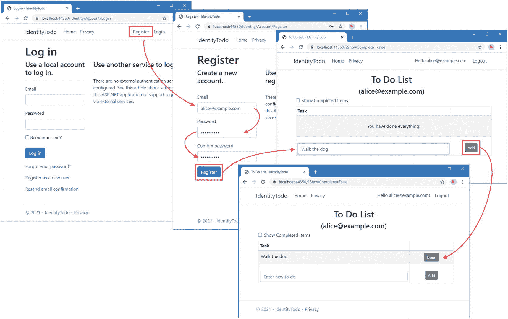

图 2-12。

Identity 用户界面登录屏幕

单击浏览器窗口右上角的注册链接，导航到用于注册新帐户的 Razor 页面。输入**alice@example.com**作为电子邮件地址，并在密码和确认密码字段中输入密码 **MySecret1$** 。(Identity 有一个惩罚性的默认密码策略，我会在第 [8](08.html) 章解释如何更改。)单击 Register 按钮，将创建一个新的用户帐户，用于登录应用。在文本字段中输入一个任务，例如**遛狗**，然后单击 Add 按钮。新项目将存储在数据库中。

点击浏览器窗口顶部显示的`alice@example.com`邮箱地址，会出现账户自主管理入口，如图 [2-13](#Fig13) 所示。这是 Identity UI 包提供的另一个特性，可以适应不同项目的需要，正如我在第 [6](06.html) 章中解释的。如果 Identity UI 包不适合您的项目，Identity 还提供了一个完整的 API 来创建自定义工作流，我在第 [7](07.html) 到 [11](11.html) 章中对此进行了描述。

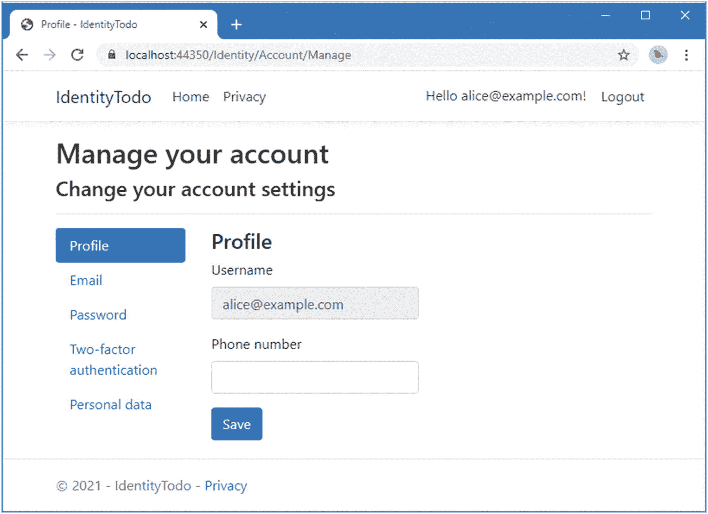

图 2-13。

IdentityUI 自我管理门户

## 摘要

在这一章中，我描述了 ASP.NET Core 和 ASP.NET Core Identity 开发所需的工具。我使用一个包含 Identity 的项目模板创建了一个应用，并演示了 Identity 可以通过最少的配置提供的特性。在下一章中，我将创建一个更复杂的项目，并使用它开始详细探索 ASP.NET Core Identity 特征。