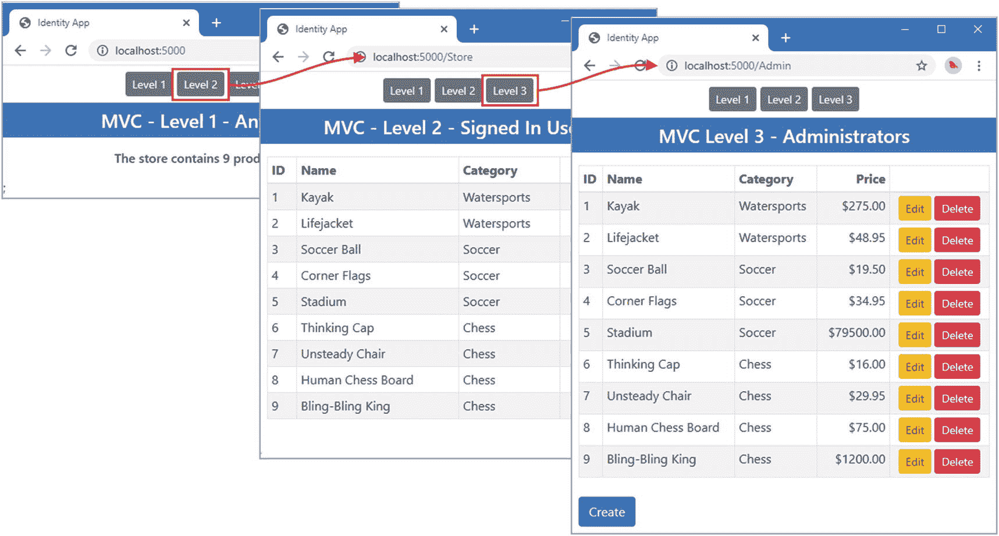
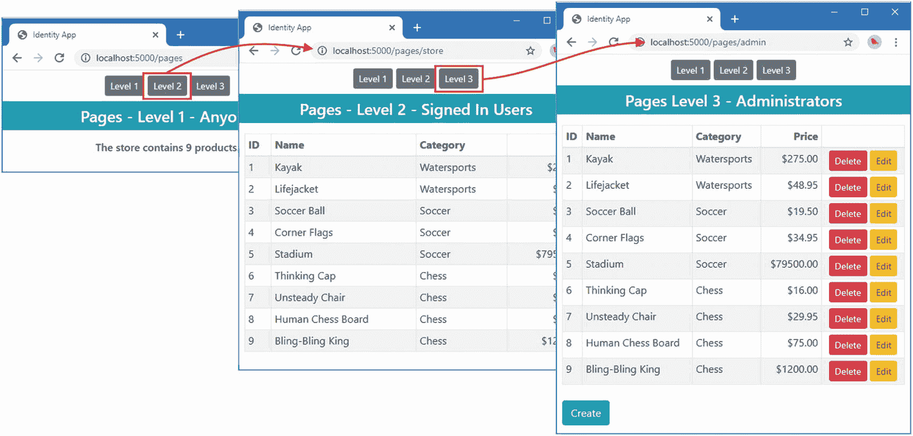
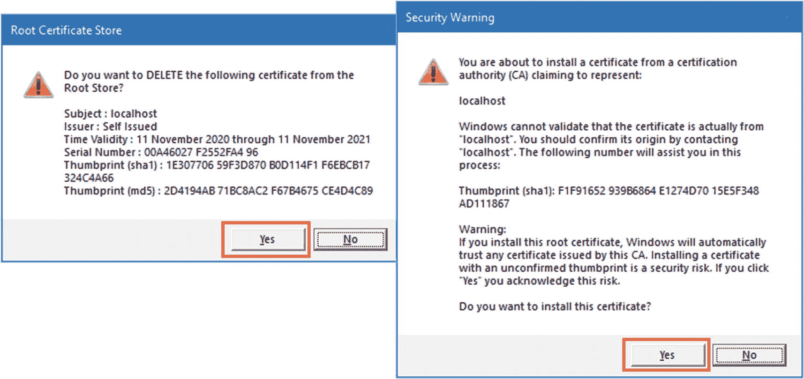
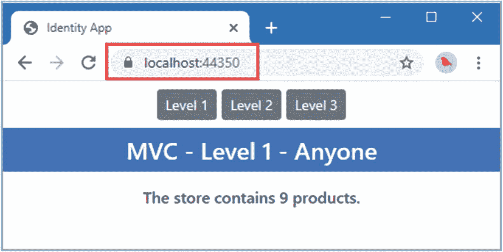
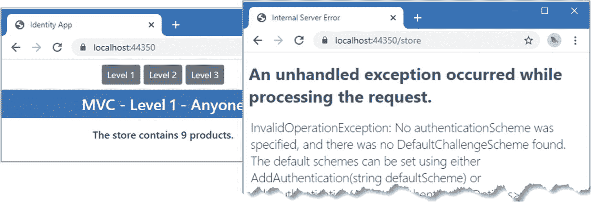

# 三、创建示例项目

在前一章中，我创建了一个 ASP.NET Core 应用，它以尽可能简单的方式使用 Identity，即在创建项目时包含 Identity 并接受默认配置。

但是为了解释 Identity 是如何工作的——并使它更加有用——我需要一个项目，它最初不包含 Identity，也不完全符合默认 Identity 配置所期望的模式。

这个应用并不复杂。我需要三种类型的应用功能:任何人都可以访问的功能，只有用户登录后才能访问的功能，以及只有管理员才能访问的功能。

## 创建项目

从 Windows 开始菜单打开一个新的 PowerShell 命令提示符，并运行清单 [3-1](#PC1) 中所示的命令。

Tip

你可以从 [`https://github.com/Apress/pro-asp.net-core-identity`](https://github.com/Apress/pro-asp.net-core-identity) 下载本章以及本书其他章节的示例项目。如果在运行示例时遇到问题，请参见第 [1](01.html) 章获取帮助。

```cs
dotnet new globaljson --sdk-version 5.0.100 --output IdentityApp
dotnet new web --no-https --output IdentityApp --framework net5.0
dotnet new sln -o IdentityApp
dotnet sln IdentityApp add IdentityApp

Listing 3-1.Creating the Project

```

打开项目进行编辑，并对`Properties`文件夹中的`launchSettings.json`文件进行清单 [3-2](#PC2) 所示的更改，以设置将用于处理 HTTP 和请求的端口。

```cs
{
  "iisSettings": {
    "windowsAuthentication": false,
    "anonymousAuthentication": true,
    "iisExpress": {
      "applicationUrl": "http://localhost:5000",
      "sslPort": 0
    }
  },
  "profiles": {
    "IIS Express": {
      "commandName": "IISExpress",
      "launchBrowser": true,
      "environmentVariables": {
        "ASPNETCORE_ENVIRONMENT": "Development"
      }
    },
    "IdentityApp": {
      "commandName": "Project",
      "dotnetRunMessages": "true",
      "launchBrowser": true,
      "applicationUrl": "http://localhost:5000",
      "environmentVariables": {
        "ASPNETCORE_ENVIRONMENT": "Development"
      }
    }
  }
}

Listing 3-2.Configuring HTTP Ports in the launchSettings.json File in the Properties Folder

```

## 安装引导 CSS 框架

使用命令提示符运行清单 [3-3](#PC3) 中的命令来初始化库管理器工具并安装引导 CSS 包，我用它来设计 HTML 内容的样式。

```cs
dotnet tool uninstall --global Microsoft.Web.LibraryManager.Cli
dotnet tool install --global Microsoft.Web.LibraryManager.Cli --version 2.1.113
libman init -p cdnjs
libman install twitter-bootstrap@4.5.0 -d wwwroot/lib/twitter-bootstrap

Listing 3-3.Installing the Client-Side CSS Package

```

## 安装实体框架核心

打开一个新的 PowerShell 命令提示符，运行`IdentityApp`文件夹中清单 [3-4](#PC4) 所示的命令。

```cs
dotnet add package Microsoft.EntityFrameworkCore.Design --version 5.0.0
dotnet add package Microsoft.EntityFrameworkCore.SqlServer --version 5.0.0

Listing 3-4.Installing the Entity Framework Core Packages

```

实体框架核心依赖于一个全局工具包来管理数据库和模式。运行清单 [3-5](#PC5) 中所示的命令，删除工具包的任何现有版本，并安装本书中示例所需的版本。

```cs
dotnet tool uninstall --global dotnet-ef
dotnet tool install --global dotnet-ef --version 5.0.0

Listing 3-5.Installing the Entity Framework Core Tools Package

```

### 定义连接字符串

将清单 [3-6](#PC6) 中所示的配置设置添加到`IdentityApp`文件夹中的`appsettings.json`文件中。该设置定义了一个连接字符串，该字符串标识实体框架核心将用来存储`Product`数据的数据库。

Tip

连接字符串必须表示为一个完整的行，这在代码编辑器中很好，但不适合打印出来的页面，这是清单 [3-6](#PC6) 中笨拙格式的原因。当您在项目中定义连接字符串时，确保`AppDataConnection`项的值在一行中。

```cs
{
  "Logging": {
    "LogLevel": {
      "Default": "Information",
      "Microsoft": "Warning",
      "Microsoft.Hosting.Lifetime": "Information"
    }
  },
  "AllowedHosts": "*",
  "ConnectionStrings": {
    "AppDataConnection": "Server=(localdb)\\MSSQLLocalDB;Database=IdentityAppData;MultipleActiveResultSets=true"
  }
}

Listing 3-6.Defining a Connection String in the appsettings.json File in the IdentityApp Folder

```

## 创建数据模型

创建`IdentityApp/Models`文件夹，并添加一个名为`Product.cs`的类文件，代码如清单 [3-7](#PC7) 所示。

```cs
using System.ComponentModel.DataAnnotations.Schema;

namespace IdentityApp.Models {

    public class Product {
        public long Id { get; set; }

        public string Name { get; set; }

        [Column(TypeName = "decimal(8, 2)")]
        public decimal Price { get; set; }

        public string Category { get; set; }
    }
}

Listing 3-7.The Contents of the Product.cs File in the Models Folder

```

`Product`类有一个`Id`属性，它将与`Name`、`Price`和`Category`属性一起被用作主数据库键。我将`Column`属性应用于`Price`属性，以便实体框架核心在创建存储`Product`对象的数据库模式时知道使用哪种数值类型。

为了创建实体框架核心上下文类，用清单 [3-8](#PC8) 中所示的代码将一个名为`ProductDbContext.cs`的文件添加到`Models`文件夹中。该类提供对实体框架核心存储在数据库中的`Product`对象的访问，并用样本数据播种数据库。

```cs
using Microsoft.EntityFrameworkCore;

namespace IdentityApp.Models {
    public class ProductDbContext: DbContext {

        public ProductDbContext(DbContextOptions<ProductDbContext> options)
            : base(options) { }

        public DbSet<Product> Products { get; set; }

        protected override void OnModelCreating(ModelBuilder builder) {
            builder.Entity<Product>().HasData(
                new Product { Id = 1, Name = "Kayak",
                     Category = "Watersports", Price = 275 },
                new Product { Id = 2, Name = "Lifejacket",
                    Category = "Watersports", Price = 48.95m },
                new Product { Id = 3, Name = "Soccer Ball",
                    Category = "Soccer", Price = 19.50m },
                new Product { Id = 4, Name = "Corner Flags",
                    Category = "Soccer", Price = 34.95m },
                new Product { Id = 5, Name = "Stadium",
                    Category = "Soccer", Price = 79500 },
                new Product { Id = 6, Name = "Thinking Cap",
                    Category = "Chess", Price = 16 },
                new Product { Id = 7, Name = "Unsteady Chair",
                    Category = "Chess", Price = 29.95m },
                new Product { Id = 8, Name = "Human Chess Board",
                    Category = "Chess", Price = 75 },
                new Product { Id = 9, Name = "Bling-Bling King",
                    Category = "Chess", Price = 1200});
        }
    }
}

Listing 3-8.The Contents of the ProductDbContext.cs File in the Models Folder

```

## 创建 MVC 控制器和视图

创建`IdentityApp/Controllers`文件夹，并在其中添加一个名为`HomeController.cs`的类文件，内容如清单 [3-9](#PC9) 所示。

```cs
using IdentityApp.Models;
using Microsoft.AspNetCore.Mvc;

namespace IdentityApp.Controllers {

    public class HomeController : Controller {
        private ProductDbContext DbContext;

        public HomeController(ProductDbContext ctx) => DbContext = ctx;

        public IActionResult Index() => View(DbContext.Products);
    }
}

Listing 3-9.The Contents of the HomeController.cs File in the Controllers Folder

```

该控制器将提供第一级访问权限，任何人都可以使用。要创建相应的视图，创建`IdentityApp/Views/Home`文件夹并添加一个名为`Index.cshtml`文件的 Razor 视图，其内容如清单 [3-10](#PC10) 所示。

```cs
@model IQueryable<Product>

<h4 class="bg-primary text-white text-center p-2">MVC - Level 1 - Anyone</h4>

<div class="text-center">
    <h6 class="p-2">
        The store contains @Model.Count() products.
    </h6>
</div>

Listing 3-10.The Contents of the Index.cshtml File in the Views/Home Folder

```

在`Controllers`文件夹中添加一个名为`StoreController.cs`的类文件，内容如清单 [3-11](#PC11) 所示。该控制器将提供第二级访问权限，可供登录到应用的用户使用。

```cs
using IdentityApp.Models;
using Microsoft.AspNetCore.Mvc;

namespace IdentityApp.Controllers {

    public class StoreController : Controller {
        private ProductDbContext DbContext;

        public StoreController(ProductDbContext ctx) => DbContext = ctx;

        public IActionResult Index() => View(DbContext.Products);
    }
}

Listing 3-11.The Contents of the StoreController.cs File in the Controllers Folder

```

为了给`Store`控制器的动作方法提供视图，创建`IdentityApp/Views/Store`文件夹并添加一个名为`Index.cshtml`的 Razor 视图，内容如清单 [3-12](#PC12) 所示。该视图提供了一个包含数据库中`Product`对象详细信息的表格，但不提供任何编辑它们的方法。

```cs
@model IQueryable<Product>

<h4 class="bg-primary text-white text-center p-2">MVC - Level 2 - Signed In Users</h4>

<div class="p-2">
    <table class="table table-sm table-striped table-bordered">
        <thead>
            <tr>
                <th>ID</th><th>Name</th><th>Category</th>
                <th class="text-right">Price</th>
            </tr>
        </thead>
        <tbody>
            @foreach (Product p in Model.OrderBy(p => p.Id)) {
                <tr>
                    <td>@p.Id</td>
                    <td>@p.Name</td>
                    <td>@p.Category</td>
                    <td class="text-right">$@p.Price.ToString("F2")</td>
                </tr>
            }
        </tbody>
    </table>
</div>

Listing 3-12.The Contents of the Index.cshtml File in the Views/Store Folder

```

将名为`AdminController.cs`的类文件添加到`Controllers`文件夹中，并使用它来定义清单 [3-13](#PC13) 中所示的控制器。该控制器将呈现第三层内容，只有管理员可以使用。

```cs
using IdentityApp.Models;
using Microsoft.AspNetCore.Mvc;

namespace IdentityApp.Controllers {

    public class AdminController : Controller {
        private ProductDbContext DbContext;

        public AdminController(ProductDbContext ctx) => DbContext = ctx;

        public IActionResult Index() => View(DbContext.Products);

        [HttpGet]
        public IActionResult Create() => View("Edit", new Product());

        [HttpGet]
        public IActionResult Edit(long id) {
            Product p = DbContext.Find<Product>(id);
            if (p != null) {
                return View("Edit", p);
            }
            return RedirectToAction(nameof(Index));
        }

        [HttpPost]
        public IActionResult Save(Product p) {
            DbContext.Update(p);
            DbContext.SaveChanges();
            return RedirectToAction(nameof(Index));
        }

        [HttpPost]
        public IActionResult Delete(long id) {
            Product p = DbContext.Find<Product>(id);
            if (p != null) {
                DbContext.Remove(p);
                DbContext.SaveChanges();
            }
            return RedirectToAction(nameof(Index));
        }
    }
}

Listing 3-13.The Contents of the AdminController.cs File in the Controllers Folder

```

创建`IdentityApp/Views/Admin`文件夹并添加一个名为`Index.cshtml`的 Razor 视图，内容如清单 [3-14](#PC14) 所示。

```cs
@model IQueryable<Product>

<h4 class="bg-primary text-white text-center p-2">MVC Level 3 - Administrators</h4>

<div class="p-2">
    <table class="table table-sm table-striped table-bordered">
        <thead>
            <tr>
                <th>ID</th><th>Name</th><th>Category</th>
                <th class="text-right">Price</th><th></th>
            </tr>
        </thead>
        <tbody>
            @foreach (Product p in Model.OrderBy(p => p.Id)) {
                <tr>
                    <td>@p.Id</td>
                    <td>@p.Name</td>
                    <td>@p.Category</td>
                    <td class="text-right">$@p.Price.ToString("F2")</td>
                    <td class="text-center">
                        <form method="post">
                            <a class="btn btn-sm btn-warning" asp-action="edit"
                                asp-route-id="@p.Id">Edit</a>
                            <button class="btn btn-sm btn-danger"
                                asp-action="delete" asp-route-id="@p.Id">
                                    Delete
                            </button>
                        </form>
                    </td>
                </tr>
            }
        </tbody>
    </table>
</div>
<a class="btn btn-primary mx-2" asp-action="Create">Create</a>

Listing 3-14.The Contents of the Index.cshtml File in the Views/Admin Folder

```

该视图提供了一个显示`Product`细节的表格，以及用于创建、编辑和删除数据的按钮。为了创建用于创建和编辑数据的 HTML，将一个名为`Edit.cshtml`的 Razor 视图添加到`Views/Admin`文件夹中，其内容如清单 [3-15](#PC15) 所示。

```cs
@model Product

<h4 class="bg-primary text-white text-center p-2">MVC Level 3 - Administrators</h4>

<form method="post" asp-action="save" class="p-2">
    <div class="form-group">
        <label>ID</label>
        <input class="form-control" readonly asp-for="Id" />
    </div>
    <div class="form-group">
        <label>Name</label>
        <input class="form-control" asp-for="Name" />
    </div>
    <div class="form-group">
        <label>Category</label>
        <input class="form-control" asp-for="Category" />
    </div>
    <div class="form-group">
        <label>Price</label>
        <input class="form-control" type="number" asp-for="Price" />
    </div>
    <div class="text-center">
        <button type="submit" class="btn btn-primary">Save</button>
        <a class="btn btn-secondary" asp-action="Index">Cancel</a>
    </div>
</form>

Listing 3-15.The Contents of the Edit.cshtml File in the Views/Admin Folder

```

为了启用标记助手并导入数据模型名称空间和一些有用的 ASP.NET Core Identity 名称空间，在`Views`文件夹中添加一个名为`_ViewImports.cshtml` file 的 Razor 视图导入文件，其内容如清单 [3-16](#PC16) 所示。

```cs
@addTagHelper *, Microsoft.AspNetCore.Mvc.TagHelpers
@using IdentityApp.Models
@using Microsoft.AspNetCore.Identity
@using System.Security.Claims

Listing 3-16.The Contents of the _ViewImports.cshtml File in the Views Folder

```

为了自动为应用中的视图指定布局，将一个名为`_ViewStart.cshtml`的 Razor 视图开始文件添加到`Views`文件夹中，其内容如清单 [3-17](#PC17) 所示。

```cs
@{
    Layout = "_Layout";
}

Listing 3-17.The Contents of the _ViewStart.cshtml File in the Views Folder

```

创建`IdentityApp/Views/Shared`文件夹，添加一个名为`_Layout.cshtml`的 Razor 布局，内容如清单 [3-18](#PC18) 所示。这个文件提供了 HTML 结构，视图(和 Razor 页面)将把它们的内容呈现到这个结构中，包括一个来自 Bootstrap 包的 CSS 样式表的链接。

```cs
<!DOCTYPE html>
<html>
<head>
    <meta name="viewport" content="width=device-width" />
    <title>Identity App</title>
    <link href="/lib/twitter-bootstrap/css/bootstrap.min.css" rel="stylesheet" />
</head>
<body>
    <partial name="_NavigationPartial" />
    @RenderBody()
</body>
</html>

Listing 3-18.The Contents of the _Layout.cshtml File in the Views/Shared Folder

```

该布局依赖于局部视图来显示内容，这将允许在不同级别的内容之间轻松导航。将名为`_NavigationPartial.cshtml`的 Razor 视图添加到`Views/Shared`文件夹中，内容如清单 [3-19](#PC19) 所示。

```cs
<div class="text-center m-2">
    <a class="btn btn-secondary btn-sm" asp-controller="Home">Level 1</a>
    <a class="btn btn-secondary btn-sm" asp-controller="Store">Level 2</a>
    <a class="btn btn-secondary btn-sm" asp-controller="Admin">Level 3</a>
</div>

Listing 3-19.The Contents of the _NavigationPartial.cshtml File in the Views/Shared Folder

```

## 创建 Razor 页面

创建`IdentityApp/Pages`文件夹，并在其中添加一个名为`Landing.cshtml`的 Razor 页面，内容如清单 [3-20](#PC20) 所示。该页面将呈现第一级访问权限，任何人都可以访问。

```cs
@page "/pages"
@model IdentityApp.Pages.LandingModel

<h4 class="bg-info text-white text-center p-2">Pages - Level 1 - Anyone</h4>

<div class="text-center">
    <h6 class="p-2">
        The store contains @Model.DbContext.Products.Count() products.
    </h6>
</div>

Listing 3-20.The Contents of the Landing.cshtml File in the Pages Folder

```

要定义页面模型类，将清单 [3-21](#PC21) 中所示的代码添加到`Pages`文件夹中的`Landing.cshtml.cs`文件中。(如果您使用的是 Visual Studio 代码，则必须创建该文件。我在本书中反复提到这一点，因为即使是有经验的读者也会习惯于 Visual Studio 创建文件的方式，并且不理解为什么在 Visual Studio 代码中缺少它们。)

```cs
using IdentityApp.Models;
using Microsoft.AspNetCore.Mvc.RazorPages;

namespace IdentityApp.Pages {
    public class LandingModel : PageModel {

        public LandingModel(ProductDbContext ctx) => DbContext = ctx;

        public ProductDbContext DbContext { get; set; }

    }
}

Listing 3-21.The Contents of the Landing.cshtml.cs File in the Pages Folder

```

在`Pages`文件夹中添加一个名为`Store.cshtml`的 Razor 页面，内容如清单 [3-22](#PC22) 所示。该页面将对已登录的用户可用。

```cs
@page "/pages/store"
@model IdentityApp.Pages.StoreModel

<h4 class="bg-info text-white text-center p-2">Pages - Level 2 - Signed In Users</h4>

<div class="p-2">
    <table class="table table-sm table-striped table-bordered">
        <thead>
            <tr>
                <th>ID</th><th>Name</th><th>Category</th>
                <th class="text-right">Price</th>
            </tr>
        </thead>
        <tbody>
            @foreach (Product p in Model.DbContext.Products.OrderBy(p => p.Id)) {
                <tr>
                    <td>@p.Id</td>
                    <td>@p.Name</td>
                    <td>@p.Category</td>
                    <td class="text-right">$@p.Price.ToString("F2")</td>
                </tr>
            }
        </tbody>
    </table>
</div>

Listing 3-22.The Contents of the Store.cshtml File in the Pages Folder

```

为了定义页面模型，将清单 [3-23](#PC23) 中所示的代码添加到`Store.cshtml.cs`文件中。(如果您使用的是 Visual Studio 代码，则必须创建该文件。)

```cs
using IdentityApp.Models;
using Microsoft.AspNetCore.Mvc.RazorPages;

namespace IdentityApp.Pages {
    public class StoreModel : PageModel {
        public StoreModel(ProductDbContext ctx) => DbContext = ctx;

        public ProductDbContext DbContext { get; set; }
    }
}

Listing 3-23.The Contents of the Store.cshtml.cs File in the Pages Folder

```

接下来，在`IdentityApp/Pages`文件夹中添加一个名为`Admin.cshtml`的 Razor 页面，内容如清单 [3-24](#PC24) 所示。此页面仅对管理员可用。

```cs
@page "/pages/admin"
@model IdentityApp.Pages.AdminModel

<h4 class="bg-info text-white text-center p-2">Pages Level 3 - Administrators</h4>

<div class="p-2">
    <table class="table table-sm table-striped table-bordered">
        <thead>
            <tr>
                <th>ID</th><th>Name</th><th>Category</th>
                <th class="text-right">Price</th><th></th>
            </tr>
        </thead>
        <tbody>
            @foreach (Product p in Model.DbContext.Products.OrderBy(p => p.Id)) {
                <tr>
                    <td>@p.Id</td>
                    <td>@p.Name</td>
                    <td>@p.Category</td>
                    <td class="text-right">$@p.Price.ToString("F2")</td>
                    <td class="text-center">
                        <form method="post">
                            <button class="btn btn-sm btn-danger"
                                asp-route-id="@p.Id">
                                    Delete
                            </button>
                            <a class="btn btn-sm btn-warning" asp-page="Edit"
                                asp-route-id="@p.Id">Edit</a>
                        </form>
                    </td>
                </tr>
            }
        </tbody>
    </table>
</div>
<a class="btn btn-info mx-2" asp-page="Edit">Create</a>

Listing 3-24.The Contents of the Admin.cshtml File in the Pages Folder

```

要为`Admin`页面创建页面模型类，将清单 [3-25](#PC25) 中所示的代码添加到`Admin.cshtml.cs`文件中。(如果您使用的是 Visual Studio 代码，则必须创建该文件。)

```cs
using IdentityApp.Models;
using Microsoft.AspNetCore.Mvc;
using Microsoft.AspNetCore.Mvc.RazorPages;

namespace IdentityApp.Pages {
    public class AdminModel : PageModel {

        public AdminModel(ProductDbContext ctx) => DbContext = ctx;

        public ProductDbContext DbContext { get; set; }

        public IActionResult OnPost(long id) {
            Product p = DbContext.Find<Product>(id);
            if (p != null) {
                DbContext.Remove(p);
                DbContext.SaveChanges();
            }
            return Page();
        }
    }
}

Listing 3-25.The Contents of the Admin.cshtml.cs File in the Pages Folder

```

在`Pages`文件夹中添加一个名为`Edit.cshtml`的 Razor 页面，内容如清单 [3-26](#PC26) 所示。该页面将显示用于创建和编辑`Product`对象的 HTML 表单。

```cs
@page "/pages/edit/{id:long?}"
@model IdentityApp.Pages.EditModel

<h4 class="bg-info text-white text-center p-2">Product Page</h4>

<form method="post" class="p-2">
    <div class="form-group">
        <label>ID</label>
        <input class="form-control" readonly asp-for="@Model.Product.Id" />
    </div>
    <div class="form-group">
        <label>Name</label>
        <input class="form-control" asp-for="@Model.Product.Name" />
    </div>
    <div class="form-group">
        <label>Category</label>
        <input class="form-control" asp-for="@Model.Product.Category" />
    </div>
    <div class="form-group">
        <label>Price</label>
        <input class="form-control" type="number" asp-for="@Model.Product.Price" />
    </div>
    <div class="text-center">
        <button type="submit" class="btn btn-secondary">Save</button>
        <a class="btn btn-secondary" asp-page="Admin">Cancel</a>
    </div>
</form>

Listing 3-26.The Contents of the Edit.cshtml File in the Pages Folder

```

将清单 [3-27](#PC27) 中所示的代码添加到`Edit.cshtml.cs`文件中，为编辑器定义页面模型类。(如果您使用的是 Visual Studio 代码，则必须创建该文件。)

```cs
using IdentityApp.Models;
using Microsoft.AspNetCore.Mvc;
using Microsoft.AspNetCore.Mvc.RazorPages;

namespace IdentityApp.Pages {

    public class EditModel : PageModel {

        public EditModel(ProductDbContext ctx) => DbContext = ctx;

        public ProductDbContext DbContext { get; set; }
        public Product Product { get; set; }

        public void OnGet(long id) {
            Product = DbContext.Find<Product>(id) ?? new Product();
        }

        public IActionResult OnPost([Bind(Prefix = "Product")] Product p) {
            DbContext.Update(p);
            DbContext.SaveChanges();
            return RedirectToPage("Admin");
        }
    }
}

Listing 3-27.The Contents of the Edit.cshtml.cs File in the Pages Folder

```

将名为`_ViewImports.cshtml`的 Razor 视图导入文件添加到`Pages`文件夹中，并添加清单 [3-28](#PC28) 中所示的内容，这将启用 Razor 页面中的标签助手，并导入视图中使用的一些名称空间(以及一些对使用 ASP.NET Core Identity 有用的名称空间)。

```cs
@addTagHelper *, Microsoft.AspNetCore.Mvc.TagHelpers
@using Microsoft.AspNetCore.Mvc.RazorPages
@using Microsoft.AspNetCore.Identity
@using System.Security.Claims
@using IdentityApp.Pages
@using IdentityApp.Models

Listing 3-28.The Contents of the _ViewImports.cshtml File in the Pages Folder

```

在`Pages`文件夹中添加一个名为`_ViewStart.cshtml`的 Razor 视图启动文件，内容如清单 [3-29](#PC29) 所示。

```cs
@{
    Layout = "_Layout";
}

Listing 3-29.The Contents of the _ViewStart.cshtml in the Pages Folder

```

将名为`_NavigationPartial.cshtml`的 Razor 布局添加到`Pages`文件夹中，内容如清单 [3-30](#PC30) 所示。

```cs
<div class="text-center m-2">
    <a class="btn btn-secondary btn-sm" asp-page="Landing">Level 1</a>
    <a class="btn btn-secondary btn-sm" asp-page="Store">Level 2</a>
    <a class="btn btn-secondary btn-sm" asp-page="Admin">Level 3</a>
</div>

Listing 3-30.The Contents of the _NavigationPartial.cshtml File in the Pages Folder

```

Razor 页面与 MVC 控制器共享一个布局，只有局部视图的内容会有所不同，从而允许在页面之间轻松导航。

## 配置应用

清单 [3-31](#PC31) 展示了设置实体框架核心、MVC 框架和 Razor 页面所需的对`Startup`类的修改。

```cs
using Microsoft.AspNetCore.Builder;
using Microsoft.AspNetCore.Hosting;
using Microsoft.AspNetCore.Http;
using Microsoft.Extensions.DependencyInjection;
using Microsoft.Extensions.Hosting;
using Microsoft.Extensions.Configuration;
using Microsoft.EntityFrameworkCore;
using IdentityApp.Models;

namespace IdentityApp {

    public class Startup {

        public Startup(IConfiguration config) => Configuration = config;

        private IConfiguration Configuration { get; set; }

        public void ConfigureServices(IServiceCollection services) {
            services.AddControllersWithViews();
            services.AddRazorPages();
            services.AddDbContext<ProductDbContext>(opts => {
                opts.UseSqlServer(
                    Configuration["ConnectionStrings:AppDataConnection"]);
            });
        }

        public void Configure(IApplicationBuilder app, IWebHostEnvironment env) {
            if (env.IsDevelopment()) {
                app.UseDeveloperExceptionPage();
            }
            app.UseStaticFiles();
            app.UseRouting();

            app.UseEndpoints(endpoints => {
                endpoints.MapDefaultControllerRoute();
                endpoints.MapRazorPages();
            });
        }
    }
}

Listing 3-31.Configuring the Application in the Startup.cs File in the IdentityApp Folder

```

您应该已经熟悉清单 [3-31](#PC31) 中使用的方法，这些方法提供对`appsettings.json`文件中配置数据的访问，并配置静态内容、Razor 页面和 MVC 框架所需的服务和中间件。

## 创建数据库

要为产品数据库创建实体框架核心迁移，请使用 PowerShell 命令提示符来运行在`IdentityApp`文件夹中的清单 [3-32](#PC32) 中显示的命令。

```cs
dotnet ef migrations add Initial

Listing 3-32.Creating the Migration and Database

```

一旦创建了迁移，运行清单 [3-33](#PC33) 中所示的命令，这将删除`IdentityAppData`数据库(如果它存在的话),然后重新创建它。

```cs
dotnet ef database drop --force
dotnet ef database update

Listing 3-33.Deleting and Creating the Database

```

## 运行示例应用

使用 PowerShell 命令提示符，运行清单 [3-34](#PC34) 中所示的命令来启动示例应用。

```cs
dotnet run

Listing 3-34.Running the Example Application

```

一号 ASP.NET Core 已经启动，请求`http://localhost:5000`。这个请求将由`Home`控制器的`Index`动作处理，它呈现第一层内容，对任何人都可用。先前定义的布局包括按钮，这些按钮允许在控制器和它们呈现的不同级别的内容之间轻松移动。目前没有访问限制，这意味着任何人都可以访问所有内容，如图 [3-1](#Fig1) 所示。



图 3-1。

MVC 框架产生的内容

请求`http://localhost:5000/pages`查看使用 Razor 页面实现的相同功能。我使用了不同的配色方案和清晰的标签，让 Razor 页面产生的内容看起来很明显，如图 [3-2](#Fig2) 所示。



图 3-2。

Razor 页产生的内容

## 启用 HTTPS 连接

准备示例应用还需要一组更改。ASP.NET Core 依靠 cookie 和 HTTP 请求头来验证请求，这带来了一种风险，即窃听者可能会截获 HTTP 请求，并使用它包含的 cookie 或头来发送看起来像是由用户发送的请求。

当使用需要认证的 ASP.NET Core 应用时，确保所有请求都使用 HTTPS 发送是很重要的，该应用对浏览器和 ASP.NET Core 之间的消息进行加密以防止窃听。

HTTPS vs. SSL vs. TLS

HTTPS 是 HTTP 和传输层安全性(TLS)或安全套接字层(SSL)的结合。TLS 已经取代了过时的 SSL 协议，但术语 SSL 已经成为安全网络的同义词，甚至在 TLS 负责保护连接时也经常使用。如果你对安全和密码学感兴趣，那么 HTTPS 的细节值得探索， [`https://en.wikipedia.org/wiki/HTTPS`](https://en.wikipedia.org/wiki/HTTPS) 是一个很好的起点。

### 生成测试证书

HTTPS 的一个重要特性是使用一个证书，该证书允许 web 浏览器确认他们正在与正确的 web 服务器而不是一个模仿者进行通信。为了简化应用开发。NET SDK 包括一个可用于 HTTPS 的测试证书。使用 PowerShell 命令提示符运行`IdentityApp`文件夹中的清单 [3-35](#PC35) 中所示的命令，以生成新的测试证书，并将其添加到 Windows 将信任的证书集中。

```cs
dotnet dev-certs https --clean
dotnet dev-certs https --trust

Listing 3-35.Generating and Trusting a New Certificate

```

对于提示，点击是，删除已经信任的现有证书，点击是，信任新证书，如图 [3-3](#Fig3) 所示。



图 3-3。

为 HTTPS 生成和信任测试证书

Using a Certificate For Deployment

那个。NET 测试证书只能在开发期间使用，当您准备好部署项目时，您将需要使用真实的证书。如果你没有证书，我推荐 [`https://letsencrypt.org/`](https://letsencrypt.org/) ，这是一个免费颁发证书的公益组织。作为注册过程的一部分，您需要证明您控制了您需要证书的域，但是 Let's Encrypt 为这一过程提供了工具。

一旦您获得了证书，不管您是如何获得的，您都可以在 [`https://docs.microsoft.com/en-us/aspnet/core/security/authentication/certauth?view=aspnetcore-5.0`](https://docs.microsoft.com/en-us/aspnet/core/security/authentication/certauth?view=aspnetcore-5.0) 找到配置 ASP.NET Core 的说明。

### 扶持 HTTPS

要启用 HTTPS，对`Properties`文件夹中的`launchSettings.json`文件进行清单 [3-36](#PC36) 所示的更改。

```cs
{
  "iisSettings": {
    "windowsAuthentication": false,
    "anonymousAuthentication": true,
    "iisExpress": {
      "applicationUrl": "http://localhost:5000",
      "sslPort": 44350
    }
  },
  "profiles": {
    "IIS Express": {
      "commandName": "IISExpress",
      "launchBrowser": true,
      "environmentVariables": {
        "ASPNETCORE_ENVIRONMENT": "Development"
      }
    },
    "IdentityApp": {
      "commandName": "Project",
      "dotnetRunMessages": "true",
      "launchBrowser": true,
      "applicationUrl": "http://localhost:5000;https://localhost:44350",
      "environmentVariables": {
        "ASPNETCORE_ENVIRONMENT": "Development"
      }
    }
  }
}

Listing 3-36.Enabling HTTPS in the launchSettings.json File in the Properties Folder

```

我为示例应用选择了端口 44350，主要是因为 IIS 只支持端口 44300 和 44399 之间的 HTTPS。

我在开发过程中使用端口 5000(用于 HTTP)和 44350(用于 HTTPS ),因为它避免了操作系统对使用低编号端口的限制。部署的应用通常使用端口 80 进行 HTTP，使用端口 443 进行 HTTPS，但这取决于您的托管环境。您可能需要使用不同的端口，或者发现 HTTPS 是作为共享基础架构的一部分为您处理的，这在部署到企业数据中心时是常见的情况。如果您不确定，请咨询您的管理员或查阅所选部署平台的文档。

### 启用 HTTPS 重定向

ASP.NET Core 提供了将 HTTP 请求重定向到应用支持的 HTTPS 端口的功能。要启用 HTTPS 重定向，将清单 [3-37](#PC37) 中所示的语句添加到`Startup`类中。

```cs
using Microsoft.AspNetCore.Builder;
using Microsoft.AspNetCore.Hosting;
using Microsoft.AspNetCore.Http;
using Microsoft.Extensions.DependencyInjection;
using Microsoft.Extensions.Hosting;
using Microsoft.Extensions.Configuration;
using Microsoft.EntityFrameworkCore;
using IdentityApp.Models;

namespace IdentityApp {

    public class Startup {

        public Startup(IConfiguration config) => Configuration = config;

        private IConfiguration Configuration { get; set; }

        public void ConfigureServices(IServiceCollection services) {
            services.AddControllersWithViews();
            services.AddRazorPages();
            services.AddDbContext<ProductDbContext>(opts => {
                opts.UseSqlServer(
                    Configuration["ConnectionStrings:AppDataConnection"]);
            });

            services.AddHttpsRedirection(opts => {
                opts.HttpsPort = 44350;
            });
        }

        public void Configure(IApplicationBuilder app, IWebHostEnvironment env) {
            if (env.IsDevelopment()) {
                app.UseDeveloperExceptionPage();
            }

            app.UseHttpsRedirection();
            app.UseStaticFiles();
            app.UseRouting();

            app.UseEndpoints(endpoints => {
                endpoints.MapDefaultControllerRoute();
                endpoints.MapRazorPages();
            });
        }
    }
}

Listing 3-37.Enabling HTTPS Redirection in the Startup.cs File in the IdentityApp Folder

```

`AddHttpsRedirection`方法用于配置 HTTPS 重定向。对于示例应用，我需要指定重定向到端口 44350，覆盖默认端口 443。`UseHttpRedirection`方法使用由`AddHttpsRedirection`方法指定的设置，应用一个 ASP.NET Core 中间件组件，该组件在接收到 HTTP 请求时通过重定向进行响应。

重启 ASP.NET Core 并请求`http://localhost:5000`。示例应用将响应重定向，导致浏览器请求`https://localhost:44350`，如图 [3-4](#Fig4) 所示。



图 3-4。

在示例应用中启用 HTTPS

## 使用授权策略限制访问

本章的最后一步是应用访问限制，以便 ASP.NET Core 仅允许符合授权策略的用户访问受保护的操作或页面。本节中的更改会破坏应用。ASP.NET Core 提供了一整套用于实施认证和授权的特性，我将在第 2 部分对此进行描述。以下更改告诉 ASP.NET Core 服务器限制访问，但不提供允许验证请求或允许用户登录应用所需的功能。我将在后面的章节中通过安装和配置 ASP.NET Core Identity 来解决这个问题，但是，在此之前，对受限内容的请求将会产生一个异常。

### 应用 2 级授权策略

`Authorize`属性用于限制访问，清单 [3-38](#PC38) 将该属性应用于`Store`控制器。

```cs
using IdentityApp.Models;
using Microsoft.AspNetCore.Mvc;
using Microsoft.AspNetCore.Authorization;

namespace IdentityApp.Controllers {

    [Authorize]
    public class StoreController : Controller {
        private ProductDbContext DbContext;

        public StoreController(ProductDbContext ctx) => DbContext = ctx;

        public IActionResult Index() => View(DbContext.Products);
    }
}

Listing 3-38.Restricting Access in the StoreController.cs File in the Controllers Folder

```

当在没有任何参数的情况下应用该属性时，效果是限制任何登录用户的访问。我将该属性应用于该类，该类将该授权策略应用于控制器定义的所有操作方法。在清单 [3-39](#PC39) 中，我已经将属性应用到了`Store` Razor 页面的页面模型类中，它是`Store`控制器的对应部分。

```cs
using IdentityApp.Models;
using Microsoft.AspNetCore.Mvc.RazorPages;
using Microsoft.AspNetCore.Authorization;

namespace IdentityApp.Pages {

    [Authorize]
    public class StoreModel : PageModel {
        public StoreModel(ProductDbContext ctx) => DbContext = ctx;

        public ProductDbContext DbContext { get; set; }
    }
}

Listing 3-39.Restricting Access in the Store.cshtml.cs File in the Pages Folder

```

该属性也可以用`@attribute`表达式应用于 Razor 页面，为了方便起见，我在后面的例子中使用了这个表达式，尽管效果是一样的。

### 应用 3 级授权策略

`Authorize`属性可用于定义更具体的访问限制。最常见的方法是限制被分配了特定*角色*的用户的访问。在清单 [3-40](#PC40) 中，我使用`Roles`参数将`Authorize`属性应用于`Admin`控制器。

```cs
using IdentityApp.Models;
using Microsoft.AspNetCore.Mvc;
using Microsoft.AspNetCore.Authorization;

namespace IdentityApp.Controllers {

    [Authorize(Roles = "Admin")]
    public class AdminController : Controller {
        private ProductDbContext DbContext;

        public AdminController(ProductDbContext ctx) => DbContext = ctx;

        public IActionResult Index() => View(DbContext.Products);

        [HttpGet]
        public IActionResult Create() => View("Edit", new Product());

        [HttpGet]
        public IActionResult Edit(long id) {
            Product p = DbContext.Find<Product>(id);
            if (p != null) {
                return View("Edit", p);
            }
            return RedirectToAction(nameof(Index));
        }

        [HttpPost]
        public IActionResult Save(Product p) {
            DbContext.Update(p);
            DbContext.SaveChanges();
            return RedirectToAction(nameof(Index));
        }

        [HttpPost]
        public IActionResult Delete(long id) {
            Product p = DbContext.Find<Product>(id);
            if (p != null) {
                DbContext.Remove(p);
                DbContext.SaveChanges();
            }
            return RedirectToAction(nameof(Index));
        }
    }
}

Listing 3-40.Restricting Access in the AdminController.cs File in the Controllers Folder

```

清单 [3-41](#PC41) 将相同的策略应用于`Admin`页面模型类，它是第三级 Razor 页面，是清单 [3-40](#PC40) 中控制器的对应部分。

```cs
using IdentityApp.Models;
using Microsoft.AspNetCore.Mvc;
using Microsoft.AspNetCore.Mvc.RazorPages;
using Microsoft.AspNetCore.Authorization;

namespace IdentityApp.Pages {

    [Authorize(Roles = "Admin")]
    public class AdminModel : PageModel {

        public AdminModel(ProductDbContext ctx) => DbContext = ctx;

        public ProductDbContext DbContext { get; set; }

        public IActionResult OnPost(long id) {
            Product p = DbContext.Find<Product>(id);
            if (p != null) {
                DbContext.Remove(p);
                DbContext.SaveChanges();
            }
            return Page();
        }
    }
}

Listing 3-41.Restricting Access in the Admin.cshtml.cs File in the Pages Folder

```

我需要对`Edit`页面的页面模型类应用相同的限制，如清单 [3-42](#PC42) 所示，它代表`Admin`页面处理编辑。

```cs
using IdentityApp.Models;
using Microsoft.AspNetCore.Mvc;
using Microsoft.AspNetCore.Mvc.RazorPages;
using Microsoft.AspNetCore.Authorization;

namespace IdentityApp.Pages {

    [Authorize(Roles = "Admin")]
    public class EditModel : PageModel {

        public EditModel(ProductDbContext ctx) => DbContext = ctx;

        public ProductDbContext DbContext { get; set; }
        public Product Product { get; set; }

        public void OnGet(long id) {
            Product = DbContext.Find<Product>(id) ?? new Product();
        }

        public IActionResult OnPost([Bind(Prefix = "Product")] Product p) {
            DbContext.Update(p);
            DbContext.SaveChanges();
            return RedirectToPage("Admin");
        }
    }
}

Listing 3-42.Restricting Access in the Edit.cshtml.cs File in the Pages Folder

```

### 配置应用

剩下的步骤是启用处理授权和认证的 ASP.NET Core 特性，如清单 [3-43](#PC43) 所示。正如我在第 2 部分中解释的，这些是 ASP.NET Core Identity 集成的特性，但由 ASP.NET Core 提供。

```cs
using Microsoft.AspNetCore.Builder;
using Microsoft.AspNetCore.Hosting;
using Microsoft.AspNetCore.Http;
using Microsoft.Extensions.DependencyInjection;
using Microsoft.Extensions.Hosting;
using Microsoft.Extensions.Configuration;
using Microsoft.EntityFrameworkCore;
using IdentityApp.Models;

namespace IdentityApp {

    public class Startup {

        public Startup(IConfiguration config) => Configuration = config;

        private IConfiguration Configuration { get; set; }

        public void ConfigureServices(IServiceCollection services) {
            services.AddControllersWithViews();
            services.AddRazorPages();
            services.AddDbContext<ProductDbContext>(opts => {
                opts.UseSqlServer(
                    Configuration["ConnectionStrings:AppDataConnection"]);
            });

            services.AddHttpsRedirection(opts => {
                opts.HttpsPort = 44350;
            });
        }

        public void Configure(IApplicationBuilder app, IWebHostEnvironment env) {
            if (env.IsDevelopment()) {
                app.UseDeveloperExceptionPage();
            }

            app.UseHttpsRedirection();
            app.UseStaticFiles();
            app.UseRouting();

            app.UseAuthentication();
            app.UseAuthorization();

            app.UseEndpoints(endpoints => {
                endpoints.MapDefaultControllerRoute();
                endpoints.MapRazorPages();
            });
        }
    }
}

Listing 3-43.Enabling Features in the Startup.cs File in the IdentityApp Folder

```

顾名思义，`UseAuthentication`和`UseAuthorization`方法建立了 ASP.NET Core 认证和授权特性。您不需要理解这些特性是如何使用 ASP.NET Core Identity 的，但是您可以在第 2 部分中找到完整的细节。

重启 ASP.NET Core 并请求`https://localhost:44350`。该请求将由`Home`控制器处理，该控制器没有应用授权限制，并将返回正常响应，如图 [3-5](#Fig5) 所示。请求`https://localhost:44350/store`，你会收到一个错误，也如图 [3-5](#Fig5) 所示。这个请求由应用了`Authorize`属性的`Store`控制器处理。ASP.NET Core 试图建立发送请求的用户的 Identity，但由于所需的服务缺失而无法建立，从而导致异常。



图 3-5。

应用授权限制的效果

## 摘要

在这一章中，我创建了一个示例应用，我将在本书的这一部分中使用它。该应用很简单，但定义了三个级别的访问控制，我用它来解释 ASP.NET Core Identity 如何工作，以及它如何集成到 ASP.NET Core 平台。在下一章中，我将向您展示如何安装 Identity 并使用内置的 Identity UI 包。