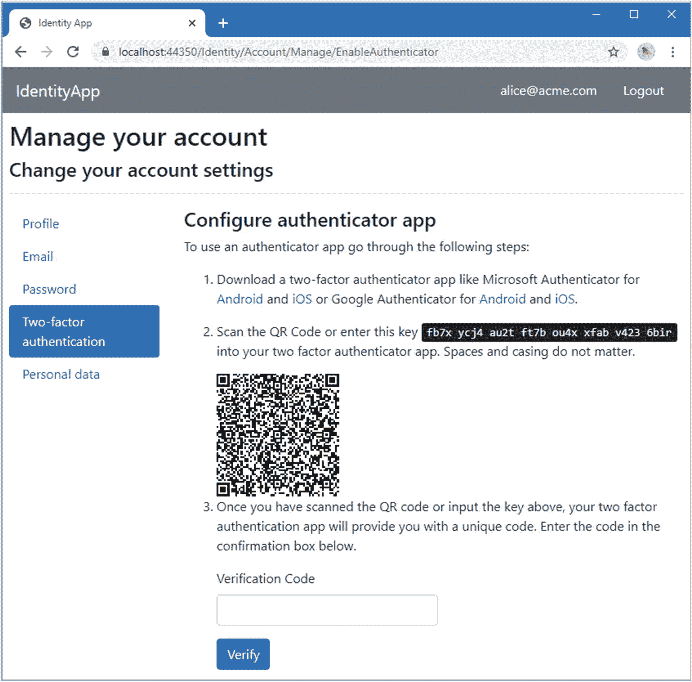
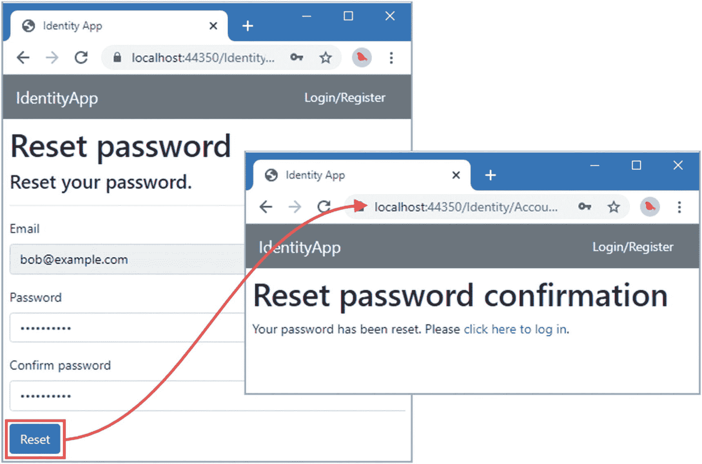

# 四、使用 Identity UI 包

微软为 Identity 提供了一个构建用户界面，称为 *Identity UI* ，这使得快速启动和运行成为可能。在这一章中，我将 Identity 添加到在第 [3](03.html) 章中创建的示例项目中，并解释 Identity UI 包提供的特性。在第 6 章[中，我解释了如何调整这些特性来适应不同的项目类型。](06.html)

即使进行了我在第 [6](06.html) 章中描述的调整，Identity UI 包也只适用于具有特定特征的应用。我描述了这些特征导致的限制，并从第 [7](07.html) 章开始，解释如何创建完全自定义的工作流作为使用 Identity UI 包的替代方案。

但是，正如本章将要演示的，如果您的应用确实满足需求，那么您可以毫不费力地从 Identity UI 包中获得很多好处。表 [4-1](#Tab1) 将 Identity UI 包放在上下文中。

表 4-1。

将 Identity UI 包放入上下文中

<colgroup><col class="tcol1 align-left"> <col class="tcol2 align-left"></colgroup> 
| 

问题

 | 

回答

 |
| --- | --- |
| 这是什么？ | Identity UI 包是微软提供的一组 Razor 页面和支持类，用于在 ASP.NET Core 项目中快速启动 ASP.NET Core Identity 的使用。 |
| 为什么有用？ | Identity UI 包提供了基本用户管理所需的所有工作流，包括创建帐户、使用密码登录、授权码和第三方服务。 |
| 如何使用？ | Identity UI 包作为 NuGet 包添加到项目中，并使用`AddDefaultIdentity`扩展方法启用。 |
| 有什么陷阱或限制吗？ | Identity UI 采用的方法并不适合所有项目。这可以通过调整它提供的功能或直接使用 Identity API 创建自定义替代项来解决。 |
| 还有其他选择吗？ | Identity 提供了一个 API，可以用来为 Identity UI 包创建定制的替代方案，我将在第 [7](07.html) 到 [11](11.html) 章中对其进行描述。 |

表 [4-2](#Tab2) 总结了本章内容。

表 4-2。

章节总结

<colgroup><col class="tcol1 align-left"> <col class="tcol2 align-left"> <col class="tcol3 align-left"></colgroup> 
| 

问题

 | 

解决办法

 | 

列表

 |
| --- | --- | --- |
| 将 Identity 和 Identity UI 包添加到项目中 | 将 NuGet 包添加到项目中，并使用`Startup`类中的`AddDefaultIdentity`方法配置它们。创建数据库迁移，并使用它来准备用于存储用户数据的数据库。 | [1](#PC1)–[7](#PC10) |
| 向用户显示注册或登录链接 | 创建一个名为`_LoginPartial.cshtml`的共享局部视图。 | [8](#PC11) ， [9](#PC12) |
| 为应用和 Identity UI 包创建一致的布局 | 定义一个 Razor 布局，并在`Areas/Identity/Pages`文件夹中创建的 Razor 视图中引用它。 | [10](#PC14)–[12](#PC16) |
| 添加对确认的支持 | 创建一个`IEmailSender`接口的实现，并将其注册为`Startup`类中的服务。 | [13](#PC17) ， [14](#PC18) |
| 显示用于配置验证器应用的 QR 码 | 将`qrcodejs` JavaScript 包添加到项目中，并创建一个`script`元素，将它应用于 Identity UI 包生成的 URL。 | [15](#PC20) ， [16](#PC21) |

## 为本章做准备

本章使用在第 [3](03.html) 章中创建的`IdentityApp`项目。准备本章不需要做任何改动。打开 PowerShell 命令提示符，导航到`IdentityApp`文件夹，运行清单 [4-1](#PC1) 中所示的命令，删除然后重新创建应用使用的数据库。

Tip

你可以从 [`https://github.com/Apress/pro-asp.net-core-identity`](https://github.com/Apress/pro-asp.net-core-identity) 下载本章以及本书其他章节的示例项目。如果在运行示例时遇到问题，请参见第 [1](01.html) 章获取帮助。

```cs
dotnet ef database drop --force
dotnet ef database update

Listing 4-1.Resetting the Application Database

```

使用 PowerShell 提示符运行清单 [4-2](#PC2) 中的命令来启动应用。

```cs
dotnet run

Listing 4-2.Running the Example Application

```

打开网页浏览器，请求`https://localhost:44350`，将显示来自`Home`控制器的输出，请求`https://localhost:44350/pages`，将显示来自`Landing` Razor 页面的输出，如图 [4-1](#Fig1) 所示。单击第 2 级或第 3 级按钮会产生一个异常，因为 ASP.NET Core 没有被提供它需要的服务来验证请求和执行应用于`Authorize`属性的限制。


图 4-1。

运行示例应用

## 在项目中加入 ASP.NET Core 标识

使用 PowerShell 命令提示符运行清单`IdentityApp`文件夹中的 [4-3](#PC3) 所示的命令，将 ASP.NET Core Identity 包添加到项目中。

```cs
dotnet add package Microsoft.Extensions.Identity.Core --version 5.0.0
dotnet add package Microsoft.AspNetCore.Identity.EntityFrameworkCore --version 5.0.0

Listing 4-3.Adding the ASP.NET Core Identity Packages

```

第一个包包含核心身份特征。第二个包包含使用实体框架核心在数据库中存储数据所需的特性。

### 将 Identity UI 包添加到项目中

使用 PowerShell 运行`IdentityApp`文件夹中清单 [4-4](#PC4) 所示的命令来安装 Identity UI 包。

```cs
dotnet add package Microsoft.AspNetCore.Identity.UI --version 5.0.0

Listing 4-4.Installing the Identity UI Package

```

### 定义数据库连接字符串

存储 Identity 数据最简单的方法是在数据库中，微软通过 Entity Framework Core 提供了内置支持。虽然您可以对应用的域数据和 Identity 数据使用单个数据库，但是我建议您将所有数据分开，以便可以独立地管理模式。

为了定义实体框架核心将用于 Identity 数据库的连接字符串，将清单 [4-5](#PC5) 中所示的配置项添加到`appsettings.json`文件中，该文件使用名为`IdentityConnection`的连接字符串指定名为`IdentityAppUserData`的 LocalDB 数据库。(连接字符串应该在一个完整的行上，但是太长了，无法在打印页面上显示出来。)

```cs
{
  "Logging": {
    "LogLevel": {
      "Default": "Information",
      "Microsoft": "Warning",
      "Microsoft.Hosting.Lifetime": "Information"
    }
  },
  "AllowedHosts": "*",
  "ConnectionStrings": {
    "AppDataConnection": "Server=(localdb)\\MSSQLLocalDB;Database=IdentityAppData;MultipleActiveResultSets=true",
    "IdentityConnection": "Server=(localdb)\\MSSQLLocalDB;Database=IdentityAppUserData;MultipleActiveResultSets=true"
  }
}

Listing 4-5.Adding a Connection String in the appsettings.json File in the IdentityApp Folder

```

### 配置应用

下一步是配置应用，以设置用于存储用户数据的数据库，并配置 ASP.NET Core Identity。将清单 [4-6](#PC6) 中显示的语句添加到`Startup`类中。

```cs
using Microsoft.AspNetCore.Builder;
using Microsoft.AspNetCore.Hosting;
using Microsoft.AspNetCore.Http;
using Microsoft.Extensions.DependencyInjection;
using Microsoft.Extensions.Hosting;
using Microsoft.Extensions.Configuration;
using Microsoft.EntityFrameworkCore;
using IdentityApp.Models;
using Microsoft.AspNetCore.Identity;
using Microsoft.AspNetCore.Identity.EntityFrameworkCore;

namespace IdentityApp {

    public class Startup {

        public Startup(IConfiguration config) => Configuration = config;

        private IConfiguration Configuration { get; set; }

        public void ConfigureServices(IServiceCollection services) {
            services.AddControllersWithViews();
            services.AddRazorPages();
            services.AddDbContext<ProductDbContext>(opts => {
                opts.UseSqlServer(
                    Configuration["ConnectionStrings:AppDataConnection"]);
            });

            services.AddHttpsRedirection(opts => {
                opts.HttpsPort = 44350;
            });

            services.AddDbContext<IdentityDbContext>(opts => {
                opts.UseSqlServer(
                    Configuration["ConnectionStrings:IdentityConnection"],
                    opts => opts.MigrationsAssembly("IdentityApp")
                );
            });
            services.AddDefaultIdentity<IdentityUser>()
                .AddEntityFrameworkStores<IdentityDbContext>();
        }

        public void Configure(IApplicationBuilder app, IWebHostEnvironment env) {
            if (env.IsDevelopment()) {
                app.UseDeveloperExceptionPage();
            }

            app.UseHttpsRedirection();
            app.UseStaticFiles();
            app.UseRouting();

            app.UseAuthentication();
            app.UseAuthorization();

            app.UseEndpoints(endpoints => {
                endpoints.MapDefaultControllerRoute();
                endpoints.MapRazorPages();
            });
        }
    }
}

Listing 4-6.Configuring the Application in the Startup.cs File in the IdentityApp Folder

```

`AddDbContext`方法用于为 Identity 建立实体框架核心数据库上下文。数据库上下文类是`IdentityDbContext`，它包含在 Identity 包中，包含将用于存储 Identity 数据的模式的详细信息。如果你愿意，你可以创建一个定制的数据库上下文类——这是我在第 [2](02.html) 章中使用的项目模板所采用的方法——但是没有很好的理由这样做，它只是添加到项目中的另一个类。(而且，正如您在本书这一部分的结尾将会看到的，使用 Identity 可以向一个项目添加很多文件。)

因为`IdentityDbContext`类是在不同的程序集中定义的，所以我必须告诉实体框架核心在`IdentityApp`项目中创建数据库迁移，如下所示:

```cs
...
services.AddDbContext<IdentityDbContext>(opts => {
    opts.UseSqlServer(
        Configuration["ConnectionStrings:IdentityConnection"],
        opts => opts.MigrationsAssembly("IdentityApp")
    );
});
...

```

清单 [4-6](#PC6) 中的另一个新语句建立了 ASP.NET Core Identity。第一部分调用`AddDefaultIdentity`方法，就像这样:

```cs
...
services.AddDefaultIdentity<IdentityUser>()
    .AddEntityFrameworkStores<IdentityDbContext>();
...

```

ASP.NET Core 在第 [3](03.html) 章中抛出受限 URL 请求异常的原因是没有服务注册到认证请求。`AddDefaultIdentity`方法使用合理的默认值来设置这些服务。泛型类型参数指定将用于表示用户的类标识。默认的类是`IdentityUser`，包含在 Identity 包中。

`IdentityUser`被称为*用户类*，被 Identity 用来表示用户。`IdentityUser`是微软提供的默认用户类。在第 2 部分中，我创建了一个定制的用户类，但是`IdentityUser`适用于几乎所有的项目。该语句的第二部分设置 Identity 数据存储:

```cs
...
services.AddDefaultIdentity<IdentityUser>()
    .AddEntityFrameworkStores<IdentityDbContext>();
...

```

`AddEntityFrameworkStores`方法使用实体框架核心设置数据存储，泛型类型参数指定将使用的数据库上下文。Identity 使用两种数据存储:用户存储*和角色存储*。用户存储是 Identity 的核心，用于存储所有用户数据，包括电子邮件地址、密码等。令人困惑的是，角色的成员资格保存在用户存储中。角色存储包含有关仅在复杂应用中使用的角色的附加信息。我在第 2 部分中解释了用户存储和角色存储的每个方面，但是在使用 Identity 时，您通常不需要了解任何一个存储的细节，只需要知道它们的存在并检查它们是否支持您需要的所有特性，这一点我将在第 [7](07.html) 章中演示。**

 *### 创建数据库

实体框架核心需要数据库迁移，这将用于为 Identity 数据创建数据库。运行清单 [4-7](#PC10) 中所示的命令来创建并应用 Identity 迁移。这些命令需要`--context`参数，因为在`Startup`类中设置了两个数据库上下文类:一个用于标识，一个用于应用数据。

```cs
dotnet ef migrations add IdentityInitial --context IdentityDbContext
dotnet ef database drop --force --context IdentityDbContext
dotnet ef database update --context IdentityDbContext

Listing 4-7.Creating and Applying a Migration for ASP.NET Core Identity

```

这些命令的结果是一个新的迁移将被添加到`IdentityApp`文件夹中，然后用于创建一个新的数据库。`database drop`命令确保删除任何名为`IdentityAppUserData`的现有数据库。

### 准备登录局部视图

Identity UI 包需要一个名为`_LoginPartial`的局部视图，它显示在每个页面的顶部。这种方法意味着应用的其余部分可以使用相同的局部视图，为用户提供一致的用户界面。将名为`_LoginPartial.cshtml`的 Razor 视图添加到`Views/Shared`文件夹中，内容如清单 [4-8](#PC11) 所示。

```cs
<div>Placeholder Content</div>

Listing 4-8.The Contents of the _LoginPartial.cshtml File in the Views/Shared Folder

```

稍后我会回到这个清单，让它更有用。现在，知道不创建这个局部视图就不能使用 Identity UI 包就足够了。

## 使用 Identity 测试应用

重启 ASP.NET Core 并请求`https://localhost:44350`或`https://localhost:44350/pages`，这将呈现始终可访问的内容。点击二级按钮，您将看到如图 [4-2](#Fig2) 所示的内容。


图 4-2。

Identity 质询响应

点击 2 级按钮向 ASP.NET Core 发送请求，要求授权。该请求没有向 ASP.NET Core 提供关于用户的任何信息，这触发了如图所示的响应，称为*挑战响应*。使用术语*挑战*是因为用户被挑战以一种现代的方式识别他们自己，相当于问“谁在那里？”

挑战响应是重定向到`Identity/Account/Login` URL。Identity UI 包在一个名为`Identity`的单独区域中包含一组 Razor 页面，这使它们与应用的其余部分隔离开来。

Signing in or Logging in?

我试图在本书中保持一致，在中使用术语 *sign 来指代用户向应用表明自己 Identity 的过程。但是，您会在*中看到对*登录的引用，包括在 Identity UI 包提供的默认内容中，如图 [4-2](#Fig2) 所示。*

*签到*和*登陆*是一个意思。一些研究显示，用户发现术语*注册*和*登录*更容易理解，但我持怀疑态度，怀疑实际上没有什么区别。我选择*登录*是为了一致性，因为这是 Identity API 采用的术语，尽管 Identity UI 包并不使用它，它在幕后使用 Identity API。

这没关系，你应该使用任何适合你的项目的术语，并且有可能被你的目标用户理解。

### 创建新的用户帐户

在自助服务应用中，创建帐户是用户的责任。Identity 支持使用第三方服务，如谷歌和脸书，来创建账户，我将在第 [11](11.html) 章中演示。默认情况下，不会配置任何外部服务，用户只能创建本地帐户，这意味着用户必须使用密码进行认证，该密码将与存储在 Identity 数据库中的数据进行比较。

单击页面右上角的注册链接，您将看到一个注册页面。使用表格字段输入表 [4-3](#Tab3) 中所示的数据值。(Identity 有一个密码策略，要求混合使用不同类型的密码，我在第 5 章[中有所描述。)](05.html)

表 4-3。

帐户注册详细信息

<colgroup><col class="tcol1 align-left"> <col class="tcol2 align-left"></colgroup> 
| 

田

 | 

价值

 |
| --- | --- |
| `Email` | `alice@example.com` |
| `Password` | `MySecret1$` |
| `ConfirmPassword` | `MySecret1$` |

单击注册按钮，将创建一个新的用户帐户。您将登录到应用，并被重定向到您请求的触发挑战响应的 URL，如图 [4-3](#Fig3) 所示。


图 4-3。

创建新帐户

### 管理账户

请求`https://localhost:44350/identity/account/manage`，将呈现 Identity UI 包提供的账户自主管理功能，如图 [4-4](#Fig4) 所示。


图 4-4。

Identity UI 帐户自我管理功能

构建示例项目还需要额外的工作，这将在下一节中解释，因此并非所有的特性都能完全发挥作用。但是基础已经到位，用户可以更新他们的详细信息，更改他们的密码，并通过添加第二个因素来增加他们帐户的安全性。在本章的后面，我将再次讨论这些特性，并详细解释它们是如何工作的。

## 完成应用设置

基本的配置已经完成，但是还需要一些额外的工作才能正常工作。在接下来的小节中，我将介绍自助 UI 的设置过程。

### 显示登录信息

在本章的前面，我创建了一个名为`_LoginPartial.cshtml`的局部视图，这是 Identity UI 所需要的。此局部视图的目的是向用户显示 Identity UI 页面的链接，以便于导航到登录页面或帐户自主管理功能。用清单 [4-9](#PC12) 中的内容替换局部视图中的占位符内容。

```cs
<nav class="nav">
    @if (User.Identity.IsAuthenticated) {
        <a asp-area="Identity" asp-page="/Account/Manage/Index"
            class="nav-link bg-secondary text-white">
                @User.Identity.Name
        </a>
        <a asp-area="Identity" asp-page="/Account/Logout"
            class="nav-link bg-secondary text-white">
                Logout
        </a>
    } else {
        <a asp-area="Identity" asp-page="/Account/Login"
                class="nav-link bg-secondary text-white">
            Login/Register
        </a>
    }
</nav>

Listing 4-9.Replacing the Contents of the _LoginPartial.cshtml File in the Pages/Shared Folder

```

局部视图中的`@if`表达式通过读取`User.Identity.IsAuthenticated`属性来确定是否有登录用户。ASP.NET Core 用`ClaimsPrincipal`类表示用户，当前用户的`ClaimsPrincipal`对象可通过由`Controller`和`RazorPageBase`类定义的`User`属性获得，这意味着相同的特性可用于 MVC 框架和 Razor 页面。(`nav`元素和元素被分配到的类应用来自引导 CSS 框架的样式，并且与 Identity 无关。)

如果有已登录的用户，局部视图将显示两个锚(`a`)元素，它们将导航到用于管理帐户或注销的 Identity UI 页面。锚元素使用标签助手进行配置，并指定包含 Identity UI Razor 页面的`Identity`区域。

```cs
...
 <a asp-area="Identity" asp-page="/Account/Manage/Index"
        class="nav-link bg-secondary text-white">
    @User.Identity.Name
</a>
...

```

`asp-area`和`asp-page`标签协同工作，为 Identity UI 包的`Account/Manage`文件夹中的 Index Razor 页面创建一个链接。

Identity UI 的一个缺点是，您需要知道提供关键功能的页面名称，例如登录、注销和管理帐户。我将在本章后面的“使用 Identity UI 工作流”一节中详细介绍每个功能的 URL。

重启 ASP.NET Core，并请求`https://localhost:44350/identity/account/login`。如果您仍然从上一节登录，您将看到一个管理帐户的链接和一个注销按钮。如果您已经注销—或者您的会话已经过期—您将看到登录或注册的提示，如图 [4-5](#Fig5) 所示。


图 4-5。

显示登录信息

### 创建一致的布局

Identity UI 包是在一个独立的 ASP.NET Core 区域中设置的 Razor 页面的集合。这意味着项目可以通过创建同名的 Razor 页面来覆盖 Identity UI 包中的单个文件。在后面的示例中，我将向您展示如何使用该功能来调整 Identity UI 功能，但是该功能最简单的用法是提供一个一致的布局，用于应用的内容和 Identity UI 包。

将名为`_CustomIdentityLayout.cshtml`的 Razor 布局添加到`Pages/Shared`文件夹中，内容如清单 [4-10](#PC14) 所示。

```cs
<!DOCTYPE html>

<html>
<head>
    <meta name="viewport" content="width=device-width" />
    <title>Identity App</title>
    <link rel="stylesheet" href="/Identity/lib/bootstrap/dist/css/bootstrap.css" />
    <link rel="stylesheet" href="/Identity/css/site.css" />
    <script src="/Identity/lib/jquery/dist/jquery.js"></script>
    <script src="/Identity/lib/bootstrap/dist/js/bootstrap.bundle.js"></script>
    <script src="/Identity/js/site.js" asp-append-version="true"></script>
</head>
<body>
    <nav class="navbar navbar-dark bg-secondary">
        <a class="navbar-brand text-white">IdentityApp</a>
        <div class="text-white"><partial name="_LoginPartial" /></div>
    </nav>
    <div class="m-2">
        @RenderBody()
        @await RenderSectionAsync("Scripts", required: false)
    </div>
</body>
</html>

Listing 4-10.The Contents of the _CustomIdentityLayout.cshtml File in the Pages/Shared Folder

```

这个布局包含由`_LoginPartial`视图呈现的内容，作为一个更大的导航栏的一部分。

Tip

我查看了 Identity UI 包中的布局，以确定清单 [4-10](#PC14) 中所需的`link`和`script`元素。在 [`https://github.com/dotnet/aspnetcore/tree/master/src/Identity/UI/src/Areas/Identity/Pages/V4`](https://github.com/dotnet/aspnetcore/tree/master/src/Identity/UI/src/Areas/Identity/Pages/V4) 可以看到包装的内容。

要使用新视图，创建`Areas/Identity/Pages`文件夹，并向其中添加一个名为`_ViewStart.cshtml`的 Razor 视图启动文件，其内容如清单 [4-11](#PC15) 所示。该文件的位置覆盖了 Identity UI 包中的 Razor 视图开始文件。

```cs
@{
    Layout = "_CustomIdentityLayout";
}

Listing 4-11.The Contents of the _ViewStart.cshtml File in the Areas/Identity/Pages Folder

```

最后一步是更新应用其余部分使用的布局，以显示相同的标题，如清单 [4-12](#PC16) 所示。

```cs
<!DOCTYPE html>
<html>
<head>
    <meta name="viewport" content="width=device-width" />
    <title>Identity App</title>
    <link href="/lib/twitter-bootstrap/css/bootstrap.min.css" rel="stylesheet" />
</head>
<body>
    <nav class="navbar navbar-dark bg-secondary">
        <a class="navbar-brand text-white">IdentityApp</a>
        <div class="text-white"><partial name="_LoginPartial" /></div>
    </nav>
    <partial name="_NavigationPartial" />
    @RenderBody()
</body>
</html>

Listing 4-12.Adding a Header in the _Layout.cshtml File in the Views/Shared Folder

```

重启 ASP.NET Core，并请求`https://localhost:44350`。您将在页面顶部看到新的标题，如果您单击登录局部视图显示的链接之一，也会显示该标题，如图 [4-6](#Fig6) 所示。


图 4-6。

创建一致的布局

### 配置确认

确认是一封电子邮件，要求用户单击某个链接以确认某项操作，如创建帐户或更改密码。第 2 部分详细描述了对确认的 Identity 支持，但是 Identity UI 包提供了一个简化的确认过程，该过程需要实现在`Microsoft.AspNetCore.Identity.UI.Services`名称空间中定义的`IEmailSender`接口。`IEmailSender`接口定义了一个方法，如表 [4-4](#Tab4) 所示。

表 4-4。

IEmailSender 接口定义的方法

<colgroup><col class="tcol1 align-left"> <col class="tcol2 align-left"></colgroup> 
| 

名字

 | 

描述

 |
| --- | --- |
| `SendEmailAsync(emailAddress, subject, htmlMessage)` | 此方法使用指定的地址、主题和 HTML 邮件正文发送电子邮件。 |

Identity UI 包包含一个接口实现，其`SendEmailAsync`方法不做任何事情。在本章中，我将创建一个虚拟的电子邮件服务，因为设置和集成一个真实服务的过程超出了本书的范围。在第 [17 章](17.html)中，我深入描述了确认过程，我为商业消息平台提供了建议，但是在本书中，我通过向。网络控制台。创建`IdentityApp/Services`文件夹，并添加一个名为`ConsoleEmailSender.cs`的类文件，代码如清单 [4-13](#PC17) 所示。

```cs
using Microsoft.AspNetCore.Identity.UI.Services;
using System.Threading.Tasks;
using System.Web;

namespace IdentityApp.Services {
    public class ConsoleEmailSender : IEmailSender {

        public Task SendEmailAsync(string emailAddress,
                string subject, string htmlMessage) {
            System.Console.WriteLine("---New Email----");
            System.Console.WriteLine($"To: {emailAddress}");
            System.Console.WriteLine($"Subject: {subject}");
            System.Console.WriteLine(HttpUtility.HtmlDecode(htmlMessage));
            System.Console.WriteLine("-------");
            return Task.CompletedTask;
        }
    }
}

Listing 4-13.The Contents of the ConsoleEmailSender.cs File in the Services Folder

```

在清单 [4-14](#PC18) 中，我已经将`ConsoleEmailSender`类注册为将用于依赖注入的`IEmailSender`的实现。

```cs
using Microsoft.AspNetCore.Builder;
using Microsoft.AspNetCore.Hosting;
using Microsoft.AspNetCore.Http;
using Microsoft.Extensions.DependencyInjection;
using Microsoft.Extensions.Hosting;
using Microsoft.Extensions.Configuration;
using Microsoft.EntityFrameworkCore;
using IdentityApp.Models;
using Microsoft.AspNetCore.Identity;
using Microsoft.AspNetCore.Identity.EntityFrameworkCore;
using Microsoft.AspNetCore.Identity.UI.Services;
using IdentityApp.Services;

namespace IdentityApp {

    public class Startup {

        public Startup(IConfiguration config) => Configuration = config;

        private IConfiguration Configuration { get; set; }

        public void ConfigureServices(IServiceCollection services) {
            services.AddControllersWithViews();
            services.AddRazorPages();
            services.AddDbContext<ProductDbContext>(opts => {
                opts.UseSqlServer(
                    Configuration["ConnectionStrings:AppDataConnection"]);
            });

            services.AddHttpsRedirection(opts => {
                opts.HttpsPort = 44350;
            });

            services.AddDbContext<IdentityDbContext>(opts => {
                opts.UseSqlServer(
                    Configuration["ConnectionStrings:IdentityConnection"],
                    opts => opts.MigrationsAssembly("IdentityApp")
                );
            });

            services.AddScoped<IEmailSender, ConsoleEmailSender>();

            services.AddDefaultIdentity<IdentityUser>()
                .AddEntityFrameworkStores<IdentityDbContext>();
        }

        public void Configure(IApplicationBuilder app, IWebHostEnvironment env) {
            if (env.IsDevelopment()) {
                app.UseDeveloperExceptionPage();
            }

            app.UseHttpsRedirection();
            app.UseStaticFiles();
            app.UseRouting();

            app.UseAuthentication();
            app.UseAuthorization();

            app.UseEndpoints(endpoints => {
                endpoints.MapDefaultControllerRoute();
                endpoints.MapRazorPages();
            });
        }
    }
}

Listing 4-14.Registering the Email Sender Service in the Startup.cs File in the IdentityApp Folder

```

请注意，在调用`AddDefaultIdentity`方法之前，我已经注册了电子邮件服务，因此我的自定义服务优先于 Identity UI 包中的占位符实现。

要测试确认过程，请重新启动 ASP.NET Core。如果您还没有登录到前面示例中的应用，请求`https://localhost:44350/identity/account/login`并使用密码`MySecret1$`以`alice@example.com`的 Identity 登录到应用。点击标题中的`alice@example.com`电子邮件地址，请求自我管理功能，并点击电子邮件链接。

在新的电子邮件字段中输入 alice@acme.com，然后单击更改电子邮件按钮。检查 ASP.NET Core 的控制台输出，您将看到 Identity 用户界面发送给用户的电子邮件，如下所示:

```cs
---New Email----
To: alice@acme.com
Subject: Confirm your email
Please confirm your account by <a href='https://localhost:44350/Identity/
Account/ConfirmEmailChange?userId=cb55600e-9e03-43b8-a7b4-4e347c9d3943&email=alice@acme.com&code=Q2ZESjhBMVB3bFFBQ3g'>clicking here</a>.
-------

```

该邮件包含一个链接，用户可以单击该链接来确认他们的新地址。我已经缩短了 URL，但是查询字符串包含一个长的安全令牌，用于安全地验证请求。我将在第 2 部分详细解释如何创建和验证这些令牌，但是您不需要知道它们是如何使用的。

使用您的浏览器导航到电子邮件中指定的 URL，您将收到确认电子邮件地址更改的响应，如图 [4-7](#Fig7) 所示。


图 4-7。

更改电子邮件地址

### 显示二维码

Identity 支持双因素认证，在这种情况下，用户必须提供额外的凭据才能登录应用。Identity UI 包支持特定类型的附加凭证，这是由验证器应用生成的代码。认证器应用设置一次，然后生成可由应用验证的认证代码。要使用 Identity UI 完成授权码的设置，需要一个名为`qrcodejs`的第三方 JavaScript 库来生成可由移动设备扫描的 QR 码，以简化初始设置过程。

使用 PowerShell 命令提示符并运行`IdentityApp`文件夹中清单 [4-15](#PC20) 所示的命令，安装微软推荐的用于生成二维码的包。

```cs
libman install qrcodejs@1.0.0 -d wwwroot/lib/qrcode

Listing 4-15.Adding a JavaScript Package

```

我在第 [6 章](06.html)中解释了如何定制 Identity UI 包，因此在这一章中，我将采取一种快捷方式来显示二维码，而不需要使用定制功能。将清单 [4-16](#PC21) 中显示的`script`元素添加到`Views/Shared`文件夹中的`_CustomIdentityLayout.cshtml`文件中。

```cs
<!DOCTYPE html>

<html>
<head>
    <meta name="viewport" content="width=device-width" />
    <title>Identity App</title>
    <link rel="stylesheet" href="/Identity/lib/bootstrap/dist/css/bootstrap.css" />
    <link rel="stylesheet" href="/Identity/css/site.css" />
    <script src="/Identity/lib/jquery/dist/jquery.js"></script>
    <script src="/Identity/lib/bootstrap/dist/js/bootstrap.bundle.js"></script>
    <script src="/Identity/js/site.js" asp-append-version="true"></script>
    <script type="text/javascript" src="/lib/qrcode/qrcode.min.js"></script>
</head>
<body>
    <nav class="navbar navbar-dark bg-secondary">
        <a class="navbar-brand text-white">IdentityApp</a>
        <div class="text-white"><partial name="_LoginPartial" /></div>
    </nav>
    <div class="m-2">
        @RenderBody()
        @await RenderSectionAsync("Scripts", required: false)
    </div>
    <script type="text/javascript">
        var element = document.getElementById("qrCode");
        if (element !== null) {
            new QRCode(element, {
                text: document.getElementById("qrCodeData").getAttribute("data-url"),
                width: 150, height: 150
            });
            element.previousElementSibling?.remove();
        }
    </script>
</body>
</html>

Listing 4-16.Adding Script Elements in the _CustomIdentityLayout.cshtml File in the Views/Shared Folder

```

第一个`script`元素包括来自用于 Identity UI Razor 页面的布局中的`qrcodejs`包的 JavaScript 文件。第二个`script`元素寻找一个 ID 为`qrcode`的 HTML 元素。如果存在这样一个元素，它将被用来使用`qrcodejs`包创建一个 QR 码图像，使用从 ID 为`qrCodeData`的 HTML 元素的`data-url`属性获得的数据来生成 QR 码。最后，移除出现在`qrcode`元素之前的元素。这可能看起来像一个奇怪的特定操作序列，直到您了解到用于设置授权码的 Razor 页面生成的 HTML 包含以下元素:

```cs
...
<div class="alert alert-info">Learn how to
    <a href="https://go.microsoft.com/fwlink/?Linkid=852423">
         enable QR code generation
    </a>.
</div>
<div id="qrCode"></div>
<div id="qrCodeData" data-url="@Model.AuthenticatorUri"></div>
...

```

我在第 6 章中解释了我是如何知道 Razor 页面包含这些元素的，在那里我解释了如何定制 Identity UI 包。

重启 ASP.NET Core，确保你使用`MySecret1$`作为密码`alice@acme.com`登录。单击标题右侧的电子邮件地址，然后单击双因素认证。点击添加认证器应用按钮，会出现配置认证器的说明，如图 [4-8](#Fig8) 所示，包括一个可以被带摄像头的设备扫描的二维码。



图 4-8。

显示二维码

## 使用 Identity UI 工作流

Identity UI 包的基本配置已经完成。在第 [6](06.html) 章中，我解释了如何定制 Identity UI 包，但在此之前，我描述了 Identity UI 包默认提供的特性，并详细说明了每个特性所依赖的 Razor 页面，这在定制时非常有用。

我在本书中使用术语 *workflow* 来指代可以使用 Identity 执行的流程。每个工作流都结合了多种功能来支持一项任务，例如创建新的用户帐户或更改密码。

### 登记

Identity UI 包支持自我注册，这意味着任何人都可以创建一个新帐户，然后使用它登录到应用。上一节中的配置更改启用了一个附加功能，即创建新帐户时会发送一封确认电子邮件。重启 ASP.NET Core，请求`https://localhost:44350/Identity/Account/Register`，并使用表 [4-5](#Tab5) 中的值创建一个新账户。

表 4-5。

帐户注册详细信息

<colgroup><col class="tcol1 align-left"> <col class="tcol2 align-left"></colgroup> 
| 

田

 | 

价值

 |
| --- | --- |
| `Email` | `bob@example.com` |
| `Password` | `MySecret1$` |
| `ConfirmPassword` | `MySecret1$` |

单击 Register 按钮，您将在控制台输出中看到一封类似这样的电子邮件:

```cs
---New Email----
To: bob@example.com
Subject: Confirm your email
Please confirm your account by <a href='https://localhost:44350/Identity/Account/ConfirmEmail?userId=9e8c0aed-3990-4806-9d8d-19b9b543d7c2&code=Q2ZESjhBMVB9&returnUrl=%2FStore'>clicking here</a>.
-------

```

正如我在第 [9](09.html) 章中所解释的，Identity 可以被配置为要求用户在登录应用之前点击确认链接。表 [4-6](#Tab6) 列出了注册过程中使用的 Identity UI Razor 页面。

表 4-6。

用于注册的 Identity 用户界面页面

<colgroup><col class="tcol1 align-left"> <col class="tcol2 align-left"></colgroup> 
| 

页

 | 

描述

 |
| --- | --- |
| `Account/Register` | 该页面提示用户创建新帐户。 |
| `Account/RegisterConfirmation` | 这是处理确认电子邮件中发送的 URL 的页面。 |
| `Account/ResendEmailConfirmation` | 此页面允许用户请求另一封确认电子邮件。 |
| `Account/ConfirmEmail` | 当用户请求重置确认时，该页面处理电子邮件中发送的 URL。 |

### 登录和退出应用

Identity UI 包提供的最重要的特性之一是让用户登录和退出应用，建立他们的 Identity，通过 Identity 可以评估授权策略。

您不需要在本章前面明确登录应用，因为 Identity UI 包会自动登录新帐户。要明确登录，请求`https://localhost:44350/Identity/Account/Login`并使用`alice@acme.com`作为邮箱地址和`MySecret1$`作为密码登录，如图 [4-9](#Fig9) 所示。


图 4-9。

基本登录顺序

您可以通过请求`https://localhost:44350/Identity/Account/Logout`并点击链接退出应用，也如图 [4-9](#Fig9) 所示。

表 [4-7](#Tab7) 列出了登录和退出应用的 Identity UI Razor 页面。

表 4-7。

用于登录和注销的 Identity UI 页面

<colgroup><col class="tcol1 align-left"> <col class="tcol2 align-left"></colgroup> 
| 

页

 | 

描述

 |
| --- | --- |
| `Account/Login` | 这个页面要求用户提供他们的凭证，或者，如果配置了的话，选择一个外部认证服务(我在第 [11](11.html) 章描述了这个服务)。 |
| `Account/ExternalLogin` | 如第 [11](11.html) 章所述，用户使用外部认证服务登录应用后，将显示此页面。 |
| `Account/SetPassword` | 当使用外部认证提供程序创建了帐户，但用户希望能够使用本地密码登录时，将使用此页面。 |
| `Account/Logout` | 此页面允许用户注销应用。 |
| `Account/Lockout` | 当帐户在一系列登录失败后被锁定时，将显示此页面。我将在第 [9](09.html) 章解释如何配置锁定功能。 |

### 使用双因素认证

如前所述，Identity 支持一系列双因素 Identity 认证选项，其中一个是 Identity 认证器，可通过 Identity UI 包获得。为了探索这个工作流，您将需要一个验证器应用。我在本书中使用 Authy 应用(`authy.com`)作为示例，因为有 Windows 客户端，但也有运行在移动设备上的谷歌和微软的流行选项。

请求`https://localhost:44350/Identity/Account/Login`并使用`alice@acme.com`作为电子邮件地址和`MySecret1$`作为密码登录。导航到自我管理功能，方法是单击标题中的电子邮件地址，单击双因素认证，然后单击设置认证器应用按钮。您将看到一个设置密钥和一个二维码，可用于设置验证器应用。扫描二维码或输入设置密钥，认证器将每 30 秒开始生成代码。在验证码文本字段中输入当前代码，完成二元认证设置，如图 [4-10](#Fig10) 所示。


图 4-10。

设置双因素认证

设置验证器后，您将被重定向到 TwoFactorAuthentication 页面，该页面显示不同管理任务的按钮。“重置恢复代码”按钮用于生成一次性代码，如果验证器应用不可用(例如移动设备丢失或被盗)，可使用该代码登录。

点击按钮，会出现一组恢复码，如图 [4-11](#Fig11) 所示。这并不明显，但是每一行都显示了两个恢复代码，由一个空格分隔。每个代码只能使用一次，之后就失效了。Identity UI 包不允许用户检查剩余的代码，尽管在直接使用 Identity 时这是可能的，正如我在第 2 部分中演示的那样。记下您生成的第一个代码，它将与图中所示的不同。


图 4-11。

生成恢复代码

表 [4-8](#Tab8) 描述了用于配置验证器和生成恢复代码的 Identity UI Razor 页面。

表 4-8。

用于管理认证者的 Identity UI 页面

<colgroup><col class="tcol1 align-left"> <col class="tcol2 align-left"></colgroup> 
| 

页

 | 

描述

 |
| --- | --- |
| `Account/Manage/TwoFactorAuthentication` | 这是用户单击自我管理功能中的双因素 Identity 认证链接时显示的页面。它链接到处理各个验证者任务的其他页面。 |
| `Account/Manage/EnableAuthenticator` | 此页面显示配置验证器所需的 QR 码和设置密钥。 |
| `Account/Manage/ResetAuthenticator` | 该页面允许用户生成新的认证器设置代码，该代码将使现有的认证器无效，并允许设置新的认证器，这由`EnableAuthenticator`页面完成。 |
| `Account/Manage/GenerateRecoveryCodes` | 这个页面生成一组新的恢复代码，然后重定向到`ShowRecoveryCodes`页面来显示它们。 |
| `Account/Manage/ShowRecoveryCodes` | 此页面显示新生成的一组恢复代码。 |
| `Account/Manage/Disable2fa` | 该页面允许用户禁用认证器，并返回到仅使用密码登录应用。 |

点击标题中的 Logout，使用`alice@acme.com`作为电子邮件地址，使用`MySecret1$`作为密码，再次登录应用。检查密码后，将提示您输入验证器应用显示的当前代码。输入密码，点击登录按钮，如图 [4-12](#Fig12) 所示。(你也可以选择“记住这台机器”选项，这将创建一个 cookie，无需认证器即可登录，如第 [11 章](11.html)所述。)


图 4-12。

使用验证代码登录

重复该过程，但单击带有恢复代码链接的登录，而不是输入验证器代码。系统会提示您输入之前生成的恢复代码之一，如图 [4-13](#Fig13) 所示。


图 4-13。

使用恢复代码登录

表 [4-9](#Tab9) 描述了使用验证器或恢复代码登录应用时使用的 Razor 页面。

表 4-9。

双因素认证的 Identity UI 页面

<colgroup><col class="tcol1 align-left"> <col class="tcol2 align-left"></colgroup> 
| 

名字

 | 

描述

 |
| --- | --- |
| `Account/LoginWith2fa` | 该页面提示用户输入验证器代码。 |
| `Account/LoginWithRecoveryCode` | 该页面提示用户输入恢复代码。 |

### 恢复密码

如果用户忘记了密码，他们可以通过恢复过程来生成新密码。仅当用户在注册后确认其电子邮件地址时，密码恢复才起作用-如果用户未确认其电子邮件地址，Identity UI 软件包不会发送恢复密码电子邮件。要查看恢复工作流程，请请求`https://localhost:44350/Identity/Account/Login`并单击忘记密码？链接。在文本字段中输入 bob@example.com，点击重置密码按钮，如图 [4-14](#Fig14) 所示。

Note

在本章前面配置电子邮件配置后，创建了`bob@example.com`帐户。如果您想测试`alice@acme.com`帐户的恢复情况，请单击`Account/Login`页面显示的重新发送电子邮件确认链接，并将确认电子邮件中的链接粘贴到浏览器窗口中。


图 4-14。

请求恢复密码

检查 ASP.NET Core 的控制台输出，您将看到一封密码恢复电子邮件，如下所示(尽管为了简洁起见，我缩短了安全代码):

```cs
---New Email----
To: bob@example.com
Subject: Reset Password
Please reset your password by
<a href='https://localhost:44350/Identity/Account/ResetPassword?code=Q2ZESjhBM'>
    clicking here
</a>.
-------

```

将邮件中的链接复制到浏览器窗口中，系统会提示您重新输入邮件地址并选择新密码，如图 [4-15](#Fig15) 所示。在电子邮件字段中输入 bob@example.com，并输入 MySecret2 作为新密码。



图 4-15。

选择新密码

单击重置按钮时，存储在 Identity 用户存储中的密码将被更新，您可以使用新密码登录应用。表 [4-10](#Tab10) 描述了支持密码恢复过程的 Identity UI Razor 页面。

表 4-10。

密码恢复的 Identity 用户界面页面

<colgroup><col class="tcol1 align-left"> <col class="tcol2 align-left"></colgroup> 
| 

名字

 | 

描述

 |
| --- | --- |
| `Account/ForgotPassword` | 该页面提示用户输入电子邮件地址，并发送确认电子邮件。 |
| `Account/ForgotPasswordConfirmation` | 发送确认电子邮件后，将显示此页面。 |
| `Account/ResetPassword` | 确认电子邮件中发送的 URL 指向此页面。它会提示用户输入电子邮件地址和新密码。 |
| `Account/ResetPasswordConfirmation` | 一旦更改了密码，就会显示此页面，并向用户确认该过程已经完成。 |

### 更改帐户详细信息

自我管理功能包括支持更改用户的详细信息，包括电话号码、电子邮件地址和密码。请求`https://localhost:44350/Identity/Account/Login`并使用`bob@example.com`作为电子邮件地址和`MySecret2$`作为密码登录。单击标题中的电子邮件地址，您将看到默认的自我管理页面，该页面允许设置或更改用户的电话号码。

单击电子邮件链接，您将看到允许指定新电子邮件地址的页面。单击密码链接，系统将提示您输入现有密码和新密码。图 [4-16](#Fig16) 显示了电话号码和密码页面。


图 4-16。

电话和密码更改页面

表 [4-11](#Tab11) 描述了支持更改帐户详细信息的 Identity UI Razor 页面。

表 4-11。

用于更改帐户详细信息的 Identity 用户界面页面

<colgroup><col class="tcol1 align-left"> <col class="tcol2 align-left"></colgroup> 
| 

名字

 | 

描述

 |
| --- | --- |
| `Account/Manage/Index` | 该页面允许用户设置电话号码 |
| `Account/Manage/ChangePassword` | 此页面允许选择新密码。 |
| `Account/Manage/Email` | 该页面允许选择新的电子邮件地址，并向用户发送确认电子邮件。 |
| `Account/ConfirmEmailChange` | 该页面由确认电子邮件中的 URL 定位，并使用新的电子邮件地址更新用户存储。 |

### 管理个人数据

在某些地区，用户有权获得个人数据，并有权要求删除他们的数据。Identity UI 包提供了通用的个人数据功能，该功能允许用户访问用户存储中的数据，并允许用户删除其帐户。

Caution

不要假设 Identity UI 包提供的特性足以符合任何特定的数据访问和保留规则。您必须确保您的应用符合您拥有用户的每个地区的法规。

请求`https://localhost:44350/Identity/Account/Login`并使用`bob@example.com`作为电子邮件地址和`MySecret2$`作为密码登录。单击标题中的电子邮件地址导航至自我管理页面，然后单击个人数据链接。单击 Download 按钮会生成一个 JSON 文档，其中包含来自用户存储的数据。点击删除按钮，在删除账户前提示用户输入密码，如图 [4-17](#Fig17) 所示。


图 4-17。

管理个人数据

表 [4-12](#Tab12) 描述了支持个人数据特性的 Identity UI Razor 页面。

表 4-12。

用于管理个人数据的 Identity 用户界面页面

<colgroup><col class="tcol1 align-left"> <col class="tcol2 align-left"></colgroup> 
| 

名字

 | 

描述

 |
| --- | --- |
| `Account/Manage/PersonalData` | 这是为用户提供下载或删除数据的按钮的页面。 |
| `Account/Manage/DownloadPersonalData` | 这是生成包含用户数据的 JDON 文档的页面。 |
| `Account/Manage/DeletePersonalData` | 这是提示用户输入密码并删除帐户的页面。 |

### 拒绝访问

当用户被拒绝访问动作或 Razor 页面时，使用最后一个工作流。这被称为*禁止响应*，它是提示用户凭证的挑战响应的对应部分。(不同之处在于，当需要授权但没有用户登录时，使用质询响应。当需要授权但不允许登录用户访问时，使用禁止响应。)

Identity UI 包的一个限制是，它不能满足为用户分配角色的需要，这是我为示例应用中最受限制的部分指定的授权要求。这意味着使用 Identity UI 包创建的任何用户帐户都不会被授予访问权限，您可以通过登录并单击 3 级按钮进行确认。应用发送 Identity UI 包的禁止响应，如图 [4-18](#Fig18) 所示。

Tip

我将在第 10 章中解释如何使用 Identity API 将用户添加到角色中。


图 4-18。

禁忌的回应

为了完整起见，表 [4-13](#Tab13) 描述了用于禁止响应的 Identity UI Razor 页面。

表 4-13。

禁止响应的 Identity 用户界面页面

<colgroup><col class="tcol1 align-left"> <col class="tcol2 align-left"></colgroup> 
| 

名字

 | 

描述

 |
| --- | --- |
| `Account/AccessDenied` | 该页面向用户显示警告。 |

## 摘要

在本章中，我解释了如何将 Identity 和 Identity UI 包添加到项目中。我向您展示了如何准备 Identity 数据库，解释了如何覆盖单个文件以创建一致的布局，并描述了 Identity UI 包提供的默认工作流。在下一章，我将向您展示如何配置 ASP.NET Core Identity。*