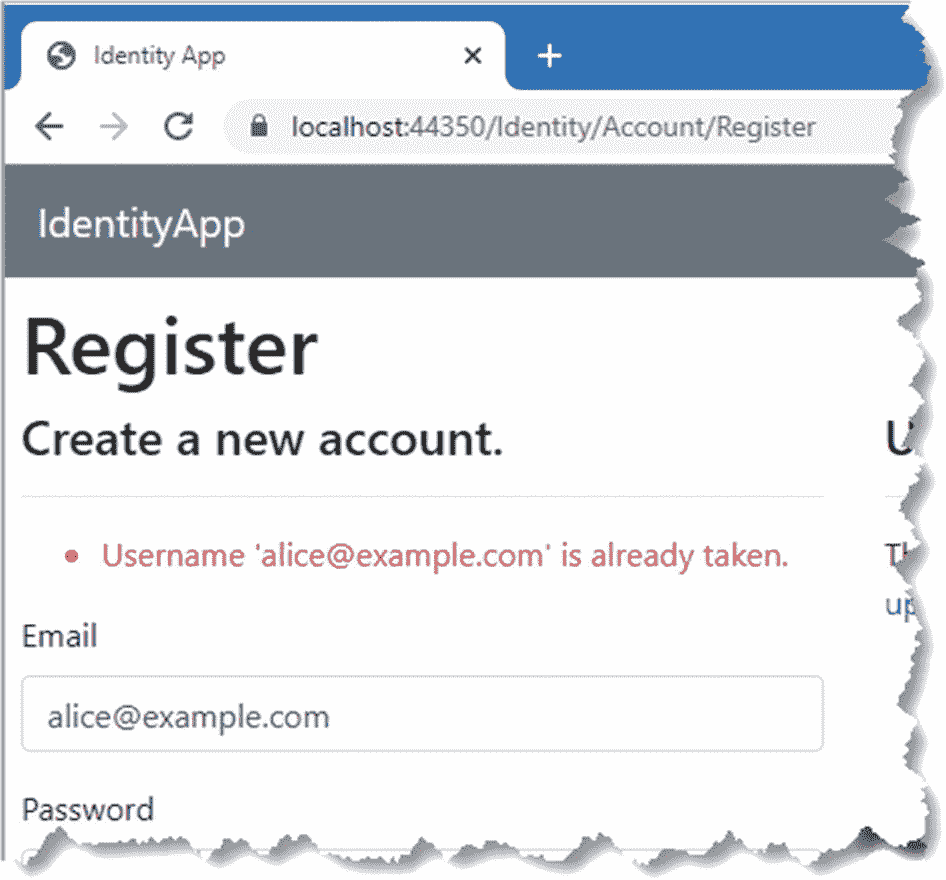
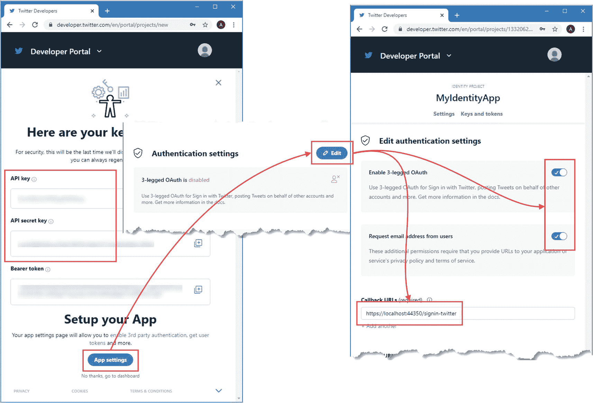

# 五、配置 Identity

在这一章中，我将解释如何配置 Identity，包括如何支持来自谷歌、脸书和 Twitter 的第三方服务。这些配置选项中的一些是 ASP.NET Core 平台的一部分，但是因为它们与 ASP.NET Core Identity 紧密相关，所以我还是把它们包括进来了。表 [5-1](#Tab1) 将配置选项放在上下文中。

表 5-1。

将 Identity 配置选项置于上下文中

<colgroup><col class="tcol1 align-left"> <col class="tcol2 align-left"></colgroup> 
| 

问题

 | 

回答

 |
| --- | --- |
| 它们是什么？ | Identity 配置选项是一组属性，其值由实现 Identity API 的类使用，可以直接使用或通过 Identity UI 包使用。 |
| 它们为什么有用？ | 这些配置选项允许您更改 Identity 的行为方式，这可以使您的应用更易于使用，或者允许您满足大型企业中常见的安全标准类型。 |
| 它们是如何使用的？ | 使用标准的 ASP.NET Core 选项模式配置 Identity。外部认证服务的配置是使用 Microsoft 为每个提供者提供的包中提供的扩展方法来完成的。 |
| 有什么陷阱或限制吗？ | 通过实施阻止用户登录的限制，确保配置更改不会给现有用户帐户带来问题，这一点很重要。 |
| 还有其他选择吗？ | 配置选项由提供 Identity API 的类使用，这意味着避免它们的唯一方法是创建自定义实现，我将在第 2 部分中对此进行解释。 |

表 [5-2](#Tab2) 总结了本章内容。

表 5-2。

章节总结

<colgroup><col class="tcol1 align-left"> <col class="tcol2 align-left"> <col class="tcol3 align-left"></colgroup> 
| 

问题

 | 

解决办法

 | 

列表

 |
| --- | --- | --- |
| 指定用户名、电子邮件地址、密码、帐户确认和锁定的策略 | 设置由`IdentityOptions`类定义的属性。 | [1](#PC1)–[4](#PC4) |
| 配置脸书认证 | 安装微软为脸书提供的包，并使用`AddFacebook`方法配置应用 ID 和密码。 | [5](#PC5)–[7](#PC7) |
| 配置 Google 认证 | 安装微软为 Google 提供的包，使用`AddGoogle`方法配置应用 ID 和 secret。 | [8](#PC9)–[10](#PC11) |
| 配置 Twitter 认证 | 安装微软为 Twitter 提供的包，并使用`AddTwitter`方法配置应用 ID 和 secret。 | [11](#PC13)–[13](#PC15) |

## 为本章做准备

本章使用第 [4 章](04.html)中的 IdentityApp 项目。准备本章不需要做任何改动。打开 PowerShell 命令提示符，导航到`IdentityApp`文件夹，运行清单 [5-1](#PC1) 中所示的命令，删除并重新创建应用和 Identity 数据库。

Tip

你可以从 [`https://github.com/Apress/pro-asp.net-core-identity`](https://github.com/Apress/pro-asp.net-core-identity) 下载本章以及本书其他章节的示例项目。如果在运行示例时遇到问题，请参见第 [1](01.html) 章获取帮助。

```cs
dotnet ef database drop --force --context ProductDbContext
dotnet ef database drop --force --context IdentityDbContext
dotnet ef database update --context ProductDbContext
dotnet ef database update --context IdentityDbContext

Listing 5-1.Resetting the Databases

```

使用 PowerShell 提示符运行清单`IdentityApp`文件夹中的 [5-2](#PC2) 所示的命令来启动应用。

```cs
dotnet run

Listing 5-2.Running the Example Application

```

打开网页浏览器，请求`https://localhost:44350`，将显示来自`Home`控制器的输出，请求`https://localhost:44350/pages`，将显示来自`Landing` Razor 页面的输出，如图 [5-1](#Fig1) 所示。


图 5-1。

运行示例应用

单击登录/注册链接，单击注册为新用户，并使用表 [5-3](#Tab3) 中显示的值创建一个新帐户。

表 5-3。

创建新帐户的值

<colgroup><col class="tcol1 align-left"> <col class="tcol2 align-left"></colgroup> 
| 

田

 | 

价值

 |
| --- | --- |
| 电子邮件 | `alice@example.com` |
| 密码 | `MySecret1$` |

单击注册按钮；新帐户将被创建，您将登录到应用，如图 [5-2](#Fig2) 所示。


图 5-2。

创建新帐户

## 配置 Identity

Identity 是使用标准的 ASP.NET Core 选项模式配置的，使用由在`Microsoft.AspNetCore.Identity`名称空间中定义的`IdentityOptions`类定义的设置。表 [5-4](#Tab4) 描述了由`IdentityOptions`类定义的最有用的属性，每个属性都有自己的一组选项，在下面的章节中描述。

表 5-4。

有用的标识选项属性

<colgroup><col class="tcol1 align-left"> <col class="tcol2 align-left"></colgroup> 
| 

名字

 | 

描述

 |
| --- | --- |
| `User` | 该属性用于使用`UserOptions`类为用户帐户配置用户名和电子邮件选项，如“配置用户选项”一节所述。 |
| `Password` | 该属性用于使用`PasswordOptions`类定义密码策略，如“配置密码选项”一节所述。 |
| `SignIn` | 该属性用于指定使用`SignInOptions`类的帐户的确认要求，如“配置登录确认要求”一节所述。 |
| `Lockout` | 该属性使用`LockoutOptions`类来定义在多次登录尝试失败后锁定帐户的策略，如“配置锁定选项”一节中所述。 |

### 配置用户选项

`IdentityOptions.User`属性被赋予一个`UserOptions`对象，用于配置表 [5-5](#Tab5) 中描述的属性。

表 5-5。

用户选项属性

<colgroup><col class="tcol1 align-left"> <col class="tcol2 align-left"></colgroup> 
| 

名字

 | 

描述

 |
| --- | --- |
| `AllowedUserNameCharacters` | 此属性指定用户名中允许的字符。默认值是一组大写和小写的 A-Z 字符、数字 0-9 和符号`-._@+`(连字符、句点、下划线、at 字符和加号)。 |
| `RequireUniqueEmail` | 此属性确定电子邮件地址是否必须是唯一的。默认值为`false`。 |

Identity UI 包不受这两个属性的影响，因为它使用电子邮件地址作为用户名。这个决定的一个后果是电子邮件地址实际上是唯一的，因为 Identity 要求用户名是唯一的。

请求`https://localhost:44350/Identity/Account/Register`并尝试使用电子邮件地址`alice@example.com`和密码`MySecret1$`创建一个账户。即使`UserOptions.RequireUniqueEmail`属性的默认值是`false`，您也会收到一条错误消息，如图 [5-3](#Fig3) 所示，因为 Identity UI 包在创建帐户时使用电子邮件地址作为用户名。



图 5-3。

使用现有电子邮件地址创建帐户

### 配置密码选项

`IdentityOptions.Password`属性被赋予一个`PasswordOptions`对象，用于配置表 [5-6](#Tab6) 中描述的属性。

表 5-6。

密码选项属性

<colgroup><col class="tcol1 align-left"> <col class="tcol2 align-left"></colgroup> 
| 

名字

 | 

描述

 |
| --- | --- |
| `RequiredLength` | 此属性指定密码的最小字符数。默认值为 6。 |
| `RequiredUniqueChars` | 此属性指定密码必须包含的最小唯一字符数。默认值为 1。 |
| `RequireNonAlphanumeric` | 此属性指定密码是否必须包含非字母数字字符，如标点字符。默认值为`true`。 |
| `RequireLowercase` | 此属性指定密码是否必须包含小写字符。默认值为`true`。 |
| `RequireUppercase` | 此属性指定密码是否必须包含大写字符。默认值为`true`。 |
| `RequireDigit` | 此属性指定密码是否必须包含数字字符。默认值为`true`。 |

`IdentityUI`包只使用电子邮件地址来识别用户，而`UserOptions.AllowedUserNameCharacters`并不适用。清单 [5-3](#PC3) 使用其他用户属性并更改密码属性来更改 Identity 配置。

```cs
...
services.AddDefaultIdentity<IdentityUser>(opts => {
    opts.Password.RequiredLength = 8;
    opts.Password.RequireDigit = false;
    opts.Password.RequireLowercase = false;
    opts.Password.RequireUppercase = false;
    opts.Password.RequireNonAlphanumeric = false;
}).AddEntityFrameworkStores<IdentityDbContext>();
...

Listing 5-3.Configuring Password Settings in the Startup.cs File in the IdentityApp Folder

```

随着简单的最小长度要求与双因素认证的结合使用，限制性密码策略正在被淘汰。清单 [5-3](#PC3) 中的设置将长度要求增加到 8 个字符，并禁用其他限制。

重新启动 ASP.NET Core，确保您使用密码`MySecret1$`登录为`alice@example.com`，单击标题中的电子邮件地址，然后单击密码链接。使用符合默认密码策略的`MySecret1$`作为当前密码，使用不符合新策略长度要求的`secret`作为新密码。新密码将被拒绝，如图 [5-4](#Fig4) 所示。使用`mysecret`作为新密码再次更改密码，这确实满足清单 [5-3](#PC3) 中指定的长度要求。如图 [5-4](#Fig4) 所示，接受较长的密码。


图 5-4。

指定密码选项

### 配置登录确认要求

`IdentityOptions.SignIn`属性被赋予一个`SignInOptions`对象，该对象用于配置使用表 [5-7](#Tab7) 中描述的属性的账户的确认要求。

表 5-7。

登录属性

<colgroup><col class="tcol1 align-left"> <col class="tcol2 align-left"></colgroup> 
| 

名字

 | 

描述

 |
| --- | --- |
| `RequireConfirmedEmail` | 当该属性设置为`true`时，只有确认了电子邮件地址的帐户才能登录。默认值为`false`。 |
| `RequireConfirmedPhoneNumber` | 当此属性设置为 true 时，只有具有确认电话号码的帐户才能登录。默认值为 false。 |
| `RequireConfirmedAccount` | 设置为`true`时，只有通过`IUserConfirmation<T>`接口验证的账户才能登录。我在第 [9 章](09.html)中详细描述了这个接口，默认实现检查邮件地址是否已经确认。该属性的默认值是`false`。 |

Identity UI 包不支持电话号码确认，因此不能将`RequireConfirmedPhoneNumber`属性设置为`true`，因为这会将所有用户锁定在应用之外。

如果应用使用电子邮件来执行诸如密码恢复之类的任务，那么将`RequireConfirmedAccount`属性设置为`true`是个好主意，如清单 [5-4](#PC4) 所示。

```cs
...
services.AddDefaultIdentity<IdentityUser>(opts => {
    opts.Password.RequiredLength = 8;
    opts.Password.RequireDigit = false;
    opts.Password.RequireLowercase = false;
    opts.Password.RequireUppercase = false;
    opts.Password.RequireNonAlphanumeric = false;
    opts.SignIn.RequireConfirmedAccount = true;

}).AddEntityFrameworkStores<IdentityDbContext>();
...

Listing 5-4.Requiring Email Confirmations in the Startup.cs File in the IdentityApp Folder

```

如果用户没有确认他们的电子邮件地址，向用户发送电子邮件的 Identity UI 功能(如密码恢复)将悄悄失败。启用`RequireConfirmedAccount`设置会在登录过程结束时显示`Account/RegisterConfirmation`页面，指示用户检查确认电子邮件。要查看此行为，请重启 ASP.NET Core 并导航至`https://localhost:44350/Identity/Account/Register`。使用表 [5-8](#Tab8) 中显示的值创建一个新账户。

Tip

在第 [6](06.html) 章中，我将向您展示如何通过定制 Identity UI 包来为用户提供更有帮助的反馈。

表 5-8。

创建新帐户的值

<colgroup><col class="tcol1 align-left"> <col class="tcol2 align-left"></colgroup> 
| 

田

 | 

价值

 |
| --- | --- |
| 电子邮件 | `bob@example.com` |
| 密码 | `mysecret` |

点击注册按钮，出现确认页面，如图 [5-5](#Fig5) 所示。


图 5-5。

Identity 用户界面确认行为

如果您尝试在不使用确认链接的情况下使用新帐户登录，则会出现一般的无效登录尝试错误。

点击`Login`页面显示的重新发送电子邮件确认链接，生成一封新的确认电子邮件，您将看到确认链接显示在 ASP.NET Core 的控制台输出中。将网址复制到浏览器中，就可以登录应用了，如图 [5-6](#Fig6) 所示。


图 5-6。

确认电子邮件地址并登录应用

### 配置锁定选项

属性`IdentityOptions.Lockout`被赋予一个`LockoutOptions`对象，用于配置在多次尝试失败后阻止登录的锁定，即使使用了正确的密码。表 [5-9](#Tab9) 描述了由`LockoutOptions`类定义的属性。Identity UI 包以不触发锁定功能的方式将用户登录到应用。我将在第 9 章[中演示如何改变这种行为。](09.html)

表 5-9。

LockoutOptions 属性

<colgroup><col class="tcol1 align-left"> <col class="tcol2 align-left"></colgroup> 
| 

名字

 | 

描述

 |
| --- | --- |
| `MaxFailedAccessAttempts` | 此属性指定在帐户被锁定之前允许的失败尝试次数。默认值为 5。 |
| `DefaultLockoutTimeSpan` | 此属性指定锁定的持续时间。默认值为 5 分钟。 |
| `AllowedForNewUsers` | 此属性确定是否为新帐户启用锁定功能。默认值为`true`。 |

## 配置外部认证

外部认证将认证用户的过程委托给第三方服务。在公司环境中，第三方服务可以是公司范围的用户目录，它允许多个应用对来自同一组帐户的用户进行认证。

对于大多数面向互联网的应用，外部服务由大型技术/社交媒体公司提供，如谷歌、脸书和 Twitter，利用这些公司享有的庞大用户群以及这些服务支持的更广泛的双因素 Identity 认证方案，这些方案在 Identity 认证中不可用。

外部认证一般使用 OAuth 协议，我会在第 [22](22.html) 章详细描述。每个外部服务都需要一个注册过程，在此过程中描述应用并声明用户数据的访问级别，即所谓的*范围*。

在注册过程中，你通常需要指定一个*重定向 URL* 。在认证过程中，外部服务将向用户的浏览器发送到该 URL 的 HTTP 重定向，这将触发对 ASP.NET Core 的请求，为应用提供完成登录所需的数据。在开发过程中，这个 URL 将指向`localhost`，比如`https://localhost:44350/signin-google`，这样您就可以在您的开发机器上轻松测试外部认证。

Note

当您准备好部署您的应用时，您将需要更新您的应用在每个外部服务中的注册，以使用包含出现在 DNS 中的主机名的可公开访问的 URL。

注册过程产生两个数据项:客户 ID 和客户秘密。客户端 ID 向外部认证服务标识应用，并且可以公开共享。顾名思义，客户端机密是秘密的，应该受到保护。

Getting Help With External Authentication

我在下面几节中描述的设置过程在撰写本文时是正确的，但在您阅读本章时可能会发生变化。微软发布了最流行的外部认证服务的说明，您可以在 [`https://docs.microsoft.com/en-us/aspnet/core/security/authentication/social`](https://docs.microsoft.com/en-us/aspnet/core/security/authentication/social) 找到。每个认证服务还提供文档，在下面的部分中有相关链接。

请不要给我发电子邮件请求帮助设置外部认证。我试图帮助读者解决大多数问题，但解决外部认证问题需要登录读者的谷歌/脸书/推特账户，这是我不会做的事情。

### 配置脸书认证

要在脸书注册应用，请前往 [`https://developers.facebook.com/apps`](https://developers.facebook.com/apps) ，使用您的脸书帐户登录。单击创建应用按钮，从列表中选择构建互联体验，然后单击继续按钮。在应用显示名称字段中输入`IdentityApp`,然后单击创建应用按钮。该顺序如图 [5-7](#Fig7) 所示。


图 5-7。

创建新的应用

一旦您创建了脸书应用，您将返回到开发人员仪表板，并显示可选产品列表。找到脸书登录并点击设置按钮。您将看到一组快速启动选项，但这些选项可以忽略，因为重要的配置选项显示在仪表盘显示屏左侧的 Facebook 登录➤设置部分，如图 [5-8](#Fig8) 所示。


图 5-8。

脸书登录设置

您不需要指定重定向 URL，因为脸书允许在开发期间重定向到`localhost`URL。当您准备好部署应用时，您需要返回到此页面并完成您的配置，包括提供面向公众的重定向 URL。配置选项的详细信息包含在脸书登录文档中，可在 [`https://developers.facebook.com/docs/facebook-login`](https://developers.facebook.com/docs/facebook-login) 找到。

导航到设置区域的基本部分以获得应用 ID 和应用密码，如图 [5-9](#Fig9) 所示，这是脸书用于表示客户端 ID 和密码的术语。(在您点按“显示”按钮之前，App Secret 是隐藏的。)记下这些值，在下一节中配置应用时会用到它们。


图 5-9。

外部认证的应用凭据

#### 为脸书认证配置 ASP.NET Core

运行清单 [5-5](#PC5) 中所示的命令，使用。NET secrets 特性，它确保当源代码被提交到存储库时，这些值不会被包含在内。

```cs
dotnet user-secrets init
dotnet user-secrets set "Facebook:AppId" "<app-id>"

dotnet user-secrets set "Facebook:AppSecret" "<app-secret>"

Listing 5-5.Storing the Facebook ID and Secret

```

第一个命令初始化秘密存储。其他命令存储数据值，因此可以在使用 ASP.NET Core 配置系统的应用中访问这些数据值。接下来，运行`IdentityApp`文件夹中清单 [5-6](#PC6) 中所示的命令，将包含脸书认证的包添加到项目中。

```cs
dotnet add package Microsoft.AspNetCore.Authentication.Facebook --version 5.0.0

Listing 5-6.Adding the Facebook Package

```

要配置应用，将清单 [5-7](#PC7) 中所示的语句添加到`Startup`类中。

```cs
...
public void ConfigureServices(IServiceCollection services) {
    services.AddControllersWithViews();
    services.AddRazorPages();
    services.AddDbContext<ProductDbContext>(opts => {
        opts.UseSqlServer(
            Configuration["ConnectionStrings:AppDataConnection"]);
    });

    services.AddHttpsRedirection(opts => {
        opts.HttpsPort = 44350;
    });

    services.AddDbContext<IdentityDbContext>(opts => {
        opts.UseSqlServer(
            Configuration["ConnectionStrings:IdentityConnection"],
            opts => opts.MigrationsAssembly("IdentityApp")
        );
    });

    services.AddScoped<IEmailSender, ConsoleEmailSender>();

    services.AddDefaultIdentity<IdentityUser>(opts => {
        opts.Password.RequiredLength = 8;
        opts.Password.RequireDigit = false;
        opts.Password.RequireLowercase = false;
        opts.Password.RequireUppercase = false;
        opts.Password.RequireNonAlphanumeric = false;

        opts.SignIn.RequireConfirmedEmail = true;
    })
    .AddEntityFrameworkStores<IdentityDbContext>();

    services.AddAuthentication()
        .AddFacebook(opts => {
            opts.AppId = Configuration["Facebook:AppId"];
            opts.AppSecret = Configuration["Facebook:AppSecret"];
        });
}
...

Listing 5-7.Configuring Facebook Authentication in the Startup.cs File in the IdentityApp Folder

```

`AddAuthentication`方法设置了 ASP.NET Core 认证特性，我将在第 2 部分中详细描述。这个方法是由`AddDefaultIdentity`方法自动调用的，这也是为什么直到现在还不需要它的原因。`AddFacebook`方法设置由微软提供的脸书认证支持，这是使用 options 模式和`FacebookOptions`类配置的。表 [5-10](#Tab10) 描述了最重要的配置属性。

表 5-10。

选定的 Facebook 选项属性

<colgroup><col class="tcol1 align-left"> <col class="tcol2 align-left"></colgroup> 
| 

名字

 | 

描述

 |
| --- | --- |
| `AppId` | 此属性用于配置应用 ID，这是脸书用于表示客户端 ID 的术语。在这个例子中，我从清单 [5-5](#PC5) 中创建的秘密中读取值。 |
| `AppSecret` | 此属性用于配置 App Secret，这是脸书用于表示客户端机密的术语。在这个例子中，我从清单 [5-5](#PC5) 中创建的秘密中读取值。 |
| `Fields` | 此属性指定在认证期间从脸书请求的数据值。默认值为`name`、`email`、`first_name`和`last_name`。参见 [`https://developers.facebook.com/docs/graph-api/reference/user`](https://developers.facebook.com/docs/graph-api/reference/user) 查看完整的字段列表，但请记住，有些字段需要申请通过额外的验证过程。 |

重新启动 ASP.NET Core，并确保您通过单击标题中的注销链接，然后再次在显示的页面中注销应用。接下来，单击级别 2 按钮触发质询响应，您将看到 Identity UI 包已自动检测到脸书配置。单击脸书按钮，您将被重定向到脸书认证服务。一旦通过认证，您将被要求批准示例应用访问您的数据，然后被重定向到该应用以完成注册过程，如图 [5-10](#Fig10) 所示。


图 5-10。

与脸书一起登录

Identity UI 包提供的默认外部认证注册工作流允许用户创建一个帐户，其电子邮件地址不同于与脸书帐户关联的电子邮件地址。这意味着必须发送确认消息，以确保用户控制指定的电子邮件地址。如果您检查 ASP.NET Core 控制台的输出，您将会看到与此类似的消息(为简洁起见，我缩短了确认码):

```cs
---New Email----
To: adam@example.com
Subject: Confirm your email
Please confirm your account by <a href='https://localhost:44350/Identity/Account/ConfirmEmail?userId=8917d84d'>
   clicking here
</a>.
-------

```

因此，用户必须单击电子邮件中的链接才能再次登录。我将在第 [6](06.html) 章中向您展示如何定制 Identity UI 包来改变这种行为。

### 配置 Google 认证

要注册示例应用，请导航至 [`https://console.developers.google.com`](https://console.developers.google.com) ，并使用 Google 帐户登录。单击 OAuth 同意屏幕选项，并为用户类型选择外部，这将允许任何 Google 帐户对您的应用进行认证。

Tip

您可能会看到一条消息，告诉您还没有可用的 API。当您只需要验证用户时，这并不重要。

单击 Create，您将看到一个表单。在应用名称字段中输入 IdentityApp，并在表单的用户支持电子邮件和开发人员联系信息部分输入您的电子邮件地址。对于示例应用，表单的其余部分可以留空。

单击 Save and Continue，您将看到 scope selection 屏幕，该屏幕用于指定您的应用需要的作用域。

单击 Add 或 Remove Scopes 按钮，您将看到您的应用可以请求的范围列表。检查三个范围:`openid`、`auth/userinfo.email`和`auth/userinfo.profile`。单击“更新”按钮保存您的选择。

单击保存并继续返回 OAuth 同意屏幕，然后单击返回仪表板。图 [5-11](#Fig11) 显示了配置同意屏幕的顺序。


图 5-11。

配置 Google OAuth 同意屏幕

点击发布应用按钮，点击确认，如图 [5-12](#Fig12) 所示，这将允许任何 Google 账户被认证。


图 5-12。

发布应用

单击凭据链接，单击页面顶部的创建凭据按钮，并从选项列表中选择 OAuth 客户端 ID。

从应用类型列表中选择 Web 应用，并在名称字段中输入 IdentityApp。在授权重定向 URIs 部分点击添加 URI，并在文本字段中输入`https://localhost:44350/signin-google`。点击创建按钮，你将看到你的应用的客户端 ID 和客户端密码，如图 [5-13](#Fig13) 所示(虽然我已经模糊了细节，因为这些是我的账户)。记下 ID 和密码，它们将用于配置应用。


图 5-13。

配置应用凭据

#### 为 Google 认证配置 ASP.NET Core

运行清单 [5-8](#PC9) 中所示的命令，使用。NET secrets 特性，它确保当源代码被提交到存储库时，这些值不会被包含在内。

```cs
dotnet user-secrets init
dotnet user-secrets set "Google:ClientId" "<client-id>"

dotnet user-secrets set "Google:ClientSecret" "<client-secret>"

Listing 5-8.Storing the Google Client ID and Secret

```

第一个命令初始化秘密存储。其他命令存储数据值，因此可以在使用 ASP.NET Core 配置系统的应用中访问这些数据值。接下来，在`IdentityApp`文件夹中运行清单 [5-9](#PC10) 中所示的命令，将包含 Google 认证的包添加到项目中。

```cs
dotnet add package Microsoft.AspNetCore.Authentication.Google --version 5.0.0

Listing 5-9.Adding the Google Package

```

要配置应用，将清单 [5-10](#PC11) 中所示的语句添加到`Startup`类中。

```cs
...
services.AddAuthentication()
    .AddFacebook(opts => {
        opts.AppId = Configuration["Facebook:AppId"];
        opts.AppSecret = Configuration["Facebook:AppSecret"];
    })
    .AddGoogle(opts => {
        opts.ClientId = Configuration["Google:ClientId"];
        opts.ClientSecret = Configuration["Google:ClientSecret"];
    });
...

Listing 5-10.Configuring Google Authentication in the Startup.cs File in the IdentityApp Folder

```

`AddGoogle`方法设置 Google 认证处理程序，并使用 options 模式和`GoogleOptions`类进行配置。表 [5-11](#Tab11) 描述了最重要的`GoogleOptions`属性。

表 5-11。

选定的 GoogleOptions 属性

<colgroup><col class="tcol1 align-left"> <col class="tcol2 align-left"></colgroup> 
| 

名字

 | 

描述

 |
| --- | --- |
| `ClientId` | 此属性用于指定应用的客户端 ID。在这个例子中，我使用存储在清单 [5-8](#PC9) 中的值。 |
| `ClientSecret` | 此属性用于指定应用的客户端机密。在清单中，我使用清单 [5-8](#PC9) 中存储的值。 |
| `Scope` | 此属性用于设置认证服务请求的范围。默认值请求在安装过程中指定的作用域，但是还有其他作用域可用。 [`https://developers.google.com/identity/protocols/oauth2/web-server`见](https://developers.google.com/identity/protocols/oauth2/web-server)。 |

重新启动 ASP.NET Core，并确保您通过单击标题中的注销链接并再次在显示的页面中注销应用。接下来，单击 Level 2 按钮触发质询响应，您将看到 Identity UI 包已经自动检测到 Google 配置。单击 Google 按钮，您将被重定向到 Google 认证服务。通过认证后，您将被重定向到应用以完成注册过程，如图 [5-14](#Fig14) 所示。


图 5-14。

与脸书一起登录

和前面的例子一样，用户可以输入一个与 Google 帐户相关的不同的电子邮件地址，这意味着用户必须遵循确认电子邮件中的链接，然后才能再次登录应用。如果您检查 ASP.NET Core 控制台的输出，您将会看到与此类似的消息(为简洁起见，我缩短了确认码):

```cs
---New Email----
To: adam@acme.com
Subject: Confirm your email
Please confirm your account by <a href='https://localhost:44350/Identity/Account/ConfirmEmail?userId=65e6b14e'>
    clicking here
</a>.
-------

```

确认电子邮件地址后，用户可以使用 Google 帐户再次登录。

### 配置 Twitter 认证

要使用 Twitter 注册应用，请前往 [`https://developer.twitter.com/en/portal/dashboard`](https://developer.twitter.com/en/portal/dashboard) 并使用 Twitter 帐户登录。单击 Create Project 按钮，将项目名称设置为 Identity Project，然后单击 Next 按钮。从列表中选择一个描述，然后单击“下一步”按钮。输入名称，点击完成按钮，完成设置的第一部分，如图 [5-15](#Fig15) 所示。该名称必须是唯一的，所以可能需要一段时间才能找到一个可用的名称，但是对于这个示例来说，它是什么并不重要。


图 5-15。

创建 Twitter 应用配置

当你创建 Twitter 应用时，你会看到一组按键，如图 [5-16](#Fig16) 所示。记下 API key 和 API key secret(这是 Twitter 对客户端 ID 和客户端 secret 的称呼)非常重要，因为您将无法再看到它们。



图 5-16。

完成注册过程

单击应用设置按钮，然后单击认证设置类别的编辑按钮。选择“启用三脚 OAuth 并向用户请求电子邮件地址”选项，并在“回调 URL”字段中输入 https://localhost:44350/sign in-Twitter。您还必须输入网站的 URL、服务条款和隐私政策字段。本章使用什么 URL 并不重要，但是当你注册一个真实的项目时，你将需要具有合适内容的 URL。

#### 为 Twitter 认证配置 ASP.NET Core

运行清单 [5-11](#PC13) 中所示的命令，使用。NET secrets 特性，它确保当源代码被提交到存储库时，这些值不会被包含在内。

```cs
dotnet user-secrets init
dotnet user-secrets set "Twitter:ApiKey" "<client-id>"

dotnet user-secrets set "Twitter:ApiSecret" "<client-secret>"

Listing 5-11.Storing the Twitter Client ID and Secret

```

第一个命令初始化秘密存储。其他命令存储数据值，因此可以在使用 ASP.NET Core 配置系统的应用中访问这些数据值。接下来，在`IdentityApp`文件夹中运行清单 [5-12](#PC14) 中所示的命令，将包含 Twitter 认证的包添加到项目中。

```cs
dotnet add package Microsoft.AspNetCore.Authentication.Twitter --version 5.0.0

Listing 5-12.Adding the Twitter Package

```

要配置应用，将清单 [5-13](#PC15) 中所示的语句添加到`Startup`类中。

```cs
...
services.AddAuthentication()
    .AddFacebook(opts => {
        opts.AppId = Configuration["Facebook:AppId"];
        opts.AppSecret = Configuration["Facebook:AppSecret"];
    })
    .AddGoogle(opts => {
        opts.ClientId = Configuration["Google:ClientId"];
        opts.ClientSecret = Configuration["Google:ClientSecret"];
    })
    .AddTwitter(opts => {
        opts.ConsumerKey = Configuration["Twitter:ApiKey"];
        opts.ConsumerSecret = Configuration["Twitter:ApiSecret"];
    });
...

Listing 5-13.Configuring Twitter Authentication in the Startup.cs File in the IdentityApp Folder

```

`Twitter`方法设置 Twitter 认证处理程序，并使用 options 模式和`TwitterOptions`类进行配置。表 [5-12](#Tab12) 描述了最重要的`TwitterOptions`属性。

表 5-12。

选定的 TwitterOptions 属性

<colgroup><col class="tcol1 align-left"> <col class="tcol2 align-left"></colgroup> 
| 

名字

 | 

描述

 |
| --- | --- |
| `ConsumerKey` | 此属性用于指定应用的客户端 ID。在这个例子中，我使用存储在清单 [5-11](#PC13) 中的值。 |
| `ConsumerSecret` | 此属性用于指定应用的客户端机密。在清单中，我使用存储在清单 [5-11](#PC13) 中的值。 |
| `RetrieveUserDetails` | 当设置为`true`时，该属性请求用户数据，包括电子邮件地址，作为认证过程的一部分。使用 Identity UI 包时不需要该属性，它允许用户输入电子邮件地址。 |

重新启动 ASP.NET Core，并确保您通过单击标题中的注销链接并再次在显示的页面中注销应用。接下来，单击 Level 2 按钮触发质询响应，您将看到 Identity UI 包已经自动检测到 Twitter 配置。单击 Twitter 按钮，您将被重定向到 Twitter 认证服务。通过认证后，您将被重定向到应用以完成注册过程，如图 [5-17](#Fig17) 所示。


图 5-17。

使用 Twitter 登录

与前面的示例一样，用户可以输入与 Twitter 帐户关联的电子邮件地址不同的电子邮件地址，这意味着用户在再次登录应用之前，必须遵循确认电子邮件中的链接。如果您检查 ASP.NET Core 控制台的输出，您将会看到与此类似的消息(为简洁起见，我缩短了确认码):

```cs
---New Email----
To: adam@mycompany.com
Subject: Confirm your email
Please confirm your account by <a href='https://localhost:44350/Identity/Account/ConfirmEmail?userId=fa1b86c2'>
    clicking here
</a>.
-------

```

确认电子邮件地址后，用户可以使用 Twitter 帐户再次登录。

## 摘要

在本章中，我描述了 Identity 配置选项，这些选项决定了帐户、密码和控制相关功能(如锁定)的验证要求。我还描述了配置 ASP.NET Core 和 Identity UI 包以支持来自 Google、脸书和 Twitter 的外部认证服务的过程。在下一章中，我将向您展示如何调整 Identity UI 包提供的工作流。