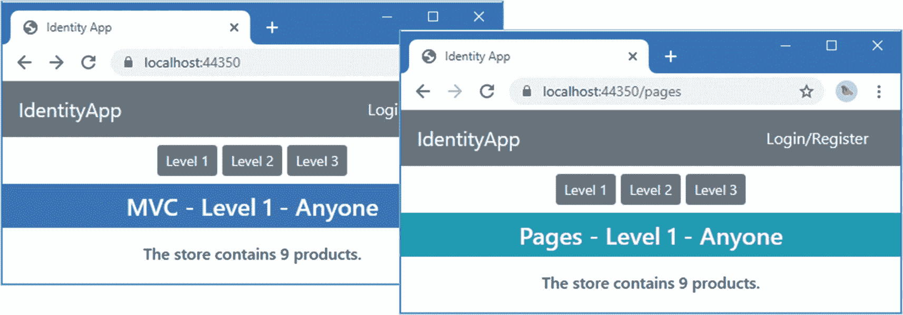
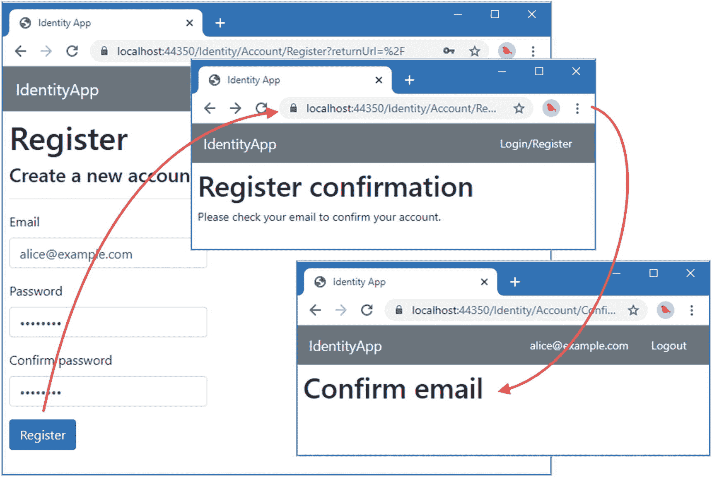
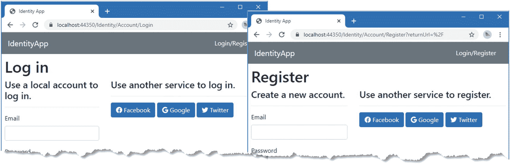
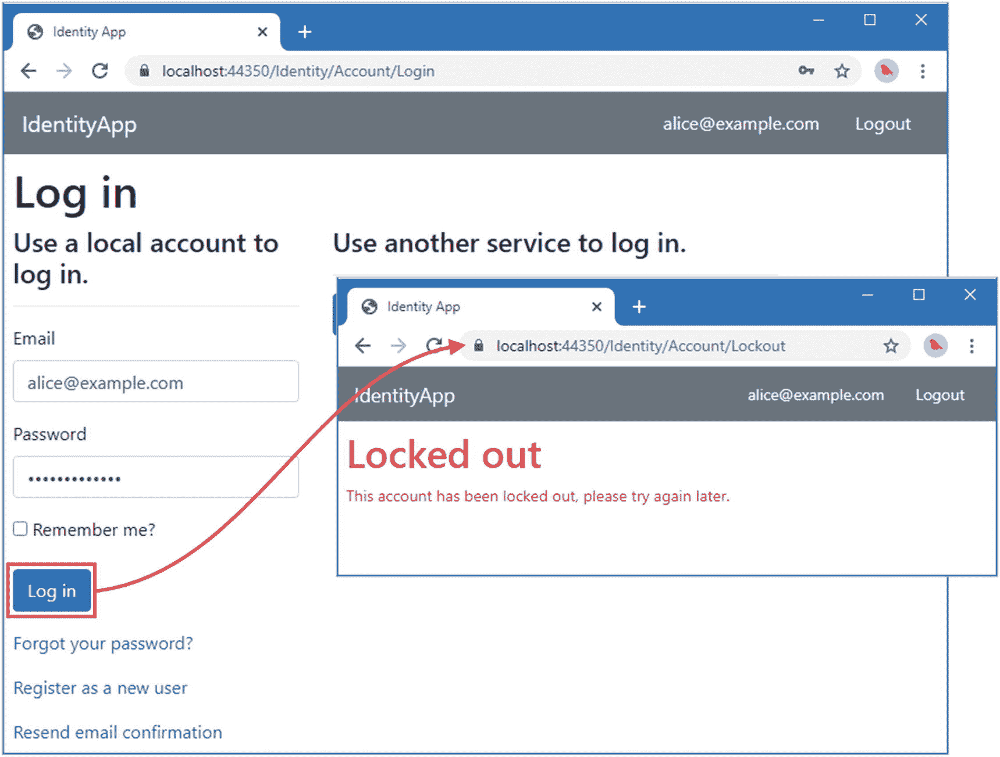
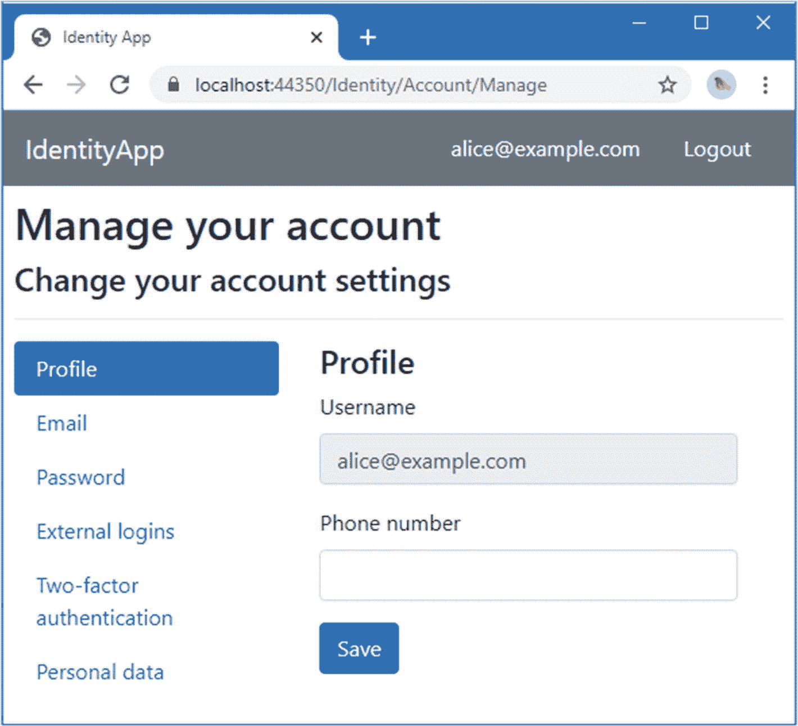
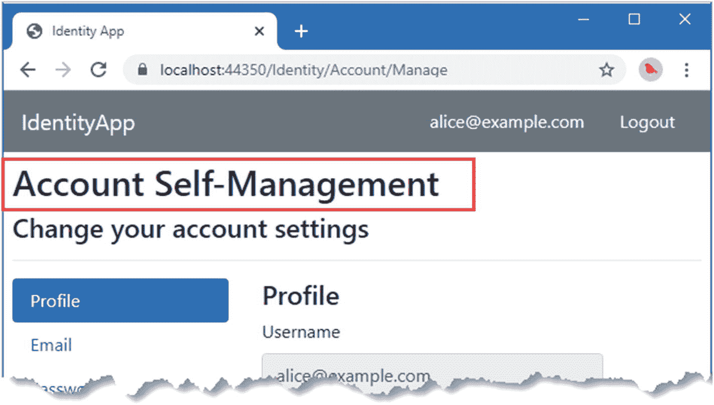
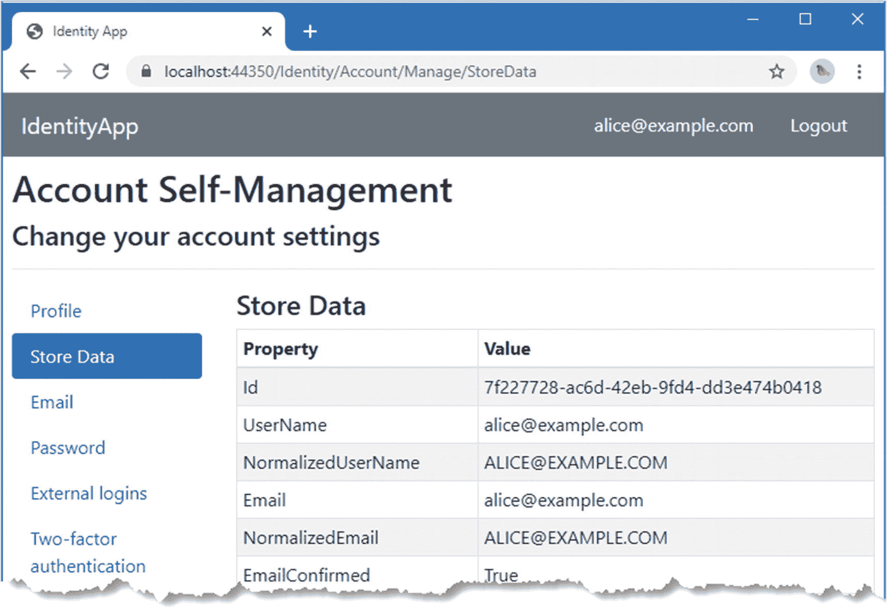
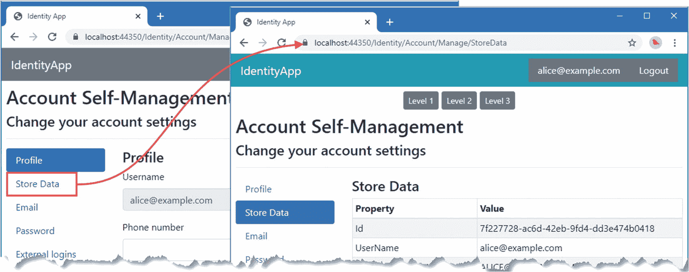
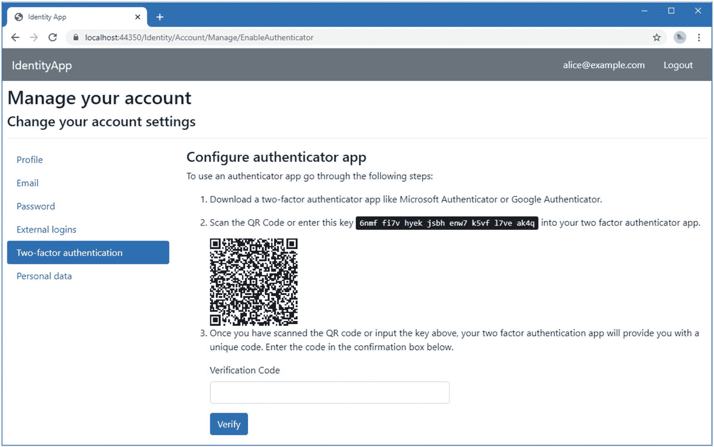
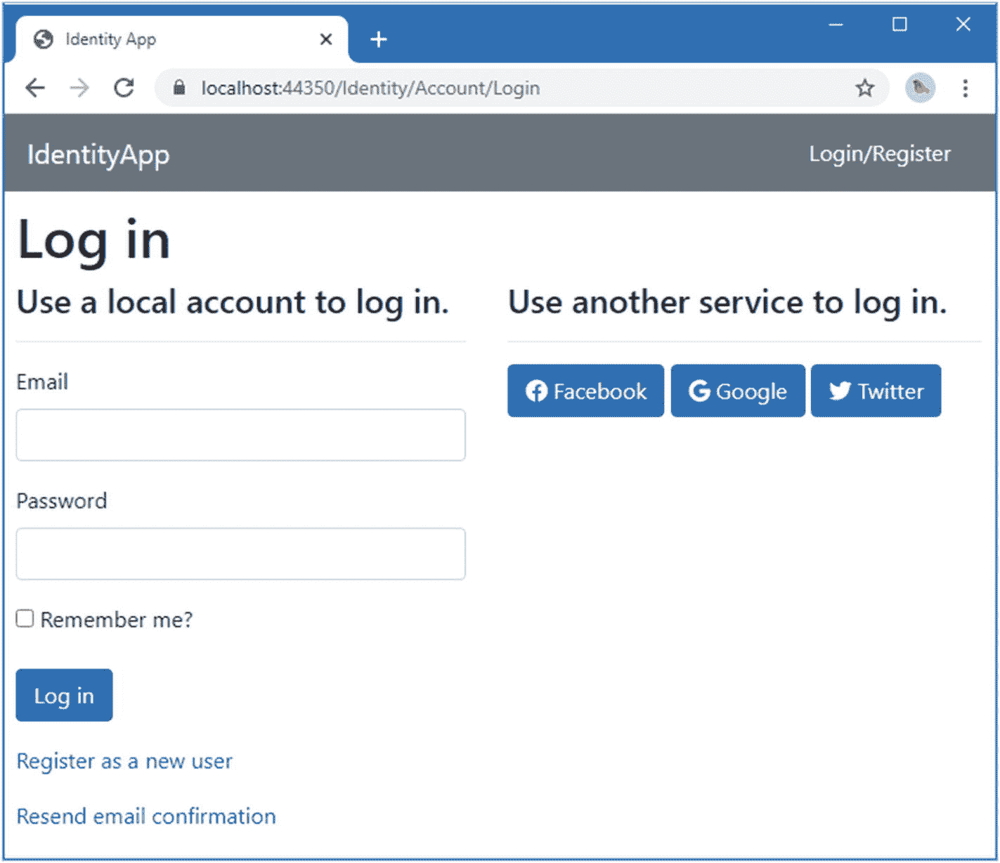

# 六、调整 Identity 用户界面

Identity UI 包是为自助服务应用设计的，这些应用支持双因素 Identity 认证和第三方服务外部 Identity 认证的授权码。该设计具有一定的灵活性，因此可以更改或禁用个别功能，也可以引入新功能。在这一章中，我解释了修改 Identity UI 包的过程，展示了定制它的不同方法。

然而，变化的程度是有限的，在第 [7](07.html) 到 [12](12.html) 章中，我将向您展示如何直接使用 Identity 提供的 API 来创建完全自定义的工作流，以取代 Identity UI 包。表 [6-1](#Tab1) 将适配 Identity UI 放在上下文中。

表 6-1。

将 Identity 用户界面适配放在上下文中

<colgroup><col class="tcol1 align-left"> <col class="tcol2 align-left"></colgroup> 
| 

问题

 | 

回答

 |
| --- | --- |
| 它们是什么？ | 改编允许将 Identity UI 包中的文件添加到项目中，以便可以修改它们，从而允许创建、自定义或禁用功能。 |
| 它们为什么有用？ | 如果您的项目几乎符合 Identity UI 包所期望的一般模型，则改编可以定制 Identity UI，使其完全符合您的需求。 |
| 它们是如何使用的？ | Razor 页面、视图和其他文件通过一个叫做*脚手架*的过程被添加到项目中。搭建文件的优先级高于 Identity UI 包中的文件，这意味着对搭建文件所做的更改将成为呈现给用户的内容的一部分。 |
| 有什么陷阱或限制吗？ | 尽管您可以自定义单个功能，但您无法调整 Identity UI 包所采用的底层方法，这意味着您可以进行的更改范围有限。有些搭建操作会覆盖文件，即使它们已被更改，这需要将文件笨拙地转移到受保护的定制。 |
| 有其他选择吗？ | Identity 提供了一个可用于创建定制工作流的 API，如第 [7](07.html) 至 [12](12.html) 章所述。 |

表 [6-2](#Tab2) 总结了本章内容。

表 6-2。

章节总结

<colgroup><col class="tcol1 align-left"> <col class="tcol2 align-left"> <col class="tcol3 align-left"></colgroup> 
| 

问题

 | 

解决办法

 | 

列表

 |
| --- | --- | --- |
| 搭建 Identity UI 文件 | 安装代码生成器全局工具包，将 Identity UI 搭建包添加到项目中，并使用 dotnet `aspnet-codegenerator`命令搭建您需要的文件。 | [1](#PC1)–[13](#PC16) |
| 脚手架帐户管理功能或外观 | 使用 scaffolding 命令选择文件名以`Account.Manage`开头的文件，对应于`Areas/Identity/Pages/Account/Manage`文件夹。 | [14](#PC17)–[16](#PC20)、 [20](#PC26) 、 [21](#PC27) |
| 添加新功能 Identity 用户界面 | 搭建导航类和 Razor 页面，并添加链接到实现新特性的 Razor 页面。 | [17](#PC21)–[19](#PC23) |
| 更改共享视图或类后搭建新文件 | 将修改后的文件移动到安全的位置，并在不编译项目的情况下移植其他文件。 | [22](#PC28)–[26](#PC32) |
| 禁用 Identity 用户界面功能 | 搭建定义特性的文件并替换页面模型类中的处理程序方法。将包含指向禁用功能的导航链接的文件支架化并删除它们。 | [27](#PC33)–[29](#PC35) |

## 为本章做准备

本章使用第 [5 章](05.html)中的 IdentityApp 项目。打开一个新的 PowerShell 命令提示符，并运行清单 [6-1](#PC1) 中所示的命令来重置应用和 Identity 数据库。

Tip

你可以从 [`https://github.com/Apress/pro-asp.net-core-identity`](https://github.com/Apress/pro-asp.net-core-identity) 下载本章以及本书其他章节的示例项目。如果在运行示例时遇到问题，请参见第 [1](01.html) 章获取帮助。

```cs
dotnet ef database drop --force --context ProductDbContext
dotnet ef database drop --force --context IdentityDbContext
dotnet ef database update --context ProductDbContext
dotnet ef database update --context IdentityDbContext

Listing 6-1.Resetting the Databases

```

使用 PowerShell 提示符运行清单 [6-2](#PC2) 中的命令来启动应用。

```cs
dotnet run

Listing 6-2.Running the Example Application

```

打开网页浏览器，请求`https://localhost:44350`，将显示来自`Home`控制器的输出，请求`https://localhost:44350/pages`，将显示来自`Landing` Razor 页面的输出，如图 [6-1](#Fig1) 所示。



图 6-1。

运行示例应用

点击登录/注册链接，点击注册为新用户，并使用表 [6-3](#Tab3) 中显示的详细信息创建一个用户帐户。

表 6-3。

账户详情

<colgroup><col class="tcol1 align-left"> <col class="tcol2 align-left"></colgroup> 
| 

田

 | 

价值

 |
| --- | --- |
| 电子邮件 | `alice@example.com` |
| 密码 | `mysecret` |

单击注册按钮创建帐户。检查 ASP.NET Core 控制台输出，您将看到一封确认电子邮件，类似于以下内容:

```cs
---New Email----
To: alice@example.com
Subject: Confirm your email
Please confirm your account by <a href='https://localhost:44350
/Identity/Account/ConfirmEmail?userId=395a955f &returnUrl=%2F'>
    clicking here
</a>.
-------

```

将网址复制到浏览器中确认账号，以便再次登录，如图 [6-2](#Fig2) 所示。



图 6-2。

创建和确认账户

## 了解 Identity UI 搭建

Identity UI 包使用 ASP.NET Core 区域特性，该特性允许项目中定义的 Razor 页面覆盖 UI 包中的页面，只要它们在特定的文件夹中，也就是`Areas/Identity/Pages`。这个文件夹已经存在于项目中，它包含了我创建的 Razor 视图开始文件，以确保布局的一致性。

您可以简单地创建名称与第 [4](04.html) 章中的工作流中描述的名称相匹配的 Razor 页面，它们将覆盖 Identity UI 包中的页面，但这意味着您要负责重新创建提供原始页面功能的 HTML 内容和 C# 代码。为了便于在现有特性的基础上构建，Identity UI 包将在您的项目中创建替换的 Razor 页面，因此您可以修改特性，而不是完全重新创建它们。这个过程被称为*脚手架*。

## 准备 Identity 用户界面搭建

搭建过程依赖于全局。NET 工具包。使用 PowerShell 命令提示符运行清单 [6-3](#PC4) 中所示的命令，删除软件包的任何现有版本，并安装本章所需的版本。(如果您之前没有安装该软件包，第一个命令可能会出错。)

```cs
dotnet tool uninstall --global dotnet-aspnet-codegenerator
dotnet tool install --global dotnet-aspnet-codegenerator --version 5.0.0

Listing 6-3.Installing the Scaffolding Tool Package

```

必须向项目中添加一个额外的包，以便为全局工具提供创建新项所需的模板。使用 PowerShell 提示符运行`IdentityApp`文件夹中清单 [6-4](#PC5) 所示的命令。

```cs
dotnet add package Microsoft.VisualStudio.Web.CodeGeneration.Design --version 5.0.0

Listing 6-4.Adding the Scaffolding Package

```

## 列出脚手架的 Identity UI 页面

命令行搭建工具允许搭建单个页面。通过运行`IdentityApp`文件夹中清单 [6-5](#PC6) 中所示的命令，您可以看到可用于搭建的 Razor 页面的完整列表。

Other Uses For the Identity Scaffolding Tool

scaffolding 工具还可以用于向项目添加 Identity，包括生成数据库上下文类和向`Startup`类添加语句。我不描述这些功能，因为了解如何配置 Identity 以确保您获得预期的功能非常重要，即使在使用 Identity UI 包提供用户体验时也是如此。您可以通过在一个已经配置为使用 Identity scaffold 工具的项目中运行`dotnet aspnet-codegenerator identity`命令来查看选项列表，但是我的建议是仔细检查结果以确保您产生了预期的效果。

```cs
dotnet aspnet-codegenerator identity --listFiles

Listing 6-5.Listing the Pages Available for Scaffolding

```

这是输出的第一部分，对应于第 [5](05.html) 章中描述的 Razor 页面:

```cs
...
Account._StatusMessage
Account.AccessDenied
Account.ConfirmEmail
Account.ConfirmEmailChange
Account.ExternalLogin
Account.ForgotPassword
Account.ForgotPasswordConfirmation
Account.Lockout
Account.Login
Account.LoginWith2fa
...

```

要使用脚手架功能，请从第 [5](05.html) 章中描述的工作流中确定哪些页面与您感兴趣的功能相关，并使用以下章节中描述的技术之一来禁用、更改或添加功能。

## 使用 Identity 用户界面脚手架

在接下来的小节中，我将向您展示如何使用搭建特性来更改 Identity UI 使用的 Razor 页面。

### 使用脚手架改变 HTML

使用支架特性最简单的方法是只改变 Razor UI 页面产生的 HTML。在这一节中，我将使用这种技术来改进允许外部服务登录的按钮的外观，比如 Google 和脸书。要做好准备，运行清单 [6-6](#PC8) 中的命令来安装字体 Awesome 包，它包括主要平台的公司标志。

```cs
libman install font-awesome@5.15.1 -d wwwroot/lib/font-awesome

Listing 6-6.Installing the Font Awesome Package

```

将清单 [6-7](#PC9) 中所示的元素添加到 Identity UI 包使用的布局中，以将字体 Awesome 样式合并到发送到浏览器的 HTML 中。

```cs
<!DOCTYPE html>

<html>
<head>
    <meta name="viewport" content="width=device-width" />
    <title>Identity App</title>
    <link rel="stylesheet" href="/Identity/lib/bootstrap/dist/css/bootstrap.css" />
    <link rel="stylesheet" href="/Identity/css/site.css" />
    <script src="/Identity/lib/jquery/dist/jquery.js"></script>
    <script src="/Identity/lib/bootstrap/dist/js/bootstrap.bundle.js"></script>
    <script src="/Identity/js/site.js" asp-append-version="true"></script>
    <script type="text/javascript" src="/lib/qrcode/qrcode.min.js"></script>
    <link href="/lib/font-awesome/css/all.min.css" rel="stylesheet" />
</head>
<body>
    <nav class="navbar navbar-dark bg-secondary">
        <a class="navbar-brand text-white">IdentityApp</a>
        <div class="text-white"><partial name="_LoginPartial" /></div>
    </nav>
    <div class="m-2">
        @RenderBody()
        @await RenderSectionAsync("Scripts", required: false)
    </div>
    <script type="text/javascript">
        var element = document.getElementById("qrCode");
        if (element !== null) {
            new QRCode(element, {
                text: document.getElementById("qrCodeData").getAttribute("data-url"),
                width: 150, height: 150
            });
            element.previousElementSibling?.remove();
        }
    </script>
</body>
</html>

Listing 6-7.Adding an Element in the _CustomIdentityLayout.cshtml File in the Views/Shared Folder

```

将名为`_ExternalButtonPartial.cshtml`的 Razor 视图添加到`Views/Shared`文件夹中，并使用它来定义清单 [6-8](#PC10) 中所示的局部视图。

```cs
@model Microsoft.AspNetCore.Authentication.AuthenticationScheme

<button type="submit"
        class="btn btn-primary" name="provider" value="@Model.Name">
    <i class="@($"fab fa-{Model.Name.ToLower()}")"></i>
    @Model.DisplayName
</button>

Listing 6-8.The Contents of the _ExternalButtonPartial.cshtml File in the Views/Shared Folder

```

局部视图的模型是一个`AuthenticationScheme`对象，这是 ASP.NET Core 如何描述一个认证选项，具有`Name`和`DisplayName`属性。(`AuthenticationScheme`类——以及许多其他类——将在第 2 部分中描述。)

局部视图呈现了一个 HTML 按钮，它有一个来自字体 Awesome 包的图标，这个图标是用`i`元素添加的。

现在，通过运行在`IdentityApp`文件夹中的清单 [6-9](#PC11) 中显示的命令，搭建向用户显示登录按钮的页面。

```cs
dotnet aspnet-codegenerator identity --dbContext Microsoft.AspNetCore.Identity.EntityFrameworkCore.IdentityDbContext --files Account.Login

Listing 6-9.Scaffolding an Identity UI Razor Page

```

dotnet `aspnet-codegenerator identity`选择 Identity UI 搭建工具。`--dbContext`参数用于指定实体框架核心数据库上下文类。此参数必须指定应用使用的上下文类的完整名称，包括名称空间。如果名称不完全匹配，支架工具将创建一个新的数据库上下文类，这将导致以后的结果不一致。`--files`参数指定应该搭建的文件，使用前一节中生成的列表中的一个或多个名称，用分号分隔。我选择了`Account.Login`页面，它负责向用户显示外部认证按钮。

清单 [6-9](#PC11) 中的命令将几个文件添加到项目中。`Areas/Identity/IdentityHostingStartup.cs`文件用于设置特定于 Identity UI 包的特性，但它应该只包含本章的空`ConfigureServices`方法，如下所示:

```cs
using Microsoft.AspNetCore.Hosting;

[assembly: HostingStartup(typeof(IdentityApp.Areas.Identity.IdentityHostingStartup))]

namespace IdentityApp.Areas.Identity {

    public class IdentityHostingStartup : IHostingStartup {

        public void Configure(IWebHostBuilder builder) {
            builder.ConfigureServices((context, services) => {
            });
        }
    }
}

```

如果您在运行清单 [6-9](#PC11) 中的命令时没有正确指定上下文类，您将会在这个类中看到注册新创建的上下文的语句。如果发生这种情况，最简单的方法是删除整个`Areas`文件夹，用 Razor View 启动文件重新创建它，并再次运行清单 [6-9](#PC11) 中的命令。

该命令还创建视图导入文件、包含验证脚本引用的局部视图，当然，还有指定的 Razor 页面及其页面模型类。编辑`Areas/Identity/Pages/Account`文件夹中`Login.cshtml`文件的内容，用应用局部视图的`partial`元素替换`button`元素，如清单 [6-10](#PC13) 所示。

```cs
...
<section>
    <h4>Use another service to log in.</h4>
    <hr />
    @{
       if ((Model.ExternalLogins?.Count ?? 0) == 0) {
           <div>
               <p>There are no external authentication services configured. See
               <a href="https://go.microsoft.com/fwlink/?LinkID=532715">
                    this article</a>
                for details on setting up this ASP.NET application to support
                logging in via external services.
                </p>
            </div>
        } else {
            <form id="external-account" asp-page="./ExternalLogin"
                 asp-route-returnUrl="@Model.ReturnUrl" method="post"
                 class="form-horizontal">
                <div>
                    <p>
                        @foreach (var provider in Model.ExternalLogins) {
                            <partial name="_ExternalButtonPartial"
                               model="provider" />
                        }
                    </p>
                </div>
            </form>
        }
    }
</section>
...

Listing 6-10.Applying a Partial in the Login.cshtml File in the Areas/Identity/Pages/Account Folder

```

Login Razor 页面中的内容很冗长，所以我只展示了应该修改的部分。要找出 HTML 的哪一部分与某个特定的特性相关可能需要一点努力，但是只要您小心地保留元素上的属性和标记帮助器，通常很容易做出更改。

一些改变必须应用于多个地方。在外部认证按钮的情况下，我还需要更改`Account/Register`页面，该页面也显示已配置服务的按钮。运行清单`IdentityApp`中的 [6-11](#PC14) 所示的命令来搭建页面。

```cs
dotnet aspnet-codegenerator identity --dbContext Microsoft.AspNetCore.Identity.EntityFrameworkCore.IdentityDbContext --files Account.Register

Listing 6-11.Scaffolding an Identity UI Razor Page

```

编辑`Areas/Identity/Pages/Account`文件夹中`Register.cshtml`文件的内容，用应用局部视图的`partial`元素替换`button`元素，如清单 [6-12](#PC15) 所示。这与我应用于`Login`页面的更改相同，因为 Identity UI 包复制了标记，而不是使用局部视图。

```cs
...
<section>
    <h4>Use another service to register.</h4>
    <hr />
    @{
        if ((Model.ExternalLogins?.Count ?? 0) == 0) {
            <div>
                <p>
                    There are no external authentication services configured.
                    See <a href="https://go.microsoft.com/fwlink/?LinkID=532715">
                    this article</a>
                    for details on setting up this ASP.NET application to support
                    logging in via external services.
                </p>
            </div>
        } else {
            <form id="external-account" asp-page="./ExternalLogin"
                 asp-route-returnUrl="@Model.ReturnUrl" method="post"
                 class="form-horizontal">
                <div>
                    <p>
                        @foreach (var provider in Model.ExternalLogins) {
                            <partial name="_ExternalButtonPartial"
                                 model="provider" />
                        }
                    </p>
                </div>
            </form>
        }
    }
</section>
...

Listing 6-12.Applying a Partial View in the Register.cshtml File in the Areas/Identity/Pages/Account Folder

```

重启 ASP.NET Core 和`https://localhost:44350/Identity/Account/Login`。搭建的页面优先于 Identity UI 包中的页面，外部认证按钮以适当的图标显示。如果点击注册为新用户链接，将显示相同的图标，如图 [6-3](#Fig3) 所示。



图 6-3。

使用脚手架改变 HTML

### 使用脚手架修改 C# 代码

脚手架不仅仅覆盖 Razor 页面的视图部分。它还创建了一个页面模型类，该类包含实现页面所呈现的功能的 C# 代码。搭建`Login`页面的命令在`Areas/Identity/Pages/Account`文件夹中创建了一个`Login.cshtml.cs`文件，更改这个文件中的代码将改变用户登录应用的方式。

对页面模型类进行更改通常需要了解 Identity API，并且必须注意理解您打算进行的更改的影响。我在第 7 章 [7 章](07.html)–[12 章](12.html)中描述了 Identity API 的特性，并在第 2 部分中详细描述了 API 的几乎每个方面，但是现在，有一个无需深入细节就可以进行的更改。在`Login.cshtml.cs`文件中找到`OnPostAsync`方法，并将最后一个参数改为`PasswordSignInAsync`方法，如清单 [6-13](#PC16) 所示。

```cs
...
public async Task<IActionResult> OnPostAsync(string returnUrl = null) {
    returnUrl ??= Url.Content("~/");

    ExternalLogins = (await _signInManager.GetExternalAuthenticationSchemesAsync())
                        .ToList();

    if (ModelState.IsValid) {
        // This doesn't count login failures towards account lockout
        // To enable password failures to trigger account lockout,
        // set lockoutOnFailure: true
        var result = await _signInManager.PasswordSignInAsync(Input.Email,
            Input.Password, Input.RememberMe, lockoutOnFailure: true);
        if (result.Succeeded) {
            _logger.LogInformation("User logged in.");
            return LocalRedirect(returnUrl);
        }
        if (result.RequiresTwoFactor) {
            return RedirectToPage("./LoginWith2fa", new { ReturnUrl = returnUrl,
                RememberMe = Input.RememberMe });
        }
        if (result.IsLockedOut) {
            _logger.LogWarning("User account locked out.");
            return RedirectToPage("./Lockout");
        } else {
            ModelState.AddModelError(string.Empty, "Invalid login attempt.");
            return Page();
        }
    }

    // If we got this far, something failed, redisplay form
    return Page();
}
...

Listing 6-13.Changing an Argument in the Login.cshtml.cs File in the Areas/Identity/Pages/Account Folder

```

默认情况下，`Login`页面让用户登录应用，这样失败的尝试不会导致锁定。清单 [6-13](#PC16) 中的变化改变了这种行为，因此失败的尝试会被计入锁定，基于第 [5](05.html) 章中描述的配置选项。

重启 ASP.NET Core 并请求`https://localhost:44350/Identity/Account/Login`。在电子邮件字段中输入 alice@example.com，在密码字段中输入 notmypassword。单击 Log In 按钮，您将收到一条错误消息，告诉您登录失败。重复这个过程，每次尝试使用`notmypassword`登录。

五次尝试失败后，账户将被锁定，浏览器被重定向到`Lockout`页面，如图 [6-4](#Fig4) 所示。在锁定到期之前，即使使用正确的密码，进一步尝试登录也将失败。



图 6-4。

封锁账户

## 配置帐户管理页面

Identity UI 包使用布局和局部视图来显示自主管理功能的导航链接。要查看默认布局，如图 [6-5](#Fig5) 所示，使用`alice@example.com`作为电子邮件地址和`mysecret`作为密码登录应用，并点击标题中显示的电子邮件地址。(您可能需要等到前一部分的锁定到期。锁定持续 5 分钟。)



图 6-5。

帐户自我管理功能

帐户管理的 Identity UI Razor 页面在`Areas/Identity/Pages/Account/Manage`文件夹中定义，当与脚手架工具一起列出时具有前缀`Account.Manage`。使用 PowerShell 命令提示符运行`IdentityApp`文件夹中清单 [6-14](#PC17) 所示的命令，只显示管理页面。

```cs
dotnet aspnet-codegenerator identity --listFiles | Where-Object {$_ -like '*Manage*'}

Listing 6-14.Listing the Management Pages

```

该命令产生以下输出:

```cs
Account.Manage._Layout
Account.Manage._ManageNav
Account.Manage._StatusMessage
Account.Manage.ChangePassword
Account.Manage.DeletePersonalData
Account.Manage.Disable2fa
Account.Manage.DownloadPersonalData
Account.Manage.Email
Account.Manage.EnableAuthenticator
Account.Manage.ExternalLogins
Account.Manage.GenerateRecoveryCodes
Account.Manage.Index
Account.Manage.PersonalData
Account.Manage.ResetAuthenticator
Account.Manage.SetPassword
Account.Manage.ShowRecoveryCodes
Account.Manage.TwoFactorAuthentication

```

除了针对特定特性的 Razor 页面之外，该列表还包含两个文件，这两个文件本身就很有用:`Account.Manage._Layout`和`Account.Manage._ManageNav`。`_Layout`文件是管理 Razor 页面使用的 Razor 布局。`_ManageNav`文件是生成图 [6-6](#Fig6) 所示布局左侧链接的局部视图。



图 6-6。

修改自我管理布局

运行清单 [6-15](#PC19) 中所示的命令来搭建这两个文件。和前面的例子一样，要特别注意数据库上下文类的名称。

```cs
dotnet aspnet-codegenerator identity --dbContext Microsoft.AspNetCore.Identity.EntityFrameworkCore.IdentityDbContext --files "Account.Manage._Layout;Account.Manage._ManageNav"

Listing 6-15.Scaffolding the Management Layout Files

```

该命令创建`Areas/Identity/Pages/Account/Manage`文件夹，并用`_Layout.cshtml`、`_ManageNav.cshtml`和`ManageNavPages.cs`文件填充它。还有一个 Razor 视图导入文件，用于导入`Manage`文件夹中 Razor 页面使用的类，但本章不需要。

### 改变管理布局

清单 [6-15](#PC19) 中的命令创建的`_Layout.cshtml`文件用于为所有账户管理 Razor 页面呈现一致的布局。清单 [6-16](#PC20) 替换了标题文本，只是为了做一个容易识别的更改。

```cs
@{
    if (ViewData.TryGetValue("ParentLayout", out var parentLayout)) {
        Layout = (string)parentLayout;
    } else {
        Layout = "/Areas/Identity/Pages/_Layout.cshtml";
    }
}
<h2>Account Self-Management</h2>
<div>
    <h4>Change your account settings</h4>
    <hr />
    <div class="row">
        <div class="col-md-3"><partial name="_ManageNav" /></div>
        <div class="col-md-9">@RenderBody()</div>
    </div>
</div>
@section Scripts {
    @RenderSection("Scripts", required: false)
}

Listing 6-16.Changing Text in the _Layout.cshtml File in the Areas/Identity/Pages/Account/Manage Folder

```

这个布局显示了`_ManageNav.cshtml`局部视图的内容，我将在下一节中描述，并使用`RenderBody`方法显示 Razor 页面生成的内容。布局顶部的代码块允许使用视图数据动态选择基本布局，这也将在下一节中描述。重启 ASP.NET Core，用密码`mysecret`以`alice@example.com`的 Identity 登录应用，点击表头显示的邮箱地址可以看到修改的内容，如图 [6-6](#Fig6) 所示。

### 添加帐户管理页面

在这一节中，我将演示添加一个新的管理 Razor 页面的过程，这需要一点额外的工作来将其集成到管理布局的其余部分。

#### 准备导航链接

要向管理界面添加新页面，第一步是修改`ManageNavPages`类，该类用于跟踪所选页面，以便在布局中突出显示适当的链接。进行清单 [6-17](#PC21) 中所示的更改，为名为`StoreData`的新页面做准备。

```cs
using Microsoft.AspNetCore.Mvc.Rendering;
using System;

namespace IdentityApp.Areas.Identity.Pages.Account.Manage {

    public static class ManageNavPages {
        public static string Index => "Index";

        public static string Email => "Email";

        public static string ChangePassword => "ChangePassword";

        public static string DownloadPersonalData => "DownloadPersonalData";

        public static string DeletePersonalData => "DeletePersonalData";

        public static string ExternalLogins => "ExternalLogins";

        public static string PersonalData => "PersonalData";

        public static string TwoFactorAuthentication => "TwoFactorAuthentication";

        public static string StoreData => "StoreData";

        public static string IndexNavClass(ViewContext viewContext)
            => PageNavClass(viewContext, Index);

        public static string EmailNavClass(ViewContext viewContext)
            => PageNavClass(viewContext, Email);

        public static string ChangePasswordNavClass(ViewContext viewContext)
            => PageNavClass(viewContext, ChangePassword);

        public static string DownloadPersonalDataNavClass(ViewContext viewContext)
            => PageNavClass(viewContext, DownloadPersonalData);

        public static string DeletePersonalDataNavClass(ViewContext viewContext)
           => PageNavClass(viewContext, DeletePersonalData);

        public static string ExternalLoginsNavClass(ViewContext viewContext)
           => PageNavClass(viewContext, ExternalLogins);

        public static string PersonalDataNavClass(ViewContext viewContext)
           => PageNavClass(viewContext, PersonalData);

        public static string TwoFactorAuthenticationNavClass(ViewContext viewContext)
           => PageNavClass(viewContext, TwoFactorAuthentication);

        public static string StoreDataNavClass(ViewContext viewContext)
            => PageNavClass(viewContext, StoreData);

        private static string PageNavClass(ViewContext viewContext, string page) {
            var activePage = viewContext.ViewData["ActivePage"] as string
                ?? System.IO.Path.GetFileNameWithoutExtension(
                       viewContext.ActionDescriptor.DisplayName);
            return string.Equals(activePage, page,
                StringComparison.OrdinalIgnoreCase) ? "active" : null;
        }
    }
}

Listing 6-17.Preparing for a New Page in the ManageNavPages.cs File in the Areas/Identity/Pages/Account/Manage Folder

```

`ManageNavPages`类的第一部分是显示链接的每个 Razor 页面的一组只读`string`属性。这些属性使得在不破坏链接显示方式的情况下替换默认页面变得容易。

下一部分是一组由`_ManageNav` partial 使用的方法，用于为每个页面的链接元素设置类。如果它们所代表的页面已经被选中，这些方法使用私有的`PageNavClass`方法来返回活动的`string`，这是通过读取名为`ActivePage`的视图数据属性来确定的。

#### 添加导航链接

清单 [6-17](#PC21) 中的命令搭建的`_ManageNav`局部视图显示了各个管理 Razor 页面的导航链接。默认显示`Areas/Identity/Pages/Account/Manage`文件夹中的`Index`页面，有更改邮箱地址、更改密码、管理外部认证、配置双因素认证、管理个人数据的链接。下一步是为新的 Razor 页面添加一个到`_ManageNav.cshtml`局部视图的链接，如清单 [6-18](#PC22) 所示。

Note

`_ManageNav`部分使用由`SignInManager<IdentityUser>`类定义的`GetExternalAuthenticationSchemesAsync`方法来确定当前用户是否已经使用外部认证服务登录。我在第 11 章中描述了这个方法。

```cs
@inject SignInManager<IdentityUser> SignInManager
@{
    var hasExternalLogins = (await SignInManager
        .GetExternalAuthenticationSchemesAsync()).Any();
}
<ul class="nav nav-pills flex-column">
    <li class="nav-item">
        <a class="nav-link @ManageNavPages.IndexNavClass(ViewContext)"
            id="profile" asp-page="./Index">Profile</a>
    </li>
    <li class="nav-item">
        <a class="nav-link @ManageNavPages.StoreDataNavClass(ViewContext)"
             id="personal-data" asp-page="./StoreData">Store Data</a>
    </li>
    <li class="nav-item">
        <a class="nav-link @ManageNavPages.EmailNavClass(ViewContext)"
            id="email" asp-page="./Email">Email</a>
    </li>
    <li class="nav-item">
        <a class="nav-link @ManageNavPages.ChangePasswordNavClass(ViewContext)"
             id="change-password" asp-page="./ChangePassword">Password</a>
    </li>
    @if (hasExternalLogins) {
        <li id="external-logins" class="nav-item">
            <a id="external-login" class="nav-link
                 @ManageNavPages.ExternalLoginsNavClass(ViewContext)"
                 asp-page="./ExternalLogins">External logins</a>
        </li>
    }
    <li class="nav-item">
         <a class="nav-link
             @ManageNavPages.TwoFactorAuthenticationNavClass(ViewContext)"
             id="two-factor" asp-page="./TwoFactorAuthentication">
                  Two-factor authentication</a>
    </li>
    <li class="nav-item">
        <a class="nav-link @ManageNavPages.PersonalDataNavClass(ViewContext)"
             id="personal-data" asp-page="./PersonalData">Personal data</a>
    </li>
</ul>

Listing 6-18.Adding a Link in the _ManageNav.cshtml File in the Areas/Identity/Pages/Account/Manage Folder

```

anchor 元素提供了一个到`StoreData`页面的链接，它的`class`属性是使用之前添加到`ManageNavPages`类中的`StoreDataNavClass`方法设置的。如果选择了`StoreData`页面，该方法返回`active`，这是活动链接的引导 CSS 类。

#### 定义新的 Razor 页面

在`Areas/Identity/Pages/Account/Manage`文件夹中添加一个名为`StoreData.cshtml`的 Razor 页面，内容如清单 [6-19](#PC23) 所示。

```cs
@page
@inject UserManager<IdentityUser> UserManager
@{
    ViewData["ActivePage"] = ManageNavPages.StoreData;
    IdentityUser user = await UserManager.GetUserAsync(User);
}

<h4>Store Data</h4>

<table class="table table-sm table-bordered table-striped">
    <thead>
        <tr><th>Property</th><th>Value</th></tr>
    </thead>
    <tbody>
        <tr>
            <td>Id</td><td>@user.Id</td>
        </tr>
        @foreach (var prop in typeof(IdentityUser).GetProperties()) {
            if (prop.Name != "Id") {
                <tr>
                    <td>@prop.Name</td>
                    <td class="text-truncate" style="max-width:250px">
                        @prop.GetValue(user)
                    </td>
                </tr>
            }
        }
    </tbody>
</table>

Listing 6-19.The Contents of the StoreData.cshtml File in the Areas/Identity/Pages/Account/Manage Folder

```

这个 Razor 页面使用了`UserManager<IdentityUser>`类，它提供了对 Identity 用户存储中数据的访问。我在第 [7](07.html) 到 [12](12.html) 章中更详细地描述了这个类，但是页面开头的代码块中的这个语句获得了一个描述登录用户的对象:

```cs
...
IdentityUser user = await UserManager.GetUserAsync(User);
...

```

用户由一个`IdentityUser`对象表示，我使用标准。NET 反射特性来生成一个 HTML 表，其中包含由`IdentityUser`类定义的每个属性。重启 ASP.NET Core，使用密码`mysecret`以`alice@example.com`Identity 登录，点击应用自我管理部分的存储数据链接，产生如图 [6-7](#Fig7) 所示的输出。(您将看到一些属性值的不同值，这些值是动态生成的。)



图 6-7。

添加帐户管理页面

注意由`StoreData`页面定义的代码块中的第一条语句:

```cs
...
ViewData["ActivePage"] = ManageNavPages.StoreData;
...

```

该语句设置了`ActivePage`视图数据属性，`ManageNavPages.PageNavClass`方法使用该属性来确定选择了哪个页面。这与本节开始时为突出显示`StoreData`页面的链接所做的准备工作一起工作，如图所示。

### 覆盖帐户管理页面中的默认布局

为帐户管理页面搭建的 Razor 布局允许 Razor 页面通过设置名为`ParentLayout`的视图数据属性来覆盖默认布局。将名为`_InfoLayout.cshtml`的 Razor 布局添加到`Views/Shared`文件夹中，并添加清单 [6-20](#PC26) 中所示的内容。

```cs
<!DOCTYPE html>
<html>
<head>
    <meta name="viewport" content="width=device-width" />
    <title>Identity App</title>
    <link href="/lib/twitter-bootstrap/css/bootstrap.min.css" rel="stylesheet" />
</head>
<body>
    <nav class="navbar navbar-dark bg-info">
        <a class="navbar-brand text-white">IdentityApp</a>
        <div class="text-white"><partial name="_LoginPartial" /></div>
    </nav>
    <partial name="_NavigationPartial" />
    <div class="m-2">
        @RenderBody()
    </div>
    @RenderSection("Scripts", false)
</body>
</html>

Listing 6-20.The Contents of the _InfoLayout.cshtml File in the Views/Shared Folder

```

要选择视图，将清单 [6-21](#PC27) 中所示的语句添加到由`StoreData`页面定义的代码块中。

```cs
@page
@inject UserManager<IdentityUser> UserManager
@{
    ViewData["ActivePage"] = ManageNavPages.StoreData;
    ViewData["ParentLayout"] = "_InfoLayout";
    IdentityUser user = await UserManager.GetUserAsync(User);
}

<h4>Store Data</h4>

<table class="table table-sm table-bordered table-striped">
    <thead>
        <tr><th>Property</th><th>Value</th></tr>
    </thead>
    <tbody>
        <tr>
            <td>Id</td><td>@user.Id</td>
        </tr>
        @foreach (var prop in typeof(IdentityUser).GetProperties()) {
            if (prop.Name != "Id") {
                <tr>
                    <td>@prop.Name</td>
                    <td class="text-truncate" style="max-width:250px">
                        @prop.GetValue(user)
                    </td>
                </tr>
            }
        }
    </tbody>
</table>

Listing 6-21.Selecting a Top-Level View in the StoreData.cshtml File in the Areas/Identity/Pages/Account/Manage Folder

```

要查看效果，请重新启动 ASP.NET Core，导航到帐户管理功能，然后单击存储数据链接。使用在清单 [6-21](#PC27) 中选择的顶层视图，以不同的颜色显示页眉，如图 [6-8](#Fig8) 所示。



图 6-8。

覆盖顶级标题

### 整理二维码支持

在第 [4](04.html) 章中，我通过在用于 Identity UI Razor 页面的布局中使用 JavaScript，并通过使用 DOM API 检查 HTML 文档并在它包含特定元素时更改它，添加了对显示授权码的 QR 码的支持。这是可行的，但它要求使用该布局的每个页面都包含 JavaScript 代码，尽管除了一个页面之外，所有页面都不显示 QR 代码。在本节中，我将搭建显示 QR 码的 Razor 页面，并修改它以删除占位符内容并包含所需的 JavaScript 文件。

#### 进行脚手架文件洗牌

当您搭建帐户管理文件时，搭建工具会尝试创建`ManageNavPages.cs`和`_ManageNav.cshtml`文件，即使这些文件已经存在。结果是一个尴尬的文件混乱，这是最容易完成使用两个 PowerShell 命令提示符。

打开第一个命令提示符，导航到`IdentityApp\Areas\Identity\Pages\Account\Manage`文件夹，运行清单 [6-22](#PC28) 中所示的命令。这些命令移动脚手架工具试图创建的文件。

```cs
Move-Item -Path ManageNavPages.cs -Destination ManageNavPages.cs.safe
Move-Item -Path _ManageNav.cshtml -Destination _ManageNav.cshtml.safe

Listing 6-22.Moving Files Before Scaffolding

```

打开第二个命令提示符，运行`IdentityApp`文件夹中清单 [6-23](#PC29) 所示的命令。这个命令搭建了显示认证器设置细节的 Razor 页面。请密切注意实体框架核心数据库上下文类的名称，该名称必须完全匹配，以防止支架工具生成新的类。

```cs
dotnet aspnet-codegenerator identity --dbContext Microsoft.AspNetCore.Identity.EntityFrameworkCore.IdentityDbContext --files Account.Manage.EnableAuthenticator --no-build

Listing 6-23.Scaffolding the Identity UI Page for Authenticator Setup

```

那个。NET 命令行工具在运行之前构建项目，这通常很有帮助，因为它可以确保使用最新的代码更改。但是这在这种情况下会导致一个问题，因为在清单 [6-22](#PC28) 中移动的`ManageNavPages`类在其他文件中被引用，这会中断构建过程。为了避免这个问题，清单 [6-23](#PC29) 中的命令包含了`--no-build`参数，这可以防止在搭建文件之前构建项目。

返回第一个命令提示符，运行`IdentityApp\Areas\Identity\Pages\Account\Manage`文件夹中清单 [6-24](#PC30) 所示的命令，将修改后的`ManageNavPages.cs`和`_ManageNav.cshtml`复制回原位，并覆盖搭建过程创建的文件。

```cs
Move-Item -Path ManageNavPages.cs.safe -Destination ManageNavPages.cs -Force
Move-Item -Path _ManageNav.cshtml.safe -Destination _ManageNav.cshtml -Force

Listing 6-24.Moving Files After Scaffolding

```

文件洗牌的结果是，`EnableAuthenticator` Razor 页面被搭建，对`ManageNavPages`类和`_ManageNav`局部视图的更改被保留。

#### 修改 Razor 页面

用清单 [6-25](#PC31) 中显示的内容替换`EnableAuthenticator.cshtml`文件的内容，将二维码直接合并到页面产生的内容中。这是原始页面中 HTML 的简化，增加了额外的`script`元素来生成二维码。

```cs
@page
@model EnableAuthenticatorModel
@{
    ViewData["Title"] = "Configure authenticator app";
    ViewData["ActivePage"] = ManageNavPages.TwoFactorAuthentication;
}

<partial name="_StatusMessage" for="StatusMessage" />
<h4>@ViewData["Title"]</h4>
<div>
    <p>To use an authenticator app go through the following steps:</p>
    <ol class="list">
        <li>
            <p>
                Download a two-factor authenticator app like
                Microsoft Authenticator or Google Authenticator.
            </p>
        </li>
        <li>
            <p>Scan the QR Code or enter this key <kbd>@Model.SharedKey</kbd>
                 into your two factor authenticator app. Spaces
                 and casing do not matter.
            </p>
            <div id="qrCode"></div>
            <div id="qrCodeData" data-url="@Html.Raw(@Model.AuthenticatorUri)"></div>
        </li>
        <li>
            <p>
                Once you have scanned the QR code or input the key above,
                your two factor authentication app will provide you
                with a unique code. Enter the code in the confirmation box below.
            </p>
            <div class="row">
                <div class="col-md-6">
                    <form id="send-code" method="post">
                        <div class="form-group">
                            <label asp-for="Input.Code" class="control-label">
                                Verification Code
                            </label>
                            <input asp-for="Input.Code" class="form-control"
                                autocomplete="off" />
                            <span asp-validation-for="Input.Code"
                                class="text-danger"></span>
                        </div>
                        <button type="submit" class="btn btn-primary">Verify</button>
                        <div asp-validation-summary="ModelOnly" class="text-danger">
                        </div>
                    </form>
                </div>
            </div>
        </li>
    </ol>
</div>

@section Scripts {
    <partial name="_ValidationScriptsPartial" />
    <script type="text/javascript" src="/lib/qrcode/qrcode.min.js"></script>
    <script type="text/javascript">
        new QRCode(document.getElementById("qrCode"), {
            text: document.getElementById("qrCodeData").getAttribute("data-url"),
            width: 150, height: 150
        });
    </script>
}

Listing 6-25.Replacing the Contents of the EnableAuthenticator.cshtml File in the Areas/Identity/Pages/Account/Manage Folder

```

将 JavaScript 代码移动到 Razor 页面意味着它可以从共享布局中移除，如清单 [6-26](#PC32) 所示。

```cs
<!DOCTYPE html>

<html>
<head>
    <meta name="viewport" content="width=device-width" />
    <title>Identity App</title>
    <link rel="stylesheet" href="/Identity/lib/bootstrap/dist/css/bootstrap.css" />
    <link rel="stylesheet" href="/Identity/css/site.css" />
    <script src="/Identity/lib/jquery/dist/jquery.js"></script>
    <script src="/Identity/lib/bootstrap/dist/js/bootstrap.bundle.js"></script>
    <script src="/Identity/js/site.js" asp-append-version="true"></script>
    @*<script type="text/javascript" src="/lib/qrcode/qrcode.min.js"></script>*@
    <link href="/lib/font-awesome/css/all.min.css" rel="stylesheet" />
</head>
<body>
    <nav class="navbar navbar-dark bg-secondary">
        <a class="navbar-brand text-white">IdentityApp</a>
        <div class="text-white"><partial name="_LoginPartial" /></div>
    </nav>
    <div class="m-2">
        @RenderBody()
        @await RenderSectionAsync("Scripts", required: false)
    </div>
    @*<script type="text/javascript">
        var element = document.getElementById("qrCode");
        if (element !== null) {
            new QRCode(element, {
                text: document.getElementById("qrCodeData").getAttribute("data-url"),
                width: 150, height: 150
            });
            element.previousElementSibling?.remove();
        }
    </script>*@
</body>
</html>

Listing 6-26.Removing JavaScript Code from the _CustomIdentityLayout.cshtml File in the Views/Shared Folder

```

重启 ASP.NET Core，请求`https://localhost:44350/Identity/Account/Login`，并使用电子邮件地址`alice@example.com`和密码`mysecret`登录应用。请求`https://localhost:44350/Identity/Account/Manage/TwoFactorAuthentication`，点击设置认证器 App，可以看到修改后的内容，如图 [6-9](#Fig9) 所示。



图 6-9。

整理二维码生成

## 使用脚手架禁用功能

脚手架也可用于禁用功能，这是一种从 Identity UI 包的有用部分中获益的有用方式，而不会提供不适合您的项目的工作流。在本节中，我将演示禁用密码恢复功能的过程，例如，在集中管理凭证的企业环境中可能不需要该功能。

在清单 [6-27](#PC33) 中，我更改了`Login`页面中的密码恢复链接。

```cs
...
<div class="form-group">
    @*<p>
        <a id="forgot-password" asp-page="./ForgotPassword">Forgot your password?</a>
    </p>*@
    <p>
        <a asp-page="./Register" asp-route-returnUrl="@Model.ReturnUrl">
             Register as a new user
         </a>
    </p>
    <p>
        <a id="resend-confirmation" asp-page="./ResendEmailConfirmation">
            Resend email confirmation
        </a>
    </p>
</div>
...

Listing 6-27.Removing a Link in the Login.cshtml File in the Areas/Identity/Pages/Account Folder

```

仅仅禁用链接是不够的，因为用户可以直接导航到密码恢复页面的 URL。从 Identity UI 包中删除页面是不可能的，因此下一个最好的方法是搭建文件并重新定义页面模型类处理程序方法，这样可以安全地禁用页面。

使用 PowerShell 命令提示符运行清单`IdentityApp`文件夹中的 [6-28](#PC34) 所示的命令。与前面的命令一样，您必须注意正确指定数据库上下文类的名称，以防止生成新的类。

```cs
dotnet aspnet-codegenerator identity --dbContext Microsoft.AspNetCore.Identity.EntityFrameworkCore.IdentityDbContext --files Account.ForgotPassword

Listing 6-28.Scaffolding the Password Recovery Pages

```

一旦搭建好页面，修改页面模型类，删除`OnPostAsync`方法，添加 GET 和 POST 处理程序方法，将浏览器重定向到`Login`页面，如清单 [6-29](#PC35) 所示。

```cs
using System;
using System.Collections.Generic;
using System.ComponentModel.DataAnnotations;
using System.Text.Encodings.Web;
using System.Text;
using System.Threading.Tasks;
using Microsoft.AspNetCore.Authorization;
using Microsoft.AspNetCore.Identity;
using Microsoft.AspNetCore.Identity.UI.Services;
using Microsoft.AspNetCore.Mvc;
using Microsoft.AspNetCore.Mvc.RazorPages;
using Microsoft.AspNetCore.WebUtilities;

namespace IdentityApp.Areas.Identity.Pages.Account {
    [AllowAnonymous]
    public class ForgotPasswordModel : PageModel {
        private readonly UserManager<IdentityUser> _userManager;
        private readonly IEmailSender _emailSender;

        public ForgotPasswordModel(UserManager<IdentityUser> userManager,
                IEmailSender emailSender) {
            _userManager = userManager;
            _emailSender = emailSender;
        }

        [BindProperty]
        public InputModel Input { get; set; }

        public class InputModel {
            [Required]
            [EmailAddress]
            public string Email { get; set; }
        }

        //public async Task<IActionResult> OnPostAsync() {
        //    if (ModelState.IsValid) {
        //        var user = await _userManager.FindByEmailAsync(Input.Email);
        //        if (user == null || !(await _userManager.
        //                IsEmailConfirmedAsync(user))) {
        //            return RedirectToPage("./ForgotPasswordConfirmation");
        //        }
        //
        //        var code = await _userManager.
        //            GeneratePasswordResetTokenAsync(user);
        //        code = WebEncoders.Base64UrlEncode(Encoding.UTF8.GetBytes(code));
        //        var callbackUrl = Url.Page(
        //            "/Account/ResetPassword",
        //            pageHandler: null,
        //            values: new { area = "Identity", code },
        //            protocol: Request.Scheme);
        //        await _emailSender.SendEmailAsync(
        //            Input.Email,
        //            "Reset Password",
        //            $"Please reset your password by <a href='{HtmlEncoder.
        //                Default.Encode(callbackUrl)}'>clicking here</a>.");
        //        return RedirectToPage("./ForgotPasswordConfirmation");
        //    }
        //    return Page();
        //}

        public IActionResult OnGet() => RedirectToPage("./Login");
        public IActionResult OnPost() => RedirectToPage("./Login");
    }
}

Listing 6-29.Redefining Methods in the ForgotPassword.cshtml.cs File in the Areas/Identity/Pages/Account Folder

```

GET 处理程序阻止页面呈现内容。我还想添加一个 POST 处理程序，这样提交 POST 请求的尝试也会导致重定向。重启 ASP.NET Core 并请求`https://localhost:44350/Identity/Account/Login`。您将看不到密码恢复链接，如图 [6-10](#Fig10) 所示。如果您试图导航到`https://localhost:44350/Identity/Account/ForgotPassword`，您将被重定向回`Login`页面。



图 6-10。

禁用功能

## 摘要

在这一章中，我解释了不同的方法来调整 Identity UI 包以适应项目的需要。我演示了如何使用搭建过程将 Razor 页面引入应用，在应用中，Razor 页面优先于 Identity UI 包中的默认页面。此功能可用于修改 Identity UI 包提供的功能、创建新功能或完全删除功能。虽然这种适应提供了灵活性，但是对可以进行的定制有限制。在下一章中，我将开始描述 Identity 提供的 API，该 API 用于创建可替换 Identity UI 包的自定义工作流。