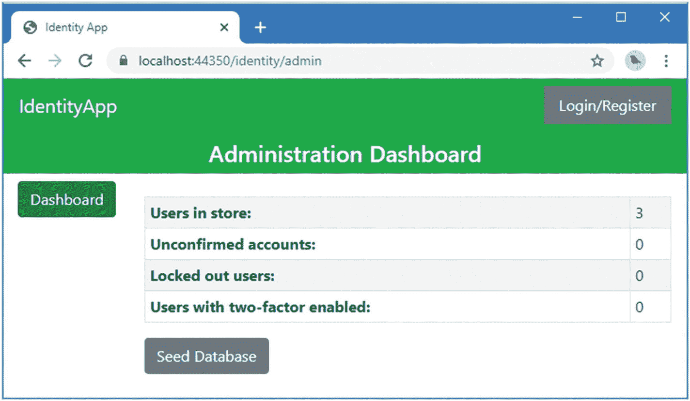

# 七、使用 Identity API

正如我在第 [6](06.html) 章中解释的，对 Identity UI 包的定制是有限制的。使用搭建可以实现较小的更改，但是如果您的应用不适合 Identity UI 期望的自助服务模型，那么您将无法调整其特性以适应您的项目。

在本章以及本书的其余部分，我将描述 ASP.NET Core Identity 提供的 API，该 API 可用于创建完全自定义的工作流。这与 Identity UI 使用的 API 相同，但是直接使用它意味着您可以创建所需的任何功能组合，并根据需要实现它们。在这一章中，我描述了 API 提供的基本特性。在后面的章节中，我将解释更多高级功能，并为每个主要 Identity 功能创建管理员和自助服务工作流。表 [7-1](#Tab1) 将 Identity API 放在上下文中。

表 7-1。

将 Identity API 放在上下文中

<colgroup><col class="tcol1 align-left"> <col class="tcol2 align-left"></colgroup> 
| 

问题

 | 

回答

 |
| --- | --- |
| 这是什么？ | Identity API 提供对所有 Identity 功能的访问。 |
| 为什么有用？ | API 允许创建完全符合项目要求的自定义工作流，这可能不是 Identity UI 包所提供的。 |
| 如何使用？ | 关键类作为服务提供，可通过标准的 ASP.NET Core 依赖注入特性获得。 |
| 有什么陷阱或限制吗？ | API 可能很复杂，创建自定义工作流需要投入时间和精力。仔细考虑您创建的工作流以确保您正在创建一个安全的应用也很重要。 |
| 有其他选择吗？ | 如果您的项目适合其设计模型，您可以使用和修改 Identity UI 包。 |

表 [7-2](#Tab2) 总结了本章内容。

表 7-2。

章节总结

<colgroup><col class="tcol1 align-left"> <col class="tcol2 align-left"> <col class="tcol3 align-left"></colgroup> 
| 

问题

 | 

解决办法

 | 

列表

 |
| --- | --- | --- |
| 创建用户帐户 | 创建一个`IdentityUser`类的新实例，并将其传递给用户管理器的`CreateAsync`方法。 | [1](#PC1)–[15](#PC15) |
| 确定用户管理器操作的结果 | 读取由`IdentityResult`类定义的属性，这些属性指示结果并描述任何错误。 | [16](#PC20)–[18](#PC23) |
| 查询用户存储 | 用用户管理器的`Users`属性制定一个 LINQ 查询。 | [19](#PC24)–[22](#PC27) |
| 显示用户详细信息 | 枚举一个`IdentityUser`对象的属性或调用相应的用户管理器方法。 | [23](#PC28)–[26](#PC32) |
| 更新用户详细信息 | 设置新的`IdentityUser`属性值或调用相应的用户管理器方法，然后调用`UpdateAsync`方法来存储更改。 | [27](#PC33)–[30](#PC39) |
| 确定用户存储支持的功能 | 通过用户管理器的`Store`属性访问用户存储，并读取为每个特性定义的属性。 | [31](#PC41)–[33](#PC43) |
| 启用对默认用户存储中角色的支持 | 使用`AddIdentity`方法设置 Identity，用泛型类型参数指定用户和角色类。 | [34](#PC44) |

## 为本章做准备

本章使用第 [6 章](06.html)中的`IdentityApp`项目。打开一个新的 PowerShell 命令提示符，并运行清单 [7-1](#PC1) 中所示的命令来重置应用和 Identity 数据库。

Tip

你可以从 [`https://github.com/Apress/pro-asp.net-core-identity`](https://github.com/Apress/pro-asp.net-core-identity) 下载本章以及本书其他章节的示例项目。如果在运行示例时遇到问题，请参见第 [1](01.html) 章获取帮助。

```cs
dotnet ef database drop --force --context ProductDbContext
dotnet ef database drop --force --context IdentityDbContext
dotnet ef database update --context ProductDbContext
dotnet ef database update --context IdentityDbContext

Listing 7-1.Resetting the Databases

```

使用 PowerShell 提示符运行清单 [7-2](#PC2) 中的命令来启动应用。

```cs
dotnet run

Listing 7-2.Running the Example Application

```

打开网页浏览器，请求`https://localhost:44350`，将显示来自`Home`控制器的输出，请求`https://localhost:44350/pages`，将显示来自`Landing` Razor 页面的输出，如图 [7-1](#Fig1) 所示。


图 7-1。

运行示例应用

## 创建用户和管理员仪表板

对于本书的这一部分，我将为大多数应用通常需要的操作创建自定义工作流，其版本可供管理员使用，并且在适当的情况下，可供自助服务用户使用。

我将创建两个“仪表板”样式的布局，一个用于管理员功能，另一个用于自助服务。当我开发个人工作流时，我将向仪表板添加导航元素，以便可以轻松访问新功能。

这些布局将被颜色编码，以便当一个例子是为管理员或用户设计的时候是显而易见的。它还将为自定义工作流提供一个不同于前面示例中所示的 Identity UI 示例的外观。最初，新的工作流将与 Identity UI 一起存在，但在本章结束时，一旦我建立了一些基本功能，我将更改 Identity 配置以禁用 Identity UI。

创建`IdentityApp/Pages/Identity`文件夹，添加一个名为`_Layout.cshtml`的 Razor 布局，内容如清单 [7-3](#PC3) 所示。

Using Razor Pages or The MVC Framework

我在本书中使用 Razor Pages 作为我使用 Identity API 的例子，遵循与微软的 Identity UI 包相同的基本模式。Razor Pages 的开发风格非常符合 Identity 的本质，其特性通常是自包含的。您不必在项目中使用 Razor 页面，我在 Razor 页面中使用的每个服务、方法和属性都可以使用 MVC 框架以同样的方式访问。

```cs
@{
    string theme = ViewData["theme"] as string ?? "primary";
    bool showNav = ViewData["showNav"] as bool? ?? true;
    string navPartial = ViewData["navPartial"] as string ?? "_Workflows";
    string workflow = ViewData["workflow"] as string;
    string banner =  ViewData["banner"] as string ?? "User Dashboard";
    bool showHeader = ViewData["showHeader"] as bool? ?? true;
}

<!DOCTYPE html>
<html>
<head>
    <meta name="viewport" content="width=device-width" />
    <title>Identity App</title>
    <link href="/lib/twitter-bootstrap/css/bootstrap.min.css" rel="stylesheet" />
</head>
<body>
    @if (showHeader) {
        <nav class="navbar navbar-dark bg-@theme">
            <a class="navbar-brand text-white">IdentityApp</a>
            <div class="text-white"><partial name="_LoginPartial" /></div>
        </nav>
    }
    <h4 class="bg-@theme text-center text-white p-2">@banner</h4>
    <div class="my-2">
        <div class="container-fluid">
            <div class="row">
                @if (showNav) {
                    <div class="col-auto">
                        <partial name="@navPartial" model="@((workflow, theme))" />
                    </div>
                }
                <div class="col">
                    @RenderBody()
                </div>
            </div>
        </div>
    </div>
</body>
</html>

Listing 7-3.The Contents of the _Layout.cshtml File in the Pages/Identity Folder

```

我使用`ViewData`值来选择引导主题，以决定是否显示导航内容和横幅。

接下来，将名为`_Workflows.cshtml`的 Razor 视图添加到`Pages/Identity`文件夹中，内容如清单 [7-4](#PC4) 所示。该局部视图将显示导航按钮，这些按钮将导向不同的工作流。

```cs
@model (string workflow, string theme)

@{
    Func<string, string> getClass = (string feature) =>
        feature != null && feature.Equals(Model.workflow) ? "active" : "";
}

<a class="btn btn-@Model.theme btn-block @getClass("Overview")" asp-page="Index">
    Overview
</a>

Listing 7-4.The Contents of the _Workflows.cshtml File in the Pages/Identity Folder

```

接下来，创建`IdentityApp/Pages/Identity/Admin`文件夹并添加一个 Razor 布局，名为`_AdminLayout.cshtml`，内容如清单 [7-5](#PC5) 所示。该布局建立在清单 [7-4](#PC4) 中的布局之上，表示管理工作流程。

```cs
@{
    Layout = "../_Layout";
    ViewData["theme"] = "success";
    ViewData["banner"] = "Administration Dashboard";
    ViewData["navPartial"] = "_AdminWorkflows";
}

@RenderBody()

Listing 7-5.The Contents of the _AdminLayout.cshtml File in the Pages/Identity/Admin Folder

```

对于一个布局来说，这可能看起来很奇怪，但是我只需要设置视图数据属性来区分管理视图和用户视图，一旦各部分开始结合在一起，您就会看到这一点。将名为`_AdminWorkflows.cshtml`的 Razor 视图添加到`Pages/Identity/Admin`文件夹中，内容如清单 [7-6](#PC6) 所示。该局部视图将包含管理工作流的导航元素。

```cs
@model (string workflow, string theme)

@{
    Func<string, string> getClass = (string feature) =>
        feature != null && feature.Equals(Model.workflow) ? "active" : "";
}

<a class="btn btn-@Model.theme btn-block @getClass("Dashboard")"
        asp-page="Dashboard">
    Dashboard
</a>

Listing 7-6.The Contents of the _AdminWorkflows.cshtml File in the Pages/Identity/Admin Folder

```

在`Pages/Identity/Admin`文件夹中添加一个名为`_ViewStart.cshtml`的 Razor 视图启动文件，内容如清单 [7-7](#PC7) 所示。我将用户和管理文件的名称区分开来，以便更容易理解示例，Razor 视图开始文件确保了`_AdminLayout.cshtml`文件将被用作`Admin`文件夹中页面的默认布局。

```cs
@{
    Layout = "_AdminLayout";
}

Listing 7-7.The Contents of the _ViewStart.cshtml File in the Pages/Identity/Admin folder

```

### 创建自定义基类

当我开始定义工作流时，它们将被公开，以使开发更容易。一旦我准备好足够的功能，我将使用 ASP.NET Core 授权功能来限制访问，这样用户功能只对已登录的用户可用，管理功能只对指定的管理员可用。当所有相关的 Razor 页面共享一个公共页面模型基类时，应用授权策略会更简单。为了定义用户特征的基类，将名为`UserPageModel.cs`的类文件添加到`Pages/Identity`文件夹中，其内容如清单 [7-8](#PC8) 所示。

```cs
using Microsoft.AspNetCore.Mvc.RazorPages;

namespace IdentityApp.Pages.Identity {

    public class UserPageModel : PageModel {

        // no methods or properties required
    }
}

Listing 7-8.The Contents of the UserPageModel.cs File in the Pages/Identity Folder

```

为了创建管理特性的公共基类，将名为`AdminPageModel.cs`的类文件添加到`Pages/Identity/Admin`文件夹中，其内容如清单 [7-9](#PC9) 所示。

```cs
namespace IdentityApp.Pages.Identity.Admin {

    public class AdminPageModel: UserPageModel {

        // no methods or properties required
    }
}

Listing 7-9.The Contents of the AdminPageModel.cs File in the Pages/Identity/Admin Folder

```

当我应用将限制对自定义 Identity 工作流的访问的授权策略时，我返回到这些类。

### 创建概览和仪表板页面

在`Pages/Identity`文件夹中添加一个名为`Index.cshtml`的 Razor 页面，内容如清单 [7-10](#PC10) 所示。

```cs
@page
@model IdentityApp.Pages.Identity.IndexModel
@{
    ViewBag.Workflow = "Overview";
}

<table class="table table-sm table-striped table-bordered">
    <tbody>
        <tr><th>Email</th><td>@Model.Email</td></tr>
        <tr><th>Phone</th><td>@Model.Phone</td></tr>
    </tbody>
</table>

Listing 7-10.The Contents of the Index.cshtml File in the Pages/Identity Folder

```

页面的视图部分显示用户的电子邮件地址和电话号码。要定义页面模型类，将清单 [7-11](#PC11) 中所示的代码添加到`Pages/Identity`文件夹中的`Index.cshtml.cs`文件中。(如果您使用的是 Visual Studio 代码，则必须创建该文件。)

```cs
namespace IdentityApp.Pages.Identity {

    public class IndexModel : UserPageModel {

        public string Email { get; set; }
        public string Phone { get; set; }
    }
}

Listing 7-11.The Contents of the Index.cshtml.cs File in the Pages/Identity Folder

```

页面模型类定义了其视图所需的属性。在本章的后面，我将添加从存储中检索数据的代码。

接下来，在`Pages/Identity/Admin`文件夹中添加一个名为`Dashboard.cshtml`的 Razor 页面，内容如清单 [7-12](#PC12) 所示。

```cs
@page "/identity/admin"
@model IdentityApp.Pages.Identity.Admin.DashboardModel
@{
    ViewBag.Workflow = "Dashboard";
}

<table class="table table-sm table-striped table-bordered">
    <tbody>
        <tr><th>Users in store:</th><td>@Model.UsersCount</td></tr>
        <tr><th>Unconfirmed accounts:</th><td>@Model.UsersUnconfirmed</td></tr>
        <tr><th>Locked out users:</th><td>@Model.UsersLockedout</td></tr>
        <tr>
            <th>Users with two-factor enabled:</th>
            <td>@Model.UsersTwoFactor</td>
        </tr>
    </tbody>
</table>

Listing 7-12.The Contents of the Dashboard.cshtml File in the Pages/Identity/Admin Folder

```

此页面的视图部分显示了一个表格，其中包含一些有用的概述数据，这些数据将在后面的章节中有用。要定义页面模型类，将清单 [7-13](#PC13) 中所示的代码添加到`Dashboard.cshtml.cs`文件中。(如果您使用的是 Visual Studio 代码，则必须创建该文件。)

```cs
using Microsoft.AspNetCore.Mvc.RazorPages;

namespace IdentityApp.Pages.Identity.Admin {

    public class DashboardModel : AdminPageModel {

        public int UsersCount { get; set; } = 0;
        public int UsersUnconfirmed { get; set; } = 0;
        public int UsersLockedout { get; set; } = 0;
        public int UsersTwoFactor { get; set; } = 0;
    }
}

Listing 7-13.The Contents of the Dashboard.cshtml.cs File in the Pages/Identity/Admin Folder

```

最后一个变化是更新允许用户管理其帐户的链接，如清单 [7-14](#PC14) 所示。

```cs
@inject SignInManager<IdentityUser> SignInManager

<nav class="nav">
    @if (User.Identity.IsAuthenticated) {
        <a asp-page="/Identity/Index" class="nav-link bg-secondary text-white">
                @User.Identity.Name
        </a>
        <a asp-area="Identity" asp-page="/Account/Logout"
            class="nav-link bg-secondary text-white">
                Logout
        </a>
    } else {
        <a asp-area="Identity" asp-page="/Account/Login"
                class="nav-link bg-secondary text-white">
            Login/Register
        </a>
    }
</nav>

Listing 7-14.Changing URLs in the _LoginPartial.cshtml File in the Views/Shared Folder

```

要检查管理工作流的准备情况，请重启 ASP.NET Core 并请求`https://localhost:44350/identity`，这将显示将提供给用户的概述。接下来，请求`https://localhost:44350/identity/admin`，它将为管理员显示仪表板。两者如图 [7-2](#Fig2) 所示。


图 7-2。

准备用户和管理仪表板

## 使用 Identity API

Identity API 的两个最重要的部分是用户管理器和用户类。用户管理器提供对 Identity 管理的数据的访问，用户类描述 Identity 为单个用户帐户管理的数据。

最好的方法是直接编写一些使用 API 的代码。我将从一个 Razor 页面开始，该页面将创建用户类的实例，并要求用户管理器将它们存储在数据库中。将清单 [7-15](#PC15) 中所示的代码添加到`Dashboard.cshtml.cs`文件中。

```cs
using Microsoft.AspNetCore.Mvc.RazorPages;
using Microsoft.AspNetCore.Identity;
using Microsoft.AspNetCore.Mvc;
using System.Threading.Tasks;

namespace IdentityApp.Pages.Identity.Admin {

    public class DashboardModel : AdminPageModel {

        public DashboardModel(UserManager<IdentityUser> userMgr)
            => UserManager = userMgr;

        public UserManager<IdentityUser> UserManager { get; set; }

        public int UsersCount { get; set; } = 0;
        public int UsersUnconfirmed { get; set; } = 0;
        public int UsersLockedout { get; set; } = 0;
        public int UsersTwoFactor { get; set; } = 0;

        private readonly string[] emails = {
            "alice@example.com", "bob@example.com", "charlie@example.com"
        };

        public async Task<IActionResult> OnPostAsync() {
            foreach (string email in emails) {
                IdentityUser userObject = new IdentityUser {
                    UserName = email,
                    Email = email,
                    EmailConfirmed = true
                };
                await UserManager.CreateAsync(userObject);
            }
            return RedirectToPage();
        }
    }
}

Listing 7-15.Using the Identity API in the Dashboard.cshtml.cs File in the Pages/Identity/Admin Folder

```

虽然只有几个语句，但是有很多需要理解，因为这是第一个直接处理 Identity API 的代码。让我们从用户类开始。Identity 与用户类无关，您可以创建一个定制的用户类，这将在第 2 部分中演示。有一个名为`IdentityUser`的默认类，这是我在示例应用中使用的类，除非您正在创建自定义用户存储，否则应该使用它。

用户类是在`Startup`类中配置 Identity 时声明的。下面是在示例应用中设置标识的语句:

```cs
...
services.AddDefaultIdentity<IdentityUser>(opts => {
    opts.Password.RequiredLength = 8;
    opts.Password.RequireDigit = false;
    opts.Password.RequireLowercase = false;
    opts.Password.RequireUppercase = false;
    opts.Password.RequireNonAlphanumeric = false;
    opts.SignIn.RequireConfirmedAccount = true;
}).AddEntityFrameworkStores<IdentityDbContext>();
...

```

使用`AddDefaultIdentity`方法的泛型类型参数来指定用户类的类型。user 类定义了一组描述用户帐户的属性，并提供 Identity 实现其功能所需的数据值。为了创建一个新的用户对象，我创建了一个`IdentityUser`类的新实例，并设置了其中的三个属性，如下所示:

```cs
...
IdentityUser userObject = new IdentityUser {
    UserName = email,
    Email = email,
    EmailConfirmed = true
};
...

```

我将在本章的后面描述由`IdentityUser`类定义的所有属性，但是这些属性足以让你入门。正如属性名所示，`UserName`和`Email`属性存储用户的帐户名称和电子邮件地址。`EmailConfirmed`用于指示用户对电子邮件地址的控制是否已被确认。我在第 [9](09.html) 章描述了确认的过程，但是我已经为测试账户设置了这个属性为`true`。

我将遵循 Identity UI 包使用的策略，并使用用户的电子邮件地址作为用户名和电子邮件地址。(您可以在第 2 部分中看到分别处理它们的例子。)

第二个关键类是用户管理器，也就是`UserManager<T>`。通用类型参数`T`用于指定用户类。由于示例应用使用内置的用户类，用户管理器将是`UserManager<IdentityUser>`。

Referring to a Specific User Class

Identity 几乎可以与任何用户类一起工作，但是大多数项目最终都使用默认的`IdentityUser`类，因为很少有好的理由使用其他类，尤其是如果您使用实体框架核心来存储 Identity 数据。出于这个原因，我将引用`UserManage<IdentityUser>`而不是`UserManager<T>`，其中`T`是用户类在第 2 部分中，你会经常遇到“where `T`是用户类”，这可能是我最常重复的一句话。然而，在本书的其余部分，为了简单明了，我将假设 user 类是`IdentityUser`。

用户管理器通过 ASP.NET Core 依赖注入特性配置为服务。为了访问 Razor 页面模型类中的用户管理器，我添加了一个带有`UserManager<IdentityUser>`参数的构造函数，如下所示:

```cs
...
public DashboardModel(UserManager<IdentityUser> userMgr) => UserManager = userMgr;
...

```

当实例化页面模型类时，构造函数接收一个`UserManager<IdentityUser>`对象，我将它分配给一个名为`UserManager`的属性，这样它就可以被页面处理程序方法使用或者从页面的视图部分访问。

用户管理器类有很多方法，但是有三个用于管理存储的数据，如表 [7-3](#Tab3) 中所述。这些方法都是异步的，Identity API 定义的许多方法也是如此。

表 7-3。

管理存储数据的用户管理器<identityuser>方法</identityuser>

<colgroup><col class="tcol1 align-left"> <col class="tcol2 align-left"></colgroup> 
| 

名字

 | 

描述

 |
| --- | --- |
| `CreateAsync(user)` | 此方法存储 user 类的新实例。 |
| `UpdateAsync(user)` | 此方法更新 user 类的存储实例。 |
| `DeleteAsync(user)` | 此方法移除 user 类的存储实例。 |

为了存储测试`IdentityUser`对象，我调用了用户管理器的`CreateAsync`方法。

```cs
...
foreach (string email in emails) {
    IdentityUser userObject = new IdentityUser {
        UserName = email,
        Email = email,
        EmailConfirmed = true
    };
    await UserManager.CreateAsync(userObject);
}
...

```

`CreateAsync`方法存储我创建的`IdentityUser`对象，用帐户播种数据库。

### 处理 Identity 结果

我在清单 [7-15](#PC15) 中使用的`CreateAsync`方法假设一切都按预期运行，这是一种乐观的水平，在软件开发中很少得到保证。表 [7-3](#Tab3) 中的方法使用表 [7-4](#Tab4) 中描述的属性返回描述操作结果的`IdentityResult`对象。

表 7-4。

IdentityResult 属性

<colgroup><col class="tcol1 align-left"> <col class="tcol2 align-left"></colgroup> 
| 

名字

 | 

描述

 |
| --- | --- |
| `Succeeded` | 如果操作成功，该属性返回`true`，否则返回`false`。 |
| `Errors` | 该属性返回一个`IEnumerable<IdentityError>`对象，其中包含一个针对每个已发生错误的`IdentityError`对象。`IdentityError`类定义了`Code`和`Description`属性。 |

如果`Succeeded`属性是`true`，那么操作已经生效。如果是`false`，那么可以枚举`Errors`属性来了解出现的问题。编写定制 Identity 工作流时，一个常见的需求是通过向 ASP.NET Core 模型状态添加验证错误来处理来自`IdentityResult`对象的错误。将名为`IdentityExtensions.cs`的类文件添加到`IdentityApp/Pages/Identity`文件夹中，并使用它来定义清单 [7-16](#PC20) 中所示的扩展方法。

```cs
using Microsoft.AspNetCore.Identity;
using Microsoft.AspNetCore.Mvc.ModelBinding;
using System.Linq;

namespace IdentityApp.Pages.Identity {
    public static class IdentityExtensions {

        public static bool Process(this IdentityResult result,
                ModelStateDictionary modelState) {
            foreach (IdentityError err in result.Errors
                    ?? Enumerable.Empty<IdentityError>()) {
                modelState.AddModelError(string.Empty, err.Description);
            }
            return result.Succeeded;
        }
    }
}

Listing 7-16.The Contents of the IdentityExtensions.cs File in the IdentityApp/Pages/Identity Folder

```

由`IdentityResult.Errors`属性返回的序列中的每个`IdentityError`对象定义了一个`Code`属性和一个`Description`属性。`Code`属性用于明确地识别错误，并由应用使用。我对`Description`属性感兴趣，它描述了一个可以呈现给用户的错误。我使用`foreach`关键字添加每个`IdentityError.Description`属性的值，并将其添加到 ASP.NET Core 将处理的验证错误集中。

```cs
...
modelState.AddModelError(string.Empty, err.Description);
...

```

在清单 [7-17](#PC22) 中，我使用了新的扩展方法来处理来自`CreateAsync`方法的结果。

```cs
using Microsoft.AspNetCore.Mvc.RazorPages;
using Microsoft.AspNetCore.Identity;
using Microsoft.AspNetCore.Mvc;
using System.Threading.Tasks;

namespace IdentityApp.Pages.Identity.Admin {

    public class DashboardModel : AdminPageModel {

        public DashboardModel(UserManager<IdentityUser> userMgr)
            => UserManager = userMgr;

        public UserManager<IdentityUser> UserManager { get; set; }

        public int UsersCount { get; set; } = 0;
        public int UsersUnconfirmed { get; set; } = 0;
        public int UsersLockedout { get; set; } = 0;
        public int UsersTwoFactor { get; set; } = 0;

        private readonly string[] emails = {
            "alice@example.com", "bob@example.com", "charlie@example.com"
        };

        public async Task<IActionResult> OnPostAsync() {
            foreach (string email in emails) {
                IdentityUser userObject = new IdentityUser {
                    UserName = email,
                    Email = email,
                    EmailConfirmed = true
                };
                IdentityResult result = await UserManager.CreateAsync(userObject);
                result.Process(ModelState);
            }
            if (ModelState.IsValid) {
                return RedirectToPage();
            }
            return Page();
        }
    }
}

Listing 7-17.Handling Results in the Dashboard.cshtml.cs File in the Pages/Identity/Admin Folder

```

这不是最优雅的代码，因为它将两种不同的错误处理方法结合在一起，同时还指示是否有任何错误需要处理。但这是一种很有帮助的方法，可以确保错误从 Identity API 暴露给用户。

让基本功能正常工作的最后一步是向`Dashboard`页面的视图部分添加 HTML 元素，如清单 [7-18](#PC23) 所示。

```cs
@page "/identity/admin"
@model IdentityApp.Pages.Identity.Admin.DashboardModel
@{
    ViewBag.Workflow = "Dashboard";
}

<div asp-validation-summary="All" class="text-danger m-2"></div>

<table class="table table-sm table-striped table-bordered">
    <tbody>
        <tr><th>Users in store:</th><td>@Model.UsersCount</td></tr>
        <tr><th>Unconfirmed accounts:</th><td>@Model.UsersUnconfirmed</td></tr>
        <tr><th>Locked out users:</th><td>@Model.UsersLockedout</td></tr>
        <tr>
            <th>Users with two-factor enabled:</th>
            <td>@Model.UsersTwoFactor</td>
        </tr>
    </tbody>
</table>

<form method="post">
    <button class="btn btn-secondary" type="submit">Seed Database</button>
</form>

Listing 7-18.Adding HTML Elements to the Dashboard.cshtml File in the Pages/Identity/Admin Folder

```

新元素显示验证错误，并定义一个表单，提交该表单以植入数据库。

虽然还有工作要做，但是对于一个简单的测试来说已经有足够的功能了。重启 ASP.NET Core 并请求`https://localhost:44350/identity/admin`。单击种子数据库按钮创建测试帐户。什么也不会发生，因为仪表板页面还没有从数据库中读取数据，但是如果您再次单击该按钮，您可以确认错误处理功能正在工作，如图 [7-3](#Fig3) 所示。


图 7-3。

测试错误处理代码

在第二次尝试播种数据库时，对`CreateAsync`方法的调用产生了错误，因为第一次播种存储了具有相同`UserName`值的`IdentityUser`对象。Identity 需要唯一的用户名，并产生使用 ASP.NET Core 模型验证功能显示的错误。

### 查询用户数据

清单 [7-17](#PC22) 中的代码的问题在于，它没有在存储新的`IdentityUser`对象之前清除现有的数据。为了提供对现有数据的访问，用户管理器类定义了一个名为`Users`的属性，该属性可用于枚举存储的`IdentityUser`对象，并可与 LINQ 一起用于执行查询。表 [7-5](#Tab5) 描述了该属性，以供将来快速参考。

表 7-5。

用于读取数据的 UserManager <t>属性</t>

<colgroup><col class="tcol1 align-left"> <col class="tcol2 align-left"></colgroup> 
| 

名字

 | 

描述

 |
| --- | --- |
| `Users` | 该属性返回一个`IQueryable<IdentityUser>`对象，该对象可用于枚举存储的`IdentityUser`对象，并可与 LINQ 一起使用来执行查询。 |

在清单 [7-19](#PC24) 中，我在语句中添加了`Dashboard`页面模型的 POST handler 方法来枚举存储的`IdentityUser`对象，并将它们传递给`DeleteAsync`方法，这将把它们从数据库中移除。我还添加了一个 GET handler 方法，用于设置页面视图部分显示的属性之一。

```cs
using Microsoft.AspNetCore.Mvc.RazorPages;
using Microsoft.AspNetCore.Identity;
using Microsoft.AspNetCore.Mvc;
using System.Threading.Tasks;
using System.Linq;

namespace IdentityApp.Pages.Identity.Admin {

    public class DashboardModel : AdminPageModel {

        public DashboardModel(UserManager<IdentityUser> userMgr)
            => UserManager = userMgr;

        public UserManager<IdentityUser> UserManager { get; set; }

        public int UsersCount { get; set; } = 0;
        public int UsersUnconfirmed { get; set; } = 0;
        public int UsersLockedout { get; set; } = 0;
        public int UsersTwoFactor { get; set; } = 0;

        private readonly string[] emails = {
            "alice@example.com", "bob@example.com", "charlie@example.com"
        };

        public void OnGet() {
            UsersCount = UserManager.Users.Count();
        }

        public async Task<IActionResult> OnPostAsync() {
            foreach (IdentityUser existingUser in UserManager.Users.ToList()) {
                IdentityResult result = await UserManager.DeleteAsync(existingUser);
                result.Process(ModelState);
            }
            foreach (string email in emails) {
                IdentityUser userObject = new IdentityUser {
                    UserName = email,
                    Email = email,
                    EmailConfirmed = true
                };
                IdentityResult result = await UserManager.CreateAsync(userObject);
                result.Process(ModelState);
            }
            if (ModelState.IsValid) {
                return RedirectToPage();
            }
            return Page();
        }
    }
}

Listing 7-19.Reading/Deleting Data in the Dashboard.cshtml.cs File in the Identity/Pages/Admin Folder

```

属性返回一个可以在 LINQ 查询中枚举或使用的对象。在 GET 处理程序中，我使用 LINQ `Count`方法来确定已经存储了多少`IdentityUser`对象。在 POST 处理程序中，我使用`foreach`关键字来枚举存储的`IdentityUser`对象，这样我就可以删除它们。(注意，我使用了`ToList`方法在`foreach`循环中强制求值。这确保了我不会因为从我正在枚举的序列中删除对象而导致错误。)

重启 ASP.NET Core 并请求`https://localhost:44350/identity/admin`。清单 [7-19](#PC24) 的变化显示存储的`IdentityUser`对象的数量，如图 [7-4](#Fig4) 所示，点击种子数据库按钮不再产生错误。



图 7-4。

读取(和删除)存储的数据

### 显示用户列表

现在对存储的数据有了一些了解，但还不够有用。查看用户帐户列表会很有帮助，这可以通过用户管理器的`Users`属性获得。而且，因为`Users`属性返回一个`IQueryable<IdentityUser>`对象，所以很容易创建一个可以过滤的列表。选择用户帐户是许多自定义 Identity 工作流的第一步，这是我将在本书的这一部分重复使用的功能。在`Pages/Identity/Admin`文件夹中添加一个名为`SelectUser.cshtml`的 Razor 页面，内容如清单 [7-20](#PC25) 所示。

```cs
@page "{label?}/{callback?}"
@model IdentityApp.Pages.Identity.Admin.SelectUserModel
@{
    ViewBag.Workflow = Model.Callback ?? Model.Label ?? "List";
}

<form method="post" class="my-2">
    <div class="form-row">
        <div class="col">
            <div class="input-group">
                <input asp-for="Filter" class="form-control" />
            </div>
        </div>
        <div class="col-auto">
            <button class="btn btn-secondary">Filter</button>
        </div>
    </div>
</form>

<table class="table table-sm table-striped table-bordered">
    <thead>
        <tr>
            <th>User</th>
            @if (!string.IsNullOrEmpty(Model.Callback)) {
                <th/>
            }
        </tr>
    </thead>
    <tbody>
        @if (Model.Users.Count() == 0) {
            <tr><td colspan="2">No matches</td></tr>
        } else {
            @foreach (IdentityUser user in Model.Users) {
                <tr>
                    <td>@user.Email</td>
                    @if (!string.IsNullOrEmpty(Model.Callback)) {
                        <td class="text-center">
                            <a asp-page="@Model.Callback"
                               asp-route-id="@user.Id"
                               class="btn btn-sm btn-secondary">
                                @Model.Callback
                            </a>
                        </td>
                    }
                </tr>
            }
        }
    </tbody>
</table>

@if (!string.IsNullOrEmpty(Model.Callback)) {
    <a asp-page="Dashboard" class="btn btn-secondary">Cancel</a>
}

Listing 7-20.The Contents of the SelectUser.cshtml File in the Pages/Identity/Admin Folder

```

该页面的视图部分显示一个带有文本框的表格，该表格可用于通过搜索电子邮件地址来筛选用户存储。当我开始使用这个页面作为定制工作流的一部分时，每个用户都会看到一个按钮，请求 URL 中指定的页面，包括所选用户的`Id`值。这将允许选择用户并触发重定向回到处理工作流的页面。

要定义页面模型类，将清单 [7-21](#PC26) 中所示的代码添加到`SelectUser.cshtml.cs`文件中。(如果您使用的是 Visual Studio 代码，则必须创建该文件。)

```cs
using Microsoft.AspNetCore.Identity;
using Microsoft.AspNetCore.Mvc;
using System.Collections.Generic;
using System.Linq;

namespace IdentityApp.Pages.Identity.Admin {

    public class SelectUserModel : AdminPageModel {

        public SelectUserModel(UserManager<IdentityUser> mgr)
            => UserManager = mgr;

        public UserManager<IdentityUser> UserManager { get; set; }
        public IEnumerable<IdentityUser> Users { get; set; }

        [BindProperty(SupportsGet = true)]
        public string Label { get; set; }

        [BindProperty(SupportsGet = true)]
        public string Callback { get; set; }

        [BindProperty(SupportsGet = true)]
        public string Filter { get; set; }

        public void OnGet() {
            Users = UserManager.Users
                .Where(u => Filter == null || u.Email.Contains(Filter))
                .OrderBy(u => u.Email).ToList();
        }

        public IActionResult OnPost() => RedirectToPage(new { Filter, Callback });
    }
}

Listing 7-21.The Contents of the SelectUser.cshtml.cs File in the Pages/Identity/Admin Folder

```

页面模型使用通过依赖注入接收到的`UserManager<IdentityUser>`对象，通过 LINQ 查询用户存储。我使用`ToList`方法来强制评估查询，这样我就可以对结果进行操作，而不会触发重复的用户存储搜索。

最后一步是为新的 Razor 页面添加一个导航按钮，如清单 [7-22](#PC27) 所示。

```cs
@model (string workflow, string theme)

@{
    Func<string, string> getClass = (string feature) =>
        feature != null && feature.Equals(Model.workflow) ? "active" : "";
}

<a class="btn btn-@Model.theme btn-block @getClass("Dashboard")"
        asp-page="Dashboard">
    Dashboard
</a>
<a class="btn btn-success btn-block @getClass("List")" asp-page="SelectUser">
    List Users
</a>

Listing 7-22.Adding Navigation in the _AdminWorkflows.cshtml File in the Pages/Identity/Admin Folder

```

要查看用户列表，重启 ASP.NET Core，请求`https://localhost:44350/Identity/Admin`，并点击列表用户按钮，这将产生如图 [7-5](#Fig5) 所示的结果。您可以在字段中输入文本并过滤用户列表，但唯一存储的数据是播种过程创建的帐户。


图 7-5。

显示存储的用户帐户列表

### 查看和编辑用户详细信息

`IdentityUser`类定义了一组属性，为用户帐户提供对存储数据值的访问。例如，有一个`Email`属性提供对用户电子邮件地址的访问。一些属性可以通过由`UserManager<IdentityUser>`类定义的方法来访问，这样`GetEmailAsync`和`SetEmailAsync`方法就可以获取和设置`Email`属性的值。

有些属性是只读的，因此用户管理器类只提供读取属性值的方法。例如，`IdentityUser.Id`属性提供了对不能更改的`IdentityUser`对象的唯一 ID 的访问，因此有一个`UserManager<IdentityUser>.GetUserIdAsync`方法来读取该值，但没有相应的方法来更改该值。

有些`IdentityUser`属性根本没有对应的用户管理器方法。例如，当存储了一个新的`UserName`值并且该属性没有用户管理器方法时，就会自动更新`NormalizedUserName`方法。

有些用户管理器方法不仅仅是直接更新用户对象属性。`UserManager<IdentityUser>.SetEmailAsync`方法更新了`Identity.Email`属性，但是也将`IdentityUser.EmailConfirmed`属性设置为`false`，这表明新的电子邮件地址还没有被确认。

直接处理用户对象属性是最简单的方法，在 C# 开发中感觉很自然，特别是当与 ASP.NET Core 模型绑定特性相结合时，这使得接收表单数据很容易。但是用户管理器方法执行的额外工作对于确保用户存储中的数据是一致的非常有用。在本书的第 2 部分，我详细描述了每一个`UserManager<T>`方法，这样你就可以理解什么时候执行额外的工作。

为了快速参考，表 [7-6](#Tab6) 描述了由`IdentityUser`类定义的属性，以及与它们相关的最重要的`UserManager<IdentityUser>`方法，并提供了本书后面详细描述的参考。如表中所述，表中的某些属性是需要附加用户管理器方法的复杂功能的一部分。一开始，您可能会发现属性和方法方法令人困惑，但是它比看起来要简单，并且很快就成为了第二天性。

表 7-6。

用户类属性和用户管理器类方法

<colgroup><col class="tcol1 align-left"> <col class="tcol2 align-left"> <col class="tcol3 align-left"></colgroup> 
| 

属性名称

 | 

描述

 | 

用户管理器方法

 |
| --- | --- | --- |
| `Id` | 此属性存储用户的唯一 ID，并且不能更改。 | `GetUserIdAsync` |
| `UserName` | 该属性存储用户的用户名。 | `GetUserNameAsyncSetUserNameAsync` |
| `NormalizedUserName` | 此属性存储搜索用户时使用的用户名的规范化表示。 | 存储对象时，该属性会自动更新。 |
| `Email` | 该属性存储用户的电子邮件地址。 | `GetEmailAsync``SetEmailAsync` |
| `NormalizedEmail` | 此属性存储搜索用户时使用的电子邮件地址的规范化表示。 | 存储对象时，该属性会自动更新。 |
| `EmailConfirmed` | 此属性指示用户的电子邮件地址是否已被确认。 | `IsEmailConfirmedAsync`，以及第 [17 章](17.html)中描述的其他方法。 |
| `PasswordHash` | 此属性存储用户密码的哈希表示。 | `HasPasswordAsync`，以及第 [18 章](18.html)中描述的其他方法。 |
| `PhoneNumber` | 该属性存储用户的电话号码。 | `GetPhoneNumberAsync``SetPhoneNumberAsync` |
| `PhoneNumberConfirmed` | 此属性指示用户的电话号码是否已被确认。 | `IsPhoneNumberConfirmedAsync`，以及第 [17 章](17.html)中描述的其他方法。 |
| `TwoFactorEnabled` | 此属性指示用户是否配置了双因素访问。 | `GetTwoFactorEnabledAsync`、`SetTwoFactorEnabledAsync`，附加方法在第 [20 章](20.html)中描述。 |
| `LockoutEnabled` | 此属性指示用户帐户在登录失败后是否可以被锁定。 | `GetLockoutEnabledAsync SetLockoutEnabledAsync``IsLockedOutAsync` |
| `AccessFailedCount` | 此属性用于跟踪失败登录的次数。 | 该属性不能直接使用。详见第 [20](20.html) 章。 |
| `LockoutEnd` | 此属性用于存储允许帐户再次登录的时间。 | 该属性不能直接使用。 |
| `SecurityStamp` | 此属性存储一个随机值，该值在用户凭据更新时会发生变化。 | 该属性不直接使用，而是自动更新。 |
| `ConcurrencyStamp` | 该属性存储一个随机值，每当存储用户数据时，该值就会更新。 | 该属性不能直接使用。 |

在`Pages/Identity/Admin`文件夹中添加一个名为`View.cshtml`的 Razor 页面，内容如清单 [7-23](#PC28) 所示。

```cs
@page "{Id?}"
@model IdentityApp.Pages.Identity.Admin.ViewModel
@{
        ViewBag.Workflow = "List";
}

<table class="table table-sm table-striped table-bordered">
    <thead>
        <tr><th>Property</th><th>Value</th></tr>
    </thead>
    <tbody>
        @foreach (string name in Model.PropertyNames) {
            <tr>
                <td>@name</td>
                <td class="text-truncate" style="max-width:250px">
                    @Model.GetValue(name)
                </td>
            </tr>
        }
    </tbody>
</table>

<a asp-page="Edit" asp-route-id="@Model.Id" class="btn btn-secondary">
    Edit
</a>
<a asp-page="View" asp-route-id="" class="btn btn-secondary">Back</a>

Listing 7-23.The Contents of the View.cshtml File in the Pages/Identity/Admin Folder

```

页面的视图部分显示一个表格，其中包含由`IdentityUser`类定义的属性和所选对象的值。要实现页面模型类，将清单 [7-24](#PC29) 中所示的代码添加到`View.cshtml.cs`文件中。(如果您使用的是 Visual Studio 代码，则必须创建该文件。)

```cs
using Microsoft.AspNetCore.Identity;
using Microsoft.AspNetCore.Mvc;
using System.Collections.Generic;
using System.Linq;
using System.Threading.Tasks;

namespace IdentityApp.Pages.Identity.Admin {

    public class ViewModel : AdminPageModel {

        public ViewModel(UserManager<IdentityUser> mgr) => UserManager = mgr;

        public UserManager<IdentityUser> UserManager { get; set; }

        public IdentityUser IdentityUser { get; set; }

        [BindProperty(SupportsGet = true)]
        public string Id { get; set; }

        public IEnumerable<string> PropertyNames
            => typeof(IdentityUser).GetProperties()
                .Select(prop => prop.Name);

        public string GetValue(string name) =>
            typeof(IdentityUser).GetProperty(name)
                 .GetValue(IdentityUser)?.ToString();

        public async Task<IActionResult> OnGetAsync() {
            if (string.IsNullOrEmpty(Id)) {
                return RedirectToPage("Selectuser",
                    new { Label = "View User", Callback = "View" });
            }
            IdentityUser = await UserManager.FindByIdAsync(Id);
            return Page();
        }
    }
}

Listing 7-24.The Contents of the View.cshtml.cs File in the Pages/Identity/Admin Folder

```

为了识别要编辑的用户帐户，如果请求 URL 不包含`Id`值，GET handler 页面将执行到`SelectUser`页面的重定向。如果有一个`Id`，那么使用`UserManager<IdentityUser>`类提供的方法之一，用它来搜索用户商店，如表 [7-7](#Tab7) 所述。

表 7-7。

用于搜索商店的 UserManager <t>成员</t>

<colgroup><col class="tcol1 align-left"> <col class="tcol2 align-left"></colgroup> 
| 

名字

 | 

描述

 |
| --- | --- |
| `FindByIdAsync(id)` | 该方法返回一个代表具有指定唯一 ID 的用户的`IdentityUser`对象。 |
| `FindByNameAsync(name)` | 该方法返回一个代表具有指定名称的用户的`IdentityUser`对象。 |
| `FindByEmailAsync(email)` | 该方法返回一个代表具有指定电子邮件地址的用户的`IdentityUser`对象。 |

这些方法使用 ID、用户名或电子邮件地址来定位单个的`IdentityUser`对象，如果不匹配，则返回`null`。

如果清单 [7-24](#PC29) 中的 GET handler 方法被一个包含 ID 值的 URL 调用，那么`FindByIdAsync`方法被用来搜索用户存储并将结果分配给一个可以在视图中访问的名为`IdentityUser`的属性。

```cs
...
IdentityUser = await UserManager.FindByIdAsync(Id);
...

```

属性列表是使用。净反射特征。在清单 [7-25](#PC31) 中，我已经更改了由列表用户按钮选择的页面，以便请求`View`页面。

```cs
@model (string workflow, string theme)

@{
    Func<string, string> getClass = (string feature) =>
        feature != null && feature.Equals(Model.workflow) ? "active" : "";
}

<a class="btn btn-@Model.theme btn-block @getClass("Dashboard")"
        asp-page="Dashboard">
    Dashboard
</a>
<a class="btn btn-success btn-block @getClass("List")" asp-page="View"
        asp-route-id="">
    List Users
</a>

Listing 7-25.Changing Navigation in the _AdminWorkflows.cshtml File in the Pages/Identity/Admin Folder

```

重启 ASP.NET Core，请求`https://localhost:44350/identity/admin`，并点击列表用户按钮。点击`alice@example.com`账户的查看按钮，会出现一个包含`IdentityUser`属性和值的表格，如图 [7-6](#Fig6) 所示。有些属性是自动赋值的，而有些则是在使用相关的功能后才赋值。


图 7-6。

显示 Identity 用户属性

#### 编辑用户详细信息

前面的例子演示了创建、读取和删除`IdentityUser`对象的基本操作，这是四个经典数据操作中的三个。我将在后面的章节中演示如何使用这些特性来创建定制的工作流，但是还有一个额外的操作来创建经典的工作流:执行更新。

在`Pages/Identity/Admin`文件夹中添加一个名为`Edit.cshtml`的 Razor 页面，内容如清单 [7-26](#PC32) 所示。

```cs
@page "{Id?}"
@model IdentityApp.Pages.Identity.Admin.EditModel
@{
    ViewBag.Workflow = "Edit";
}

<div asp-validation-summary="All" class="text-danger m-2"></div>

<form method="post">
    <input type="hidden" asp-for="Id" />
    <div class="form-group">
        <label>Username</label>
        <input class="form-control" asp-for="IdentityUser.UserName" />
    </div>
    <div class="form-group">
        <label>Normalized Username</label>
        <input class="form-control" asp-for="IdentityUser.NormalizedUserName"
            readonly />
    </div>
    <div class="form-group">
        <label>Email</label>
        <input class="form-control" asp-for="IdentityUser.Email" />
    </div>
    <div class="form-group">
        <label>Normalized Email</label>
        <input class="form-control"
            asp-for="IdentityUser.NormalizedEmail" readonly />
    </div>
    <div class="form-group">
        <label>Phone Number</label>
        <input class="form-control" asp-for="IdentityUser.PhoneNumber" />
    </div>
    <div>
        <button type="submit" class="btn btn-success">Save</button>
        <a asp-page="Dashboard" class="btn btn-secondary">Cancel</a>
    </div>
</form>

Listing 7-26.The Contents of the Edit.cshtml File in the Pages/Identity/Admin Folder

```

页面的视图部分显示一个 HTML 表单，其中包含用于编辑`IdentityUser`对象的`UserName`、`Email`和`PhoneNumber`属性的字段。还有一个用于`Id`属性的隐藏值，以便可以识别要修改的用户对象，以及用于`NormalizedUserName`和`NormalizedEmail`属性的只读字段，我已经包含了这些字段来演示一些属性是如何自动更新的。

为了创建页面模型，将清单 [7-27](#PC33) 中所示的代码添加到`Edit.cshtml.cs`文件中。(如果您使用的是 Visual Studio 代码，则必须创建该文件。)

```cs
using Microsoft.AspNetCore.Identity;
using Microsoft.AspNetCore.Mvc;
using System.ComponentModel.DataAnnotations;
using System.Threading.Tasks;

namespace IdentityApp.Pages.Identity.Admin {

    public class EditBindingTarget {
        [Required]
        public string Username { get; set; }
        [Required]
        [EmailAddress]
        public string Email { get; set; }
        [Phone]
        public string PhoneNumber { get; set; }
    }

    public class EditModel : AdminPageModel {

        public EditModel(UserManager<IdentityUser> mgr) => UserManager = mgr;

        public UserManager<IdentityUser> UserManager { get; set; }

        public IdentityUser IdentityUser { get; set; }

        [BindProperty(SupportsGet = true)]
        public string Id { get; set; }

        public async Task<IActionResult> OnGetAsync() {
            if (string.IsNullOrEmpty(Id)) {
                return RedirectToPage("Selectuser",
                    new { Label = "Edit User", Callback = "Edit" });
            }
            IdentityUser = await UserManager.FindByIdAsync(Id);
            return Page();
        }

        public async Task<IActionResult> OnPostAsync(
                [FromForm(Name = "IdentityUser")] EditBindingTarget userData) {
            if (!string.IsNullOrEmpty(Id) && ModelState.IsValid) {
                IdentityUser user = await UserManager.FindByIdAsync(Id);
                if (user != null) {
                    user.UserName = userData.Username;
                    user.Email = userData.Email;
                    user.EmailConfirmed = true;
                    if (!string.IsNullOrEmpty(userData.PhoneNumber)) {
                        user.PhoneNumber = userData.PhoneNumber;
                    }
                }
                IdentityResult result = await UserManager.UpdateAsync(user);
                if (result.Process(ModelState)) {
                    return RedirectToPage();
                }
            }
            IdentityUser = await UserManager.FindByIdAsync(Id);
            return Page();
        }
    }
}

Listing 7-27.The Contents of the Edit.cshtml.cs File in the Pages/Identity/Admin Folder

```

当用户提交表单时，ASP.NET Core 模型绑定特性将表单值分配给`EditBindingTarget`类实例的属性，定义如下:

```cs
...
public class EditBindingTarget {
    [Required]
    public string Username { get; set; }
    [Required]
    [EmailAddress]
    public string Email { get; set; }
    [Phone]
    public string PhoneNumber { get; set; }
}
...

```

正如我在第 2 部分中所演示的，您可以直接对 user 类的实例使用模型绑定，但是这种方法允许我选择感兴趣的字段并应用验证属性，而不需要子类化`IdentityUser`或者声明和修饰单独的处理程序方法参数。

POST handler 方法使用通过模型绑定设置的`Id`属性来搜索带有`FindByIdAsync`的用户存储，并用表单数据值更新生成的`IdentityUser`对象的属性，如下所示:

```cs
...
IdentityUser user = await UserManager.FindByIdAsync(Id);
if (user != null) {
    user.UserName = userData.Username;
    user.Email = userData.Email;
    user.EmailConfirmed = true;
    if (!string.IsNullOrEmpty(userData.PhoneNumber)) {
        user.PhoneNumber = userData.PhoneNumber;
    }
}
...

```

我可以使用由`UserManager<IdentityUser>`类提供的方法，但是，正如我前面解释的，我通常更喜欢直接更新`IdentityUser`属性。

注意，在清单 [7-28](#PC37) 中，我将`EmailConfirmed`属性设置为`true`。作为一般规则，管理员设置的电子邮件地址不应该要求用户通过确认过程，所以我显式地设置了`EmailConfirmed`属性。我在第 [9](09.html) 章创建了一个需要用户确认电子邮件地址的工作流。

直到用户管理器的`UpdateAsync`方法被调用，对`IdentityUser`对象的更改才会被添加到存储中，如下所示:

```cs
...
IdentityResult result = await UserManager.UpdateAsync(user);
...

```

这个方法更新用户存储并返回一个`IdentityResult`对象。为了集成新的工作流，将清单 [7-28](#PC37) 中所示的元素添加到导航局部视图中。

```cs
@model (string workflow, string theme)

@{
    Func<string, string> getClass = (string feature) =>
        feature != null && feature.Equals(Model.workflow) ? "active" : "";
}

<a class="btn btn-@Model.theme btn-block @getClass("Dashboard")"
        asp-page="Dashboard">
    Dashboard
</a>
<a class="btn btn-success btn-block @getClass("List")" asp-page="View"
        asp-route-id="">
    List Users
</a>
<a class="btn btn-success btn-block @getClass("Edit")" asp-page="Edit"
        asp-route-id="">
    Edit Users
</a>

Listing 7-28.Adding Navigation in the _AdminWorkflows.cshtml File in the Pages/Identity/Admin Folder

```

重启 ASP.NET Core，请求`https://localhost:44350/Identity/Admin`，点击编辑用户，点击`alice@example.com`账户的编辑按钮。将用户名改为`alice.smith@example.com`，点击保存按钮。用户存储将被更新，如图 [7-7](#Fig7) 所示。


图 7-7。

编辑用户详细信息

请注意，规范化用户名属性是自动更新的。这是由用户管理器的`UpdateAsync`方法完成的，它有助于确保用户存储中的一致性。

第 2 部分详细描述了规范化过程，但对本章来说重要的是，当存储数据时，它会自动更新。

`UpdateAsyc`方法也执行验证，您可以通过编辑爱丽丝帐户并在用户名字段中输入**bob@example.com**来查看。当你点击保存按钮时，你会看到如图 [7-8](#Fig8) 所示的错误信息，它包含在由`UpdateAsync`方法返回的`IdentityResult`对象中。第 2 部分描述了验证过程。


图 7-8。

验证用户详细信息

### 修复用户名和电子邮件问题

Identity 支持用户用户名和电子邮件地址的不同值，这些值使用`IdentityUser`类`UserName`和`Email`属性存储。这意味着用户可以使用不是其电子邮件地址的用户名登录，这是企业环境中常用的方法，尤其是在电子邮件与其他服务隔离的大型公司中。

对于其他应用，使用电子邮件地址作为用户名并保持两个`IdentityUser`字段同步更有意义，这也是 Identity UI 包采用的方法。

在清单 [7-29](#PC38) 中，我已经更新了`Edit`页面的视图部分，这样`Username`文本字段就变成了`readonly`。当用相同的值更新`UserName`和`Email`字段时，没有必要同时显示这两个字段，但是我希望看到变化发生。

```cs
@page "{Id?}"
@model IdentityApp.Pages.Identity.Admin.EditModel
@{
    ViewBag.Workflow = "Edit";
}

<div asp-validation-summary="All" class="text-danger m-2"></div>

<form method="post">
    <input type="hidden" asp-for="Id" />
    <div class="form-group">
        <label>Username</label>
        <input class="form-control" asp-for="IdentityUser.UserName" readonly />
    </div>
    <div class="form-group">
        <label>Normalized Username</label>
        <input class="form-control" asp-for="IdentityUser.NormalizedUserName"
            readonly />
    </div>
    <div class="form-group">
        <label>Email</label>
        <input class="form-control" asp-for="IdentityUser.Email" />
    </div>
    <div class="form-group">
        <label>Normalized Email</label>
        <input class="form-control"
            asp-for="IdentityUser.NormalizedEmail" readonly />
    </div>
    <div class="form-group">
        <label>Phone Number</label>
        <input class="form-control" asp-for="IdentityUser.PhoneNumber" />
    </div>
    <div>
        <button type="submit" class="btn btn-success">Save</button>
        <a asp-page="Dashboard" class="btn btn-secondary">Cancel</a>
    </div>
</form>

Listing 7-29.Making a Field Read-Only in the Edit.cshtml File in the Pages/Identity/Admin Folder

```

在清单 [7-30](#PC39) 中，我修改了将表单数据应用到`IdentityUser`对象的语句，以便将`Email`值用于`Username`属性。

```cs
...
public async Task<IActionResult> OnPostAsync(
        [FromForm(Name = "IdentityUser")] EditBindingTarget userData) {
    if (!string.IsNullOrEmpty(Id) && ModelState.IsValid) {
        IdentityUser user = await UserManager.FindByIdAsync(Id);
        if (user != null) {
            user.UserName = userData.Email;
            user.Email = userData.Email;
            user.EmailConfirmed = true;
            if (!string.IsNullOrEmpty(userData.PhoneNumber)) {
                user.PhoneNumber = userData.PhoneNumber;
            }
        }
        IdentityResult result = await UserManager.UpdateAsync(user);
        if (result.Process(ModelState)) {
            return RedirectToPage();
        }
    }
    IdentityUser = await UserManager.FindByIdAsync(Id);
    return Page();
}
...

Listing 7-30.Setting Properties in the Edit.cshtml.cs File in the Pages/Identity/Admin Folder

```

重启 ASP.NET Core，请求`https://localhost:44350/Identity/Admin`，点击编辑用户，然后点击爱丽丝账户的编辑按钮。点击保存按钮，用户名和电子邮件地址将更新为相同的值，如图 [7-9](#Fig9) 所示。请注意，规范化用户名也被更新了。


图 7-9。

一致地更新用户名和电子邮件地址

## 了解用户存储

`UserManager<IdentityUser>`类本身并不存储数据。相反，它依赖依赖注入来获得`IUserStore<IdentityUser>`接口的实现。该接口定义了存储和检索`IdentityUser`数据所需的操作，还有一些额外的接口可以由支持额外特性的用户存储实现。在第 2 部分中，我创建了一个自定义用户存储，并解释了每个方法和可选接口是如何实现的，但这是大多数项目中很少需要的细节。

相反，您只需要知道如何设置用户存储，以了解它实现了哪些功能。示例应用中的用户存储是微软提供的使用实体框架核心在 SQL 数据库中存储数据的存储。

```cs
...
services.AddDefaultIdentity<IdentityUser>(opts => {
    opts.Password.RequiredLength = 8;
    opts.Password.RequireDigit = false;
    opts.Password.RequireLowercase = false;
    opts.Password.RequireUppercase = false;
    opts.Password.RequireNonAlphanumeric = false;
    opts.SignIn.RequireConfirmedAccount = true;
}).AddEntityFrameworkStores<IdentityDbContext>();
...

```

`AddEntityFrameworkStores`方法设置用户存储，泛型类型参数指定将用于访问数据库的实体框架核心上下文。

将用户管理器与用户存储区分开意味着，如果项目的需求发生变化，那么更改用户存储区就相对简单了。只要新的用户存储能够与您选择的用户类一起工作，从一个用户存储转移到另一个用户存储应该没有什么困难。

需要注意的是，并非所有的用户存储都支持所有的 Identity 功能，这由用户存储已实现的一组可选接口来表示。当您开始一个新项目和更改用户存储时，检查您需要的所有功能是否都受支持是很重要的。

您不必直接检查用户存储，因为用户管理器类定义了一组属性，您可以读取这些属性来检查功能支持，如表 [7-8](#Tab8) 中所述。您将看到在本书的这一部分中创建的工作流中使用了这些特性，并在第 2 部分中进行了详细描述。

表 7-8。

用于检查用户存储功能的用户管理器属性

<colgroup><col class="tcol1 align-left"> <col class="tcol2 align-left"></colgroup> 
| 

名字

 | 

描述

 |
| --- | --- |
| `SupportsQueryableUsers` | 如果用户存储支持通过 LINQ 的查询，该属性返回`true`。查询特性在查询用户数据一节中进行了演示，并在第 2 部分中进行了深入描述。 |
| `SupportsUserEmail` | 如果用户存储支持电子邮件地址，允许使用电子邮件地址搜索存储，并且可以跟踪电子邮件地址是否已被确认，则该属性返回`true`。(实际的确认过程主要由用户管理器类处理，如第 2 部分所述。) |
| `SupportsUserPhoneNumber` | 如果用户存储支持电话号码并跟踪电话号码是否已被确认，则该属性返回`true`。(实际的确认过程主要由用户管理器类处理，如第 2 部分所述。) |
| `SupportsUserPassword` | 如果用户存储支持用户的散列密码，则该属性返回`true`。密码管理将在第 8 章中演示，并在第 2 部分中详细描述。 |
| `SupportsUserRole` | 如果用户存储支持角色，该属性返回`true`。角色特性在第 [10 章](10.html)中进行了演示，并在第 2 部分进行了深入描述。 |
| `SupportsUserClaim` | 如果用户存储支持声明，该属性返回`true`。索赔功能将在第 [10 章](10.html)中演示，并在第 2 部分中进行深入描述。 |
| `SupportsUserLockout` | 如果用户存储支持用户锁定，该属性返回`true`。该特性将在第 8 章中演示，并在第 2 部分中详细描述。 |
| `SupportsUserTwoFactor` | 如果用户存储可以跟踪用户是否需要双因素认证，则该属性返回`true`。该功能将在第 [11 章](11.html)中演示，并在第 2 部分中详细描述。 |
| `SupportsUserTwoFactorRecoveryCodes` | 如果存储可以管理恢复代码，该属性返回`true`，这允许绕过双因素认证。这个特性将在第 2 部分中详细描述。 |
| `SupportsUserLogin` | 如果存储可以管理使用外部认证服务登录的详细信息，则该属性返回`true`。该功能将在第 [11 章](11.html)中演示，并在第 2 部分中详细描述。 |
| `SupportsUserAuthenticatorKey` | 如果商店可以管理使用验证器应用登录的密钥，则该属性返回`true`。该功能将在第 [11 章](11.html)中演示，并在第 2 部分中详细描述。 |
| `SupportsUserAuthenticationTokens` | 如第 2 部分所述，如果商店可以管理用于访问第三方提供的 API 的令牌，则该属性返回`true`。 |
| `SupportsUserSecurityStamp` | 如果存储区可以管理安全戳，则此属性返回 true，安全戳是当用户凭据更改时会更改的随机值。安全戳被许多 Identity 工作流间接使用，在第 2 部分中有详细描述。 |

这是一个很长的特性列表，但是到本书结束时，你会详细了解所有的特性，并且不是每个应用都需要所有的特性。确认您可以访问您期望的功能总是一个好主意，因为如果您试图执行依赖于您的用户存储不支持的功能的操作，用户管理器类将抛出异常。

在`Pages/Identity/Admin`文件夹中添加一个名为`Features.cshtml`的 Razor 页面，内容如清单 [7-31](#PC41) 所示。

```cs
@page
@model IdentityApp.Pages.Identity.Admin.FeaturesModel
@inject UserManager<IdentityUser> UserManager
@{
    ViewBag.Workflow = "Features";
}

<table class="table table-sm table-striped table-bordered">
    <thead><tr><th>Property</th><th>Supported</th></tr></thead>
    <tbody>
        @foreach ((string prop, string val) in Model.Features) {
            <tr>
                <td>@prop</td>
                <td class="@(val == "True" ? "bg-success" : "bg-danger") text-white">
                    @val
                </td>
            </tr>
        }
    </tbody>
</table>

Listing 7-31.The Contents of the Features.cshtml File in the Pages/Identity/Admin Folder

```

页面的“视图”部分显示一个表，该表由一组元组填充，这些元组包含每个功能属性及其值。要实现页面模型类，将清单 [7-32](#PC42) 中所示的代码添加到`Features.cshtml.cs`文件中。(如果您使用的是 Visual Studio 代码，则必须创建该文件。)

```cs
using Microsoft.AspNetCore.Identity;
using System.Collections.Generic;
using System.Linq;

namespace IdentityApp.Pages.Identity.Admin {
    public class FeaturesModel : AdminPageModel {

        public FeaturesModel(UserManager<IdentityUser> mgr)
            => UserManager = mgr;

        public UserManager<IdentityUser> UserManager { get; set; }

        public IEnumerable<(string, string)> Features { get; set; }

        public void OnGet() {
            Features = UserManager.GetType().GetProperties()
                .Where(prop => prop.Name.StartsWith("Supports"))
                .OrderBy(p => p.Name)
                .Select(prop => (prop.Name, prop.GetValue(UserManager)
                .ToString()));
        }
    }
}

Listing 7-32.The Contents of the Features.cshtml.cs File in the Pages/Identity/Admin Folder

```

页面模型通过定义一个构造函数参数来声明对`UserManager<IdentityUser>`类的依赖，这个依赖由 ASP.NET Core 依赖注入特性来解决。这允许我使用。NET 反射和 LINQ 来获取名称以`Supports`开头的属性集，并创建一个包含它们的名称和值的元组序列。最后一步是为新页面添加一个导航按钮，如清单 [7-33](#PC43) 所示。

```cs
@model (string workflow, string theme)

@{
    Func<string, string> getClass = (string feature) =>
        feature != null && feature.Equals(Model.workflow) ? "active" : "";
}

<a class="btn btn-@Model.theme btn-block @getClass("Dashboard")"
        asp-page="Dashboard">
    Dashboard
</a>
<a class="btn btn-@Model.theme btn-block @getClass("Features")" asp-page="Features">
    Store Features
</a>
<a class="btn btn-success btn-block @getClass("List")" asp-page="View"
        asp-route-id="">
    List Users
</a>
<a class="btn btn-success btn-block @getClass("Edit")" asp-page="Edit"
        asp-route-id="">
    Edit Users
</a>

Listing 7-33.Adding a Button in the _AdminWorkflows.cshtml File in the Pages/Identity/Admin Folder

```

重启 ASP.NET Core，请求`https://localhost:44350/Identity/Admin`，点击 Store Features 按钮，将产生如图 [7-10](#Fig10) 所示的输出。


图 7-10。

检查用户存储支持的功能

### 更改 Identity 配置

您会注意到用户存储不支持角色。这是因为 Identity UI 包不支持角色，并且用于设置 Identity 和 Identity UI 的方法不包括角色支持的配置信息。

我将需要第 [10 章](10.html)中的角色特性，所以我已经改变了用于在`Startup`类中设置 Identity 的方法，如清单 [7-34](#PC44) 所示，这也具有禁用 Identity UI 包的效果。

```cs
...
services.AddIdentity<IdentityUser, IdentityRole>(opts => {
    opts.Password.RequiredLength = 8;
    opts.Password.RequireDigit = false;
    opts.Password.RequireLowercase = false;
    opts.Password.RequireUppercase = false;
    opts.Password.RequireNonAlphanumeric = false;
    opts.SignIn.RequireConfirmedAccount = true;
}).AddEntityFrameworkStores<IdentityDbContext>();
...

Listing 7-34.Changing the Identity Configuration in the Startup.cs File in the IdentityApp Folder

```

由`AddEntityFrameworkStores`方法建立的用户存储确实支持角色，但只有在选择了角色类时才支持，这对于之前使用的`AddDefaultIdentity`方法是不可能的。

我已经用`AddIdentity`方法代替了`AddDefaultIdentity`方法。`AddIdentity`方法定义了一个额外的泛型类型参数，用于指定角色类，从而在用户存储中启用角色支持。

重启 ASP.NET Core，请求`https://localhost:44350/Identity/Admin`，点击 Store Features 按钮，你会看到用户商店现在支持所有的 Identity 特征，如图 [7-11](#Fig11) 所示。


图 7-11。

启用用户存储功能

## 摘要

在本章中，我开始描述 Identity API，并通过创建管理员和自助服务仪表板，使用其基本功能为后续章节奠定基础。在下一章中，我将创建登录应用和管理密码的工作流。