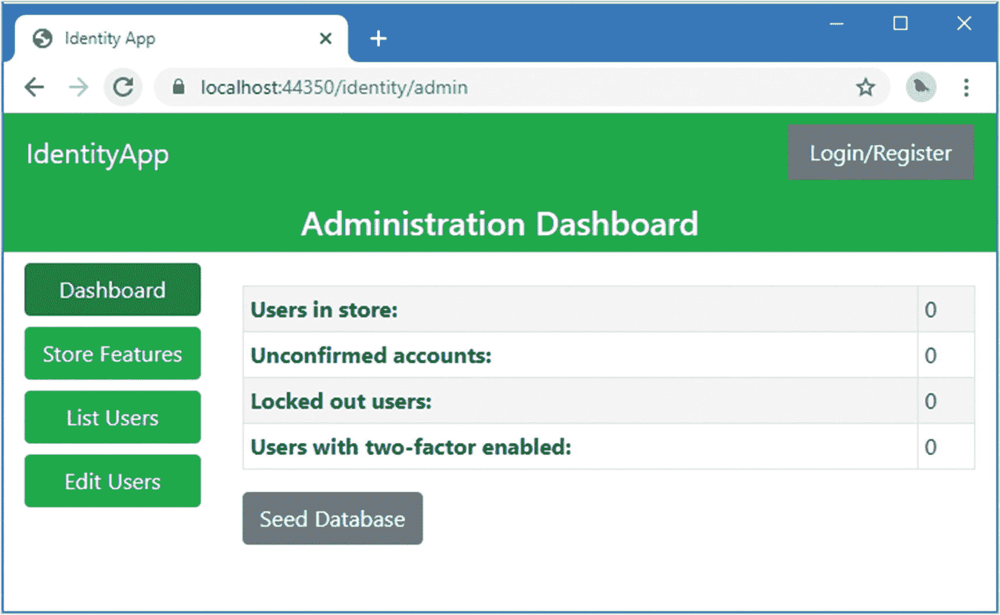
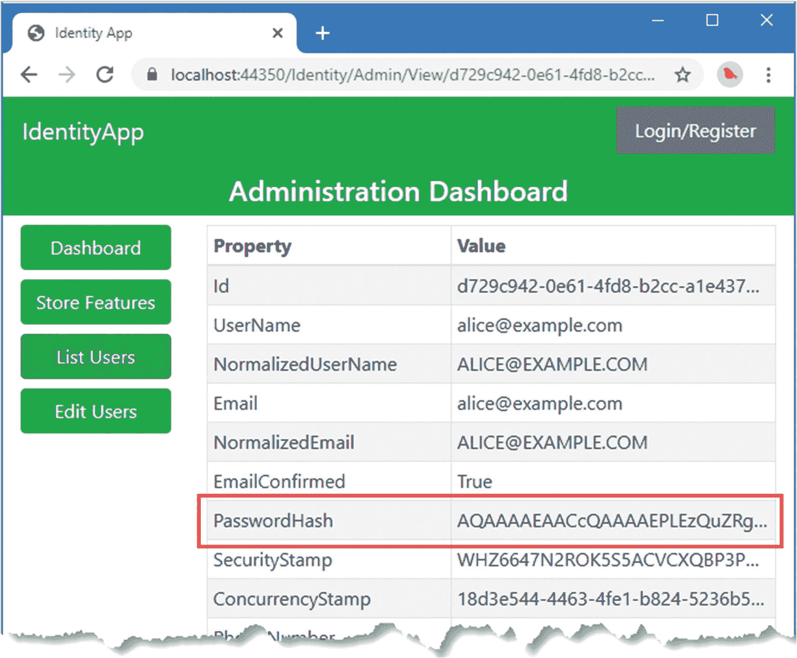
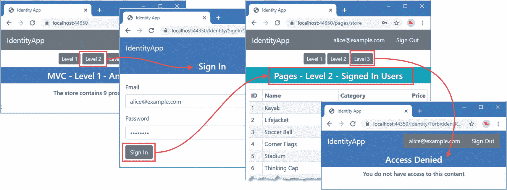
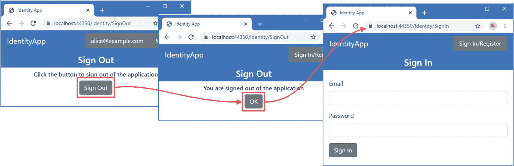
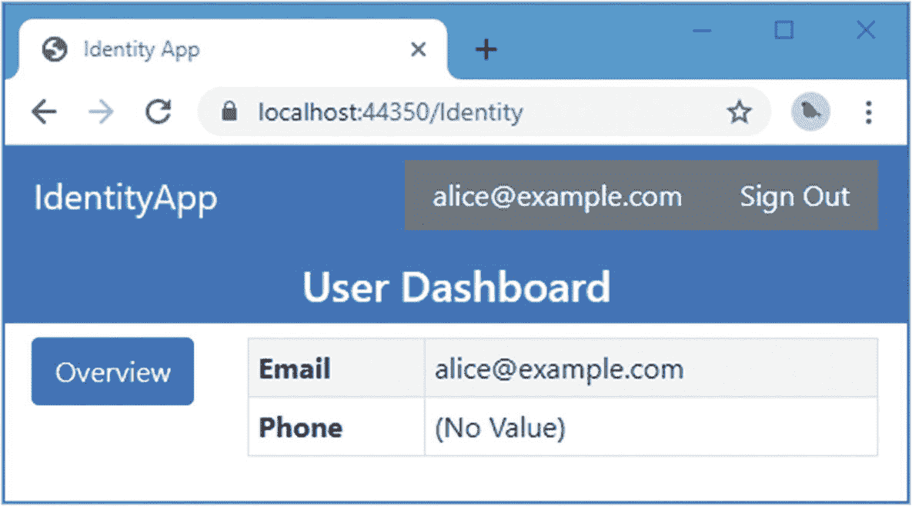
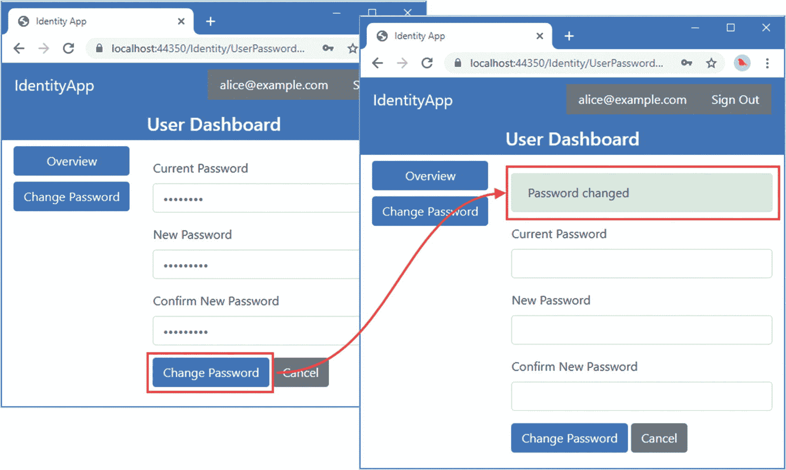
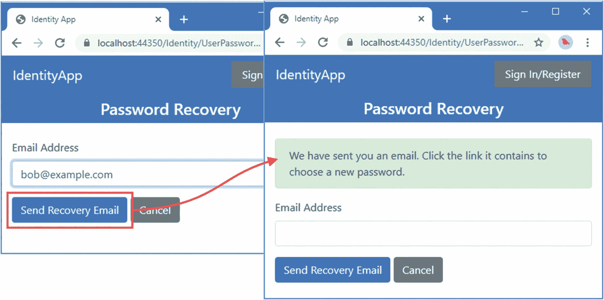
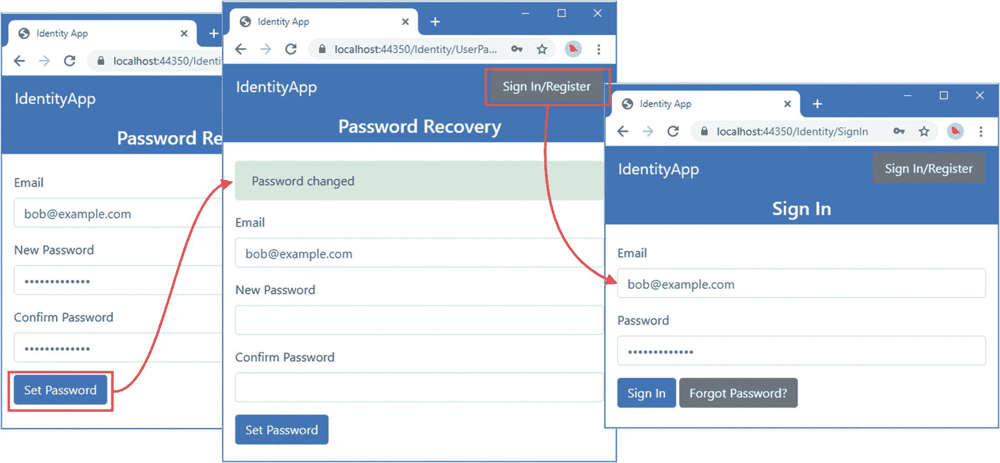
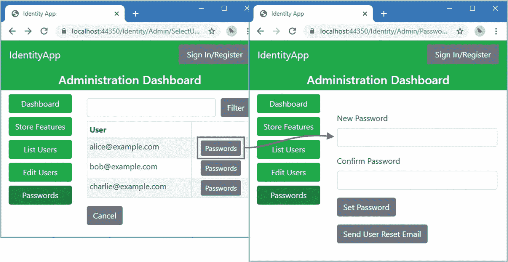
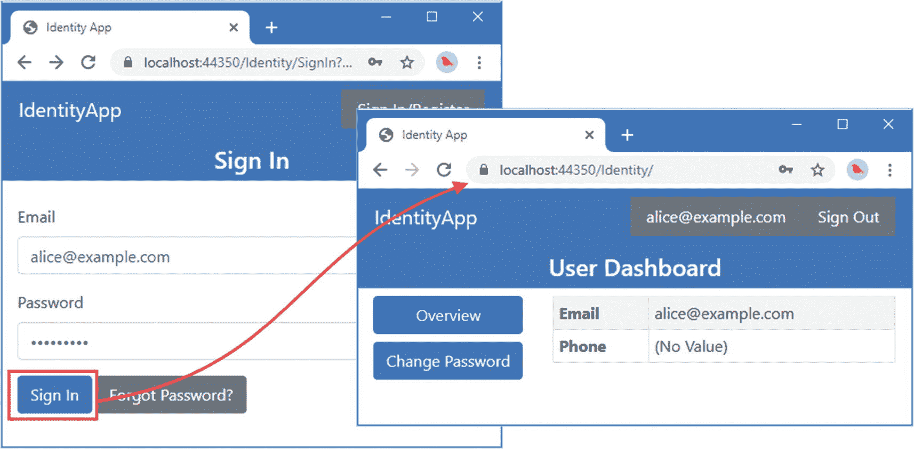

# 八、登录和注销以及管理密码

在本章中，我描述了登录和退出应用的 Identity API 特性。Identity 支持不同的登录方式，我在本章中从密码开始，包括创建管理密码的工作流。在后面的章节中，我将描述用户认证自己的其他方式。表 [8-1](#Tab1) 将登录和注销以及管理密码的功能放在上下文中。

表 8-1。

将登录和注销以及管理密码的功能放在上下文中

<colgroup><col class="tcol1 align-left"> <col class="tcol2 align-left"></colgroup> 
| 

问题

 | 

回答

 |
| --- | --- |
| 它们是什么？ | 这些 API 特性用于创建工作流，以便使用密码将用户登录到应用中，并在用户完成会话后再次将其注销。这些功能还用于管理密码，既可以管理性地设置密码，也可以执行自助密码更改和密码恢复。 |
| 它们为什么有用？ | 密码不是 Identity 应用进行认证的唯一方式，但它是使用最广泛的方式，并且是大多数项目所必需的。 |
| 它们是如何使用的？ | 使用由`UserManager<IdentityUser>`类提供的方法来管理密码，该类允许在用户帐户中添加和删除密码。用户使用由登录管理器类`SignInManager<T>`定义的方法登录和退出应用。 |
| 有什么陷阱或限制吗？ | 登录过程可能很复杂，尤其是当项目支持双因素认证和外部认证时。 |
| 有其他选择吗？ | 这些功能建立在底层的 ASP.NET Core 平台上，您可以直接使用它来实现相同的结果。但是，这样做会破坏使用 Identity 管理用户的目的。 |

表 [8-2](#Tab2) 总结了本章内容。

表 8-2。

章节总结

<colgroup><col class="tcol1 align-left"> <col class="tcol2 align-left"> <col class="tcol3 align-left"></colgroup> 
| 

问题

 | 

解决办法

 | 

列表

 |
| --- | --- | --- |
| 管理用户帐户的密码 | 使用用户管理器类定义的`HasPasswordAsync`、`RemovePasswordAsync`和`HasPasswordAsync`方法。 | [1](#PC1)–[3](#PC3) |
| 使用密码让用户登录应用 | 使用由登录管理器类定义的`PasswordSignInAsync`方法。 | [4](#PC4) ， [5](#PC5) |
| 将用户从应用中注销 | 使用由登录管理器类定义的`SignOutAsync`方法。 | [6](#PC8) ， [7](#PC9) |
| 将 ASP.NET Core 配置为使用自定义工作流登录和注销用户 | 使用`ConfigureApplicationCookie`方法配置`LoginPath`、`LogoutPath`和`AccessDeniedPath`属性。 | [8](#PC10)–[10](#PC12) |
| 获取已登录用户的`IdentityUser`对象 | 调用用户管理器的`GetUserAsync`方法。 | [11](#PC13) |
| 支持自助密码更改 | 调用用户管理器的`ChangePasswordAsync`方法。 | [15](#PC18)–[17](#PC20) |
| 支持自助密码恢复 | 调用用户管理器的`GeneratePasswordResetTokenAsync`来获取发送给用户的令牌。使用`ResetPasswordAsync`方法验证令牌并更改密码。 | [12](#PC15)–[14](#PC17)、[18](#PC21)–[23](#PC26) |
| 支持管理员密码更改 | 使用用户管理器类定义的`HasPasswordAsync`、`RemovePasswordAsync`和`HasPasswordAsync`方法，或者使用`GeneratePasswordResetTokenAsync`和`ResetPasswordAsync`方法允许用户选择新密码。 | 24–[26](#PC30) |
| 限制登录用户对资源的访问 | 应用`Authorize`属性，用`AllowAnonymous`属性创建异常。 | [27](#PC31)–[32](#PC36) |

## 为本章做准备

本章使用第 [7 章](07.html)中的`IdentityApp`项目。本章不需要修改。打开一个新的 PowerShell 命令提示符，并运行清单 [8-1](#PC1) 中所示的命令来重置应用和 Identity 数据库。

Tip

你可以从 [`https://github.com/Apress/pro-asp.net-core-identity`](https://github.com/Apress/pro-asp.net-core-identity) 下载本章以及本书其他章节的示例项目。如果在运行示例时遇到问题，请参见第 [1](01.html) 章获取帮助。

```cs
dotnet ef database drop --force --context ProductDbContext
dotnet ef database drop --force --context IdentityDbContext
dotnet ef database update --context ProductDbContext
dotnet ef database update --context IdentityDbContext

Listing 8-1.Resetting the Databases

```

使用 PowerShell 提示符运行清单 [8-2](#PC2) 中的命令来启动应用。

```cs
dotnet run

Listing 8-2.Running the Example Application

```

打开网页浏览器并请求`https://localhost:44350/Identity/Admin`，将显示管理仪表板，如图 [8-1](#Fig1) 所示。



图 8-1。

运行示例应用

## 向种子数据添加密码

用于植入用户存储的用户帐户将无法登录应用，因为它们没有凭据。Identity 支持一系列认证机制，并且不需要使用任何特定的认证数据来创建`IdentityUser`对象。基本的认证模型使用密码，在后面的章节介绍其他选项之前，我将从这一章开始。使用用户类定义的方法分配密码，如表 [8-3](#Tab3) 所述。

表 8-3。

用户管理器<identityuser>管理密码的方法</identityuser>

<colgroup><col class="tcol1 align-left"> <col class="tcol2 align-left"></colgroup> 
| 

名字

 | 

描述

 |
| --- | --- |
| `HasPasswordAsync(user)` | 如果给特定的`IdentityUser`对象分配了密码，该方法返回`true`。 |
| `AddPasswordAsync(user, password)` | 这个方法为指定的`IdentityUser`添加一个密码。 |
| `RemovePasswordAsync(user)` | 该方法删除为指定的`IdentityUser`对象存储的密码。 |

在清单 [8-3](#PC3) 中，我使用了`AddPasswordAsync`方法为所有用于播种用户存储的帐户设置相同的密码。

```cs
...
public async Task<IActionResult> OnPostAsync() {
    foreach (IdentityUser existingUser in UserManager.Users.ToList()) {
        IdentityResult result = await UserManager.DeleteAsync(existingUser);
        result.Process(ModelState);
    }
    foreach (string email in emails) {
        IdentityUser userObject = new IdentityUser {
            UserName = email,
            Email = email,
            EmailConfirmed = true
        };
        IdentityResult result = await UserManager.CreateAsync(userObject);
        if (result.Process(ModelState)) {
            result = await UserManager.AddPasswordAsync(userObject, "mysecret");
            result.Process(ModelState);
        }
    }
    if (ModelState.IsValid) {
        return RedirectToPage();
    }
    return Page();
}
...

Listing 8-3.Setting Passwords in the Dashboard.cshtml.cs File in the Pages/Identity/Admin Folder

```

我使用`AddPasswordAsync`方法给所有的测试帐户相同的密码:`mysecret`。在本章的后面，我将创建更改密码的工作流，但这已经足够开始了。

重启 ASP.NET Core 并请求`https://localhost:44350/identity/admin`。单击 Seed Database 按钮，测试帐户将被添加到用户存储中，包括密码。

密码以哈希码的形式存储，这意味着访问数据库不会泄露用户的密码。我在第 2 部分中详细描述了将密码转换为散列码的过程，但是您可以通过单击 alice@example.com 帐户的“列出用户”按钮和“查看”按钮来查看结果。`PasswordHash`属性已经赋值，如图 [8-2](#Fig2) 所示。



图 8-2。

存储密码

## 登录、注销和拒绝访问

三个最基本的面向用户的功能是登录到应用的能力、再次注销的能力以及当用户请求他们未被授权的内容时显示错误消息的能力。在接下来的小节中，我将创建这些基本的工作流，并配置应用来使用它们。

### 登录应用

登录应用时，用户提供与用户存储中的数据进行比较的凭据。如果凭证与存储的数据相匹配，则在响应中添加一个 cookie，以便在后续请求中安全地标识用户。

ASP.NET Core 使用`ClaimsPrincipal`类来表示登录的用户。我将在后面的章节中更详细地描述这个类，但是现在，只要知道登录过程从存储中获得一个`IdentityUser`对象，并使用它包含的数据创建一个可以被 ASP.NET Core 使用的`ClaimsPrincipal`对象就足够了。

评估用户的凭证和创建`ClaimsPrincipal`对象是登录管理器类`SignInManager<IdentityUser>`的职责，在配置 Identity 时，它被配置为一个服务。

在`Pages/Identity`文件夹中添加一个名为`SignIn.cshtml`的 Razor 页面，内容如清单 [8-4](#PC4) 所示。

```cs
@page "{returnUrl?}"
@model IdentityApp.Pages.Identity.SignInModel
@{
    ViewData["showNav"] = false;
    ViewData["banner"] = "Sign In";
}

<div asp-validation-summary="All" class="text-danger m-2"></div>

@if (TempData.ContainsKey("message")) {
    <div class="alert alert-danger">@TempData["message"]</div>
}

<form method="post">
    <div class="form-group">
        <label>Email</label>
        <input class="form-control" name="email" />
    </div>
    <div class="form-group">
        <label>Password</label>
        <input class="form-control" type="password" name="password" />
    </div>
    <button type="submit" class="btn btn-primary">
        Sign In
    </button>
</form>

Listing 8-4.The Contents of the SignIn.cshtml File in the Pages/Identity Folder

```

用户被提示在发送 POST 请求的表单中输入他们的电子邮件地址和密码。有显示模型验证错误的元素，我添加了一个样式为 alert 的`div`元素，这样我就可以使用 ASP.NET Core 临时数据特性显示消息。

正如您在前面章节中看到的，当未经验证的用户请求受保护的内容时，ASP.NET Core 会发送一个质询响应，提示用户登录。作为该过程的一部分，用户请求的 URL 作为名为`returnUrl`的查询字符串参数提供，这允许浏览器在成功登录后被重定向回内容。清单 [8-4](#PC4) 中的`page`指令定义了一个名为`returnUrl`的路由参数来捕获这个 URL。

要定义页面模型类，将清单 [8-5](#PC5) 中所示的代码添加到`SignIn.cshtml.cs`文件中。(如果您使用的是 Visual Studio 代码，则必须创建该文件。)

```cs
using System.ComponentModel.DataAnnotations;
using System.Threading.Tasks;
using Microsoft.AspNetCore.Identity;
using Microsoft.AspNetCore.Mvc;
using SignInResult = Microsoft.AspNetCore.Identity.SignInResult;

namespace IdentityApp.Pages.Identity {

    public class SignInModel : UserPageModel {

        public SignInModel(SignInManager<IdentityUser> signMgr)
            => SignInManager = signMgr;

        public SignInManager<IdentityUser> SignInManager { get; set; }

        [Required]
        [EmailAddress]
        [BindProperty]
        public string Email { get; set; }

        [Required]
        [BindProperty]
        public string Password { get; set; }

        [BindProperty(SupportsGet = true)]
        public string ReturnUrl { get; set; }

        public async Task<IActionResult> OnPostAsync() {
            if (ModelState.IsValid) {
                SignInResult result = await SignInManager.PasswordSignInAsync(Email,
                    Password, true, true);
                if (result.Succeeded) {
                    return Redirect(ReturnUrl ?? "/");
                } else if (result.IsLockedOut) {
                    TempData["message"] = "Account Locked";
                } else if (result.IsNotAllowed) {
                    TempData["message"] = "Sign In Not Allowed";
                } else if (result.RequiresTwoFactor) {
                    return RedirectToPage("SignInTwoFactor", new { ReturnUrl });
                } else {
                    TempData["message"] = "Sign In Failed";
                }
            }
            return Page();
        }
    }
}

Listing 8-5.The Contents of the SignIn.cshtml.cs File in the Pages/Identity Folder

```

页面模型通过其构造函数接收一个`SignInManager<IdentityUser>`对象，并使用`PasswordSignInAsync`方法让用户登录应用。为了快速参考，表 [8-4](#Tab4) 描述了该方法。

表 8-4。

用于密码登录的 SignInManager <identityuser>方法</identityuser>

<colgroup><col class="tcol1 align-left"> <col class="tcol2 align-left"></colgroup> 
| 

名字

 | 

描述

 |
| --- | --- |
| `PasswordSignInAsync(username, password, persist, lockout)` | 该方法使用指定的用户名和密码将用户登录到应用。`persist`参数指定浏览器关闭后认证 cookie 是否继续存在。`lockout`参数指定失败的登录尝试是否计入锁定，如第 [9](09.html) 章所述。这个方法还有一个版本，它接受一个`IdentityUser`对象，而不是用户名。 |

来自`PasswordSignInAsync`的结果是在`Microsoft.AspNetCore.Identity`名称空间中定义的`SignInResult`类的一个实例。在`Microsoft.AspNetCore.Mvc`名称空间中还定义了一个`SignInResult`类，因此需要消除歧义，如下所示:

```cs
...
using SignInResult = Microsoft.AspNetCore.Identity.SignInResult;
...

```

`SignInResult`使用表 [8-5](#Tab5) 中描述的属性描述了信号尝试。

表 8-5。

SignInResult 属性

<colgroup><col class="tcol1 align-left"> <col class="tcol2 align-left"></colgroup> 
| 

名字

 | 

描述

 |
| --- | --- |
| `Succeeded` | 如果用户已经成功登录到应用，该属性返回`true`。 |
| `IsLockedOut` | 如果用户当前被锁定，该属性返回`true`。参见第 [9 章](09.html)了解锁定如何工作的详细信息。 |
| `RequiresTwoFactor` | 如果需要双因素认证，该属性将返回`true`。参见第 [11 章](11.html)了解创建双因素认证工作流的详细信息。 |
| `IsNotAllowed` | 如果不允许用户登录，该属性返回`true`。这是电子邮件地址尚未确认时最常见的情况。我在第 9 章创建了一个支持确认的工作流。 |

如果`Succeeded`属性是`false`，您可以检查其他属性，看看是否需要任何后续操作，比如提示用户进行双因素认证。如果所有的`SignInResult`属性都是`false`，那么用户没有提供有效的电子邮件地址或密码。

如果`Succeeded`属性是`true`，那么用户已经登录到应用，并且可以被重定向回触发质询响应的 URL，如下所示:

```cs
...
if (result.Succeeded) {
    return RedirectToPage(ReturnUrl ?? "/");
} else if (result.IsLockedOut) {
...

```

其他结果通过向用户显示错误消息来处理，除非用户需要双因素认证。对于这个结果，我执行了一个名为`SignInTwoFactor`的 Razor 页面的重定向，我将在第 [11 章](11.html)中创建这个页面。

### 注销应用

注销应用允许用户显式终止他们的会话。在`Pages/Identity`文件夹中添加一个名为`SignOut.cshtml`的 Razor 页面，内容如清单 [8-6](#PC8) 所示。

```cs
@page
@model IdentityApp.Pages.Identity.SignOutModel
@{
    ViewData["showNav"] = false;
    ViewData["banner"] = "Sign Out";
}

@if (User.Identity.IsAuthenticated) {
    <form method="post">
        <div class="text-center">
            <h6>Click the button to sign out of the application</h6>
            <button type="submit" class="btn btn-secondary">
                Sign Out
            </button>
        </div>
    </form>
} else {
    <div class="text-center">
        <h6>You are signed out of the application</h6>
        <a asp-page="SignIn" asp-route-returnUrl="" class="btn btn-secondary">
            OK
        </a>
    </div>
}

Listing 8-6.The Contents of the SignOut.cshtml File in the Pages/Identity Folder

```

页面的视图部分通过读取`User.Identity.IsAuthenticated`属性来检查是否有经过认证的用户。我在第 2 部分中解释了这个属性是如何工作的，但是现在，只要知道如果当前请求被认证，它将返回`true`就足够了。

如果有一个经过认证的用户，那么视图会显示一个包含表单的页面，允许用户注销。如果没有经过认证的用户，则会显示一条消息，指示该用户已注销。这很重要，因为在注销过程中应该重定向浏览器，以确保验证用户的 cookie 被删除。

要定义页面模型类，将清单 [8-7](#PC9) 中所示的代码添加到`SignOut.cshtml.cs`文件中。(如果您使用的是 Visual Studio 代码，则必须创建该文件。)

```cs
using Microsoft.AspNetCore.Identity;
using Microsoft.AspNetCore.Mvc;
using System.Threading.Tasks;

namespace IdentityApp.Pages.Identity {

    public class SignOutModel : UserPageModel    {

        public SignOutModel(SignInManager<IdentityUser> signMgr)
            => SignInManager = signMgr;

        public SignInManager<IdentityUser> SignInManager { get; set; }

        public async Task<IActionResult> OnPostAsync() {
            await SignInManager.SignOutAsync();
            return RedirectToPage();
        }
    }
}

Listing 8-7.The Contents of the SignOut.cshtml.cs File in the Pages/Identity Folder

```

使用登录管理器的`SignOutAsync`方法注销应用。一旦用户被注销，我调用`RedirectToPage`方法，这将导致浏览器向`SignOut`页面发送 GET 请求，并显示确认用户被注销的消息。这是确保认证 cookie 被删除的重定向。为了快速参考，表 [8-6](#Tab6) 描述了用户退出应用的方法。

表 8-6。

注销的 SignInManager <identityuser>方法</identityuser>

<colgroup><col class="tcol1 align-left"> <col class="tcol2 align-left"></colgroup> 
| 

名字

 | 

描述

 |
| --- | --- |
| `SignOutAsync()` | 此方法将当前用户从应用中注销。 |

### 创建禁止页面

在`Pages/Identity`文件夹中添加一个名为`Forbidden.cshtml`的页面，内容如清单 [8-8](#PC10) 所示。这是当用户请求他们未被授权的 URL 时将显示的页面。

```cs
@page
@model IdentityApp.Pages.Identity.ForbiddenModel
@{
    ViewData["showNav"] = false;
    ViewData["banner"] = "Access Denied";
}

<h6 class="text-center">You do not have access to this content</h6>

Listing 8-8.The Contents of the Forbidden.cshtml File in the Pages/Identity Folder

```

这个页面不需要页面模型代码，它只是向用户显示消息。

### 配置应用

现在我已经有了用于登录和退出的定制页面，我需要做一些配置更改来将它们集成到应用中。清单 [8-9](#PC11) 更新了布局标题中显示的导航链接，以使用新页面。(更新该文件时，注意删除`asp-area`属性，这些属性用于从 Identity UI 包创建的 ASP.NET Core 区域中选择页面。)

```cs
<nav class="nav">
    @if (User.Identity.IsAuthenticated) {
        <a asp-page="/Identity/Index" class="nav-link bg-secondary text-white">
                @User.Identity.Name
        </a>
        <a asp-page="/Identity/SignOut" class="nav-link bg-secondary text-white">
            Sign Out
        </a>
    } else {
        <a asp-page="/Identity/SignIn" class="nav-link bg-secondary text-white">
            Sign In/Register
        </a>
    }
</nav>

Listing 8-9.Updating Links in the _LoginPartial.cshtml File in the Views/Shared Folder

```

我还需要更新 ASP.NET Core 配置。默认情况下，ASP.NET Core 将使用`/Account/Login`和`/Account/Logout`URL 登录和退出应用。我本可以使用路由系统来确保我的新 Razor 页面将接收对这些 URL 的请求，但是我选择更改 ASP.NET Core 使用的 URL，如清单 [8-10](#PC12) 所示。

```cs
...
public void ConfigureServices(IServiceCollection services) {
    services.AddControllersWithViews();
    services.AddRazorPages();
    services.AddDbContext<ProductDbContext>(opts => {
        opts.UseSqlServer(
            Configuration["ConnectionStrings:AppDataConnection"]);
    });

    services.AddHttpsRedirection(opts => {
        opts.HttpsPort = 44350;
    });

    services.AddDbContext<IdentityDbContext>(opts => {
        opts.UseSqlServer(
            Configuration["ConnectionStrings:IdentityConnection"],
            opts => opts.MigrationsAssembly("IdentityApp")
        );
    });

    services.AddScoped<IEmailSender, ConsoleEmailSender>();

    services.AddIdentity<IdentityUser, IdentityRole>(opts => {
        opts.Password.RequiredLength = 8;
        opts.Password.RequireDigit = false;
        opts.Password.RequireLowercase = false;
        opts.Password.RequireUppercase = false;
        opts.Password.RequireNonAlphanumeric = false;
        opts.SignIn.RequireConfirmedAccount = true;
    }).AddEntityFrameworkStores<IdentityDbContext>();

    services.AddAuthentication()
        .AddFacebook(opts => {
            opts.AppId = Configuration["Facebook:AppId"];
            opts.AppSecret = Configuration["Facebook:AppSecret"];
        })
        .AddGoogle(opts => {
            opts.ClientId = Configuration["Google:ClientId"];
            opts.ClientSecret = Configuration["Google:ClientSecret"];
        })
        .AddTwitter(opts => {
            opts.ConsumerKey = Configuration["Twitter:ApiKey"];
            opts.ConsumerSecret = Configuration["Twitter:ApiSecret"];
        });

    services.ConfigureApplicationCookie(opts => {
        opts.LoginPath = "/Identity/SignIn";
        opts.LogoutPath = "/Identity/SignOut";
        opts.AccessDeniedPath = "/Identity/Forbidden";
    });
}
...

Listing 8-10.Configuring URLs in the Startup.cs File in the ExampleApp Folder

```

`ConfigureApplicationCookie`扩展方法由 Identity 提供，可用于通过向由`CookieAuthenticationOptions`类定义的属性分配新值来覆盖默认设置。清单 [8-10](#PC12) 中使用的属性在表 [8-7](#Tab7) 中有描述，我在第 [14 章](14.html)中解释了`CookieAuthenticationOptions`类的作用。

表 8-7。

用于选择 URL 的 CookieAuthenticationOptions

<colgroup><col class="tcol1 align-left"> <col class="tcol2 align-left"></colgroup> 
| 

名字

 | 

描述

 |
| --- | --- |
| `LoginPath` | 此属性用于指定在质询响应后浏览器被定向到的 URL，以便用户可以登录到应用。 |
| `LogoutPath` | 此属性用于指定浏览器被定向到的 URL，以便用户可以登录到应用。 |
| `AccessDeniedPath` | 此属性用于指定在禁止响应后浏览器被定向到的 URL，指示用户无权访问所请求的内容。 |

重启 ASP.NET Core 并请求`https://localhost:44350`。点按 2 级按钮以请求仅对已验证用户可用的内容。这将产生一个进入登录页面的挑战响应，如图 [8-3](#Fig3) 所示。使用`alice@example.com`作为电子邮件地址和`mysecret`作为密码登录应用。

单击“登录”按钮，您将登录到应用并重定向到受保护的内容。单击第 3 级按钮，请求仅对被分配了特定角色的用户可用的内容。这种类型的请求会导致禁止响应，直到我在第 [10](10.html) 章添加角色支持，产生拒绝访问消息，如图 [8-3](#Fig3) 所示。



图 8-3。

使用密码登录应用并触发禁止的响应

单击标题中的“注销”链接，单击“注销”按钮，您将从应用中注销。点击确定按钮，将导航回签到页面，如图 [8-4](#Fig4) 所示。



图 8-4。

注销应用

## 完成用户仪表板

现在，用户可以登录到应用，我可以返回到用户仪表板，完成初始功能。清单 [8-11](#PC13) 显示了为当前用户显示数据所需的对`Index`页面模型类的修改。

```cs
using Microsoft.AspNetCore.Identity;
using System.Threading.Tasks;

namespace IdentityApp.Pages.Identity {

    public class IndexModel : UserPageModel {

        public IndexModel(UserManager<IdentityUser> userMgr)
            => UserManager = userMgr;

        public UserManager<IdentityUser> UserManager { get; set; }

        public string Email { get; set; }
        public string Phone { get; set; }

        public async Task OnGetAsync() {
            IdentityUser CurrentUser = await UserManager.GetUserAsync(User);
            Email = CurrentUser?.Email ?? "(No Value)";
            Phone = CurrentUser?.PhoneNumber ?? "(No Value)";
        }
    }
}

Listing 8-11.Displaying Data in the Index.cshtml File in the Pages/Identity Folder

```

如前所述，ASP.NET 内核使用一个`ClaimsPrincipal`对象来表示当前通过认证的用户，该对象通过页面模型和控制器的基类提供的`User`属性来访问。用户管理器类提供了`GetUserAsync`方法，该方法从用户存储中获取代表登录用户的`IdentityUser`对象，如下所示:

```cs
...
IdentityUser CurrentUser = await UserManager.GetUserAsync(User);
...

```

这在 ASP.NET Core 平台和 ASP.NET Core Identity 用来代表用户的对象之间提供了一个有用的桥梁，对于自助服务工作流非常有用。表 [8-8](#Tab8) 总结了清单 [8-11](#PC13) 中使用的用户管理器方法，以供快速参考。

表 8-8。

获取当前用户对象的 UserManager <identityuser>方法</identityuser>

<colgroup><col class="tcol1 align-left"> <col class="tcol2 align-left"></colgroup> 
| 

名字

 | 

描述

 |
| --- | --- |
| `GetUserAsync(principal)` | 该方法返回为指定的`ClaimsPrincipal`对象存储的`IdentityUser`对象，该对象通常通过页面模型和控制器的基类定义的`User`属性获得。 |

重新启动 ASP.NET Core，并确保您以`alice@example.com`Identity 登录。点击标题中显示的电子邮件地址，您将看到用户仪表板，其中已经填充了已登录用户的数据，如图 [8-5](#Fig5) 所示。



图 8-5。

显示当前登录用户的数据

## 管理密码

如果应用支持使用密码登录，则需要工作流来管理密码。在接下来的小节中，我将向您展示如何支持管理员设置密码，管理员强制用户选择新密码，以及用户更改他们的密码。

### 准备电子邮件确认服务

一些工作流要求用户单击他们在电子邮件中收到的链接，以确认他们在注册期间控制了电子邮件地址，或者确认他们启动了操作，如密码更改。如果这些确认电子邮件是使用服务创建的，那么处理它们会更容易，因为这意味着可以从任何 Razor 页面或控制器发送确认，并且所有的电子邮件都是一致的。

发送给用户的电子邮件包含确认令牌，这些令牌必须进行编码，以便可以作为 URL 的一部分安全发送，并在用户单击电子邮件中的链接时再次解码。将名为`TokenUrlEncoderService.cs`的文件添加到`Services`文件夹中，并添加清单 [8-12](#PC15) 中所示的代码。

```cs
using Microsoft.AspNetCore.WebUtilities;
using System.Text;

namespace IdentityApp.Services {

    public class TokenUrlEncoderService {

        public virtual string EncodeToken(string token)
            => WebEncoders.Base64UrlEncode(Encoding.UTF8.GetBytes(token));

        public virtual string DecodeToken(string urlToken)
            => Encoding.UTF8.GetString(WebEncoders.Base64UrlDecode(urlToken));
    }
}

Listing 8-12.The Contents of the TokenUrlEncoderService.cs File in the Services Folder

```

我使用了 Base64 编码，它确保令牌可以被编码，因此它们只包含 URL 中允许的字符。接下来，将名为`IdentityEmailService.cs`的文件添加到`Services`文件夹中，并添加清单 [8-13](#PC16) 中所示的代码。

```cs
using Microsoft.AspNetCore.Http;
using Microsoft.AspNetCore.Identity;
using Microsoft.AspNetCore.Identity.UI.Services;
using Microsoft.AspNetCore.Routing;

namespace IdentityApp.Services {

    public class IdentityEmailService {

        public IdentityEmailService(IEmailSender sender,
                UserManager<IdentityUser> userMgr,
                IHttpContextAccessor contextAccessor,
                LinkGenerator generator,
                TokenUrlEncoderService encoder) {
            EmailSender = sender;
            UserManager = userMgr;
            ContextAccessor = contextAccessor;
            LinkGenerator = generator;
            TokenEncoder = encoder;
        }

        public IEmailSender EmailSender { get; set; }
        public UserManager<IdentityUser> UserManager { get; set;}
        public IHttpContextAccessor ContextAccessor { get; set; }
        public LinkGenerator LinkGenerator { get; set; }
        public TokenUrlEncoderService TokenEncoder { get; set; }

        private string GetUrl(string emailAddress, string token, string page) {
            string safeToken = TokenEncoder.EncodeToken(token);
            return LinkGenerator.GetUriByPage(ContextAccessor.HttpContext, page,
                null, new { email = emailAddress, token = safeToken});
        }
    }
}

Listing 8-13.The Contents of the IdentityEmailService.cs File in the Services Folder

```

`IdentityEmailService`类声明了它所需要的服务的依赖关系:清单 [8-13](#PC16) 中定义的`TokenUrlEncoderService`、用户管理器类、`IHttpContextAccessor`服务(用于访问 Razor 页面或控制器之外的`HttpContext`对象)以及用于发送电子邮件的`IEmailSender`服务。

`GetUrl`方法接受一个电子邮件地址、一个确认令牌和一个页面，并返回一个用户可以点击的 URL。我将在`IdentityEmailService`类中添加方法，以便在创建需要确认的工作流时发送特定的电子邮件。将清单 [8-14](#PC17) 中显示的语句添加到`Startup`类中，以将清单 [8-12](#PC15) 和清单 [8-13](#PC16) 中定义的类设置为服务。

```cs
...
public void ConfigureServices(IServiceCollection services) {
    services.AddControllersWithViews();
    services.AddRazorPages();
    services.AddDbContext<ProductDbContext>(opts => {
        opts.UseSqlServer(
            Configuration["ConnectionStrings:AppDataConnection"]);
    });

    services.AddHttpsRedirection(opts => {
        opts.HttpsPort = 44350;
    });

    services.AddDbContext<IdentityDbContext>(opts => {
        opts.UseSqlServer(
            Configuration["ConnectionStrings:IdentityConnection"],
            opts => opts.MigrationsAssembly("IdentityApp")
        );
    });

    services.AddScoped<IEmailSender, ConsoleEmailSender>();

    services.AddIdentity<IdentityUser, IdentityRole>(opts => {
        opts.Password.RequiredLength = 8;
        opts.Password.RequireDigit = false;
        opts.Password.RequireLowercase = false;
        opts.Password.RequireUppercase = false;
        opts.Password.RequireNonAlphanumeric = false;
        opts.SignIn.RequireConfirmedAccount = true;
    }).AddEntityFrameworkStores<IdentityDbContext>()
       .AddDefaultTokenProviders();

    services.AddScoped<TokenUrlEncoderService>();
    services.AddScoped<IdentityEmailService>();

    // ...statements omitted for brevity...
}
...

Listing 8-14.Configuring Services in the Startup.cs File in the IdentityApp Folder

```

清单 [8-14](#PC17) 还将`AddDefaultTokenProviders`方法添加到建立 Identity 的调用链中。这个方法设置用于生成发送给用户的确认令牌的服务，我将在第 2 部分中详细描述。

### 执行自助密码更改

最简单的密码工作流是自助更改，用户提供当前密码和新密码。在`Pages/Identity`文件夹中添加一个名为`UserPasswordChange.cshtml`的 Razor 页面，内容如清单 [8-15](#PC18) 所示。

```cs
@page
@model IdentityApp.Pages.Identity.UserPasswordChangeModel
@{
    ViewBag.Workflow = "PasswordChange";
}

<div asp-validation-summary="All" class="text-danger m-2"></div>

@if (TempData.ContainsKey("message")) {
    <div class="alert alert-success">@TempData["message"]</div>
}

<form method="post">
    <div class="form-group">
        <label>Current Password</label>
        <input class="form-control" name="current" type="password" />
    </div>
    <div class="form-group">
        <label>New Password</label>
        <input class="form-control" name="newpassword" type="password" />
    </div>
        <div class="form-group">
        <label>Confirm New Password</label>
        <input class="form-control" name="confirmpassword" type="password" />
    </div>
    <button class="btn btn-primary">Change Password</button>
    <a asp-page="Index" class="btn btn-secondary">Cancel</a>
</form>

Listing 8-15.The Contents of the UserPasswordChange.cshtml File in the Pages/Identity Folder

```

页面的视图部分显示一个表单，用户可以在其中输入他们的当前密码和新密码。如果有一个名为`message`的临时数据属性，有一个`@if`表达式将显示一个`div`元素，我将使用它来指示密码已被成功更改。为了定义页面模型类，将清单 [8-16](#PC19) 中所示的代码添加到`UserPasswordChange.cshtml.cs`文件中。(如果您使用的是 Visual Studio 代码，则必须创建该文件。)

```cs
using Microsoft.AspNetCore.Identity;
using Microsoft.AspNetCore.Mvc;
using System.ComponentModel.DataAnnotations;
using System.Threading.Tasks;

namespace IdentityApp.Pages.Identity {

    public class PasswordChangeBindingTarget {
        [Required]
        public string Current { get; set; }

        [Required]
        public string NewPassword{ get; set; }

        [Required]
        [Compare(nameof(NewPassword))]
        public string ConfirmPassword{ get; set; }
    }

    public class UserPasswordChangeModel : UserPageModel {

        public UserPasswordChangeModel(UserManager<IdentityUser> usrMgr)
            => UserManager = usrMgr;

        public UserManager<IdentityUser> UserManager { get; set; }

        public async Task<IActionResult> OnPostAsync(
                PasswordChangeBindingTarget data) {
            if (ModelState.IsValid) {
                IdentityUser user = await UserManager.GetUserAsync(User);
                IdentityResult result = await UserManager.ChangePasswordAsync(user,
                    data.Current, data.NewPassword);
                if (result.Process(ModelState)) {
                    TempData["message"] = "Password changed";
                    return RedirectToPage();
                }
            }
            return Page();
        }
    }
}

Listing 8-16.The Contents of the UserPasswordChange.cshtml.cs File in the Pages/Identity Folder

```

密码更改是使用用户管理器的`ChangePasswordAsync`方法完成的，该方法接受一个`IdentityUser`对象、当前密码和新密码。根据第 [5](05.html) 章中描述的密码选项对新密码进行验证，如果匹配，则存储新密码。因为这是一个自助服务特性，所以我使用`GetUserAsync`来获取`IdentityUser`对象。使用一个`IdentityResult`对象来描述密码更改的结果，处理该对象是为了向模型验证字典添加错误。如果密码更改成功，一条消息将添加到临时数据字典中，以便向用户显示。

清单 [8-17](#PC20) 显示了将新特性集成到用户仪表板中所需的更改。

```cs
@model (string workflow, string theme)
@inject UserManager<IdentityUser> UserManager
@{
    Func<string, string> getClass = (string feature) =>
        feature != null && feature.Equals(Model.workflow) ? "active" : "";

    IdentityUser identityUser
        = await UserManager.GetUserAsync(User) ?? new IdentityUser();
}

<a class="btn btn-@Model.theme btn-block @getClass("Overview")" asp-page="Index">
    Overview
</a>

@if (await UserManager.HasPasswordAsync(identityUser)) {
    <a class="btn btn-@Model.theme btn-block @getClass("PasswordChange")"
            asp-page="UserPasswordChange">
        Change Password
    </a>
}

Listing 8-17.Adding Navigation in the _Workflows.cshtml File in the Pages/Identity Folder

```

并非所有用户都使用密码登录应用，所以我使用依赖注入来获得一个用户管理器对象，这样我就可以使用`HasPasswordAsync`方法来确定是否应该显示密码更改页面的导航按钮。

为了快速参考，表 [8-9](#Tab9) 描述了用于实施自助密码更改的用户管理器方法。

表 8-9。

自助密码更改的 UserManager <identityuser>方法</identityuser>

<colgroup><col class="tcol1 align-left"> <col class="tcol2 align-left"></colgroup> 
| 

名字

 | 

描述

 |
| --- | --- |
| `ChangePasswordAsync(user, current, new)` | 该方法改变指定`IdentityUser`对象的密码。此方法需要现有密码。如果用户无法提供密码，则需要恢复密码，如下一节所述。 |
| `GetUserAsync(principal)` | 该方法返回为指定的`ClaimsPrincipal`对象存储的`IdentityUser`对象，该对象通常通过页面模型和控制器的基类定义的`User`属性获得。 |
| `HasPasswordAsync(user)` | 如果用户存储包含指定的`IdentityUser`对象的密码，则该方法返回`true`，并用于确保只有拥有密码的用户才能获得修改密码的工具。 |

重启 ASP.NET Core，并确保您使用密码`mysecret`以`alice@example.com`的 Identity 登录到应用。请求`https://localhost:44350/Identity`并点击修改密码按钮。在密码字段中输入 mysecret，在新密码和确认新密码字段中输入 mysecret2。单击“更改密码”按钮；用户存储将被更新，并显示确认信息，如图 [8-6](#Fig6) 所示。



图 8-6。

执行自助密码更改

### 执行自助密码恢复

当用户忘记密码时，使用密码恢复。此工作流要求用户单击通过电子邮件发送给他们的链接，以确认他们是帐户的所有者。为了定义用户将收到的电子邮件，将清单 [8-18](#PC21) 中所示的方法添加到`IdentityEmailService`类中。

```cs
using Microsoft.AspNetCore.Http;
using Microsoft.AspNetCore.Identity;
using Microsoft.AspNetCore.Identity.UI.Services;
using Microsoft.AspNetCore.Routing;
using System.Threading.Tasks;

namespace IdentityApp.Services {

    public class IdentityEmailService {

        // ...statements omitted for brevity...

        private string GetUrl(string emailAddress, string token, string page) {
            string safeToken = TokenEncoder.EncodeToken(token);
            return LinkGenerator.GetUriByPage(ContextAccessor.HttpContext, page,
                null, new { email = emailAddress, token = safeToken});
        }

        public async Task SendPasswordRecoveryEmail(IdentityUser user,
                string confirmationPage) {
            string token = await UserManager.GeneratePasswordResetTokenAsync(user);
            string url = GetUrl(user.Email, token, confirmationPage);
            await EmailSender.SendEmailAsync(user.Email, "Set Your Password",
                $"Please set your password by <a href={url}>clicking here</a>.");
        }
    }
}

Listing 8-18.Adding a Method in the IdentityEmailService.cs File in the Services Folder

```

发送给用户的链接包含一个确认令牌，Identity 使用该令牌来防止其他用户恢复帐户密码。确认令牌由用户管理器类定义的方法生成，而`GeneratePasswordResetTokenAsync`方法生成一个可以在密码恢复工作流中使用的令牌。我在第 2 部分中描述了令牌是如何生成和验证的，但是现在，知道令牌是为了特定的目的而生成的就足够了，比如密码恢复，以防止它们被误用。

在`Pages/Identity`文件夹中添加一个名为`UserPasswordRecovery.cshtml`的 Razor 页面，内容如清单 [8-19](#PC22) 所示。

```cs
@page
@model IdentityApp.Pages.Identity.UserPasswordRecoveryModel
@{
    ViewData["showNav"] = false;
    ViewData["banner"] = "Password Recovery";
}

<div asp-validation-summary="All" class="text-danger m-2"></div>

@if (TempData.ContainsKey("message")) {
    <div class="alert alert-success">@TempData["message"]</div>
}

<form method="post">
    <div class="form-group">
        <label>Email Address</label>
        <input class="form-control" name="email" />
    </div>
    <button class="btn btn-primary">Send Recovery Email</button>
    <a asp-page="SignIn" class="btn btn-secondary">Cancel</a>
</form>

Listing 8-19.The Contents of the UserPasswordRecovery.cshtml File in the Pages/Identity Folder

```

向用户呈现一个表单，用户可以在其中输入他们的电子邮件地址，以便发送确认电子邮件。要创建页面模型类，将清单 [8-20](#PC23) 中所示的代码添加到`UserPasswordRecovery.cshtml.cs`文件中。(如果您使用的是 Visual Studio 代码，则必须创建该文件。)

```cs
using IdentityApp.Services;
using Microsoft.AspNetCore.Identity;
using Microsoft.AspNetCore.Mvc;
using System.ComponentModel.DataAnnotations;
using System.Threading.Tasks;

namespace IdentityApp.Pages.Identity {

    public class UserPasswordRecoveryModel : UserPageModel {

        public UserPasswordRecoveryModel(UserManager<IdentityUser> usrMgr,
                IdentityEmailService emailService) {
            UserManager = usrMgr;
            EmailService = emailService;
        }

        public UserManager<IdentityUser> UserManager { get; set; }
        public IdentityEmailService EmailService { get; set; }

        public async Task<IActionResult> OnPostAsync([Required]string email) {
            if (ModelState.IsValid) {
                IdentityUser user = await UserManager.FindByEmailAsync(email);
                if (user != null) {
                    await EmailService.SendPasswordRecoveryEmail(user,
                        "UserPasswordRecoveryConfirm");
                }
                TempData["message"] = "We have sent you an email. "
                    + " Click the link it contains to choose a new password.";
                return RedirectToPage();
            }
            return Page();
        }
    }
}

Listing 8-20.The Contents of the UserPasswordRecovery.cshtml.cs File in the Pages/Identity Folder

```

POST handler 方法接收用户的电子邮件地址，并从用户存储中检索`IdentityUser`对象，然后将其传递给通过构造函数接收的`IdentityEmailService`对象，以便发送电子邮件。

为了定义当用户点击电子邮件链接时接收请求的页面，向`Pages/Identity`文件夹添加一个名为`UserPasswordRecoveryConfirm.cshtml`的 Razor 页面，其内容如清单 [8-21](#PC24) 所示。

```cs
@page "{email?}/{token?}"
@model IdentityApp.Pages.Identity.UserPasswordRecoveryConfirmModel
@{
    ViewData["showNav"] = false;
    ViewData["banner"] = "Password Recovery";
}

@if (string.IsNullOrEmpty(Model.Token) || string.IsNullOrEmpty(Model.Email)) {
    <div class="h6 text-center">
        <div class="p-2">
            Check your inbox for a confirmation email and click the link it contains.
        </div>
        <a asp-page="UserPasswordRecovery" class="btn btn-primary">Resend Email</a>
    </div>
} else {
    <div asp-validation-summary="All" class="text-danger m-2"></div>
    @if (TempData.ContainsKey("message")) {
        <div class="alert alert-success">@TempData["message"]</div>
    }

    <form method="post">
        <input type="hidden" asp-for="Token" />
        <div class="form-group">
            <label>Email</label>
            <input class="form-control" asp-for="Email" />
        </div>
        <div class="form-group">
            <label>New Password</label>
            <input class="form-control" type="password" name="password" />
        </div>
        <div class="form-group">
            <label>Confirm Password</label>
            <input class="form-control" type="password" name="confirmpassword" />
        </div>
        <button class="btn btn-primary" type="submit">Set Password</button>
    </form>
}

Listing 8-21.The Contents of the UserPasswordRecoveryConfirm.cshtml File in the Pages/Identity Folder

```

页面的视图部分显示一个允许用户选择新密码的表单。电子邮件中包含的 URL 将包含`email`和`token`路由参数，如果缺少其中一个参数，将会显示一条消息告诉用户检查他们的电子邮件，如果用户直接请求页面而不是单击电子邮件链接，就会出现这种情况。要定义页面模型类，将清单 [8-22](#PC25) 中所示的代码添加到`UserPasswordRecoveryConfirm.cshtml.cs`文件中。(如果您使用的是 Visual Studio 代码，则必须创建该文件。)

```cs
using IdentityApp.Services;
using Microsoft.AspNetCore.Identity;
using Microsoft.AspNetCore.Mvc;
using System.ComponentModel.DataAnnotations;
using System.Threading.Tasks;

namespace IdentityApp.Pages.Identity {

    public class UserPasswordRecoveryConfirmModel : UserPageModel {

        public UserPasswordRecoveryConfirmModel(UserManager<IdentityUser> usrMgr,
                TokenUrlEncoderService tokenUrlEncoder) {
            UserManager = usrMgr;
            TokenUrlEncoder = tokenUrlEncoder;
        }

        public UserManager<IdentityUser> UserManager { get; set; }
        public TokenUrlEncoderService TokenUrlEncoder { get; set; }

        [BindProperty(SupportsGet = true)]
        public string Email { get; set; }

        [BindProperty(SupportsGet = true)]
        public string Token { get; set; }

        [BindProperty]
        [Required]
        public string Password { get; set; }

        [BindProperty]
        [Required]
        [Compare(nameof(Password))]
        public string ConfirmPassword { get; set; }

        public async Task<IActionResult> OnPostAsync() {
            if (ModelState.IsValid) {
                IdentityUser user = await UserManager.FindByEmailAsync(Email);
                string decodedToken = TokenUrlEncoder.DecodeToken(Token);
                IdentityResult result = await UserManager.ResetPasswordAsync(user,
                    decodedToken, Password);
                if (result.Process(ModelState)) {
                    TempData["message"] = "Password changed";
                    return RedirectToPage();
                }
            }
            return Page();
        }
    }
}

Listing 8-22.The Contents of the UserPasswordRecoveryConfirm.cshtml.cs File in the Pages/Identity Folder

```

包含在确认电子邮件链接中的电子邮件和令牌被分配给具有`BindProperty`属性的`Email`和`Token`属性。当 POST handler 方法被调用时，它从其 URL 安全形式中解码出令牌，并将其传递给用户管理器的`ResetPasswordAsync`方法，以及代表用户和用户新选择的密码的`IdentityUser`对象。这个方法的结果用一个`IdentityResult`对象描述，如果密码恢复操作成功，将向用户显示一条消息。表 [8-10](#Tab10) 描述了密码恢复中使用的用户管理器方法。

表 8-10。

用户管理器<identityuser>恢复密码的方法</identityuser>

<colgroup><col class="tcol1 align-left"> <col class="tcol2 align-left"></colgroup> 
| 

名字

 | 

描述

 |
| --- | --- |
| `GeneratePasswordResetTokenAsync(user)` | 这个方法生成一个可以被`ResetPasswordAsync`方法验证的令牌。令牌被安全地发送给用户，从而令牌的拥有确立了用户的 Identity。 |
| `ResetPasswordAsync(user, token, password)` | 该方法验证用户提供的令牌，如果它与由`GeneratePasswordResetTokenAsync`方法生成的密码匹配，则更改存储的密码。 |

将清单 [8-23](#PC26) 中所示的链接添加到`SignIn`页面，向用户展示密码恢复功能。

```cs
@page "{returnUrl?}"
@model IdentityApp.Pages.Identity.SignInModel
@{
    ViewData["showNav"] = false;
    ViewData["banner"] = "Sign In";
}

<div asp-validation-summary="All" class="text-danger m-2"></div>

@if (TempData.ContainsKey("message")) {
    <div class="alert alert-danger">@TempData["message"]</div>
}

<form method="post">
    <div class="form-group">
        <label>Email</label>
        <input class="form-control" name="email" />
    </div>
    <div class="form-group">
        <label>Password</label>
        <input class="form-control" type="password" name="password" />
    </div>
    <button type="submit" class="btn btn-primary">
        Sign In
    </button>
    <a asp-page="UserPasswordRecovery" class="btn btn-secondary">Forgot Password?</a>
</form>

Listing 8-23.Adding Navigation in the SignIn.cshtml File in the Pages/Identity Folder

```

重启 ASP.NET Core 并请求`https://localhost:44350/Identity/SignIn`。点击忘记密码？按钮，在文本字段中输入 bob@example.com，然后单击发送恢复电子邮件按钮。您将收到一条消息，确认恢复邮件已经发送，如图 [8-7](#Fig7) 所示。



图 8-7。

开始密码恢复过程

应用被配置为使用我为 Identity UI 包创建的`IEmailSender`接口的实现，它通过向控制台写入消息来模拟发送电子邮件。检查 ASP.NET Core 输出，您将看到类似于以下内容的消息:

```cs
---New Email----
To: bob@example.com
Subject: Set Your Password
Please set your password by <a href=https://localhost:44350/Identity/UserPasswordRecoveryConfirm/bob@example.com/Q2ZESjhBMVB3bFFBQ3gxRmhXTERPQzZ1UTV0TVQvWEFJZHMxb0hpS1N3RlA1ZmpXYXZvd3k3QU03UENrS3dSbDMyU2ZQem41NWRJb0V5d3FWWHRqQ2YrR2dzWHBkaW81a3NsOXdlWnJnRko5Z0d3OWE5ZTBYYlZOSzZtTEowYTc3UFNZTVI1VFN4WkhLdWY0OTRCQ2o0S2ROY2hrRWFMdU1BTXRBSDUxZ3lxcjFHdXZaNSsrTFF0Z1NFREtIQTlwZ1hxcHFIMW04L3VObGYxSzg3TnBabmhocExSM1NhOTNJa05IODVSbWtscEYyRTl4>clicking here</a>.
-------

```

从邮件中复制 URL(它将具有与此处显示的不同的令牌)，然后会提示您选择一个新密码。在两个文本字段中输入 mynewpassword，然后单击 Set Password 按钮。将显示一条确认密码更改的消息，如图 [8-8](#Fig8) 所示。单击页面顶部的登录/注册链接，您将能够使用新密码登录应用。



图 8-8。

完成密码恢复

### 执行管理员密码更改

用于自助密码管理的功能也可用于提供管理员工作流。在`Pages/Identity/Admin`文件夹中添加一个 Razor 页面`Passwords.cshtml`，内容如清单 [8-24](#PC28) 所示。

```cs
@page "{Id?}"
@model IdentityApp.Pages.Identity.Admin.PasswordsModel
@{
    ViewBag.Workflow = "Passwords";
}

<div asp-validation-summary="All" class="text-danger m-2"></div>

@if (TempData.ContainsKey("message")) {
    <div class="alert alert-success">@TempData["message"]</div>
}

<div class="container-fluid">
    <div class="row">
        <div class="col p-1">
            <div asp-validation-summary="All" class="text-danger m-2"></div>
            <form method="post" asp-page-handler="setPassword" class="pb-2">
                <input type="hidden" asp-for="Id" />
                <div class="form-group">
                    <label>New Password</label>
                    <input class="form-control" name="password" type="password" />
                </div>
                <div class="form-group">
                    <label>Confirm Password</label>
                    <input class="form-control" name="confirmation"
                            type="password" />
                </div>
                <button class="btn btn-secondary">Set Password</button>
            </form>
            @if (await Model.UserManager.IsEmailConfirmedAsync(Model.IdentityUser)) {
                <form method="post" asp-page-handler="userChange">
                    <input type="hidden" asp-for="Id" />
                    <button class="btn btn-secondary mt-2">
                        Send User Reset Email
                    </button>
                </form>
            }
        </div>
    </div>
</div>

Listing 8-24.The Contents of the Passwords.cshtml File in the Pages/Identity/Admin Folder

```

页面的视图部分显示两种形式。第一种方法允许直接指定新密码，这是设置密码的传统方法，但是需要管理员将新密码传达给用户。第二种形式用于向用户发送密码重置电子邮件，这将允许他们选择自己的密码，但只有当用户有一个确认的电子邮件地址时才能这样做。所有用于播种用户存储的测试帐户都已经确认了电子邮件地址，但是我在第 [9](09.html) 章中创建了一个确认电子邮件地址的工作流。

要创建页面模型类，将清单 [8-25](#PC29) 中所示的代码添加到`Passwords.cshtml.cs`文件中。(如果您使用的是 Visual Studio 代码，则必须创建该文件。)

```cs
using IdentityApp.Services;
using Microsoft.AspNetCore.Identity;
using Microsoft.AspNetCore.Mvc;
using Microsoft.AspNetCore.Mvc.RazorPages;
using System.ComponentModel.DataAnnotations;
using System.Threading.Tasks;

namespace IdentityApp.Pages.Identity.Admin {

    public class PasswordsModel : AdminPageModel {

        public PasswordsModel(UserManager<IdentityUser> usrMgr,
                IdentityEmailService emailService) {
            UserManager = usrMgr;
            EmailService = emailService;
        }

        public UserManager<IdentityUser> UserManager { get; set; }
        public IdentityEmailService EmailService { get; set; }

        public IdentityUser IdentityUser { get; set; }

        [BindProperty(SupportsGet = true)]
        public string Id { get; set; }

        [BindProperty]
        [Required]
        public string Password { get; set; }

        [BindProperty]
        [Compare(nameof(Password))]
        public string Confirmation { get; set; }

        public async Task<IActionResult> OnGetAsync() {
            if (string.IsNullOrEmpty(Id)) {
                return RedirectToPage("Selectuser",
                    new { Label = "Password", Callback = "Passwords" });
            }
            IdentityUser = await UserManager.FindByIdAsync(Id);
            return Page();
        }

        public async Task<IActionResult> OnPostSetPasswordAsync() {
            if (ModelState.IsValid) {
                IdentityUser = await UserManager.FindByIdAsync(Id);
                if (await UserManager.HasPasswordAsync(IdentityUser)) {
                    await UserManager.RemovePasswordAsync(IdentityUser);
                }
                IdentityResult result =
                    await UserManager.AddPasswordAsync(IdentityUser, Password);
                if (result.Process(ModelState)) {
                    TempData["message"] = "Password Changed";
                    return RedirectToPage();
                }
            }
            return Page();
        }

        public async Task<IActionResult> OnPostUserChangeAsync() {
            IdentityUser = await UserManager.FindByIdAsync(Id);
            await UserManager.RemovePasswordAsync(IdentityUser);
            await EmailService.SendPasswordRecoveryEmail(IdentityUser,
                "/Identity/UserPasswordRecoveryConfirm");
            TempData["message"] = "Email Sent to User";
            return RedirectToPage();
        }
    }
}

Listing 8-25.The Contents of the Passwords.cshtml.cs File in the Pages/Identity/Admin Folder

```

没有一种用户管理器方法可以在不需要现有密码或确认令牌的情况下一步更改密码。相反，`HasPasswordAsync`方法用于确定用户存储中是否有密码，如果有，则使用`RemovePasswordAsync`方法删除它。新密码用`AddPasswordAsync`方法存储。

恢复电子邮件使用与自助密码恢复相同的方法发送给用户。在发送电子邮件之前，我调用`RemovePasswordAsync`方法删除现有密码，以防止用户在选择新密码之前登录。为了快速参考，表 [8-11](#Tab11) 描述了用于管理员密码更改的用户管理器方法。

表 8-11。

UserManager <identityuser>修改管理员密码的方法</identityuser>

<colgroup><col class="tcol1 align-left"> <col class="tcol2 align-left"></colgroup> 
| 

名字

 | 

描述

 |
| --- | --- |
| `HasPasswordAsync(user)` | 如果用户有存储的密码，该方法返回`true`。 |
| `RemovePasswordAsync(user)` | 此方法删除指定用户的存储密码。 |
| `AddPasswordAsync(user, password)` | 此方法存储指定用户的密码。 |
| `GeneratePasswordResetTokenAsync(user)` | 这个方法生成一个可以被`ResetPasswordAsync`方法验证的令牌。令牌被安全地发送给用户，从而令牌的拥有确立了用户的 Identity。 |
| `ResetPasswordAsync(user, token, password)` | 该方法验证用户提供的令牌，如果它与由`GeneratePasswordResetTokenAsync`方法生成的密码匹配，则更改存储的密码。 |
| `IsEmailConfirmedAsync(user)` | 如果用户有一个确认的电子邮件地址，这个方法返回`true`。此方法用于确定用户是否可以收到密码重置电子邮件。 |

为了将密码功能集成到管理员仪表板中，将清单 [8-26](#PC30) 中所示的元素添加到`_AdminWorkflows`局部视图中。

```cs
@model (string workflow, string theme)

@{
    Func<string, string> getClass = (string feature) =>
        feature != null && feature.Equals(Model.workflow) ? "active" : "";
}

<a class="btn btn-@Model.theme btn-block @getClass("Dashboard")"
        asp-page="Dashboard">
    Dashboard
</a>
<a class="btn btn-@Model.theme btn-block @getClass("Features")" asp-page="Features">
    Store Features
</a>
<a class="btn btn-success btn-block @getClass("List")" asp-page="View"
        asp-route-id="">
    List Users
</a>
<a class="btn btn-success btn-block @getClass("Edit")" asp-page="Edit"
        asp-route-id="">
    Edit Users
</a>
<a class="btn btn-success btn-block @getClass("Passwords")" asp-page="Passwords"
        asp-route-id="">
    Passwords
</a>

Listing 8-26.Adding Navigation in the _AdminWorkflows.cshtml File in the Pages/Identity/Admin Folder

```

重启 panel 核心，请求`https://localhost:44350/identity/admin`，点击导航面板中的密码按钮显示用户列表。点击任意账户的密码按钮，会出现允许修改密码的功能，如图 [8-9](#Fig9) 所示。



图 8-9。

管理员密码更改功能

## 限制对自定义工作流 Razor 页面的访问

有足够的功能来限制对提供定制工作流的 Razor 页面的访问。将清单 [8-27](#PC31) 中所示的属性添加到`UserPageModel`类中，这是页面模型类的基础。

```cs
using Microsoft.AspNetCore.Mvc.RazorPages;
using Microsoft.AspNetCore.Authorization;

namespace IdentityApp.Pages.Identity {

    [Authorize]
    public class UserPageModel : PageModel {

        // no methods or properties required
    }
}

Listing 8-27.Restricting Access in the UserPageModel.cs File in the Pages/Identity Folder

```

`Authorize`属性限制任何经过认证的用户访问，这对于自我管理仪表板提供的特性来说是理想的。必须为`SignIn`页面创建一个例外，如清单 [8-28](#PC32) 所示。

```cs
using System.ComponentModel.DataAnnotations;
using System.Threading.Tasks;
using Microsoft.AspNetCore.Identity;
using Microsoft.AspNetCore.Mvc;
using SignInResult = Microsoft.AspNetCore.Identity.SignInResult;
using Microsoft.AspNetCore.Authorization;

namespace IdentityApp.Pages.Identity {

    [AllowAnonymous]
    public class SignInModel : UserPageModel {

        // ...statements omitted for brevity...
    }
}

Listing 8-28.Granting Access in the SignIn.cshtml.cs File in the Pages/Identity Folder

```

属性允许任何人访问页面。在项目的这一点上，更多的页面需要`AllowAnonymous`属性，您可能想简单地使用标准页面模型基类，而不是单独应用属性。我倾向于将授权作为默认需求，然后显式地授予例外，这样每个页面的意图都是显而易见且一致的。

`AllowAnonymous`属性也必须应用于`SignOut`页面模型类，如清单 [8-29](#PC33) 所示，因为它在用户退出后向用户显示内容。

```cs
using Microsoft.AspNetCore.Identity;
using Microsoft.AspNetCore.Mvc;
using System.Threading.Tasks;
using Microsoft.AspNetCore.Authorization;

namespace IdentityApp.Pages.Identity {

    [AllowAnonymous]
    public class SignOutModel : UserPageModel {

        public SignOutModel(SignInManager<IdentityUser> signMgr)
            => SignInManager = signMgr;

        public SignInManager<IdentityUser> SignInManager { get; set; }

        public async Task<IActionResult> OnPostAsync() {
            await SignInManager.SignOutAsync();
            return RedirectToPage();
        }
    }
}

Listing 8-29.Granting Access in the SignOut.cshtml.cs File in the Pages/Identity Folder

```

最后，同样的属性必须添加到处理密码恢复的页面中。清单 [8-30](#PC34) 将`AllowAnonymous`应用于`UserPasswordRecovery`页面的页面模型。

```cs
using IdentityApp.Services;
using Microsoft.AspNetCore.Identity;
using Microsoft.AspNetCore.Mvc;
using System.ComponentModel.DataAnnotations;
using System.Threading.Tasks;
using Microsoft.AspNetCore.Authorization;

namespace IdentityApp.Pages.Identity {

    [AllowAnonymous]
    public class UserPasswordRecoveryModel : UserPageModel {

        // ...statements omitted for brevity...
    }
}

Listing 8-30.Granting Access in the UserPasswordRecovery.cshtml.cs File in the Pages/Identity Folder

```

清单 [8-31](#PC35) 将属性应用于`UserPasswordRecoveryConfirm`页面的页面模型类。

```cs
using IdentityApp.Services;
using Microsoft.AspNetCore.Identity;
using Microsoft.AspNetCore.Mvc;
using System.ComponentModel.DataAnnotations;
using System.Threading.Tasks;
using Microsoft.AspNetCore.Authorization;

namespace IdentityApp.Pages.Identity {

    [AllowAnonymous]
    public class UserPasswordRecoveryConfirmModel : UserPageModel {

        public UserPasswordRecoveryConfirmModel(UserManager<IdentityUser> usrMgr,
                TokenUrlEncoderService tokenUrlEncoder) {
            UserManager = usrMgr;
            TokenUrlEncoder = tokenUrlEncoder;
        }

        public UserManager<IdentityUser> UserManager { get; set; }
        public TokenUrlEncoderService TokenUrlEncoder { get; set; }

        [BindProperty(SupportsGet = true)]
        public string Email { get; set; }

        [BindProperty(SupportsGet = true)]
        public string Token { get; set; }

        [BindProperty]
        [Required]
        public string Password { get; set; }

        [BindProperty]
        [Required]
        [Compare(nameof(Password))]
        public string ConfirmPassword { get; set; }

        public async Task<IActionResult> OnPostAsync() {
            if (ModelState.IsValid) {
                IdentityUser user = await UserManager.FindByEmailAsync(Email);
                string decodedToken = TokenUrlEncoder.DecodeToken(Token);
                IdentityResult result = await UserManager.ResetPasswordAsync(user,
                    decodedToken, Password);
                if (result.Process(ModelState)) {
                    TempData["message"] = "Password changed";
                    return RedirectToPage();
                }
            }
            return Page();
        }
    }
}

Listing 8-31.Granting Access in the UserPasswordRecoveryConfirm.cshtml.cs File in the Pages/Identity Folder

```

限制登录用户访问的默认策略也适用于管理仪表板，这在下次重置数据库时将成为一个问题:播种用户存储的按钮将只能由登录用户访问，但是不能登录，因为用户存储将是空的。

当我创建管理角色的工作流时，我会在第 [10 章](10.html)中适当地解决这个问题。在此之前，我将允许任何人访问管理功能，即使没有登录用户。将清单 [8-32](#PC36) 中所示的属性添加到`AdminUserPage`类中。

```cs
using Microsoft.AspNetCore.Authorization;

namespace IdentityApp.Pages.Identity.Admin {

    [AllowAnonymous]
    public class AdminPageModel : UserPageModel {

        // no methods or properties required
    }
}

Listing 8-32.Disabling Authorization in the AdminPageModel.cs File in the Pages/Identity/Admin Folder

```

重启 ASP.NET Core，确保你已经退出应用，然后请求`https://localhost:44350/Identity`。现在，用户仪表板被限制为登录用户，您将被提示输入凭证，然后在登录后被重定向，如图 [8-10](#Fig10) 所示。



图 8-10。

限制对用户仪表板的访问

## 摘要

在这一章中，我介绍了使用密码让用户登录到应用并再次注销的 Identity 特性。我还为自助服务应用和需要管理员的应用创建了管理密码所需的工作流。我通过使用 ASP.NET Core 授权特性来限制对用户和仪表板的访问，以便它只对登录用户可用，从而完成了这一章。在下一章中，我将创建用于创建和删除用户帐户的工作流。