# 九、创建、删除和锁定帐户

在本章中，我将创建用于创建帐户、删除帐户和管理帐户锁定的工作流。作为帐户创建过程的一部分，我解释了如何使用确认令牌来创建允许用户确认其帐户的工作流。表 [9-1](#Tab1) 将本章描述的特征放在上下文中。

表 9-1。

将用于创建、删除和锁定帐户的 API 特性放在上下文中

<colgroup><col class="tcol1 align-left"> <col class="tcol2 align-left"></colgroup> 
| 

问题

 | 

回答

 |
| --- | --- |
| 它们是什么？ | 这些功能用于创建和删除用户存储中的帐户，以及临时阻止用户登录。 |
| 它们为什么有用？ | 用户需要创建帐户才能登录应用。当用户不再想要或不再被允许使用该应用时，帐户删除是有用的。锁定可防止用户在多次尝试失败后或在管理员的操作下登录。 |
| 它们是如何使用的？ | 这些功能是通过用户管理器和登录管理器方法以及用户类属性的组合来提供的。 |
| 有什么陷阱或限制吗？ | 因为只有在用户登录时才会查询 Identity 用户存储，所以即使在用户被锁定或帐户被删除后，用户也可以继续使用应用，因为向其浏览器发布的认证 cookie 仍然有效。这可以通过对 cookie 启用验证来最小化，但是这需要额外的用户存储查询。 |
| 还有其他选择吗？ | 号码 |

表 [9-2](#Tab2) 总结了本章内容。

表 9-2。

章节总结

<colgroup><col class="tcol1 align-left"> <col class="tcol2 align-left"> <col class="tcol3 align-left"></colgroup> 
| 

问题

 | 

解决办法

 | 

列表

 |
| --- | --- | --- |
| 创建新帐户 | 创建一个新的`IdentityUser`对象，并将其传递给用户管理器的`CreateAsync`方法。生成一个可以验证的令牌，让用户选择密码。 | [1](#PC1)–[9](#PC12) |
| 确认新账户 | 使用`GenerateEmailConfirmationTokenAsync`方法生成一个令牌，并将其发送给用户。使用`ConfirmEmailAsync`方法验证令牌并确认账户。 | [10](#PC13)–[16](#PC20) |
| 确定帐户是否已被确认 | 读取`IdentityUser.EmailConfirmed`属性或调用用户管理器的`IsEmailConfirmedAsync`方法。 | [17](#PC21) |
| 锁定帐户 | 调用用户管理器的`SetLockoutEnabledAsync`和`SetLockoutEndDateAsync`方法来启用帐户锁定，并指定锁定的结束日期。 | [18](#PC23)–[20](#PC25) |
| 强制立即注销 | 启用认证 cookie 验证。 | [21](#PC26)–[23](#PC28) |
| 删除帐户 | 调用用户管理器的`DeleteAsync`方法。 | [24](#PC29)–[29](#PC34) |

## 为本章做准备

本章使用第 [8 章](08.html)中的`IdentityApp`项目。打开一个新的 PowerShell 命令提示符，并运行清单 [9-1](#PC1) 中所示的命令来重置应用和 Identity 数据库。

Tip

你可以从 [`https://github.com/Apress/pro-asp.net-core-identity`](https://github.com/Apress/pro-asp.net-core-identity) 下载本章以及本书其他章节的示例项目。如果在运行示例时遇到问题，请参见第 [1](01.html) 章获取帮助。

```cs
dotnet ef database drop --force --context ProductDbContext
dotnet ef database drop --force --context IdentityDbContext
dotnet ef database update --context ProductDbContext
dotnet ef database update --context IdentityDbContext

Listing 9-1.Resetting the Databases

```

使用 PowerShell 提示符运行清单 [9-2](#PC2) 中的命令来启动应用。

```cs
dotnet run

Listing 9-2.Running the Example Application

```

打开 web 浏览器并请求`https://localhost:44350/Identity/Admin`，这将显示管理仪表板。点击种子数据库按钮，将测试账户添加到用户存储中，如图 [9-1](#Fig1) 所示。

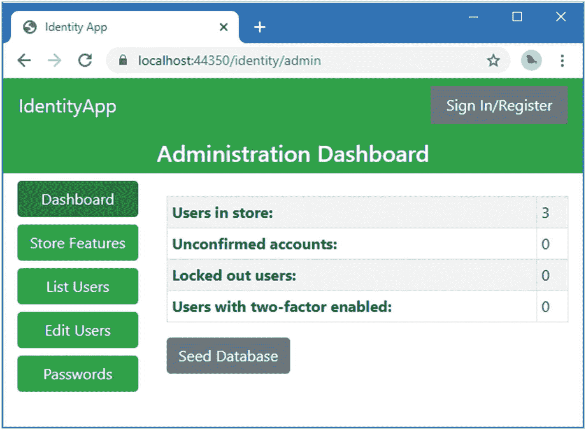

图 9-1。

运行示例应用

## 创建用户帐户

在不支持自助注册的应用中，创建帐户是最重要的工作流之一。对于这一章，我将创建一个工作流，允许管理员创建一个帐户，但需要用户选择他们的密码。请参阅第 2 部分，其中有一个更传统的方法，即管理员提供新帐户的所有数据，包括密码。

在`Pages/Identity/Admin`文件夹中添加一个名为`Create.cshtml`的 Razor 页面，内容如清单 [9-3](#PC3) 所示。

```cs
@page
@model IdentityApp.Pages.Identity.Admin.CreateModel
@{
    ViewBag.Workflow = "Create";
}

<div asp-validation-summary="All" class="text-danger m-2"></div>

@if (TempData.ContainsKey("message")) {
    <div class="alert alert-success">@TempData["message"]</div>
}

<form method="post">
    <div class="form-group">
        <label>Email</label>
        <input class="form-control" name="email" />
    </div>
    <div>
        <button type="submit" class="btn btn-success">Create</button>
        <a asp-page="Dashboard" class="btn btn-secondary">Cancel</a>
    </div>
</form>

Listing 9-3.The Contents of the Create.cshtml File in the Pages/Identity/Admin Folder

```

该页面的视图部分是一个简单的表单，用于获取新帐户的电子邮件地址。为了实现页面模型，将清单 [9-4](#PC4) 中所示的代码添加到`Create.cshtml.cs`文件中。(如果您使用的是 Visual Studio 代码，则必须创建该文件。)

```cs
using IdentityApp.Services;
using Microsoft.AspNetCore.Identity;
using Microsoft.AspNetCore.Mvc;
using System.ComponentModel.DataAnnotations;
using System.Threading.Tasks;

namespace IdentityApp.Pages.Identity.Admin {

    public class CreateModel : AdminPageModel {

        public CreateModel(UserManager<IdentityUser> mgr,
            IdentityEmailService emailService) {
            UserManager = mgr;
            EmailService = emailService;
        }

        public UserManager<IdentityUser> UserManager { get; set; }
        public IdentityEmailService EmailService { get; set; }

        [BindProperty(SupportsGet = true)]
        [EmailAddress]
        public string Email { get; set; }

        public async Task<IActionResult> OnPostAsync() {
            if (ModelState.IsValid) {
                IdentityUser user = new IdentityUser {
                    UserName = Email,
                    Email = Email,
                    EmailConfirmed = true
                };
                IdentityResult result = await UserManager.CreateAsync(user);
                if (result.Process(ModelState)) {
                    await EmailService.SendPasswordRecoveryEmail(user,
                        "/Identity/UserAccountComplete");
                    TempData["message"] = "Account Created";
                    return RedirectToPage();
                }
            }
            return Page();
        }
    }
}

Listing 9-4.The Contents of the Create.cshtml.cs File in the Pages/Identity/Admin Folder

```

页面模型构造函数声明了对`UserManager<IdentityUser>`类的依赖，该类用于通过`CreateAsync`方法将`IdentityUser`对象添加到用户存储中。

```cs
...
IdentityUser user = new IdentityUser {
    UserName = email,
    Email = email,
    EmailConfirmed = true
};
IdentityResult result = await UserManager.CreateAsync(user);
...

```

我设置了一个新创建的`IdentityUser`对象的`UserName`、`Email`和`EmailConfirmed`属性，并将其用作`CreateAsync`方法的参数。作为存储过程的一部分，将为其他属性生成其他值，例如`Id`、`NormalizedUserName`和`NormalizedEmail`属性。

`CreateAsync`方法返回一个`IdentityAsync`对象，表示操作的结果。如果新对象被成功添加到商店，我使用`IdentityEmailService`向用户发送一封包含链接的电子邮件。我使用了第 [8](08.html) 章中定义的相同方法来恢复密码。

```cs
...
await EmailService.SendPasswordRecoveryEmail(user, "/Identity/UserAccountComplete");
...

```

发送给用户的电子邮件将包含一个带有确认令牌的链接。为了允许用户验证令牌并完成他们的帐户设置，向`Pages/Identity`文件夹添加一个名为`UserAccountComplete.cshtml`的 Razor 页面，其内容如清单 [9-5](#PC7) 所示。

```cs
@page "{email?}/{token?}"
@model IdentityApp.Pages.Identity.UserAccountCompleteModel
@{
    ViewData["showNav"] = false;
    ViewData["banner"] = "Complete Account";
}

@if (string.IsNullOrEmpty(Model.Token) || string.IsNullOrEmpty(Model.Email)) {
    <div class="h6 text-center">
        <div class="p-2">
            Check your inbox for a confirmation email and click the link it contains.
        </div>
    </div>
} else {
    <div asp-validation-summary="All" class="text-danger m-2"></div>
    <form method="post">
        <input type="hidden" asp-for="Token" />
        <div class="form-group">
            <label>Email</label>
            <input class="form-control" asp-for="Email" readonly />
        </div>
        <div class="form-group">
            <label>Password</label>
            <input class="form-control" type="password" name="password" />
        </div>
        <div class="form-group">
            <label>Confirm Password</label>
            <input class="form-control" type="password" name="confirmpassword" />
        </div>
        <button class="btn btn-primary" type="submit">Finish and Sign In</button>
    </form>
}

Listing 9-5.The Contents of the UserAccountComplete.cshtml File in the Pages/Identity Folder

```

该页面的视图部分遵循我为密码恢复所采用的方法，尽管我定义了一个单独的 Razor 页面，以便可以轻松定制帐户完成过程。系统会提示用户输入密码，并显示一个“完成并登录”按钮，该按钮将更新用户存储并将浏览器重定向到登录页面。

要定义页面模型类，将清单 [9-6](#PC8) 中所示的代码添加到`UserAccountComplete.cshtml.cs`文件中。(如果您使用的是 Visual Studio 代码，则必须创建该文件。)

```cs
using IdentityApp.Services;
using Microsoft.AspNetCore.Authorization;
using Microsoft.AspNetCore.Identity;
using Microsoft.AspNetCore.Mvc;
using System.ComponentModel.DataAnnotations;
using System.Threading.Tasks;

namespace IdentityApp.Pages.Identity {

    [AllowAnonymous]
    public class UserAccountCompleteModel : UserPageModel {

        public UserAccountCompleteModel(UserManager<IdentityUser> usrMgr,
                TokenUrlEncoderService tokenUrlEncoder) {
            UserManager = usrMgr;
            TokenUrlEncoder = tokenUrlEncoder;
        }

        public UserManager<IdentityUser> UserManager { get; set; }
        public TokenUrlEncoderService TokenUrlEncoder { get; set; }

        [BindProperty(SupportsGet = true)]
        public string Email { get; set; }

        [BindProperty(SupportsGet = true)]
        public string Token { get; set; }

        [BindProperty]
        [Required]
        public string Password { get; set; }

        [BindProperty]
        [Required]
        [Compare(nameof(Password))]
        public string ConfirmPassword { get; set; }

        public async Task<IActionResult> OnPostAsync() {
            if (ModelState.IsValid) {
                IdentityUser user = await UserManager.FindByEmailAsync(Email);
                string decodedToken = TokenUrlEncoder.DecodeToken(Token);
                IdentityResult result = await UserManager.ResetPasswordAsync(user,
                    decodedToken, Password);
                if (result.Process(ModelState)) {
                    return RedirectToPage("SignIn", new { });
                }
            }
            return Page();
        }
    }
}

Listing 9-6.The Contents of the UserAccountComplete.cshtml.cs File in the Pages/Identity Folder

```

POST handler 方法对令牌进行解码，并使用它和用户管理器的`ResetPasswordAsync`方法来设置密码，之后用户被重定向到`SignIn`页面，这样他们就可以登录到应用。为了快速参考，表 [9-3](#Tab3) 描述了在此工作流程中用于创建和完成账户的用户管理器方法。

表 9-3。

用于创建新帐户的 UserManager <identityuser>方法</identityuser>

<colgroup><col class="tcol1 align-left"> <col class="tcol2 align-left"></colgroup> 
| 

名字

 | 

描述

 |
| --- | --- |
| `CreateAsync(user)` | 该方法将一个`IdentityUser`对象添加到存储中。 |
| `GeneratePasswordResetTokenAsync(user)` | 这个方法生成一个可以被`ResetPasswordAsync`方法验证的令牌。令牌被安全地发送给用户，从而令牌的拥有确立了用户的 Identity。 |
| `ResetPasswordAsync(user, token, password)` | 该方法验证用户提供的令牌，如果它与由`GeneratePasswordResetTokenAsync`方法生成的密码匹配，则更改存储的密码。 |

为了完成工作流，添加清单 [9-7](#PC9) 中所示的元素，在管理导航视图中创建一个按钮。

```cs
@model (string workflow, string theme)

@{
    Func<string, string> getClass = (string feature) =>
        feature != null && feature.Equals(Model.workflow) ? "active" : "";
}

<a class="btn btn-@Model.theme btn-block @getClass("Dashboard")"
        asp-page="Dashboard">
    Dashboard
</a>
<a class="btn btn-@Model.theme btn-block @getClass("Features")" asp-page="Features">
    Store Features
</a>
<a class="btn btn-success btn-block @getClass("List")" asp-page="View"
        asp-route-id="">
    List Users
</a>
<a class="btn btn-success btn-block @getClass("Create")" asp-page="Create">
    Create Account
</a>
<a class="btn btn-success btn-block @getClass("Edit")" asp-page="Edit"
        asp-route-id="">
    Edit Users
</a>
<a class="btn btn-success btn-block @getClass("Passwords")" asp-page="Passwords"
        asp-route-id="">
    Passwords
</a>

Listing 9-7.Adding Navigation in the _AdminWorkflows.cshtml File in the Pages/Identity/Admin Folder

```

重启 ASP.NET Core，请求`https://localhost:44350/Identity/Admin`并点击创建账户按钮。在文本字段中输入 dora@example.com，点击创建按钮，如图 [9-2](#Fig2) 所示。

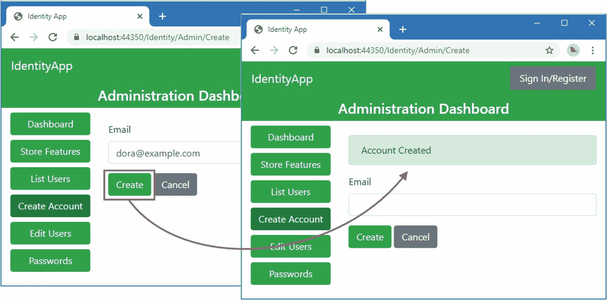

图 9-2。

创建新帐户

查看 ASP.NET Core 控制台的输出，您将会看到类似这样的消息，尽管使用了不同的验证令牌:

```cs
---New Email----
To: dora@example.com
Subject: Set Your Password
Please set your password by <a href=https://localhost:44350/Identity/UserAccountComplete/dora@example.com/Q2ZESjh>
    clicking here
</a>.
-------

```

这个模拟邮件是由我为 Identity UI 包创建的`IEmailSender`服务生成的。编码的令牌是一个很长的字符串，为了简洁起见，我在这里将其缩短。

从您的应用显示的消息中复制 URL(不是前面显示的那个)，您将被提示选择一个密码。在“密码”和“确认密码”字段中输入 mysecret，然后单击“完成并登录”按钮。用户存储将被更新，您将被重定向到登录页面。使用`dora@example.com`和密码`mysecret`登录应用，如图 [9-3](#Fig3) 所示。

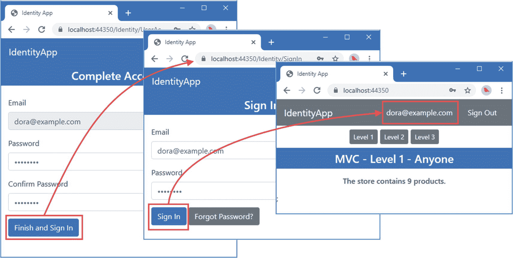

图 9-3。

选择密码并登录应用

### 执行自助注册

自助注册使用与前面示例相同的基本方法，只是在用户提供已安全发送给他们的确认令牌之前，用户提供的电子邮件地址不应该被信任。清单 [9-8](#PC11) 向`IdentityEmailService`类添加了一个方法，该方法将向用户发送一封电子邮件，其中包含一个用于确认其电子邮件地址的令牌。

```cs
using Microsoft.AspNetCore.Http;
using Microsoft.AspNetCore.Identity;
using Microsoft.AspNetCore.Identity.UI.Services;
using Microsoft.AspNetCore.Routing;
using System.Threading.Tasks;

namespace IdentityApp.Services {

    public class IdentityEmailService {

        // ...methods omitted for brevity...

        public async Task SendAccountConfirmEmail(IdentityUser user,
                string confirmationPage) {
            string token =
                await UserManager.GenerateEmailConfirmationTokenAsync(user);
            string url = GetUrl(user.Email, token, confirmationPage);
            await EmailSender.SendEmailAsync(user.Email,
                "Complete Your Account Setup",
                $"Please set up your account by <a href={url}>clicking here</a>.");
        }
    }
}

Listing 9-8.Adding a Method in the IdentityEmailService.cs File in the Services Folder

```

新电子邮件将包含一个用用户管理器的`GenerateEmailConfirmationTokenAsync`方法创建的令牌，该方法生成一个可用于确认电子邮件地址的令牌。

在`Pages/Identity`文件夹中添加一个名为`SignUp.cshtml`的 Razor 页面，内容如清单 [9-9](#PC12) 所示。

```cs
@page
@model IdentityApp.Pages.Identity.SignUpModel
@{
    ViewData["showNav"] = false;
    ViewData["banner"] = "Sign Up";
}

<div asp-validation-summary="All" class="text-danger m-2"></div>

<form method="post" class="m-4">
    <div class="form-group">
        <label>Email</label>
        <input class="form-control" asp-for="Email" />
    </div>
    <div class="form-group">
        <label>Password</label>
        <input class="form-control" type="password" asp-for="Password" />
    </div>
    <button class="btn btn-primary">Sign Up</button>
</form>

Listing 9-9.The Contents of the SignUp.cshtml File in the Pages/Identity Folder

```

页面的视图部分显示一个表单，要求用户输入电子邮件地址和密码。对于页面模型类，将清单 [9-10](#PC13) 中所示的代码添加到`SignUp.cshtml.cs`文件中。(如果您使用的是 Visual Studio 代码，则必须创建该文件。)

```cs
using IdentityApp.Services;
using Microsoft.AspNetCore.Authorization;
using Microsoft.AspNetCore.Identity;
using Microsoft.AspNetCore.Mvc;
using System.ComponentModel.DataAnnotations;
using System.Threading.Tasks;

namespace IdentityApp.Pages.Identity {

    [AllowAnonymous]
    public class SignUpModel : UserPageModel {

        public SignUpModel(UserManager<IdentityUser> usrMgr,
                IdentityEmailService emailService) {
            UserManager = usrMgr;
            EmailService = emailService;
        }

        public UserManager<IdentityUser> UserManager { get; set; }
        public IdentityEmailService EmailService { get; set; }

        [BindProperty]
        [Required]
        [EmailAddress]
        public string Email { get; set; }

        [BindProperty]
        [Required]
        public string Password { get; set; }

        public async Task<IActionResult> OnPostAsync() {
            if (ModelState.IsValid) {
                IdentityUser user = await UserManager.FindByEmailAsync(Email);
                if (user != null && !await UserManager.IsEmailConfirmedAsync(user)) {
                    return RedirectToPage("SignUpConfirm");
                }
                user = new IdentityUser {
                    UserName = Email,
                    Email = Email
                };
                IdentityResult result = await UserManager.CreateAsync(user);
                if (result.Process(ModelState)) {
                    result = await UserManager.AddPasswordAsync(user, Password);
                    if (result.Process(ModelState)) {
                        await EmailService.SendAccountConfirmEmail(user,
                            "SignUpConfirm");
                        return RedirectToPage("SignUpConfirm");
                    } else {
                        await UserManager.DeleteAsync(user);
                    }
                }
            }
            return Page();
        }
    }
}

Listing 9-10.The Contents of the SignUp.cshtml.cs File in the Pages/Identity Folder

```

页面模型类定义了一个接收用户提供的电子邮件地址和密码的 POST 处理程序。电子邮件地址用于创建一个`IdentityUser`对象，该对象通过`CreateAsync`方法添加到用户存储中。使用`AddPasswordAsyc`方法设置密码，这带来了一个潜在的问题，因为密码在存储之前要经过验证，以确保它们符合我在第 [5](05.html) 章中描述的策略设置。如果密码没有通过验证，在`IdentityUser`保存后会报错，会产生一个无法使用但与用户邮箱关联的账号。解决这个问题最简单的方法是，如果密码有问题，使用`DeleteAsync`方法从存储中删除`IdentityUser`对象。

如果`IdentityUser`对象存储成功，将发送一封确认电子邮件。一旦邮件发送完毕，浏览器就会被重定向到一个名为`SignUpConfirm`的 Razor 页面，这是我在下一节中创建的。这也是当用户点击他们收到的电子邮件中的链接时将接收请求的 Razor 页面。

当用户忘记确认帐户并随后使用相同的电子邮件地址重复注册过程时，会出现一个常见问题。这将导致一个错误，因为未经确认的帐户已经在用户存储中，实际上是在诱捕用户。为了避免这个问题，我检查用户存储，看它是否包含未确认的帐户，如果包含，就执行重定向。

```cs
...
IdentityUser user = await UserManager.FindByEmailAsync(Email);
if (user != null && !await UserManager.IsEmailConfirmedAsync(user)) {
    return RedirectToPage("SignUpConfirm");
}
...

```

重定向允许用户完成注册过程，如果需要，重新发送帐户确认电子邮件。

#### 确认自行注册的帐户

为了允许用户确认他们的帐户，在`Pages/Identity`文件夹中添加一个名为`SignUpConfirm.cshtml`的 Razor 页面，内容如清单 [9-11](#PC15) 所示。

```cs
@page "{email?}/{token?}"
@model IdentityApp.Pages.Identity.SignUpConfirmModel
@{
    ViewData["showNav"] = false;
    ViewData["banner"] = "Account Confirmation";
}

@if (Model.ShowConfirmedMessage) {
    <div class="text-center">
        <h6 class="p-2">Account confirmed</h6>
        <a asp-page="SignIn" class="btn btn-primary">Sign In</a>
    </div>
} else {
    <div class="text-center">
        <h6 class="p-2">
            Check your inbox for a confirmation email and
            click the link it contains.
        </h6>
        <a asp-page="SignUpResend" class="btn btn-primary">Resend Email</a>
    </div>
}

Listing 9-11.The Contents of the SignUpConfirm.cshtml File in the Pages/Identity Folder

```

这个 Razor 页面将在用户收到电子邮件时显示，并在他们单击电子邮件中的链接时收到请求。页面的“视图”部分会改变显示的消息以适应这些情况。将清单 [9-12](#PC16) 中所示的代码添加到`SignUpConfirm.cshtml.cs`文件中，以定义页面模型类。(如果您使用的是 Visual Studio 代码，则必须创建该文件。)

```cs
using Microsoft.AspNetCore.Authorization;
using Microsoft.AspNetCore.Identity;
using Microsoft.AspNetCore.Mvc;
using Microsoft.AspNetCore.WebUtilities;
using System.Text;
using System.Threading.Tasks;

namespace IdentityApp.Pages.Identity {

    [AllowAnonymous]
    public class SignUpConfirmModel : UserPageModel {

        public SignUpConfirmModel(UserManager<IdentityUser> usrMgr)
            => UserManager = usrMgr;

        public UserManager<IdentityUser> UserManager { get; set; }

        [BindProperty(SupportsGet = true)]
        public string Email { get; set; }

        [BindProperty(SupportsGet = true)]
        public string Token { get; set; }

        public bool ShowConfirmedMessage { get; set; } = false;

        public async Task<IActionResult> OnGetAsync() {
            if (!string.IsNullOrEmpty(Email) && !string.IsNullOrEmpty(Token)) {
                IdentityUser user = await UserManager.FindByEmailAsync(Email);
                if (user != null) {
                    string decodedToken = Encoding.UTF8.GetString(
                        WebEncoders.Base64UrlDecode(Token));
                    IdentityResult result =
                        await UserManager.ConfirmEmailAsync(user, decodedToken);
                    if (result.Process(ModelState)) {
                        ShowConfirmedMessage = true;
                    }
                }
            }
            return Page();
        }
    }
}

Listing 9-12.The Contents of the SignUpConfirm.cshtml.cs File in the Pages/Identity Folder

```

确认帐户是通过从存储中检索`IdentityUser`对象并将其传递给`ConfirmEmailAsync`方法以及用户提供的令牌来完成的。如果确认成功，则显示确认消息。

#### 重新发送确认电子邮件

对于自助服务应用，如果原始电子邮件未送达，允许用户请求再次发送确认电子邮件非常重要。在`Pages/Identity`文件夹中添加一个名为`SignUpResend.cshtml`的 Razor 页面，内容如清单 [9-13](#PC17) 所示。

```cs
@page
@model IdentityApp.Pages.Identity.SignUpResendModel
@{
    ViewData["showNav"] = false;
    ViewData["banner"] = "Account Confirmation";
}

<div asp-validation-summary="All" class="text-danger m-2"></div>

@if (TempData.ContainsKey("message")) {
    <div class="alert alert-success">@TempData["message"]</div>
}

<form method="post">
    <div class="form-group">
        <label>Your email address</label>
        <input class="form-control" asp-for="Email" />
    </div>
    <button type="submit" class="btn btn-primary">Resend Email</button>
</form>

Listing 9-13.The Contents of the SignUpResend.cshtml File in the Pages/Identity Folder

```

该页面的视图部分包含一个表单，用户可以提交该表单来请求重置确认电子邮件。要创建页面模型类，将清单 [9-14](#PC18) 中所示的代码添加到`SignUpResend.cshtml.cs`文件中。(如果您使用的是 Visual Studio 代码，则必须创建该文件。)

```cs
using IdentityApp.Services;
using Microsoft.AspNetCore.Authorization;
using Microsoft.AspNetCore.Identity;
using Microsoft.AspNetCore.Mvc;
using System.ComponentModel.DataAnnotations;
using System.Threading.Tasks;

namespace IdentityApp.Pages.Identity {

    [AllowAnonymous]
    public class SignUpResendModel : UserPageModel {

        public SignUpResendModel(UserManager<IdentityUser> usrMgr,
            IdentityEmailService emailService) {
            UserManager = usrMgr;
            EmailService = emailService;
        }

        public UserManager<IdentityUser> UserManager { get; set; }
        public IdentityEmailService EmailService { get; set; }

        [EmailAddress]
        [BindProperty(SupportsGet = true)]
        public string Email { get; set; }

        public async Task<IActionResult> OnPostAsync() {
            if (ModelState.IsValid) {
                IdentityUser user = await UserManager.FindByEmailAsync(Email);
                if (user != null && !await UserManager.IsEmailConfirmedAsync(user)) {
                    await EmailService.SendAccountConfirmEmail(user,
                        "SignUpConfirm");
                }
                TempData["message"] = "Confirmation email sent. Check your inbox.";
                return RedirectToPage(new { Email });
            }
            return Page();
        }
    }
}

Listing 9-14.The Contents of the SignUpResend.cshtml.cs File in the Pages/Identity Folder

```

POST handler 方法接收用户提供的电子邮件地址，并从存储中检索`IdentityUser`对象。如果有一个`IdentityUser`对象，并且用户管理器的`IsEmailConfirmedAsync`方法报告电子邮件地址未被确认，那么使用`IdentityEmailService.SendAccountConfirmEmail`方法发送一个新的电子邮件。

设置一个临时数据值，向用户显示一条消息。无论是否发送电子邮件来防止此页面被用于确定哪些帐户存在以及它们是否正在等待确认，都会显示此信息。

#### 处理未确认的登录

用户可以在创建帐户之后但在点击电子邮件链接之前尝试登录到应用。为了避免混淆，将清单 [9-15](#PC19) 中所示的代码添加到`SignIn`页面的页面模型类中，通知用户需要帐户确认。

Note

如第 [5 章](05.html)所述，只有当`SignIn.RequireConfirmedAccount`配置选项为`true`时，未确认电子邮件地址的账户才会被阻止登录。

```cs
using System.ComponentModel.DataAnnotations;
using System.Threading.Tasks;
using Microsoft.AspNetCore.Identity;
using Microsoft.AspNetCore.Mvc;
using SignInResult = Microsoft.AspNetCore.Identity.SignInResult;
using Microsoft.AspNetCore.Authorization;

namespace IdentityApp.Pages.Identity {

    [AllowAnonymous]
    public class SignInModel : UserPageModel {

        public SignInModel(SignInManager<IdentityUser> signMgr,
                UserManager<IdentityUser> usrMgr) {
            SignInManager = signMgr;
            UserManager = usrMgr;
        }

        public SignInManager<IdentityUser> SignInManager { get; set; }
        public UserManager<IdentityUser> UserManager { get; set; }

        [Required]
        [EmailAddress]
        [BindProperty]
        public string Email { get; set; }

        [Required]
        [BindProperty]
        public string Password { get; set; }

        [BindProperty(SupportsGet = true)]
        public string ReturnUrl { get; set; }

        public async Task<IActionResult> OnPostAsync() {
            if (ModelState.IsValid) {
                SignInResult result = await SignInManager.PasswordSignInAsync(Email,
                    Password, true, true);
                if (result.Succeeded) {
                    return Redirect(ReturnUrl ?? "/");
                } else if (result.IsLockedOut) {
                    TempData["message"] = "Account Locked";
                } else if (result.IsNotAllowed) {
                    IdentityUser user = await UserManager.FindByEmailAsync(Email);
                    if (user != null &&
                           !await UserManager.IsEmailConfirmedAsync(user)) {
                        return RedirectToPage("SignUpConfirm");
                    }
                    TempData["message"] = "Sign In Not Allowed";
                } else if (result.RequiresTwoFactor) {
                    return RedirectToPage("SignInTwoFactor", new { ReturnUrl });
                } else {
                    TempData["message"] = "Sign In Failed";
                }
            }
            return Page();
        }
    }
}

Listing 9-15.Handling Unconfirmed Accounts in the SignIn.cshtml.cs File in the Pages/Identity Folder

```

当用户使用正确的密码登录，但有一个未确认的帐户时，登录管理器将返回一个`SignInResult`，其`IsNotAllowed`属性为`true`。清单 [9-15](#PC19) 中的新代码检索用户电子邮件地址的`IdentityUser`对象，用`IsEmailConfirmedAsync`方法确定帐户是否有确认的电子邮件地址，并执行到`SignUpConfirm`页面的重定向。为了快速参考，表 [9-4](#Tab4) 描述了用于自助注册的用户管理器方法。

表 9-4。

自我注册的用户管理器<identityuser>方法</identityuser>

<colgroup><col class="tcol1 align-left"> <col class="tcol2 align-left"></colgroup> 
| 

名字

 | 

描述

 |
| --- | --- |
| `CreateAsync(user)` | 该方法将一个`IdentityUser`对象添加到存储中。 |
| `AddPasswordAsync(user, password)` | 该方法为指定的`IdentityUser`对象设置密码。 |
| `GenerateEmailConfirmationTokenAsync(user)` | 该方法生成一个令牌，可以发送给用户来确认他们的电子邮件地址。 |
| `ConfirmEmailAsync(user, token)` | 该方法验证由`GenerateEmailConfirmationTokenAsync`方法生成的令牌，以确认电子邮件地址。 |
| `IsEmailConfirmedAsync(user)` | 如果指定的`IdentityUser`对象的电子邮件地址已经被确认，该方法返回`true`。 |

#### 集成自助注册

为了将自助服务功能集成到应用的其余部分，将清单 [9-16](#PC20) 中所示的元素添加到`SignIn.cshtml`文件中。

```cs
@page "{returnUrl?}"
@model IdentityApp.Pages.Identity.SignInModel
@{
    ViewData["showNav"] = false;
    ViewData["banner"] = "Sign In";
}

<div asp-validation-summary="All" class="text-danger m-2"></div>

@if (TempData.ContainsKey("message")) {
    <div class="alert alert-danger">@TempData["message"]</div>
}

<form method="post">
    <div class="form-group">
        <label>Email</label>
        <input class="form-control" name="email" />
    </div>
    <div class="form-group">
        <label>Password</label>
        <input class="form-control" type="password" name="password" />
    </div>
    <button type="submit" class="btn btn-primary">
        Sign In
    </button>
    <a asp-page="SignUp" class="btn btn-primary">Register</a>
    <a asp-page="UserPasswordRecovery" class="btn btn-secondary">Forgot Password?</a>
</form>

Listing 9-16.Adding an Element in the SignIn.cshtml File in the Pages/Identity Folder

```

最后的改变是在管理员仪表板中显示未确认账户的数量，如清单 [9-17](#PC21) 所示。

```cs
using Microsoft.AspNetCore.Mvc.RazorPages;
using Microsoft.AspNetCore.Identity;
using Microsoft.AspNetCore.Mvc;
using System.Threading.Tasks;
using System.Linq;

namespace IdentityApp.Pages.Identity.Admin {

    public class DashboardModel : AdminPageModel {

        public DashboardModel(UserManager<IdentityUser> userMgr)
            => UserManager = userMgr;

        public UserManager<IdentityUser> UserManager { get; set; }

        public int UsersCount { get; set; } = 0;
        public int UsersUnconfirmed { get; set; } = 0;
        public int UsersLockedout { get; set; } = 0;
        public int UsersTwoFactor { get; set; } = 0;

        private readonly string[] emails = {
            "alice@example.com", "bob@example.com", "charlie@example.com"
        };

        public void OnGet() {
            UsersCount = UserManager.Users.Count();
            UsersUnconfirmed = UserManager.Users
                .Where(u => !u.EmailConfirmed).Count();
        }

        public async Task<IActionResult> OnPostAsync() {
            // ...statements omitted for brevity...
        }
    }
}

Listing 9-17.Displaying Accounts in the Dashboard.cshtml.cs File in the Pages/Identity/Admin Folder

```

Tip

尽管在早期的清单中我一直依赖于用户管理器的`IsEmailConfirmedAsync`方法，但是清单 [9-17](#PC21) 中的 LINQ 查询直接操作由`IdentityUser`类定义的属性。这确保了查询可以由数据库服务器执行，而这是用`IsEmailConfirmedAsync`方法无法实现的，因为它不容易转换成 SQL 查询，并且需要客户端执行。

重启 ASP.NET Core 并请求`https://localhost:44350/Identity/SignUp`。在电子邮件字段中输入 ezra@example.com，在密码字段中输入 mysecret。点击注册按钮，系统会提示您查看收件箱，如图 [9-4](#Fig4) 所示。

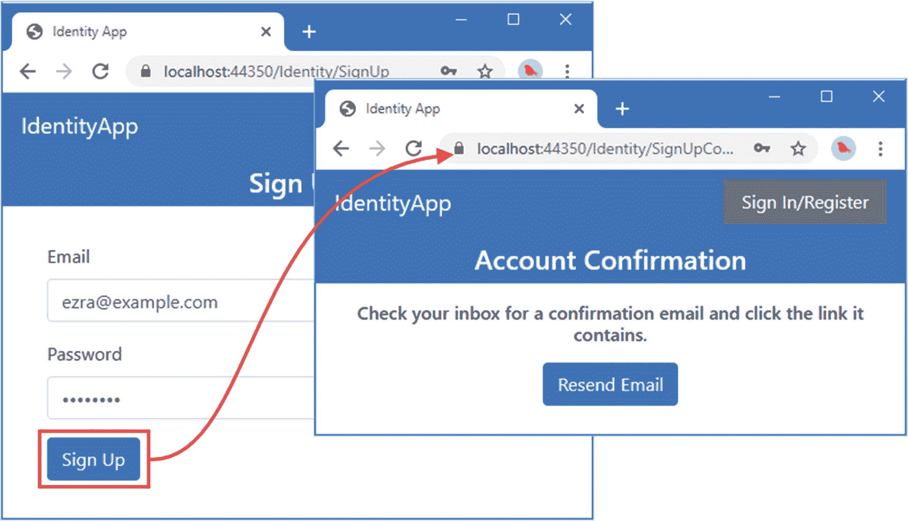

图 9-4。

自行注册

帐户已创建但尚未确认，您可以通过请求`https://localhost:44350/Identity/admin`来查看。仪表盘总览显示，用户商店中现在有五个账户，其中一个未确认，如图 [9-5](#Fig5) 所示。

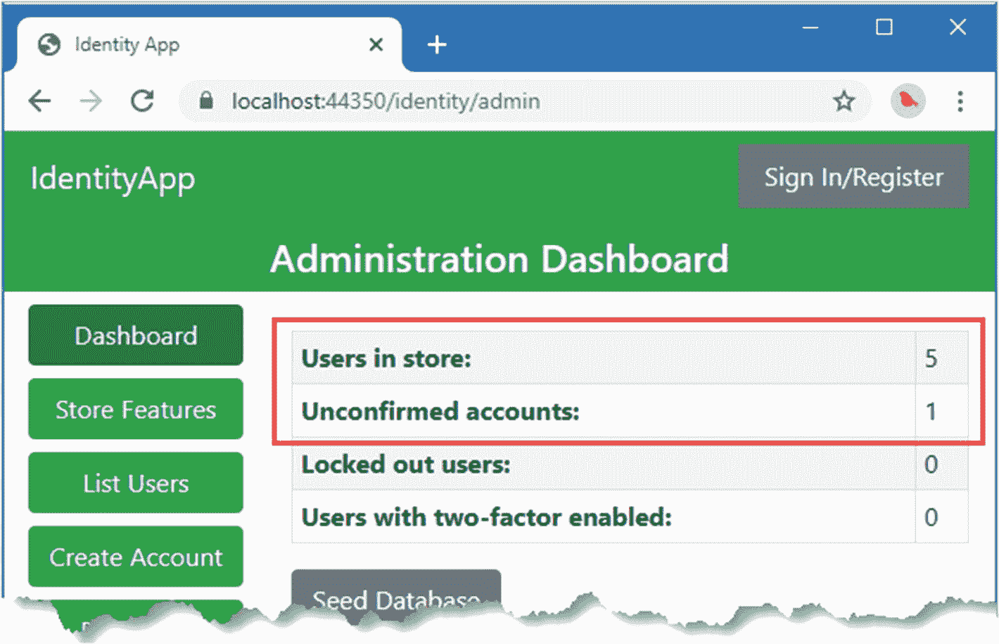

图 9-5。

管理仪表板中显示的未确认帐户

检查 ASP.NET Core 控制台输出，您将看到类似于以下内容的消息:

```cs
---New Email----
To: ezra@example.com
Subject: Complete Your Account Setup
Please set up your account by <a href=https://localhost:44350/Identity/SignUpConfirm/ezra@example.com/Q2ZESj>
    clicking here
</a>.
-------

```

为了简洁，我缩短了确认令牌。从您的应用生成的电子邮件中复制 URL(这将与我收到的不同，因为每个确认令牌都是唯一的)，并将其粘贴到浏览器窗口中以确认帐户。

单击登录按钮，您将看到登录页面。使用`ezra@example.com`作为邮箱地址，使用`mysecret`作为密码登录应用，如图 [9-6](#Fig6) 所示。

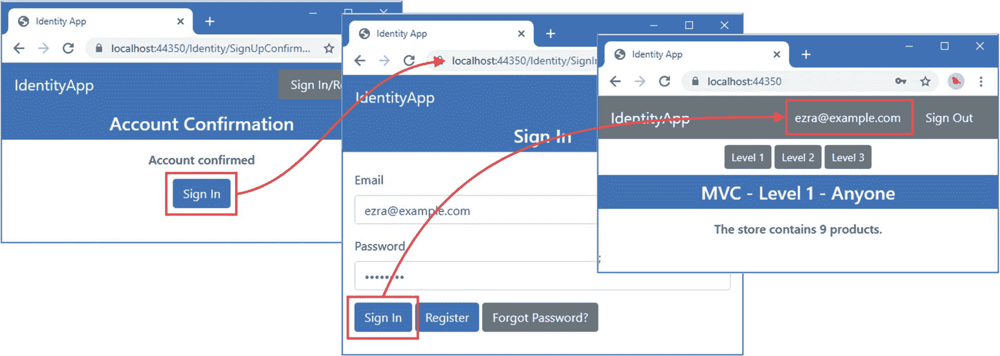

图 9-6。

完成自助注册流程

## 锁定帐户

ASP.NET Core Identity 可配置为在登录失败达到指定次数后锁定帐户。当应用支持锁定时，创建允许管理员锁定和解锁帐户的工作流是一个好主意。锁定帐户是一种有用的临时措施，例如当观察到可疑行为时。当高级管理人员忘记了密码，要求更改密码，并且不会等待锁定过期时，解锁帐户非常有用。在`Pages/Identity/Admin`文件夹中添加一个名为`Lockouts.cshtml`的 Razor 页面，内容如清单 [9-18](#PC23) 所示。

Understanding Lockouts

对于要锁定的帐户，`IdentityUser.LockoutEnabled`属性必须是`true`，当检查用户凭证时，`SignInManager<IdentityUser>.PasswordSignInAsync`的最后一个参数必须是`true`。关于控制`LockoutEnabled`的配置选项，参见第 [6](06.html) 章，关于`PasswordSignInAsync`方法的描述，参见第 [8](08.html) 章。第 [20](20.html) 章详细描述了锁定，包括如何在用户商店中实施锁定的解释。

```cs
@page
@model IdentityApp.Pages.Identity.Admin.LockoutsModel
@{
    ViewBag.Workflow = "Lockouts";
}

<table class="table table-sm table-striped table-bordered">
    <thead>
        <tr><th class="text-center py-2" colspan="3">Locked Out Users</th></tr>
    </thead>
    <tbody>
        @if (Model.LockedOutUsers.Count() == 0) {
            <tr>
                <td colspan="3" class="py-2 text-center">
                    No locked out users
                </td>
            </tr>
        } else {
            <tr><th>Email</th><th>Lockout Remaining</th><th/></tr>
            @foreach (IdentityUser user in Model.LockedOutUsers) {
                TimeSpan timeLeft = await Model.TimeLeft(user);
                <tr>
                    <td>@user.Email</td>
                    <td>
                        @timeLeft.Days days, @timeLeft.Hours hours,
                        @timeLeft.Minutes min, @timeLeft.Seconds secs
                    </td>
                    <td>
                        <form method="post" asp-page-handler="unlock">
                            <input type="hidden" name="id" value="@user.Id" />
                            <button type="submit" class="btn btn-sm btn-success">
                                Unlock Now
                            </button>
                        </form>
                    </td>
                </tr>
            }
        }
    </tbody>
</table>

<table class="table table-sm table-striped table-bordered">
    <thead>
        <tr><th class="text-center py-2" colspan="2">Other Users</th></tr>
    </thead>
    <tbody>
        @if (Model.OtherUsers.Count() == 0) {
            <tr>
                <th colspan="2" class="py-2 text-center">
                    All users locked out
                </th>
            </tr>
        } else {
            <tr><th>Email</th><th/></tr>
            @foreach (IdentityUser user in Model.OtherUsers) {
                <tr>
                    <td>@user.Email</td>
                    <td>
                        <form method="post" asp-page-handler="lock">
                            <input type="hidden" name="id" value="@user.Id" />
                            <button type="submit" class="btn btn-sm btn-success">
                                Lock Out
                            </button>
                        </form>
                    </td>
                </tr>
            }
        }
    </tbody>
</table>

Listing 9-18.The Contents of the Lockouts.cshtml File in the Pages/Identity/Admin Folder

```

页面的视图部分显示两个表。第一个表列出了锁定的用户，显示锁定何时到期，并提供了立即解锁帐户的按钮。第二个表列出了剩余的用户，带有开始锁定的按钮。要定义页面模型类，将清单 [9-19](#PC24) 中所示的代码添加到`Lockouts.cshtml.cs`文件中。(如果您使用的是 Visual Studio 代码，则必须创建该文件。)

```cs
using Microsoft.AspNetCore.Identity;
using Microsoft.AspNetCore.Mvc;
using System;
using System.Collections.Generic;
using System.Linq;
using System.Threading.Tasks;

namespace IdentityApp.Pages.Identity.Admin {

    public class LockoutsModel : AdminPageModel {

        public LockoutsModel(UserManager<IdentityUser> usrMgr)
            => UserManager = usrMgr;

        public UserManager<IdentityUser> UserManager { get; set; }

        public IEnumerable<IdentityUser> LockedOutUsers { get; set; }
        public IEnumerable<IdentityUser> OtherUsers { get; set; }

        public async Task<TimeSpan> TimeLeft(IdentityUser user)
            => (await UserManager.GetLockoutEndDateAsync(user))
                .GetValueOrDefault().Subtract(DateTimeOffset.Now);

        public void OnGet() {
            LockedOutUsers = UserManager.Users.Where(user => user.LockoutEnd.HasValue
                    && user.LockoutEnd.Value > DateTimeOffset.Now)
                .OrderBy(user => user.Email).ToList();
            OtherUsers = UserManager.Users.Where(user => !user.LockoutEnd.HasValue
                    || user.LockoutEnd.Value <= DateTimeOffset.Now)
                 .OrderBy(user => user.Email).ToList();
        }

        public async Task<IActionResult> OnPostLockAsync(string id) {
            IdentityUser user = await UserManager.FindByIdAsync(id);
            await UserManager.SetLockoutEnabledAsync(user, true);
            await UserManager.SetLockoutEndDateAsync(user,
                DateTimeOffset.Now.AddDays(5));
            return RedirectToPage();
        }

        public async Task<IActionResult> OnPostUnlockAsync(string id) {
            IdentityUser user = await UserManager.FindByIdAsync(id);
            await UserManager.SetLockoutEndDateAsync(user, null);
            return RedirectToPage();
        }
    }
}

Listing 9-19.The Contents of the Lockouts.cshtml.cs File in the Pages/Identity/Admin Folder

```

为了确定用户是否被锁定，调用用户管理器的`GetLockoutEndDateAsync`方法。如果结果有一个值，并且该值指定了未来的某个时间，那么用户将被锁定。如果没有值或时间已过，则用户不会被锁定。

要锁定和解锁用户帐户，使用`SetLockoutEnabledAsync`方法启用锁定，并使用`SetLockoutEndDateAsync`方法指定时间。在指定的时间过去之前，不允许用户登录。可以通过使用`null`参数调用`SetLockoutEndDateAsync`来禁用锁定。

这是一个难以实现的特性，更糟糕的是需要直接使用由`IdentityUser`类定义的`LockoutEnd`属性，该属性由`GetLockoutEndDateAsync`和`SetLockoutEndDateAsync`方法使用。直接使用该属性使得使用 LINQ 有效地查询数据库成为可能。对于示例应用来说，这不是一个很大的问题，但是在有大量用户的项目中，这是一个需要注意的问题。

我已经将锁定期设置为五天，这实际上是暂停了一个帐户。我通常使用多天间隔来锁定管理员申请的帐户，以便在调查进行期间，引起注意的帐户不会再次活跃。相比之下，Identity 为重复失败的登录应用的默认锁定期是五分钟。

要在管理员仪表板中显示锁定的数量，请将清单 [9-20](#PC25) 中所示的语句添加到`Dashboard.cshtml.cs`文件中。

```cs
...
public void OnGet() {
    UsersCount = UserManager.Users.Count();
    UsersUnconfirmed = UserManager.Users
        .Where(u => !u.EmailConfirmed).Count();
    UsersLockedout = UserManager.Users
        .Where(u => u.LockoutEnabled && u.LockoutEnd > System.DateTimeOffset.Now)
        .Count();
}
...

Listing 9-20.Displaying Lockouts in the Dashboard.cshtml.cs File in the Pages/Identity/Admin Folder

```

该语句使用 LINQ 通过检查`LockoutEnabled`和`LockoutEnd`属性来计算锁定用户的数量。为了快速参考，表 [9-5](#Tab5) 描述了用户管理器管理锁定的方法。

表 9-5。

管理锁定的 UserManager <identityuser>方法</identityuser>

<colgroup><col class="tcol1 align-left"> <col class="tcol2 align-left"></colgroup> 
| 

名字

 | 

描述

 |
| --- | --- |
| `GetLockoutEndDateAsync(user)` | 这个方法返回一个`DateTimeOffet?`对象。如果这个对象有一个值，并且代表未来的某个时间，那么这个帐户就会被锁定。 |
| `SetLockoutEnabledAsync(user, enabled)` | 此方法设置是否为用户帐户启用锁定。除非启用锁定，否则无法设置锁定。 |
| `SetLockoutEndDateAsync(user, time)` | 这个方法设置了一个锁定，阻止用户在指定时间之前登录应用，指定时间表示为一个`DateTimeOffset?`值。使用空值来解锁帐户。 |

### 强制立即注销

当用户登录应用时，响应中会添加一个 cookie。cookie 包含在后续的 HTTP 请求中，用于对用户进行认证，而无需用户再次提供凭据。

当帐户注销时，用户无法登录到应用，但是已经创建的任何 cookies 仍然有效，这意味着如果用户已经登录到应用，他们将不会受到锁定的影响。

一个常见的要求是在帐户注销时终止任何现有的会话，这将阻止用户使用应用，即使他们在锁定开始之前已经登录。实现这个特性的关键是安全戳，它是一个随机的字符串，每次用户的安全数据发生变化时都会改变。第一步是配置 Identity，以便它定期验证用户提供的 cookies，查看安全标记是否已经更改，如清单 [9-21](#PC26) 所示。

```cs
...
services.AddIdentity<IdentityUser, IdentityRole>(opts => {
    opts.Password.RequiredLength = 8;
    opts.Password.RequireDigit = false;
    opts.Password.RequireLowercase = false;
    opts.Password.RequireUppercase = false;
    opts.Password.RequireNonAlphanumeric = false;
    opts.SignIn.RequireConfirmedAccount = true;
}).AddEntityFrameworkStores<IdentityDbContext>()
    .AddDefaultTokenProviders();

services.Configure<SecurityStampValidatorOptions>(opts => {
    opts.ValidationInterval = System.TimeSpan.FromMinutes(1);
});

services.AddScoped<TokenUrlEncoderService>();
services.AddScoped<IdentityEmailService>();
...

Listing 9-21.Configuring the Application in the Startup.cs File in the IdentityApp Folder

```

通过使用 options 模式将间隔分配给由`SecurityStampValidatorOptions`类定义的`ValidationInterval`属性，可以启用验证特性。我在这个例子中选择了一分钟，但是为每个项目选择一个合适的值是很重要的。验证需要从用户存储中检索数据，如果间隔设置得太短，将会生成大量额外的数据库查询，尤其是在有大量并发用户的应用中。另一方面，将时间间隔设置得太长会延长登录用户在其帐户被锁定后继续使用应用的时间。

Understanding The Immediate Sign-out Pitfalls

为立即注销启用 cookie 验证功能有两个潜在的缺陷。首先，术语*立即*是从 ASP.NET Core 应用的角度使用的。从用户的角度来看，直到下一次浏览器向应用发送请求时，他们才知道自己已被注销，这可能发生在帐户被锁定后的一段时间。这对于大多数项目来说不是问题，但是如果您使用短的锁定期，锁定可能会在用户下一次发送请求之前过期，这意味着用户在不知道为什么的情况下从应用中注销。

第二个缺陷是，任何更改用户安全戳的操作都将导致下次用户发送 HTTP 请求时验证失败，将用户从应用中注销。用户管理器类提供的许多方法更新安全戳，如第 2 部分所述，这将触发意外的用户注销。对于自助服务操作，您可以通过将用户重新登录到应用来防止这个问题，正如我在第 [11](11.html) 章中所演示的，当时我设置了双因素认证。对于管理员执行的操作，没有这样的解决方案，您应该记住，当您更新用户的帐户时，用户可能会被注销。

第二步是在锁定帐户时更改安全戳，如清单 [9-22](#PC27) 所示。

```cs
...
public async Task<IActionResult> OnPostLockAsync(string id) {
    IdentityUser user = await UserManager.FindByIdAsync(id);
    await UserManager.SetLockoutEnabledAsync(user, true);
    await UserManager.SetLockoutEndDateAsync(user,
        DateTimeOffset.Now.AddDays(5));
    await UserManager.UpdateSecurityStampAsync(user);
    return RedirectToPage();
}
...

Listing 9-22.Changing a Security Stamp in the Lockouts.cshtml.cs File in the Pages/Identity/Admin Folder

```

`UpdateSecurityStampAsync`方法为指定的用户帐户创建一个新的安全戳，这将导致用户在下次验证 cookie 时被注销。为了快速参考，表 [9-6](#Tab6) 描述了我用来设置安全戳的用户管理器方法。

表 9-6。

用于更改安全戳的 UserManager <identityuser>方法</identityuser>

<colgroup><col class="tcol1 align-left"> <col class="tcol2 align-left"></colgroup> 
| 

名字

 | 

描述

 |
| --- | --- |
| `UpdateSecurityStampAsync(user)` | 这个方法为指定的`identityUser`生成一个新的安全戳。 |

将清单 [9-23](#PC28) 中所示的元素添加到导航局部视图中，以将新的 Razor 页面集成到管理布局中。

```cs
@model (string workflow, string theme)

@{
    Func<string, string> getClass = (string feature) =>
        feature != null && feature.Equals(Model.workflow) ? "active" : "";
}

<a class="btn btn-@Model.theme btn-block @getClass("Dashboard")"
        asp-page="Dashboard">
    Dashboard
</a>
<a class="btn btn-@Model.theme btn-block @getClass("Features")" asp-page="Features">
    Store Features
</a>
<a class="btn btn-success btn-block @getClass("List")" asp-page="View"
        asp-route-id="">
    List Users
</a>
<a class="btn btn-success btn-block @getClass("Create")" asp-page="Create">
    Create Account
</a>
<a class="btn btn-success btn-block @getClass("Edit")" asp-page="Edit"
        asp-route-id="">
    Edit Users
</a>
<a class="btn btn-success btn-block @getClass("Passwords")" asp-page="Passwords"
        asp-route-id="">
    Passwords
</a>
<a class="btn btn-success btn-block @getClass("Lockouts")" asp-page="Lockouts" >
    Lockouts
</a>

Listing 9-23.Adding Navigation in the _AdminWorkflows.cshtml File in the Pages/Identity/Admin Folder

```

重启 ASP.NET Core，请求`https://localhost:44350/Identity/Admin`，并点击锁定按钮。您将看到一个用户列表。点击`alice@example.com`账户的锁定按钮，账户被锁定，如图 [9-7](#Fig7) 所示。

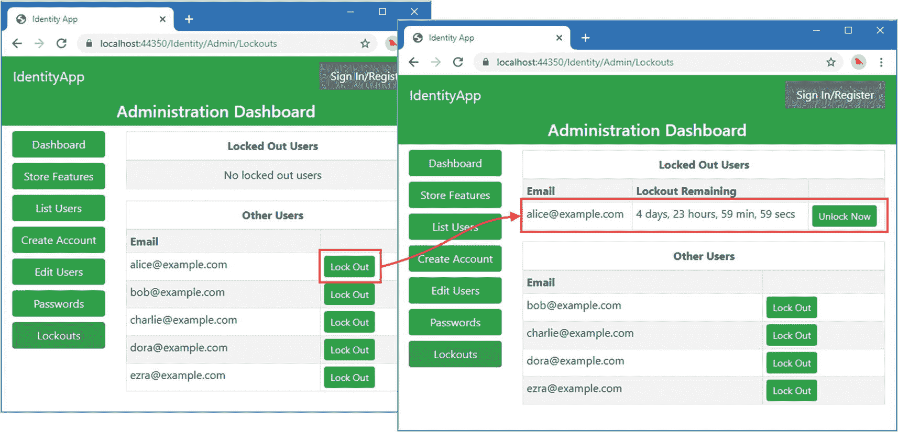

图 9-7。

封锁账户

点击仪表板按钮，总览会显示一个账户被锁定，如图 [9-8](#Fig8) 所示。

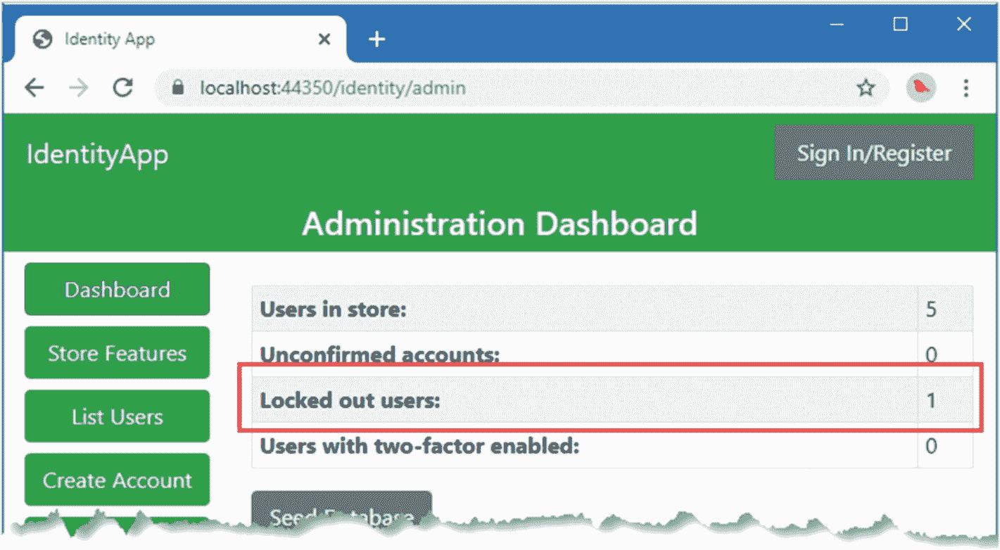

图 9-8。

仪表板中锁定的帐户

点击页面顶部的登录/注册链接，使用`alice@example.com`作为电子邮件地址和`mysecret`作为密码登录。即使这些是正确的凭证，您也无法登录到应用，如图 [9-9](#Fig9) 所示。

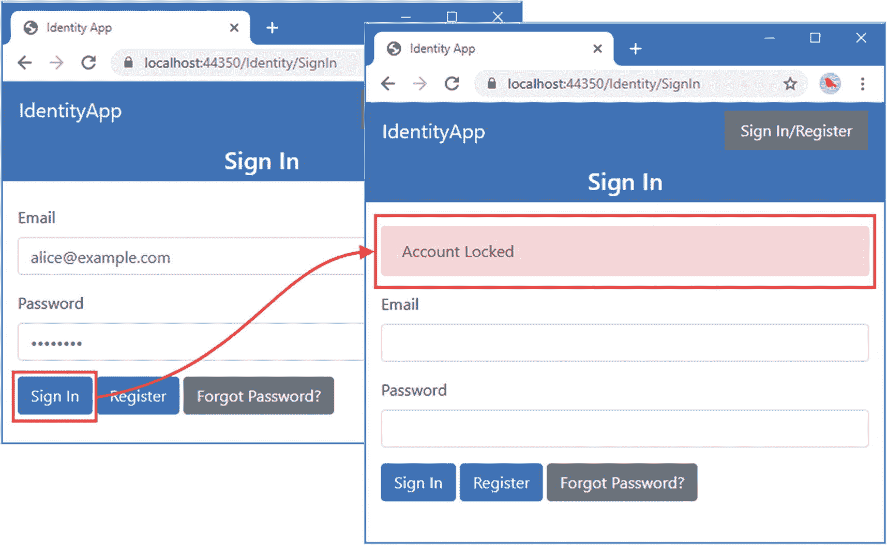

图 9-9。

试图使用锁定的帐户登录

Tip

浏览器在标签之间共享 cookies，这使得测试强制注销过程变得困难。最好的方法是使用访客浏览功能打开一个有自己的 cookies 的窗口，并登录到应用。使用主浏览器窗口锁定帐户。然后，您可以继续在来宾窗口中使用该应用，直到下次验证 cookie，此时您将从该应用中注销。

使用`bob@example.com`作为电子邮件地址和`mysecret`作为密码登录应用。使用浏览器的私人/访客浏览功能请求`https://localhost:44350/Identity/Admin`，点击锁定按钮，锁定`bob@example.com`。等待几分钟，然后重新加载原来的浏览器窗口。您将会看到您已经从应用中注销，如图 [9-10](#Fig10) 所示。

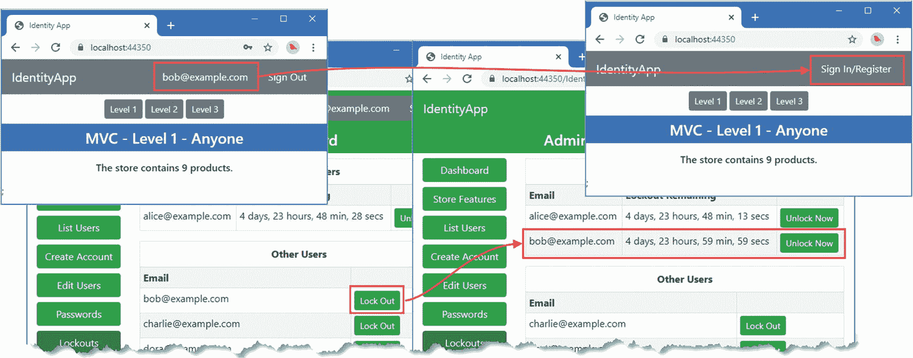

图 9-10。

锁定帐户时注销用户

## 删除帐户

可以出于各种原因删除帐户。对于企业应用，最常见的原因是员工已经离开组织，应该不再能够访问该应用。对于自助应用，帐户会被删除，因为用户不再想使用该应用。

为了支持管理员账户删除，在`Pages/Identity/Admin`文件夹中添加一个名为`Delete.cshtml`的 Razor 页面，内容如清单 [9-24](#PC29) 所示。

```cs
@page "{id?}"
@model IdentityApp.Pages.Identity.Admin.DeleteModel
@{
    ViewBag.Workflow = "Delete";
}

<div asp-validation-summary="All" class="text-danger m-2"></div>

<form method="post">

    <h3 class="bg-danger text-white text-center p-2">Caution</h3>

    <h5 class="text-center m-2">
        Delete @Model.IdentityUser.Email?
    </h5>
    <input type="hidden" name="id" value="@Model.IdentityUser.Id" />
    <div class="text-center p-2">
        <button type="submit" class="btn btn-danger">Delete</button>
        <a asp-page="Dashboard" class="btn btn-secondary">Cancel</a>
    </div>
</form>

Listing 9-24.The Contents of the Delete.cshtml File in the Pages/Identity/Admin Folder

```

页面的视图部分包含一个简单的表单，在提交时将删除所选的帐户。要定义页面模型类，将清单 [9-25](#PC30) 中所示的代码添加到`Delete.cshtml.cs`文件中。(如果您使用的是 Visual Studio 代码，则必须创建该文件。)

```cs
using System;
using System.Collections.Generic;
using System.Linq;
using System.Threading.Tasks;
using Microsoft.AspNetCore.Identity;
using Microsoft.AspNetCore.Mvc;
using Microsoft.AspNetCore.Mvc.RazorPages;

namespace IdentityApp.Pages.Identity.Admin {

    public class DeleteModel : AdminPageModel {

        public DeleteModel(UserManager<IdentityUser> mgr) => UserManager = mgr;

        public UserManager<IdentityUser> UserManager { get; set; }

        public IdentityUser IdentityUser { get; set; }

        [BindProperty(SupportsGet = true)]
        public string Id { get; set; }

        public async Task<IActionResult> OnGetAsync() {
            if (string.IsNullOrEmpty(Id)) {
                return RedirectToPage("Selectuser",
                    new { Label = "Delete", Callback = "Delete" });
            }
            IdentityUser = await UserManager.FindByIdAsync(Id);
            return Page();
        }

        public async Task<IActionResult> OnPostAsync() {
            IdentityUser = await UserManager.FindByIdAsync(Id);
            IdentityResult result = await UserManager.DeleteAsync(IdentityUser);
            if (result.Process(ModelState)) {
                return RedirectToPage("Dashboard");
            }
            return Page();
        }
    }
}

Listing 9-25.The Contents of the Delete.cshtml.cs File in the Pages/Identity/Admin Folder

```

用户管理器定义了`DeleteAsync`方法，该方法从存储中移除一个`IdentityUser`对象。使用`FindByIdAsync`方法定位所选的账户，如果没有选择，则重定向到`SelectUser`页面。为了快速参考，表 [9-7](#Tab7) 描述了用于从用户存储中删除对象的方法。

Tip

注意，我不需要更新清单 [9-25](#PC30) 中的安全戳来强制立即注销，因为`IdentityUser`数据——包括安全戳——已经从用户存储中删除了。如果启用了 cookie 验证，如清单 [9-21](#PC26) 所示，用户将在下次执行验证时被自动注销。

表 9-7。

用于删除对象的 UserManager <identityuser>方法</identityuser>

<colgroup><col class="tcol1 align-left"> <col class="tcol2 align-left"></colgroup> 
| 

名字

 | 

描述

 |
| --- | --- |
| `DeleteAsync(user)` | 该方法从用户存储中删除指定的`IdentityUser`对象。 |

添加清单 [9-26](#PC31) 中所示的元素，以便导航到新的 Razor 页面。

```cs
@model (string workflow, string theme)

@{
    Func<string, string> getClass = (string feature) =>
        feature != null && feature.Equals(Model.workflow) ? "active" : "";
}

<a class="btn btn-@Model.theme btn-block @getClass("Dashboard")"
        asp-page="Dashboard">
    Dashboard
</a>
<a class="btn btn-@Model.theme btn-block @getClass("Features")" asp-page="Features">
    Store Features
</a>
<a class="btn btn-success btn-block @getClass("List")" asp-page="View"
        asp-route-id="">
    List Users
</a>
<a class="btn btn-success btn-block @getClass("Create")" asp-page="Create">
    Create Account
</a>
<a class="btn btn-success btn-block @getClass("Delete")" asp-page="Delete">
    Delete Account
</a>
<a class="btn btn-success btn-block @getClass("Edit")" asp-page="Edit"
        asp-route-id="">
    Edit Users
</a>
<a class="btn btn-success btn-block @getClass("Passwords")" asp-page="Passwords"
        asp-route-id="">
    Passwords
</a>
<a class="btn btn-success btn-block @getClass("Lockouts")" asp-page="Lockouts" >
    Lockouts
</a>

Listing 9-26.Adding Navigation in the _AdminWorkflows.cshtml File in the Pages/Identity/Admin Folder

```

重启 ASP.NET Core 并请求`https://localhost:44350/identity/admin`。单击“删除帐户”按钮，然后单击`bob@example.com`帐户的“删除”按钮。系统将提示您确认删除。点击【删除】，账户将从用户存储中删除，如图 [9-11](#Fig11) 所示。

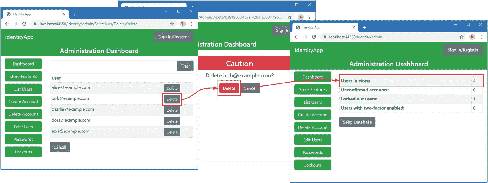

图 9-11。

删除帐户

### 执行自助帐户删除

自助帐户删除使用相同的方法，与管理员工作流的唯一区别是使用当前的`ClaimsPrincipal`获得`IdentityUser`对象，而不是查询用户存储。在`Pages/Identity`文件夹中添加一个名为`UserDelete.cshtml`的 Razor 页面，内容如清单 [9-27](#PC32) 所示。

```cs
@page
@model IdentityApp.Pages.Identity.UserDeleteModel
@{
    ViewBag.Workflow = "Delete";
}

<div asp-validation-summary="All" class="text-danger m-2"></div>

<form method="post">

    <h3 class="bg-danger text-white text-center p-2">Caution</h3>

    <h5 class="text-center m-2">
        Do you want to delete your account?
    </h5>
    <div class="text-center p-2">
        <button type="submit" class="btn btn-danger">Delete</button>
        <a asp-page="Dashboard" class="btn btn-secondary">Cancel</a>
    </div>
</form>

Listing 9-27.The Contents of the UserDelete.cshtml File in the Pages/Identity Folder

```

页面的视图部分显示一个简单的警告，并包含一个发送 POST 请求的表单。要定义页面模型类，将清单 [9-28](#PC33) 中所示的代码添加到`UserDelete.cshtml.cs`文件中。(如果您使用的是 Visual Studio 代码，则必须创建该文件。)

```cs
using Microsoft.AspNetCore.Identity;
using Microsoft.AspNetCore.Mvc;
using Microsoft.AspNetCore.Mvc.RazorPages;
using System.Threading.Tasks;

namespace IdentityApp.Pages.Identity {

    public class UserDeleteModel : UserPageModel {

        public UserDeleteModel(UserManager<IdentityUser> usrMgr,
                SignInManager<IdentityUser> signMgr) {
            UserManager = usrMgr;
            SignInManager = signMgr;
        }

        public UserManager<IdentityUser> UserManager { get; set; }
        public SignInManager<IdentityUser> SignInManager{ get; set; }

        public async Task<IActionResult> OnPostAsync() {
            IdentityUser idUser = await UserManager.GetUserAsync(User);
            IdentityResult result = await UserManager.DeleteAsync(idUser);
            if (result.Process(ModelState)) {
                await SignInManager.SignOutAsync();
                return Challenge();
            }
            return Page();
        }
    }
}

Listing 9-28.The Contents of the UserDelete.cshtml.cs File in the Pages/Identity Folder

```

使用`DeleteAsync`方法删除帐户，就像在管理员工作流中一样，只是我使用由`SignInManager<IdentityUser>`类定义的`SignOutAsync`方法将用户从应用中注销。此方法不能用于注销管理工作流中的其他用户，但可用于自助服务工作流，因为它从发送给用户的响应中删除了认证 cookie。

添加清单 [9-29](#PC34) 中所示的元素，为新工作流创建导航。

```cs
@model (string workflow, string theme)
@inject UserManager<IdentityUser> UserManager
@{
    Func<string, string> getClass = (string feature) =>
        feature != null && feature.Equals(Model.workflow) ? "active" : "";

    IdentityUser identityUser
        = await UserManager.GetUserAsync(User) ?? new IdentityUser();
}

<a class="btn btn-@Model.theme btn-block @getClass("Overview")" asp-page="Index">
    Overview
</a>

@if (await UserManager.HasPasswordAsync(identityUser)) {
    <a class="btn btn-@Model.theme btn-block @getClass("PasswordChange")"
            asp-page="UserPasswordChange">
        Change Password
    </a>
}
<a class="btn btn-@Model.theme btn-block @getClass("UserDelete")"
        asp-page="UserDelete">
    Delete Account
</a>

Listing 9-29.Adding Navigation in the _Workflows.cshtml File in the Pages/Identity Folder

```

重启 ASP.NET Core，请求`https://localhost:44350/Identity/Account/Login`，使用电子邮件`dora@example.com`和密码`mysecret`登录。

单击标题中显示的电子邮件地址导航到用户控制面板，然后单击删除帐户按钮。点击删除按钮，账户将从用户存储中删除，如图 [9-12](#Fig12) 所示。您可以通过检查管理员仪表板来确认结果，该仪表板将在用户存储中少显示一个帐户。

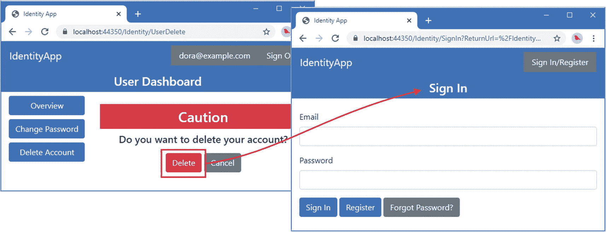

图 9-12。

自助帐户删除

## 摘要

在本章中，我演示了创建和删除帐户的管理员和自助服务工作流。我还解释了锁定是如何工作的，以及如何通过重新验证用于验证请求的 cookie 来强制立即注销。在下一章中，我将描述角色和声明的 Identity API 特性。