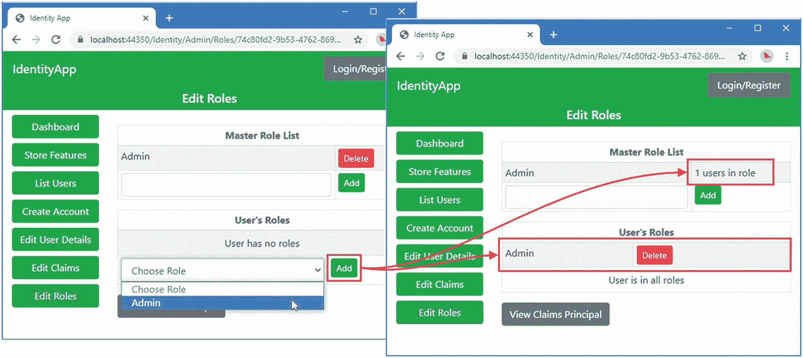

# 十、使用角色和声明

在本章中，我描述了支持角色和声明的 Identity API 特性。角色通常用于创建区分不同登录用户的细粒度授权策略。声明是一种通用方法，用于描述用户的任何已知数据，并允许将自定义数据添加到 Identity 用户存储中。表 [10-1](#Tab1) 将这些特征放在上下文中。

表 10-1。

将角色和声明放在上下文中

<colgroup><col class="tcol1 align-left"> <col class="tcol2 align-left"></colgroup> 
| 

问题

 | 

回答

 |
| --- | --- |
| 它们是什么？ | 角色区分用户组以创建授权策略。声明用于表示关于用户的任何已知数据。 |
| 它们为什么有用？ | 这两个功能都用于在用户登录时向 ASP.NET Core 平台提供数据。声明没有被广泛使用，这是一个遗憾，因为它们很容易扩展 Identity 存储的数据。 |
| 它们是如何使用的？ | 用户被分配到角色，这些角色根据附加数据存储库中的主列表进行验证，称为*角色存储库*。声明用于任意数据项，这些数据项包含在用户登录时提供给 ASP.NET Core 的数据中。 |
| 有什么陷阱或限制吗？ | 通过删除授予管理员访问权限的角色，防止管理员将自己锁定在管理工具之外，这一点很重要。 |
| 还有其他选择吗？ | 角色和声明是可选功能。如果您只需要识别登录用户，则不需要角色。如果不需要存储附加数据，则不需要声明。 |

表 [10-2](#Tab2) 总结了本章内容。

表 10-2。

章节总结

<colgroup><col class="tcol1 align-left"> <col class="tcol2 align-left"> <col class="tcol3 align-left"></colgroup> 
| 

问题

 | 

解决办法

 | 

列表

 |
| --- | --- | --- |
| 将用户分配给角色 | 使用角色管理器创建角色。使用用户管理器将用户分配到角色，或获取用户已被分配到的角色列表。 | [1](#PC1)–[12](#PC14) |
| 使用角色限制访问 | 使用`Authorize`属性的`Roles`参数。 | [13](#PC15) |
| 将声明分配给用户 | 使用用户管理器方法创建、删除或替换索赔，或者获取已经创建的索赔列表。 | [14](#PC16)–[17](#PC19) |
| 检查用户存储中的数据将被提供给 ASP.NET Core 平台的方式 | 使用登录管理器创建一个`ClaimsPrincipal`对象。 | [18](#PC20)–[19](#PC21) |
| 在 ASP.NET Core 应用中使用声明 | 使用由`ClaimsPrincipal`类提供的声明便利方法。 | [20](#PC22) |

## 为本章做准备

本章使用第 [9 章](09.html)中的`IdentityApp`项目。打开一个新的 PowerShell 命令提示符，并运行清单 [10-1](#PC1) 中所示的命令来重置应用和 Identity 数据库。

Tip

你可以从 [`https://github.com/Apress/pro-asp.net-core-identity`](https://github.com/Apress/pro-asp.net-core-identity) 下载本章以及本书其他章节的示例项目。如果在运行示例时遇到问题，请参见第 [1](01.html) 章获取帮助。

```cs
dotnet ef database drop --force --context ProductDbContext
dotnet ef database drop --force --context IdentityDbContext
dotnet ef database update --context ProductDbContext
dotnet ef database update --context IdentityDbContext

Listing 10-1.Resetting the Databases

```

使用 PowerShell 提示符运行清单 [10-2](#PC2) 中的命令来启动应用。

```cs
dotnet run

Listing 10-2.Running the Example Application

```

打开网络浏览器并请求`https://localhost:44350/Identity/Admin`，这将显示仪表板。点击种子数据库按钮，将测试账户添加到用户存储中，如图 [10-1](#Fig1) 所示。


图 10-1。

运行示例应用

## 使用角色

角色是应用中最常用的访问控制方式。定义了一个授权策略来限制对一个或多个角色的访问，比如我在第 [3](03.html) 章中添加到最受保护的视图和 Razor 页面的属性。

```cs
...
[Authorize(Roles = "Admin")]
public class AdminController : Controller {
...

```

访问权限仅限于被分配了`Admin`角色的用户。应用目前没有配置为支持角色，Identity UI 包根本不支持它们，因为它们不适合自我管理的帐户，所以没有办法满足由`Authorize`属性定义的授权策略。在接下来的小节中，我将设置对角色的支持，并创建管理它们的工作流。

### 管理角色

当您将一个用户分配给一个角色时，用户管理器类要求用户存储通过向其提供一个与`IdentityUser`对象相关联的`string`来添加角色，但是不指定如何存储该数据，这意味着角色的实现可以根据您正在使用的用户存储而变化。

在第 2 部分中，我创建了一个用户存储，它使用一个集合来跟踪用户的角色，以便分配给用户的角色独立于所有其他用户角色进行存储。这种方法很简单，但是很容易引入一个错别字，例如，Alice 被分配到`admin`角色，但是 Bob 被分配到`amdin`角色。像这样的错误很难发现，它们会阻止用户的请求被正确授权，因为角色名必须完全匹配。

避免这个问题的一个方法是定义一个主角色列表，只允许用户被分配到该列表中的角色。Identity 有一个称为*角色存储*的高级特性，用于将额外的数据与角色相关联。角色存储不会改变用户角色分配的存储方式，但它确实提供了一个方便的主列表来帮助确保角色分配的一致性。(我详细描述了角色库，包括它在第 [19](19.html) 章中作为角色主列表的用途。)

使用角色管理器类`RoleManager<T>`管理主列表，其中`T`是应用使用的角色类。在第 [7 章](07.html)中，我通过选择默认角色类`IdentityRole`来启用角色支持，如下所示:

```cs
...
services.AddIdentity<IdentityUser, IdentityRole>(opts => {
    opts.Password.RequiredLength = 8;
    opts.Password.RequireDigit = false;
    opts.Password.RequireLowercase = false;
    opts.Password.RequireUppercase = false;
    opts.Password.RequireNonAlphanumeric = false;
    opts.SignIn.RequireConfirmedAccount = true;
}).AddEntityFrameworkStores<IdentityDbContext>()
    .AddDefaultTokenProviders();
...

```

这意味着示例应用的角色管理器类是`RoleManager<IdentityRole>`。角色管理器类提供了在第 [19 章](19.html)中描述的附加特性，这些特性并不是大多数项目所必需的，但是表 [10-3](#Tab3) 中显示的成员对于本章来说是重要的。

表 10-3。

重要的 RoleManager <identityrole>成员</identityrole>

<colgroup><col class="tcol1 align-left"> <col class="tcol2 align-left"></colgroup> 
| 

名字

 | 

描述

 |
| --- | --- |
| `Roles` | 该属性返回一个`IQueryable<IdentityRole>`，该属性允许用 LINQ 枚举或查询角色存储中的角色。 |
| `FindByNameAsync(name)` | 该方法在角色存储中定位具有指定名称的`IdentityRole`对象。 |
| `CreateAsync(identRole)` | 该方法将指定的`IdentityRole`对象添加到角色存储中，并返回一个描述结果的`IdentityResult`对象。 |
| `DeleteAsync(identRole)` | 该方法从角色存储中删除指定的`IdentityRole`对象，并返回一个描述结果的`IdentityResult`对象。 |

这些方法允许管理角色的主列表。由于我们仅使用`IdentityRole`类作为主角色列表中的一个条目，因此只有表 [10-4](#Tab4) 中描述的属性对本章很重要。

表 10-4。

IdentityRole 属性

<colgroup><col class="tcol1 align-left"> <col class="tcol2 align-left"></colgroup> 
| 

名字

 | 

描述

 |
| --- | --- |
| `Name` | 此属性返回角色的名称。 |

`RoleManager<IdentityRole>`类仅用于创建角色的主列表。`UserManager<IdentityRole>`类定义了表 [10-5](#Tab5) 中描述的方法来管理主列表中用户到角色的分配。

表 10-5。

管理角色的 UserManager <identityrole>方法</identityrole>

<colgroup><col class="tcol1 align-left"> <col class="tcol2 align-left"></colgroup> 
| 

名字

 | 

描述

 |
| --- | --- |
| `GetRolesAsync(user)` | 该方法返回一个`IList<string>`,包含用户被分配的所有角色的名称。 |
| `IsInRoleAsync(user, name)` | 如果用户被分配了具有指定名称的角色，该方法返回`true`，否则返回`false`。 |
| `AddToRoleAsync(user, name)` | 该方法将用户分配给具有指定名称的角色，并返回一个描述结果的`IdentityResult`对象。还有一个`AddToRolesAsync`方法可以一次给用户分配多个角色。 |
| `RemoveFromRoleAsync(user, name)` | 该方法将用户从指定名称的角色中移除，并返回一个描述结果的`IdentityResult`对象。还有一个`RemoveFromRolesAsync`方法可以一次将用户从多个角色中删除。 |

在`Pages/Identity/Admin`文件夹中添加一个名为`Roles.cshtml`的 Razor 页面，内容如清单 [10-3](#PC5) 所示。

```cs
@page "{id?}"
@model IdentityApp.Pages.Identity.Admin.RolesModel
@{
    ViewBag.Workflow = "Roles";
}

<div asp-validation-summary="All" class="text-danger m-2"></div>

<table class="table table-sm table-striped table-bordered">
    <thead><tr><th colspan="2" class="text-center">Master Role List</th></tr></thead>
    <tbody>
        @foreach (IdentityRole role in Model.RoleManager.Roles) {
            int userCount =
                (await Model.UserManager.GetUsersInRoleAsync(role.Name)).Count;
            <tr>
                <td>@role.Name</td>
                <td>
                    @if (userCount == 0) {
                        <form method="post" asp-page-handler="deleteFromList">
                            <input type="hidden" name="role" value="@role.Name" />
                            <button type="submit" class="btn btn-sm btn-danger">
                                Delete
                            </button>
                        </form>
                    } else {
                        @: @userCount users in role
                    }
                </td>
            </tr>
        }
        <tr>
            <td>
                <form method="post" asp-page-handler="addToList" id="addToListForm">
                    <input class="form-control" name="role" />
                </form>
            </td>
            <td>
                <button type="submit" class="btn btn-sm btn-success"
                         form="addToListForm">
                     Add
                </button>
            </td>
        </tr>
    </tbody>
</table>

<table class="table table-sm table-striped table-bordered">
    <thead><tr><th colspan="2" class="text-center">User's Roles</th></tr></thead>
    <tbody>
        @if (Model.RoleManager.Roles.Count() == 0) {
            <tr>
                <td colspan="2" class="text-center py-2">
                    No roles have been defined
                </td>
            </tr>
        } else {
            @if(Model.CurrentRoles.Count() == 0) {
                <tr>
                    <td colspan="2" class="text-center py-2">
                        User has no roles
                    </td>
                </tr>
            } else {
                @foreach (string role in Model.CurrentRoles) {
                    <tr>
                        <td>@role</td>
                        <td>
                            <form method="post" asp-page-handler="delete">
                                <input type="hidden" asp-for="Id" />
                                <input type="hidden" name="role" value="@role" />
                                <button type="submit" class="btn btn-sm btn-danger">
                                    Delete
                                </button>
                            </form>
                        </td>
                    </tr>
                }
            }
            @if (Model.AvailableRoles.Count == 0) {
                <tr>
                    <td colspan="2" class="text-center py-2">
                        User is in all roles
                    </td>
                </tr>
            } else {
                <tr>
                    <td>
                        <select class="form-control" name="role" form="addForm">
                            <option selected disabled>Choose Role</option>
                            @foreach (string role in Model.AvailableRoles) {
                                <option>@role</option>
                            }
                        </select>
                    </td>
                    <td>
                        <form method="post" asp-page-handler="add" id="addForm">
                            <input type="hidden" asp-for="Id" />
                            <button type="submit" class="btn btn-sm btn-success">
                                Add
                            </button>
                        </form>
                    </td>
                </tr>
            }
        }
    </tbody>
</table>

Listing 10-3.The Contents of the Roles.cshtml File in the Pages/Identity/Admin Folder

```

此页面的视图部分比大多数其他工作流更复杂，因为我在单个页面上管理主列表和用户的角色分配。该视图提供了一个包含可用角色列表的表，以及一个删除按钮，如果没有用户被分配给该角色，则可以从存储中删除该角色。还有一个`input`元素和一个用于向主列表添加新角色的`Add`按钮。

为了给用户分配一个角色，一个`select`元素被填充了用户未被分配的所有角色的`option`元素，以及他们已被分配的角色列表。

要定义页面模型类，将清单 [10-4](#PC6) 中所示的代码添加到`Roles.cshtml.cs`文件中。(如果您使用的是 Visual Studio 代码，则必须创建该文件。)

```cs
using Microsoft.AspNetCore.Identity;
using Microsoft.AspNetCore.Mvc;
using System.Collections.Generic;
using System.ComponentModel.DataAnnotations;
using System.Linq;
using System.Threading.Tasks;

namespace IdentityApp.Pages.Identity.Admin {

    public class RolesModel : AdminPageModel {

        public RolesModel(UserManager<IdentityUser> userMgr,
                RoleManager<IdentityRole> roleMgr) {
            UserManager = userMgr;
            RoleManager = roleMgr;
        }

        [BindProperty(SupportsGet = true)]
        public string Id { get; set; }

        public UserManager<IdentityUser> UserManager { get; set; }
        public RoleManager<IdentityRole> RoleManager { get; set; }

        public IList<string> CurrentRoles { get; set; } = new List<string>();
        public IList<string> AvailableRoles { get; set; } = new List<string>();

        private async Task SetProperties() {
            IdentityUser user = await UserManager.FindByIdAsync(Id);
            CurrentRoles = await UserManager.GetRolesAsync(user);
            AvailableRoles = RoleManager.Roles.Select(r => r.Name)
                .Where(r => !CurrentRoles.Contains(r)).ToList();
        }

        public async Task<IActionResult> OnGetAsync() {
            if (string.IsNullOrEmpty(Id)) {
                return RedirectToPage("Selectuser",
                    new { Label = "Edit Roles", Callback = "Roles" });
            }
            await SetProperties();
            return Page();
        }

        public async Task<IActionResult> OnPostAddToList(string role) {
            IdentityResult result =
                await RoleManager.CreateAsync(new IdentityRole(role));
            if (result.Process(ModelState)) {
                return RedirectToPage();
            }
            await SetProperties();
            return Page();
        }

        public async Task<IActionResult> OnPostDeleteFromList(string role) {
            IdentityRole idRole = await RoleManager.FindByNameAsync(role);
            IdentityResult result = await RoleManager.DeleteAsync(idRole);
            if (result.Process(ModelState)) {
                return RedirectToPage();
            }
            await SetProperties();
            return Page();
        }

        public async Task<IActionResult> OnPostAdd([Required] string role) {
            if (ModelState.IsValid) {
                IdentityResult result = IdentityResult.Success;
                if (result.Process(ModelState)) {
                    IdentityUser user = await UserManager.FindByIdAsync(Id);
                    if (!await UserManager.IsInRoleAsync(user, role)) {
                        result = await UserManager.AddToRoleAsync(user, role);
                    }
                    if (result.Process(ModelState)) {
                        return RedirectToPage();
                    }
                }
            }
            await SetProperties();
            return Page();
        }

        public async Task<IActionResult> OnPostDelete(string role) {
            IdentityUser user = await UserManager.FindByIdAsync(Id);
            if (await UserManager.IsInRoleAsync(user, role)) {
                await UserManager.RemoveFromRoleAsync(user, role);
            }
            return RedirectToPage();
        }
    }
}

Listing 10-4.The Contents of the Roles.cshtml.cs File in the Pages/Identity/Admin Folder

```

页面模型通过其构造函数接收用户管理器和角色管理器对象，并使用它们来填充用于在视图中显示内容的属性。GET handler 方法定位用户对象，并使用 LINQ 计算出主列表中的哪些角色已经被分配，哪些仍然可用。其他处理程序在角色存储中添加和删除角色，以及在角色中添加或删除用户。

为了集成新的 Razor 页面，将清单 [10-5](#PC7) 中所示的元素添加到`_AdminWorkflows.cshtml`局部视图中。

```cs
@model (string workflow, string theme)

@{
    Func<string, string> getClass = (string feature) =>
        feature != null && feature.Equals(Model.workflow) ? "active" : "";
}

<a class="btn btn-@Model.theme btn-block @getClass("Dashboard")"
        asp-page="Dashboard">
    Dashboard
</a>
<a class="btn btn-@Model.theme btn-block @getClass("Features")" asp-page="Features">
    Store Features
</a>
<a class="btn btn-success btn-block @getClass("List")" asp-page="View"
        asp-route-id="">
    List Users
</a>
<a class="btn btn-success btn-block @getClass("Create")" asp-page="Create">
    Create Account
</a>
<a class="btn btn-success btn-block @getClass("Delete")" asp-page="Delete">
    Delete Account
</a>
<a class="btn btn-success btn-block @getClass("Edit")" asp-page="Edit"
        asp-route-id="">
    Edit Users
</a>
<a class="btn btn-success btn-block @getClass("Passwords")" asp-page="Passwords"
        asp-route-id="">
    Passwords
</a>
<a class="btn btn-success btn-block @getClass("Lockouts")" asp-page="Lockouts" >
    Lockouts
</a>
<a class="btn btn-success btn-block @getClass("Roles")"
        asp-page="Roles" asp-route-id="">
    Edit Roles
</a>

Listing 10-5.Adding Navigation the _AdminWorkflows.cshtml File in the Pages/Identity/Admin Folder

```

重启 ASP.NET Core 并请求`https://localhost:44350/Identity/Admin`。单击编辑角色按钮，然后单击`alice@example.com`帐户的角色按钮。您将看到来自新 Razor 页面的内容，其中大部分是空的，因为主列表中没有角色，用户也没有被分配任何角色。

在文本字段中输入 Admin，然后单击 Add 将新角色添加到主列表中。现在，从 Choose Role select 元素中选择 Admin，并单击 Add 按钮将所选用户分配给角色。请注意，一旦用户被分配了一个角色，该角色的删除按钮就会被删除，如图 [10-2](#Fig2) 所示，因为角色存储不允许删除正在使用的角色。(这是用于存储用户和角色数据的数据库中外键关系的结果。)



图 10-2。

将用户分配给角色

### 测试角色成员资格

到目前为止，该应用还不支持为用户分配角色，这意味着在第三章[中创建的最受限级别的内容仍然无法访问。但是现在，`alice@example.com`帐户被分配了`Admin`角色，这意味着用户可以访问第](03.html) [3](03.html) 章的所有内容。

确保您已退出应用并请求`https://localhost:44350/admin`，这是角色限制访问的资源之一。该请求将生成一个质询响应，您将被重定向到登录页面。使用`alice@example.com`作为电子邮件地址和`mysecret`作为密码登录应用。点击登录按钮，您将登录到应用并被重定向到受限内容，如图 [10-3](#Fig3) 所示。


图 10-3。

访问受基于角色的授权策略保护的内容

Caution

对用户角色的更改直到用户下次登录时才会生效。

### 限制对 Identity 管理员控制面板的访问

既然应用已经支持分配角色，那么是时候限制对管理员仪表板的访问了。但是，在此之前，需要做一些准备工作，以确保管理员即使在数据库重置后也可以登录，并且一旦应用启动，就不能将自己锁定在应用之外。

#### 在启动期间填充用户和角色存储

第一步是确保当应用启动时，将授予对仪表板的访问权限的角色存在，并且有一个用户帐户被分配给该角色。将名为`DashboardSeed.cs`的类文件添加到`IdentityApp`文件夹中，代码如清单 [10-6](#PC8) 所示。

```cs
using Microsoft.AspNetCore.Builder;
using Microsoft.AspNetCore.Identity;
using Microsoft.Extensions.Configuration;
using Microsoft.Extensions.DependencyInjection;
using System.Threading.Tasks;

namespace IdentityApp {
    public static class DashBoardSeed {

        public static void SeedUserStoreForDashboard(this IApplicationBuilder app) {
            SeedStore(app).GetAwaiter().GetResult();
        }

        private async static Task SeedStore(IApplicationBuilder app) {
            using (var scope = app.ApplicationServices.CreateScope()) {
                IConfiguration config =
                    scope.ServiceProvider.GetService<IConfiguration>();
                UserManager<IdentityUser> userManager =
                    scope.ServiceProvider.GetService<UserManager<IdentityUser>>();
                RoleManager<IdentityRole> roleManager =
                    scope.ServiceProvider.GetService<RoleManager<IdentityRole>>();

                string roleName = config["Dashboard:Role"] ?? "Dashboard";
                string userName = config["Dashboard:User"] ?? "admin@example.com";
                string password = config["Dashboard:Password"] ?? "mysecret";

                if (!await roleManager.RoleExistsAsync(roleName)) {
                    await roleManager.CreateAsync(new IdentityRole(roleName));
                }
                IdentityUser dashboardUser =
                    await userManager.FindByEmailAsync(userName);
                if (dashboardUser == null) {
                    dashboardUser = new IdentityUser {
                        UserName = userName,
                        Email = userName,
                        EmailConfirmed = true
                    };
                    await userManager.CreateAsync(dashboardUser);
                    dashboardUser = await userManager.FindByEmailAsync(userName);
                    await userManager.AddPasswordAsync(dashboardUser, password);
                }
                if (!await userManager.IsInRoleAsync(dashboardUser, roleName)) {
                    await userManager.AddToRoleAsync(dashboardUser, roleName);
                }
            }
        }
    }
}

Listing 10-6.The Contents of the DashboardSeed.cs File in the IdentityApp Folder

```

该类定义了一个扩展方法，使得从`Startup`类准备用户存储变得容易。创建一个新的依赖注入范围，并使用角色和用户管理器来确保所需的角色和用户存在。角色名、用户名和用户的初始密码都是从 ASP.NET Core 配置系统中获取的，因此可以轻松覆盖默认值。

Caution

在确保您不会将自己锁在应用之外和创建一个可以获得恶意访问的后门之间有一个平衡。部署项目时，请确保更改默认密码，并考虑要求对特殊帐户进行双因素认证。双因素认证的工作流程在第 [11](11.html) 章中描述，并在第 [22](22.html) 章中详细解释。

清单 [10-7](#PC9) 调用扩展方法来准备`Startup`类中的用户存储。

```cs
...
public void Configure(IApplicationBuilder app, IWebHostEnvironment env) {
    if (env.IsDevelopment()) {
        app.UseDeveloperExceptionPage();
    }

    app.UseHttpsRedirection();
    app.UseStaticFiles();
    app.UseRouting();

    app.UseAuthentication();
    app.UseAuthorization();

    app.UseEndpoints(endpoints => {
        endpoints.MapDefaultControllerRoute();
        endpoints.MapRazorPages();
    });

    app.SeedUserStoreForDashboard();
}
...

Listing 10-7.Preparing the User Store in the Startup.cs File in the IdentityApp Folder

```

#### 保护仪表板角色

下一步是确保至少有一个用户被分配了将授予对仪表板的访问权限的角色。清单 [10-8](#PC10) 中显示的更改从配置服务中获得角色的名称，并防止最后一个用户被从角色中删除。

```cs
using Microsoft.AspNetCore.Identity;
using Microsoft.AspNetCore.Mvc;
using System.Collections.Generic;
using System.ComponentModel.DataAnnotations;
using System.Linq;
using System.Threading.Tasks;
using Microsoft.Extensions.Configuration;

namespace IdentityApp.Pages.Identity.Admin {

    public class RolesModel : AdminPageModel {

        public RolesModel(UserManager<IdentityUser> userMgr,
                RoleManager<IdentityRole> roleMgr,
                IConfiguration config) {
            UserManager = userMgr;
            RoleManager = roleMgr;
            DashboardRole = config["Dashboard:Role"] ?? "Dashboard";
        }

        [BindProperty(SupportsGet = true)]
        public string Id { get; set; }

        public UserManager<IdentityUser> UserManager { get; set; }
        public RoleManager<IdentityRole> RoleManager { get; set; }

        public IList<string> CurrentRoles { get; set; } = new List<string>();
        public IList<string> AvailableRoles { get; set; } = new List<string>();

        public string DashboardRole { get; }

        // ...methods omitted for brevity...
    }
}

Listing 10-8.Protecting the Role in the Roles.cshtml.cs File in the Pages/Identity/Admin Folder

```

这些更改使用配置服务来获取仪表板角色的名称。为了防止角色被删除，在页面视图中找到 delete 按钮，并添加清单 [10-9](#PC11) 中所示的属性。

```cs
...
@foreach (string role in Model.CurrentRoles) {
    <tr>
        <td>@role</td>
        <td>
            <form method="post" asp-page-handler="delete">
                <input type="hidden" asp-for="Id" />
                <input type="hidden" name="role" value="@role" />
                <button type="submit" disabled="@(role== Model.DashboardRole)"
                        class="btn btn-sm btn-danger">
                    Delete
                </button>
            </form>
        </td>
    </tr>
}
...

Listing 10-9.Disabling a Button in the Roles.cshtml File in the Pages/Identity/Admin Folder

```

效果是当用户是仪表板角色的成员时，禁用删除按钮。

Note

禁用 HTML 元素并不能阻止某人手工创建将删除角色的 HTTP 请求。这需要在请求中进行适当的授权，这些更改的目的只是为了防止管理员意外地将自己锁定在应用之外。

#### 保护仪表板用户

我需要进行相应的更改，以防止仪表板帐户被删除。清单 [10-10](#PC12) 显示了对`Delete.cshtml`文件的更改。为了多样化，我使用了 Razor 表达式来禁用删除按钮，而没有修改页面模型类。

```cs
@page "{id?}"
@model IdentityApp.Pages.Identity.Admin.DeleteModel
@inject Microsoft.Extensions.Configuration.IConfiguration Configuration
@{
    ViewBag.Workflow = "Delete";
    string dashboardUser = Configuration["Dashboard:User"] ?? "admin@example.com";
}

<div asp-validation-summary="All" class="text-danger m-2"></div>

<form method="post">
    <h3 class="bg-danger text-white text-center p-2">Caution</h3>
    <h5 class="text-center m-2">
        Delete @Model.IdentityUser.Email?
    </h5>
    <input type="hidden" name="id" value="@Model.IdentityUser.Id" />
    <div class="text-center p-2">
        <button type="submit" class="btn btn-danger"
            disabled="@(Model.IdentityUser.Email == dashboardUser)">
                Delete
        </button>
        <a asp-page="Dashboard" class="btn btn-secondary">Cancel</a>
    </div>
</form>

Listing 10-10.Disabling a Button in the Delete.cshtml File in the Pages/Identity/Admin Folder

```

#### 更新测试帐户种子代码

在第 [7 章](07.html)中，我向`Dashboard`页面添加了一个处理程序方法，删除商店中的所有用户，并用测试帐户替换他们。在清单 [10-11](#PC13) 中，我已经更新了这个方法，因此它不会删除被分配了访问仪表板所需角色的用户，除非他们是测试帐户之一。

```cs
using Microsoft.AspNetCore.Mvc.RazorPages;
using Microsoft.AspNetCore.Identity;
using Microsoft.AspNetCore.Mvc;
using System.Threading.Tasks;
using System.Linq;
using Microsoft.Extensions.Configuration;

namespace IdentityApp.Pages.Identity.Admin {

    public class DashboardModel : AdminPageModel {

        public DashboardModel(UserManager<IdentityUser> userMgr,
                IConfiguration configuration) {
            UserManager = userMgr;
            DashboardRole = configuration["Dashboard:Role"] ?? "Dashboard";
        }

        public UserManager<IdentityUser> UserManager { get; set; }

        public string DashboardRole { get; set; }

        public int UsersCount { get; set; } = 0;
        public int UsersUnconfirmed { get; set; } = 0;
        public int UsersLockedout { get; set; } = 0;
        public int UsersTwoFactor { get; set; } = 0;

        private readonly string[] emails = {
            "alice@example.com", "bob@example.com", "charlie@example.com"
        };

        public void OnGet() {
            UsersCount = UserManager.Users.Count();
            UsersUnconfirmed = UserManager.Users
                .Where(u => !u.EmailConfirmed).Count();
            UsersLockedout = UserManager.Users
                .Where(u => u.LockoutEnabled
                    && u.LockoutEnd > System.DateTimeOffset.Now).Count();
        }

        public async Task<IActionResult> OnPostAsync() {
            foreach (IdentityUser existingUser in UserManager.Users.ToList()) {
               if (emails.Contains(existingUser.Email) ||
                     !await UserManager.IsInRoleAsync(existingUser, DashboardRole)) {
                    IdentityResult result
                         = await UserManager.DeleteAsync(existingUser);
                    result.Process(ModelState);
                }
            }
            foreach (string email in emails) {
                IdentityUser userObject = new IdentityUser {
                    UserName = email,
                    Email = email,
                    EmailConfirmed = true
                };
                IdentityResult result = await UserManager.CreateAsync(userObject);
                if (result.Process(ModelState)) {
                    result = await UserManager.AddPasswordAsync(userObject,
                        "mysecret");
                    result.Process(ModelState);
                }
                result.Process(ModelState);
            }
            if (ModelState.IsValid) {
                return RedirectToPage();
            }
            return Page();
        }
    }
}

Listing 10-11.Selecting Accounts in the Dashboard.cshtml.cs File in the Pages/Identity/Admin Folder

```

#### 直接导航到管理控制面板

最后一个准备性的更改只是通过改变页面标题中显示的链接，使其更容易到达管理员仪表板，如清单 [10-12](#PC14) 所示。

```cs
@inject Microsoft.Extensions.Configuration.IConfiguration Configuration
@{
    string dashboardRole = Configuration["Dashboard:Role"] ?? "Dashboard";
}
<nav class="nav">
    @if (User.Identity.IsAuthenticated) {
        @if (User.IsInRole(dashboardRole)) {
            <a asp-page="/Identity/Admin/Dashboard"
                class="nav-link bg-secondary text-white">
                    @User.Identity.Name
            </a>
        } else {
            <a asp-page="/Identity/Index" class="nav-link bg-secondary text-white">
                    @User.Identity.Name
            </a>
        }
        <a asp-page="/Identity/SignOut" class="nav-link bg-secondary text-white">
            Sign Out
        </a>
    } else {
        <a asp-page="/Identity/SignIn" class="nav-link bg-secondary text-white">
            Sign In/Register
        </a>
    }
</nav>

Listing 10-12.Altering Navigation in the _LoginPartial.cshtml File in the Views/Shared Folder

```

#### 应用授权策略

所有准备工作都已就绪，剩下的就是将`Authorize`属性应用到所有管理员仪表板页面使用的公共基类，如清单 [10-13](#PC15) 所示。

Tip

属性的 roles 特性需要一个文字字符串，这使得从配置服务中读取角色名变得很困难。在第 2 部分中，我将解释如何创建基于代码的授权策略来解决这一限制。

```cs
using Microsoft.AspNetCore.Authorization;

namespace IdentityApp.Pages.Identity.Admin {

    //[AllowAnonymous]
    [Authorize(Roles = "Dashboard")]
    public class AdminPageModel : UserPageModel {

        // no methods or properties required
    }
}

Listing 10-13.Adding an Attribute in the AdminPageModel.cs File in the Pages/Identity/Admin Folder

```

重新启动 ASP.NET Core，并确保您已退出应用。使用密码`mysecret`以`admin@example.com`的 Identity 登录。登录后，点击布局顶部的电子邮件地址，会出现管理仪表板，如图 [10-4](#Fig4) 所示。


图 10-4。

访问管理员控制面板

点击角色按钮，选择`admin@example.com`账户；您将看到`Dashboard`角色成员的删除按钮被禁用，如图 [10-5](#Fig5) 所示。点击删除账户按钮，选择`admin@example.com`账户；您将看到账户的删除按钮被禁用，如图 [10-5](#Fig5) 所示。


图 10-5。

防止意外自锁

## 管理索赔

声明是关于用户的一段已知数据。这是一个模糊的描述，因为对于一个声明可以描述什么或者它来自哪里没有限制。声明使用在`System.Security.Claims`名称空间中定义的`Claim`类来表示。表 [10-6](#Tab6) 描述了由`Claim`类定义的最重要的属性。

表 10-6。

重要索赔属性

<colgroup><col class="tcol1 align-left"> <col class="tcol2 align-left"></colgroup> 
| 

名字

 | 

描述

 |
| --- | --- |
| `Type` | 此属性返回声明类型。 |
| `Value` | 此属性返回索赔值。 |
| `Issuer` | 此属性返回声明的来源。 |

应用可以从多个来源收集关于用户的声明，并对声明中关于用户的断言以及声明来源的可信度进行操作。例如，在决定我是否应该被授权访问公司机密数据时，应用可能会从人力资源系统、工资系统和社交媒体平台获得声明。人力资源系统和薪资系统可能声称我是初级程序员，但社交媒体平台可能声称我是 CEO。应用可以对来自它信任的系统的声明给予更大的权重，对来自它不信任的来源的声明不予理会，并得出结论说，实际上，我是一个有着雄心勃勃的公众形象的初级程序员。

一个应用也可以为一个用户收集多个 Identity。例如，不同的系统可能使用帐户名，因此每个 Identity 可能有不同的声明集。

实际上，许多应用根本不直接使用声明，而是依靠角色来管理用户对受限资源的访问。即使使用了声明，应用也不会对用户的声明和 Identity 有细微的理解，因为建立和维护这种理解是复杂的。但是，即使如此，理解如何使用声明也很重要，因为它们支持重要的 Identity 特征，例如角色，并且因为它们是 Identity 向 ASP.NET Core 平台的其余部分表达用户存储中的数据的方式。

### 使声明更易于使用

索赔的类型和价值可以是应用需要的任何内容，这对于灵活性来说是很大的，但是很难跟踪。为了帮助保持声明的一致性，微软提供了`ClaimTypes`类，它定义了通常需要的声明类型。这些可以根据需要由自定义类型来补充。

如果您明确地定义了您所需要的索赔类型的选择，那么处理索赔就会变得更加容易。将名为`ApplicationClaimTypes.cs`的类添加到`IdentityApp/Models`文件夹中，并添加清单 [10-14](#PC16) 中所示的代码。

```cs
using System.Collections.Generic;
using System.Linq;
using System.Security.Claims;

namespace IdentityApp.Models {

    public static class ApplicationClaimTypes {
        public const string Country = ClaimTypes.Country;
        public const string SecurityClearance = "SecurityClearance";

        public static string GetDisplayName(this Claim claim)
            => GetDisplayName(claim.Type);

        public static string GetDisplayName(string claimType)
            => typeof(ClaimTypes).GetFields().Where(field =>
                    field.GetRawConstantValue().ToString() == claimType)
                        .Select(field => field.Name)
                        .FirstOrDefault() ?? claimType;

        public static IEnumerable<(string type, string display)> AppClaimTypes
            = new[] { Country, SecurityClearance }.Select(c =>
                (c, GetDisplayName(c)));
    }
}

Listing 10-14.The Contents of the ApplicationClaimTypes.cs File in the Models Folder

```

我将向用户存储中添加两种类型的声明，我将使用由`ApplicationClaimTypes`类定义的常量来引用这些类型。`Country`常量指的是`ClaimTypes.Country`类型，它是微软提供的`ClaimTypes`类描述的类型之一。`SecurityClearance`常量是一个定制的声明类型，我用一个标准定义了它。网串。

`ApplicationClaimTypes`类还为`Claim`类定义了一个扩展方法，它将为我提供一个值，我可以为用户显示一个声明类型。这很有帮助，因为由`ClaimTypes`类定义的声明类型被表示为 URIs，我不想直接显示它。

为了管理用户商店中的声明，将一个名为`Claims.cshtml`的 Razor 页面添加到`Pages/Identity/Admin`文件夹中，其内容如清单 [10-15](#PC17) 所示。

```cs
@page "{id?}"
@model IdentityApp.Pages.Identity.Admin.ClaimsModel
@{
    ViewBag.Workflow = "Claims";
    int FormCounter = 0;
}

<div asp-validation-summary="All" class="text-danger m-2"></div>

<table class="table table-sm table-bordered table-striped">
    <thead><tr><th>Type</th><th>Value</th><th>Issuer</th><th/></tr></thead>
    <tbody>
        @if (Model.Claims?.Count() > 0) {
            @foreach (Claim c in Model.Claims) {
                <tr>
                    <td>@c.GetDisplayName()</td>
                    <td>
                        <form method="post" id="@(++FormCounter)">
                            <input type="hidden" asp-for="Id" />
                            <input type="hidden" name="type" value="@c.Type" />
                            <input type="hidden" name="oldValue" value="@c.Value" />
                            <input class="form-control" name="value"
                                value="@c.Value" />
                        </form>
                    </td>
                    <td>@c.Issuer</td>
                    <td>
                        <button class="btn btn-sm btn-warning" form="@(FormCounter)"
                                asp-route-task="change">Change</button>
                        <button class="btn btn-sm btn-danger" form="@(FormCounter)"
                                asp-route-task="delete">Delete</button>
                    </td>
                </tr>
            }
        } else {
            <tr><th colspan="4" class="text-center py-3">User has no claims</th></tr>
        }
        </tbody>
        <tfoot>
            <tr><th colspan="4" class="text-center pt-3">Add New Claim</th></tr>
            <tr>
                <td>
                    <form method="post" id="addClaim" asp-route-task="add">
                        <select class="form-control" name="type">
                            @foreach (var claimType in
                                    ApplicationClaimTypes.AppClaimTypes) {
                                <option value="@claimType.type">
                                     @claimType.display
                                </option>
                            }
                        </select>
                    </form>
                </td>
                <td colspan="2">
                    <input class="form-control" form="addClaim" name="value" />
                </td>
                <td>
                    <button type="submit" form="addClaim"
                        class="btn btn-sm btn-success">Add</button>
                </td>
            </tr>
        </tfoot>
</table>

<a asp-page="ViewClaimsPrincipal" class="btn btn-secondary"
        asp-route-id="@Model.Id" asp-route-callback="Claims">
    View Claims Principal
</a>

Listing 10-15.The Contents of the Claims.cshtml File in the Pages/Identity/Admin Folder

```

页面的视图部分显示了一个包含用户声明的表格。每一行都包含索赔类型、值和签发者，以及保存对索赔值的更改或从存储中删除索赔的按钮。还有一个允许创建新索赔的表单和一个 View Claims Principal 按钮，该按钮指向我在下一节中创建的页面。为了定义页面模型类，将清单 [10-16](#PC18) 中所示的代码添加到`Claims.cshtml.cs`中。(如果您使用的是 Visual Studio 代码，则必须创建该文件。)

```cs
using System.Collections.Generic;
using System.Security.Claims;
using System.Threading.Tasks;
using Microsoft.AspNetCore.Mvc;
using Microsoft.AspNetCore.Identity;
using System.ComponentModel.DataAnnotations;

namespace IdentityApp.Pages.Identity.Admin {

    public class ClaimsModel : AdminPageModel {

        public ClaimsModel(UserManager<IdentityUser> mgr)
            => UserManager = mgr;

        public UserManager<IdentityUser> UserManager { get; set; }

        [BindProperty(SupportsGet = true)]
        public string Id { get; set; }

        public IEnumerable<Claim> Claims { get; set; }

        public async Task<IActionResult> OnGetAsync() {
            if (string.IsNullOrEmpty(Id)) {
                return RedirectToPage("Selectuser",
                    new { Label = "Manage Claims", Callback = "Claims" });
            }
            IdentityUser user = await UserManager.FindByIdAsync(Id);
            Claims = await UserManager.GetClaimsAsync(user);
            return Page();
        }

        public async Task<IActionResult> OnPostAsync([Required] string task,
                [Required] string type, [Required] string value, string oldValue) {
            IdentityUser user = await UserManager.FindByIdAsync(Id);
            Claims = await UserManager.GetClaimsAsync(user);
            if (ModelState.IsValid) {
                Claim claim = new Claim(type, value);
                IdentityResult result = IdentityResult.Success;
                switch (task) {
                    case "add":
                        result = await UserManager.AddClaimAsync(user, claim);
                        break;
                    case "change":
                        result = await UserManager.ReplaceClaimAsync(user,
                            new Claim(type, oldValue), claim);
                        break;
                    case "delete":
                        result = await UserManager.RemoveClaimAsync(user, claim);
                        break;
                };
                if (result.Process(ModelState)) {
                    return RedirectToPage();
                }
            }
            return Page();
        }
    }
}

Listing 10-16.The Contents of the Claims.cshtml.cs File in the Pages/Identity/Admin Folder

```

`GetClaimsAsync`方法用于获取现有权利要求，而`AddClaimAsync`、`ReplaceClaimAsync`和`RemoveClaimAsync`方法用于进行更改。这些方法自动更新用户存储。为了快速参考，表 [10-7](#Tab7) 描述了索赔工作流程中使用的方法。(参见第 [17 章](17.html)了解用户商店支持索赔的详细说明。)

表 10-7。

用户管理器<identityuser>处理索赔的方法</identityuser>

<colgroup><col class="tcol1 align-left"> <col class="tcol2 align-left"></colgroup> 
| 

名字

 | 

描述

 |
| --- | --- |
| `GetClaimsAsync(user)` | 该方法返回一个包含指定用户在用户存储中的声明的`IList<Claim>`。 |
| `AddClaimAsync(user, claim)` | 此方法向指定用户的用户存储区添加声明。 |
| `ReplaceClaimAsync(user, old, new)` | 对于指定用户，此方法将一个声明替换为另一个声明。 |
| `RemoveClaimAsync(user, claim)` | 此方法从用户存储中移除指定用户的声明。 |

添加清单 [10-17](#PC19) 中所示的元素，将新页面集成到导航局部视图中。

```cs
@model (string workflow, string theme)

@{
    Func<string, string> getClass = (string feature) =>
        feature != null && feature.Equals(Model.workflow) ? "active" : "";
}

<a class="btn btn-@Model.theme btn-block @getClass("Dashboard")"
        asp-page="Dashboard">
    Dashboard
</a>
<a class="btn btn-@Model.theme btn-block @getClass("Features")" asp-page="Features">
    Store Features
</a>
<a class="btn btn-success btn-block @getClass("List")" asp-page="View"
        asp-route-id="">
    List Users
</a>
<a class="btn btn-success btn-block @getClass("Create")" asp-page="Create">
    Create Account
</a>
<a class="btn btn-success btn-block @getClass("Delete")" asp-page="Delete">
    Delete Account
</a>
<a class="btn btn-success btn-block @getClass("Edit")" asp-page="Edit"
        asp-route-id="">
    Edit Users
</a>
<a class="btn btn-success btn-block @getClass("Passwords")" asp-page="Passwords"
        asp-route-id="">
    Passwords
</a>
<a class="btn btn-success btn-block @getClass("Lockouts")" asp-page="Lockouts" >
    Lockouts
</a>
<a class="btn btn-success btn-block @getClass("Roles")"
        asp-page="Roles" asp-route-id="">
    Edit Roles
</a>
<a class="btn btn-success btn-block @getClass("Claims")"
        asp-page="Claims" asp-route-id="">
    Claims
</a>

Listing 10-17.Adding an Element in the _AdminWorkflows.cshtml File in the Pages/Identity/Admin Folder

```

重启 ASP.NET Core，确保你使用密码`mysecret`登录为`admin@example.com`，并请求`https://localhost:44350/Identity/Admin`。

点击索赔按钮，选择`alice@example.com`账户。`Claims`页面的输出显示没有为该帐户存储索赔。

从 Type 列的`select`元素中选择 Country，并在 Value 字段中输入 USA。点击添加按钮提交表单，一个新的索赔将被添加到商店中，如图 [10-6](#Fig6) 所示。注意，当您创建一个声明时，`Issuer`属性被设置为`LOCAL_AUTHORITY`，这是默认值，表示一个来自应用内部的声明。


图 10-6。

创建索赔

用户存储可以包含同一用户的同一类型的多个声明。从 Select 元素中选择`SecurityClearance`声明类型，在文本字段中输入 Secret，然后单击 Add。重复这个过程，在文本字段中输入 VerySecret。当您点击 Add 时，第二个`SecurityClearance`声明被添加到用户存储中，如图 [10-7](#Fig7) 所示。


图 10-7。

创建多个相同类型的索赔

### 为 ASP.NET Core 提供索赔数据

只有在应用的其余部分可以使用声明时，将声明添加到用户存储区才有帮助。这里的关键是用户登录应用时创建的代表当前用户的`ClaimsPrincipal`对象，它可以在 Razor 页面和 MVC 控制器中访问。

`ClaimsPrincipal`对象通常由`SignInManager<IdentityUser>`类在登录工作流程中创建，但是您可以使用`CreateUserPrincipalAsync`方法直接创建一个。在第 2 部分中，我将解释创建`ClaimsPrincipal`对象的过程，并向您展示如何定制它。

在`Pages/Identity/Admin`文件夹中添加一个名为`ViewClaimsPrincipal.cshtml`的 Razor 页面，内容如清单 [10-18](#PC20) 所示。

```cs
@page "{id?}/{callback?}"
@model IdentityApp.Pages.Identity.Admin.ViewClaimsPrincipalModel
@{
    ViewBag.Workflow = "ClaimsPrincipal";
    ViewBag.WorkflowLabel = "View ClaimsPrincipal";
    int counter = 0;
}

@foreach (ClaimsIdentity ident in Model.Principal.Identities) {
    <table class="table table-sm table-striped table-bordered pt-3">
        <thead>
            <tr><th colspan="3" class="text-center">Identity #@(++counter)</th></tr>
        </thead>
        <tbody>
            <tr><th>Type</th><th>Value</th><th>Issuer</th></tr>
            @foreach (Claim c in ident.Claims) {
                <tr>
                   <td>@c.GetDisplayName()</td>
                   <td class="text-truncate" style="max-width:250px">@c.Value</td>
                   <td>@c.Issuer</td>
                </tr>
            }
        </tbody>
    </table>
}

@if (!string.IsNullOrEmpty(Model.Callback)) {
    <a asp-page="@Model.Callback" class="btn btn-secondary" asp-route-id="@Model.Id">
        Back
    </a>
}

Listing 10-18.The Contents of the ViewClaimsPrincipal.cshtml File in the Pages/Identity/Admin Folder

```

页面的视图部分从页面模型获得一个`ClaimsPrincipal`对象，并枚举它所代表的每个用户 Identity。对于每个用户 Identity，它显示所有声明类型、值和颁发者。(恐怕在本节中无法避免术语*Identity*的多重使用，反映了一组用户的相关声明以及本书主题的框架。)

`ClaimsPrincipal`类定义了`Identities`属性，该属性返回一系列代表用户 Identity 的`ClaimsIdentity`对象。`ClaimsIdentity`类定义了`Claims`属性，该属性返回一系列`Claim`对象。我将在后面的示例和第 2 部分中描述其他特性，但是这个基本的属性集足以显示用户登录应用时由 ASP.NET Core Identity 生成的声明集。

要定义页面模型类，将清单 [10-19](#PC21) 中所示的代码添加到`ViewClaimsPrincipal.cshtml.cs`文件中。(如果您使用的是 Visual Studio 代码，则必须创建该文件。)

```cs
using Microsoft.AspNetCore.Identity;
using Microsoft.AspNetCore.Mvc;
using System.Security.Claims;
using System.Threading.Tasks;

namespace IdentityApp.Pages.Identity.Admin {

    public class ViewClaimsPrincipalModel : AdminPageModel {

        public ViewClaimsPrincipalModel(UserManager<IdentityUser> usrMgr,
                SignInManager<IdentityUser> signMgr) {
            UserManager = usrMgr;
            SignInManager = signMgr;
        }

        [BindProperty(SupportsGet = true)]
        public string Id { get; set; }

        [BindProperty(SupportsGet = true)]
        public string Callback { get; set; }

        public UserManager<IdentityUser> UserManager { get; set; }
        public SignInManager<IdentityUser> SignInManager { get; set; }

        public ClaimsPrincipal Principal { get; set; }

        public async Task<IActionResult> OnGetAsync() {
            if (string.IsNullOrEmpty(Id)) {
                return RedirectToPage("Selectuser",
                    new {
                        Label = "View ClaimsPrincipal",
                        Callback = "ClaimsPrincipal"
                    });
            }
            IdentityUser user = await UserManager.FindByIdAsync(Id);
            Principal = await SignInManager.CreateUserPrincipalAsync(user);
            return Page();
        }
    }
}

Listing 10-19.The Contents of the ViewClaimsPrincipal.cshtml.cs File in the Pages/Identity/Admin Folder

```

页面模型类从用户存储中获得一个`IdentityUser`类，并使用由登录管理器类定义的`CreateUserPrincipalAsync`方法定义的`Create`方法来产生视图所需的`ClaimsPrincipal`对象。

重启 ASP.NET Core，请求`https://localhost:44350/Identity/Admin`，并点击编辑索赔按钮。点击 Claims 按钮选择`alice@example.com`账户，然后点击 View Claims Principal 按钮，这将显示用户存储中的数据将如何呈现给 ASP.NET Core 平台的其余部分，如图 [10-8](#Fig8) 所示。


图 10-8。

查看索赔原则数据

该用户有三组索赔。第一个组是使用由`IdentityUser`类定义的选定属性创建的，包括`Id`、`UserName`和`Email`属性，它们用来自`ClaimTypes`类的`NameIdentifier`、`Name`和`Email`声明类型表示。该组还包含用户的`SecurityStamp`的声明，但是这种类型的声明没有`ClaimTypes`值，因此使用类型`AspNet.Identity.SecurityStamp`。

第二组包含在前一部分中添加到商店的`Country`和`SecurityClearance`索赔。用户存储的声明被添加到`ClaimsPrincipal`对象中，不做任何修改。

最后一组声明描述了用户被分配的角色。每个角色都用一个声明来描述，声明的类型使用`ClaimTypes.Role`值来设置，其值是角色的名称。

这些声明组描述了 Identity 以 ASP.NET Core 平台的其余部分可以使用的方式存储的关于用户的所有数据。但是，由于用户存储中的数据会在登录过程中呈现给 ASP.NET Core，因此您对用户存储所做的更改(如新的角色分配和声明)要到用户下次登录时才会生效。

### 使用索赔数据

声明可以在应用的其余部分使用。例如，在第 2 部分中，我解释了如何使用声明来创建授权策略，尽管正如本章前面所演示的，这通常是使用角色来完成的。

在`IdentityApp/Pages`文件夹中添加一个名为`Clearance.cshtml`的 Razor 页面，内容如清单 [10-20](#PC22) 所示。

```cs
@page

@{
    Func<string, bool> HasClearance = (string level)
        => User.HasClaim(ApplicationClaimTypes.SecurityClearance, level);
}

<table class="table table-sm table-striped table-bordered">
    <thead><tr><th>Clearance Level</th><th>Granted</th></tr></thead>
    <tbody>
        <tr><td>Secret</td><td>@HasClearance("Secret")</td></tr>
        <tr><td>Very Secret</td><td>@HasClearance("VerySecret")</td></tr>
        <tr><td>Super Secret</td><td>@HasClearance("SuperSecret")</td></tr>
    </tbody>
</table>

Listing 10-20.The Contents of the Clearance.cshtml File in the Pages Folder

```

Razor 页面和 MVC 框架提供了对当前请求的`ClaimsPrincipal`对象的访问，该请求具有一个`User`属性，该属性在视图和用于页面模型和控制器类的基类中可用。

在清单 [10-20](#PC22) 中，我定义了一个名为`HasClearance`的函数，它读取`User`属性的值来获取`ClaimsPrincipal`对象，并使用`HasClaim`方法来检查用户是否有一个特定类型和值的声明。`HasClaim`方法检查与`ClaimsPrincipal`相关联的所有 Identity，并且是处理声明的一组便利成员之一，如表 [10-8](#Tab8) 中所述。

表 10-8。

索赔原则方便索赔成员

<colgroup><col class="tcol1 align-left"> <col class="tcol2 align-left"></colgroup> 
| 

名字

 | 

描述

 |
| --- | --- |
| `Claims` | 该属性返回一个包含与`ClaimsPrincipal`关联的所有`ClaimIdentity`对象的声明的`IEnumerable<Claim>`。 |
| `FindAll(type)FindFirst(type)` | 该方法从与`ClaimsPrincipal`关联的所有`ClaimIdentity`对象中返回指定类型的所有声明，或者第一个声明。 |
| `FindAll(filter)FindFirst(filter)` | 该方法从与`ClaimsPrincipal`关联的所有`ClaimIdentity`对象中返回与指定过滤器谓词匹配的声明，或者第一个声明。 |
| `HasClaim(type, value)``HasClaim(filter)` | 如果与`ClaimsPrincipal`相关联的任何`ClaimIdentity`对象拥有一个具有指定类型和值或者匹配指定谓词的声明，则该方法返回`true`。 |

表 [10-8](#Tab8) 中的成员很方便，因为它们操作与`ClaimsPrincipal`相关的所有声明，而不管已经创建了多少个`ClaimsIdentity`对象。在清单 [10-20](#PC22) 中，我使用了`HasClaim`方法来确定用户是否拥有带有特定值的`SecurityClearance`声明。重启 ASP.NET Core，确保你已经退出应用，并请求`https://localhost:44350/clearance`。ASP.NET 内核总是将一个`ClaimsPrincipal`对象与请求相关联，即使没有用户登录应用。当您退出应用时，将不会有索赔，您将看到图 [10-9](#Fig9) 左侧所示的响应。


图 10-9。

使用声明

以`alice@example.com`的 Identity 登录应用，并再次请求`https://localhost:44350/clearance`。这次响应将反映之前添加到商店的声明，如图 [10-9](#Fig9) 右侧所示。(如果您没有看到预期的声明，那么您可能需要退出应用，然后重新登录。正如我前面解释的那样，对用户存储的更改直到用户下次登录时才会生效。)

## 摘要

在这一章中，我描述了角色和声明的 Identity 支持。角色是创建细粒度授权策略的最常见方式，但是必须注意不要将每个人都锁在应用之外，也不要因为输入错误而产生意想不到的结果。声明是一种通用机制，用于描述关于用户的已知数据，我解释了 Identity 如何处理它们，以及用户存储中的数据如何表示为对 ASP.NET Core 平台其余部分的一系列声明。在下一章中，我将描述双因素认证和外部认证服务的 Identity 支持。