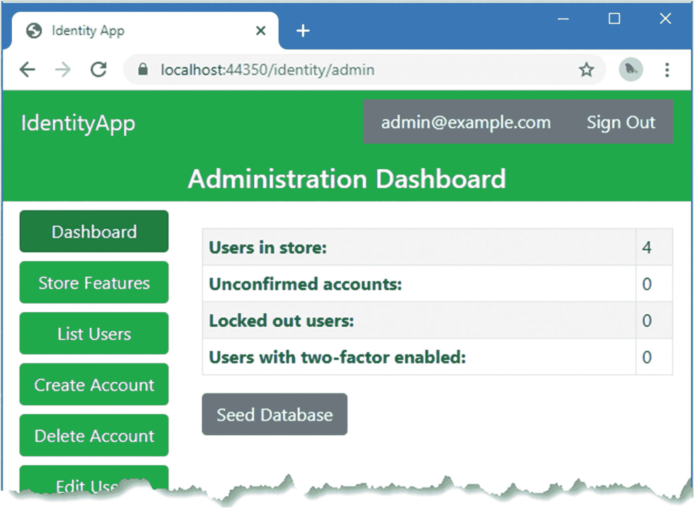
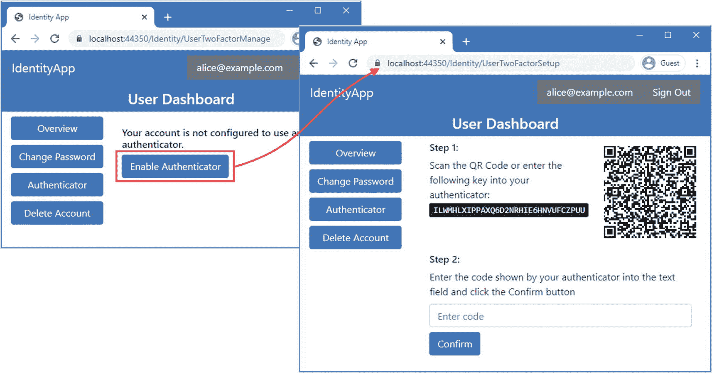
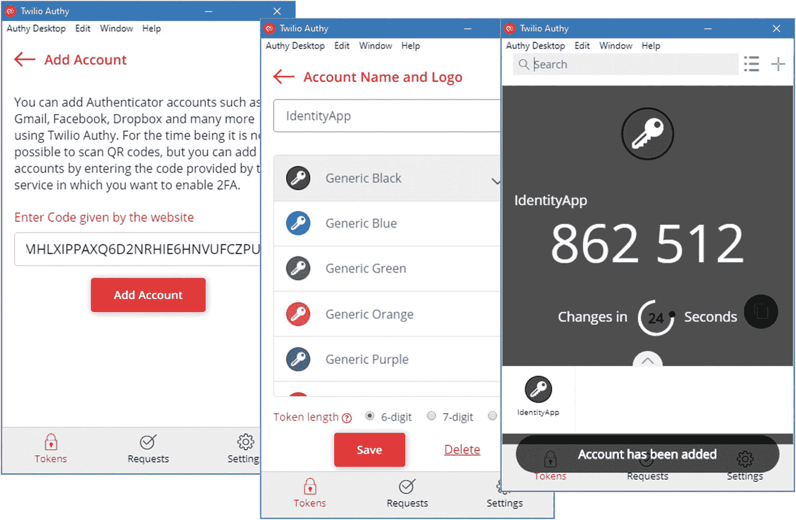
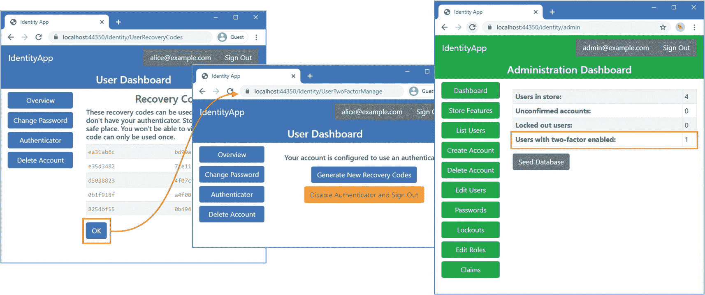
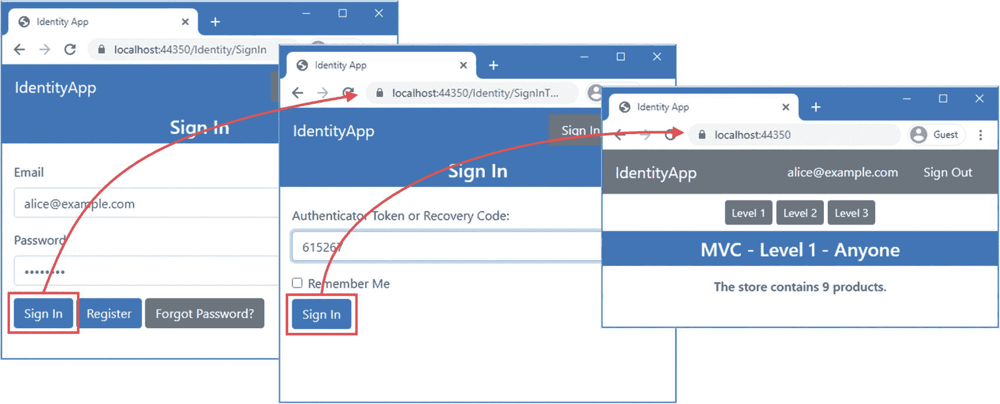
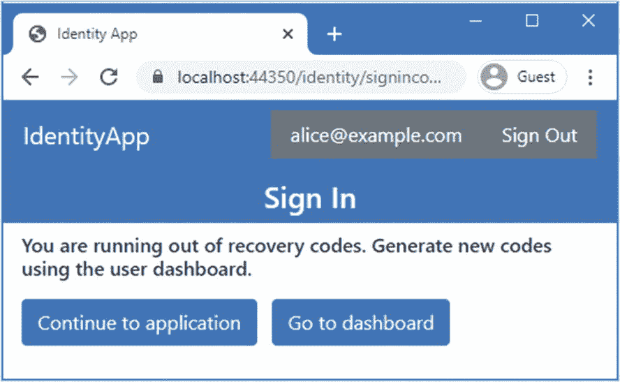
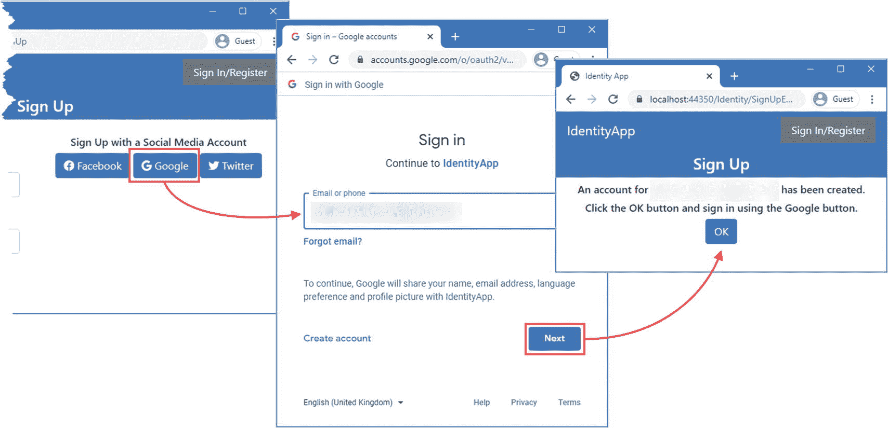
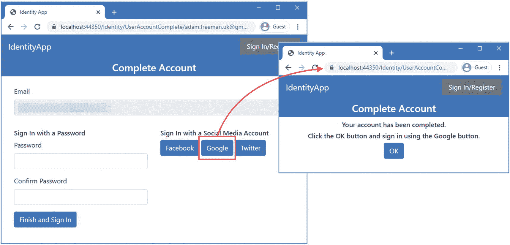
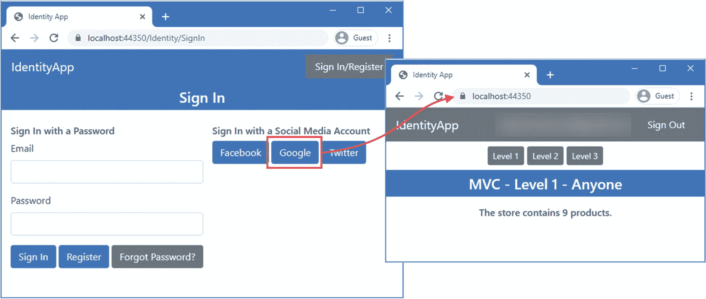

# 十一、双因素和外部认证

Identity 支持双因素认证，即用户除了密码之外还提供其他信息。在第 [17](17.html) 章中，我演示了如何创建一个短信双因素工作流，但在本章中，我将重点关注对认证器的支持，这是一种更安全的方法，但需要用户访问应用。我还创建了登录脸书、谷歌和 Twitter 的第三方服务的工作流，使用了在第 [5](05.html) 章中创建的相同配置设置。表 [11-1](#Tab1) 将本章描述的特征放在上下文中。

表 11-1。

将双因素认证和外部服务放在上下文中

<colgroup><col class="tcol1 align-left"> <col class="tcol2 align-left"></colgroup> 
| 

问题

 | 

回答

 |
| --- | --- |
| 它们是什么？ | 双因素 Identity 认证要求用户提供额外的凭据来登录应用。外部认证服务允许用户向第三方认证自己，如谷歌或脸书。 |
| 它们为什么有用？ | 双因素认证提高了用户帐户的安全性。外部认证允许用户使用他们已经建立的凭据登录，这意味着他们不必管理另一个帐户，并允许 ASP.NET Core 应用受益于 ASP.NET Core Identity 不直接支持的更高级的安全选项。 |
| 它们是如何使用的？ | 授权码应用配置为每 30 秒生成一次代码。用户在登录时，除了密码之外，还会提供当前代码。对于外部认证，ASP.NET Core 应用将用户重定向到第三方服务，在那里进行认证，然后重定向回 ASP.NET Core 应用，在那里登录。 |
| 有什么陷阱或限制吗？ | 双因素认证的默认机制是认证器应用，它要求用户完成初始配置过程，并在登录时访问设备(通常是智能手机)。用户不会丢失或忘记设备，有些用户没有。外部 Identity 认证有效但复杂，并且配置起来令人沮丧。 |
| 还有其他选择吗？ | 这些都是可选功能，并不是必需的，尽管它们确实提高了用户帐户的安全性。 |

表 [11-2](#Tab2) 总结了本章内容。

表 11-2。

章节总结

<colgroup><col class="tcol1 align-left"> <col class="tcol2 align-left"> <col class="tcol3 align-left"></colgroup> 
| 

问题

 | 

解决办法

 | 

列表

 |
| --- | --- | --- |
| 确定用户是否启用了双因素 Identity 认证 | 调用用户管理器的`GetTwoFactorEnabledAsync`方法或读取`IdentityUser.TwoFactorEnabled`属性 | [3](#PC3)–[4](#PC4)、 [9](#PC13) 、 [10](#PC14) |
| 生成可用于设置验证器的令牌 | 调用用户管理器的`GetAuthenticatorKeyAsync`或`ResetAuthenticatorKeyAsync`方法。 | [5](#PC5) ， [6](#PC6) |
| 验证用户在安装过程中提供的令牌 | 调用用户管理器的`VerifyTwoFactorTokenAsync`方法。 | [5](#PC5) ， [6](#PC6) |
| 使用双因素认证登录应用 | 如果登录管理器的`PasswordSignInAsync`返回一个`SignInResult`，其`RequiresTwoFactor`属性为`true`，那么验证一个令牌，并使用`TwoFactorAuthenticatorSignInAsync`方法将用户登录到应用中。 | [11](#PC16) ， [12](#PC17) |
| 生成一组恢复代码 | 调用用户管理器的`GenerateNewTwoFactorRecoveryCodesAsync`方法。 | [6](#PC6)–[8](#PC12)、[13](#PC22)–[14](#PC23) |
| 使用恢复代码让用户登录应用 | 调用登录管理器的`TwoFactorRecoveryCodeSignInAsync`方法。 | [12](#PC17) |
| 确定已配置的外部认证服务 | 调用登录管理器的`GetExternalAuthenticationSchemesAsync`方法。 | [16](#PC25) ， [17](#PC26) |
| 登录或向外部提供商注册 | 调用`ConfigureExternalAuthenticationProperties`方法来选择提供者并返回一个质询响应。接收回调并使用`GetExternalLoginInfoAsync`方法获取外部认证细节。用`ExternalLoginSignInAsync`方法让用户登录应用。 | [18](#PC27)–[24](#PC36) |

## 为本章做准备

本章使用第 [10 章](10.html)中的`IdentityApp`项目。打开一个新的 PowerShell 命令提示符，并运行清单 [11-1](#PC1) 中所示的命令来重置应用和 Identity 数据库。

Tip

你可以从 [`https://github.com/Apress/pro-asp.net-core-identity`](https://github.com/Apress/pro-asp.net-core-identity) 下载本章以及本书其他章节的示例项目。如果在运行示例时遇到问题，请参见第 [1](01.html) 章获取帮助。

```cs
dotnet ef database drop --force --context ProductDbContext
dotnet ef database drop --force --context IdentityDbContext
dotnet ef database update --context ProductDbContext
dotnet ef database update --context IdentityDbContext

Listing 11-1.Resetting the Databases

```

使用 PowerShell 提示符运行清单 [11-2](#PC2) 中的命令来启动应用。

```cs
dotnet run

Listing 11-2.Running the Example Application

```

打开网络浏览器，请求`https://localhost:44350/Identity/Admin`，使用`mysecret`的密码以`admin@example.com`的 Identity 登录。登录后，您将被重定向到管理仪表板。点击种子数据库，这将更新仪表板，显示商店中有四个用户，如图 [11-1](#Fig1) 所示。



图 11-1。

运行示例应用

## 支持双因素认证

双因素 Identity 认证要求用户使用两条信息来证明其 Identity，通常是安全提供给他们的密码和令牌。在第 2 部分中，我将详细解释双因素认证的工作原理，并演示如何使用 SMS 消息向用户发送令牌。在这一章中，我将添加对认证器应用的支持，这与 Identity UI 包采用的方法相同。设置验证器是一项自助操作，因为它需要用户配置应用，通常是在智能手机上。

### 创建双因素概览页面

第一步是创建一个 Razor 页面，该页面将显示当前的帐户状态，并允许用户启用或禁用验证器。在`Pages/Identity`文件夹中添加一个名为`UserTwoFactorManage.cshtml`的 Razor 页面，内容如清单 [11-3](#PC3) 所示。

```cs
@page
@model IdentityApp.Pages.Identity.UserTwoFactorManageModel
@{
    ViewBag.Workflow = "TwoFactor";
}

<div asp-validation-summary="All" class="text-danger m-2"></div>

@if (await Model.IsTwoFactorEnabled()) {
    <div class="text-center">
        <div class="h6 m-2">Your account is configured to use an authenticator</div>
        <div>
            <form method="post">
                <button type="submit" class="btn btn-primary m-1"
                        asp-page-handler="GenerateCodes">
                    Generate New Recovery Codes
                </button>
                <button type="submit" class="btn btn-warning m-1"
                        asp-page-handler="Disable">
                    Disable Authenticator and Sign Out
                </button>
            </form>
        </div>
    </div>

} else {
    <h6>Your account is not configured to use an authenticator.</h6>
    <a asp-page="UserTwoFactorSetup" class="btn btn-primary">Enable Authenticator</a>
}

Listing 11-3.The Contents of the UserTwoFactorManage.cshtml File in the Pages/Identity Folder

```

页面的视图部分生成的内容提供了一个按钮，允许用户通过导航到一个名为`UserTwoFactorSetup`的页面来设置一个验证器，我很快就会创建这个页面。如果有验证器，那么用户将看到一个表单，允许禁用验证器或生成一组新的恢复码。恢复码是一次性密码，可在验证器不可用时使用。应用不一定要支持恢复码，但是用户忘记或丢失了手机，也不会总是有认证码在手。

要创建页面模型类，将清单 [11-4](#PC4) 中所示的代码添加到`UserTwoFactorManage.cshtml.cs`文件中。(如果您使用的是 Visual Studio 代码，则必须创建该文件。)

```cs
using Microsoft.AspNetCore.Identity;
using Microsoft.AspNetCore.Mvc;
using System.Threading.Tasks;

namespace IdentityApp.Pages.Identity {

    public class UserTwoFactorManageModel : UserPageModel {

        public UserTwoFactorManageModel(UserManager<IdentityUser> usrMgr,
                SignInManager<IdentityUser> signMgr) {
            UserManager = usrMgr;
            SignInManager = signMgr;
        }

        public UserManager<IdentityUser> UserManager { get; set; }
        public SignInManager<IdentityUser> SignInManager { get; set; }

        public IdentityUser IdentityUser { get; set; }

        public async Task<bool> IsTwoFactorEnabled()
            => await UserManager.GetTwoFactorEnabledAsync(IdentityUser);

        public async Task OnGetAsync() {
            IdentityUser = await UserManager.GetUserAsync(User);
        }

        public async Task<IActionResult> OnPostDisable() {
            IdentityUser = await UserManager.GetUserAsync(User);
            IdentityResult result = await
                UserManager.SetTwoFactorEnabledAsync(IdentityUser, false);
            if (result.Process(ModelState)) {
                await SignInManager.SignOutAsync();
                return RedirectToPage("Index", new { });
            }
            return Page();
        }

        public async Task<IActionResult> OnPostGenerateCodes() {
            IdentityUser = await UserManager.GetUserAsync(User);
            TempData["RecoveryCodes"] =
                await UserManager.GenerateNewTwoFactorRecoveryCodesAsync(
                    IdentityUser, 10);
            return RedirectToPage("UserRecoveryCodes");
        }
    }
}

Listing 11-4.The Contents of the UserTwoFactorManage.cshtml.cs File in the Pages/Identity Folder

```

用户管理器的`GetTwoFactorEnabledAsync`方法用于确定用户是否配置了认证器。正如我在第 2 部分中演示的那样，应用可以支持多种形式的双因素认证，但是这个示例只使用了认证器，所以我可以假设启用了双因素认证的帐户已经配置了认证器。

`SetTwoFactorEnabledAsync`方法用于启用和禁用双因素认证。在这个类中，我只需要在`Disable` POST handler 方法中禁用双因素认证。

`GenerateCodes` POST 处理程序方法生成一组新的恢复代码。这些代码只向用户显示一次，并在使用时被消耗，因此确保用户在用完代码或忘记代码时可以创建新的代码集是很重要的。(我不喜欢无法查看的安全代码，我将在第 2 部分向您展示如何改变这种行为，以便用户可以看到他们未使用的代码。)

### 创建验证器设置页面

作为设置过程的一部分，用户必须将 Identity 生成的密钥输入到他们的验证器中。为了向用户显示密钥，向`Pages/Identity`文件夹添加一个名为`UserTwoFactorSetup.cshtml`的 Razor 页面，内容如清单 [11-5](#PC5) 所示。

```cs
@page
@model IdentityApp.Pages.Identity.UserTwoFactorSetupModel
@{
    ViewBag.Workflow = "TwoFactor";
}

<div class="container-fluid">
    <div class="row">
        <div class="col">
            <h6>Step 1:</h6>
            Scan the QR Code or enter the following key into your authenticator:
            <div><kbd>@Model.AuthenticatorKey</kbd> </div>
        </div>
        <div class="col-auto p-2">
            <div id="qrCode"></div>
            <div id="qrCodeData" data-url="@Html.Raw(@Model.QrCodeUrl)"></div>
        </div>
    </div>
    <div>
        <div class="row">
            <div class="col">
                <div asp-validation-summary="All" class="text-danger m-2"></div>
                <form method="post" asp-page-handler="confirm">
                    <h6>Step 2:</h6>
                    Enter the code shown by your authenticator into the
                    text field and click the Confirm button
                    <input name="confirm" placeholder="Enter code"
                        class="form-control my-2" />
                    <button class="btn btn-primary" type="submit">Confirm</button>
                </form>
            </div>
        </div>
    </div>
</div>

<script type="text/javascript" src="/lib/qrcode/qrcode.min.js"></script>
    <script type="text/javascript">
        new QRCode(document.getElementById("qrCode"), {
            text: document.getElementById("qrCodeData").getAttribute("data-url"),
            width: 150, height: 150
        });
</script>

Listing 11-5.The Contents of the UserTwoFactorSetup.cshtml File in the Pages/Identity Folder

```

视图向用户显示密钥。大多数授权码是智能手机上的应用，显示二维码为用户提供了更简单的配置路径。该视图使用添加到示例项目中的相同 JavaScript 包来显示 QR 代码，以支持 Identity UI 包。安装生成二维码的 JavaScript 包所需的库管理器(`libman`)命令见第 [4 章](04.html)。

该视图提示用户输入由 authenticator 应用生成的代码。每 30 秒就会显示一个新代码，在更新帐户以要求双因素认证之前，向用户询问当前代码是确保认证器正常工作的明智方法。要定义页面模型类，将清单 [11-6](#PC6) 中所示的代码添加到`UserTwoFactorSetup.cshtml.cs`文件中。(如果您使用的是 Visual Studio 代码，则必须创建该文件。)

```cs
using Microsoft.AspNetCore.Identity;
using Microsoft.AspNetCore.Mvc;
using System.ComponentModel.DataAnnotations;
using System.Threading.Tasks;
using System.Linq;
using System.Text.RegularExpressions;

namespace IdentityApp.Pages.Identity {

    public class UserTwoFactorSetupModel : UserPageModel {

        public UserTwoFactorSetupModel(UserManager<IdentityUser> usrMgr,
              SignInManager<IdentityUser> signMgr) {
            UserManager = usrMgr;
            SignInManager = signMgr;
        }

        public UserManager<IdentityUser> UserManager { get; set; }
        public SignInManager<IdentityUser> SignInManager { get; set; }

        public IdentityUser IdentityUser { get; set; }

        public string AuthenticatorKey { get; set; }

        public string QrCodeUrl { get; set; }

        public async Task<IActionResult> OnGet() {
            await LoadAuthenticatorKeys();
            if (await UserManager.GetTwoFactorEnabledAsync(IdentityUser)) {
                return RedirectToPage("UserTwoFactorManage");
            }
            return Page();
        }

        public async Task<IActionResult> OnPostConfirm([Required] string confirm) {
            await LoadAuthenticatorKeys();
            if (ModelState.IsValid) {
                string token = Regex.Replace(confirm, @"\s", "");
                bool codeValid = await
                        UserManager.VerifyTwoFactorTokenAsync(IdentityUser,
                    UserManager.Options.Tokens.AuthenticatorTokenProvider, token);
                if (codeValid) {
                    TempData["RecoveryCodes"] = await UserManager
                        .GenerateNewTwoFactorRecoveryCodesAsync(IdentityUser, 10);
                    await UserManager.SetTwoFactorEnabledAsync(IdentityUser, true);
                    await SignInManager.RefreshSignInAsync(IdentityUser);
                    return RedirectToPage("UserRecoveryCodes");
                } else {
                    ModelState.AddModelError(string.Empty,
                        "Confirmation code invalid");
                }
            }
            return Page();
        }

        private async Task LoadAuthenticatorKeys() {
            IdentityUser = await UserManager.GetUserAsync(User);
            AuthenticatorKey =
                await UserManager.GetAuthenticatorKeyAsync(IdentityUser);
            if (AuthenticatorKey == null) {
                await UserManager.ResetAuthenticatorKeyAsync(IdentityUser);
                AuthenticatorKey =
                    await UserManager.GetAuthenticatorKeyAsync(IdentityUser);
                await SignInManager.RefreshSignInAsync(IdentityUser);
            }
            QrCodeUrl = $"otpauth://totp/ExampleApp:{IdentityUser.Email}"
                        + $"?secret={AuthenticatorKey}";
        }
    }
}

Listing 11-6.The Contents of the UserTwoFactorSetup.cshtml.cs File in the Pages/Identity Folder

```

当用户请求页面时，GET 处理程序使用`GetTwoFactorEnabledAsync`方法查看用户是否已经配置了双因素认证。如果响应是`true`，则执行到`UserTwoFactorManage`页面的重定向。

对于没有启用双因素认证的用户，GET handler 方法负责向用户提供密钥。验证器密钥是永久性的，用于每 60 秒验证一次验证器生成的代码。如果存储的密钥与验证者使用的密钥不匹配，用户将无法登录。

用户管理器的`GetAuthenticatorKeyAsync`方法从用户存储中检索密钥。如果该方法返回`null`，那么没有存储密钥。使用`ResetAuthenticatorKeyAsync`方法创建并存储一个新的密钥，然后再次调用`GetAuthenticatorKeyAsync`方法从存储中检索密钥。该密钥直接呈现给用户，并格式化为可以显示为 QR 码的 URL。(这些 URL 的格式在第 [21 章](21.html)中描述。)

POST 处理程序接收用户的 authenticator 应用显示的代码，并对其进行处理以删除空白。一些认证器，比如我在本书中使用的 Authy 应用，以空格分隔的数字组显示令牌。这些必须在令牌被验证之前移除，我用正则表达式来验证。

```cs
...
string token = Regex.Replace(confirm, @"\s", "");
...

```

使用`VerifyTwoFactorTokenAsync`方法验证令牌，如下所示:

```cs
...
UserManager.VerifyTwoFactorTokenAsync(IdentityUser,
   UserManager.Options.Tokens.AuthenticatorTokenProvider, token);
...

```

参数是用户对象、令牌提供者类的名称和要验证的代码。在清单 [11-6](#PC6) 中，我读取了用户管理器的`Options`属性以获得`AuthenticatorTokenProvider`属性的值，该值指定了提供者的名称。提供者由第 [8](08.html) 章中添加到 Identity 配置中的`AddDefaultTokenProviders`扩展方法进行配置。该方法设置了适用于大多数应用的令牌生成器，但是如果您的应用有特定的需求，我将在第 2 部分中详细描述如何生成令牌。

如果用户提供的代码有效，我使用`GenerateNewTwoFactorRecoveryCodesAsync`方法生成一组新的恢复代码，如下所示:

```cs
...
TempData["RecoveryCodes"] =
    await UserManager.GenerateNewTwoFactorRecoveryCodesAsync(IdentityUser, 10);
...

```

我指定我需要 10 个代码，在将浏览器重定向到`UserRecoveryCodes`页面之前，我将它们存储为临时数据，以便我可以向用户显示它们。

在第 9 章中，我启用了认证 cookie 验证，以便在用户的安全标记改变时有效地将用户从应用中注销。正如我在那一章中解释的，这可能会导致用户在执行其他更改时被注销，这包括设置一个验证器。`ResetAuthenticatorKeyAsync`和`SetTwoFactorEnabledAsync`方法都更新安全标记。为了防止用户退出应用，我使用了`SignInManager<IdentityUser>.RefreshSignInAsync`方法来在调用这些方法后刷新认证 cookie:

```cs
...
await UserManager.SetTwoFactorEnabledAsync(IdentityUser, true);
await SignInManager.RefreshSignInAsync(IdentityUser);
...

```

`ResetAuthenticatorKeyAsync`方法的效果可能特别成问题，因为该方法在认证器设置状态期间被调用，这意味着用户在配置他们的认证器时可能被注销应用，这可能会令人困惑。

为了显示恢复代码，在`Pages/Identity`文件夹中添加一个名为`UserRecoveryCodes.cshtml`的 Razor 页面，内容如清单 [11-7](#PC11) 所示。

```cs
@page
@model IdentityApp.Pages.Identity.UserRecoveryCodesModel
@{
    ViewBag.Workflow = "TwoFactor";
}

<h4 class="text-center">Recovery Codes</h4>

<h6>
    These recovery codes can be used to sign in if you don't have your authenticator.
    Store these codes in a safe place. You won't be able to view them again.
    Each code can only be used once.
</h6>

<table class="table table-sm table-striped">
    <tbody>
        @for (int i = 0; i < Model.RecoveryCodes.Length; i +=2 ) {
            <tr>
                <td><code>@Model.RecoveryCodes[i]</code></td>
                <td><code>@Model.RecoveryCodes[i + 1]</code></td>
            </tr>
        }
    </tbody>
</table>
<a asp-page="UserTwoFactorManage" class="btn btn-primary">OK</a>

Listing 11-7.The Contents of the UserRecoveryCodes.cshtml File in the Pages/Identity Folder

```

恢复代码显示在一个表格中，同时还会显示一条消息，向用户解释这些代码不能再次查看，必须安全保存。要定义页面模型类，将清单 [11-8](#PC12) 中所示的代码添加到`UserRecoveryCodes.cshtml.cs`文件中。(如果您使用的是 Visual Studio 代码，则必须创建该文件。)

```cs
using Microsoft.AspNetCore.Mvc;

namespace IdentityApp.Pages.Identity {

    public class UserRecoveryCodesModel : UserPageModel {

        [TempData]
        public string[] RecoveryCodes { get; set; }

        public IActionResult OnGet() {
            if (RecoveryCodes == null || RecoveryCodes.Length == 0) {
                return RedirectToPage("UserTwoFactorManage");
            }
            return Page();
        }
    }
}

Listing 11-8.The Contents of the UserRecoveryCodes.cshtml.cs File in the Pages/Identity Folder

```

`TempData`属性用于设置`RecoveryCodes`属性的值，如果没有恢复代码，GET 处理程序将执行到管理页面的重定向。

### 更新用户和管理员仪表板

添加清单 [11-9](#PC13) 中所示的元素，为用户提供双因素特性的导航。

```cs
@model (string workflow, string theme)
@inject UserManager<IdentityUser> UserManager
@{
    Func<string, string> getClass = (string feature) =>
        feature != null && feature.Equals(Model.workflow) ? "active" : "";

    IdentityUser identityUser
        = await UserManager.GetUserAsync(User) ?? new IdentityUser();
}

<a class="btn btn-@Model.theme btn-block @getClass("Overview")" asp-page="Index">
    Overview
</a>

@if (await UserManager.HasPasswordAsync(identityUser)) {
    <a class="btn btn-@Model.theme btn-block @getClass("PasswordChange")"
            asp-page="UserPasswordChange">
        Change Password
    </a>
    <a class="btn btn-@Model.theme btn-block @getClass("UserTwoFactor")"
            asp-page="UserTwoFactorManage">
        Authenticator
    </a>
}
<a class="btn btn-@Model.theme btn-block @getClass("UserDelete")"
        asp-page="UserDelete">
    Delete Account
</a>

Listing 11-9.Adding Navigation in the _Workflows.cshtml File in the Pages/Identity Folder

```

导航元素将只向有密码的用户显示，这将防止使用外部服务登录的用户使用认证器。

管理员控制面板概述显示采用双因素 Identity 认证的用户数量。要设置该值，将清单 [11-10](#PC14) 中所示的语句添加到`Pages/Identity/Admin`文件夹中的`Dashboard.cshtml.cs`文件中。

```cs
...
public void OnGet() {
    UsersCount = UserManager.Users.Count();
    UsersUnconfirmed = UserManager.Users
        .Where(u => !u.EmailConfirmed).Count();
    UsersLockedout = UserManager.Users
        .Where(u => u.LockoutEnabled && u.LockoutEnd > System.DateTimeOffset.Now)
        .Count();
    UsersTwoFactor = UserManager.Users.Where(u => u.TwoFactorEnabled).Count();
}
...

Listing 11-10.Counting Users in the Dashboard.cshtml.cs File in the Pages/Identity/Admin Folder

```

数据库服务器无法评估用户管理器的`GetTwoFactorEnabledAsync`方法，这意味着使用该方法计算用户数需要检索所有存储的`IdentityUser`对象，对每个对象调用该方法，并计算结果。相反，我选择使用由`IdentityUser`类定义的`TwoFactorEnabled`属性。

重启 ASP.NET Core，用密码`mysecret`以`alice@example.com`的 Identity 登录应用，请求`https://localhost:44350/Identity`。点击 Authenticator 按钮，您将看到图 [11-2](#Fig2) 中第一个截图所示的消息。

点击 Enable Authenticator 按钮，您将看到一个用于设置认证器和二维码的密钥，如图 [11-2](#Fig2) 中的第二个截图所示。

Note

如果您没有看到 QR 码，那么您可能没有安装所需的 JavaScript 包。参见第 [4](04.html) 章的说明。



图 11-2。

设置双因素认证

将密钥输入您的验证器或扫描二维码。我在本书中使用 Authy 应用(`authy.com`)作为例子，因为有一个 Windows 客户端，但也有来自谷歌和微软的替代产品，可以在 iOS 和 Android 应用商店的移动设备上运行。(我在开发过程中使用的 [`https://totp.danhersam.com`](https://totp.danhersam.com) 也有一个很好的工具，你可以在其中粘贴一个密钥，开始接收代码，而不需要任何额外的配置，如果你在重复测试一个工作流，这很有帮助。)认证器一旦设置好就会开始生成令牌，如图 [11-3](#Fig3) 所示。



图 11-3。

设置验证器

在浏览器中显示的文本字段中输入当前令牌，然后单击确认按钮。您将看到一组恢复代码，如图 [11-4](#Fig4) 所示。点击 OK 按钮返回到`UserTwoFactorManage`页面，您将看到生成一组新的恢复码并禁用验证器的按钮。



图 11-4。

完成验证器设置

如图 [11-4](#Fig4) 所示，管理员控制面板显示现在有一个用户设置了双因素认证。为了快速参考，表 [11-3](#Tab3) 描述了用于管理带认证器的双因素认证的用户管理器方法。

表 11-3。

双因素认证器认证的 UserManager <identityuser>方法</identityuser>

<colgroup><col class="tcol1 align-left"> <col class="tcol2 align-left"></colgroup> 
| 

名字

 | 

描述

 |
| --- | --- |
| `GetTwoFactorEnabledAsync(user)` | 如果用户帐户已经配置了双因素认证，此方法将返回`true`。 |
| `SetTwoFactorEnabledAsync(user, enabled)` | 此方法用于启用或禁用双因素认证。在调用此方法之前，必须小心配置认证器。 |
| `GetAuthenticatorKeyAsync(user)` | 该方法从用户存储中返回用户的验证者密钥，如果没有存储密钥，则返回`null`。 |
| `ResetAuthenticatorKeyAsync(user)` | 此方法用于生成新的验证者密钥并将其添加到存储中。 |
| `VerifyTwoFactorTokenAsync(user, code)` | 此方法使用用户存储中的密钥来验证验证器代码。验证代码不会使用户登录应用。 |
| `GenerateNewTwoFactorRecoveryCodesAsync(user, count)` | 该方法生成一组新的恢复码。 |

表 [11-4](#Tab4) 描述了我用来防止用户在设置认证器时被注销的`SignInManager<IdentityUser>`方法。

表 11-4。

登录管理器<identityuser>防止注销的方法</identityuser>

<colgroup><col class="tcol1 align-left"> <col class="tcol2 align-left"></colgroup> 
| 

名字

 | 

描述

 |
| --- | --- |
| `RefreshSignInAsync(user)` | 此方法使用现有的认证设置将用户登录到应用，并使用当前的安全戳刷新认证 cookie。 |

## 使用验证器登录

当我创建`SignIn`页面时，我检查了`SignInResult`对象的属性以确定登录的结果，如下所示:

```cs
...
public async Task<IActionResult> OnPostAsync() {
    if (ModelState.IsValid) {
        SignInResult result = await SignInManager.PasswordSignInAsync(Email,
            Password, true, true);
        if (result.Succeeded) {
            return Redirect(ReturnUrl ?? "/");
        } else if (result.IsLockedOut) {
            TempData["message"] = "Account Locked";
        } else if (result.IsNotAllowed) {
            IdentityUser user = await UserManager.FindByEmailAsync(Email);
            if (user != null &&
                    !await UserManager.IsEmailConfirmedAsync(user)) {
                return RedirectToPage("SignUpConfirm");
            }
            TempData["message"] = "Sign In Not Allowed";
        } else if (result.RequiresTwoFactor) {
            return RedirectToPage("SignInTwoFactor", new { ReturnUrl });
        } else {
            TempData["message"] = "Sign In Failed";
        }
    }
    return Page();
}
...

```

当用户设置了一个认证器时，`PasswordSignInAsync`方法的结果是一个`SignInResult`对象，它的`RequiresTwoFactor`属性是`true`(当然，假设他们提供了正确的密码)。对于这个结果，我发送一个重定向到名为`SignInTwoFactor`的页面，这样用户就可以完成登录过程。向`Pages/Identity`文件夹添加一个名为`SignInTwoFactor.cshtml`的 Razor 页面，内容如清单 [11-11](#PC16) 所示。

```cs
@page "{returnUrl?}"
@model IdentityApp.Pages.Identity.SignInTwoFactorModel
@{
    ViewData["showNav"] = false;
    ViewData["banner"] = "Sign In";
}

<div asp-validation-summary="All" class="text-danger m-2"></div>

<form method="post">
    <div class="form-group">
        <label>Authenticator Token or Recovery Code:</label>
        <input class="form-control" asp-for="Token" />
    </div>
    <div class="form-check">
        <input class="form-check-input" type="checkbox" asp-for="RememberMe" />
        <label class="form-check-label" >Remember Me</label>
    </div>
    <button type="submit" class="btn btn-primary mt-2">Sign In</button>
</form>

Listing 11-11.The Contents of the SignInTwoFactor.cshtml File in the Pages/Identity Folder

```

页面的视图部分为用户提供了一个`input`元素，可以在其中输入认证令牌或恢复代码。还有一个用于设置 cookie 的复选框，这样用户只需输入密码就可以使用同一个浏览器登录。

将清单 [11-12](#PC17) 中所示的代码添加到`SignInTwoFactor.cshtml.cs`文件中，以定义页面模型类。(如果您使用的是 Visual Studio 代码，则必须创建该文件。)

```cs
using Microsoft.AspNetCore.Authorization;
using Microsoft.AspNetCore.Identity;
using Microsoft.AspNetCore.Mvc;
using System.ComponentModel.DataAnnotations;
using System.Text.RegularExpressions;
using System.Threading.Tasks;
using SignInResult = Microsoft.AspNetCore.Identity.SignInResult;

namespace IdentityApp.Pages.Identity {

    [AllowAnonymous]
    public class SignInTwoFactorModel : UserPageModel {

        public SignInTwoFactorModel(UserManager<IdentityUser> usrMgr,
                SignInManager<IdentityUser> signMgr) {
            UserManager = usrMgr;
            SignInManager = signMgr;
        }

        public UserManager<IdentityUser> UserManager { get; set; }
        public SignInManager<IdentityUser> SignInManager { get; set; }

        [BindProperty]
        public string ReturnUrl { get; set; }

        [BindProperty]
        [Required]
        public string Token { get; set; }

        [BindProperty]
        public bool RememberMe { get; set; }

        public async Task<IActionResult> OnPostAsync() {
            if (ModelState.IsValid) {
                IdentityUser user = await
                    SignInManager.GetTwoFactorAuthenticationUserAsync();
                if (user != null) {
                    string token = Regex.Replace(Token, @"\s", "");
                    SignInResult result = await
                         SignInManager.TwoFactorAuthenticatorSignInAsync(token, true,
                            RememberMe);
                    if (!result.Succeeded) {
                        result = await
                            SignInManager.TwoFactorRecoveryCodeSignInAsync(token);
                    }
                    if (result.Succeeded) {
                        if (await UserManager.CountRecoveryCodesAsync(user) <= 3) {
                            return RedirectToPage("SignInCodesWarning");
                        }
                        return Redirect(ReturnUrl ?? "/");
                    }
                }
                ModelState.AddModelError("", "Invalid token or recovery code");
            }
            return Page();
        }
    }
}

Listing 11-12.The Contents of the SignInTwoFactor.cshtml.cs File in the Pages/Identity Folder

```

第一步是确保用户在登录过程的第一阶段提供了有效的密码，如下所示:

```cs
...
IdentityUser user = await SignInManager.GetTwoFactorAuthenticationUserAsync();
...

```

登录管理器的`GetTwoFactorAuthenticationUserAsync`方法检索与上一步中提供的电子邮件地址和密码相关联的`IdentityUser`对象。如果这个方法返回`null`，那么用户没有提供密码，登录过程应该停止。

在第 2 部分中，我将分别处理认证器令牌和恢复代码，但是在本章中，我首先尝试将用户提供的字符串作为认证器令牌，然后使用它作为恢复代码。

登录管理器的`TwoFactorAuthenticatorSignInAsync`方法用于使用认证器令牌登录。参数是令牌，一个`bool`指示认证 cookie 是否应该是持久的，一个`bool`指示是否应该创建一个 cookie，允许用户在没有认证者的情况下从同一个浏览器登录。

```cs
...
await SignInManager.TwoFactorAuthenticatorSignInAsync(token, true, RememberMe);
...

```

如果用户提供了有效的令牌，他们将登录到应用。如果令牌无效，我会尝试将其用作恢复代码，如下所示:

```cs
...
result = await SignInManager.TwoFactorRecoveryCodeSignInAsync(token);
...

```

如果恢复代码有效，则用户登录。代码只能使用一次，如果代码用完了，警告用户是很重要的。我使用用户管理器的`CountRecoveryCodesAsync`方法来检查还剩多少代码，如果还剩三个或更少的代码，就将用户重定向到警告页面。

```cs
...
if (await UserManager.CountRecoveryCodesAsync(user) <= 3) {
...

```

要定义警告页面，在`Pages/Identity`文件夹中添加一个名为`SignInCodesWarning.cshtml`的 Razor 页面，内容如清单 [11-13](#PC22) 所示。

```cs
@page "{returnUrl?}"
@model IdentityApp.Pages.Identity.SignInCodesWarningModel
@{
    ViewData["showNav"] = false;
    ViewData["banner"] = "Sign In";
}

<div class="h6">
    You are running out of recovery codes.
    Generate new codes using the user dashboard.
</div>
<a href="@Model.ReturnUrl" class="btn btn-primary my-2">Continue to application</a>
<a asp-page="UserTwoFactorManage" class="btn btn-primary m-2">Go to dashboard</a>

Listing 11-13.The Contents of the SignInCodesWarning.cshtml File in the Pages/Identity Folder

```

要定义页面模型类，将清单 [11-14](#PC23) 中所示的代码添加到`SignInCodesWarning.cshtml.cs`文件中。(如果您使用的是 Visual Studio 代码，则必须创建该文件。)

```cs
using Microsoft.AspNetCore.Mvc;

namespace IdentityApp.Pages.Identity {

    public class SignInCodesWarningModel : UserPageModel {

        [BindProperty(SupportsGet = true)]
        public string ReturnUrl { get; set; } = "/";
    }
}

Listing 11-14.The Contents of the SignInCodesWarning.cshtml.cs File in the Pages/Identity Folder

```

为了快速参考，表 [11-5](#Tab5) 显示了使用认证器的双因素登录所使用的登录管理器方法。

表 11-5。

用于验证者双因素登录的 SignInManager <identityuser>方法</identityuser>

<colgroup><col class="tcol1 align-left"> <col class="tcol2 align-left"></colgroup> 
| 

名字

 | 

描述

 |
| --- | --- |
| `GetTwoFactorAuthenticationUserAsync()` | 该方法返回与密码阶段提供的用户名/电子邮件地址相关联的`IdentityUser`对象。如果该方法返回`null`，您应该停止登录过程。 |
| `TwoFactorAuthenticatorSignInAsync(token, persist, remember)` | 该方法验证一个验证器令牌，并让用户登录到应用中。 |
| `TwoFactorRecoveryCodeSignInAsync(code)` | 此方法验证恢复代码，并让用户登录应用。代码从存储区中移除，因此无法重用。 |

表 [11-6](#Tab6) 描述了我用来统计未使用的恢复代码的用户管理器方法。

表 11-6。

用于计算恢复代码的 UserManager <identityuser>方法</identityuser>

<colgroup><col class="tcol1 align-left"> <col class="tcol2 align-left"></colgroup> 
| 

名字

 | 

描述

 |
| --- | --- |
| `CountRecoveryCodesAsync(user)` | 该方法返回特定`IdentityUser`对象未使用的恢复代码的数量。 |

重启 ASP.NET Core，确保你已经退出应用，并请求`https://localhost:44350/Identity/SignIn`。在电子邮件字段中输入`alice@example.com`，并使用`mysecret`作为密码。点击登录按钮，输入您的认证器显示的当前令牌，点击登录按钮，完成登录过程，如图 [11-5](#Fig5) 所示。



图 11-5。

使用验证器登录

如果您在登录时选择了“记住我”选项，则下次您以同一用户 Identity 使用同一浏览器登录时，系统不会提示您输入验证器令牌。您需要删除浏览器的 cookie，或者等到 cookie 过期后，系统会再次提示您输入令牌。如果您在登录应用时即将用完恢复代码集，您将会看到如图 [11-6](#Fig6) 所示的警告。



图 11-6。

警告用户有关恢复代码的信息

## 支持外部认证服务

在第五章中，我解释了如何配置 ASP.NET Core 来认证第三方服务，比如谷歌和脸书。有几种方法可以支持外部认证服务。例如，`IdentityUI`包允许用户拥有本地密码和外部认证，并在两者之间自由移动。这个想法是，即使外部服务关闭，用户仍然可以登录。我倾向于让用户选择一个或另一个，因为谷歌或脸书提供的外部服务通常是可靠的，向用户提供不必要的选项会导致额外的支持请求。

### 配置应用

在第 [5 章](05.html)中，我将 Identity 配置为使用 Google、脸书和 Twitter 的内置提供者。这一章需要做一个修改，调整 Twitter 提供者的配置，以便它从外部服务请求用户详细信息，如清单 [11-15](#PC24) 所示。这些详细信息包括用户的电子邮件地址，我将使用它在用户存储中创建帐户。

```cs
...
services.AddAuthentication()
    .AddFacebook(opts => {
        opts.AppId = Configuration["Facebook:AppId"];
        opts.AppSecret = Configuration["Facebook:AppSecret"];
    })
    .AddGoogle(opts => {
        opts.ClientId = Configuration["Google:ClientId"];
        opts.ClientSecret = Configuration["Google:ClientSecret"];
    })
    .AddTwitter(opts => {
        opts.ConsumerKey = Configuration["Twitter:ApiKey"];
        opts.ConsumerSecret = Configuration["Twitter:ApiSecret"];
        opts.RetrieveUserDetails = true;
    });
...

Listing 11-15.Changing the Provider Configuration in the Startup.cs File in the IdentityApp Folder

```

### 支持自助注册外部服务

第一步是在已经支持的本地认证选项旁边显示创建帐户的选项。将清单 [11-16](#PC25) 中显示的内容添加到`Pages/Identity`文件夹中的`SignUp.cshtml`文件中。

```cs
@page
@model IdentityApp.Pages.Identity.SignUpModel
@{
    ViewData["showNav"] = false;
    ViewData["banner"] = "Sign Up";
}

<link href="/lib/font-awesome/css/all.min.css" rel="stylesheet" />

<div asp-validation-summary="All" class="text-danger m-2"></div>

<div class="container-fluid">
    <div class="row">
        <div class="col-6">
            <form method="post" class="m-4">
                <div class="form-group">
                    <label>Email</label>
                    <input class="form-control" asp-for="Email" />
                </div>
                <div class="form-group">
                    <label>Password</label>
                    <input class="form-control" type="password" asp-for="Password" />
                </div>
                <button class="btn btn-primary">Sign Up</button>
            </form>
        </div>
        <div class="col-auto text-center">
            <h6>Sign Up with a Social Media Account</h6>
            <form method="post" asp-page="SignUpExternal">
                @foreach (var scheme in Model.ExternalSchemes) {
                    <partial name="_ExternalButtonPartial" model="scheme" />
                }
            </form>
        </div>
    </div>
</div>

Listing 11-16.Displaying External Services in the SignUp.cshtml File in the Pages/Identity Folder

```

`link`元素包括字体 Awesome 包的 CSS 样式表，我在第 [5 章](05.html)中将其添加到项目中，以显示外部服务的图标。其余的添加创建了一个网格布局，将显示应用中每个已配置外部服务的按钮，以及传统的电子邮件/密码注册选项。使用为 Identity UI 包创建的`_ExternalButtonPartial`局部视图显示每个服务的按钮。当用户单击其中一个按钮时，他们将向一个名为`SignUpExternal`的页面提交一个表单，我将很快创建这个页面。

清单 [11-17](#PC26) 显示了页面模型类的相应变化，为视图提供外部服务列表。

```cs
using IdentityApp.Services;
using Microsoft.AspNetCore.Authorization;
using Microsoft.AspNetCore.Identity;
using Microsoft.AspNetCore.Mvc;
using System.ComponentModel.DataAnnotations;
using System.Threading.Tasks;
using System.Collections.Generic;
using Microsoft.AspNetCore.Authentication;

namespace IdentityApp.Pages.Identity {

    [AllowAnonymous]
    public class SignUpModel : UserPageModel {

        public SignUpModel(UserManager<IdentityUser> usrMgr,
                IdentityEmailService emailService,
                SignInManager<IdentityUser> signMgr) {
            UserManager = usrMgr;
            EmailService = emailService;
            SignInManager = signMgr;
        }

        public UserManager<IdentityUser> UserManager { get; set; }
        public IdentityEmailService EmailService { get; set; }
        public SignInManager<IdentityUser> SignInManager { get; set; }

        [BindProperty]
        [Required]
        [EmailAddress]
        public string Email { get; set; }

        [BindProperty]
        [Required]
        public string Password { get; set; }

        public IEnumerable<AuthenticationScheme> ExternalSchemes { get; set; }

        public async Task OnGetAsync() {
            ExternalSchemes = await
                SignInManager.GetExternalAuthenticationSchemesAsync();
        }

        public async Task<IActionResult> OnPostAsync() {
            // ...statements omitted for brevity...
        }
    }
}

Listing 11-17.Supporting External Services in the SignUp.cshtml.cs File in the Pages/Identity Folder

```

登录管理器的`GetExternalAuthenticationSchemesAsync`方法返回一系列`AuthenticationScheme`对象，每个对象描述应用中配置的一个外部服务。在`Pages/Identity`文件夹中添加一个名为`SignUpExternal.cshtml`的 Razor 页面，内容如清单 [11-18](#PC27) 所示。

```cs
@page "{id?}"
@model IdentityApp.Pages.Identity.SignUpExternalModel
@{
    ViewData["showNav"] = false;
    ViewData["banner"] = "Sign Up";
}

@if (TempData["errorMessage"] != null) {
        <div class="alert alert-danger">@TempData["errorMessage"]</div>
        <a asp-page="SignUp" class="btn btn-danger">Cancel Sign Up</a>
} else {
    <div class="text-center">
        <h6>
            An account for <code>@Model.IdentityUser.Email</code> has been created.
        </h6>
        <h6>Click the OK button and sign in using the
            @(await Model.ExternalProvider()) button.
        </h6>
        <a asp-page="SignIn" class="btn btn-primary">OK</a>
    </div>
}

Listing 11-18.The Contents of the SignUpExternal.cshtml File in the Pages/Identity Folder

```

该页面的视图部分只需在帐户建立时显示一条确认消息，或者在出错时显示一条错误消息。过程的复杂性在页面模型类中，它负责处理外部服务和创建帐户。将清单 [11-19](#PC28) 中所示的代码添加到`SignUpExternal.cshtml.cs`文件中。(如果您使用的是 Visual Studio 代码，则必须创建该文件。)

```cs
using Microsoft.AspNetCore.Authentication;
using Microsoft.AspNetCore.Authorization;
using Microsoft.AspNetCore.Identity;
using Microsoft.AspNetCore.Mvc;
using System.Linq;
using System.Security.Claims;
using System.Threading.Tasks;

namespace IdentityApp.Pages.Identity {

    [AllowAnonymous]
    public class SignUpExternalModel : UserPageModel {

        public SignUpExternalModel(UserManager<IdentityUser> usrMgr,
                SignInManager<IdentityUser> signMgr) {
            UserManager = usrMgr;
            SignInManager = signMgr;
        }

        public UserManager<IdentityUser> UserManager { get; set; }
        public SignInManager<IdentityUser> SignInManager { get; set; }

        public IdentityUser IdentityUser { get; set; }

        public async Task<string> ExternalProvider() =>
            (await UserManager.GetLoginsAsync(IdentityUser))
            .FirstOrDefault()?.ProviderDisplayName;

        public IActionResult OnPost(string provider) {
            string callbackUrl = Url.Page("SignUpExternal", "Callback");
             AuthenticationProperties props =
                SignInManager.ConfigureExternalAuthenticationProperties(
                    provider, callbackUrl);
            return new ChallengeResult(provider, props);
        }

        public async Task<IActionResult> OnGetCallbackAsync() {
            ExternalLoginInfo info = await SignInManager.GetExternalLoginInfoAsync();

            string email = info?.Principal?.FindFirst(ClaimTypes.Email)?.Value;
            if (string.IsNullOrEmpty(email)) {
                return Error("External service has not provided an email address.");
            } else if ((await UserManager.FindByEmailAsync(email)) != null ) {
                return Error("An account already exists with your email address.");
            }

            IdentityUser identUser = new IdentityUser {
                UserName = email,
                Email = email,
                EmailConfirmed = true
            };
            IdentityResult result = await UserManager.CreateAsync(identUser);
            if (result.Succeeded) {
                identUser = await UserManager.FindByEmailAsync(email);
                result = await UserManager.AddLoginAsync(identUser, info);
                return RedirectToPage(new { id = identUser.Id });
            }
            return Error("An account could not be created.");
        }

        public async Task<IActionResult> OnGetAsync(string id) {
            if (id == null) {
                return RedirectToPage("SignUp");
            } else {
                IdentityUser = await UserManager.FindByIdAsync(id);
                if (IdentityUser == null) {
                    return RedirectToPage("SignUp");
                }
            }
            return Page();
        }

        private IActionResult Error(string err) {
            TempData["errorMessage"] = err;
            return RedirectToPage();
        }
    }
}

Listing 11-19.The Contents of the SignUpExternal.cshtml.cs File in the Pages/Identity Folder

```

我已经按照处理程序方法的使用顺序定义了它们，以帮助简化复杂的过程。当用户单击由`SignUp`页面显示的外部认证按钮之一时，将调用`OnPost`处理程序方法。

登录管理器的`ConfigureExternalAuthenticationProperties`方法被调用来创建一个`AuthenticationProperties`对象，该对象将向选定的外部提供者验证用户。这些属性是用回调 URL 配置的，当用户用他们选择的服务验证了自己的 Identity 后，就会调用这个 URL。`AuthenticationProperties`对象用于创建一个质询响应，这将启动认证过程并将用户重定向到所选的服务。

当用户通过认证后，将调用`OnGetCallbackAsync`方法。使用登录管理器的`GetExternalLoginInfoAsync`方法获取用户的外部信息，该方法返回一个`ExternalLoginInfo`对象。属性返回一个包含用户账户信息的`ClaimsPrincipal`对象，以一系列声明的形式表示。用户的电子邮件地址是通过查找第一个类型为`ClaimType.Email`的索赔获得的，如下所示:

```cs
...
ExternalLoginInfo info = await SignInManager.GetExternalLoginInfoAsync();
string email = info?.Principal?.FindFirst(ClaimTypes.Email)?.Value;
...

```

一旦我有了一个电子邮件地址，我就用它来创建一个新的`IdentityUser`对象，并将其添加到用户存储中。然后我使用`FindByEmailAsync`方法，这样我就可以处理对象的存储版本，包括在存储过程中自动生成的属性。我调用用户管理器的`AddLoginAsync`方法将外部登录的详细信息存储在存储中，这样它们就可以用于登录应用。

执行重定向调用`OnGetAsync`方法，该方法设置向用户显示确认消息所需的属性。为了快速参考，表 [11-7](#Tab7) 描述了使用外部登录创建账户的登录方法。

表 11-7。

使用外部登录注册的 SignInManager <identityuser>方法</identityuser>

<colgroup><col class="tcol1 align-left"> <col class="tcol2 align-left"></colgroup> 
| 

名字

 | 

描述

 |
| --- | --- |
| `ConfigureExternalAuthenticationProperties(provider, url)` | 这个方法为指定的提供者和回调 URL 创建一个`AuthenticationProperties`对象，然后可以用它来创建一个质询响应。 |
| `GetExternalLoginInfoAsync()` | 该方法返回一个代表外部认证服务提供的用户数据的`ExternalLoginInfo`对象。 |

表 [11-8](#Tab8) 描述了用于存储外部登录的用户管理器方法。

表 11-8。

用于存储外部登录的 UserManager <identityuser>方法</identityuser>

<colgroup><col class="tcol1 align-left"> <col class="tcol2 align-left"></colgroup> 
| 

名字

 | 

描述

 |
| --- | --- |
| `AddLoginAsync(user, info)` | 这个方法为指定的`IdentityUser`存储一个`ExternalLoginInfo`对象。 |

重启 ASP.NET Core 并请求`https://localhost:44350/Identity/SignUp`；您将看到使用脸书、谷歌和 Twitter 创建帐户的按钮。创建帐户需要这些提供商之一的真实帐户，因此单击您拥有帐户的提供商的按钮，您将被重定向到登录页面。完成登录过程，您将被重定向回示例应用，该应用将显示一条确认消息。图 [11-7](#Fig7) 显示了一个谷歌账户的基本序列，尽管你会看到密码、认证令牌、短信或其他基于你账户的因素的附加步骤。



图 11-7。

使用外部认证服务创建帐户

### 支持管理员向外部服务注册

当管理员创建帐户时，用户可以选择外部认证服务来代替密码。首先，对`UserAccountComplete`页面进行清单 [11-20](#PC30) 所示的更改，让用户在密码和外部认证服务之间进行选择。为了方便起见，我在页面的视图部分做了所有的修改，而不是更新页面模型类。

```cs
@page "{email?}/{token?}"
@model IdentityApp.Pages.Identity.UserAccountCompleteModel
@inject SignInManager<IdentityUser> SignInManager
@{
    ViewData["showNav"] = false;
    ViewData["banner"] = "Complete Account";
}

@if (string.IsNullOrEmpty(Model.Token) || string.IsNullOrEmpty(Model.Email)) {
    <div class="h6 text-center">
        <div class="p-2">
            Check your inbox for a confirmation email and click the link it contains.
        </div>
    </div>
} else {
    <div asp-validation-summary="All" class="text-danger m-2"></div>
    <div class="container-fluid">
        <div class="row">
            <div class="col mb-3">
                <div class="form-group">
                    <label>Email</label>
                    <input class="form-control" asp-for="Email" readonly />
                </div>
            </div>
        </div>
        <div class="row">
            <div class="col-6">
                <h6>Sign In with a Password</h6>
                <form method="post">
                    <input type="hidden" asp-for="Token" />
                    <input type="hidden" asp-for="Email" />
                    <div class="form-group">
                        <label>Password</label>
                        <input class="form-control" type="password"
                            name="password" />
                    </div>
                    <div class="form-group">
                        <label>Confirm Password</label>
                        <input class="form-control" type="password"
                             name="confirmpassword" />
                    </div>
                    <button class="btn btn-primary" type="submit">
                        Finish and Sign In
                    </button>
                </form>
            </div>
            <div class="col-auto">
                <h6>Sign In with a Social Media Account</h6>
                <form method="post" asp-page="UserAccountCompleteExternal">
                    <input type="hidden" asp-for="Email" />
                    <input type="hidden" asp-for="Token" />
                    @foreach (var scheme in await
                            SignInManager.GetExternalAuthenticationSchemesAsync()) {
                        <partial name="_ExternalButtonPartial" model="scheme" />
                    }
                </form>
            </div>
        </div>
    </div>
}

Listing 11-20.External Options in the UserAccountComplete.cshtml File in the Pages/Identity Folder

```

要处理使用外部服务来完成帐户设置，需要在`Pages/Identity`文件夹中添加一个名为`UserAccountCompleteExternal.cshtml`的 Razor 页面，内容如清单 [11-21](#PC31) 所示。

```cs
@page "{id?}"
@model IdentityApp.Pages.Identity.UserAccountCompleteExternalModel
@{
    ViewData["showNav"] = false;
    ViewData["banner"] = "Complete Account";
}

@if (TempData["errorMessage"] != null) {
        <div class="alert alert-danger">@TempData["errorMessage"]</div>
        <a asp-page="SignUp" class="btn btn-danger">Cancel Sign Up</a>
} else {
    <div class="text-center">
        <h6>
            Your account has been completed.
        </h6>
        <h6>Click the OK button and sign in using the
            @(await Model.ExternalProvider()) button.
        </h6>
        <a asp-page="SignIn" class="btn btn-primary">OK</a>
    </div>
}

Listing 11-21.The Contents of the UserAccountCompleteExternal.cshtml File in the Pages/Identity Folder

```

这个页面类似于上一节中定义的页面，但是我没有试图减少重复，因为大多数应用只需要一种方法，如果它是独立的，那么将工作流合并到一个真实的项目中会更容易。要定义页面模型类，将清单 [11-22](#PC32) 中所示的代码添加到`UserAccountCompleteExternal.cshtml.cs`文件中。(如果您使用的是 Visual Studio 代码，则必须创建该文件。)

```cs
using IdentityApp.Services;
using Microsoft.AspNetCore.Authentication;
using Microsoft.AspNetCore.Authorization;
using Microsoft.AspNetCore.Identity;
using Microsoft.AspNetCore.Mvc;
using System.Linq;
using System.Security.Claims;
using System.Threading.Tasks;

namespace IdentityApp.Pages.Identity {

    [AllowAnonymous]
    public class UserAccountCompleteExternalModel : UserPageModel {

        public UserAccountCompleteExternalModel(
                UserManager<IdentityUser> usrMgr,
                SignInManager<IdentityUser> signMgr,
                TokenUrlEncoderService encoder) {
            UserManager = usrMgr;
            SignInManager = signMgr;
            TokenUrlEncoder = encoder;
        }

        public UserManager<IdentityUser> UserManager { get; set; }
        public SignInManager<IdentityUser> SignInManager { get; set; }
        public TokenUrlEncoderService TokenUrlEncoder { get; set; }

        [BindProperty(SupportsGet = true)]
        public string Email { get; set; }

        [BindProperty(SupportsGet = true)]
        public string Token { get; set; }

        public IdentityUser IdentityUser { get; set; }

        public async Task<string> ExternalProvider() =>
            (await UserManager.GetLoginsAsync(IdentityUser))
                .FirstOrDefault()?.ProviderDisplayName;

        public async Task<IActionResult> OnPostAsync(string provider) {
            IdentityUser = await UserManager.FindByEmailAsync(Email);
            string decodedToken = TokenUrlEncoder.DecodeToken(Token);
            bool valid = await UserManager.VerifyUserTokenAsync(IdentityUser,
                UserManager.Options.Tokens.PasswordResetTokenProvider,
                UserManager<IdentityUser>.ResetPasswordTokenPurpose, decodedToken);
            if (!valid) {
                return Error("Invalid token");
            }
            string callbackUrl = Url.Page("UserAccountCompleteExternal",
                "Callback", new { Email, Token });
            AuthenticationProperties props =
               SignInManager.ConfigureExternalAuthenticationProperties(
                   provider, callbackUrl);
            return new ChallengeResult(provider, props);
        }

        public async Task<IActionResult> OnGetCallbackAsync() {
            ExternalLoginInfo info = await SignInManager.GetExternalLoginInfoAsync();
            string email = info?.Principal?.FindFirst(ClaimTypes.Email)?.Value;
            if (string.IsNullOrEmpty(email)) {
                return Error("External service has not provided an email address.");
            } else if ((IdentityUser =
                    await UserManager.FindByEmailAsync(email)) == null) {
                return Error("Your email address doesn't match.");
            }
            IdentityResult result
                = await UserManager.AddLoginAsync(IdentityUser, info);
            if (!result.Succeeded) {
                return Error("Cannot store external login.");
            }
            return RedirectToPage(new { id = IdentityUser.Id });
        }

        public async Task<IActionResult> OnGetAsync(string id) {
            if ((id == null
                || (IdentityUser = await UserManager.FindByIdAsync(id)) == null)
                && !TempData.ContainsKey("errorMessage")) {
                return RedirectToPage("SignIn");
            }
            return Page();
        }

        private IActionResult Error(string err) {
            TempData["errorMessage"] = err;
            return RedirectToPage();
        }
    }
}

Listing 11-22.The Contents of the UserAccountCompleteExternal.cshtml.cs File in the Pages/Identity Folder

```

基本方法与自助注册相同，但是需要进行一些更改以适应管理员主导的模型。首先，该页面必须验证在创建帐户时发送给用户的令牌。该令牌旨在与重置密码的方法一起使用，但也可以通过用户管理器的`VerifyUserTokenAsync`方法单独进行验证，尽管有些笨拙。

```cs
...
bool valid = await UserManager.VerifyUserTokenAsync(IdentityUser,
    UserManager.Options.Tokens.PasswordResetTokenProvider,
    UserManager<IdentityUser>.ResetPasswordTokenPurpose, decodedToken);
...

```

参数是用户对象、令牌生成器的名称、创建令牌的目的，最后是令牌。生成器的名称是通过`UserManager.Options.Tokens.PasswordResetTokenProvider`属性获得的，而`UserManager<IdentityUser>`类定义了一组描述创建令牌的不同原因的常数值。结果是令牌在没有设置密码的情况下被验证，这将破坏工作流的目的。

剩下的差异是因为外部登录被添加到管理员已经存储的一个`IdentityUser`对象中。检查外部服务提供的电子邮件地址，以确保它与管理员使用的电子邮件地址相匹配。为了快速参考，表 [11-9](#Tab9) 描述了我在不重置密码的情况下验证令牌的方法。

表 11-9。

用于验证令牌的 UserManager <identityuser>方法</identityuser>

<colgroup><col class="tcol1 align-left"> <col class="tcol2 align-left"></colgroup> 
| 

名字

 | 

描述

 |
| --- | --- |
| `VerifyUserTokenAsync(user, provider, purpose, token)` | 如果指定的令牌对指定的用户和目的有效，并且是使用指定的生成器创建的，则该方法返回`true`。 |

重启 ASP.NET Core 并请求`https://localhost:44350/Identity/Admin`。除非您有第二个可用的外部帐户，否则请单击 Seed Database 按钮删除您在上一节中创建的帐户。单击创建帐户按钮，在文本字段中输入您的外部电子邮件地址，然后单击创建按钮。检查 ASP.NET Core 控制台的输出，您将看到一条与此类似的消息，但带有您的电子邮件地址和唯一的验证码:

```cs
---New Email----
To: user@domain
Subject: Set Your Password
Please set your password by
<a href=https://localhost:44350/Identity/UserAccountComplete/user@domain/Q2ZESjhBM>
    clicking here
</a>.
-------

```

将邮件中的链接复制并粘贴到浏览器中，系统会提示您选择密码或使用外部提供商。在您被外部服务认证后，您将收到一条确认消息，如图 [11-8](#Fig8) 所示。如果您的浏览器存储了上例中的 cookies，您可能会经历一个简化的认证过程。您可能需要清除 cookies，然后才能以不同用户的 Identity 进行认证。



图 11-8。

使用外部服务完成管理员创建的帐户

### 支持使用外部服务登录

要允许用户使用外部帐户登录，首先要做清单 [11-23](#PC35) 中所示的更改，向用户呈现一组已配置的外部服务。

```cs
@page "{returnUrl?}"
@model IdentityApp.Pages.Identity.SignInModel
@{
    ViewData["showNav"] = false;
    ViewData["banner"] = "Sign In";
}

<div asp-validation-summary="All" class="text-danger m-2"></div>

@if (TempData.ContainsKey("message")) {
    <div class="alert alert-danger">@TempData["message"]</div>
}

<div class="container-fluid">
    <div class="row">
        <div class="col-6>">
            <h6>Sign In with a Password</h6>
            <form method="post">
                <div class="form-group">
                    <label>Email</label>
                    <input class="form-control" name="email" />
                </div>
                <div class="form-group">
                    <label>Password</label>
                    <input class="form-control" type="password" name="password" />
                </div>
                <button type="submit" class="btn btn-primary">
                    Sign In
                </button>
                <a asp-page="SignUp" class="btn btn-primary">Register</a>
                <a asp-page="UserPasswordRecovery" class="btn btn-secondary">
                    Forgot Password?
                </a>
            </form>
        </div>
        <div class="col-auto">
            <h6>Sign In with a Social Media Account</h6>
                <form method="post" asp-page="SignIn" asp-page-handler="External">
                    @foreach (var scheme in await
                       Model.SignInManager.GetExternalAuthenticationSchemesAsync()) {
                        <partial name="_ExternalButtonPartial" model="scheme" />
                    }
                </form>
        </div>
    </div>
</div>

Listing 11-23.Displaying External Services in the SignIn.cshtml File in the Pages/Identity Folder

```

为了允许用户登录，对`SignIn.cshtml.cs`文件进行清单 [11-24](#PC36) 所示的修改。

```cs
using System.ComponentModel.DataAnnotations;
using System.Threading.Tasks;
using Microsoft.AspNetCore.Identity;
using Microsoft.AspNetCore.Mvc;
using SignInResult = Microsoft.AspNetCore.Identity.SignInResult;
using Microsoft.AspNetCore.Authorization;
using Microsoft.AspNetCore.Authentication;
using System.Net;

namespace IdentityApp.Pages.Identity {

    [AllowAnonymous]
    public class SignInModel : UserPageModel {

        // ...methods and properties omitted for brevity...

        public IActionResult OnPostExternalAsync(string provider) {
            string callbackUrl = Url.Page("SignIn", "Callback", new { ReturnUrl });
            AuthenticationProperties props =
               SignInManager.ConfigureExternalAuthenticationProperties(
                   provider, callbackUrl);
            return new ChallengeResult(provider, props);
        }

        public async Task<IActionResult> OnGetCallbackAsync() {
            ExternalLoginInfo info = await SignInManager.GetExternalLoginInfoAsync();
            SignInResult result = await SignInManager.ExternalLoginSignInAsync(
                info.LoginProvider, info.ProviderKey, true);
            if (result.Succeeded) {
                return Redirect(WebUtility.UrlDecode(ReturnUrl ?? "/"));
            } else if (result.IsLockedOut) {
                TempData["message"] = "Account Locked";
            } else if (result.IsNotAllowed) {
                TempData["message"] = "Sign In Not Allowed";
            } else {
                TempData["message"] = "Sign In Failed";
            }
            return RedirectToPage();
        }
    }
}

Listing 11-24.Supporting External Services in the SignIn.cshtml.cs File in the Pages/Identity Folder

```

当用户单击一个外部服务按钮时，调用`OnPostExternalAsync`处理程序，并产生与前面示例中相同类型的质询结果。一旦用户通过认证，就会调用`OnGetCallbackAsync`方法。使用`GetExternalLoginInfoAsync`方法从外部服务获取用户的详细信息，这在前面的示例中也使用过。登录管理器的`ExternalLoginSignInAsync`方法用于使用存储的外部登录将用户登录到应用。为了快速参考，表 [11-10](#Tab10) 描述了这些方法。

表 11-10。

外部登录的 SignInManager <identityuser>方法</identityuser>

<colgroup><col class="tcol1 align-left"> <col class="tcol2 align-left"></colgroup> 
| 

名字

 | 

描述

 |
| --- | --- |
| `GetExternalLoginInfoAsync()` | 该方法返回一个代表外部认证服务提供的用户数据的`ExternalLoginInfo`对象。 |
| `ExternalLoginSignInAsync(provider, key, persist)` | 该方法使用先前存储的外部登录信息将用户登录到应用中。参数取自由`GetExternalLoginInfoAsync`方法返回的`ExternalLoginInfo`对象。 |

重新启动 ASP.NET Core，请求`https://localhost:44350/Identity/SignIn`，并单击您在前面的一个部分中用来创建帐户的外部服务按钮。一旦通过认证，您将被登录到应用中，如图 [11-9](#Fig9) 所示。如果您的浏览器以前从外部服务接收过 cookies，则不会提示您输入任何凭据。



图 11-9。

使用外部服务登录应用

## 摘要

在本章中，我创建了自定义工作流，这些工作流支持使用认证器的双因素认证，以及使用第三方认证进行注册和登录。在下一章，我将解释如何为 API 客户端提供认证服务。