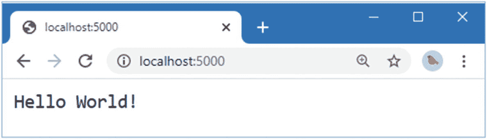
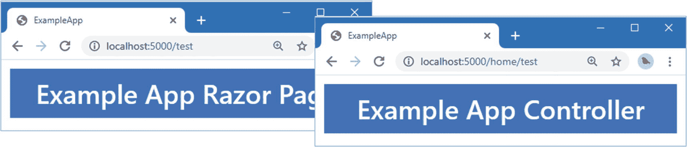

# 十三、创建示例项目

在第 1 部分中，我重点解释了如何使用标识。在这本书的这一部分，我解释了 Identity 是如何工作的，回顾了主要特征并描述了幕后发生的事情。我创建自定义用户角色存储，使用自定义用户和角色类，并实现 ASP.NET Core Identity 使用的许多接口。

在这一章中，我创建了一个简单的示例项目，将在后面的章节中使用。我用这个项目来解释 ASP.NET Core 是如何处理认证和授权的，以及 Identity 是如何建立在这些特性之上的。

## 创建项目

从 Windows 开始菜单打开一个新的 PowerShell 命令提示符，并运行清单 [13-1](#PC1) 中所示的命令。

Tip

你可以从 [`https://github.com/Apress/pro-asp.net-core-identity`](https://github.com/Apress/pro-asp.net-core-identity) 下载本章以及本书其他章节的示例项目。如果在运行示例时遇到问题，请参见第 [1](01.html) 章获取帮助。

```cs
dotnet new globaljson --sdk-version 5.0.100 --output ExampleApp
dotnet new web --no-https --output ExampleApp --framework net5.0
dotnet new sln -o ExampleApp

dotnet sln ExampleApp add ExampleApp

Listing 13-1.Creating the Project

```

打开项目进行编辑，并对`Properties`文件夹中的`launchSettings.json`文件进行清单 [13-2](#PC2) 所示的更改，以设置将用于处理 HTTP 和请求的端口。

```cs
{
  "iisSettings": {
    "windowsAuthentication": false,
    "anonymousAuthentication": true,
    "iisExpress": {
      "applicationUrl": "http://localhost:5000",
      "sslPort": 0
    }
  },
  "profiles": {
    "IIS Express": {
      "commandName": "IISExpress",
      "launchBrowser": true,
      "environmentVariables": {
        "ASPNETCORE_ENVIRONMENT": "Development"
      }
    },
    "IdentityApp": {
      "commandName": "Project",
      "dotnetRunMessages": "true",
      "launchBrowser": true,
      "applicationUrl": "http://localhost:5000",
      "environmentVariables": {
        "ASPNETCORE_ENVIRONMENT": "Development"
      }
    }
  }
}

Listing 13-2.Configuring HTTP Ports in the launchSettings.json File in the Properties Folder

```

## 安装引导 CSS 框架

使用命令提示符运行清单 [13-3](#PC3) 中的命令来初始化库管理器工具并安装引导 CSS 包，我用它来设计 HTML 内容的样式。

```cs
dotnet tool uninstall --global Microsoft.Web.LibraryManager.Cli
dotnet tool install --global Microsoft.Web.LibraryManager.Cli --version 2.1.113
libman init -p cdnjs
libman install twitter-bootstrap@4.5.0 -d wwwroot/lib/twitter-bootstrap

Listing 13-3.Installing the Client-Side CSS Package

```

## 配置 Razor 页面

创建`ExampleApp/Pages`文件夹，并在其中添加一个名为`_ViewImports.cshtml`的 Razor 视图导入文件，其内容如清单 [13-4](#PC4) 所示。

```cs
@namespace ExampleApp.Pages
@addTagHelper *, Microsoft.AspNetCore.Mvc.TagHelpers
@using Microsoft.AspNetCore.Mvc.RazorPages

Listing 13-4.The Contents of the _ViewImports.cshtml File in the Pages Folder

```

在`Pages`文件夹中添加一个名为`_ViewStart.cshtml`的 Razor 视图启动文件，内容如清单 [13-5](#PC5) 所示。

```cs
@{
    Layout = "_Layout";
}

Listing 13-5.The Contents of the _ViewStart.cshtml File in the ExampleApp/Pages Folder

```

创建`Pages/Shared`文件夹，添加一个名为`_Layout.cshtml`的 Razor 布局，内容如清单 [13-6](#PC6) 所示。

```cs
<!DOCTYPE html>

<html>
<head>
    <meta name="viewport" content="width=device-width" />
    <title>ExampleApp</title>
    <link href="/lib/twitter-bootstrap/css/bootstrap.min.css" rel="stylesheet" />
</head>
<body>
    <div>
        @RenderBody()
    </div>
</body>
</html>

Listing 13-6.The Contents of the _Layout.cshtml File in the Pages/Shared Folder

```

在`Pages`文件夹中添加一个名为`Test.cshtml`的 Razor 页面，内容如清单 [13-7](#PC7) 所示。

```cs
@page

<h4 class="bg-primary m-2 p-2 text-white text-center">
    Example App Razor Page
</h4>

Listing 13-7.The Contents of the Test.cshtml File in the Pages Folder

```

这个 Razor 页面将用于确保项目被正确配置，并且 HTML 内容使用 Bootstrap CSS 框架进行样式化。

## 配置 MVC 框架

当我需要简单和独立的东西时，我使用 Razor 页。对于更复杂的功能，我更喜欢使用 MVC 框架。创建`ExampleApp/Controllers`文件夹，并添加一个名为`HomeController.cs`的类文件，代码如清单 [13-8](#PC8) 所示。

```cs
using Microsoft.AspNetCore.Mvc;

namespace ExampleApp.Controllers {

    public class HomeController: Controller {

        public IActionResult Test() => View();
    }
}

Listing 13-8.The Contents of the HomeController.cs File in the Controllers Folder

```

`Home`控制器定义了一个名为`Test`的动作来呈现它的默认视图。创建`ExampleApp/Views`文件夹，添加一个名为`_ViewImports.cshtml`的`Razor View Imports`文件，内容如清单 [13-9](#PC9) 所示。

```cs
@addTagHelper *, Microsoft.AspNetCore.Mvc.TagHelpers

Listing 13-9.The Contents of the _ViewImports.cshtml File in the Views Folder

```

在`Views`文件夹中添加一个名为`_ViewStart.cshtml`的 Razor 视图启动文件，内容如清单 [13-10](#PC10) 所示。

```cs
@{
    Layout = "_Layout";
}

Listing 13-10.The Contents of the _ViewStart.cshtml File in the Views Folder

```

创建`Views/Home`文件夹，并在其中添加一个名为`Test.cshtml`的 Razor 视图(使用 Razor 视图 Visual Studio 中的空模板),内容如清单 [13-11](#PC11) 所示。

```cs
@model string

<h4 class="bg-primary m-2 p-2 text-white text-center">
    @(Model ?? "Example App Controller")
</h4>

Listing 13-11.The Contents of the Test.cshtml File in the Views/Home Folder

```

## 配置应用

最后一步是配置 ASP.NET Core 来启用 Razor 页面、MVC 框架和支持它们的特性。用清单 [13-12](#PC12) 中所示的代码替换`Startup.cs`文件的内容。

```cs
using Microsoft.AspNetCore.Builder;
using Microsoft.AspNetCore.Hosting;
using Microsoft.AspNetCore.Http;
using Microsoft.Extensions.DependencyInjection;

namespace ExampleApp {
    public class Startup {

        public void ConfigureServices(IServiceCollection services) {
            services.AddRazorPages();
            services.AddControllersWithViews();
        }

        public void Configure(IApplicationBuilder app, IWebHostEnvironment env) {
            app.UseDeveloperExceptionPage();
            app.UseStaticFiles();
            app.UseRouting();

            app.UseEndpoints(endpoints => {
                endpoints.MapGet("/", async context => {
                    await context.Response.WriteAsync("Hello World!");
                });
                endpoints.MapRazorPages();
                endpoints.MapDefaultControllerRoute();
            });
        }
    }
}

Listing 13-12.Configuring the Application in the Startup.cs File in the ExampleApp Folder

```

这个配置启用了 Razor Pages 和 MVC 框架，并增加了对静态文件服务的支持，这是添加到清单 [13-12](#PC12) 中的项目的 CSS 样式表所需要的，并在 HTML 内容的布局中使用。

## 测试应用

运行`ExampleApp`文件夹中清单 [13-13](#PC13) 所示的命令来启动 ASP.NET Core 并等待 HTTP 请求。

```cs
dotnet run

Listing 13-13.Starting the Application

```

打开新的浏览器窗口并请求`http://localhost:5000`；您将看到如图 [13-1](#Fig1) 所示的响应，它使用了占位符代码，这些代码是在使用清单 [13-1](#PC1) 中的命令创建项目时添加到项目中的。



图 13-1。

默认应用响应

接下来，请求`http://localhost:5000/test`和`http://localhost:5000/home/test`，这将产生如图 [13-2](#Fig2) 所示的响应，确认 Razor 页面和 MVC 框架正在工作。



图 13-2。

来自 Razor 页面和 MVC 框架的响应

## 摘要

在这一章中，我创建了在本书的这一部分中使用的示例项目。在下一章中，我将解释 ASP.NET Core 平台是如何处理认证请求的。