# 十四、使用 ASP.NET Core

本章中的示例显示了以不同方式实现的相同的简单认证和授权策略。这可能看起来有些重复，但我从一个完全定制的解决方案开始，并以一个只用几条代码语句表达的解决方案结束，每次迭代使用更少的定制代码和更多的 ASP.NET Core 提供的内置功能。

在本书的这一部分，我重新介绍了第 1 部分中也描述过的术语和概念，这样，如果您将来需要查阅某一章，就可以更容易地找到您需要的信息。

本章的目的是向您展示请求如何流经 ASP.NET Core，这为理解 Identity 如何工作提供了重要的基础，如后面章节所述。表 [14-1](#Tab1) 将自定义授权和认证的创建放在上下文中。

表 14-1。

将自定义授权和认证放在上下文中

<colgroup><col class="tcol1 align-left"> <col class="tcol2 align-left"></colgroup> 
| 

问题

 | 

回答

 |
| --- | --- |
| 这是什么？ | 自定义认证和授权直接使用请求管道来检查和评估请求。 |
| 为什么有用？ | 请求管道是 ASP.NET Core 的核心，其特性为 ASP.NET Core Identity 提供了基础。 |
| 如何使用？ | 中间件被添加到管道中，可以检查和修改请求并生成响应。您可以为应用操作的每个方面编写自定义中间件，但微软提供了内置功能，这意味着大多数项目不需要这样做。 |
| 有什么陷阱或限制吗？ | 除了理解 ASP.NET Core 如何工作之外，编写定制代码并没有什么真正的好处。 |
| 还有其他选择吗？ | 自定义认证和授权不应在实际项目中使用，因为 Microsoft 提供了现成的替代方案。 |

表 [14-2](#Tab2) 总结了本章内容。

表 14-2..

章节总结

<colgroup><col class="tcol1 align-left"> <col class="tcol2 align-left"> <col class="tcol3 align-left"></colgroup> 
| 

问题

 | 

解决办法

 | 

列表

 |
| --- | --- | --- |
| 在 ASP.NET Core 中处理请求 | 向请求管道添加中间件组件。 | [1](#PC1)–[2](#PC2) |
| 认证一项请求 | 创建一个描述用户 Identity 的`ClaimsPrincipal`对象。 | [4](#PC6)–[6](#PC14) |
| 补充关于用户的已知信息 | 添加一个中间件组件，将补充信息表示为声明。 | [7](#PC20)–[9](#PC22) |
| 确定是否应该授予请求对其目标资源的访问权限 | 评估与请求相关的声明，看它们是否符合预期的用户特征。 | [10](#PC24)–[11](#PC30) |
| 消除了每个请求都需要凭据的需要 | 创建一个中间件组件，该组件创建一个可以在后续请求中呈现的令牌，如 cookie。 | [12](#PC31)–[14](#PC33)、[18](#PC40)–[27](#PC49) |
| 定义端点中的授权策略 | 使用`Authorize`属性并创建一个`IAuthorizationHandler`接口的实现。 | [15](#PC34)–[17](#PC37) |

## 为本章做准备

本章使用在第 [13 章](13.html)中创建的`ExampleApp`项目。我在这一章中描述的大多数特性都是由 ASP.NET Core 平台提供的，而不是由 Razor Pages 或 MVC 框架提供的。为了保持专注，我禁用了除基本特性之外的所有特性，稍后再重新引入它们。

Tip

你可以从 [`https://github.com/Apress/pro-asp.net-core-identity`](https://github.com/Apress/pro-asp.net-core-identity) 下载本章以及本书其他章节的示例项目。如果在运行示例时遇到问题，请参见第 [1](01.html) 章获取帮助。

将名为`SecretEndpoint.cs`的类文件添加到`ExampleApp`文件夹中，并添加清单 [14-1](#PC1) 中所示的代码。

```cs
using Microsoft.AspNetCore.Http;
using System.Threading.Tasks;

namespace ExampleApp {

    public class SecretEndpoint {

        public static async Task Endpoint(HttpContext context) {
            await context.Response.WriteAsync("This is the secret message");
        }
    }
}

Listing 14-1.The Contents of the SecretEndpoint.cs File in the ExampleApp Folder

```

用清单 [14-2](#PC2) 中所示的代码替换`Startup.cs`文件的内容，这样只启用最基本的 ASP.NET Core 特性。

```cs
using Microsoft.AspNetCore.Builder;
using Microsoft.AspNetCore.Hosting;
using Microsoft.AspNetCore.Http;
using Microsoft.Extensions.DependencyInjection;

namespace ExampleApp {
    public class Startup {

        public void ConfigureServices(IServiceCollection services) {
        }

        public void Configure(IApplicationBuilder app, IWebHostEnvironment env) {

            app.UseRouting();

            app.UseEndpoints(endpoints => {
                endpoints.MapGet("/", async context => {
                    await context.Response.WriteAsync("Hello World!");
                });
                endpoints.MapGet("/secret", SecretEndpoint.Endpoint)
                    .WithDisplayName("secret");
            });
        }
    }
}

Listing 14-2.Configuring the Application in the Startup.cs File in the ExampleApp Folder

```

使用命令提示符运行清单 [14-3](#PC3) 中所示的命令，该命令将编译并启动项目。

```cs
dotnet run

Listing 14-3.Running the Example Project

```

一旦 ASP.NET Core HTTP 服务器启动，打开一个新的浏览器窗口并请求`http://localhost:5000`和`http://localhost:5000/secret`。您将看到如图 [14-1](#Fig1) 所示的响应。

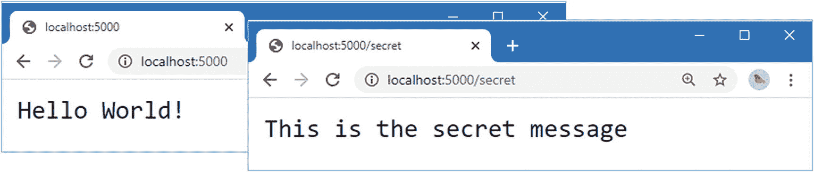

图 14-1。

运行示例项目

## 了解 ASP.NET Core 请求流程

ASP.NET Core 平台在收到 HTTP 请求时会创建三个对象:描述请求的`HttpRequest`对象、描述将返回给客户端的响应的`HttpResponse`对象，以及提供对 ASP.NET Core 特性的访问的`HttpContext`对象。

为了处理请求，ASP.NET Core 将`HttpContext`、`HttpRequest`和`HttpResponse`对象传递给它的*中间件组件*。中间件组件使用这些对象来检查或修改请求，并对响应做出贡献。中间件组件按顺序排列，称为*请求管道*，ASP.NET Core 对象按顺序传递给 ASP.NET Core 对象。一旦请求到达管道中的最后一个组件，对象就会沿着管道传递回去，直到它们返回起点，这时 ASP.NET Core 使用`HttpResponse`对象向客户端发送响应，如图 [14-2](#Fig2) 所示。

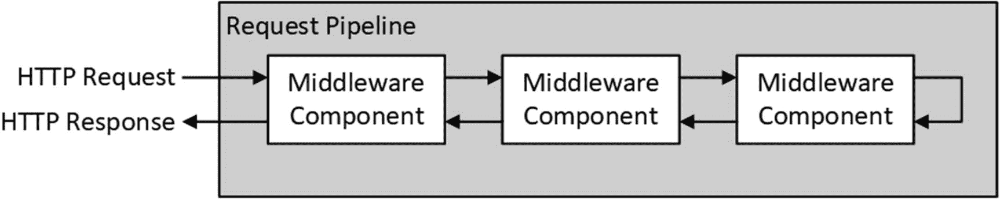

图 14-2。

ASP.NET Core 请求处理

### 了解端点路由中间件

中间件组件可以像单个功能一样简单，也可以像一个完整的框架一样复杂。清单 [14-2](#PC2) 中对`Startup`类的更改定义了一个包含两个相关中间件组件的管道。

```cs
using Microsoft.AspNetCore.Builder;
using Microsoft.AspNetCore.Hosting;
using Microsoft.AspNetCore.Http;
using Microsoft.Extensions.DependencyInjection;

namespace ExampleApp {
    public class Startup {

        public void ConfigureServices(IServiceCollection services) {
        }

        public void Configure(IApplicationBuilder app, IWebHostEnvironment env) {

            app.UseRouting();

            app.UseEndpoints(endpoints => {
                endpoints.MapGet("/", async context => {
                    await context.Response.WriteAsync("Hello World!");
                });
                endpoints.MapGet("/secret", SecretEndpoint.Endpoint)
                    .WithDisplayName("secret");
            });
        }
    }
}

```

突出显示的语句启用了*端点路由*，它将请求匹配到*端点*，端点是为特定 URL 生成响应的函数或类。`UseRouting`方法设置了一个中间件组件，该组件检查 HTTP 请求，并尝试使用由`UseEndpoints`方法指定的端点之一来匹配其 URL，该方法使用所选择的端点来产生响应。

Note

当我在清单 [14-2](#PC2) 中添加一个端点时，我使用了`WithDisplayName`方法，这是一个有用的特性，可以更容易地识别被选择来产生响应的端点。

在示例应用中有两个端点。默认端点用一条`Hello, World`消息响应对`/` URL 的请求，并在创建时被添加到项目中。另一个端点也用文本消息来响应。

```cs
...
app.UseEndpoints(endpoints => {
    endpoints.MapGet("/", async context => {
        await context.Response.WriteAsync("Hello World!");
    });
    endpoints.MapGet("/secret", SecretEndpoint.Endpoint)
        .WithDisplayName("secret");
});
...

```

在后面的例子中，我用更复杂的 ASP.NET Core 特性替换了默认端点，但是简单的文本响应就足够了。端点路由的使用产生了一个具有三个不同阶段的请求管道，如图 [14-3](#Fig3) 所示。

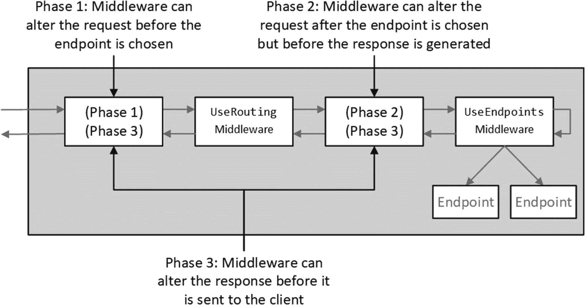

图 14-3。

端点路由对请求管道的影响

因为 HTTP 请求是沿着管道双向传递的，所以中间件可以与端点路由系统一起工作，并为向 ASP.NET Core 应用添加认证和授权提供了机会，您很快就会看到这一点。

ASP.NET Core 请求流的一个重要方面是中间件组件可以缩短管道并生成响应，而无需将请求传递给其余组件，如图 [14-4](#Fig4) 所示。

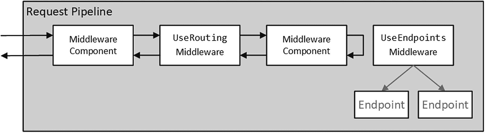

图 14-4。

使请求管道短路

### 认证和授权请求流

在认证和授权的请求流中有一个天然的契合点。向应用提供凭据可能是一个复杂的过程。在大多数 web 应用中，凭据只提供一次，并产生一个令牌，通常是一个 HTTP cookie，可以在后续请求中提供。这就是所谓的*签到*，令牌失效就是所谓的*签出*。

用户登录后，客户端将令牌包含在请求中，这允许用户被识别为请求的来源，而无需再次出示凭据，这被称为对请求进行*认证。在阶段 1 中，在请求管道中尽可能早地执行请求认证，以便后续的中间件组件可以使用或添加请求中包含的关于用户的信息。*

一旦请求认证建立了用户的 Identity，就可以在阶段 2 中使用认证中间件来控制对已被选择来产生请求的端点的访问。认证中间件有三种可能的响应:

1.  如果用户被允许访问，那么什么也不做，请求将继续沿着管道到达端点，端点将产生一个响应。

2.  如果请求未通过认证，则使用 HTTP 401 状态代码来缩短管道，这会要求用户提供凭据。这被称为*挑战*响应。

3.  如果请求通过了认证，但不允许用户访问，则使用 HTTP 403 状态代码来缩短管道。这被称为*禁止*响应。

图 [14-5](#Fig5) 显示了请求管道中的认证和授权中间件和端点。

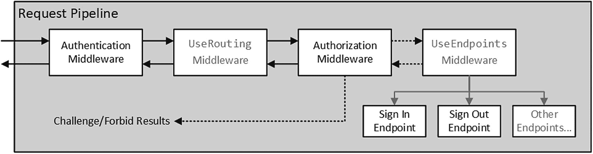

图 14-5。

请求管道中的认证和授权

在许多应用中，质询和禁止响应不仅仅是 HTTP 状态代码，而是重定向到允许认证或显示有意义的错误消息的网页。我从状态码响应开始，在本章的后面介绍 HTML 响应。

## 理解索赔

负责认证请求的中间件需要描述一个用户，这样授权中间件就可以决定是发送质询还是禁止响应。ASP.NET Core 提供了一组标准类，这些类并不特定于单一的认证方法，而是用于在整个应用中一致地描述用户。

这些类使用*基于声明的认证*，这一开始可能会令人困惑，因为它被设计为开放和灵活的，因此，可能会感觉模糊不清。用户由一个`ClaimsPrincipal`对象表示。每个用户可以有多个 Identity，用`ClaimsIdentity`对象表示。Identity 包含一条或多条关于用户的信息，每条信息由一个`Claim`表示。

创建一个`ExampleApp/Custom`文件夹，向其中添加一个名为`CustomAuthentication.cs`的类文件，并使用它来定义清单 [14-4](#PC6) 中所示的中间件组件。

```cs
using Microsoft.AspNetCore.Http;
using System.Security.Claims;
using System.Threading.Tasks;

namespace ExampleApp.Custom {

    public class CustomAuthentication {
        private RequestDelegate next;

        public CustomAuthentication(RequestDelegate requestDelegate)
                => next = requestDelegate;

        public async Task Invoke(HttpContext context) {
            string user = context.Request.Query["user"];
            if (user != null) {
                Claim claim = new Claim(ClaimTypes.Name, user);
                ClaimsIdentity ident = new ClaimsIdentity("QueryStringValue");
                ident.AddClaim(claim);
                context.User = new ClaimsPrincipal(ident);
            }
            await next(context);
        }
    }
}

Listing 14-4.The Contents of the CustomAuthentication.cs File in the Custom Folder

```

这个中间件组件将登录和认证作为一个步骤来处理，这意味着用户需要为每个请求提供他们的凭证。这通常会给用户带来不合理的负担，但是该组件做了一些只有在示例项目中才有意义的事情:它相信用户会在请求查询字符串中提供他们的用户名，如下所示:

```cs
...
string user = context.Request.Query["user"];
...

```

如果请求包含查询字符串值，它将用于对请求进行认证。

Caution

显而易见，这不是一种在真实项目中识别用户的合适方法。本书的这一部分是关于解释 ASP.NET Core 提供的功能。请参阅第 1 部分，了解项目就绪的实际工作流。

认证请求需要几个对象。声明用于描述用户的每一条可用信息，包括用户名。为此，创建了一个`Claim`对象。

```cs
...
Claim claim = new Claim(ClaimTypes.Name, user);
...

```

对象是用一个类型和一个值创建的。`ClaimTypes`类提供了一系列常量字符串值，用于指定声明类型，这表示声明所代表的信息类型。在本例中，声明包含用户名，所以我使用了`ClaimTypes.Name`属性作为类型。有许多索赔类型可用——你可以很容易地创建自己的索赔类型——但是表 [14-3](#Tab3) 列出了一些常用的`ClaimTypes`属性。

表 14-3。

常用的索赔类型

<colgroup><col class="tcol1 align-left"> <col class="tcol2 align-left"></colgroup> 
| 

名字

 | 

描述

 |
| --- | --- |
| `Name` | 此声明类型表示用户名，通常用于用户帐户名。 |
| `Role` | 这种声明类型表示一个角色，通常用于访问控制。 |
| `Email` | 此声明类型表示电子邮件地址。 |
| `GivenName` | 此声明类型表示用户的名字。 |
| `Surname` | 该声明类型表示用户的姓氏。 |

下一步是为用户创建一个 Identity，如下所示:

```cs
...
ClaimsIdentity ident = new ClaimsIdentity("QueryStringValue");
ident.AddClaim(claim);
...

```

单个声明在一个标识中被组合在一起。关于 Identity 代表什么没有明确的规则。这意味着一个用户的所有声明可以有一个 Identity，或者可能有多个 Identity 来表示多个后端系统如何识别一个用户，这取决于什么对应用最有意义。

Tip

对于大多数 web 应用来说，一个明智的方法是从一个单一的 Identity 开始，并使用它将所有用户的声明组合在一起。如果需要的话，你可以随时添加 Identity，但是大多数项目并不需要这样做。

`ClaimsIdentity`构造函数接受一个表示认证类型的字符串，在本例中，我将它设置为`QueryStringValue`。用户只有一个`Claim`对象，我使用`AddClaim`方法将它与 Identity 关联起来。

最后一步是使用标识作为参数创建一个`ClaimsPrincipal`对象，并将`ClaimsPrincipal`赋给`HttpContext`对象的`User`属性，如下所示:

```cs
...
context.User = new ClaimsPrincipal(ident);
...

```

当清单 [14-5](#PC11) 中的中间件组件处理一个请求时，它将检查查询字符串值，如果存在，则通过创建一个`ClaimsPrincipal`对象来验证请求，该对象与`HttpContext`对象一起沿着请求管道传递，以便用户声明的细节可以由其他中间件组件处理。

为了演示如何处理声明，将名为`ClaimsReporter.cs`的类文件添加到`ExampleApp/Custom`文件夹中，并使用它来定义清单 [14-5](#PC11) 中所示的中间件组件，该组件写出与请求相关联的声明。

```cs
using Microsoft.AspNetCore.Http;
using System;
using System.IO;
using System.Linq;
using System.Security.Claims;
using System.Threading.Tasks;

namespace ExampleApp.Custom {
    public class ClaimsReporter {
        private RequestDelegate next;

        public ClaimsReporter(RequestDelegate requestDelegate)
                => next = requestDelegate;

        public async Task Invoke(HttpContext context) {

            ClaimsPrincipal p = context.User;

            Console.WriteLine($"User: {p.Identity.Name}");
            Console.WriteLine($"Authenticated: {p.Identity.IsAuthenticated}");
            Console.WriteLine("Authentication Type "
                + p.Identity.AuthenticationType);

            Console.WriteLine($"Identities: {p.Identities.Count()}");
            foreach (ClaimsIdentity ident in p.Identities) {
                Console.WriteLine($"Auth type: {ident.AuthenticationType},"
                    + $" {ident.Claims.Count()} claims");
                foreach (Claim claim in ident.Claims) {
                    Console.WriteLine($"Type: {GetName(claim.Type)}, "
                        +$"Value: {claim.Value}, Issuer: {claim.Issuer}");
                }
            }
            await next(context);
        }

        private string GetName(string claimType) =>
            Path.GetFileName(new Uri(claimType).LocalPath);
    }
}

Listing 14-5.The Contents of the ClaimsReporter.cs File in the Custom Folder

```

清单 [14-5](#PC11) 中的代码看起来比实际更复杂，因为有几个模板字符串。当中间件组件收到请求时，它使用`HttpContext.User`属性获取`ClaimsPrincipal`对象，并将详细信息写到控制台。`ClaimsPrincipal`对象定义了一个`Identity`属性，该属性返回与用户相关联的第一个 Identity。`Identity`属性返回实现`IIdentity`接口的对象，该接口使用表 [14-4](#Tab4) 中描述的属性提供关于 Identity 的基本信息。

表 14-4。

Identity 属性

<colgroup><col class="tcol1 align-left"> <col class="tcol2 align-left"></colgroup> 
| 

名字

 | 

描述

 |
| --- | --- |
| `Name` | 返回 Identity 名称声明的值 |
| `IsAuthenticated` | 如果 Identity 已经过验证，则返回 true |
| `AuthenticationType` | 返回标识 Identity 及其声明的来源的字符串 |

我使用`IIdentity`属性来显示第一个 Identity 的摘要。

```cs
...
Console.WriteLine($"User: {p.Identity.Name}");
Console.WriteLine($"Authenticated: {p.Identity.IsAuthenticated}");
Console.WriteLine("Authentication Type " + p.Identity.AuthenticationType);
...

```

`ClaimsPrincipal`类还提供了对与用户相关的所有 Identity 和完整声明集的访问，并且它提供了一些方便的成员，使访问控制变得更容易，正如我在本章后面演示的那样。

```cs
...
Console.WriteLine($"Identities: {p.Identities.Count()}");
foreach (ClaimsIdentity ident in p.Identities) {
    Console.WriteLine($"Auth type: {ident.AuthenticationType},"
         + $" {ident.Claims.Count()} claims");
    foreach (Claim claim in ident.Claims) {
        Console.WriteLine($"Type: {GetName(claim.Type)}, "
            +$"Value: {claim.Value}, Issuer: {claim.Issuer}");
    }
}
...

```

清单 [14-6](#PC14) 向请求管道添加了两个新的中间件组件。

```cs
using Microsoft.AspNetCore.Builder;
using Microsoft.AspNetCore.Hosting;
using Microsoft.AspNetCore.Http;
using Microsoft.Extensions.DependencyInjection;
using ExampleApp.Custom;

namespace ExampleApp {
    public class Startup {

        public void ConfigureServices(IServiceCollection services) {
        }

        public void Configure(IApplicationBuilder app, IWebHostEnvironment env) {

            app.UseMiddleware<CustomAuthentication>();

            app.UseRouting();

            app.UseMiddleware<ClaimsReporter>();

            app.UseEndpoints(endpoints => {
                endpoints.MapGet("/", async context => {
                    await context.Response.WriteAsync("Hello World!");
                });
                endpoints.MapGet("/secret", SecretEndpoint.Endpoint)
                    .WithDisplayName("secret");
            });
        }
    }
}

Listing 14-6.Adding Middleware Components in the Startup.cs File in the ExampleApp Folder

```

重新启动 ASP.NET Core 并请求`http://localhost:5000/?user=Alice`，您将在命令提示符下看到以下消息:

```cs
...
User: Alice
Authenticated: True
Authentication Type QueryStringValue
Identities: 1
Auth type: QueryStringValue, 1 claims
Type: name, Value: Alice, Issuer: LOCAL AUTHORITY
...

```

由`IIdentity`接口提供的属性被映射到声明上，这样`IIdentity.Name`属性就可以定位我在清单 [14-6](#PC14) 中创建的声明。默认情况下，每个声明的来源是`LOCAL AUTHORITY`，表明数据来源于应用。当我在第 [23](23.html) 章向您展示如何使用第三方服务进行认证时，您将会看到来自其他来源的声明示例。

Understanding Claim Type URLS

用于创建声明的`ClaimTypes`属性的值是 URL，因此例如,`ClaimTypes.Name`属性的值是这个 URL:

```cs
http://schemas.xmlsoap.org/ws/2005/05/identity/claims/name

```

不幸的是，这个 URL 不起作用，并且很难获得对声明类型以及应该如何使用它们的明确描述。因此，应用对声明的使用不一致，并且自定义声明是自由创建的。如果您试图编写不知道它所支持的认证系统的代码，这可能会是一个问题，但在大多数 web 应用项目中，这不是一个问题，因为开发团队可以根据使用中的特定要求来定制应用。

为了显示清单 [14-6](#PC14) 中的索赔类型，我使用了。NET `Uri`和`Path`类来处理 URL，只写出 URL 路径的最后一段，就像这样:

```cs
...
private string GetName(string claimType) =>
            Path.GetFileName(new Uri(claimType).LocalPath);
...

```

在实际项目中，您通常会使用`ClaimTypes`属性名来寻找声明，这比处理繁琐的 URL 更方便，如第 1 部分所示。

如果已经使用验证类型构造函数参数创建了`ClaimsIdentity`，则`IIdentity.IsAuthenticated`属性返回`true`，如下所示:

```cs
...
ClaimsIdentity ident = new ClaimsIdentity("QueryStringValue");
...

```

不要因为`HttpContext.User`属性返回一个对象就认为请求已经通过了认证，这一点很重要。默认情况下，ASP.NET 内核为所有的`HttpContext`对象创建一个带有`ClaimsIdentity`的`ClaimsPrincipal`对象，尽管没有创建声明，也没有指定认证类型，因此`IsAuthenticated`属性返回`false`。

您可以通过请求`http://localhost:5000`来查看默认`ClaimsPrincipal`对象的详细信息，这将产生以下控制台输出:

```cs
...
User:
Authenticated: False
Authentication Type
Identities: 1
Auth type: , 0 claims
...

```

此响应表示请求尚未经过认证，并且没有可用的用户信息。

### 向请求添加索赔

一些应用可以访问关于用户的附加信息，这些信息可以表示为声明，以便其他中间件组件可以使用。这些附加信息可以添加到与请求相关联的`ClaimsPrincipal`中，或者作为添加到现有 Identity 的声明，或者作为附加 Identity。

将一个类文件添加到名为`UsersAndClaims.cs`的`ExampleApp`文件夹中，并添加清单 [14-7](#PC20) 中所示的代码。

```cs
using System;
using System.Collections.Generic;
using System.Linq;
using System.Security.Claims;

namespace ExampleApp {
    public static class UsersAndClaims {

        public static Dictionary<string, IEnumerable<string>> UserData
            = new Dictionary<string, IEnumerable<string>> {
               { "Alice", new [] { "User", "Administrator" } },
               { "Bob", new [] { "User" } },
               { "Charlie", new [] { "User"} }
            };

        public static string[] Users => UserData.Keys.ToArray();

        public static Dictionary<string, IEnumerable<Claim>> Claims =>
            UserData.ToDictionary(kvp => kvp.Key,
                kvp => kvp.Value.Select(role => new Claim(ClaimTypes.Role, role)),
                StringComparer.InvariantCultureIgnoreCase);
    }
}

Listing 14-7.The Contents of the UsersAndClaims.cs File in the ExampleApp Folder

```

接下来，将名为`RoleMemberships.cs`的类文件添加到`ExampleApp/Custom`文件夹中，并使用它来定义清单 [14-8](#PC21) 中所示的中间件组件。

```cs
using Microsoft.AspNetCore.Http;
using System.Security.Claims;
using System.Security.Principal;
using System.Threading.Tasks;

namespace ExampleApp.Custom {

    public class RoleMemberships {
        private RequestDelegate next;

        public RoleMemberships(RequestDelegate requestDelegate)
                => next = requestDelegate;

        public async Task Invoke(HttpContext context) {
            IIdentity mainIdent = context.User.Identity;
            if (mainIdent.IsAuthenticated
                    && UsersAndClaims.Claims.ContainsKey(mainIdent.Name)) {
                ClaimsIdentity ident = new ClaimsIdentity("Roles");
                ident.AddClaim(new Claim(ClaimTypes.Name, mainIdent.Name));
                ident.AddClaims(UsersAndClaims.Claims[mainIdent.Name]);
                context.User.AddIdentity(ident);
            }
            await next(context);
        }
    }
}

Listing 14-8.The Contents of the RoleMemberships.cs File in the Custom Folder

```

这个中间件组件使用清单 [14-7](#PC20) 中定义的用户名到角色的映射。当接收到针对地图中用户的认证请求时，会创建一个带有角色声明的新 Identity，表示该用户已被授予特定角色。清单 [14-9](#PC22) 将新的中间件组件添加到请求管道中。

```cs
using Microsoft.AspNetCore.Builder;
using Microsoft.AspNetCore.Hosting;
using Microsoft.AspNetCore.Http;
using Microsoft.Extensions.DependencyInjection;
using ExampleApp.Custom;

namespace ExampleApp {
    public class Startup {

        public void ConfigureServices(IServiceCollection services) {
        }

        public void Configure(IApplicationBuilder app, IWebHostEnvironment env) {

            app.UseMiddleware<CustomAuthentication>();
            app.UseMiddleware<RoleMemberships>();
            app.UseRouting();

            app.UseMiddleware<ClaimsReporter>();

            app.UseEndpoints(endpoints => {
                endpoints.MapGet("/", async context => {
                    await context.Response.WriteAsync("Hello World!");
                });
                endpoints.MapGet("/secret", SecretEndpoint.Endpoint)
                    .WithDisplayName("secret");
            });
        }
    }
}

Listing 14-9.Adding a Middleware Component in the Startup.cs File in the ExampleApp Folder

```

重启 ASP.NET Core 并请求`http://localhost:5000/?user=Alice`。写入控制台的消息显示了两个 Identity 和总共四个声明。

```cs
...
User: Alice
Authenticated: True
Authentication Type QueryStringValue
Identities: 2
Auth type: QueryStringValue, 1 claims
Type: name, Value: Alice, Issuer: LOCAL AUTHORITY
Auth type: Roles, 3 claims
Type: name, Value: Alice, Issuer: LOCAL AUTHORITY
Type: role, Value: User, Issuer: LOCAL AUTHORITY
Type: role, Value: Administrator, Issuer: LOCAL AUTHORITY
...

```

### 评估索赔

术语 *claim* 反映了这样一个事实，即 ASP.NET Core 并不验证与用户相关的数据，而只是沿着请求管道传递数据。评估声明并决定它们是否应该被信任是其他中间件组件的责任。例如，在示例应用中使用查询字符串认证是非常不安全的，因为它依赖于用户诚实地标识自己，因此应该怀疑来自该来源的声明以及基于原始声明创建的声明。

然而，最初，我将继续假设情况并非如此，并假设这些声明是可信的，可以用于访问控制，只是为了演示如何使用声明。将名为`CustomAuthorization.cs`的类文件添加到`ExampleApp/Custom`文件夹中，并使用它来定义清单 [14-10](#PC24) 中所示的中间件组件。

```cs
using Microsoft.AspNetCore.Http;
using System.Threading.Tasks;

namespace ExampleApp.Custom {

    public class CustomAuthorization {
        private RequestDelegate next;

        public CustomAuthorization(RequestDelegate requestDelegate)
                => next = requestDelegate;

        public async Task Invoke(HttpContext context) {
            if (context.GetEndpoint()?.DisplayName == "secret") {
                if (context.User.Identity.IsAuthenticated) {
                    if (context.User.IsInRole("Administrator")) {
                        await next(context);
                    } else {
                        Forbid(context);
                    }
                } else {
                    Challenge(context);
                }
            } else {
                await next(context);
            }
        }

        public void Challenge(HttpContext context)
                => context.Response.StatusCode = StatusCodes.Status401Unauthorized;

        public void Forbid(HttpContext context)
                => context.Response.StatusCode = StatusCodes.Status403Forbidden;
    }
}

Listing 14-10.The Contents of the CustomAuthorization.cs File in the Custom Folder

```

当这个中间件组件处理请求时，有四种可能的结果。如果请求不是针对受保护端点的，那么它将沿着管道转发，因为不需要授权。

```cs
...
if (context.GetEndpoint()?.DisplayName == "secret") {
...

```

我使用空条件操作符(`?`字符)，也称为*安全导航操作符*，来检查由`GetEndpoint`方法返回的对象的`DisplayName`属性，该属性使用我在清单 [14-11](#PC30) 中使用的`WithDisplayName`方法返回分配给端点的字符串。如果没有端点或者端点的显示名称不是`secret`，则不需要授权，请求可以被传递。

如果有一个端点，并且它具有正确的名称，那么我可以检查请求是否已经过认证。

```cs
...
if (context.User.Identity.IsAuthenticated) {
...

```

在这个例子中，我没有检查认证的来源。这是 web 应用中常用的方法，这些应用使用 ASP.NET Core Identity，并且只有一个可信的认证源。

如果请求已经被认证，我检查是否有对`Administrator`角色的声明。

```cs
...
if (context.User.IsInRole("Administrator")) {
...

```

`IsInRole`方法是由`ClaimsPrincipal`类定义的几个有用的方法之一，这些方法作用于所有的声明，不管它们与哪个 Identity 相关联，如表 [14-5](#Tab5) 中所述。

表 14-5。

有用的索赔原则方法

<colgroup><col class="tcol1 align-left"> <col class="tcol2 align-left"></colgroup> 
| 

名字

 | 

描述

 |
| --- | --- |
| `FindAll(type)` | 此方法定位具有指定类型的所有声明。这个方法有一个版本，它接受一个谓词函数来选择声明。 |
| `FindFirst(type)` | 此方法定位具有指定类型的第一个声明。这个方法有一个版本，它接受一个谓词函数来选择一个声明。 |
| `HasClaim(type, value)` | 如果存在具有指定类型和值的声明，此方法将返回 true。这个方法有一个版本，它接受一个谓词函数来检查声明。 |
| `IsInRole(role)` | 如果存在对指定角色的声明，则此方法返回 true。Identity 可以为角色配置不同的声明类型，但默认类型是`ClaimTypes.Role`。 |

如果存在一个`Administrator`角色声明，那么请求将沿着管道转发，以便受保护端点可以生成响应。

其余的结果使请求管道短路，并表示授权失败。当请求未被认证时，发送*挑战响应*。

```cs
...
public void Challenge(HttpContext context)
        => context.Response.StatusCode = StatusCodes.Status401Unauthorized;
...

```

当请求被认证但没有`Administrator`角色声明时，发送一个*禁止响应*。

```cs
...
public void Forbid(HttpContext context)
    => context.Response.StatusCode = StatusCodes.Status403Forbidden;
...

```

随着我改进示例应用处理认证和授权的方式，单独的`Challenge`和`Forbid`方法将有助于后面的示例更加清晰。

Understanding the 401 and 403 HTTP Status Codes

我使用 401 和 403 状态代码的方式与 ASP.NET Core 提供的内置特性相匹配，您将在后面的示例中看到这些特性。并非所有的框架和应用都以相同的方式使用这些状态代码，您经常会发现 401 HTTP 状态代码既用于质询，也用于禁止响应。

当发送 401 响应时，HTTP 规范要求使用`WWW-Authenticate`头，它告诉客户端应该如何认证用户。我没有设置这个头，部分是为了简单，部分是因为应用没有以标准的方式验证用户。

清单 [14-11](#PC30) 将授权中间件添加到请求管道中。

```cs
using Microsoft.AspNetCore.Builder;
using Microsoft.AspNetCore.Hosting;
using Microsoft.AspNetCore.Http;
using Microsoft.Extensions.DependencyInjection;
using ExampleApp.Custom;

namespace ExampleApp {
    public class Startup {

        public void ConfigureServices(IServiceCollection services) {
        }

        public void Configure(IApplicationBuilder app, IWebHostEnvironment env) {

            app.UseMiddleware<CustomAuthentication>();
            app.UseMiddleware<RoleMemberships>();
            app.UseRouting();

            app.UseMiddleware<ClaimsReporter>();
            app.UseMiddleware<CustomAuthorization>();

            app.UseEndpoints(endpoints => {
                endpoints.MapGet("/", async context => {
                    await context.Response.WriteAsync("Hello World!");
                });
                endpoints.MapGet("/secret", SecretEndpoint.Endpoint)
                    .WithDisplayName("secret");
            });
        }
    }
}

Listing 14-11.Adding Middleware in the Startup.cs File in the ExampleApp Folder

```

重启 ASP.NET Core 并请求`http://localhost:5000/secret?user=alice`。定制中间件组件将验证请求并添加一个`Administrator`角色声明，这将允许请求被授权。

请求`http://localhost:5000/secret?user=bob`，您将收到一个禁止的响应，因为该请求已经过认证，但是没有所需的角色声明。请求`http://localhost:5000/secret`，您将收到挑战响应，因为该请求没有经过认证。图 [14-6](#Fig6) 显示了所有三种响应。

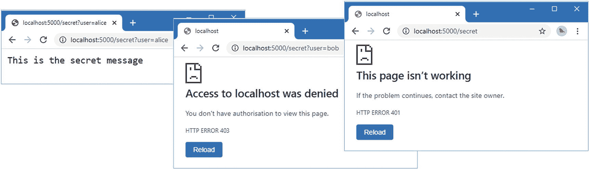

图 14-6。

使用定制中间件

## 改进认证和授权

示例应用具有有效的认证和授权，但是使用起来很笨拙。在接下来的小节中，我将改进实现并利用 ASP.NET Core 提供的更多特性。

### 登录和退出应用

即使在我的初级系统中，通过查询字符串为每个请求提供凭证也很笨拙。在大多数项目中，有一个端点允许用户登录到应用并接收一个令牌作为回报。这个令牌通常是一个 HTTP cookie，包含在后续的 HTTP 请求中，用于对请求进行认证。另一个端点允许用户通过使令牌无效来注销，以便不能再次使用它。

为了允许用户登录和退出示例应用，将名为`CustomSignInAndSignOut.cs`的类添加到`ExampleApp/Custom`文件夹中，并添加清单 [14-12](#PC31) 中所示的代码。

```cs
using Microsoft.AspNetCore.Http;
using System.Threading.Tasks;

namespace ExampleApp.Custom {
    public class CustomSignInAndSignOut {

        public static async Task SignIn(HttpContext context) {
            string user = context.Request.Query["user"];
            if (user != null) {
                context.Response.Cookies.Append("authUser", user);
                await context.Response
                    .WriteAsync($"Authenticated user: {user}");
            } else {
                context.Response.StatusCode = StatusCodes.Status401Unauthorized;
            }
        }

        public static async Task SignOut(HttpContext context) {
            context.Response.Cookies.Delete("authUser");
            await context.Response.WriteAsync("Signed out");
        }
    }
}

Listing 14-12.The Contents of the CustomSignInandSignOut.cs File in the Custom Folder

```

`SignIn`方法将是一个端点，它从查询字符串中获取用户名，并将一个 cookie 添加到包含该名称的响应中，然后客户端将在后续请求中包含该名称。这并不比以前的例子更安全，因为它仍然信任用户诚实地标识自己，但是它更方便、更容易使用。

清单 [14-12](#PC31) 中的`SignOut`方法也将被用作端点。此方法会删除 cookie，因此后续请求无法通过认证。清单 [14-13](#PC32) 将`SignIn`和`SignOut`方法注册为请求管道中的端点。

```cs
using Microsoft.AspNetCore.Builder;
using Microsoft.AspNetCore.Hosting;
using Microsoft.AspNetCore.Http;
using Microsoft.Extensions.DependencyInjection;
using ExampleApp.Custom;

namespace ExampleApp {
    public class Startup {

        public void ConfigureServices(IServiceCollection services) {
        }

        public void Configure(IApplicationBuilder app, IWebHostEnvironment env) {

            app.UseMiddleware<CustomAuthentication>();
            app.UseMiddleware<RoleMemberships>();
            app.UseRouting();

            app.UseMiddleware<ClaimsReporter>();
            app.UseMiddleware<CustomAuthorization>();

            app.UseEndpoints(endpoints => {
                endpoints.MapGet("/", async context => {
                    await context.Response.WriteAsync("Hello World!");
                });
                endpoints.MapGet("/secret", SecretEndpoint.Endpoint)
                    .WithDisplayName("secret");
                endpoints.Map("/signin", CustomSignInAndSignOut.SignIn);
                endpoints.Map("/signout", CustomSignInAndSignOut.SignOut);
            });
        }
    }
}

Listing 14-13.Adding Endpoints in the Startup.cs File in the ExampleApp Folder

```

清单 [14-14](#PC33) 显示了对定制认证代码的更改，使用 cookies 而不是查询字符串来认证请求。

```cs
using Microsoft.AspNetCore.Http;
using System.Security.Claims;
using System.Threading.Tasks;

namespace ExampleApp.Custom {

    public class CustomAuthentication {
        private RequestDelegate next;

        public CustomAuthentication(RequestDelegate requestDelegate)
                => next = requestDelegate;

        public async Task Invoke(HttpContext context) {
            //string user = context.Request.Query["user"];
            string user = context.Request.Cookies["authUser"];
            if (user != null) {
                Claim claim = new Claim(ClaimTypes.Name, user);
                ClaimsIdentity ident = new ClaimsIdentity("QueryStringValue");
                ident.AddClaim(claim);
                context.User = new ClaimsPrincipal(ident);
            }
            await next(context);
        }
    }
}

Listing 14-14.Using Cookies for Authentication in the CustomAuthentication.cs File in the Custom Folder

```

重启 ASP.NET Core，请求`http://localhost:5000/signin?user=alice`以爱丽丝的 Identity 登录。登录后，请求`http://localhost:5000/secret`，您的请求将被认证授权，如图 [14-7](#Fig7) 所示。

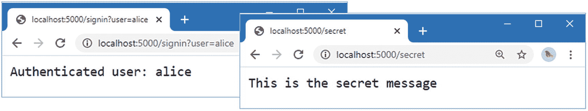

图 14-7。

登录到应用

接下来，请求`http://localhost:5000/signin?user=bob`，然后请求`http://localhost:5000/secret`，这将产生一个禁止的结果，因为该请求没有所需的角色声明。最后，请求`http://localhost:5000/signout`和请求`http://localhost:5000/secret`，这将产生挑战结果，因为请求不包含认证所需的 cookie。图 [14-8](#Fig8) 显示了禁止和挑战响应。您将能够在命令提示符下显示的消息中看到与所有这些请求相关联的 Identity 和声明的详细信息。

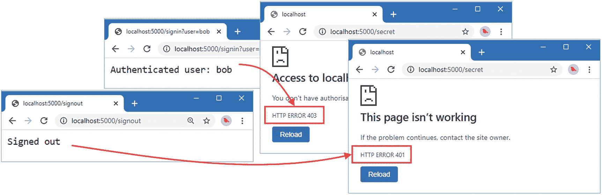

图 14-8。

禁止和挑战响应

### 在端点中定义授权策略

到目前为止，本章中的示例已经利用了 ASP.NET Core 管道，使用中间件对请求进行认证和授权。这使我能够详细描述不同的组件，但这导致我将授权策略硬编码到一个中间件组件中，这对于实际项目来说不是一种灵活的方法。

ASP.NET Core 提供内置中间件，允许通过将属性应用于端点来定义授权策略。在清单 [14-15](#PC34) 中，我向受保护端点应用了一个属性来描述其访问控制限制。

```cs
using Microsoft.AspNetCore.Http;
using System.Threading.Tasks;

using Microsoft.AspNetCore.Authorization;

namespace ExampleApp {

    public class SecretEndpoint {

        [Authorize(Roles = "Administrator")]
        public static async Task Endpoint(HttpContext context) {
            await context.Response.WriteAsync("This is the secret message");
        }
    }
}

Listing 14-15.Applying an Attribute in the SecretEndpoint.cs File in the ExampleApp Folder

```

如果您已经对 Razor 页面或 MVC 框架动作方法应用了访问控制，那么您将会熟悉`Authorize`属性。正如我在这里所做的那样，`Authorize`属性可以直接应用于端点，而`Roles`参数指定了授权所需的角色声明。我在第 15 章[中描述了`Authorize`属性提供的其他特性。](15.html)

#### 实现认证处理程序接口

ASP.NET Core 支持一组接口，这些接口使用内置中间件组件提供的功能。在这一节中，我将实现`IAuthorizationHandler`接口，它允许我添加一个定制的认证方案，该方案将与我在清单 [14-15](#PC34) 中应用的`Authorize`属性一起工作。将名为`AuthHandler.cs`的类添加到`ExampleApp/Custom`文件夹中，并使用它来定义清单 [14-16](#PC35) 中所示的类。

```cs
using Microsoft.AspNetCore.Authentication;
using Microsoft.AspNetCore.Http;
using System.Security.Claims;
using System.Threading.Tasks;

namespace ExampleApp.Custom {
    public class AuthHandler : IAuthenticationHandler {
        private HttpContext context;
        private AuthenticationScheme scheme;

        public Task InitializeAsync(AuthenticationScheme authScheme,
                HttpContext httpContext) {
            context = httpContext;
            scheme = authScheme;
            return Task.CompletedTask;
        }

        public Task<AuthenticateResult> AuthenticateAsync() {
            AuthenticateResult result;
            string user = context.Request.Cookies["authUser"];
            if (user != null) {
                Claim claim = new Claim(ClaimTypes.Name, user);
                ClaimsIdentity ident = new ClaimsIdentity(scheme.Name);
                ident.AddClaim(claim);
                result = AuthenticateResult.Success(
                    new AuthenticationTicket(new ClaimsPrincipal(ident),
                        scheme.Name));
            } else {
                result = AuthenticateResult.NoResult();
            }
            return Task.FromResult(result);
        }

        public Task ChallengeAsync(AuthenticationProperties properties) {
            context.Response.StatusCode = StatusCodes.Status401Unauthorized;
            return Task.CompletedTask;
        }

        public Task ForbidAsync(AuthenticationProperties properties) {
            context.Response.StatusCode = StatusCodes.Status403Forbidden;
            return Task.CompletedTask;
        }
    }
}

Listing 14-16.The Contents of the AuthHandler.cs File in the Custom Folder

```

调用`InitializeAsync`方法来准备处理程序对请求进行认证，为其提供认证方案的名称和提供对请求和响应对象的访问的`HttpContext`对象。该方案可由提供多种认证技术的类使用，但仅用于在配置授权时获取赋予认证处理程序的名称，如下所示。

调用`AuthenticateAsync`方法来验证请求，这是通过返回一个`AuthenticateResult`对象来完成的。`AuthenticateResult`类定义了静态方法，这些方法产生代表不同认证结果的对象，如表 [14-6](#Tab6) 所述。

Note

由`IAuthenticationHandler`接口定义的方法是异步的。我不需要为清单 [14-16](#PC35) 中的简单认证执行异步操作，这就是为什么用`Task.FromResult`或`Task.CompletedTask`产生方法结果的原因。

表 14-6。

由 AuthenticateResult 类定义的静态方法

<colgroup><col class="tcol1 align-left"> <col class="tcol2 align-left"></colgroup> 
| 

名字

 | 

描述

 |
| --- | --- |
| `Success(ticket)` | 此方法创建一个指示认证成功的结果。 |
| `Fail(message)` | 此方法创建一个指示认证失败的结果。 |
| `NoResult()` | 此方法创建一个结果，指示没有为此请求执行任何认证。对于示例应用，这意味着请求不包含名为`authUser`的 cookie。 |

`Success`方法的参数是一个`AuthenticationTicket`对象，它描述了经过认证的用户和所使用的认证方案的名称:

```cs
...
result = AuthenticateResult.Success(new AuthenticationTicket(
    new ClaimsPrincipal(ident), scheme.Name));
...

```

注意，清单 [14-16](#PC35) 中没有任何代码将用户声明与用`Authorize`属性定义的策略进行比较。当授权失败时，内置的 ASP.NET Core 中间件会自动调用`ChallengeAsync`或`ForbidAsync`方法。

#### 配置请求管道

在清单 [14-17](#PC37) 中，我更改了请求管道的配置，删除了我之前创建的定制认证和授权中间件，并启用了 ASP.NET Core 提供的内置中间件。

```cs
using Microsoft.AspNetCore.Builder;
using Microsoft.AspNetCore.Hosting;
using Microsoft.AspNetCore.Http;
using Microsoft.Extensions.DependencyInjection;
using ExampleApp.Custom;

namespace ExampleApp {
    public class Startup {

        public void ConfigureServices(IServiceCollection services) {
            services.AddAuthentication(opts => {
                opts.AddScheme<AuthHandler>("qsv", "QueryStringValue");
                opts.DefaultScheme = "qsv";
            });
            services.AddAuthorization();
        }

        public void Configure(IApplicationBuilder app, IWebHostEnvironment env) {

            //app.UseMiddleware<CustomAuthentication>();
            app.UseAuthentication();
            app.UseMiddleware<RoleMemberships>();
            app.UseRouting();

            app.UseMiddleware<ClaimsReporter>();
            //app.UseMiddleware<CustomAuthorization>();
            app.UseAuthorization();

            app.UseEndpoints(endpoints => {
                endpoints.MapGet("/", async context => {
                    await context.Response.WriteAsync("Hello World!");
                });
                endpoints.MapGet("/secret", SecretEndpoint.Endpoint)
                    .WithDisplayName("secret");
                endpoints.Map("/signin", CustomSignInAndSignOut.SignIn);
                endpoints.Map("/signout", CustomSignInAndSignOut.SignOut);

            });
        }
    }
}

Listing 14-17.Configuring the Pipeline in the Startup.cs File in the ExampleApp Folder

```

使用`AddAuthentication`和`AddAuthorization`方法在`ConfigureServices`方法中启用了两组服务。`AddAuthentication`方法使用选项模式来注册`IAuthenticationHandler`接口的实现，并将其用作默认实现。

```cs
...
services.AddAuthentication(opts => {
    opts.AddScheme<AuthHandler>("qsv", "QueryStringValue");
    opts.DefaultScheme = "qsv";
});
...

```

`AddScheme`方法定义了一个泛型类型参数，它指定了`IAuthenticationHandler`实现类和常规参数，这些参数指定了认证方案的名称和方案的显示名称，我已经将它们设置为`qsv`和`QueryStringValue`。(当您在同一个应用中使用多个认证方案时，它们的名称更为重要。)属性`DefaultScheme`用于配置默认的认证方案，我已经指定了用`AddScheme`方法注册该方案时给它起的名字。

除了服务之外，还需要两个方法调用来配置内置中间件。`UseAuthentication`方法使用在`ConfigureServices`方法中配置的方案来认证请求，而`UseAuthorization`方法使用`Authorize`属性来实施访问控制。

重启 ASP.NET 内核，请求`http://localhost:5000/signin?user=alice`，然后请求`http://localhost:5000/secret`测试新代码。视觉上没有变化，如图 [14-9](#Fig9) 所示，但是授权现在使用标准属性表示，并使用内置中间件应用。

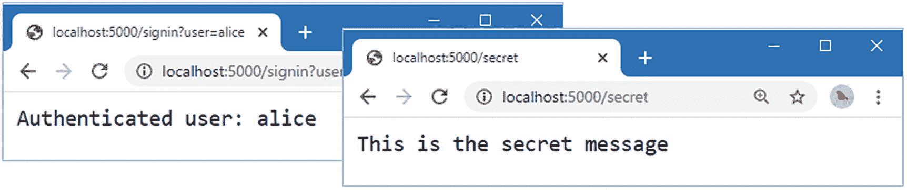

图 14-9。

使用内置中间件

用于表示用户及其声明的对象没有变化。这意味着我可以将我的`RoleMemberships`中间件留在管道中，为应用提供角色声明。`ClaimsReporter`中间件也仍在管道中，在以 Alice Identity 登录后请求受保护端点时，它将产生以下输出:

```cs
User: alice
Authenticated: True
Authentication Type qsv
Identities: 2
Auth type: qsv, 1 claims
Type: name, Value: alice, Issuer: LOCAL AUTHORITY
Auth type: Roles, 3 claims
Type: name, Value: alice, Issuer: LOCAL AUTHORITY
Type: role, Value: User, Issuer: LOCAL AUTHORITY
Type: role, Value: Administrator, Issuer: LOCAL AUTHORITY

```

### 移动登录和注销代码

我最初方法的一个缺点是，处理用户登录和退出请求的端点是认证实现的一部分，这使得很难使用不同的认证方案。为了解决这个问题，ASP.NET Core 认证中间件支持`IAuthenticationSignInHandler`接口，该接口用让用户登录应用的方法扩展了`IAuthenticationHandler`接口。清单 [14-18](#PC40) 更新了处理程序来实现新的接口，并将所有的认证码合并成一个类

```cs
using Microsoft.AspNetCore.Authentication;
using Microsoft.AspNetCore.Http;
using System.Security.Claims;
using System.Threading.Tasks;

namespace ExampleApp.Custom {
    public class AuthHandler : IAuthenticationSignInHandler {
        private HttpContext context;
        private AuthenticationScheme scheme;

        public Task InitializeAsync(AuthenticationScheme authScheme,
                HttpContext httpContext) {
            context = httpContext;
            scheme = authScheme;
            return Task.CompletedTask;
        }

        // ...other methods omitted for brevity...

        public Task SignInAsync(ClaimsPrincipal user,
                AuthenticationProperties properties) {
            context.Response.Cookies.Append("authUser", user.Identity.Name);
            return Task.CompletedTask;
        }

        public Task SignOutAsync(AuthenticationProperties properties) {
            context.Response.Cookies.Delete("authUser");
            return Task.CompletedTask;
        }
    }
}

Listing 14-18.Consolidating Code in the AuthHandler.cs File in the Custom Folder

```

`SignInAsync`和`SignOutAsync`方法添加和删除`AuthenticateAsync`方法用来验证请求的 cookie。整合认证代码意味着端点不再直接使用 cookie，并可以要求 ASP.NET Core 使用`HttpContext`类的扩展方法让用户登录或退出，如清单 [14-19](#PC41) 所示。

```cs
using Microsoft.AspNetCore.Authentication;
using Microsoft.AspNetCore.Http;
using System.Threading.Tasks;
using System.Security.Claims;

namespace ExampleApp.Custom {
    public class CustomSignInAndSignOut {

        public static async Task SignIn(HttpContext context) {
            string user = context.Request.Query["user"];
            if (user != null) {
                Claim claim = new Claim(ClaimTypes.Name, user);
                ClaimsIdentity ident = new ClaimsIdentity("qsv");
                ident.AddClaim(claim);
                await context.SignInAsync(new ClaimsPrincipal(ident));
                await context.Response
                    .WriteAsync($"Authenticated user: {user}");
            } else {
                await context.ChallengeAsync();
            }
        }

        public static async Task SignOut(HttpContext context) {
            await context.SignOutAsync();
            await context.Response.WriteAsync("Signed out");
        }
    }
}

Listing 14-19.Signing In and Out in the CustomSignInAndSignOut.cs File in the Custom Folder

```

ASP.NET Core 提供了一组扩展方法，这些方法提供了对签名和认证特性的间接访问，如表 [14-7](#Tab7) 中所述。

表 14-7。

用于访问认证处理程序的 HttpContext 扩展方法

<colgroup><col class="tcol1 align-left"> <col class="tcol2 align-left"></colgroup> 
| 

名字

 | 

描述

 |
| --- | --- |
| `AuthenticateAsync()AuthenticateAsync(scheme)` | 此方法验证请求。如果没有提供参数，将使用默认方案。 |
| `SignInAsync(principal)SignInAsync(principal, scheme)` | 该方法将用户登录到应用中。如果没有指定，则使用默认方案。 |
| `SignOutAsync()  SignOutAsync(scheme)` | 此方法将用户从应用中注销。如果没有指定，则使用默认方案。 |
| `ChallengeAsync()ChallengeAsync(scheme)` | 此方法发送质询响应。如果没有指定，则使用默认方案。 |
| `ForbidAsync()ForbidAsync(scheme)` | 此方法发送禁止的响应。如果没有指定，则使用默认方案。 |

这些方法使用在`Startup`类中设置的认证处理程序，而不需要知道将使用哪个处理程序，从而允许编写不依赖于特定`IAuthenticationHandler`实现的代码。使用这些方法意味着清单 [14-19](#PC41) 中的代码负责处理用户的凭证——在本例中只是一个查询字符串值——而无需担心将用于验证后续请求的令牌。

重启 ASP.NET 内核，请求`http://localhost:5000/signin?user=alice`，然后请求`http://localhost:5000/secret`测试新代码。视觉上没有变化，您将看到如图 [14-9](#Fig9) 所示的结果。但是，让 Alice 登录应用的代码不再直接处理用于对受保护端点的请求进行认证的 cookie。其效果是用户凭证的验证已经从创建 cookie 并使用它来验证请求的方案中分离出来，如图 [14-10](#Fig10) 所示。

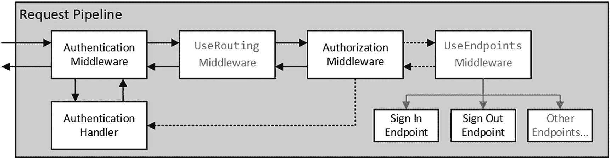

图 14-10。

将登录与认证分开

### 使用 HTML 响应

到目前为止，本章中的所有响应都是纯文本或者只是 HTTP 状态代码，这有助于关注认证和授权过程，但不是大多数 web 应用所需要的。对我的示例的下一个改进是添加一个 HTML 响应，并为登录和退出应用提供一个更加用户友好的机制。

我将对 HTML 端点使用 Razor 页面，尽管 MVC 控制器和视图也同样适用。在`Pages`文件夹中添加一个名为`SignIn.cshtml`的 Razor 页面，内容如清单 [14-20](#PC42) 所示。

```cs
@page "{code:int?}"
@model ExampleApp.Pages.SignInModel
@using Microsoft.AspNetCore.Http

@if (Model.Code == StatusCodes.Status401Unauthorized) {
    <h3 class="bg-warning text-white text-center p-2">
        401 - Challenge Response
    </h3>
} else if (Model.Code == StatusCodes.Status403Forbidden) {
    <h3 class="bg-danger text-white text-center p-2">
        403 - Forbidden Response
    </h3>
}
<h4 class="bg-info text-white m-2 p-2">
    Current User: @Model.Username
</h4>

<div class="m-2">
    <form method="post">
        <div class="form-group">
            <label>User</label>
            <select class="form-control"
                    asp-for="Username" asp-items="@Model.Users">
            </select>
        </div>
        <button class="btn btn-info" type="submit">Sign In</button>
    </form>
</div>

Listing 14-20.The Contents of the SignIn.cshtml File in the Pages Folder

```

这个 Razor 页面将作为登录页面以及挑战和禁止响应。用户将能够从 Identity 列表中选择并登录，这是一种比前面示例中使用的查询字符串更方便的方法。(然而，它并不更安全，但是在后面的章节中，当我描述 ASP.NET Core Identity 提供的登录特性时，我将向您展示如何处理真实凭证。)为了定义 Razor 页面的页面模型，将清单 [14-21](#PC43) 中所示的代码添加到`Pages`文件夹中的`SignIn.cshtml.cs`文件中。如果您使用的是 Visual Studio 代码，则必须创建该文件。

```cs
using Microsoft.AspNetCore.Authentication;
using Microsoft.AspNetCore.Http;
using Microsoft.AspNetCore.Mvc;
using Microsoft.AspNetCore.Mvc.RazorPages;
using Microsoft.AspNetCore.Mvc.Rendering;
using System.Security.Claims;
using System.Threading.Tasks;

namespace ExampleApp.Pages {
    public class SignInModel : PageModel {

        public SelectList Users => new SelectList(UsersAndClaims.Users,
            User.Identity.Name);

        public string Username { get; set; }

        public int? Code { get; set; }

        public void OnGet(int? code) {
            Code = code;
            Username = User.Identity.Name ?? "(No Signed In User)";
        }

        public async Task<ActionResult> OnPost(string username) {
            Claim claim = new Claim(ClaimTypes.Name, username);
            ClaimsIdentity ident = new ClaimsIdentity("simpleform");
            ident.AddClaim(claim);
            await HttpContext.SignInAsync(new ClaimsPrincipal(ident));
            return Redirect("/signin");
        }
    }
}

Listing 14-21.The Contents of the SignIn.cshtml.cs File in the Pages Folder

```

为了让用户退出应用，在`Pages`文件夹中添加一个名为`SignOut.cshtml`的 Razor 页面，内容如清单 [14-22](#PC44) 所示。

```cs
@page
@model ExampleApp.Pages.SignOutModel

<h4 class="bg-info text-white m-2 p-2">
    Current User: @Model.Username
</h4>
<div class="m-2">
    <form method="post" >
        <button class="btn btn-info" type="submit">Sign Out</button>
    </form>
</div>

Listing 14-22.The Contents of the SignOut.cshtml File in the Pages Folder

```

当用户提交表单时，他们将从应用中注销，这将删除用于请求认证的 cookie。为了定义 Razor 页面的页面模型，将清单 [14-23](#PC45) 中所示的代码添加到`Pages`文件夹中的`SignOut.cshtml.cs`文件中。如果您使用的是 Visual Studio 代码，则必须创建该文件。

```cs
using Microsoft.AspNetCore.Authentication;
using Microsoft.AspNetCore.Mvc;
using Microsoft.AspNetCore.Mvc.RazorPages;
using System.Threading.Tasks;

namespace ExampleApp.Pages {
    public class SignOutModel : PageModel {
        public string Username { get; set; }

        public void OnGet() {
            Username = User.Identity.Name ?? "(No Signed In User)";
        }

        public async Task<ActionResult> OnPost() {
            await HttpContext.SignOutAsync();
            return RedirectToPage("SignIn");
        }
    }
}

Listing 14-23.The Contents of the SignOut.cshtml.cs File in the Pages Folder

```

当页面收到 HTTP POST 请求时，用户通过`SignoutAsync`扩展方法被注销，浏览器被重定向到`SignIn`页面。

在清单 [14-24](#PC46) 中，我更新了认证处理程序，将用户重定向到`SignIn`页面，而不是发送质询和禁止响应的 HTTP 状态代码。

```cs
using Microsoft.AspNetCore.Authentication;
using Microsoft.AspNetCore.Http;
using System.Security.Claims;
using System.Threading.Tasks;

namespace ExampleApp.Custom {
    public class AuthHandler : IAuthenticationSignInHandler {
        private HttpContext context;
        private AuthenticationScheme scheme;

        // ...other methods omitted for brevity...

        public Task ChallengeAsync(AuthenticationProperties properties) {
            //context.Response.StatusCode = StatusCodes.Status401Unauthorized;
            context.Response.Redirect("/signin/401");
            return Task.CompletedTask;
        }

        public Task ForbidAsync(AuthenticationProperties properties) {
            //context.Response.StatusCode = StatusCodes.Status403Forbidden;
            context.Response.Redirect("/signin/403");
            return Task.CompletedTask;
        }

        // ...other methods omitted for brevity...
    }
}

Listing 14-24.Changing Responses in the AuthHandler.cs File in the Custom Folder

```

在清单 [14-25](#PC47) 中，我启用了 Razor 页面所需的服务和中间件，并从引导包中提供静态 CSS 文件。

```cs
using Microsoft.AspNetCore.Builder;
using Microsoft.AspNetCore.Hosting;
using Microsoft.AspNetCore.Http;
using Microsoft.Extensions.DependencyInjection;
using ExampleApp.Custom;

namespace ExampleApp {
    public class Startup {

        public void ConfigureServices(IServiceCollection services) {
            services.AddAuthentication(opts => {
                opts.AddScheme<AuthHandler>("qsv", "QueryStringValue");
                opts.DefaultScheme = "qsv";
            });
            services.AddAuthorization();
            services.AddRazorPages();
        }

        public void Configure(IApplicationBuilder app, IWebHostEnvironment env) {

            app.UseStaticFiles();
            //app.UseMiddleware<CustomAuthentication>();
            app.UseAuthentication();
            app.UseMiddleware<RoleMemberships>();
            app.UseRouting();

            app.UseMiddleware<ClaimsReporter>();
            //app.UseMiddleware<CustomAuthorization>();
            app.UseAuthorization();

            app.UseEndpoints(endpoints => {
                endpoints.MapGet("/", async context => {
                    await context.Response.WriteAsync("Hello World!");
                });
                endpoints.MapGet("/secret", SecretEndpoint.Endpoint)
                    .WithDisplayName("secret");
                //endpoints.Map("/signin", CustomSignInAndSignOut.SignIn);
                //endpoints.Map("/signout", CustomSignInAndSignOut.SignOut);
                endpoints.MapRazorPages();
            });
        }
    }
}

Listing 14-25.Configuring Razor Pages in the Startup.cs File in the ExampleApp Folder

```

重启 ASP.NET Core，请求`http://localhost:5000/signin`，以爱丽丝的 Identity 登录。(您可能会发现您已经通过了先前示例中的 cookie 的认证，但是一旦您再次登录，该 cookie 将被替换。)

请求`http://localhost:5000/secret`，您将被授权访问受保护的端点。以 Bob 的 Identity 或者不登录应用重复该过程，浏览器将被重定向到`SignIn`页面，如图 [14-11](#Fig11) 所示。

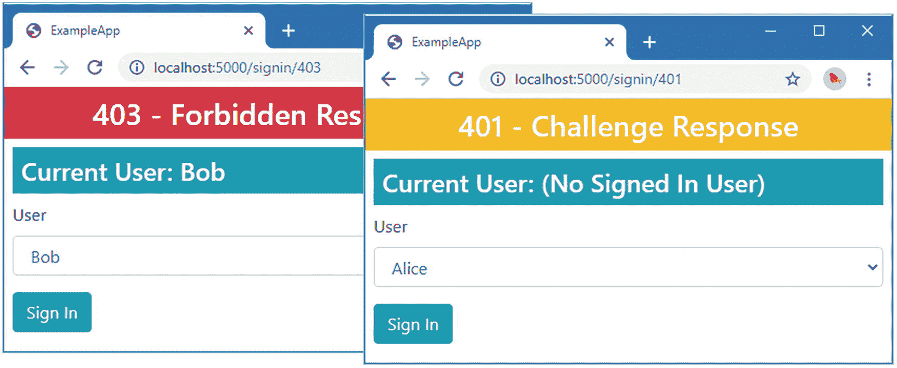

图 14-11。

生成 HTML 响应

### 使用内置的 Cookie 认证处理程序

创建自定义认证处理程序对本章很有用，但是处理访问控制的一个关键目标是编写尽可能少的自定义代码。实现`IAuthenticationSignInHandler`接口的一个结果是，验证用户凭证的代码与让用户登录应用和验证请求的代码完全分离。因此，为了完成这一章，我将把我自己定制的基于 cookie 的认证处理程序替换为微软随 ASP.NET Core 提供的处理程序。Microsoft handler 不仅已经过全面测试，而且还能更好地管理 cookies，更加灵活和可配置。在清单 [14-26](#PC48) 中，我已经更改了应用服务的配置，以使用内置的 cookie 认证处理程序。

```cs
using Microsoft.AspNetCore.Builder;
using Microsoft.AspNetCore.Hosting;
using Microsoft.AspNetCore.Http;
using Microsoft.Extensions.DependencyInjection;
using ExampleApp.Custom;
using Microsoft.AspNetCore.Authentication.Cookies;

namespace ExampleApp {
    public class Startup {

        public void ConfigureServices(IServiceCollection services) {
            services.AddAuthentication(opts => {
                opts.DefaultScheme
                    = CookieAuthenticationDefaults.AuthenticationScheme;
            }).AddCookie(opts => {
                opts.LoginPath = "/signin";
                opts.AccessDeniedPath = "/signin/403";
            });
            services.AddAuthorization();
            services.AddRazorPages();
        }

        public void Configure(IApplicationBuilder app, IWebHostEnvironment env) {
            // ...statements omitted for brevity...
        }
    }
}

Listing 14-26.Using a Built-In Authentication Handler in the Startup.cs File in the ExampleApp Folder

```

我已经将`DefaultScheme`选项设置为由`CookieAuthenticationDefaults`类定义的`AuthenticationScheme`常量，它提供了 cookie 处理程序的名称。`AddCookie`扩展方法设置了内置的 cookie 认证处理程序，它是使用 options 模式配置的，该模式应用于`CookieAuthenticationOptions`类。

Note

使用内置 cookie 认证处理程序的一个主要好处是，它将用户的声明序列化为用于认证的加密 cookie，或者，如果有可用的 cookie，将声明存储在 ASP.NET Core 会话数据存储中。后面章节中的例子，如第 [20](20.html) 章，使用 cookie 认证处理程序的多个实例来存储复杂登录和认证场景的不同方面的 cookie。

`CookieAuthenticationOptions`类定义了管理认证 cookie 的属性，表 [14-8](#Tab8) 中描述了其中最有用的属性。

表 14-8。

有用的 CookieAuthenticationOptions 属性

<colgroup><col class="tcol1 align-left"> <col class="tcol2 align-left"></colgroup> 
| 

名字

 | 

描述

 |
| --- | --- |
| `AccessDeniedPath` | 此属性定义禁止响应的客户端将被定向到的 URL 路径。默认值为`/Account/AccessDenied`。 |
| `LoginPath` | 此属性定义客户端将被定向到质询响应的 URL 路径。默认值为`/Account/Login`。 |
| `ReturnUrlParameter` | 此属性定义查询字符串参数的名称，该参数将用于存储质询响应前请求的路径，并可用于在成功登录后重定向客户端。默认值为`returnUrl`。 |
| `ExpireTimeSpan` | 该属性定义认证 cookie 的生命周期。默认值为 14 天。 |
| `SlidingExpiration` | 此属性用于控制是否使用新的到期日期自动重新发布认证 cookie。默认值为`true`。 |

对于这一章，我已经将`LoginPath`和`AccessDeniedPath`设置为将由`SignIn` Razor 页面处理的 URL。

虽然我没有在清单 [14-26](#PC48) 中设置`ReturnUrlParameter`选项，但是我可以使用该特性使登录过程更加流畅，如清单 [14-27](#PC49) 所示。

```cs
using Microsoft.AspNetCore.Authentication;
using Microsoft.AspNetCore.Http;
using Microsoft.AspNetCore.Mvc;
using Microsoft.AspNetCore.Mvc.RazorPages;
using Microsoft.AspNetCore.Mvc.Rendering;
using System.Security.Claims;
using System.Threading.Tasks;

namespace ExampleApp.Pages {
    public class SignInModel : PageModel {

        public SelectList Users => new SelectList(UsersAndClaims.Users,
            User.Identity.Name);

        public string Username { get; set; }

        public int? Code { get; set; }

        public void OnGet(int? code) {
            Code = code;
            Username = User.Identity.Name ?? "(No Signed In User)";
        }

        public async Task<ActionResult> OnPost(string username,
                [FromQuery]string returnUrl) {
            Claim claim = new Claim(ClaimTypes.Name, username);
            ClaimsIdentity ident = new ClaimsIdentity("simpleform");
            ident.AddClaim(claim);
            await HttpContext.SignInAsync(new ClaimsPrincipal(ident));
            return Redirect(returnUrl ?? "/signin");
        }
    }
}

Listing 14-27.Supporting the Return URL in the SignIn.cshtml.cs File in the Pages Folder

```

POST 处理程序方法的新参数将在发出质询响应之前接收客户机请求的 URL。要查看应用更改的效果，请重启 ASP.NET Core，请求进入`http://localhost:5000/signout`页面，然后单击 Sign Out 按钮以确保没有用户登录。

接下来，请求`http://localhost:5000/secret`。您将被重定向到`SignIn` Razor 页面，但是 URL 将包含一个`returnUrl`查询字符串参数，该参数包含您请求的 URL。认证为`Alice`，会自动重定向到受保护的端点，如图 [14-12](#Fig12) 所示。

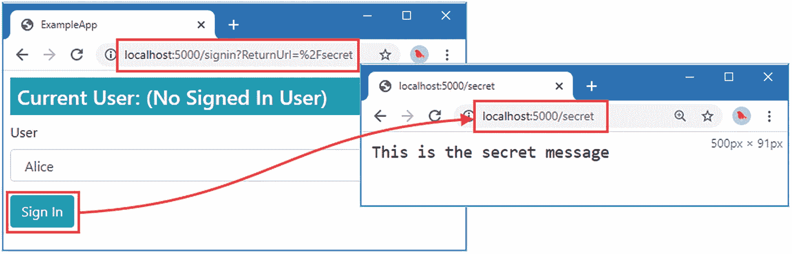

图 14-12。

使用 ASP.NET Core cookie 认证处理程序

## 摘要

在本章中，我解释了 ASP.NET Core 通过其管道处理 HTTP 请求的方式，以及中间件组件如何提供认证和授权。我解释了不同的请求流，包括质询和禁止响应，并解释了登录应用如何生成用于验证后续请求的令牌。一旦我建立了基本特性，我就使用内置的 ASP.NET Core 特性逐步完善我的认证和授权过程，直到只剩下验证用户凭证所需的代码。在下一章，我将解释请求是如何被授权的。