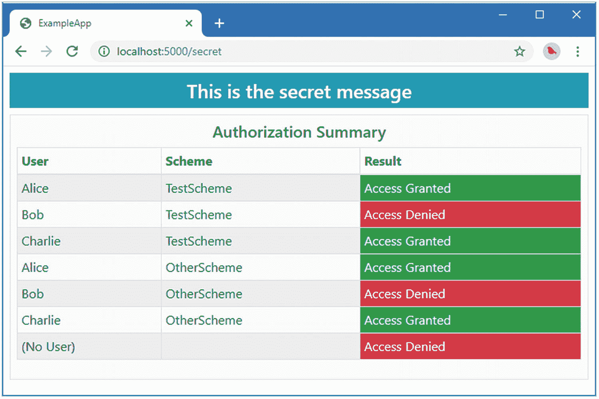

# 十五、授权请求

在前一章中，我重点介绍了 ASP.NET Core 请求管道以及认证请求和授权访问端点的中间件组件。在这一章中，我将深入探讨授权特性，解释限制访问的不同方式。这些都是 ASP.NET Core 提供的功能，我在描述它们时没有使用 ASP.NET Core Identity。表 [15-1](#Tab1) 将 ASP.NET Core 授权特性放在上下文中。

表 15-1。

将请求授权置于上下文中

<colgroup><col class="tcol1 align-left"> <col class="tcol2 align-left"></colgroup> 
| 

问题

 | 

回答

 |
| --- | --- |
| 这是什么？ | 请求授权是限制对端点的访问的过程，因此它们只能由选定的用户访问。 |
| 为什么有用？ | 请求授权是对授权的补充，充当应用管理的资源的看门人。 |
| 如何使用？ | 访问控制策略被定义并应用于端点。当处理请求时，评估策略以确定与请求相关联的用户是否有权访问端点。 |
| 有什么陷阱或限制吗？ | 简单易懂的政策最有效。策略变得越复杂，就越有可能允许非预期的访问。 |
| 还有其他选择吗？ | 请求授权是一项基本功能，在任何包含不应对所有用户可用的任何端点的应用中都是必需的。 |

表 [15-2](#Tab2) 总结了本章内容。

表 15-2。

章节总结

<colgroup><col class="tcol1 align-left"> <col class="tcol2 align-left"> <col class="tcol3 align-left"></colgroup> 
| 

问题

 | 

解决办法

 | 

列表

 |
| --- | --- | --- |
| 定义并实施自定义授权要求 | 实现`IAuthorizationRequirement`和`IAuthorizationHandler`接口。 | [8](#PC12) ， [9](#PC13) |
| 应用授权策略 | 使用`AuthorizationOptions`选项模式来指定用`AuthorizationPolicy`类描述的策略。 | [10](#PC16) ， [11](#PC17) |
| 使用内置需求 | 使用一个内置的需求类。 | [12](#PC18) |
| 组合要求 | 将单个需求排列成一个数组。 | [13](#PC19) |
| 限制对指定认证方案的访问 | 创建策略时指定方案。 | [14](#PC20) ， [15](#PC21) |
| 将策略应用到终端 | 使用`Authorize`属性。 | [16](#PC22) 、[18](#PC25)–[22](#PC29) |
| 指定默认策略 | 将策略分配给`DefaultPolicy`配置选项。 | [17](#PC24) |
| 使用多个策略限制访问 | 应用`Authorize`属性时指定多个策略。 | [23](#PC30) |
| 创建策略的例外 | 使用`AllowAnonymous`属性。 | [24](#PC31) |
| 将策略应用于 Razor 页面 | 使用页面约定。 | [25](#PC33) ， [26](#PC34) |
| 将策略应用于控制器 | 使用过滤器和应用模型。 | [27](#PC35)–[29](#PC37) |

## 为本章做准备

本章使用在第 [14 章](14.html)中创建的`ExampleApp`项目。接下来的部分描述了本章所需的准备工作。

Tip

你可以从 [`https://github.com/Apress/pro-asp.net-core-identity`](https://github.com/Apress/pro-asp.net-core-identity) 下载本章以及本书其他章节的示例项目。如果在运行示例时遇到问题，请参见第 [1](01.html) 章获取帮助。

### 创建授权报告者

如果您可以看到 ASP.NET Core 授权功能的效果，而不必作为个人用户重复登录和发出请求，那么这些功能就更容易理解。在本章中，我用一个组件替换了标准的 ASP.NET Core 授权中间件，该组件使用在`UsersAndClaims`类中定义的用户和声明来测试目标端点的授权策略。

在清单 [15-1](#PC1) 中，我向`UsersAndClaims`类添加了一个方便的方法，它将产生一系列的`ClaimsPrincipal`对象，并定义了一组认证方案名称。

```cs
using System;
using System.Collections.Generic;
using System.Linq;
using System.Security.Claims;

namespace ExampleApp {
    public static class UsersAndClaims {
        public static string[] Schemes = new string[] { "TestScheme" };

        public static Dictionary<string, IEnumerable<string>> UserData
            = new Dictionary<string, IEnumerable<string>> {
               { "Alice", new [] { "User", "Administrator" } },
               { "Bob", new [] { "User" } },
               { "Charlie", new [] { "User"} }
            };

        public static string[] Users => UserData.Keys.ToArray();

        public static Dictionary<string, IEnumerable<Claim>> Claims =>
            UserData.ToDictionary(kvp => kvp.Key,
                kvp => kvp.Value.Select(role => new Claim(ClaimTypes.Role, role)),
                StringComparer.InvariantCultureIgnoreCase);

        public static IEnumerable<ClaimsPrincipal> GetUsers() {
            foreach (string scheme in Schemes) {
                foreach (var kvp in Claims) {
                    ClaimsIdentity ident = new ClaimsIdentity(scheme);
                    ident.AddClaim(new Claim(ClaimTypes.Name, kvp.Key));
                    ident.AddClaims(kvp.Value);
                    yield return new ClaimsPrincipal(ident);
                }
            }
        }
    }
}

Listing 15-1.Adding a Method in the UsersAndClaims.cs File in the ExampleApp Folder

```

将名为`AuthorizationReporter.cs`的类文件添加到`ExampleApp/Custom`文件夹中，并使用它来定义清单 [15-2](#PC2) 中所示的中间件组件。

```cs
using Microsoft.AspNetCore.Authorization;
using Microsoft.AspNetCore.Http;
using System;
using System.Collections.Generic;
using System.Linq;
using System.Security.Claims;
using System.Threading.Tasks;

namespace ExampleApp.Custom {
    public class AuthorizationReporter {
        private string[] schemes = new string[] { "TestScheme" };
        private RequestDelegate next;
        private IAuthorizationPolicyProvider policyProvider;
        private IAuthorizationService authorizationService;

        public AuthorizationReporter(RequestDelegate requestDelegate,
                IAuthorizationPolicyProvider provider,
                IAuthorizationService service) {
            next = requestDelegate;
            policyProvider = provider;
            authorizationService = service;
        }

        public async Task Invoke(HttpContext context) {
            Endpoint ep = context.GetEndpoint();
            if (ep != null) {
                Dictionary<(string, string), bool> results
                    = new Dictionary<(string, string), bool>();
                bool allowAnon = ep.Metadata.GetMetadata<IAllowAnonymous>() != null;
                IEnumerable<IAuthorizeData> authData =
                    ep?.Metadata.GetOrderedMetadata<IAuthorizeData>()
                        ?? Array.Empty<IAuthorizeData>();
                AuthorizationPolicy policy = await
                    AuthorizationPolicy.CombineAsync(policyProvider, authData);
                foreach (ClaimsPrincipal cp in GetUsers()) {
                    results[(cp.Identity.Name ?? "(No User)",
                        cp.Identity.AuthenticationType)] =
                            allowAnon || policy == null
                                || await AuthorizeUser(cp, policy);
                }
                context.Items["authReport"] = results;
                await ep.RequestDelegate(context);
            } else {
                await next(context);
            }
        }

        private IEnumerable<ClaimsPrincipal> GetUsers() =>
            UsersAndClaims.GetUsers()
                .Concat(new[] { new ClaimsPrincipal(new ClaimsIdentity()) });

        private async Task<bool> AuthorizeUser(ClaimsPrincipal cp,
                AuthorizationPolicy policy) {
            return UserSchemeMatchesPolicySchemes(cp, policy)
                && (await authorizationService.AuthorizeAsync(cp, policy)).Succeeded;
        }

        private bool UserSchemeMatchesPolicySchemes(ClaimsPrincipal cp,
                AuthorizationPolicy policy) {
            return policy.AuthenticationSchemes?.Count() == 0 ||
                cp.Identities.Select(id => id.AuthenticationType)
                    .Any(auth => policy.AuthenticationSchemes
                        .Any(scheme => scheme == auth));
        }
    }
}

Listing 15-2.The Contents of the AuthorizationReporter.cs File in the Custom Folder

```

这个组件使用了一些您在实际项目中不太可能需要的特性，但是这些特性非常有趣，并且有助于解释授权过程。端点的授权需求可通过`HttpContext.GetEndpoint().Metadata`属性获得，并使用`IAuthorizeData`接口表达。为了获得一个端点的需求，我使用了`GetOrderedMetadata<IAuthorizeData>`方法，如下所示:

```cs
...
ep?.Metadata.GetOrderedMetadata<IAuthorizeData>() ?? Array.Empty<IAuthorizeData>();
...

```

您将在本章的后面看到在哪里创建`IAuthorizeData`对象，但是现在，知道每个对象代表一个在请求被授权之前必须满足的需求就足够了。

使用静态的`AuthorizationPolicy.CombineAsync`方法，使用中间件组件声明了构造器依赖关系的`IAuthorizationPolicyProvider`服务，将单个`IAuthorizeData`对象的集合转换为端点的组合授权策略。

```cs
...
AuthorizationPolicy policy = await
    AuthorizationPolicy.CombineAsync(policyProvider, authData);
...

```

可以使用`IAuthorizationService`服务测试授权策略，如下所示:

```cs
...
await authorizationService.AuthorizeAsync(cp, policy);
...

```

`AuthorizeAsync`方法的参数是需要授权的`ClaimsPrincipal`和从端点中间件产生的`AuthorizationPolicy`对象。评估授权策略后，端点被调用以产生响应。

```cs
...
await ep.RequestDelegate(context);
...

```

这意味着即使没有用户被正常授权，端点也将接收请求，还意味着请求将被直接传递到端点，跳过请求管道中的任何其他中间件。出于这些原因，您应该只使用清单 [15-2](#PC2) 中的代码来理解授权是如何工作的，而不是在实际项目中部署它。

Tip

清单 [15-2](#PC2) 中的代码基于内置 ASP.NET Core 中间件授权请求的方式。ASP.NET Core 和 ASP.NET Core Identity 是开源的，探索源代码是理解特性是如何实现的好方法。

### 创建报告视图

为了创建一个显示授权结果的局部视图，向`ExampleApp/Pages/Shared`文件夹添加一个名为`_AuthorizationReport.cshtml`的 Razor 视图，其内容如清单 [15-3](#PC7) 所示。(如果您使用的是 Visual Studio，请使用 Razor 视图-空项模板创建文件。)

```cs
@{
    var data = Context.Items["authReport"] as Dictionary<(string, string), bool>
        ?? new Dictionary<(string, string), bool>();
}

<div class="m-2 p-2 border bg-light">
    <h5 class="text-center">Authorization Summary</h5>
    <table class="table table-sm table-bordered table-striped">
        <thead><tr><th>User</th><th>Scheme</th><th>Result</th></tr></thead>
        <tbody>
            @if (data.Count() == 0) {
                <tr><td colspan="3" class="text-center">No Data</td></tr>
            }
            @foreach (var result in data) {
                <tr>
                    <td>@result.Key.Item1</td>
                    <td>@result.Key.Item2</td>
                    <td class="text-white @(result.Value
                            ? "bg-success" : "bg-danger")">
                        @(result.Value ? "Access Granted" : "Access Denied")
                    </td>
                </tr>
            }
        </tbody>
    </table>
</div>

Listing 15-3.The Contents of the _AuthorizationReport.cshtml File in the Pages/Shared Folder

```

局部视图从`HttpContext`对象中检索授权数据，并使用它来显示包含由中间件组件执行的测试结果的表格。

将清单 [15-4](#PC8) 中所示的元素添加到`Pages/Shared`文件夹中的`_Layout.cshtml`文件中，以包含局部视图。

```cs
<!DOCTYPE html>

<html>
<head>
    <meta name="viewport" content="width=device-width" />
    <title>ExampleApp</title>
    <link href="/lib/twitter-bootstrap/css/bootstrap.min.css" rel="stylesheet" />
</head>
<body>
    <div>
        @RenderBody()
    </div>
    <partial name="_AuthorizationReport" />
</body>
</html>

Listing 15-4.Including a Partial View in the _Layout.cshtml File in the Pages/Shared Folder

```

### 创建端点

我需要一个 HTML 端点，这样我就可以在它生成的响应中包含局部视图。在`Pages`文件夹中添加一个名为`Secret.cshtml`的 Razor 页面，内容如清单 [15-5](#PC9) 所示。

```cs
@page

<h4 class="bg-info text-center text-white m-2 p-2">
    This is the secret message
</h4>

Listing 15-5.The Contents of the Secret.cshtml File in the Pages Folder

```

Razor 页面显示一条简单的 HTML 消息，回显第 [14](14.html) 章中使用的端点。

### 配置请求管道

在清单 [15-6](#PC10) 中，我将新的中间件添加到请求管道中，用它来替换 ASP.NET Core 提供的中间件中的内置授权。我还启用了 MVC 框架并移除了第 [14 章](14.html)中使用的纯文本端点，这样`/secret` URL 将由清单 [15-5](#PC9) 中创建的 Razor 页面处理。

```cs
using Microsoft.AspNetCore.Builder;
using Microsoft.AspNetCore.Hosting;
using Microsoft.AspNetCore.Http;
using Microsoft.Extensions.DependencyInjection;
using ExampleApp.Custom;
using Microsoft.AspNetCore.Authentication.Cookies;

namespace ExampleApp {
    public class Startup {

        public void ConfigureServices(IServiceCollection services) {
            services.AddAuthentication(opts => {
                opts.DefaultScheme
                    = CookieAuthenticationDefaults.AuthenticationScheme;
            }).AddCookie(opts => {
                opts.LoginPath = "/signin";
                opts.AccessDeniedPath = "/signin/403";
            });
            services.AddAuthorization();
            services.AddRazorPages();
            services.AddControllersWithViews();
        }

        public void Configure(IApplicationBuilder app, IWebHostEnvironment env) {

            app.UseStaticFiles();
            app.UseAuthentication();
            //app.UseMiddleware<RoleMemberships>();
            app.UseRouting();

            //app.UseMiddleware<ClaimsReporter>();
            //app.UseAuthorization();
            app.UseMiddleware<AuthorizationReporter>();

            app.UseEndpoints(endpoints => {
                endpoints.MapGet("/", async context => {
                    await context.Response.WriteAsync("Hello World!");
                });
                //endpoints.MapGet("/secret", SecretEndpoint.Endpoint)
                //    .WithDisplayName("secret");
                endpoints.MapRazorPages();
                endpoints.MapDefaultControllerRoute();
            });
        }
    }
}

Listing 15-6.Configuring the Application in the Startup.cs File in the ExampleApp Folder

```

使用命令提示符运行`ExampleApp`文件夹中清单 [15-7](#PC11) 所示的命令。

```cs
dotnet run

Listing 15-7.Starting the Example Application

```

一旦 ASP.NET Core 启动，使用浏览器请求`http://localhost:5000/secret`和`http://localhost:5000/home/test`，您将收到如图 [15-1](#Fig1) 所示的响应。


图 15-1。

运行示例应用

没有为 Razor 页面或`Test` action 方法指定授权策略，所以摘要显示所有用户和未经认证的请求都将被授予访问权限。

## 了解政策和要求

ASP.NET Core 授权的关键构建块是*策略*，它由单独的*需求*组成。对于要授权的请求，它必须满足目标端点的策略中的所有要求。在本节中，我将创建并应用一个自定义需求，并在描述 ASP.NET Core 提供的内置需求之前向您展示如何应用它。

### 定义定制需求和处理程序

需求是用实现`IAuthorizationRequirement`接口的类来表达的。`IAuthorizationRequirement`接口没有定义成员，被实现来描述特定需求的约束。为了演示，将名为`CustomRequirement.cs`的类文件添加到`Custom`文件夹中，并使用它来定义清单 [15-8](#PC12) 中所示的类。

```cs
using Microsoft.AspNetCore.Authorization;

namespace ExampleApp.Custom {

    public class CustomRequirement: IAuthorizationRequirement {

        public string Name { get; set; }

    }
}

Listing 15-8.The Contents of the CustomRequirement.cs File in the Custom Folder

```

这个类实现了`IAuthorizationRequirement`接口，并定义了一个允许指定用户名的`Name`属性。为了执行这个需求，需要一个`IAuthorizationHandler`接口的实现。将名为`CustomRequirementsHandler.cs`的类文件添加到`Custom`文件夹中，并添加清单 [15-9](#PC13) 中所示的代码。

```cs
using Microsoft.AspNetCore.Authorization;
using System;
using System.Linq;
using System.Threading.Tasks;

namespace ExampleApp.Custom {
    public class CustomRequirementHandler : IAuthorizationHandler {

        public Task HandleAsync(AuthorizationHandlerContext context) {
            foreach (CustomRequirement req in
                context.PendingRequirements.OfType<CustomRequirement>().ToList()) {
                if (context.User.Identities.Any(ident => string.Equals(ident.Name,
                        req.Name, StringComparison.OrdinalIgnoreCase))) {
                    context.Succeed(req);
                }
            }
            return Task.CompletedTask;
        }
    }
}

Listing 15-9.The Contents of the CustomRequirementsHandler.cs File in the Custom Folder

```

`IAuthorizationHandler`接口定义了`HandleAsync`方法，该方法接受一个`AuthorizationHandlerContext`上下文对象。`AuthorizationHandlerContext`定义了表 [15-3](#Tab3) 中描述的成员。

表 15-3。

AuthorizationHandlerContext 类定义的成员

<colgroup><col class="tcol1 align-left"> <col class="tcol2 align-left"></colgroup> 
| 

名字

 | 

描述

 |
| --- | --- |
| `User` | 该属性为需要授权的请求返回`ClaimsPrincipal`对象。 |
| `Resource` | 该属性返回请求的目标，这将是本章示例的端点。 |
| `Requirements` | 此属性返回资源/端点的所有要求的序列。 |
| `PendingRequirements` | 此属性返回一系列未被标记为已满足的要求。 |
| `Succeed(requirement)` | 这个方法告诉 ASP.NET Core，指定的要求已经得到满足。 |
| `Fail()` | 这个方法告诉 ASP.NET Core，一个需求没有被满足。 |

其思想是授权处理程序将处理策略中的一个或多个需求，并假设需求得到满足，将它们标记为成功。如果所有要求都成功，请求将被授权。如果任何处理程序调用`Fail`方法，授权就会失败。如果存在处理程序没有调用`Succeed`方法的未完成需求，授权也会失败。

清单 [15-9](#PC13) 中的定制处理程序获取待定需求列表，并为`CustomRequirement`类型过滤它们，如下所示:

```cs
...
foreach (CustomRequirement req in
    context.PendingRequirements.OfType<CustomRequirement>().ToList()) {
...

```

`OfType<T>`方法是 LINQ 扩展方法，我使用`ToList`方法来强制评估 LINQ 查询，因为调用`Succeed`方法会改变`PendingRequirements`序列，如果在`foreach`循环中直接使用该序列，就会导致错误。对于每个`CustomRequirement`对象，我可以读取`Name`属性的值，并将其与用户 Identity 中包含的名称进行比较，如果匹配就调用`Succeed`方法。

```cs
...
if (context.User.Identities.Any(ident =>
    string.Compare(ident.Name, req.Name, true) == 0)) {
        context.Succeed(req);
}
...

```

### 创建和应用策略

下一步是使用定制需求来创建授权策略。用清单 [15-10](#PC16) 中所示的代码将名为`AuthorizationPolicies.cs`的类添加到`Custom`文件夹中。

```cs
using Microsoft.AspNetCore.Authorization;
using System.Linq;

namespace ExampleApp.Custom {

    public static class AuthorizationPolicies {

        public static void AddPolicies(AuthorizationOptions opts) {
            opts.FallbackPolicy = new AuthorizationPolicy(
               new[] {
                   new CustomRequirement() { Name = "Bob" }
               }, Enumerable.Empty<string>());
        }
    }
}

Listing 15-10.The Contents of the AuthorizationPolicies.cs File in the Custom Folder

```

使用`AuthorizationPolicy`类创建策略，该类的构造函数接受一系列需求和一系列认证方案名称。当使用指定方案之一进行认证的用户满足所有要求时，该策略将授予访问权限，我将在本章的后面对此进行描述。目前，我使用了一个空数组，它不会限制策略。

`AuthorizationOptions`类用于配置 ASP.NET Core 授权，并定义表 [15-4](#Tab4) 中描述的成员。

表 15-4。

授权选项成员

<colgroup><col class="tcol1 align-left"> <col class="tcol2 align-left"></colgroup> 
| 

名字

 | 

描述

 |
| --- | --- |
| `DefaultPolicy` | 该属性定义了当需要授权但没有选择策略时，默认情况下将应用的策略，例如当应用不带参数的`Authorize`属性时。任何授权用户都将被授予访问权限，除非定义了新的默认策略，如本章后面所述。 |
| `FallbackPolicy` | 此属性定义在没有定义其他策略时应用的策略。默认情况下没有回退策略，这意味着当没有明确定义的策略时，所有请求都将被授权。 |
| `InvokeHandlersAfterFailure` | 这个属性决定了一个失败的需求是否会妨碍后续需求的评估。默认值是`true`，这意味着评估所有的需求。一个`false`值意味着一个失败短路了需求过程。 |
| `AddPolicy(name, policy)``AddPolicy(name, builder)` | 这个方法添加了一个新的策略，或者使用一个`AuthorizationPolicy`对象，或者使用一个构建函数。 |
| `GetPolicy(name)` | 此方法使用策略名称来检索策略。 |

对于这个例子，我已经将我的策略分配给了`FallbackPolicy`属性，这意味着它将用于授权没有明确授权的请求，并且为应用接收的所有请求设置了最低授权的基线。最后一步是应用策略并将定制需求处理器注册为服务，如清单 [15-11](#PC17) 所示。

```cs
using Microsoft.AspNetCore.Builder;
using Microsoft.AspNetCore.Hosting;
using Microsoft.AspNetCore.Http;
using Microsoft.Extensions.DependencyInjection;
using ExampleApp.Custom;
using Microsoft.AspNetCore.Authentication.Cookies;
using Microsoft.AspNetCore.Authorization;

namespace ExampleApp {
    public class Startup {

        public void ConfigureServices(IServiceCollection services) {

            services.AddTransient<IAuthorizationHandler, CustomRequirementHandler>();

            services.AddAuthentication(opts => {
                opts.DefaultScheme
                    = CookieAuthenticationDefaults.AuthenticationScheme;
            }).AddCookie(opts => {
                opts.LoginPath = "/signin";
                opts.AccessDeniedPath = "/signin/403";
            });
            services.AddAuthorization(opts => {
                AuthorizationPolicies.AddPolicies(opts);
            });
            services.AddRazorPages();
            services.AddControllersWithViews();
        }

        public void Configure(IApplicationBuilder app, IWebHostEnvironment env) {

            app.UseStaticFiles();
            app.UseAuthentication();
            app.UseRouting();
            app.UseMiddleware<AuthorizationReporter>();

            app.UseEndpoints(endpoints => {
                endpoints.MapGet("/", async context => {
                    await context.Response.WriteAsync("Hello World!");
                });
                endpoints.MapRazorPages();
                endpoints.MapDefaultControllerRoute();
            });
        }
    }
}

Listing 15-11.Setting up the Policy in the Startup.cs File in the ExampleApp Folder

```

重启 ASP.NET Core 并请求`http://localhost:5000/secret`。没有为`Secret` Razor 页面指定具体的授权策略，因此应用了回退策略，产生了如图 [15-2](#Fig2) 所示的结果。结果显示，定制策略只授权用户名为`Bob`的经过认证的请求。


图 15-2。

使用授权策略

### 使用内置需求

对于最常见的授权需求，有一组有用的内置需求和处理程序，如表 [15-5](#Tab5) 中所述，它们可以用来代替自定义类。

表 15-5。

有用的内置授权需求类

<colgroup><col class="tcol1 align-left"> <col class="tcol2 align-left"></colgroup> 
| 

名字

 | 

描述

 |
| --- | --- |
| `NameAuthorizationRequirement` | 此要求是针对区分大小写的名称匹配。 |
| `RolesAuthorizationRequirement` | 这个要求是针对一个角色的。 |
| `ClaimsAuthorizationRequirement` | 此要求针对索赔类型和可接受的值范围。 |
| `AssertionRequirement` | 这个需求使用一个`AuthorizationHandlerContext`对象评估一个函数，如果结果是`true`就满足了。 |
| `DenyAnonymousAuthorization` | 任何经过认证的用户都可以满足这一要求。 |

简单的策略可以用名称和角色需求来表达。在清单 [15-12](#PC18) 中，我将我的定制需求替换为内置的等价需求。

```cs
using Microsoft.AspNetCore.Authorization;
using System.Linq;
using Microsoft.AspNetCore.Authorization.Infrastructure;

namespace ExampleApp.Custom {

    public static class AuthorizationPolicies {

        public static void AddPolicies(AuthorizationOptions opts) {
            opts.FallbackPolicy = new AuthorizationPolicy(
               new IAuthorizationRequirement[] {
                   new NameAuthorizationRequirement("Bob"),
               }, Enumerable.Empty<string>());
        }
    }
}

Listing 15-12.Using a Built-In Requirement in the AuthorizationPolicies.cs in the Custom Folder

```

这个需求与我的自定义对等项具有相同的效果，尽管名称比较区分大小写。重启 ASP.NET Core 并请求`http://localhost:5000/secret`，你会看到如图 [15-2](#Fig2) 所示的响应。

### 组合要求

一个策略只有在其所有需求都得到满足的情况下才会授予访问权，这意味着复杂的策略可以使用简单需求的组合来构建，如清单 [15-13](#PC19) 所示。

```cs
using Microsoft.AspNetCore.Authorization;
using System.Linq;
using Microsoft.AspNetCore.Authorization.Infrastructure;

namespace ExampleApp.Custom {

    public static class AuthorizationPolicies {

        public static void AddPolicies(AuthorizationOptions opts) {
            opts.FallbackPolicy = new AuthorizationPolicy(
               new IAuthorizationRequirement[] {
                   new RolesAuthorizationRequirement(
                       new [] { "User", "Administrator" }),
                   new AssertionRequirement(context =>
                       !string.Equals(context.User.Identity.Name, "Bob"))
               }, Enumerable.Empty<string>());
        }
    }
}

Listing 15-13.Combining Requirements in the AuthorizationPolicies.cs File in the Custom Folder

```

该政策包含两个要求。被分配了`User`或`Administrator`角色的用户将满足角色要求。任何名字不是`Bob`的用户都满足断言要求。重启 ASP.NET Core 并请求`http://localhost:500/secret`，你会看到访问被授予爱丽丝和查理，但不授予鲍勃或未经认证的请求，如图 [15-3](#Fig3) 所示。


图 15-3。

在授权策略中组合需求

### 限制对特定授权方案的访问

用于创建一个`AuthorizationPolicy`对象的两个参数是一系列需求和一系列认证方案。我在前面的例子中使用了一个空数组，它不限制将要使用的模式，但是在支持多种认证模式并且需要限制通过其中一部分认证的用户访问的应用中，这是一个有用的特性。在清单 [15-14](#PC20) 中，我添加了一个定制授权测试中间件将使用的新方案。

```cs
using System;
using System.Collections.Generic;
using System.Linq;
using System.Security.Claims;

namespace ExampleApp {
    public static class UsersAndClaims {
        public static string[] Schemes
             = new string[] { "TestScheme", "OtherScheme" };

        public static Dictionary<string, IEnumerable<string>> UserData
            = new Dictionary<string, IEnumerable<string>> {
               { "Alice", new [] { "User", "Administrator" } },
               { "Bob", new [] { "User" } },
               { "Charlie", new [] { "User"} }
            };

        public static string[] Users => UserData.Keys.ToArray();

        public static Dictionary<string, IEnumerable<Claim>> Claims =>
            UserData.ToDictionary(kvp => kvp.Key,
                kvp => kvp.Value.Select(role => new Claim(ClaimTypes.Role, role)),
                StringComparer.InvariantCultureIgnoreCase);

        public static IEnumerable<ClaimsPrincipal> GetUsers() {
            foreach (string scheme in Schemes) {
                foreach (var kvp in Claims) {
                    ClaimsIdentity ident = new ClaimsIdentity(scheme);
                    ident.AddClaim(new Claim(ClaimTypes.Name, kvp.Key));
                    ident.AddClaims(kvp.Value);
                    yield return new ClaimsPrincipal(ident);
                }
            }
        }
    }
}

Listing 15-14.Adding a Scheme in the UsersAndClaims.cs File in the ExampleApp Folder

```

在清单 [15-15](#PC21) 中，我修改了授权策略来指定一个方案。

```cs
using Microsoft.AspNetCore.Authorization;
using System.Linq;
using Microsoft.AspNetCore.Authorization.Infrastructure;

namespace ExampleApp.Custom {

    public static class AuthorizationPolicies {

        public static void AddPolicies(AuthorizationOptions opts) {
            opts.FallbackPolicy = new AuthorizationPolicy(
               new IAuthorizationRequirement[] {
                   new RolesAuthorizationRequirement(
                       new [] { "User", "Administrator" }),
                   new AssertionRequirement(context =>
                       !string.Equals(context.User.Identity.Name, "Bob"))
               }, new string[] { "TestScheme" });
        }
    }
}

Listing 15-15.Specifying a Scheme in the AuthorizationPolicies.cs File in the Custom Folder

```

其效果是，策略要求满足它的所有要求，并使用`TestScheme`方案对请求进行认证。重启 ASP.NET Core 并请求`http://localhost:5000/secret`，你会看到认证方案为`OtherScheme`的`ClaimsPrincipal`对象授权失败，即使其声明满足所有策略要求，如图 [15-4](#Fig4) 所示。当爱丽丝和查理被`TestScheme`认证时，他们被授权，但是当他们被`OtherScheme`认证时，他们没有被授权。

Note

在实际应用中，内置的授权中间件会触发第 [14](14.html) 章描述的标准授权请求流。如果用户已经使用策略的方案之一进行了认证，那么将发送一个禁止响应；否则，发送挑战响应。


图 15-4。

指定认证方案

## 定位授权策略

更改回退策略可以很容易地看出授权构建块是如何组合在一起的，但是在需要目标访问控制的实际项目中，它的用途有限。

授权粒度的下一步是使用默认的授权策略，该策略应用于不使用特定策略而应用访问控制的情况。在清单 [15-16](#PC22) 中，我已经将`Authorize`属性应用于`Secret` Razor 页面，它告诉 ASP.NET Core 需要访问控制。

```cs
@page

@using Microsoft.AspNetCore.Authorization

@attribute [Authorize]

<h4 class="bg-info text-center text-white m-2 p-2">
    This is the secret message
</h4>

Listing 15-16.Applying an Attribute in the Secret.cshtml File in the Pages Folder

```

`Authorize`属性表示需要授权。我简单地解释了如何配置`Authorize`属性，但是当它被无参数地应用时，ASP.NET Core 使用默认的授权策略，该策略应用了表 [15-5](#Tab5) 中描述的`DenyAnonymousAuthorization`需求。要查看默认策略的效果，重启 ASP.NET Core 并请求`http://localhost:5000/secret`，您将看到所有经过认证的用户都获得了授权。当没有其他策略可用时，仍然使用回退策略，这可以通过请求`http://localhost:5000/home/test`来查看。这个请求的目标是`Home`控制器上的`Test`动作，它还没有用属性修饰。图 [15-5](#Fig5) 显示了两种响应。


图 15-5。

默认授权策略

在幕后，`Authorize`属性实现了`IAuthorizeData`接口，ASP.NET Core 授权中间件使用该接口来发现端点的授权需求。我对清单 [15-2](#PC2) 中的定制中间件使用了相同的方法。

```cs
...
IEnumerable<IAuthorizeData> authData =
    ep?.Metadata.GetOrderedMetadata<IAuthorizeData>()
        ?? Array.Empty<IAuthorizeData>();
AuthorizationPolicy policy = await
    AuthorizationPolicy.CombineAsync(policyProvider, authData);
...

```

这是您可能已经在项目中使用的`Authorize`属性和本章描述的授权流程之间的链接。

### 更改默认授权策略

默认策略可以通过给`AuthorizationOptions.DefaultPolicy`分配一个策略来改变，允许为`Authorize`属性定义不同的行为，如清单 [15-17](#PC24) 所示。

```cs
using Microsoft.AspNetCore.Authorization;
using System.Linq;
using Microsoft.AspNetCore.Authorization.Infrastructure;

namespace ExampleApp.Custom {

    public static class AuthorizationPolicies {

        public static void AddPolicies(AuthorizationOptions opts) {
            opts.FallbackPolicy = new AuthorizationPolicy(
               new IAuthorizationRequirement[] {
                   new RolesAuthorizationRequirement(
                       new [] { "User", "Administrator" }),
                   new AssertionRequirement(context =>
                       !string.Equals(context.User.Identity.Name, "Bob"))
               }, new string[] { "TestScheme" });

            opts.DefaultPolicy = new AuthorizationPolicy(
                new IAuthorizationRequirement[] {
                    new RolesAuthorizationRequirement(
                        new string[] { "Administrator"})
                }, Enumerable.Empty<string>());
        }
    }
}

Listing 15-17.Changing the Default Policy in the AuthorizationPolicies.cs File in the Custom Folder

```

新策略要求`Administrator`角色对用于认证用户的方案没有限制。重启 ASP.NET Core 并请求`http://localhost:5000/secret`查看新默认策略的效果，如图 [15-6](#Fig6) 所示。


图 15-6。

更改默认授权策略

### 配置目标授权策略

可使用表 [15-6](#Tab6) 中描述的属性选择`Authorize`属性应用的策略。

表 15-6。

授权属性特性

<colgroup><col class="tcol1 align-left"> <col class="tcol2 align-left"></colgroup> 
| 

名字

 | 

描述

 |
| --- | --- |
| `AuthenticationSchemes` | 此属性用于指定允许的认证方案的逗号分隔列表。 |
| `Policy` | 此属性用于按名称指定策略。 |
| `Roles` | 此属性用于指定允许角色的逗号分隔列表。 |

为基于角色的授权提供了直接支持，这是最常用的方法。应该被授予访问权限的角色被指定为字符串中的逗号分隔列表，如清单 [15-18](#PC25) 所示。

Caution

角色名称没有被验证，因为 ASP.NET Core 事先不知道将创建什么角色声明。如果您拼错了一个角色名，您会发现您没有得到您期望的授权策略。

```cs
@page

@using Microsoft.AspNetCore.Authorization

@attribute [Authorize(Roles = "Administrator, User")]

<h4 class="bg-info text-center text-white m-2 p-2">
    This is the secret message
</h4>

Listing 15-18.Specifying Roles in the Secret.cshtml File in the Pages Folder

```

对由`Authorize`属性指定的任何角色拥有角色声明的用户将被授予访问权限。如果您想限制对列表中所有角色都有权限的用户的访问，那么可以使用多个属性，如清单 [15-19](#PC26) 所示。

```cs
@page

@using Microsoft.AspNetCore.Authorization

@attribute [Authorize(Roles = "Administrator")]
@attribute [Authorize(Roles = "User")]

<h4 class="bg-info text-center text-white m-2 p-2">
    This is the secret message
</h4>

Listing 15-19.Using Multiple Attributes in the Secret.cshtml File in the Pages Folder

```

创建策略时，它将包含每个`Authorize`属性的角色要求，这意味着只有同时拥有`Administrator`和`User`角色声明的用户才会被授予访问权限。图 [15-7](#Fig7) 显示了列表 [15-18](#PC25) 和列表 [15-19](#PC26) 的结果。


图 15-7。

使用授权属性指定角色

### 使用命名策略

属性的属性很有用，但是很难改变策略，因为属性的每个实例都必须被定位，这样才能指定新的角色。属性的`Policy`属性更加灵活，因为授权策略可以定义一次，并在整个应用中一致地应用。当需要更改时，可以修改策略，而无需更改属性。清单 [15-20](#PC27) 展示了一个新策略是如何定义的。

```cs
using Microsoft.AspNetCore.Authorization;
using System.Linq;
using Microsoft.AspNetCore.Authorization.Infrastructure;

namespace ExampleApp.Custom {

    public static class AuthorizationPolicies {

        public static void AddPolicies(AuthorizationOptions opts) {
            opts.FallbackPolicy = new AuthorizationPolicy(
               new IAuthorizationRequirement[] {
                   new RolesAuthorizationRequirement(
                       new [] { "User", "Administrator" }),
                   new AssertionRequirement(context =>
                       !string.Equals(context.User.Identity.Name, "Bob"))
               }, new string[] { "TestScheme" });

            opts.DefaultPolicy = new AuthorizationPolicy(
                new IAuthorizationRequirement[] {
                    new RolesAuthorizationRequirement(
                        new string[] { "Administrator"})
                }, Enumerable.Empty<string>());

            opts.AddPolicy("UsersExceptBob", new AuthorizationPolicy(
                new IAuthorizationRequirement[] {
                    new RolesAuthorizationRequirement(new[] { "User" }),
                    new AssertionRequirement(context =>
                        !string.Equals(context.User.Identity.Name, "Bob"))
                }, Enumerable.Empty<string>()));
        }
    }
}

Listing 15-20.Defining a Policy in the AuthorizationPolicies.cs File in the Custom Folder

```

`AuthorizationOptions`类提供了`AddPolicy`方法，该方法接受一个名称和一个`AuthorizationPolicy`对象。在本例中，名称是`UsersExceptBob`，策略对`User`角色有一个角色要求，对用户名不是`Bob`有一个断言要求。在清单 [15-21](#PC28) 中，我已经将应用于`Secret` Razor 页面的`Authorize`属性更改为使用`Policy`属性。

```cs
@page

@using Microsoft.AspNetCore.Authorization

@attribute [Authorize(Policy = "UsersExceptBob")]

<h4 class="bg-info text-center text-white m-2 p-2">
    This is the secret message
</h4>

Listing 15-21.Specifying a Property in the Secret.cshtml File in the Pages Folder

```

只能指定一个策略，并且与`Roles`属性不同，`Policy`属性不能与逗号分隔的列表一起使用。重启 ASP.NET Core，请求`http://localhost:5000/secret`查看新政策的效果，如图 [15-8](#Fig8) 。

Tip

`Authorize`属性上的`AuthenticationSchemes`属性用于指定一个或多个认证方案。这些被添加到由策略定义的列表中，扩大了将被授权访问的方案的范围。



图 15-8。

使用命名授权策略

#### 使用策略生成器创建命名策略

ASP.NET Core 提供了一种更优雅的方式来创建命名策略，它允许使用表 [15-7](#Tab7) 中描述的`AuthorizationPolicyBuilder`类定义的方法来表达需求。

表 15-7。

授权策略生成器方法

<colgroup><col class="tcol1 align-left"> <col class="tcol2 align-left"></colgroup> 
| 

名字

 | 

描述

 |
| --- | --- |
| `AddAuthenticationSchemes(schemes)` | 此方法将一个或多个认证方案添加到策略将接受的方案集中。 |
| `RequireAssertion(func)` | 这个方法向策略添加了一个`AssertionRequirement`。 |
| `RequireAuthenticatedUser()` | 这个方法增加了一个`DenyAnonymousAuthorizationRequirement`要求对请求进行认证。 |
| `RequireClaim(type)` | 该方法向策略添加了一个`ClaimsAuthorizationRequirement`，要求具有任意值的特定类型的声明。 |
| `RequireClaim(type, values)` | 该方法向策略添加了一个`ClaimsAuthorizationRequirement`，要求特定类型的声明具有一个或多个可接受的值。 |
| `RequireRole(roles)` | 该方法向策略添加了一个`RolesAuthorizationRequirement`。 |
| `RequireUserName(name)` | 该方法向策略添加了一个`NameAuthorizationRequirement`。 |
| `AddRequirements(reqs)` | 该方法将一个或多个`IAuthorizationRequirement`对象添加到策略中，这对于添加定制需求非常有用。 |

表 [15-7](#Tab7) 中描述的方法都返回一个`AuthorizationPolicyBuilder`对象，该对象允许调用链接在一起以创建一个策略，如清单 [15-22](#PC29) 所示。

```cs
using Microsoft.AspNetCore.Authorization;
using System.Linq;
using Microsoft.AspNetCore.Authorization.Infrastructure;

namespace ExampleApp.Custom {

    public static class AuthorizationPolicies {

        public static void AddPolicies(AuthorizationOptions opts) {
            opts.FallbackPolicy = new AuthorizationPolicy(
               new IAuthorizationRequirement[] {
                   new RolesAuthorizationRequirement(
                       new [] { "User", "Administrator" }),
                   new AssertionRequirement(context =>
                       !string.Equals(context.User.Identity.Name, "Bob"))
               }, new string[] { "TestScheme" });

            opts.DefaultPolicy = new AuthorizationPolicy(
                new IAuthorizationRequirement[] {
                    new RolesAuthorizationRequirement(
                        new string[] { "Administrator"})
                }, Enumerable.Empty<string>());

            opts.AddPolicy("UsersExceptBob", builder => builder.RequireRole("User")
                .AddRequirements(new AssertionRequirement(context =>
                    !string.Equals(context.User.Identity.Name, "Bob")))
                .AddAuthenticationSchemes("OtherScheme"));
        }
    }
}

Listing 15-22.Building an Authorization Policy in the AuthorizationPolicies.cs File in the Custom Folder

```

该策略与清单 [15-20](#PC27) 中定义的策略具有相同的效果，但它是使用表 [15-7](#Tab7) 中描述的方法创建的。

### 组合策略以缩小授权范围

可以多次应用`Authorize`属性来为端点设置广泛的授权策略，并为特定的动作或处理程序缩小授权策略，如清单 [15-23](#PC30) 所示。

```cs
using Microsoft.AspNetCore.Authorization;
using Microsoft.AspNetCore.Mvc;

namespace ExampleApp.Controllers {

    [Authorize]
    public class HomeController: Controller {

        public IActionResult Test() => View();

        [Authorize(Roles = "User", AuthenticationSchemes = "OtherScheme")]
        public IActionResult Protected() => View("Test", "Protected Action");
    }
}

Listing 15-23.Applying the Attribute in the HomeController.cs File in the Controllers Folder

```

应用于`HomeController`类的`Authorize`属性将默认策略应用于控制器定义的所有动作。我之前修改了默认策略，这意味着只有拥有`Administrator`角色声明的用户才能访问这些操作。这是将应用于`Test`动作的策略，但是`Protected`动作有另一个`Authorize`属性，它通过要求`User`角色和`OtherScheme`认证方案进一步缩小了策略的范围。要查看创建的两个策略，重启 ASP.NET Core 并请求`http://localhost:5000/home/test`和`http://localhost:5000/home/protected`。对`Test`动作的访问被授予 Alice，不管她是如何被认证的。只有当 Alice 通过了`OtherScheme`认证方案的认证后，她才能访问`Protected`动作。图 [15-9](#Fig9) 显示了两种结果。


图 15-9。

缩小授权策略的范围

#### 创建策略例外

`AllowAnonymous`属性为授权策略创建了一个例外，以允许未经认证的访问。如果要应用默认或回退策略，或者在控制器或 Razor 页面上使用了 Authorize 属性，并且您需要为单个操作或处理程序方法创建一个异常，这将非常有用。在清单 [15-24](#PC31) 中，我为`Home`控制器添加了一个动作方法，该属性被应用于该控制器。

```cs
using Microsoft.AspNetCore.Authorization;
using Microsoft.AspNetCore.Mvc;

namespace ExampleApp.Controllers {

    [Authorize]
    public class HomeController: Controller {

        public IActionResult Test() => View();

        [Authorize(Roles = "User", AuthenticationSchemes = "OtherScheme")]
        public IActionResult Protected() => View("Test", "Protected Action");

        [AllowAnonymous]
        public IActionResult Public() => View("Test", "Unauthenticated Action");
    }
}

Listing 15-24.Adding an Action in the HomeController.cs File in the Controllers Folder

```

内置的授权中间件对`AllowAnonymous`属性进行了特殊处理，它简化了正常的策略评估过程，允许对所有请求进行访问，而不管这些请求是否经过认证。重启 ASP.NET Core，请求`http://localhost:5000/home/public`查看效果，如图 [15-10](#Fig10) 所示。


图 15-10。

允许匿名访问

Performing Authorization in Pages and Views

您可以在视图中使用授权来改变不同用户组的 HTML 内容。这需要使用依赖注入来接收`IAuthorizationService`服务，并在视图中使用`AuthorizeAsync`方法来应用授权策略，如下所示:

```cs
@page
@using Microsoft.AspNetCore.Authorization
@inject IAuthorizationService AuthorizationService

<div>This is content for all users</div>

@if ((await AuthorizationService.AuthorizeAsync(User,
        "UsersExceptBob")).Succeeded) {
    <div>This is the protected content</div>
}

```

我发现这种技术很难使用，并且很容易误用策略。但是，如果您确实使用此功能，则必须确保受保护内容所针对的任何操作方法或处理程序都具有相同的授权级别，以防止未经授权的用户创建 HTTP 请求来执行受限制的操作。

### 使用 Razor 页面约定应用策略

如果您正在使用 Razor Pages，那么在配置`Startup`类中的服务时，您可以使用 options 模式来应用授权策略。在清单 [15-25](#PC33) 中，我定义了一个新策略，拒绝拥有`Administrator`角色声明的用户访问。

```cs
using Microsoft.AspNetCore.Authorization;
using System.Linq;
using Microsoft.AspNetCore.Authorization.Infrastructure;

namespace ExampleApp.Custom {

    public static class AuthorizationPolicies {

        public static void AddPolicies(AuthorizationOptions opts) {

            opts.FallbackPolicy = new AuthorizationPolicy(
               new IAuthorizationRequirement[] {
                   new RolesAuthorizationRequirement(
                       new [] { "User", "Administrator" }),
                   new AssertionRequirement(context =>
                       !string.Equals(context.User.Identity.Name, "Bob"))
               }, new string[] { "TestScheme" });

            opts.DefaultPolicy = new AuthorizationPolicy(
                new IAuthorizationRequirement[] {
                    new RolesAuthorizationRequirement(
                        new string[] { "Administrator"})
                }, Enumerable.Empty<string>());

            opts.AddPolicy("UsersExceptBob", builder => builder.RequireRole("User")
                .AddRequirements(new AssertionRequirement(context =>
                    !string.Equals(context.User.Identity.Name, "Bob")))
                .AddAuthenticationSchemes("OtherScheme"));

            opts.AddPolicy("NotAdmins", builder =>
                builder.AddRequirements(new AssertionRequirement(context =>
                    !context.User.IsInRole("Administrator"))));
        }
    }
}

Listing 15-25.Defining a Policy in the AuthorizationPolicies.cs File in the Custom Folder

```

在清单 [15-26](#PC34) 中，我使用了 Razor 页面约定特性来将新策略应用到`Secret` Razor 页面。

```cs
...
public void ConfigureServices(IServiceCollection services) {

    services.AddTransient<IAuthorizationHandler, CustomRequirementHandler>();

    services.AddAuthentication(opts => {
        opts.DefaultScheme
            = CookieAuthenticationDefaults.AuthenticationScheme;
    }).AddCookie(opts => {
        opts.LoginPath = "/signin";
        opts.AccessDeniedPath = "/signin/403";
    });
    services.AddAuthorization(opts => {
        AuthorizationPolicies.AddPolicies(opts);
    });
    services.AddRazorPages(opts => {
        opts.Conventions.AuthorizePage("/Secret", "NotAdmins");
    });
    services.AddControllersWithViews();
}
...

Listing 15-26.Applying a Policy in the Startup.cs File in the ExampleApp Folder

```

`RazorPagesOptions`类用于配置 Razor 页面，其`Conventions`属性返回一个`PageConventionCollection`对象，授权扩展方法可用，如表 [15-8](#Tab8) 所示。

表 15-8。

Razor 页面授权扩展方法

<colgroup><col class="tcol1 align-left"> <col class="tcol2 align-left"></colgroup> 
| 

名字

 | 

描述

 |
| --- | --- |
| `AuthorizePage(page, policy)` | 此方法将授权策略应用于特定页面。 |
| `AuthorizePage(page)` | 此方法将默认策略应用于特定页面。 |
| `AuthorizeFolder(name, policy)` | 此方法将授权策略应用于单个文件夹中的所有页面。 |
| `AuthorizeFolder(name)` | 此方法将默认策略应用于单个文件夹中的所有页面。 |
| `AllowAnonymousToPage(page)` | 此方法授予对特定页面的匿名访问权限。 |
| `AllowAnonymousToFolder(name)` | 此方法授予对单个文件夹中所有页面的匿名访问权限。 |

在清单 [15-26](#PC34) 中，我使用了`AuthorizePage`方法将`NotAdmins`策略应用于`Secret` Razor 页面。要查看效果，重启 ASP.NET Core 并请求`http://localhost:5000/secret`。如图 [15-11](#Fig11) 所示的响应显示了`NotAdmins`策略与通过`Authorize`属性应用于页面的策略`UsersExceptBob`相结合，结果只有 Charlie 可以访问 Razor 页面，并且只有在使用`OtherScheme`进行认证时。


图 15-11。

使用授权约定

### 使用 MVC 框架过滤器应用策略

MVC 框架没有提供表 [15-8](#Tab8) 中所示的等效方法，主要的替代方法是使用全局过滤器来应用授权策略。这种方法的缺点是，该策略应用于由 MVC 动作方法处理的所有请求。然而，只需一点努力，就可以通过利用为定制 MVC 框架的核心行为而提供的*应用模型*特性来提高选择性，这类似于上一节中使用的 Razor Pages 方法所采用的方法。为了准备使用应用模型，我已经禁用了默认授权策略的定制，如清单 [15-27](#PC35) 所示，这将使我们更容易看到本节中新代码的效果。

```cs
using Microsoft.AspNetCore.Authorization;
using System.Linq;
using Microsoft.AspNetCore.Authorization.Infrastructure;

namespace ExampleApp.Custom {

    public static class AuthorizationPolicies {

        public static void AddPolicies(AuthorizationOptions opts) {
            opts.FallbackPolicy = new AuthorizationPolicy(
               new IAuthorizationRequirement[] {
                   new RolesAuthorizationRequirement(
                       new [] { "User", "Administrator" }),
                   new AssertionRequirement(context =>
                       !string.Equals(context.User.Identity.Name, "Bob"))
               }, new string[] { "TestScheme" });

            //opts.DefaultPolicy = new AuthorizationPolicy(
            //    new IAuthorizationRequirement[] {
            //        new RolesAuthorizationRequirement(
            //            new string[] { "Administrator"})
            //    }, Enumerable.Empty<string>());

            opts.AddPolicy("UsersExceptBob", builder => builder.RequireRole("User")
                .AddRequirements(new AssertionRequirement(context =>
                    !string.Equals(context.User.Identity.Name, "Bob")))
                .AddAuthenticationSchemes("OtherScheme"));

            opts.AddPolicy("NotAdmins", builder =>
                builder.AddRequirements(new AssertionRequirement(context =>
                    !context.User.IsInRole("Administrator"))));
        }
    }
}

Listing 15-27.Disabling the Custom Default Policy in the AuthorizationPolicies.cs File in the Custom Folder

```

要创建应用授权策略的代码，用清单 [15-28](#PC36) 中所示的代码将名为`AuthorizationPolicyConvention.cs`的类文件添加到`ExampleApp/Custom`文件夹中。

```cs
using Microsoft.AspNetCore.Authorization;
using Microsoft.AspNetCore.Mvc.ApplicationModels;

namespace ExampleApp.Custom {

    public class AuthorizationPolicyConvention : IActionModelConvention {
        private string controllerName;
        private string actionName;
        private IAuthorizeData attr = new AuthData();

        public AuthorizationPolicyConvention(string controller,
                string action = null, string policy = null,
                string roles = null, string schemes = null) {
            controllerName = controller;
            actionName = action;
            attr.Policy = policy;
            attr.Roles = roles;
            attr.AuthenticationSchemes = schemes;
        }

        public void Apply(ActionModel action) {
            if (controllerName == action.Controller.ControllerName
                    && (actionName == null || actionName == action.ActionName)) {
                foreach (var s in action.Selectors) {
                    s.EndpointMetadata.Add(attr);
                }
            }
        }
    }

    class AuthData : IAuthorizeData {
        public string AuthenticationSchemes { get; set; }
        public string Policy { get; set; }
        public string Roles { get; set; }
    }
}

Listing 15-28.The Contents of the AuthorizationPolicyConvention.cs File in the Custom Folder

```

这个类实现了`IActionModelConvention`接口，它是应用模型特性的一部分，允许改变动作方法。构造函数接受一个控制器名，还可以选择接受应该应用策略的操作。授权策略、可接受的角色集和可接受的认证方案都有可选的参数。如果没有提供角色或策略，将使用默认策略。如果没有指定动作方法，则策略将应用于控制器定义的所有动作。

在启动期间，`AuthorizationPolicyConvention`将接收应用中所有动作方法的详细信息，并将一个实现`IAuthorizeData`接口的对象添加到动作的端点元数据中。这是由`Authorize`属性实现的接口，授权中间件(以及之前创建的自定义替换)寻找该接口来构建授权策略。

在清单 [15-29](#PC37) 中，我使用了新的类来添加策略到由`Home`控制器定义的动作方法中。

```cs
...
public void ConfigureServices(IServiceCollection services) {

    services.AddTransient<IAuthorizationHandler, CustomRequirementHandler>();

    services.AddAuthentication(opts => {
        opts.DefaultScheme
            = CookieAuthenticationDefaults.AuthenticationScheme;
    }).AddCookie(opts => {
        opts.LoginPath = "/signin";
        opts.AccessDeniedPath = "/signin/403";
    });
    services.AddAuthorization(opts => {
        AuthorizationPolicies.AddPolicies(opts);
    });
    services.AddRazorPages(opts => {
        opts.Conventions.AuthorizePage("/Secret", "NotAdmins");
    });
    services.AddControllersWithViews(opts => {
        opts.Conventions.Add(new AuthorizationPolicyConvention("Home",
            policy: "NotAdmins"));
        opts.Conventions.Add(new AuthorizationPolicyConvention("Home",
            action: "Protected", policy: "UsersExceptBob"));
    });
}
...

Listing 15-29.Applying an Authorization Policy in the Startup.cs File in the ExampleApp Folder

```

惯例将`NotAdmins`策略应用于所有`Home`控制器的动作，并将`UsersExceptBob`策略应用于仅`Protected`动作。重启 ASP.NET Core 并请求`http://localhost:5000/home/protected`查看新策略的效果，如图 [15-12](#Fig12) 所示，这些策略与直接应用于控制器类的`Authorize`属性结合使用。


图 15-12。

使用应用模型应用授权策略

## 摘要

在本章中，我解释了 ASP.NET Core 如何使用策略授权请求。授权策略是 Identity 所依赖的关键构造块，尽管很少有应用需要直接使用它们。在下一章中，我将 Identity 引入到示例项目中，并创建一个自定义用户存储。