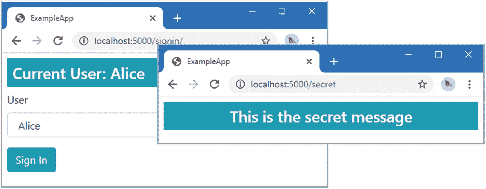
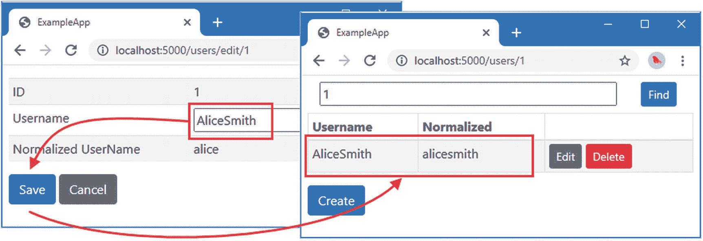
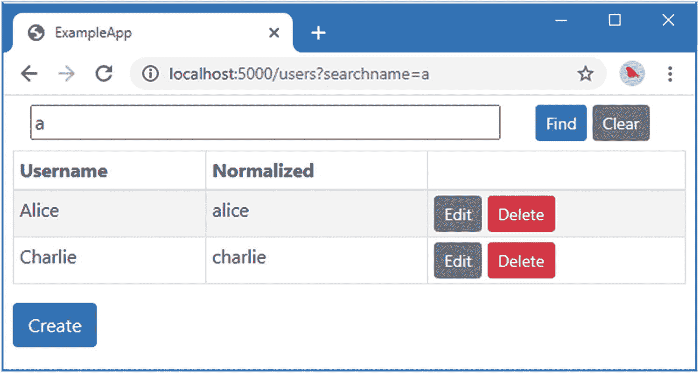
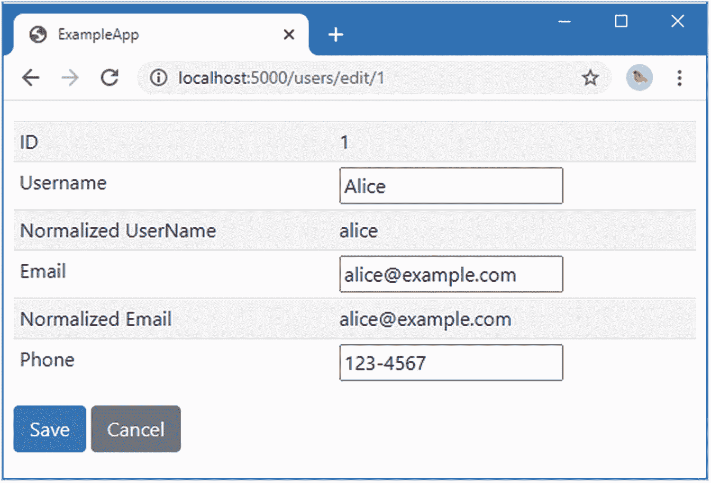
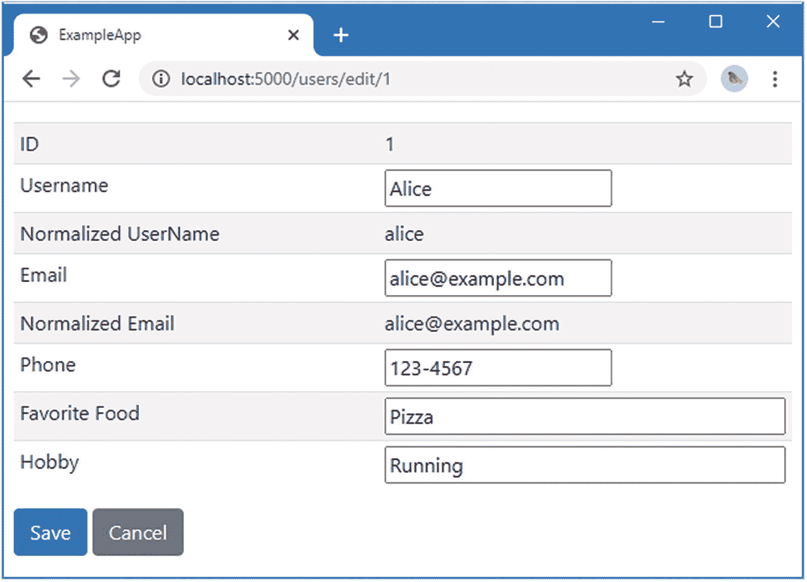
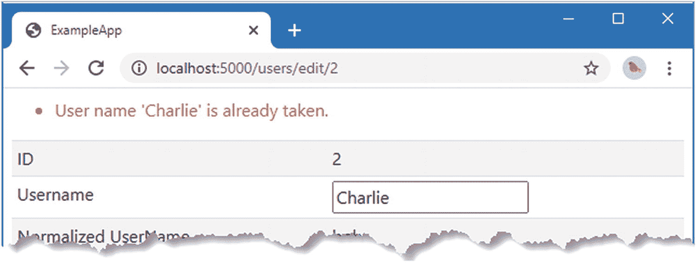
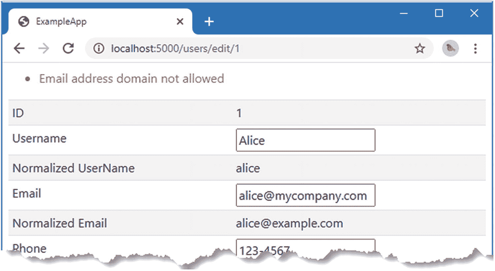

# 十六、创建用户存储

在本章中，我将 Identity 添加到示例项目中，并创建一个自定义用户存储。在第 1 部分中，我使用了微软提供的默认用户存储，它使用实体框架核心将用户数据存储在关系数据库中，这是您应该在实际项目中使用的存储。

我在本章中创建的用户存储将其数据存储在内存中，这使得解释用户存储如何工作变得容易，而不会陷入如何序列化和持久化数据的困境。表 [16-1](#Tab1) 将用户商店放在上下文中。

表 16-1。

将用户存储放在上下文中

<colgroup><col class="tcol1 align-left"> <col class="tcol2 align-left"></colgroup> 
| 

问题

 | 

回答

 |
| --- | --- |
| 这是什么？ | 用户存储是 Identity 数据的数据存储库。 |
| 为什么有用？ | 用户存储维护 Identity 管理的数据。如果没有用户存储，Identity 提供的所有功能都不可能实现。 |
| 如何使用？ | 用户存储被注册为服务，并通过 ASP.NET Core 依赖注入功能由 Identity 使用。 |
| 有什么陷阱或限制吗？ | 自定义用户存储的主要问题是确保每个可选接口的实现不会影响其他任何接口。正如您将在后面的示例中看到的，有些特性是密切相关的，必须注意确保结果的一致性。 |
| 还有其他选择吗？ | 使用 Identity 需要用户存储，但您不必创建自定义实现。 |

表 [16-2](#Tab2) 总结了本章内容。

表 16-2。

章节总结

<colgroup><col class="tcol1 align-left"> <col class="tcol2 align-left"> <col class="tcol3 align-left"></colgroup> 
| 

问题

 | 

解决办法

 | 

列表

 |
| --- | --- | --- |
| 定义自定义用户类 | 创建一个类，该类具有唯一的键属性，并且可以存储名称的常规和规范化版本。定义附加属性以支持用户存储实现的可选功能。 | [7](#PC7)–[8](#PC8)、 [24](#PC27) 、 [31](#PC34) |
| 定义自定义用户存储 | 创建一个`IUserStore<T>`接口的实现。通过实现可选接口，可以支持其他功能。将商店注册为服务。 | [11](#PC13) 、 [14](#PC16) 、 [22](#PC25) 、[25](#PC28)–[27](#PC30) |
| 定义自定义规格化器 | 创建一个`ILookupNormalizer`接口的实现。将规范化器注册为服务。 | [12](#PC14)–[14](#PC16) |
| 访问用户存储 | 使用`UserManager<T>`类的成员。 | [15](#PC17)–[21](#PC24)、 [23](#PC26) 、[28](#PC31)–[30](#PC33) |
| 在将用户数据添加到存储之前对其进行验证 | 创建一个`IUserValidator<T>`方法的实现，并将其注册为服务。 | [35](#PC39) ， [26](#PC29) |

## 为本章做准备

本章使用了第 15 章[中的 ExampleApp 项目。为了准备这一章，用清单](15.html) [16-1](#PC1) 中所示的代码替换`Startup`类，该代码删除了前一章中使用的自定义授权中间件，并替换为内置授权。我还启用了自定义的`RoleMemberships`中间件组件作为用户声明的来源，并移除了 Razor 页面和 MVC 框架的应用模型约定。`MapFallbackToPage`方法用于为与另一个端点不匹配的请求选择`Secret` Razor 页面。

Tip

你可以从 [`https://github.com/Apress/pro-asp.net-core-identity`](https://github.com/Apress/pro-asp.net-core-identity) 下载本章以及本书其他章节的示例项目。如果在运行示例时遇到问题，请参见第 1 章了解如何获得帮助。

```cs
using Microsoft.AspNetCore.Builder;
using Microsoft.AspNetCore.Hosting;
using Microsoft.AspNetCore.Http;
using Microsoft.Extensions.DependencyInjection;
using ExampleApp.Custom;
using Microsoft.AspNetCore.Authentication.Cookies;
using Microsoft.AspNetCore.Authorization;

namespace ExampleApp {
    public class Startup {

        public void ConfigureServices(IServiceCollection services) {

            services.AddTransient<IAuthorizationHandler,
                CustomRequirementHandler>();

            services.AddAuthentication(opts => {
                opts.DefaultScheme
                    = CookieAuthenticationDefaults.AuthenticationScheme;
            }).AddCookie(opts => {
                opts.LoginPath = "/signin";
                opts.AccessDeniedPath = "/signin/403";
            });
            services.AddAuthorization(opts => {
                AuthorizationPolicies.AddPolicies(opts);
            });
            services.AddRazorPages();
            services.AddControllersWithViews();
        }

        public void Configure(IApplicationBuilder app, IWebHostEnvironment env) {

            app.UseStaticFiles();
            app.UseAuthentication();
            app.UseRouting();
            //app.UseMiddleware<AuthorizationReporter>();
            app.UseMiddleware<RoleMemberships>();
            app.UseAuthorization();

            app.UseEndpoints(endpoints => {
                //endpoints.MapGet("/", async context => {
                //    await context.Response.WriteAsync("Hello World!");
                //});
                endpoints.MapRazorPages();
                endpoints.MapDefaultControllerRoute();
                endpoints.MapFallbackToPage("/Secret");
            });
        }
    }
}

Listing 16-1.The Contents of the Startup.cs File in the ExampleApp Folder

```

禁用自定义回退授权策略，并从`UsersExceptBob`策略中删除对`OtherScheme`的引用，如清单 [16-2](#PC2) 所示。

```cs
using Microsoft.AspNetCore.Authorization;
using System.Linq;
using Microsoft.AspNetCore.Authorization.Infrastructure;

namespace ExampleApp.Custom {

    public static class AuthorizationPolicies {

        public static void AddPolicies(AuthorizationOptions opts) {
            //opts.FallbackPolicy = new AuthorizationPolicy(
            //   new IAuthorizationRequirement[] {
            //       new RolesAuthorizationRequirement(
            //           new [] { "User", "Administrator" }),
            //       new AssertionRequirement(context =>
            //           !string.Equals(context.User.Identity.Name, "Bob"))
            //   }, new string[] { "TestScheme" });

            opts.AddPolicy("UsersExceptBob", builder =>
                    builder.RequireRole("User")
                .AddRequirements(new AssertionRequirement(context =>
                    !string.Equals(context.User.Identity.Name, "Bob"))));
                //.AddAuthenticationSchemes("OtherScheme"));

            opts.AddPolicy("NotAdmins", builder =>
                builder.AddRequirements(new AssertionRequirement(context =>
                    !context.User.IsInRole("Administrator"))));
        }
    }
}

Listing 16-2.Altering Authorization Policies in the AuthorizationPolicies.cs File in the Custom Folder

```

从`Home`控制器的`Protected`动作中移除`Authorize`属性，如清单 [16-3](#PC3) 所示。

```cs
using Microsoft.AspNetCore.Authorization;
using Microsoft.AspNetCore.Mvc;

namespace ExampleApp.Controllers {

    [Authorize]
    public class HomeController : Controller {

        public IActionResult Test() => View();

        //[Authorize(Roles = "User", AuthenticationSchemes = "OtherScheme")]
        public IActionResult Protected() => View("Test", "Protected Action");

        [AllowAnonymous]
        public IActionResult Public() => View("Test", "Unauthenticated Action");
    }
}

Listing 16-3.Removing an Attribute in the HomeController.cs File in the Controllers Folder

```

最后，禁用显示第 [15](15.html) 章中使用的授权结果的局部视图，如清单 [16-4](#PC4) 所示。

```cs
<!DOCTYPE html>

<html>
<head>
    <meta name="viewport" content="width=device-width" />
    <title>ExampleApp</title>
    <link href="/lib/twitter-bootstrap/css/bootstrap.min.css" rel="stylesheet" />
</head>
<body>
    <div>
        @RenderBody()
    </div>
    @*<partial name="_AuthorizationReport" />*@
</body>
</html>

Listing 16-4.Removing the Partial View in the _Layout.cshtml File in the Pages/Shared Folder

```

这些更改的效果是恢复内置的授权特性，这样用户就可以使用`Cookie`认证方案在`/signin` URL 登录。定制的`RoleMemberships`中间件组件提供了授权策略使用的用户声明的来源。运行`ExampleApp`文件夹中清单 [16-5](#PC5) 所示的命令启动 ASP.NET Core。

```cs
dotnet run

Listing 16-5.Starting ASP.NET Core

```

请求`http://localhost:5000/signin`，从列表中选择爱丽丝，点击签到按钮。请求`http://localhost:5000/secret`，该请求将使用 cookie 进行认证，并被授予访问`Secret` Razor 页面的权限，如图 [16-1](#Fig1) 所示。



图 16-1。

运行示例应用

## 安装 ASP.NET Core Identity

使用命令提示符运行清单 [16-6](#PC6) 中的命令，将核心身份包添加到项目中。

```cs
dotnet add package Microsoft.Extensions.Identity.Core --version 5.0.0

Listing 16-6.Adding the Core Identity Package to the Project

```

## 创建 Identity 用户存储

在前面的章节中，我将用户列表硬编码到应用中，这可以让您入门，但很快就变得难以管理，并且每次添加或删除用户时都需要一个新的版本。用户存储提供了管理用户数据的一致方式。

### 创建用户类

创建用户存储的第一步是定义用户类，它的实例将用于表示应用中的用户。不需要特定的基类，但是该类的实例必须彼此不同，并且必须能够存储用户的基本信息。为了定义本章的用户类，创建`ExampleApp/Identity`文件夹并添加一个名为`AppUser.cs`的类文件，代码如清单 [16-7](#PC7) 所示。

```cs
using System;

namespace ExampleApp.Identity {
    public class AppUser {

        public string Id { get; set; } = Guid.NewGuid().ToString();

        public string UserName { get; set; }

        public string NormalizedUserName { get; set; }
    }
}

Listing 16-7.The Contents of the AppUser.cs File in the Identity Folder

```

属性将被分配一个代表用户的唯一标识符，默认为 GUID 值。属性将在应用中存储用户的帐户名称。`NormalizedUserName`包含了`UserName`值的规范化表示，我将在下一节中解释。这是一个最小的用户类，随着用户存储的发展，我将向它添加属性。

我需要能够轻松地将值从一个`AppUser`对象复制到另一个对象。这将使以 Identity 期望的方式实现存储变得更加容易，这样，如果没有将对 user 类实例的更改显式保存到用户存储中，这些更改将被丢弃。将名为`StoreClassExtentions.cs`的类文件添加到`Identity`文件夹中，并使用它来定义清单 [16-8](#PC8) 中所示的扩展方法。

```cs
using System;
using System.Collections;
using System.Collections.Generic;

namespace ExampleApp.Identity {

    public static class StoreClassExtentions {

        public static T UpdateFrom<T>(this T target, T source) {
            UpdateFrom(target, source, out bool discardValue);
            return target;
        }

        public static T UpdateFrom<T>(this T target, T source, out bool changes) {
            object value;
            int changeCount = 0;
            Type classType = typeof(T);
            foreach (var prop in classType.GetProperties()) {
                if (prop.PropertyType.IsGenericType &&
                    prop.PropertyType.GetGenericTypeDefinition()
                        .Equals(typeof(IList<>))) {
                    Type listType = typeof(List<>).MakeGenericType(prop.PropertyType
                        .GetGenericArguments()[0]);
                    IList sourceList = prop.GetValue(source) as IList;
                    if (sourceList != null) {
                        prop.SetValue(target, Activator.CreateInstance(listType,
                            sourceList));
                    }
                } else {
                    if ((value = prop.GetValue(source)) != null
                            && !value.Equals(prop.GetValue(target))) {
                        classType.GetProperty(prop.Name).SetValue(target, value);
                        changeCount++;
                    }
                }
            }
            changes = changeCount > 0;
            return target;
        }

        public static T Clone<T>(this T original) =>
             Activator.CreateInstance<T>().UpdateFrom(original);
    }
}

Listing 16-8.The Contents of the StoreClassExtentions.cs File in the Identity Folder

```

我用泛型类型参数定义了方法，这样我就可以使用相同的代码来处理 Identity 使用的不同类。`UpdateFrom`方法将任何非空属性的值从一个对象复制到另一个对象，而`Clone`方法将创建一个对象的副本。清单 [16-8](#PC8) 中的代码是为了支持本书这一部分中的示例而编写的，并且在使用实体框架核心存储 Identity 数据的标准方法时不是必需的。

### 创建用户存储

要实现的关键接口是`IUserStore<T>`，其中`T`是用户类。该接口使用表 [16-3](#Tab3) 中描述的方法定义了用户商店的核心特性。该接口定义的所有方法都接收一个`CancellationToken`参数，该参数用于接收异步操作应该被取消的通知，在表中显示为`token`参数。

表 16-3。

IUserStore <t>方法</t>

<colgroup><col class="tcol1 align-left"> <col class="tcol2 align-left"></colgroup> 
| 

名字

 | 

描述

 |
| --- | --- |
| `CreateAsync(user, token)` | 此方法在存储区中创建指定的用户。 |
| `DeleteAsync(user, token)` | 此方法移除存储区中的指定用户。 |
| `UpdateAsync(user, token)` | 此方法更新存储区中的指定用户。 |
| `FindByIdAsync(id, token)` | 此方法从存储中检索具有指定 ID 的用户。 |
| `FindByNameAsync(name, token)` | 此方法检索具有指定规范化用户名的用户。 |
| `GetUserIdAsync(user, name)` | 此方法从指定的用户对象返回 ID。 |
| `GetUserNameAsync(name, token)` | 此方法从指定的用户对象返回用户名。 |
| `SetUserNameAsync(user, name, token)` | 此方法设置指定用户的用户名。 |
| `GetNormalizedUserNameAsync(user, token)` | 此方法获取指定用户的规范化用户名。 |
| `SetNormalizedUserNameAsync(user, name, token)` | 此方法为指定用户设置规范化用户名。 |
| `Dispose()` | 该方法继承自`IDisposable`接口，在存储对象被销毁之前被调用来释放非托管资源。 |

由`IUserStore<T>`接口定义的方法分为三组:核心存储(创建/删除/更新用户)、查询(通过名称和 ID 定位用户)和处理名称(获取和设置自然和规范化的用户名)。在接下来的几节中，我通过依次关注每组方法并使用 C# 分部类特性在多个类文件中构建功能来创建用户存储。

#### 实现数据存储方法

为了简单起见，我将创建一个基于内存的用户存储。当然，这种方法的缺点是，当 ASP.NET Core 重新启动时，对用户存储的更改将会丢失，但这已经足够开始使用了。

创建`ExampleApp/Identity/Store`文件夹并添加一个名为`UserStoreCore.cs`的类文件，代码如清单 [16-9](#PC9) 所示。

Note

您的代码编辑器可能会警告您，`AppUserStore`类没有实现`IUserStore<AppUser>`接口所需的所有方法。清单 [16-9](#PC9) 中的代码定义了一个分部类，这意味着类成员被定义在多个类文件中。我将在接下来的小节中实现缺少的方法。

```cs
using Microsoft.AspNetCore.Identity;
using System.Collections.Concurrent;
using System.Threading;
using System.Threading.Tasks;

namespace ExampleApp.Identity.Store {

    public partial class UserStore : IUserStore<AppUser> {
        private ConcurrentDictionary<string, AppUser> users
            = new ConcurrentDictionary<string, AppUser>();

        public Task<IdentityResult> CreateAsync(AppUser user,
                CancellationToken token) {
            if (!users.ContainsKey(user.Id) && users.TryAdd(user.Id, user)) {
                return Task.FromResult(IdentityResult.Success);
            }
            return Task.FromResult(Error);
        }

        public Task<IdentityResult> DeleteAsync(AppUser user,
                CancellationToken token) {
            if (users.ContainsKey(user.Id)
                    && users.TryRemove(user.Id, out user)) {
                return Task.FromResult(IdentityResult.Success);
            }
            return Task.FromResult(Error);
        }

        public Task<IdentityResult> UpdateAsync(AppUser user,
                CancellationToken token) {
            if (users.ContainsKey(user.Id)) {
                users[user.Id].UpdateFrom(user);
                return Task.FromResult(IdentityResult.Success);
            }
            return Task.FromResult(Error);
        }

        public void Dispose() {
            // do nothing
        }

        private IdentityResult Error => IdentityResult.Failed(new IdentityError {
            Code = "StorageFailure",
            Description = "User Store Error"
        });
    }
}

Listing 16-9.The Contents of the UserStoreCore.cs File in the Identity/Store Folder

```

用户数据的数据结构是一个并发字典，每个`AppUser`对象使用它的`Id`值作为键来存储。实现`CreateAsync`、`DeleteAsync`和`UpdateAsync`方法意味着管理字典中的数据并生成`IdentityResult`对象来报告结果。使用`IdentityResult.Success`属性报告成功的操作。

```cs
...
return Task.FromResult(IdentityResult.Success);
...

```

使用`IdentityResult.Failed`方法报告失败的操作，该方法接受一个或多个描述问题的`IdentityError`对象。

```cs
...
private IdentityResult Error => IdentityResult.Failed(new IdentityError {
    Code = "StorageFailure", Description = "User Store Error"});
...

```

`IdentityError`类定义了用于描述错误条件的`Code`和`Description`属性。一个真实的用户存储会描述它遇到的问题，但是对于我的简单实现，我会产生一个一般性的错误来指出问题。

#### 实现搜索方法

下一组方法允许搜索用户存储。将名为`UserStoreQuery.cs`的类文件添加到`ExampleApp/Identity/Store`文件夹中，并使用它来定义清单 [16-10](#PC12) 中所示的分部类。

```cs
using System.Linq;
using System.Threading;
using System.Threading.Tasks;

namespace ExampleApp.Identity.Store {

    public partial class UserStore {

        public Task<AppUser> FindByIdAsync(string userId,
                CancellationToken token) =>
            Task.FromResult(users.ContainsKey(userId)
                 ? users[userId].Clone() : null);

        public Task<AppUser> FindByNameAsync(string normalizedUserName,
                CancellationToken token) =>
            Task.FromResult(users.Values.FirstOrDefault(user =>
            user.NormalizedUserName == normalizedUserName)?.Clone());
    }
}

Listing 16-10.The Contents of the UserStoreQuery.cs File in the Identity/Store Folder

```

这些方法从字典中检索`AppUser`对象。在使用`FindByIdAsync`方法的情况下，使用`Id`值作为键来存储`AppUser`对象，这使得查询变得简单。`FindByNameAsync`需要更多的工作，因为查询是使用`NormalizedUserName`属性执行的，它不是一个键。对于这个方法，我使用 LINQ `FirstOrDefault`方法来定位一个匹配的对象。

在这两种情况下，清单 [16-8](#PC8) 中定义的`Clone`扩展方法用于创建从存储中检索到的`AppUser`对象的副本。这意味着在调用`UpdateAsync`方法之前，对`AppUser`对象的任何更改都不会添加到存储中。

#### 实现 ID 和 Name 方法

下一组方法用于获取用户 id 以及获取和设置用户名。将名为`UserStoreNames.cs`的类文件添加到`ExampleApp/Identity/Store`文件夹中，并使用它来定义清单 [16-11](#PC13) 中所示的分部类。

```cs
using System.Threading;
using System.Threading.Tasks;

namespace ExampleApp.Identity.Store {

    public partial class UserStore {

        public Task<string> GetNormalizedUserNameAsync(AppUser user,
            CancellationToken token)
                 => Task.FromResult(user.NormalizedUserName);

        public Task<string> GetUserIdAsync(AppUser user,
            CancellationToken token)
                => Task.FromResult(user.Id);

        public Task<string> GetUserNameAsync(AppUser user,
            CancellationToken token)
                => Task.FromResult(user.UserName);

        public Task SetNormalizedUserNameAsync(AppUser user,
            string normalizedName, CancellationToken token)
                => Task.FromResult(user.NormalizedUserName = normalizedName);

        public Task SetUserNameAsync(AppUser user, string userName,
            CancellationToken token)
                => Task.FromResult(user.UserName = userName);
    }
}

Listing 16-11.The Contents of the UserStoreNames.cs File in the Identity/Store Folder

```

这些方法很容易实现，并且直接映射到`AppUser`类的属性上。

#### 创建规范化器并播种用户存储

名称的规范化是对其进行转换的过程，这样查询将与名称可以表达的所有形式相匹配。如果不进行规范化，像`Alice`这样的名字将会受到与`alice`、`ALICE`和`AliCE`不同的对待。这对于数据存储来说可能是个问题，例如，对`alice`的查询与存储的值`Alice`不匹配。

规范化不是编写复杂的查询匹配器，而是转换名称，因此不管名称的表达方式如何变化，都会产生相同的值。对于用户名，常规的规范化意味着将所有的字母转换成大写或小写，以便所有形式的`Alice`都表示为`alice`。ASP.NET Core Identity 规范化通过`ILookupNormalizer`接口完成，该接口定义了表 [16-4](#Tab4) 中描述的方法。

表 16-4。

ILookupNormalizer 方法定义的方法

<colgroup><col class="tcol1 align-left"> <col class="tcol2 align-left"></colgroup> 
| 

名字

 | 

描述

 |
| --- | --- |
| `NormalizeName(name)` | 这个方法负责规范化用户名。 |
| `NormalizeEmail(email)` | 这个方法负责规范化电子邮件地址。 |

创建自定义用户存储并不需要创建自定义规格化器，但是我想展示关键的 ASP.NET Core 标识构建块。将名为`Normalizer.cs`的类添加到`ExampleApp/Identity/Store`文件夹中，并使用它来定义清单 [16-12](#PC14) 中所示的类。

```cs
using Microsoft.AspNetCore.Identity;

namespace ExampleApp.Identity.Store {

    public class Normalizer : ILookupNormalizer {

        public string NormalizeName(string name)
            => name.Normalize().ToLowerInvariant();

        public string NormalizeEmail(string email)
            => email.Normalize().ToLowerInvariant();
    }
}

Listing 16-12.The Contents of the Normalizer.cs File in the Identity/Store Folder

```

如果过程是一致的，那么值如何被规范化并不重要，并且名称的所有表达方式都被处理了。利用也是一个好主意。NET Unicode 规范化功能，该功能确保以一致的方式处理复杂字符。在清单 [16-12](#PC14) 中，我调用 string `Normalize`方法并将结果转换成小写。

为了完成用户存储，将名为`UserStore.cs`的类文件添加到`ExampleApp/Identity/Store`文件夹中，并使用它来定义清单 [16-13](#PC15) 中所示的分部类。

```cs
using Microsoft.AspNetCore.Identity;

namespace ExampleApp.Identity.Store {

    public partial class UserStore {

        public ILookupNormalizer Normalizer { get; set; }

        public UserStore(ILookupNormalizer normalizer) {
            Normalizer = normalizer;
            SeedStore();
        }

        private void SeedStore() {

            int idCounter = 0;

            foreach (string name in UsersAndClaims.Users) {
                AppUser user = new AppUser {
                    Id = (++idCounter).ToString(),
                    UserName = name,
                    NormalizedUserName = Normalizer.NormalizeName(name)
                };
                users.TryAdd(user.Id, user);
            }
        }
    }
}

Listing 16-13.The Contents of the UserStore.cs File in the Identity/Store Folder

```

这段代码添加了一个接受`ILookupNormalizer`参数的构造函数。ASP.NET Core Identity 使用 ASP.NET Core 服务找到所需的功能。用户存储将被设置为服务，当 ASP.NET Core 依赖注入特性实例化`UserStore`类时，它将实例化`ILookupNormalizer`服务以提供构造函数参数。

构造函数将规格化器赋给一个属性并调用`SeedStore`方法，该方法根据在`UsersAndClaims`类中定义的用户名用`AppUser`对象填充用户存储。

#### 配置 Identity 和自定义服务

应用必须配置为设置自定义用户存储和 ASP.NET Core Identity，如清单 [16-14](#PC16) 所示。

```cs
using Microsoft.AspNetCore.Builder;
using Microsoft.AspNetCore.Hosting;
using Microsoft.AspNetCore.Http;
using Microsoft.Extensions.DependencyInjection;
using ExampleApp.Custom;
using Microsoft.AspNetCore.Authentication.Cookies;
using Microsoft.AspNetCore.Authorization;
using Microsoft.AspNetCore.Identity;
using ExampleApp.Identity;
using ExampleApp.Identity.Store;

namespace ExampleApp {
    public class Startup {

        public void ConfigureServices(IServiceCollection services) {

            //services.AddTransient<IAuthorizationHandler,
            //    CustomRequirementHandler>();

            services.AddSingleton<ILookupNormalizer, Normalizer>();
            services.AddSingleton<IUserStore<AppUser>, UserStore>();

            services.AddIdentityCore<AppUser>();

            services.AddAuthentication(opts => {
                opts.DefaultScheme
                    = CookieAuthenticationDefaults.AuthenticationScheme;
            }).AddCookie(opts => {
                opts.LoginPath = "/signin";
                opts.AccessDeniedPath = "/signin/403";
            });
            services.AddAuthorization(opts => {
                AuthorizationPolicies.AddPolicies(opts);
            });
            services.AddRazorPages();
            services.AddControllersWithViews();
        }

        public void Configure(IApplicationBuilder app, IWebHostEnvironment env) {

            app.UseStaticFiles();
            app.UseAuthentication();
            app.UseRouting();
            app.UseMiddleware<RoleMemberships>();
            app.UseAuthorization();

            app.UseEndpoints(endpoints => {
                endpoints.MapRazorPages();
                endpoints.MapDefaultControllerRoute();
                endpoints.MapFallbackToPage("/Secret");
            });
        }
    }
}

Listing 16-14.Configuring the Application in the Startup.cs File in the ExampleApp Folder

```

使用`AddSingleton`方法将 Identity 接口的定制实现注册为服务，使用`AddIdentityCore<T>`方法将 Identity 添加到应用中，其中`T`是用户类。对于任何尚未注册的服务，Identity 将使用其默认实现，这意味着您可以有选择地进行定制。

Note

当您希望更好地控制启用的 Identity 服务和特性时,`AddIdentityCore<T>`方法很有用，但是第 1 部分中使用的方法更适合大多数项目。

### 访问用户存储

应用不直接与用户存储接口。相反，Identity 提供了`UserManager<T>`类，其中`T`是用户类。`UserManager<T>`类定义了很多成员，表 [16-5](#Tab5) 描述了那些与用户商店相关的成员。当我开始使用其他 Identity 特征时，我将描述其他成员。

表 16-5。

选定的用户管理器<t>成员</t>

<colgroup><col class="tcol1 align-left"> <col class="tcol2 align-left"></colgroup> 
| 

名字

 | 

描述

 |
| --- | --- |
| `FindByIdAsync(id)` | 该方法通过调用存储的`FindByIdAsync`方法，根据 ID 定位一个`AppUser`对象用户。 |
| `FindByNameAsync(username)` | 这个方法通过用户名定位一个`AppUser`对象用户。username 参数被规范化并传递给商店的`FindByNameAsync`方法。 |
| `CreateAsync(user)` | 该方法将指定的`AppUser`对象添加到存储中。设置安全标记，对用户进行验证，更新规范化的名称和电子邮件属性，然后将用户对象传递给存储的`CreateAsync`方法。(存储电子邮件地址在“添加可选存储功能”一节中介绍，验证用户在“验证用户数据”一节中介绍。) |
| `UpdateAsync(user)` | 该方法应用用户存储的更新序列，在下面的侧栏中描述，提交已经进行的任何更改。 |
| `DeleteAsync(user)` | 该方法通过将用户对象传递给存储的`DeleteAsync`方法，从存储中删除一个`AppUser`对象。 |
| `GetUserIdAsync(user)` | 该方法通过调用存储的`GetUserIdAsync`方法来获取用户对象的 ID。 |
| `GetUserNameAsync(user)` | 该方法通过调用存储的`GetUserNameAsync`方法来获取用户对象的名称。 |
| `SetUserNameAsync(user, name)` | 该方法通过调用存储的`SetUserNameAsync`方法来设置用户对象的名称，之后更新安全标记并执行用户管理器的更新序列。更新序列在下面的侧栏中描述。 |

最重要的`UserManager<T>`方法是`CreateAsync`和`UpdateAsync`。这些方法验证用户对象(如“验证用户数据”一节所述)，确保规范化属性得到一致更新，并创建新的安全戳(我在第 [17 章](17.html)中对此进行了描述)。

更新单个属性的`UserManager<T>`方法是可选的，您可以选择使用它们或者直接使用 user 类定义的属性。`UserManager<T>`方法的优点是它们经常执行有用的额外工作，我在介绍每组方法时都会描述这些工作。

直接设置属性与 ASP.NET Core 模型绑定特性配合得很好，使得处理 HTML 表单变得很容易，尽管这意味着您必须小心地显式执行`UserManager<T>`自动执行的额外工作。您还必须记住调用`UpdateAsync`方法来将更改应用到用户存储中。

在大多数情况下，在本书的这一部分中，我直接使用用户类属性，因为它与模型绑定非常接近，这符合示例的风格。你不必在你自己的项目中遵循这种方法，我包括了我描述的每一个`UserManager<T>`方法所执行的工作的细节。

Understanding the User Manager Update Sequence

当我介绍由`UserManager<T>`提供的特性时，许多方法的描述将涉及用户管理器更新序列。`UserManager<T>`类定义了一个受保护的方法，该方法被许多其他方法调用来更新存储中的数据。该方法通过一系列步骤来准备用户对象。这个顺序取决于我在后面章节中介绍的特性，但是现在，对这个过程有一个粗略的概念就足够了。

在将对象传递给用户存储的`UpdateAsync`方法之前，这个更新序列执行验证(在“验证用户数据”一节中描述)并更新规范化的名称和电子邮件属性(我在“添加对存储电子邮件地址的支持”一节中描述了存储电子邮件地址)。

#### 使用用户存储数据

为了准备使用`UserManager<T>`类，将清单 [16-15](#PC17) 中所示的表达式添加到`Pages`文件夹中的`_ViewImports.cshtml`文件中。

```cs
@namespace ExampleApp.Pages
@addTagHelper *, Microsoft.AspNetCore.Mvc.TagHelpers
@using Microsoft.AspNetCore.Mvc.RazorPages
@using Microsoft.AspNetCore.Identity
@using System.Security.Claims
@using ExampleApp.Identity

Listing 16-15.Adding Expressions in the _ViewImports.cshtml File in the Pages Folder

```

在视图导入文件中定义这些名称空间意味着我不必在每个使用 Identity 特性的 Razor 页面中导入它们。

接下来，创建`Pages/Store`文件夹并添加一个名为`Users.cshtml`的 Razor 页面，内容如清单 [16-16](#PC18) 所示。

```cs
@page "/users/{searchname?}"
@model ExampleApp.Pages.Store.FindUserModel

<div class="m-2">
     <form method="get" class="mb-2" action="/users">
        <div class="container-fluid">
            <div class="row">
                <div class="col-9">
                    <input name="searchname" class="w-100" value="@Model.Searchname"
                        placeholder="Enter Username or ID" />
                </div>
                <div class="col-auto">
                    <button type="submit"
                        class="btn btn-primary btn-sm">Find</button>
                    <a class="btn btn-secondary btn-sm" href="/users">Clear</a>
                </div>
            </div>
        </div>
    </form>
    @if (Model.Users?.Count() > 0) {
        <table class="table table-sm table-striped table-bordered">
            <thead>
                <tr><th>Username</th><th>Normalized</th><th/></tr>
            </thead>
            <tbody>
                @foreach (AppUser user in Model.Users) {
                    <tr>
                        <td>@user.UserName</td>
                        <td>@user.NormalizedUserName</td>
                        <td>
                            <form asp-page-handler="delete" method="post">
                                <partial name="_UserTableRow" model="@user.Id" />
                                <input type="hidden" name="id" value="@user.Id" />
                                <button type="submit" class="btn btn-sm btn-danger">
                                    Delete
                                </button>
                            </form>
                        </td>
                    </tr>
                }
            </tbody>
        </table>
    } else if (!string.IsNullOrEmpty(Model.Searchname)) {
        <h6>No match</h6>
    }
    <a asp-page="edituser" class="btn btn-primary">Create</a>
</div>

Listing 16-16.The Contents of the Users.cshtml File in the Pages/Store Folder

```

Razor 页面提供了一个`input`元素，允许用户输入搜索词，以及一个显示搜索返回的用户详细信息的表格。表中的每一行都将显示用户摘要和一系列按钮，这些按钮将用于管理商店中的数据。

为了创建页面模型，定义页面模型类的`Users.cshtml.cs`类文件如清单 [16-17](#PC19) 所示。如果您使用 Visual Studio Razor 页面模板创建了`Users.cshtml`文件，那么这个类文件就已经创建好了。如果您使用的是 Visual Studio 代码，将名为`Users.cshtml.cs`的文件添加到`ExampleApp/Pages/Store`文件夹中。

```cs
using ExampleApp.Identity;
using Microsoft.AspNetCore.Identity;
using Microsoft.AspNetCore.Mvc;
using Microsoft.AspNetCore.Mvc.RazorPages;
using System.Collections.Generic;
using System.Linq;
using System.Threading.Tasks;

namespace ExampleApp.Pages.Store {

    public class FindUserModel : PageModel {

        public FindUserModel(UserManager<AppUser> userMgr) {
            UserManager = userMgr;
        }

        public UserManager<AppUser> UserManager { get; set; }

        public IEnumerable<AppUser> Users { get; set; }
            = Enumerable.Empty<AppUser>();

        [BindProperty(SupportsGet = true)]
        public string Searchname { get; set; }

        public async Task OnGet() {
            if (Searchname != null) {
                AppUser nameUser = await UserManager.FindByNameAsync(Searchname);
                if (nameUser != null) {
                    Users = Users.Append(nameUser);
                }
                AppUser idUser = await UserManager.FindByIdAsync(Searchname);
                if (idUser!= null) {
                    Users = Users.Append(idUser);
                }
            }
        }

        public async Task<IActionResult> OnPostDelete(string id) {
            AppUser user = await UserManager.FindByIdAsync(id);
            if (user != null) {
                await UserManager.DeleteAsync(user);
            }
            return RedirectToPage();
        }
    }
}

Listing 16-17.The Contents of the Users.cshtml.cs File in the Pages/Store Folder

```

这个 Razor 页面的页面模型类声明了对`UserManager<AppUser>`服务的依赖，通过这个服务，它可以按名称或 ID 在商店中搜索用户。POST 处理程序方法接收一个 ID 值，并通过调用`UserManager<T>.DeleteAsync`方法使用它来删除用户。

为了创建显示按钮的局部视图，这些按钮将导致其他管理特性，添加一个名为`_UserTableRow.cshtml`的 Razor 视图到`Pages/Store`文件夹，其内容如清单 [16-18](#PC20) 所示。

```cs
@model string

<a asp-page="edituser" asp-route-id="@Model" class="btn btn-sm btn-secondary">
    Edit
</a>

Listing 16-18.The Contents of the _UserTableRow.cshtml File in the Pages/Store Folder

```

当用户点击编辑按钮时，浏览器被重定向到一个名为`EditUser`的 Razor 页面，一个名为`id`的路由变量提供了所选用户的 ID。在`Pages/Store`文件夹中添加一个名为`EditUser.cshtml`的 Razor 页面，内容如清单 [16-19](#PC21) 所示。

```cs
@page "/users/edit/{id?}"
@model ExampleApp.Pages.Store.UsersModel

<div asp-validation-summary="All" class="text-danger m-2"></div>

<div class="m-2">
    <form method="post">
        <input type="hidden" name="id" value="@Model.AppUserObject.Id" />
        <table class="table table-sm table-striped">
            <tbody>
                <partial name="_EditUserBasic" model="@Model.AppUserObject" />
            </tbody>
        </table>
        <div>
            <button type="submit" class="btn btn-primary">Save</button>
            <a asp-page="users" class="btn btn-secondary">Cancel</a>
        </div>
    </form>
</div>

Listing 16-19.The Contents of the EditUser.cshtml File in the Pages/Store Folder

```

Razor 页面显示一个允许显示和编辑用户对象属性的表格，还有一个保存按钮，它将应用用户存储中的更改，还有一个取消按钮，它将返回到`Users` Razor 页面。随着 Identity 特性的引入，我将逐步构建编辑支持，每个特性都有自己的局部视图，可以向表中添加行。

使用`EditUser.cshtml.cs`文件定义页面模型类，如清单 [16-20](#PC22) 所示。如果您使用的是 Visual Studio 代码，则必须创建该文件。

```cs
using ExampleApp.Identity;
using Microsoft.AspNetCore.Identity;
using Microsoft.AspNetCore.Mvc;
using Microsoft.AspNetCore.Mvc.RazorPages;
using System.Threading.Tasks;

namespace ExampleApp.Pages.Store {

    public class UsersModel : PageModel {

        public UsersModel(UserManager<AppUser> userMgr) => UserManager = userMgr;

        public UserManager<AppUser> UserManager { get; set; }

        public AppUser AppUserObject { get; set; } = new AppUser();

        public async Task OnGetAsync(string id) {
            if (id != null) {
                AppUserObject = await UserManager.FindByIdAsync(id) ?? new AppUser();
            }
        }

        public async Task<IActionResult> OnPost(AppUser user) {
            IdentityResult result;
            AppUser storeUser = await UserManager.FindByIdAsync(user.Id);
            if (storeUser == null) {
                result = await UserManager.CreateAsync(user);
            } else {
                storeUser.UpdateFrom(user);
                result = await UserManager.UpdateAsync(storeUser);
            }
            if (result.Succeeded) {
                return RedirectToPage("users", new { searchname = user.Id });
            } else {
                foreach (IdentityError err in result.Errors) {
                    ModelState.AddModelError("", err.Description ?? "Error");
                }
                AppUserObject = user;
                return Page();
            }
        }
    }
}

Listing 16-20.The Contents of the EditUser.cshtml.cs File in the Pages/Store Folder

```

GET page 处理程序接收一个 ID 值，用于定位用户对象。POST 处理程序方法依靠 ASP.NET Core 模型绑定器从 HTTP 请求创建一个`AppUser`对象。如果存储中没有对象的 ID 是请求中接收到的，那么就用`CreateAsync`方法存储该对象。如果有一个已存在的对象，那么我将属性值从模型绑定器创建的`AppUser`对象复制到从用户存储中检索的对象，然后使用`UpdateAsync`方法存储更改。

```cs
...
storeUser.UpdateFrom(user);
result = await UserManager.UpdateAsync(storeUser);
...

```

这种方法允许我处理只为 user 类定义的某些属性提供值的 HTTP 请求。如果没有这一步，我将使用 HTTP 请求中没有可用值的属性的`null`或默认值来覆盖存储中的数据。

Razor 页面依赖于一个局部视图来显示用于编辑的单个字段，这将使我以后添加特性更加容易。在`Pages/Store`文件夹中添加一个名为`_EditUserBasic.cshtml`的 Razor 视图，内容如清单 [16-21](#PC24) 所示。

```cs
@model AppUser
<tr>
    <td>ID</td>
    <td>@Model.Id</td>
</tr>
<tr>
    <td>Username</td>
    <td>
        <input class="w-00" asp-for="UserName" />
    </td>
</tr>
<tr>
    <td>Normalized UserName</td>
    <td>
        @(Model.NormalizedUserName ?? "(Not Set)")
        <input type="hidden" asp-for="NormalizedUserName" />
    </td>
</tr>

Listing 16-21.The Contents of the _EditUserBasic.cshtml File in the Pages/Store Folder

```

重启 ASP.NET Core，请求`http://localhost:5000/users`，在文本字段中输入 1 并点击查找按钮。单击编辑按钮，将用户名更改为 AliceSmith，然后单击保存按钮。更新后的摘要显示新用户名已经保存，如图 [16-2](#Fig2) 所示。



图 16-2。

访问用户数据

存储操作的结果用`IdentityResult`对象来描述，我在本章前面已经描述过了。当操作失败时，我将问题的细节添加到模型状态中，这样我就可以使用 ASP.NET Core 数据验证特性向用户显示错误。你可以在本章的后面看到它是如何工作的。

请注意，当您更改`UserName`属性时，规范化用户名会更新。这是由表 [16-3](#Tab3) 中描述的`CreateAsync`和`UpdateAsync`方法执行的过程的一部分。

## 添加可选商店功能

用户存储可以工作，但是它没有包含足够有用的数据。Identity 使用一系列可选接口来存储实现，以声明它们可以存储其他数据类型。表 [16-6](#Tab6) 描述了最重要的接口。(还有其他支持登录和认证的接口，我将在后面的章节中介绍。)

表 16-6。

可选的用户存储界面

<colgroup><col class="tcol1 align-left"> <col class="tcol2 align-left"></colgroup> 
| 

名字

 | 

描述

 |
| --- | --- |
| `IQueryableUserStore<T>` | 该接口由允许使用 LINQ 查询用户的用户存储实现。我在“查询用户存储”一节中实现了这个接口。 |
| `IUserEmailStore<T>` | 该接口由可以管理电子邮件地址的用户存储实现。我将在本节的后面实现这个接口。 |
| `IUserPhoneNumberStore<T>` | 该接口由可以管理电话号码和地址的用户存储实现。我将在本节的后面实现这个接口。 |
| `IUserPasswordStore<T>` | 该接口由可以管理密码的用户存储实现。我在第 [18 章](18.html)中使用这个接口。 |
| `IUserClaimStore<T>` | 该接口由可以管理声明的用户存储实现。我在第 [17 章](17.html)中使用这个接口。 |
| `IUserRoleStore<T>` | 该接口由可以管理角色的用户存储实现。我在第 [17 章](17.html)中使用这个接口。 |

### 添加对查询用户存储的支持

在上一节中创建的 Razor 页面允许您通过名称或 ID 查找用户，但是要求完全匹配。一种更灵活的方法是允许使用 LINQ 查询用户数据，并且可以查询的用户存储实现了`IQueryableUserStore<T>`接口，该接口定义了表 [16-7](#Tab7) 中描述的属性。

表 16-7。

IQueryableUserStore <t>接口</t>

<colgroup><col class="tcol1 align-left"> <col class="tcol2 align-left"></colgroup> 
| 

名字

 | 

描述

 |
| --- | --- |
| `Users` | 该属性返回一个`IQueryable<T>`对象，其中`T`是商店的用户类。 |

我在本章中为自定义用户存储所采用的方法使得通过添加另一个分部类来添加新特性变得容易。为了添加对查询用户数据的支持，在`Identity/Store`文件夹中添加一个名为`UserStoreQueryable.cs`的类文件，代码如清单 [16-22](#PC25) 所示。

```cs
using Microsoft.AspNetCore.Identity;
using System.Linq;

namespace ExampleApp.Identity.Store {

    public partial class UserStore : IQueryableUserStore<AppUser> {

        public IQueryable<AppUser> Users => users.Values
            .Select(user => user.Clone()).AsQueryable<AppUser>();
    }
}

Listing 16-22.The Contents of the UserStoreQueryable.cs File in the Identity/Store Folder

```

为了实现这个接口，我使用了`AsQueryable<T>`扩展方法，这是 LINQ 提供的将`IEnumerable<T>`对象转换成`IQueryable<T>`对象的方法，这样它们就可以在 LINQ 查询中使用。LINQ `Select`方法用于复制`AppUser`对象，以便在执行显式更新之前不会将更改添加到存储中。

#### 查询用户存储

`UserManager<T>`类定义了两个属性，用于访问通过`IQueryableStore<T>`接口提供的功能，如表 [16-8](#Tab8) 所述。

表 16-8。

可查询用户存储的 UserManager <t>属性</t>

<colgroup><col class="tcol1 align-left"> <col class="tcol2 align-left"></colgroup> 
| 

名字

 | 

描述

 |
| --- | --- |
| `SupportsQueryableUsers` | 如果用户存储实现了`IQueryableUserStore<T>`接口，该属性将返回`true`。 |
| `Users` | 该属性返回一个`IQueryable<T>`对象，其中`T`是商店的用户类。 |

在清单 [16-23](#PC26) 中，我已经更新了`Users` Razor 页面模型类中的 GET 处理程序，以使用表 [16-8](#Tab8) 中的属性。

```cs
...
public async Task OnGet() {
    if (UserManager.SupportsQueryableUsers) {
        string normalizedName =
            UserManager.NormalizeName(Searchname ?? string.Empty);
        Users = string.IsNullOrEmpty(Searchname)
            ? UserManager.Users.OrderBy(u => u.UserName)
            : UserManager.Users.Where(user => user.Id == Searchname ||
                user.NormalizedUserName.Contains(normalizedName))
                .OrderBy(u => u.UserName);
    } else if (Searchname != null) {
        AppUser nameUser = await UserManager.FindByNameAsync(Searchname);
        if (nameUser != null) {
            Users = Users.Append(nameUser);
        }
        AppUser idUser = await UserManager.FindByIdAsync(Searchname);
        if (idUser!= null) {
            Users = Users.Append(idUser);
        }
    }
}
...

Listing 16-23.Querying Users in the Users.cshtml.cs File in the Pages/Store Folder

```

在执行查询之前检查`SupportsQueryableUsers`属性的值很重要，因为如果商店没有实现`IQueryableStore<T>`接口，读取`Users`属性将导致异常。

在清单中，我使用带有 LINQ `Where`方法的`UserManager<T>.Users`属性来查找`AppUser`对象的`NormalizedUserName`属性包含输入到文本字段中的搜索词，或者`Id`属性与搜索词完全匹配。如果没有指定搜索词，将显示所有用户。

我对搜索项进行了规范化以执行 LINQ 查询，这可以使用表 [16-9](#Tab9) 中描述的`UserManager<T>`类提供的规范化方法来完成。这些都是方便的方法，因此组件不必直接声明对`ILookupNormalizer`服务的依赖。

表 16-9。

用户管理器<t>规范化便利方法</t>

<colgroup><col class="tcol1 align-left"> <col class="tcol2 align-left"></colgroup> 
| 

名字

 | 

描述

 |
| --- | --- |
| `NormalizeName(name)` | 这个方法调用`ILookupNormalizer`服务上的`NormalizeName`方法。 |
| `NormalizeEmail(email)` | 这个方法调用`ILookupNormalizer`服务上的`NormalizeEmail`方法。 |

要在用户存储上执行查询，重启 ASP.NET Core，并请求`http://localhost:5000/users`。在文本字段中输入，然后单击查找按钮。将显示两个匹配，如图 [16-3](#Fig3) 所示。



图 16-3。

查询用户存储

### 添加对存储电子邮件地址和电话号码的支持

大多数应用存储电子邮件地址和电话号码，或者用来识别用户或者与他们通信。可以管理电子邮件地址的用户存储实现了`IUserEmailStore<T>`接口，其中`T`是用户类。`IUserEmailStore<T>`接口定义了表 [16-10](#Tab10) 所示的方法。(与其他用户存储接口一样，表中显示的所有方法都定义了一个`token`参数，通过该参数提供了一个`CancellationToken`对象，允许在异步操作被取消时接收通知。)

表 16-10。

IUserEmailStore <t>方法</t>

<colgroup><col class="tcol1 align-left"> <col class="tcol2 align-left"></colgroup> 
| 

名字

 | 

描述

 |
| --- | --- |
| `FindByEmailAsync(email, token)` | 该方法返回具有指定的规范化电子邮件地址的 user 类实例。 |
| `GetEmailAsync(user, token)` | 此方法返回指定用户对象的电子邮件地址。 |
| `SetEmailAsync(user, email, token)` | 此方法为指定的用户对象设置电子邮件地址。 |
| `GetNormalizedEmailAsync(user, token)` | 此方法返回指定用户对象的规范化电子邮件地址。 |
| `SetNormalizedEmailAsync(user, email, token)` | 此方法为指定的用户对象设置规范化的电子邮件地址。 |
| `GetEmailConfirmedAsync(user, token)` | 这个方法获取用于指示电子邮件地址是否已被确认的属性值，我在第 [17](17.html) 章中演示了这个方法。 |
| `SetEmailConfirmedAsync(user, confirmed, token)` | 这个方法设置属性的值，用来指示电子邮件地址是否已经被确认，我在第 [17](17.html) 章演示了这个方法。 |

可以存储电话号码的用户存储实现了`IUserPhoneNumberStore<T>`接口，该接口定义了表 [16-11](#Tab11) 中描述的方法。

表 16-11。

IUserPhoneNumberStore <t>方法</t>

<colgroup><col class="tcol1 align-left"> <col class="tcol2 align-left"></colgroup> 
| 

名字

 | 

描述

 |
| --- | --- |
| `SetPhoneNumberAsync(user, phone, token)` | 此方法为指定用户设置电话号码。 |
| `GetPhoneNumberAsync(user, token)` | 此方法为指定用户设置电话号码。 |
| `GetPhoneNumberConfirmedAsync(user, token)` | 这个方法获取用于指示电话号码是否已被确认的属性的值，我在第 [17](17.html) 章中演示了这个方法。 |
| `SetPhoneNumberConfirmedAsync(user, token)` | 这个方法设置用于指示电话号码是否已经确认的属性的值，我在第 [17](17.html) 章中演示了这个方法。 |

第一步是向用户类添加属性来存储电子邮件和电话数据，如清单 [16-24](#PC27) 所示。

```cs
using System;

namespace ExampleApp.Identity {
    public class AppUser {

        public string Id { get; set; } = Guid.NewGuid().ToString();

        public string UserName { get; set; }

        public string NormalizedUserName { get; set; }

        public string EmailAddress { get; set; }
        public string NormalizedEmailAddress { get; set; }
        public bool EmailAddressConfirmed { get; set; }

        public string PhoneNumber { get; set; }
        public bool PhoneNumberConfirmed { get; set; }
    }
}

Listing 16-24.Adding Properties to the User Class in the AppUser.cs File in the Identity Folder

```

与用户名一样，Identity 存储电子邮件地址的常规和规范化版本，因此我为这些值在 user 类中添加了两个属性。我还添加了用于确认用户电子邮件地址和电话号码的属性，我在第 [17](17.html) 章对此进行了描述。

接下来，将名为`UserStoreEmail.cs`的类文件添加到`Identity/Store`方法中，并使用它来定义清单 [16-25](#PC28) 中所示的分部类，该分部类扩展了用户存储类以支持`IUserEmailStore<T>`接口。

```cs
using Microsoft.AspNetCore.Identity;
using System.Linq;
using System.Threading;
using System.Threading.Tasks;

namespace ExampleApp.Identity.Store {

    public partial class UserStore : IUserEmailStore<AppUser> {

        public Task<AppUser> FindByEmailAsync(string normalizedEmail,
                CancellationToken token) =>
            Task.FromResult(Users.FirstOrDefault(user =>
                user.NormalizedEmailAddress == normalizedEmail));

        public Task<string> GetEmailAsync(AppUser user,
                CancellationToken token) =>
            Task.FromResult(user.EmailAddress);

        public Task SetEmailAsync(AppUser user, string email,
                CancellationToken token) {
            user.EmailAddress = email;
            return Task.CompletedTask;
        }

        public Task<string> GetNormalizedEmailAsync(AppUser user,
                CancellationToken token) =>
            Task.FromResult(user.NormalizedEmailAddress);

        public Task SetNormalizedEmailAsync(AppUser user, string normalizedEmail,
                CancellationToken token) {
            user.NormalizedEmailAddress = normalizedEmail;
            return Task.CompletedTask;
        }

        public Task<bool> GetEmailConfirmedAsync(AppUser user,
                CancellationToken token) =>
            Task.FromResult(user.EmailAddressConfirmed);

        public Task SetEmailConfirmedAsync(AppUser user, bool confirmed,
                CancellationToken token) {
            user.EmailAddressConfirmed = confirmed;
            return Task.CompletedTask;
        }
    }
}

Listing 16-25.The Contents of the UserStoreEmail.cs File in the Identity/Store Folder

```

一旦有了核心特性，添加对可选接口的支持就很简单了。使用针对由`IQueryableUserStore<T>`接口定义的`Users`属性的 LINQ 查询来实现`FindByEmailAsync`方法。`GetEmailAsync`、`SetEmailAsync`、`GetNormalizedEmailAsync`和`SetNormalizedEmailAsync`方法依赖于添加到清单 [16-25](#PC28) 中的用户类的属性。第 [17 章](17.html)描述了`GetEmailConfirmedAsync`和`SetEmailConfirmedAsync`方法。

接下来，将名为`UserStorePhone.cs`的类文件添加到`Identity/Store`文件夹中，并使用它来定义清单 [16-26](#PC29) 中所示的分部类，该分部类扩展了用户存储以实现`IUserPhoneNumberStore<T>`接口。

```cs
using Microsoft.AspNetCore.Identity;
using System.Threading;
using System.Threading.Tasks;

namespace ExampleApp.Identity.Store {
    public partial class UserStore : IUserPhoneNumberStore<AppUser> {
        public Task<string> GetPhoneNumberAsync(AppUser user,
            CancellationToken token) => Task.FromResult(user.PhoneNumber);

        public Task SetPhoneNumberAsync(AppUser user, string phoneNumber,
                CancellationToken token) {
            user.PhoneNumber = phoneNumber;
            return Task.CompletedTask;
        }

        public Task<bool> GetPhoneNumberConfirmedAsync(AppUser user,
            CancellationToken token) => Task.FromResult(user.PhoneNumberConfirmed);

        public Task SetPhoneNumberConfirmedAsync(AppUser user, bool confirmed,
                CancellationToken token) {
            user.PhoneNumberConfirmed = confirmed;
            return Task.CompletedTask;
        }
    }
}

Listing 16-26.The Contents of the UserStorePhone.cs File in the Identity/Store Folder

```

要用电子邮件地址和电话号码作为用户存储的种子，将清单 [16-27](#PC30) 中所示的语句添加到`Identity/Store`文件夹中的`UserStore.cs`文件中。

```cs
using Microsoft.AspNetCore.Identity;

namespace ExampleApp.Identity.Store {

    public partial class UserStore {

        public ILookupNormalizer Normalizer { get; set; }

        public UserStore(ILookupNormalizer normalizer) {
            Normalizer = normalizer;
            SeedStore();
        }

        private void SeedStore() {

            int idCounter = 0;

            string EmailFromName(string name) => $"{name.ToLower()}@example.com";

            foreach (string name in UsersAndClaims.Users) {
                AppUser user = new AppUser {
                    Id = (++idCounter).ToString(),
                    UserName = name,
                    NormalizedUserName = Normalizer.NormalizeName(name),
                    EmailAddress = EmailFromName(name),
                    NormalizedEmailAddress =
                        Normalizer.NormalizeEmail(EmailFromName(name)),
                    EmailAddressConfirmed = true,
                    PhoneNumber = "123-4567",
                    PhoneNumberConfirmed = true
                };
                users.TryAdd(user.Id, user);
            }
        }
    }
}

Listing 16-27.Adding Seed Data in the UserStore.cs File in the Identity/Store Folder

```

清单中的变化在`example.com`域中为每个用户生成电子邮件地址，并为每个用户分配相同的电话号码。使用表 [16-4](#Tab4) 中描述的`NormalizeEmail`方法对电子邮件地址进行规范化。

#### 使用电子邮件地址和电话号码

`UserManager<T>`类定义了表 [16-12](#Tab12) 中所示的成员，用于处理电子邮件地址。

表 16-12。

电子邮件地址的用户管理员<t>成员</t>

<colgroup><col class="tcol1 align-left"> <col class="tcol2 align-left"></colgroup> 
| 

名字

 | 

描述

 |
| --- | --- |
| `SupportsUserEmail` | 如果存储实现了`IUserEmailStore<T>`接口，该属性返回 true。 |
| `FindByEmailAsync(email)` | 这种方法通过电子邮件地址定位用户。电子邮件地址在被传递给商店的`FindByEmailAsync`方法之前被规范化。 |
| `GetEmailAsync(user)` | 此方法返回 user 类的指定实例的电子邮件地址。 |
| `SetEmailAsync(user, email)` | 此方法为 user 类的指定实例设置电子邮件地址。电子邮件地址被传递给存储的`SetEmailAsync`方法，调用`SetEmailConfirmedAsync`方法将确认状态设置为`false`，之后更新安全标记并应用用户存储的更新序列。第 17 章描述安全邮票。 |

为了允许编辑电子邮件地址，在`Pages/Store`文件夹中添加一个名为`_EditUserEmail.cshtml`的 Razor 视图，其内容如清单 [16-28](#PC31) 所示。

```cs
@model AppUser
@inject UserManager<AppUser> UserManager

@if (UserManager.SupportsUserEmail) {
    <tr>
        <td>Email</td>
        <td>
            <input class="w-00" asp-for="EmailAddress" />
        </td>
    </tr>
    <tr>
        <td>Normalized Email</td>
        <td>
            @(Model.NormalizedEmailAddress?? "(Not Set)")
            <input type="hidden" asp-for="NormalizedEmailAddress" />
            <input type="hidden" asp-for="EmailAddressConfirmed" />
        </td>
    </tr>
}

Listing 16-28.The Contents of the _EditUserEmail.cshtml File in the Pages/Store Folder

```

还有一组管理电话号码的成员，如表 [16-13](#Tab13) 所述。

表 16-13。

电话号码的用户经理<t>成员</t>

<colgroup><col class="tcol1 align-left"> <col class="tcol2 align-left"></colgroup> 
| 

名字

 | 

描述

 |
| --- | --- |
| `SupportsUserPhoneNumber` | 如果存储实现了`IUserPhoneNumberStore<T>`接口，该属性返回`true`。 |
| `GetPhoneNumberAsync(user)` | 这个方法通过调用 store 的`GetPhoneNumberAsync`方法来获取指定用户的电话号码。 |
| `SetPhoneNumberAsync(user, number)` | 该方法通过调用商店的`SetPhoneNumberAsync`方法为用户设置电话号码。调用商店的`SetPhoneNumberConfirmedAsync`方法将确认状态设置为 false，更新安全戳(如第 [17 章](17.html)所述)，用户接受验证(如“验证用户数据”一节所述)，并应用用户管理器的更新序列。 |

为了允许设置电话号码，在`Pages/Store`文件夹中创建一个名为`_EditUserPhone.cshtml`的 Razor 视图，内容如清单 [16-29](#PC32) 所示。

```cs
@model AppUser
@inject UserManager<AppUser> UserManager

@if (UserManager.SupportsUserPhoneNumber) {
    <tr>
        <td>Phone</td>
        <td>
            <input class="w-00" asp-for="PhoneNumber" />
            <input type="hidden" asp-for="PhoneNumberConfirmed" />
        </td>
    </tr>
}

Listing 16-29.The Contents of the _EditUserPhone.cshtml File in the Pages/Store Folder

```

将清单 [16-30](#PC33) 中所示的元素添加到`Pages/Store`文件夹中的`EditUser.cshtml`文件中，以将新视图合并到应用中。

```cs
@page "/users/edit/{id?}"
@model ExampleApp.Pages.Store.UsersModel

<div asp-validation-summary="All" class="text-danger m-2"></div>

<div class="m-2">
    <form method="post">
        <input type="hidden" name="id" value="@Model.AppUserObject.Id" />
        <table class="table table-sm table-striped">
            <tbody>
                <partial name="_EditUserBasic" model="@Model.AppUserObject" />
                <partial name="_EditUserEmail" model="@Model.AppUserObject" />
                <partial name="_EditUserPhone" model="@Model.AppUserObject" />
            </tbody>
        </table>
        <div>
            <button type="submit" class="btn btn-primary">Save</button>
            <a asp-page="users" class="btn btn-secondary">Cancel</a>
        </div>
    </form>
</div>

Listing 16-30.Adding Partial Views in the EditUser.cshtml File in the Pages/Store Folder

```

重启 ASP.NET Core，请求`http://localhost:5000/users`，点击其中一个用户的编辑按钮，查看为电子邮件地址和电话号码添加的附加属性，如图 [16-4](#Fig4) 所示。



图 16-4。

添加对存储电子邮件地址和电话号码的支持

### 添加自定义用户类属性

用户存储可以定义特定于应用的附加属性。这是一个在使用声明之前的特性，并不是必需的，因为关于用户的任何数据都可以用声明来表示。但是它仍然被支持，所以清单 [16-31](#PC34) 向`AppUser`类添加了新的属性。(我将在第 [17 章](17.html)中解释如何管理用户商店中的索赔。)

Note

自定义用户类属性并不像它们看起来那样有用，因为当用户登录时，它们不会添加到 ASP.NET Core 的数据提供者中，除非您也创建了自定义翻译类，如第 [18](18.html) 章所示。我的建议是将所有附加数据存储为索赔，这样更简单，并且会自动提交给 ASP.NET Core。

```cs
using System;

namespace ExampleApp.Identity {
    public class AppUser {

        public string Id { get; set; } = Guid.NewGuid().ToString();

        public string UserName { get; set; }

        public string NormalizedUserName { get; set; }

        public string EmailAddress { get; set; }
        public string NormalizedEmailAddress { get; set; }
        public bool EmailAddressConfirmed { get; set; }

        public string PhoneNumber { get; set; }
        public bool PhoneNumberConfirmed { get; set; }

        public string FavoriteFood { get; set; }
        public string Hobby { get; set; }
    }
}

Listing 16-31.Adding Custom Properties in the AppUser.cs File in the Identity Folder

```

`FavoriteFood`和`Hobby`属性是`string`属性。将名为`_EditUserCustom.cshtml`的 Razor 视图添加到`Pages/Store`文件夹中，并使用它来定义清单 [16-32](#PC35) 中所示的局部视图，其中包含编辑添加到清单 31 中的 user 类的属性所需的元素。

```cs
@model AppUser

<tr>
    <td>Favorite Food</td>
    <td><input class="w-100" asp-for="FavoriteFood" /></td>
</tr>
<tr>
    <td>Hobby</td>
    <td><input class="w-100" asp-for="Hobby" /></td>
</tr>

Listing 16-32.The Contents of the _EditUserCustom.cshtml File in the Pages/Store Folder

```

将清单 [16-33](#PC36) 中所示的元素添加到`Pages/Store`文件夹中的`EditUser.cshtml`文件中，以将局部视图合并到应用中。

```cs
@page "/users/edit/{id?}"
@model ExampleApp.Pages.Store.UsersModel

<div asp-validation-summary="All" class="text-danger m-2"></div>

<div class="m-2">
    <form method="post">
        <input type="hidden" name="id" value="@Model.AppUserObject.Id" />
        <table class="table table-sm table-striped">
            <tbody>
                <partial name="_EditUserBasic" model="@Model.AppUserObject" />
                <partial name="_EditUserEmail" model="@Model.AppUserObject" />
                <partial name="_EditUserPhone" model="@Model.AppUserObject" />
                <partial name="_EditUserCustom" model="@Model.AppUserObject" />
            </tbody>
        </table>
        <div>
            <button type="submit" class="btn btn-primary">Save</button>
            <a asp-page="users" class="btn btn-secondary">Cancel</a>
        </div>
    </form>
</div>

Listing 16-33.Adding an Element in the EditUser.cshtml File in the Pages/Store Folder

```

为了给用户存储植入新属性的值，将清单 [16-34](#PC37) 中所示的语句添加到`Identity/Store`文件夹中的`UserStore.cs`文件中。

```cs
using Microsoft.AspNetCore.Identity;
using System.Collections.Generic;

namespace ExampleApp.Identity.Store {

    public partial class UserStore {

        public ILookupNormalizer Normalizer { get; set; }

        public UserStore(ILookupNormalizer normalizer) {
            Normalizer = normalizer;
            SeedStore();
        }

        private void SeedStore() {

            var customData = new Dictionary<string, (string food, string hobby)> {
                { "Alice", ("Pizza", "Running") },
                { "Bob", ("Ice Cream", "Cinema") },
                { "Charlie", ("Burgers", "Cooking") }
            };

            int idCounter = 0;

            string EmailFromName(string name) => $"{name.ToLower()}@example.com";

            foreach (string name in UsersAndClaims.Users) {
                AppUser user = new AppUser {
                    Id = (++idCounter).ToString(),
                    UserName = name,
                    NormalizedUserName = Normalizer.NormalizeName(name),
                    EmailAddress = EmailFromName(name),
                    NormalizedEmailAddress =
                        Normalizer.NormalizeEmail(EmailFromName(name)),
                    EmailAddressConfirmed = true,
                    PhoneNumber = "123-4567",
                    PhoneNumberConfirmed = true,
                    FavoriteFood = customData[name].food,
                    Hobby = customData[name].hobby
                };
                users.TryAdd(user.Id, user);
            }
        }
    }
}

Listing 16-34.Seeding the Store in the UserStore.cs File in the Identity/Store Folder

```

重启 ASP.NET Core，请求`http://localhost:5000/users`，点击其中一个编辑按钮。您将看到自定义属性，填充了种子数据，如图 [16-5](#Fig5) 所示。



图 16-5。

向用户类添加自定义属性

## 验证用户数据

在将用户对象传递给存储之前，`CreateAsync`和`UpdateAsync`方法验证用户对象。要查看验证示例，请请求`http://localhost:5000/users`，单击 Bob 的编辑按钮，并在用户名字段中输入 Charlie。点击保存，您将看到如图 [16-6](#Fig6) 所示的响应。



图 16-6。

对用户数据的验证响应

验证约束使用`IUserValidator<T>`接口表示，其中`T`是用户类。`UserManager<T>`类使用依赖注入来接收已经注册的一组`IUserValidator<T>`服务，并使用表 [16-14](#Tab14) 中描述的方法来验证用户对象。

表 16-14。

IUserValidator <t>方法</t>

<colgroup><col class="tcol1 align-left"> <col class="tcol2 align-left"></colgroup> 
| 

名字

 | 

描述

 |
| --- | --- |
| `ValidateAsync(manager, user)` | 该方法验证指定的用户对象，并可以通过`UserManager<T>`参数访问用户存储。验证结果用一个`IdentityResult`对象表示。 |

接口的默认实现检查用户名和电子邮件地址是唯一的，并且只包含允许的字符。正是这个验证器产生了如图 [16-6](#Fig6) 所示的错误信息。

Configuring the Default User Validator

默认的验证器可以使用`Startup`类中的选项模式来配置。有两个配置选项可用，通过`IdentityOptions.User`属性访问，如下所示:

```cs
...
services.AddIdentityCore<AppUser>(opts => {
    opts.User.AllowedUserNameCharacters = "abcdefghijklmnopqrstuvwxyz";
    opts.User.RequireUniqueEmail = true;
});
...

```

属性指定了用户名可以包含的字符集。默认值允许大写和小写字符、数字和一些符号。`RequireUniqueEmail`属性指定电子邮件地址是否必须是唯一的，默认为`false`。

要创建一个定制的验证器，用清单 [16-35](#PC39) 中所示的代码将一个名为`EmailValidator.cs`的类文件添加到`ExampleApp/Identity`文件夹中。

```cs
using Microsoft.AspNetCore.Identity;
using System.Linq;
using System.Threading.Tasks;

namespace ExampleApp.Identity {
    public class EmailValidator : IUserValidator<AppUser> {
        private static string[] AllowedDomains = new[] { "example.com", "acme.com" };
        private static IdentityError err
            = new IdentityError { Description = "Email address domain not allowed" };

        public EmailValidator(ILookupNormalizer normalizer) {
            Normalizer = normalizer;
        }

        private ILookupNormalizer Normalizer { get; set; }

        public Task<IdentityResult> ValidateAsync(UserManager<AppUser> manager,
                AppUser user) {
            string normalizedEmail = Normalizer.NormalizeEmail(user.EmailAddress);
            if (AllowedDomains.Any(domain =>
                    normalizedEmail.EndsWith($"@{domain}"))) {
                return Task.FromResult(IdentityResult.Success);
            }
            return Task.FromResult(IdentityResult.Failed(err));
        }
    }
}

Listing 16-35.The Contents of the EmailValidator.cs File in the Identity Folder

```

注册自定义验证器时必须小心。如果在调用`AddIdentityCore`方法之前没有现有的`IUserValidator<T>`服务，Identity 将只添加默认的验证器。这意味着如果您想替换默认验证器，您应该在`AddIdentityCore`方法之前注册定制服务，如果您想保留默认验证器，您应该在`AddIdentityCore`方法之后注册定制服务。我想补充默认的验证，所以我在设置了 Identity 之后注册了我的自定义类，如清单 [16-36](#PC40) 所示。

```cs
...
public void ConfigureServices(IServiceCollection services) {
    services.AddSingleton<ILookupNormalizer, Normalizer>();
    services.AddSingleton<IUserStore<AppUser>, UserStore>();

    services.AddIdentityCore<AppUser>();

    services.AddSingleton<IUserValidator<AppUser>, EmailValidator>();

    services.AddAuthentication(opts => {
        opts.DefaultScheme
            = CookieAuthenticationDefaults.AuthenticationScheme;
    }).AddCookie(opts => {
        opts.LoginPath = "/signin";
        opts.AccessDeniedPath = "/signin/403";
    });
    services.AddAuthorization(opts => {
        AuthorizationPolicies.AddPolicies(opts);
    });
    services.AddRazorPages();
    services.AddControllersWithViews();
}
...

Listing 16-36.Registering a User Validator in the Startup.cs File in the ExampleApp Folder

```

要查看新验证器的效果，重启 ASP.NET Core，请求`http://localhost:5000/users`，并为 Alice 用户单击 Edit 按钮。将电子邮件字段更改为 alice@mycompany.com，然后单击保存按钮。新的验证器类将产生如图 [16-7](#Fig7) 所示的错误。



图 16-7。

自定义用户验证程序

## 摘要

在本章中，我描述了由用户存储实现的接口。我创建了一个自定义用户存储，它支持核心特性，还支持 LINQ 查询、电子邮件地址和电话号码，以及自定义用户类属性。我还解释了如何在将用户数据添加到存储之前对其进行验证。在下一章中，我将添加对声明、角色和用户确认的支持。