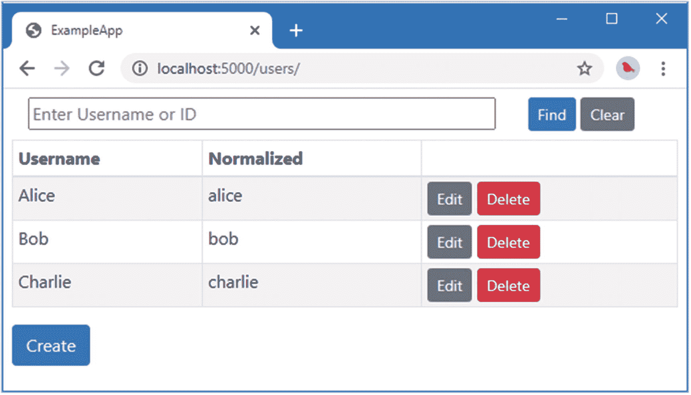
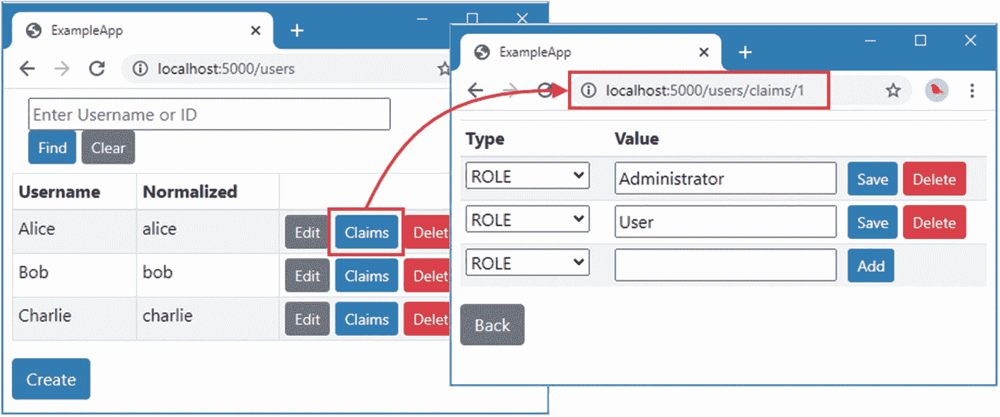
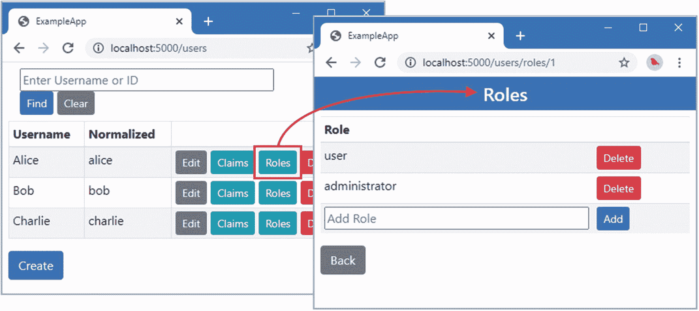
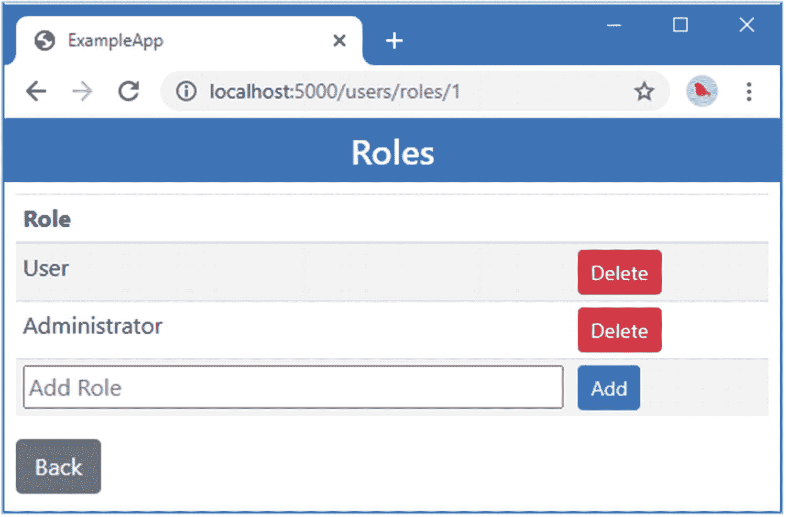
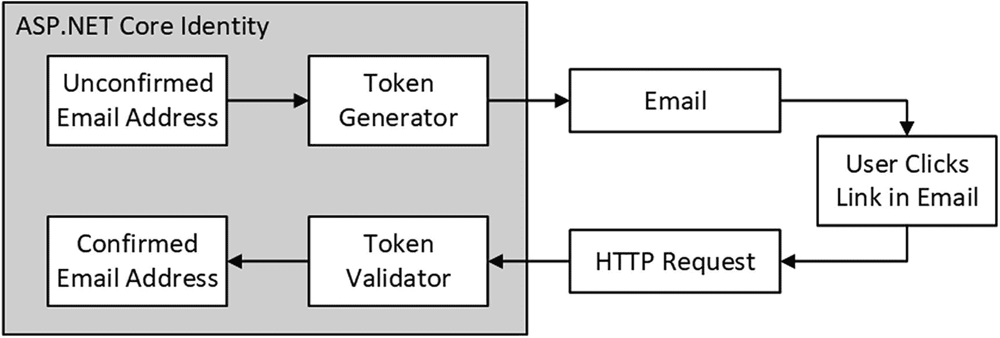
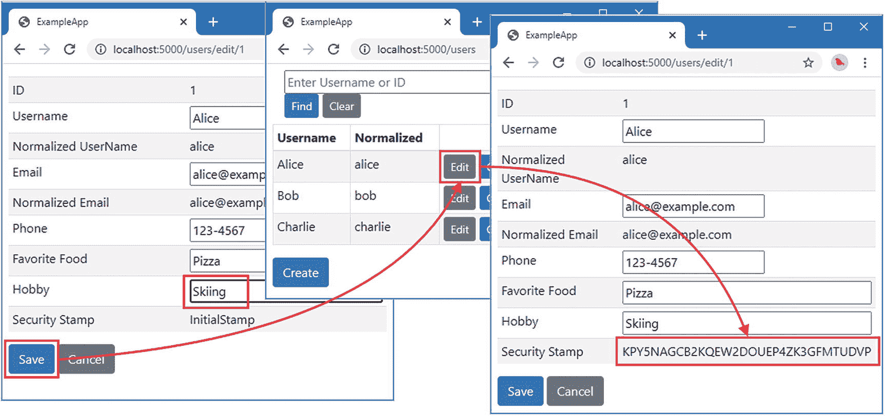
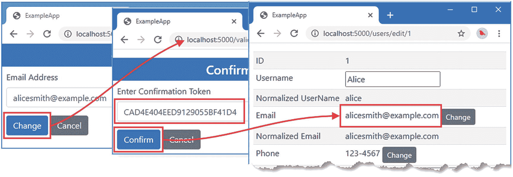
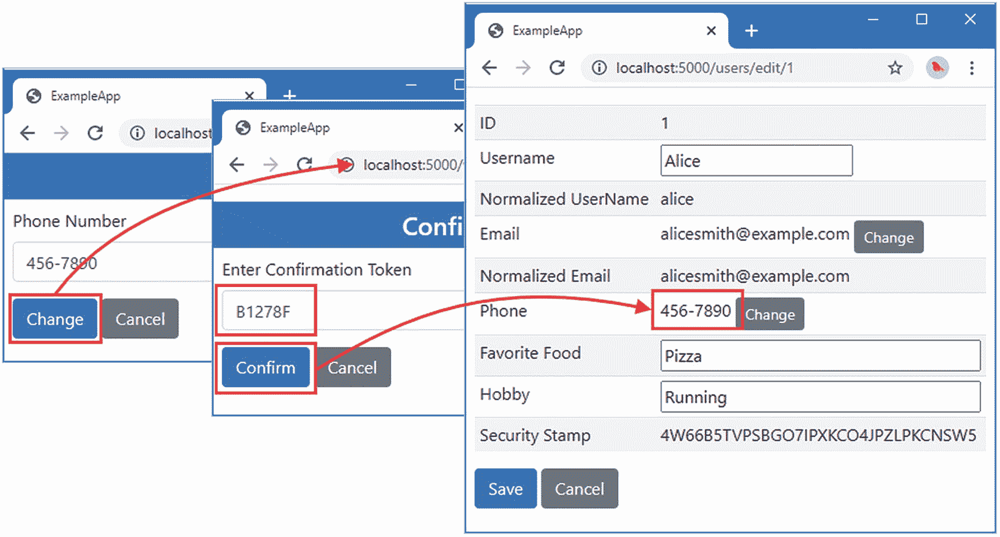
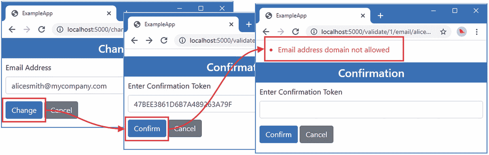

# 十七、声明、角色和确认

在这一章中，我继续向商店添加特性，并通过`UserManager<T>`类构建使用这些特性的管理工具。我首先添加对存储和管理声明的支持，然后使用这些特性添加对角色的支持，角色在 ASP.NET Core 和 ASP.NET Core Identity 中被赋予特殊的地位，因为它们被广泛使用。我还将向您展示如何生成和验证确认令牌，这些令牌用于确保用户可以访问他们提供的电子邮件地址或电话号码。表 [17-1](#Tab1) 给出了这些特征的背景。

表 17-1。

将声明、角色和确认放在上下文中

<colgroup><col class="tcol1 align-left"> <col class="tcol2 align-left"></colgroup> 
| 

问题

 | 

回答

 |
| --- | --- |
| 它们是什么？ | 角色限制对受保护资源的访问。声明存储有关用户的附加数据，包括角色。确认是发送给用户的令牌，用户将其返回给应用以证明其 Identity。 |
| 它们为什么有用？ | 角色被广泛用于定义授权策略。声明还可用于授权，并可用于存储有关用户的任何数据。确认确保可以通过用户存储中的电子邮件地址或电话号码联系到用户。 |
| 它们是如何使用的？ | 对于角色和声明，存储实现可选的接口。确认需要生成和验证变更令牌的自定义工作流。 |
| 有什么陷阱或限制吗？ | 必须注意处理角色名的规范化，如“理解角色规范化的陷阱”一节中所解释的。 |
| 还有其他选择吗？ | 这些是可选功能，如果您不需要基于角色的访问控制、需要存储附加数据或需要检查用户的电子邮件地址和电话号码，则这些功能不是必需的。 |

表 [17-2](#Tab2) 总结了本章内容。

表 17-2。

章节总结

<colgroup><col class="tcol1 align-left"> <col class="tcol2 align-left"> <col class="tcol3 align-left"></colgroup> 
| 

问题

 | 

解决办法

 | 

列表

 |
| --- | --- | --- |
| 支持用户存储中的声明 | 实现`IUserClaimStore<T>`接口。 | [2](#PC2)–[8](#PC8) |
| 用户存储中的支持角色 | 实现`IUserRoleStore<T>`接口。 | [9](#PC9)–[12](#PC12) |
| 避免角色名称规范化问题 | 将角色存储为声明。 | [13](#PC13) |
| 支持商店中的确认 | 实现`IUserSecurityStampStore<T>`，创建令牌生成器，并使用用户提供的联系信息将令牌发送给用户。 | [14](#PC14)–[30](#PC33) |

## 为本章做准备

本章使用第 [16 章](16.html)中的`ExampleApp`项目。准备本章不需要做任何改动。打开一个新的命令提示符，导航到`ExampleApp`文件夹，运行清单 [17-1](#PC1) 中所示的命令来启动 ASP.NET Core。

Tip

你可以从 [`https://github.com/Apress/pro-asp.net-core-identity`](https://github.com/Apress/pro-asp.net-core-identity) 下载本章以及本书其他章节的示例项目。如果在运行示例时遇到问题，请参见第 [1](01.html) 章获取帮助。

```cs
dotnet run

Listing 17-1.Running the Example Application

```

打开一个新的浏览器窗口并请求`http://localhost:5000/users`。您将看到如图 [17-1](#Fig1) 所示的用户数据。数据仅存储在内存中，当 ASP.NET Core 停止时，更改将会丢失。



图 17-1。

运行示例应用

## 将声明存储在用户存储中

现在我已经有了基本的特性，我可以开始向存储添加特性，从支持存储用户声明开始。可以管理索赔的商店实现了`IUserClaimStore<T>`接口，其中`<T>`是用户类。表 [17-3](#Tab3) 描述了由`IUserClaimStore<T>`接口定义的方法。与早期的存储接口一样，这些异步方法定义了一个`CancellationToken`参数，用于在操作被取消时接收通知，并在表中被命名为`token`。

表 17-3。

IUserClaimStore <t>方法</t>

<colgroup><col class="tcol1 align-left"> <col class="tcol2 align-left"></colgroup> 
| 

名字

 | 

描述

 |
| --- | --- |
| `GetClaimsAsync(user, token)` | 这个方法返回一个包含所有用户声明的`IList<Claim>`。 |
| `AddClaimsAsync(user, claims, token)` | 该方法将一个或多个声明添加到用户对象中，该用户对象作为一个`IEnumerable<Claim>`接收。 |
| `RemoveClaimsAsync(user, claims, token)` | 该方法删除对用户对象的一个或多个声明，该声明作为`IEnumerable<Claim>`接收。 |
| `ReplaceClaimAsync(user, oldClaim, newClaim, token)` | 这种方法用一个声明替换另一个声明。索赔不一定是同一类型的。 |
| `GetUsersForClaimAsync(claim, token)` | 该方法返回一个`IList<T>`对象，其中`T`是包含所有具有特定声明的用户的用户类。 |

为了准备存储声明，清单 [17-2](#PC2) 扩展了用户类以支持声明。

```cs
using System;
using System.Collections.Generic;
using System.Security.Claims;

namespace ExampleApp.Identity {
    public class AppUser {

        public string Id { get; set; } = Guid.NewGuid().ToString();

        public string UserName { get; set; }

        public string NormalizedUserName { get; set; }

        public string EmailAddress { get; set; }
        public string NormalizedEmailAddress { get; set; }
        public bool EmailAddressConfirmed { get; set; }

        public string PhoneNumber { get; set; }
        public bool PhoneNumberConfirmed { get; set; }

        public string FavoriteFood { get; set; }
        public string Hobby { get; set; }

        public IList<Claim> Claims { get; set; }
    }
}

Listing 17-2.Adding Claims in the AppUser.cs File in the Identity Folder

```

为了扩展示例用户存储以支持声明，将名为`UserStoreClaims.cs`的类文件添加到`ExampleApp/Identity/Store`文件夹中，并使用它来定义清单 [17-3](#PC3) 中所示的分部类。

```cs
using Microsoft.AspNetCore.Identity;
using Microsoft.VisualBasic;
using System;
using System.Collections.Generic;
using System.Linq;
using System.Security.Claims;
using System.Threading;
using System.Threading.Tasks;

namespace ExampleApp.Identity.Store {
    public partial class UserStore : IUserClaimStore<AppUser>,
            IEqualityComparer<Claim> {

        public Task AddClaimsAsync(AppUser user, IEnumerable<Claim> claims,
                CancellationToken token) {
            if (user.Claims == null) {
                user.Claims = new List<Claim>();
            }
            foreach (Claim claim in claims) {
                user.Claims.Add(claim);
            }
            return Task.CompletedTask;
        }

        public Task<IList<Claim>> GetClaimsAsync(AppUser user,
                CancellationToken token) => Task.FromResult(user.Claims);

        public Task RemoveClaimsAsync(AppUser user, IEnumerable<Claim> claims,
                CancellationToken token) {
            foreach (Claim c in user.Claims.Intersect(claims, this).ToList()) {
                user.Claims.Remove(c);
            }
            return Task.CompletedTask;
        }

        public async Task ReplaceClaimAsync(AppUser user, Claim oldclaim,
                Claim newClaim, CancellationToken token) {
            await RemoveClaimsAsync(user, new[] { oldclaim }, token);
            user.Claims.Add(newClaim);
        }

        public Task<IList<AppUser>> GetUsersForClaimAsync(Claim claim,
                CancellationToken token) =>
            Task.FromResult(
                Users.Where(u => u.Claims.Any(c => Equals(c, claim)))
                   .ToList() as IList<AppUser>);

        public bool Equals(Claim first, Claim second) =>
            first.Type == second.Type && string.Equals(first.Value, second.Value,
                    StringComparison.OrdinalIgnoreCase);

        public int GetHashCode(Claim claim) =>
            claim.Type.GetHashCode() + claim.Value.GetHashCode();
    }
}

Listing 17-3.The Contents of the UserStoreClaims.cs File in the Identity/Store Folder

```

Identity 并不强制限制商店如何管理索赔，但理解相同的索赔可能出现多次是很重要的。在清单 [17-3](#PC3) 中，我使用字典来跟踪对象，使用`AppUser.Id`属性作为键来存储`Claim`对象的集合。

要用声明播种存储，将清单 [17-4](#PC4) 中所示的语句添加到`UserStore.cs`文件中，该文件包含用户存储类的构造函数和种子数据。

```cs
using Microsoft.AspNetCore.Identity;
using System.Collections.Generic;
using System.Linq;
using System.Security.Claims;

namespace ExampleApp.Identity.Store {

    public partial class UserStore {

        public ILookupNormalizer Normalizer { get; set; }

        public UserStore(ILookupNormalizer normalizer) {
            Normalizer = normalizer;
            SeedStore();
        }

        private void SeedStore() {

            var customData = new Dictionary<string, (string food, string hobby)> {
                { "Alice", ("Pizza", "Running") },
                { "Bob", ("Ice Cream", "Cinema") },
                { "Charlie", ("Burgers", "Cooking") }
            };

            int idCounter = 0;

            string EmailFromName(string name) => $"{name.ToLower()}@example.com";

            foreach (string name in UsersAndClaims.Users) {
                AppUser user = new AppUser {
                    Id = (++idCounter).ToString(),
                    UserName = name,
                    NormalizedUserName = Normalizer.NormalizeName(name),
                    EmailAddress = EmailFromName(name),
                    NormalizedEmailAddress =
                        Normalizer.NormalizeEmail(EmailFromName(name)),
                    EmailAddressConfirmed = true,
                    PhoneNumber = "123-4567",
                    PhoneNumberConfirmed = true,
                    FavoriteFood = customData[name].food,
                    Hobby = customData[name].hobby
                };
                user.Claims =  UsersAndClaims.UserData[user.UserName]
                    .Select(role => new Claim(ClaimTypes.Role, role)).ToList();
                users.TryAdd(user.Id, user);
            }
        }
    }
}

Listing 17-4.Seeding Claims in the UserStore.cs File in the Identity/Store Folder

```

新代码使用在`UsersAndClaims`类中定义的种子数据用`Role`声明填充存储。

### 管理用户存储中的声明

`UserManager<T>`类提供了一组方法，当用户存储类实现`IUserClaimStore<T>`接口时，这些方法提供了对声明的访问，如表 [17-4](#Tab4) 中所述，以及一个允许检查声明支持的属性。

表 17-4。

UserManager <t>成员进行索赔</t>

<colgroup><col class="tcol1 align-left"> <col class="tcol2 align-left"></colgroup> 
| 

名字

 | 

描述

 |
| --- | --- |
| `SupportsUserClaim` | 如果用户存储实现了`IUserClaimStore<T>`接口，该属性将返回`true`。 |
| `GetClaimsAsync(user)` | 该方法通过调用商店的`GetClaimsAsync`方法返回指定用户的声明列表。 |
| `GetUsersForClaimAsync(claim)` | 该方法通过调用商店的`GetUsersForClaimAsync`方法返回具有指定声明的用户列表。 |
| `AddClaimsAsync(user, claims)` | 该方法向指定用户添加多个声明，并通过调用存储的`AddClaimsAsync`方法提交对存储的更改，之后执行用户管理器的更新序列。 |
| `AddClaimAsync(user, claim)` | 这个方便的方法创建一个包含单个声明的数组，并将其传递给`AddClaimsAsync`方法。 |
| `ReplaceClaimAsync(user, oldClaim, newClaim)` | 该方法通过调用存储的`ReplaceClaimAsync`方法来替换指定用户的声明，之后执行用户管理器的更新序列。 |
| `RemoveClaimsAsync(user, claims)` | 该方法从指定用户中删除多个声明，并通过调用存储的`RemoveClaimsAsync`方法将更改提交给存储，之后执行用户管理器的更新序列。 |
| `RemoveClaimAsync(user, claim)` | 这个方便的方法创建一个包含声明的数组，并调用`RemoveClaimsAsync`方法。 |

为了管理声明，将名为`_ClaimsRow.cshtml`的 Razor 视图添加到`Pages/Store`文件夹中，并使用它来定义清单 [17-5](#PC5) 中所示的部分视图。如果您使用的是 Visual Studio，则可以使用 Razor 视图-空项模板来创建此文件。

```cs
@model (string id, Claim claim, bool newClaim)

@{ string hash = Model.claim.GetHashCode().ToString(); }

<td>
    <form method="post" id="@hash">
        <input type="hidden" name="id" value="@Model.id" />
        <input type="hidden" name="oldtype" value="@Model.claim.Type" />
        <input type="hidden" name="oldValue" value="@Model.claim.Value" />
    </form>
    <select name="type" asp-for="claim.Type" form="@hash">
        <option value="@ClaimTypes.Role">ROLE</option>
        <option value="@ClaimTypes.GivenName">GIVENNAME</option>
        <option value="@ClaimTypes.Surname">SURNAME</option>
    </select>
</td>
<td>
    <input class="w-100" name="value" value="@Model.claim.Value" form="@hash" />
</td>
<td>
    <button asp-page-handler="@(Model.newClaim ? "add" : "edit")"
        form="@hash" type="submit" class="btn btn-sm btn-info">
            @(Model.newClaim ? "Add" : "Save")
    </button>
    @if (!Model.newClaim) {
        <button asp-page-handler="delete" form="@hash" type="submit"
            class="btn btn-sm btn-danger">Delete</button>
    }
</td>

Listing 17-5.The Contents of the _ClaimsRow.cshtml File in the Pages/Store Folder

```

这个局部视图产生了一组表格单元格，其中包含一个`select`元素和一个声明的文本字段。`select`元素允许选择声明的类型，文本字段允许编辑值。每行都有保存更改或删除索赔的按钮。声明可以有任何字符串值作为它们的类型，但是为了保持例子的简单，局部视图只支持`Role`、`GivenName`和`Surname`声明类型，使用来自`ClaimTypes`类的值。

在`Pages/Store`文件夹中添加一个名为`Claims.cshtml`的 Razor 页面，内容如清单 [17-6](#PC6) 所示。

```cs
@page "/users/claims/{id?}"
@model ExampleApp.Pages.Store.ClaimsModel

@{
    Claim newClaim = new Claim(string.Empty, string.Empty);
}

<h4 class="bg-primary text-white text-center p-2">Claims</h4>

<div class="m-2">
    <table class="table table-sm table-striped">
        <thead><tr><th>Type</th><th>Value</th><th/></tr></thead>
        <tbody>
            @foreach (Claim claim in Model.Claims) {
                <tr>
                    <partial name="_ClaimsRow"
                        model="@((Model.AppUserObject.Id, claim, false))" />
                </tr>
            }
            <tr>
                <partial name="_ClaimsRow"
                    model="@((Model.AppUserObject.Id, newClaim, true))" />
            </tr>
        </tbody>
    </table>
    <div>
        <a asp-page="users" class="btn btn-secondary">Back</a>
    </div>
</div>

Listing 17-6.The Contents of the Claims.cshtml File in the Pages/Store Folder

```

Razor 页面使用`_ClaimsRow`局部视图来显示用户的声明。为了定义页面模型，将清单 [17-7](#PC7) 中所示的代码添加到`Claims.cshtml.cs`文件中。(如果您使用的是 Visual Studio 代码，则必须创建该文件。)

```cs
using System;
using System.Collections.Generic;
using System.Linq;
using System.Security.Claims;
using System.Threading.Tasks;
using Microsoft.AspNetCore.Identity;
using Microsoft.AspNetCore.Mvc;
using Microsoft.AspNetCore.Mvc.RazorPages;
using ExampleApp.Identity;

namespace ExampleApp.Pages.Store {

    public class ClaimsModel : PageModel {

        public ClaimsModel(UserManager<AppUser> userMgr) => UserManager = userMgr;

        public UserManager<AppUser> UserManager { get; set; }

        public AppUser AppUserObject { get; set; } = new AppUser();

        public IList<Claim> Claims { get; set; } = new List<Claim>();

        public string GetName(string claimType) =>
            (Uri.IsWellFormedUriString(claimType, UriKind.Absolute)
                ? System.IO.Path.GetFileName(new Uri(claimType).LocalPath)
                : claimType).ToUpper();

        public async Task OnGetAsync(string id) {
            if (id != null) {
                AppUserObject = await UserManager.FindByIdAsync(id) ?? new AppUser();
                Claims = (await UserManager.GetClaimsAsync(AppUserObject))
                    .OrderBy(c => c.Type).ThenBy(c => c.Value).ToList();
            }
        }

        public async Task<IActionResult> OnPostAdd(string id, string type,
                string value) {
            AppUser user = await UserManager.FindByIdAsync(id);
            await UserManager.AddClaimAsync(user, new Claim(type, value));
            return RedirectToPage();
        }

        public async Task<IActionResult> OnPostEdit(string id, string oldType,
                string type, string oldValue, string value) {
            AppUser user = await UserManager.FindByIdAsync(id);
            if (user != null) {
                await UserManager.ReplaceClaimAsync(user,
                    new Claim(oldType, oldValue), new Claim(type, value));
            }
            return RedirectToPage();
        }

        public async Task<IActionResult> OnPostDelete(string id, string type,
                string value) {
            AppUser user = await UserManager.FindByIdAsync(id);
            await UserManager.RemoveClaimAsync(user, new Claim(type, value));
            return RedirectToPage();
        }
    }
}

Listing 17-7.The Contents of the Claims.cshtml.cs File in the Pages/Store Folder

```

页面模型使用表 [17-3](#Tab3) 中描述的方法，为其视图提供通过`UserManager<T >`类获得的索赔数据。对用户声明的更改也可以使用`UserManager<T>`类来执行，允许创建、编辑和删除声明。

为了将索赔功能集成到应用的其余部分，将清单 [17-8](#PC8) 中所示的表达式添加到`Pages/Store`文件夹中的`_UserTableRow.cshtml`文件中。

```cs
@model string
@inject UserManager<AppUser> UserManager

<a asp-page="edituser" asp-route-id="@Model" class="btn btn-sm btn-secondary">
    Edit
</a>
@if (UserManager.SupportsUserClaim) {
    <a asp-page="claims" asp-route-id="@Model" class="btn btn-sm btn-info">
        Claims
    </a>
}

Listing 17-8.Adding a Button in the _UserTableRow.cshtml File in the Pages/Store Folder

```

一个`if`表达式决定用户存储是否支持声明，如果支持，就会显示一个导航到`Claims` Razor 页面的按钮。重启 ASP.NET Core 并请求`http://localhost:5000/users`。点击 Alice 的 Claims 按钮，您将看到为该用户存储的声明集，如图 [17-2](#Fig2) 所示。您可以使用该表单添加索赔或更改索赔类型和值。单击删除按钮可以删除索赔。



图 17-2。

通过 UserManager <t>类管理声明</t>

## 在用户存储中存储角色

尽管角色可以表示为声明，但对角色的支持早于声明的采用，角色仍然是管理授权的最常见方式。可以管理角色的用户存储实现了`IUserRoleStore<T>`接口，其中`T`是用户类。`IUserRoleStore<T>`接口定义了表 [17-5](#Tab5) 中描述的方法。与用户存储接口一样，表 [17-5](#Tab5) 中的方法定义了一个`CancellationToken`参数，用于在异步操作被取消时接收通知。

Caution

Identity 管理角色的方式为粗心的人提供了一个陷阱，这将在本章后面的“理解角色规范化陷阱”一节中解释。

表 17-5。

IUserRoleStore <t>方法</t>

<colgroup><col class="tcol1 align-left"> <col class="tcol2 align-left"></colgroup> 
| 

名字

 | 

描述

 |
| --- | --- |
| `GetUsersInRoleAsync(role, token)` | 此方法返回一个用户对象列表，这些用户对象代表被分配了指定角色的用户。 |
| `GetRolesAsync(user, token)` | 此方法返回指定用户的角色名称列表。 |
| `IsInRoleAsync(user, roleName, token)` | 如果指定的用户是指定角色的成员，该方法返回`true`。 |
| `AddToRoleAsync(user, roleName, token)` | 此方法将指定的用户添加到角色中。 |
| `RemoveFromRoleAsync(user, roleName, token)` | 此方法从角色中移除指定的用户。 |

为了扩展用户存储来管理角色数据，将名为`UserStoreRoles.cs`的类文件添加到`Identity/Store`文件夹中，并使用它来定义清单 [17-9](#PC9) 中所示的分部类。

```cs
using Microsoft.AspNetCore.Identity;
using System.Collections.Generic;
using System.Linq;
using System.Security.Claims;
using System.Threading;
using System.Threading.Tasks;

namespace ExampleApp.Identity.Store {
    public partial class UserStore : IUserRoleStore<AppUser> {

        public Task<IList<AppUser>> GetUsersInRoleAsync(string roleName,
                CancellationToken token)
            => GetUsersForClaimAsync(new Claim(ClaimTypes.Role, roleName), token);

        public async Task<IList<string>> GetRolesAsync(AppUser user,
                CancellationToken token)
            => (await GetClaimsAsync(user, token))
                .Where(claim => claim.Type == ClaimTypes.Role)
                .Distinct().Select(claim => Normalizer.NormalizeName(claim.Value))
                .ToList();

        public async Task<bool> IsInRoleAsync(AppUser user, string
                normalizedRoleName, CancellationToken token)
            => (await GetRolesAsync(user, token)).Any(role =>
                    Normalizer.NormalizeName(role) == normalizedRoleName);

        public Task AddToRoleAsync(AppUser user, string roleName,
                CancellationToken token)
            => AddClaimsAsync(user, GetClaim(roleName), token);

        public async Task RemoveFromRoleAsync(AppUser user,
                string normalizedRoleName, CancellationToken token) {
            IEnumerable<Claim> claimsToDelete = (await GetClaimsAsync(user, token))
                .Where(claim => claim.Type == ClaimTypes.Role
                    && Normalizer.NormalizeName(claim.Value) == normalizedRoleName);
           await RemoveClaimsAsync(user, claimsToDelete, token);
        }

        private IEnumerable<Claim> GetClaim(string role) =>
            new[] { new Claim(ClaimTypes.Role, role) };
    }
}

Listing 17-9.The Contents of the UserStoreRoles.cs File in the Identity/Store Folder

```

ASP.NET Core Identity 并不规定用户存储如何管理角色。由于我已经支持管理声明，并且角色可以很容易地表示为声明，所以我通过存储类型为`Role`的声明实现了`IUserRoleStore<T>`接口。唯一复杂的是`UserManager<T>`类提供的用于管理角色的方法(在下一节的表 [17-6](#Tab6) 中描述)规范化了角色的名称以保持一致性。这是一个明智的策略，但是意味着在清单 [17-9](#PC9) 中需要额外的工作来确保角色名称被正确地映射到声明上。(此示例不需要种子数据，因为商店已经植入了角色声明。)

### 管理用户存储中的角色

`UserManager<T>`类提供了一组方法，当用户存储类实现`IUserRoleStore<T>`接口时，这些方法提供对角色的访问，如表 [17-6](#Tab6) 中所述，以及允许检查角色支持的属性。

表 17-6。

角色的用户经理<t>成员</t>

<colgroup><col class="tcol1 align-left"> <col class="tcol2 align-left"></colgroup> 
| 

名字

 | 

描述

 |
| --- | --- |
| `SupportsUserRole` | 当用户存储实现`IUserRoleStore<T>`接口时，该属性返回 true。 |
| `AddToRoleAsync(user, role)` | 此方法将用户添加到角色中。角色名是规范化的，存储的`IsInRoleAsync`用于确定用户是否已经在角色中，在这种情况下会抛出一个异常。否则，将使用商店的`AddToRoleAsync`方法将用户添加到角色中，然后执行用户管理器的更新序列。 |
| `AddToRolesAsync(user, roles)` | 这种方便的方法使用与`AddToRoleAsync`方法相同的方法将用户添加到多个角色。将用户添加到所有角色后，将执行更新序列。 |
| `RemoveFromRoleAsync(user, role)` | 此方法从角色中移除用户。角色是规范化的，在调用存储的`RemoveFromRoleAsync`之前，使用存储的`IsInRoleAsync`方法来确保用户是角色的成员，随后是用户管理器的更新序列。 |
| `RemoveFromRolesAsync(user, roles)` | 这种方便的方法使用与`RemoveFromRoleAsync`方法相同的方法将用户从多个角色中移除。从所有角色中删除用户后，将执行用户管理器的更新序列。 |
| `GetRolesAsync(user)` | 该方法返回用户的角色，表示为从用户存储的`GetRolesAsync`方法获得的列表。 |
| `IsInRoleAsync(user, role)` | 如果用户有指定的角色，这个方法返回`true`。角色在被传递给用户存储的`IsInRoleAsync`方法之前被规范化。 |
| `GetUsersInRoleAsync(role)` | 此方法返回具有指定角色的用户列表。角色在被传递给用户存储的`GetUsersInRoleAsync`方法之前被规范化。 |

为了管理用户的角色，在`Pages/Store`文件夹中添加一个名为`UserRoles.cshtml`的 Razor 页面，内容如清单 [17-10](#PC10) 所示。

```cs
@page "/users/roles/{id?}"
@model ExampleApp.Pages.Store.UserRolesModel

<h4 class="bg-primary text-white text-center p-2">Roles</h4>
<div class="m-2">
    <table class="table table-sm table-striped">
        <thead><tr><th>Role</th><th/></tr></thead>
        <tbody>
            @foreach (string role in Model.Roles) {
                <tr>
                    <td>@role</td>
                    <td>
                        <form method="post">
                            <input type="hidden" name="id" value="@Model.Id" />
                            <input type="hidden" name="role" value="@role" />
                            <button type="submit" class="btn btn-sm btn-danger"
                                    asp-page-handler="delete">
                                Delete
                            </button>
                        </form>
                    </td>
                </tr>
            }
            <tr>
                <td>
                    <form method="post" id="newRole">
                        <input type="hidden" name="id" value="@Model.Id" />
                        <input class="w-100" name="newRole" placeholder="Add Role" />
                    </form>
                </td>
                <td>
                    <button type="submit" class="btn btn-sm btn-primary"
                            asp-page-handler="add" form="newRole">
                        Add
                    </button>
                </td>
            </tr>
        </tbody>
    </table>
    <div>
        <a asp-page="users" class="btn btn-secondary">Back</a>
    </div>
</div>

Listing 17-10.The Contents of the UserRoles.cshtml File in the Pages/Store Folder

```

Razor 页面显示了一个包含用户被分配的角色的表格，以及一个将用户从角色中删除的删除按钮。表中有一行允许将用户添加到新角色。

将清单 [17-11](#PC11) 中所示的代码添加到`UserRoles.cshtml.cs`文件中，以定义页面模型类。(如果您使用的是 Visual Studio 代码，则必须创建该文件。)

```cs
using ExampleApp.Identity;
using Microsoft.AspNetCore.Identity;
using Microsoft.AspNetCore.Mvc;
using Microsoft.AspNetCore.Mvc.RazorPages;
using System.Collections.Generic;
using System.Linq;
using System.Threading.Tasks;

namespace ExampleApp.Pages.Store {

    public class UserRolesModel : PageModel {

        public UserRolesModel(UserManager<AppUser> userManager)
            => UserManager = userManager;

        public UserManager<AppUser> UserManager { get; set; }

        public IEnumerable<string> Roles { get; set; } = Enumerable.Empty<string>();

        [BindProperty(SupportsGet = true)]
        public string Id { get; set; }

        public async void OnGet() {
            AppUser user = await GetUser();
            if (user != null) {
                Roles = await UserManager.GetRolesAsync(user);
            }
        }

        public async Task<IActionResult> OnPostAdd(string newRole) {
            await UserManager.AddToRoleAsync(await GetUser(), newRole);
            return RedirectToPage();
        }

        public async Task<IActionResult> OnPostDelete(string role) {
            await UserManager.RemoveFromRoleAsync(await GetUser(), role);
            return RedirectToPage();
        }

        private Task<AppUser> GetUser() => Id == null
            ? null : UserManager.FindByIdAsync(Id);
    }
}

Listing 17-11.The Contents of the UserRoles.cshtml.cs File in the Pages/Store Folder

```

页面模型类使用由`UserManager<T>`类定义的方法来查找`AppUser`对象，并使用表 [17-6](#Tab6) 中描述的方法来管理角色分配。GET handler 方法获取用户的当前角色分配；发布处理程序方法添加和删除角色成员。

在清单 [17-12](#PC12) 中，我在`_UserTableRow.cshtml`局部视图中添加了一个按钮，如果用户存储支持角色数据，这个按钮可以导航到`UserRoles` Razor 页面。

```cs
@model string
@inject UserManager<AppUser> UserManager

<a asp-page="edituser" asp-route-id="@Model" class="btn btn-sm btn-secondary">
    Edit
</a>
@if (UserManager.SupportsUserClaim) {
    <a asp-page="claims" asp-route-id="@Model" class="btn btn-sm btn-info">
        Claims
    </a>
}

@if (UserManager.SupportsUserRole) {
    <a asp-page="userroles" asp-route-id="@Model" class="btn btn-sm btn-info">
        Roles
    </a>
}

Listing 17-12.Adding a Button in the _UserTableRow.cshtml File in the Pages/Store Folder

```

重启 ASP.NET Core，请求`http://localhost:5000/users`，并为其中一个用户点击 Roles 按钮。显示的角色将对应于用户的角色声明，尽管名称将被规范化，如图 [17-3](#Fig3) 所示。请记住，在第 [18 章](18.html)之前，存储在数据库中的角色不会用于授权。



图 17-3。

管理角色

### 了解角色规范化陷阱

ASP.NET Core 评估角色的方式与按 Identity 存储角色的方式不匹配。当使用表 [17-6](#Tab6) 中描述的方法将用户分配到一个角色时，角色的名称在添加到存储之前会被规范化。

当 ASP.NET Core 评估通过`Authorize`属性指定的角色需求时，它使用`ClaimsPrincipal.IsInRole`，该属性对匹配的角色声明执行区分大小写的搜索。这可能经常无法匹配其名称在存储中已被规范化的角色。你可以在图 [17-3](#Fig3) 中看到标准化的效果。尽管爱丽丝对`User`和`Administrator`角色有角色声明，但它们显示为`user`和`administrator`。

有三种方法可以避免这个问题。第一个是表达角色需求，以匹配存储中规范化的角色名称。这是一个简单的修复方法，但是只有当你确信规格化器不会改变时才有效。这意味着当使用默认的 Identity 规范化器时，角色应该用大写字母指定(例如，`ADMINISTRATOR`)，而对于我在第 [16 章](16.html)中创建的规范化器，角色应该用小写字母指定(例如，`administrator`)。

第二种方法是使用分配给用户对象的规范化角色名称作为在另一个数据存储中定位非规范化名称的关键字。这是实体框架核心用户存储使用的方法，也是角色存储需要使用第 1 部分中的角色的原因，即使我不需要角色存储提供的任何直接特性(这些特性在第 [19](19.html) 章中有描述)。

剩下的方法是将角色作为声明直接管理，避免由`UserManager<T>`方法执行的规范化。这些方法都不理想，但我更喜欢将角色存储为声明，因为这意味着未来对规范化器的更改不会破坏基于角色的授权。在第 [19 章](19.html)中，我创建了一个自定义角色库，并演示了如何用它来创建一个角色主列表。

在清单 [17-13](#PC13) 中，我修改了`UserRoles`页面模型类以获得声明角色。

```cs
using ExampleApp.Identity;
using Microsoft.AspNetCore.Identity;
using Microsoft.AspNetCore.Mvc;
using Microsoft.AspNetCore.Mvc.RazorPages;
using System.Collections.Generic;
using System.Linq;
using System.Threading.Tasks;
using System.Security.Claims;

namespace ExampleApp.Pages.Store {

    public class UserRolesModel : PageModel {

        public UserRolesModel(UserManager<AppUser> userManager)
            => UserManager = userManager;

        public UserManager<AppUser> UserManager { get; set; }

        public IEnumerable<string> Roles { get; set; } = Enumerable.Empty<string>();

        [BindProperty(SupportsGet = true)]
        public string Id { get; set; }

        public async void OnGet() {
            AppUser user = await GetUser();
            if (user != null) {
                //Roles = await UserManager.GetRolesAsync(user);
                Roles = (await UserManager.GetClaimsAsync(user))?
                    .Where(c => c.Type == ClaimTypes.Role).Select(c => c.Value);
            }
        }

        public async Task<IActionResult> OnPostAdd(string newRole) {
            //await UserManager.AddToRoleAsync(await GetUser(), newRole);
            await UserManager.AddClaimAsync(await GetUser(),
                new Claim(ClaimTypes.Role, newRole));
            return RedirectToPage();
        }

        public async Task<IActionResult> OnPostDelete(string role) {
            await UserManager.RemoveFromRoleAsync(await GetUser(), role);
            return RedirectToPage();
        }

        private Task<AppUser> GetUser() => Id == null
            ? null : UserManager.FindByIdAsync(Id);
    }
}

Listing 17-13.Using Claims in the UserRoles.cshtml.cs File in the Pages/Store Folder

```

使用管理声明的方法来获取用户角色和添加新角色。我不需要更改删除角色的代码，因为可以使用规范化的角色名称来完成该操作，而不会导致任何问题。重新启动 ASP.NET Core 并查看爱丽丝的角色；你会看到角色名现在是大小写混合，如图 [17-4](#Fig4) 所示。



图 17-4。

避免角色规范化陷阱

## 确认用户联系数据

确认是验证商店中用户的联系数据是否正确的过程。用户可以输入有效的电话号码或电子邮件地址，但在使用这些值之前，确认他们可以接收电话或电子邮件是很重要的，特别是当他们用于登录应用或作为密码恢复过程的一部分时。

### 了解确认流程

确认过程通过生成令牌并通过被确认的通信信道将其发送给用户来执行。例如，这意味着通过电子邮件发送令牌以确认电子邮件地址，并作为 SMS 文本消息发送到一个电话号码。

然后，用户向应用提供令牌，以证明他们控制了电子邮件地址或电话号码。在电子邮件的情况下，这通常包括点击包含令牌的链接，如图 [17-5](#Fig5) 所示。在 SMS 消息的情况下，用户通常将令牌输入 HTML 表单。



图 17-5。

确认序列

### 创建电子邮件和短信服务提供商

确认流程需要能够向用户发送确认电子邮件或文本，这需要使用第三方服务，或者在企业环境中使用中央服务器。

对于这本书，我将只模拟发送电子邮件和短信的过程。配置通信提供者的过程本身就是一个主题，超出了本书的范围。创建`ExampleApp/Services`文件夹，并添加一个名为`EmailService.cs`的类文件，代码如清单 [17-14](#PC14) 所示。

```cs
using ExampleApp.Identity;
using System;

namespace ExampleApp.Services {

    public interface IEmailSender {

        public void SendMessage(AppUser user, string subject, params string[] body);
    }

    public class ConsoleEmailSender : IEmailSender {

        public void SendMessage(AppUser user, string subject, params string[] body) {
            Console.WriteLine("--- Email Starts ---");
            Console.WriteLine($"To: {user.EmailAddress}");
            Console.WriteLine($"Subject: {subject}");
            foreach (string str in body) {
                Console.WriteLine(str);
            }
            Console.WriteLine("--- Email Ends ---");
        }
    }
}

Listing 17-14.The Contents of the EmailService.cs File in the Services Folder

```

`IEmailSender`接口定义了发送邮件的抽象接口，`ConsoleEmailSender`实现了该接口，通过向控制台写入消息来模拟发送邮件。

Using Email and SMS Providers

我的建议是使用商业邮件和短信服务，而不是尝试建立自己的服务。让消息传递正常工作可能很困难，并且很容易错误地配置服务，从而使您的用户收到过多或过少的消息。如果你不知道从哪里开始，那就试试 Twilio ( [`https://www.twilio.com`](https://www.twilio.com) )或者亚马逊的简单通知服务( [`https://aws.amazon.com/sns`](https://aws.amazon.com/sns) )。Twilio 是微软与 Azure 合作的提供商，亚马逊网络服务无需介绍。我与这两种服务都没有关系，但是它们都提供了 C# API，并提供了一系列的定价选项，包括免费层。如果你不喜欢 SendGrid 或 Amazon Web Services，有很多选择。

接下来，将名为`SMSService.cs`的类文件添加到`ExampleApp/Services`文件夹中，代码如清单 [17-15](#PC15) 所示。

```cs
using ExampleApp.Identity;
using System;

namespace ExampleApp.Services {

    public interface ISMSSender {

        public void SendMessage(AppUser user, params string[] body);
    }

    public class ConsoleSMSSender : ISMSSender {

        public void SendMessage(AppUser user, params string[] body) {
            Console.WriteLine("--- SMS Starts ---");
            Console.WriteLine($"To: {user.PhoneNumber}");
            foreach (string str in body) {
                Console.WriteLine(str);
            }
            Console.WriteLine("--- SMS Ends ---");
        }
    }
}

Listing 17-15.The Contents of the SMSService.cs File in the Services Folder

```

`ISMSSender`接口定义了发送 SMS 消息的抽象接口，而`ConsoleSMSSender`实现了该接口，并通过向控制台写入消息来模拟发送 SMS。清单 [17-16](#PC16) 将 email 和 SMS 类注册为服务，因此它们可以通过依赖注入来使用。

```cs
using Microsoft.AspNetCore.Builder;
using Microsoft.AspNetCore.Hosting;
using Microsoft.AspNetCore.Http;
using Microsoft.Extensions.DependencyInjection;
using ExampleApp.Custom;
using Microsoft.AspNetCore.Authentication.Cookies;
using Microsoft.AspNetCore.Authorization;
using Microsoft.AspNetCore.Identity;
using ExampleApp.Identity;
using ExampleApp.Identity.Store;
using ExampleApp.Services;

namespace ExampleApp {
    public class Startup {

        public void ConfigureServices(IServiceCollection services) {
            services.AddSingleton<ILookupNormalizer, Normalizer>();
            services.AddSingleton<IUserStore<AppUser>, UserStore>();
            services.AddSingleton<IEmailSender, ConsoleEmailSender>();
            services.AddSingleton<ISMSSender, ConsoleSMSSender>();
            services.AddIdentityCore<AppUser>();

            services.AddSingleton<IUserValidator<AppUser>, EmailValidator>();

            services.AddAuthentication(opts => {
                opts.DefaultScheme
                    = CookieAuthenticationDefaults.AuthenticationScheme;
            }).AddCookie(opts => {
                opts.LoginPath = "/signin";
                opts.AccessDeniedPath = "/signin/403";
            });
            services.AddAuthorization(opts => {
                AuthorizationPolicies.AddPolicies(opts);
            });
            services.AddRazorPages();
            services.AddControllersWithViews();
        }

        public void Configure(IApplicationBuilder app, IWebHostEnvironment env) {

            app.UseStaticFiles();
            app.UseAuthentication();
            app.UseRouting();
            //app.UseMiddleware<RoleMemberships>();
            app.UseAuthorization();

            app.UseEndpoints(endpoints => {
                endpoints.MapRazorPages();
                endpoints.MapDefaultControllerRoute();
                endpoints.MapFallbackToPage("/Secret");
            });
        }
    }
}

Listing 17-16.Registering Services in the Startup.cs File in the ExampleApp Folder

```

### 在用户存储中存储安全戳

下一步是实现用户存储的可选接口，该接口增加了对管理安全戳的支持。安全戳是一种令牌，每次对用户进行更改时都会更新，如果用户的详细信息有后续更改，它可以防止确认令牌被验证。这避免了用户收到确认令牌，再次更改其电子邮件地址，然后才验证令牌的情况，结果是用户在新地址接收电子邮件的能力没有得到正确验证。安全戳记是字符串，清单 [17-17](#PC17) 更新了用户类，为戳记添加了一个属性。

```cs
using System;
using System.Collections.Generic;
using System.Security.Claims;

namespace ExampleApp.Identity {
    public class AppUser {

        public string Id { get; set; } = Guid.NewGuid().ToString();

        public string UserName { get; set; }

        public string NormalizedUserName { get; set; }

        public string EmailAddress { get; set; }
        public string NormalizedEmailAddress { get; set; }
        public bool EmailAddressConfirmed { get; set; }

        public string PhoneNumber { get; set; }
        public bool PhoneNumberConfirmed { get; set; }

        public string FavoriteFood { get; set; }
        public string Hobby { get; set; }

        public IList<Claim> Claims { get; set; }

        public string SecurityStamp { get; set; }
    }
}

Listing 17-17.Adding a Property in the AppUser.cs File in the Identity Folder

```

可以管理安全戳的用户存储实现了`IUserSecurityStampStore<T>`接口，该接口定义了表 [17-7](#Tab7) 中描述的方法。和前面的例子一样，类型`T`是用户类，`token`参数是一个在异步任务被取消时使用的`CancellationToken`对象。

表 17-7。

IUserSecurityStampStore <t>方法</t>

<colgroup><col class="tcol1 align-left"> <col class="tcol2 align-left"></colgroup> 
| 

名字

 | 

描述

 |
| --- | --- |
| `SetSecurityStampAsync(user, stamp, token)` | 此方法为指定用户设置新的安全戳。 |
| `GetSecurityStampAsync(user, token)` | 此方法检索指定用户的安全戳。 |

为了扩展示例用户存储来实现接口，将名为`UserStoreSecurityStamps.cs`的类文件添加到`Identity/Store`文件夹中，并使用它来定义清单 [17-18](#PC18) 中所示的分部类。

```cs
using Microsoft.AspNetCore.Identity;
using System.Threading;
using System.Threading.Tasks;

namespace ExampleApp.Identity.Store {
    public partial class UserStore : IUserSecurityStampStore<AppUser> {

        public Task<string> GetSecurityStampAsync(AppUser user,
                CancellationToken token) =>
            Task.FromResult(user.SecurityStamp);

        public Task SetSecurityStampAsync(AppUser user, string stamp,
                CancellationToken token) {
            user.SecurityStamp = stamp;
            return Task.CompletedTask;
        }
    }
}

Listing 17-18.The Contents of the UserStoreSecurityStamps.cs File in the Identity/Store Folder

```

接口实现很简单，只需要读写清单 [17-17](#PC17) 中定义的`SecurityStamp`属性。

#### 更新安全戳

用户对象的安全戳可以通过列表 [17-17](#PC17) 中添加的属性直接访问，或者通过表 [17-8](#Tab8) 中描述的`UserManager<T>`成员访问。

表 17-8。

安全戳的用户管理器<t>成员</t>

<colgroup><col class="tcol1 align-left"> <col class="tcol2 align-left"></colgroup> 
| 

名字

 | 

描述

 |
| --- | --- |
| `SupportsUserSecurityStamp` | 如果用户存储实现了`IUserSecurityStampStore<T>`接口，该属性将返回`true`。 |
| `GetSecurityStampAsync(user)` | 该方法通过调用用户存储的`GetSecurityStampAsync`方法返回指定用户的当前安全戳。 |
| `UpdateSecurityStampAsync(user)` | 此方法更新指定用户的安全戳。这个标记是由`UserManager<T>`类使用传递给用户存储的`SetSecurityStampAsync`方法的随机数据生成的，之后执行用户管理器的更新序列。 |

在`Pages/Store`文件夹中添加一个名为`_EditUserSecurityStamp.cshtml`的 Razor 视图，内容如清单 [17-19](#PC19) 所示。

```cs
@model AppUser
@inject UserManager<AppUser> UserManager

@if (UserManager.SupportsUserSecurityStamp) {
    <tr>
        <td>Security Stamp</td>
        <td>@Model.SecurityStamp</td>
    </tr>
}

Listing 17-19.The Contents of the _EditUserSecurityStamp.cshtml File in the Pages/Store Folder

```

添加清单 [17-20](#PC20) 中所示的元素，将新的局部视图合并到应用中。

```cs
@page "/users/edit/{id?}"
@model ExampleApp.Pages.Store.UsersModel

<div asp-validation-summary="All" class="text-danger m-2"></div>

<div class="m-2">
    <form method="post">
        <input type="hidden" name="id" value="@Model.AppUserObject.Id" />
        <table class="table table-sm table-striped">
            <tbody>
                <partial name="_EditUserBasic" model="@Model.AppUserObject" />
                <partial name="_EditUserEmail" model="@Model.AppUserObject" />
                <partial name="_EditUserPhone" model="@Model.AppUserObject" />
                <partial name="_EditUserCustom" model="@Model.AppUserObject" />
                <partial name="_EditUserSecurityStamp"
                    model="@Model.AppUserObject" />
            </tbody>
        </table>
        <div>
            <button type="submit" class="btn btn-primary">Save</button>
            <a asp-page="users" class="btn btn-secondary">Cancel</a>
        </div>
    </form>
</div>

Listing 17-20.Displaying the Security Stamp in the EditUser.cshtml File in the Pages/Store Folder

```

当用户存储支持安全戳时，将显示当前戳。设置属性值的`UserManager<T>`方法自动更新安全戳，但是我必须直接执行这个任务，因为我是直接设置用户对象属性，如清单 [17-21](#PC21) 所示。

```cs
...
public async Task<IActionResult> OnPost(AppUser user) {
    IdentityResult result;
    AppUser storeUser = await UserManager.FindByIdAsync(user.Id);
    if (storeUser == null) {
        result = await UserManager.CreateAsync(user);
    } else {
        storeUser.UpdateFrom(user, out bool changed);
        if (changed && UserManager.SupportsUserSecurityStamp) {
            await UserManager.UpdateSecurityStampAsync(storeUser);
        }
        result = await UserManager.UpdateAsync(storeUser);
    }
    if (result.Succeeded) {
        return RedirectToPage("users", new { searchname = user.Id });
    } else {
        foreach (IdentityError err in result.Errors) {
            ModelState.AddModelError("", err.Description ?? "Error");
        }
        AppUserObject = user;
        return Page();
    }
}
...

Listing 17-21.Updating the Security Stamp in the EditUser.cshtml.cs File in the Pages/Identity Folder

```

`CreateAsync`方法会自动生成一个安全标记，这就是为什么我只在使用`UpdateAsync`方法以及一个或多个属性被更改时才显式更新标记。在清单 [17-22](#PC22) 中，我已经更新了种子用户存储的代码，以便在初始数据中包含安全戳。

```cs
...
foreach (string name in UsersAndClaims.Users) {
    AppUser user = new AppUser {
        Id = (++idCounter).ToString(),
        UserName = name,
        NormalizedUserName = Normalizer.NormalizeName(name),
        EmailAddress = EmailFromName(name),
        NormalizedEmailAddress =
            Normalizer.NormalizeEmail(EmailFromName(name)),
        EmailAddressConfirmed = true,
        PhoneNumber = "123-4567",
        PhoneNumberConfirmed = true,
        FavoriteFood = customData[name].food,
        Hobby = customData[name].hobby,
        SecurityStamp = "InitialStamp"
    };
    users.TryAdd(user.Id, user);
...

Listing 17-22.Seeding with Security Stamps in the UserStore.cs File in the Identity/Store Folder

```

通过`UserManager<T>`类创建的用户将自动生成安全戳，但是种子用户需要这个额外的步骤来防止安全戳改变时出现异常。

为了确保安全戳正在工作，重新启动 ASP.NET Core，请求`http://localhost:5000/users/edit/1`，并在爱好字段中输入一个新值。点击保存按钮，然后点击爱丽丝用户的编辑按钮，你会看到新的安全印章，如图 [17-6](#Fig6) 所示。每次进行更改时，都会生成一个新的安全戳。



图 17-6。

更新安全戳

### 创建确认令牌生成器

发送给用户的安全令牌由一个*令牌生成器*生成。Identity 提供了一组默认的令牌生成器，但是创建一个自定义生成器有助于演示该过程是如何工作的。令牌生成器实现了`IUserTwoFactorTokenProvider<T>`接口，其中`T`是用户类。该接口定义了表 [17-9](#Tab9) 中描述的方法。

表 17-9。

IUserTwoFactorTokenProvider <t>方法</t>

<colgroup><col class="tcol1 align-left"> <col class="tcol2 align-left"></colgroup> 
| 

名字

 | 

描述

 |
| --- | --- |
| `CanGenerateTwoFactorTokenAsync(manager, token)` | 如果生成器能够为指定的`UserManager<T>`和用户对象生成一个令牌，这个方法将返回`true`。 |
| `GenerateAsync(purpose, manager, user)` | 此方法为给定用户和用户管理员的指定用途生成一个字符串确认令牌。 |
| `ValidateAsync(purpose, token, manager, user)` | 此方法验证为指定人员、用户和用户管理员生成的令牌。如果令牌有效，该方法返回`true`，否则返回`false`。 |

对于应该如何生成和验证令牌没有限制，但是令牌应该简单、易于处理并且不容易被更改(例如，一个用户的令牌不能被编辑成确认另一个用户的详细信息的令牌)。

默认 Identity 令牌生成器创建基于*时间的一次性密码* (TOTPs)，该密码通常用作双因素登录过程的一部分，如第 [20](20.html) 和 [21](21.html) 章所述。

在本章中，我将采用一种更简单的方法来解释确认用户详细信息的过程，而不会产生复杂的安全令牌。与本书这一部分中的许多示例一样，您不应该在实际项目中使用这种方法，而应该依赖 Identity 提供的令牌生成器。要创建定制令牌生成器，将名为`SimpleTokenGenerator.cs`的类文件添加到`ExampleApp/Identity`文件夹中，并使用它来定义清单 [17-23](#PC23) 中所示的类。

```cs
using Microsoft.AspNetCore.Identity;
using System;
using System.Security.Cryptography;
using System.Text;
using System.Threading.Tasks;

namespace ExampleApp.Identity {
    public abstract class SimpleTokenGenerator :
            IUserTwoFactorTokenProvider<AppUser> {

        protected virtual int CodeLength { get; } = 6;

        public virtual Task<bool> CanGenerateTwoFactorTokenAsync(
            UserManager<AppUser> manager, AppUser user) =>
                Task.FromResult(manager.SupportsUserSecurityStamp);

        public virtual Task<string> GenerateAsync(string purpose,
                UserManager<AppUser> manager, AppUser user)
            => Task.FromResult(GenerateCode(purpose, user));

        public virtual Task<bool> ValidateAsync(string purpose, string token,
                UserManager<AppUser> manager, AppUser user)
            => Task.FromResult(GenerateCode(purpose, user).Equals(token));

        protected virtual string GenerateCode(string purpose, AppUser user) {
            HMACSHA1 hashAlgorithm =
                new HMACSHA1(Encoding.UTF8.GetBytes(user.SecurityStamp));
            byte[] hashCode = hashAlgorithm.ComputeHash(
                Encoding.UTF8.GetBytes(GetData(purpose, user)));
            return BitConverter.ToString(hashCode[^CodeLength..]).Replace("-", "");
        }

        protected virtual string GetData(string purpose, AppUser user)
            => $"{purpose}{user.SecurityStamp}";
    }

    public class EmailConfirmationTokenGenerator : SimpleTokenGenerator {

        protected override int CodeLength => 12;

        public async override Task<bool> CanGenerateTwoFactorTokenAsync(
                UserManager<AppUser> manager, AppUser user) {
            return await base.CanGenerateTwoFactorTokenAsync(manager, user)
                && !string.IsNullOrEmpty(user.EmailAddress)
                && !user.EmailAddressConfirmed;
        }
    }

    public class PhoneConfirmationTokenGenerator : SimpleTokenGenerator {

        protected override int CodeLength => 3;

        public async override Task<bool> CanGenerateTwoFactorTokenAsync(
                UserManager<AppUser> manager, AppUser user) {
            return await base.CanGenerateTwoFactorTokenAsync(manager, user)
                && !string.IsNullOrEmpty(user.PhoneNumber)
                && !user.PhoneNumberConfirmed;
        }
    }
}

Listing 17-23.The Contents of the SimpleTokenGenerator.cs File in the Identity Folder

```

我定义了一个基类，用作生成令牌的类的基础，这些令牌适合包含符合电子邮件地址和电话号码的令牌。令牌是作为字符串的哈希代码生成的，这些字符串包括令牌的用途、被确认的号码的地址以及用户的当前安全戳。

```cs
...
protected virtual string GetData(string purpose, AppUser user)
    => $"{purpose}{user.SecurityStamp}";
...

```

包含目的确保了令牌仅对一种类型的确认有效。包含安全标记可确保令牌在用户对象发生更改时失效，从而确保令牌只能在用户存储发生更改之前使用。

电子邮件和 SMS 确认令牌的长度不同。这不是一项要求，但是通过 SMS 接收令牌的用户通常必须将令牌输入到 HTML 表单中，因此简化这一过程非常重要。清单 [17-24](#PC25) 用 ASP.NET Core Identity 注册令牌生成器。

```cs
...
public void ConfigureServices(IServiceCollection services) {
    services.AddSingleton<ILookupNormalizer, Normalizer>();
    services.AddSingleton<IUserStore<AppUser>, UserStore>();
    services.AddSingleton<IEmailSender, ConsoleEmailSender>();
    services.AddSingleton<ISMSSender, ConsoleSMSSender>();

    services.AddIdentityCore<AppUser>(opts => {
        opts.Tokens.EmailConfirmationTokenProvider = "SimpleEmail";
        opts.Tokens.ChangeEmailTokenProvider = "SimpleEmail";
    })
    .AddTokenProvider<EmailConfirmationTokenGenerator>("SimpleEmail")
    .AddTokenProvider<PhoneConfirmationTokenGenerator>(
         TokenOptions.DefaultPhoneProvider);

    services.AddSingleton<IUserValidator<AppUser>, EmailValidator>();

    services.AddAuthentication(opts => {
        opts.DefaultScheme
            = CookieAuthenticationDefaults.AuthenticationScheme;
    }).AddCookie(opts => {
        opts.LoginPath = "/signin";
        opts.AccessDeniedPath = "/signin/403";
    });
    services.AddAuthorization(opts => {
        AuthorizationPolicies.AddPolicies(opts);
    });
    services.AddRazorPages();
    services.AddControllersWithViews();
}
...

Listing 17-24.Registering a Token Generator in the Startup.cs File in the ExampleApp Folder

```

`AddTokenProvider`扩展方法用于注册一个令牌生成器，以及一个它将被识别的名称。options 模式用于为特定目的选择令牌生成器。`IdentityOptions.Tokens`属性返回一个`TokenOptions`对象，该对象定义了表 [17-10](#Tab10) 中所示的用于指定令牌生成器的属性。

表 17-10。

确认令牌生成器的令牌选项属性

<colgroup><col class="tcol1 align-left"> <col class="tcol2 align-left"></colgroup> 
| 

名字

 | 

描述

 |
| --- | --- |
| `DefaultProvider` | 此属性指定默认情况下将使用的令牌生成器的名称。它被设置为`Default`。 |
| `DefaultEmailProvider` | 此属性指定用于电子邮件确认的令牌生成器的名称。它被设置为`Email`。 |
| `DefaultPhoneProvider` | 此属性指定用于电话确认的令牌生成器的名称。它被设置为`Phone`。 |
| `ChangeEmailTokenProvider` | 此属性指定用于电子邮件更改的令牌生成器。它默认使用`DefaultProvider`。(有关该属性的更多信息，请参见表后的说明。) |
| `EmailConfirmationTokenProvider` | 此属性指定用于电子邮件更改的令牌生成器。它默认使用`DefaultProvider`。(有关该属性的更多信息，请参见表后的说明。) |
| `ChangePhoneNumberTokenProvider` | 此属性指定用于电话号码更改的令牌生成器。它默认使用`DefaultPhoneProvider`。 |
| `PasswordResetTokenProvider` | 此属性指定用于确认密码更改的令牌生成器。 |

当注册一个令牌生成器时，使用`AddTokenProvider`方法用一个名字注册类。例如，您可以使用`TokenOptions.DefaultPhoneProvider`，您的生成器将被用作电话号码确认的默认生成器，如下所示:

```cs
...
.AddTokenProvider<PhoneConfirmationTokenGenerator>(
    TokenOptions.DefaultPhoneProvider);
...

```

不幸的是，`TokenOptions`类使用`DefaultProvider`属性作为`ChangeEmailTokenProvider`和`EmailConfirmationTokenProvider`配置选项的值。这意味着您必须为令牌生成器使用自定义名称，并执行设置`ChangeEmailTokenProvider`和`EmailConfirmationTokenProvider`选项的额外步骤，如下所示:

```cs
...
services.AddIdentityCore<AppUser>(opts => {
    opts.Tokens.EmailConfirmationTokenProvider = "SimpleEmail";
    opts.Tokens.ChangeEmailTokenProvider = "SimpleEmail";
})
...

```

电子邮件令牌生成器有两个配置属性，最好同时设置这两个属性。我将在下一节解释何时使用每个生成器属性。

### 创建确认工作流

`UserManager<T>`类提供了生成和验证确认令牌的方法，如表 [17-11](#Tab11) 所述。

表 17-11。

用于生成和验证令牌的 UserManager <t>方法</t>

<colgroup><col class="tcol1 align-left"> <col class="tcol2 align-left"></colgroup> 
| 

名字

 | 

描述

 |
| --- | --- |
| `GenerateUserTokenAsync(user, provider, purpose)` | 此方法使用命名提供程序为指定的用户和用途生成令牌。 |
| `VerifyUserTokenAsync(user, provider, purpose, token)` | 如果指定的令牌生成器为指定的用户和目的验证了令牌，则该方法返回`true`。 |

当您直接使用由 user 类定义的属性时，这些方法非常有用。`UserManager<T>`类还提供了简化确认过程的便利方法，如表 [17-12](#Tab12) 所述。

表 17-12。

UserManager <t>电子邮件确认便捷方法</t>

<colgroup><col class="tcol1 align-left"> <col class="tcol2 align-left"></colgroup> 
| 

名字

 | 

描述

 |
| --- | --- |
| `GenerateEmailConfirmationTokenAsync(user)` | 该方法使用当前用户存储中的电子邮件地址，通过`EmailConfirmationTokenProvider`令牌生成器为指定用户生成一个令牌。 |
| `ConfirmEmailAsync(user, token)` | 该方法使用`EmailConfirmationTokenProvider`生成器验证指定用户的令牌。如果令牌有效，则电子邮件确认属性被设置为`true`。用户的电子邮件属性不会更改。 |
| `GenerateChangeEmailTokenAsync(user, email)` | 这个方法使用`ChangeEmailTokenProvider`令牌生成器为指定的用户生成一个令牌。用户存储未被修改。 |
| `ChangeEmailAsync(user, email, token)` | 该方法使用`ChangeEmailTokenProvider`生成器验证指定用户的令牌。如果令牌有效，则更新电子邮件地址，将电子邮件确认属性设置为`true`，更新安全标记，并执行用户管理器的更新序列。 |

`GenerateEmailConfirmationTokenAsync`和`ConfirmEmailAsync`方法用于确认商店中已经存在的电子邮件地址，如果您有一个自助注册流程，并且您希望在创建新帐户时确认用户的详细信息，这将非常有用。`GenerateChangeEmailTokenAsync`和`ChangeEmailAsync`方法用于确认新的电子邮件地址，以便在电子邮件地址被确认之前用户存储不会被更新。注意，每对方法都使用令牌生成器和令牌目的的不同组合，这意味着`ChangeEmailAsync`方法不能用来验证由`GenerateEmailConfirmationTokenAsync`方法生成的令牌。表 [17-13](#Tab13) 描述了确认电话号码的一套`UserManager<T>`方法。

表 17-13。

UserManager <t>电话确认便捷方法</t>

<colgroup><col class="tcol1 align-left"> <col class="tcol2 align-left"></colgroup> 
| 

名字

 | 

描述

 |
| --- | --- |
| `GenerateChangePhoneNumberTokenAsync(user, phone)` | 该方法使用指定的电话号码，通过`ChangePhoneNumberTokenProvider`令牌生成器为指定的用户生成一个令牌。 |
| `VerifyChangePhoneNumberTokenAsync(user, token, phone)` | 如果指定的令牌对指定的电话号码有效，则此方法返回 true。 |
| `ChangePhoneNumberAsync(user, phone, token)` | 这种方便的方法为指定用户验证令牌。如果令牌有效，则更新电话号码，并将电话确认属性设置为`true`，之后更新安全标记，并执行用户管理器的更新序列。 |

为了支持示例应用中的电子邮件和电话确认，向`Pages/Store`文件夹添加一个名为`EmailPhoneChange.cshtml`的 Razor 页面，其内容如清单 [17-25](#PC28) 所示。

```cs
@page "/change/{id}/{dataType}"
@model ExampleApp.Pages.Store.EmailPhoneChangeModel

<h4 class="bg-primary text-white text-center p-2">Change</h4>

<div class="m-2">
    <form method="post">
        <div class="form-group">
            <label>
                @Model.LabelText
            </label>
            <input class="form-control" name="dataValue"
                value="@Model.CurrentValue" />
        </div>
        <button type="submit" class="btn btn-primary">Change</button>
        <a href="@($"/users/edit/{Model.AppUser.Id}")" class="btn btn-secondary">
            Cancel
        </a>
    </form>
</div>

Listing 17-25.The Contents of the EmailPhoneChange.cshtml File in the Pages/Store Folder

```

Razor 页面提供了一个简单的 HTML 表单，允许为电子邮件地址或电话号码输入一个新值，这由 URL 决定。要为表单提供数据并生成确认标记，请将清单 [17-26](#PC29) 中所示的代码添加到页面模型类中。(如果您使用的是 Visual Studio 代码，则必须创建该文件。)

```cs
using ExampleApp.Identity;
using ExampleApp.Services;
using Microsoft.AspNetCore.Identity;
using Microsoft.AspNetCore.Mvc;
using Microsoft.AspNetCore.Mvc.RazorPages;
using System.Threading.Tasks;

namespace ExampleApp.Pages.Store {

    public class EmailPhoneChangeModel : PageModel {

        public EmailPhoneChangeModel(UserManager<AppUser> manager,
                IEmailSender email, ISMSSender sms) {
            UserManager = manager;
            EmailSender = email;
            SMSSender = sms;
        }

        public UserManager<AppUser> UserManager { get; set; }
        public IEmailSender EmailSender { get; set; }
        public ISMSSender SMSSender { get; set; }

        [BindProperty(SupportsGet = true)]
        public string DataType { get; set; }

        public bool IsEmail => DataType.Equals("email");

        public AppUser AppUser { get; set; }

        public string LabelText => DataType ==
            "email" ? "Email Address" : "Phone Number";

        public string CurrentValue => IsEmail
             ? AppUser.EmailAddress : AppUser.PhoneNumber;

        public async Task OnGetAsync(string id, string data) {
            AppUser = await UserManager.FindByIdAsync(id);
        }

        public async Task<IActionResult> OnPost(string id, string dataValue) {
            AppUser = await UserManager.FindByIdAsync(id);
            if (IsEmail) {
                string token = await UserManager
                    .GenerateChangeEmailTokenAsync(AppUser, dataValue);
                EmailSender.SendMessage(AppUser, "Confirm Email",
                    "Please click the link to confirm your email address:",
                 $"http://localhost:5000/validate/{id}/email/{dataValue}:{token}");
            } else {
                string token = await UserManager
                    .GenerateChangePhoneNumberTokenAsync(AppUser, dataValue);
                SMSSender.SendMessage(AppUser,
                    $"Your confirmation token is {token}");
            }
            return RedirectToPage("EmailPhoneConfirmation",
                new { id = id, dataType = DataType, dataValue = dataValue });
        }
    }
}

Listing 17-26.The Contents of the EmailPhoneChange.cshtml.cs File in the Pages/Store Folder

```

GET page handler 方法定位正在修改其数据的用户，以便可以在 HTML 表单中显示当前值。POST page handler 方法生成确认令牌，并生成向用户提供令牌的电子邮件或 SMS 消息，之后执行重定向。

为了提供确认步骤，在`Pages/Store`文件夹中添加一个名为`EmailPhoneConfirmation.cshtml`的 Razor 页面，内容如清单 [17-27](#PC30) 所示。

```cs
@page "/validate/{id}/{dataType}/{dataValue?}"
@model ExampleApp.Pages.Store.EmailPhoneConfirmationModel

<div asp-validation-summary="All" class="text-danger m-2"></div>

<h4 class="bg-primary text-white text-center p-2">Confirmation</h4>

<div class="m-2">
    <form method="post">
        <input type="hidden" name="id" value="@Model.AppUser.Id" />
        <input type="hidden" name="dataValue" value="@Model.DataValue" />
        <div class="form-group">
            <label>
                Enter Confirmation Token
            </label>
            <input class="form-control" name="token" />
        </div>
        <button type="submit" class="btn btn-primary">Confirm</button>
        <a href="@($"/users/edit/{Model.AppUser.Id}")" class="btn btn-secondary">
            Cancel
        </a>
    </form>
</div>

Listing 17-27.The Contents of the EmailPhoneConfirmation.cshtml File in the Pages/Store Folder

```

该页面显示一个`input`元素，用户可以在其中输入确认码。为了完成确认过程，将清单 [17-28](#PC31) 中所示的代码添加到页面模型类中。(如果您使用的是 Visual Studio 代码，则必须创建该文件。)

```cs
using ExampleApp.Identity;
using Microsoft.AspNetCore.Identity;
using Microsoft.AspNetCore.Mvc;
using Microsoft.AspNetCore.Mvc.RazorPages;
using System.Threading.Tasks;

namespace ExampleApp.Pages.Store {

    public class EmailPhoneConfirmationModel : PageModel {

        public EmailPhoneConfirmationModel(UserManager<AppUser> manager)
            => UserManager = manager;

        public UserManager<AppUser> UserManager { get; set; }

        [BindProperty(SupportsGet = true)]
        public string DataType { get; set; }

        [BindProperty(SupportsGet = true)]
        public string DataValue { get; set; }

        public bool IsEmail => DataType.Equals("email");

        public AppUser AppUser { get; set; }

        public async Task<IActionResult> OnGetAsync(string id) {
            AppUser = await UserManager.FindByIdAsync(id);
            if (DataValue != null && DataValue.Contains(':')) {
                string[] values = DataValue.Split(":");
                return await Validate(values[0], values[1]);
            }
            return Page();
        }

        public async Task<IActionResult> OnPostAsync(string id,
                string token, string dataValue) {
            AppUser = await UserManager.FindByIdAsync(id);
            return await Validate(dataValue, token);
        }

        private async Task<IActionResult> Validate(string value, string token) {
            IdentityResult result;
            if (IsEmail) {
                result = await UserManager.ChangeEmailAsync(AppUser, value, token);
            } else {
                result = await UserManager.ChangePhoneNumberAsync(AppUser, value,
                    token);
            }
            if (result.Succeeded) {
                return Redirect($"/users/edit/{AppUser.Id}");
            } else {
                foreach (IdentityError err in result.Errors) {
                    ModelState.AddModelError(string.Empty, err.Description);
                }
                return Page();
            }
        }
    }
}

Listing 17-28.The Contents of the EmailPhoneConfirmation.cshtml.cs File in the Pages/Store Folder

```

页面模型类将验证通过 HTML 表单和 URL 接收的令牌，这将允许用户单击他们收到的电子邮件中的链接。

最后一步是添加允许用户更改电子邮件地址和电话号码的按钮。对于电子邮件，对`_EditUserEmail`局部视图进行清单 [17-29](#PC32) 中所示的更改。

```cs
@model AppUser
@inject UserManager<AppUser> UserManager

@if (UserManager.SupportsUserEmail) {
    <tr>
        <td>Email</td>
        <td>
            @if (await UserManager.FindByIdAsync(Model.Id) == null) {
                <input class="w-00" asp-for="EmailAddress" />
            } else {
                @Model.EmailAddress
                <a asp-page="EmailPhoneChange" asp-route-id="@Model.Id"
                   asp-route-datatype="email"
                   class="btn btn-sm btn-secondary align-top">Change</a>
            }
        </td>
    </tr>
    <tr>
        <td>Normalized Email</td>
        <td>
            @(Model.NormalizedEmailAddress?? "(Not Set)")
            <input type="hidden" asp-for="NormalizedEmailAddress" />
            <input type="hidden" asp-for="EmailAddressConfirmed" />
        </td>
    </tr>
}

Listing 17-29.Confirming Email Changes in the _EditUserEmail.cshtml File in the Pages/Store Folder

```

对于电话号码，对`_EditUserPhone`局部视图进行清单 [17-30](#PC33) 中所示的更改。

```cs
@model AppUser
@inject UserManager<AppUser> UserManager

@if (UserManager.SupportsUserPhoneNumber) {
    <tr>
        <td>Phone</td>
        <td>
            @if (await UserManager.FindByIdAsync(Model.Id) == null) {
                <input class="w-00" asp-for="PhoneNumber" />
            } else {
                @Model.PhoneNumber
                <a asp-page="EmailPhoneChange" asp-route-id="@Model.Id"
                   asp-route-datatype="phone"
                   class="btn btn-sm btn-secondary align-top">Change</a>
            }
            <input type="hidden" asp-for="PhoneNumberConfirmed" />
        </td>
    </tr>
}

Listing 17-30.Confirming Phone Changes in the _EditUserPhone.cshtml File in the Pages/Store Folder

```

重启 ASP.NET Core，并请求`http://localhost:5000/users`。单击 Alice 用户的编辑按钮，然后单击更改按钮编辑电子邮件地址。如果您查看由 ASP.NET Core 生成的输出，您将会看到类似这样的模拟电子邮件消息:

```cs
--- Email Starts ---
To: alice@example.com
Subject: Confirm Email
Please click the link to confirm your email address:
http://localhost:5000/validate/1/email/alicesmith@example.com:CAD4E404EED9129055BF41D4
--- Email Ends ---

```

您将看到与前面所示相同的确认码，因为当用户存储被植入时，安全戳被设置为固定值。随后的更改会产生不同的代码，因为戳记会随机更改。您可以导航到电子邮件中显示的 URL，或者直接输入验证码(该代码跟随路径中的:字符，在本例中为`CAD4E404EED9129055BF41D4`)。确认更改后，显示更新后的电子邮件地址，如图 [17-7](#Fig7) 所示。



图 17-7。

更改电子邮件地址

单击用户电话号码旁边的更改按钮，输入新号码，然后单击更改按钮。控制台输出中将显示一条模拟的 SMS 消息，如下所示:

```cs
--- SMS Starts ---
To: 123-4567
Your confirmation token is B1278F
--- SMS Ends ---

```

将消息中显示的代码(与之前显示的代码不同)复制到文本字段中，然后单击确认按钮。确认令牌将被验证，并显示修改后的用户数据，如图 [17-8](#Fig8) 所示。



图 17-8。

更改电话号码

验证功能仍然适用于数据，但直到确认令牌被验证之后。您可以通过尝试更改`example.com`域之外的电子邮件地址来发现这一点，这是第 [16 章](16.html)中定义的自定义验证器所施加的限制。当您输入确认码(或导航到邮件中给出的网址)时，您会看到一个验证错误，如图 [17-9](#Fig9) 所示，并且邮件地址不会更新。



图 17-9。

更改电子邮件地址时出现验证错误

如果您输入不同于消息中指定的令牌，更改 URL 以指定不同的电子邮件地址，或者更改用户对象以使其包含不同的安全戳，您也会收到验证错误。所有这些操作都会导致验证过程失败，因为从用户处收到的令牌与应用在验证过程中生成的令牌不匹配。

## 摘要

在本章中，我扩展了用户存储以支持角色和声明，并设置了电子邮件地址和电话号码的确认过程。在下一章中，我将扩展用户存储以支持密码，这样用户就可以登录到应用中。