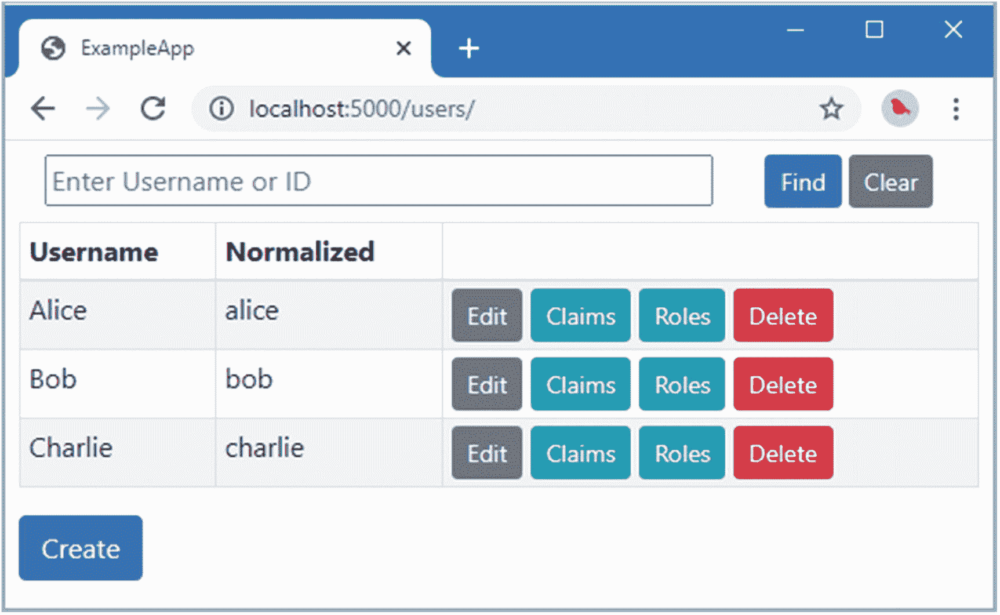
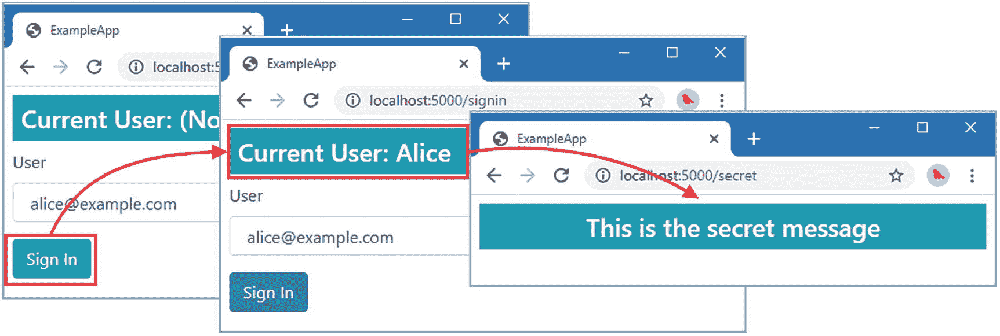
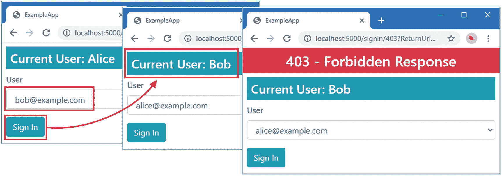
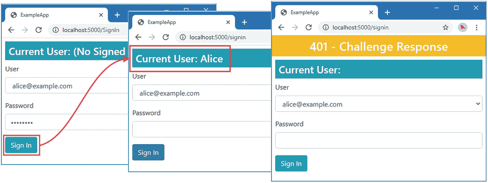
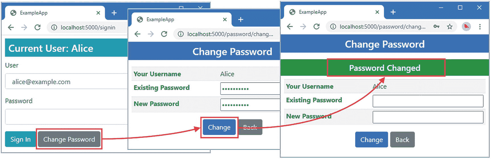
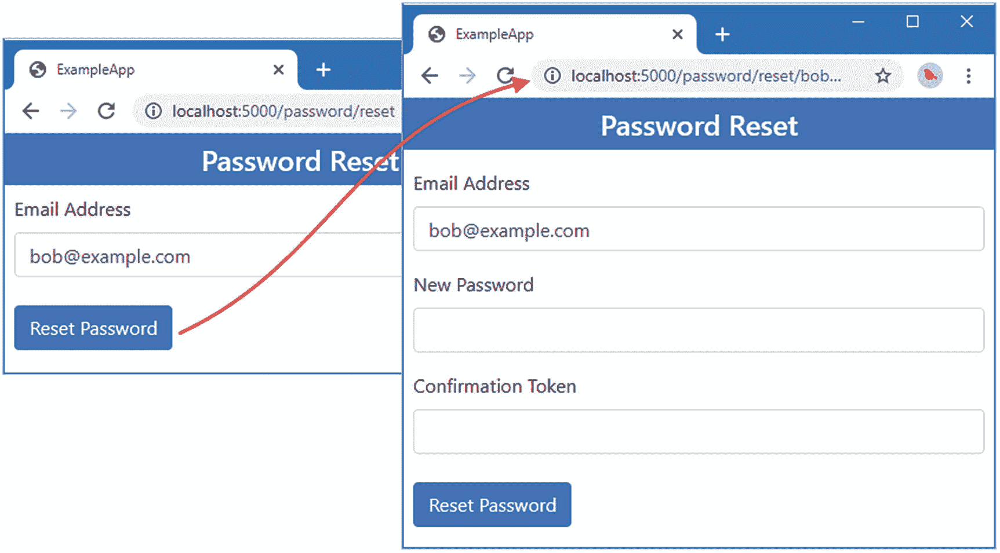
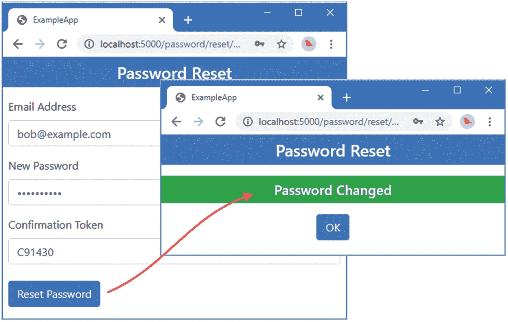
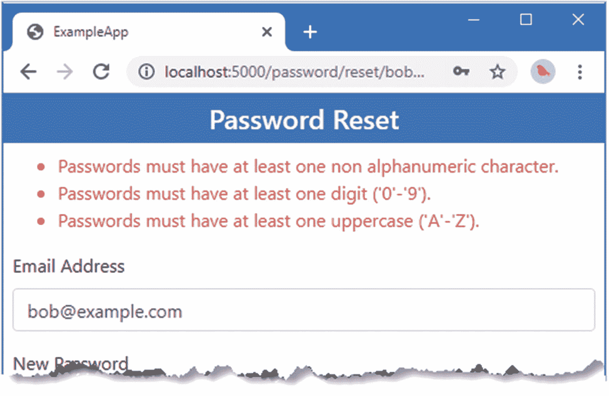
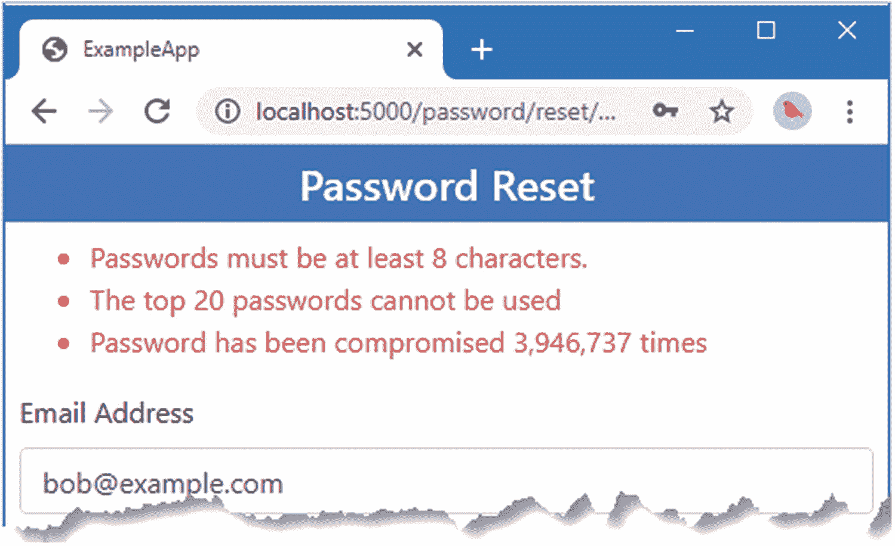
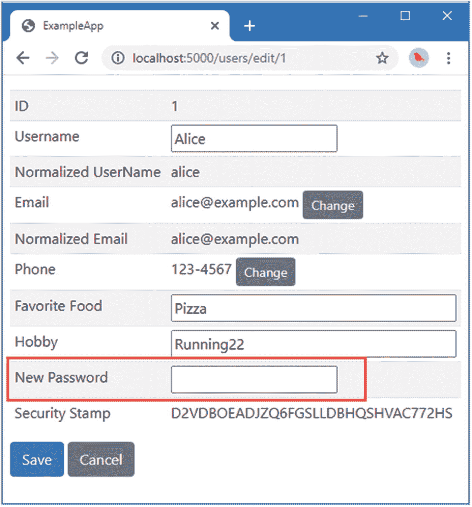

# 十八、使用 Identity 登录

在本章中，我扩展了用户存储来支持密码，并创建了支持用户登录的服务。我解释了如何存储密码，如何验证密码，以及如何定制整个过程。表 [18-1](#Tab1) 将本章描述的特征置于上下文中。

表 18-1。

将签名放在上下文中

<colgroup><col class="tcol1 align-left"> <col class="tcol2 align-left"></colgroup> 
| 

问题

 | 

回答

 |
| --- | --- |
| 这是什么？ | 登录是用户向应用表明自己 Identity 的过程。密码是用户登录和证明其 Identity 的常规手段，因为他们是唯一知道密码的人。 |
| 为什么有用？ | 登录会生成一个令牌，通常是一个 cookie，包含在后续的请求中，这样用户就可以与应用进行交互，而无需提供进一步的 Identity 证明。 |
| 如何使用？ | 用户存储被扩展为存储密码，并且定义了一个散列密码的服务，以便可以安全地存储密码。作为登录过程的一部分，用户存储中的数据被转换成一系列声明，通过一个`ClaimsPrincipal`对象提供给 ASP.NET Core。 |
| 有什么陷阱或限制吗？ | 用户倾向于选择糟糕的密码，并会破坏繁琐的密码策略。管理敏感数据或操作的应用应结合密码和其他形式的 Identity 识别，如第 [20](20.html) 和 [21](21.html) 章所述。 |
| 有其他选择吗？ | Identity 可以配置为支持外部认证，其中识别用户的责任委托给第三方。参见第[章 22](22.html) 和第[章 23](23.html) 。 |

表 [18-2](#Tab2) 总结了本章内容。

表 18-2。

章节总结

<colgroup><col class="tcol1 align-left"> <col class="tcol2 align-left"> <col class="tcol3 align-left"></colgroup> 
| 

问题

 | 

解决办法

 | 

列表

 |
| --- | --- | --- |
| 当用户登录时，向 ASP.NET Core 提供用户存储中的数据 | 创建一个`IUserClaimsPrincipalFactory<T>`接口的实现。 | [2](#PC2) |
| 让用户登录应用 | 使用`SignInManager<T>`类。 | [3](#PC3)–[4](#PC4)、 [10](#PC10) 、 [11](#PC11) |
| 用户存储中的两个密码 | 实现`IUserPasswordStore<T>`接口。 | [5](#PC5) 、[7](#PC7)–[9](#PC9) |
| 更改或恢复密码 | 使用由`UserManager<T>`类提供的方法。 | [12](#PC14)–[19](#PC21)、[23](#PC26)–[25](#PC28) |
| 限制用户可以选择的密码 | 创建一个`IPasswordValidator<T>`接口的实现。 | [20](#PC23)–[22](#PC25) |

## 为本章做准备

本章使用第 [17 章](17.html)中的`ExampleApp`项目。准备本章不需要做任何改动。打开一个新的命令提示符，导航到`ExampleApp`文件夹，运行清单 [18-1](#PC1) 中所示的命令来启动 ASP.NET Core。

Tip

你可以从 [`https://github.com/Apress/pro-asp.net-core-identity`](https://github.com/Apress/pro-asp.net-core-identity) 下载本章以及本书其他章节的示例项目。如果在运行示例时遇到问题，请参见第 [1](01.html) 章获取帮助。

```cs
dotnet run

Listing 18-1.Running the Example Application

```

打开一个新的浏览器窗口并请求`http://localhost:5000/users`。您将看到如图 [18-1](#Fig1) 所示的用户数据。数据仅存储在内存中，当 ASP.NET Core 停止时，更改将会丢失。



图 18-1。

运行示例应用

## 登录用户

用户存储以及通过`UserManager<T>`类使用它的工具已经成型。在这一节中，我将演示如何使用 Identity 让用户登录到应用中，以及一旦登录，如何对请求进行认证。

### 创建索赔主体工厂

`AppUser`用户类目前与前面章节中表示用户的`ClaimsPrincipal`对象无关。为了在这两种表示用户的方式之间架起桥梁，Identity 使用了`IUserClaimsPrincipalFactory<T>`接口，其中`T`是用户类，它定义了表 [18-3](#Tab3) 中描述的单一方法。

表 18-3。

IUserClaimsPrincipalFactory <t>方法</t>

<colgroup><col class="tcol1 align-left"> <col class="tcol2 align-left"></colgroup> 
| 

名字

 | 

描述

 |
| --- | --- |
| `CreateAsync(user)` | 这个方法创建一个代表指定用户的`ClaimsPrincipal`对象。 |

由于该接口将定制用户类及其许多功能与 ASP.NET Core 用于登录、验证和授权的类相连接，因此用户存储实现中的灵活性是可能的。Identity 包含这个接口的默认实现，它使用`UserManager<T>`方法创建一个`ClaimsPrincipal`对象。

为了创建一个为`AppUser`类定制的`IUserClaimsPrincipalFactory<T>`接口的实现，将一个名为`AppUserClaimsPrincipalFactory.cs`的类文件添加到`ExampleApp/Identity`文件夹中，并使用它来定义清单 [18-2](#PC2) 中所示的类。

```cs
using Microsoft.AspNetCore.Identity;
using System.Security.Claims;
using System.Threading.Tasks;

namespace ExampleApp.Identity {
    public class AppUserClaimsPrincipalFactory :
        IUserClaimsPrincipalFactory<AppUser> {

        public Task<ClaimsPrincipal> CreateAsync(AppUser user) {
            ClaimsIdentity identity
                = new ClaimsIdentity(IdentityConstants.ApplicationScheme);
            identity.AddClaims(new [] {
                new Claim(ClaimTypes.NameIdentifier, user.Id),
                new Claim(ClaimTypes.Name, user.UserName),
                new Claim(ClaimTypes.Email, user.EmailAddress)
            });
            if (!string.IsNullOrEmpty(user.Hobby)) {
                identity.AddClaim(new Claim("Hobby", user.Hobby));
            }
            if (!string.IsNullOrEmpty(user.FavoriteFood)) {
                identity.AddClaim(new Claim("FavoriteFood", user.FavoriteFood));
            }
            if (user.Claims != null) {
                identity.AddClaims(user.Claims);
            }
            return Task.FromResult(new ClaimsPrincipal(identity));
        }
    }
}

Listing 18-2.The Contents of the AppUserClaimsPrincipalFactory.cs File in the Identity Folder

```

该类创建一个`ClaimsIdentity`对象，其中填充了来自`AppUser Id`、`UserName`、`EmailAddress`、`Hobby`和`FavoriteFood`属性的声明，以及为用户存储的任何其他`Claim`对象。

Tip

注意，在清单 [18-2](#PC2) 中创建`ClaimsIdentity`对象时，我使用了`IdentityConstants.ApplicationScheme`值。该方案名称表明用户已经通过认证，并且是某些 Identity 功能所期望的。我将在后面的章节中描述额外的`IdentityConstants`值。

Getting User Objects From Claimsprincipal Objects

`UserManager<T>`类定义了`GetUserAsync`方法，该方法接受一个`ClaimsPrincipal`对象并返回相关的用户对象。它通过使用`NameIdentifier`声明的值作为`FindByIdAsync`方法的参数，查询用户存储来实现这一点。如果`ClaimsPrincipal`对象没有`NameIdentifier`声明或者用户存储不包含声明值的用户对象，则该方法返回`null`。

### 登录用户

Identity 提供了`SignInManager<T>`类来处理用户登录应用。表 [18-4](#Tab4) 描述了`SignInManager<T>`类提供的用于登录和退出用户的基本方法。在解释更高级的特性时，我描述了更多的方法。

表 18-4。

基本的登录管理器<t>方法</t>

<colgroup><col class="tcol1 align-left"> <col class="tcol2 align-left"></colgroup> 
| 

名字

 | 

描述

 |
| --- | --- |
| `SignInAsync(user, persistent)` | 此方法将指定的用户登录到应用中。persistent 参数指定认证 cookie 在浏览器关闭后是否会持续存在。 |
| `SignInWithClaimsAsync(user, persistent, claims)` | 此方法将用户登录到应用中，并将指定的声明添加到主体标识中。 |
| `SignOutAsync()` | 此方法注销用户。 |

在清单 [18-3](#PC3) 中，我更新了`SignIn` Razor 页面的页面模型，以使用`UserManager<T>`和`SignInManager<T>`类。

```cs
using Microsoft.AspNetCore.Authentication;
using Microsoft.AspNetCore.Http;
using Microsoft.AspNetCore.Mvc;
using Microsoft.AspNetCore.Mvc.RazorPages;
using Microsoft.AspNetCore.Mvc.Rendering;
using System.Security.Claims;
using System.Threading.Tasks;
using Microsoft.AspNetCore.Identity;
using System.Linq;
using ExampleApp.Identity;

namespace ExampleApp.Pages {
    public class SignInModel : PageModel {

        public SignInModel(UserManager<AppUser> userManager,
                SignInManager<AppUser> signInManager) {
            UserManager = userManager;
            SignInManager = signInManager;
        }

        public UserManager<AppUser> UserManager { get; set; }
        public SignInManager<AppUser> SignInManager { get; set; }

        public SelectList Users => new SelectList(
            UserManager.Users.OrderBy(u => u.EmailAddress),
                "EmailAddress", "EmailAddress");

        public string Username { get; set; }

        public int? Code { get; set; }

        public void OnGet(int? code) {
            Code = code;
            Username = User.Identity.Name ?? "(No Signed In User)";
        }

        public async Task<ActionResult> OnPost(string username,
                [FromQuery]string returnUrl) {
            //Claim claim = new Claim(ClaimTypes.Name, username);
            //ClaimsIdentity ident = new ClaimsIdentity("simpleform");
            //ident.AddClaim(claim);
            //await HttpContext.SignInAsync(new ClaimsPrincipal(ident));
            AppUser user = await UserManager.FindByEmailAsync(username);
            await SignInManager.SignInAsync(user, false);
            return Redirect(returnUrl ?? "/signin");
        }
    }
}

Listing 18-3.Using Identity in the SignIn.cshtml.cs File in the Pages Folder

```

Identity 被设计成易于集成到 ASP.NET Core。我添加了一个构造函数，通过依赖注入来接收`UserManager<T>`和`SignInManager<T>`对象。这允许我呈现一个用户列表，我使用他们的电子邮件地址列出了这些用户，只是为了证明数据来自商店。一旦选择了一个用户，我通过`UserManager<T>.FindByEmailAsync`方法获得一个`AppUser`对象，并使用`SignInManager<T>.SignInAsync`方法将该用户登录到应用中。

### 配置应用

最后一步是注册声明主体工厂类，这样它将被 Identity 使用并设置`SignInManager<T>`服务，如清单 [18-4](#PC4) 所示。

```cs
using Microsoft.AspNetCore.Builder;
using Microsoft.AspNetCore.Hosting;
using Microsoft.AspNetCore.Http;
using Microsoft.Extensions.DependencyInjection;
using ExampleApp.Custom;
using Microsoft.AspNetCore.Authentication.Cookies;
using Microsoft.AspNetCore.Authorization;
using Microsoft.AspNetCore.Identity;
using ExampleApp.Identity;
using ExampleApp.Identity.Store;
using ExampleApp.Services;

namespace ExampleApp {
    public class Startup {

        public void ConfigureServices(IServiceCollection services) {
            services.AddSingleton<ILookupNormalizer, Normalizer>();
            services.AddSingleton<IUserStore<AppUser>, UserStore>();
            services.AddSingleton<IEmailSender, ConsoleEmailSender>();
            services.AddSingleton<ISMSSender, ConsoleSMSSender>();
            services.AddSingleton<IUserClaimsPrincipalFactory<AppUser>,
                AppUserClaimsPrincipalFactory>();

            services.AddIdentityCore<AppUser>(opts => {
                opts.Tokens.EmailConfirmationTokenProvider = "SimpleEmail";
                opts.Tokens.ChangeEmailTokenProvider = "SimpleEmail";
            })
           .AddTokenProvider<EmailConfirmationTokenGenerator>("SimpleEmail")
           .AddTokenProvider<PhoneConfirmationTokenGenerator>
                (TokenOptions.DefaultPhoneProvider)
           .AddSignInManager();

            services.AddSingleton<IUserValidator<AppUser>, EmailValidator>();

            services.AddAuthentication(opts => {
                opts.DefaultScheme = IdentityConstants.ApplicationScheme;
            }).AddCookie(IdentityConstants.ApplicationScheme, opts => {
                opts.LoginPath = "/signin";
                opts.AccessDeniedPath = "/signin/403";
            });
            services.AddAuthorization(opts => {
                AuthorizationPolicies.AddPolicies(opts);
            });
            services.AddRazorPages();
            services.AddControllersWithViews();
        }

        public void Configure(IApplicationBuilder app, IWebHostEnvironment env) {

            app.UseStaticFiles();
            app.UseAuthentication();
            app.UseRouting();
            //app.UseMiddleware<RoleMemberships>();
            app.UseAuthorization();

            app.UseEndpoints(endpoints => {
                endpoints.MapRazorPages();
                endpoints.MapDefaultControllerRoute();
                endpoints.MapFallbackToPage("/Secret");
            });
        }
    }
}

Listing 18-4.Configuring the Application in the Startup.cs File in the ExampleApp Folder

```

我使用了`AddSingleton`方法来注册`AppUserClaimsPrincipalFactory`类作为用于`IUserClaimsPrincipalFactory<AppUser>`接口的实现。

将`AddSignInManager`方法添加到用于设置 Identity 的方法链中，并设置`SignInManager<T>`服务。其他变化改变了认证方案的名称，反映了使用 Identity 将用户登录到应用并对请求进行认证。

我还注释掉了应用自定义角色中间件的语句，因此声明和角色的唯一来源是用户存储。

重启 ASP.NET Core 并请求`http://localhost:5000/signin`。从下拉列表中选择`alice@example.com`并点击登录按钮登录应用。请求`http://localhost:5000/secret`，应用于`Secret` Razor 页面的授权策略将由工厂类使用从`AppUser`对象生成的声明进行评估。Alice 的声明符合策略，访问被授予，如图 [18-2](#Fig2) 所示。

Tip

如果登录没有效果，您可能会发现您已经使用前一章中的 cookie 进行了认证。如果是这种情况，请求`http://localhost:5000/signout`并点击退出按钮。这将清除现有的 cookie，并允许您使用 Identity 再次登录。如果不起作用，请清除您的浏览器历史记录，然后重试。



图 18-2。

使用 Identity 登录应用

重复该过程，并选择`bob@example.com`以 Bob 的 Identity 登录。请求`http://localhost:5000/secret`；由于 Bob 的声明不符合政策要求，访问将被拒绝，如图 [18-3](#Fig3) 所示。



图 18-3。

在示例应用中实施授权策略

## 使用密码登录用户

信任用户从下拉列表中选择他们的帐户是有用的，但是是时候引入密码了。在接下来的部分中，我将解释 Identity 如何存储和使用密码，以及如何在登录过程中使用密码。

### 更新用户类

密码不是直接存储的。相反，哈希代码是从用户的密码创建的，并作为密码本身的代理存储。当用户在登录期间提供密码时，将根据候选密码创建一个哈希代码，并与用户存储中的哈希代码进行比较。如果用户提供了正确的密码，这两个散列码将是相同的。在清单 [18-5](#PC5) 中，我在`AppUser`类中添加了一个用户密码属性。

```cs
using System;
using System.Collections.Generic;
using System.Security.Claims;

namespace ExampleApp.Identity {
    public class AppUser {

        public string Id { get; set; } = Guid.NewGuid().ToString();

        public string UserName { get; set; }

        public string NormalizedUserName { get; set; }

        public string EmailAddress { get; set; }
        public string NormalizedEmailAddress { get; set; }
        public bool EmailAddressConfirmed { get; set; }

        public string PhoneNumber { get; set; }
        public bool PhoneNumberConfirmed { get; set; }

        public string FavoriteFood { get; set; }
        public string Hobby { get; set; }

        public IList<Claim> Claims { get; set; }

        public string SecurityStamp { get; set; }
        public string PasswordHash { get; set; }
    }
}

Listing 18-5.Adding a Property in the AppUser.cs File in the Identity Folder

```

还有更复杂的登录选项，我将在后面的例子中描述，但是现在，一个简单的字符串密码是一个很好的起点。

### 创建密码哈希器

Identity 依赖于`IPasswordHasher<T>`接口的实现来从密码生成哈希代码，其中`<T>`是用户类。该接口定义了表 [18-5](#Tab5) 中所示的方法。

表 18-5。

IPasswordHasher <t>方法</t>

<colgroup><col class="tcol1 align-left"> <col class="tcol2 align-left"></colgroup> 
| 

名字

 | 

描述

 |
| --- | --- |
| `HashPassword(user, password)` | 此方法返回指定用户密码的哈希表示形式。 |
| `VerifyHashedPassword(user, storedHash, password)` | 此方法验证指定用户提供的密码是否与提供的哈希表示匹配。使用来自`PasswordVerificationResult`枚举的值来表示结果:`Failed`、`Success`或`SuccessRehashNeeded`。(最后一个值用于指示应用使用的算法已经改变，应该更新密码散列码。) |

要创建接口的自定义实现，将名为`SimplePasswordHasher.cs`的类文件添加到`ExampleApp/Identity`文件夹中，并使用它来定义清单 [18-6](#PC6) 中所示的类。

```cs
using Microsoft.AspNetCore.Identity;
using System;
using System.Security.Cryptography;
using System.Text;

namespace ExampleApp.Identity {
    public class SimplePasswordHasher : IPasswordHasher<AppUser> {

        public SimplePasswordHasher(ILookupNormalizer normalizer)
            => Normalizer = normalizer;

        private ILookupNormalizer Normalizer { get; set; }

        public string HashPassword(AppUser user, string password) {
            HMACSHA256 hashAlgorithm =
                new HMACSHA256(Encoding.UTF8.GetBytes(user.Id));
            return BitConverter.ToString(hashAlgorithm.ComputeHash(
                    Encoding.UTF8.GetBytes(password)));
        }

        public PasswordVerificationResult VerifyHashedPassword(AppUser user,
            string storedHash, string password)
                => HashPassword(user, password).Equals(storedHash)
                    ? PasswordVerificationResult.Success
                    : PasswordVerificationResult.Failed;
    }
}

Listing 18-6.The Contents of the SimplePasswordHasher.cs File in the Identity Folder

```

Identity 提供的内置密码哈希器使用精心彻底应用的良好加密算法，从密码中生成可靠的哈希。为了演示，我采用了一种更简单的方法，这种方法不应该在实际项目中使用。`SimplePasswordHasher`类通过简单地结合使用 HMACSHA256 散列算法和用户 ID 作为密钥来表示密码。清单 [18-7](#PC7) 注册了`SimplePasswordHasher`类，因此它将用于解析对`IPasswordHasher<AppUser>`接口的依赖。

```cs
...
public void ConfigureServices(IServiceCollection services) {
    services.AddSingleton<ILookupNormalizer, Normalizer>();
    services.AddSingleton<IUserStore<AppUser>, UserStore>();
    services.AddSingleton<IEmailSender, ConsoleEmailSender>();
    services.AddSingleton<ISMSSender, ConsoleSMSSender>();
    services.AddSingleton<IUserClaimsPrincipalFactory<AppUser>,
        AppUserClaimsPrincipalFactory>();
    services.AddSingleton<IPasswordHasher<AppUser>, SimplePasswordHasher>();

    services.AddIdentityCore<AppUser>(opts => {
        opts.Tokens.EmailConfirmationTokenProvider = "SimpleEmail";
        opts.Tokens.ChangeEmailTokenProvider = "SimpleEmail";
    })
    .AddTokenProvider<EmailConfirmationTokenGenerator>("SimpleEmail")
    .AddTokenProvider<PhoneConfirmationTokenGenerator>
        (TokenOptions.DefaultPhoneProvider)
    .AddSignInManager();

    services.AddSingleton<IUserValidator<AppUser>, EmailValidator>();

    services.AddAuthentication(opts => {
        opts.DefaultScheme = IdentityConstants.ApplicationScheme;
    }).AddCookie(IdentityConstants.ApplicationScheme, opts => {
        opts.LoginPath = "/signin";
        opts.AccessDeniedPath = "/signin/403";
    });
    services.AddAuthorization(opts => {
        AuthorizationPolicies.AddPolicies(opts);
    });
    services.AddRazorPages();
    services.AddControllersWithViews();
}
...

Listing 18-7.Registering a Service in the Startup.cs File in the ExampleApp Folder

```

### 在用户存储中存储密码哈希

当应用管理自己的密码时，它需要一个实现了`IUserPasswordStore<T>`接口的用户存储，其中`T`是用户类。该接口定义了表 [18-6](#Tab6) 中描述的方法。所有这些方法都定义了接收`CancellationToken`对象的`token`参数，该对象用于在异步操作被取消时接收通知。

表 18-6。

IUserPasswordStore <t>方法</t>

<colgroup><col class="tcol1 align-left"> <col class="tcol2 align-left"></colgroup> 
| 

名字

 | 

描述

 |
| --- | --- |
| `HasPasswordAsync(user, token)` | 如果指定的用户有密码，这个方法返回`true`。 |
| `GetPasswordHashAsync(user, token)` | 此方法返回指定用户的存储密码数据。 |
| `SetPasswordHashAsync(user, passwordHash, token)` | 此方法存储指定用户的新密码哈希。 |

为了增加对存储密码的支持，在`Identity/Store`文件夹中添加一个名为`UserStorePasswords.cs`的类文件，并使用它来定义清单 [18-8](#PC8) 中所示的部分类。

```cs
using Microsoft.AspNetCore.Identity;
using System.Threading;
using System.Threading.Tasks;

namespace ExampleApp.Identity.Store {

    public partial class UserStore : IUserPasswordStore<AppUser> {

        public Task<string> GetPasswordHashAsync(AppUser user,
            CancellationToken token) => Task.FromResult(user.PasswordHash);

        public Task<bool> HasPasswordAsync(AppUser user, CancellationToken token)
            => Task.FromResult(!string.IsNullOrEmpty(user.PasswordHash));

        public Task SetPasswordHashAsync(AppUser user, string passwordHash,
                CancellationToken token) {
            user.PasswordHash = passwordHash;
            return Task.CompletedTask;
        }
    }
}

Listing 18-8.The Contents of the UserStorePasswords.cs File in the Identity/Store Folder

```

清单 [18-9](#PC9) 中显示的新语句将密码添加到用户存储中的种子数据中。因为密码是以散列的形式存储的，所以我声明了对密码散列的依赖，我用它来生成存储的值。

```cs
using Microsoft.AspNetCore.Identity;
using System.Collections.Generic;
using System.Linq;
using System.Security.Claims;

namespace ExampleApp.Identity.Store {

    public partial class UserStore {

        public ILookupNormalizer Normalizer { get; set; }

        public IPasswordHasher<AppUser> PasswordHasher { get; set; }

        public UserStore(ILookupNormalizer normalizer,
                IPasswordHasher<AppUser> passwordHasher) {
            Normalizer = normalizer;
            PasswordHasher = passwordHasher;
            SeedStore();
        }

        private void SeedStore() {

            var customData = new Dictionary<string, (string food, string hobby)> {
                { "Alice", ("Pizza", "Running") },
                { "Bob", ("Ice Cream", "Cinema") },
                { "Charlie", ("Burgers", "Cooking") }
            };

            int idCounter = 0;

            string EmailFromName(string name) => $"{name.ToLower()}@example.com";

            foreach (string name in UsersAndClaims.Users) {
                AppUser user = new AppUser {
                    Id = (++idCounter).ToString(),
                    UserName = name,
                    NormalizedUserName = Normalizer.NormalizeName(name),
                    EmailAddress = EmailFromName(name),
                    NormalizedEmailAddress =
                        Normalizer.NormalizeEmail(EmailFromName(name)),
                    EmailAddressConfirmed = true,
                    PhoneNumber = "123-4567",
                    PhoneNumberConfirmed = true,
                    FavoriteFood = customData[name].food,
                    Hobby = customData[name].hobby,
                    SecurityStamp = "InitialStamp"
                };
                user.Claims =  UsersAndClaims.UserData[user.UserName]
                    .Select(role => new Claim(ClaimTypes.Role, role)).ToList();
                user.PasswordHash = PasswordHasher.HashPassword(user, "MySecret1$");
                users.TryAdd(user.Id, user);
            }
        }
    }
}

Listing 18-9.Adding Passwords in the UserStore.cs File in the Identity/Store Folder

```

为了简单起见，我将所有用户的密码设置为同一个值:`MySecret1$`。在“更改和恢复密码”一节中，我将向您展示如何创建密码更改工作流。

### 使用密码登录应用

`SignInManager<T>`类定义了在用户登录时接受密码的方法，如表 [18-7](#Tab7) 所述。

表 18-7。

使用密码登录的 SignInManager <t>方法</t>

<colgroup><col class="tcol1 align-left"> <col class="tcol2 align-left"></colgroup> 
| 

名字

 | 

描述

 |
| --- | --- |
| `PasswordSignInAsync(user, password, persistent, lockout)` | 此方法使用指定的密码登录用户。`persistent`参数指定当浏览器重启时 cookie 是否保持有效，而`lockout`参数指定失败的登录是否锁定用户，如第 [20 章](20.html)中所述。 |
| `PasswordSignInAsync(username, password, persistent, lockout)` | 这是一种方便的方法，它使用指定的用户名从存储中检索用户对象，并尝试使用密码登录。 |

表 [18-7](#Tab7) 中的方法产生的结果是`SignInResult`类的一个实例，它定义了表 [18-8](#Tab8) 中描述的属性。

表 18-8。

SignInResult 属性

<colgroup><col class="tcol1 align-left"> <col class="tcol2 align-left"></colgroup> 
| 

名字

 | 

描述

 |
| --- | --- |
| `Succeeded` | 如果用户成功登录到应用，该属性返回`true`，否则返回`false`。 |
| `IsLockedOut` | 如果由于用户被锁定而导致登录尝试失败，该属性将返回`true`。我在第 [20 章](20.html)中解释了锁定。 |
| `IsNotAllowed` | 如果不允许用户登录应用，这个属性返回`true`，我将在第 [20 章](20.html)中解释这一点。 |
| `RequiresTwoFactor` | 如果用户被要求提供额外的凭证，这个属性返回`true`，我将在第 [20 章](20.html)中解释。 |

最重要的`SignInResult`属性是`Suceeded`，它返回`true`或`false`来指示登录尝试的结果。其他属性用于提供有关拒绝尝试的原因的更多详细信息，所有这些都依赖于其他章节中描述的功能。

在清单 [18-10](#PC10) 中，我已经更新了`SignIn` Razor 页面，提示用户输入用于登录应用的密码。

```cs
@page "{code:int?}"
@model ExampleApp.Pages.SignInModel
@using Microsoft.AspNetCore.Http

@if (Model.Code == StatusCodes.Status401Unauthorized) {
    <h3 class="bg-warning text-white text-center p-2">
        401 - Challenge Response
    </h3>
} else if (Model.Code == StatusCodes.Status403Forbidden) {
    <h3 class="bg-danger text-white text-center p-2">
        403 - Forbidden Response
    </h3>
}
<h4 class="bg-info text-white m-2 p-2">
    Current User: @Model.Username
</h4>

<div class="m-2">
    <form method="post">
        <div class="form-group">
            <label>User</label>
            <select class="form-control"
                    asp-for="Username" asp-items="@Model.Users">
            </select>
        </div>
        <div class="form-group">
            <label>Password</label>
            <input class="form-control" type="password" name="password" />
        </div>
        <button class="btn btn-info" type="submit">Sign In</button>
    </form>
</div>

Listing 18-10.Using a Password in the SignIn.cshtml File in the Pages Folder

```

向用户呈现一个`input`元素，在其中输入密码。为了处理密码，我对页面模型类做了清单 [18-11](#PC11) 所示的修改。

```cs
using Microsoft.AspNetCore.Authentication;
using Microsoft.AspNetCore.Http;
using Microsoft.AspNetCore.Mvc;
using Microsoft.AspNetCore.Mvc.RazorPages;
using Microsoft.AspNetCore.Mvc.Rendering;
using System.Security.Claims;
using System.Threading.Tasks;
using Microsoft.AspNetCore.Identity;
using System.Linq;
using ExampleApp.Identity;
using SignInResult = Microsoft.AspNetCore.Identity.SignInResult;

namespace ExampleApp.Pages {
    public class SignInModel : PageModel {

        public SignInModel(UserManager<AppUser> userManager,
        SignInManager<AppUser> signInManager) {
            UserManager = userManager;
            SignInManager = signInManager;
        }

        public UserManager<AppUser> UserManager { get; set; }
        public SignInManager<AppUser> SignInManager { get; set; }

        public SelectList Users => new SelectList(
            UserManager.Users.OrderBy(u => u.EmailAddress),
                "EmailAddress", "NormalizedEmailAddress");

        public string Username { get; set; }

        public int? Code { get; set; }

        public void OnGet(int? code) {
            Code = code;
            Username = User.Identity.Name ?? "(No Signed In User)";
        }

        public async Task<ActionResult> OnPost(string username,
                string password, [FromQuery]string returnUrl) {
            SignInResult result = SignInResult.Failed;
            AppUser user = await UserManager.FindByEmailAsync(username);
            if (user != null && !string.IsNullOrEmpty(password)) {
                result = await SignInManager.PasswordSignInAsync(user, password,
                    false, true);
            }
            if (!result.Succeeded) {
                Code = StatusCodes.Status401Unauthorized;
                return Page();
            }
            return Redirect(returnUrl ?? "/signin");
        }
    }
}

Listing 18-11.Using Passwords in the SignIn.cshtml.cs File in the Pages Folder

```

该值用作`PasswordSignInAsync`方法的参数，使用户登录应用:

```cs
...
result = await SignInManager.PasswordSignInAsync(user, password, false, true);
...

```

除了用户和密码之外，传递给`PasswordSignInAsync`方法的参数告诉 Identity，当浏览器关闭时，用于验证请求的 cookie 不应该持续，重复失败的尝试应该导致帐户锁定，我在第 [20 章](20.html)中实现了这一点。

我使用 Razor 页面的现有特性，在用户没有提供密码或者密码与用户存储中的密码不匹配时显示一条错误消息。

ASP.NET Core 中使用的包中有两个名为`SignInResult`的类，C# 编译器无法判断哪个是必需的，这就是我使用这个`using`语句的原因:

```cs
...
using SignInResult = Microsoft.AspNetCore.Identity.SignInResult;
...

```

这告诉编译器应该使用名为`SignInResult`的 Identity 类，解决了不确定性，这样我就可以在代码中使用`SignInResult`类型，而不用名称空间来限定它。

重启 ASP.NET Core 并请求`http://localhost:5000/signin`。从列表中选择`alice@example.com`，并在密码字段中输入 my cret 1$。单击登录；密码将被验证，爱丽丝将登录到应用，如图 [18-4](#Fig4) 所示。如果您忽略密码或输入不同的密码，您将会看到 401-Challenge 响应，如图 [18-4](#Fig4) 所示。



图 18-4。

使用密码登录应用

## 管理密码

密码需要几个管理工作流程。`UserManager<T>`类定义了支持密码管理的成员，我将在接下来的章节中介绍。

### 更改和恢复密码

密码的基本任务是允许选择新的密码。这可能是有意的更改，即已知现有密码但需要新密码；也可能是无意的更改，即忘记了现有密码而必须定义新密码，以便用户可以登录到应用。`UserManager<T>`类定义了表 [18-9](#Tab9) 中所示的更改密码的方法。

表 18-9。

用户管理器<t>更改密码的方法</t>

<colgroup><col class="tcol1 align-left"> <col class="tcol2 align-left"></colgroup> 
| 

名字

 | 

描述

 |
| --- | --- |
| `HasPasswordAsync(user)` | 如果用户有密码，这个方法使用用户存储的`HasPasswordAsync`方法返回`true`。 |
| `AddPasswordAsync(user, password)` | 此方法为指定用户向存储区添加密码。在将密码传递给用户存储的`SetPasswordHashAsync`方法之前，将对密码进行验证(如下表所述)和散列，生成新的安全标记，并执行用户管理器的更新序列。如果用户存储的`GetPasswordHashAsync`方法返回除了`null`之外的任何东西，将会抛出一个异常。 |
| `RemovePasswordAsync(user)` | 这个方法在用户存储中将指定用户的密码设置为`null`，生成一个新的安全戳，并执行用户管理器的更新序列。 |
| `ChangePasswordAsync(user, oldPassword, newPassword)` | 此方法为指定用户执行密码更改。旧密码被检查，新密码在被传递到用户存储的`SetPasswordHashAsync`方法之前被验证(在表后描述)和散列。生成新的安全戳，并执行用户管理器的更新序列。 |
| `GeneratePasswordResetTokenAsync(user)` | 此方法生成可用于确认密码重置的令牌。 |
| `ResetPasswordAsync(user, token, newPassword)` | 此方法检查密码重置令牌，如果它有效，则存储用户的指定密码。密码被散列并传递给用户存储的`SetPasswordHashAsync`方法，生成一个新的安全戳，并执行用户管理器的更新序列。 |

为了允许修改密码，在`Pages/Store`文件夹中添加一个名为`PasswordChange.cshtml`的 Razor 页面，内容如清单 [18-12](#PC14) 所示。

```cs
@page "/password/change/{success:bool?}"
@model ExampleApp.Pages.Store.PasswordChangeModel

<h4 class="bg-primary text-white text-center p-2">Change Password</h4>

<div asp-validation-summary="All" class="text-danger m-2"></div>

@if (Model.Success) {
    <h5 class="bg-success text-white text-center p-2">Password Changed</h5>
}

<div class="m-2">
    <form method="post">
        <table class="table table-sm table-striped">
            <tbody>
                <tr><th>Your Username</th>
                    <td>@HttpContext.User.Identity.Name</td></tr>
                <tr>
                    <th>Existing Password</th>
                    <td><input class="w-100" type="password" name="oldPassword" />
                    </td>
                </tr>
                <tr>
                    <th>New Password</th>
                    <td><input class="w-100" type="password" name="newPassword" />
                    </td>
                </tr>
            </tbody>
        </table>
        <div class="text-center">
            <button class="btn btn-primary">Change</button>
            <a class="btn btn-secondary" asp-page="/SignIn">Back</a>
        </div>
    </form>
</div>

Listing 18-12.The Contents of the PasswordChange.cshtml File in the Pages/Store Folder

```

Razor 页面向用户显示现有密码和新密码的输入元素。使用`PasswordChange.cshtml.cs`文件定义页面模型类，如清单 [18-13](#PC15) 所示。(如果您使用的是 Visual Studio 代码，则需要创建此文件。)

```cs
using System.Threading.Tasks;
using ExampleApp.Identity;
using Microsoft.AspNetCore.Identity;
using Microsoft.AspNetCore.Mvc;
using Microsoft.AspNetCore.Mvc.RazorPages;

namespace ExampleApp.Pages.Store {
    public class PasswordChangeModel : PageModel {

        public PasswordChangeModel(UserManager<AppUser> manager) =>
            UserManager = manager;

        public UserManager<AppUser> UserManager { get; set; }

        [BindProperty(SupportsGet = true)]
        public bool Success { get; set; } = false;

        public async Task<IActionResult> OnPost(string oldPassword,
                string newPassword) {
            string username = HttpContext.User.Identity.Name;
            if (username != null) {
                AppUser user = await UserManager.FindByNameAsync(username);
                if (user != null && !string.IsNullOrEmpty(oldPassword)
                        && !string.IsNullOrEmpty(newPassword)) {
                    IdentityResult result = await UserManager.ChangePasswordAsync(
                        user, oldPassword, newPassword);
                    if (result.Succeeded) {
                        Success = true;
                    } else {
                        foreach (IdentityError err in result.Errors) {
                            ModelState.AddModelError("", err.Description);
                        }
                    }
                }
            }
            return Page();
        }
    }
}

Listing 18-13.The Contents of the PasswordChange.cshtml.cs File in the Pages/Store Folder

```

在这个例子中，我依靠 ASP.NET Core`HttpContext.User`属性为我提供登录用户的详细信息，然后我可以用它从商店中获取代表用户的`AppUser`对象。我调用`ChangePasswordAsync`方法，使用用户提供的值来更改密码。`ChangePasswordAsync`方法的结果是一个`IdentityResult`对象，它指示操作是否成功，如果不成功，则提供错误细节。如果有错误，我会将它们添加到 ASP.NET Core 模型状态中，以便向用户显示。

#### 重置密码

更改密码的过程很简单，因为我们可以确信只有用户知道他们现有的密码，这与应用登录所需的安全标准相同。

执行密码重置更加复杂，因为用户忘记或丢失了密码。相反，需要一个确认步骤，该步骤生成一个令牌并发送给应用外部的用户，通常是通过电子邮件发送的链接或通过 SMS 发送的代码。用户单击链接或将代码输入 HTML 表单，然后选择新密码。

我没有在本书中介绍电子邮件和 SMS 服务的选择和配置，所以我将通过向控制台写入消息来模拟发送确认令牌。

我可以使用之前使用的令牌生成器来确认电话号码地址的更改。清单 [18-14](#PC16) 注册了令牌生成器，因此它将用于密码重置。

```cs
...
services.AddIdentityCore<AppUser>(opts => {
    opts.Tokens.EmailConfirmationTokenProvider = "SimpleEmail";
    opts.Tokens.ChangeEmailTokenProvider = "SimpleEmail";
    opts.Tokens.PasswordResetTokenProvider = TokenOptions.DefaultPhoneProvider;
})
.AddTokenProvider<EmailConfirmationTokenGenerator>("SimpleEmail")
.AddTokenProvider<PhoneConfirmationTokenGenerator>(TokenOptions.DefaultPhoneProvider)
.AddSignInManager();
...

Listing 18-14.Registering a Token Generator in the Startup.cs File in the ExampleApp Folder

```

options 模式用于设置`IdentityOptions.Tokens.PasswordResetTokenProvider`属性，其值指定密码重置令牌生成器的名称。接下来，向`Pages/Store`文件夹添加一个名为`PasswordReset.cshtml`的 Razor 页面，内容如清单 [18-15](#PC17) 所示。

```cs
@page "/password/reset"
@model ExampleApp.Pages.Store.PasswordResetModel

<h4 class="bg-primary text-white text-center p-2">Password Reset</h4>

<div class="m-2">
    <form method="post">
        <div class="form-group">
            <label>Email Address</label>
            <input class="form-control" name="email"  />
        </div>
        <button class="btn btn-primary mt-2" type="submit">Reset Password</button>
    </form>
</div>

Listing 18-15.The Contents of the PasswordReset.cshtml File in the Pages/Store Folder

```

Razor 页面显示一个简单的表单，允许用户输入他们的电子邮件地址。要实现页面模型类，将清单 [18-16](#PC18) 中所示的代码添加到`Pages/Store`文件夹中的`PasswordReset.cshtml.cs`文件中。(如果您使用的是 Visual Studio 代码，则必须创建该文件。)

```cs
using ExampleApp.Identity;
using ExampleApp.Services;
using Microsoft.AspNetCore.Identity;
using Microsoft.AspNetCore.Mvc;
using Microsoft.AspNetCore.Mvc.RazorPages;
using System.Threading.Tasks;

namespace ExampleApp.Pages.Store {

    public class PasswordResetModel : PageModel {

        public PasswordResetModel(UserManager<AppUser> manager,
                ISMSSender sender) {
            UserManager = manager;
            SMSSender = sender;
        }

        public UserManager<AppUser> UserManager { get; set; }
        public ISMSSender SMSSender { get; set; }

        public async Task<IActionResult> OnPost(string email) {
            AppUser user  = await UserManager.FindByEmailAsync(email);
            if (user != null) {
                string token =
                    await UserManager.GeneratePasswordResetTokenAsync(user);
                SMSSender.SendMessage(user, $"Your password reset token is {token}");
            }

            return RedirectToPage("PasswordResetConfirm", new { email = email });
        }
    }
}

Listing 18-16.The Contents of the PasswordReset.cshtml.cs File in the Pages/Store Folder

```

handler 方法在用户存储中查询`AppUser`对象，并使用`GeneratePasswordResetTokenAsync`方法生成一个令牌，通过(模拟的)SMS 发送给用户，之后客户端被重定向。

为了允许用户提供新的密码和确认令牌，在`Pages/Store`文件夹中添加一个名为`PasswordResetConfirm.cshtml`的 Razor 页面，其内容如清单 [18-17](#PC19) 所示。

```cs
@page "/password/reset/{email}"
@model ExampleApp.Pages.Store.PasswordResetConfirmModel

<h4 class="bg-primary text-white text-center p-2">Password Reset</h4>

<div asp-validation-summary="All" class="text-danger m-2"></div>

@if (Model.Changed) {
    <h5 class="bg-success text-white text-center p-2">Password Changed</h5>
    <div class="text-center">
        <a href="/signin" class="btn btn-primary m-2">OK</a>
    </div>
} else {
    <div class="m-2">
        <form method="post">
            <div class="form-group">
                <label>Email Address</label>
                <input class="form-control" name="email" value="@Model.Email" />
            </div>
            <div class="form-group">
                <label>New Password</label>
                <input class="form-control" name="password" type="password" />
            </div>
            <div class="form-group">
                <label>Confirmation Token</label>
                <input class="form-control" name="token"  />
            </div>
            <button class="btn btn-primary mt-2" type="submit">
                Reset Password
            </button>
        </form>
    </div>
}

Listing 18-17.The Contents of the PasswordResetConfirm.cshtml File in the Pages/Store Folder

```

页面的视图部分显示允许输入密码和代码的表单，或者确认密码已被更改的摘要。要定义页面模型类，将清单 [18-18](#PC20) 中所示的代码添加到`Pages/Store`文件夹中的`PasswordResetConfirm.cshtml.cs`文件中。(如果您使用的是 Visual Studio 代码，则必须创建该文件。)

```cs
using System;
using System.Collections.Generic;
using System.Linq;
using System.Threading.Tasks;
using ExampleApp.Identity;
using Microsoft.AspNetCore.Identity;
using Microsoft.AspNetCore.Mvc;
using Microsoft.AspNetCore.Mvc.RazorPages;

namespace ExampleApp.Pages.Store {

    public class PasswordResetConfirmModel : PageModel {

        public PasswordResetConfirmModel(UserManager<AppUser> manager)
            => UserManager = manager;

        public UserManager<AppUser> UserManager { get; set; }

        [BindProperty(SupportsGet = true)]
        public string Email { get; set; }

        [BindProperty(SupportsGet = true)]
        public bool Changed { get; set; } = false;

        public async Task<IActionResult> OnPostAsync(string password, string token) {
            AppUser user = await UserManager.FindByEmailAsync(Email);
            if (user != null) {
                IdentityResult result = await UserManager.ResetPasswordAsync(user,
                    token, password);
                if (result.Succeeded) {
                    return RedirectToPage(new { Changed = true });
                } else {
                    foreach (IdentityError err in result.Errors) {
                        ModelState.AddModelError("", err.Description);
                    }
                }
            } else {
                ModelState.AddModelError("", "Password Change Error");
            }
            return Page();
        }
    }
}

Listing 18-18.The Contents of the PasswordResetConfirm.cshtml.cs File in the Pages/Store Folder

```

页面处理程序方法使用`ResetPasswordAsync`方法来更改密码，如果密码更改失败，或者如果用户提供的电子邮件地址在用户存储中找不到，则向模型状态添加一个错误。

#### 集成密码功能

为了将密码更改与应用的其余部分集成，将清单 [18-19](#PC21) 中所示的元素添加到`SignIn` Razor 页面。

```cs
@page "{code:int?}"
@model ExampleApp.Pages.SignInModel
@using Microsoft.AspNetCore.Http

@if (Model.Code == StatusCodes.Status401Unauthorized) {
    <h3 class="bg-warning text-white text-center p-2">
        401 - Challenge Response
    </h3>
} else if (Model.Code == StatusCodes.Status403Forbidden) {
    <h3 class="bg-danger text-white text-center p-2">
        403 - Forbidden Response
    </h3>
}
<h4 class="bg-info text-white m-2 p-2">
    Current User: @Model.Username
</h4>

<div class="m-2">
    <form method="post">
        <div class="form-group">
            <label>User</label>
            <select class="form-control"
                    asp-for="Username" asp-items="@Model.Users">
            </select>
        </div>
        <div class="form-group">
            <label>Password</label>
            <input class="form-control" type="password" name="password" />
        </div>
        <button class="btn btn-info" type="submit">Sign In</button>
        @if (User.Identity.IsAuthenticated) {
            <a asp-page="/Store/PasswordChange" class="btn btn-secondary"
                asp-route-id="@Model.User?
                        .FindFirst(ClaimTypes.NameIdentifier)?.Value">
                    Change Password
            </a>
        } else {
          <a class="btn btn-secondary" href="/password/reset">Reset Password</a>
        }
    </form>
</div>

Listing 18-19.Integrating Password Features in the SignIn.cshtml File in the Pages Folder

```

用户看到的按钮取决于用户是否登录。如果他们已经登录，那么应用假定他们知道自己的密码，并且可以在不需要确认的情况下执行密码更改。如果没有登录的用户，那么用户会看到一个按钮来执行密码重置。重启 ASP.NET Core 并请求`http://localhost:5000/signin`。

使用密码`MySecret1$`以`alice@example.com`的 Identity 登录。登录后，你会看到修改密码按钮，该按钮会引导你进入登录用户的密码修改功能，如图 [18-5](#Fig5) 所示。

在现有密码字段中输入 MySecret1 $,在新密码字段中输入 my cret 2$。单击更改，用户的密码将被更新。



图 18-5。

执行密码更改

要测试密码重置功能，请请求`http://localhost:5000/signout`并让现有用户退出应用。接下来，请求`http://localhost:5000/signin`并点击重置密码按钮。在文本字段中输入 bob@example.com，然后单击重置密码按钮。显示屏将改变，提示您输入新密码并显示验证码，如图 [18-6](#Fig6) 所示。



图 18-6。

执行密码重置

检查来自 ASP.NET Core 的控制台输出，您将看到一条模拟的 SMS 消息，如下所示:

```cs
--- SMS Starts ---
To: 123-4567
Your password reset token is C91430
--- SMS Ends ---

```

在“新密码”字段中输入 MySecret2 $,在“确认令牌”字段中输入 C91430，然后单击“重置密码”按钮。密码将被重置，如图 [18-7](#Fig7) 所示。现在，您可以使用新密码登录应用。

Note

确认码是`C91430`,因为种子数据在向商店添加用户时使用固定的安全戳值。随后的更改会生成不同的安全戳，因此会生成不同的确认令牌。



图 18-7。

完成密码重置

### 验证密码

我特别提到了用于测试新特性的密码，因为 Identity 在默认情况下会应用密码验证策略。例如，使用`mysecret`作为新密码尝试更改或重置密码，您将看到一系列错误信息，如图 [18-8](#Fig8) 所示。



图 18-8。

Identity 密码验证

验证策略是使用 options 模式配置的。`IdentityOptions.Password`属性返回`PasswordOptions`类的一个实例，它定义了表 [18-10](#Tab10) 中描述的属性。

表 18-10。

密码选项属性

<colgroup><col class="tcol1 align-left"> <col class="tcol2 align-left"></colgroup> 
| 

名字

 | 

描述

 |
| --- | --- |
| `RequiredLength` | 此属性指定密码的最小长度。默认值为 6。 |
| `RequiredUniqueChars` | 此属性指定密码中唯一字符的最小数量。默认值为 1。 |
| `RequireNonAlphanumeric` | 此属性指定密码是否必须包含非字母数字字符，如标点符号。默认值为`true`。 |
| `RequireLowercase` | 此属性指定密码是否必须包含至少一个小写字符。默认值为`true`。 |
| `RequireUppercase` | 此属性指定密码是否必须包含至少一个大写字符。默认值为`true`。 |
| `RequireDigit` | 此属性指定密码是否必须包含至少一个数字。默认值为`true`。 |

默认值的组合效果是密码必须包含至少六个字符，这些字符必须是大小写字母、数字和标点符号的组合。清单 [18-20](#PC23) 使用选项模式来更改密码验证策略。

```cs
...
services.AddIdentityCore<AppUser>(opts => {
    opts.Tokens.EmailConfirmationTokenProvider = "SimpleEmail";
    opts.Tokens.ChangeEmailTokenProvider = "SimpleEmail";
    opts.Tokens.PasswordResetTokenProvider = TokenOptions.DefaultPhoneProvider;
    opts.Password.RequireNonAlphanumeric = false;
    opts.Password.RequireLowercase = false;
    opts.Password.RequireUppercase = false;
    opts.Password.RequireDigit = false;
    opts.Password.RequiredLength = 8;
})
.AddTokenProvider<EmailConfirmationTokenGenerator>("SimpleEmail")
.AddTokenProvider<PhoneConfirmationTokenGenerator>(TokenOptions.DefaultPhoneProvider)
.AddSignInManager();
...

Listing 18-20.Changing the Password Validation Policy in the Startup.cs File in the ExampleApp Folder

```

在这个清单中，我禁用了混合字符类型的要求，并增加了最小长度要求。

Choosing a Sensible Password Validation Policy

大多数密码验证策略旨在强制用户选择强密码，但很少能按预期工作。限制性密码验证的唯一效果是增加了用户绕过密码的努力。

近年来，最佳实践已经改变，只关注强制执行最小长度的密码(通常是 8 个字符)，这应该由双因素认证(我在第 [20](20.html) 章中描述)和账户锁定(也在第 [20](20.html) 章中描述)以及阻止常见的弱密码(在下一节中演示)等功能来补充。

有一些描述现代密码限制的好资料来源，包括微软( [`https://docs.microsoft.com/en-us/microsoft-365/admin/misc/password-policy-recommendations`](https://docs.microsoft.com/en-us/microsoft-365/admin/misc/password-policy-recommendations) )和 NIST ( [`https://pages.nist.gov/800-63-3/sp800-63b.html`](https://pages.nist.gov/800-63-3/sp800-63b.html) )以及维基百科( [`https://en.wikipedia.org/wiki/Password_policy`](https://en.wikipedia.org/wiki/Password_policy) )。

#### 添加自定义密码验证

`UserManager<T>`类通过使用依赖注入来执行密码验证，以接收`IPasswordValidator<T>`接口的服务集，该接口定义了表 [18-11](#Tab11) 中描述的方法。每个注册的`IPasswordValidator<T>`实现在被散列和存储之前都被要求验证密码。

表 18-11。

ipassworddvalidator<t>方法</t>

<colgroup><col class="tcol1 align-left"> <col class="tcol2 align-left"></colgroup> 
| 

名字

 | 

描述

 |
| --- | --- |
| `ValidateAsync(manager, user, password` | 该方法验证指定用户的密码，通过指定的`UserManager<T>`提供对用户存储的访问。结果是一个`IdentityResult`对象。 |

为了实现一个定制的密码验证器，我将执行两个检查。第一项检查是阻止 20 个最常见的密码。有许多常用密码列表，对于这个例子，我选择了 20 作为一个易于管理的数字。

第二项检查是排除使用`haveibeenpwned.com`提供的优秀`api.pwnedpasswords.com` web 服务公开暴露的密码，该服务记录在 [`https://haveibeenpwned.com/API/v3#PwnedPasswords`](https://haveibeenpwned.com/API/v3#PwnedPasswords) 。web 服务接受从密码生成的 SHA1 哈希中的前五个字符，并从公开密码的庞大数据库中返回所有匹配哈希的列表。这允许客户端在不发送完整的哈希代码的情况下检查密码，如果要验证的密码的哈希出现在 web 服务的响应中，它将不会通过验证。web 服务帮助包括密码暴露的次数。

Note

这个示例的目的是演示如何使用远程 web 服务进行密码验证，这非常有用，因为错误密码的数据集太大且太不稳定，无法直接包含在项目中。但这并不是说您应该使用这个特定的 web 服务，或者您应该自动使任何被泄露的密码失效。您排除的密码越多，用户在选择密码时就会越沮丧。

将名为`PasswordValidator.cs`的类添加到`ExampleApp/Identity`文件夹中，并使用它来定义清单 [18-21](#PC24) 中所示的类。

```cs
using Microsoft.AspNetCore.Identity;
using System;
using System.Linq;
using System.Net.Http;
using System.Threading.Tasks;
using System.Security.Cryptography;
using System.Text;
using System.Collections.Generic;

namespace ExampleApp.Identity {
    public class PasswordValidator : IPasswordValidator<AppUser> {
        // set this field to false to disable the web service check
        private const bool remoteCheck = true;

        public async Task<IdentityResult> ValidateAsync(UserManager<AppUser> manager,
                AppUser user, string password) {
            IEnumerable<IdentityError> errors = CheckTop20(password);
            if (remoteCheck) {
                errors = errors.Concat(await CheckHaveIBeenPwned(password));
            }
            return errors.Count() == 0
                ? IdentityResult.Success : IdentityResult.Failed(errors.ToArray());
        }

        private async Task<IEnumerable<IdentityError>> CheckHaveIBeenPwned(
                string password) {
            string hash = BitConverter.ToString(SHA1.Create()
                .ComputeHash(Encoding.UTF8.GetBytes(password)))
                .Replace("-", string.Empty);
            string firstSection = hash[0..5];
            string secondSection = hash[5..];
            HttpResponseMessage response = await new HttpClient()
                .GetAsync($"https://api.pwnedpasswords.com/range/{firstSection}");
            string matchingHashes = await response.Content.ReadAsStringAsync();
            string[] matches = matchingHashes.Split("\n",
                StringSplitOptions.RemoveEmptyEntries);
            string match = matches.FirstOrDefault(match =>
                match.StartsWith(secondSection,
                    StringComparison.CurrentCultureIgnoreCase));
            if (match == null) {
                return Enumerable.Empty<IdentityError>();
            } else {
                long count = long.Parse(match.Split(":")[1]);
                return new[] {new IdentityError {
                    Description = $"Password has been compromised {count:N0} times"
                }};
            }
        }

        private IEnumerable<IdentityError> CheckTop20(string password) {
            if (commonPasswords.Any(commonPassword =>
                string.Equals(commonPassword, password,
                     StringComparison.CurrentCultureIgnoreCase))) {
                return new [] {
                    new IdentityError {
                        Description = "The top 20 passwords cannot be used"
                    }
                };
            }
            return Enumerable.Empty<IdentityError>();
        }

        private static string[] commonPasswords = new[] {
            "123456", "123456789", "qwerty", "password", "1111111", "12345678",
            "abc123", "1234567", "password1", "12345", "1234567890", "123123",
            "000000", "Iloveyou", "1234", "1q2w3e4r5t", "Qwertyuiop", "123",
            "Monkey", "Dragon"};
    }
}

Listing 18-21.The Contents of the PasswordValidator.cs File in the Identity Folder

```

验证器检查用户选择的密码是否在静态定义的密码列表中，并向 web 服务发送请求。两次检查的结果被合并到一个`IdentityResult`中，这个 Identity 将被发送回请求更改密码的 Razor 页面。清单 [18-22](#PC25) 将验证器注册为服务。正如我在第 [16 章](16.html)中定义的用户验证器一样，服务是在调用`AddIdentityCore`方法之后定义的，这样新的验证器就补充了内置的验证器。如果我在`AddIdentityCore`方法之前定义了服务，那么新的验证器将取代内置的验证器。

Note

离线阅读示例的读者可以将清单 [18-21](#PC24) 中定义的`remoteCheck`字段设置为`false`。这将禁用 web 服务检查，但仍然会使静态定义的前 20 个列表中的密码无效。

```cs
...
public void ConfigureServices(IServiceCollection services) {
    services.AddSingleton<ILookupNormalizer, Normalizer>();
    services.AddSingleton<IUserStore<AppUser>, UserStore>();
    services.AddSingleton<IEmailSender, ConsoleEmailSender>();
    services.AddSingleton<ISMSSender, ConsoleSMSSender>();
    services.AddSingleton<IUserClaimsPrincipalFactory<AppUser>,
        AppUserClaimsPrincipalFactory>();
    services.AddSingleton<IPasswordHasher<AppUser>, SimplePasswordHasher>();

    services.AddIdentityCore<AppUser>(opts => {
        opts.Tokens.EmailConfirmationTokenProvider = "SimpleEmail";
        opts.Tokens.ChangeEmailTokenProvider = "SimpleEmail";
        opts.Tokens.PasswordResetTokenProvider = TokenOptions.DefaultPhoneProvider;

        opts.Password.RequireNonAlphanumeric = false;
        opts.Password.RequireLowercase = false;
        opts.Password.RequireUppercase = false;
        opts.Password.RequireDigit = false;
        opts.Password.RequiredLength = 8;
    })
    .AddTokenProvider<EmailConfirmationTokenGenerator>("SimpleEmail")
    .AddTokenProvider<PhoneConfirmationTokenGenerator>
        (TokenOptions.DefaultPhoneProvider)
    .AddSignInManager();

    services.AddSingleton<IUserValidator<AppUser>, EmailValidator>();
    services.AddSingleton<IPasswordValidator<AppUser>, PasswordValidator>();

    services.AddAuthentication(opts => {
        opts.DefaultScheme
            = IdentityConstants.ApplicationScheme;
    }).AddCookie(IdentityConstants.ApplicationScheme, opts => {
        opts.LoginPath = "/signin";
        opts.AccessDeniedPath = "/signin/403";
    });
    services.AddAuthorization(opts => {
        AuthorizationPolicies.AddPolicies(opts);
    });
    services.AddRazorPages();
    services.AddControllersWithViews();
}
...

Listing 18-22.Defining a Service in the Startup.cs File in the ExampleApp Folder

```

重启 ASP.NET Core 请求`http://localhost:5000/signin`并点击重置密码或更改密码按钮，这取决于用户是否登录到应用。尝试将密码更改为`qwerty`，您将看到来自内置和自定义密码验证器的验证错误，如图 [18-9](#Fig9) 所示。



图 18-9。

验证密码

### 管理性设置密码

`UserManager<T>`类定义了一种创建用户和分配初始密码的便捷方法，如表 [18-12](#Tab12) 所示，以供将来快速参考。

表 18-12。

使用密码创建用户的 UserManager <t>方法</t>

<colgroup><col class="tcol1 align-left"> <col class="tcol2 align-left"></colgroup> 
| 

名字

 | 

描述

 |
| --- | --- |
| `CreateAsync(user, password)` | 这个方法验证密码，创建一个新的密码散列，并调用用户的存储`SetPasswordHashAsync`方法。生成一个新的安全戳，并调用用户管理器的`CreateAsync`方法。 |

管理密码重置需要不同的方法，因为管理员不知道用户的密码，并且在没有现有密码或确认码的情况下无法更改密码。我发现让管理员更改密码最可靠的方法是删除现有密码并添加一个新密码。

为了增加对设置密码的支持，在`Pages/Store`文件夹中添加一个名为`_EditUserPassword.cshtml`的 Razor 视图，内容如清单 [18-23](#PC26) 所示。

```cs
@model AppUser
@inject UserManager<AppUser> UserManager

@if (UserManager.SupportsUserPassword) {
    <tr>
        <td>New Password</td>
        <td>
            <input class="w-00" name="newPassword" />
        </td>
    </tr>
}

Listing 18-23.The Contents of the _EditUserPassword.cshtml File in the Pages/Store Folder

```

该视图呈现了一个名称与由`AppUser`类定义的任何属性都不对应的`input`元素，这将允许我处理密码更改，而无需模型绑定过程在需要散列密码时试图分配原始密码字符串。

将清单 [18-24](#PC27) 中所示的元素添加到`EditUser.cshtml`文件中，将新的局部视图合并到应用中。

```cs
@page "/users/edit/{id?}"
@model ExampleApp.Pages.Store.UsersModel

<div asp-validation-summary="All" class="text-danger m-2"></div>

<div class="m-2">
    <form method="post">
        <input type="hidden" name="id" value="@Model.AppUserObject.Id" />
        <table class="table table-sm table-striped">
            <tbody>
                <partial name="_EditUserBasic" model="@Model.AppUserObject" />
                <partial name="_EditUserEmail" model="@Model.AppUserObject" />
                <partial name="_EditUserPhone" model="@Model.AppUserObject" />
                <partial name="_EditUserCustom" model="@Model.AppUserObject" />
                <partial name="_EditUserPassword" model="@Model.AppUserObject" />
                <partial name="_EditUserSecurityStamp"
                         model="@Model.AppUserObject" />
            </tbody>
        </table>
        <div>
            <button type="submit" class="btn btn-primary">Save</button>
            <a asp-page="users" class="btn btn-secondary">Cancel</a>
        </div>
    </form>
</div>

Listing 18-24.Incorporating a Partial View in the EditUser.cshtml File in the Pages/Store Folder

```

在清单 [18-25](#PC28) 中，我已经更新了`EditUser`页面模型类来更改密码。

```cs
using ExampleApp.Identity;
using Microsoft.AspNetCore.Identity;
using Microsoft.AspNetCore.Mvc;
using Microsoft.AspNetCore.Mvc.RazorPages;
using System.Threading.Tasks;

namespace ExampleApp.Pages.Store {

    public class UsersModel : PageModel {

        public UsersModel(UserManager<AppUser> userMgr) => UserManager = userMgr;

        public UserManager<AppUser> UserManager { get; set; }

        public AppUser AppUserObject { get; set; } = new AppUser();

        public async Task OnGetAsync(string id) {
            if (id != null) {
                AppUserObject = await UserManager.FindByIdAsync(id) ?? new AppUser();
            }
        }

        public async Task<IActionResult> OnPost(AppUser user, string newPassword) {
            IdentityResult result = IdentityResult.Success;
            AppUser storeUser = await UserManager.FindByIdAsync(user.Id);
            if (storeUser == null) {
                if (string.IsNullOrEmpty(newPassword)) {
                    ModelState.AddModelError("", "Password Required");
                    return Page();
                }
                result = await UserManager.CreateAsync(user, newPassword);
            } else {
                storeUser.UpdateFrom(user, out bool changed);
                if (newPassword != null) {
                    if (await UserManager.HasPasswordAsync(storeUser)) {
                        await UserManager.RemovePasswordAsync(storeUser);
                    }
                    result = await UserManager.AddPasswordAsync(storeUser,
                        newPassword);
                }
                if (changed && UserManager.SupportsUserSecurityStamp) {
                    await UserManager.UpdateSecurityStampAsync(storeUser);
                }
                if (result != null && result.Succeeded) {
                    result = await UserManager.UpdateAsync(storeUser);
                }
            }
            if (result.Succeeded) {
                return RedirectToPage("users", new { searchname = user.Id });
            } else {
                foreach (IdentityError err in result.Errors) {
                    ModelState.AddModelError("", err.Description ?? "Error");
                }
                AppUserObject = user;
                return Page();
            }
        }
    }
}

Listing 18-25.Changing Passwords in the EditUser.cshtml.cs File in the Pages/Store Folder

```

重启 ASP.NET Core，请求`http://localhost:5000/users`，点击其中一个用户的编辑按钮。您将看到新的文本字段，可用于选择新密码，如图 [18-10](#Fig10) 所示。



图 18-10。

更改密码

## 摘要

在本章中，我扩展了用户存储，使其可以管理密码，并创建了用户登录应用、更改密码和恢复密码的工作流。我还解释了如何验证密码，并演示了自定义密码验证。在下一章中，我将创建一个角色库。