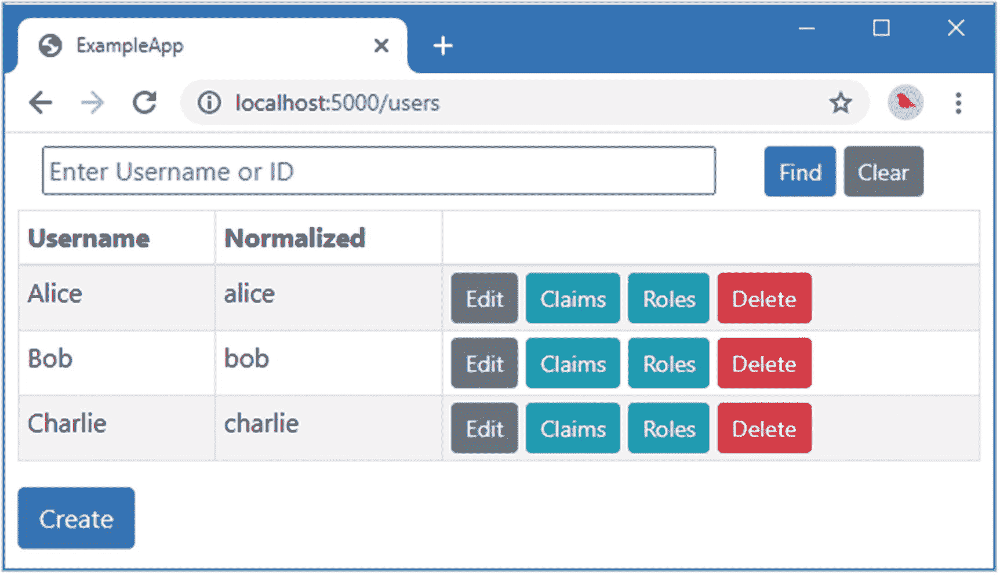
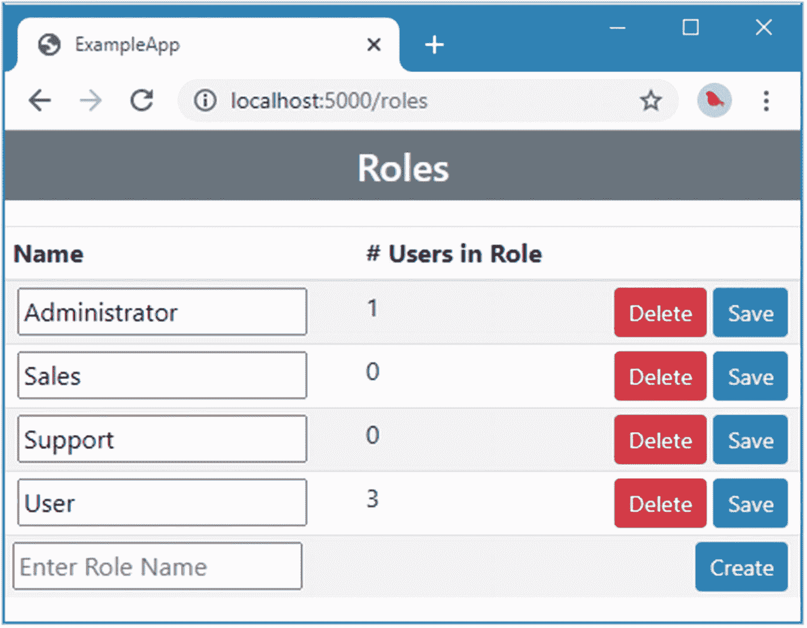
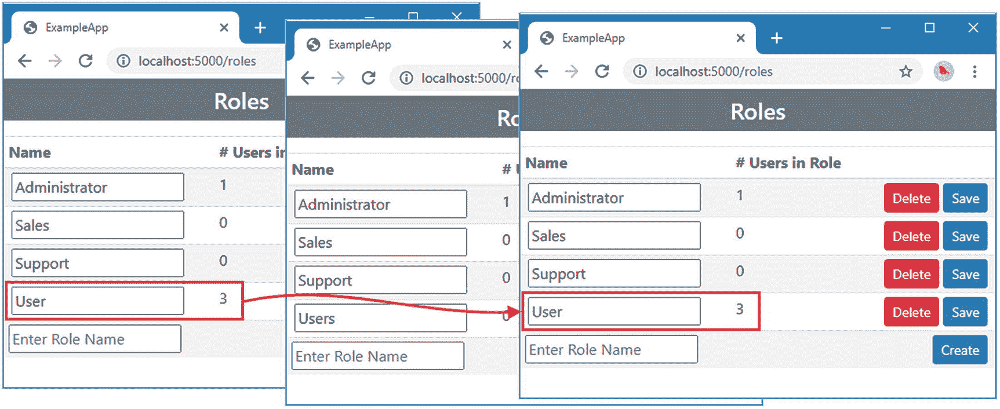
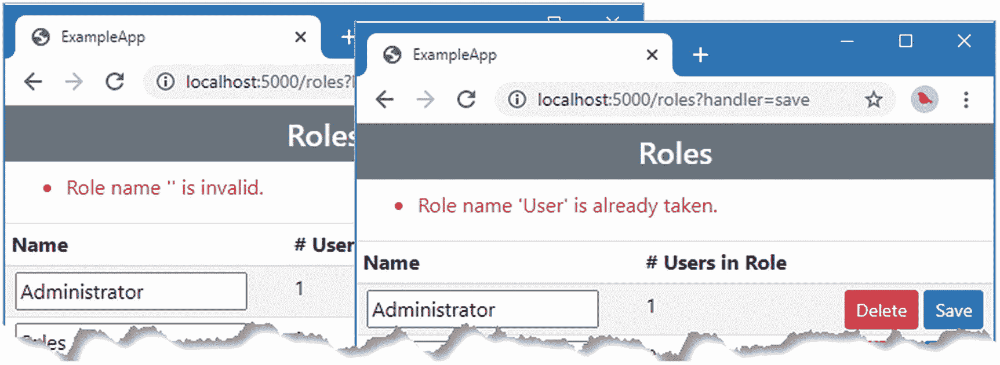
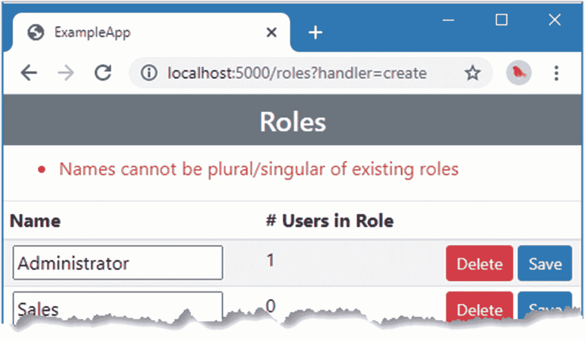
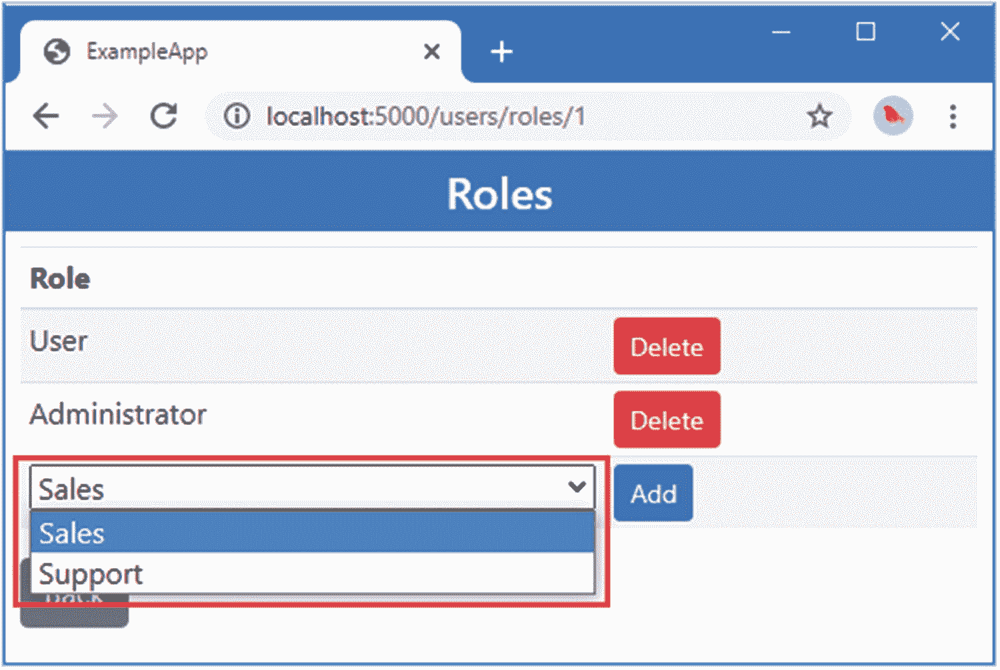
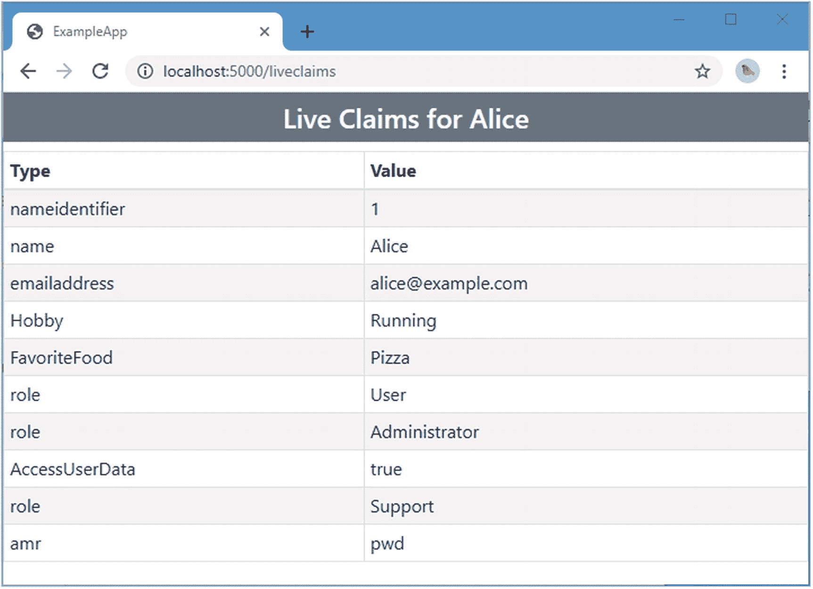
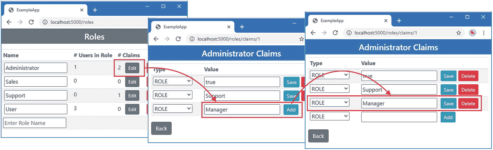
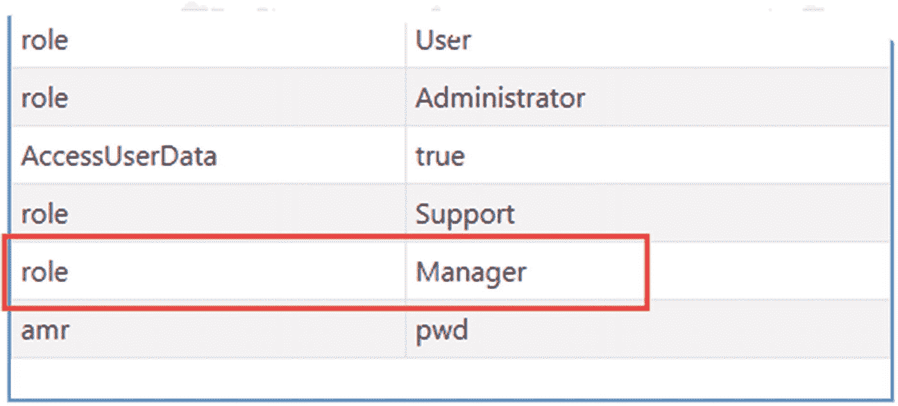

# 十九、创建角色存储

在本章中，我创建并使用一个角色库。如前几章所示，Identity 不需要角色存储来使用角色，角色存储的使用完全是可选的，并且所提供的特性在大多数项目中是不需要的。也就是说，角色存储是确保角色得到一致使用的有用方法。表 [19-1](#Tab1) 将角色存储放在上下文中。

表 19-1。

将角色存储放在上下文中

<colgroup><col class="tcol1 align-left"> <col class="tcol2 align-left"></colgroup> 
| 

问题

 | 

回答

 |
| --- | --- |
| 这是什么？ | 角色存储允许将附加数据与角色相关联。 |
| 为什么有用？ | 角色存储有一些有用的验证特性，可以用来存储额外的声明，这些声明被添加到用户登录时创建的`ClaimsPrincipal`对象中。 |
| 如何使用？ | 创建了一个角色类和一个`IRoleStore<T>`接口的实现。 |
| 有什么陷阱或限制吗？ | 大多数项目不需要角色存储提供的特性，这一点没有被广泛理解。 |
| 有其他选择吗？ | 角色存储是一项可选功能，在 ASP.NET Core Identity 中使用角色时并不是必需的。 |

表 [19-2](#Tab2) 总结了本章内容。

表 19-2。

章节总结

<colgroup><col class="tcol1 align-left"> <col class="tcol2 align-left"> <col class="tcol3 align-left"></colgroup> 
| 

问题

 | 

解决办法

 | 

列表

 |
| --- | --- | --- |
| 创建角色存储 | 定义一个角色类并创建一个`IRoleStore<T>`接口的实现。将实现注册为依赖注入的服务。 | [2](#PC2)–[5](#PC5)、 [7](#PC7) 、 [8](#PC8) |
| 支持自定义角色存储中的 LINQ 查询 | 实现`IQueryableRoleStore<T>`接口。 | [6](#PC6) |
| 管理角色存储中的角色 | 使用`RoleManager<T>`类。 | [9](#PC9) 、 [10](#PC10) 、[20](#PC20)–[23](#PC23) |
| 在将角色添加到角色存储之前对其进行验证 | 创建一个`IRoleValidator<T>`接口的实现。 | [11](#PC11) ， [12](#PC12) |
| 强制角色一致性 | 使用角色存储作为允许的角色成员 Identity 的主列表 | [13](#PC13) ， [14](#PC14) |
| 存储带有角色的声明 | 实现`IRoleClaimStore<T>`接口。 | [15](#PC15)–[19](#PC19) |

## 为本章做准备

本章使用第 18 章中的 ExampleApp 项目。准备本章不需要做任何改动。打开一个新的命令提示符，导航到`ExampleApp`文件夹，运行清单 [19-1](#PC1) 中所示的命令来启动 ASP.NET Core。

Tip

你可以从 [`https://github.com/Apress/pro-asp.net-core-identity`](https://github.com/Apress/pro-asp.net-core-identity) 下载本章以及本书其他章节的示例项目。如果在运行示例时遇到问题，请参见第 [1](01.html) 章获取帮助。

```cs
dotnet run

Listing 19-1.Running the Example Application

```

打开一个新的浏览器窗口并请求`http://localhost:5000/users`。您将看到如图 [19-1](#Fig1) 所示的用户数据。数据仅存储在内存中，当 ASP.NET Core 停止时，更改将会丢失。



图 19-1。

运行示例应用

## 创建自定义角色存储

目前，角色在用户存储中被表示为声明。如果授权策略要求角色成员资格，则访问权限将被授予拥有带有所需角色名称的`Role`声明的用户。这种方法适用于大多数 web 应用，这些应用通常依赖于少量的角色，但是有一些限制。

第一个限制是，直到用户第一次被授予带有特定值的`Role`声明时，角色才存在。例如，直到第一次为用户创建值为`Manager`的`Role`声明时，应用才知道有`Manager`角色。这可能会导致应用出现问题，因为很难确定某个特定的角色是否存在，但没有为其分配用户，或者该角色是否根本不存在。应用所能做的就是查询用户存储中的声明。

第二个限制是很难实施一致性，这意味着输入错误会导致意外的应用行为。很容易输入错误的角色名称，以至于一些用户被分配到`Administrator`角色(单数)，而其他用户被分配到`Administrators`角色(复数)。用户将被拒绝访问他们有权访问的功能，或者更糟的是，被允许访问他们应该被排除在外的功能。

为了帮助管理复杂的角色集，Identity 支持一个*角色存储库*，用于定义和管理应用所需的角色。在接下来的小节中，我将为示例应用创建一个角色存储，并演示其用法。

### 创建角色类

起点是定义一个类，该类将被实例化以表示角色。这个类被称为*角色类*，在用户存储中扮演与用户类相同的角色。将名为`AppRole.cs`的类文件添加到`ExampleApp/Identity`文件夹中，并使用它来定义清单 [19-2](#PC2) 中所示的类。

```cs
using System;

namespace ExampleApp.Identity {

    public class AppRole {

        public string Id { get; set; } = Guid.NewGuid().ToString();

        public string Name { get; set; }

        public string NormalizedName { get; set; }
    }
}

Listing 19-2.The Contents of the AppRole.cs File in the Identity Folder

```

对于如何定义角色类没有任何限制，我从一个最小的设置开始，设置一个唯一标识角色的`Id`属性，一个将向用户显示的`Name`属性，以及一个用于存储`Name`值的规范化表示并帮助确保使用名称进行比较的一致性的`NormalizedName`。

### 创建角色存储

角色存储由`IRoleStore<T>`接口定义，其中`T`是角色类。我将遵循我为用户存储所采取的相同方法，使用分部类逐步构建角色存储，每个分部类都实现了来自`IRoleStore<T>`接口的一组相关方法。表 [19-3](#Tab3) 描述了由`IRoleStore<T>`接口定义的方法。由表 [19-3](#Tab3) 中的方法定义的`token`参数是一个`CancellationToken`对象，用于在异步任务被取消时接收通知。

表 19-3。

IRoleStore <t>方法</t>

<colgroup><col class="tcol1 align-left"> <col class="tcol2 align-left"></colgroup> 
| 

名字

 | 

描述

 |
| --- | --- |
| `CreateAsync(role, token)` | 此方法将指定的角色添加到存储区。 |
| `UpdateAsync(role, token)` | 此方法更新存储区中的指定角色，永久提交任何挂起的更改。 |
| `DeleteAsync(role, token)` | 此方法从角色存储中移除指定的角色对象。 |
| `GetRoleIdAsync(role, token)` | 此方法获取指定角色对象的 ID。 |
| `GetRoleNameAsync(role, token)` | 此方法获取指定角色对象的名称。 |
| `SetRoleNameAsync(role, name, token)` | 此方法设置指定角色对象的名称。 |
| `GetNormalizedRoleNameAsync(role, token)` | 此方法获取指定角色对象的规范化名称。 |
| `SetNormalizedRoleNameAsync(role, name, token)` | 此方法设置指定角色对象的规范化名称。 |
| `FindByIdAsync(id, token)` | 此方法从存储中检索具有指定 ID 的角色对象。 |
| `FindByNameAsync(name, token)` | 此方法从存储中检索具有指定规范化名称的角色对象。 |
| `Dispose()` | 该方法继承自`IDisposable`接口，在存储对象被销毁之前被调用来释放非托管资源。 |

表 [19-3](#Tab3) 中描述的所有方法都返回一个`IdentityResult`对象，该对象指示操作的结果并提供发生的任何问题的细节。

#### 实现数据存储方法

由`IRoleStore<T>`接口定义的数据存储方法负责管理由商店管理的角色集合。将名为`RoleStoreCore.cs`的类文件添加到`Identity/Store`文件夹中，并使用它来定义清单 [19-3](#PC3) 中所示的分部类。(在本章这一部分的所有分部类创建完毕之前，您的代码编辑器会提示该类出错。)

```cs
using Microsoft.AspNetCore.Identity;
using System.Collections.Concurrent;
using System.Threading;
using System.Threading.Tasks;

namespace ExampleApp.Identity.Store {
    public partial class RoleStore: IRoleStore<AppRole> {
        private ConcurrentDictionary<string, AppRole> roles
            = new ConcurrentDictionary<string, AppRole>();

        public Task<IdentityResult> CreateAsync(AppRole role,
                CancellationToken token) {
            if (!roles.ContainsKey(role.Id) && roles.TryAdd(role.Id, role)) {
                return Task.FromResult(IdentityResult.Success);
            }
            return Task.FromResult(Error);
        }

        public Task<IdentityResult> DeleteAsync(AppRole role,
                CancellationToken token) {
            if (roles.ContainsKey(role.Id) && roles.TryRemove(role.Id, out role)) {
                return Task.FromResult(IdentityResult.Success);
            }
            return Task.FromResult(Error);
        }

        public Task<IdentityResult> UpdateAsync(AppRole role,
                CancellationToken token) {
            if (roles.ContainsKey(role.Id)) {
                roles[role.Id].UpdateFrom(role);
                return Task.FromResult(IdentityResult.Success);
            }
            return Task.FromResult(Error);
        }

        public void Dispose() {
            // do nothing
        }

        private IdentityResult Error => IdentityResult.Failed(new IdentityError {
            Code = "StorageFailure",
            Description = "Role Store Error"
        });
    }
}

Listing 19-3.The Contents of the RoleStoreCore.cs File in the Identity/Store Folder

```

我遵循了与在第 16 章[中存储用户对象相同的方法来存储角色。数据将使用一个`ConcurrentDictionary`对象存储在内存中，使用`AppRole.Id`属性作为键。重新启动 ASP.NET Core 将重置角色存储，所有更改都将丢失。](16.html)

#### 实现命名方法

下一组方法负责为 Identity 提供对角色基本信息的访问，这是通过将方法映射到角色对象定义的属性来完成的。将名为`RoleStoreNames.cs`的类文件添加到`ExampleApp/Identity/Store`文件夹中，并使用它来定义清单 [19-4](#PC4) 中所示的分部类。

```cs
using System.Threading;
using System.Threading.Tasks;

namespace ExampleApp.Identity.Store {

    public partial class RoleStore {

        public Task<string> GetRoleIdAsync(AppRole role, CancellationToken token)
            => Task.FromResult(role.Id);

        public Task<string> GetRoleNameAsync(AppRole role, CancellationToken token)
            => Task.FromResult(role.Name);

        public Task SetRoleNameAsync(AppRole role, string roleName,
                CancellationToken token) {
            role.Name = roleName;
            return Task.CompletedTask;
        }

        public Task<string> GetNormalizedRoleNameAsync(AppRole role,
           CancellationToken token) => Task.FromResult(role.NormalizedName);

        public Task SetNormalizedRoleNameAsync(AppRole role, string normalizedName,
                CancellationToken token) {
            role.NormalizedName = normalizedName;
            return Task.CompletedTask;
        }
    }
}

Listing 19-4.The Contents of the RoleStoreNames.cs File in the Identity/Store Folder

```

#### 实现搜索方法

下一组方法允许通过 ID 或名称来定位角色对象。将名为`RoleStoreQuery.cs`的类文件添加到`ExampleApp/Identity/Store`文件夹中，并使用它来定义清单 [19-5](#PC5) 中所示的分部类。

```cs
using System.Linq;
using System.Threading;
using System.Threading.Tasks;

namespace ExampleApp.Identity.Store {

    public partial class RoleStore {

        public Task<AppRole> FindByIdAsync(string id, CancellationToken token)
            => Task.FromResult(roles.ContainsKey(id) ? roles[id].Clone() : null);

        public Task<AppRole> FindByNameAsync(string name, CancellationToken token)
            => Task.FromResult(roles.Values.FirstOrDefault(r => r.NormalizedName ==
                   name)?.Clone());
    }
}

Listing 19-5.The Contents of the RoleStoreQuery.cs File in the Identity/Store Folder

```

注意，这些方法使用清单 [19-5](#PC5) 中定义的`Clone`扩展方法来创建对象，这些对象可以被应用修改，然后提交给存储。这是防止用户放弃的更改被存储的重要措施。

#### 使商店可查询

角色存储可以实现可选的`IQueryableRoleStore<T>`接口，其中`T`是角色类，以创建一个可以通过 LINQ 轻松查询的角色存储。`IQueryableRoleStore<T>`定义了表 [19-4](#Tab4) 中描述的属性。

表 19-4。

IQueryableRoleStore <t>接口</t>

<colgroup><col class="tcol1 align-left"> <col class="tcol2 align-left"></colgroup> 
| 

名字

 | 

描述

 |
| --- | --- |
| `Roles` | 该属性返回一个`IQueryable<T>`对象，其中`T`是角色类。 |

要实现可选接口，对在`RoleStoreQuery.cs`文件中定义的分部类进行清单 [19-6](#PC6) 所示的修改。

```cs
using System.Linq;
using System.Threading;
using System.Threading.Tasks;
using Microsoft.AspNetCore.Identity;

namespace ExampleApp.Identity.Store {

    public partial class RoleStore: IQueryableRoleStore<AppRole> {

        public Task<AppRole> FindByIdAsync(string id, CancellationToken token)
            => Task.FromResult(roles.ContainsKey(id) ? roles[id].Clone() : null);

        public Task<AppRole> FindByNameAsync(string name, CancellationToken token)
            => Task.FromResult(roles.Values.FirstOrDefault(r => r.NormalizedName ==
                   name)?.Clone());

        public IQueryable<AppRole> Roles =>
             roles.Values.Select(role => role.Clone()).AsQueryable<AppRole>();
    }
}

Listing 19-6.Implementing an Interface in the RoleStoreQuery.cs File in the Identity/Store Folder

```

再次强调，返回可以在存储之外修改的对象是很重要的，这样只有在调用`UpdateAsync`方法时才会存储更改。

### 植入角色存储和配置应用

现在我已经实现了`IRoleStore<T>`和`IQueryableRoleStore<T>`接口，我可以通过添加一些种子数据来完成存储。将名为`RoleStore.cs`的类文件添加到`ExampleApp/Identity/Store`文件夹中，并使用它来定义清单 [19-7](#PC7) 中所示的分部类。

```cs
using Microsoft.AspNetCore.Identity;
using System.Collections.Generic;

namespace ExampleApp.Identity.Store {

    public partial class RoleStore {

        public ILookupNormalizer Normalizer { get; set; }

        public RoleStore(ILookupNormalizer normalizer) {
            Normalizer = normalizer;
            SeedStore();
        }

        private void SeedStore() {

            var roleData = new List<string> {
                "Administrator", "User", "Sales", "Support"
            };

            int idCounter = 0;

            foreach (string roleName in roleData) {
                AppRole role = new AppRole {
                    Id = (++idCounter).ToString(),
                    Name = roleName,
                    NormalizedName = Normalizer.NormalizeName(roleName)
                };
                roles.TryAdd(role.Id, role);
            }
        }
    }
}

Listing 19-7.The Contents of the RoleStore.cs File in the Identity/Store Folder

```

清单 [19-7](#PC7) 中的代码为角色库植入了四个角色。使用`ILookupNormalizer`接口的实现来规范化角色名，我在第 [16 章](16.html)中介绍了这个接口。

清单 [19-8](#PC8) 配置应用使用角色存储。

```cs
using Microsoft.AspNetCore.Builder;
using Microsoft.AspNetCore.Hosting;
using Microsoft.AspNetCore.Http;
using Microsoft.Extensions.DependencyInjection;
using ExampleApp.Custom;
using Microsoft.AspNetCore.Authentication.Cookies;
using Microsoft.AspNetCore.Authorization;
using Microsoft.AspNetCore.Identity;
using ExampleApp.Identity;
using ExampleApp.Identity.Store;
using ExampleApp.Services;

namespace ExampleApp {
    public class Startup {

        public void ConfigureServices(IServiceCollection services) {
            services.AddSingleton<ILookupNormalizer, Normalizer>();
            services.AddSingleton<IUserStore<AppUser>, UserStore>();
            services.AddSingleton<IEmailSender, ConsoleEmailSender>();
            services.AddSingleton<ISMSSender, ConsoleSMSSender>();
            //services.AddSingleton<IUserClaimsPrincipalFactory<AppUser>,
            //    AppUserClaimsPrincipalFactory>();
            services.AddSingleton<IPasswordHasher<AppUser>, SimplePasswordHasher>();
            services.AddSingleton<IRoleStore<AppRole>, RoleStore>();

            services.AddIdentityCore<AppUser>(opts => {
                opts.Tokens.EmailConfirmationTokenProvider = "SimpleEmail";
                opts.Tokens.ChangeEmailTokenProvider = "SimpleEmail";
                opts.Tokens.PasswordResetTokenProvider =
                    TokenOptions.DefaultPhoneProvider;

                opts.Password.RequireNonAlphanumeric = false;
                opts.Password.RequireLowercase = false;
                opts.Password.RequireUppercase = false;
                opts.Password.RequireDigit = false;
                opts.Password.RequiredLength = 8;

            })
           .AddTokenProvider<EmailConfirmationTokenGenerator>("SimpleEmail")
           .AddTokenProvider<PhoneConfirmationTokenGenerator>
                (TokenOptions.DefaultPhoneProvider)
           .AddSignInManager()
           .AddRoles<AppRole>();

            services.AddSingleton<IUserValidator<AppUser>, EmailValidator>();
            services.AddSingleton<IPasswordValidator<AppUser>, PasswordValidator>();
            services.AddSingleton<IUserClaimsPrincipalFactory<AppUser>,
                AppUserClaimsPrincipalFactory>();

            services.AddAuthentication(opts => {
                opts.DefaultScheme = IdentityConstants.ApplicationScheme;
            }).AddCookie(IdentityConstants.ApplicationScheme, opts => {
                opts.LoginPath = "/signin";
                opts.AccessDeniedPath = "/signin/403";
            });
            services.AddAuthorization(opts => {
                AuthorizationPolicies.AddPolicies(opts);
            });
            services.AddRazorPages();
            services.AddControllersWithViews();
        }

        public void Configure(IApplicationBuilder app, IWebHostEnvironment env) {

            app.UseStaticFiles();
            app.UseAuthentication();
            app.UseRouting();
            app.UseAuthorization();

            app.UseEndpoints(endpoints => {
                endpoints.MapRazorPages();
                endpoints.MapDefaultControllerRoute();
                endpoints.MapFallbackToPage("/Secret");
            });
        }
    }
}

Listing 19-8.Using a Role Store in the Startup.cs File in the ExampleApp Folder

```

`AddSingleton`方法用于定义服务，这样`RoleStore`类用于解析对`IRoleStore<AppRole>`接口的依赖。

`AddRoles<T>`方法用于指定表示角色的类，在本例中是`AppUser`。这是一个方便的方法，它为`RoleManager<T>`类注册一个服务(在下一节中描述)并设置默认的角色验证器服务(在“验证角色”一节中描述)。

我已经移动了设置自定义索赔主工厂服务的声明。`AddRoles`方法设置一个默认的工厂服务，即使已经注册了一个，这与大多数 Identity 方法的行为相反。我已经移动了将`AppUserClaimsPrincipalFactory`类注册为工厂服务的语句，以便它替换由`AddRoles`方法创建的服务。

Note

Identity 提供了一个`AddRoleStore<T>`扩展方法，可以用来指定角色存储类。使用此方法时必须小心，因为它创建了一个作用域服务，这意味着将为每个 HTTP 请求创建一个角色存储类的新实例。当用实体框架核心存储数据时，作用域服务是有用的，但是对于这一章，我需要用`AddSingleton`方法显式地定义服务，以便所有请求共享一个`RoleStore`类的实例。

## 管理角色

角色通过`RoleManager<T>`类管理，其中`T`是角色类。表 [19-5](#Tab5) 描述了`RoleManager<T>`类定义的基本成员。还有一些额外的成员，我将在本章后面介绍。

表 19-5。

基本角色管理器<t>成员</t>

<colgroup><col class="tcol1 align-left"> <col class="tcol2 align-left"></colgroup> 
| 

名字

 | 

描述

 |
| --- | --- |
| `SupportsQueryableRoles` | 如果角色存储实现了`IQueryableRoleStore<T>`接口，该属性将返回`true`。 |
| `Roles` | 当角色存储实现`IQueryableRoleStore<T>`接口时，该属性返回一个`IQueryable<T>`对象。如果读取了该属性并且用户存储没有实现接口，将会引发异常。 |
| `CreateAsync(role)` | 此方法将指定的角色对象添加到存储区。角色接受验证(在“验证角色”一节中描述)，规范化名称在传递给角色存储的`CreateAsync`方法之前被设置。 |
| `UpdateAsync(role)` | 此方法更新存储区中的指定角色，保持已做的任何更改。角色接受验证(在“验证角色”一节中描述)，规范化名称在传递给角色存储的`UpdateAsync`方法之前被设置。 |
| `DeleteAsync(role)` | 该方法通过调用角色存储的`DeleteAsync`方法从存储中删除指定的角色。 |
| `RoleExistsAsync(name)` | 如果角色存储包含具有指定名称的角色，则该方法返回`true`，该名称在被传递到角色存储之前被规范化。 |
| `FindByIdAsync(id)` | 该方法返回具有指定 ID 的角色，如果没有这样的角色，则返回`null`。 |
| `FindByNameAsync(name)` | 该方法返回具有指定名称的角色，如果没有这样的角色，则返回`null`。角色名在被传递给角色存储的`FindByNameAsync`方法之前被规范化。 |

为了管理商店中的角色，在`Pages/Store`文件夹中添加一个名为`Roles.cshtml`的 Razor 页面，内容如清单 [19-9](#PC9) 所示。

```cs
@page "/roles"
@model ExampleApp.Pages.Store.RolesModel

<h4 class="bg-secondary text-white text-center p-2">Roles</h4>

<div asp-validation-summary="All" class="text-danger m-2"></div>

<table class="table table-striped table-sm">
    <thead><tr><th>Name</th><th># Users in Role</th><th/></tr></thead>
    <tbody>
        @foreach (AppRole role in Model.Roles) {
            <tr>
                <td class="pl-2">
                    <input name="name" form="@role.Id" value="@role.Name" />
                </td>
                <td>@((await Model.GetUsersInRole(role)).Count())</td>
                <td class="text-right pr-2">
                    <form method="post" id="@role.Id">
                        <input type="hidden" name="id" value="@role.Id" />
                        <button type="submit" class="btn btn-danger btn-sm"
                            asp-page-handler="delete">Delete</button>
                        <button type="submit" class="btn btn-info btn-sm"
                            asp-page-handler="save">Save</button>
                    </form>
                </td>
            </tr>
        }
        <tr>
            <td>
                <input name="name" form="newRole" placeholder="Enter Role Name" />
            </td>
            <td></td>
            <td class="text-right pr-2">
                <form method="post" id="newRole">
                    <button type="submit" class="btn btn-info btn-sm"
                            asp-page-handler="create">
                        Create
                    </button>
                </form>
            </td>
        </tr>
    </tbody>
</table>

Listing 19-9.The Contents of the Roles.cshtml File in the Pages/Store Folder

```

该页面以表格形式显示应用已知的角色，允许编辑名称或删除角色。还有一个允许创建新角色的表格行。

将清单 [19-10](#PC10) 中所示的代码添加到`Roles.cshtml.cs`文件中，以定义页面模型。如果您使用的是 Visual Studio 代码，则必须创建该文件。

```cs
using ExampleApp.Identity;
using Microsoft.AspNetCore.Identity;
using Microsoft.AspNetCore.Mvc;
using Microsoft.AspNetCore.Mvc.RazorPages;
using System.Collections.Generic;
using System.Linq;
using System.Threading.Tasks;

namespace ExampleApp.Pages.Store {

    public class RolesModel : PageModel {

        public RolesModel(UserManager<AppUser> userManager,
                RoleManager<AppRole> roleManager) {
            UserManager = userManager;
            RoleManager = roleManager;
        }

        public UserManager<AppUser> UserManager { get; set; }
        public RoleManager<AppRole> RoleManager { get; set; }

        public IEnumerable<AppRole> Roles => RoleManager.Roles.OrderBy(r => r.Name);

        public async Task<IList<AppUser>> GetUsersInRole(AppRole role) =>
            await UserManager.GetUsersInRoleAsync(role.Name);

        public async Task<IActionResult> OnPostDelete(string id) {
            AppRole role = await RoleManager.FindByIdAsync(id);
            if (role != null) {
                IdentityResult result = await RoleManager.DeleteAsync(role);
                if (!result.Succeeded) {
                    return ProcessErrors(result.Errors);
                }
            }
            return RedirectToPage();
        }

        public async Task<IActionResult> OnPostSave(AppRole editedRole) {
            IdentityResult result = await RoleManager.UpdateAsync(editedRole);
            if (!result.Succeeded) {
                return ProcessErrors(result.Errors);
            }

            return RedirectToPage();
        }

        public async Task<IActionResult> OnPostCreate(AppRole newRole) {
            IdentityResult result = await RoleManager.CreateAsync(newRole);
            if (!result.Succeeded) {
                return ProcessErrors(result.Errors);
            }
            return RedirectToPage();
        }

        private IActionResult ProcessErrors(IEnumerable<IdentityError> errors) {
            foreach (IdentityError err in errors) {
                ModelState.AddModelError("", err.Description);
            }
            return Page();
        }
    }
}

Listing 19-10.The Contents of the Roles.cshtml.cs File in the Pages/Store Folder

```

重启 ASP.NET Core 并请求`http://localhost:5000/roles`，你会看到角色库中的角色列表，如图 [19-2](#Fig2) 所示。您可以更改角色名称、删除角色以及创建新角色。



图 19-2。

管理角色

了解角色成员资格的权威存储库是用户存储，而不是角色存储，这一点很重要。这似乎违反直觉，但是，正如您将在后面的示例中看到的，角色存储的存在是为了补充用户存储提供的功能，而不是取代它们。

因此，举例来说，我必须使用清单 [19-10](#PC10) 中的`UserManager<T>`类来确定有多少用户被分配给存储在角色库中的每个角色。角色存储中的角色可能不是应用所使用的角色的完整集合，你可以通过改变`User`角色的名称然后再改回来看到，这产生了如图 [19-3](#Fig3) 所示的序列。



图 19-3。

了解用户和角色存储之间的关系

当您重命名角色时，角色存储中不再有一个`User`角色，但这不会阻止用户被分配到该角色，因为该数据在用户存储中。

### 验证角色

在将角色传递到角色存储库之前，`RoleManager<T>`类的`CreateAsync`和`UpdateAsync`方法执行验证检查。角色验证由实现`IRoleValidator<T>`接口的服务执行，其中`T`是角色类。验证接口定义了表 [19-6](#Tab6) 中描述的方法。

表 19-6。

由 IRoleValidator <t>接口定义的方法</t>

<colgroup><col class="tcol1 align-left"> <col class="tcol2 align-left"></colgroup> 
| 

名字

 | 

描述

 |
| --- | --- |
| `ValidateAsync(manager, role)` | 调用此方法以代表指定的角色管理器验证指定的角色。该方法返回一个`IdentityResult`对象，该对象指示验证是否成功，如果不成功，则提供验证错误的详细信息。 |

Identity 提供了一个内置的角色验证器，确保角色名称不是空字符串，并且角色名称在角色存储中是唯一的。当角色验证失败时，使用由`CreateAsync`和`UpdateAsync`方法返回的`IdentityResult`对象来表示验证错误。您可以通过请求`http://localhost:5000/roles`并点击 Create 按钮，而无需在相邻的文本字段中输入文本，来查看内置验证程序报告的错误，如图 [19-4](#Fig4) 所示。输入一个现有角色的名称，如**用户**，点击创建按钮，查看角色名称已被使用时报告的错误，如图 [19-4](#Fig4) 所示。



图 19-4。

内置 Identity 角色验证

#### 创建自定义角色验证器

要创建一个定制的验证器，将一个名为`RoleValidator.cs`的类文件添加到`ExampleApp/Identity`文件夹中，并使用它来定义清单 [19-11](#PC11) 中所示的类。

```cs
using Microsoft.AspNetCore.Identity;
using System.Threading.Tasks;

namespace ExampleApp.Identity {
    public class RoleValidator : IRoleValidator<AppRole> {

        private static IdentityError error = new IdentityError {
            Description = "Names cannot be plural/singular of existing roles"
        };

        public async Task<IdentityResult> ValidateAsync(RoleManager<AppRole> manager,
                AppRole role) {
            if (await manager.FindByNameAsync(role.Name.EndsWith("s")
                ? role.Name[0..^1] : role.Name + "s") == null) {
                return IdentityResult.Success;
            }
            return IdentityResult.Failed(error);
        }
    }
}

Listing 19-11.The Contents of the RoleValidator.cs File in the Identity Folder

```

验证器防止角色名称简单地在现有角色名称中添加或省略字母`s`。我发现我开始用单数来定义角色(`administrator`、`user`等)。)然后不小心切换到复数(`administrators`、`users`等等)。验证器检查这个错误，但是仍然允许创建名称以 *s* 结尾的角色，比如`Sales`，只要存储中还没有`Sale`角色。

在清单 [19-12](#PC12) 中，我将验证器注册为`IRoleValidator<AppRole>`接口的一个实现。我是在调用了`AddIdentityCore`方法之后这样做的，这样除了内置的 Identity 角色验证器之外，还可以使用新的验证器。如果我在使用`AddIdentityCore`方法之前注册了服务，那么定制的验证器就会取代内置的验证器。

```cs
...
public void ConfigureServices(IServiceCollection services) {
    services.AddSingleton<ILookupNormalizer, Normalizer>();
    services.AddSingleton<IUserStore<AppUser>, UserStore>();
    services.AddSingleton<IEmailSender, ConsoleEmailSender>();
    services.AddSingleton<ISMSSender, ConsoleSMSSender>();
    //services.AddSingleton<IUserClaimsPrincipalFactory<AppUser>,
    //    AppUserClaimsPrincipalFactory>();
    services.AddSingleton<IPasswordHasher<AppUser>, SimplePasswordHasher>();
    services.AddSingleton<IRoleStore<AppRole>, RoleStore>();

    services.AddIdentityCore<AppUser>(opts => {
        opts.Tokens.EmailConfirmationTokenProvider = "SimpleEmail";
        opts.Tokens.ChangeEmailTokenProvider = "SimpleEmail";
        opts.Tokens.PasswordResetTokenProvider =
            TokenOptions.DefaultPhoneProvider;

        opts.Password.RequireNonAlphanumeric = false;
        opts.Password.RequireLowercase = false;
        opts.Password.RequireUppercase = false;
        opts.Password.RequireDigit = false;
        opts.Password.RequiredLength = 8;

    })
    .AddTokenProvider<EmailConfirmationTokenGenerator>("SimpleEmail")
    .AddTokenProvider<PhoneConfirmationTokenGenerator>
        (TokenOptions.DefaultPhoneProvider)
    .AddSignInManager()
    .AddRoles<AppRole>();

    services.AddSingleton<IUserValidator<AppUser>, EmailValidator>();
    services.AddSingleton<IPasswordValidator<AppUser>, PasswordValidator>();
    services.AddSingleton<IUserClaimsPrincipalFactory<AppUser>,
        AppUserClaimsPrincipalFactory>();
    services.AddSingleton<IRoleValidator<AppRole>, RoleValidator>();

    services.AddAuthentication(opts => {
        opts.DefaultScheme = IdentityConstants.ApplicationScheme;
    }).AddCookie(IdentityConstants.ApplicationScheme, opts => {
        opts.LoginPath = "/signin";
        opts.AccessDeniedPath = "/signin/403";
    });
    services.AddAuthorization(opts => {
        AuthorizationPolicies.AddPolicies(opts);
    });
    services.AddRazorPages();
    services.AddControllersWithViews();
}
...

Listing 19-12.Registering the Validator in the Startup.cs File in the ExampleApp Folder

```

重启 ASP.NET Core 并请求`http://localhost:5000/roles`。尝试创建一个名为`Users`的角色，您会看到如图 [19-5](#Fig5) 所示的错误信息，因为商店中已经有一个名为`User`的角色。



图 19-5。

验证角色

### 加强角色一致性

创建角色库的一个原因是为了加强一致性，确保输入错误不会将用户分配到错误的角色。Identity 不提供将角色限制为角色存储中存在的名称的内置支持，但这是一个手动实现的简单过程。第一步是限制用户可以被分配的角色，如清单 [19-13](#PC13) 所示。

```cs
using ExampleApp.Identity;
using Microsoft.AspNetCore.Identity;
using Microsoft.AspNetCore.Mvc;
using Microsoft.AspNetCore.Mvc.RazorPages;
using System.Collections.Generic;
using System.Linq;
using System.Threading.Tasks;
using System.Security.Claims;
using Microsoft.AspNetCore.Mvc.Rendering;

namespace ExampleApp.Pages.Store {

    public class UserRolesModel : PageModel {

        public UserRolesModel(UserManager<AppUser> userManager,
                RoleManager<AppRole> roleManager) {
            UserManager = userManager;
            RoleManager = roleManager;
        }

        public UserManager<AppUser> UserManager { get; set; }
        public RoleManager<AppRole> RoleManager { get; set; }

        public IEnumerable<string> Roles { get; set; } = Enumerable.Empty<string>();
        public SelectList AvailableRoles { get; set; }

        [BindProperty(SupportsGet = true)]
        public string Id { get; set; }

        public async void OnGet() {
            AppUser user = await GetUser();
            if (user != null) {
                Roles = (await UserManager.GetClaimsAsync(user))
                    .Where(c => c.Type == ClaimTypes.Role).Select(c => c.Value);
                AvailableRoles = new SelectList(RoleManager.Roles
                    .OrderBy(r => r.Name)
                    .Select(r => r.Name).Except(Roles));
            }
        }

        public async Task<IActionResult> OnPostAdd(string newRole) {
            await UserManager.AddClaimAsync(await GetUser(),
                new Claim(ClaimTypes.Role, newRole));
            return RedirectToPage();
        }

        public async Task<IActionResult> OnPostDelete(string role) {
            await UserManager.RemoveFromRoleAsync(await GetUser(), role);
            return RedirectToPage();
        }

        private Task<AppUser> GetUser() => Id == null
            ? null : UserManager.FindByIdAsync(Id);
    }
}

Listing 19-13.Using the Role Store in the UserRoles.cshtml.cs File in the Pages/Store Folder

```

这些更改添加了一个名为`AvailableRoles`的页面模型属性，它提供了一系列角色，用户还没有被分配到这些角色。角色成员是不区分大小写的，但是在角色名称被添加到用户存储之前，`UserManager<T>`会对角色名称进行规范化，所以我必须比较角色存储中`AppRole`对象的`Name`属性来填充`AvailableRoles`属性。清单 [19-14](#PC14) 使用一个`select`元素来约束可以选择的角色。

Note

我在清单 [19-13](#PC13) 中使用了`Name`而不是`NormalizedName`属性，因为我在第 [17 章](17.html)中描述了处理规范化角色名称问题的方式。如果您决定使用规范化的角色名称，那么应该使用`NormalizedName`属性来加强角色的一致性。

```cs
@page "/users/roles/{id?}"
@model ExampleApp.Pages.Store.UserRolesModel

<h4 class="bg-primary text-white text-center p-2">Roles</h4>
<div class="m-2">
    <table class="table table-sm table-striped">
        <thead><tr><th>Role</th><th/></tr></thead>
        <tbody>
            @foreach (string role in Model.Roles) {
                <tr>
                    <td>@role</td>
                    <td>
                        <form method="post">
                            <input type="hidden" name="id" value="@Model.Id" />
                            <input type="hidden" name="role" value="@role" />
                            <button type="submit" class="btn btn-sm btn-danger"
                                    asp-page-handler="delete">
                                Delete
                            </button>
                        </form>
                    </td>
                </tr>
            }
            <tr>
                <td>
                    <form method="post" id="newRole">
                        <input type="hidden" name="id" value="@Model.Id" />
                        <select asp-items="@Model.AvailableRoles"
                            name="newRole" class="w-100">
                        </select>
                    </form>
                </td>
                <td>
                    <button type="submit" class="btn btn-sm btn-primary"
                            asp-page-handler="add" form="newRole">
                        Add
                    </button>
                </td>
            </tr>
        </tbody>
    </table>
    <div>
        <a asp-page="users" class="btn btn-secondary">Back</a>
    </div>
</div>

Listing 19-14.Constraining Role Selection in the UserRoles.cshtml File in the Pages/Store Folder

```

重启 ASP.NET Core，请求`http://localhost:5000/users`，点击 Alice 的角色按钮。`select`元素只允许用户被分配到商店中的角色，如图 [19-6](#Fig6) 所示。



图 19-6。

约束角色分配

## 存储带有角色的声明

可以为角色分配声明，以便将用户分配给存储中的角色，从而为用户提供与该角色相关联的声明。这是一致地管理复杂声明集的一种有用方式，意味着您不必手动向单个用户添加大量声明集。在接下来的小节中，我将向您展示如何扩展角色存储来处理声明，并解释如何使用这些声明。

### 扩展角色类

第一步是向角色类添加一个属性，该属性将表示与角色相关联的声明，如清单 [19-15](#PC15) 所示。

```cs
using System;
using System.Collections.Generic;
using System.Security.Claims;

namespace ExampleApp.Identity {

    public class AppRole {

        public string Id { get; set; } = Guid.NewGuid().ToString();

        public string Name { get; set; }

        public string NormalizedName { get; set; }

        public IList<Claim> Claims { get; set; }
    }
}

Listing 19-15.Adding a Property in the AppRole.cs File in the Identity Folder

```

### 扩展角色存储

`IRoleClaimStore<T>`接口由可以管理声明的角色存储实现，其中`T`是角色类。该接口定义了表 [19-7](#Tab7) 中描述的方法。(表中描述的方法定义了一个`CancellationToken`参数。与其他接口不同，该参数是可选的。)

表 19-7。

IRoleClaimStore <t>方法</t>

<colgroup><col class="tcol1 align-left"> <col class="tcol2 align-left"></colgroup> 
| 

名字

 | 

描述

 |
| --- | --- |
| `GetClaimsAsync(role)` | 此方法返回与指定角色关联的声明。 |
| `AddClaimAsync(role. claim)` | 此方法向指定的角色添加声明。 |
| `RemoveClaimAsync(role, claim)` | 此方法从指定的角色中移除声明。 |

要将声明支持添加到角色存储中，将名为`RoleStoreClaims.cs`的类文件添加到`ExampleApp/Identity/Store`文件夹中，并使用它来定义清单 [19-16](#PC16) 中所示的分部类。

```cs
using Microsoft.AspNetCore.Identity;
using System.Collections.Generic;
using System.Linq;
using System.Security.Claims;
using System.Threading;
using System.Threading.Tasks;

namespace ExampleApp.Identity.Store {
    public partial class RoleStore : IRoleClaimStore<AppRole> {

        public Task AddClaimAsync(AppRole role, Claim claim,
                CancellationToken token = default) {
            role.Claims.Add(claim);
            return Task.CompletedTask;
        }

        public Task<IList<Claim>> GetClaimsAsync(AppRole role,
                CancellationToken token = default) =>
            Task.FromResult(role.Claims ?? new List<Claim>());

        public Task RemoveClaimAsync(AppRole role, Claim claim,
                CancellationToken token = default) {
            role.Claims = role.Claims.Where(c => !(string.Equals(c.Type, claim.Type)
                && string.Equals(c.Value, claim.Value))).ToList<Claim>();
            return Task.CompletedTask;
        }
    }
}

Listing 19-16.The Contents of the RoleStoreClaims.cs File in the Identity/Store Folder

```

该接口的实现使用添加到清单 [19-16](#PC16) 中的`AppRole`类的`Claims`属性。

### 扩展索赔主体工厂

与角色相关联的声明由声明主体工厂处理。正如我在第 [15](15.html) 章中解释的，这是 Identity 和 ASP.NET Core 的授权特性之间的连接点。在清单 [19-17](#PC17) 中，我已经更新了我在第 [18 章](18.html)中创建的自定义声明主体工厂，以从用户存储中获取用户被分配的角色，从角色存储中检索相应的角色，并处理角色的声明。

```cs
using Microsoft.AspNetCore.Builder;
using Microsoft.AspNetCore.Identity;
using System.Security.Claims;
using System.Threading.Tasks;

namespace ExampleApp.Identity {
    public class AppUserClaimsPrincipalFactory :
            IUserClaimsPrincipalFactory<AppUser> {

        public AppUserClaimsPrincipalFactory(UserManager<AppUser> userManager,
                RoleManager<AppRole> roleManager) {
            UserManager = userManager;
            RoleManager = roleManager;
        }

        public UserManager<AppUser> UserManager { get; set; }
        public RoleManager<AppRole> RoleManager { get; set; }

        public async Task<ClaimsPrincipal> CreateAsync(AppUser user) {
            ClaimsIdentity identity
                = new ClaimsIdentity(IdentityConstants.ApplicationScheme);
            identity.AddClaims(new[] {
                new Claim(ClaimTypes.NameIdentifier, user.Id),
                new Claim(ClaimTypes.Name, user.UserName),
                new Claim(ClaimTypes.Email, user.EmailAddress)
            });
            if (!string.IsNullOrEmpty(user.Hobby)) {
                identity.AddClaim(new Claim("Hobby", user.Hobby));
            }
            if (!string.IsNullOrEmpty(user.FavoriteFood)) {
                identity.AddClaim(new Claim("FavoriteFood", user.FavoriteFood));
            }
            if (user.Claims != null) {
                identity.AddClaims(user.Claims);
            }

            if (UserManager.SupportsUserRole && RoleManager.SupportsRoleClaims) {
                foreach (string roleName in await UserManager.GetRolesAsync(user)) {
                    AppRole role = await RoleManager.FindByNameAsync(roleName);
                    if (role != null && role.Claims != null) {
                        identity.AddClaims(role.Claims);
                    }
                }
            }
            return new ClaimsPrincipal(identity);
        }
    }
}

Listing 19-17.Processing Role Claims in the AppUserClaimsPrincipalFactory.cs File in the Identity Folder

```

工厂类是使用清单 [19-17](#PC17) 中的`AddSingleton`方法建立的，这很好，因为该类不包含任何阻止单个实例处理并发请求的特性。清单 [19-17](#PC17) 中的变化包括对`UserManager<T>`和`RoleManager<T>`服务的依赖，这两个服务都有一个作用域生命周期。由于单例服务不能声明对作用域服务的依赖，我必须改变工厂类的生命周期，如清单 [19-18](#PC18) 所示。

```cs
...
services.AddSingleton<IUserValidator<AppUser>, EmailValidator>();
services.AddSingleton<IPasswordValidator<AppUser>, PasswordValidator>();
services.AddScoped<IUserClaimsPrincipalFactory<AppUser>,
    AppUserClaimsPrincipalFactory>();
services.AddSingleton<IRoleValidator<AppRole>, RoleValidator>();
...

Listing 19-18.Changing a Service Lifecycle in the Startup.cs File in the ExampleApp Folder

```

如果没有这种改变，当 ASP.NET Core 启动时会抛出一个异常，因为依赖注入系统将无法解析工厂类声明的依赖。

### 用声明播种角色存储

为了给商店添加声明，将清单 [19-19](#PC19) 中显示的语句添加到`Identity/Store`文件夹中的`RoleStore.cs`文件中。

```cs
using Microsoft.AspNetCore.Identity;
using System.Collections.Generic;
using System.Security.Claims;
using System.Linq;

namespace ExampleApp.Identity.Store {

    public partial class RoleStore {

        public ILookupNormalizer Normalizer { get; set; }

        public RoleStore(ILookupNormalizer normalizer) {
            Normalizer = normalizer;
            SeedStore();
        }

        private void SeedStore() {

            var roleData = new List<string> {
                "Administrator", "User", "Sales", "Support"
            };

            var claims = new Dictionary<string, IEnumerable<Claim>> {
                { "Administrator", new [] { new Claim("AccessUserData", "true"),
                    new Claim(ClaimTypes.Role, "Support") } },
                {  "Support", new [] { new Claim(ClaimTypes.Role, "User" )} }
            };

            int idCounter = 0;

            foreach (string roleName in roleData) {
                AppRole role = new AppRole {
                    Id = (++idCounter).ToString(),
                    Name = roleName,
                    NormalizedName = Normalizer.NormalizeName(roleName)
                };
                if (claims.ContainsKey(roleName)) {
                    role.Claims = claims[roleName].ToList<Claim>();
                }
                roles.TryAdd(role.Id, role);
            }
        }
    }
}

Listing 19-19.Seeding Claims in the RoleStore.cs File in the Identity/Store Folder

```

这些更改创建了额外的声明，例如，`Administrator`角色的成员资格将导致`Support`角色的额外角色声明和值为`true`的`AccessUserData`声明(没有任何意义归于`AccessUserData`声明，我创建它只是为了说明可以创建角色之外的声明)。

### 管理索赔

`RoleManager<T>`类定义了表 [19-8](#Tab8) 中所示的成员，用于管理与角色相关的声明。

表 19-8。

用于管理索赔的 RoleManager <t>成员</t>

<colgroup><col class="tcol1 align-left"> <col class="tcol2 align-left"></colgroup> 
| 

名字

 | 

描述

 |
| --- | --- |
| `SupportsRoleClaims` | 如果角色存储实现了`IRoleClaimStore<T>`接口，该属性将返回`true`。 |
| `GetClaimsAsync(role)` | 该方法通过调用存储的`GetClaimsAsync`方法返回与指定角色相关联的声明。 |
| `AddClaimAsync(role, claim)` | 该方法通过调用存储的`AddClaimAsync`方法向指定的角色添加声明。角色经过验证，规范化名称在传递给角色存储的`UpdateAsync`方法之前被设置。 |
| `RemoveClaimAsync(role, claim)` | 该方法通过调用存储的`RemoveClaimAsync`方法从指定的角色中移除声明。角色经过验证，规范化名称在传递给角色存储的`UpdateAsync`方法之前被设置。 |

为了管理与角色相关联的声明，向`Pages/Store`文件夹添加一个名为`RoleClaims.cshtml`的 Razor 页面，其内容如清单 [19-20](#PC20) 所示。

```cs
@page "/roles/claims/{id?}"
@model ExampleApp.Pages.Store.RoleClaimsModel

@{ Claim newClaim = new Claim(string.Empty, string.Empty); }

<h4 class="bg-primary text-white text-center p-2">@Model.Role.Name Claims</h4>

<div class="m-2">
    <table class="table table-sm table-striped">
        <thead><tr><th>Type</th><th>Value</th><th/></tr></thead>
        <tbody>
            @foreach (Claim claim in Model.Claims) {
                <tr>
                    <partial name="_ClaimsRow"
                        model="@((Model.Role.Id, claim, false))" />
                </tr>
            }
            <tr>
                <partial name="_ClaimsRow"
                    model="@((Model.Role.Id, newClaim, true))" />
            </tr>
        </tbody>
    </table>
    <div>
        <a asp-page="roles" class="btn btn-secondary">Back</a>
    </div>
</div>

Listing 19-20.The Contents of the RoleClaims.cshtml File in the Pages/Store Folder

```

Razor 页面的视图部分使用`_ClaimsRow.cshtml`局部视图显示了页面模型类提供的一系列声明。为了创建将提供声明的页面模型，将清单 [19-21](#PC21) 中所示的代码添加到`RoleClaims.cshtml.cs`文件中。(如果您使用的是 Visual Studio 代码，则必须创建该文件。)

```cs
using ExampleApp.Identity;
using Microsoft.AspNetCore.Identity;
using Microsoft.AspNetCore.Mvc;
using Microsoft.AspNetCore.Mvc.RazorPages;
using System.Collections.Generic;
using System.Linq;
using System.Security.Claims;
using System.Threading.Tasks;

namespace ExampleApp.Pages.Store {

    public class RoleClaimsModel : PageModel {

        public RoleClaimsModel(RoleManager<AppRole> roleManager)
            => RoleManager = roleManager;

        public RoleManager<AppRole> RoleManager { get; set; }

        public AppRole Role { get; set; }

        public IEnumerable<Claim> Claims => Role.Claims ?? new List<Claim>();

        public async Task OnGet(string id) {
            Role = await RoleManager.FindByIdAsync(id);
        }

        public async Task<IActionResult> OnPostAdd(string id, string type,
                string value) {
            Role = await RoleManager.FindByIdAsync(id);
            await RoleManager.AddClaimAsync(Role, new Claim(type, value));
            return RedirectToPage();
        }

        public async Task<IActionResult> OnPostEdit(string id, string type,
                string value, string oldType, string oldValue) {
            Role = await RoleManager.FindByIdAsync(id);
            await RoleManager.RemoveClaimAsync(Role, new Claim(oldType, oldValue));
            await RoleManager.AddClaimAsync(Role, new Claim(type, value));
            return RedirectToPage();
        }

        public async Task<IActionResult> OnPostDelete(string id, string type,
                string value) {
            Role = await RoleManager.FindByIdAsync(id);
            await RoleManager.RemoveClaimAsync(Role, new Claim(type, value));
            return RedirectToPage();
        }
    }
}

Listing 19-21.The Contents of the RoleClaims.cshtml.cs File in the Pages/Store Folder

```

页面模型类使用表 [19-8](#Tab8) 中描述的角色管理器类提供的方法，定义添加、编辑和删除声明的处理程序方法。为了将索赔特性集成到应用的其余部分，将清单 [19-22](#PC22) 中所示的元素添加到`Roles.cshtml`文件中。

```cs
@page "/roles"
@model ExampleApp.Pages.Store.RolesModel

<h4 class="bg-secondary text-white text-center p-2">Roles</h4>

<div asp-validation-summary="All" class="text-danger m-2"></div>

<table class="table table-striped table-sm">
    <thead>
        <tr><th>Name</th><th># Users in Role</th><th># Claims</th><th/></tr>
    </thead>
    <tbody>
        @foreach (AppRole role in Model.Roles) {
            <tr>
                <td class="pl-2">
                    <input name="name" form="@role.Id" value="@role.Name" />
                </td>
                <td>@((await Model.GetUsersInRole(role)).Count())</td>
                <td>@(role.Claims?.Count() ?? 0)
                     <a asp-page="RoleClaims" class="btn btn-secondary btn-sm ml-2"
                            asp-route-id="@role.Id">Edit</a>
                </td>
                <td class="text-right pr-2">
                    <form method="post" id="@role.Id">
                        <input type="hidden" name="id" value="@role.Id" />
                        <button type="submit" class="btn btn-danger btn-sm"
                            asp-page-handler="delete">Delete</button>
                        <button type="submit" class="btn btn-info btn-sm"
                            asp-page-handler="save">Save</button>

                    </form>
                </td>
            </tr>
        }
        <tr>
            <td>
                <input name="name" form="newRole" placeholder="Enter Role Name" />
            </td>
            <td></td>
            <td></td>
            <td class="text-right pr-2">
                <form method="post" id="newRole">
                    <button type="submit" class="btn btn-info btn-sm"
                            asp-page-handler="create">
                        Create
                    </button>
                </form>
            </td>
        </tr>
    </tbody>
</table>

Listing 19-22.Integrating Claims into the Roles.cshtml File in the Pages/Store Folder

```

显示每个角色的索赔数量，以及导航到`RoleClaims` Razor 页面的锚元素。

### 显示索赔

要查看将声明分配给用户的方式，请将名为`LiveClaims.cshtml`的 Razor 页面添加到`Pages`文件夹中，其内容如清单 [19-23](#PC23) 所示。

```cs
@page
@using System.Security.Claims
@using ExampleApp.Identity
@using Microsoft.AspNetCore.Identity
@inject UserManager<AppUser> UserManager

@{

 string GetName(string claimType) =>
            (Uri.IsWellFormedUriString(claimType, UriKind.Absolute)
                ? System.IO.Path.GetFileName(new Uri(claimType).LocalPath)
                : claimType);
}

<h4 class="bg-secondary text-white text-center p-2">
    Live Claims for @(User.Identity.Name ?? "No User")
</h4>

<table class="table table-sm table-striped table-bordered">
    <thead><tr><th>Type</th><th>Value</th></tr></thead>
    <tbody>
        @foreach (Claim claim in User.Claims) {
            <tr><td>@GetName(claim.Type)</td><td>@claim.Value</td></tr>
        }
    </tbody>
</table>

Listing 19-23.The Contents of the LiveClaims.cshtml File in the Pages Folder

```

重启 ASP.NET Core，请求`http://localhost:5000/signout`，点击退出按钮。从列表中选择`alice@example.com`，在密码栏中输入 **MySecret1$** ，点击签到按钮。导航到`http://localhost:5000/liveclaims`，您将看到已经为用户创建的索赔，如图 [19-7](#Fig7) 所示。



图 19-7。

从角色派生的声明

如图所示，工厂创建的声明集合并了种子数据中定义的附加角色和`AccessUserData`声明。

Note

图 [19-7](#Fig7) 中显示的一个声明具有类型`amr`和值`pwd`。这个声明是由`SignInManager<T>`类创建的，正如我在第 [20](20.html) 章中解释的。

重要的是要记住，声明主体工厂仅在用户登录时使用，这意味着对角色存储中的声明所做的更改不会立即生效。请求`http://localhost:5000/roles`，点击`Administrator`角色的编辑按钮，创建一个经理角色声明，如图 [19-8](#Fig8) 所示。



图 19-8。

向角色添加声明

导航到`http://localhost:5000/liveclaims`，您将看到 Alice 的声明列表不包括新角色。退出应用，再次登录，并请求`http://localhost:5000/liveclaims`。在登录过程中，声明主体工厂创建一个新的包含新角色声明的`ClaimsPrincipal`对象，如图 [19-9](#Fig9) 所示。



图 19-9。

登录对索赔的影响

## 摘要

在这一章中，我创建了一个角色库。我描述了角色存储提供的特性。我演示了如何验证角色，如何使用角色存储来确保角色分配的一致性，以及如何存储声明。在下一章中，我将描述如何实现锁定和双因素认证。