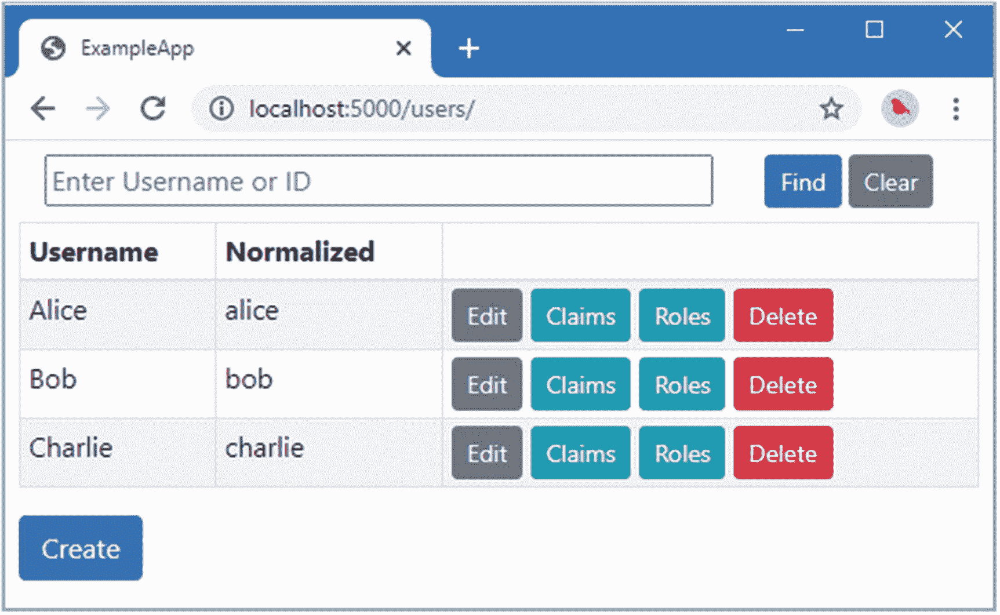
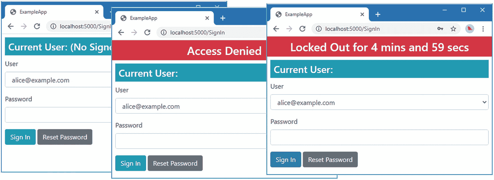
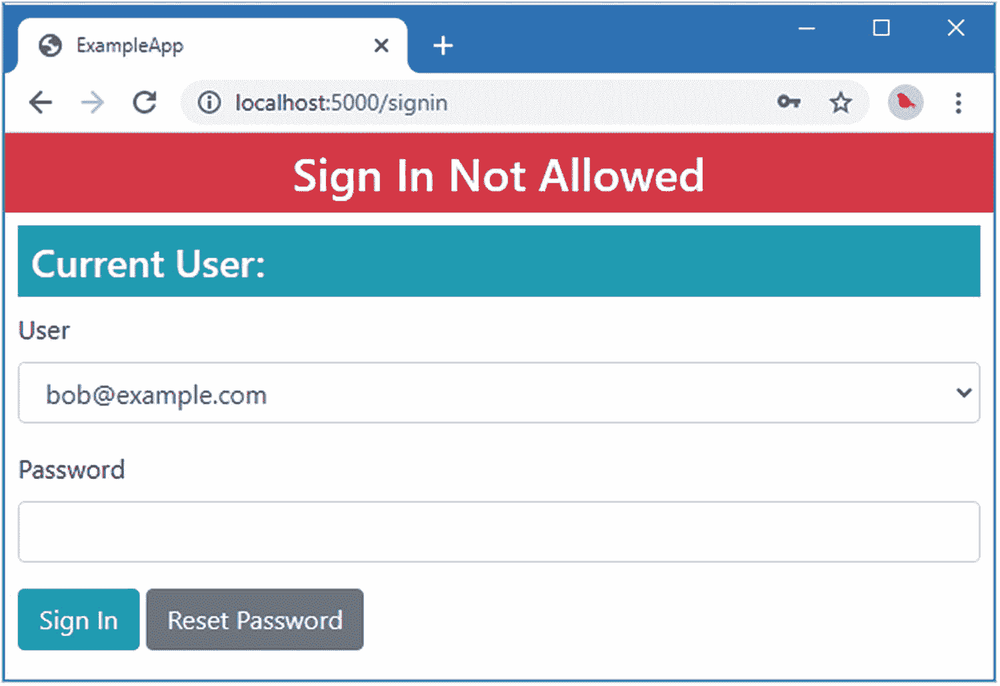
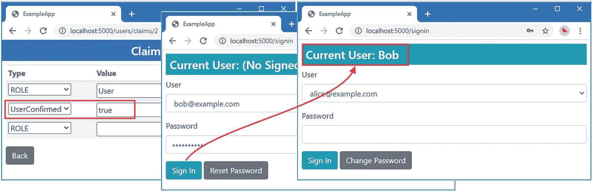
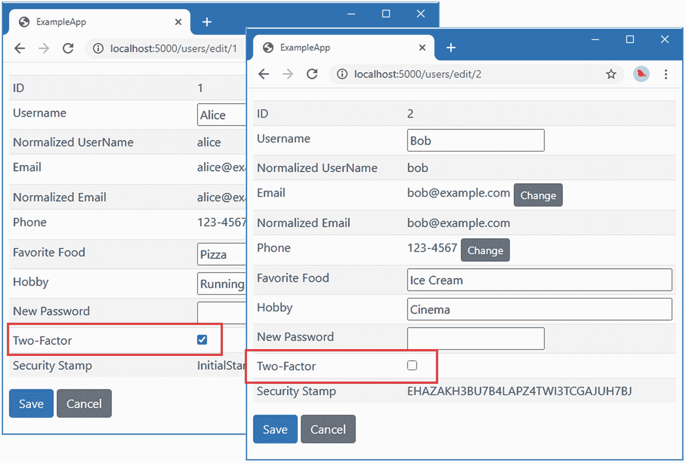
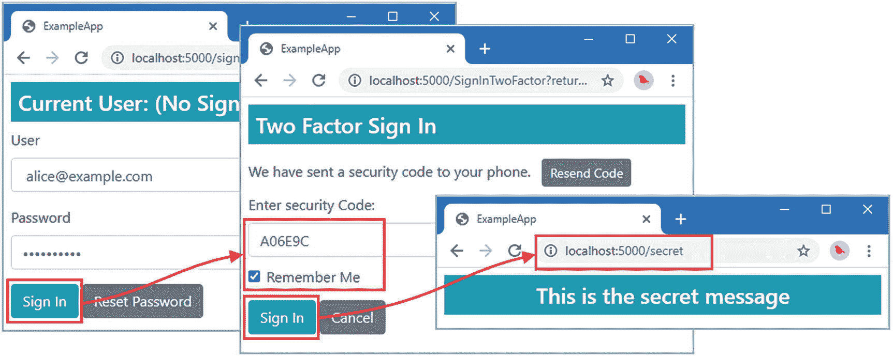
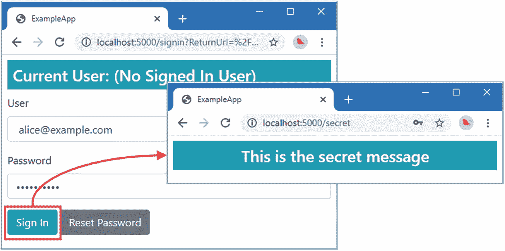
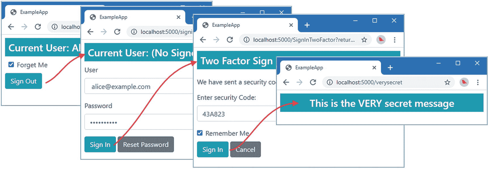
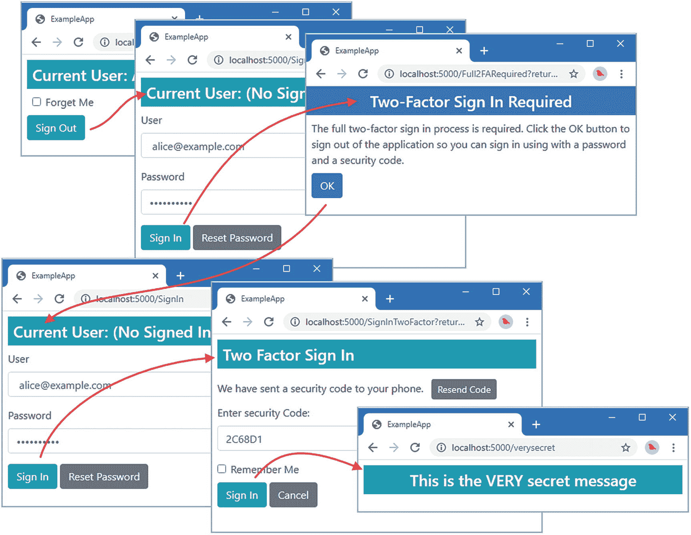

# 二十、锁定和双因素登录

在本章中，我将描述如何支持帐户锁定，并解释双因素认证背后的机制。表 [20-1](#Tab1) 将这些特征放入上下文中。

表 20-1。

将锁定和双因素登录放在上下文中

<colgroup><col class="tcol1 align-left"> <col class="tcol2 align-left"></colgroup> 
| 

问题

 | 

回答

 |
| --- | --- |
| 它们是什么？ | 锁定防止用户在指定次数的失败尝试后登录。双因素登录要求用户在登录过程中提供额外的凭据。 |
| 它们为什么有用？ | 这两个功能都旨在提高安全性。锁定可以防止攻击者反复尝试猜测密码。双因素认证要求攻击者能够访问用户的附加凭据。 |
| 它们是如何使用的？ | 这两个特性都是使用可选的用户存储界面实现的。 |
| 有什么陷阱或限制吗？ | 用户可能会发现这两个功能都令人沮丧，因此让工作流尽可能清晰易用是很重要的。 |
| 有其他选择吗？ | 最好的替代方法是使用外部认证，将识别用户的过程委托给第三方。详见第 [22](22.html) 章。 |

表 [20-2](#Tab2) 总结了本章内容。

表 20-2。

章节总结

<colgroup><col class="tcol1 align-left"> <col class="tcol2 align-left"> <col class="tcol3 align-left"></colgroup> 
| 

问题

 | 

解决办法

 | 

列表

 |
| --- | --- | --- |
| 支助账户锁定 | 实现`IUserLockoutStore<T>`接口，使用用户管理器方法进行管理。 | [2](#PC2)–[5](#PC5)、 [7](#PC7) 、 [8](#PC8) |
| 配置锁定 | 使用选项模式。 | [6](#PC6) |
| 限制对已确认帐户的访问 | 创建一个`IUserConfirmation<T>`接口的实现。 | [9](#PC9)–[12](#PC12) |
| 支持双因素认证 | 实现`IUserTwoFactorStore<T>`接口，并使用登录管理器定义的方法让用户登录。 | [13](#PC13)–[29](#PC29) |

## 为本章做准备

本章使用第 [19 章](19.html)中的`ExampleApp`项目。准备本章不需要做任何改动。打开一个新的命令提示符，导航到`ExampleApp`文件夹，运行清单 [20-1](#PC1) 中所示的命令来启动 ASP.NET Core。

Tip

你可以从 [`https://github.com/Apress/pro-asp.net-core-identity`](https://github.com/Apress/pro-asp.net-core-identity) 下载本章以及本书其他章节的示例项目。如果在运行示例时遇到问题，请参见第 [1](01.html) 章获取帮助。

```cs
dotnet run

Listing 20-1.Running the Example Application

```

打开一个新的浏览器窗口并请求`http://localhost:5000/users`。您将看到如图 [20-1](#Fig1) 所示的用户数据。数据仅存储在内存中，当 ASP.NET Core 停止时，更改将会丢失。



图 20-1。

运行示例应用

## 启用锁定

使用帐户锁定时，Identity 会跟踪登录尝试失败的次数。如果在短时间内有太多的失败尝试，帐户将被锁定，这意味着即使提供了正确的密码，用户也不会登录。锁定是一个有用的功能，可以防止攻击者反复尝试猜测用户的密码，尽管必须小心，因为锁定也会让忘记密码的合法用户感到沮丧。(正因如此，锁定应与宽松的密码验证策略一起使用，如第 [19](19.html) 章所述。)

### 扩展用户类

第一步是扩展 user 类，添加属性来跟踪用户帐户是否支持锁定以及当前的锁定状态，如清单 [20-2](#PC2) 所示。

```cs
using System;
using System.Collections.Generic;
using System.Security.Claims;

namespace ExampleApp.Identity {
    public class AppUser {

        public string Id { get; set; } = Guid.NewGuid().ToString();

        public string UserName { get; set; }

        public string NormalizedUserName { get; set; }

        public string EmailAddress { get; set; }
        public string NormalizedEmailAddress { get; set; }
        public bool EmailAddressConfirmed { get; set; }

        public string PhoneNumber { get; set; }
        public bool PhoneNumberConfirmed { get; set; }

        public string FavoriteFood { get; set; }
        public string Hobby { get; set; }

        public IList<Claim> Claims { get; set; }

        public string SecurityStamp { get; set; }
        public string PasswordHash { get; set; }

        public bool CanUserBeLockedout { get; set; } = true;
        public int FailedSignInCount { get; set; }
        public DateTimeOffset? LockoutEnd { get; set; }
    }
}

Listing 20-2.Adding Properties in the AppUser.cs File in the Identity Folder

```

`CanUserBeLockedout`将用于确定特定用户是否可以被锁定。属性将记录已经进行了多少次失败的登录尝试。属性`LockoutEnd`将记录锁定何时结束，并在用户未被锁定时返回`null`。

### 在用户存储中启用锁定

下一步是扩展用户存储，使其实现`IUserLockoutStore<T>`接口，其中`T`是用户类。该接口定义了表 [20-3](#Tab3) 中描述的方法，用于跟踪失败的登录尝试以及帐户是否被锁定。与其他用户存储接口定义的方法一样，表 [20-3](#Tab3) 中的`token`参数是一个`CancellationToken`对象，用于在取消异步操作时接收通知。

表 20-3。

IUserLockoutStore <t>方法</t>

<colgroup><col class="tcol1 align-left"> <col class="tcol2 align-left"></colgroup> 
| 

名字

 | 

描述

 |
| --- | --- |
| `GetLockoutEnabledAsync(user, token)` | 此方法用于确定说明符用户是否被锁定。 |
| `SetLockoutEnabledAsync(user, enabled, token)` | 此方法设置指定用户是否被锁定。 |
| `IncrementAccessFailedCountAsync(user, token)` | 此方法增加指定用户登录尝试失败的次数。 |
| `GetAccessFailedCountAsync(user, token)` | 此方法返回指定用户登录尝试失败的次数。 |
| `ResetAccessFailedCountAsync(user, token)` | 此方法重置指定用户登录尝试失败的次数。 |
| `SetLockoutEndDateAsync(user, end, token)` | 该方法为指定用户设置锁定期的结束时间，表示为一个`DateTimeOffset`值。 |
| `GetLockoutEndDateAsync(user, token)` | 这个方法获取指定用户锁定期的结束，用一个`DateTimeOffset`值表示。 |

用户存储只需跟踪锁定数据，并不负责解释数据或实施锁定。将名为`UserStoreLockouts.cs`的类文件添加到`ExmapleApp/Identity/Store`文件夹中，并使用它来定义清单 [20-3](#PC3) 中所示的分部类。

```cs
using Microsoft.AspNetCore.Identity;
using System;
using System.Threading;
using System.Threading.Tasks;

namespace ExampleApp.Identity.Store {
    public partial class UserStore : IUserLockoutStore<AppUser> {

        public Task SetLockoutEnabledAsync(AppUser user, bool enabled,
                CancellationToken token) {
            user.CanUserBeLockedout = enabled;
            return Task.CompletedTask;
        }

        public Task<bool> GetLockoutEnabledAsync(AppUser user,
            CancellationToken token) => Task.FromResult(user.CanUserBeLockedout);

        public Task<int> GetAccessFailedCountAsync(AppUser user,
            CancellationToken token) => Task.FromResult(user.FailedSignInCount);

        public Task<int> IncrementAccessFailedCountAsync(AppUser user,
            CancellationToken token) => Task.FromResult( ++user.FailedSignInCount);

        public Task ResetAccessFailedCountAsync(AppUser user,
            CancellationToken token) {
                user.FailedSignInCount = 0;
                return Task.CompletedTask;
        }

        public Task SetLockoutEndDateAsync(AppUser user, DateTimeOffset? lockoutEnd,
                CancellationToken token) {
            user.LockoutEnd = lockoutEnd;
            return Task.CompletedTask;
        }

        public Task<DateTimeOffset?> GetLockoutEndDateAsync(AppUser user,
            CancellationToken token) => Task.FromResult(user.LockoutEnd);
    }
}

Listing 20-3.The Contents of the UserStoreLockouts.cs File in the Identity/Store Folder

```

接口实现遵循前面章节中显示的模式，并将表 [20-3](#Tab3) 中描述的方法映射到添加到`AppUser`类的属性上。

### 管理帐户锁定

重要的是要提供结束由事故引发的锁定的方法。使用锁定但部署时没有手动覆盖的应用通常会在 VIP 用户(如公司 CEO)将自己锁定在应用之外时遇到问题。这样的用户不喜欢你对安全策略的解释，也不希望等到锁定自然结束。`UserManager<T>`类提供了一组用于锁定的成员，如表 [20-4](#Tab4) 中所述。

表 20-4。

用于锁定的用户管理器<t>成员</t>

<colgroup><col class="tcol1 align-left"> <col class="tcol2 align-left"></colgroup> 
| 

名字

 | 

描述

 |
| --- | --- |
| `SupportsUserLockout` | 如果用户存储实现了`IUserLockoutStore<T>`接口，该属性将返回`true`。 |
| `IsLockedOutAsync(user)` | 如果指定的用户被锁定，该方法返回`true`，这是通过调用商店的`GetLockoutEnabledAsync`方法来查看用户是否被锁定，然后调用商店的`GetLockoutEndDateAsync`方法来查看是否存在锁定。 |
| `SetLockoutEnabledAsync(user, enabled)` | 这个方法为指定的用户调用存储的`SetLockoutEnabledAsync`方法，然后执行用户验证，更新规范化的用户名和电子邮件地址，然后应用用户管理器的更新序列。 |
| `GetLockoutEnabledAsync(user)` | 这个方法为指定的用户调用商店的`GetLockoutEnabledAsync`方法。 |
| `GetLockoutEndDateAsync(user)` | 这个方法为指定的用户调用商店的`GetLockoutEndDateAsync`方法。 |
| `SetLockoutEndDateAsync(user, end)` | 该方法为指定用户调用存储的`SetLockoutEndDateAsync`方法，然后执行用户验证，更新规范化的用户名和电子邮件地址，并应用用户管理器的更新序列。 |
| `AccessFailedAsync(user)` | 该方法通过调用存储的`IncrementAccessFailedCountAsync`方法来增加指定用户的失败登录计数器。如果失败的尝试次数超过了配置设置(在下一节中描述)，将调用商店的`SetLockoutEndDateAsync`方法来锁定帐户，之后执行用户验证并应用用户管理器的更新序列。当帐户被锁定时，尝试失败的次数将被重置。 |
| `GetAccessFailedCountAsync(user)` | 该方法通过调用用户存储的`GetAccessFailedCountAsync`方法返回指定用户的失败尝试次数。 |
| `ResetAccessFailedCountAsync(user)` | 这个方法调用商店的`ResetAccessFailedCountAsync`方法，执行用户验证，然后应用用户管理器的更新序列。 |

在大多数情况下，表 [20-4](#Tab4) 中的方法直接映射到用户存储实现的方法上。例外是`AccessFailedAsync`方法，该方法递增失败登录计数器，直到它达到配置的限制，之后帐户被锁定。

在`ExampleApp/Pages/Store`文件夹中添加一个名为`UserLockouts.cshtml`的 Razor 页面，内容如清单 [20-4](#PC4) 所示。

```cs
@page "/users/lockout"
@model ExampleApp.Pages.Store.UserLockoutsModel

<h4 class="bg-primary text-white text-center p-2">User Lockouts</h4>

<div class="m-2">
    <table class="table table-sm table-striped">
        <thead><tr><th>Username</th><th>Lockout</th><th/></tr></thead>
        <tbody>
            @foreach (AppUser user in Model.Users) {
                <tr>
                    <td>@user.UserName</td>
                    <td>@(await Model.GetLockoutStatus(user))</td>
                    <td>
                        <form method="post">
                            <input type="hidden" name="id" value="@user.Id" />
                            @if (await Model.UserManager.IsLockedOutAsync(user)) {
                                <button class="btn btn-sm btn-secondary"
                                         type="submit">
                                     Unlock
                                </button>
                            } else {
                                <span class="mx-1">
                                    <input type="number" name="mins" value="10" />
                                    mins
                                </span>
                                <button class="btn btn-sm btn-danger" type="submit">
                                    Lock
                                </button>
                            }
                        </form>
                    </td>
                </tr>
            }
        </tbody>
    </table>
</div>

Listing 20-4.The Contents of the UserLockouts.cshtml File in the Pages/Store Folder

```

该内容提供了一个用户列表，带有锁定和解锁帐户的按钮。为了定义页面模型，将清单 [20-5](#PC5) 中所示的代码添加到`UserLockouts.cshtml.cs`文件中。(如果您使用的是 Visual Studio 代码，则必须创建该文件。)

```cs
using ExampleApp.Identity;
using Microsoft.AspNetCore.Identity;
using Microsoft.AspNetCore.Mvc;
using Microsoft.AspNetCore.Mvc.RazorPages;
using System;
using System.Collections.Generic;
using System.Linq;
using System.Threading.Tasks;

namespace ExampleApp.Pages.Store {

    public class UserLockoutsModel : PageModel {

        public UserLockoutsModel(UserManager<AppUser> manager)
            => UserManager = manager;

        public UserManager<AppUser> UserManager { get; set; }

        public IEnumerable<AppUser> Users => UserManager.Users
             .OrderByDescending(u => UserManager.IsLockedOutAsync(u).Result)
             .ThenBy(u => u.UserName);

        public async Task<string> GetLockoutStatus(AppUser user) {
            if (await UserManager.IsLockedOutAsync(user)) {
                TimeSpan remaining = (await UserManager.GetLockoutEndDateAsync(user))
                    .GetValueOrDefault().Subtract(DateTimeOffset.Now);
                return $"Locked Out ({ remaining.Minutes } mins "
                    + $"{ remaining.Seconds} secs remaining)";
            }
            return "(No Lockout)";
        }

        public async Task<IActionResult> OnPost(string id, int mins) {
            await UserManager.SetLockoutEndDateAsync((await
                UserManager.FindByIdAsync(id)), DateTimeOffset.Now.AddMinutes(mins));
            return RedirectToPage();
        }
    }
}

Listing 20-5.The Contents of the UserLockouts.cshtml.cs File in the Pages/Store Folder

```

页面模型类执行 LINQ 查询，为视图提供按锁定状态排序的用户，并定义 POST 处理程序方法，通过调用`SetLockoutEndDateAsync`方法锁定或解锁帐户。当帐户解锁时，锁定期的结束时间设置为当前时间。当帐户被锁定时，锁定期的结束时间被设置为 HTTP 请求中指定的未来分钟数。

### 配置锁定

选项模式用于配置锁定功能。用于配置 Identity 的`IdentityOptions`类定义了一个返回`LockoutOptions`对象的`Lockout`属性。`LockoutOptions`类定义了表 [20-5](#Tab5) 中描述的属性。

表 20-5。

LockoutOptions 属性

<colgroup><col class="tcol1 align-left"> <col class="tcol2 align-left"></colgroup> 
| 

名字

 | 

描述

 |
| --- | --- |
| `AllowedForNewUsers` | 此属性指定新创建的用户帐户是否将被锁定。默认值为`true`。 |
| `MaxFailedAccessAttempts` | 此属性指定在锁定之前允许多少次失败尝试。默认值为`5`。 |
| `DefaultLockoutTimeSpan` | 该属性指定默认锁定持续时间，用`TimeSpan`表示。默认值为 5 分钟。 |

在清单 [20-6](#PC6) 中，我使用了 options 模式来减少触发锁定的失败登录尝试的数量。

```cs
...
services.AddIdentityCore<AppUser>(opts => {
    opts.Tokens.EmailConfirmationTokenProvider = "SimpleEmail";
    opts.Tokens.ChangeEmailTokenProvider = "SimpleEmail";
    opts.Tokens.PasswordResetTokenProvider =
        TokenOptions.DefaultPhoneProvider;

    opts.Password.RequireNonAlphanumeric = false;
    opts.Password.RequireLowercase = false;
    opts.Password.RequireUppercase = false;
    opts.Password.RequireDigit = false;
    opts.Password.RequiredLength = 8;
    opts.Lockout.MaxFailedAccessAttempts = 3;
})
.AddTokenProvider<EmailConfirmationTokenGenerator>("SimpleEmail")
.AddTokenProvider<PhoneConfirmationTokenGenerator>
    (TokenOptions.DefaultPhoneProvider)
.AddSignInManager()
.AddRoles<AppRole>();
...

Listing 20-6.Configuring Lockouts in the Startup.cs File in the ExampleApp Folder

```

### 显示锁定通知

最后一步是让用户清楚地知道何时对他们的帐户进行了锁定。并非所有应用都提供这种通知，但它的优点是让用户清楚地知道，进一步尝试输入密码不会成功。在清单 [20-7](#PC7) 中，我修改了`SignIn` Razor 页面的页面模型类，使它的视图包含一条错误消息，通过这条消息我提供了锁定的细节。

```cs
using Microsoft.AspNetCore.Authentication;
using Microsoft.AspNetCore.Http;
using Microsoft.AspNetCore.Mvc;
using Microsoft.AspNetCore.Mvc.RazorPages;
using Microsoft.AspNetCore.Mvc.Rendering;
using System.Security.Claims;
using System.Threading.Tasks;
using Microsoft.AspNetCore.Identity;
using System.Linq;
using ExampleApp.Identity;
using SignInResult = Microsoft.AspNetCore.Identity.SignInResult;
using System;

namespace ExampleApp.Pages {
    public class SignInModel : PageModel {

        public SignInModel(UserManager<AppUser> userManager,
        SignInManager<AppUser> signInManager) {
            UserManager = userManager;
            SignInManager = signInManager;
        }

        public UserManager<AppUser> UserManager { get; set; }
        public SignInManager<AppUser> SignInManager { get; set; }

        public SelectList Users => new SelectList(
            UserManager.Users.OrderBy(u => u.EmailAddress),
                "EmailAddress", "NormalizedEmailAddress");

        public string Username { get; set; }

        public int? Code { get; set; }

        public string Message { get; set; }

        public void OnGet(int? code) {
            if (code == StatusCodes.Status401Unauthorized) {
                Message = "401 - Challenge Response";
            } else if (code == StatusCodes.Status403Forbidden) {
                Message = "403 - Forbidden Response";
            }
            Username = User.Identity.Name ?? "(No Signed In User)";
        }

        public async Task<ActionResult> OnPost(string username,
                string password, [FromQuery] string returnUrl) {
            SignInResult result = SignInResult.Failed;
            AppUser user = await UserManager.FindByEmailAsync(username);
            if (user != null && !string.IsNullOrEmpty(password)) {
                result = await SignInManager.PasswordSignInAsync(user, password,
                    false, true);
            }
            if (!result.Succeeded) {
                if (result.IsLockedOut) {
                    TimeSpan remaining = (await UserManager
                        .GetLockoutEndDateAsync(user))
                        .GetValueOrDefault().Subtract(DateTimeOffset.Now);
                    Message = $"Locked Out for {remaining.Minutes} mins and"
                        + $" {remaining.Seconds} secs";
                } else {
                    Message = "Access Denied";
                }
                return Page();
            }
            return Redirect(returnUrl ?? "/signin");
        }
    }
}

Listing 20-7.Providing Lockout Details in the SignIn.cshtml.cs File in the Pages Folder

```

如果来自`SignInManager<T>.PasswordSignInAsync`方法的结果报告用户被锁定，那么我得到结束时间并计算出还剩多少分钟和多少秒。在清单 [20-8](#PC8) 中，我更新了 Razor 页面的视图部分来显示清单 [20-7](#PC7) 中定义的`Message`属性，而不是使用`Code`属性来创建它的消息字符串。

```cs
@page "{code:int?}"
@model ExampleApp.Pages.SignInModel
@using Microsoft.AspNetCore.Http

@if (!string.IsNullOrEmpty(Model.Message)) {
    <h3 class="bg-danger text-white text-center p-2">
        @Model.Message
    </h3>
}

<h4 class="bg-info text-white m-2 p-2">
    Current User: @Model.Username
</h4>

<div class="m-2">
    <form method="post">
        <div class="form-group">
            <label>User</label>
            <select class="form-control"
                    asp-for="Username" asp-items="@Model.Users">
            </select>
        </div>
        <div class="form-group">
            <label>Password</label>
            <input class="form-control" type="password" name="password" />
        </div>
        <button class="btn btn-info" type="submit">Sign In</button>
        @if (User.Identity.IsAuthenticated) {
            <a asp-page="/Store/PasswordChange" class="btn btn-secondary"
                asp-route-id="@Model.User?
                        .FindFirst(ClaimTypes.NameIdentifier)?.Value">
                    Change Password
            </a>
        } else {
            <a class="btn btn-secondary" href="/password/reset">
                Reset Password
            </a>
        }
    </form>
</div>

Listing 20-8.Updating the View in the SignIn.cshtml File in the Pages/Store Folder

```

重启 ASP.NET Core 并请求`http://localhost:5000/signin`。重复输入不正确的密码，然后单击登录按钮。对于前两次失败的尝试，将显示“拒绝访问”消息。第三次尝试失败后，账户将被锁定，并显示剩余时间，如图 [20-2](#Fig2) 所示。



图 20-2。

向用户显示锁定

## 限制登录已确认的帐户

`SignInManager<T>`类执行预签名检查，以确保帐户没有被阻止。除了锁定之外，还可以锁定未确认的帐户，或者其电子邮件或电话号码未确认的帐户。这个特性是使用 options 模式启用的，其中`IdentityOptions.SignIn`属性返回一个`SignInOptions`类的实例，它定义了表 [20-6](#Tab6) 中描述的属性。

表 20-6。

登录属性

<colgroup><col class="tcol1 align-left"> <col class="tcol2 align-left"></colgroup> 
| 

名字

 | 

描述

 |
| --- | --- |
| `RequireConfirmedEmail` | 当该属性为`true`时，只有已确认电子邮件地址的帐户才能登录。通过调用`UserManager<T>.IsEmailConfirmedAsync`方法来确定电子邮件地址确认。默认值为`false`。 |
| `RequireConfirmedPhoneNumber` | 当该属性为`true`时，只有确认了电话号码的账户才能登录。我还没有演示对电话号码的支持，但是这个过程类似于电子邮件地址确认。通过调用`UserManager<T>.IsPhoneNumberConfirmedAsync`方法来确定电话号码确认。默认值为`false`。 |
| `RequireConfirmedAccount` | 当该属性为`true`时，只有已确认的账户才能登录。使用`IUserConfirmation<T>`界面确定确认状态，如下表所述。该接口的默认实现检查用户的电子邮件地址是否被确认，这意味着该设置与`RequireConfirmedEmail`设置相同，除非使用该接口的自定义实现。默认值为`false`。 |

表 [20-6](#Tab6) 中描述的最有趣的属性是`RequireConfirmedAccount`，它允许通过`IUserConfirmation<T>`接口定义自定义确认标准，该接口定义了表 [20-7](#Tab7) 中描述的方法。

表 20-7。

IUserConfirmation <t>方法</t>

<colgroup><col class="tcol1 align-left"> <col class="tcol2 align-left"></colgroup> 
| 

名字

 | 

描述

 |
| --- | --- |
| `IsConfirmedAsync(userManager, user)` | 该方法返回一个`bool`，指示指定的用户是否被确认。 |

`T`是用户类，`IsConfirmedAsync`方法接收一个`UserManager<T>`对象和用户对象进行验证。任何确认标准都可以在`IUserConfirmation<T>`接口的定制实现中使用。

在`ExampleApp/Identity`文件夹中添加一个名为`UserConfirmation.cs`的类文件，内容如清单 [20-9](#PC9) 所示。

```cs
using Microsoft.AspNetCore.Identity;
using System.Linq;
using System.Threading.Tasks;

namespace ExampleApp.Identity {
    public class UserConfirmation : IUserConfirmation<AppUser> {

        public async Task<bool> IsConfirmedAsync(UserManager<AppUser> manager,
                AppUser user) =>
            await manager.IsInRoleAsync(user, "Administrator")
                || (await manager.GetClaimsAsync(user))
                    .Any(claim => claim.Type == "UserConfirmed"
                        && string.Compare(claim.Value, "true", true) == 0);
    }
}

Listing 20-9.The Contents of the UserConfirmation.cs File in the Identity Folder

```

如果用户被分配了管理员角色或者拥有值为`true`的`UserConfirmed`声明，那么`IsConfirmedAsync`方法允许用户登录。在清单 [20-10](#PC10) 中，我扩展了可以分配给用户的声明集，以包含`UserConfirmed`声明。

```cs
@model (string id, Claim claim, bool newClaim)

@{ string hash = Model.claim.GetHashCode().ToString(); }

<td>
    <form method="post" id="@hash">
        <input type="hidden" name="id" value="@Model.id" />
        <input type="hidden" name="oldtype" value="@Model.claim.Type" />
        <input type="hidden" name="oldValue" value="@Model.claim.Value" />
    </form>
    <select name="type" asp-for="claim.Type" form="@hash">
        <option value="@ClaimTypes.Role">ROLE</option>
        <option value="@ClaimTypes.GivenName">GIVENNAME</option>
        <option value="@ClaimTypes.Surname">SURNAME</option>
        <option value="UserConfirmed">UserConfirmed</option>
    </select>
</td>
<td>
    <input class="w-100" name="value" value="@Model.claim.Value" form="@hash" />
</td>
<td>
    <button asp-page-handler="@(Model.newClaim ? "add" : "edit")"
        form="@hash" type="submit" class="btn btn-sm btn-info">
            @(Model.newClaim ? "Add" : "Save")
    </button>
    @if (!Model.newClaim) {
        <button asp-page-handler="delete" form="@hash" type="submit"
            class="btn btn-sm btn-danger">Delete</button>
    }
</td>

Listing 20-10.Adding a Claim Type in the _ClaimsRow.cshtml File in the Pages/Store Folder

```

在清单 [20-11](#PC11) 中，我已经为`SignIn` Razor 页面更新了页面模型类，以检查由`SignInManager`产生的结果中的`SignInResult.IsNotAllowed`属性，当用户不满足表 [20-7](#Tab7) 中的属性指定的确认标准时，这将为真。

```cs
...
public async Task<ActionResult> OnPost(string username,
        string password, [FromQuery] string returnUrl) {
    SignInResult result = SignInResult.Failed;
    AppUser user = await UserManager.FindByEmailAsync(username);
    if (user != null && !string.IsNullOrEmpty(password)) {
        result = await SignInManager.PasswordSignInAsync(user, password,
            false, true);
    }
    if (!result.Succeeded) {
        if (result.IsLockedOut) {
            TimeSpan remaining = (await UserManager
                .GetLockoutEndDateAsync(user))
                .GetValueOrDefault().Subtract(DateTimeOffset.Now);
            Message = $"Locked Out for {remaining.Minutes} mins and"
                + $" {remaining.Seconds} secs";
        } else if (result.IsNotAllowed) {
            Message = "Sign In Not Allowed";
        } else {
            Message = "Access Denied";
        }
        return Page();
    }
    return Redirect(returnUrl ?? "/signin");
}
...

Listing 20-11.Displaying a Message in the SignIn.cshtml.cs File in the Pages Folder

```

最后一步是将`UserConfirmation`类注册为服务，并通过选项模式启用它，如清单 [20-12](#PC12) 所示。

```cs
...
public void ConfigureServices(IServiceCollection services) {
    services.AddSingleton<ILookupNormalizer, Normalizer>();
    services.AddSingleton<IUserStore<AppUser>, UserStore>();
    services.AddSingleton<IEmailSender, ConsoleEmailSender>();
    services.AddSingleton<ISMSSender, ConsoleSMSSender>();
    //services.AddSingleton<IUserClaimsPrincipalFactory<AppUser>,
    //    AppUserClaimsPrincipalFactory>();
    services.AddSingleton<IPasswordHasher<AppUser>, SimplePasswordHasher>();
    services.AddSingleton<IRoleStore<AppRole>, RoleStore>();
    services.AddSingleton<IUserConfirmation<AppUser>, UserConfirmation>();

    services.AddIdentityCore<AppUser>(opts => {
        opts.Tokens.EmailConfirmationTokenProvider = "SimpleEmail";
        opts.Tokens.ChangeEmailTokenProvider = "SimpleEmail";
        opts.Tokens.PasswordResetTokenProvider =
            TokenOptions.DefaultPhoneProvider;

        opts.Password.RequireNonAlphanumeric = false;
        opts.Password.RequireLowercase = false;
        opts.Password.RequireUppercase = false;
        opts.Password.RequireDigit = false;
        opts.Password.RequiredLength = 8;
        opts.Lockout.MaxFailedAccessAttempts = 3;
        opts.SignIn.RequireConfirmedAccount = true;
    })
    .AddTokenProvider<EmailConfirmationTokenGenerator>("SimpleEmail")
    .AddTokenProvider<PhoneConfirmationTokenGenerator>
        (TokenOptions.DefaultPhoneProvider)
    .AddSignInManager()
    .AddRoles<AppRole>();

    services.AddSingleton<IUserValidator<AppUser>, EmailValidator>();
    services.AddSingleton<IPasswordValidator<AppUser>, PasswordValidator>();
    services.AddScoped<IUserClaimsPrincipalFactory<AppUser>,
        AppUserClaimsPrincipalFactory>();
    services.AddSingleton<IRoleValidator<AppRole>, RoleValidator>();

    services.AddAuthentication(opts => {
        opts.DefaultScheme = IdentityConstants.ApplicationScheme;
    }).AddCookie(IdentityConstants.ApplicationScheme, opts => {
        opts.LoginPath = "/signin";
        opts.AccessDeniedPath = "/signin/403";
    });
    services.AddAuthorization(opts => {
        AuthorizationPolicies.AddPolicies(opts);
    });
    services.AddRazorPages();
    services.AddControllersWithViews();
}
...

Listing 20-12.Configuring the Application in the Startup.cs File in the ExampleApp Folder

```

重启 ASP.NET Core 并请求`http://localhost:5000/signin`。使用密码`MySecret1$`以 bob@example.com 的 Identity 登录应用，您将看到如图 [20-3](#Fig3) 所示的错误消息，显示该消息是因为鲍勃没有被分配`Administrator`角色，也没有`UserConfirmed`声明。



图 20-3。

防止使用自定义确认要求登录

导航到`http://localhost:5000/users`，点击`Bob`的索赔按钮，添加一个值为`true`的`UserConfirmed`索赔。返回`http://localhost:5000/signin`并为 Bob 重复登录过程。现在用户已经获得了索赔，自定义确认要求将被满足，并且允许登录，如图 [20-4](#Fig4) 所示。



图 20-4。

满足客户确认要求

## 使用双因素认证

双因素认证，通常称为 *2FA* ，要求用户在登录时提供两种形式的证据，称为*因素*，以向应用证明他们的 Identity。为了更难模拟用户，通常从以下列表的不同类别中选择因素:

*   *用户知道的事情*:这一般是密码。

*   *用户拥有的东西:*这可以是安全令牌、特定设备、刷卡或安全密钥。

*   *用户固有的东西:*这通常使用物理特征来解决，例如指纹或虹膜扫描，或者面部放弃。

每个类别都有广泛的范围。例如，一个固有的特征可以是用户的位置，尽管这可能很难确定。

最常见的组合是用户知道的东西和用户拥有的东西，这通常实现为密码和特定设备。在这一章中，我将向你展示如何使用确认码作为第二个因素，它依赖于用户有一个特定的电话号码通过短信接收代码。在第 [21](21.html) 章，我将向你展示如何使用一个认证器应用，这是一个更复杂的选择。

Multifactor vs. Two-Factor Authentication

最近，*双因素*一词已被*多因素*所取代，意在表明某些情况下可能需要两个以上的因素来提供可接受的保护水平。

这是出于好意，但是您添加的每个额外需求都会使合法用户更难登录，并增加应用的支持和管理开销。

我的建议是从两个因素入手，在试图用其他因素提升安全性之前，让用户建立行为。而且，正如我已经提到的，你越难使用一个应用，你的用户就越会试图破坏你的安全策略。如果没有用户的自愿合作，三个或更多的因素都没有好处。

### 更新用户类

Identity 允许为单个用户配置双因素认证。为了跟踪双因素认证，将清单 [20-13](#PC13) 中所示的属性添加到`AppUser`类中。

```cs
using System;
using System.Collections.Generic;
using System.Security.Claims;

namespace ExampleApp.Identity {
    public class AppUser {

        public string Id { get; set; } = Guid.NewGuid().ToString();

        public string UserName { get; set; }

        public string NormalizedUserName { get; set; }

        public string EmailAddress { get; set; }
        public string NormalizedEmailAddress { get; set; }
        public bool EmailAddressConfirmed { get; set; }

        public string PhoneNumber { get; set; }
        public bool PhoneNumberConfirmed { get; set; }

        public string FavoriteFood { get; set; }
        public string Hobby { get; set; }

        public IList<Claim> Claims { get; set; }

        public string SecurityStamp { get; set; }
        public string PasswordHash { get; set; }

        public bool CanUserBeLockedout { get; set; } = true;
        public int FailedSignInCount { get; set; }
        public DateTimeOffset? LockoutEnd { get; set; }

        public bool TwoFactorEnabled { get; set; }
    }
}

Listing 20-13.Adding a Property in the AppUser.cs File in the Identity Folder

```

在清单 [20-14](#PC14) 中，我已经更新了添加到商店的种子数据，为示例用户设置了双因素属性。

```cs
...
private void SeedStore() {

    var customData = new Dictionary<string, (string food, string hobby)> {
        { "Alice", ("Pizza", "Running") },
        { "Bob", ("Ice Cream", "Cinema") },
        { "Charlie", ("Burgers", "Cooking") }
    };
    var twoFactorUsers = new[] { "Alice", "Charlie" };
    int idCounter = 0;

    string EmailFromName(string name) => $"{name.ToLower()}@example.com";

    foreach (string name in UsersAndClaims.Users) {
        AppUser user = new AppUser {
            Id = (++idCounter).ToString(),
            UserName = name,
            NormalizedUserName = Normalizer.NormalizeName(name),
            EmailAddress = EmailFromName(name),
            NormalizedEmailAddress =
                Normalizer.NormalizeEmail(EmailFromName(name)),
            EmailAddressConfirmed = true,
            PhoneNumber = "123-4567",
            PhoneNumberConfirmed = true,
            FavoriteFood = customData[name].food,
            Hobby = customData[name].hobby,
            SecurityStamp = "InitialStamp",
            TwoFactorEnabled = twoFactorUsers.Any(tfName => tfName == name)
        };
        user.Claims =  UsersAndClaims.UserData[user.UserName]
            .Select(role => new Claim(ClaimTypes.Role, role)).ToList();
        user.PasswordHash = PasswordHasher.HashPassword(user, "MySecret1$");
        users.TryAdd(user.Id, user);
    }
}
...

Listing 20-14.Updating the Seed Data in the UserStore.cs File in the Identity/Store Folder

```

这些更改为 Alice 和 Charlie 启用了双因素认证。

### 扩展用户存储以支持双因素认证

下一步是扩展用户存储以实现`IUserTwoFactorStore<T>`接口，该接口用于跟踪哪些用户需要使用双因素认证，并定义表 [20-8](#Tab8) 中描述的方法。与我描述的所有其他用户存储接口一样，这些方法定义了一个名为`token`的`CancellationToken`参数，用于在异步任务被取消时接收通知。

表 20-8。

IUserTwoFactorStore <t>方法</t>

<colgroup><col class="tcol1 align-left"> <col class="tcol2 align-left"></colgroup> 
| 

名字

 | 

描述

 |
| --- | --- |
| `GetTwoFactorEnabledAsync(user, token)` | 如果指定用户应该使用双因素认证，此方法将返回`true`。 |
| `SetTwoFactorEnabledAsync(user, enabled, token)` | 此方法为指定用户设置双因素认证要求。 |

将名为`UserStoreTwoFactor.cs`的类文件添加到`ExampleApp/Identity/Store`文件夹中，并使用它来定义清单 [20-15](#PC15) 中所示的分部类。

```cs
using Microsoft.AspNetCore.Identity;
using System.Threading;
using System.Threading.Tasks;

namespace ExampleApp.Identity.Store {
    public partial class UserStore : IUserTwoFactorStore<AppUser> {

        public Task<bool> GetTwoFactorEnabledAsync(AppUser user,
            CancellationToken token) => Task.FromResult(user.TwoFactorEnabled);

        public Task SetTwoFactorEnabledAsync(AppUser user, bool enabled,
                CancellationToken token) {
            user.TwoFactorEnabled = enabled;
            return Task.CompletedTask;
        }
    }
}

Listing 20-15.The Contents of the UserStoreTwoFactor.cs File in the Identity/Store Folder

```

该接口的实现将表 [20-8](#Tab8) 中描述的方法映射到上一节中添加到`AppUser`类的属性中。

Using SMS For Two-Factor Authentication

对于使用 SMS 进行双因素认证，有不同的看法。毫无疑问，短信容易受到一系列攻击，已经有记录的手机被克隆或转移以便确认码可以被拦截的例子。

另一方面，短信便宜、有效，而且几乎无处不在。智能手机授权码(在第 [21 章](21.html)中描述)或硬件安全令牌可能更安全，但并不是所有用户都有智能手机，也不是所有项目都能为用户提供令牌。

2016 年，当国家标准与技术研究所(NIST)的一份文件草案反对使用短信进行双因素 Identity 认证时，出现了头条新闻，这导致一些人认为不应再使用短信。然而，在该文档的最终版本中，SMS 并未被弃用，而是引起了对 SMS 中固有风险的关注，例如 SIM 卡变更和电话号码移植。(详见 [`https://pages.nist.gov/800-63-3`](https://pages.nist.gov/800-63-3) 。)

您应该对您的项目进行风险评估，但我的建议是不要放弃 SMS，除非您对安全需求有充分的了解，并对用户携带的设备和他们可以安装的应用有严格的控制。

### 管理双因素 Identity 认证

`UserManager<T>`方法提供了一组成员，用于管理用户存储中的双因素认证设置，如表 [20-9](#Tab9) 中所述。

表 20-9。

用于管理双因素认证的 UserManager <t>成员</t>

<colgroup><col class="tcol1 align-left"> <col class="tcol2 align-left"></colgroup> 
| 

名字

 | 

描述

 |
| --- | --- |
| `SupportsUserTwoFactor` | 如果用户存储实现了`IUserTwoFactorStore<T>`接口，该属性返回 true，其中`T`是用户类。 |
| `GetTwoFactorEnabledAsync(user)` | 该方法调用用户存储的`GetTwoFactorEnabledAsync`方法来获取指定用户的双因素设置。 |
| `SetTwoFactorEnabledAsync(user, enabled)` | 该方法通过调用用户存储的`SetTwoFactorEnabledAsync`方法为指定用户设置双因素设置，之后更新安全标记，并执行用户管理器的更新序列。 |
| `GenerateTwoFactorTokenAsync(user, provider)` | 该方法生成一个安全令牌，用户将在下一节描述的过程的最后一步中提供该令牌来标识自己。 |

`UserManager<T>`类只提供基本特性，因为重要的双因素特性是由`SignInManager<T>`类处理的，我将简要描述一下。为了管理双因素认证设置，向`ExampleApp/Pages/Store`文件夹添加一个名为`_EditUserTwoFactor.cshtml`的 Razor 视图，其内容如清单 [20-16](#PC16) 所示。

```cs
@model AppUser
@inject UserManager<AppUser> UserManager

@if (UserManager.SupportsUserTwoFactor) {
    <tr>
        <td>Two-Factor</td>
        <td><input asp-for="TwoFactorEnabled"/></td>
    </tr>
}

Listing 20-16.The Contents of the _EditUserTwoFactor.cshtml File in the Pages/Store Folder

```

按照本书这一部分使用的模式，我直接使用由`AppUser`类定义的属性，而不是表 [20-9](#Tab9) 中描述的方法，尽管我使用`SupportsUserTwoFactor`属性来确认用户存储支持双因素设置。将清单 [20-17](#PC17) 中所示的元素添加到`EditUser.cshtml`文件中，将新视图合并到应用中。

```cs
@page "/users/edit/{id?}"
@model ExampleApp.Pages.Store.UsersModel

<div asp-validation-summary="All" class="text-danger m-2"></div>

<div class="m-2">
    <form method="post">
        <input type="hidden" name="id" value="@Model.AppUserObject.Id" />
        <table class="table table-sm table-striped">
            <tbody>
                <partial name="_EditUserBasic" model="@Model.AppUserObject" />
                <partial name="_EditUserEmail" model="@Model.AppUserObject" />
                <partial name="_EditUserPhone" model="@Model.AppUserObject" />
                <partial name="_EditUserCustom" model="@Model.AppUserObject" />
                <partial name="_EditUserPassword" model="@Model.AppUserObject" />
                <partial name="_EditUserTwoFactor" model="@Model.AppUserObject" />
                <partial name="_EditUserSecurityStamp"
                         model="@Model.AppUserObject" />
            </tbody>
        </table>
        <div>
            <button type="submit" class="btn btn-primary">Save</button>
            <a asp-page="users" class="btn btn-secondary">Cancel</a>
        </div>
    </form>
</div>

Listing 20-17.Adding a Partial View in the EditUser.cshtml File in the Pages/Store Folder

```

重启 ASP.NET Core，请求`http://localhost:5000/users`，点击其中一个用户的编辑按钮。您将看到一个复选框，允许更改双因素认证选项，如图 [20-5](#Fig5) 所示。



图 20-5。

管理双因素认证设置

### 登录有两个因素

现在基础已经就绪，是时候改变登录过程了，以便为那些需要双因素认证的用户提供支持。在深入研究实现方法之前，关注过程是有帮助的。有三个步骤。

1.  第一步是正常的密码登录。用户向应用提供他们的帐户名和密码，并根据用户存储中的数据进行验证。如果用户不需要双因素认证，他们将登录到应用，然后流程结束。如果用户提供了错误的密码，该过程也结束。如果用户提供了正确的密码并要求双因素认证，则标识用户的 cookie 将被添加到响应中，并且客户端将被重定向到 URL，以便进行下一步的处理。

2.  客户端发送到下一个 URL 的请求包含 cookie，cookie 是从请求中提取的，用于识别用户。该 cookie 仅用于双因素登录，还不允许用户登录应用。使用用户存储中的联系信息将确认码发送给用户，该联系信息与在先前步骤中创建的 cookie 所标识的用户相关联。向客户端发送重定向到该 URL 的消息，以便进行该过程的下一步。

3.  系统提示客户端输入发送给他们的安全代码，用户帐户再次由第一步中创建的 cookie 标识。如果代码有效，用户将登录到应用。响应中添加了一个 cookie，它将对后续请求进行认证，并授予用户对应用的访问权限，从而完成登录过程。如果代码无效，应用可以选择再次提示用户或终止该过程。

这个过程中引起混淆的部分是 cookie，它用于识别用户，但不授予他们访问应用的权限。此 cookie 是使用标准认证功能创建的，但使用不同的 cookie 名称，并且仅包含足以识别用户 Identity 的(加密)数据，而不包含有关用户帐户及其角色和声明的任何附加信息。表 [20-10](#Tab10) 描述了`SignInManager<T>`类为双因素登录过程提供的方法。

表 20-10。

双因素登录的 SignInManager <t>方法</t>

<colgroup><col class="tcol1 align-left"> <col class="tcol2 align-left"></colgroup> 
| 

名字

 | 

描述

 |
| --- | --- |
| `PasswordSignInAsync(user, password, persist, lockout)` | 这是标准的密码登录方法，它返回一个`SignInResult`对象，指示是否需要双因素认证，并将 cookie 添加到响应中。 |
| `GetTwoFactorAuthenticationUserAsync()` | 该方法从双因素登录过程的第一阶段创建的 cookie 中检索用户信息。 |
| `TwoFactorSignInAsync(provider, code persistent, remember)` | 此方法验证指定用户的代码，如果代码有效，则让用户登录应用。`persistent`参数决定了浏览器关闭时认证 cookie 是否会持续，而`remember`参数决定了是否会创建一个绕过登录过程的 cookie，如下一节所述。 |

ASP.NET Core Identity 支持一项可选功能，即在用户完成双因素 Identity 认证后向响应添加 cookie，并在用户下次从同一客户端登录时绕过双因素要求。使用此功能时，用户只需使用常规密码登录即可登录到应用。

这是一个非常有用的功能，可以让用户更容易接受双因素登录，因为当 cookie 过期或他们从不同的客户端登录时，他们只需提供第二个因素。创建 cookie 以记住客户端由传递给表 [20-10](#Tab10) 中描述的`TwoFactorSignInAsync`方法的`remember`参数控制，也可以通过表 [20-11](#Tab11) 中描述的`SignInManager<T>`方法管理。

表 20-11。

记住双因素客户的方法

<colgroup><col class="tcol1 align-left"> <col class="tcol2 align-left"></colgroup> 
| 

名字

 | 

描述

 |
| --- | --- |
| `RememberTwoFactorClientAsync(user)` | 该方法将 cookie 添加到响应中，以指示用户已经完成了双因素登录。当`TwoFactorSignInAsync`方法的`remember`参数为`true`时，该方法被自动调用。 |
| `IsTwoFactorClientRememberedAsync(user)` | 该方法检查请求，以查看它是否包含一个 cookie，该 cookie 指示当前用户以前已经完成了双因素登录，并且应该被允许绕过第二个因素。 |
| `ForgetTwoFactorClientAsync(user)` | 此方法删除记住客户端的 cookie。 |

#### 创建双因素令牌生成器

第一步是为令牌创建生成器，这些令牌将在登录过程的第二步中提供给用户，这是通过实现`IUserTwoFactorTokenProvider<T>`接口来完成的。对于这一章，我将建立在`SimpleTokenGenerator`类的基础上。将名为`TwoFactorSignInTokenGenerator.cs`的类文件添加到`ExampleApp/Identity`文件夹中，并使用它来定义清单 [20-18](#PC18) 中所示的类。

```cs
using Microsoft.AspNetCore.Identity;
using System.Threading.Tasks;

namespace ExampleApp.Identity {

    public class TwoFactorSignInTokenGenerator : SimpleTokenGenerator {

        protected override int CodeLength => 3;

        public override Task<bool> CanGenerateTwoFactorTokenAsync(
                UserManager<AppUser> manager, AppUser user) {
            return Task.FromResult(user.TwoFactorEnabled);
        }
    }
}

Listing 20-18.The Contents of the TwoFactorSignInTokenGenerator.cs File in the Identity Folder

```

与前面示例中的令牌生成器的主要区别是实现了`CanGenerateTwoFactorTokenAsync`方法，该方法告诉 Identity 令牌可用于任何属性为`true`的用户。

#### 配置令牌生成器和 Cookie 认证处理程序

ASP.NET Core cookie 认证处理程序可用于创建双因素登录流程所需的 cookie。清单 [20-19](#PC19) 显示了`Startup`类的`ConfigureServices`方法中设置登录 cookies 和注册双因素令牌生成器所需的配置更改。

```cs
...
public void ConfigureServices(IServiceCollection services) {
    services.AddSingleton<ILookupNormalizer, Normalizer>();
    services.AddSingleton<IUserStore<AppUser>, UserStore>();
    services.AddSingleton<IEmailSender, ConsoleEmailSender>();
    services.AddSingleton<ISMSSender, ConsoleSMSSender>();
    //services.AddSingleton<IUserClaimsPrincipalFactory<AppUser>,
    //    AppUserClaimsPrincipalFactory>();
    services.AddSingleton<IPasswordHasher<AppUser>, SimplePasswordHasher>();
    services.AddSingleton<IRoleStore<AppRole>, RoleStore>();
    services.AddSingleton<IUserConfirmation<AppUser>, UserConfirmation>();

    services.AddIdentityCore<AppUser>(opts => {
        opts.Tokens.EmailConfirmationTokenProvider = "SimpleEmail";
        opts.Tokens.ChangeEmailTokenProvider = "SimpleEmail";
        opts.Tokens.PasswordResetTokenProvider =
            TokenOptions.DefaultPhoneProvider;

        opts.Password.RequireNonAlphanumeric = false;
        opts.Password.RequireLowercase = false;
        opts.Password.RequireUppercase = false;
        opts.Password.RequireDigit = false;
        opts.Password.RequiredLength = 8;
        opts.Lockout.MaxFailedAccessAttempts = 3;
        opts.SignIn.RequireConfirmedAccount = true;
    })
    .AddTokenProvider<EmailConfirmationTokenGenerator>("SimpleEmail")
    .AddTokenProvider<PhoneConfirmationTokenGenerator>
        (TokenOptions.DefaultPhoneProvider)
    .AddTokenProvider<TwoFactorSignInTokenGenerator>
        (IdentityConstants.TwoFactorUserIdScheme)
    .AddSignInManager()
    .AddRoles<AppRole>();

    services.AddSingleton<IUserValidator<AppUser>, EmailValidator>();
    services.AddSingleton<IPasswordValidator<AppUser>, PasswordValidator>();
    services.AddScoped<IUserClaimsPrincipalFactory<AppUser>,
        AppUserClaimsPrincipalFactory>();
    services.AddSingleton<IRoleValidator<AppRole>, RoleValidator>();

    services.AddAuthentication(opts => {
        opts.DefaultScheme = IdentityConstants.ApplicationScheme;
    }).AddCookie(IdentityConstants.ApplicationScheme, opts => {
        opts.LoginPath = "/signin";
        opts.AccessDeniedPath = "/signin/403";
    })
    .AddCookie(IdentityConstants.TwoFactorUserIdScheme)
    .AddCookie(IdentityConstants.TwoFactorRememberMeScheme);

    services.AddAuthorization(opts => {
        AuthorizationPolicies.AddPolicies(opts);
    });
    services.AddRazorPages();
    services.AddControllersWithViews();
}
...

Listing 20-19.Configuring the Application in the Startup.cs File in the ExampleApp Folder

```

`IdentityConstants`类定义了两个用作认证方案名称的属性。`TwoFactorUserIdScheme`属性标识在双因素过程的阶段 1 中成功密码登录后发送给客户机的 cookie 所使用的方案。`TwoFactorRememberMeScheme`属性指定用于 cookie 的方案，该方案在成功的双因素登录后记住客户端。方案需要认证处理程序，即使应用不记得客户端。

#### 更改密码登录过程

为了支持双因素登录，我需要检查由`SignInManager<T>.PasswordSignInAsync`产生的`SignInResult`对象，以查看`RequiresTwoFactor`属性是否为`true`。如果是，那么我需要将浏览器重定向到处理第二个因素的 URL。清单 [20-20](#PC20) 显示了对`SignIn` Razor 页面的 POST 处理程序方法的更改。

```cs
...
public async Task<ActionResult> OnPost(string username,
        string password, [FromQuery] string returnUrl) {
    SignInResult result = SignInResult.Failed;
    AppUser user = await UserManager.FindByEmailAsync(username);
    if (user != null && !string.IsNullOrEmpty(password)) {
        result = await SignInManager.PasswordSignInAsync(user, password,
            false, true);
    }
    if (!result.Succeeded) {
        if (result.IsLockedOut) {
            TimeSpan remaining = (await UserManager
                .GetLockoutEndDateAsync(user))
                .GetValueOrDefault().Subtract(DateTimeOffset.Now);
            Message = $"Locked Out for {remaining.Minutes} mins and"
                + $" {remaining.Seconds} secs";
        } else if (result.RequiresTwoFactor) {
            return RedirectToPage("/SignInTwoFactor", new { returnUrl = returnUrl });
        } else if (result.IsNotAllowed) {
            Message = "Sign In Not Allowed";
        } else {
            Message = "Access Denied";
        }
        return Page();
    }
    return Redirect(returnUrl ?? "/signin");
}
...

Listing 20-20.Supporting Two-Factors in the SignIn.cshtml.cs File in the Pages Folder

```

重要的是，仅当`RequiresTwoFactor`属性为`true`时才执行重定向，并且当用户启用了双因素要求时不自动执行重定向。这是因为失败的密码登录不会进入下一阶段，并且记住成功的双因素登录的功能可能允许用户仅使用密码登录。

#### 支持第二个因素

在`ExampleApp/Pages`文件夹中添加一个名为`SignInTwoFactor.cshtml`的 Razor 页面，内容如清单 [20-21](#PC21) 所示。

```cs
@page
@model ExampleApp.Pages.SignInTwoFactorModel

<h4 class="bg-info text-white m-2 p-2">Two Factor Sign In</h4>

<div asp-validation-summary="All" class="text-danger m-2"></div>

<span class="m-2"> We have sent a security code to your phone. </span>
<a asp-page="/SignInTwoFactor" class="btn btn-sm btn-secondary">Resend Code</a>

<div class="m-2">
    <form method="post">
        <div class="form-group">
            <label>Enter security Code:</label>
            <input class="form-control" name="smscode"/>
        </div>
        <div class="form-check">
            <input class="form-check-input" type="checkbox" name="rememberMe" />
            <label class="form-check-label">Remember Me</label>
        </div>
        <div class="mt-2">
            <button class="btn btn-info" type="submit"
                    disabled="@(!ModelState.IsValid)">Sign In</button>
            <a asp-page="/Signin" class="btn btn-secondary">Cancel</a >
        </div>
    </form>
</div>

Listing 20-21.The Contents of the SignInTwoFactor.cshtml File in the Pages Folder

```

用户会看到一个允许输入代码的`input`元素，以及登录、取消或发送新代码的按钮。为了定义 Razor 页面的页面模型，将清单 [20-22](#PC22) 中所示的代码添加到`Pages`文件夹中的`SignInTwoFactor.cshtml.cs`文件中。(如果您使用的是 Visual Studio 代码，则必须创建该文件。)

```cs
using ExampleApp.Identity;
using ExampleApp.Services;
using Microsoft.AspNetCore.Identity;
using Microsoft.AspNetCore.Mvc;
using Microsoft.AspNetCore.Mvc.RazorPages;
using System.Threading.Tasks;
using SignInResult = Microsoft.AspNetCore.Identity.SignInResult;

namespace ExampleApp.Pages {

    public class SignInTwoFactorModel : PageModel {

        public SignInTwoFactorModel(UserManager<AppUser> userManager,
                      SignInManager<AppUser> signInManager,
                      ISMSSender sender) {
            UserManager = userManager;
            SignInManager = signInManager;
            SMSSender = sender;
        }

        public UserManager<AppUser> UserManager { get; set; }
        public SignInManager<AppUser> SignInManager { get; set; }
        public ISMSSender SMSSender { get; set; }

        public async Task OnGet() {
            AppUser user = await SignInManager.GetTwoFactorAuthenticationUserAsync();
            if (user != null) {
                await UserManager.UpdateSecurityStampAsync(user);
                string token = await UserManager.GenerateTwoFactorTokenAsync(user,
                    IdentityConstants.TwoFactorUserIdScheme);
                SMSSender.SendMessage(user, $"Your security code is {token}");
            }
        }

        public async Task<IActionResult> OnPost(string smscode, string rememberMe,
                [FromQuery] string returnUrl) {
            AppUser user = await SignInManager.GetTwoFactorAuthenticationUserAsync();
            if (user != null) {
                SignInResult result = await SignInManager.TwoFactorSignInAsync(
                    IdentityConstants.TwoFactorUserIdScheme, smscode, true,
                        !string.IsNullOrEmpty(rememberMe));
                if (result.Succeeded) {
                    return Redirect(returnUrl ?? "/");
                } else if (result.IsLockedOut) {
                    ModelState.AddModelError("", "Locked out");
                } else if (result.IsNotAllowed) {
                    ModelState.AddModelError("", "Not allowed");
                } else {
                    ModelState.AddModelError("", "Authentication failed");
                }
            }
            return Page();
        }
    }
}

Listing 20-22.The Contents of the SignInTwoFactor.cshtml.cs File in the Pages Folder

```

GET handler 方法使用`GetTwoFactorAuthenticationUserAsync`方法检索正在登录的用户的详细信息。重要的是要记住，在用户完成整个过程之前，他们不会登录到应用中，并且只能使用这个方法来获取用户的详细信息。一旦获得了用户的详细信息，用户的安全令牌就会被更新以使之前的令牌失效，并且使用`GenerateTwoFactorTokenAsync`方法生成一个令牌，通过`ISMSSender`服务发送给用户，该服务通过编写控制台消息来模拟发送 SMS 消息。

POST handler 方法接收安全代码、用户记住客户机的选择以及登录完成后返回的 URL(可选)。使用`GetTwoFactorAuthenticationUserAsync`方法再次获取用户的详细信息，使用`TwoFactorSignInAsync`方法验证令牌并完成登录过程。

#### 忘记客户

最后一步是让用户在注销时可以选择忘记客户端，确保下次登录时需要完整的双因素登录流程。将清单 [20-23](#PC23) 中所示的元素添加到`SignOut` Razor 页面中。

```cs
@page
@model ExampleApp.Pages.SignOutModel

<h4 class="bg-info text-white m-2 p-2">
    Current User: @Model.Username
</h4>
<div class="m-2">
    <form method="post" >
        <div class="form-check m-2">
            <input class="form-check-input" type="checkbox" name="forgetMe" />
            <label class="form-check-label">Forget Me</label>
        </div>
        <button class="btn btn-info" type="submit">Sign Out</button>
    </form>
</div>

Listing 20-23.Adding Elements in the SignOut.cshtml File in the Pages Folder

```

清单 [20-24](#PC24) 中的变化更新了页面模型类，使得 POST 处理程序方法接收来自复选框的值并忘记客户端。

```cs
using Microsoft.AspNetCore.Authentication;
using Microsoft.AspNetCore.Mvc;
using Microsoft.AspNetCore.Mvc.RazorPages;
using System.Threading.Tasks;
using Microsoft.AspNetCore.Identity;
using ExampleApp.Identity;

namespace ExampleApp.Pages {
    public class SignOutModel : PageModel {
        public string Username { get; set; }

        public SignOutModel(SignInManager<AppUser> manager)
            => SignInManager = manager;

        public SignInManager<AppUser> SignInManager { get; set; }

        public void OnGet() {
            Username = User.Identity.Name ?? "(No Signed In User)";
        }

        public async Task<ActionResult> OnPost(string forgetMe) {
            if (!string.IsNullOrEmpty(forgetMe)) {
                await SignInManager.ForgetTwoFactorClientAsync();
            }
            await HttpContext.SignOutAsync();
            return RedirectToPage("SignIn");
        }
    }
}

Listing 20-24.Forgetting the Client in the SignOut.cshtml.cs File in the Pages Folder

```

`ForgetTwoFactorClientAsync`方法用于删除允许用户绕过双因素过程的 cookie。

#### 测试双因素登录

重新启动 ASP.NET Core，请求`http://localhost:5000/signout`，并单击 Sign Out 按钮删除先前示例创建的任何现有 cookies。接下来，请求`http://localhost:5000/secret`，它将产生一个挑战响应，并开始双因素过程。使用`select`元素选择 alice@example.com，在密码字段中输入 MySecret1 $,然后单击 Sign In 按钮。将验证密码，并提示您输入安全代码。查看控制台输出，您将看到如下消息:

```cs
--- SMS Starts ---
To: 123-4567
Your security code is A06E9C
--- SMS Ends ---

```

输入您的邮件中显示的安全代码(与此处显示的不同)，选择“记住我”选项，然后单击“登录”按钮。登录过程完成，你将被重定向到`/secret` URL，如图 [20-6](#Fig6) 所示。



图 20-6。

双因素登录流程

要测试记住客户端的功能，请请求`http://localhost:5000/signout`，并在不启用复选框的情况下单击注销按钮。请求`http://localhost:5000/secret`，当出现挑战响应时选择 alice@example.com，并在密码字段中输入`MySecret1$`。点击登录，你会被重定向到`/secret`网址，而不会被提示输入安全码，如图 [20-7](#Fig7) 所示。



图 20-7。

记住客户的登录过程

如果您选中“忘记客户端”选项，系统将再次提示您输入安全码。

### 限制记住的客户端的范围

记住客户端是一个有用的功能，可以使用户更容易登录，但是对于特别敏感的操作，您可能希望强制使用完整的双因素登录。`SignInManager<T>`类向代表用户的`ClaimsPrincipal`对象添加了一个声明，使得确定记住的客户端是否允许用户跳过双因素过程的一部分成为可能。在清单 [20-25](#PC26) 中，我定义了一个授权策略，当执行了完整的双因素登录过程时，该策略检查由`SignInManager<T>`类添加的声明。

```cs
...
services.AddAuthorization(opts => {
    AuthorizationPolicies.AddPolicies(opts);
    opts.AddPolicy("Full2FARequired", builder => {
        builder.RequireClaim("amr", "mfa");
    });
});
...

Listing 20-25.Creating an Authorization Policy in the Startup.cs File in the ExampleApp Folder

```

该策略要求类型为`amr`且值为`mfa`的索赔。术语 AMR 指的是认证方法参考，它由 RFC8176 指定，RFC 8176 标准化了描述认证方法的声明。(详见 [`https://tools.ietf.org/html/rfc8176`](https://tools.ietf.org/html/rfc8176) 。)值`mfa`表示用户已经使用多因素认证登录。即使用户绕过了第二个因素或配置为单因素登录，他们仍将拥有`amr`声明，但声明值将为`pwd`，表示基于密码的认证。

#### 定义授权失败登录页面

在这种情况下不能使用标准授权功能，因为就 Identity 而言，用户已经登录，这意味着不满足清单 [20-25](#PC26) 中定义的授权要求将导致禁止响应，而不是允许用户通过完整双因素流程的质询响应。相反，我需要一个登录页面，向用户解释需要完全登录，并让他们退出，这样他们就可以再次登录，而不需要记住客户端。在`ExampleApp/Pages`文件夹中添加一个名为`Full2FARequired.cshtml`的 Razor 页面，内容如清单 [20-26](#PC27) 所示。

```cs
@page
@model ExampleApp.Pages.Full2FARequiredModel

<h4 class="bg-primary text-white text-center p-2">Two-Factor Sign In Required</h4>

<form method="post">
    <div class="m-2">
        The full two-factor sign in process is required. Click the
        OK button to sign out of the application so you can sign in
        using with a password and a security code.
    </div>
    <button class="btn btn-primary mx-2" type="submit">OK</button>
</form>

Listing 20-26.The Contents of the Full2FARequired.cshtml File in the Pages Folder

```

该页面显示一条说明性消息和一个按钮，用户单击该按钮可以退出应用，并忘记客户端。要定义页面模型类，将清单 [20-27](#PC28) 中所示的代码添加到`Pages`文件夹中的`Full2FARequired.cshtml.cs`文件中。(如果您使用的是 Visual Studio 代码，则必须创建该文件。)

```cs
using ExampleApp.Identity;
using Microsoft.AspNetCore.Authentication;
using Microsoft.AspNetCore.Identity;
using Microsoft.AspNetCore.Mvc;
using Microsoft.AspNetCore.Mvc.RazorPages;
using System.Threading.Tasks;

namespace ExampleApp.Pages {

    public class Full2FARequiredModel : PageModel {

        public Full2FARequiredModel(UserManager<AppUser> userManager,
                SignInManager<AppUser> signInManager) {
            UserManager = userManager;
            SignInManager = signInManager;
        }

        public UserManager<AppUser> UserManager { get; set; }
        public SignInManager<AppUser> SignInManager { get; set; }

        public async Task<IActionResult> OnPostAsync(string returnUrl) {
            AppUser user = await UserManager.GetUserAsync(HttpContext.User);
            if (await SignInManager.IsTwoFactorClientRememberedAsync(user)) {
                await SignInManager.ForgetTwoFactorClientAsync();
            }
            await HttpContext.SignOutAsync();
            return Redirect($"/signin?returnUrl={returnUrl}");
        }
    }
}

Listing 20-27.The Contents of the Full2FARequired.cshtml.cs File in the Pages Folder

```

POST handler 方法使用由`SignInManager<T>`类提供的方法来忘记客户端，然后通过`HttpContext.SignOutAsync`方法将用户注销。

Caution

不要使用`SignInManager<T>.SignOutAsync`方法退出应用，因为它会抛出一个异常，报告没有外部方案的处理程序。

#### 创建页面和操作过滤器

标准授权特性在这种情况下没有用，我需要创建一个页面过滤器来在 Razor 页面中应用策略，并创建一个动作过滤器来在控制器中应用策略。页面和动作过滤器中有足够多的公共代码，允许一个类用于两者。将名为`Full2FARequiredFilterAttribute.cs`的类文件添加到`Examples/Identity`文件夹中，并使用它来定义清单 [20-28](#PC29) 中所示的代码。

```cs
using Microsoft.AspNetCore.Authorization;
using Microsoft.AspNetCore.Http;
using Microsoft.AspNetCore.Mvc;
using Microsoft.AspNetCore.Mvc.Filters;
using Microsoft.Extensions.DependencyInjection;
using System;
using System.Threading.Tasks;

namespace ExampleApp.Identity {

    public class Full2FARequiredFilterAttribute : Attribute,
            IAsyncPageFilter, IAsyncActionFilter {

        public async Task OnActionExecutionAsync(ActionExecutingContext context,
                ActionExecutionDelegate next) {
            IActionResult result = await ApplyPolicy(context.HttpContext);
            if (result != null) {
                context.Result = result;
            } else {
                await next.Invoke();
            }
        }

        public async Task OnPageHandlerExecutionAsync(PageHandlerExecutingContext
                context, PageHandlerExecutionDelegate next) {
            IActionResult result = await ApplyPolicy(context.HttpContext);
            if (result != null) {
                context.Result = result;
            } else {
                await next.Invoke();
            }
        }

        public async Task<IActionResult> ApplyPolicy(HttpContext context) {
            IAuthorizationService authService =
                context.RequestServices.GetService<IAuthorizationService>();
            if (!(await authService.AuthorizeAsync(context.User,
                 "Full2FARequired")).Succeeded) {
                return new RedirectToPageResult("/Full2FARequired",
                    new { returnUrl = Path(context) });
            }
            return null;
        }

        public Task OnPageHandlerSelectionAsync(PageHandlerSelectedContext context) {
            return Task.CompletedTask;
        }

        private string Path(HttpContext context) =>
            $"{context.Request.Path}{context.Request.QueryString}";
    }
}

Listing 20-28.The Contents of the Full2FARequiredFilterAttribute.cs File in the Identity Folder

```

过滤器使用`IAuthorizationService`服务来执行`Full2FARequired`策略，如果不满足策略要求，则创建到登录页面的重定向。

#### 将过滤器应用于页面

要创建一个需要完全双因素登录的资源，在`ExampleApp/Pages`文件夹中添加一个名为`VerySecret.cshtml`的 Razor 页面，其内容如清单 [20-29](#PC30) 所示。

```cs
@page
@using Microsoft.AspNetCore.Authorization
@using ExampleApp.Identity
@attribute [Authorize]
@attribute [Full2FARequiredFilter]

<h4 class="bg-info text-center text-white m-2 p-2">
    This is the VERY secret message
</h4>

Listing 20-29.The Contents of the VerySecret.cshtml File in the Pages Folder

```

`Authorize`属性的应用确保了向未登录的用户呈现标准的质询响应。`Full2FARequiredFilter`处理双因素用户，他们绕过了第二个因素，因为他们的客户端被应用记住了。

#### 测试完整的双因素要求

测试完整双因素要求的过程很复杂，需要多个步骤，每个步骤都必须严格遵循。目标是使用两个因素登录，让应用记住客户端，注销，重新登录而不需要提供第二个因素，然后请求`VerySecret`页面。以下是执行测试所需的步骤:



图 20-8。

测试过程的第一部分

1.  重启 ASP.NET Core。

2.  请求`http://localhost:5000/signout`，选择“忘记我”选项，然后点击“注销”按钮。

3.  请求`http://localhost:5000/verysecret`。您将收到标准的质询响应。

4.  使用元素选择 alice@example.com，在密码字段中输入 MySecret1 $,然后单击登录按钮。

5.  在浏览器显示的输入安全代码文本字段中输入写入控制台的安全代码。选中“记住我”选项，然后单击“登录”按钮。

    这并不是测试过程的结束，但是，在这一点上，你使用这两个因素进行了认证，并将看到由`VerySecret` Razor 页面产生的内容，如图 [20-8](#Fig8) 所示。



图 20-9。

测试过程的第二部分

1.  请求`http://localhost:5000/signout`，确保“忘记我”选项未选中，然后单击“注销”按钮。您将被重定向到`SignIn` Razor 页面。

2.  使用元素选择 alice@example.com，在密码字段中输入 MySecret1 $,然后单击登录按钮。你会被认证而不需要提供第二个因素，因为你的客户已经被记住了。

3.  请求`http://localhost:5000/verysecret`。您将被重定向到登录页面，而不是看到请求的页面。点击 OK，完成双因素登录过程，一旦通过认证，您将看到受保护的内容，如图 [20-9](#Fig9) 所示。

测试过程很复杂，但总的结果是只有通过提供两个因素登录的用户才能访问`VerySecret` Razor 页面。

## 摘要

在这一章中，我解释了锁定是如何实现的，并向您展示了如何限制对已确认帐户的访问。我还演示了 Identity 用来支持双因素认证的特性，为此我生成了模拟的 SMS 消息。在下一章中，我将继续双因素认证的主题，并描述认证器和恢复码是如何实现的。