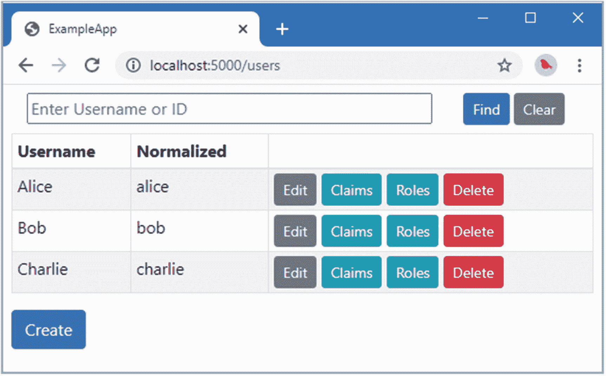
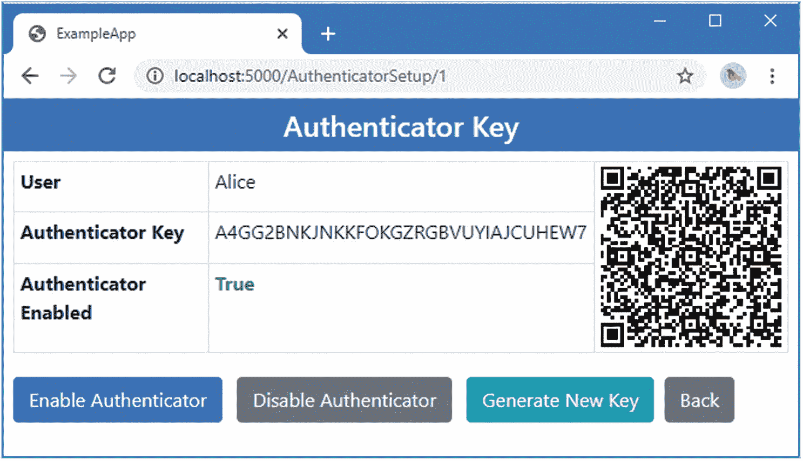
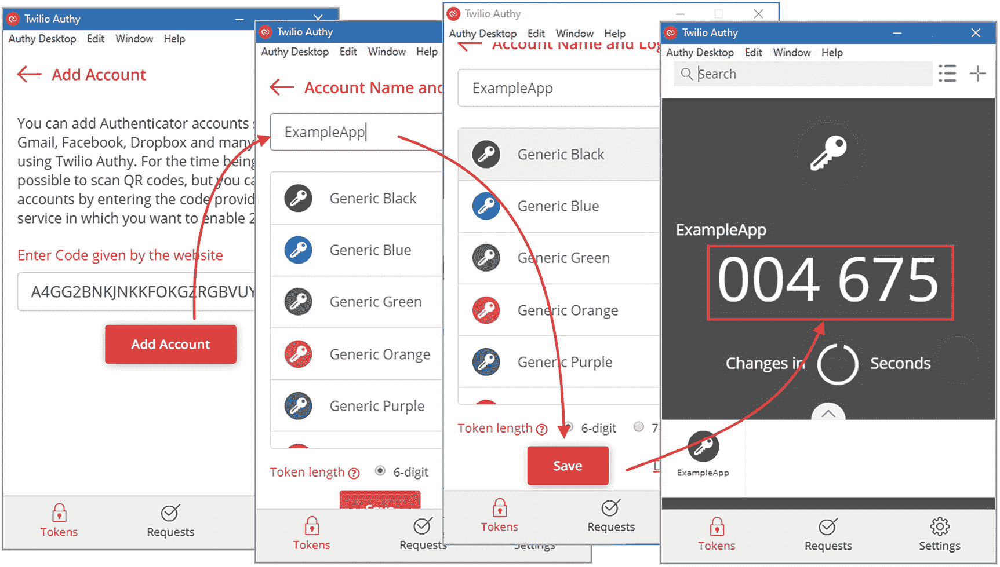
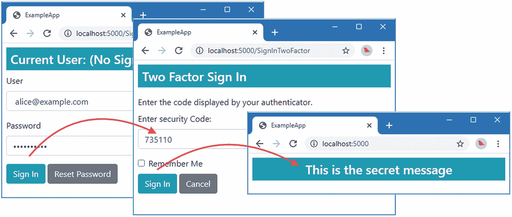
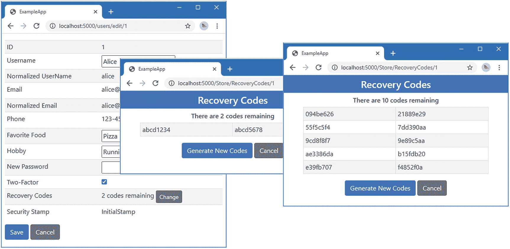
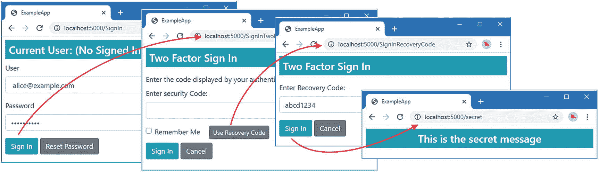
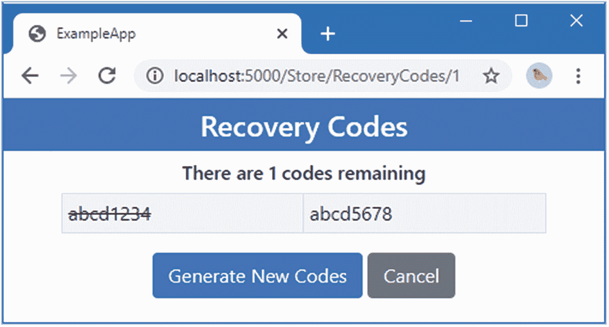

# 二十一、授权码和恢复码

在本章中，我将介绍 ASP.NET Core Identity 认证如何支持双因素 Identity 认证的授权码，以及如何在第二因素不可用时为用户提供紧急访问恢复码。表 [21-1](#Tab1) 将这些特征放在上下文中。

表 21-1。

将授权码和恢复码放在上下文中

<colgroup><col class="tcol1 align-left"> <col class="tcol2 align-left"></colgroup> 
| 

问题

 | 

回答

 |
| --- | --- |
| 它们是什么？ | 授权码是配置了密钥的应用，之后它们会生成代码，可用作双因素认证过程的一部分。恢复码是一次性代码，可用作第二个因素，通常在认证器应用丢失时使用。 |
| 它们为什么有用？ | 授权码提供了比 SMS 更安全的登录过程。恢复代码非常有用，因为它们允许用户在第二个因素不可用的情况下登录。 |
| 它们是如何使用的？ | 授权码是使用 Identity 生成的初始密钥设置的。在登录期间，认证器显示的当前代码由用户提供，并使用密钥通过认证。恢复代码是在登录过程中输入的。 |
| 有什么陷阱或限制吗？ | 授权码通常是智能手机应用，并非所有用户都可以访问。恢复代码需要用户提前准备，需要的时候记住代码，用完了再生成新代码。 |
| 有其他选择吗？ | 可以使用替代的第二因素。可以使用第 [22](22.html) 章中描述的外部认证功能将认证委托给第三方。恢复代码是可选的，但只要启用了双因素 Identity 认证，就应该使用恢复代码。 |

表 [21-2](#Tab2) 总结了本章内容。

表 21-2。

章节总结

<colgroup><col class="tcol1 align-left"> <col class="tcol2 align-left"> <col class="tcol3 align-left"></colgroup> 
| 

问题

 | 

解决办法

 | 

列表

 |
| --- | --- | --- |
| 支持二元登录中的授权码 | 通过实现`IUserAuthenticatorKeyStore<T>`接口来扩展用户存储，并使用用户管理器方法来管理密钥。 | [3](#PC3)–[8](#PC8) |
| 使用验证器登录用户 | 使用登录管理器类提供的`TwoFactorAuthenticatorSignInAsync`方法。 | [9](#PC9)–[12](#PC12) |
| 支持双因素登录中的恢复代码 | 通过实现`IUserTwoFactorRecoveryCodeStore<T>`接口来扩展用户存储，并使用用户管理器方法来管理代码。 | [13](#PC13)–[18](#PC18) |
| 使用恢复代码登录用户 | 使用登录管理器类提供的`TwoFactorRecoveryCodeSignInAsync`方法。 | [19](#PC19)–[21](#PC21) |

## 为本章做准备

本章使用第 20 章中的 ExampleApp 项目。为了准备本章，禁用自定义用户确认服务，如清单 [21-1](#PC1) 所示。

```cs
...
public void ConfigureServices(IServiceCollection services) {
    services.AddSingleton<ILookupNormalizer, Normalizer>();
    services.AddSingleton<IUserStore<AppUser>, UserStore>();
    services.AddSingleton<IEmailSender, ConsoleEmailSender>();
    services.AddSingleton<ISMSSender, ConsoleSMSSender>();
    //services.AddSingleton<IUserClaimsPrincipalFactory<AppUser>,
    //    AppUserClaimsPrincipalFactory>();
    services.AddSingleton<IPasswordHasher<AppUser>, SimplePasswordHasher>();
    services.AddSingleton<IRoleStore<AppRole>, RoleStore>();
    //services.AddSingleton<IUserConfirmation<AppUser>, UserConfirmation>();
...

Listing 21-1.Disabling a Service in the Startup.cs File in the ExampleApp Folder

```

打开一个新的命令提示符，导航到`ExampleApp`文件夹，运行清单 [21-2](#PC2) 中所示的命令来启动 ASP.NET Core。

Tip

你可以从 [`https://github.com/Apress/pro-asp.net-core-identity`](https://github.com/Apress/pro-asp.net-core-identity) 下载本章以及本书其他章节的示例项目。如果在运行示例时遇到问题，请参见第 [1](01.html) 章获取帮助。

```cs
dotnet run

Listing 21-2.Running the Example Application

```

打开一个新的浏览器窗口并请求`http://localhost:5000/users`。您将看到如图 [21-1](#Fig1) 所示的用户数据。数据仅存储在内存中，当 ASP.NET Core 停止时，更改将会丢失。



图 21-1。

运行示例应用

## 使用验证器

使用 SMS 进行双因素认证的一个缺点是，用户必须有蜂窝覆盖才能接收安全代码。解决这个问题的一个方法是使用一个*认证器*，这是一个专门用来在离线时生成安全代码的应用。

授权码有一个设置阶段和一个代码生成阶段。在设置阶段，ASP.NET Core Identity 创建一个密钥，也称为*种子*，它与认证器应用共享并安全存储。可以通过复制和粘贴一串字符来共享密钥，或者如果认证者是智能手机应用，则扫描二维码。

在代码生成阶段，验证者和 Identity 都使用相同的算法来生成代码，该算法使用共享密钥加上一个修饰符(也称为*移动因子*)来确保密钥是不同的，不能被攻击者截获和重复使用。验证器向用户显示代码，用户将代码呈现给应用，就像通过 SMS 接收代码一样。如果验证器生成的代码与 Identity 生成的代码匹配，则用户登录。

为了生成相同的代码，验证者和 Identity 需要使用相同的密钥和修饰符。在设置认证者时，密钥是共享的，但是每次登录的修饰符必须不同。有两种选择修改器的标准方法:使用计数器或使用当前时间。使用计数器生成的代码称为*基于 HMAC 的一次性密码* (HOTPs)，使用时间生成的代码称为*基于时间的一次性密码* (TOTPs)。挑战在于验证者和应用必须能够选择相同的修饰符，而不能进行通信。

当使用计数器时，验证者和标识都跟踪计数器。当用户按下按钮时，认证器递增计数器，当用户登录时，认证器递增计数器。如果用户按下按钮但不使用代码，这两个计数器可能会分开，因此 Identity 必须在验证期间检查一系列可能的计数器值。如果验证器计数器的增量超出 Identity 检查的范围，则需要手动重新同步过程。

基于时间的方法计算出自特定时间以来固定持续时间的间隔发生了多少次。例如，如果验证者和 Identity 计算自 1970 年 1 月 1 日(UTC)以来发生的三分钟间隔数，只要它们使用的时钟大致同步，它们就会产生相同的修饰符。时钟不必完全同步——在单个时间间隔内保持精确就足够了。如果时钟进一步偏移，用户将无法登录，因为验证者和 Identity 将使用不同的修饰符来生成安全代码。

TOTPs 被更广泛地使用，因为它们更容易验证，并且不需要重新同步过程。我在本章的例子中生成了 TOTPs。

### 扩展用户类

支持授权码的第一步是扩展用户类来跟踪密钥。将清单 [21-3](#PC3) 中显示的属性添加到`AppUser`类中。

```cs
using System;
using System.Collections.Generic;
using System.Security.Claims;

namespace ExampleApp.Identity {
    public class AppUser {

        public string Id { get; set; } = Guid.NewGuid().ToString();

        public string UserName { get; set; }

        public string NormalizedUserName { get; set; }

        public string EmailAddress { get; set; }
        public string NormalizedEmailAddress { get; set; }
        public bool EmailAddressConfirmed { get; set; }

        public string PhoneNumber { get; set; }
        public bool PhoneNumberConfirmed { get; set; }

        public string FavoriteFood { get; set; }
        public string Hobby { get; set; }

        public IList<Claim> Claims { get; set; }

        public string SecurityStamp { get; set; }
        public string PasswordHash { get; set; }

        public bool CanUserBeLockedout { get; set; } = true;
        public int FailedSignInCount { get; set; }
        public DateTimeOffset? LockoutEnd { get; set; }

        public bool TwoFactorEnabled { get; set; }
        public bool AuthenticatorEnabled { get; set; }
        public string AuthenticatorKey { get; set; }
    }
}

Listing 21-3.Adding Properties in the AppUser.cs File in the Identity Folder

```

新的属性将用于表示用户拥有一个认证器，并存储将用于生成安全代码的共享密钥。每个用户都有一个密钥，更改该密钥将阻止用户登录，直到该密钥与验证者共享。

### 将验证器密钥存储在用户存储中

`IUserAuthenticatorKeyStore<T>`接口由可以管理认证器密钥的用户存储实现。该接口定义了表 [21-3](#Tab3) 中描述的方法。与本书这一部分描述的其他用户存储界面一样，表 [21-3](#Tab3) 中的方法定义了一个名为`token`的`CancellationToken`参数，用于在任务被取消时接收通知。

表 21-3。

IUserAuthenticatorKeyStore <t>方法</t>

<colgroup><col class="tcol1 align-left"> <col class="tcol2 align-left"></colgroup> 
| 

名字

 | 

描述

 |
| --- | --- |
| `SetAuthenticatorKeyAsync(user, key, token)` | 此方法为指定用户设置验证器密钥。 |
| `GetAuthenticatorKeyAsync(user, token)` | 此方法获取指定用户的验证器密钥。 |

为了给用户存储添加对认证器密钥的支持，将名为`UserStoreAuthenticatorKeys.cs`的类文件添加到`Identity/Store`文件夹中，并使用它来定义清单 [21-4](#PC4) 中所示的分部类。

```cs
using Microsoft.AspNetCore.Identity;
using System.Threading;
using System.Threading.Tasks;

namespace ExampleApp.Identity.Store {
    public partial class UserStore : IUserAuthenticatorKeyStore<AppUser> {

        public Task<string> GetAuthenticatorKeyAsync(AppUser user,
                CancellationToken cancellationToken)
            => Task.FromResult(user.AuthenticatorKey);

        public Task SetAuthenticatorKeyAsync(AppUser user, string key,
                CancellationToken cancellationToken) {
            user.AuthenticatorKey = key;
            return Task.CompletedTask;
        }
    }
}

Listing 21-4.The Contents of the UserStoreAuthenticatorKeys.cs File in the Identity/Store Folder

```

接口的实现将方法映射到`AppUser`属性上。用户存储不负责生成密钥或令牌。

### 管理验证器密钥

授权码需要一个设置阶段，以便可以共享密钥。`UserManager<T>`类提供了表 [21-4](#Tab4) 中描述的成员，用于处理授权码。

表 21-4。

授权码的用户管理器<t>成员</t>

<colgroup><col class="tcol1 align-left"> <col class="tcol2 align-left"></colgroup> 
| 

名字

 | 

描述

 |
| --- | --- |
| `SupportsUserAuthenticatorKey` | 如果存储实现了`IUserAuthenticatorKeyStore<T>`接口，该属性返回 true。 |
| `GetAuthenticatorKeyAsync(user)` | 该方法通过调用同名的 store 方法来获取用户的认证密钥。 |
| `GenerateNewAuthenticatorKey()` | 此方法生成一个新密钥。 |
| `ResetAuthenticatorKeyAsync(user)` | 此方法为指定用户重置验证器密钥。`GenerateNewAuthenticatorKey`方法用于生成一个新的密钥，该密钥通过调用商店的`SetAuthenticatorKeyAsync`方法分配给用户。生成新的安全戳，并执行用户管理器的更新序列来保存更改。 |

在设置阶段，必须为验证者提供由应用生成的密钥。这可以通过让用户复制并粘贴密钥串来完成，但二维码为智能手机上运行的授权码提供了一个优雅的替代方案。ASP.NET Core Identity 不包括直接生成二维码的能力，但微软建议使用 QRCode.js JavaScript 包。在`ExampleApp`文件夹中运行清单 [21-5](#PC5) 中所示的命令，将 QRCode.js 包添加到项目中。

```cs
libman install qrcodejs@1.0.0 -d wwwroot/lib/qrcode

Listing 21-5.Adding a JavaScript Package

```

要生成一个密钥并显示给用户，需要在`Pages`文件夹中添加一个名为`AuthenticatorSetup.cshtml`的 Razor 页面，其内容如清单 [21-6](#PC6) 所示。

```cs
@page "{id}"
@model ExampleApp.Pages.AuthenticatorSetupModel

<h4 class="bg-primary text-white text-center p-2">Authenticator Key</h4>

<div class="m-2">
    <table class="table table-sm table-bordered">
        <tbody>
            <tr>
                <th>User</th>
                <td>@Model.AppUser.UserName</td>
                @if (Model.AuthenticatorUrl != null) {
                    <td rowspan="3">
                        <div id="qrcode"></div>
                        <script type="text/javascript"
                             src="~/lib/qrcode/qrcode.min.js"></script>
                        <script type="text/javascript">
                            new QRCode(document.getElementById("qrcode"), {
                                text: "@Model.AuthenticatorUrl",
                                width: 150,
                                height: 150
                            });
                        </script>
                    </td>
                }
            </tr>
            <tr>
                <th>Authenticator Key</th>
                <td>@(Model.AppUser.AuthenticatorKey ?? "(No Key)")</td>
            </tr>
            <tr>
                <th>Authenticator Enabled</th>
                <td>
                    <span class="font-weight-bold
                          @(Model.AppUser.AuthenticatorEnabled
                              ? "text-success": "text-danger")">
                        @Model.AppUser.AuthenticatorEnabled
                    </span>
                </td>
            </tr>
        </tbody>
    </table>
</div>

<form method="post" class="m-1">
    <input type="hidden" name="Id" value="@Model.Id" />
    <div class="mt-2">
        <button class="btn btn-primary m-1" asp-route-task="enable">
            Enable Authenticator
        </button>
        <button class="btn btn-secondary m-1" asp-route-task="disable">
            Disable Authenticator
        </button>
        <button class="btn btn-info m-1">Generate New Key</button>
        <a href="/users" class="btn btn-secondary">Back</a>
    </div>
</form>

Listing 21-6.The Contents of the AuthenticatorSetup.cshtml File in the Pages Folder

```

该页面显示用户的当前密钥以及是否启用了认证器的使用。有一些按钮可以切换授权码的用户并生成新密钥。使用名为`AuthenticatorUrl`的页面模型属性显示 QR 码。

要定义页面模型类，将清单 [21-7](#PC7) 中所示的代码添加到`AuthenticatorSetup.cshtml.cs`文件中。(如果您使用的是 Visual Studio 代码，则必须创建该文件。)

```cs
using ExampleApp.Identity;
using Microsoft.AspNetCore.Identity;
using Microsoft.AspNetCore.Mvc;
using Microsoft.AspNetCore.Mvc.RazorPages;
using System.Threading.Tasks;

namespace ExampleApp.Pages {

    public class AuthenticatorSetupModel : PageModel {

        public AuthenticatorSetupModel(UserManager<AppUser> userManager) =>
            UserManager = userManager;

        public UserManager<AppUser> UserManager { get; set; }

        [BindProperty(SupportsGet = true)]
        public string Id { get; set; }

        public AppUser AppUser { get; set; }

        public string AuthenticatorUrl { get; set; }

        public async Task OnGetAsync() {
            AppUser = await UserManager.FindByIdAsync(Id);
            if (AppUser != null) {
                if (AppUser.AuthenticatorKey != null) {
                    AuthenticatorUrl =
                        $"otpauth://totp/ExampleApp:{AppUser.EmailAddress}"
                        + $"?secret={AppUser.AuthenticatorKey}";
                }
            }
        }

        public async Task<IActionResult> OnPostAsync(string task) {
            AppUser = await UserManager.FindByIdAsync(Id);
            if (AppUser != null) {
                switch (task) {
                    case "enable":
                        AppUser.AuthenticatorEnabled = true;
                        AppUser.TwoFactorEnabled = true;
                        break;
                    case "disable":
                        AppUser.AuthenticatorEnabled = false;
                        AppUser.TwoFactorEnabled = false;
                        break;
                    default:
                        await UserManager.ResetAuthenticatorKeyAsync(AppUser);
                        break;
                }
                await UserManager.UpdateAsync(AppUser);
            }
            return RedirectToPage();
        }
    }
}

Listing 21-7.The Contents of the AuthenticatorSetup.cshtml.cs File in the Pages Folder

```

GET handler 方法使用`UserManager<T>.GetUserAsync`来获取代表登录用户的`AppUser`对象，并读取`AuthenticatorKey`和`AuthenticatorEnabled`属性的值。POST 处理程序方法设置`AuthenticatorEnabled`属性，如果需要，使用`UserManager<T>.ResetAuthenticatorKeyAsync`方法生成一个新的键。

可以扫描二维码的授权码希望收到一个格式为`otpauth://totp/<label>?secret=<key>`的 URL，其中`<label>`标识用户账户，而`<key>`是密钥。

Tip

请参见 [`https://github.com/google/google-authenticator/wiki/Key-Uri-Format`](https://github.com/google/google-authenticator/wiki/Key-Uri-Format) 了解用于验证二维码的 URL 格式的全部详情。

为了将新的 Razor 页面合并到应用中，将清单 [21-8](#PC8) 中所示的元素添加到`_UserTableRow`局部视图中。

```cs
@model string
@inject UserManager<AppUser> UserManager

<a asp-page="edituser" asp-route-id="@Model" class="btn btn-sm btn-secondary">
    Edit
</a>
@if (UserManager.SupportsUserClaim) {
    <a asp-page="claims" asp-route-id="@Model" class="btn btn-sm btn-info">
        Claims
    </a>
}

@if (UserManager.SupportsUserRole) {
    <a asp-page="userroles" asp-route-id="@Model" class="btn btn-sm btn-info">
        Roles
    </a>
}
@if (UserManager.SupportsUserAuthenticatorKey) {
    <a asp-page="/authenticatorsetup" asp-route-id="@Model"
       class="btn btn-sm btn-success">
        Authenticator
    </a>
}

Listing 21-8.Adding a Feature in the _UserTableRow.cshtml File in the Pages/Store Folder

```

### 在二元登录中启用授权码

在双因素登录过程中，验证器将替换通过 SMS 发送的安全代码。`SignInManager<T>`类提供了表 [21-5](#Tab5) 中描述的方法，该方法支持使用授权码。

表 21-5。

授权码的 SignInManager <t>方法</t>

<colgroup><col class="tcol1 align-left"> <col class="tcol2 align-left"></colgroup> 
| 

名字

 | 

描述

 |
| --- | --- |
| `TwoFactorAuthenticatorSignInAsync(code, persistent, remember)` | 这个方法的工作方式与`TwoFactorSignInAsync`方法相同，除了代码是由认证器令牌提供者验证的。 |

在清单 [21-9](#PC9) 中，我更新了`SignInTwoFactor`页面以确定用户是否设置了认证器，如果是，显示一条适当的消息。

```cs
@page
@model ExampleApp.Pages.SignInTwoFactorModel

<h4 class="bg-info text-white m-2 p-2">Two Factor Sign In</h4>

<div asp-validation-summary="All" class="text-danger m-2"></div>

@if (Model.AuthenticatorEnabled) {
    <span class="m-2"> Enter the code displayed by your authenticator. </span>
} else {
    <span class="m-2"> We have sent a security code to your phone. </span>
    <a asp-page="/SignInTwoFactor" class="btn btn-sm btn-secondary">Resend Code</a>
}

<div class="m-2">
    <form method="post">
        <div class="form-group">
            <label>Enter security Code:</label>
            <input class="form-control" name="code"/>
        </div>
        <div class="form-check">
            <input class="form-check-input" type="checkbox" name="rememberMe" />
            <label class="form-check-label">Remember Me</label>
        </div>
        <div class="mt-2">
            <button class="btn btn-info" type="submit"
                    disabled="@(!ModelState.IsValid)">Sign In</button>
            <a asp-page="/Signin" class="btn btn-secondary">Cancel</a >
        </div>
    </form>
</div>

Listing 21-9.Supporting Authenticators in the SignInTwoFactor.cshtml File in the Pages Folder

```

在清单 [21-10](#PC10) 中，我已经更新了页面模型类，以支持视图中的变化并验证认证器安全代码。

```cs
using ExampleApp.Identity;
using ExampleApp.Services;
using Microsoft.AspNetCore.Identity;
using Microsoft.AspNetCore.Mvc;
using Microsoft.AspNetCore.Mvc.RazorPages;
using System.Threading.Tasks;
using SignInResult = Microsoft.AspNetCore.Identity.SignInResult;

namespace ExampleApp.Pages {

    public class SignInTwoFactorModel : PageModel {

        public SignInTwoFactorModel(UserManager<AppUser> userManager,
                      SignInManager<AppUser> signInManager,
                      ISMSSender sender) {
            UserManager = userManager;
            SignInManager = signInManager;
            SMSSender = sender;
        }

        public UserManager<AppUser> UserManager { get; set; }
        public SignInManager<AppUser> SignInManager { get; set; }
        public ISMSSender SMSSender { get; set; }

        public bool AuthenticatorEnabled { get; set; }

        public async Task OnGet() {
            AppUser user = await SignInManager.GetTwoFactorAuthenticationUserAsync();
            if (user != null) {
                AuthenticatorEnabled = user.AuthenticatorEnabled;
                if (!AuthenticatorEnabled) {
                    await UserManager.UpdateSecurityStampAsync(user);
                    string token = await UserManager.GenerateTwoFactorTokenAsync(
                        user, IdentityConstants.TwoFactorUserIdScheme);
                    SMSSender.SendMessage(user, $"Your security code is {token}");
                }
            }
        }

        public async Task<IActionResult> OnPost(string code, string rememberMe,
                [FromQuery] string returnUrl) {
            AppUser user = await SignInManager.GetTwoFactorAuthenticationUserAsync();
            if (user != null && !string.IsNullOrEmpty(code)) {
                SignInResult result = SignInResult.Failed;
                AuthenticatorEnabled = user.AuthenticatorEnabled;
                bool rememberClient = !string.IsNullOrEmpty(rememberMe);
                if (AuthenticatorEnabled) {
                    string authCode = code.Replace(" ", string.Empty);
                    result = await SignInManager.TwoFactorAuthenticatorSignInAsync(
                        authCode, false, rememberClient);
                } else {
                    result = await SignInManager.TwoFactorSignInAsync(
                        IdentityConstants.TwoFactorUserIdScheme, code,
                        true, rememberClient);
                }
                if (result.Succeeded) {
                    return Redirect(returnUrl ?? "/");
                } else if (result.IsLockedOut) {
                    ModelState.AddModelError("", "Locked out");
                } else if (result.IsNotAllowed) {
                    ModelState.AddModelError("", "Not allowed");
                } else {
                    ModelState.AddModelError("", "Authentication failed");
                }
            }
            return Page();
        }
    }
}

Listing 21-10.Supporting Authenticators in the SignInTwoFactor.cshtml.cs File in the Pages Folder

```

一些授权码将安全码显示为三位数组，这意味着用户通常会输入带空格的代码。为了防止错误，我从用户提供的代码中删除了所有空格，并使用`SignInManager<T>.TwoFactorAuthenticatorSignInAsync`方法让用户登录应用。

### 配置应用

使用`TokenOptions.DefaultAuthenticatorProvider`属性设置用于授权码的令牌生成器，如清单 [21-11](#PC11) 所示。

```cs
...
services.AddIdentityCore<AppUser>(opts => {
    opts.Tokens.EmailConfirmationTokenProvider = "SimpleEmail";
    opts.Tokens.ChangeEmailTokenProvider = "SimpleEmail";
    opts.Tokens.PasswordResetTokenProvider =
        TokenOptions.DefaultPhoneProvider;

    opts.Password.RequireNonAlphanumeric = false;
    opts.Password.RequireLowercase = false;
    opts.Password.RequireUppercase = false;
    opts.Password.RequireDigit = false;
    opts.Password.RequiredLength = 8;
    opts.Lockout.MaxFailedAccessAttempts = 3;
    opts.SignIn.RequireConfirmedAccount = true;
})
.AddTokenProvider<EmailConfirmationTokenGenerator>("SimpleEmail")
.AddTokenProvider<PhoneConfirmationTokenGenerator>
    (TokenOptions.DefaultPhoneProvider)
.AddTokenProvider<TwoFactorSignInTokenGenerator>
    (IdentityConstants.TwoFactorUserIdScheme)
.AddTokenProvider<AuthenticatorTokenProvider<AppUser>>
    (TokenOptions.DefaultAuthenticatorProvider)
.AddSignInManager()
.AddRoles<AppRole>();
...

Listing 21-11.Configuring the Application in the Startup.cs File in the ExampleApp Folder

```

授权码可以工作，因为应用和应用使用相同的算法和密钥来生成安全代码，这意味着我不能创建自定义令牌生成器，除非我也创建自定义授权码应用。幸运的是，Identity 提供了`AuthenticatorTokenProvider<T>`类，它为用户类`T`生成 TOTP 令牌。在清单 [21-11](#PC11) 中，我使用`AddTokenProvider`方法将`AuthenticatorTokenProvider<AppUser>`注册为授权码的令牌提供者。

### 创建种子数据

最后一步是添加一些种子数据，使认证器支持更容易测试，如清单 [21-12](#PC12) 所示。

```cs
using Microsoft.AspNetCore.Identity;
using System.Collections.Generic;
using System.Linq;
using System.Security.Claims;

namespace ExampleApp.Identity.Store {

    public partial class UserStore {

        public ILookupNormalizer Normalizer { get; set; }

        public IPasswordHasher<AppUser> PasswordHasher { get; set; }

        public UserStore(ILookupNormalizer normalizer,
                IPasswordHasher<AppUser> passwordHasher) {
            Normalizer = normalizer;
            PasswordHasher = passwordHasher;
            SeedStore();
        }

        private void SeedStore() {

            var customData = new Dictionary<string, (string food, string hobby)> {
                { "Alice", ("Pizza", "Running") },
                { "Bob", ("Ice Cream", "Cinema") },
                { "Charlie", ("Burgers", "Cooking") }
            };
            var twoFactorUsers = new[] { "Alice", "Charlie" };
            var authenticatorKeys = new Dictionary<string, string> {
                {"Alice", "A4GG2BNKJNKKFOKGZRGBVUYIAJCUHEW7" }
            };
            int idCounter = 0;

            string EmailFromName(string name) => $"{name.ToLower()}@example.com";

            foreach (string name in UsersAndClaims.Users) {
                AppUser user = new AppUser {
                    Id = (++idCounter).ToString(),
                    UserName = name,
                    NormalizedUserName = Normalizer.NormalizeName(name),
                    EmailAddress = EmailFromName(name),
                    NormalizedEmailAddress =
                        Normalizer.NormalizeEmail(EmailFromName(name)),
                    EmailAddressConfirmed = true,
                    PhoneNumber = "123-4567",
                    PhoneNumberConfirmed = true,
                    FavoriteFood = customData[name].food,
                    Hobby = customData[name].hobby,
                    SecurityStamp = "InitialStamp",
                    TwoFactorEnabled = twoFactorUsers.Any(tfName => tfName == name)
                };
                user.Claims =  UsersAndClaims.UserData[user.UserName]
                    .Select(role => new Claim(ClaimTypes.Role, role)).ToList();
                user.PasswordHash = PasswordHasher.HashPassword(user, "MySecret1$");
                if (authenticatorKeys.ContainsKey(name)) {
                    user.AuthenticatorKey = authenticatorKeys[name];
                    user.AuthenticatorEnabled = true;
                }
                users.TryAdd(user.Id, user);
            }
        }
    }
}

Listing 21-12.Adding Seed Data in the UserStore.cs File in the Identity/Store Folder

```

清单 [21-12](#PC12) 中的变化为 Alice 而不是其他用户设置了一个认证器密钥。

### 设置验证器

您可以代表用户设置一个验证器，如果他们有一个确认的电子邮件地址，您可以通过电子邮件将密钥发送给他们。或者，您可以选择让用户在自助帐户创建期间或登录应用后自行设置认证器。

重启 ASP.NET Core，请求`http://localhost:5000/users`，点击`Alice`用户的认证器按钮。你会看到爱丽丝的认证器配置，它将她的密钥显示为一个字符串和一个 QR 码，如图 [21-2](#Fig2) 所示。



图 21-2。

启用验证器

Choosing an Authenticator App

你使用哪个认证器应用并不重要，只要它能生成标准的 TOTP 码。主要选择是谷歌或微软的智能手机认证应用(在 iOS 和 Android 的应用商店中免费提供)。我喜欢 Authy ( [authy。该软件由 Twilio 公司开发，除了常见的智能手机应用之外，还有桌面版本。我在本章的截图中使用了 Windows 版本的 Authy，因为智能手机应用不允许截图(以阻止其他应用获取安全代码)。如果你不想安装一个应用，你可以使用在](http://authy.com) [`https://totp.danhersam.com`](https://totp.danhersam.com) 提供的基于 JavaScript 的认证器，它将为指定的密钥生成 TOTP 码。

这是我在清单 [21-12](#PC12) 中添加到种子数据的键。使用您的验证器应用，设置一个新帐户，这可以通过将密钥复制为字符串或扫描二维码来完成。按照应用的流程完成该过程，这可能会要求您选择昵称、图标等。图 [21-3](#Fig3) 显示了使用 Windows 版 Authy app 的过程。在这个过程结束时，您的验证器将开始向您显示安全代码，这些代码每 30 秒改变一次。



图 21-3。

设置验证器

### 使用验证器登录

要测试使用验证器登录，请请求`http://localhost:5000/signout`，确保选中“忘记我”选项，然后单击“注销”按钮。

接下来请求`http://localhost:5000/signin`，从列表中选择`alice@example.com`，输入 MySecret1 $作为密码，点击签到按钮。在文本字段中输入您的验证器应用当前显示的代码，然后单击登录按钮。如果您输入的代码与 Identity 生成的代码匹配，您将被登录到应用中，如图 [21-4](#Fig4) 所示。



图 21-4。

使用验证器登录

## 使用恢复代码

恢复码用于在用户无法接收安全码或访问其验证器应用时登录。提前给用户一组可以在登录时兑现的代码。每个恢复码可以兑换一次登录，之后无效。在接下来的部分中，我将解释 ASP.NET Core Identity 如何支持恢复代码，并演示它们的用法。

### 存储恢复代码

可以管理恢复代码的用户存储实现了`IUserTwoFactorRecoveryCodeStore<T>`接口，其中`T`是用户类。该接口定义了表 [21-6](#Tab6) 中描述的方法。与早期的用户存储接口一样，这些方法定义了一个名为`token`的`CancellationToken`参数，用于在异步任务被取消时接收通知。

表 21-6。

iusertwofactorecoverycodestore<t>方法</t>

<colgroup><col class="tcol1 align-left"> <col class="tcol2 align-left"></colgroup> 
| 

名字

 | 

描述

 |
| --- | --- |
| `ReplaceCodesAsync(user, codes, token)` | 这种方法用一组新的恢复码替换现有的一组恢复码，表示为一个`IEnumerable<string>`对象。 |
| `RedeemCodeAsync(user, code, token)` | 此方法为指定的用户兑换代码。如果代码是 value，该方法返回`true`，否则返回`false`。兑换后代码必须失效。 |
| `CountCodesAsync(user, token)` | 此方法返回用户可用的有效恢复代码的数量。 |

首先，我在`ExampleApp/Identity/Store`文件夹中添加了一个名为`RecoveryCode.cs`的类文件，并用它来定义清单 [21-13](#PC13) 中所示的类，它将代表一个单独的恢复代码。

```cs
namespace ExampleApp.Identity.Store {

    public class RecoveryCode {

        public string Code { get; set; }
        public bool Redeemed { get; set; }
    }
}

Listing 21-13.The Contents of the RecoveryCode.cs File in the Identity/Store Folder

```

为了扩展用户存储，将名为`UserStoreRecoveryCodes.cs`的类文件添加到`ExampleApp/Identity/Store`文件夹中，并使用它来定义清单 [21-14](#PC14) 中所示的分部类。

```cs
using Microsoft.AspNetCore.Identity;
using System;
using System.Collections.Generic;
using System.Linq;
using System.Threading;
using System.Threading.Tasks;

namespace ExampleApp.Identity.Store {

    public interface IReadableUserTwoFactorRecoveryCodeStore
            : IUserTwoFactorRecoveryCodeStore<AppUser> {
        Task<IEnumerable<RecoveryCode>> GetCodesAsync(AppUser user);
    }

    public partial class UserStore : IReadableUserTwoFactorRecoveryCodeStore {
        private IDictionary<string, IEnumerable<RecoveryCode>> recoveryCodes
            = new Dictionary<string, IEnumerable<RecoveryCode>>();

        public async Task<int> CountCodesAsync(AppUser user, CancellationToken token)
            => (await GetCodesAsync(user)).Where(code => !code.Redeemed).Count();

        public Task<IEnumerable<RecoveryCode>> GetCodesAsync(AppUser user) =>
            Task.FromResult(recoveryCodes.ContainsKey(user.Id)
                ? recoveryCodes[user.Id] : Enumerable.Empty<RecoveryCode>());

        public async Task<bool> RedeemCodeAsync(AppUser user, string code,
                CancellationToken token) {
            RecoveryCode rc = (await GetCodesAsync(user))
                .FirstOrDefault(rc => rc.Code == code && !rc.Redeemed);
            if (rc != null) {
                rc.Redeemed = true;
                return true;
            }
            return false;
        }

        public Task ReplaceCodesAsync(AppUser user, IEnumerable<string>
                recoveryCodes, CancellationToken token) {
            this.recoveryCodes[user.Id] = recoveryCodes
                .Select(rc => new RecoveryCode { Code = rc, Redeemed = false });
            return Task.CompletedTask;
        }
    }
}

Listing 21-14.The Contents of the UserStoreRecoveryCodes.cs File in the Identity/Store Folder

```

Identity 提供的接口不提供在用户的恢复代码存储后读取它们的方法。我发现，如果用户可以检查代码并查看哪些代码已经被兑换，他们更有可能使用恢复代码，所以我定义了`IReadableUserTwoFactorRecoveryCodeStore`接口，该接口通过添加一个允许检索与用户相关联的代码的方法来扩展`IUserTwoFactorRecoveryCodeStore<AppUser>`。

### 植入数据存储

恢复代码可以是只有应用和用户知道的任何字符串。在清单 [21-15](#PC15) 中，我已经为创建时添加到存储中的种子数据添加了一组代码，这将更容易演示恢复代码特性。

```cs
using Microsoft.AspNetCore.Identity;
using System.Collections.Generic;
using System.Linq;
using System.Security.Claims;

namespace ExampleApp.Identity.Store {

    public partial class UserStore {

        public ILookupNormalizer Normalizer { get; set; }

        public IPasswordHasher<AppUser> PasswordHasher { get; set; }

        public UserStore(ILookupNormalizer normalizer,
                IPasswordHasher<AppUser> passwordHasher) {
            Normalizer = normalizer;
            PasswordHasher = passwordHasher;
            SeedStore();
        }

        private void SeedStore() {

            var customData = new Dictionary<string, (string food, string hobby)> {
                { "Alice", ("Pizza", "Running") },
                { "Bob", ("Ice Cream", "Cinema") },
                { "Charlie", ("Burgers", "Cooking") }
            };
            var twoFactorUsers = new[] { "Alice", "Charlie" };
            var authenticatorKeys = new Dictionary<string, string> {
                {"Alice", "A4GG2BNKJNKKFOKGZRGBVUYIAJCUHEW7" }
            };
            var codes = new[] { "abcd1234", "abcd5678" };
            int idCounter = 0;

            string EmailFromName(string name) => $"{name.ToLower()}@example.com";

            foreach (string name in UsersAndClaims.Users) {
                AppUser user = new AppUser {
                    Id = (++idCounter).ToString(),
                    UserName = name,
                    NormalizedUserName = Normalizer.NormalizeName(name),
                    EmailAddress = EmailFromName(name),
                    NormalizedEmailAddress =
                        Normalizer.NormalizeEmail(EmailFromName(name)),
                    EmailAddressConfirmed = true,
                    PhoneNumber = "123-4567",
                    PhoneNumberConfirmed = true,
                    FavoriteFood = customData[name].food,
                    Hobby = customData[name].hobby,
                    SecurityStamp = "InitialStamp",
                    TwoFactorEnabled = twoFactorUsers.Any(tfName => tfName == name)
                };
                user.Claims =  UsersAndClaims.UserData[user.UserName]
                    .Select(role => new Claim(ClaimTypes.Role, role)).ToList();
                user.PasswordHash = PasswordHasher.HashPassword(user, "MySecret1$");
                if (authenticatorKeys.ContainsKey(name)) {
                    user.AuthenticatorKey = authenticatorKeys[name];
                    user.AuthenticatorEnabled = true;
                }
                users.TryAdd(user.Id, user);
                recoveryCodes.Add(user.Id, codes.Select(c =>
                    new RecoveryCode() { Code = c }).ToArray());
            }
        }
    }
}

Listing 21-15.Adding Recovery Codes in the UserStore.cs File in the Identity/Store Folder

```

恢复代码应该是随机的，当使用由`UserManager<T>`类提供的方法创建时就是这样，我将在下一节描述。然而，为了便于测试，我定义了两个代码，它们允许任何用户登录。

### 管理恢复代码

`UserManager<T>`类提供了表 [21-7](#Tab7) 中描述的用于管理恢复代码的方法。

表 21-7。

恢复代码的用户管理器<t>方法</t>

<colgroup><col class="tcol1 align-left"> <col class="tcol2 align-left"></colgroup> 
| 

名字

 | 

描述

 |
| --- | --- |
| `GenerateNewTwoFactorRecoveryCodesAsync(user, number)` | 此方法为用户生成指定数量的恢复代码。新闻代码被传递给商店的`ReplaceCodesAsync`方法，之后执行用户管理器的更新序列。生成的代码可能少于指定的数量。 |
| `RedeemTwoFactorRecoveryCodeAsync(user, code)` | 该方法通过调用存储的`RedeemCodeAsync`方法为指定用户赎回恢复代码。如果代码有效，则执行用户管理器的更新序列。该方法的结果是一个`IdentiyResult`，用于指示代码是否被成功兑换。 |
| `CountRecoveryCodesAsync(user)` | 此方法返回指定用户可用的未兑换代码的数量。 |

在`Pages/Store`文件夹中添加一个名为`RecoveryCodes.cshtml`的 Razor 页面，内容如清单 [21-16](#PC16) 所示。

```cs
@page "{id}"
@model ExampleApp.Pages.Store.RecoveryCodesModel

<h4 class="bg-primary text-white text-center p-2">Recovery Codes</h4>

<h6 class="text-center">There are @Model.RemainingCodes codes remaining</h6>

<div class="mx-5">
    <table class="table table-sm table-striped table-bordered">
        <tbody>
            @for (int row = 0; row < Model.Codes.Length; row += 2) {
                <tr>
                    @for (int index = row; index < row + 2; index++) {
                        var rc = Model.Codes[index];
                        <td class="text-d">
                            @if (rc.Redeemed) {
                                <del>@rc.Code</del>
                            } else {
                                @rc.Code
                            }
                        </td>
                    }
                </tr>
            }
        </tbody>
    </table>
</div>
<div class="m-2 text-center">
    <form method="post">
        <input type="hidden" name="id" value="@Model.AppUser.Id" />
        <button class="btn btn-primary">Generate New Codes</button>
        <a href="@($"/users/edit/{Model.AppUser.Id}")" class="btn btn-secondary">
            Cancel
        </a>
    </form>
</div>

Listing 21-16.The Contents of the RecoveryCodes.cshtml File in the Pages/Store Folder

```

页面的“查看”部分显示用户的恢复代码，其 ID 是通过路由系统接收的。所有用户的代码都会显示出来，但被兑换的代码会被删除。将清单 [21-17](#PC17) 中所示的代码添加到`RecoveryCodes.cshtml.cs`文件中，以定义页面模型类。(如果您使用的是 Visual Studio 代码，则必须创建该文件。)

```cs
using ExampleApp.Identity;
using ExampleApp.Identity.Store;
using Microsoft.AspNetCore.Identity;
using Microsoft.AspNetCore.Mvc;
using Microsoft.AspNetCore.Mvc.RazorPages;
using System.Collections.Generic;
using System.Linq;
using System.Threading.Tasks;

namespace ExampleApp.Pages.Store {

    public class RecoveryCodesModel : PageModel {

        public RecoveryCodesModel(UserManager<AppUser> manager,
                IUserStore<AppUser> store) {
            UserManager = manager;
            UserStore = store;
        }

        public UserManager<AppUser> UserManager { get; set; }
        public IUserStore<AppUser> UserStore { get; set; }

        public AppUser AppUser { get; set; }

        public RecoveryCode[] Codes { get; set; }
        public int RemainingCodes { get; set;}

        public async Task OnGetAsync(string id) {
            AppUser = await UserManager.FindByIdAsync(id);
            if (AppUser != null) {
                Codes = (await GetCodes()).OrderBy(c => c.Code).ToArray();
                RemainingCodes = await UserManager.CountRecoveryCodesAsync(AppUser);
            }
        }

        public async Task<IActionResult> OnPostAsync(string id) {
            AppUser = await UserManager.FindByIdAsync(id);
            await UserManager.GenerateNewTwoFactorRecoveryCodesAsync(AppUser, 10);
            return RedirectToPage();
        }

        private async Task<IEnumerable<RecoveryCode>> GetCodes() {
            if (UserStore is IReadableUserTwoFactorRecoveryCodeStore) {
                return await (UserStore as
                    IReadableUserTwoFactorRecoveryCodeStore).GetCodesAsync(AppUser);
            }
            return Enumerable.Empty<RecoveryCode>();
        }
    }
}

Listing 21-17.The Contents of the RecoveryCodes.cshtml.cs File in the Pages/Store Folder

```

为了获得用户的恢复代码，页面模型类声明了对`IUserStore<AppUser>`的构造函数依赖，它提供了对存储的访问，然后被转换为`IReadableUserTwoFactorRecoveryCodeStore`接口的实现。这允许 GET handler 方法填充`Codes`属性，这样就可以向用户显示其内容。当需要一组新代码时，POST handler 方法被调用，并调用用户管理器的`GenerateNewTwoFactorRecoveryCodesAsync`方法。

要将恢复代码合并到应用的其余部分，请将清单 [21-18](#PC18) 中所示的元素添加到`Pages/Store`文件夹中的`_EditUserTwoFactor.cshtml`文件中。

```cs
@model AppUser
@inject UserManager<AppUser> UserManager

@if (UserManager.SupportsUserTwoFactor) {
    <tr>
        <td>Two-Factor</td>
        <td><input asp-for="TwoFactorEnabled"/></td>
    </tr>
}
@if (UserManager.SupportsUserTwoFactorRecoveryCodes) {
    <tr>
        <td>Recovery Codes</td>
        <td>
            @(await UserManager.CountRecoveryCodesAsync(Model)) codes remaining
                <a asp-page="RecoveryCodes" asp-route-id="@Model.Id"
                   class="btn btn-sm btn-secondary align-top">Change</a>
        </td>
    </tr>
}

Listing 21-18.Adding Content in the _EditUserTwoFactor.cshtml File in the Pages/Store Folder

```

重启 ASP.NET Core，请求`http://localhost:5000/users`，点击爱丽丝的编辑按钮。您将在表格中看到一行，显示有多少代码可用。单击更改按钮，您将看到用户的恢复代码。点击生成新代码按钮，将会生成一组新的代码，如图 [21-5](#Fig5) 所示。新代码将在 ASP.NET Core 重新启动时丢失，因为用户存储是基于内存的。



图 21-5。

管理恢复代码

### 使用恢复代码登录

当用户无法通过短信/电子邮件或验证器收到安全码时，恢复码将被兑换。`SignInManager<T>`类提供了表 [21-8](#Tab8) 中描述的方法，用于使用恢复代码登录。

表 21-8。

SignInManager <t>恢复代码方法</t>

<colgroup><col class="tcol1 align-left"> <col class="tcol2 align-left"></colgroup> 
| 

名字

 | 

描述

 |
| --- | --- |
| `TwoFactorRecoveryCodeSignInAsync(code)` | 此方法使用指定的代码完成双因素登录过程。`RetrieveTwoFactorInfoAsync`方法用于检索用户登录的详细信息，用户管理器的`RedeemTwoFactorRecoveryCodeAsync`方法用于验证代码。如果代码有效，用户将登录到应用。对于使用恢复代码执行的登录，记住客户端的选项被禁用。 |

在`Pages`文件夹中添加一个名为`SignInRecoveryCode.cshtml`的 Razor 页面，并添加清单 [21-19](#PC19) 中所示的内容。

```cs
@page
@model ExampleApp.Pages.SignInRecoveryCodeModel

<h4 class="bg-info text-white m-2 p-2">Two Factor Sign In</h4>

<div asp-validation-summary="All" class="text-danger m-2"></div>

<div class="m-2">
    <form method="post">
        <div class="form-group">
            <label>Enter Recovery Code:</label>
            <input class="form-control" name="code"/>
        </div>
        <div class="mt-2">
            <button class="btn btn-info" type="submit">Sign In</button>
            <a asp-page="/Signin" class="btn btn-secondary">Cancel</a>
        </div>
    </form>
</div>

Listing 21-19.The Contents of the SignInRecoveryCode.cshtml File in the Pages Folder

```

页面的视图部分显示一个输入元素，用户可以在其中输入他们的一个恢复代码。要定义页面模型类，将清单 [21-20](#PC20) 中所示的代码添加到`Pages`文件夹中的`SignInRecoveryCode.cshtml.cs`文件中。(如果您使用的是 Visual Studio 代码，则必须创建该文件。)

```cs
using ExampleApp.Identity;
using Microsoft.AspNetCore.Identity;
using Microsoft.AspNetCore.Mvc;
using Microsoft.AspNetCore.Mvc.RazorPages;
using System.Threading.Tasks;
using SignInResult = Microsoft.AspNetCore.Identity.SignInResult;

namespace ExampleApp.Pages {

    public class SignInRecoveryCodeModel : PageModel {

        public SignInRecoveryCodeModel(SignInManager<AppUser> manager)
            => SignInManager = manager;

        public SignInManager<AppUser> SignInManager { get; set; }

        public async Task<IActionResult> OnPostAsync (string code,
                string returnUrl) {
            if (string.IsNullOrEmpty(code)) {
                ModelState.AddModelError("", "Code required");
            } else {
                SignInResult result =
                    await SignInManager.TwoFactorRecoveryCodeSignInAsync(code);
                if (result.Succeeded) {
                    return Redirect(returnUrl ?? "/");
                } else {
                    ModelState.AddModelError("", "Sign In Failed");
                }
            }
            return Page();
        }
    }
}

Listing 21-20.The Contents of the SignInRecoveryCode.cshtml.cs File in the Pages Folder

```

页面模型类使用`SignInManager<T>.TwoFactorRecoveryCodeSignInAsync`方法来尝试使用用户提供的恢复代码完成双因素登录过程。如果用户没有提供代码或代码无效，将显示验证错误。

为了允许用户提供恢复代码，将清单 [21-21](#PC21) 中所示的元素添加到`SignInTwoFactor` Razor 页面。

```cs
@page
@model ExampleApp.Pages.SignInTwoFactorModel

<h4 class="bg-info text-white m-2 p-2">Two Factor Sign In</h4>

<div asp-validation-summary="All" class="text-danger m-2"></div>

@if (Model.AuthenticatorEnabled) {
    <span class="m-2"> Enter the code displayed by your authenticator. </span>
} else {
    <span class="m-2"> We have sent a security code to your phone. </span>
    <a asp-page="/SignInTwoFactor" class="btn btn-sm btn-secondary">Resend Code</a>
}

<div class="m-2">
    <form method="post">
        <div class="form-group">
            <label>Enter security Code:</label>
            <input class="form-control" name="code"/>
        </div>
        <div class="form-check">
            <input class="form-check-input" type="checkbox" name="rememberMe" />
            <label class="form-check-label">Remember Me</label>
            <a asp-page="SigninRecoveryCode" class="btn btn-sm btn-secondary ml-3"
               asp-route-returnurl="@HttpContext.Request.Query["returnUrl"]">
                    Use Recovery Code
            </a>
        </div>
        <div class="mt-2">
            <button class="btn btn-info" type="submit"
                    disabled="@(!ModelState.IsValid)">Sign In</button>
            <a asp-page="/Signin" class="btn btn-secondary">Cancel</a >
        </div>
    </form>
</div>

Listing 21-21.Adding an Element in the SignInTwoFactor.cshtml File in the Pages Folder

```

重启 ASP.NET Core，请求`http://localhost:5000/signout`，选择“忘记我”选项，然后点击“注销”按钮。这确保了没有用户登录，并且客户端不会被记住。

请求`http://localhost:5000/secret`触发挑战响应。从列表中选择 alice@example.com，并在密码字段中输入 my cret 1$。单击登录按钮，您将进入登录过程的第二阶段。单击“使用恢复代码”按钮，在文本字段中输入 abcd1234，然后单击“登录”按钮。你将被登录到应用并被重定向到`/secret` URL，如图 [21-6](#Fig6) 所示。



图 21-6。

使用恢复代码

请求`http://localhost:5000/store/recoverycodes/1`，您将看到 Alice 用户的恢复代码。您登录的密码显示为已兑换，如图 [21-7](#Fig7) 所示。



图 21-7。

使用恢复码的效果

## 摘要

在本章中，我将授权码的 Identity 支持描述为双因素登录的一部分。授权码是使用密钥设置的，密钥用于生成令牌，用户可以将令牌提交给应用，并且可以使用相同的密钥通过认证令牌。我还描述了对恢复代码的支持，当双因素过程中的第二个因素不可用时，恢复代码提供了登录应用的重要手段。在下一章中，我将描述外部认证，其中用户认证过程由第三方处理。