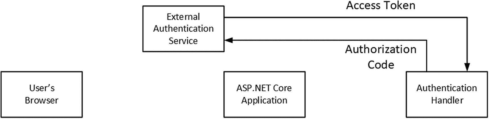
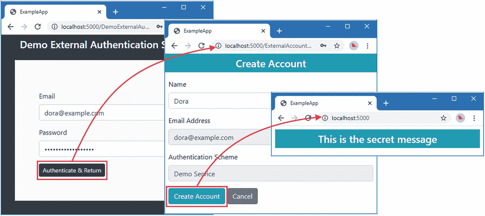

# 二十二、外部认证：第 1 部分

在这一章中，我将解释外部认证是如何工作的。这是一个复杂的过程，即使是按照 ASP.NET 其他核心身份特征设定的高标准，也有很多细节需要考虑。本章中的例子使用了一个模拟的第三方服务，它允许我以可控的方式解释交互。在第 23 章中，我添加了对使用谷歌和脸书的真实服务的支持。表 [22-1](#Tab1) 将外部认证置于上下文中。

表 22-1。

将外部认证置于上下文中

<colgroup><col class="tcol1 align-left"> <col class="tcol2 align-left"></colgroup> 
| 

问题

 | 

回答

 |
| --- | --- |
| 这是什么？ | 外部认证将识别用户的过程委托给第三方服务，通常由大型技术公司或社交媒体平台提供。 |
| 为什么有用？ | 外部认证允许用户登录应用，而无需创建和记住额外的密码。它还可以提供比 ASP.NET Core Identity 直接支持的更强的登录安全性。 |
| 如何使用？ | 这个过程很复杂，但是用户的浏览器被重定向到外部服务，该服务对用户进行认证，并将结果传递给 ASP.NET Core 应用。结果由 ASP.NET Core 直接与外部服务验证，用户登录。 |
| 有什么陷阱或限制吗？ | 主要的问题是复杂性，尽管如果您使用微软提供的外部认证包，这不是一个大问题，这在第 1 部分中有描述。 |
| 有其他选择吗？ | 外部认证是一个可选功能，项目不一定要使用它。 |

## 为本章做准备

本章使用第 21 章中的 ExampleApp 项目。本章不需要修改。打开一个新的命令提示符，导航到`ExampleApp`文件夹，运行清单 [22-1](#PC1) 中所示的命令来启动 ASP.NET Core。

Tip

你可以从 [`https://github.com/Apress/pro-asp.net-core-identity`](https://github.com/Apress/pro-asp.net-core-identity) 下载本章以及本书其他章节的示例项目。如果在运行示例时遇到问题，请参见第 [1](01.html) 章获取帮助。

```cs
dotnet run

Listing 22-1.Running the Example Application

```

打开一个新的浏览器窗口并请求`http://localhost:5000/users`。您将看到如图 [22-1](#Fig1) 所示的用户数据。数据仅存储在内存中，当 ASP.NET Core 停止时，更改将会丢失。


图 22-1。

运行示例应用

## 准备外部认证

当使用外部认证时，获取和验证用户凭证的过程在 ASP.NET Core 应用之外处理(因此有术语*外部*)。对于企业应用，这通常意味着认证被委托给在多个应用之间共享的服务，从而允许用户使用一组凭证登录多个应用。在面向客户的应用中，认证通常由社交媒体平台处理，如谷歌或脸书，用户可能已经建立了帐户。

Identity 不会对如何执行外部认证施加任何限制，而是依靠认证处理程序来处理细节。外部服务的认证处理器实现了我在第 [14 章](14.html)中描述的相同的`IAuthenticationHandler`接口。这种方法与基本的 Identity 特性一致，意味着应用可以通过为每个服务提供一个认证处理程序来支持多个外部服务。外部认证有三个阶段，*准备*、*认证*和*关联*，我将在下面的文本中进行描述。

认证处理程序是 ASP.NET Core 平台的一部分，并不特定于 Identity。为了有助于将重点放在 Identity 特性上，我将创建一个认证处理程序，它返回固定的结果，而不实际执行认证。在后面的例子中，我替换了固定的结果，最初是访问一个测试认证服务，然后使用真实的社交媒体平台执行认证。将名为`ExternalAuthHandler.cs`的类文件添加到`ExampleApp/Custom`文件夹中，并使用它来定义清单 [22-2](#PC2) 中所示的类。

```cs
using Microsoft.AspNetCore.Authentication;
using Microsoft.AspNetCore.Http;
using System.Threading.Tasks;

namespace ExampleApp.Custom {
    public class ExternalAuthHandler : IAuthenticationHandler {

        public AuthenticationScheme Scheme { get; set; }
        public HttpContext Context { get; set; }

        public Task InitializeAsync(AuthenticationScheme scheme,
                HttpContext context) {
            Scheme = scheme;
            Context = context;
            return Task.CompletedTask;
        }

        public Task<AuthenticateResult> AuthenticateAsync() {
            return Task.FromResult(AuthenticateResult.NoResult());
        }

        public Task ChallengeAsync(AuthenticationProperties properties) {
            return Task.CompletedTask;
        }

        public Task ForbidAsync(AuthenticationProperties properties) {
            return Task.CompletedTask;
        }
    }
}

Listing 22-2.The Contents of the ExternalAuthHandler.cs File in the Custom Folder

```

这是一个最小的`IAuthenticationHandler`接口实现，它包含了足够编译的代码。在后面的小节中，我在解释外部认证过程如何工作时，向该类添加了一些特性。

## 实施选择阶段

外部认证过程为用户提供了使用外部服务进行认证的选项。`SignInManager<T>`类通过表 [22-2](#Tab2) 中描述的方法提供对外部服务可用的认证方案的访问。

表 22-2。

用于外部认证方案的 SignInManager <t>方法</t>

<colgroup><col class="tcol1 align-left"> <col class="tcol2 align-left"></colgroup> 
| 

名字

 | 

描述

 |
| --- | --- |
| `GetExternalAuthenticationSchemesAsync()` | 这个异步方法返回一系列的`AuthenticationScheme`对象，每个对象都可以用于外部认证。 |

在`GetExternalAuthenticationSchemesAsync`方法中有一个奇怪之处，即只返回已经用`DisplayName`属性注册的认证方案。在清单 [22-3](#PC3) 中，我创建了一个带有`DisplayName`的新方案，它使用了清单 [22-2](#PC2) 中创建的处理程序。

Tip

`AddScheme<T>`方法的第二个参数是可选的，如果您需要创建一个不应该由`GetExternalAuthenticationSchemesAsync`方法选择的方案，可以省略这个参数。

```cs
...
services.AddAuthentication(opts => {
    opts.DefaultScheme = IdentityConstants.ApplicationScheme;
    opts.AddScheme<ExternalAuthHandler>("demoAuth", "Demo Service");
}).AddCookie(IdentityConstants.ApplicationScheme, opts => {
    opts.LoginPath = "/signin";
    opts.AccessDeniedPath = "/signin/403";
})
.AddCookie(IdentityConstants.TwoFactorUserIdScheme)
.AddCookie(IdentityConstants.TwoFactorRememberMeScheme);
...

Listing 22-3.Defining an Authentication Scheme in the Startup.cs File in the ExampleApp Folder

```

在清单 [22-4](#PC4) 中，我已经向`SignIn` Razor 页面的视图部分添加了内容，该页面为用户提供了每个外部认证方案的按钮。

```cs
@page "{code:int?}"
@model ExampleApp.Pages.SignInModel
@using Microsoft.AspNetCore.Http

@if (!string.IsNullOrEmpty(Model.Message)) {
    <h3 class="bg-danger text-white text-center p-2">@Model.Message</h3>
}

<h4 class="bg-info text-white m-2 p-2">Current User: @Model.Username</h4>

<div class="container-fluid">
    <div class="row">
        <div class="col-6 border p-2 h-100">
            <h4 class="text-center">Local Authentication</h4>
            <form method="post">
                <div class="form-group">
                    <label>User</label>
                    <select class="form-control"
                            asp-for="Username" asp-items="@Model.Users">
                    </select>
                </div>
                <div class="form-group">
                    <label>Password</label>
                    <input class="form-control" type="password"
                         name="password" value="MySecret1$" />
                </div>
                <button class="btn btn-info" type="submit">Sign In</button>
                @if (User.Identity.IsAuthenticated) {
                    <a asp-page="/Store/PasswordChange" class="btn btn-secondary"
                        asp-route-id="@Model.User?
                                .FindFirst(ClaimTypes.NameIdentifier)?.Value">
                            Change Password
                    </a>
                } else {
                    <a class="btn btn-secondary" href="/password/reset">
                        Reset Password
                    </a>
                }
            </form>
        </div>
        <div class="col-6 text-center">
            <div class="border p-2 h-100">
                <form method="post">
                    <h4>External Authentication</h4>
                    <div class="mt-4 w-75">
                        @foreach (var scheme in
                                await Model.SignInManager
                                    .GetExternalAuthenticationSchemesAsync()) {
                            <div class="mt-2 text-center">
                                <button class="btn btn-block btn-secondary
                                            m-1 mx-5" type="submit"
                                        asp-page="/externalsignin"
                                        asp-route-returnUrl=
                                            "@Request.Query["returnUrl"]"
                                        asp-route-providername="@scheme.Name">
                                    @scheme.DisplayName
                                </button>
                            </div>
                        }
                    </div>
                </form>
            </div>
        </div>
    </div>
</div>

Listing 22-4.Offering External Authentication in the SignIn.cshtml File in the Pages Folder

```

新的布局将本地认证选项与将导致外部认证的按钮分开，如果重新启动 ASP.NET Core 并请求`http://localhost:5000/signin`，就可以看到外部认证，如图 [22-2](#Fig2) 所示。单击“演示服务”按钮将指向我将在下一步中创建的页面。


图 22-2。

向用户呈现外部认证选项

### 了解准备阶段

在准备阶段，应用配置外部认证并启动认证过程。为了配置认证，需要创建一个`AuthenticationProperties`对象，用于存储稍后需要的状态数据。表 [22-3](#Tab3) 描述了由`AuthenticationProperties`类定义的最重要的属性。

表 22-3。

最重要的认证属性属性

<colgroup><col class="tcol1 align-left"> <col class="tcol2 align-left"></colgroup> 
| 

名字

 | 

描述

 |
| --- | --- |
| `Items` | 该属性用于使用`IDictionary<string, string?>`对象存储认证状态数据。 |
| `RedirectUri` | 此属性指定在认证阶段结束时用户浏览器应重定向到的 URL。 |

`SignInManager<T>`类使用`Items`集合属性来存储认证阶段完成后需要的数据。`RedirectUri`指定一旦用户通过认证，认证处理程序应该将用户的浏览器重定向到的 URL，并负责执行关联阶段。

`SignInManager<T>`类提供了用于创建`AuthenticationProperties`对象的`ConfigureExternalAuthenticationProperties`方法，如表 [22-4](#Tab4) 中所述。

表 22-4。

准备阶段的 SignInManager <t>方法</t>

<colgroup><col class="tcol1 align-left"> <col class="tcol2 align-left"></colgroup> 
| 

名字

 | 

描述

 |
| --- | --- |
| `ConfigureExternalAuthenticationProperties(provider, redirectUrl, userId)` | 这个方法创建一个`AuthenticationProperties`对象。将`provider`值添加到`Items`集合中，并将`redirectUrl`值赋给`RedirectUri`属性。可选的`userId`参数被添加到`Items`集合中，作为防止跨站点请求伪造的措施，并在用户已经登录时使用。 |

Razor 页面或控制器返回一个`ChallengeResult`，它选择认证处理器和由`ConfigureExternalAuthenticationProperties`方法创建的`AuthenticationProperties`对象。这导致使用`AuthenticationProperties`对象作为参数调用认证处理程序的`ChallengeAsync`方法，结束准备阶段。

在`Pages`文件夹中添加一个名为`ExternalSignIn.cshtml`的 Razor 页面，内容如清单 [22-5](#PC5) 所示。

```cs
@page
@model ExampleApp.Pages.ExternalSignInModel

<h4 class="bg-info text-white text-center p-2">External Authentication</h4>

Listing 22-5.The Contents of the ExternalSignIn.cshtml File in the Pages Folder

```

这只是暂时的占位符内容，因为稍后才需要页面的视图部分。目前，焦点在页面模型类上。将清单 [22-6](#PC6) 中所示的代码添加到`Pages`文件夹中的`ExternalSignIn.cshtml.cs`文件中。(如果您使用的是 Visual Studio 代码，则必须创建该文件。)

```cs
using ExampleApp.Identity;
using Microsoft.AspNetCore.Authentication;
using Microsoft.AspNetCore.Identity;
using Microsoft.AspNetCore.Mvc;
using Microsoft.AspNetCore.Mvc.RazorPages;

namespace ExampleApp.Pages {

    public class ExternalSignInModel : PageModel {

        public ExternalSignInModel(SignInManager<AppUser> signInManager) {
            SignInManager = signInManager;
        }

        public SignInManager<AppUser> SignInManager { get; set; }

        public IActionResult OnPost(string providerName,
                string returnUrl = "/") {

            string redirectUrl = Url.Page("./ExternalSignIn",
                 pageHandler: "Correlate", values: new { returnUrl });
            AuthenticationProperties properties = SignInManager
              .ConfigureExternalAuthenticationProperties(providerName,
                  redirectUrl);
            return new ChallengeResult(providerName, properties);
        }
    }
}

Listing 22-6.The Contents of the ExternalSignIn.cshtml.cs File in the Pages Folder

```

准备外部认证时，需要处理两个级别的重定向。标准登录过程捕获用户请求的导致质询响应的 URL。该值作为 URL 的查询字符串参数添加，在用户通过认证后，认证处理程序应将浏览器重定向到该 URL，如下所示:

```cs
...
string redirectUrl = Url.Page("./ExternalSignIn", pageHandler: "Correlate",
    values: new { returnUrl });
...

```

`pageHandler`值包括将接收重定向请求的处理程序方法的名称。在这个例子中，我将方法命名为`Correlate`,稍后我将定义这个方法。

### 了解认证阶段

在认证阶段，认证处理程序负责指导用户完成外部服务所需的流程。这个过程的细节对于 ASP.NET Core Identity 是不可见的，但是大部分外部认证都是使用 OAuth 协议完成的，我将在本章的后面进行描述。但是现在，我将验证用户，而不需要任何凭证来演示整个过程。将清单 [22-7](#PC8) 中所示的代码添加到`ExternalAuthHandler`类中。

```cs
using Microsoft.AspNetCore.Authentication;
using Microsoft.AspNetCore.Http;
using System.Threading.Tasks;
using System.Security.Claims;
using Microsoft.AspNetCore.Identity;

namespace ExampleApp.Custom {
    public class ExternalAuthHandler : IAuthenticationHandler {

        public AuthenticationScheme Scheme { get; set; }
        public HttpContext Context { get; set; }

        public Task InitializeAsync(AuthenticationScheme scheme,
                HttpContext context) {
            Scheme = scheme;
            Context = context;
            return Task.CompletedTask;
        }

        public Task<AuthenticateResult> AuthenticateAsync() {
            return Task.FromResult(AuthenticateResult.NoResult());
        }

        public async Task ChallengeAsync(AuthenticationProperties properties) {
            ClaimsIdentity identity = new ClaimsIdentity(Scheme.Name);
            identity.AddClaims(new[] {
                new Claim(ClaimTypes.NameIdentifier, "SomeUniqueID"),
                new Claim(ClaimTypes.Email, "alice@example.com"),
                new Claim(ClaimTypes.Name, "Alice")
            });
            ClaimsPrincipal principal = new ClaimsPrincipal(identity);
            await Context.SignInAsync(IdentityConstants.ExternalScheme,
                principal, properties);
            Context.Response.Redirect(properties.RedirectUri);
        }

        public Task ForbidAsync(AuthenticationProperties properties) {
            return Task.CompletedTask;
        }
    }
}

Listing 22-7.Performing Authentication in the ExternalAuthHandler.cs File in the Custom Folder

```

重要的是来自`ChallengeAsync`方法的结果，即使处理程序并没有真正执行认证。创建了一个`ClaimsPrincipal`对象，其中的`ClaimsIdentity`从外部认证服务的角度描述了经过认证的用户。对于这个测试处理程序，这意味着需要提供惟一的 ID、电子邮件地址和名称。

一旦处理程序创建了`ClaimsPrincipal`，就使用`HttpContext.SignInAsync`方法以一种特殊的方案登录外部用户，如下所示:

```cs
...
await Context.SignInAsync(IdentityConstants.ExternalScheme,
    principal, properties);
...

```

`IdentityConstants.ExternalScheme`用于登录外部用户，为流程的下一阶段做准备。`SignInAsync`方法的其他参数是`ClaimsPrincipal`对象和`AuthenticationProperties`对象，它们确保处理程序接收的状态数据被保留。一旦外部用户已经登录，处理程序发出重定向到由`AuthenticationProperties`参数的`RedirectUri`方法指定的 URL。

```cs
...
Context.Response.Redirect(properties.RedirectUri);
...

```

为了支持`IdentityConstants.ExternalScheme`方案，将清单 [22-8](#PC11) 中所示的语句添加到`Startup`类中。

```cs
...
services.AddSingleton<IUserValidator<AppUser>, EmailValidator>();
services.AddSingleton<IPasswordValidator<AppUser>, PasswordValidator>();
services.AddScoped<IUserClaimsPrincipalFactory<AppUser>,
    AppUserClaimsPrincipalFactory>();
services.AddSingleton<IRoleValidator<AppRole>, RoleValidator>();

services.AddAuthentication(opts => {
    opts.DefaultScheme = IdentityConstants.ApplicationScheme;
    opts.AddScheme<ExternalAuthHandler>("demoAuth", "Demo Service");
}).AddCookie(IdentityConstants.ApplicationScheme, opts => {
    opts.LoginPath = "/signin";
    opts.AccessDeniedPath = "/signin/403";
})
.AddCookie(IdentityConstants.TwoFactorUserIdScheme)
.AddCookie(IdentityConstants.TwoFactorRememberMeScheme)
.AddCookie(IdentityConstants.ExternalScheme);
...

Listing 22-8.Adding the Cookie Handler in the Startup.cs File in the ExampleApp Folder

```

无论使用哪种外部服务，所有外部认证都会导致使用`IdentityConstants.ExternalScheme`登录。这允许`SignInManager<T>`获得外部用户的详细信息，如下一节所述。

### 了解相关阶段

关联阶段确定哪个 Identity 用户帐户与外部认证相关联。因此，举例来说，如果 Alice 使用 Google 进行认证，关联过程使用与`ClaimsPrincipal`对象相关联的处理程序的声明来确定这个登录与本地`Alice`帐户相关。

外部登录与本地帐户的关联方式可适用于每个项目和每个外部认证服务。对于示例应用，我将使用三阶段方法。

1.  检查用户存储，查看外部登录是否已经与本地帐户关联。如果是，请让本地用户登录应用。

2.  如果没有，寻找一个有匹配电子邮件地址的本地帐户。如果匹配，在商店中关联登录，并让用户登录应用。

3.  如果没有匹配的电子邮件地址，提示用户创建一个新帐户。

清单 [22-8](#PC11) 中定义的外部认证处理程序只认证一个用户，所以我将把这个过程的第三部分留到本章的后面，在后面我将介绍更广泛的认证特性。

我概述的方法依赖于跟踪用户登录的能力，这是通过在用户存储中存储`UserLoginInfo`对象来实现的。`UserLoginInfo`类定义了表 [22-5](#Tab5) 中所示的属性。

表 22-5。

用户登录信息属性

<colgroup><col class="tcol1 align-left"> <col class="tcol2 align-left"></colgroup> 
| 

名字

 | 

描述

 |
| --- | --- |
| `LoginProvider` | 这是外部服务的认证处理程序的名称。 |
| `ProviderKey` | 这是外部服务识别用户的唯一标识符。 |
| `ProviderDisplayName` | 这是将向用户显示的外部服务的名称。 |

Identity 只需要跟踪外部服务识别用户的唯一 ID 和认证服务的详细信息(通常与认证处理程序的详细信息相同)。

#### 扩展用户存储

可以存储外部登录的用户存储实现了`IUserLoginStore<T>`接口，该接口定义了表 [22-6](#Tab6) 中描述的方法。(和其他商店接口一样，这些方法定义了一个名为`token`的`CancellationToken`参数。)

表 22-6。

IUserLoginStore <t>方法</t>

<colgroup><col class="tcol1 align-left"> <col class="tcol2 align-left"></colgroup> 
| 

名字

 | 

描述

 |
| --- | --- |
| `GetLoginsAsync(user, token)` | 该方法返回一个包含指定用户的外部登录的`IList<UserLoginInfo>`。 |
| `AddLoginAsync(user, login, token)` | 这个方法为指定的用户存储一个`UserLoginInfo`。 |
| `RemoveLoginAsync(user, loginProvider, providerKey)` | 该方法移除具有指定提供者和密钥的`UserLoginInfo`。 |
| `FindByLoginAsync(loginProvider, providerKey)` | 这个方法使用指定的提供者和密钥来定位拥有`UserLoginInfo`的用户。 |

要添加对存储登录信息的支持，请将清单 [22-9](#PC12) 中所示的属性添加到`AppUser`类中。

```cs
using System;
using System.Collections.Generic;
using System.Security.Claims;
using Microsoft.AspNetCore.Identity;

namespace ExampleApp.Identity {
    public class AppUser {

        public string Id { get; set; } = Guid.NewGuid().ToString();

        public string UserName { get; set; }

        public string NormalizedUserName { get; set; }

        public string EmailAddress { get; set; }
        public string NormalizedEmailAddress { get; set; }
        public bool EmailAddressConfirmed { get; set; }

        public string PhoneNumber { get; set; }
        public bool PhoneNumberConfirmed { get; set; }

        public string FavoriteFood { get; set; }
        public string Hobby { get; set; }

        public IList<Claim> Claims { get; set; }

        public string SecurityStamp { get; set; }
        public string PasswordHash { get; set; }

        public bool CanUserBeLockedout { get; set; } = true;
        public int FailedSignInCount { get; set; }
        public DateTimeOffset? LockoutEnd { get; set; }

        public bool TwoFactorEnabled { get; set; }
        public bool AuthenticatorEnabled { get; set; }
        public string AuthenticatorKey { get; set; }

        public IList<UserLoginInfo> UserLogins { get; set; }
    }
}

Listing 22-9.Adding a Property in the AppUser.cs File in the Identity Folder

```

为了实现示例存储中的接口，将名为`UserStoreLogins.cs`的类文件添加到`ExampleApp/Identity/Store`文件夹中，并使用它来定义清单 [22-10](#PC13) 中所示的分部类。

```cs
using Microsoft.AspNetCore.Identity;
using System.Collections.Generic;
using System.Linq;
using System.Threading;
using System.Threading.Tasks;

namespace ExampleApp.Identity.Store {

    public partial class UserStore : IUserLoginStore<AppUser> {

        public Task<IList<UserLoginInfo>> GetLoginsAsync(AppUser user,
                CancellationToken token)
            => Task.FromResult(user.UserLogins ?? new List<UserLoginInfo>());

        public Task AddLoginAsync(AppUser user, UserLoginInfo login,
                CancellationToken token) {
            if (user.UserLogins == null) {
                user.UserLogins = new List<UserLoginInfo>();
            }
            user.UserLogins.Add(login);
            return Task.CompletedTask;
        }

        public async Task RemoveLoginAsync(AppUser user, string loginProvider,
                string providerKey, CancellationToken token)
            => user.UserLogins = (await GetLoginsAsync(user, token)).Where(login
                => !login.LoginProvider.Equals(loginProvider)
                       && !login.ProviderKey.Equals(providerKey)).ToList();

        public Task<AppUser> FindByLoginAsync(string loginProvider,
                string providerKey, CancellationToken token) =>
            Task.FromResult(Users.FirstOrDefault(u => u.UserLogins != null &&
                u.UserLogins.Any(login => login.LoginProvider.Equals(loginProvider)
                    && login.ProviderKey.Equals(providerKey))));
    }
}

Listing 22-10.The Contents of the UserStoreLogins.cs File in the Identity/Store Folder

```

因为示例应用中的用户存储是基于内存的，所以我可以使用字典跟踪`UserLoginInfo`对象，将`AppUser`对象作为键。`UserManager<T>`类定义了表 [22-7](#Tab7) 中所示的方法，用于管理用户存储中的外部登录。

表 22-7。

管理外部登录的 UserManager <t>方法</t>

<colgroup><col class="tcol1 align-left"> <col class="tcol2 align-left"></colgroup> 
| 

名字

 | 

描述

 |
| --- | --- |
| `FindByLoginAsync(provider, key)` | 该方法调用用户存储的`FindByLoginAsync`方法来定位与指定的提供者和密钥相关联的本地用户。 |
| `GetLoginsAsync(user)` | 该方法调用用户存储的`GetLoginsAsync`方法来返回包含与指定本地用户相关联的外部登录的`IList<UserLoginInfo>`。 |
| `AddLoginAsync(user, login)` | 该方法调用用户存储的`AddLoginAsync`方法将指定的外部登录与本地用户相关联，之后执行用户管理器的更新序列。如果它已经包含指定的登录(这是通过调用`FindByLoginAsync`方法确定的),就会抛出一个异常。 |
| `RemoveLoginAsync(user, provider, key)` | 该方法调用商店的`RemoveLoginAsync`方法来删除外部登录，之后更新用户的安全标记并执行用户管理器的更新序列。 |

#### 关联和存储登录

`SignInManager<T>`类定义了表 [22-8](#Tab8) 所示的方法，用于获取外部认证处理程序创建的`ClaimsPrincipal`并登录本地用户。

表 22-8。

用于关联外部登录的 SignInManager <t>方法</t>

<colgroup><col class="tcol1 align-left"> <col class="tcol2 align-left"></colgroup> 
| 

名字

 | 

描述

 |
| --- | --- |
| `GetExternalLoginInfoAsync()` | 该方法为外部登录返回一个`ExternalLoginInfo`对象，该对象可以添加到用户存储中。它通过检索由外部认证处理程序创建的`ClaimsPrincipal`对象来实现这一点。`NameIdentifier`声明的值被用作唯一的 ID。提供者名称是从与登录相关联的`AuthentionProperties`对象的`Items`集合中名为`LoginProvider`的属性中获得的。显示名称从`GetExternalAuthenticationSchemesAsync`方法的结果中获得。 |
| `ExternalLoginSignInAsync(provider, key, isPersistent, bypassTwoFactor)` | 该方法使用`FindByLoginAsync`方法来定位具有与指定的提供者和密钥相匹配的登录名的用户，并将他们登录到应用中。`isPersisent`参数控制浏览器关闭后登录 cookie 是否继续存在。`bypassTwoFactor`参数决定了双因素特性是否会被忽略。 |

当认证处理程序在认证阶段完成后重定向浏览器时，会执行登录关联。`GetExternalLoginInfoAsync`方法返回`ExternalLoginInfo`类的一个实例，该类从`UserLoginInfo`派生并定义了表 [22-9](#Tab9) 中描述的附加属性。

表 22-9。

ExternalLoginInfo 属性

<colgroup><col class="tcol1 align-left"> <col class="tcol2 align-left"></colgroup> 
| 

名字

 | 

描述

 |
| --- | --- |
| `Principal` | 该属性返回由外部认证处理程序创建的`ClaimsPrincipal`对象。 |
| `AuthenticationTokens` | 这个属性返回一个认证令牌序列，我在第 [23](23.html) 章对此进行了描述。 |
| `AuthenticationProperties` | 该属性返回与外部登录关联的`AuthenticationProperties`对象。 |

添加清单 [22-11](#PC14) 中所示的代码，以定义在示例应用中处理相关性的处理程序方法。

```cs
using ExampleApp.Identity;
using Microsoft.AspNetCore.Authentication;
using Microsoft.AspNetCore.Identity;
using Microsoft.AspNetCore.Mvc;
using Microsoft.AspNetCore.Mvc.RazorPages;
using System.Linq;
using System.Security.Claims;
using System.Threading.Tasks;
using SignInResult = Microsoft.AspNetCore.Identity.SignInResult;

namespace ExampleApp.Pages {

    public class ExternalSignInModel : PageModel {

        public ExternalSignInModel(SignInManager<AppUser> signInManager,
                UserManager<AppUser> userManager) {
            SignInManager = signInManager;
            UserManager = userManager;
        }

        public SignInManager<AppUser> SignInManager { get; set; }
        public UserManager<AppUser> UserManager { get; set; }

        public string ProviderDisplayName { get; set; }

        public IActionResult OnPost(string providerName,
                string returnUrl = "/") {

            string redirectUrl = Url.Page("./ExternalSignIn",
                 pageHandler: "Correlate", values: new { returnUrl });
            AuthenticationProperties properties = SignInManager
              .ConfigureExternalAuthenticationProperties(providerName,
                  redirectUrl);
            return new ChallengeResult(providerName, properties);
        }

        public async Task<IActionResult> OnGetCorrelate(string returnUrl) {
            ExternalLoginInfo info = await SignInManager.GetExternalLoginInfoAsync();
            AppUser user = await UserManager.FindByLoginAsync(info.LoginProvider,
                info.ProviderKey);
            if (user == null) {
                string externalEmail =
                    info.Principal.FindFirst(ClaimTypes.Email)?.Value
                        ?? string.Empty;
                user = await UserManager.FindByEmailAsync(externalEmail);
                if (user == null) {
                    return RedirectToPage("/ExternalAccountConfirm",
                        new { returnUrl });
                } else {
                    await UserManager.AddLoginAsync(user, info);
                }
            }
            SignInResult result = await SignInManager.ExternalLoginSignInAsync(
                 info.LoginProvider, info.ProviderKey, false, false);
            if (result.Succeeded) {
                return RedirectToPage("ExternalSignIn", "Confirm",
                    new { info.ProviderDisplayName, returnUrl });
            } else if (result.RequiresTwoFactor) {
                string postSignInUrl = this.Url.Page("/ExternalSignIn", "Confirm",
                    new { info.ProviderDisplayName, returnUrl });
                return RedirectToPage("/SignInTwoFactor",
                    new { returnUrl = postSignInUrl });
            }
            return RedirectToPage(new { error = true, returnUrl });
        }

        public async Task OnGetConfirmAsync() {
            string provider = User.FindFirstValue(ClaimTypes.AuthenticationMethod);
            ProviderDisplayName =
                (await SignInManager.GetExternalAuthenticationSchemesAsync())
                   .FirstOrDefault(s => s.Name == provider)?.DisplayName ?? provider;
        }
    }
}

Listing 22-11.Processing the External Login in the ExternalSignIn.cshtml.cs File in the Pages Folder

```

当调用`OnGetCorrelate`方法时，我使用`GetExternalLoginInfoAsync`方法获取描述外部登录的`ExternalLoginInfo`对象。使用由`ExternalLoginInfo`提供的细节，我在用户存储中查询现有的外部登录，以获得代表用户的`AppUser`对象。

如果没有匹配的登录，我从外部`ClaimsPrincipal`找到一个电子邮件声明，并使用它来查询用户存储。如果有匹配的用户，我会存储外部登录以备将来使用。

如果我找到了一个用户，无论是使用登录名还是通过电子邮件地址，我都会使用`SignInManager<T>.ExternalLoginSignInAsync`方法将他们登录到应用中，如下所示:

```cs
...
SignInResult result = await SignInManager.ExternalLoginSignInAsync(
    info.LoginProvider, info.ProviderKey, false, false);
...

```

使用外部登录登录时，有一个绕过双因素安全性的选项，但是我选择启用双因素来演示它是如何工作的。如果用户在没有双因素的情况下登录，我会将他们重定向到`Confirm`处理程序，它使用页面的视图部分来显示外部登录的摘要。

```cs
...
string postSignInUrl = this.Url.Page("/ExternalSignIn", "Confirm",
    new { info.ProviderDisplayName, returnUrl });
return RedirectToPage("/SignInTwoFactor", new { returnUrl = postSignInUrl });
...

```

为了显示外部认证过程的摘要，将清单 [22-12](#PC17) 中所示的内容添加到`ExternalSignIn.cshtml`文件中。

```cs
@page
@model ExampleApp.Pages.ExternalSignInModel

<h4 class="bg-info text-white text-center p-2">External Authentication</h4>

@{
    string returnUrl = Request.Query["returnUrl"].Count == 0 ?
        "/" : Request.Query["returnUrl"];
}

@if (Request.Query["error"].Count() > 0) {
    <h5 class="bg-danger text-white text-center m-2 p-2">
        Something went wrong. You could not be signed into the application.
    </h5>
    <h5 class="text-center m-2 p-2">@Request.Query["error"]</h5>
    <div class="text-center">
        <a class="btn btn-info text-center" href="@returnUrl">OK</a>
    </div>
} else {
    <h5 class="text-center">
        @User.Identity.Name has been authenticated by @Model.ProviderDisplayName
    </h5>

    <div class="text-center">
        <a class="btn btn-info text-center" href="@returnUrl">Continue</a>
    </div>
}

Listing 22-12.Displaying a Summary in the ExternalSignIn.cshtml File in the Pages Folder

```

我向`ExternalSignIn`页面添加了一些基本的错误处理，一旦我添加了更广泛的外部认证特性，我就会用到它。

重启 ASP.NET Core，请求`http://localhost:5000/signout`，选择“忘记我”选项，点击“退出”按钮退出应用。请求`http://localhost:5000/secret`触发挑战响应。单击演示服务按钮，使用外部处理程序进行认证。目前，处理程序会立即对 Alice 用户的请求进行认证，并将浏览器重定向到`ExternalSignIn` Razor 页面。(我将扩展外部处理程序的特性，以便它提示输入密码。)应用使用它从外部认证处理程序接收的电子邮件地址将登录与本地 Alice 用户帐户相关联。此帐户配置为使用验证器进行双因素验证，系统会提示您输入当前的验证器代码。输入验证码(或使用恢复码)，将显示外部登录的摘要。点击确定按钮，浏览器将被重定向到受保护的内容，如图 [22-3](#Fig3) 所示。


图 22-3。

外部认证工作流

## 了解 OAuth 认证过程

Identity 对如何执行外部认证没有任何限制，但是大多数服务都使用 OAuth 协议。在接下来的小节中，我将解释 OAuth 认证过程中的每个步骤并实现。在接下来的部分中，我将解释认证序列和每个阶段交换的数据。每个认证服务都略有不同，但是您可以预期在任何使用 OAuth 的服务中遇到我描述的大多数细节，尽管您也应该预期每个提供者会有一些变化，正如我在第 [23](23.html) 章中添加对真实服务的支持时所演示的。

Tip

你不需要了解 OAuth 规范来理解本章中的例子，但是如果你感兴趣的话，你可以在 [`https://oauth.net`](https://oauth.net) 了解细节。

### 准备外部认证

在部署之前，应用向认证服务注册。注册要求不同，但结果是认证过程中使用的两个数据:客户机 ID 和客户机机密。

在接下来的小节中，我将详细演示如何使用这些数据项，但是客户端 ID 可以公开共享，并且只用于识别哪些应用认证请求。顾名思义，客户端机密不应该公开共享，只在请求中发送给认证服务。表 [22-10](#Tab10) 描述了这些数据项以供快速参考。

表 22-10。

在应用注册期间创建的数据项

<colgroup><col class="tcol1 align-left"> <col class="tcol2 align-left"></colgroup> 
| 

名字

 | 

描述

 |
| --- | --- |
| 客户标识 | 客户端 ID 包含在请求中，让认证服务知道哪个应用想要对用户进行认证。这允许认证服务向用户提供关于应用的详细信息，以便他们可以做出是否提供对其数据的访问的明智选择。 |
| 客户机密 | 客户端机密包含在请求中，以向认证服务证明它们来自应用。这依赖于秘密被保密，这意味着它不应该与用户共享，也不应该包含在公共源代码库中。 |

#### 准备模拟的外部认证控制器

为了简单起见，我将在现有的 ExampleApp 项目中使用一个控制器来表示外部认证服务。这将允许我演示在外部认证过程中使用 HTTP 请求，而不需要创建和运行单独的服务器。将名为`DemoExternalAuthController.cs`的类文件添加到`ExampleApp/Controllers`文件夹中，并添加清单 [22-13](#PC18) 中所示的代码。

```cs
using Microsoft.AspNetCore.Mvc;
using System.Collections.Generic;

namespace ExampleApp.Controllers {

    class UserRecord {
        public string Id { get; set; }
        public string Name { get; set; }
        public string EmailAddress { get; set; }
        public string Password { get; set; }
        public string Code { get; set; }
        public string Token { get; set; }
    }

    public class DemoExternalAuthController : Controller {
        private static string expectedID = "MyClientID";
        private static string expectedSecret = "MyClientSecret";
        private static List<UserRecord> users  = new List<UserRecord> {
            new UserRecord() {
                Id = "1", Name = "Alice", EmailAddress = "alice@example.com",
                Password = "myexternalpassword"
            },
             new UserRecord {
                Id = "2", Name = "Dora", EmailAddress = "dora@example.com",
                Password = "myexternalpassword"
             }
        };
    }
}

Listing 22-13.The Contents of the DemoExternalAuthController.cs File in the Controllers Folder

```

控制器定义了指定客户端 ID 和客户端密码的期望值的字段。在真实的外部服务中，每个已注册的应用都有一个 ID 和密码，但是我只需要一组值来演示示例应用中的认证序列。清单 [22-13](#PC18) 中的控制器还定义了一些将在认证过程中使用的基本用户数据。

#### 准备认证处理程序

将清单 [22-14](#PC19) 中所示的更改为`ExternalAuthHandler`类，为使用上一节中创建的控制器进行认证做准备。

```cs
using Microsoft.AspNetCore.Authentication;
using Microsoft.AspNetCore.Http;
using System.Threading.Tasks;
using System.Security.Claims;
using Microsoft.AspNetCore.Identity;
using Microsoft.Extensions.Options;

namespace ExampleApp.Custom {

    public class ExternalAuthOptions {
        public string ClientId { get; set; } = "MyClientID";
        public string ClientSecret { get; set; } = "MyClientSecret";
    }

    public class ExternalAuthHandler : IAuthenticationHandler {

        public ExternalAuthHandler(IOptions<ExternalAuthOptions> options) {
            Options = options.Value;
        }

        public AuthenticationScheme Scheme { get; set; }
        public HttpContext Context { get; set; }

        public ExternalAuthOptions Options { get; set; }

        public Task InitializeAsync(AuthenticationScheme scheme,
                HttpContext context) {
            Scheme = scheme;
            Context = context;
            return Task.CompletedTask;
        }

        public Task<AuthenticateResult> AuthenticateAsync() {
            return Task.FromResult(AuthenticateResult.NoResult());
        }

        public async Task ChallengeAsync(AuthenticationProperties properties) {

            // TODO - authentication implementation
        }

        public Task ForbidAsync(AuthenticationProperties properties) {
            return Task.CompletedTask;
        }
    }
}

Listing 22-14.Preparing the Handler in the ExternalAuthHandler.cs File in the Custom Folder

```

我已经删除了我在本章前面使用的测试代码，并添加了对使用`ExternalAuthOptions`类上的 options 模式接收配置设置的支持。将清单 [22-15](#PC20) 中所示的语句添加到`Startup`类中，以应用选项模式，这允许简单的配置更改。

```cs
...
public void ConfigureServices(IServiceCollection services) {
    services.AddSingleton<ILookupNormalizer, Normalizer>();
    services.AddSingleton<IUserStore<AppUser>, UserStore>();
    services.AddSingleton<IEmailSender, ConsoleEmailSender>();
    services.AddSingleton<ISMSSender, ConsoleSMSSender>();
    services.AddSingleton<IPasswordHasher<AppUser>, SimplePasswordHasher>();
    services.AddSingleton<IRoleStore<AppRole>, RoleStore>();

    services.AddOptions<ExternalAuthOptions>();

    services.AddIdentityCore<AppUser>(opts => {
        opts.Tokens.EmailConfirmationTokenProvider = "SimpleEmail";
        opts.Tokens.ChangeEmailTokenProvider = "SimpleEmail";
        opts.Tokens.PasswordResetTokenProvider =
            TokenOptions.DefaultPhoneProvider;
...

Listing 22-15.Applying the Options Pattern in the Startup.cs File in the ExampleApp Folder

```

### 步骤 1:重定向到认证服务 URL

当用户单击按钮启动认证过程时，该过程开始。该请求导致 ASP.NET Core 要求认证处理程序类产生一个质询响应。处理程序通过将用户的浏览器重定向到认证服务提供的 URL 进行响应，如图 [22-4](#Fig4) 所示。


图 22-4。

将用户的浏览器重定向到外部认证服务

处理程序使用重定向 URL 的查询字符串通过用户的浏览器向认证服务传递信息:客户端 ID、返回 URL、范围和可选的状态数据。例如，浏览器被重定向到的 URL 的查询字符串具有这样的结构，其中实值替换了我用`<`和`>`字符表示的占位符:

```cs
?client_id=<Client ID>&redirect_uri=<Return URL>&scope=<Scope>&state=<State Data>

```

如前一节所述，客户端 ID 是在应用向认证服务注册时创建的，用于标识来自特定应用的请求。使用`client_id`参数发送该值。

一旦用户通过了认证，返回 URL 告诉认证服务将客户端重定向到哪里，我将在下一节中对此进行描述。使用`redirect_uri`参数发送返回 URL。

范围描述了应用为用户要求的数据。最受欢迎的认证服务是由谷歌和脸书这样的公司提供的，他们的服务结合了基本的认证和对更复杂的 API 的访问，这样应用就可以获得用户数据，如消息和日历约会。应用在重定向 URL 中包含一个范围字符串，以指定它们需要的访问权限，这允许认证服务询问用户是否同意访问。使用`scope`查询字符串参数发送范围。每个认证服务都定义了作用域，有些服务要求应用在注册时声明它们需要的作用域。

最后，状态数据包含在 URL 中，以便应用可以跟踪认证过程。并非所有的应用都需要状态数据，因为它们可以通过向发送到用户浏览器的响应中添加 cookies 来跟踪认证与哪个用户相关，但是 OAuth 规范建议在请求中仍应包含一个值，以防止跨站点请求伪造(CSRF)攻击。使用`state`查询字符串参数发送状态数据。

表 [22-11](#Tab11) 总结了应用包含在重定向 URL 中的查询字符串参数，以供快速参考。

表 22-11。

重定向 URL 中包含的查询字符串参数

<colgroup><col class="tcol1 align-left"> <col class="tcol2 align-left"></colgroup> 
| 

名字

 | 

描述

 |
| --- | --- |
| `client_id` | 如前一节所述，该参数向认证服务发送标识应用的客户端 ID。 |
| `redirect_uri` | 此参数发送认证服务应在认证完成后将用户浏览器重定向到的 URL。 |
| `scope` | 此参数发送范围，该范围指定应用需要的数据和服务。 |
| `state` | 此参数发送一个状态数据值，应用使用该值来关联相关请求并防止跨站点伪造攻击。 |
| `response_type` | 该参数指定响应的类型，必须设置为`code`。 |

#### 更新外部认证控制器

在清单 [22-16](#PC22) 中，我添加了一个模拟外部服务的动作方法。此操作将成为重定向的目标。

```cs
using Microsoft.AspNetCore.Mvc;
using System.Collections.Generic;

namespace ExampleApp.Controllers {

    class UserRecord {
        public string Id { get; set; }
        public string Name { get; set; }
        public string EmailAddress { get; set; }
        public string Password { get; set; }
        public string Code { get; set; }
        public string Token { get; set; }
    }

    public class ExternalAuthInfo {
        public string client_id { get; set; }
        public string client_secret { get; set; }
        public string redirect_uri { get; set; }
        public string scope { get; set; }
        public string state { get; set; }
        public string response_type { get; set; }
        public string grant_type { get; set; }
        public string code { get; set; }
    }

    public class DemoExternalAuthController : Controller {
        private static string expectedID = "MyClientID";
        private static string expectedSecret = "MyClientSecret";
        private static List<UserRecord> users  = new List<UserRecord> {
            new UserRecord() {
                Id = "1", Name = "Alice", EmailAddress = "alice@example.com",
                Password = "myexternalpassword"
            },
             new UserRecord {
                Id = "2", Name = "Dora", EmailAddress = "dora@example.com",
                Password = "myexternalpassword"
             }
        };

        public IActionResult Authenticate([FromQuery] ExternalAuthInfo info)
         => expectedID == info.client_id ? View((info, string.Empty))
                 : View((info, "Unknown Client"));
    }
}

Listing 22-16.Adding an Action in the DemoExternalAuthController.cs File in the Controllers Folder

```

我定义了一个名为`ExternalAuthInfo`的类，以便更容易地发送和接收认证过程所需的数据。名为`Authenticate`的新动作方法呈现一个视图，提示用户输入凭证。如果请求不包含预期的客户机 ID，则使用相同的视图显示错误消息。请注意，此阶段的任何错误都将显示给用户，而不会传达给应用。

Note

大多数认证服务要求预先注册`redirect_uri` URL，如果在请求中收到不同的值，将显示错误。

为了定义`Authenticate`动作使用的视图，创建`Views/DemoExternalAuth`文件夹，并添加一个名为`Authenticate.cshtml`的 Razor 视图，其内容如清单 [22-17](#PC23) 所示。

```cs
@model (ExampleApp.Controllers.ExternalAuthInfo info, string error)

@{
    IEnumerable<(string, string)> KeyValuePairs =
        typeof(ExampleApp.Controllers.ExternalAuthInfo).GetProperties()
            .Select(pi => (pi.Name, pi.GetValue(Model.info)?.ToString()));
}

<div class="bg-dark text-white p-2">
    <h4 class="text-center">Demo External Authentication Service</h4>
    <div class="bg-light text-dark m-4 p-5 border">

        @if (!string.IsNullOrEmpty(Model.error)) {
            <div class="h3 bg-danger text-white text-center m-2 p-2">
                <div>Something Went Wrong</div>
                <div class="h5">(@Model.error)</div>
            </div>
        } else {
            <div asp-validation-summary="All" class="text-danger m-2"></div>
            <form method="post" asp-action="Authenticate">
                @foreach (var tuple in KeyValuePairs) {
                    if (!string.IsNullOrEmpty(tuple.Item2)) {
                        <input type="hidden" name="@tuple.Item1"
                            value="@tuple.Item2" />
                    }
                }
                <div class="p-2">
                    <div class="form-group">
                        <label>Email</label>
                        <input name="email" class="form-control" />
                    </div>
                    <div class="form-group">
                        <label>Password</label>
                        <input name="password" type="password"
                            class="form-control" />
                    </div>
                    <button type="submit" class="btn btn-sm btn-dark">
                        Authenticate & Return
                    </button>
                </div>
            </form>
        }
    </div>
</div>

Listing 22-17.The Contents of the Authenticate.cshtml File in the Views/DemoExternalAuth Folder

```

该视图模拟来自外部认证服务的响应，并包含一个提交用户凭证的表单，以及包含应用在重定向请求中提供的值的隐藏输入元素。

#### 更新认证处理程序

在清单 [22-18](#PC24) 中，我修改了认证处理程序，以便它在被要求发出挑战响应时发送重定向。

Note

我正在使用受保护的虚拟方法编写认证处理程序，这样我就可以轻松地创建子类来处理第 [23](23.html) 章中的真实认证服务。

```cs
using Microsoft.AspNetCore.Authentication;
using Microsoft.AspNetCore.Http;
using System.Threading.Tasks;
using System.Security.Claims;
using Microsoft.AspNetCore.Identity;
using Microsoft.Extensions.Options;
using System.Collections.Generic;
using Microsoft.AspNetCore.DataProtection;

namespace ExampleApp.Custom {

    public class ExternalAuthOptions {
        public string ClientId { get; set; } = "MyClientID";
        public string ClientSecret { get; set; } = "MyClientSecret";

        public virtual string RedirectRoot { get; set; } = "http://localhost:5000";
        public virtual string RedirectPath { get; set; } = "/signin-external";
        public virtual string Scope { get; set; } = "openid email profile";
        public virtual string StateHashSecret { get; set; } = "mysecret";

        public virtual string AuthenticationUrl { get; set; }
            = "http://localhost:5000/DemoExternalAuth/authenticate";
    }

    public class ExternalAuthHandler : IAuthenticationHandler {

        public ExternalAuthHandler(IOptions<ExternalAuthOptions> options,
                IDataProtectionProvider dp) {
            Options = options.Value;
            DataProtectionProvider = dp;
        }

        public AuthenticationScheme Scheme { get; set; }
        public HttpContext Context { get; set; }
        public ExternalAuthOptions Options { get; set; }
        public IDataProtectionProvider DataProtectionProvider { get; set; }
        public PropertiesDataFormat PropertiesFormatter { get; set; }

        public Task InitializeAsync(AuthenticationScheme scheme,
                HttpContext context) {
            Scheme = scheme;
            Context = context;
            PropertiesFormatter = new PropertiesDataFormat(DataProtectionProvider
                .CreateProtector(typeof(ExternalAuthOptions).FullName));
            return Task.CompletedTask;
        }

        public Task<AuthenticateResult> AuthenticateAsync() {
            return Task.FromResult(AuthenticateResult.NoResult());
        }

        public async Task ChallengeAsync(AuthenticationProperties properties) {
            Context.Response.Redirect(await GetAuthenticationUrl(properties));
        }

        protected virtual Task<string>
                GetAuthenticationUrl(AuthenticationProperties properties) {
            Dictionary<string, string> qs = new Dictionary<string, string>();
            qs.Add("client_id", Options.ClientId);
            qs.Add("redirect_uri", Options.RedirectRoot + Options.RedirectPath);
            qs.Add("scope", Options.Scope);
            qs.Add("response_type", "code");
            qs.Add("state", PropertiesFormatter.Protect(properties));
            return Task.FromResult(Options.AuthenticationUrl
                + QueryString.Create(qs));
        }

        public Task ForbidAsync(AuthenticationProperties properties) {
            return Task.CompletedTask;
        }
    }
}

Listing 22-18.Performing the Redirection in the ExternalAuthHanlder.cs File in the Custom Folder

```

`ChallengeAsync`方法现在发送一个重定向到 URL 来验证用户。为此，我定义了额外的配置选项。`RedirectUri`选项用于指定认证服务在认证后将浏览器重定向到的 URL。对于示例应用，这将是`http://localhost:5000/signin-external`，我将在步骤 3 中解释如何处理发送到该 URL 的请求。

Scope 选项使用典型的作用域，尽管实际的服务在它们期望的作用域上有所不同，并且这些值通常是在注册应用进行认证时确定的。我使用的值与微软提供的 Google 认证处理器使用的值相同，我在第 [23](23.html) 章中演示了这个值。

`state`值使用 ASP.NET Core 数据保护特性安全地将`AuthenticationProperties`对象的序列化表示包含在重定向 URL 中。该数据将在稍后的认证过程中返回给认证处理程序。

您可以通过重启 ASP.NET Core，请求`http://localhost:5000/signin`，并点击演示服务按钮来测试重定向。该响应会将您的浏览器重定向到(模拟的)外部认证服务，如图 [22-5](#Fig5) 所示。


图 22-5。

测试重定向步骤

作为认证过程的一部分，用户将被要求批准应用对其数据的访问。这可以在提示用户输入凭证时简单地包括应用的描述，或者作为需要明确确认的单独提示来完成。

### 步骤 2:认证用户

ASP.NET Core Identity 应用不参与外部认证过程，该过程在用户和认证服务之间私下进行，如图 [22-6](#Fig6) 所示。


图 22-6。

向外部服务认证

在清单 [22-19](#PC25) 中，我添加了一个动作方法来接收用户提供的凭证并验证它们。

```cs
using Microsoft.AspNetCore.Mvc;
using System.Collections.Generic;
using System.Linq;

namespace ExampleApp.Controllers {

    class UserRecord {
        public string Id { get; set; }
        public string Name { get; set; }
        public string EmailAddress { get; set; }
        public string Password { get; set; }
        public string Code { get; set; }
        public string Token { get; set; }
    }

    public class ExternalAuthInfo {
        public string client_id { get; set; }
        public string client_secret { get; set; }
        public string redirect_uri { get; set; }
        public string scope { get; set; }
        public string state { get; set; }
        public string response_type { get; set; }
        public string grant_type { get; set; }
        public string code { get; set; }
    }

    public class DemoExternalAuthController : Controller {
        private static string expectedID = "MyClientID";
        private static string expectedSecret = "MyClientSecret";
        private static List<UserRecord> users = new List<UserRecord> {
            new UserRecord() {
                Id = "1", Name = "Alice", EmailAddress = "alice@example.com",
                Password = "myexternalpassword"
            },
             new UserRecord {
                Id = "2", Name = "Dora", EmailAddress = "dora@example.com",
                Password = "myexternalpassword"
             }
        };

        public IActionResult Authenticate([FromQuery] ExternalAuthInfo info)
         => expectedID == info.client_id ? View((info, string.Empty))
                 : View((info, "Unknown Client"));

        [HttpPost]
        public IActionResult Authenticate(ExternalAuthInfo info, string email,
                string password) {
            if (string.IsNullOrEmpty(email) || string.IsNullOrEmpty(password)) {
                ModelState.AddModelError("", "Email and password required");
            } else {
                UserRecord user = users.FirstOrDefault(u =>
                    u.EmailAddress.Equals(email) && u.Password.Equals(password));
                if (user != null) {
                    // user has been successfully authenticated
                } else {
                    ModelState.AddModelError("", "Email or password incorrect");
                }
            }
            return View((info, ""));
        }
    }
}

Listing 22-19.Authenticating the User in the DemoExternalAuthController.cs File in the Controllers Folder

```

使用外部 Identity 认证服务的一个好处是，它允许应用利用 ASP.NET Core Identity 认证不直接支持的安全因素。例如，谷歌和脸书都提供支持 FIDO2 的外部认证服务，fido 2 依赖于通过浏览器 API 访问的硬件认证设备(详见 [`https://fidoalliance.org/fido2`](https://fidoalliance.org/fido2) )。Identity 不直接支持 FIDO2，但可以通过使用谷歌或脸书作为外部认证服务来受益。

对于本例，模拟外部服务的控制器有一组静态的电子邮件地址和密码，用于检查 action 方法收到的凭证。新的操作方法使用 ASP.NET Core 模型状态功能，在无法验证凭据时显示错误。

### 步骤 3:接收授权码

当用户授权访问应用所需的数据时，外部认证服务会通过重定向到步骤 1 中的返回 URL 进行回复，如图 [22-7](#Fig7) 所示。


图 22-7。

接收授权码

认证服务使用重定向 URI 的查询字符串通过用户的浏览器向应用发送数据:范围、授权代码和状态数据值(如果在步骤 1 中使用了的话)。授权代码告诉应用，用户已经过认证，并且已经被授权访问由范围指定的数据。

请注意，数据本身不包括在请求中，这将在后面的步骤中发生。表 [22-12](#Tab12) 总结了应用包含在重定向 URL 中的查询字符串参数，以供快速参考。

#### 更新外部认证控制器

在清单 [22-20](#PC26) 中，我已经将重定向添加到验证用户的动作方法中。重定向的查询字符串包含表 [22-12](#Tab12) 中描述的数据值。

```cs
using Microsoft.AspNetCore.Mvc;
using System.Collections.Generic;
using System.Linq;

namespace ExampleApp.Controllers {

    class UserRecord {
        public string Id { get; set; }
        public string Name { get; set; }
        public string EmailAddress { get; set; }
        public string Password { get; set; }
        public string Code { get; set; }
        public string Token { get; set; }
    }

    public class ExternalAuthInfo {
        public string client_id { get; set; }
        public string client_secret { get; set; }
        public string redirect_uri { get; set; }
        public string scope { get; set; }
        public string state { get; set; }
        public string response_type { get; set; }
        public string grant_type { get; set; }
        public string code { get; set; }
    }

    public class DemoExternalAuthController : Controller {
        private static string expectedID = "MyClientID";
        private static string expectedSecret = "MyClientSecret";
        private static List<UserRecord> users = new List<UserRecord> {
        new UserRecord() {
            Id = "1", Name = "Alice", EmailAddress = "alice@example.com",
            Password = "myexternalpassword", Code = "12345"
        },
        new UserRecord {
            Id = "2", Name = "Dora", EmailAddress = "dora@example.com",
            Password = "myexternalpassword", Code = "56789"
        }
    };

        public IActionResult Authenticate([FromQuery] ExternalAuthInfo info)
            => expectedID == info.client_id ? View((info, string.Empty))
                    : View((info, "Unknown Client"));

        [HttpPost]
        public IActionResult Authenticate(ExternalAuthInfo info, string email,
                string password) {
            if (string.IsNullOrEmpty(email) || string.IsNullOrEmpty(password)) {
                ModelState.AddModelError("", "Email and password required");
            } else {
                UserRecord user = users.FirstOrDefault(u =>
                    u.EmailAddress.Equals(email) && u.Password.Equals(password));
                if (user != null) {
                    return Redirect(info.redirect_uri
                        + $"?code={user.Code}&scope={info.scope}"
                        + $"&state={info.state}");
                } else {
                    ModelState.AddModelError("", "Email or password incorrect");
                }
            }
            return View((info, ""));
        }
    }

}

Listing 22-20.Redirecting in the DemoExternalAuthController.cs File in the Controllers Folder

```

表 22-12。

重定向 URL 中包含的查询字符串参数

<colgroup><col class="tcol1 align-left"> <col class="tcol2 align-left"></colgroup> 
| 

名字

 | 

描述

 |
| --- | --- |
| `code` | 该代码在下一步中被交换为访问令牌。 |
| `state` | 这与步骤 1 中使用的值相同，应用可以使用它来关联请求，以确定重定向与哪个用户相关，并防止跨站点请求伪造攻击。 |

浏览器被重定向到的 URL 是使用在步骤 1 中由认证处理器提供的`redirect_uri`、`scope`和`state`值来确定的。查询字符串还包括一个`code`值，我已经为每个用户静态地定义了这个值。在真实的认证服务中，`code`值是动态生成的。

#### 更新认证处理程序

认证处理程序需要能够接收重定向的请求。ASP.NET Core 定义了从`IAuthenticationHandler`接口派生的`IAuthenticationRequestHandler`接口，并定义了表 [22-13](#Tab13) 中描述的附加方法。

表 22-13。

IAuthenticationRequestHandler 方法

<colgroup><col class="tcol1 align-left"> <col class="tcol2 align-left"></colgroup> 
| 

名字

 | 

描述

 |
| --- | --- |
| `HandleRequestAsync()` | 每个请求都调用这个方法，允许认证处理程序拦截请求。该方法返回一个`bool`值，该值指示该请求的处理是否应该停止。`true`的结果阻止请求沿着请求管道传递。 |

ASP.NET Core 认证中间件自动调用`HandleRequestAsync`方法，该方法允许认证处理程序拦截请求，而无需创建定制的中间件类或端点。在清单 [22-21](#PC27) 中，我修改了示例认证处理程序来实现`IAuthenticationRequestHandler`接口，以便从认证服务接收授权代码。

```cs
...
public class ExternalAuthHandler : IAuthenticationRequestHandler {

    public ExternalAuthHandler(IOptions<ExternalAuthOptions> options,
            IDataProtectionProvider dp) {
        Options = options.Value;
        DataProtectionProvider = dp;
    }

    // ...statements omitted for brevity...

    public Task ForbidAsync(AuthenticationProperties properties) {
        return Task.CompletedTask;
    }

    public virtual async Task<bool> HandleRequestAsync() {
        if (Context.Request.Path.Equals(Options.RedirectPath)) {
            string authCode = await GetAuthenticationCode();
            return true;
        }
        return false;
    }

    protected virtual Task<string> GetAuthenticationCode() {
        return Task.FromResult(Context.Request.Query["code"].ToString());
    }
}
...

Listing 22-21.Receiving the Code in the ExternalAuthHandler.cs File in the Custom Folder

```

`HandleRequestAsync`方法的实现检查请求的 URL 是否匹配由`RedirectUri`配置选项指定的 URL。如果匹配，那么通过`GetAuthenticationCode`方法从请求中提取认证代码。如果请求不匹配，它将正常地沿着管道传递。

Caution

将创建认证处理程序的多个实例，并用于处理认证序列中的不同步骤。不要依赖于将数据存储在实例变量或属性中，因为这些值对于为处理序列中的下一步而创建的对象是不可用的。

### 步骤 4:用授权码交换访问令牌

到目前为止，应用和认证服务是间接通信的，通过重定向用户的浏览器来传递数据。在这一步中，应用直接联系认证服务，以将授权代码交换为访问令牌，该令牌将在下一步中用于获取用户数据。图 [22-8](#Fig8) 显示了代码换令牌的事务。



图 22-8。

用授权码交换接入令牌

通常，这个步骤是通过 HTTP POST 请求执行的，其中授权代码包含在请求体中。表 [22-14](#Tab14) 描述了请求中通常包含的数据值。

表 22-14。

代码交换请求中发送的数据值

<colgroup><col class="tcol1 align-left"> <col class="tcol2 align-left"></colgroup> 
| 

名字

 | 

描述

 |
| --- | --- |
| `code` | 该属性用于发送在上一步中收到的授权码。 |
| `redirect_uri` | 此属性用于发送在步骤 1 中使用的相同 URL。 |
| `client_id` | 此属性用于发送应用向认证服务注册时创建的客户端 ID。 |
| `client_secret` | 此属性用于发送应用向认证服务注册时创建的客户端机密。一些服务要求应用以不同的方式验证自身。 |
| `state` | 此参数发送一个状态数据值，应用使用该值来关联相关请求并防止跨站点伪造攻击。 |
| `grant_type` | 该属性必须设置为`authorization_code`。 |

在对 HTTP 请求的响应中，认证发送一个 JSON 文档，其中包含一个访问令牌和附加数据。表 [22-15](#Tab15) 描述了将要发送的 JSON 属性。

表 22-15。

在代码交换中收到的 JSON 文档属性

<colgroup><col class="tcol1 align-left"> <col class="tcol2 align-left"></colgroup> 
| 

名字

 | 

描述

 |
| --- | --- |
| `access_token` | 该属性提供了下一步中使用的访问令牌。 |
| `expires_in` | 此属性以秒为单位指定令牌的生命周期。令牌必须在此期间内使用。 |
| `scope` | 此属性指定令牌提供访问的范围。这可能与步骤 1 中请求的范围不同。 |
| `token_type` | 此属性指定令牌类型。最常见的值是`Bearer`，这意味着令牌应该作为报头包含在数据请求中。 |
| `state` | 该属性包含请求中包含的`state`值。 |

认证服务还可以向应用发送一个错误，表明在交换过程中出现了错误。使用 JSON 文档描述错误，其属性如表 [22-16](#Tab16) 所述。

表 22-16。

JSON 文档属性错误

<colgroup><col class="tcol1 align-left"> <col class="tcol2 align-left"></colgroup> 
| 

名字

 | 

描述

 |
| --- | --- |
| `error` | 所有错误响应都包含此属性，该属性包含描述问题的错误代码。 |
| `state` | 该属性包含请求中包含的`state`值(如果指定了的话)。 |
| `error_description` | 该属性提供了一个可读的错误描述。该属性是可选的。 |
| `error_uri` | 此属性为包含错误说明的可读网页提供 URL。该属性是可选的。 |

Note

在这个过程中，规范还允许认证服务向应用发送错误，但这些并不总是被一致地使用，有些是可选的。令牌交换是最有可能报告错误的步骤，因为这是应用和认证服务第一次直接通信。

重要的属性是`error`，它标识已经发生的错误。OAuth 规范为`error`属性定义了一组值，比如`invalid_request`，当请求缺少所需数据时使用；或者`access_denied`，当用户不允许应用访问他们的数据时使用。

我不打算处理规范中描述的所有错误，因为从 ASP.NET Core 应用的角度来看，我只关心过程的结果。检查错误类型有助于确定持续问题和配置问题的原因，但除此之外，我只需要在错误发生时显示“出错”消息。

#### 更新外部认证控制器

在清单 [22-22](#PC28) 中，我向每个用户记录添加了令牌，并定义了一个动作方法来模拟代码到令牌的交换过程。

```cs
...
public class DemoExternalAuthController : Controller {
    private static string expectedID = "MyClientID";
    private static string expectedSecret = "MyClientSecret";

    private static List<UserRecord> users  = new List<UserRecord> {
        new UserRecord() {
            Id = "1", Name = "Alice", EmailAddress = "alice@example.com",
            Password = "myexternalpassword", Code = "12345", Token = "token1"
        },
        new UserRecord {
            Id = "2", Name = "Dora", EmailAddress = "dora@example.com",
            Password = "myexternalpassword", Code = "56789", Token = "token2"
        }
    };

    public IActionResult Authenticate([FromQuery] ExternalAuthInfo info)
        => expectedID == info.client_id ? View((info, string.Empty))
                : View((info, "Unknown Client"));

    [HttpPost]
    public IActionResult Authenticate(ExternalAuthInfo info, string email,
            string password) {
        if (string.IsNullOrEmpty(email) || string.IsNullOrEmpty(password)) {
            ModelState.AddModelError("", "Email and password required");
        } else {
            UserRecord user = users.FirstOrDefault(u =>
                u.EmailAddress.Equals(email) && u.Password.Equals(password));
            if (user != null) {
                return Redirect(info.redirect_uri
                    + $"?code={user.Code}&scope={info.scope}"
                    + $"&state={info.state}");
            } else {
                ModelState.AddModelError("", "Email or password incorrect");
            }
        }
        return View((info, ""));
    }

    [HttpPost]
    public IActionResult Exchange([FromBody] ExternalAuthInfo info) {
        UserRecord user = users.FirstOrDefault(user => user.Code.Equals(info.code));
        if (user == null || info.client_id != expectedID
                || info.client_secret != expectedSecret) {
            return Json(new { error = "unauthorized_client" });
        } else {
            return Json(new {
                access_token = user.Token,
                expires_in = 3600,
                scope = "openid+email+profile",
                token_type = "Bearer",
                info.state
            });
        }
    }
}
...

Listing 22-22.Adding an Action in the DemoExternalAuthController.cs File in the Controllers Folder

```

action 方法使用指定的代码定位用户，并返回用户的令牌。在真正的 Identity 认证服务中，令牌是动态生成的，这意味着您不能依赖于给定用户总是接收相同的令牌。

#### 更新认证处理程序

在清单 [22-23](#PC29) 中，我添加了对认证处理程序获取令牌的支持，目标是上一节中定义的动作方法。

```cs
using Microsoft.AspNetCore.Authentication;
using Microsoft.AspNetCore.Http;
using System.Threading.Tasks;
using System.Security.Claims;
using Microsoft.AspNetCore.Identity;
using Microsoft.Extensions.Options;
using System.Collections.Generic;
using Microsoft.AspNetCore.DataProtection;
using System.Net.Http;
using System.Net.Http.Json;
using System.Text.Json;
using Microsoft.Extensions.Logging;

namespace ExampleApp.Custom {

    public class ExternalAuthOptions {
        public string ClientId { get; set; } = "MyClientID";
        public string ClientSecret { get; set; } = "MyClientSecret";

        public virtual string RedirectRoot { get; set; } = "http://localhost:5000";
        public virtual string RedirectPath { get; set; } = "/signin-external";
        public virtual string Scope { get; set; } = "openid email profile";
        public virtual string StateHashSecret { get; set; } = "mysecret";

        public virtual string AuthenticationUrl { get; set; }
            = "http://localhost:5000/DemoExternalAuth/authenticate";
        public virtual string ExchangeUrl { get; set; }
            = "http://localhost:5000/DemoExternalAuth/exchange";
        public virtual string ErrorUrlTemplate { get; set; }
            = "/externalsignin?error={0}";
    }

    public class ExternalAuthHandler : IAuthenticationRequestHandler {

        public ExternalAuthHandler(IOptions<ExternalAuthOptions> options,
                IDataProtectionProvider dp, ILogger<ExternalAuthHandler> logger) {
            Options = options.Value;
            DataProtectionProvider = dp;
            Logger = logger;
        }

        public AuthenticationScheme Scheme { get; set; }
        public HttpContext Context { get; set; }
        public ExternalAuthOptions Options { get; set; }
        public IDataProtectionProvider DataProtectionProvider { get; set; }
        public PropertiesDataFormat PropertiesFormatter { get; set; }
        public ILogger<ExternalAuthHandler> Logger { get; set; }
        public string ErrorMessage { get; set; }

        public Task InitializeAsync(AuthenticationScheme scheme,
                HttpContext context) {
            Scheme = scheme;
            Context = context;
            PropertiesFormatter = new PropertiesDataFormat(DataProtectionProvider
                .CreateProtector(typeof(ExternalAuthOptions).FullName));
            return Task.CompletedTask;
        }

        public Task<AuthenticateResult> AuthenticateAsync() {
            return Task.FromResult(AuthenticateResult.NoResult());
        }

        public async Task ChallengeAsync(AuthenticationProperties properties) {
            Context.Response.Redirect(await GetAuthenticationUrl(properties));
        }

        protected virtual Task<string>
                GetAuthenticationUrl(AuthenticationProperties properties) {
            Dictionary<string, string> qs = new Dictionary<string, string>();
            qs.Add("client_id", Options.ClientId);
            qs.Add("redirect_uri", Options.RedirectRoot + Options.RedirectPath);
            qs.Add("scope", Options.Scope);
            qs.Add("response_type", "code");
            qs.Add("state", PropertiesFormatter.Protect(properties));
            return Task.FromResult(Options.AuthenticationUrl
                + QueryString.Create(qs));
        }

        public Task ForbidAsync(AuthenticationProperties properties) {
            return Task.CompletedTask;
        }

        public virtual async Task<bool> HandleRequestAsync() {
            if (Context.Request.Path.Equals(Options.RedirectPath)) {
                string authCode = await GetAuthenticationCode();
                (string token, string state) = await GetAccessToken(authCode);
                if (!string.IsNullOrEmpty(token)) {
                    // todo - process token
                }
                Context.Response.Redirect(string.Format(Options.ErrorUrlTemplate,
                    ErrorMessage));
                return true;
            }
            return false;
        }

        protected virtual Task<string> GetAuthenticationCode() {
            return Task.FromResult(Context.Request.Query["code"].ToString());
        }

        protected virtual async Task<(string code, string state)>
                GetAccessToken(string code) {
            string state = Context.Request.Query["state"];
            HttpClient httpClient = new HttpClient();
            httpClient.DefaultRequestHeaders.Add("Accept", "application/json");
            HttpResponseMessage response = await httpClient
                .PostAsJsonAsync(Options.ExchangeUrl,
                    new {
                        code,
                        redirect_uri = Options.RedirectRoot + Options.RedirectPath,
                        client_id = Options.ClientId,
                        client_secret = Options.ClientSecret,
                        state,
                        grant_type = "authorization_code",
                    });
            string jsonData = await response.Content.ReadAsStringAsync();
            JsonDocument jsonDoc = JsonDocument.Parse(jsonData);
            string error = jsonDoc.RootElement.GetString("error");
            if (error != null) {
                ErrorMessage = "Access Token Error";
                Logger.LogError(ErrorMessage);
                Logger.LogError(jsonData);
            }
            string token = jsonDoc.RootElement.GetString("access_token");
            string jsonState = jsonDoc.RootElement.GetString("state") ?? state;
            return error == null ? (token, state) : (null, null);
        }

    }
}

Listing 22-23.Obtaining a Token in the ExternalAuthHandler.cs File in the Custom Folder

```

新方法使用表 [22-16](#Tab16) 中描述的数据值发送 HTTP POST 请求，并使用内置的。NET 核心 JSON 支持。为了简单起见，我使用了一个元组作为方法的结果，它允许我返回一个错误、访问代码和认证服务返回的状态数据。如果服务器发送了一个错误，`HandleRequestAsync`方法将浏览器重定向到由`ErrorUrl`配置选项指定的 URL。我将创建一个 Razor 页面，稍后向用户显示一条错误消息。我还记录了错误，包括 JSON 响应。这在添加对新认证服务的支持时很有用，这可能是一个反复试验的过程。

### 步骤 5:从认证服务请求用户数据

下一步是向认证服务请求用户数据。这通常是作为一个 HTTP GET 请求来完成的，访问令牌包含在一个`Authorization`头中，如图 [22-9](#Fig9) 所示。请求中不需要包含其他信息，因为认证服务可以使用它发布的令牌来确定令牌与哪个用户和应用相关。


图 22-9。

请求用户数据

认证服务用描述用户的 JSON 数据进行响应。例如，下面是来自 Google 认证服务的典型数据响应:

```cs
...
{
  "id": "102888805263382592",
  "email": "adam@adam-freeman.com",
  "verified_email": true,
  "name": "Adam Freeman",
  "given_name": "Adam",
  "family_name": "Freeman",
  "picture": "https://lh6.googleusercontent.com/s96-c/photo.jpg",
  "locale": "en"
}
...

```

应用接收的数据取决于认证服务和请求的范围。示例控制器产生的数据更简单，但对于本章来说已经足够了。

#### 更新外部认证控制器

在清单 [22-24](#PC31) 中，我添加了一个名为 data 的动作方法，它接收访问令牌并为用户返回数据。

```cs
...
public class DemoExternalAuthController : Controller {
    private static string expectedID = "MyClientID";
    private static string expectedSecret = "MyClientSecret";

    // ...statements and methods omitted for brevity...

    [HttpGet]
    public IActionResult Data([FromHeader] string authorization) {
        string token = authorization?[7..];
        UserRecord user = users.FirstOrDefault(user => user.Token.Equals(token));
        if (user != null) {
            return Json(new { user.Id, user.EmailAddress, user.Name });
        } else {
            return Json(new { error = "invalid_token" });
        }
    }
}
...

Listing 22-24.Providing User Data in the DemoExternalAuthController.cs File in the Controllers Folder

```

访问令牌将从`Authorization`头中获得，其格式是以`Bearer`开头，后面是一个空格，再后面是访问令牌。action 方法从头中提取`token`，定位相应的用户数据，返回一个 JSON 文档，该文档具有`id`、`emailAddress`和`name`属性。(属性名的大小写会自动转换，例如，在 JSON 文档中,`EmailAddress`会变成`emailAddress`。)

#### 更新认证处理程序

在认证处理程序中，带有`Authorization`头的 HTTP GET 请求被发送给用户，并返回一个 JSON 文档。创建一组`Claim`对象来表示认证服务提供的用户数据，这些对象用于创建一个`ClaimsPrincipal`对象，该对象使用`HttpContext.SignInAsync`方法登录到应用中，如清单 [22-25](#PC32) 所示。

```cs
using Microsoft.AspNetCore.Authentication;
using Microsoft.AspNetCore.Http;
using System.Threading.Tasks;
using System.Security.Claims;
using Microsoft.AspNetCore.Identity;
using Microsoft.Extensions.Options;
using System.Collections.Generic;
using Microsoft.AspNetCore.DataProtection;
using System.Net.Http;
using System.Net.Http.Json;
using System.Text.Json;
using Microsoft.Extensions.Logging;
using System.Net.Http.Headers;

namespace ExampleApp.Custom {

    public class ExternalAuthOptions {
        public string ClientId { get; set; } = "MyClientID";
        public string ClientSecret { get; set; } = "MyClientSecret";

        public virtual string RedirectRoot { get; set; } = "http://localhost:5000";
        public virtual string RedirectPath { get; set; } = "/signin-external";
        public virtual string Scope { get; set; } = "openid email profile";
        public virtual string StateHashSecret { get; set; } = "mysecret";

        public virtual string AuthenticationUrl { get; set; }
            = "http://localhost:5000/DemoExternalAuth/authenticate";
        public virtual string ExchangeUrl { get; set; }
            = "http://localhost:5000/DemoExternalAuth/exchange";
        public virtual string ErrorUrlTemplate { get; set; }
            = "/externalsignin?error={0}";
        public virtual string DataUrl { get; set; }
            = "http://localhost:5000/DemoExternalAuth/data";
    }

    public class ExternalAuthHandler : IAuthenticationRequestHandler {

        // ...methods omitted for brevity...

        public virtual async Task<bool> HandleRequestAsync() {
            if (Context.Request.Path.Equals(Options.RedirectPath)) {
                string authCode = await GetAuthenticationCode();
                (string token, string state) = await GetAccessToken(authCode);
                if (!string.IsNullOrEmpty(token)) {
                    IEnumerable<Claim> claims = await GetUserData(token);
                    if (claims != null) {
                        ClaimsIdentity identity = new ClaimsIdentity(Scheme.Name);
                        identity.AddClaims(claims);
                        ClaimsPrincipal claimsPrincipal
                            = new ClaimsPrincipal(identity);
                        AuthenticationProperties props
                             = PropertiesFormatter.Unprotect(state);
                        await Context.SignInAsync(IdentityConstants.ExternalScheme,
                            claimsPrincipal, props);
                        Context.Response.Redirect(props.RedirectUri);
                        return true;
                    }
                }
                Context.Response.Redirect(string.Format(Options.ErrorUrlTemplate,
                     ErrorMessage));
                return true;
            }
            return false;
        }

        // ...methods omitted for brevity...

        protected virtual async Task<IEnumerable<Claim>>
          GetUserData(string accessToken) {
            HttpRequestMessage msg = new HttpRequestMessage(HttpMethod.Get,
                Options.DataUrl);
            msg.Headers.Authorization = new AuthenticationHeaderValue("Bearer",
                 accessToken);
            HttpResponseMessage response = await new HttpClient().SendAsync(msg);
            string jsonData = await response.Content.ReadAsStringAsync();
            JsonDocument jsonDoc = JsonDocument.Parse(jsonData);

            var error = jsonDoc.RootElement.GetString("error");
            if (error != null) {
                ErrorMessage = "User Data Error";
                Logger.LogError(ErrorMessage);
                Logger.LogError(jsonData);
                return null;
            } else {
                return GetClaims(jsonDoc);
            }
        }

        protected virtual IEnumerable<Claim> GetClaims(JsonDocument jsonDoc) {
            List<Claim> claims = new List<Claim>();
            claims.Add(new Claim(ClaimTypes.NameIdentifier,
                jsonDoc.RootElement.GetString("id")));
            claims.Add(new Claim(ClaimTypes.Name,
                jsonDoc.RootElement.GetString("name")));
            claims.Add(new Claim(ClaimTypes.Email,
                jsonDoc.RootElement.GetString("emailAddress")));
            return claims;
        }
    }
}

Listing 22-25.Getting User Data in the ExternalAuthHandler.cs File in the Custom Folder

```

在整个认证过程中，我一直使用由`ChallengeAsync`方法接收的`AuthenticationProperties`对象作为认证服务的重定向和请求的状态数据。这允许我在进程开始时保存由`SignInManager<T>`类提供的数据，这样我就可以在创建`ClaimsPrincipal`对象时使用它。首先，我取消了对序列化数据的保护，就像这样:

```cs
...
AuthenticationProperties props = PropertiesFormatter.Unprotect(state);
...

```

`Unprotect`方法重新创建`AuthenticationProperties`对象，认证服务器不加修改地返回该对象。然后我在登录`ClaimsPrincipal`对象时使用这个对象，就像这样:

```cs
...
await Context.SignInAsync(IdentityConstants.ExternalScheme, claimsPrincipal, props);
...

```

这很重要，因为`AuthenticationProperties`对象包含了`SignInManager<T>.GetExternalLoginInfoAsync`方法寻找的数据值。如果您在登录时不保留和使用这些数据，将不会检测到外部登录。

### 完成外部认证过程

认证处理程序已经完成，剩下的就是添加 Razor 页面，该页面将在关联过程失败时创建一个 Identity 用户。我在本章前面的“理解相关阶段”一节中为这一步做了准备，但是我不能轻易地添加这个特性，因为认证处理程序总是使用相同的用户 ID 来验证请求。现在我已经构建了一个模拟的外部认证服务，我可以返回并完成了。在`Pages`文件夹中添加一个名为`ExternalAccountConfirm.cshtml`的 Razor 页面，内容如清单 [22-26](#PC35) 所示。该页面的名称由清单 [22-11](#PC14) 中的代码指定。

```cs
@page
@model ExampleApp.Pages.ExternalAccountConfirmModel

<h4 class="bg-info text-white text-center p-2">Create Account</h4>

<div asp-validation-summary="All" class="text-danger m-2"></div>

<form method="post" class="m-2">
    <input type="hidden" asp-for="@Model.ReturnUrl" />
    <div class="form-group">
        <label>Name</label>
        <input class="form-control" name="username"
               value="@Model.AppUser.UserName" />
    </div>
    <div class="form-group">
        <label>Email Address</label>
        <input readonly class="form-control"
               asp-for="@Model.AppUser.EmailAddress" />
    </div>
    <div class="form-group">
        <label>Authentication Scheme</label>
        <input readonly class="form-control"
               asp-for="@Model.ProviderDisplayName" />
    </div>
    <button class="btn btn-info" type="submit">
        Create Account
    </button>
    <a href="/signin" class="btn btn-secondary">Cancel</a>
</form>

Listing 22-26.The Contents of the ExternalAccountConfirm.cshtml File in the Pages Folder

```

在一个实际的应用中，这个页面可以用来收集应用需要的、认证服务没有提供的数据，但是，对于这个例子，我为用户的电子邮件地址和认证方案提供了只读字段，并且只允许编辑用户名。

要实现页面模型类，将清单 [22-27](#PC36) 中所示的代码添加到`Pages`文件夹中的`ExternalAccountConfirm.cshtml.cs`文件中。如果您使用的是 Visual Studio 代码，则必须创建该文件。

```cs
using ExampleApp.Identity;
using Microsoft.AspNetCore.Identity;
using Microsoft.AspNetCore.Mvc;
using Microsoft.AspNetCore.Mvc.RazorPages;
using System.Security.Claims;
using System.Threading.Tasks;

namespace ExampleApp.Pages {

    public class ExternalAccountConfirmModel : PageModel {

        public ExternalAccountConfirmModel(UserManager<AppUser> userManager,
                SignInManager<AppUser> signInManager) {
            UserManager = userManager;
            SignInManager = signInManager;
        }

        public UserManager<AppUser> UserManager { get; set; }
        public SignInManager<AppUser> SignInManager { get; set; }

        public AppUser AppUser { get; set; } = new AppUser();

        public string ProviderDisplayName { get; set; }

        [BindProperty(SupportsGet = true)]
        public string ReturnUrl { get; set; }

        public async Task<IActionResult> OnGetAsync() {
            ExternalLoginInfo info = await SignInManager.GetExternalLoginInfoAsync();
            if (info == null) {
                return Redirect(ReturnUrl);
            } else {
                ClaimsPrincipal external = info.Principal;
                AppUser.EmailAddress = external.FindFirstValue(ClaimTypes.Email);
                AppUser.UserName = external.FindFirstValue(ClaimTypes.Name);
                ProviderDisplayName = info.ProviderDisplayName;
                return Page();
            }
        }

        public async Task<IActionResult> OnPostAsync(string username) {
            ExternalLoginInfo info = await SignInManager.GetExternalLoginInfoAsync();

            if (info != null) {
                ClaimsPrincipal external = info.Principal;
                AppUser.UserName = username;
                AppUser.EmailAddress = external.FindFirstValue(ClaimTypes.Email);
                AppUser.EmailAddressConfirmed = true;
                IdentityResult result = await UserManager.CreateAsync(AppUser);
                if (result.Succeeded) {
                    await UserManager.AddClaimAsync(AppUser,
                        new Claim(ClaimTypes.Role, "User"));
                    await UserManager.AddLoginAsync(AppUser, info);
                    await SignInManager.ExternalLoginSignInAsync(info.LoginProvider,
                        info.ProviderKey, false);
                    return Redirect(ReturnUrl);
                } else {
                    foreach (IdentityError err in result.Errors) {
                        ModelState.AddModelError(string.Empty, err.Description);
                    }
                }
            } else {
                ModelState.AddModelError(string.Empty, "No external login found");
            }
            return Page();
        }
    }
}

Listing 22-27.The Contents of the ExternalAccountConfirm.cshtml.cs File in the Pages Folder

```

GET handler 方法使用`SignInManager<T>.GetExternalLoginInfoAsync`方法获取由认证处理程序创建的外部登录。处理程序创建的声明用于设置显示给用户的`AppUser`属性的值。

POST handler 方法还从外部登录创建了一个`AppUser`对象，并添加了用户为`UserName`属性提供的值。`UserManager<T>`类用于将`AppUser`对象添加到存储中，添加对`User`角色的声明，并存储外部登录的详细信息。然后，用户使用`SignInManager.ExternalLoginSignInAsync`方法登录到应用。

当基于外部登录创建用户对象时，由`UserManager<T>`类执行的验证仍然适用。对于示例应用，这意味着用户名必须是惟一的，电子邮件地址必须在`example.com`域中，并且在用户登录之前必须确认电子邮件地址。我相信电子邮件地址已经被认证服务确认，所以在存储`AppUser`对象之前，我将`EmailAddressConfirmed`属性设置为`true`。如果您的应用无法信任认证服务的确认过程，那么您将需要扩展创建帐户的过程，以便向用户发送确认码。

为了测试现有用户的登录，重启 ASP.NET Core 并请求`http://localhost:5000/signout`。选中“忘记我”选项，然后单击“退出”按钮退出应用。接下来，请求`http://localhost:5000/secret`，这将触发挑战响应，并提供本地或外部登录的选择。单击演示服务，浏览器将被重定向到模拟认证服务。在 Email 字段中输入 alice@example.com，在 password 字段中输入 myexternalpassword，然后点击 Authenticate & Return 按钮。您将被重定向到应用，并被提示输入认证代码，因为用户 Alice 设置了双因素认证。单击登录按钮，您将看到外部认证摘要。点击继续按钮，您将被重定向到`/secret`网址。图 [22-10](#Fig10) 显示了该序列的关键部分。


图 22-10。

外部认证

重复该过程，使用密码`myexternalpassword`以`dora@example.com`Identity 登录，查看无本地账号时的流程，如图 [22-11](#Fig11) 所示。



图 22-11。

没有本地帐户的外部认证

## 摘要

在本章中，我解释了代表 ASP.NET Core 应用使用外部服务对用户进行认证的过程，该过程使用 ASP.NET Core Identity 存储的数据。这个过程很复杂，但结果可能是值得的，因为它允许用户在大规模平台上使用他们的帐户，通常利用 Identity 不直接支持的安全选项。在下一章中，我将用真实的外部服务替换模拟的外部服务。