# 二十三、外部认证：第 2 部分

在这一章中，我将向您展示如何存储从外部服务接收到的认证令牌，并添加对 Google 和脸书提供的真实服务的认证的支持，从而完成对认证特性的描述。

## 为本章做准备

本章使用第 22 章中的 ExampleApp 项目。为了准备本章，注释掉注册定制用户验证类的`Startup`类中的语句，如清单 [23-1](#PC1) 所示。validator 将电子邮件地址限制在特定的域中，这在使用 real authentication services 创建帐户时不起作用。

```cs
...
services.AddIdentityCore<AppUser>(opts => {
    opts.Tokens.EmailConfirmationTokenProvider = "SimpleEmail";
    opts.Tokens.ChangeEmailTokenProvider = "SimpleEmail";
    opts.Tokens.PasswordResetTokenProvider =
        TokenOptions.DefaultPhoneProvider;

    opts.Password.RequireNonAlphanumeric = false;
    opts.Password.RequireLowercase = false;
    opts.Password.RequireUppercase = false;
    opts.Password.RequireDigit = false;
    opts.Password.RequiredLength = 8;
    opts.Lockout.MaxFailedAccessAttempts = 3;
    opts.SignIn.RequireConfirmedAccount = true;
})
.AddTokenProvider<EmailConfirmationTokenGenerator>("SimpleEmail")
.AddTokenProvider<PhoneConfirmationTokenGenerator>
    (TokenOptions.DefaultPhoneProvider)
.AddTokenProvider<TwoFactorSignInTokenGenerator>
    (IdentityConstants.TwoFactorUserIdScheme)
.AddTokenProvider<AuthenticatorTokenProvider<AppUser>>
    (TokenOptions.DefaultAuthenticatorProvider)
.AddSignInManager()
.AddRoles<AppRole>();

//services.AddSingleton<IUserValidator<AppUser>, EmailValidator>();
services.AddSingleton<IPasswordValidator<AppUser>, PasswordValidator>();
services.AddScoped<IUserClaimsPrincipalFactory<AppUser>,
    AppUserClaimsPrincipalFactory>();
services.AddSingleton<IRoleValidator<AppRole>, RoleValidator>();
...

Listing 23-1.Disabling the User Validation Class in the Startup.cs File in the ExampleApp Folder

```

打开一个新的命令提示符，导航到`ExampleApp`文件夹，运行清单 [23-2](#PC2) 中所示的命令来启动 ASP.NET Core。

Tip

你可以从 [`https://github.com/Apress/pro-asp.net-core-identity`](https://github.com/Apress/pro-asp.net-core-identity) 下载本章以及本书其他章节的示例项目。如果在运行示例时遇到问题，请参见第 [1](01.html) 章获取帮助。

```cs
dotnet run

Listing 23-2.Running the Example Application

```

打开一个新的浏览器窗口，请求`http://localhost:5000/signout`，并单击 Sign Out 按钮删除在前面章节中创建的任何认证 cookies。接下来，请求`http://localhost:5000/secret`，这将产生如图 [23-1](#Fig1) 所示的响应，允许使用本地凭证或外部服务登录。

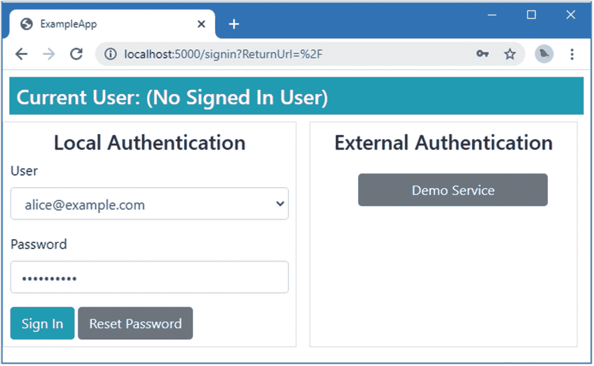

图 23-1。

运行示例应用

## 存储认证令牌

一些外部认证服务提供可用于访问附加 API 的令牌。一般来说，应用请求的范围中包含了一组必需的 API，这样当用户通过认证时，就可以提示用户授予适当的访问权限。在认证过程中用来获取用户数据的访问令牌可以用来访问其他 API。

OAuth 认证过程产生的*访问令牌*和 Identity 支持的*认证令牌*之间存在术语冲突。之所以出现这种情况，是因为 Identity 提供了一个通用特性，可以用来存储任何认证过程产生的令牌，尽管 OAuth 已经成为事实上的标准。

Understanding The Cost of Additional APIs

主要的认证服务产生可以广泛使用的令牌。特别是谷歌，它有各种各样的 API，可以访问它提供的几乎所有服务，包括访问电子邮件、日历和搜索数据。

但是使用这些 API 的成本可能很高。一些提供商不仅对每次访问 API 收费，而且通常还提供付费验证服务，在此期间，服务提供商评估应用以确保用户数据得到适当处理。这可能很昂贵——在撰写本文时，谷歌验证过程可能花费 15，000 至 75，000 美元，并需要大量的工作。

出于这个原因，我在本章中创建了一个模拟 API 来演示令牌是如何存储和使用的。我没有演示 Google 或脸书 API 的使用，尽管我为这些服务创建了认证处理程序。

### 创建模拟的外部 API 控制器

为了模拟一个使用访问令牌进行验证的 API，将一个名为`DemoExternalApiController.cs`的类文件添加到`Controllers`文件夹中，并使用它来定义清单 [23-3](#PC3) 中所示的控制器。

```cs
using Microsoft.AspNetCore.Mvc;
using System.Collections.Generic;

namespace ExampleApp.Controllers {

    [ApiController]
    [Route("api/[controller]")]
    public class DemoExternalApiController: Controller {

        private Dictionary<string, string> data
            = new Dictionary<string, string> {
                { "token1", "This is Alice's external data" },
                { "token2", "This is Dora's external data" },
            };

        [HttpGet]
        public IActionResult GetData([FromHeader] string authorization) {
            if (!string.IsNullOrEmpty(authorization)) {
                string token = authorization?[7..];
                if (!string.IsNullOrEmpty(token) && data.ContainsKey(token)) {
                    return Json(new { data = data[token] });
                }
            }
            return NotFound();
        }
    }
}

Listing 23-3.The Contents of the DemoExternalApiController.cs File in the Controllers Folder

```

控制器定义了一个动作，该动作基于包含在`Authorization`请求头中的令牌提供一个 JSON 对象。这是一个简单的例子，但是它提供了足够的功能来演示访问令牌的使用。

### 扩展用户类

为了准备存储访问令牌，将属性添加到`AppUser`类，如清单 [23-4](#PC4) 所示。

```cs
using System;
using System.Collections.Generic;
using System.Security.Claims;
using Microsoft.AspNetCore.Identity;
using Microsoft.AspNetCore.Authentication;

namespace ExampleApp.Identity {
    public class AppUser {

        public string Id { get; set; } = Guid.NewGuid().ToString();

        public string UserName { get; set; }

        public string NormalizedUserName { get; set; }

        public string EmailAddress { get; set; }
        public string NormalizedEmailAddress { get; set; }
        public bool EmailAddressConfirmed { get; set; }

        public string PhoneNumber { get; set; }
        public bool PhoneNumberConfirmed { get; set; }

        public string FavoriteFood { get; set; }
        public string Hobby { get; set; }

        public IList<Claim> Claims { get; set; }

        public string SecurityStamp { get; set; }
        public string PasswordHash { get; set; }

        public bool CanUserBeLockedout { get; set; } = true;
        public int FailedSignInCount { get; set; }
        public DateTimeOffset? LockoutEnd { get; set; }

        public bool TwoFactorEnabled { get; set; }
        public bool AuthenticatorEnabled { get; set; }
        public string AuthenticatorKey { get; set; }

        public IList<UserLoginInfo> UserLogins { get; set; }
        public IList<(string provider, AuthenticationToken token)>
            AuthTokens { get; set; }
    }
}

Listing 23-4.Adding a Property in the AppUser.cs File in the Identity Folder

```

Identity 提供了`AuthenticationToken`类，它定义了`Name`和`Value`属性。为了存储令牌，我需要能够跟踪每个令牌的来源，所以为了简单起见，我使用了一个`(string, AuthenticationToken)`元组列表。

### 扩展用户存储

`IUserAuthenticationTokenStore<T>`接口由可以管理访问令牌的用户存储实现，其中`T`是用户类。该接口定义了表 [23-1](#Tab1) 中所示的方法。这些方法定义了一个名为`canceltoken`的`CancellationToken`参数，用于在异步任务被取消时接收通知。

表 23-1。

IUserAuthenticationTokenStore<t>方法</t>

<colgroup><col class="tcol1 align-left"> <col class="tcol2 align-left"></colgroup> 
| 

名字

 | 

描述

 |
| --- | --- |
| `GetTokenAsync(user, provider, name, cancelToken)` | 此方法返回由指定提供程序生成的授予具有指定名称的用户的令牌。 |
| `SetTokenAsync(user, provider, name, cancelToken)` | 此方法为用户存储一个具有指定提供者和名称的令牌。 |
| `RemoveTokenAsync(user, provider, name, cancelToken)` | 此方法为指定用户移除具有指定提供程序和名称的令牌。 |

将名为`UserStoreAuthenticationTokens.cs`的类文件添加到`Identity/Store`文件夹中，并使用它来定义清单 [23-5](#PC5) 中所示的分部类。

```cs
using Microsoft.AspNetCore.Authentication;
using Microsoft.AspNetCore.Identity;
using System.Collections.Generic;
using System.Linq;
using System.Threading;
using System.Threading.Tasks;

namespace ExampleApp.Identity.Store {
    public partial class UserStore : IUserAuthenticationTokenStore<AppUser> {

        public Task<string> GetTokenAsync(AppUser user, string loginProvider,
                string name, CancellationToken cancelToken) {
            return Task.FromResult(user.AuthTokens?
                .FirstOrDefault(t => t.provider == loginProvider
                    && t.token.Name == name).token.Value);
        }

        public Task RemoveTokenAsync(AppUser user, string loginProvider,
                string name, CancellationToken cancelToken) {
            if (user.AuthTokens!= null) {
                user.AuthTokens= user.AuthTokens.Where(t =>
                   t.provider != loginProvider
                       && t.token.Name != name).ToList();
            }
            return Task.CompletedTask;
        }

        public Task SetTokenAsync(AppUser user, string loginProvider,
             string name, string value, CancellationToken cancelToken) {
            if (user.AuthTokens== null) {
                user.AuthTokens= new List<(string, AuthenticationToken)>();
            }
            user.AuthTokens.Add((loginProvider, new AuthenticationToken {
                Name = name, Value = value }));
            return Task.CompletedTask;
        }
    }
}

Listing 23-5.The Contents of the UserStoreAuthenticationTokens.cs File in the Identity/Store Folder

```

接口的实现使用清单 [23-4](#PC4) 中定义的属性将访问令牌存储为元组。

### 管理认证令牌

`UserManager<T>`类提供了表 [23-2](#Tab2) 中描述的成员，用于管理用户存储中的认证令牌。

表 23-2。

用于管理认证令牌的用户管理器<t>成员</t>

<colgroup><col class="tcol1 align-left"> <col class="tcol2 align-left"></colgroup> 
| 

名字

 | 

描述

 |
| --- | --- |
| `SupportsUserAuthenticationTokens` | 如果用户存储实现了`IUserAuthenticationTokenStore<T>`接口，则该属性返回 true。 |
| `GetAuthenticationTokenAsync(user, provider, name)` | 该方法通过调用用户存储的`GetTokenAsync`方法来检索令牌。 |
| `SetAuthenticationTokenAsync(user, provider, name)` | 该方法通过调用用户存储的`SetTokenAsync`方法来存储令牌，之后执行更新序列。 |
| `RemoveAuthenticationTokenAsync(user, provider, name)` | 该方法通过调用用户存储的`RemoveTokenAsync`方法来删除令牌，之后应用更新序列。 |

`SignInManager<T>`类还定义了一个用于管理认证令牌的方法，如表 [23-3](#Tab3) 中所述。

表 23-3。

用于管理认证令牌的 SignInManager <t>方法</t>

<colgroup><col class="tcol1 align-left"> <col class="tcol2 align-left"></colgroup> 
| 

名字

 | 

描述

 |
| --- | --- |
| `UpdateExternalAuthenticationTokensAsync(login)` | 该方法将访问令牌存储在特定的`ExternalLoginInfo`对象中，并使用用户管理器的`SetAuthenticationTokenAsync`方法存储它们。 |

### 存储外部认证访问令牌

由`SignInManager<T>`类提供的`UpdateExternalAuthenticationTokensAsync`方法用在`ExternalLoginInfo.AuthenticationTokens`属性中找到的认证令牌填充用户存储。在清单 [23-6](#PC6) 中，我已经更新了外部认证处理程序来存储它接收到的令牌。

```cs
...
public virtual async Task<bool> HandleRequestAsync() {
    if (Context.Request.Path.Equals(Options.RedirectPath)) {
        string authCode = await GetAuthenticationCode();
        (string token, string state) = await GetAccessToken(authCode);
        if (!string.IsNullOrEmpty(token)) {
            IEnumerable<Claim> claims = await GetUserData(token);
            if (claims != null) {
                ClaimsIdentity identity = new ClaimsIdentity(Scheme.Name);
                identity.AddClaims(claims);
                ClaimsPrincipal claimsPrincipal
                    = new ClaimsPrincipal(identity);
                AuthenticationProperties props =
                    PropertiesFormatter.Unprotect(state);
                props.StoreTokens(new[] { new AuthenticationToken {
                    Name = "access_token", Value = token } });
                await Context.SignInAsync(IdentityConstants.ExternalScheme,
                    claimsPrincipal, props);
                Context.Response.Redirect(props.RedirectUri);
                return true;
            }
        }
        Context.Response.Redirect(string.Format(Options.ErrorUrlTemplate,
            ErrorMessage));
        return true;
    }
    return false;
}
...

Listing 23-6.Storing Tokens in the ExternalAuthHandler.cs File in the Custom Folder

```

清单 [23-6](#PC6) 中的新语句使用`StoreTokens`扩展方法将从 OAuth 认证过程获得的访问令牌添加到`AuthenticationProperties`对象中。这是可用于管理令牌的扩展方法之一，如表 [23-4](#Tab4) 所述。

表 23-4。

有用的认证属性令牌扩展方法

<colgroup><col class="tcol1 align-left"> <col class="tcol2 align-left"></colgroup> 
| 

名字

 | 

描述

 |
| --- | --- |
| `GetTokens()` | 该方法返回存储在`AuthenticationProperties`对象中的认证令牌。 |
| `GetTokenValue(name)` | 该方法返回具有指定名称的标记的值，如果没有这样的标记，则返回`null`。 |
| `StoreTokens(tokens)` | 这个方法存储表示为一个`IEnumerable<AuthenticationToken>`序列的标记。 |
| `UpdateTokenValue(name, value)` | 此方法更新特定令牌的值。 |

认证处理程序将令牌添加到`AuthenticationProperties`对象中，然后当用户登录后，`SignInManager<T>`服务可以使用这些令牌。在清单 [23-7](#PC7) 中，我使用`SignInManager<T>.UpdateExternalAuthenticationTokensAsync`方法检索令牌并将它们添加到用户存储中。

```cs
...
public async Task<IActionResult> OnGetCorrelate(string returnUrl) {
    ExternalLoginInfo info = await SignInManager.GetExternalLoginInfoAsync();

    AppUser user = await UserManager.FindByLoginAsync(info.LoginProvider,
        info.ProviderKey);
    if (user == null) {
        string externalEmail =
            info.Principal.FindFirst(ClaimTypes.Email)?.Value ?? string.Empty;
        user = await UserManager.FindByEmailAsync(externalEmail);
        if (user == null) {
            return RedirectToPage("/ExternalAccountConfirm",
                new { returnUrl });
        } else {
            UserLoginInfo firstLogin = user?.UserLogins?.FirstOrDefault();
            if (firstLogin != null && firstLogin.LoginProvider
                    != info.LoginProvider) {
                return RedirectToPage(new {
                    error =
                    $"{firstLogin.ProviderDisplayName} Authentication Expected"
                });
            } else {
                await UserManager.AddLoginAsync(user, info);
            }
        }
    }
    SignInResult result = await SignInManager.ExternalLoginSignInAsync(
            info.LoginProvider, info.ProviderKey, false, false);
    await SignInManager.UpdateExternalAuthenticationTokensAsync(info);
    if (result.Succeeded) {
        return RedirectToPage("ExternalSignIn", "Confirm",
            new { info.ProviderDisplayName, returnUrl });
    } else if (result.RequiresTwoFactor) {
        string postSignInUrl = this.Url.Page("/ExternalSignIn", "Confirm",
            new { info.ProviderDisplayName, returnUrl });
        return RedirectToPage("/SignInTwoFactor",
            new { returnUrl = postSignInUrl });
    }
    return RedirectToPage(new { error = true, returnUrl });
}
...

Listing 23-7.Storing Authentication Tokens in the ExternalSignIn.cshtml.cs File in the Pages Folder

```

在外部登录后创建帐户时，我也需要执行相同的任务，如清单 [23-8](#PC8) 所示。

```cs
...
public async Task<IActionResult> OnPostAsync(string username) {
    ExternalLoginInfo info = await SignInManager.GetExternalLoginInfoAsync();

    if (info != null) {
        ClaimsPrincipal external = info.Principal;
        AppUser.UserName = username;
        AppUser.EmailAddress = external.FindFirstValue(ClaimTypes.Email);
        AppUser.EmailAddressConfirmed = true;
        IdentityResult result = await UserManager.CreateAsync(AppUser);
        if (result.Succeeded) {
            await UserManager.AddClaimAsync(AppUser,
                new Claim(ClaimTypes.Role, "User"));
            await UserManager.AddLoginAsync(AppUser, info);
            await SignInManager.ExternalLoginSignInAsync(info.LoginProvider,
                info.ProviderKey, false);
            await SignInManager.UpdateExternalAuthenticationTokensAsync(info);
            return Redirect(ReturnUrl);
        } else {
            foreach (IdentityError err in result.Errors) {
                ModelState.AddModelError(string.Empty, err.Description);
            }
        }
    } else {
        ModelState.AddModelError(string.Empty, "No external login found");
    }
    return Page();
}
...

Listing 23-8.Storing Tokens in the ExternalAccountConfirm.cshtml.cs File in the Pages Folder

```

结果是，用户存储中填充了由认证处理程序提供的认证令牌。

### 使用存储的认证令牌

应用可以通过`UserManager<T>`类访问存储的令牌，并使用它们向 API 发送请求，API 将使用它们来验证请求。在`Pages`文件夹中创建一个名为`ApiData.cshtml`的 Razor 页面，并添加清单 [23-9](#PC9) 中所示的内容。

```cs
@page
@model ExampleApp.Pages.ApiDataModel
@attribute [Microsoft.AspNetCore.Authorization.Authorize]
<h4 class="bg-info text-center text-white m-2 p-2">Data: @Model.Data</h4>

Listing 23-9.The Contents of the ApiData.cshtml File in the Pages Folder

```

页面的视图部分显示名为`Data`的页面模型属性的值。为了实现页面模型，将清单 [23-10](#PC10) 中所示的代码添加到`Pages`文件夹中的`ApiData.cshtml.cs`文件中。(如果您使用的是 Visual Studio 代码，则必须创建该文件。)

```cs
using ExampleApp.Identity;
using Microsoft.AspNetCore.Authentication;
using Microsoft.AspNetCore.Identity;
using Microsoft.AspNetCore.Mvc.RazorPages;
using System.Net.Http;
using System.Net.Http.Headers;
using System.Text.Json;
using System.Threading.Tasks;

namespace ExampleApp.Pages {

    public class ApiDataModel : PageModel {

        public ApiDataModel(UserManager<AppUser> userManager) {
            UserManager = userManager;
        }

        public UserManager<AppUser> UserManager { get; set; }

        public string Data { get; set; } = "No Data";

        public async Task OnGetAsync () {
            AppUser user = await UserManager.GetUserAsync(HttpContext.User);
            if (user != null) {
                string token = await UserManager.GetAuthenticationTokenAsync
                    (user, "demoAuth", "access_token");
                if (!string.IsNullOrEmpty(token)) {
                    HttpRequestMessage msg = new HttpRequestMessage(
                        HttpMethod.Get,
                        "http://localhost:5000/api/DemoExternalApi");
                    msg.Headers.Authorization = new AuthenticationHeaderValue
                        ("Bearer", token);
                    HttpResponseMessage resp
                        = await new HttpClient().SendAsync(msg);
                    JsonDocument doc = JsonDocument.Parse(await
                        resp.Content.ReadAsStringAsync());
                    Data = doc.RootElement.GetString("data");
                }
            }
        }
    }
}

Listing 23-10.The Contents of the ApiData.cshtml.cs File in the Pages Folder

```

GET handler 方法检索由`demoAuth`方案产生的授权令牌，并将其用于对演示控制器的请求中的`Authorization`头。来自控制器的响应被解析成 JSON，并用于设置页面视图部分显示的`Data`属性的值。

重启 ASP.NET Core，请求`http://localhost:5000/signout`，点击退出按钮退出应用。请求`http://localhost:5000/apidata`，这将触发一个挑战响应。点击演示服务按钮登录外部认证服务，并使用`alice@example.com`作为电子邮件地址和`myexternalpassword`作为密码登录。从您的验证器应用输入代码，单击登录按钮，然后在显示登录确认页面时单击继续按钮。一旦您登录到应用，您将被重定向到`/apidata` URL，它将使用存储的令牌从演示控制器获取数据。图 [23-2](#Fig2) 显示了整个顺序。

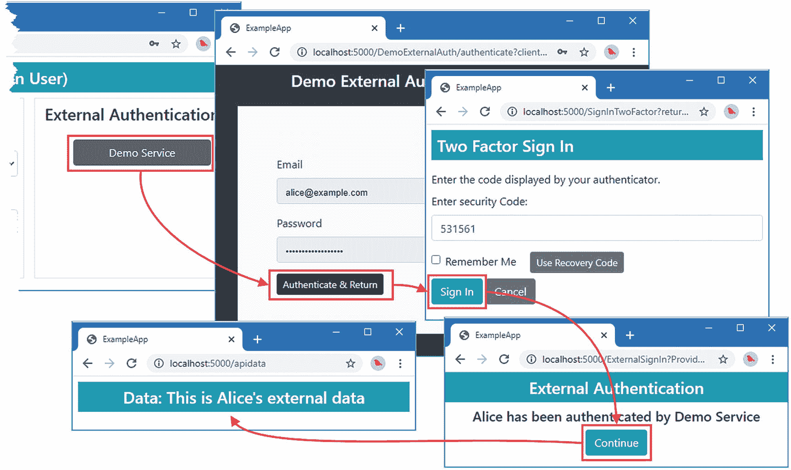

图 23-2。

使用存储的认证令牌

## 增加对真实外部认证服务的支持

现在，所有的构建模块都已就绪，我可以添加对真正的外部认证服务的支持了。在接下来的章节中，我扩展了在第 [22 章](22.html)中创建的外部认证处理程序，以支持 Google 和脸书提供的 OAuth 服务，这些服务提供了最流行的认证服务。

我还没有为 Twitter 创建一个认证处理程序，它也广泛用于认证。Twitter 确实提供认证服务，但它使用的是 OAuth 规范的旧版本，比大多数服务使用的更新版本更复杂。关于如何设置微软为 ASP.NET Core 提供的内置 Twitter 认证处理程序的详细信息，请参见第 [11](11.html) 章。

### 支持谷歌认证

要注册示例应用，请导航至 [`https://console.developers.google.com`](https://console.developers.google.com) ，并使用 Google 帐户登录。单击 OAuth 同意屏幕选项，并为用户类型选择外部，这将允许任何 Google 帐户对您的应用进行认证。

Tip

您可能会看到一条消息，告诉您还没有可用的 API。当您只需要验证用户时，这并不重要。

单击 Create，您将看到一个表单。在应用名称字段中输入 **ExampleApp** ，并在表单的用户支持电子邮件和开发人员联系信息部分输入您的电子邮件地址。对于示例应用，表单的其余部分可以留空。

单击 Save and Continue，您将看到 scope selection 屏幕，该屏幕用于指定您的应用需要的作用域。

单击 Add 或 Remove Scopes 按钮，您将看到您的应用可以请求的作用域列表。选择三个范围:`openid`、`auth/userinfo.email`和`auth/userinfo.profile`。单击“更新”按钮保存您的选择。

单击保存并继续返回 OAuth 同意屏幕，然后单击返回仪表板。图 [23-3](#Fig3) 显示了配置同意屏幕的顺序。

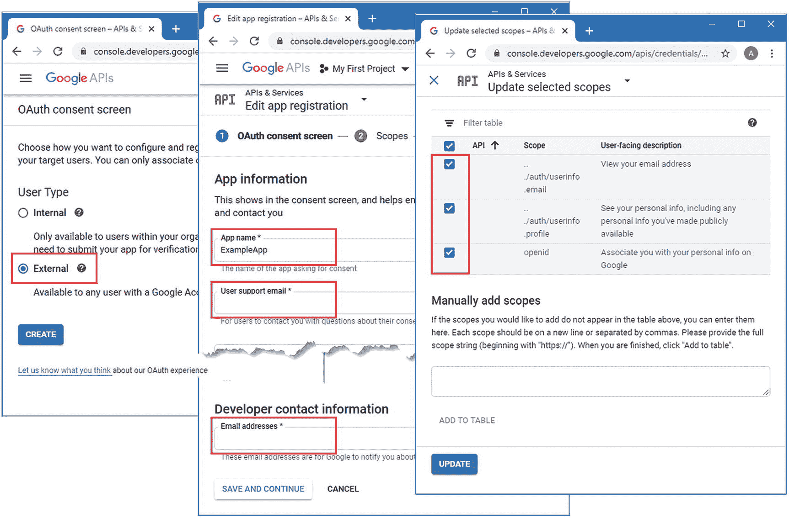

图 23-3。

配置 Google OAuth 同意屏幕

Tip

你可以在 [`https://developers.google.com/identity/protocols/oauth2/web-server`](https://developers.google.com/identity/protocols/oauth2/web-server) 找到 OAuth 的 Google 文档。

#### 配置应用凭据

下一步是为应用创建凭证。单击凭据链接，单击页面顶部的创建凭据按钮，并从选项列表中选择 OAuth 客户端 ID。

从应用类型列表中选择 Web 应用，并在名称字段中输入 **ExampleApp** 。在授权重定向 URIs 部分点击添加 URL，并在文本字段中输入**http://localhost:5000/sign in-Google**。点击创建按钮，你将看到你的应用的客户端 ID 和客户端密码，如图 [23-4](#Fig4) (虽然我已经模糊了细节，因为这些是我的账户)。记下 ID 和密码。

Understanding The Redirect URL

为了配置示例应用，我指定了 URL `http://localhost:5000/signin-google`。重定向 URL 由浏览器评估，由于浏览器和 ASP.NET Core 应用运行在同一台机器上，在 URL 中使用 localhost 意味着由 Google 服务执行的重定向将针对示例应用。

对于真正的应用，您必须使用包含主机名的 URL，该主机名可以被用户的浏览器正确地评估。对于行业应用，这可以是公司主机名；对于面向互联网的应用，这可以是在全球 DNS 中注册的名称。除非在开发期间，否则不应该使用 localhost。

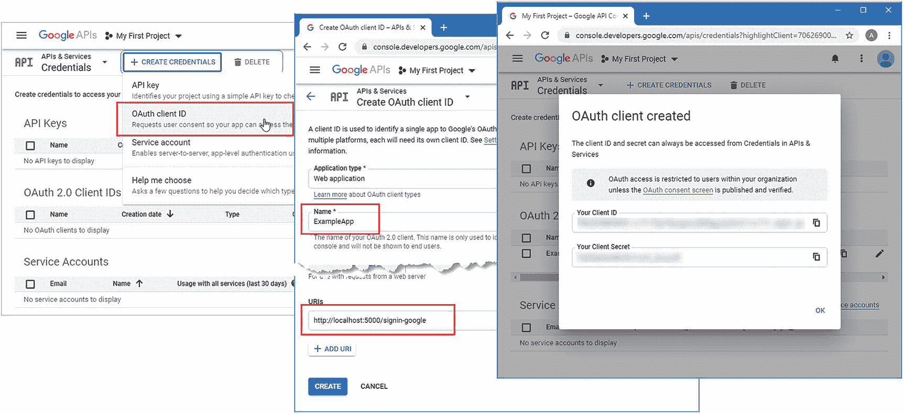

图 23-4。

配置应用凭据

#### 创建认证处理程序

下一步是创建一个认证处理程序，它将使用 Google OAuth 服务对用户进行认证。将名为`GoogleHandler.cs`的类文件添加到`Custom`文件夹中，代码如清单 [23-11](#PC11) 所示。

```cs
using Microsoft.AspNetCore.Authentication;
using Microsoft.AspNetCore.DataProtection;
using Microsoft.AspNetCore.Http;
using Microsoft.Extensions.Logging;
using Microsoft.Extensions.Options;
using System;
using System.Collections.Generic;
using System.Security.Claims;
using System.Text.Json;
using System.Threading.Tasks;

namespace ExampleApp.Custom {

    public class GoogleOptions : ExternalAuthOptions {
        public override string RedirectPath { get; set; } = "/signin-google";
        public override string AuthenticationUrl =>
            "https://accounts.google.com/o/oauth2/v2/auth";
        public override string ExchangeUrl =>
            "https://www.googleapis.com/oauth2/v4/token";
        public override string DataUrl =>
             "https://www.googleapis.com/oauth2/v2/userinfo";
    }

    public class GoogleHandler : ExternalAuthHandler {

        public GoogleHandler(IOptions<GoogleOptions> options,
            IDataProtectionProvider dp,
            ILogger<GoogleHandler> logger) : base(options, dp, logger) {}

        protected override IEnumerable<Claim> GetClaims(JsonDocument jsonDoc) {
            List<Claim> claims = new List<Claim>();
            claims.Add(new Claim(ClaimTypes.NameIdentifier,
                jsonDoc.RootElement.GetString("id")));
            claims.Add(new Claim(ClaimTypes.Name,
                jsonDoc.RootElement.GetString("name")?.Replace(" ", "_")));
            claims.Add(new Claim(ClaimTypes.Email,
               jsonDoc.RootElement.GetString("email")));
            return claims;
        }

        protected async override Task<string> GetAuthenticationUrl(
                AuthenticationProperties properties) {
            if (CheckCredentials()) {
                return await base.GetAuthenticationUrl(properties);
            } else {
                return string.Format(Options.ErrorUrlTemplate, ErrorMessage);
            }
        }

        private bool CheckCredentials() {
            string secret = Options.ClientSecret;
            string id = Options.ClientId;
            string defaultVal = "ReplaceMe";
            if (string.IsNullOrEmpty(secret) || string.IsNullOrEmpty(id)
                || defaultVal.Equals(secret) || defaultVal.Equals(secret)) {
                    ErrorMessage = "External Authentication Secret or ID Not Set";
                    Logger.LogError("External Authentication Secret or ID Not Set");
                return false;
            }
            return true;
        }
    }
}

Listing 23-11.The Contents of the GoogleHandler.cs File in the Custom Folder

```

该处理程序是从第 [22 章](22.html)中创建的`ExternalAuthHandler`类派生而来的。为了支持 Google 服务，我定义了一个新的回调 URL，并为流程的每个部分指定了 URL，我在表 [23-5](#Tab5) 中总结了这些。

表 23-5。

Google OAuth URLs

<colgroup><col class="tcol1 align-left"> <col class="tcol2 align-left"></colgroup> 
| 

步骤

 | 

统一资源定位器

 |
| --- | --- |
| 证明 | `https://accounts.google.com/o/oauth2/v2/auth` |
| 代币交换 | `https://www.googleapis.com/oauth2/v4/token` |
| 用户数据 | `https://www.googleapis.com/oauth2/v2/userinfo` |

当用户登录应用时，我还必须将一组不同的 JSON 属性映射到声明。每个认证服务以不同的格式返回数据，我发现编写认证处理程序最简单的方法是打印出 JSON 响应并挑选出我需要的属性。对于这个例子，我使用了`id`、`name`和`email`属性。

注意，我在创建`Name`声明时替换了所有空格，如下所示:

```cs
...
claims.Add(new Claim(ClaimTypes.Name,
    jsonDoc.RootElement.GetString("name")?.Replace(" ", "_")));
...

```

谷歌数据将包含一个名称，如`Adam Freeman`，这不会被接受为一个 Identity 帐户名称。为了避免验证错误，我用下划线(`_`字符)代替了空格。

我还在清单 [23-11](#PC11) 中定义了一个名为`CheckCredentials`的方法。您必须创建自己的客户端 ID 和客户端密码，并使用它们来配置应用。在`GetAuthenticationUrl`方法中调用了`CheckCredentials`方法，如果没有设置凭证，就会显示一个错误。

#### 配置应用

最后一步是注册认证处理程序并指定客户机 ID 和秘密，如清单 [23-12](#PC13) 所示。使用您在上一节中创建的 ID 和密码，而不是清单中的占位符字符串。

```cs
...
public void ConfigureServices(IServiceCollection services) {
    services.AddSingleton<ILookupNormalizer, Normalizer>();
    services.AddSingleton<IUserStore<AppUser>, UserStore>();
    services.AddSingleton<IEmailSender, ConsoleEmailSender>();
    services.AddSingleton<ISMSSender, ConsoleSMSSender>();
    services.AddSingleton<IPasswordHasher<AppUser>, SimplePasswordHasher>();
    services.AddSingleton<IRoleStore<AppRole>, RoleStore>();

    services.AddOptions<ExternalAuthOptions>();

    services.Configure<GoogleOptions>(opts => {
        opts.ClientId = "ReplaceMe";
        opts.ClientSecret = "ReplaceMe";
    });

    // ...statements omitted for brevity...

    services.AddAuthentication(opts => {
        opts.DefaultScheme = IdentityConstants.ApplicationScheme;
        opts.AddScheme<ExternalAuthHandler>("demoAuth", "Demo Service");
        opts.AddScheme<GoogleHandler>("google", "Google");
    }).AddCookie(IdentityConstants.ApplicationScheme, opts => {
        opts.LoginPath = "/signin";
        opts.AccessDeniedPath = "/signin/403";
    })
    .AddCookie(IdentityConstants.TwoFactorUserIdScheme)
    .AddCookie(IdentityConstants.TwoFactorRememberMeScheme)
    .AddCookie(IdentityConstants.ExternalScheme);

    services.AddAuthorization(opts => {
        AuthorizationPolicies.AddPolicies(opts);
        opts.AddPolicy("Full2FARequired", builder => {
            builder.RequireClaim("amr", "mfa");
        });
    });
    services.AddRazorPages();
    services.AddControllersWithViews();
}
...

Listing 23-12.Configuring the Application in the Startup.cs File in the ExampleApp Folder

```

`Configure`方法用于配置将通过依赖注入提供给认证处理器的`GoogleOptions`对象。清单中的另一个变化是用`AddScheme`方法注册了 Google 认证处理程序。

Using Service-Specific Query String Parameters

大多数服务支持认证重定向 URL 中控制附加功能的可选查询字符串。Google 服务的一个有用选项是`login_hint`，它可以被设置为待认证用户的电子邮件地址。谷歌将使用电子邮件地址来简化认证过程。

重启 ASP.NET Core 并请求`http://localhost:5000/secret`。当被询问时，点击谷歌按钮，你将被提示使用谷歌账户登录并授权访问该应用，如图 [23-5](#Fig5) 所示。

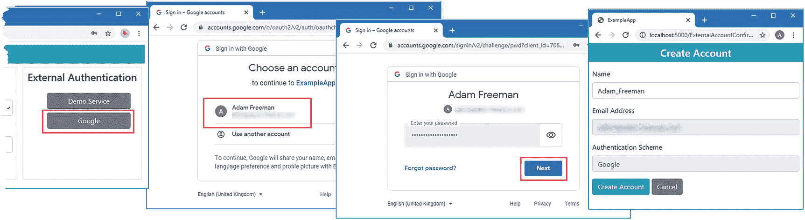

图 23-5。

使用 Google 认证用户

通过认证后，您将看到创建帐户屏幕，其中显示了 Google 帐户的名称和电子邮件地址。单击“创建帐户”按钮创建新的 Identity 帐户并重定向到受保护的资源。您可以看到通过请求`http://localhost:5000/users`已经创建的帐户，这将显示新创建的帐户以及用于播种用户存储的帐户，如图 [23-6](#Fig6) 所示。

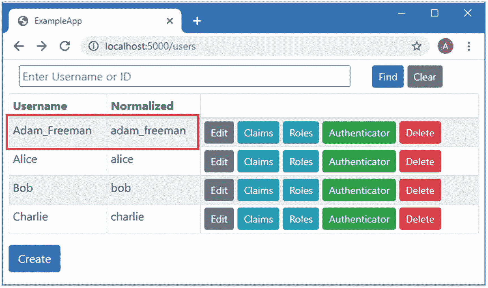

图 23-6。

检查新创建的帐户

### 支持脸书认证

要在脸书注册应用，请前往 [`https://developers.facebook.com/apps`](https://developers.facebook.com/apps) 并使用您的脸书帐户登录。单击创建应用按钮，从列表中选择构建互联体验，然后单击继续按钮。在应用显示名称字段中输入 **ExampleApp** ,然后点击创建应用按钮。图 [23-7](#Fig7) 显示了该顺序。

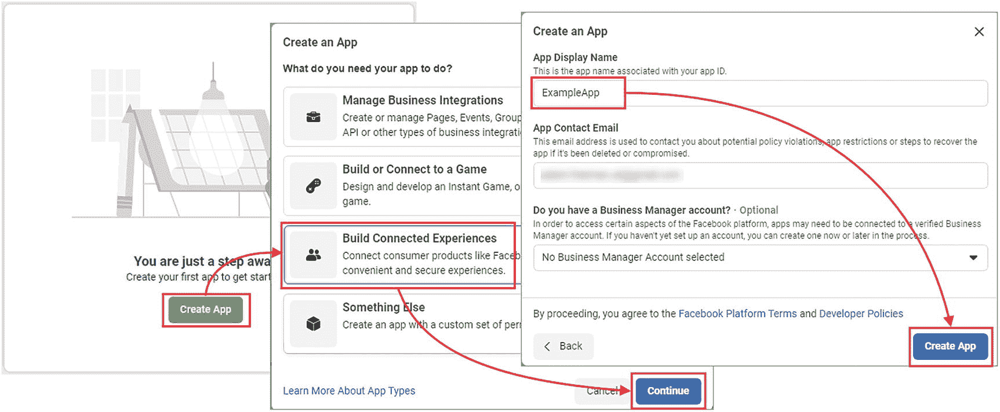

图 23-7。

创建新的应用

一旦您创建了脸书应用，您将返回到开发人员仪表板，并显示可选产品列表。找到脸书登录并点击设置按钮。你会看到一组快速启动选项，但它们可以被忽略，因为重要的配置选项显示在仪表盘显示屏左侧的 Facebook 登录➤设置部分，如图 [23-8](#Fig8) 所示。

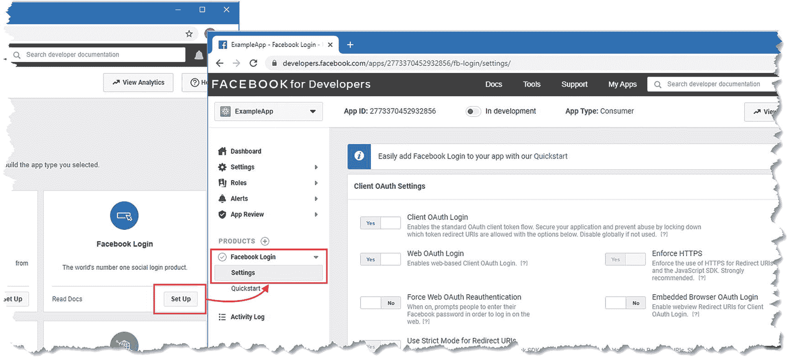

图 23-8。

脸书登录设置

示例应用不需要修改配置，因为脸书使得在项目开发过程中使用 OAuth 变得很容易。当您准备好部署应用时，您需要返回到这个页面并完成您的配置，包括提供面向公众的重定向 URL，它将取代我在本章中使用的 localhost URL。配置选项的详细信息包含在脸书登录文档中，可在 [`https://developers.facebook.com/docs/facebook-login`](https://developers.facebook.com/docs/facebook-login) 找到。

#### 获取应用凭据

导航到设置区域中的基本部分以获得应用 ID 和应用秘密值，如图 [23-9](#Fig9) 所示，这是脸书用于表示客户端 ID 和秘密的术语。(在您点按“显示”按钮之前，App Secret 值是隐藏的。)记下这些值，这是配置应用所必需的。

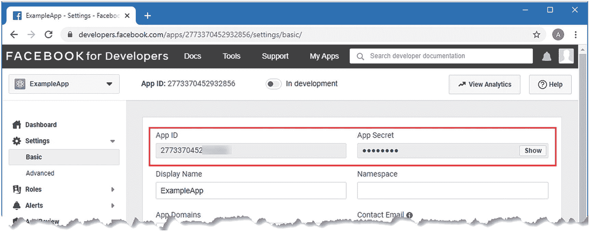

图 23-9。

外部认证的应用凭据

#### 创建认证处理程序

将名为`FacebookHandler.cs`的类文件添加到`Custom`文件夹中，并使用它来定义清单 [23-13](#PC14) 中所示的类。

```cs
using Microsoft.AspNetCore.Authentication;
using Microsoft.AspNetCore.DataProtection;
using Microsoft.AspNetCore.Http;
using Microsoft.Extensions.Logging;
using Microsoft.Extensions.Options;
using System;
using System.Collections.Generic;
using System.Security.Claims;
using System.Text.Json;

namespace ExampleApp.Custom {

    public class FacebookOptions : ExternalAuthOptions {
        public override string RedirectPath { get; set; } = "/signin-facebook";
        public override string Scope { get; set; } = "email";

        public override string AuthenticationUrl =>
            "https://www.facebook.com/v8.0/dialog/oauth";
        public override string ExchangeUrl =>
            "https://graph.facebook.com/v8.0/oauth/access_token";
        public override string DataUrl =>
            "https://graph.facebook.com/v8.0/me?fields=name,email";
    }

    public class FacebookHandler : ExternalAuthHandler {

        public FacebookHandler(IOptions<FacebookOptions> options,
            IDataProtectionProvider dp,
            ILogger<FacebookHandler> logger) : base(options, dp, logger) {

            string secret = Options.ClientSecret;
            if (string.IsNullOrEmpty(secret) || "MyClientSecret"
                    .Equals(secret, StringComparison.OrdinalIgnoreCase)) {
                logger.LogError("External Authentication Secret Not Set");
            }
        }

        protected override IEnumerable<Claim> GetClaims(JsonDocument jsonDoc) {
            List<Claim> claims = new List<Claim>();

            claims.Add(new Claim(ClaimTypes.NameIdentifier,
                jsonDoc.RootElement.GetString("id")));
            claims.Add(new Claim(ClaimTypes.Name,
                jsonDoc.RootElement.GetString("name")?.Replace(" ", "_")));
            claims.Add(new Claim(ClaimTypes.Email,
                jsonDoc.RootElement.GetString("email")));
            return claims;
        }
    }
}

Listing 23-13.The Contents of the FacebookHandler.cs File in the Custom Folder

```

该处理程序是从第 [22 章](22.html)中创建的`ExternalAuthHandler`类派生而来的。为了支持脸书服务，我定义了一个新的回调 URL，并为流程的每个部分指定了 URL，我已经在表 [23-6](#Tab6) 中总结了这些。

表 23-6。

脸书 OAuth 网址

<colgroup><col class="tcol1 align-left"> <col class="tcol2 align-left"></colgroup> 
| 

步骤

 | 

统一资源定位器

 |
| --- | --- |
| 证明 | [T2`https://www.facebook.com/v8.0/dialog/oauth`](https://www.facebook.com/v8.0/dialog/oauth) |
| 代币交换 | [T2`https://graph.facebook.com/v8.0/oauth/access_token`](https://graph.facebook.com/v8.0/oauth/access_token) |
| 用户数据 | [T2`https://graph.facebook.com/v8.0/me`](https://graph.facebook.com/v8.0/me) |

脸书认证服务要求使用`fields`查询字符串参数选择单个数据字段，这就是为什么`DataUrl`配置选项的值如下所示:

```cs
...
https://graph.facebook.com/v8.0/me?fields=name,email
...

```

对于示例应用，我需要`name`和`email`字段。在 [`https://developers.facebook.com/docs/graph-api/reference/user`](https://developers.facebook.com/docs/graph-api/reference/user) 中描述了完整的字段集。

#### 配置应用

要配置应用，将清单 [23-14](#PC16) 中所示的语句添加到`Startup`类的`ConfigureServices`方法中，确保您使用的客户端 ID 和密码在您注册应用时显示在脸书开发者仪表板中。

```cs
...
public void ConfigureServices(IServiceCollection services) {
    services.AddSingleton<ILookupNormalizer, Normalizer>();
    services.AddSingleton<IUserStore<AppUser>, UserStore>();
    services.AddSingleton<IEmailSender, ConsoleEmailSender>();
    services.AddSingleton<ISMSSender, ConsoleSMSSender>();
    services.AddSingleton<IPasswordHasher<AppUser>, SimplePasswordHasher>();
    services.AddSingleton<IRoleStore<AppRole>, RoleStore>();

    services.AddOptions<ExternalAuthOptions>();

    services.Configure<GoogleOptions>(opts => {
        opts.ClientId = "ReplaceMe";
        opts.ClientSecret = "ReplaceMe";
    });

    services.Configure<FacebookOptions>(opts => {
        opts.ClientId = "ReplaceMe";
        opts.ClientSecret = "ReplaceMe";
    });

    // ...statements omitted for brevity...

    services.AddAuthentication(opts => {
        opts.DefaultScheme = IdentityConstants.ApplicationScheme;
        opts.AddScheme<ExternalAuthHandler>("demoAuth", "Demo Service");
        opts.AddScheme<GoogleHandler>("google", "Google");
        opts.AddScheme<FacebookHandler>("facebook", "Facebook");
    }).AddCookie(IdentityConstants.ApplicationScheme, opts => {
        opts.LoginPath = "/signin";
        opts.AccessDeniedPath = "/signin/403";
    })
    .AddCookie(IdentityConstants.TwoFactorUserIdScheme)
    .AddCookie(IdentityConstants.TwoFactorRememberMeScheme)
    .AddCookie(IdentityConstants.ExternalScheme);

    services.AddAuthorization(opts => {
        AuthorizationPolicies.AddPolicies(opts);
        opts.AddPolicy("Full2FARequired", builder => {
            builder.RequireClaim("amr", "mfa");
        });
    });
    services.AddRazorPages();
    services.AddControllersWithViews();
}
...

Listing 23-14.Configuring the Application in the Startup.cs File in the ExampleApp Folder

```

重启 ASP.NET Core，请求`http://localhost:5000/signout`，点击退出按钮。这将确保通过谷歌服务执行的外部登录不会被使用。请求`http://localhost:5000/secret`，您将被要求登录。点击脸书按钮，系统会提示您使用脸书账号登录，如图 [23-10](#Fig10) 所示。登录后，系统将提示您使用脸书详细信息创建 Identity 帐户，然后您将被重定向到受保护的资源。

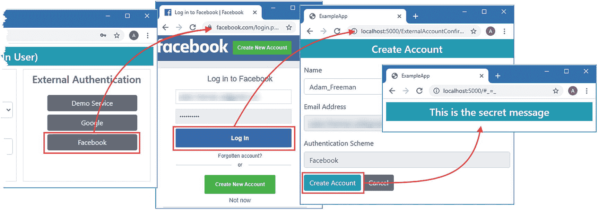

图 23-10。

向脸书认证用户

## 简化登录过程

我在示例应用中逐步引入了不同的登录方法，以便解释 Identity 特性的工作原理。然而，结果令人困惑，因为用户每次登录时可以选择不同的认证选项，更糟糕的是，用户根据其帐户的创建方式有不同的选项集。

如果用户拥有使用密码创建的帐户，他们可以选择使用密码登录或选择任何外部认证提供程序，只要外部用户数据中提供的电子邮件地址与 Identity 用户存储中的电子邮件地址相匹配。但如果用户帐户是在外部认证后创建的，用户在商店中就没有密码，只能通过外部提供商登录，尽管他们可以在提供商之间自由切换。

总体效果令人困惑，尤其是因为所有用户都有一套完整的认证选项，尽管这些选项并不适用于每个帐户。我将通过为每个用户选择一个认证方案来解决这个问题。

### 更新登录页面

我的策略很简单:一旦用户使用外部服务登录，那么这将是他们唯一的登录方式。您不必遵循这个策略，但是它的优点是简单、一致，并且易于用户理解。

在清单 [23-15](#PC17) 中，我替换了`SignIn` Razor 页面视图部分的内容以支持新的策略。

```cs
@page "{code:int?}"
@model ExampleApp.Pages.SignInModel
@using Microsoft.AspNetCore.Http

@if (!string.IsNullOrEmpty(Model.Message)) {
    <h3 class="bg-danger text-white text-center p-2">@Model.Message</h3>
}

<h4 class="bg-info text-white m-2 p-2">Current User: @Model.Username</h4>

<div class="container-fluid">
    <div class="row">
        <div class="col">
            <form method="post">
                <div class="form-group">
                    <label>User</label>
                    <select class="form-control"
                            asp-for="Username" asp-items="@Model.Users">
                    </select>
                </div>
                <button class="btn btn-info" type="submit">Sign In</button>
            </form>
        </div>
    </div>
    <div class="row">
        <div class="col text-center p-2">
            <div class="border p-2">
                <h6>Create a New Account</h6>
                <form method="post">
                    @foreach (var scheme in await Model.SignInManager
                            .GetExternalAuthenticationSchemesAsync()) {
                        <button class="btn btn-secondary m-2" type="submit"
                            asp-page="/externalsignin"
                            asp-route-returnUrl="@Request.Query["returnUrl"]"
                            asp-route-providername="@scheme.Name">
                                @scheme.DisplayName
                        </button>
                    }
                </form>
            </div>
        </div>
    </div>
</div>

Listing 23-15.Replacing the Contents of the SignIn.cshtml File in the Pages Folder

```

新布局取消了输入密码的选项，并将外部认证按钮与“创建新帐户”消息组合在一起。在清单 [23-16](#PC18) 中，我已经更新了`SignIn`页面模型类，这样 POST handler 方法就可以定位用户并为外部认证或密码认证执行重定向。

```cs
using Microsoft.AspNetCore.Authentication;
using Microsoft.AspNetCore.Http;
using Microsoft.AspNetCore.Mvc;
using Microsoft.AspNetCore.Mvc.RazorPages;
using Microsoft.AspNetCore.Mvc.Rendering;
using System.Security.Claims;
using System.Threading.Tasks;
using Microsoft.AspNetCore.Identity;
using System.Linq;
using ExampleApp.Identity;
using SignInResult = Microsoft.AspNetCore.Identity.SignInResult;
using System;

namespace ExampleApp.Pages {
    public class SignInModel : PageModel {

        public SignInModel(UserManager<AppUser> userManager,
                SignInManager<AppUser> signInManager) {
            UserManager = userManager;
            SignInManager = signInManager;
        }

        public UserManager<AppUser> UserManager { get; set; }
        public SignInManager<AppUser> SignInManager { get; set; }

        public SelectList Users => new SelectList(
            UserManager.Users.OrderBy(u => u.EmailAddress),
                "EmailAddress", "NormalizedEmailAddress");

        public string Username { get; set; }

        public int? Code { get; set; }

        public string Message { get; set; }

        public void OnGet(int? code) {
            if (code == StatusCodes.Status401Unauthorized) {
                Message = "401 - Challenge Response";
            } else if (code == StatusCodes.Status403Forbidden) {
                Message = "403 - Forbidden Response";
            }
            Username = User.Identity.Name ?? "(No Signed In User)";
        }

        public async Task<IActionResult> OnPost(string username,
                [FromQuery] string returnUrl) {
            AppUser user = await UserManager.FindByEmailAsync(username);
            UserLoginInfo loginInfo = user?.UserLogins?.FirstOrDefault();
            if (loginInfo != null) {
                return RedirectToPage("/ExternalSignIn", new {
                    returnUrl, providerName = loginInfo.LoginProvider
                });
            }
            return RedirectToPage("SignInPassword", new { username, returnUrl });
        }
    }
}

Listing 23-16.Redirecting for Authentication in the SignIn.cshtml.cs File in the Pages Folder

```

如果用户有外部登录，那么存储中的第一个登录用于认证，并重定向到`ExternalSignIn`页面。如果用户有外部登录——或者商店中没有这样的用户——那么执行到`SignInPassword`页面的重定向，我将在下一节中创建这个页面。

### 创建密码页面

下一步是创建一个新的 Razor 页面，提示输入密码并验证密码。在`Pages`文件夹中添加一个名为`SignInPassword.cshtml`的 Razor 页面，内容如清单 [23-17](#PC19) 所示。

```cs
@page
@model ExampleApp.Pages.SignInPasswordModel

<div asp-validation-summary="All" class="text-danger m-2"></div>

 <form method="post" class="p-2">
    <input type="hidden" name="returnUrl" value="@Model.ReturnUrl" />
    <div class="form-group">
        <label>User</label>
        <input class="form-control" readonly name="username"
             value="@Model.Username" />
    </div>
    <div class="form-group">
        <label>Password</label>
        <input class="form-control" type="password" name="password" />
    </div>
    <button class="btn btn-info" type="submit">Sign In</button>
    @if (User.Identity.IsAuthenticated) {
        <a asp-page="/Store/PasswordChange" class="btn btn-secondary"
            asp-route-id="@Model.User?
                    .FindFirst(ClaimTypes.NameIdentifier)?.Value">
                Change Password
        </a>
    } else {
        <a class="btn btn-secondary" href="/password/reset">
            Reset Password
        </a>
    }
</form>

Listing 23-17.The Contents of the SignInPassword.cshtml File in the Pages Folder

```

要定义页面模型类，将清单 [23-18](#PC20) 中所示的代码添加到`SignInPassword.cshtml.cs`文件中。(如果您使用的是 Visual Studio 代码，则必须创建该文件。)

```cs
using ExampleApp.Identity;
using Microsoft.AspNetCore.Identity;
using Microsoft.AspNetCore.Mvc;
using Microsoft.AspNetCore.Mvc.RazorPages;
using System;
using System.Threading.Tasks;
using SignInResult = Microsoft.AspNetCore.Identity.SignInResult;

namespace ExampleApp.Pages {

    public class SignInPasswordModel : PageModel {

        public SignInPasswordModel(UserManager<AppUser> userManager,
                SignInManager<AppUser> signInManager) {
            UserManager = userManager;
            SignInManager = signInManager;
        }

        public UserManager<AppUser> UserManager { get; set; }
        public SignInManager<AppUser> SignInManager { get; set; }

        public string Username { get; set; }
        public string ReturnUrl { get; set; }

        public void OnGet(string username, string returnUrl) {
            Username = username;
            ReturnUrl = returnUrl;
        }

        public async Task<ActionResult> OnPost(string username,
                string password, string returnUrl) {
            SignInResult result = SignInResult.Failed;
            AppUser user = await UserManager.FindByEmailAsync(username);
            if (user != null && !string.IsNullOrEmpty(password)) {
                result = await SignInManager.PasswordSignInAsync(user, password,
                    false, true);
            }
            if (!result.Succeeded) {
                if (result.IsLockedOut) {
                    TimeSpan remaining = (await UserManager
                        .GetLockoutEndDateAsync(user))
                        .GetValueOrDefault().Subtract(DateTimeOffset.Now);
                    ModelState.AddModelError("",
                        $"Locked Out for {remaining.Minutes} mins and"
                            + $" {remaining.Seconds} secs");
                } else if (result.RequiresTwoFactor) {
                    return RedirectToPage("/SignInTwoFactor", new { returnUrl });
                } else if (result.IsNotAllowed) {
                    ModelState.AddModelError("", "Sign In Not Allowed");
                } else {
                    ModelState.AddModelError("", "Access Denied");
                }
                Username = username;
                ReturnUrl = returnUrl;
                return Page();
            }
            return Redirect(returnUrl ?? "/signin");
        }
    }
}

Listing 23-18.The Contents of the SignInPassword.cshtml File in the Pages Folder

```

这个页面的页面模型类重用了以前属于`SignIn`页面的代码，并且没有引入任何新特性。

### 为外部认证添加 GET Handler 方法

在清单 [23-19](#PC21) 中，我为`ExternalSignIn` Razor 页面的页面模型类添加了一个 GET handler 方法。这允许我通过在 POST 请求中发送表单数据或使用 GET 请求的重定向来轻松启动外部认证过程。

```cs
using ExampleApp.Identity;
using Microsoft.AspNetCore.Authentication;
using Microsoft.AspNetCore.Identity;
using Microsoft.AspNetCore.Mvc;
using Microsoft.AspNetCore.Mvc.RazorPages;
using System.Linq;
using System.Security.Claims;
using System.Threading.Tasks;
using SignInResult = Microsoft.AspNetCore.Identity.SignInResult;

namespace ExampleApp.Pages {

    public class ExternalSignInModel : PageModel {

        public ExternalSignInModel(SignInManager<AppUser> signInManager,
                UserManager<AppUser> userManager) {
            SignInManager = signInManager;
            UserManager = userManager;
        }

        public SignInManager<AppUser> SignInManager { get; set; }
        public UserManager<AppUser> UserManager { get; set; }

        public string ProviderDisplayName { get; set; }

        public IActionResult OnGet(string error, string providerName,
               string returnUrl)
            => error == null ? OnPost(providerName, returnUrl) : Page();

        public IActionResult OnPost(string providerName,
                string returnUrl = "/") {
            string redirectUrl = Url.Page("./ExternalSignIn",
                 pageHandler: "Correlate", values: new { returnUrl });
            AuthenticationProperties properties = SignInManager
              .ConfigureExternalAuthenticationProperties(providerName,
                  redirectUrl);
            return new ChallengeResult(providerName, properties);
        }

        // ...methods omitted for brevity...
    }
}

Listing 23-19.Adding a Handler Method in the ExternalSignIn.cshtml.cs File in the Pages Folder

```

在为一个 HTTP 谓词使用 handler 方法来调用另一个的处理程序时应该小心，因为可能会产生奇怪的结果。然而，在这种情况下，POST 处理程序方法会产生一个导致重定向的质询结果，这不会带来任何问题。

### 限制附加外部认证

该过程的最后一步是更改外部认证过程的相关部分，以便只有一个外部认证方案可以用于登录，如清单 [23-20](#PC22) 所示。

```cs
...
public async Task<IActionResult> OnGetCorrelate(string returnUrl) {
    ExternalLoginInfo info = await SignInManager.GetExternalLoginInfoAsync();
    AppUser user = await UserManager.FindByLoginAsync(info.LoginProvider,
        info.ProviderKey);
    if (user == null) {
        string externalEmail =
            info.Principal.FindFirst(ClaimTypes.Email)?.Value
                ?? string.Empty;
        user = await UserManager.FindByEmailAsync(externalEmail);
        if (user == null) {
            return RedirectToPage("/ExternalAccountConfirm",
                new { returnUrl });
        } else {
            UserLoginInfo firstLogin = user?.UserLogins?.FirstOrDefault();
            if (firstLogin != null
                    && firstLogin.LoginProvider != info.LoginProvider) {
                return RedirectToPage(
                    new {
                      error =
                        $"{firstLogin.ProviderDisplayName} Authentication Expected"
                    });
            } else {
                await UserManager.AddLoginAsync(user, info);
            }
        }
    }
    SignInResult result = await SignInManager.ExternalLoginSignInAsync(
            info.LoginProvider, info.ProviderKey, false, false);
    if (result.Succeeded) {
        return RedirectToPage("ExternalSignIn", "Confirm",
            new { info.ProviderDisplayName, returnUrl });
    } else if (result.RequiresTwoFactor) {
        string postSignInUrl = this.Url.Page("/ExternalSignIn", "Confirm",
            new { info.ProviderDisplayName, returnUrl });
        return RedirectToPage("/SignInTwoFactor",
            new { returnUrl = postSignInUrl });
    }
    return RedirectToPage(new { error = true, returnUrl });
}
...

Listing 23-20.Preventing Additional Sign-Ins in the ExternalSignIn.cshtml.cs File in the Pages Folder

```

如果用户使用错误的外部认证服务登录，将显示错误消息。要查看修改后的序列，请重新启动 ASP.NET Core，请求`http://localhost:5000/signout`，然后单击注销按钮删除现有的认证 cookies。

请求`http://localhost:5000/signin`并点击谷歌按钮。完成登录和创建 Identity 帐户的过程。再次请求`http://localhost:5000/signin`，但是这次点击脸书按钮。用一个和你的谷歌账户有相同邮箱地址的账户登录，你会看到如图 [23-11](#Fig11) 所示的错误。

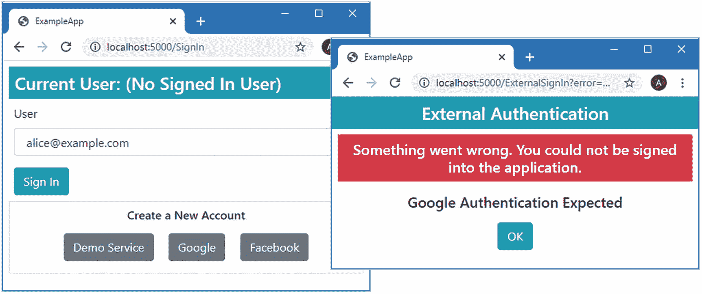

图 23-11。

限制使用外部认证登录

## 摘要

在这一章中，我向你展示了如何存储认证令牌，它可以与外部服务一起使用，并建立在第 [22](22.html) 章的基础上，为谷歌和脸书提供的服务实现自定义认证支持。

这就是我要教给你们的关于 ASP.NET Core Identity 的全部内容。我只能希望你能像我喜欢写这本书一样喜欢读它，我希望你在 ASP.NET Core 和 ASP.NET Core Identity 项目中取得成功。