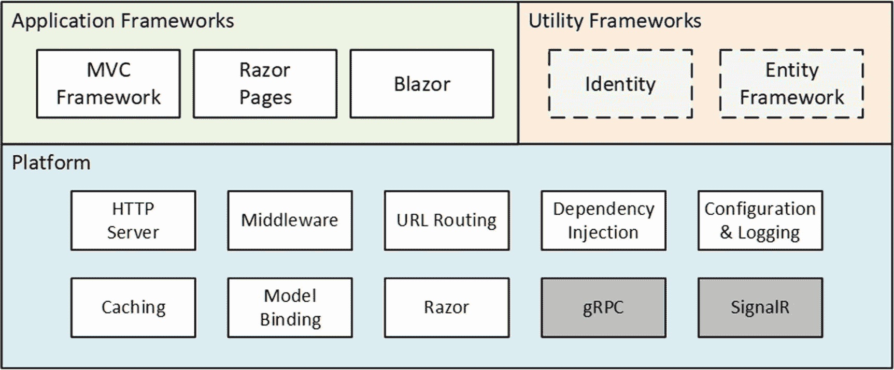

# 一、将 ASP.NET Core 放在上下文中

## 了解 ASP.NET Core

ASP.NET Core 是微软的网络开发平台。最初的 ASP.NET 是在 2002 年推出的，它经过了几次改造和重生，成为 ASP.NET Core 3，这就是本书的主题。

ASP.NET Core 由一个处理 HTTP 请求的平台、一系列创建应用的主要框架和提供支持功能的次要实用框架组成，如图 [1-1](#Fig1) 所示。

图 1-1。

ASP.NET Core 的结构

### 了解应用框架

当你开始使用 ASP.NET Core，它可以混淆发现有不同的应用框架可用。正如您将了解到的，这些框架是互补的，解决不同的问题，或者，对于某些特性，以不同的方式解决相同的问题。理解这些框架之间的关系意味着理解微软所支持的不断变化的设计模式，正如我在下面的章节中解释的那样。

#### 理解 MVC 框架

MVC 框架是在 ASP.NET 的核心时代之前引入的。最初的 ASP.NET 依赖于一种被称为网页的开发模型，这种模型重新创造了编写桌面应用的体验，但导致了笨拙的 Web 项目，无法很好地扩展。MVC 框架是和 Web 页面一起引入的，它的开发模型包含了 HTTP 和 HTML 的特性，而不是试图隐藏它。

MVC 代表模型-视图-控制器，这是一种描述应用形状的设计模式。MVC 模式强调*关注点的分离*，其中功能区域被独立定义，这是对网页导致的模糊架构的有效解毒剂。

MVC 框架的早期版本是建立在最初为网页设计的 ASP.NET 基础之上的，这导致了一些笨拙的特性和变通方法。随着移动到。NET 核心，ASP.NET 成为 ASP.NET Core，MVC 框架被重建在一个开放的，可扩展的，跨平台的基础上。

MVC 框架仍然是 ASP.NET Core 的重要组成部分，但是随着单页应用(spa)的兴起，它通常被使用的方式已经改变了。在 SPA 中，浏览器发出一个 HTTP 请求并接收一个 HTML 文档，该文档提供了一个富客户端，通常使用 JavaScript 客户端编写，如 Angular 或 React。向 SPAs 的转变意味着 MVC 框架最初打算实现的清晰分离不再重要，强调遵循 MVC 模式也不再重要，尽管 MVC 框架仍然有用(并用于通过 web 服务支持 SPAs，如第 [19](19.html) 章所述)。

Putting Patterns in Their Place

设计模式激起了强烈的反应，我从读者那里收到的电子邮件可以证明这一点。我收到的大部分消息都是关于我没有正确应用模式的抱怨。

模式只是其他人对他们在其他项目中遇到的问题的解决方案。如果你发现自己面临同样的问题，了解它以前是如何解决的会很有帮助。但这并不意味着你必须完全遵循这种模式，或者根本不遵循，只要你明白其后果。例如，如果一个模式旨在使项目易于管理，而您选择背离该模式，那么您必须接受您的项目可能更加难以管理。但是盲目地遵循一个模式可能比没有模式更糟糕，而且没有一个模式适合每个项目。

我的建议是自由地使用模式，根据需要进行调整，忽略那些混淆模式和戒律的狂热者。

#### 理解 Razor 页面

MVC 框架的一个缺点是，在应用开始生成内容之前，可能需要做大量的准备工作。尽管有结构上的问题，网页的一个优点是可以在几个小时内创建简单的应用。

Razor Pages 吸取了 Web 页面的开发精髓，并使用最初为 MVC 框架开发的平台特性来实现它。代码和内容混合形成自包含页面；这重新创造了 Web 页面开发的速度，而没有一些潜在的技术问题(尽管扩大复杂项目的规模仍然是一个问题)。

Razor 页面可以和 MVC 框架一起使用，这也是我使用它们的方式。我使用 MVC 框架编写应用的主要部分，使用 Razor Pages 编写次要功能，如管理和报告工具。你可以在第[7](07.html)–[11](11.html)章中看到这种方法，在那里我开发了一个名为 SportsStore 的真实的 ASP.NET Core 应用。

#### 了解 Blazor

JavaScript 客户端框架的兴起对 C# 开发人员来说可能是一个障碍，他们必须学习一种不同的——有点特殊的——编程语言。我已经喜欢上了 JavaScript，它像 C# 一样流畅且富于表现力。但是精通一门新的编程语言需要时间和投入，尤其是一门与 C# 有根本区别的语言。

Blazor 试图通过允许使用 C# 编写客户端应用来弥合这一差距。Blazor 有两个版本:Blazor Server 和 Blazor WebAssembly。Blazor Server 是 ASP.NET Core 的一个稳定且受支持的部分，它通过使用到 ASP.NET Core 服务器的持久 HTTP 连接来工作，应用的 C# 代码在那里执行。Blazor WebAssembly 是一个实验性版本，它更进一步，在浏览器中执行应用的 C# 代码。正如我在第 [33 章](33.html)中所解释的，Blazor 的两个版本都不适合所有情况，但是它们都为 ASP.NET Core 开发的未来提供了方向感。

### 了解实用程序框架

有两个框架与 ASP.NET Core 紧密相关，但并不直接用于生成 HTML 内容或数据。实体框架核心是微软的对象关系映射(ORM)框架，它将存储在关系数据库中的数据表示为。NET 对象。实体框架核心可以用在任何。NET 核心应用，它通常用于访问 ASP.NET Core 应用中的数据库。

ASP.NET Core Identity 是微软的认证和授权框架，用于验证 ASP.NET Core 应用中的用户凭据，并限制对应用功能的访问。

在本书中，我只描述这两个框架的基本特性，重点是大多数 ASP.NET Core 应用所需的功能。但是这两个都是复杂的框架，太大了以至于无法在一本关于 ASP.NET Core 的大部头书中详细描述。

Topics For Future Editions

在本书中，我没有足够的篇幅来涵盖每个实体框架核心和 ASP.NET Core Identity 特性，所以我将重点放在大多数项目需要的那些方面。如果您认为我应该在下一版或新的深度书籍中包含一些主题，请在`adam@adam-freeman.com`将您的建议发送给我。

### 了解 ASP.NET Core 平台

ASP.NET Core 平台包含接收和处理 HTTP 请求以及创建响应所需的底层功能。有一个集成的 HTTP 服务器，一个处理请求的中间件组件系统，以及应用框架所依赖的核心特性，比如 URL 路由和 Razor 视图引擎。

您的大部分开发时间将花在应用框架上，但是有效地使用 spent 核心需要了解平台提供的强大功能，没有这些功能，更高级别的框架就无法运行。我将在本书的第 2 部分详细演示 ASP.NET Core 平台是如何工作的，并解释它所提供的特性是如何支撑 ASP.NET Core 开发的各个方面的。

我在本书中没有描述两个显著的平台特性:SignalR 和 gRPC。SignalR 用于创建应用之间的低延迟通信通道。它为我在本书第 4 部分描述的 Blazor 服务器框架提供了基础，但 SignalR 很少被直接使用，对于那些需要低延迟消息传递的少数项目，有更好的替代方案，如 Azure Event Grid 或 Azure Service Bus。

gRPC 是基于 HTTP 的跨平台远程过程调用(RPC)的新兴标准，最初由 Google(gRPC 中的 *g* )创建，提供了效率和可伸缩性方面的好处。gRPC 可能是 web 服务的未来标准，但它不能用于 web 应用，因为它需要对它发送的 HTTP 消息进行低级控制，而这是浏览器不允许的。(有一个浏览器库允许通过代理服务器使用 gRPC，但这削弱了使用 gRPC 的好处。)在 gRPC 可以在浏览器中使用之前，只有在后端服务器之间使用 gRPC 进行通信的项目才会对将其包含在 ASP.NET Core 中感兴趣，因为后端服务器之间存在许多替代协议。我可能会在本书的未来版本中介绍 gRPC，但要等到它可以在浏览器中使用或者成为主导的数据中心协议之后。

## 理解这本书

为了从本书中获得最大收益，您应该熟悉 web 开发的基础知识，了解 HTML 和 CSS 的工作原理，并具备 C# 的工作知识。如果你没有做过任何客户端开发，比如 JavaScript，也不用担心。这本书的重点是 C# 和 ASP.NET Core，随着章节的进展，你将能够获得你需要知道的一切。在第 [5](05.html) 章中，我总结了 ASP.NET Core 开发中最重要的 C# 特性，如果你是从早期版本的。NET Core 或。NET 框架。

### 我需要什么软件来跟随例子？

您需要一个代码编辑器(Visual Studio 或 Visual Studio 代码)。NET 核心软件开发工具包，以及 SQL Server LocalDB。所有这些都可以从微软免费获得，第 [2](02.html) 章包含安装你需要的所有东西的说明。

### 我需要在什么平台上学习范例？

这本书是为 Windows 编写的。我用的是 Windows 10 Pro，但是 Visual Studio 支持的任何版本的 Windows，Visual Studio 代码，还有。网芯应该可以。其他平台也支持 ASP.NET Core，但本书中的示例依赖于特定于 Windows 的 SQL Server LocalDB 功能。如果你想使用另一个平台，你可以通过`adam@adam-freeman.com`联系我，我会给你一些修改例子的一般指导，尽管有一个警告，如果你遇到困难，我不能提供详细的帮助。

### 如果我对这些例子有疑问怎么办？

首先要做的是回到这一章的开头，重新开始。大多数问题都是由于遗漏了一个步骤或者没有完全按照清单来做造成的。请密切注意代码清单中的重点，它突出了需要进行的更改。

接下来，查看勘误表/更正表，它包含在本书的 GitHub 资源库中。尽管我和我的编辑尽了最大的努力，技术书籍还是很复杂，错误是不可避免的。请查看勘误表，了解已知错误列表以及解决这些错误的说明。

如果您仍然有问题，那么从本书的 GitHub 资源库 [`https://github.com/apress/pro-asp.net-core-3`](https://github.com/apress/pro-asp.net-core-3) 下载您正在阅读的章节的项目，并将其与您的项目进行比较。我通过阅读每一章来创建 GitHub 存储库的代码，所以您的项目中应该有相同内容的相同文件。

如果你仍然不能让例子工作，那么你可以联系我在`adam@adam-freeman.com`寻求帮助。请在邮件中明确你在看哪本书，哪个章节/例子导致了这个问题。请记住，我收到很多电子邮件，我可能不会立即回复。

### 如果我发现书中有错误怎么办？

您可以在`adam@adam-freeman.com`通过电子邮件向我报告错误，尽管我要求您首先检查这本书的勘误表/更正列表，您可以在本书的 GitHub 资源库 [`https://github.com/apress/pro-asp.net-core-3`](https://github.com/apress/pro-asp.net-core-3) 中找到，以防它已经被报告。

我在 GitHub 存储库的勘误表/更正文件中添加了可能给读者造成困惑的错误，尤其是示例代码的问题，并对第一个报告这些错误的读者表示感谢。我保留了一个不太严重的问题的列表，这通常意味着例子周围的文本中的错误，当我编写新版本时，我会修复它们。

### 这本书包括什么？

我已经尝试涵盖了大多数 ASP.NET Core 项目所需要的特性。这本书分为四个部分，每个部分涵盖一系列相关的主题。

#### 第 1 部分:介绍 ASP.NET Core

本书的这一部分(包括本章)介绍了 ASP.NET Core。除了设置您的开发环境和创建您的第一个应用，您还将了解 ASP.NET Core 开发最重要的 C# 特性，以及如何使用 ASP.NET Core 开发工具。但第 1 部分的大部分时间都用于开发一个名为 SportsStore 的项目，通过这个项目，我向您展示了一个从开始到部署的实际开发过程，触及了 ASP.NET Core 的所有主要功能，并展示了它们是如何结合在一起的——这可能会在本书其余部分的深入章节中丢失。

#### 第二部分:ASP.NET Core 平台

本书这一部分的章节描述了 ASP.NET Core 平台的主要特性。我解释了如何处理 HTTP 请求，如何创建和使用中间件组件，如何创建路由，如何定义和消费服务，以及如何使用实体框架核心。这些章节解释了 ASP.NET Core 的基础，理解它们对于有效的 ASP.NET Core 开发是必不可少的。

#### 第 3 部分:ASP.NET Core 应用

本书这一部分的章节解释了如何创建不同类型的应用，包括使用控制器和 Razor 页面的 RESTful web 服务和 HTML 应用。这些章节还描述了使生成 HTML 变得容易的特性，包括视图、视图组件和标签助手。

#### 第 4 部分:高级 ASP.NET Core 功能

本书的最后一部分解释了如何使用 Blazor Server 创建应用，如何使用实验性的 Blazor WebAssembly，以及如何使用 ASP.NET Core Identity 认证用户和授权访问。

### 这本书没有涵盖什么？

这本书没有涵盖基本的 web 开发主题，如 HTML 和 CSS，也没有教授基本的 C#(尽管第 [5](05.html) 章确实描述了对 ASP.NET Core 开发有用的 C# 特性，这些特性对于使用旧版的开发人员来说可能并不熟悉。网)。

尽管我喜欢深入书中的细节，但并不是每一个 ASP.NET Core 特性都在主流开发中有用，我必须将我的书保持在可打印的大小。当我决定省略一个特性时，是因为我认为它不重要，或者是因为使用我所涉及的技术可以达到相同的结果。

如前所述，我没有描述 ASP.NET Core 对 SignalR 和 gRPC 的支持，我在后面的章节中提到了我没有描述的其他特性，因为它们不是广泛适用的，或者因为有更好的替代方案。在每一种情况下，我都解释了为什么省略了描述，并提供了该主题的 Microsoft 文档参考。

### 我如何联系作者？

你可以在`adam@adam-freeman.com`给我发邮件。自从我第一次在我的书中发表电子邮件地址已经有几年了。我不能完全肯定这是一个好主意，但我很高兴我这样做了。我收到了来自世界各地的电子邮件，来自各行各业工作或学习的读者，无论如何，大部分电子邮件都是积极、礼貌和令人愉快的。

我试图及时回复，但我会收到很多电子邮件，有时会积压大量邮件，尤其是当我低着头试图写完一本书时。我总是试图帮助那些被书中的一个例子困住的读者，尽管我要求你在联系我之前按照本章前面描述的步骤去做。

虽然我欢迎读者的电子邮件，但有一些常见问题的答案永远是否定的。我担心我不会为你的新公司编写代码，不会帮助你完成大学作业，不会参与你的开发团队的设计争议，也不会教你如何编程。

### 如果我真的喜欢这本书呢？

请发电子邮件到`adam@adam-freeman.com`告诉我。收到一位快乐的读者的来信总是一件令人高兴的事，我很感激花时间发送这些邮件。写这些书可能很难，而这些邮件为坚持一项有时感觉不可能的活动提供了必要的动力。

### 如果这本书让我生气了，我想投诉怎么办？

你仍然可以给我发电子邮件，我仍然会尽力帮助你。请记住，只有当你解释了问题是什么，以及你希望我做些什么时，我才能提供帮助。你应该明白，有时唯一的结果是接受我不是你的作者，只有当你归还这本书并选择另一本时，我们才会结束。我会仔细考虑让你心烦意乱的事情，但是经过 25 年的写书生涯，我逐渐明白，并不是每个人都喜欢读我喜欢写的书。

## 摘要

在这一章中，我为这本书的其余部分设置了场景。我提供了 ASP.NET Core 的简要概述，解释了这本书的要求和内容，并解释了如何与我联系。在下一章中，我将向您展示如何为 ASP.NET Core 开发做准备。