# 二、入门指南

欣赏一个软件开发框架的最好方式是直接投入使用它。在本章中，我将解释如何准备 ASP.NET Core 开发，以及如何创建和运行 ASP.NET Core 应用。

Updates to this Book

微软有一个积极的开发计划。NET 核心和 ASP.NET Core，这意味着在您阅读本书时可能会有新的版本推出。期望读者每隔几个月就买一本新书似乎不太公平，尤其是因为大多数变化都相对较小。相反，我会在 GitHub 知识库中发布这本书的免费更新( [`https://github.com/apress/pro-asp.net-core-3`](https://github.com/apress/pro-asp.net-core-3) )以获得突破性的变化。

这种更新对我来说是一个正在进行的实验(对 Apress 来说也是),它将继续发展——尤其是因为我不知道 ASP.NET Core 的未来主要版本将包含什么——但目标是通过补充书中包含的示例来延长这本书的寿命。

我不承诺更新会是什么样的，它们会采取什么形式，或者在我把它们折叠成这本书的新版本之前，我会花多长时间来制作它们。当新的 ASP.NET Core 版本发布时，请保持开放的心态并检查这本书的存储库。如果你有关于如何改进更新的想法，请发电子邮件到`adam@adam-freeman.com`告诉我。

## 选择代码编辑器

微软为 ASP.NET Core 开发提供了工具选择:Visual Studio 和 Visual Studio 代码。Visual Studio 是的传统开发环境。NET 应用，它为开发各种应用提供了大量的工具和特性。但是它需要大量的资源，速度很慢，而且一些特性非常有用，阻碍了开发。

Visual Studio 代码是一个轻量级的替代方案，它没有 Visual Studio 的花哨功能，但完全能够处理 ASP.NET Core 开发。

本书中的所有示例都包括对两个编辑器的说明，Visual Studio 和 Visual Studio 代码都可以免费使用，因此您可以使用适合您的开发风格的任何代码。

如果你不熟悉。NET 核心开发，那就从 Visual Studio 开始吧。它为创建 ASP.NET Core 开发中使用的不同类型的文件提供了更加结构化的支持，这将有助于确保您从代码示例中获得预期的结果。

Note

这本书描述了 Windows 的 ASP.NET Core 开发。在 Linux 和 macOS 上开发和运行 ASP.NET Core 应用是可能的，但是大多数读者使用 Windows，这就是我选择关注的。本书中的几乎所有示例都依赖于 LocalDB，这是 SQL Server 提供的一个仅适用于 Windows 的特性，在其他平台上不可用。如果你想在另一个平台上跟进这本书，那么你可以使用第 [1](01.html) 章中的电子邮件地址联系我，我会尽力帮助你开始。

### 安装 Visual Studio

ASP.NET Core 3 需要 Visual Studio 2019。我用的是免费的 Visual Studio 2019 社区版，可以从 [`www.visualstudio.com`](http://www.visualstudio.com) 下载。运行安装程序，你会看到如图 [2-1](#Fig1) 所示的提示。

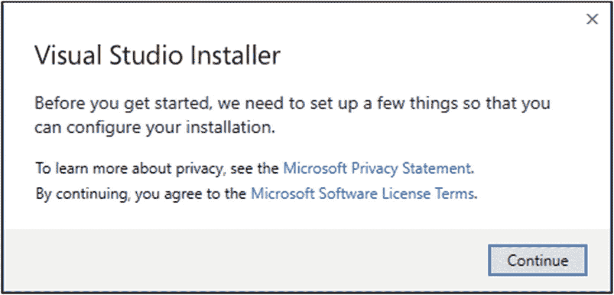

图 2-1。

启动 Visual Studio 安装程序

点击继续按钮，安装程序将下载安装文件，如图 [2-2](#Fig2) 所示。

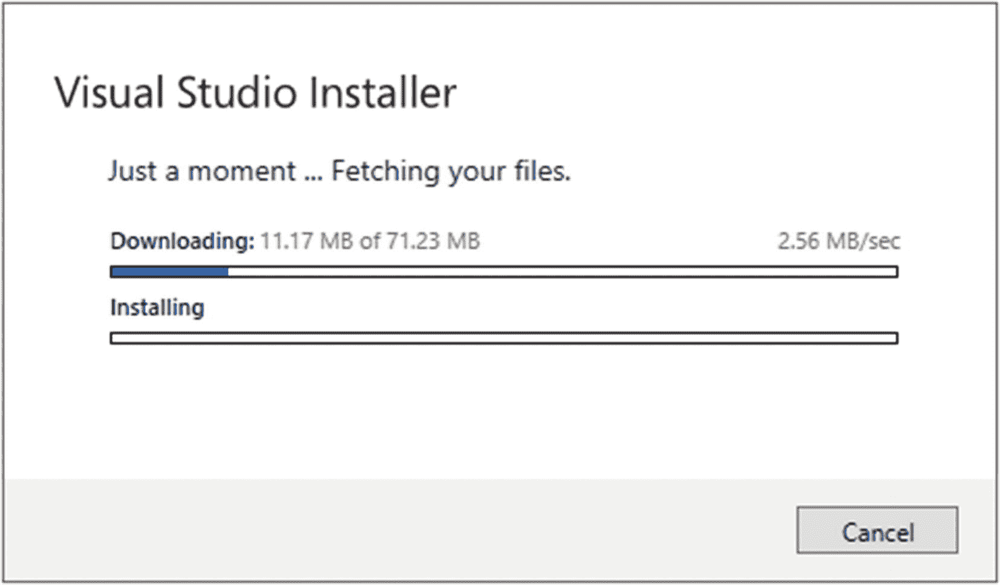

图 2-2。

下载 Visual Studio 安装程序文件

下载完安装程序文件后，您将看到一组安装选项，这些选项被分组到工作负载中。确保“ASP。NET 和 web 开发”工作量进行检查，如图 [2-3](#Fig3) 所示。

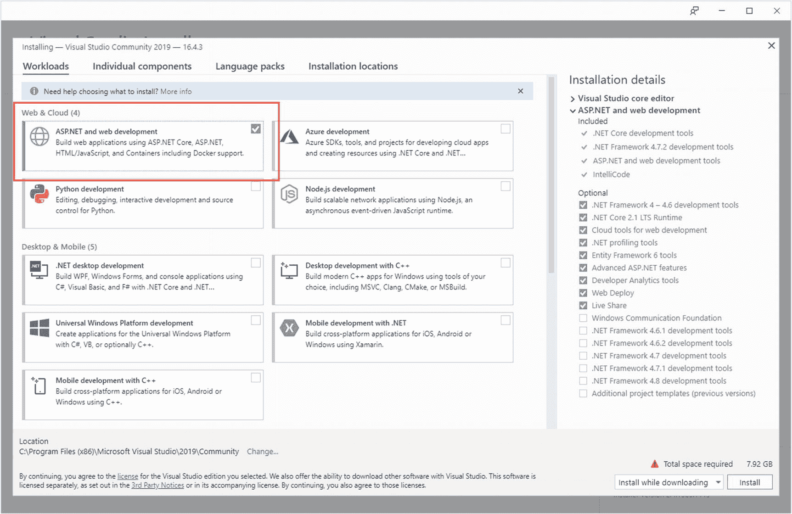

图 2-3。

选择工作负荷

选择窗口顶部的“单个组件”部分，确保选中 SQL Server Express 2016 LocalDB 选项，如图 [2-4](#Fig4) 所示。这是我将在后面的章节中用来存储数据的数据库组件。

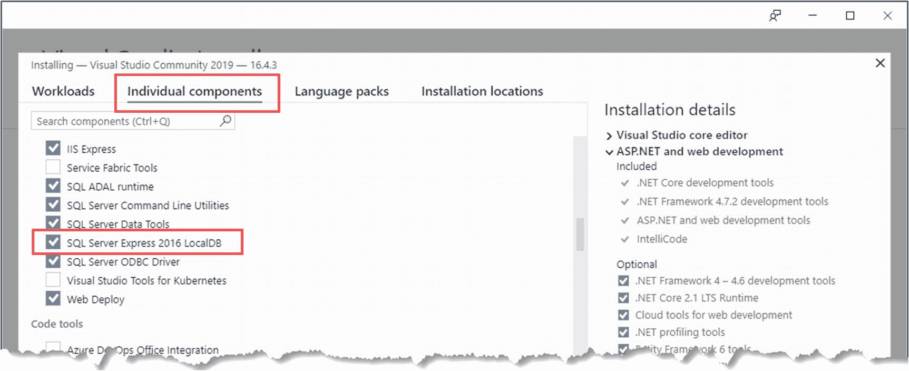

图 2-4。

确保安装了 LocalDB

单击 Install 按钮，将下载并安装所选工作负载所需的文件。要完成安装，需要重启，如图 [2-5](#Fig5) 所示。

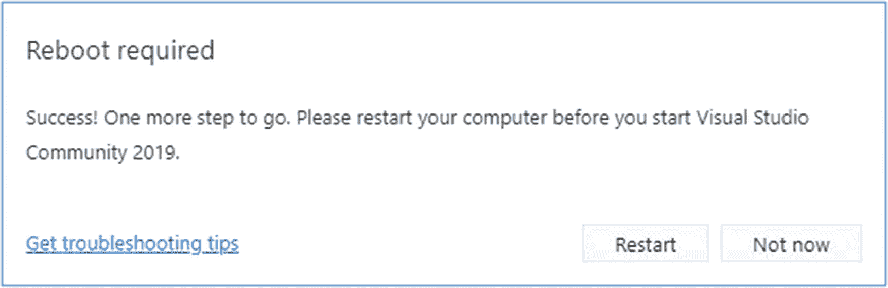

图 2-5。

完成安装

#### 安装。NET Core SDK

Visual Studio 安装程序将安装。NET 核心软件开发工具包(SDK)，但它可能不会安装本书中的示例所需的版本。转到 [`https://dotnet.microsoft.com/download/dotnet-core/3.1`](https://dotnet.microsoft.com/download/dotnet-core/3.1) 并下载 3.1.1 版的安装程序。NET Core SDK，这是编写时的长期支持版本。运行安装程序；安装完成后，从 Windows 开始菜单打开一个新的 PowerShell 命令提示符，并运行清单 [2-1](#PC1) 中所示的命令，其中显示了已安装的。NET Core SDKs。

```cs
dotnet --list-sdks

Listing 2-1.Listing the Installed SDKs

```

以下是在 Windows 计算机上全新安装的输出，该计算机尚未用于。网络核心:

```cs
3.1.101 [C:\Program Files\dotnet\sdk]

```

如果您一直在使用不同版本的。NET Core，您可能会看到一个更长的列表，如下所示:

```cs
2.1.401 [C:\Program Files\dotnet\sdk]
2.1.502 [C:\Program Files\dotnet\sdk]
2.1.505 [C:\Program Files\dotnet\sdk]
2.1.602 [C:\Program Files\dotnet\sdk]
2.1.802 [C:\Program Files\dotnet\sdk]
3.0.100 [C:\Program Files\dotnet\sdk]
3.1.100 [C:\Program Files\dotnet\sdk]
3.1.101 [C:\Program Files\dotnet\sdk]

```

无论有多少个条目，您都必须确保 3.1.1xx 版本有一个条目，其中最后两位数字可能不同。

### 安装 Visual Studio 代码

如果您选择了使用 Visual Studio 代码，请从 [`https://code.visualstudio.com`](https://code.visualstudio.com) 下载安装程序。不需要特定的版本，您应该选择当前的稳定版本。运行安装程序，确保选中添加到路径选项，如图 [2-6](#Fig6) 所示。

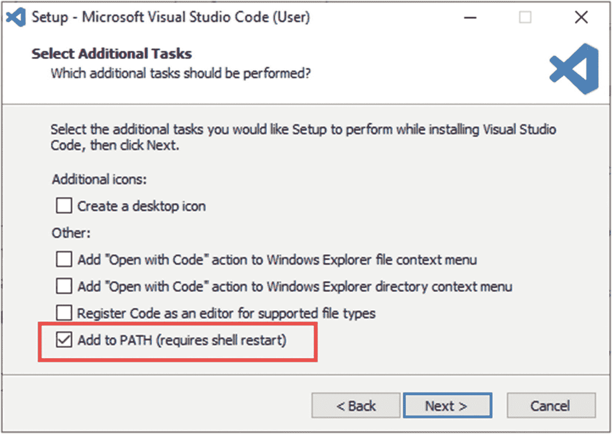

图 2-6。

配置 Visual Studio 代码安装

#### 安装。网络核心软件开发工具包

Visual Studio 安装程序不包括。NET Core SDK，必须单独安装。转到 [`https://dotnet.microsoft.com/download/dotnet-core/3.1`](https://dotnet.microsoft.com/download/dotnet-core/3.1) 并下载 3.1.1 版的安装程序。NET Core SDK，这是编写时的长期支持版本。运行安装程序；安装完成后，从 Windows 开始菜单打开一个新的 PowerShell 命令提示符，并运行清单 [2-2](#PC4) 中所示的命令，该命令显示已安装的。NET Core SDKs。

```cs
dotnet --list-sdks

Listing 2-2.Listing the Installed SDKs

```

以下是在 Windows 计算机上全新安装的输出，该计算机尚未用于。网络核心:

```cs
3.1.101 [C:\Program Files\dotnet\sdk]

```

如果您一直在使用不同版本的。NET Core，您可能会看到一个更长的列表，如下所示:

```cs
2.1.401 [C:\Program Files\dotnet\sdk]
2.1.502 [C:\Program Files\dotnet\sdk]
2.1.505 [C:\Program Files\dotnet\sdk]
2.1.602 [C:\Program Files\dotnet\sdk]
2.1.802 [C:\Program Files\dotnet\sdk]
3.0.100 [C:\Program Files\dotnet\sdk]
3.1.100 [C:\Program Files\dotnet\sdk]
3.1.101 [C:\Program Files\dotnet\sdk]

```

无论有多少个条目，您都必须确保 3.1.1xx 版本有一个条目，其中最后两位数字可能不同。

#### 正在安装 SQL Server LocalDB

本书中的数据库示例需要 LocalDB，这是 SQL Server 的零配置版本，可以作为 SQL Server Express edition 的一部分安装，可以从 [`https://www.microsoft.com/en-in/sql-server/sql-server-downloads`](https://www.microsoft.com/en-in/sql-server/sql-server-downloads) 免费使用。下载并运行快速版安装程序，选择自定义选项，如图 [2-7](#Fig7) 所示。

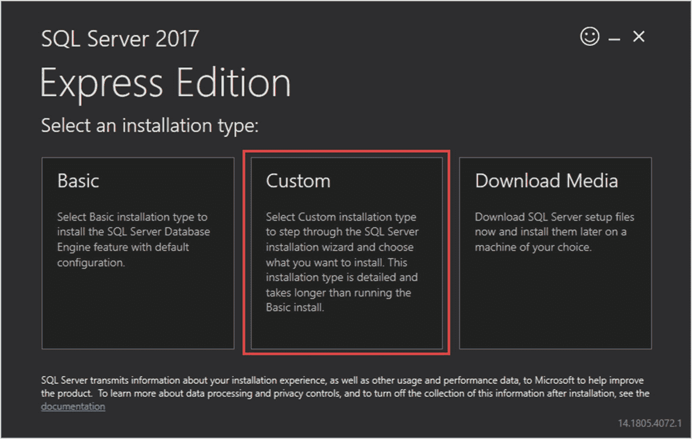

图 2-7。

选择 SQL Server 的安装选项

选择自定义选项后，系统会提示您选择安装文件的下载位置。单击安装按钮，下载将开始。

出现提示时，选择创建新的 SQL Server 安装的选项，如图 [2-8](#Fig8) 所示。

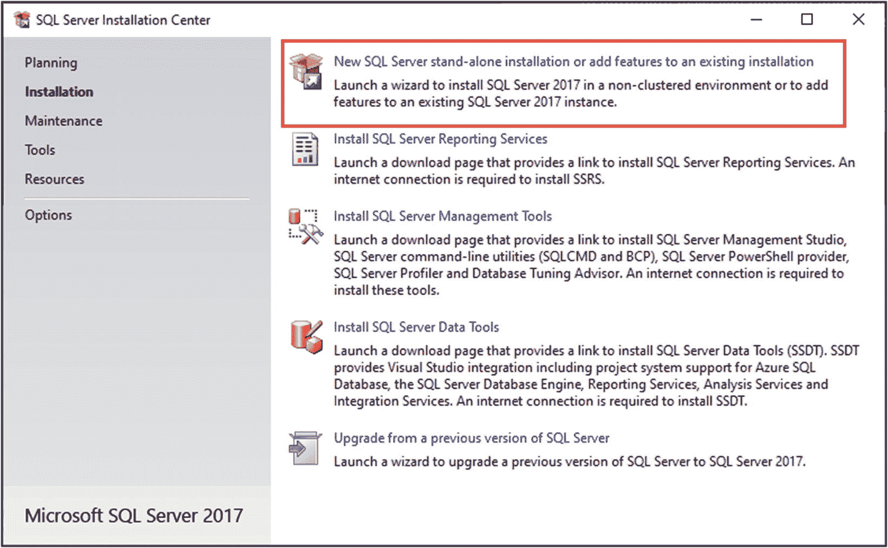

图 2-8。

选择安装选项

完成安装过程，选择出现的默认选项。当您到达特性选择页面时，确保选中 LocalDB 选项，如图 [2-9](#Fig9) 所示。(您可能希望取消选中 R 和 Python 的选项，这两个选项在本书中没有用到，下载和安装需要很长时间。)

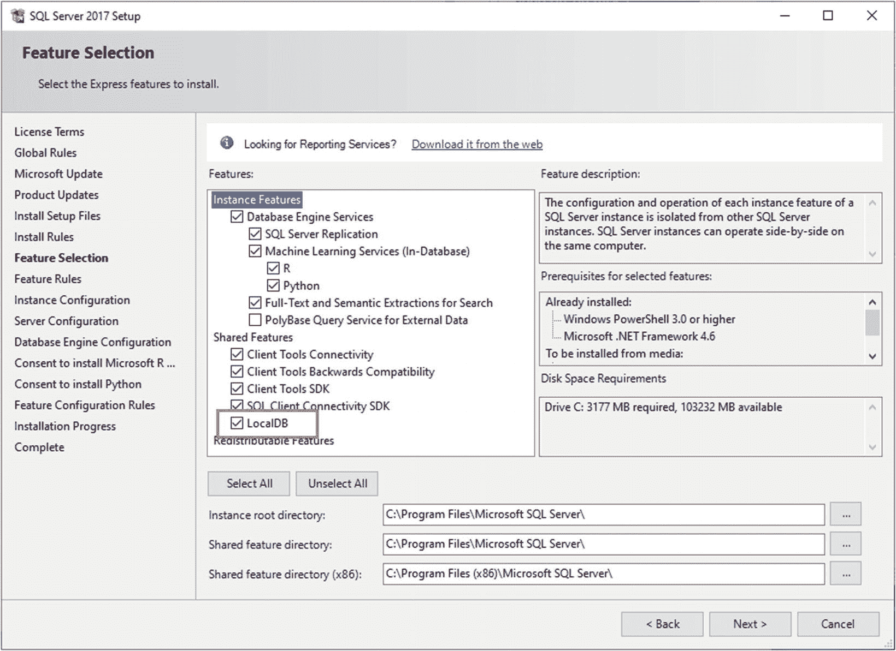

图 2-9。

选择 LocalDB 功能

在实例配置页面，选择“默认实例”选项，如图 [2-10](#Fig10) 所示。

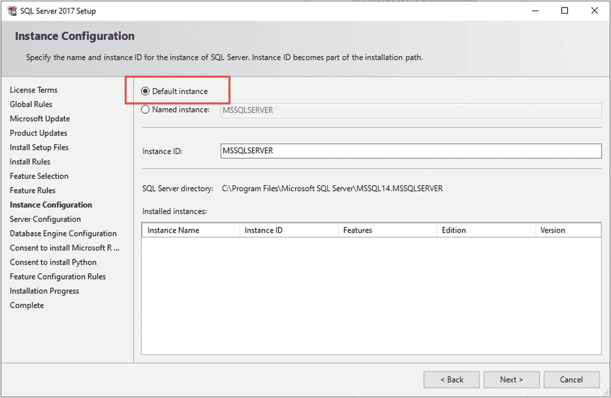

图 2-10。

配置数据库

继续完成安装过程，选择默认值。安装完成后，安装 SQL Server 的最新累积更新。在撰写本文时，最新的更新可从 [`https://support.microsoft.com/en-us/help/4527377/cumulative-update-18-for-sql-server-2017`](https://support.microsoft.com/en-us/help/4527377/cumulative-update-18-for-sql-server-2017) 获得，尽管在您阅读本章时可能已经发布了更新的更新。

Caution

跳过更新阶段可能很诱人，但是执行这一步以从本书的示例中获得预期的结果是很重要的。例如，SQL Server 的基本安装有一个错误，它阻止 LocalDB 创建数据库文件，这将在您到达第 [7](07.html) 章时导致问题。

## 创建 ASP.NET Core 项目

创建项目最直接的方法是使用命令行，尽管 Visual Studio 提供了一个向导系统，我将在第 [4](04.html) 章中演示。从 Windows 开始菜单打开一个新的 PowerShell 命令提示符，导航到您想要创建 ASP.NET Core 项目的文件夹，并运行清单 [2-3](#PC7) 中所示的命令。

Tip

你可以从 [`https://github.com/apress/pro-asp.net-core-3`](https://github.com/apress/pro-asp.net-core-3) 下载本章以及本书其他章节的示例项目。如果在运行示例时遇到问题，请参见第 [1](01.html) 章获取帮助。

```cs
dotnet new globaljson --sdk-version 3.1.101 --output FirstProject
dotnet new mvc --no-https --output FirstProject --framework netcoreapp3.1

Listing 2-3.Creating a New Project

```

第一个命令创建一个名为`FirstProject`的文件夹，并向其中添加一个名为`global.json`的文件，该文件指定。项目将使用的 NET Core 这确保您在遵循示例时获得预期的结果。第二个命令创建一个新的 ASP.NET Core 项目。那个。NET Core SDK 包括一系列用于启动新项目的模板，`mvc`模板是 ASP.NET Core 应用可用的选项之一。该项目模板创建一个为 MVC 框架配置的项目，这是 ASP.NET Core 支持的应用类型之一。不要被选择框架的想法吓倒，如果你没有听说过 MVC 也不要担心——到本书结束时，你会理解每种框架提供的特性以及它们是如何组合在一起的。

Note

这是我使用包含占位符内容的项目模板的少数章节之一。我不喜欢使用预定义的项目模板，因为它们鼓励开发人员将重要的特性，如认证，视为黑盒。我在这本书里的目标是给你了解和管理你的 ASP.NET Core 应用的每个方面的知识，这就是为什么我从一个空的 ASP.NET Core 项目开始。这一章是关于快速入门的，而`mvc`模板非常适合。

### 使用 Visual Studio 打开项目

启动 Visual Studio，点击“打开项目或解决方案”按钮，如图 [2-11](#Fig11) 所示。

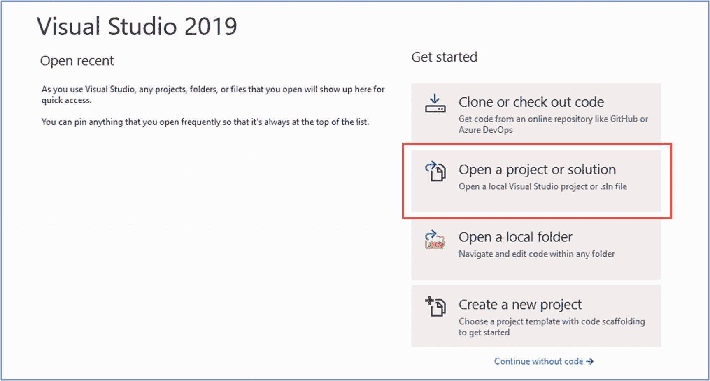

图 2-11。

开启 ASP.NET Core 项目

导航到`FirstProject`文件夹，选择`FirstProject.csproj`文件，然后单击打开按钮。Visual Studio 将打开该项目，并在解决方案资源管理器窗口中显示其内容，如图 [2-12](#Fig12) 所示。项目中的文件是由项目模板创建的。

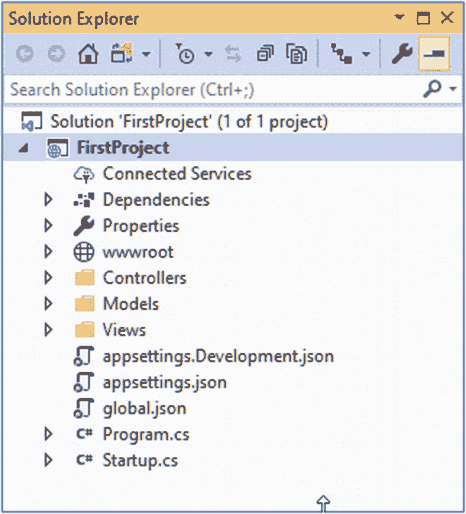

图 2-12。

在 Visual Studio 中打开项目

#### 选择浏览器

当项目运行时，Visual Studio 将自动打开一个浏览器窗口。要选择所使用的浏览器，单击 IIS Express 下拉菜单右侧的小箭头，并从 Web 浏览器菜单中选择您的首选浏览器，如图 [2-13](#Fig13) 所示。我在这本书里一直使用谷歌浏览器。

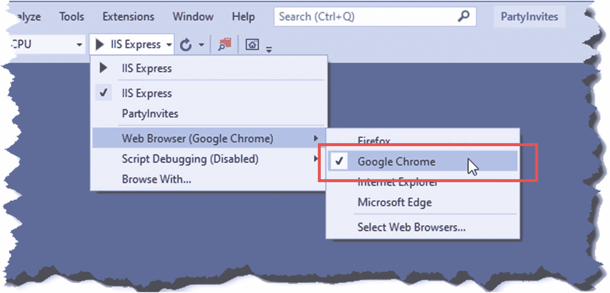

图 2-13。

选择浏览器

### 用 Visual Studio 代码打开项目

启动 Visual Studio 代码并选择文件➤打开文件夹。导航到`FirstProject`文件夹并点击选择文件夹按钮。Visual Studio 代码将打开项目并在资源管理器窗格中显示其内容，如图 [2-14](#Fig14) 所示。(Visual Studio 代码中使用的默认深色主题在页面上显示不太好，所以我已经将本书中的截图更改为浅色主题。)

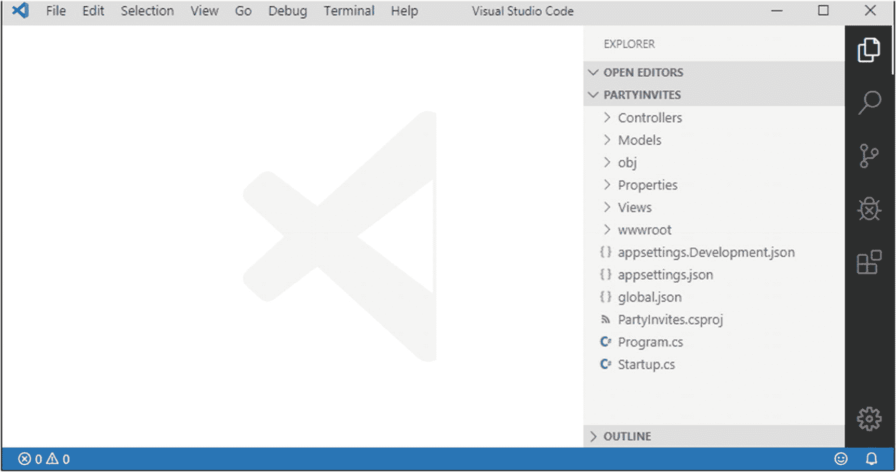

图 2-14。

在 Visual Studio 代码中打开项目

第一次在 Visual Studio 代码中打开. NET 核心项目时，需要进行额外的配置。第一步是在浏览器窗格中单击`Startup.cs`文件。这将触发 Visual Studio 代码提示安装 C# 开发所需的功能，如图 [2-15](#Fig15) 所示。如果你之前已经打开了一个 C# 项目，你会看到一个提示，要求安装所需的资产，如图 [2-15](#Fig15) 所示。

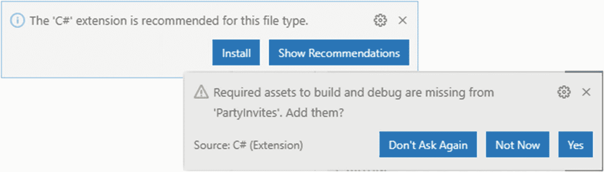

图 2-15。

安装 Visual Studio 代码 C# 功能

根据需要单击“安装”或“是”按钮，Visual Studio 代码将下载并安装所需的功能。净核心项目。

## 运行 ASP.NET Core 应用

该模板创建一个包含构建和运行应用所需的所有内容的项目。从调试菜单中选择不调试启动，Visual Studio 将编译并启动示例应用，然后打开一个新的浏览器窗口向应用发送 HTTP 请求，如图 [2-17](#Fig17) 所示。(如果在“调试”菜单中没有看到“启动但不调试”项，请在“解决方案资源管理器”窗口中单击`Startup.cs`文件，然后再次检查菜单。)

如果您使用的是 Visual Studio 代码，请在“调试”菜单中选择“不调试运行”。因为这是项目第一次启动，所以会提示您选择一个执行环境。选择。网芯选项，如图 [2-16](#Fig16) 所示。

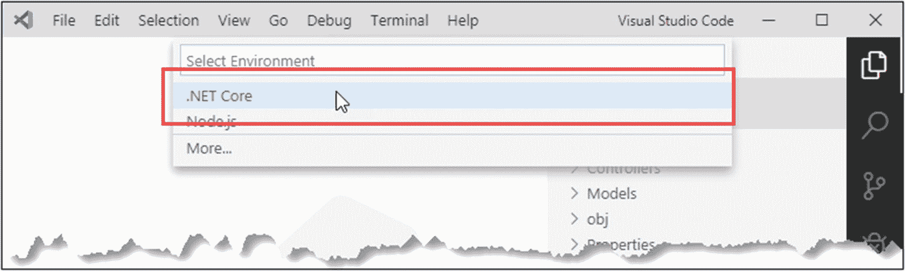

图 2-16。

选择执行环境

Visual Studio 代码将创建一个包含项目启动设置的`launch.json`文件，对于本书，您可以忽略该文件。再次从调试菜单中选择不调试运行，Visual Studio 代码将编译项目，开始执行应用，并打开一个新的浏览器窗口，如图 [2-17](#Fig17) 所示。

您也可以从命令行启动应用。从 Windows“开始”菜单打开新的 PowerShell 命令提示符；导航到`FirstProject`项目文件夹，这是包含`FirstProject.csproj`文件的文件夹；并运行清单 [2-4](#PC8) 中所示的命令。

```cs
dotnet run

Listing 2-4.Starting the Example Application

```

一旦应用启动，你将需要打开一个新的浏览器窗口并请求`http://localhost:5000`，这将产生如图 [2-17](#Fig17) 所示的响应。

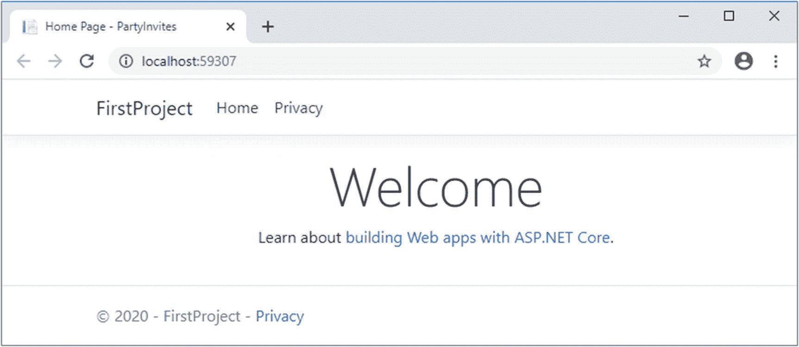

图 2-17。

运行示例项目

Tip

如果您使用 Visual Studio 代码或从命令行运行应用，那么 ASP.NET Core 会在端口 5000 上侦听 HTTP 请求。如果您使用的是 Visual Studio，您会注意到浏览器请求一个不同的端口，该端口是在创建项目时选择的。如果您查看 Windows 任务栏通知区域，您会发现 IIS Express 的图标。这是 Visual Studio 附带的完整 IIS 应用服务器的简化版本，用于在开发过程中提供 ASP.NET Core 内容和服务。在后面的章节中，我将向您展示如何更改项目配置，以使用与 Visual Studio 代码相同的 HTTP 端口。

完成后，关闭 Visual Studio 打开的浏览器窗口。如果您使用的是 Visual Studio 代码，请单击代码编辑器上弹出的窗口中显示的“停止”按钮。如果您从命令行启动了应用，请使用 Control+C 停止执行。

### 了解端点

在 ASP.NET Core 应用中，传入的请求由*端点*处理。产生图 [2-17](#Fig17) 中响应的端点是一个*动作*，这是一个用 C# 编写的方法。一个动作在一个*控制器*中定义，这是一个 C# 类，从内置控制器基类`Microsoft.AspNetCore.Mvc.Controller`类派生而来。

控制器定义的每个公共方法都是一个动作，这意味着您可以调用动作方法来处理 HTTP 请求。ASP.NET Core 项目中的惯例是将控制器类放在一个名为`Controllers`的文件夹中，这个文件夹是由清单 [2-3](#PC7) 中用于设置项目的模板创建的。

项目模板向`Controllers`文件夹添加了一个控制器，以帮助快速启动开发。控制器在名为`HomeController.cs`的类文件中定义。控制器类包含一个名称，后跟单词`Controller`，这意味着当您看到一个名为`HomeController.cs`的文件时，您知道它包含一个名为`Home`的控制器，这是 ASP.NET Core 应用中使用的默认控制器。

Tip

如果术语*控制器*和*动作*没有直接意义，也不用担心。只要继续按照例子做，你就会看到浏览器发送的 HTTP 请求是如何被 C# 代码处理的。

在解决方案资源管理器或资源管理器窗格中找到`HomeController.cs`文件，并单击它以打开它进行编辑。您将看到以下代码:

```cs
using System;
using System.Collections.Generic;
using System.Diagnostics;
using System.Linq;
using System.Threading.Tasks;
using Microsoft.AspNetCore.Mvc;
using Microsoft.Extensions.Logging;
using FirstProject.Models;

namespace FirstProject.Controllers {
    public class HomeController : Controller {
        private readonly ILogger<HomeController> _logger;

        public HomeController(ILogger<HomeController> logger) {
            _logger = logger;
        }

        public IActionResult Index() {
            return View();
        }

        public IActionResult Privacy() {
            return View();
        }

        [ResponseCache(Duration = 0, Location = ResponseCacheLocation.None,
             NoStore = true)]
        public IActionResult Error() {
            return View(new ErrorViewModel { RequestId = Activity.Current?.Id
                ?? HttpContext.TraceIdentifier });
        }
    }
}

```

使用代码编辑器，替换`HomeController.cs`文件的内容，使其与清单 [2-5](#PC10) 匹配。除了一个方法之外，我移除了所有的方法，更改了结果类型及其实现，并移除了未使用的名称空间的`using`语句。

```cs
using Microsoft.AspNetCore.Mvc;

namespace FirstProject.Controllers {

    public class HomeController : Controller {

        public string Index() {
            return "Hello World";
        }
    }
}

Listing 2-5.Changing the HomeController.cs File in the Controllers Folder

```

结果是`Home`控制器定义了一个名为`Index`的动作。这些变化不会产生戏剧性的效果，但它们有助于很好的演示。我已经修改了名为`Index`的方法，使其返回字符串`Hello World`。通过从“调试”菜单中选择“启动而不调试”或“运行而不调试”,再次运行项目。

浏览器将向 ASP.NET Core 服务器发出 HTTP 请求。清单 [2-5](#PC10) 中模板创建的项目配置意味着 HTTP 请求将由`Home`控制器定义的`Index`动作处理。换句话说，请求将由`HomeController`类定义的`Index`方法处理。用`Index`方法产生的`string`作为对浏览器 HTTP 请求的响应，如图 [2-18](#Fig18) 所示。

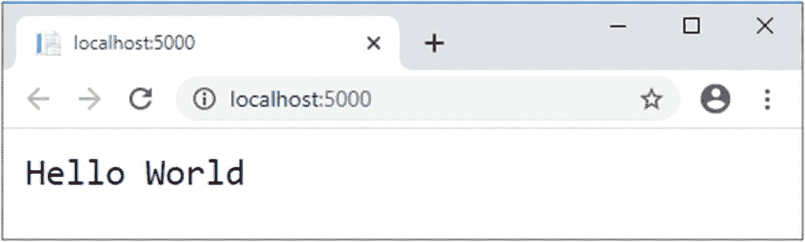

图 2-18。

动作方法的输出

### 了解路线

ASP.NET Core*路由*系统负责选择处理 HTTP 请求的端点。一个*路由*是一个用来决定如何处理请求的规则。创建项目时，创建了一个默认规则来开始。您可以请求以下任何 URL，它们将被分派给由`Home`控制器定义的`Index`动作:

*   `/`

*   `/Home`

*   `/Home/Index`

因此，当浏览器请求`http://yoursite/`或`http://yoursite/Home`时，它会从`HomeController`的`Index`方法获得输出。您可以通过在浏览器中更改 URL 来亲自尝试。目前，它将是`http://localhost:5000/`，除了端口部分可能会有所不同，如果您使用的是 Visual Studio。如果您将`/Home`或`/Home/Index`附加到 URL 并按下 Return，您将看到来自应用的相同的`Hello World`结果。

### 理解 HTML 呈现

上一个例子的输出不是 HTML——它只是字符串`Hello World`。为了产生对浏览器请求的 HTML 响应，我需要一个*视图*，它告诉 ASP.NET Core 如何将`Index`方法产生的结果处理成可以发送给浏览器的 HTML 响应。

#### 创建和渲染视图

我需要做的第一件事是修改我的`Index`动作方法，如清单 [2-6](#PC11) 所示。变化用粗体显示，这是我在本书中遵循的一个惯例，以使示例更容易理解。

```cs
using Microsoft.AspNetCore.Mvc;

namespace FirstProject.Controllers {

    public class HomeController : Controller {

        public ViewResult Index() {
            return View("MyView");
        }
    }
}

Listing 2-6.Rendering a View in the HomeController.cs File in the Controllers Folder

```

当我从一个动作方法返回一个`ViewResult`对象时，我正在指示 ASP.NET Core*渲染*一个视图。我通过调用`View`方法来创建`ViewResult`，指定我想要使用的视图的名称，即`MyView`。如果您运行该应用，您可以看到 ASP.NET Core 试图找到视图，如图 [2-19](#Fig19) 中显示的错误消息所示。

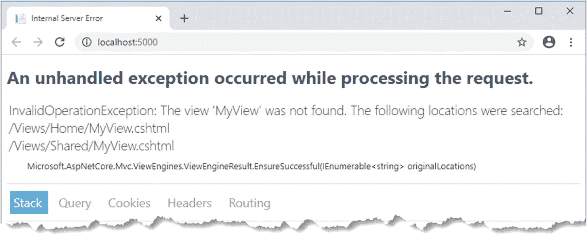

图 2-19。

试图找到一个视角

这是一条有用的错误消息。它解释了 ASP.NET Core 找不到我为动作方法指定的视图，并解释了它在哪里查找。视图存储在`Views`文件夹中，组织成子文件夹。例如，与`Home`控制器相关联的视图存储在一个名为`Views/Home`的文件夹中。不特定于单个控制器的视图存储在一个名为`Views/Shared`的文件夹中。用于创建项目的模板自动添加了`Home`和`Shared`文件夹，并添加了一些占位符视图来启动项目。

如果您使用的是 Visual Studio，请在解决方案资源管理器中右键单击`Views/Home`文件夹，并从弹出菜单中选择“添加➤新项”。Visual Studio 将为您提供一个模板列表，用于向项目中添加项。定位 Razor 视图项，可以在 ASP.NET Core➤网➤ASP.NET 板块找到，如图 [2-20](#Fig20) 所示。将新文件的名称设置为`MyView.cshtml`,然后单击 Add 按钮。Visual Studio 会将一个名为`MyView.cshtml`的文件添加到`Views/Home`文件夹中，并打开它进行编辑。用清单 [2-7](#PC12) 中显示的内容替换文件的内容。

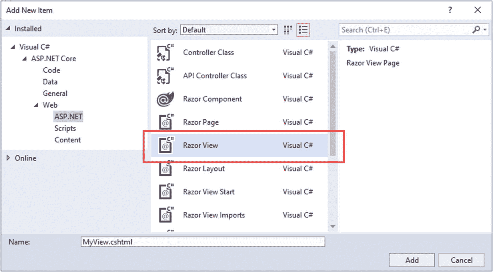

图 2-20。

选择 Visual Studio 项模板

Visual Studio 代码不提供项模板。相反，在文件资源管理器窗格中右键单击`Views/Home`文件夹，并从弹出菜单中选择新建文件。将文件名设置为`MyView.cshtml`并按回车键。文件将被创建并打开进行编辑。增加清单 [2-7](#PC12) 所示的内容。

Tip

很容易在错误的文件夹中创建视图文件。如果您没有在`Views/Home`文件夹中找到名为`MyView.cshtml`的文件，那么要么将该文件拖到正确的文件夹中，要么删除该文件并重试。

```cs
@{
    Layout = null;
}

<!DOCTYPE html>

<html>
<head>
    <meta name="viewport" content="width=device-width" />
    <title>Index</title>
</head>
<body>
    <div>
        Hello World (from the view)
    </div>
</body>
</html>

Listing 2-7.The Contents of the MyView.cshtml File in the Views/Home Folder

```

视图文件的新内容主要是 HTML。例外是看起来像这样的部分:

```cs
...
@{
    Layout = null;
}
...

```

这是一个将由 Razor 解释的表达式，Razor 是处理视图内容并生成发送到浏览器的 HTML 的组件。Razor 是一个*视图引擎*，视图中的表达式被称为 *Razor 表达式*。

清单 [2-7](#PC12) 中的 Razor 表达式告诉 Razor 我选择不使用布局，它就像是将被发送到浏览器的 HTML 的模板(我在第 [22 章](22.html)中描述过)。若要查看创建视图的效果，请停止正在运行的 ASP.NET Core，并从“调试”菜单中选择“启动而不调试”(对于 Visual Studio)或“运行而不调试”(对于 Visual Studio 代码)。一个新的浏览器窗口将打开并产生如图 [2-21](#Fig21) 所示的响应。

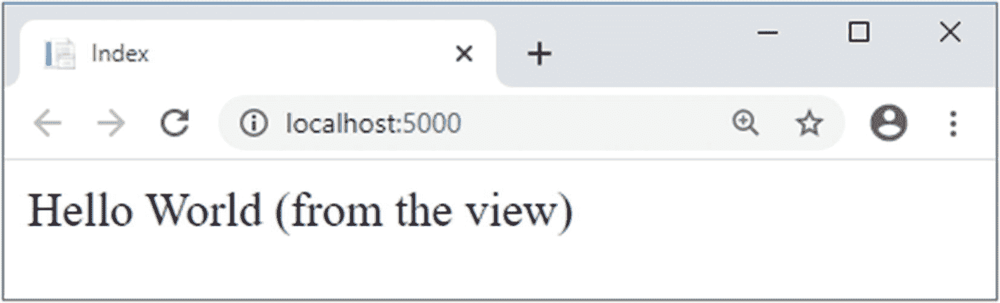

图 2-21。

渲染视图

当我第一次编辑`Index`动作方法时，它返回了一个`string`值。这意味着 ASP.NET Core 除了将字符串值原样传递给浏览器之外什么也不做。既然`Index`方法返回了一个`ViewResult`，Razor 就被用来处理一个视图并呈现一个 HTML 响应。Razor 能够定位视图，因为我遵循了标准的命名约定，即将视图文件放在一个文件夹中，该文件夹的名称与包含动作方法的控制器相匹配。在这种情况下，这意味着将视图文件放在`Views/Home`文件夹中，因为动作方法是由`Home`控制器定义的。

除了字符串和`ViewResult`对象，我还可以从 action 方法返回其他结果。例如，如果我返回一个`RedirectResult`，浏览器将被重定向到另一个 URL。如果我返回一个`HttpUnauthorizedResult`，我可以提示用户登录。这些对象统称为*动作结果*。动作结果系统允许您在动作中封装和重用常见的响应。我会告诉你更多关于它们的事情，并在第 19 章中解释它们的不同用法。

#### 添加动态输出

web 应用的全部目的是构建和显示动态的 T2 输出。action 方法的工作是构造数据并将其传递给视图，这样就可以使用它来创建基于数据值的 HTML 内容。动作方法通过向`View`方法传递参数来为视图提供数据，如清单 [2-8](#PC14) 所示。提供给视图的数据被称为*视图模型*。

```cs
using Microsoft.AspNetCore.Mvc;
using System;

namespace FirstProject.Controllers {

    public class HomeController : Controller {

        public ViewResult Index() {
            int hour = DateTime.Now.Hour;
            string viewModel = hour < 12 ? "Good Morning" : "Good Afternoon";
            return View("MyView", viewModel);
        }
    }
}

Listing 2-8.Providing a View Model in the HomeController.cs File in the Controllers Folder

```

本例中的视图模型是一个`string`，它作为`View`方法的第二个参数提供给视图。清单 [2-9](#PC15) 更新视图，以便它接收并使用它生成的 HTML 中的视图模型。

```cs
@model string
@{
    Layout = null;
}

<!DOCTYPE html>

<html>
<head>
    <meta name="viewport" content="width=device-width" />
    <title>Index</title>
</head>
<body>
    <div>
        @Model World (from the view)
    </div>
</body>
</html>

Listing 2-9.Using a View Model in the MyView.cshtml File in the Views/Home Folder

```

视图模型的类型是使用带有小写字母`m`的`@model`表达式指定的。视图模型值包含在 HTML 输出中，使用的是大写的`@Model`表达式`M`。(一开始可能很难记住哪个是小写，哪个是大写，但这很快就成了第二天性。)

当呈现视图时，action 方法提供的视图模型数据被插入到 HTML 响应中。选择 Start Without Debugging(使用 Visual Studio)或 Run Without Debugging(使用 Visual Studio 代码)，您将看到如图 [2-22](#Fig22) 所示的输出(尽管如果您在中午之后遵循此示例，您可能会看到下午的问候)。

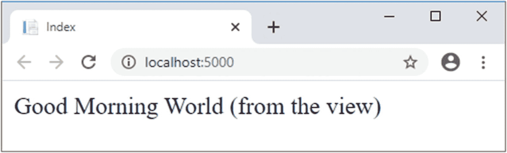

图 2-22。

生成动态内容

### 将碎片拼在一起

这是一个简单的结果，但是这个例子揭示了创建一个简单的 ASP.NET Core web 应用和生成动态响应所需的所有构件。ASP.NET Core 平台接收一个 HTTP 请求，并使用路由系统将请求 URL 匹配到一个端点。在这种情况下，端点是由`Home`控制器定义的`Index`动作方法。该方法被调用并产生一个包含视图名称和视图模型对象的`ViewResult`对象。Razor 视图引擎定位并处理视图，评估`@Model`表达式以将动作方法提供的数据插入到响应中，该响应返回给浏览器并显示给用户。当然，还有许多其他可用的功能，但这是 ASP.NET Core 的本质，值得在阅读本书的其余部分时记住这个简单的顺序。

## 摘要

在本章中，我解释了如何通过安装 Visual Studio 或 Visual Studio 代码以及。NET Core SDK。我向您展示了如何创建一个简单的项目，并简要解释了端点、视图和 URL 路由系统是如何协同工作的。在下一章，我将向您展示如何创建一个简单的数据输入应用。