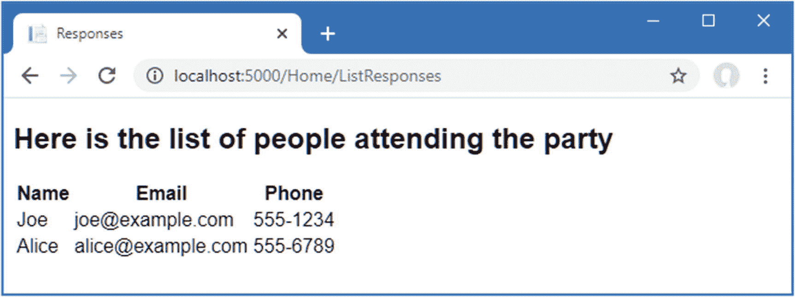

# 三、您的第一个 ASP.NET Core 应用

既然您已经为 ASP.NET Core 开发做好了准备，那么是时候创建一个简单的应用了。在本章中，您将使用 ASP.NET Core 创建一个数据输入应用。我的目标是演示 ASP.NET Core 的运行，所以我将加快速度，跳过一些关于幕后工作原理的解释。但是不用担心；我将在后面的章节中深入讨论这些主题。

## 设置场景

想象一下，一个朋友决定举办一个新年晚会，她要求我创建一个 web 应用，允许她邀请的人以电子方式回复。她要求这四个关键特征:

*   显示聚会信息的主页

*   可用于回复的表单

*   验证 RSVP 表单，这将显示一个感谢页面

*   显示谁将参加聚会的摘要页面

在这一章中，我创建了一个 ASP.NET Core 项目，并用它来创建一个包含这些特性的简单应用；一旦一切正常，我将应用一些样式来改善完成的应用的外观。

## 创建项目

从 Windows 开始菜单打开 PowerShell 命令提示符，导航到一个方便的位置，运行清单 [3-1](#PC1) 中的命令来创建一个名为`PartyInvites`的项目。

Tip

你可以从 [`https://github.com/apress/pro-asp.net-core-3`](https://github.com/apress/pro-asp.net-core-3) 下载本章以及本书其他章节的示例项目。如果在运行示例时遇到问题，请参见第 [1](01.html) 章获取帮助。

```cs
dotnet new globaljson --sdk-version 3.1.101 --output PartyInvites
dotnet new mvc --no-https --output PartyInvites --framework netcoreapp3.1

Listing 3-1.Creating a New Project

```

这些是我在第 [2](02.html) 章中用来创建项目的相同命令。如果你是一个 Visual Studio 用户，我会在第 4 章[中解释如何使用向导创建一个项目，但是这些命令很简单，可以确保你获得正确的项目起点，使用所需的版本。NET 核心。](04.html)

打开项目并编辑`Controllers`文件夹中的`HomeController.cs`文件，将内容替换为清单 [3-2](#PC2) 中所示的代码。

```cs
using Microsoft.AspNetCore.Mvc;

namespace PartyInvites.Controllers {
    public class HomeController : Controller {

        public IActionResult Index() {
            return View();
        }
    }
}

Listing 3-2.Replacing the Contents of the HomeController.cs File in the Controllers Folder

```

为新应用提供了一个清晰的起点，定义了一个选择默认视图进行呈现的操作方法。要向派对受邀者提供欢迎消息，请打开`Views/Home`文件夹中的`Index.cshtml`文件，并将内容替换为清单 [3-3](#PC3) 中所示的内容。

```cs
@{
    Layout = null;
}

<!DOCTYPE html>
<html>
<head>
    <meta name="viewport" content="width=device-width" />
    <title>Party!</title>
</head>
<body>
    <div>
        <div>
            We're going to have an exciting party.<br />
            (To do: sell it better. Add pictures or something.)
        </div>
    </div>
</body>
</html>

Listing 3-3.Replacing the Contents of the Index.cshtml File in the Views/Home Folder

```

通过选择不调试启动(对于 Visual Studio)或不调试运行(对于 Visual Studio 代码)来启动应用，你会看到聚会的详细信息(嗯，详细信息的占位符，但是你得到了思路)，如图 [3-1](#Fig1) 。


图 3-1。

添加到视图 HTML

### 添加数据模型

数据模型是任何 ASP.NET Core 应用最重要的部分。模型是现实世界的对象、过程和规则的表示，这些对象、过程和规则定义了应用的主题，即所谓的*域*。这个模型，通常被称为*域模型*，包含 C# 对象(被称为*域对象*)，它们组成了应用的世界以及操纵它们的方法。在大多数项目中，ASP.NET Core 应用的工作是为用户提供对数据模型的访问以及允许用户与之交互的特性。

ASP.NET Core 应用的惯例是数据模型类定义在一个名为`Models`的文件夹中，这个文件夹是由清单 [3-1](#PC1) 中使用的模板添加到项目中的。

对于`PartyInvites`项目，我不需要复杂的模型，因为它是如此简单的应用。事实上，我只需要一个名为`GuestResponse`的域类。此对象将代表来自被邀请者的 RSVP。

如果您使用的是 Visual Studio，右击`Models`文件夹并从弹出菜单中选择添加➤类。将类名设置为`GuestResponse.cs`,然后单击 Add 按钮。如果你使用的是 Visual Studio 代码，右击`Models`文件夹，选择新建文件，输入`GuestResponse.cs`作为文件名。使用新文件定义清单 [3-4](#PC4) 中所示的类。

```cs
namespace PartyInvites.Models {

    public class GuestResponse {

        public string Name { get; set; }
        public string Email { get; set; }
        public string Phone { get; set; }
        public bool? WillAttend { get; set; }
    }
}

Listing 3-4.The Contents of the GuestResponse.cs File in the Models Folder

```

Tip

您可能已经注意到，`WillAttend`属性是一个可空的`bool`，这意味着它可以是`true`、`false`或`null`。我将在本章后面的“添加验证”一节中解释其基本原理。

### 创建第二个操作和视图

我的应用目标之一是包含一个 RSVP 表单，这意味着我需要定义一个可以接收表单请求的动作方法。一个控制器类可以定义多个动作方法，惯例是将相关的动作组合在同一个控制器中。清单 [3-5](#PC5) 给`Home`控制器增加了一个新的动作方法。

```cs
using Microsoft.AspNetCore.Mvc;

namespace PartyInvites.Controllers {
    public class HomeController : Controller {

        public IActionResult Index() {
            return View();
        }

        public ViewResult RsvpForm() {
            return View();
        }
    }
}

Listing 3-5.Adding an Action Method in the HomeController.cs File in the Controllers Folder

```

两个动作方法都调用不带参数的`View`方法，这可能看起来很奇怪，但是记住 Razor 视图引擎在查找视图文件时会使用动作方法的名称。这意味着来自`Index`动作方法的结果告诉 Razor 寻找一个名为`Index.cshtml`的视图，而来自`RsvpForm`动作方法的结果告诉 Razor 寻找一个名为`RsvpForm.cshtml`的视图。

如果您使用的是 Visual Studio，右击`Views/Home`文件夹并从弹出菜单中选择`Add` ➤ `New Item`。选择 Razor 视图项目，将名称设置为`RsvpForm.cshtml,`并单击 Add 按钮创建文件。用清单 [3-6](#PC6) 所示内容替换。

如果您使用的是 Visual Studio 代码，右键单击`Views/Home`文件夹并从弹出菜单中选择新建文件。将文件名设置为`RsvpForm.cshtml`并添加清单 [3-6](#PC6) 所示的内容。

```cs
@{
    Layout = null;
}

<!DOCTYPE html>

<html>
<head>
    <meta name="viewport" content="width=device-width" />
    <title>RsvpForm</title>
</head>
<body>
    <div>
        This is the RsvpForm.cshtml View
    </div>
</body>
</html>

Listing 3-6.The Contents of the RsvpForm.cshtml File in the Views/Home Folder

```

这个内容目前只是静态的 HTML。若要测试新的操作方法和视图，请通过从“调试”菜单中选择“启动而不调试”或“运行而不调试”来启动应用。

使用打开的浏览器窗口，请求`http://localhost:5000/home/rsvpform`。(如果您使用的是 Visual Studio，则必须将端口更改为创建项目时分配的端口。)Razor 视图引擎定位`RsvpForm.cshtml`文件并使用它产生响应，如图 [3-2](#Fig2) 所示。


图 3-2。

呈现第二视图

### 链接操作方法

我希望能够从`Index`视图创建一个链接，这样访客就可以看到`RsvpForm`视图，而不必知道指向特定动作方法的 URL，如清单 [3-7](#PC7) 所示。

```cs
@{
    Layout = null;
}

<!DOCTYPE html>
<html>
<head>
    <meta name="viewport" content="width=device-width" />
    <title>Party!</title>
</head>
<body>
    <div>
        <div>
            We're going to have an exciting party.<br />
            (To do: sell it better. Add pictures or something.)
        </div>
        <a asp-action="RsvpForm">RSVP Now</a>
    </div>
</body>
</html>

Listing 3-7.Adding a Link in the Index.cshtml File in the Views/Home Folder

```

添加到清单中的是一个具有`asp-action`属性的`a`元素。该属性是一个*标签助手*属性的例子，它是 Razor 的一个指令，将在呈现视图时执行。`asp-action`属性是将`href`属性添加到包含动作方法 URL 的`a`元素的指令。我在第[25](25.html)–[27](27.html)章解释了标签助手是如何工作的，但是这个标签助手告诉 Razor 插入一个动作方法的 URL，这个动作方法是由当前视图正在呈现的同一个控制器定义的。可以看到帮助者通过运行项目创建的链接，如图 [3-3](#Fig3) 所示。


图 3-3。

行动方法之间的联系

将鼠标滚动到浏览器中的 RSVP Now 链接上。您将看到该链接指向以下 URL(考虑到 Visual Studio 将为您的项目分配的不同端口号):

```cs
http://localhost:5000/Home/RsvpForm

```

这里有一个重要的原则，那就是你应该使用 ASP.NET Core 提供的特性来生成 URL，而不是将它们硬编码到你的视图中。当 tag helper 为`a`元素创建了`href`属性时，它检查了应用的配置，以确定 URL 应该是什么。这允许改变应用的配置以支持不同的 URL 格式，而不需要更新任何视图。

### 构建表单

现在我已经创建了视图，并且可以从`Index`视图到达它，我将构建出`RsvpForm.cshtml`文件的内容，将它转换成用于编辑`GuestResponse`对象的 HTML 表单，如清单 [3-8](#PC9) 所示。

```cs
@model PartyInvites.Models.GuestResponse
@{
    Layout = null;
}

<!DOCTYPE html>

<html>
<head>
    <meta name="viewport" content="width=device-width" />
    <title>RsvpForm</title>
</head>
<body>
    <form asp-action="RsvpForm" method="post">
        <div>
            <label asp-for="Name">Your name:</label>
            <input asp-for="Name" />
        </div>
        <div>
            <label asp-for="Email">Your email:</label>
            <input asp-for="Email" />
        </div>
        <div>
            <label asp-for="Phone">Your phone:</label>
            <input asp-for="Phone" />
        </div>
        <div>
            <label>Will you attend?</label>
            <select asp-for="WillAttend">
                <option value="">Choose an option</option>
                <option value="true">Yes, I'll be there</option>
                <option value="false">No, I can't come</option>
            </select>
        </div>
        <button type="submit">Submit RSVP</button>
    </form>
</body>
</html>

Listing 3-8.Creating a Form View in the RsvpForm.cshtml File in the Views/Home Folder

```

`@model`表达式指定视图期望接收一个`GuestResponse`对象作为它的视图模型。我为`GuestResponse`模型类的每个属性定义了一个`label`和`input`元素(或者，在`WillAttend`属性的情况下，定义了一个`select`元素)。每个元素都使用`asp-for`属性与模型属性相关联，这是另一个标记辅助属性。标记辅助属性配置元素，以便将它们绑定到视图模型对象。下面是标签助手生成的 HTML 的一个例子:

```cs
<p>
    <label for="Name">Your name:</label>
    <input type="text" id="Name" name="Name" value="">
</p>

```

`label`元素上的`asp-for`属性设置`for`属性的值。`input`元素上的`asp-for`属性设置了`id`和`name`元素。这可能看起来不是特别有用，但是您将会看到，在定义应用功能时，将元素与模型属性相关联提供了额外的优势。

更直接的用途是应用于`form`元素的`asp-action`属性，它使用应用的 URL 路由配置将`action`属性设置为一个 URL，该 URL 将指向一个特定的操作方法，如下所示:

```cs
<form method="post" action="/Home/RsvpForm">

```

与我应用于`a`元素的 helper 属性一样，这种方法的好处是您可以更改应用使用的 URL 系统，并且由标记助手生成的内容将自动反映这些更改。

您可以通过运行应用并单击 RSVP Now 链接来查看表单，如图 [3-4](#Fig4) 所示。


图 3-4。

向应用添加 HTML 表单

### 接收表单数据

我还没有告诉 ASP.NET Core，当表单发送到服务器时，我想做什么。就目前情况而言，单击提交 RSVP 按钮只会清除您在表单中输入的任何值。这是因为表单回发到`Home`控制器中的`RsvpForm`动作方法，该方法只是再次呈现视图。为了接收和处理提交的表单数据，我将使用控制器的一个重要特性。我将添加第二个`RsvpForm`动作方法来创建以下内容:

*   *一种响应 HTTP* `GET` *请求的方法*:一个`GET`请求是浏览器在每次有人点击链接时正常发出的。这个版本的动作将负责在某人第一次访问`/Home/RsvpForm`时显示初始的空白表单。

*   *一种响应 HTTP* `POST` *请求*的方法:默认情况下，使用`Html.BeginForm()`呈现的表单由浏览器作为`POST`请求提交。这个版本的操作将负责接收提交的数据并决定如何处理它。

在不同的 C# 方法中处理`GET`和`POST`请求有助于保持我的控制器代码整洁，因为这两个方法有不同的职责。两个动作方法都是由同一个 URL 调用的，但是 ASP.NET Core 确保根据我处理的是`GET`还是`POST`请求来调用适当的方法。清单 [3-9](#PC12) 展示了`HomeController`类的变化。

```cs
using Microsoft.AspNetCore.Mvc;
using PartyInvites.Models;

namespace PartyInvites.Controllers {
    public class HomeController : Controller {

        public IActionResult Index() {
            return View();
        }

        [HttpGet]
        public ViewResult RsvpForm() {
            return View();
        }

        [HttpPost]
        public ViewResult RsvpForm(GuestResponse guestResponse) {
            // TODO: store response from guest
            return View();
        }
    }
}

Listing 3-9.Adding a Method in the HomeController.cs File in the Controllers Folder

```

我已经在现有的`RsvpForm`动作方法中添加了`HttpGet`属性，声明这个方法应该只用于`GET`请求。然后我添加了一个重载版本的`RsvpForm`方法，它接受一个`GuestResponse`对象。我将`HttpPost`属性应用于该方法，声明新方法将处理`POST`请求。在接下来的小节中，我将解释这些添加到清单中的内容是如何工作的。我还导入了`PartyInvites.Models`名称空间——这样我就可以引用`GuestResponse`模型类型，而不需要限定类名。

#### 了解模型绑定

`RsvpForm` action 方法的第一个重载呈现与之前相同的视图——`RsvpForm.cshtml`文件，生成如图 [3-4](#Fig4) 所示的表单。第二个重载因为参数而更加有趣，但是假设 action 方法将被调用以响应 HTTP `POST`请求，并且`GuestResponse`类型是 C# 类，那么这两者是如何连接的呢？

答案是*模型绑定*，这是一个有用的 ASP.NET Core 特性，通过它可以解析传入的数据，并使用 HTTP 请求中的键/值对来填充域模型类型的属性。

模型绑定是一个强大的可定制特性，它消除了直接处理 HTTP 请求的麻烦，并允许您处理 C# 对象，而不是处理浏览器发送的单个数据值。作为参数传递给动作方法的`GuestResponse`对象会自动填充表单字段中的数据。我将在第 28 章中深入探讨模型绑定的细节。

为了演示模型绑定如何工作，我需要做一些准备工作。应用的目标之一是呈现一个包含谁参加了聚会的详细信息的摘要页面，这意味着我需要跟踪我收到的响应。为此，我将创建一个内存中的对象集合。这在实际的应用中没有用，因为当应用停止或重启时，响应数据将会丢失，但是这种方法将允许我把重点放在 ASP.NET Core 上，并创建一个可以很容易地重置到其初始状态的应用。后面的章节将演示持久数据存储。

将名为`Repository.cs`的类文件添加到`Models`文件夹中，并使用它来定义清单 [3-10](#PC13) 中所示的类。

```cs
using System.Collections.Generic;

namespace PartyInvites.Models {
    public static class Repository {
        private static List<GuestResponse> responses = new List<GuestResponse>();

        public static IEnumerable<GuestResponse> Responses => responses;

        public static void AddResponse(GuestResponse response) {
            responses.Add(response);
        }
    }
}

Listing 3-10.The Contents of the Repository.cs File in the Models Folder

```

`Repository`类及其成员是`static`，这将使我很容易在应用的不同位置存储和检索数据。ASP.NET Core 提供了一种更复杂的方法来定义公共功能，称为*依赖注入*，我在第 14 章[中描述了它，但是对于这样一个简单的应用来说，静态类是一个很好的入门方式。](14.html)

#### 存储响应

现在我有了存储数据的地方，我可以更新接收 HTTP POST 请求的动作方法，如清单 [3-11](#PC14) 所示。

```cs
using Microsoft.AspNetCore.Mvc;
using PartyInvites.Models;

namespace PartyInvites.Controllers {
    public class HomeController : Controller {

        public IActionResult Index() {
            return View();
        }

        [HttpGet]
        public ViewResult RsvpForm() {
            return View();
        }

        [HttpPost]
        public ViewResult RsvpForm(GuestResponse guestResponse) {
            Repository.AddResponse(guestResponse);
            return View("Thanks", guestResponse);
        }
    }
}

Listing 3-11.Updating an Action Method in the HomeController.cs File in the Controllers Folder

```

在调用 POST 版本的`RsvpForm`方法之前，ASP.NET Core 模型绑定特性从 HTML 表单中提取值，并将它们分配给`GuestResponse`对象的属性。当调用该方法来处理 HTTP 请求时，结果被用作参数，而我要处理请求中发送的表单数据所要做的就是处理传递给 action 方法的`GuestResponse`对象——在本例中，将其作为参数传递给`Repository.AddResponse`方法，以便存储响应。

### 添加致谢视图

对`RsvpForm`动作方法中的`View`方法的调用创建了一个`ViewResult`，它选择了一个名为`Thanks`的视图，并使用由模型绑定器创建的`GuestResponse`对象作为视图模型。向`Views/Home`文件夹添加一个名为`Thanks.cshtml`的 Razor 视图，其内容如清单 [3-12](#PC15) 所示，以向用户呈现一个响应。

```cs
@model PartyInvites.Models.GuestResponse
@{
    Layout = null;
}

<!DOCTYPE html>

<html>
<head>
    <meta name="viewport" content="width=device-width" />
    <title>Thanks</title>
</head>
<body>
    <div>
        <h1>Thank you, @Model.Name!</h1>
        @if (Model.WillAttend == true) {
            @:It's great that you're coming. The drinks are already in the fridge!
        } else {
            @:Sorry to hear that you can't make it, but thanks for letting us know.
        }
    </div>
    Click <a asp-action="ListResponses">here</a> to see who is coming.
</body>
</html>

Listing 3-12.The Contents of the Thanks.cshtml File in the Views/Home Folder

```

由`Thanks.cshtml`视图生成的 HTML 依赖于由`RsvpForm`动作方法提供的分配给`GuestResponse`视图模型的值。为了访问域对象中的属性值，我使用了一个`@Model.<PropertyName>`表达式。例如，为了获得`Name`属性的值，我使用了`@Model.Name`表达式。如果 Razor 语法没有意义，不要担心——我会在第 21 章[中详细解释。](21.html)

现在我已经创建了`Thanks`视图，我有了一个处理表单的基本工作示例。启动应用，单击 RSVP Now 链接，向表单添加一些数据，然后单击 Submit RSVP 按钮。您将看到如图 [3-5](#Fig5) 所示的响应(尽管如果您的名字不是乔或者您说您不能参加，响应会有所不同)。


图 3-5。

感谢视图

### 显示响应

在`Thanks.cshtml`视图的末尾，我添加了一个`a`元素来创建一个链接，显示参加聚会的人的列表。我使用了`asp-action`标签辅助属性来创建一个 URL，它指向一个名为`ListResponses`的动作方法，如下所示:

```cs
...
<div>Click <a asp-action="ListResponses">here</a> to see who is coming.</div>
...

```

如果将鼠标悬停在浏览器显示的链接上，您会看到它指向的是`/Home/ListResponses` URL。这与`Home`控制器中的任何操作方法都不对应，如果您单击该链接，您将看到 404 Not Found 错误响应。

要添加一个处理 URL 的端点，我需要向`Home`控制器添加另一个动作方法，如清单 [3-13](#PC17) 所示。

```cs
using Microsoft.AspNetCore.Mvc;
using PartyInvites.Models;
using System.Linq;

namespace PartyInvites.Controllers {
    public class HomeController : Controller {

        public IActionResult Index() {
            return View();
        }

        [HttpGet]
        public ViewResult RsvpForm() {
            return View();
        }

        [HttpPost]
        public ViewResult RsvpForm(GuestResponse guestResponse) {
            Repository.AddResponse(guestResponse);
            return View("Thanks", guestResponse);
        }

        public ViewResult ListResponses() {
            return View(Repository.Responses.Where(r => r.WillAttend == true));
        }
    }
}

Listing 3-13.Adding an Action Method in the HomeController.cs File in the Controllers Folder

```

新的动作方法被称为`ListResponses`，它调用`View`方法，使用`Repository.Responses`属性作为参数。这将导致 Razor 呈现默认视图，使用动作方法名称作为视图文件的名称，并使用来自存储库的数据作为视图模型。使用 LINQ 过滤视图模型数据，以便只向视图提供肯定的响应。

将名为`ListResponses.cshtml`的 Razor 视图添加到`Views/Home`文件夹中，内容如清单 [3-14](#PC18) 所示。

```cs
@model IEnumerable<PartyInvites.Models.GuestResponse>
@{
    Layout = null;
}

<!DOCTYPE html>

<html>
<head>
    <meta name="viewport" content="width=device-width" />
    <title>Responses</title>
</head>
<body>
    <h2>Here is the list of people attending the party</h2>
    <table>
        <thead>
            <tr><th>Name</th><th>Email</th><th>Phone</th></tr>
        </thead>
        <tbody>
            @foreach (PartyInvites.Models.GuestResponse r in Model) {
                <tr>
                    <td>@r.Name</td>
                    <td>@r.Email</td>
                    <td>@r.Phone</td>
                </tr>
            }
        </tbody>
    </table>
</body>
</html>

Listing 3-14.Displaying Acceptances in the ListResponses.cshtml File in the Views/Home Folder

```

Razor 视图文件的扩展名为`.cshtml`，因为它们是 C# 代码和 HTML 元素的混合。您可以在清单 [3-14](#PC18) 中看到这一点，其中我使用了一个`@foreach`表达式来处理每个`GuestResponse`对象，这些对象是 action 方法使用`View`方法传递给视图的。与普通的 C# `foreach`循环不同，Razor `@foreach`表达式的主体包含 HTML 元素，这些元素被添加到将被发送回浏览器的响应中。在这个视图中，每个`GuestResponse`对象生成一个`tr`元素，其中包含用对象属性值填充的`td`元素。

启动应用，提交一些表单数据，然后单击链接查看响应列表。您将看到自应用启动以来您输入的数据的摘要，如图 [3-6](#Fig6) 所示。该视图并没有以一种吸引人的方式呈现数据，但是目前已经足够了，我将在本章的后面讨论应用的样式。



图 3-6。

显示聚会参加者的列表

### 添加验证

我现在可以向应用添加数据验证了。如果没有验证，用户可能会输入无意义的数据，甚至提交一个空表单。在 ASP.NET Core 应用中，验证规则是通过将属性应用于模型类来定义的，这意味着相同的验证规则可以应用于使用该类的任何表单。ASP.NET Core 依赖于来自`System.ComponentModel.DataAnnotations`名称空间的属性，我已经将其应用于清单 [3-15](#PC19) 中的`GuestResponse`类。

```cs
using System.ComponentModel.DataAnnotations;

namespace PartyInvites.Models {

    public class GuestResponse {

        [Required(ErrorMessage = "Please enter your name")]
        public string Name { get; set; }

        [Required(ErrorMessage = "Please enter your email address")]
        [EmailAddress]
        public string Email { get; set; }

        [Required(ErrorMessage = "Please enter your phone number")]
        public string Phone { get; set; }

        [Required(ErrorMessage = "Please specify whether you'll attend")]
        public bool? WillAttend { get; set; }
    }
}

Listing 3-15.Applying Validation in the GuestResponse.cs File in the Models Folder

```

ASP.NET Core 检测属性，并在模型绑定过程中使用它们来验证数据。

Tip

如前所述，我为`WillAttend`属性使用了一个可空的`bool`。我这样做是为了应用`Required`验证属性。如果我使用了常规的`bool`，我通过模型绑定得到的值只能是`true`或`false`，我将无法判断用户是否选择了一个值。可空的`bool`有三个可能的值:`true`、`false`和`null`。如果用户没有选择值，浏览器会发送一个`null`值，这会导致`Required`属性报告一个验证错误。这是一个很好的例子，说明 ASP.NET Core 如何优雅地将 C# 特性与 HTML 和 HTTP 相结合。

我使用接收表单数据的动作方法中的`ModelState.IsValid`属性检查是否存在验证问题，如清单 [3-16](#PC20) 所示。

```cs
using Microsoft.AspNetCore.Mvc;
using PartyInvites.Models;
using System.Linq;

namespace PartyInvites.Controllers {
    public class HomeController : Controller {

        public IActionResult Index() {
            return View();
        }

        [HttpGet]
        public ViewResult RsvpForm() {
            return View();
        }

        [HttpPost]
        public ViewResult RsvpForm(GuestResponse guestResponse) {
            if (ModelState.IsValid) {
                Repository.AddResponse(guestResponse);
                return View("Thanks", guestResponse);
            } else {
                return View();
            }
        }

        public ViewResult ListResponses() {
            return View(Repository.Responses.Where(r => r.WillAttend == true));
        }
    }
}

Listing 3-16.Checking for Validation Errors in the HomeController.cs File in the Controllers Folder

```

`Controller`基类提供了一个名为`ModelState`的属性，该属性提供了模型绑定过程结果的细节。如果`ModelState.IsValid`属性返回`true`，那么我知道模型绑定器已经能够满足我通过`GuestResponse`类上的属性指定的验证约束。当这种情况发生时，我渲染`Thanks`视图，就像我之前做的那样。

如果`ModelState.IsValid`属性返回`false`，那么我知道存在验证错误。由`ModelState`属性返回的对象提供了已经遇到的每个问题的细节，但是我不需要进入那个细节层次，因为我可以依靠一个有用的特性，它通过调用没有任何参数的`View`方法来自动处理要求用户解决任何问题的过程。

当它呈现一个视图时，Razor 可以访问与请求相关的任何验证错误的细节，并且标记助手可以访问这些细节以向用户显示验证错误。清单 [3-17](#PC21) 展示了向`RsvpForm`视图添加验证标签助手属性。

```cs
@model PartyInvites.Models.GuestResponse
@{
    Layout = null;
}

<!DOCTYPE html>

<html>
<head>
    <meta name="viewport" content="width=device-width" />
    <title>RsvpForm</title>
</head>
<body>
    <form asp-action="RsvpForm" method="post">
        <div asp-validation-summary="All"></div>
        <div>
            <label asp-for="Name">Your name:</label>
            <input asp-for="Name" />
        </div>
        <div>
            <label asp-for="Email">Your email:</label>
            <input asp-for="Email" />
        </div>
        <div>
            <label asp-for="Phone">Your phone:</label>
            <input asp-for="Phone" />
        </div>
        <div>
            <label>Will you attend?</label>
            <select asp-for="WillAttend">
                <option value="">Choose an option</option>
                <option value="true">Yes, I'll be there</option>
                <option value="false">No, I can't come</option>
            </select>
        </div>
        <button type="submit">Submit RSVP</button>
    </form>
</body>
</html>

Listing 3-17.Adding a Validation Summary to the RsvpForm.cshtml File in the Views/Home Folder

```

`asp-validation-summary`属性被应用到一个`div`元素，当视图被呈现时，它显示一个验证错误列表。`asp-validation-summary`属性的值是一个名为`ValidationSummary`的枚举值，它指定了摘要将包含什么类型的验证错误。我指定了`All`，这对于大多数应用来说是一个很好的起点，我在第 [29 章](29.html)中描述了其他值并解释了它们是如何工作的。

要查看验证摘要是如何工作的，运行应用，填写`Name`字段，然后提交表单，不输入任何其他数据。您将看到验证错误的汇总，如图 [3-7](#Fig7) 所示。


图 3-7。

显示验证错误

在应用于`GuestResponse`类的所有验证约束得到满足之前，`RsvpForm`动作方法不会呈现`Thanks`视图。注意，当 Razor 呈现带有验证摘要的视图时，在`Name`字段中输入的数据被保存并再次显示。这是模型绑定的另一个好处，它简化了表单数据的处理。

#### 突出显示无效字段

将模型属性与元素相关联的标签辅助属性有一个方便的特性，可以与模型绑定结合使用。当模型类属性验证失败时，助手属性将生成稍微不同的 HTML。下面是在没有验证错误时为 Phone 字段生成的`input`元素:

```cs
<input type="text" data-val="true" data-val-required="Please enter your phone number" id="Phone" name="Phone" value="">

```

作为比较，下面是用户提交表单后没有在文本字段中输入数据的同一个 HTML 元素(这是一个验证错误，因为我将`Required`属性应用于`GuestResponse`类的`Phone`属性):

```cs
<input type="text" class="input-validation-error" data-val="true"
    data-val-required="Please enter your phone number" id="Phone"
    name="Phone" value="">

```

我强调了不同之处:`asp-for`标签助手属性将`input`元素添加到一个名为`input-validation-error`的类中。我可以通过创建一个样式表来利用这个特性，这个样式表包含这个类的 CSS 样式和不同 HTML helper 属性使用的其他样式。

ASP.NET Core 项目的惯例是，交付给客户的静态内容放在`wwwroot`文件夹中，并按内容类型组织，这样 CSS 样式表放在`wwwroot/css`文件夹中，JavaScript 文件放在`wwwroot/js`文件夹中，等等。

Tip

当使用 Web 应用模板创建项目时，Visual Studio 会在`wwwroot/css`文件夹中创建一个`site.css`文件。你可以忽略这个文件，我在本章中没有用到它。

如果您使用的是 Visual Studio，右击`wwwroot/css`文件夹并从弹出菜单中选择添加➤新项。定位样式表项模板，如图 [3-8](#Fig8) 所示；将文件名设置为`styles.css;`,然后点击 Add 按钮。


图 3-8。

创建 CSS 样式表

如果您使用的是 Visual Studio 代码，右键单击`wwwroot/css`文件夹，从弹出菜单中选择 New File，并使用`styles.css`作为文件名。不管你使用哪种编辑器，用清单 [3-18](#PC24) 中所示的样式替换文件的内容。

```cs
.field-validation-error    {color: #f00;}
.field-validation-valid    { display: none;}
.input-validation-error    { border: 1px solid #f00; background-color: #fee; }
.validation-summary-errors { font-weight: bold; color: #f00;}
.validation-summary-valid  { display: none;}

Listing 3-18.The Contents of the styles.css File in the wwwroot/css Folder

```

为了应用这个样式表，我向`RsvpForm`视图的`head`部分添加了一个`link`元素，如清单 [3-19](#PC25) 所示。

```cs
...
<head>
    <meta name="viewport" content="width=device-width" />
    <title>RsvpForm</title>
    <link rel="stylesheet" href="/css/styles.css" />
</head>
...

Listing 3-19.Applying a Stylesheet in the RsvpForm.cshtml File in the Views/Home Folder

```

元素使用属性来指定样式表的位置。请注意，URL 中省略了`wwwroot`文件夹。ASP.NET 的默认配置包括支持提供静态内容，比如图像、CSS 样式表和 JavaScript 文件，并且它自动将请求映射到`wwwroot`文件夹。随着样式表的应用，当提交导致验证错误的数据时，会显示更明显的验证错误，如图 [3-9](#Fig9) 所示。


图 3-9。

自动突出显示的验证错误

### 设计内容的样式

应用的所有功能目标都已经完成，但是应用的整体外观很差。当你使用`mvc`模板创建一个项目时，正如我在本章的例子中所做的，一些常见的客户端开发包被安装。虽然我不喜欢使用模板项目，但我确实喜欢微软选择的客户端库。其中一个叫做 Bootstrap，这是一个很好的 CSS 框架，最初由 Twitter 开发，已经成为一个主要的开源项目和 web 应用开发的支柱。

#### 欢迎视图的样式

基本的引导特性通过将类应用于元素来工作，这些元素对应于添加到`wwwroot/lib/bootstrap`文件夹的文件中定义的 CSS 选择器。你可以从 [`http://getbootstrap.com`](http://getbootstrap.com) 中获得 Bootstrap 定义的类的全部细节，但是你可以在清单 [3-20](#PC26) 中看到我是如何对`Index.cshtml`视图文件应用一些基本样式的。

```cs
@{
    Layout = null;
}

<!DOCTYPE html>

<html>
<head>
    <meta name="viewport" content="width=device-width" />
    <link rel="stylesheet" href="/lib/bootstrap/dist/css/bootstrap.css" />
    <title>Index</title>
</head>
<body>
    <div class="text-center">
        <h3> We're going to have an exciting party!</h3>
        <h4>And YOU are invited!</h4>
        <a class="btn btn-primary" asp-action="RsvpForm">RSVP Now</a>
    </div>
</body>
</html>

Listing 3-20.Adding Bootstrap to the Index.cshtml File in the Views/Home Folder

```

我添加了一个`link`元素，它的`href`属性从`wwwroot/lib/bootstrap/dist/css`文件夹中加载`bootstrap.css`文件。惯例是第三方 CSS 和 JavaScript 包被安装到`wwwroot/lib`文件夹中，我在第 [12 章](12.html)中描述了用于管理这些包的工具。

导入 Bootstrap 样式表后，我需要设计元素的样式。这是一个简单的例子，所以我只需要使用少量的引导 CSS 类:`text-center`、`btn`和`btn-primary`。

`text-center`类将元素及其子元素的内容居中。`btn`类将一个`button`、`input`或`a`元素设计成一个漂亮的按钮，而`btn-primary class`指定了我想要按钮的颜色范围。运行应用就可以看到效果，如图 [3-10](#Fig10) 所示。


图 3-10。

设置视图样式

很明显，我不是一个网页设计师。事实上，作为一个孩子，我可以不上艺术课，因为我完全没有任何天赋。这带来了快乐的结果，让我有更多的时间上数学课，但也意味着我的艺术技能还没有超过一般 10 岁孩子的水平。对于一个真正的项目，我会寻求一个专业人士来帮助设计和风格的内容，但对于这个例子，我要单干，这意味着应用引导尽可能多的限制和一致性，我可以召集。

#### 设置窗体视图的样式

Bootstrap 定义了可用于设计表单样式的类。我不打算详述，但是你可以在清单 [3-21](#PC27) 中看到我是如何应用这些类的。

```cs
@model PartyInvites.Models.GuestResponse
@{
    Layout = null;
}

<!DOCTYPE html>

<html>
<head>
    <meta name="viewport" content="width=device-width" />
    <title>RsvpForm</title>
    <link rel="stylesheet" href="/css/styles.css" />
    <link rel="stylesheet" href="/lib/bootstrap/dist/css/bootstrap.css" />
</head>
<body>
    <h5 class="bg-primary text-white text-center m-2 p-2">RSVP</h5>
    <form asp-action="RsvpForm" method="post" class="m-2">
        <div asp-validation-summary="All"></div>
        <div class="form-group">
            <label asp-for="Name">Your name:</label>
            <input asp-for="Name" class="form-control" />
        </div>
        <div class="form-group">
            <label asp-for="Email">Your email:</label>
            <input asp-for="Email" class="form-control" />
        </div>
        <div class="form-group">
            <label asp-for="Phone">Your phone:</label>
            <input asp-for="Phone" class="form-control" />
        </div>
        <div class="form-group">
            <label>Will you attend?</label>
            <select asp-for="WillAttend" class="form-control">
                <option value="">Choose an option</option>
                <option value="true">Yes, I'll be there</option>
                <option value="false">No, I can't come</option>
            </select>
        </div>
        <button type="submit" class="btn btn-primary">Submit RSVP</button>
    </form>
</body>
</html>

Listing 3-21.Adding Bootstrap to the RsvpForm.cshtml File in the Views/Home Folder

```

本例中的 Bootstrap 类创建了一个 header，只是为了给布局提供结构。为了设计表单的样式，我使用了`form-group`类，该类用于设计包含`label`和关联的`input`或`select`元素的元素，该元素被分配给`form-control`类。您可以在图 [3-11](#Fig11) 中看到样式的效果。


图 3-11。

样式化 RsvpForm 视图

#### 感谢视图的样式

下一个要样式化的视图文件是`Thanks.cshtml`，你可以在清单 [3-22](#PC28) 中看到我是如何做到的，使用的 CSS 类与我在其他视图中使用的相似。为了使应用更容易管理，尽可能避免重复代码和标记是一个很好的原则。ASP.NET Core 提供了几个特性来帮助减少重复，我将在后面的章节中描述。这些特征包括 Razor 布局(第[章 22](22.html) )、局部视图(第[章 22](22.html) )和视图组件(第[章 24](24.html) )。

```cs
@model PartyInvites.Models.GuestResponse
@{
    Layout = null;
}

<!DOCTYPE html>

<html>
<head>
    <meta name="viewport" content="width=device-width" />
    <title>Thanks</title>
    <link rel="stylesheet" href="/lib/bootstrap/dist/css/bootstrap.css" />
</head>
<body class="text-center">
    <div>
        <h1>Thank you, @Model.Name!</h1>
        @if (Model.WillAttend == true) {
            @:It's great that you're coming. The drinks are already in the fridge!
        } else {
            @:Sorry to hear that you can't make it, but thanks for letting us know.
        }
    </div>
    Click <a asp-action="ListResponses">here</a> to see who is coming.</div>
</body>
</html>

Listing 3-22.Applying Bootstrap to the Thanks.cshtml File in the Views/Home Folder

```

图 [3-12](#Fig12) 显示了样式的效果。


图 3-12。

感谢视图的样式

#### 设置列表视图的样式

style 的最终视图是`ListResponses`，它显示了与会者的列表。内容的样式遵循与其他视图相同的方法，如清单 [3-23](#PC29) 所示。

```cs
@model IEnumerable<PartyInvites.Models.GuestResponse>
@{
    Layout = null;
}

<!DOCTYPE html>

<html>
<head>
    <meta name="viewport" content="width=device-width" />
    <title>Responses</title>
    <link rel="stylesheet" href="/lib/bootstrap/dist/css/bootstrap.css" />
</head>
<body>
    <div class="text-center p-2">
        <h2>Here is the list of people attending the party</h2>
        <table class="table table-bordered table-striped table-sm">
            <thead>
                <tr><th>Name</th><th>Email</th><th>Phone</th></tr>
            </thead>
            <tbody>
                @foreach (PartyInvites.Models.GuestResponse r in Model) {
                    <tr>
                        <td>@r.Name</td>
                        <td>@r.Email</td>
                        <td>@r.Phone</td>
                    </tr>
                }
            </tbody>
        </table>
    </div>
</body>
</html>

Listing 3-23.Adding Bootstrap to the ListResponses.cshtml File in the Views/Home Folder

```

图 [3-13](#Fig13) 显示了与会者列表的呈现方式。将这些样式添加到视图中就完成了示例应用，它现在满足了所有的开发目标，并具有改进的外观。


图 3-13。

样式化 ListResponses 视图

## 摘要

在这一章中，我创建了一个新的 ASP.NET Core 项目，并用它构建了一个简单的数据输入应用，让您初步了解了 ASP.NET 的重要特性，比如标记助手、模型绑定和数据验证。在下一章，我将描述用于 ASP.NET Core 开发的开发工具。