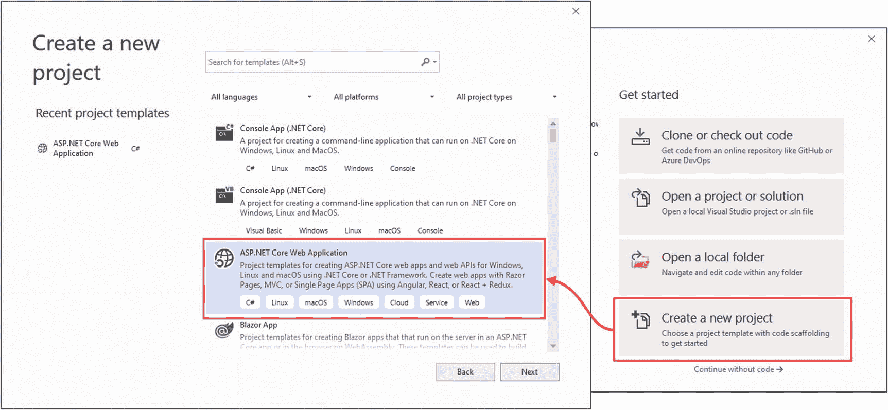

# 四、使用开发工具

在这一章中，我将介绍微软为 ASP.NET Core 开发提供的工具，这些工具将在本书中使用。

与本书的早期版本不同，我依赖于。Microsoft 发布的. NET Core SDK 和附加工具包。在某种程度上，我这样做是为了帮助确保您从示例中获得预期的结果，而且还因为命令行工具提供了对 ASP.NET Core 开发所需的所有特性的访问，而不管您选择了哪个编辑器/IDE。

Visual Studio——以及在较小程度上，Visual Studio 代码——通过用户界面提供对一些工具的访问，我在本章中对此进行了描述，但是 Visual Studio 和 Visual Studio 代码并不支持 ASP.NET Core 开发所需的所有功能，所以有时使用命令行是不可避免的。

随着 ASP.NET Core 的发展，我已经逐渐转向只使用命令行工具，除了当我需要使用调试器时(尽管，正如我在本章后面解释的，这是一个罕见的需求)。您的偏好可能不同，尤其是如果您习惯于完全在 IDE 中工作，但是我的建议是尝试一下命令行工具。它们简单、简洁、可预测，但对于 Visual Studio 和 Visual Studio 代码所提供的所有等效功能来说，却不是这样。表 [4-1](#Tab1) 总结了本章内容。

表 4-1。

章节总结

<colgroup><col class="tcol1 align-left"> <col class="tcol2 align-left"> <col class="tcol3 align-left"></colgroup> 
| 

问题

 | 

解决办法

 | 

列表

 |
| --- | --- | --- |
| 创建项目 | 使用`dotnet new`命令或 Visual Studio 向导 | 1–4 |
| 构建和运行项目 | 使用`dotnet build`和`dotnet run`命令或使用 Visual Studio 和 Visual Studio 代码提供的菜单 | 5–7 |
| 将包添加到项目中 | 使用`dotnet add package`命令或使用 Visual Studio 包管理器 | 8–10 |
| 安装工具命令 | 使用`dotnet tool`命令 | 11, 12 |
| 管理客户端包 | 使用`libman`命令或 Visual Studio 客户端包管理器 | 13–16 |

## 创建 ASP.NET Core 项目

那个。NET Core SDK 包括一组用于创建、管理、构建和运行项目的命令行工具。Visual Studio 为其中一些任务提供了集成支持，但是如果您使用的是 Visual Studio 代码，那么命令行是唯一的选择。

我甚至在使用 Visual Studio 时也使用命令行工具，因为它们简单明了，而 Visual Studio 的特性往往需要花费更多的精力来找到我需要的模板或设置。在接下来的小节中，我将向您展示如何创建和使用这两套工具。无论您选择哪种方法，结果都是一样的，并且您可以在 Visual Studio 和命令行工具之间自由切换。

Tip

你可以从 [`https://github.com/apress/pro-asp.net-core-3`](https://github.com/apress/pro-asp.net-core-3) 下载本章以及本书其他章节的示例项目。如果在运行示例时遇到问题，请参见第 [1](01.html) 章获取帮助。

### 使用命令行创建项目

`dotnet`命令提供了对。NET 核心命令行功能。`dotnet new`命令用于创建新的项目、配置文件或解决方案文件。要查看可用于创建新项目的模板列表，请打开 PowerShell 命令提示符并运行清单 [4-1](#PC1) 中所示的命令。

```cs
dotnet new

Listing 4-1.Listing the .NET Core Templates

```

每个模板都有一个简短的名称，以便于使用。有很多可用的模板，但是表 [4-2](#Tab2) 描述了对创建 ASP.NET Core 项目最有用的模板。

表 4-2。

有用的 ASP.NET Core 项目模板

<colgroup><col class="tcol1 align-left"> <col class="tcol2 align-left"></colgroup> 
| 

名字

 | 

描述

 |
| --- | --- |
| `web` | 该模板创建的项目具有 ASP.NET Core 开发所需的最少代码和内容。这是我在本书的大部分章节中使用的模板。 |
| `mvc` | 该模板创建了一个配置为使用 MVC 框架的 ASP.NET Core 项目。 |
| `webapp` | 该模板创建了一个配置为使用 Razor 页面的 ASP.NET Core 项目。 |
| `blazorserver` | 该模板创建一个配置为使用 Blazor 服务器的 ASP.NET Core 项目。 |
| `angular` | 该模板使用 Angular JavaScript 框架创建了一个包含客户端特性的 ASP.NET Core 项目。 |
| `react` | 该模板使用 React JavaScript 框架创建了一个包含客户端特性的 ASP.NET Core 项目。 |
| `reactredux` | 该模板使用 React JavaScript 框架和流行的 Redux 库创建了一个包含客户端特性的 ASP.NET Core 项目。 |

还有一些模板可以创建用于配置项目的常用文件，如表 [4-3](#Tab3) 中所述。

Understanding the Limitations of Project Templates

表 [4-2](#Tab2) 中描述的项目模板旨在通过处理基本配置设置和添加占位符内容来帮助快速启动开发。

这些模板可以给你一种快速进步的感觉，但是它们包含了关于项目应该如何配置和开发的假设。如果您不理解这些假设的影响，您将无法获得项目特定需求所需的结果。

`web`模板使用 ASP.NET Core 开发所需的最小配置创建一个项目。这是我在本书的大多数例子中使用的项目模板，这样我就可以解释每个特性是如何配置的，以及这些特性是如何一起使用的。

一旦你理解了 ASP.NET Core 是如何工作的，其他的项目模板会很有用，因为你知道如何根据你的需要来调整它们。但是，当你在学习的时候，我建议你坚持使用`web`模板，即使这可能需要更多的努力才能得到结果。

表 4-3。

配置项模板

<colgroup><col class="tcol1 align-left"> <col class="tcol2 align-left"></colgroup> 
| 

名字

 | 

描述

 |
| --- | --- |
| `globaljson` | 这个模板将一个`global.json`文件添加到一个项目中，指定。将使用的 NET Core。 |
| `sln` | 此模板创建一个解决方案文件，该文件用于对多个项目进行分组，通常由 Visual Studio 使用。解决方案文件由`dotnet sln add`命令填充，如下面的清单所示。 |
| `gitignore` | 该模板创建一个`.gitignore`文件，从 Git 源代码控制中排除不需要的项目。 |

要创建一个项目，打开一个新的 PowerShell 命令提示符并运行清单 [4-2](#PC2) 中所示的命令。

```cs
dotnet new globaljson --sdk-version 3.1.101 --output MySolution/MyProject
dotnet new web --no-https --output MySolution/MyProject --framework netcoreapp3.1
dotnet new sln -o MySolution

dotnet sln MySolution add MySolution/MyProject

Listing 4-2.Creating a New Project

```

第一个命令创建一个包含一个`global.json`文件的`MySolution/MyProject`文件夹，该文件指定项目将使用。NET Core 版本 3.1.1。顶层文件夹名为`MySolution`，用于将多个项目组合在一起。嵌套的`MyProject`文件夹将包含单个项目。

我使用`globaljson`模板来帮助确保您在遵循本书中的示例时获得预期的结果。微软擅长确保向后兼容。NET 核心版本，但是会发生突破性的变化，向项目中添加一个`global.json`文件是一个好主意，这样开发团队中的每个人都会使用相同的版本。

第二个命令使用`web`模板创建项目，我在本书的大多数例子中都使用这个模板。如表 [4-3](#Tab3) 所示，该模板创建了一个 ASP.NET Core 开发所需的最少内容的项目。每个模板都有自己的一组参数，这些参数会影响所创建的项目。`--no-https`论点创建了一个不支持 HTTPS 的项目。(我会在第 16 章[解释如何使用 HTTPS。)的`--framework`参数选择了。将用于项目的. NET Core 运行时。](16.html)

其他命令创建引用新项目的解决方案文件。解决方案文件是同时打开多个相关文件的便捷方式。在`MySolution`文件夹中创建了一个`MySolution.sln`文件，在 Visual Studio 中打开这个文件将加载用 web 模板创建的项目。这不是必需的，但它会阻止 Visual Studio 在您退出代码编辑器时提示您创建该文件。

#### 打开项目

要打开项目，请启动 Visual Studio，选择“打开项目或解决方案”，并打开`MySolution`文件夹中的`MySolution.sln`文件。Visual Studio 将打开该解决方案文件，找到对清单 [4-2](#PC2) 中最后一个命令添加的项目的引用，并打开该项目。

Visual Studio 代码的工作方式不同。启动 Visual Studio 代码，选择文件➤打开文件夹，并导航到`MySolution`文件夹。单击“选择文件夹”，Visual Studio 代码将打开该项目。

尽管 Visual Studio 代码和 Visual Studio 处理的是同一个项目，但它们各自显示的内容不同。Visual Studio 代码向您展示了一个简单的文件列表，按字母顺序排列，如图 [4-1](#Fig1) 左侧所示。Visual Studio 隐藏了一些文件，并将其他文件嵌套在相关文件项中，如图 [4-1](#Fig1) 右图所示。


图 4-1。

在 Visual Studio 代码和 Visual Studio 中打开项目

Visual Studio 解决方案资源管理器的顶部有一些按钮，用于禁用文件嵌套并显示项目中的隐藏项。在 Visual Studio 代码中第一次打开项目时，可能会提示您添加用于构建和调试项目的资产，如图 [4-2](#Fig2) 所示。单击是按钮。


图 4-2。

在 Visual Studio 代码中添加资产

### 使用 Visual Studio 创建项目

Visual Studio 以相同的方式创建项目，使用相同的模板，但提供了一个向导。虽然我更倾向于使用命令行，但是如果您仔细注意您在这个过程中选择的选项，结果是一样的。启动 Visual Studio，点击“新建项目”，然后选择 ASP.NET Core Web 应用类别，如图 [4-3](#Fig3) 所示，点击下一步按钮。



图 4-3。

在 Visual Studio 中创建新项目

在“项目名称”栏输入我的**项目**，在“解决方案名称”栏输入我的**解决方案**，如图 [4-4](#Fig4) 所示。使用“位置”字段选择一个方便的文件夹来创建项目，然后单击“创建”按钮。


图 4-4。

选择项目和解决方案名称

下一步需要密切关注，因为它很容易出错，所以我在本书的例子中使用了命令行工具。首先，使用窗口顶部的下拉菜单进行选择。网络核心和 ASP.NET Core 3.1。接下来，从列表中选择空模板。尽管使用了名称 *Empty* ，但是添加到项目中的内容对应于`web`模板。

取消选中“为 HTTPS 配置”选项(相当于`--no-https`命令行参数),并确保取消选中“启用 Docker 支持”选项，将“认证”选项设置为“无认证”,如图 [4-5](#Fig5) 所示。


图 4-5。

选择和配置项目模板

点击创建按钮，Visual Studio 将创建项目和解决方案文件，然后打开它们进行编辑，如图 [4-6](#Fig6) 所示。


图 4-6。

Visual Studio 解决方案资源管理器中的新项目

项目打开后，右键单击解决方案资源管理器窗口中的`MyProject`项，并从弹出菜单中选择添加➤新项。从模板列表中找到 JSON 文件项，并将 Name 字段设置为`global.json`。点击添加按钮创建文件，并用清单 [4-3](#PC3) 中所示的内容替换其内容。

```cs
{
    "sdk": {
        "version": "3.1.101"
    }
}

Listing 4-3.The Contents of the global.json File in the MyProject Folder

```

添加`global.json`文件可以确保。项目将使用 NET Core SDK。

## 向项目中添加代码和内容

如果您使用的是 Visual Studio 代码，则可以通过右击应该包含该文件的文件夹并从弹出菜单中选择“新建文件”(如果要添加文件夹，则选择“新建文件夹”)来将项添加到项目中。

Note

您负责确保文件扩展名与要添加的项目类型相匹配；例如，必须添加扩展名为`.html`的 HTML 文件。在本书中，我给出了添加到项目中的每个项目的完整文件名和包含文件夹的名称，因此您将总是确切地知道您需要添加什么文件。

右键单击文件浏览器页面中的`MyProject`项，选择 New Folder，并将名称设置为 wwwroot，这是 ASP.NET Core 项目中存储静态内容的位置。按 Enter 键，一个名为`wwwroot`的文件夹将被添加到项目中。右键单击新建的`wwwroot`文件夹，选择新建项目，将名称设置为`demo.html`。按 Enter 键创建 HTML 文件并添加清单 [4-4](#PC4) 中所示的内容。

```cs
<!DOCTYPE html>
<html>
<head>
    <meta charset="utf-8" />
    <title></title>
</head>
<body>
    <h3>HTML File from MyProject</h3>
</body>
</html>

Listing 4-4.The Contents of the demo.html File in the wwwroot Folder

```

Visual Studio 提供了一种更全面的方法，这种方法只有在有选择地使用时才会有所帮助。要创建文件夹，在解决方案资源管理器中右键单击`MyProject`项，并从弹出菜单中选择添加➤新文件夹。将新项目的名称设置为`wwwroot`并按 Enter 键；Visual Studio 将创建该文件夹。

在解决方案资源管理器中右键单击新的`wwwroot`项，并从弹出菜单中选择添加➤新项。Visual Studio 将为您提供广泛的模板选择，用于向项目中添加项。这些模板可以使用窗口右上角的文本字段进行搜索，或者使用窗口左侧的类别进行过滤。HTML 文件的项目模板名为 HTML 页面，如图 [4-7](#Fig7) 所示。


图 4-7。

向示例项目中添加项

在 Name 字段中输入**demo.html**，点击 Add 按钮创建新文件，并用清单 [4-4](#PC4) 中所示的元素替换内容。(如果忽略文件扩展名，Visual Studio 将根据您选择的项模板为您添加它。如果您在创建文件时只在 Name 字段中输入了 **demo** ，Visual Studio 将会创建一个扩展名为`.html`的文件，因为您已经选择了 HTML 页面项模板。)

### 了解项目搭建

Visual Studio 提供的项模板非常有用，尤其是对于自动设置命名空间和类名的 C# 类。但是 Visual Studio 也提供了*脚手架项目*，我建议不要使用。“添加➤新脚手架”项目会引导您选择一系列项目，引导您完成添加更复杂项目的过程。Visual Studio 还将根据您要向其中添加项的文件夹的名称提供单独的搭建项。例如，如果你右击一个名为`Views`的文件夹，Visual Studio 会很有帮助地将搭建的项目添加到菜单的顶部，如图 [4-8](#Fig8) 所示。


图 4-8。

添加菜单中的脚手架项目

`View`和`Controller`项目是搭建好的，选择它们将为您提供决定您创建的项目内容的选择。

就像项目模板一样，我建议不要使用脚手架项目，至少在您理解它们创建的内容之前。在本书中，我只对示例使用添加➤新项目菜单，并立即更改占位符内容。

## 构建和运行项目

您可以从命令行或从 Visual Studio 和 Visual Studio 代码中生成和运行项目。准备时，将清单 [4-5](#PC5) 中所示的语句添加到`MyProject`文件夹中的`Startup.cs`类文件中。

```cs
using System;
using System.Collections.Generic;
using System.Linq;
using System.Threading.Tasks;
using Microsoft.AspNetCore.Builder;
using Microsoft.AspNetCore.Hosting;
using Microsoft.AspNetCore.Http;
using Microsoft.Extensions.DependencyInjection;
using Microsoft.Extensions.Hosting;

namespace MyProject {
    public class Startup {

        public void ConfigureServices(IServiceCollection services) {
        }

        public void Configure(IApplicationBuilder app, IWebHostEnvironment env) {

            if (env.IsDevelopment()) {
                app.UseDeveloperExceptionPage();
            }

            app.UseStaticFiles();
            app.UseRouting();

            app.UseEndpoints(endpoints => {
                endpoints.MapGet("/", async context => {
                    await context.Response.WriteAsync("Hello World!");
                });
            });
        }
    }
}

Listing 4-5.Adding a Statement in the Startup.cs File in the MyProject Folder

```

该语句增加了对在`wwwroot`文件夹中使用静态内容响应 HTTP 请求的支持，比如上一节中创建的 HTML 文件。(我会在第 [15 章](15.html)中更详细地解释这个特性。)

### 使用命令行构建和运行项目

要构建示例项目，运行清单`MyProject`或`MySolution`文件夹中的 [4-6](#PC6) 所示的命令。

```cs
dotnet build

Listing 4-6.Building the Project

```

您可以通过运行在`MyProject`文件夹中的清单 [4-7](#PC7) 中显示的命令来构建并运行项目。

```cs
dotnet run

Listing 4-7.Building and Running the Project

```

编译器将构建项目，然后启动集成的 ASP.NET Core HTTP 服务器来监听端口 5000 上的 HTTP 请求。通过打开一个新的浏览器窗口并请求`http://localhost:5000/demo.html`，可以看到本章前面添加到项目中的静态 HTML 文件的内容，这将产生如图 [4-9](#Fig9) 所示的响应。


图 4-9。

运行示例应用

### 使用 Visual Studio 代码生成和运行项目

如果您不想使用命令行，Visual Studio 代码可以为您生成并执行项目。选择终端➤运行构建任务，Visual Studio 代码将编译该项目。

若要一步生成并运行项目，请选择“调试”“运行➤而不调试”。Visual Studio 代码将编译并运行该项目，并打开一个新的浏览器窗口，该窗口将向 ASP.NET Core 服务器发送一个 HTTP 请求，并生成占位符响应。请求`http://localhost:5000/demo.html`，您将收到如图 [4-9](#Fig9) 所示的响应。

### 使用 Visual Studio 生成和运行项目

Visual Studio 使用 IIS Express 作为内置 ASP.NET Core HTTP 服务器的反向代理，当您使用`dotnet run`命令时，可以直接使用该服务器。创建项目时，会选择一个 HTTP 端口供 IIS Express 使用。要将 HTTP 端口更改为本书中使用的端口，请选择项目➤ MyProject Properties 并选择 Debug 部分。找到 App URL 字段，将 URL 中的端口号改为 5000，如图 [4-10](#Fig10) 所示。


图 4-10。

更改应用端口号

选择文件➤全部保存以应用更改。若要生成项目，请从“生成”菜单中选择“生成解决方案”或“生成我的项目”。若要生成并运行项目，请选择“调试➤启动，不调试”。项目编译完成后，Visual Studio 将打开一个新的浏览器窗口，该窗口发送一个 HTTP 请求，由 IIS Express 接收并将其传递给 ASP.NET Core HTTP 服务器，生成一个占位符响应，该响应由用于创建项目的模板设置。请求`http://localhost:5000/demo.html`，你会看到如图 [4-9](#Fig9) 所示的响应。

Tip

IIS Express 通常是可靠的，但是如果您遇到问题，请右键单击 Windows 任务栏中的 IIS Express 图标，然后从弹出菜单中选择退出。

## 管理包

除了项目模板所设置的功能之外，大多数项目还需要额外的功能，例如支持访问数据库或发出 HTTP 请求，这两种功能都不包含在标准的 ASP.NET Core 软件包中，这些软件包是由用于创建示例项目的模板添加到项目中的。在接下来的部分中，我将描述用于管理 ASP.NET Core 开发中不同类型的包的工具。

### 管理 NuGet 包

。使用`dotnet add package`命令将. NET 包添加到项目中。使用 PowerShell 命令提示符运行清单`MyProject`文件夹中的 [4-8](#PC8) 中所示的命令，向示例项目添加一个包。

```cs
dotnet add package Microsoft.EntityFrameworkCore.SqlServer --version 3.1.1

Listing 4-8.Adding a Package to the Example Project

```

该命令安装版本 3.1.1 的`Microsoft.EntityFrameworkCore.SqlServer`包。的包存储库。NET projects 是 [`nuget.org`](http://nuget.org) ，在这里你可以搜索包并查看可用的版本。以清单 [4-8](#PC8) 中安装的包为例，在 [`https://www.nuget.org/packages/Microsoft.EntityFrameworkCore.SqlServer/3.1.1`](https://www.nuget.org/packages/Microsoft.EntityFrameworkCore.SqlServer/3.1.1) 中描述。

您可以通过运行清单 [4-9](#PC9) 中所示的命令来查看项目中安装的包。

Tip

项目文件——扩展名为`.csproj`的文件——用于跟踪添加到项目中的包。您可以通过在 Visual Studio 代码中打开该文件进行编辑来检查它，或者通过在 Visual Studio 解决方案资源管理器中右击项目项并从弹出菜单中选择“编辑项目文件”来检查它。

```cs
dotnet list package

Listing 4-9.Listing the Packages in a Project

```

该命令在`MyProject`文件夹中运行时产生以下输出，显示了在清单 [4-8](#PC8) 中添加的包:

```cs
[netcoreapp3.1]:
Top-level Package                              Requested   Resolved
> Microsoft.EntityFrameworkCore.SqlServer      3.1.1       3.1.1

```

使用`dotnet remove package`命令移除封装。要从示例项目中删除这个包，运行清单`MyProject`文件夹中的 [4-10](#PC11) 中所示的命令。

```cs
dotnet remove package Microsoft.EntityFrameworkCore.SqlServer

Listing 4-10.Removing a Package from the Example Project

```

### 管理工具包

工具包安装命令，可以从命令行使用这些命令对执行操作。净核心项目。一个常见的例子是实体框架核心工具包，它安装用于管理 ASP.NET Core 项目中的数据库的命令。使用`dotnet tool`命令管理工具包。要安装实体框架核心工具包，运行清单 [4-11](#PC12) 中所示的命令。

```cs
dotnet tool uninstall --global dotnet-ef
dotnet tool install --global dotnet-ef --version 3.1.1

Listing 4-11.Installing a Tool Package

```

第一个命令删除了名为`dotnet-ef`的`dotnet-ef`包。如果尚未安装软件包，此命令将产生错误，但在安装软件包之前删除现有版本是个好主意。`dotnet tool install`命令安装 3.1.1 版本的`dotnet-ef`包，这是我在本书中使用的版本。工具包安装的命令通过`dotnet`命令使用。要测试清单 [4-11](#PC12) 中安装的包，运行`MyProject`文件夹中清单 [4-12](#PC13) 中显示的命令。

Tip

清单 [4-11](#PC12) 中的`--global`参数意味着这个包是为全球使用而安装的，而不仅仅是为一个特定的项目。您可以将工具包安装到一个项目中，在这种情况下，可以使用`dotnet tool run <command>`来访问命令。我在这本书里用的工具都是全球安装的。

```cs
dotnet ef --help

Listing 4-12.Running a Tool Package Command

```

这个工具包添加的命令可以使用`dotnet ef`来访问，你将在后面的章节中看到依赖这些命令的例子。

### 管理客户端包

客户端包包含交付给客户端的内容，例如图像、CSS 样式表、JavaScript 文件和静态 HTML。使用库管理器(LibMan)工具将客户端包添加到 ASP.NET Core。要安装 LibMan 工具包，运行清单 [4-13](#PC14) 中所示的命令。

```cs
dotnet tool uninstall --global Microsoft.Web.LibraryManager.Cli
dotnet tool install --global Microsoft.Web.LibraryManager.Cli --version 2.0.96

Listing 4-13.Installing the LibMan Tool Package

```

这些命令删除任何现有的 LibMan 包，并安装本书中使用的版本。下一步是初始化项目，这将创建 LibMan 用来跟踪它安装的客户机包的文件。运行`MyProject`文件夹中清单 [4-14](#PC15) 中所示的命令来初始化示例项目。

```cs
libman init -p cdnjs

Listing 4-14.Initializing the Example Project

```

LibMan 可以从不同的库下载包。清单 [4-14](#PC15) 中的`-p`参数指定了在 [`https://cdnjs.com`](https://cdnjs.com) 的存储库，这是最广泛使用的。项目初始化后，就可以安装客户端包了。要安装我在整本书中用来设计 HTML 内容的引导 CSS 框架，运行在`MyProject`文件夹中的清单 [4-15](#PC16) 中显示的命令。

```cs
libman install twitter-bootstrap@4.3.1 -d wwwroot/lib/twitter-bootstrap

Listing 4-15.Installing the Bootstrap CSS Framework

```

该命令安装 4.3.1 版的引导软件包，它在 CDNJS 存储库中的名称是`twitter-bootstrap`。在不同的存储库上，流行的包的命名方式有一些不一致，在添加到您的项目之前，检查一下您是否得到了您期望的包是值得的。`-d`参数指定软件包的安装位置。ASP.NET Core 项目的惯例是将客户端软件包安装到`wwwroot/lib`文件夹中。

一旦软件包安装完毕，将清单 [4-16](#PC17) 中显示的类添加到`demo.html`文件的元素中。这就是应用引导软件包提供的特性的方式。

Note

在本书中，我不会详细介绍如何使用 Bootstrap CSS 框架。参见 [`https://getbootstrap.com`](https://getbootstrap.com) 获取引导程序文档。

```cs
<!DOCTYPE html>
<html>
<head>
    <meta charset="utf-8" />
    <title></title>
    <link href="/lib/twitter-bootstrap/css/bootstrap.min.css" rel="stylesheet" />
</head>
<body>
    <h3 class="bg-primary text-white text-center p-2">
        HTML File from MyProject
    </h3>
</body>
</html>

Listing 4-16.Applying Bootstrap Classes in the demo.html File in the wwwroot Folder

```

启动 ASP.NET Core 并请求`http://localhost:5000/demo.html`，你会看到如图 [4-11](#Fig11) 所示的样式化内容。


图 4-11。

使用客户端包

### 使用 Visual Studio 管理包

Visual Studio 提供了不使用命令行管理包的工具。选择项目➤管理 NuGet 包，Visual Studio 将打开 NuGet 包管理器工具。点击浏览，输入**微软。EntityFrameworkCore . SQL server**到搜索框中搜索匹配的包。点击列表顶部的`Microsoft.EntityFrameworkCore.SqlServer`条目，可以选择版本并安装包，如图 [4-12](#Fig12) 所示。


图 4-12。

使用 Visual Studio 包管理器

Caution

Visual Studio NuGet 包管理器不能用于安装全局工具包，全局工具包只能从命令行安装。

Visual Studio NuGet 包管理器也可用于检查项目中已安装的包，并检查包的新版本是否可用。

#### 使用 Visual Studio 管理客户端包

Visual Studio 为管理客户端包提供了一个单独的工具。在解决方案资源管理器中右键单击 MyProject 项，并从弹出菜单中选择“添加➤客户端库”。客户端打包工具很简单，但它允许您执行基本的搜索，选择添加到项目中的文件，并设置安装位置，如图 [4-13](#Fig13) 所示。


图 4-13。

使用 Visual Studio 客户端包管理器

## 调试项目

Visual Studio 和 Visual Studio 代码都提供了调试器，可用于控制和检查 ASP.NET Core 应用的执行。打开`MyProject`文件夹中的`Startup.cs`文件，在代码编辑器中点击该语句:

```cs
...
await context.Response.WriteAsync("Hello World!");
...

```

选择“调试➤切换断点”，这在 Visual Studio 和 Visual Studio 代码中都可用。断点显示为代码语句旁边的红点，如图 [4-14](#Fig14) 所示，它将中断执行并将控制权交给用户。


图 4-14。

设置断点

通过选择“调试”“➤启动调试”来启动项目，该选项在 Visual Studio 和 Visual Studio 代码中都可用。(选择。如果 Visual Studio 代码提示您选择一个环境，然后再次选择“开始调试”菜单项，则为。)

应用将正常启动并继续运行，直到到达断点所在的语句，此时执行将暂停。可以使用调试菜单或 Visual Studio 和 Visual Studio 代码显示的控件来控制执行。这两个调试器都有丰富的功能，如果你有付费版本的 Visual Studio，就更是如此，我在本书中不做深入描述。Visual Studio 2019 调试器在 [`https://docs.microsoft.com/en-us/visualstudio/debugger/?view=vs-2019`](https://docs.microsoft.com/en-us/visualstudio/debugger/%253Fview%253Dvs-2019) 描述，Visual Studio 代码调试器在 [`https://code.visualstudio.com/docs/editor/debugging`](https://code.visualstudio.com/docs/editor/debugging) 描述。

How I Debug My Code

调试器是强大的工具，但我很少使用它们。在大多数情况下，我更喜欢在我的代码中添加`System.Console.WriteLine`语句来弄清楚发生了什么，这很容易做到，因为我倾向于使用`dotnet run`命令从命令行运行我的项目。这是一个对我有用的基本方法，尤其是因为我代码中的大多数错误都是由于`if`语句中的条件无效而没有调用语句。如果我想详细检查一个对象，我倾向于将它序列化为 JSON，并将结果传递给`WriteLine`方法。

如果您是调试器的忠实用户，这可能看起来很疯狂，但是它具有快速和简单的优点。当我试图找出代码不工作的原因时，我想快速探索和迭代，我发现启动调试器所花费的时间是一个障碍。我的做法也是靠谱的。Visual Studio 和 Visual Studio 代码调试器非常复杂，但它们并不总是完全可预测的。NET 核心和 ASP.NET Core 变化太快，调试器功能还没有完全稳定下来。当我对某些代码的行为感到完全困惑时，我想要尽可能简单的诊断工具，对我来说，这就是写入控制台的消息。

我并不是说这是您应该使用的方法，但是当您没有得到预期的结果，并且不想与调试器斗争来找出原因时，这可以是一个很好的起点。

## 摘要

在这一章中，我描述了用于 ASP.NET Core 开发的工具。我解释了命令行工具是处理 ASP.NET Core 项目最简洁和可靠的方式，这也是我在本书的例子中使用它们的原因。我还演示了 Visual Studio 和 Visual Studio 代码提供的替代用户界面，对于某些(但不是全部)命令行工具来说，这是一种有用的替代方式。在下一章，我将描述对于有效的 ASP.NET Core 开发至关重要的 C# 特性。