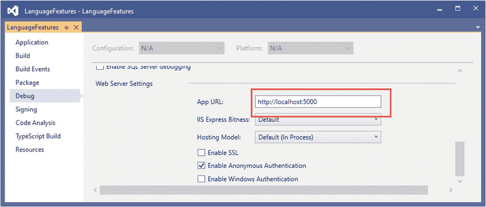
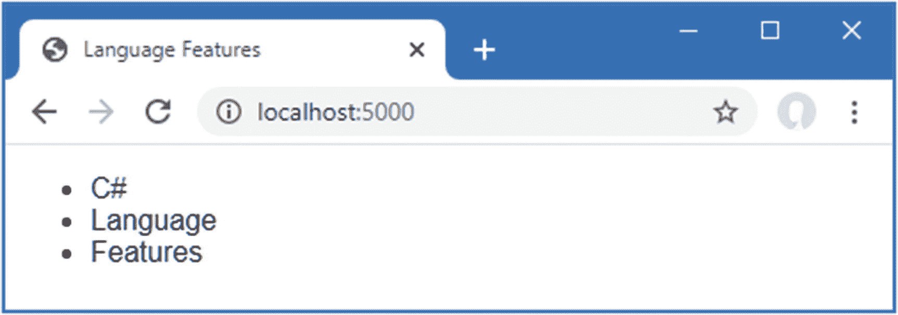

# 五、C# 的基本特性

在这一章中，我描述了在 web 应用开发中使用的 C# 特性，这些特性没有被广泛理解或者经常引起混淆。然而，这并不是一本关于 C# 的书，所以我只为每个特性提供了一个简短的例子，这样你就可以按照本书其余部分中的例子，在你自己的项目中利用这些特性。表 [5-1](#Tab1) 总结了本章内容。

表 5-1。

章节总结

<colgroup><col class="tcol1 align-left"> <col class="tcol2 align-left"> <col class="tcol3 align-left"></colgroup> 
| 

问题

 | 

解决办法

 | 

列表

 |
| --- | --- | --- |
| 管理空值 | 使用空条件运算符和空合并运算符 | 7, 10 |
| 用 getters 和 setters 创建属性 | 定义自动实现的属性 | 11–13 |
| 在字符串中混合静态和动态值 | 使用字符串插值 | Fourteen |
| 初始化和填充对象 | 使用对象和集合初始值设定项 | 15–18 |
| 为特定类型赋值 | 使用模式匹配 | 19, 20 |
| 扩展类的功能而不修改它 | 定义扩展方法 | 21–28 |
| 简洁地表达功能和方法 | 使用 lambda 表达式 | 29–36 |
| 定义变量而不显式声明其类型 | 使用`var`关键字 | 37–39 |
| 修改接口而不需要改变它的实现类 | 定义默认实现 | 40–44 |
| 异步执行工作 | 使用任务或`async` / `await`关键字 | 45–47 |
| 随着时间的推移产生一系列值 | 使用异步可枚举 | 48–51 |
| 获取类或成员的名称 | 使用一个`nameof`表达式 | 52, 53 |

## 为本章做准备

为了创建本章的示例项目，打开一个新的 PowerShell 命令提示符并运行清单 [5-1](#PC1) 中所示的命令。如果您正在使用 Visual Studio 并且不喜欢使用命令行，您可以使用第 [4](04.html) 章中描述的过程来创建项目。

Tip

你可以从 [`https://github.com/apress/pro-asp.net-core-3`](https://github.com/apress/pro-asp.net-core-3) 下载本章以及本书其他章节的示例项目。如果在运行示例时遇到问题，请参见第 [1](01.html) 章获取帮助。

```cs
dotnet new globaljson --sdk-version 3.1.101 --output LanguageFeatures
dotnet new web --no-https --output LanguageFeatures --framework netcoreapp3.1
dotnet new sln -o LanguageFeatures

dotnet sln LanguageFeatures add LanguageFeatures

Listing 5-1.Creating the Example Project

```

### 打开项目

如果您使用的是 Visual Studio，请选择文件➤打开➤项目/解决方案，在`LanguageFeatures`文件夹中选择`LanguageFeatures.sln`文件，然后单击打开按钮打开解决方案文件及其引用的项目。如果您使用的是 Visual Studio 代码，请选择文件➤打开文件夹，导航到`LanguageFeatures`文件夹，然后单击选择文件夹按钮。

### 启用 MVC 框架

`web`项目模板创建一个包含最小 ASP.NET Core 配置的项目。这意味着由第 [3 章](03.html)中使用的`mvc`模板添加的占位符内容不可用，需要额外的步骤才能使应用产生有用的输出。在这一节中，我做了设置 MVC 框架所需的更改，这是 ASP.NET Core 支持的应用框架之一，正如我在第 [1](01.html) 章中解释的。首先，为了启用 MVC 框架，对`Startup`类进行清单 [5-2](#PC2) 所示的修改。

```cs
using System;
using System.Collections.Generic;
using System.Linq;
using System.Threading.Tasks;
using Microsoft.AspNetCore.Builder;
using Microsoft.AspNetCore.Hosting;
using Microsoft.AspNetCore.Http;
using Microsoft.Extensions.DependencyInjection;
using Microsoft.Extensions.Hosting;

namespace LanguageFeatures {
    public class Startup {
        public void ConfigureServices(IServiceCollection services) {
            services.AddControllersWithViews();
        }

        public void Configure(IApplicationBuilder app, IWebHostEnvironment env) {
            if (env.IsDevelopment()) {
                app.UseDeveloperExceptionPage();
            }

            app.UseRouting();

            app.UseEndpoints(endpoints => {
                //endpoints.MapGet("/", async context => {
                //    await context.Response.WriteAsync("Hello World!");
                //});
                endpoints.MapDefaultControllerRoute();
            });
        }
    }
}

Listing 5-2.Enabling MVC in the Startup.cs File in the LanguageFeatures Folder

```

我在第 2 部分解释了如何配置 ASP.NET Core 应用，但是清单 [5-2](#PC2) 中添加的两条语句使用默认配置提供了一个基本的 MVC 框架设置。

### 创建应用组件

既然 MVC 框架已经设置好了，我可以添加应用组件来演示重要的 C# 语言特性。

#### 创建数据模型

我从创建一个简单的模型类开始，这样我就可以处理一些数据。我添加了一个名为`Models`的文件夹，并在其中创建了一个名为`Product.cs`的类文件，我用它来定义清单 [5-3](#PC3) 中所示的类。

```cs
namespace LanguageFeatures.Models {
    public class Product {

        public string Name { get; set; }
        public decimal? Price { get; set; }

        public static Product[] GetProducts() {

            Product kayak = new Product {
                Name = "Kayak", Price = 275M
            };

            Product lifejacket = new Product {
                Name = "Lifejacket", Price = 48.95M
            };

            return new Product[] { kayak, lifejacket, null };
        }
    }
}

Listing 5-3.The Contents of the Product.cs File in the Models Folder

```

`Product`类定义了`Name`和`Price`属性，有一个名为`GetProducts`的`static`方法返回一个`Product`数组。由`GetProducts`方法返回的数组中包含的一个元素被设置为`null`，我将在本章的后面用它来演示一些有用的语言特性。

#### 创建控制器和视图

对于本章中的例子，我使用一个简单的控制器类来演示不同的语言特性。我创建了一个`Controllers`文件夹，并在其中添加了一个名为`HomeController.cs`的类文件，其内容如清单 [5-4](#PC4) 所示。

```cs
using Microsoft.AspNetCore.Mvc;

namespace LanguageFeatures.Controllers {
    public class HomeController : Controller {

        public ViewResult Index() {
            return View(new string[] { "C#", "Language", "Features" });
        }
    }
}

Listing 5-4.The Contents of the HomeController.cs File in the Controllers Folder

```

`Index`动作方法告诉 ASP.NET Core 渲染默认视图，并为其提供一个字符串数组作为视图模型，该模型将包含在发送给客户端的 HTML 中。为了创建视图，我添加了一个`Views/Home`文件夹(通过创建一个`Views`文件夹，然后在其中添加一个`Home`文件夹)并添加了一个名为`Index.cshtml`的 Razor 视图，其内容如清单 [5-5](#PC5) 所示。

```cs
@model IEnumerable<string>
@{ Layout = null; }

<!DOCTYPE html>
<html>
<head>
    <meta name="viewport" content="width=device-width" />
    <title>Language Features</title>
</head>
<body>
    <ul>
        @foreach (string s in Model) {
            <li>@s</li>
        }
    </ul>
</body>
</html>

Listing 5-5.The Contents of the Index.cshtml File in the Views/Home Folder

```

### 选择 HTTP 端口

如果使用的是 Visual Studio，选择 project➤language features properties，选择 Debug 部分，在 App URL 字段将 HTTP 端口改为 5000，如图 [5-1](#Fig1) 所示。选择文件➤全部保存以保存新端口。(如果您使用的是 Visual Studio 代码，则不需要进行此更改。)



图 5-1。

设置 HTTP 端口

### 运行示例应用

通过从调试菜单中选择启动而不调试(Visual Studio)或运行而不调试(Visual Studio 代码)或者通过运行在`LanguageFeatures`文件夹中的清单 [5-6](#PC6) 中显示的命令来启动 ASP.NET Core。

```cs
dotnet run

Listing 5-6.Running the Example Application

```

请求`http://localhost:5000,`，您将看到图 [5-2](#Fig2) 所示的输出。



图 5-2。

运行示例应用

由于本章中所有示例的输出都是文本，我将显示浏览器显示的消息，如下所示:

```cs
C#
Language
Features

```

## 使用空条件运算符

空条件操作符允许更好地检测`null`值。当您确定一个请求是否包含一个特定的头或值，或者模型是否包含一个特定的数据项时，在 ASP.NET Core 开发中可能会有大量的空值检查。传统上，处理`null`值需要进行显式检查，当需要检查对象及其属性时，这可能会变得繁琐且容易出错。空条件操作符使这个过程更加简单明了，如清单 [5-7](#PC8) 所示。

```cs
using Microsoft.AspNetCore.Mvc;
using System.Collections.Generic;
using LanguageFeatures.Models;

namespace LanguageFeatures.Controllers {
    public class HomeController : Controller {

        public ViewResult Index() {

            List<string> results = new List<string>();

            foreach (Product p in Product.GetProducts()) {
                string name = p?.Name;
                decimal? price = p?.Price;
                results.Add(string.Format("Name: {0}, Price: {1}", name, price));
            }

            return View(results);
        }
    }
}

Listing 5-7.Detecting null Values in the HomeController.cs File in the Controllers Folder

```

由`Product`类定义的静态`GetProducts`方法返回一个对象数组，我在`Index`动作方法中检查该数组以获得一个`Name`和`Price`值的列表。问题是数组中的对象和属性值都可能是`null`，这意味着我不能只在`foreach`循环中引用`p.Name`或`p.Price`而不引起`NullReferenceException`。为了避免这种情况，我使用了空条件运算符，如下所示:

```cs
...
string name = p?.Name;
decimal? price = p?.Price;
...

```

空条件操作符是一个问号(`?`字符)。如果`p`是`null`，那么`name`也会被设置为`null`。如果`p`不是`null`，那么`name`将被设置为`Person.Name`属性的值。对`Price`属性进行相同的测试。注意，使用空条件操作符时所赋的变量必须能够被赋值`null`，这就是为什么`price`变量被声明为可空的小数(`decimal?`)。

### 链接空条件运算符

空条件操作符可以被链接起来在对象的层次结构中导航，这是它成为简化代码和允许安全导航的有效工具的原因。在清单 [5-8](#PC10) 中，我向`Product`类添加了一个属性，创建了一个更复杂的对象层次结构。

```cs
namespace LanguageFeatures.Models {
    public class Product {

        public string Name { get; set; }
        public decimal? Price { get; set; }
        public Product Related { get; set; }

        public static Product[] GetProducts() {

            Product kayak = new Product {
                Name = "Kayak", Price = 275M
            };
            Product lifejacket = new Product {
                Name = "Lifejacket", Price = 48.95M
            };

            kayak.Related = lifejacket;

            return new Product[] { kayak, lifejacket, null };
        }
    }
}

Listing 5-8.Adding a Property in the Product.cs File in the Models Folder

```

每个`Product`对象都有一个`Related`属性，可以引用另一个`Product`对象。在`GetProducts`方法中，我为代表 kayak 的`Product`对象设置了`Related`属性。清单 [5-9](#PC11) 展示了如何链接空条件操作符来浏览对象属性而不会导致异常。

```cs
using Microsoft.AspNetCore.Mvc;
using System.Collections.Generic;
using LanguageFeatures.Models;

namespace LanguageFeatures.Controllers {
    public class HomeController : Controller {

        public ViewResult Index() {

            List<string> results = new List<string>();

            foreach (Product p in Product.GetProducts()) {
                string name = p?.Name;
                decimal? price = p?.Price;
                string relatedName = p?.Related?.Name;
                results.Add(string.Format("Name: {0}, Price: {1}, Related: {2}",
                    name, price, relatedName));
            }

            return View(results);
        }
    }
}

Listing 5-9.Detecting Nested null Values in the HomeController.cs File in the Controllers Folder

```

`null`条件操作符可以应用于属性链的每个部分，如下所示:

```cs
...
string relatedName = p?.Related?.Name;
...

```

结果是当`p`为`null`或`p.Related`为`null`时`relatedName`变量将为`null`。否则，变量将被赋予`p.Related.Name`属性的值。重启 ASP.NET Core 并请求`http://localhost:5000,`，您将在浏览器窗口中看到以下输出:

```cs
Name: Kayak, Price: 275, Related: Lifejacket
Name: Lifejacket, Price: 48.95, Related:
Name: , Price: , Related:

```

### 组合条件运算符和合并运算符

将空条件操作符(单个问号)与空合并操作符(两个问号)结合起来设置一个回退值以防止在应用中使用`null`值是很有用的，如清单 [5-10](#PC14) 所示。

```cs
using Microsoft.AspNetCore.Mvc;
using System.Collections.Generic;
using LanguageFeatures.Models;

namespace LanguageFeatures.Controllers {
    public class HomeController : Controller {

        public ViewResult Index() {

            List<string> results = new List<string>();

            foreach (Product p in Product.GetProducts()) {
                string name = p?.Name ?? "<No Name>";
                decimal? price = p?.Price ?? 0;
                string relatedName = p?.Related?.Name ?? "<None>";
                results.Add(string.Format("Name: {0}, Price: {1}, Related: {2}",
                    name, price, relatedName));
            }

            return View(results);
        }
    }
}

Listing 5-10.Combining Null Operators in the HomeController.cs File in the Controllers Folder

```

空条件操作符确保我在浏览对象属性时不会得到`NullReferenceException`，空合并操作符确保我不会在浏览器显示的结果中包含`null`值。如果运行该示例，您将在浏览器窗口中看到以下结果:

```cs
Name: Kayak, Price: 275, Related: Lifejacket
Name: Lifejacket, Price: 48.95, Related: <None>
Name: <No Name>, Price: 0, Related: <None>

```

Nullable And Non-Nullable Reference Types

遇到意外的`null`值是错误最常见的原因之一。默认情况下，C# 将`null`视为所有类型的有效值，这意味着我可以将`null`赋给`string`变量，如下所示:

```cs
...
string product = null;
...

```

使用变量来检查`null`值是代码的责任，当同一个变量出现在多个地方时，这可能特别成问题。很容易忽略其中一个检查或者假设一个值不是`null`，从而在运行时产生错误。

可空引用类型将检查`null`的责任转移给了将值赋给变量的代码。当可空引用特性被启用时，常规引用类型不能被赋予`null`值，例如将`null`赋予`string`。相反，如果`null`值是可能的，则必须使用可空的引用类型，如下所示:

```cs
...
string product = null; // compiler error - this is a non-nullable type
string? product = null; // no error - this is a nullable type
...

```

`string?`类型是可空的，而`string`不是，这意味着使用变量的代码不必担心`null`值，除非它处理的是可空类型。要启用可空引用类型，必须向`csproj`文件添加一个元素，如下所示:

```cs
...
<Project Sdk="Microsoft.NET.Sdk.Web">

  <PropertyGroup>
    <TargetFramework>netcoreapp3.1</TargetFramework>
    <Nullable>enable</Nullable>
  </PropertyGroup>

</Project>
...

```

如果您使用的是 Visual Studio，可以通过在解决方案资源管理器中右击项目项并从弹出菜单中选择“编辑项目文件”来打开项目文件。

我喜欢这个特性，但是它的使用范围还不够广泛，不足以让我在本书中使用它，特别是因为它会使一些复杂的主题更加难以理解。但是一旦剩下的。NET Core 赶上了这个特性，我希望它默认包含在 ASP.NET Core 中，并且你可以期待在本书的未来版本中看到使用可空引用类型。

## 使用自动实现的属性

C# 支持自动实现的属性，我在上一节中为`Person`类定义属性时使用了它们，如下所示:

```cs
namespace LanguageFeatures.Models {
    public class Product {

        public string Name { get; set; }
        public decimal? Price { get; set; }
        public Product Related { get; set; }

        public static Product[] GetProducts() {

            Product kayak = new Product {
                Name = "Kayak", Price = 275M
            };
            Product lifejacket = new Product {
                Name = "Lifejacket", Price = 48.95M
            };

            kayak.Related = lifejacket;

            return new Product[] { kayak, lifejacket, null };
        }
    }
}

```

这个特性允许我定义属性，而不必实现`get`和`set`主体。使用自动实现的属性特性意味着我可以像这样定义一个属性:

```cs
...
public string Name { get; set; }
...
is equivalent to the following code:
...
public string Name {
    get { return name; }
    set { name = value; }
}
...

```

这种类型的特性被称为*句法糖*，这意味着它使 C# 更易于使用——在这种情况下，通过消除最终为每个属性重复的冗余代码——而没有实质上改变语言的行为方式。术语*糖*可能看起来带有贬义，但是任何使代码更容易编写和维护的增强都是有益的，尤其是在大型复杂的项目中。

### 使用自动实现的属性初始化器

从 C# 3.0 开始就支持自动实现的属性。最新版本的 C# 支持自动实现属性的初始化器，这允许在不使用构造函数的情况下设置初始值，如清单 [5-11](#PC21) 所示。

```cs
namespace LanguageFeatures.Models {
    public class Product {

        public string Name { get; set; }
        public string Category { get; set; } = "Watersports";
        public decimal? Price { get; set; }
        public Product Related { get; set; }

        public static Product[] GetProducts() {
            Product kayak = new Product {
                Name = "Kayak",
                Category = "Water Craft",
                Price = 275M
            };
            Product lifejacket = new Product {
                Name = "Lifejacket", Price = 48.95M
            };

            kayak.Related = lifejacket;

            return new Product[] { kayak, lifejacket, null };
        }
    }
}

Listing 5-11.Using an Auto-implemented Property Initializer in the Product.cs File in the Models Folder

```

给一个自动实现的属性赋值并不妨碍 setter 在以后被用来改变属性，只是整理了简单类型的代码，这些代码以一个包含属性赋值列表的构造函数结束，以提供默认值。在这个例子中，初始化器给属性`Category`赋值`Watersports`。初始值是可以改变的，当我创建`kayak`对象并指定一个值`Water Craft`时我就这么做了。

### 创建自动实现的只读属性

您可以通过使用一个初始化器并从一个自动实现的有初始化器的属性中省略`set`关键字来创建一个只读属性，如清单 [5-12](#PC22) 所示。

```cs
namespace LanguageFeatures.Models {
    public class Product {

        public string Name { get; set; }
        public string Category { get; set; } = "Watersports";
        public decimal? Price { get; set; }
        public Product Related { get; set; }
        public bool InStock { get; } = true;

        public static Product[] GetProducts() {

            Product kayak = new Product {
                Name = "Kayak",
                Category = "Water Craft",
                Price = 275M
            };
            Product lifejacket = new Product {
                Name = "Lifejacket", Price = 48.95M
            };

            kayak.Related = lifejacket;

            return new Product[] { kayak, lifejacket, null };
        }
    }
}

Listing 5-12.Creating a Read-Only Property in the Product.cs File in the Models Folder

```

`InStock`属性被初始化为`true`，不能更改；然而，该值可以在类型的构造函数中赋值，如清单 [5-13](#PC23) 所示。

```cs
namespace LanguageFeatures.Models {
    public class Product {

        public Product(bool stock = true) {
            InStock = stock;
        }

        public string Name { get; set; }
        public string Category { get; set; } = "Watersports";
        public decimal? Price { get; set; }
        public Product Related { get; set; }
        public bool InStock { get; }

        public static Product[] GetProducts() {
            Product kayak = new Product {
                Name = "Kayak",
                Category = "Water Craft",
                Price = 275M
            };

            Product lifejacket = new Product(false) {
                Name = "Lifejacket",
                Price = 48.95M
            };

            kayak.Related = lifejacket;

            return new Product[] { kayak, lifejacket, null };
        }
    }
}

Listing 5-13.Assigning a Value to a Read-Only Property in the Product.cs File in the Models Folder

```

构造函数允许将只读属性的值指定为参数，如果没有提供值，则默认为`true`。属性值一旦被构造函数设置，就不能更改。

## 使用字符串插值

`string.Format`方法是传统的 C# 工具，用于编写包含数据值的字符串。以下是一个来自`Home`控制器的技术示例:

```cs
...
results.Add(string.Format("Name: {0}, Price: {1}, Related: {2}",
                    name, price, relatedName));
...

```

C# 还支持一种不同的方法，称为*字符串插值*，它避免了确保字符串模板中的`{0}`引用与指定为参数的变量匹配的需要。相反，字符串插值直接使用变量名，如清单 [5-14](#PC25) 所示。

```cs
using Microsoft.AspNetCore.Mvc;
using System.Collections.Generic;
using LanguageFeatures.Models;

namespace LanguageFeatures.Controllers {
    public class HomeController : Controller {

        public ViewResult Index() {

            List<string> results = new List<string>();

            foreach (Product p in Product.GetProducts()) {
                string name = p?.Name ?? "<No Name>";
                decimal? price = p?.Price ?? 0;
                string relatedName = p?.Related?.Name ?? "<None>";
                results.Add($"Name: {name}, Price: {price}, Related: {relatedName}");
            }

            return View(results);
        }
    }
}

Listing 5-14.Using String Interpolation in the HomeController.cs File in the Controllers Folder

```

插入的字符串以`$`字符为前缀，并包含*孔*，它们是对包含在`{`和`}`字符中的值的引用。计算字符串时，会用指定变量或常量的当前值填充这些洞。

Tip

字符串插值支持所有可用于`string.Format`方法的格式说明符。格式细节作为洞的一部分包含在内，所以`$"Price: {price:C2}"`会将`price`值格式化为一个有两位十进制数字的货币值。

## 使用对象和集合初始值设定项

当我在`Product`类的静态`GetProducts`方法中创建一个对象时，我使用了一个*对象初始化器*，它允许我在一个步骤中创建一个对象并指定它的属性值，如下所示:

```cs
...
Product kayak = new Product {
    Name = "Kayak",
    Category = "Water Craft",
    Price = 275M
};
...

```

这是另一个让 C# 更容易使用的语法糖特性。如果没有这个特性，我将不得不调用`Product`构造函数，然后使用新创建的对象来设置每个属性，如下所示:

```cs
...
Product kayak = new Product();
kayak.Name = "Kayak";
kayak.Category = "Water Craft";
kayak.Price = 275M;
...

```

一个相关的特性是*集合初始化器*，它允许在一个步骤中创建一个集合并指定其内容。例如，如果没有初始化器，创建一个字符串数组需要分别指定数组的大小和数组元素，如清单 [5-15](#PC28) 所示。

```cs
using Microsoft.AspNetCore.Mvc;
using System.Collections.Generic;
using LanguageFeatures.Models;

namespace LanguageFeatures.Controllers {
    public class HomeController : Controller {

        public ViewResult Index() {
            string[] names = new string[3];
            names[0] = "Bob";
            names[1] = "Joe";
            names[2] = "Alice";
            return View("Index", names);
        }
    }
}

Listing 5-15.Initializing an Object in the HomeController.cs File in the Controllers Folder

```

使用集合初始化器允许数组的内容被指定为构造的一部分，这隐式地为编译器提供了数组的大小，如清单 [5-16](#PC29) 所示。

```cs
using Microsoft.AspNetCore.Mvc;
using System.Collections.Generic;
using LanguageFeatures.Models;

namespace LanguageFeatures.Controllers {
    public class HomeController : Controller {

        public ViewResult Index() {
            return View("Index", new string[] { "Bob", "Joe", "Alice" });
        }
    }
}

Listing 5-16.Using a Collection Initializer in the HomeController.cs File in the Controllers Folder

```

数组元素在`{`和`}`字符之间指定，这使得集合的定义更加简洁，并使得在方法调用中内联定义集合成为可能。清单 [5-16](#PC29) 中的代码与清单 [5-15](#PC28) 中的代码具有相同的效果。重启 ASP.NET Core 并请求`http://localhost:5000`，您将在浏览器窗口中看到以下输出:

```cs
Bob
Joe
Alice

```

### 使用索引初始值设定项

C# 的最新版本整理了使用索引的集合(如字典)的初始化方式。清单 [5-17](#PC31) 展示了使用传统的 C# 方法初始化字典来定义集合的`Index`动作。

```cs
using Microsoft.AspNetCore.Mvc;
using System.Collections.Generic;
using LanguageFeatures.Models;

namespace LanguageFeatures.Controllers {
    public class HomeController : Controller {

        public ViewResult Index() {
            Dictionary<string, Product> products = new Dictionary<string, Product> {
                { "Kayak", new Product { Name = "Kayak", Price = 275M } },
                { "Lifejacket",  new Product{ Name = "Lifejacket", Price = 48.95M } }
            };
            return View("Index", products.Keys);
        }
    }
}

Listing 5-17.Initializing a Dictionary in the HomeController.cs File in the Controllers Folder

```

初始化这种类型集合的语法太依赖于`{`和`}`字符，尤其是当集合值是使用对象初始化器创建的时候。最新版本的 C# 支持一种更自然的方法来初始化索引集合，这种方法与集合初始化后检索或修改值的方式一致，如清单 [5-18](#PC32) 所示。

```cs
using Microsoft.AspNetCore.Mvc;
using System.Collections.Generic;
using LanguageFeatures.Models;

namespace LanguageFeatures.Controllers {
    public class HomeController : Controller {

        public ViewResult Index() {
            Dictionary<string, Product> products = new Dictionary<string, Product> {
                ["Kayak"] = new Product { Name = "Kayak", Price = 275M },
                ["Lifejacket"] = new Product { Name = "Lifejacket", Price = 48.95M }
            };

            return View("Index", products.Keys);
        }
    }
}

Listing 5-18.Using Collection Initializer Syntax in the HomeController.cs File in the Controllers Folder

```

效果是一样的——创建一个字典，它的键是`Kayak`和`Lifejacket`，值是`Product`对象——但是元素是使用用于其他集合操作的索引符号创建的。重启 ASP.NET Core 并请求`http://localhost:5000,`，您将在浏览器中看到以下结果:

```cs
Kayak
Lifejacket

```

## 模式匹配

C# 最有用的新增功能之一是对模式匹配的支持，它可以用来测试一个对象是否属于特定的类型或具有特定的特征。这是另一种形式的语法糖，它可以极大地简化复杂的条件语句块。关键字`is`用于执行类型测试，如清单 [5-19](#PC34) 所示。

```cs
using Microsoft.AspNetCore.Mvc;
using System.Collections.Generic;
using LanguageFeatures.Models;

namespace LanguageFeatures.Controllers {
    public class HomeController : Controller {

        public ViewResult Index() {

            object[] data = new object[] { 275M, 29.95M,
                "apple", "orange", 100, 10 };
            decimal total = 0;
            for (int i = 0; i < data.Length; i++) {
                if (data[i] is decimal d) {
                    total += d;
                }
            }

            return View("Index", new string[] { $"Total: {total:C2}" });
        }
    }
}

Listing 5-19.Performing a Type Test in the HomeController.cs File in the Controllers Folder

```

`is`关键字执行类型检查，如果一个值是指定的类型，它会将该值赋给一个新变量，如下所示:

```cs
...
if (data[i] is decimal d) {
...

```

如果存储在`data[i]`中的值是一个`decimal`，则该表达式的计算结果为`true`。`data[i]`的值将被赋给变量`d`，这允许它在后续语句中使用，而不需要执行任何类型转换。`is`关键字将只匹配指定的类型，这意味着只处理数据数组中的两个值(数组中的其他项是`string`和`int`值)。如果运行该应用，您将在浏览器窗口中看到以下输出:

```cs
Total: $304.95

```

### switch 语句中的模式匹配

模式匹配也可以用在`switch`语句中，它支持`when`关键字来限制一个值何时被`case`语句匹配，如清单 [5-20](#PC37) 所示。

```cs
using Microsoft.AspNetCore.Mvc;
using System.Collections.Generic;
using LanguageFeatures.Models;

namespace LanguageFeatures.Controllers {
    public class HomeController : Controller {

        public ViewResult Index() {

            object[] data = new object[] { 275M, 29.95M,
                "apple", "orange", 100, 10 };
            decimal total = 0;
            for (int i = 0; i < data.Length; i++) {
                switch (data[i]) {
                    case decimal decimalValue:
                        total += decimalValue;
                        break;
                    case int intValue when intValue > 50:
                        total += intValue;
                        break;
                }
            }

            return View("Index", new string[] { $"Total: {total:C2}" });
        }
    }
}

Listing 5-20.Pattern Matching in the HomeController.cs File in the Controllers Folder

```

要匹配特定类型的任何值，请在`case`语句中使用类型和变量名，如下所示:

```cs
...
case decimal decimalValue:
...

```

这个`case`语句匹配任何一个`decimal`值，并将它赋给一个名为`decimalValue`的新变量。为了更具选择性，可以包含`when`关键字，如下所示:

```cs
...
case int intValue when intValue > 50:
...

```

这个`case`语句匹配`int`值，并将它们赋给一个名为`intValue`的变量，但仅当值大于 50 时。重启 ASP.NET Core 并请求`http://localhost:5000`，您将在浏览器窗口中看到以下输出:

```cs
Total: $404.95

```

## 使用扩展方法

*扩展方法*是一种向不能直接修改的类添加方法的便捷方式，通常是因为它们是由微软或第三方软件包提供的。清单 [5-21](#PC41) 显示了`ShoppingCart`类的定义，我将它添加到了一个名为`ShoppingCart.cs`文件的类文件的`Models`文件夹中，它代表了一个`Product`对象的集合。

```cs
using System.Collections.Generic;

namespace LanguageFeatures.Models {

    public class ShoppingCart {
        public IEnumerable<Product> Products { get; set; }
    }
}

Listing 5-21.The Contents of the ShoppingCart.cs File in the Models Folder

```

这是一个简单的类，充当一系列`Product`对象的包装器(对于这个例子，我只需要一个基本类)。假设我需要能够确定`ShoppingCart`类中`Product`对象的总值，但是我不能修改这个类，因为它来自第三方，而且我没有源代码。我可以使用扩展方法来添加我需要的功能。

在`Models`文件夹中添加一个名为`MyExtensionMethods.cs`的类文件，并用它来定义清单 [5-22](#PC42) 中所示的类。

```cs
namespace LanguageFeatures.Models {

    public static class MyExtensionMethods {

        public static decimal TotalPrices(this ShoppingCart cartParam) {
            decimal total = 0;
            foreach (Product prod in cartParam.Products) {
                total += prod?.Price ?? 0;
            }
            return total;
        }
    }
}

Listing 5-22.The Contents of the MyExtensionMethods.cs File in the Models Folder

```

扩展方法在与扩展方法所应用的类相同的名称空间内的`static`类中定义。在这种情况下，静态的`MyExtensionMethods`类位于`LanguageFeatures.Models`名称空间中，这意味着它可以包含该名称空间中的类的扩展方法。

扩展方法也是静态的，清单 [5-22](#PC42) 定义了一个名为`TotalPrices`的扩展方法。第一个参数前面的`this`关键字将`TotalPrices`标记为扩展方法。第一个参数告诉。NET 扩展方法可以应用到哪个类上——在本例中为`ShoppingCart`。我可以通过使用`cartParam`参数来引用扩展方法所应用到的`ShoppingCart`的实例。这个扩展方法枚举`ShoppingCart`中的`Product`对象，并返回`Product.Price`属性值的总和。清单 [5-23](#PC43) 展示了我如何在`Home`控制器的动作方法中应用扩展方法。

Note

扩展方法不允许您突破类为方法、字段和属性定义的访问规则。您可以通过使用扩展方法来扩展类的功能，但只能使用您有权访问的类成员。

```cs
using Microsoft.AspNetCore.Mvc;
using System.Collections.Generic;
using LanguageFeatures.Models;

namespace LanguageFeatures.Controllers {
    public class HomeController : Controller {

        public ViewResult Index() {
            ShoppingCart cart
                = new ShoppingCart { Products = Product.GetProducts() };
            decimal cartTotal = cart.TotalPrices();
            return View("Index", new string[] { $"Total: {cartTotal:C2}" });
        }
    }
}

Listing 5-23.Applying an Extension Method in the HomeController.cs File in the Controllers Folder

```

关键陈述是这样的:

```cs
...
decimal cartTotal = cart.TotalPrices();
...

```

我在一个`ShoppingCart`对象上调用`TotalPrices`方法，就好像它是`ShoppingCart`类的一部分一样，即使它是一个由完全不同的类定义的扩展方法。。如果扩展类在当前类的范围内，也就是说它们是同一个名称空间的一部分，或者在一个作为`using`语句主题的名称空间中，NET 将会找到它们。重启 ASP.NET Core 并请求`http://localhost:5000`，这将在浏览器窗口中产生以下输出:

```cs
Total: $323.95

```

### 将扩展方法应用于接口

扩展方法也可以应用于接口，这允许我在实现接口的所有类上调用扩展方法。清单 [5-24](#PC46) 显示了为实现`IEnumerable<Product>`接口而更新的`ShoppingCart`类。

```cs
using System.Collections;
using System.Collections.Generic;

namespace LanguageFeatures.Models {

    public class ShoppingCart : IEnumerable<Product> {
        public IEnumerable<Product> Products { get; set; }

        public IEnumerator<Product> GetEnumerator() {
            return Products.GetEnumerator();
        }

        IEnumerator IEnumerable.GetEnumerator() {
            return GetEnumerator();
        }
    }
}

Listing 5-24.Implementing an Interface in the ShoppingCart.cs File in the Models Folder

```

我现在可以更新扩展方法，使其处理`IEnumerable<Product>`，如清单 [5-25](#PC47) 所示。

```cs
using System.Collections.Generic;

namespace LanguageFeatures.Models {

    public static class MyExtensionMethods {

        public static decimal TotalPrices(this IEnumerable<Product> products) {
            decimal total = 0;
            foreach (Product prod in products) {
                total += prod?.Price ?? 0;
            }
            return total;
        }
    }
}

Listing 5-25.Updating an Extension Method in the MyExtensionMethods.cs File in the Models Folder

```

第一个参数类型已经更改为`IEnumerable<Product>`，这意味着方法体中的`foreach`循环直接作用于`Product`对象。使用接口的改变意味着我可以计算任何`IEnumerable<Product>`枚举的`Product`对象的总值，包括`ShoppingCart`的实例，也包括`Product`对象的数组，如清单 [5-26](#PC48) 所示。

```cs
using Microsoft.AspNetCore.Mvc;
using System.Collections.Generic;
using LanguageFeatures.Models;

namespace LanguageFeatures.Controllers {
    public class HomeController : Controller {

        public ViewResult Index() {

            ShoppingCart cart
                = new ShoppingCart { Products = Product.GetProducts() };

            Product[] productArray = {
                new Product {Name = "Kayak", Price = 275M},
                new Product {Name = "Lifejacket", Price = 48.95M}
            };

            decimal cartTotal = cart.TotalPrices();
            decimal arrayTotal = productArray.TotalPrices();

            return View("Index", new string[] {
                $"Cart Total: {cartTotal:C2}",
                $"Array Total: {arrayTotal:C2}" });
        }
    }
}

Listing 5-26.Applying an Extension Method in the HomeController.cs File in the Controllers Folder

```

重启 ASP.NET Core 并请求`http://localhost:5000`，这将在浏览器中产生以下输出，表明我从扩展方法中获得了相同的结果，而不管`Product`对象是如何收集的:

```cs
Cart Total: $323.95
Array Total: $323.95

```

### 创建筛选扩展方法

关于扩展方法，我想向您展示的最后一点是，它们可以用来过滤对象集合。对一个`IEnumerable<T>`进行操作并返回一个`IEnumerable<T>`的扩展方法可以使用`yield`关键字对源数据中的项目应用选择标准，以产生一组精简的结果。清单 [5-27](#PC50) 演示了这样一个方法，我已经将它添加到了`MyExtensionMethods`类中。

```cs
using System.Collections.Generic;

namespace LanguageFeatures.Models {

    public static class MyExtensionMethods {

        public static decimal TotalPrices(this IEnumerable<Product> products) {
            decimal total = 0;
            foreach (Product prod in products) {
                total += prod?.Price ?? 0;
            }
            return total;
        }

        public static IEnumerable<Product> FilterByPrice(
                this IEnumerable<Product> productEnum, decimal minimumPrice) {

            foreach (Product prod in productEnum) {
                if ((prod?.Price ?? 0) >= minimumPrice) {
                    yield return prod;
                }
            }
        }
    }
}

Listing 5-27.A Filtering Extension Method in the MyExtensionMethods.cs File in the Models Folder

```

这个名为`FilterByPrice`的扩展方法带有一个额外的参数，允许我过滤产品，以便在结果中返回其`Price`属性匹配或超过该参数的`Product`对象。清单 [5-28](#PC51) 显示了这种方法的使用。

```cs
using Microsoft.AspNetCore.Mvc;
using System.Collections.Generic;
using LanguageFeatures.Models;

namespace LanguageFeatures.Controllers {
    public class HomeController : Controller {

        public ViewResult Index() {

            Product[] productArray = {
                new Product {Name = "Kayak", Price = 275M},
                new Product {Name = "Lifejacket", Price = 48.95M},
                new Product {Name = "Soccer ball", Price = 19.50M},
                new Product {Name = "Corner flag", Price = 34.95M}
            };

            decimal arrayTotal = productArray.FilterByPrice(20).TotalPrices();

            return View("Index", new string[] { $"Array Total: {arrayTotal:C2}" });
        }
    }
}

Listing 5-28.Using the Filtering Extension Method in the HomeController.cs File in the Controllers Folder

```

当我在`Product`对象的数组上调用`FilterByPrice`方法时，只有那些花费超过 20 美元的对象被`TotalPrices`方法接收并用于计算总数。如果运行该应用，您将在浏览器窗口中看到以下输出:

```cs
Total: $358.90

```

## 使用 Lambda 表达式

Lambda 表达式是一个会引起很多混乱的特性，尤其是因为它简化的特性也很混乱。为了理解正在解决的问题，考虑一下我在上一节中定义的`FilterByPrice`扩展方法。编写这个方法是为了让它可以按价格过滤`Product`对象，这意味着我必须创建第二个我想按名称过滤的方法，如清单 [5-29](#PC53) 所示。

```cs
using System.Collections.Generic;

namespace LanguageFeatures.Models {

    public static class MyExtensionMethods {

        public static decimal TotalPrices(this IEnumerable<Product> products) {
            decimal total = 0;
            foreach (Product prod in products) {
                total += prod?.Price ?? 0;
            }
            return total;
        }

        public static IEnumerable<Product> FilterByPrice(
                this IEnumerable<Product> productEnum, decimal minimumPrice) {

            foreach (Product prod in productEnum) {
                if ((prod?.Price ?? 0) >= minimumPrice) {
                    yield return prod;
                }
            }
        }

        public static IEnumerable<Product> FilterByName(
                this IEnumerable<Product> productEnum, char firstLetter) {

            foreach (Product prod in productEnum) {
                if (prod?.Name?[0] == firstLetter) {
                    yield return prod;
                }
            }
        }
    }
}

Listing 5-29.Adding a Filter Method in the MyExtensionMethods.cs File in the Models Folder

```

清单 [5-30](#PC54) 显示了使用控制器中应用的两种过滤方法来创建两个不同的总数。

```cs
using Microsoft.AspNetCore.Mvc;
using System.Collections.Generic;
using LanguageFeatures.Models;

namespace LanguageFeatures.Controllers {
    public class HomeController : Controller {

        public ViewResult Index() {

            Product[] productArray = {
                new Product {Name = "Kayak", Price = 275M},
                new Product {Name = "Lifejacket", Price = 48.95M},
                new Product {Name = "Soccer ball", Price = 19.50M},
                new Product {Name = "Corner flag", Price = 34.95M}
            };

            decimal priceFilterTotal = productArray.FilterByPrice(20).TotalPrices();
            decimal nameFilterTotal = productArray.FilterByName('S').TotalPrices();

            return View("Index", new string[] {
                $"Price Total: {priceFilterTotal:C2}",
                $"Name Total: {nameFilterTotal:C2}" });
        }
    }
}

Listing 5-30.Using Two Filter Methods in the HomeController.cs File in the Controllers Folder

```

第一个过滤器选择价格为 20 美元或以上的所有产品，第二个过滤器选择名称以字母 *S* 开头的产品。如果运行示例应用，您将在浏览器窗口中看到以下输出:

```cs
Price Total: $358.90
Name Total: $19.50

```

### 定义函数

我可以无限重复这个过程，为我感兴趣的每个属性和属性的每个组合创建过滤方法。更好的方法是将处理枚举的代码与选择标准分开。C# 通过允许函数作为对象传递来简化这个过程。清单 [5-31](#PC56) 显示了一个单独的扩展方法，它过滤了一个`Product`对象的枚举，但是将哪些对象包含在结果中的决定委托给了一个单独的函数。

```cs
using System.Collections.Generic;
using System;

namespace LanguageFeatures.Models {

    public static class MyExtensionMethods {

        public static decimal TotalPrices(this IEnumerable<Product> products) {
            decimal total = 0;
            foreach (Product prod in products) {
                total += prod?.Price ?? 0;
            }
            return total;
        }

        public static IEnumerable<Product> Filter(
                this IEnumerable<Product> productEnum,
                Func<Product, bool> selector) {

            foreach (Product prod in productEnum) {
                if (selector(prod)) {
                    yield return prod;
                }
            }
        }
    }
}

Listing 5-31.Creating a General Filter Method in the MyExtensionMethods.cs File in the Models Folder

```

`Filter`方法的第二个参数是一个函数，它接受一个`Product`对象并返回一个`bool`值。`Filter`方法为每个`Product`对象调用函数，如果函数返回`true`，则将它包含在结果中。为了使用`Filter`方法，我可以指定一个方法或者创建一个独立的函数，如清单 [5-32](#PC57) 所示。

```cs
using Microsoft.AspNetCore.Mvc;
using System.Collections.Generic;
using LanguageFeatures.Models;
using System;

namespace LanguageFeatures.Controllers {
    public class HomeController : Controller {

        bool FilterByPrice(Product p) {
            return (p?.Price ?? 0) >= 20;
        }

        public ViewResult Index() {

            Product[] productArray = {
                new Product {Name = "Kayak", Price = 275M},
                new Product {Name = "Lifejacket", Price = 48.95M},
                new Product {Name = "Soccer ball", Price = 19.50M},
                new Product {Name = "Corner flag", Price = 34.95M}
            };

            Func<Product, bool> nameFilter = delegate (Product prod) {
                return prod?.Name?[0] == 'S';
            };

            decimal priceFilterTotal = productArray
                .Filter(FilterByPrice)
                .TotalPrices();
            decimal nameFilterTotal = productArray
                .Filter(nameFilter)
                .TotalPrices();

            return View("Index", new string[] {
                $"Price Total: {priceFilterTotal:C2}",
                $"Name Total: {nameFilterTotal:C2}" });
        }
    }
}

Listing 5-32.Using a Function to Filter Objects in the HomeController.cs File in the Controllers Folder

```

这两种方法都不理想。像`FilterByPrice`这样定义方法会使类定义变得混乱。创建一个`Func<Product, bool>`对象避免了这个问题，但是使用了一个难以阅读和维护的笨拙语法。lambda 表达式解决了这个问题，它允许以一种更优雅、更具表现力的方式定义函数，如清单 [5-33](#PC58) 所示。

```cs
using Microsoft.AspNetCore.Mvc;
using System.Collections.Generic;
using LanguageFeatures.Models;
using System;

namespace LanguageFeatures.Controllers {
    public class HomeController : Controller {

        public ViewResult Index() {

            Product[] productArray = {
                new Product {Name = "Kayak", Price = 275M},
                new Product {Name = "Lifejacket", Price = 48.95M},
                new Product {Name = "Soccer ball", Price = 19.50M},
                new Product {Name = "Corner flag", Price = 34.95M}
            };

            decimal priceFilterTotal = productArray
                .Filter(p => (p?.Price ?? 0) >= 20)
                .TotalPrices();
            decimal nameFilterTotal = productArray
                .Filter(p => p?.Name?[0] == 'S')
                .TotalPrices();

            return View("Index", new string[] {
                $"Price Total: {priceFilterTotal:C2}",
                $"Name Total: {nameFilterTotal:C2}" });
        }
    }
}

Listing 5-33.Using a Lambda Expression in the HomeController.cs File in the Controllers Folder

```

λ表达式以粗体显示。参数在没有指定类型的情况下被表达，这将被自动推断。`=>`字符被朗读为“goes to ”,并将参数链接到 lambda 表达式的结果。在我的例子中，一个名为`p`的`Product`参数会得到一个`bool`结果，如果第一个表达式中的`Price`属性等于或大于 20，或者如果第二个表达式中的`Name`属性以 *S* 开始，那么结果将是`true`。这段代码的工作方式与单独的方法和函数委托相同，但是更加简洁，对于大多数人来说更容易阅读。

Other Forms For Lambda Expressions

我不需要在 lambda 表达式中表达我的委托的逻辑。我可以像这样轻松地调用一个方法:

```cs
...
prod => EvaluateProduct(prod)
...

```

如果我需要一个具有多个参数的委托的 lambda 表达式，我必须将参数括在括号中，如下所示:

```cs
...
(prod, count) => prod.Price > 20 && count > 0
...

```

最后，如果我需要 lambda 表达式中的逻辑需要一个以上的语句，我可以通过使用大括号(`{}`)并以一个`return`语句结束，就像这样:

```cs
...
(prod, count) => {
    // ...multiple code statements...
    return result;
}
...

```

你不需要在你的代码中使用 lambda 表达式，但是它们是一种简洁明了的表达复杂函数的好方法。我很喜欢它们，你会在本书中看到它们的用法。

### 使用 Lambda 表达式方法和属性

Lambda 表达式可用于实现构造函数、方法和属性。在 ASP.NET Core 开发中，您通常会使用包含单个语句的方法来选择要显示的数据和要呈现的视图。在清单 [5-34](#PC62) 中，我重写了`Index`动作方法，使其遵循这个通用模式。

```cs
using Microsoft.AspNetCore.Mvc;
using System.Collections.Generic;
using LanguageFeatures.Models;
using System;
using System.Linq;

namespace LanguageFeatures.Controllers {
    public class HomeController : Controller {

        public ViewResult Index() {
            return View(Product.GetProducts().Select(p => p?.Name));
        }
    }
}

Listing 5-34.Creating a Common Action Pattern in the HomeController.cs File in the Controllers Folder

```

action 方法从 static `Product.GetProducts`方法中获得一个`Product`对象的集合，并使用 LINQ 来投射`Name`属性的值，这些值随后被用作默认视图的视图模型。如果运行该应用，您将在浏览器窗口中看到以下输出:

```cs
Kayak
Lifejacket

```

浏览器窗口中也会有一个空的列表项，因为`GetProducts`方法在其结果中包含了一个`null`引用，但这对于本章的这一节来说无关紧要。

当构造函数或方法体由单个语句组成时，它可以被重写为 lambda 表达式，如清单 [5-35](#PC64) 所示。

```cs
using Microsoft.AspNetCore.Mvc;
using System.Collections.Generic;
using LanguageFeatures.Models;
using System;
using System.Linq;

namespace LanguageFeatures.Controllers {
    public class HomeController : Controller {

        public ViewResult Index() =>
            View(Product.GetProducts().Select(p => p?.Name));
    }
}

Listing 5-35.A Lambda Action Method in the HomeController.cs File in the Controllers Folder

```

方法的 Lambda 表达式省略了`return`关键字，并使用`=>` (goes to)将方法签名(包括其参数)与其实现相关联。清单 [5-35](#PC64) 中所示的`Index`方法与清单 [5-34](#PC62) 中所示的方法工作方式相同，但表达方式更加简洁。同样的基本方法也可以用来定义属性。清单 [5-36](#PC65) 展示了向`Product`类添加一个使用 lambda 表达式的属性。

```cs
namespace LanguageFeatures.Models {
    public class Product {

        public Product(bool stock = true) {
            InStock = stock;
        }

        public string Name { get; set; }
        public string Category { get; set; } = "Watersports";
        public decimal? Price { get; set; }
        public Product Related { get; set; }
        public bool InStock { get; }
        public bool NameBeginsWithS => Name?[0] == 'S';

        public static Product[] GetProducts() {

            Product kayak = new Product {
                Name = "Kayak",
                Category = "Water Craft",
                Price = 275M
            };

            Product lifejacket = new Product(false) {
                Name = "Lifejacket",
                Price = 48.95M
            };

            kayak.Related = lifejacket;

            return new Product[] { kayak, lifejacket, null };
        }
    }
}

Listing 5-36.A Lambda Property in the Product.cs File in the Models Folder

```

## 使用类型推断和匿名类型

关键字`var`允许你定义一个局部变量，而不需要显式指定变量类型，如清单 [5-37](#PC66) 所示。这被称为*型推理*，或者*隐式分型*。

```cs
using Microsoft.AspNetCore.Mvc;
using System.Collections.Generic;
using LanguageFeatures.Models;
using System;
using System.Linq;

namespace LanguageFeatures.Controllers {
    public class HomeController : Controller {

        public ViewResult Index() {
            var names = new [] { "Kayak", "Lifejacket", "Soccer ball" };
            return View(names);
        }
    }
}

Listing 5-37.Using Type Inference in the HomeController.cs File in the Controllers Folder

```

并不是说`names`变量没有类型；相反，我要求编译器从代码中推断出类型。编译器检查数组声明，发现它是一个字符串数组。运行该示例会产生以下输出:

```cs
Kayak
Lifejacket
Soccer ball

```

### 使用匿名类型

通过结合对象初始化器和类型推断，我可以创建简单的视图模型对象，这些对象对于在控制器和视图之间传输数据是有用的，而不必定义类或结构，如清单 [5-38](#PC68) 所示。

```cs
using Microsoft.AspNetCore.Mvc;
using System.Collections.Generic;
using LanguageFeatures.Models;
using System;
using System.Linq;

namespace LanguageFeatures.Controllers {
    public class HomeController : Controller {

        public ViewResult Index() {
            var products = new [] {
                new { Name = "Kayak", Price = 275M },
                new { Name = "Lifejacket", Price = 48.95M },
                new { Name = "Soccer ball", Price = 19.50M },
                new { Name = "Corner flag", Price = 34.95M }
            };

            return View(products.Select(p => p.Name));
        }
    }
}

Listing 5-38.Creating an Anonymous Type in the HomeController.cs File in the Controllers Folder

```

`products`数组中的每个对象都是匿名类型的对象。这并不意味着它是动态的，因为 JavaScript 变量是动态的。这只是意味着类型定义将由编译器自动创建。强类型仍然是强制的。例如，您可以只获取和设置已经在初始化器中定义的属性。重启 ASP.NET Core 并请求`http://localhost:5000`，您将在浏览器窗口中看到以下输出:

```cs
Kayak
Lifejacket
Soccer ball
Corner flag

```

C# 编译器根据初始化器中参数的名称和类型生成类。具有相同属性名称和类型的两个匿名类型的对象将被分配给同一个自动生成的类。这意味着`products`数组中的所有对象将具有相同的类型，因为它们定义了相同的属性。

Tip

我不得不使用`var`关键字来定义匿名类型对象的数组，因为直到代码编译后才创建类型，所以我不知道要使用的类型的名称。匿名类型对象数组中的元素必须都定义相同的属性；否则，编译器无法计算出数组的类型应该是什么。

为了演示这一点，我已经修改了清单 [5-39](#PC70) 中示例的输出，以便它显示类型名而不是`Name`属性的值。

```cs
using Microsoft.AspNetCore.Mvc;
using System.Collections.Generic;
using LanguageFeatures.Models;
using System;
using System.Linq;

namespace LanguageFeatures.Controllers {
    public class HomeController : Controller {

        public ViewResult Index() {
            var products = new [] {
                new { Name = "Kayak", Price = 275M },
                new { Name = "Lifejacket", Price = 48.95M },
                new { Name = "Soccer ball", Price = 19.50M },
                new { Name = "Corner flag", Price = 34.95M }
            };

            return View(products.Select(p => p.GetType().Name));
        }
    }
}

Listing 5-39.Displaying the Type Name in the HomeController.cs File in the Controllers Folder

```

数组中的所有对象都被赋予了相同的类型，如果您运行示例，就可以看到这一点。类型名称不是用户友好的，但不打算直接使用，您可能会看到与以下输出中显示的名称不同的名称:

```cs
<>f__AnonymousType0`2
<>f__AnonymousType0`2
<>f__AnonymousType0`2
<>f__AnonymousType0`2

```

## 在接口中使用默认实现

C# 8.0 引入了为接口定义的属性和方法定义默认实现的能力。这可能看起来是一个奇怪的特性，因为接口是对特性的描述，而不是指定实现，但是 C# 的这一增加使得在不破坏现有实现的情况下更新接口成为可能。

将名为`IProductSelection.cs`的类文件添加到`Models`文件夹中，并使用它来定义清单 [5-40](#PC72) 中所示的接口。

```cs
using System.Collections.Generic;

namespace LanguageFeatures.Models {
    public interface IProductSelection {

        IEnumerable<Product> Products { get; }
    }
}

Listing 5-40.The Contents of the IProductSelection.cs File in the Models Folder

```

更新`ShoppingCart`类来实现新的接口，如清单 [5-41](#PC73) 所示。

```cs
using System.Collections;
using System.Collections.Generic;

namespace LanguageFeatures.Models {

    public class ShoppingCart : IProductSelection {
        private List<Product> products = new List<Product>();

        public ShoppingCart(params Product[] prods) {
            products.AddRange(prods);
        }

        public IEnumerable<Product> Products { get => products; }
    }
}

Listing 5-41.Implementing an Interface in the ShoppingCart.cs File in the Models Folder

```

清单 [5-42](#PC74) 更新了`Home`控制器，使其使用`ShoppingCart`类。

```cs
using Microsoft.AspNetCore.Mvc;
using System.Collections.Generic;
using LanguageFeatures.Models;
using System;
using System.Linq;

namespace LanguageFeatures.Controllers {
    public class HomeController : Controller {

        public ViewResult Index() {
            IProductSelection cart = new ShoppingCart(
                new Product { Name = "Kayak", Price = 275M },
                new Product { Name = "Lifejacket", Price = 48.95M },
                new Product { Name = "Soccer ball", Price = 19.50M },
                new Product { Name = "Corner flag", Price = 34.95M }
            );
            return View(cart.Products.Select(p => p.Name));
        }
    }
}

Listing 5-42.Using an Interface in the HomeController.cs File in the Controllers Folder

```

这是界面的常见用法，如果您重启 ASP.NET Core 并请求`http://localhost:5000`，您将在浏览器中看到以下输出:

```cs
Kayak
Lifejacket
Soccer ball
Corner flag

```

如果我想在接口中添加一个新的特性，我必须定位并更新所有实现它的类，这可能很困难，尤其是当一个接口被其他开发团队在他们的项目中使用时。这是可以使用默认实现特性的地方，允许向接口添加新特性，如清单 [5-43](#PC76) 所示。

```cs
using System.Collections.Generic;
using System.Linq;

namespace LanguageFeatures.Models {
    public interface IProductSelection {

        IEnumerable<Product> Products { get; }

        IEnumerable<string> Names => Products.Select(p => p.Name);
    }
}

Listing 5-43.Adding a Feature in the IProductSelection.cs File in the Models Folder

```

清单定义了一个`Names`属性并提供了一个默认的实现，这意味着`IProductSelection`接口的消费者可以使用`Total`属性，即使它没有被实现类定义，如清单 [5-44](#PC77) 所示。

```cs
using Microsoft.AspNetCore.Mvc;
using System.Collections.Generic;
using LanguageFeatures.Models;
using System;
using System.Linq;

namespace LanguageFeatures.Controllers {
    public class HomeController : Controller {

        public ViewResult Index() {

            IProductSelection cart = new ShoppingCart(
                new Product { Name = "Kayak", Price = 275M },
                new Product { Name = "Lifejacket", Price = 48.95M },
                new Product { Name = "Soccer ball", Price = 19.50M },
                new Product { Name = "Corner flag", Price = 34.95M }
            );
            return View(cart.Names);
        }
    }
}

Listing 5-44.Using a Default Implementation in the HomeController.cs File in the Controllers Folder

```

`ShoppingCart`类没有被修改，但是`Index`方法能够使用`Names`属性的默认实现。重启 ASP.NET Core 并请求`http://localhost:5000`，您将在浏览器中看到以下输出:

```cs
Kayak
Lifejacket
Soccer ball
Corner flag

```

## 使用异步方法

异步方法在后台执行工作，并在完成时通知您，从而允许您的代码在后台执行工作时处理其他事务。异步方法是消除代码瓶颈的重要工具，允许应用利用多个处理器和处理器内核并行执行工作。

在 ASP.NET Core 中，通过允许服务器在调度和执行请求的方式上更加灵活，异步方法可用于提高应用的整体性能。两个 C# 关键字——`async`和`await`——用于异步执行工作。

### 直接处理任务

C# 和。NET 对异步方法有很好的支持，但是代码往往过于冗长，不习惯并行编程的开发人员经常会被这种不常见的语法所困扰。为了创建一个例子，将名为`MyAsyncMethods.cs`的类文件添加到`Models`文件夹中，并添加清单 [5-45](#PC79) 中所示的代码。

```cs
using System.Net.Http;
using System.Threading.Tasks;

namespace LanguageFeatures.Models {

    public class MyAsyncMethods {

        public static Task<long?> GetPageLength() {
            HttpClient client = new HttpClient();
            var httpTask = client.GetAsync("http://apress.com");
            return httpTask.ContinueWith((Task<HttpResponseMessage> antecedent) => {
                return antecedent.Result.Content.Headers.ContentLength;
            });
        }
    }
}

Listing 5-45.The Contents of the MyAsyncMethods.cs File in the Models Folder

```

这个方法使用一个`System.Net.Http.HttpClient`对象来请求一个 press 主页的内容，并返回它的长度。。NET 将异步完成的工作表示为`Task`。`Task`基于后台工作产生的结果，对象被强类型化。所以，当我调用`HttpClient.GetAsync`方法时，我得到的是一个`Task<HttpResponseMessage>`。这告诉我请求将在后台执行，请求的结果将是一个`HttpResponseMessage`对象。

Tip

当我使用像*背景*这样的词时，我跳过了很多细节，只强调对 ASP.NET Core 世界重要的关键点。那个。NET 对异步方法和并行编程的支持非常好，如果您想创建能够利用多核和多处理器硬件的真正高性能的应用，我鼓励您学习更多关于它的知识。在我介绍不同的特性时，你会看到 ASP.NET Core 如何使创建异步 web 应用变得容易。

大多数程序员陷入困境的部分是*延续*，这是一种机制，通过它你可以指定当任务完成时你想要发生什么。在这个例子中，我使用了`ContinueWith`方法来处理从`HttpClient.GetAsync`方法中得到的`HttpResponseMessage`对象，我用一个 lambda 表达式来处理这个对象，这个表达式返回一个属性值，这个属性值包含我从 Apress web 服务器中得到的内容的长度。以下是延续代码:

```cs
...
return httpTask.ContinueWith((Task<HttpResponseMessage> antecedent) => {
    return antecedent.Result.Content.Headers.ContentLength;
});
...

```

注意，我使用了两次关键字`return`。这是引起混乱的部分。第一次使用`return`关键字指定我返回一个`Task<HttpResponseMessage>`对象，当任务完成时，它将`return`返回`ContentLength`头的长度。`ContentLength`头返回一个`long?`结果(一个可空的长值)，这意味着我的`GetPageLength`方法的结果是`Task<long?>`，就像这样:

```cs
...
public static Task<long?> GetPageLength() {
...

```

如果这没有意义，不要担心——你并不孤单。正是因为这个原因，微软在 C# 中加入了关键字来简化异步方法。

### 应用 async 和 await 关键字

微软在 C# 中引入了两个关键字，简化了像`HttpClient.GetAsync`这样的异步方法。关键词是`async`和`await`，您可以看到我是如何使用它们来简化清单 [5-46](#PC82) 中的示例方法的。

```cs
using System.Net.Http;
using System.Threading.Tasks;

namespace LanguageFeatures.Models {

    public class MyAsyncMethods {

        public async static Task<long?> GetPageLength() {
            HttpClient client = new HttpClient();
            var httpMessage = await client.GetAsync("http://apress.com");
            return httpMessage.Content.Headers.ContentLength;
        }
    }
}

Listing 5-46.Using the async and await Keywords in the MyAsyncMethods.cs File in the Models Folder

```

我在调用异步方法时使用了`await`关键字。这告诉 C# 编译器，我想等待`GetAsync`方法返回的`Task`的结果，然后继续执行同一方法中的其他语句。

应用`await`关键字意味着我可以将来自`GetAsync`方法的结果视为常规方法，只需将它返回的`HttpResponseMessage`对象赋给一个变量。更好的是，我可以以正常的方式使用`return`关键字从另一个方法中产生一个结果——在本例中，是`ContentLength`属性的值。这是一种更自然的技术，这意味着我不必担心`ContinueWith`方法和`return`关键字的多次使用。

当您使用`await`关键字时，您还必须将`async`关键字添加到方法签名中，就像我在示例中所做的那样。方法结果类型没有改变——我的示例`GetPageLength`方法仍然返回一个`Task<long?>`。这是因为`await`和`async`是使用一些聪明的编译器技巧实现的，这意味着它们允许更自然的语法，但它们不会改变应用它们的方法中发生的事情。调用我的`GetPageLength`方法的人仍然必须处理一个`Task<long?>`结果，因为仍然有一个后台操作产生一个`nullable`long——当然，程序员也可以选择使用`await`和`async`关键字。

这种模式一直延续到控制器中，这使得编写异步动作方法变得很容易，如清单 [5-47](#PC83) 所示。

Note

你也可以在 lambda 表达式中使用`async`和`await`关键字，我将在后面的章节中演示。

```cs
using Microsoft.AspNetCore.Mvc;
using System.Collections.Generic;
using LanguageFeatures.Models;
using System;
using System.Linq;
using System.Threading.Tasks;

namespace LanguageFeatures.Controllers {
    public class HomeController : Controller {

        public async Task<ViewResult> Index() {
            long? length = await MyAsyncMethods.GetPageLength();
            return View(new string[] { $"Length: {length}" });
        }
    }
}

Listing 5-47.An Asynchronous Action Methods in the HomeController.cs File in the Controllers Folder

```

我已经将`Index`动作方法的结果更改为`Task<ViewResult>`，声明该动作方法将返回一个`Task`,该方法完成后将产生一个`ViewResult`对象，该对象将提供应该呈现的视图的细节以及它需要的数据。我已经将`async`关键字添加到方法的定义中，这允许我在调用`MyAsyncMethods.GetPathLength`方法时使用`await`关键字。。NET 负责处理延续，结果是异步代码易于编写、阅读和维护。重启 ASP.NET Core 并请求`http://localhost:5000`，您将看到类似下面的输出(尽管长度不同，因为 Apress 网站的内容经常变化):

```cs
Length: 101868

```

### 使用异步可枚举

异步可枚举描述了随时间推移将生成的一系列值。为了演示这个特性解决的问题，清单 [5-48](#PC85) 向`MyAsyncMethods`类添加了一个方法。

```cs
using System.Net.Http;
using System.Threading.Tasks;
using System.Collections.Generic;

namespace LanguageFeatures.Models {

    public class MyAsyncMethods {

        public async static Task<long?> GetPageLength() {
            HttpClient client = new HttpClient();
            var httpMessage = await client.GetAsync("http://apress.com");
            return httpMessage.Content.Headers.ContentLength;
        }

        public static async Task<IEnumerable<long?>>
                GetPageLengths(List<string> output, params string[] urls) {
            List<long?> results = new List<long?>();
            HttpClient client = new HttpClient();
            foreach (string url in urls) {
                output.Add($"Started request for {url}");
                var httpMessage = await client.GetAsync($"http://{url}");
                results.Add(httpMessage.Content.Headers.ContentLength);
                output.Add($"Completed request for {url}");
            }
            return results;
        }
    }
}

Listing 5-48.Adding a Method in the MyAsyncMethods.cs File in the Models Folder

```

`GetPageLengths`方法向一系列网站发出 HTTP 请求，并获取它们的长度。请求是异步执行的，但是没有办法在结果到达时将结果反馈给方法的调用者。相反，该方法会一直等到所有请求完成，然后一次性返回所有结果。除了将被请求的 URL 之外，这个方法还接受一个`List<string>`,为了突出代码如何工作，我向其中添加了消息。清单 [5-49](#PC86) 更新了`Home`控制器的`Index`动作方法以使用新方法。

```cs
using Microsoft.AspNetCore.Mvc;
using System.Collections.Generic;
using LanguageFeatures.Models;
using System;
using System.Linq;
using System.Threading.Tasks;

namespace LanguageFeatures.Controllers {
    public class HomeController : Controller {

        public async Task<ViewResult> Index() {
            List<string> output = new List<string>();
            foreach(long? len in await MyAsyncMethods.GetPageLengths(output,
                    "apress.com", "microsoft.com", "amazon.com")) {
                output.Add($"Page length: { len}");
            }
            return View(output);
        }
    }
}

Listing 5-49.Using the New Method in the HomeController.cs File in the Controllers Folder

```

action 方法枚举了由`GetPageLengths`方法产生的序列，并将每个结果添加到`List<string>`对象，这产生了一个有序的消息序列，显示了处理结果的`Index`方法中的`foreach`循环和生成结果的`GetPageLengths`方法中的`foreach`循环之间的交互。重启 ASP.NET Core 并请求`http://localhost:5000`，您将在浏览器中看到以下输出(可能需要几秒钟才能出现，并且可能有不同的页面长度):

```cs
Started request for apress.com
Completed request for apress.com
Started request for microsoft.com
Completed request for microsoft.com
Started request for amazon.com
Completed request for amazon.com
Page length: 101868
Page length: 159158
Page length: 91879

```

您可以看到，在所有 HTTP 请求完成之前，`Index` action 方法不会收到结果。这就是异步可枚举特性解决的问题，如清单 [5-50](#PC88) 所示。

```cs
using System.Net.Http;
using System.Threading.Tasks;
using System.Collections.Generic;

namespace LanguageFeatures.Models {

    public class MyAsyncMethods {

        public async static Task<long?> GetPageLength() {
            HttpClient client = new HttpClient();
            var httpMessage = await client.GetAsync("http://apress.com");
            return httpMessage.Content.Headers.ContentLength;
        }

        public static async IAsyncEnumerable<long?>
                GetPageLengths(List<string> output, params string[] urls) {
            HttpClient client = new HttpClient();
            foreach (string url in urls) {
                output.Add($"Started request for {url}");
                var httpMessage = await client.GetAsync($"http://{url}");
                output.Add($"Completed request for {url}");
                yield return httpMessage.Content.Headers.ContentLength;
            }
        }
    }
}

Listing 5-50.Using an Asynchronous Enumerable in the MyAsyncMethods.cs File in the Models Folder

```

方法结果是`IAsyncEnumerable<long?>`，它表示一个异步的可空长值序列。此结果类型在中有特殊支持。NET 核心并使用标准的`yield return`语句，否则这是不可能的，因为异步方法的结果约束与`yield`关键字冲突。清单 [5-51](#PC89) 更新控制器以使用修改后的方法。

```cs
using Microsoft.AspNetCore.Mvc;
using System.Collections.Generic;
using LanguageFeatures.Models;
using System;
using System.Linq;
using System.Threading.Tasks;

namespace LanguageFeatures.Controllers {
    public class HomeController : Controller {

        public async Task<ViewResult> Index() {
            List<string> output = new List<string>();
            await foreach(long? len in MyAsyncMethods.GetPageLengths(output,
                    "apress.com", "microsoft.com", "amazon.com")) {
                output.Add($"Page length: { len}");
            }
            return View(output);
        }
    }
}

Listing 5-51.Using an Asynchronous Enumerable in the HomeController.cs File in the Controllers Folder

```

不同之处在于，`await`关键字应用在`foreach`关键字之前，而不是在调用`async`方法之前。重启 ASP.NET Core 并请求`http://localhost:5000`；HTTP 请求完成后，您会看到响应消息的顺序发生了变化，如下所示:

```cs
Started request for apress.com
Completed request for apress.com
Page length: 101868
Started request for microsoft.com
Completed request for microsoft.com
Page length: 159160
Started request for amazon.com
Completed request for amazon.com
Page length: 91674

```

控制器接收序列中产生的下一个结果。正如我在第 [19 章](19.html)中解释的，ASP.NET Core 特别支持在 web 服务中使用`IAsyncEnumerable<T>`结果，允许数据值在序列中的值生成时被序列化。

## 获取姓名

在 web 应用开发中，有许多任务需要引用参数、变量、方法或类的名称。常见的例子包括在处理用户输入时引发异常或创建验证错误。传统的方法是使用名称硬编码的字符串值，如清单 [5-52](#PC91) 所示。

```cs
using Microsoft.AspNetCore.Mvc;
using System.Collections.Generic;
using LanguageFeatures.Models;
using System;
using System.Linq;
using System.Threading.Tasks;

namespace LanguageFeatures.Controllers {
    public class HomeController : Controller {

        public ViewResult Index() {
            var products = new[] {
                new { Name = "Kayak", Price = 275M },
                new { Name = "Lifejacket", Price = 48.95M },
                new { Name = "Soccer ball", Price = 19.50M },
                new { Name = "Corner flag", Price = 34.95M }
            };
            return View(products.Select(p => $"Name: {p.Name}, Price: {p.Price}"));
        }
    }
}

Listing 5-52.Hard-Coding a Name in the HomeController.cs File in the Controllers Folder

```

对 LINQ `Select`方法的调用生成一系列字符串，每个字符串都包含对`Name`和`Price`属性的硬编码引用。重启 ASP.NET Core 并请求`http://localhost:5000`，您将在浏览器窗口中看到以下输出:

```cs
Name: Kayak, Price: 275
Name: Lifejacket, Price: 48.95
Name: Soccer ball, Price: 19.50
Name: Corner flag, Price: 34.95

```

这种方法容易出错，要么是因为名称键入错误，要么是因为代码被重构，字符串中的名称没有正确更新。C# 支持`nameof`表达式，其中编译器负责产生一个名称字符串，如清单 [5-53](#PC93) 所示。

```cs
using Microsoft.AspNetCore.Mvc;
using System.Collections.Generic;
using LanguageFeatures.Models;
using System;
using System.Linq;
using System.Threading.Tasks;

namespace LanguageFeatures.Controllers {
    public class HomeController : Controller {

        public ViewResult Index() {
            var products = new[] {
                new { Name = "Kayak", Price = 275M },
                new { Name = "Lifejacket", Price = 48.95M },
                new { Name = "Soccer ball", Price = 19.50M },
                new { Name = "Corner flag", Price = 34.95M }
            };
            return View(products.Select(p =>
                $"{nameof(p.Name)}: {p.Name}, {nameof(p.Price)}: {p.Price}"));
        }
    }
}

Listing 5-53.Using nameof Expressions in the HomeController.cs File in the Controllers Folder

```

编译器处理一个引用，比如`p.Name`，这样只有最后一部分包含在字符串中，产生与前面例子相同的输出。有对`nameof`表达式的 IntelliSense 支持，所以将提示您选择引用，并且当您重构代码时，表达式将被正确更新。由于编译器负责处理`nameof`，使用无效引用会导致编译器错误，从而防止不正确或过时的引用逃脱注意。

## 摘要

在这一章中，我给了你一个有效的 ASP.NET Core 程序员需要知道的 C# 语言关键特性的概述。C# 是一种足够灵活的语言，通常有不同的方法来处理任何问题，但这些是您在 web 应用开发过程中最常遇到的功能，也是您将在本书的所有示例中看到的功能。在下一章中，我将解释如何为 ASP.NET Core 建立一个单元测试项目。