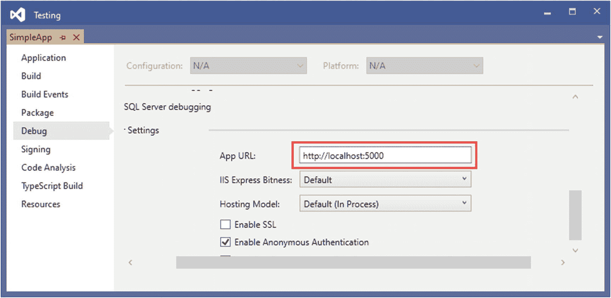
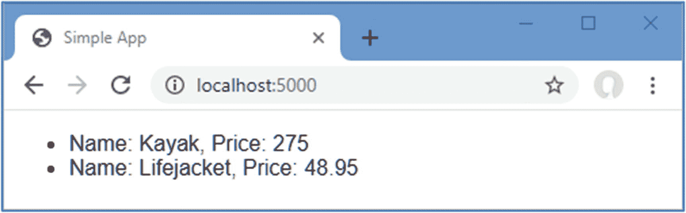
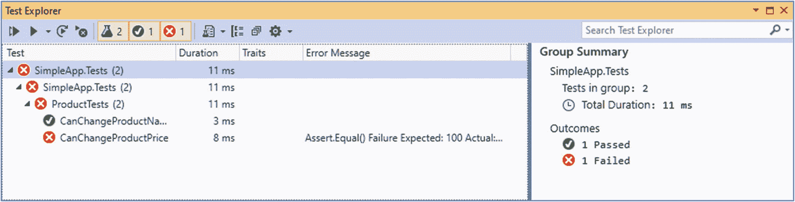
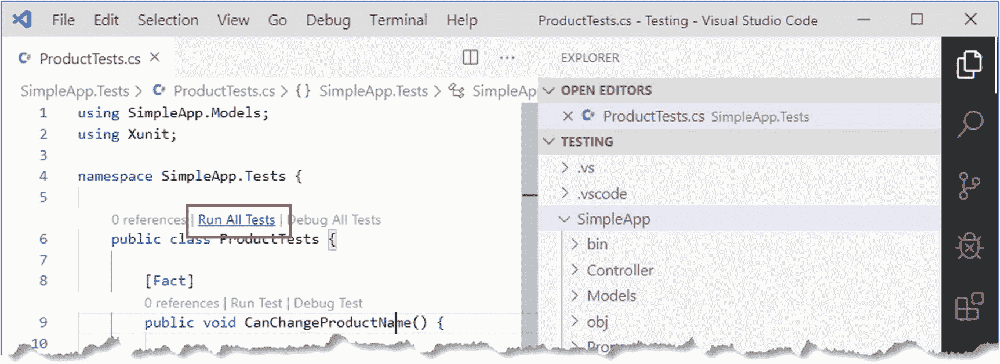
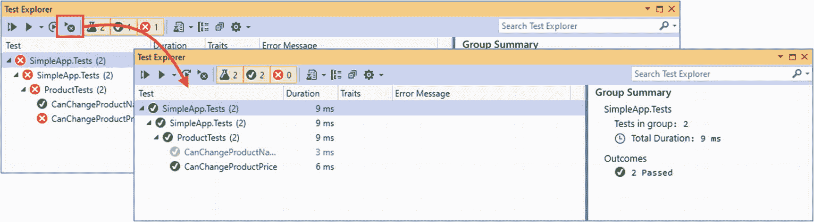

# 六、测试 ASP.NET Core 应用

在这一章中，我将演示如何对 ASP.NET Core 应用进行单元测试。单元测试是一种测试形式，在这种测试中，单个组件与应用的其余部分隔离开来，因此可以彻底验证它们的行为。ASP.NET Core 旨在使创建单元测试变得容易，并且支持广泛的单元测试框架。我将向您展示如何建立一个单元测试项目，并描述编写和运行测试的过程。表 [6-1](#Tab1) 总结了本章内容。

表 6-1。

章节总结

<colgroup><col class="tcol1 align-left"> <col class="tcol2 align-left"> <col class="tcol3 align-left"></colgroup> 
| 

问题

 | 

解决办法

 | 

列表

 |
| --- | --- | --- |
| 创建单元测试项目 | 对于您喜欢的测试框架，使用项目模板中的`dotnet new`命令 | seven |
| 创建 XUnit 测试 | 用用`Fact`属性修饰的方法创建一个类，并使用`Assert`类来检查测试结果 | nine |
| 运行单元测试 | 使用 Visual Studio 或 Visual Studio 代码测试运行程序或使用`dotnet test`命令 | Eleven |
| 隔离组件进行测试 | 创建被测组件所需对象的模拟实现 | 12–19 |

Deciding Whether To Unit Test

能够轻松地执行单元测试是使用 ASP.NET Core 的好处之一，但它并不适合每个人，我也不想假装不是这样。

我喜欢单元测试，我也在自己的项目中使用它，但并不是所有的项目，也不像你期望的那样始终如一。我倾向于专注于为那些我知道很难编写并且很可能成为部署中错误来源的特性和功能编写单元测试。在这些情况下，单元测试有助于我思考如何最好地实现我需要的东西。我发现仅仅考虑我需要测试什么就有助于产生关于潜在问题的想法，这是在我开始处理实际的错误和缺陷之前。

也就是说，单元测试是一种工具，而不是宗教，只有你自己知道你需要多少测试。如果你不觉得单元测试有用，或者如果你有更适合你的不同的方法论，那么不要仅仅因为它是时髦的就觉得你需要单元测试。(然而，如果你没有更好的方法，并且你根本没有进行测试，那么你可能会让用户发现你的错误，这很少是理想的*。*你*没有*去单元测试，但是你真的应该考虑做*一些*测试*一些*类的。)

如果您以前没有遇到过单元测试，那么我鼓励您尝试一下，看看它是如何工作的。如果你不是单元测试的爱好者，那么你可以跳过这一章，继续阅读第 7 章，在这里我将开始构建一个更现实的 ASP.NET Core 应用。

## 为本章做准备

为了准备本章，我需要创建一个简单的 ASP.NET Core 项目。使用 Windows 开始菜单打开一个新的 PowerShell 命令提示符，导航到一个方便的位置，然后运行清单 [6-1](#PC1) 中所示的命令。

Tip

你可以从 [`https://github.com/apress/pro-asp.net-core-3`](https://github.com/apress/pro-asp.net-core-3) 下载本章以及本书其他章节的示例项目。如果在运行示例时遇到问题，请参见第 [1](01.html) 章获取帮助。

```cs
dotnet new globaljson --sdk-version 3.1.101 --output Testing/SimpleApp
dotnet new web --no-https --output Testing/SimpleApp --framework netcoreapp3.1
dotnet new sln -o Testing

dotnet sln Testing add Testing/SimpleApp

Listing 6-1.Creating the Example Project

```

这些命令使用`web`模板创建一个名为`SimpleApp`的新项目，其中包含 ASP.NET Core 应用的最小配置。项目文件夹包含在一个名为`Testing`的解决方案文件夹中。

### 打开项目

如果您使用的是 Visual Studio，请选择文件➤打开➤项目/解决方案，在`Testing`文件夹中选择`Testing.sln`文件，然后单击打开按钮打开解决方案文件及其引用的项目。如果您使用的是 Visual Studio 代码，请选择文件➤打开文件夹，导航到`Testing`文件夹，然后单击选择文件夹按钮。

### 选择 HTTP 端口

如果使用的是 Visual Studio，选择 Project ➤ SimpleApp Properties，选择 Debug 部分，在 App URL 字段将 HTTP 端口改为 5000，如图 [6-1](#Fig1) 所示。选择文件➤全部保存以保存新端口。(如果您使用的是 Visual Studio 代码，则不需要进行此更改。)



图 6-1。

设置 HTTP 端口

### 启用 MVC 框架

正如我在第 [1](01.html) 章中解释的，ASP.NET Core 支持不同的应用框架，但在本章中我将继续使用 MVC 框架。我介绍了在第 7 章[中开始构建的 SportsStore 应用中的其他框架，但是目前，MVC 框架为我演示如何执行单元测试提供了一个基础，这在早期的例子中是很常见的。将清单](07.html) [6-2](#PC2) 中显示的语句添加到`SimpleApp`文件夹中的`Startup.cs`文件中。

```cs
using System;
using System.Collections.Generic;
using System.Linq;
using System.Threading.Tasks;
using Microsoft.AspNetCore.Builder;
using Microsoft.AspNetCore.Hosting;
using Microsoft.AspNetCore.Http;
using Microsoft.Extensions.DependencyInjection;
using Microsoft.Extensions.Hosting;

namespace SimpleApp {
    public class Startup {

        public void ConfigureServices(IServiceCollection services) {
            services.AddControllersWithViews();
        }

        public void Configure(IApplicationBuilder app, IWebHostEnvironment env) {
            if (env.IsDevelopment()) {
                app.UseDeveloperExceptionPage();
            }

            app.UseRouting();

            app.UseEndpoints(endpoints => {
                endpoints.MapDefaultControllerRoute();
                //endpoints.MapGet("/", async context => {
                //    await context.Response.WriteAsync("Hello World!");
                //});
            });
        }
    }
}

Listing 6-2.Enabling the MVC Framework in the Startup.cs File in the SimpleApp Folder

```

### 创建应用组件

既然 MVC 框架已经设置好了，我可以添加应用组件来演示重要的 C# 语言特性。

#### 创建数据模型

我从创建一个简单的模型类开始，这样我就可以处理一些数据。我添加了一个名为`Models`的文件夹，并在其中创建了一个名为`Product.cs`的类文件，我用它来定义清单 [6-3](#PC3) 中所示的类。

```cs
namespace SimpleApp.Models {
    public class Product {

        public string Name { get; set; }
        public decimal? Price { get; set; }

        public static Product[] GetProducts() {

            Product kayak = new Product {
                Name = "Kayak", Price = 275M
            };

            Product lifejacket = new Product {
                Name = "Lifejacket", Price = 48.95M
            };

            return new Product[] { kayak, lifejacket };
        }
    }
}

Listing 6-3.The Contents of the Product.cs File in the SimpleApp/Models Folder

```

`Product`类定义了`Name`和`Price`属性，有一个名为`GetProducts`的`static`方法返回一个`Products`数组。

#### 创建控制器和视图

对于本章中的例子，我使用一个简单的控制器类来演示不同的语言特性。我创建了一个`Controllers`文件夹，并在其中添加了一个名为`HomeController.cs`的类文件，其内容如清单 [6-4](#PC4) 所示。

```cs
using Microsoft.AspNetCore.Mvc;
using SimpleApp.Models;

namespace SimpleApp.Controllers {
    public class HomeController : Controller {

        public ViewResult Index() {
            return View(Product.GetProducts());
        }
    }
}

Listing 6-4.The Contents of the HomeController.cs File in the SimpleApp/Controllers Folder

```

`Index`动作方法告诉 ASP.NET Core 渲染默认视图，并向其提供从静态`Product.GetProducts`方法获得的`Product`对象。为了创建 action 方法的视图，我添加了一个`Views/Home`文件夹(通过创建一个`Views`文件夹，然后在其中添加一个`Home`文件夹)并添加了一个名为`Index.cshtml`的 Razor 视图，其内容如清单 [6-5](#PC5) 所示。

```cs
@using SimpleApp.Models
@model IEnumerable<Product>
@{ Layout = null; }

<!DOCTYPE html>
<html>
<head>
    <meta name="viewport" content="width=device-width" />
    <title>Simple App</title>
</head>
<body>
    <ul>
        @foreach (Product p in Model) {
            <li>Name: @p.Name, Price: @p.Price</li>
        }
    </ul>
</body>
</html>

Listing 6-5.The Contents of the Index.cshtml File in the SimpleApp/Views/Home Folder

```

### 运行示例应用

通过从调试菜单中选择启动而不调试(Visual Studio)或运行而不调试(Visual Studio 代码)或者通过运行在`SimpleApp`文件夹中的清单 [6-6](#PC6) 中显示的命令来启动 ASP.NET Core。

```cs
dotnet run

Listing 6-6.Running the Example Application

```

请求`http://localhost:5000`，你会看到如图 [6-2](#Fig2) 所示的输出。



图 6-2。

运行示例应用

## 创建单元测试项目

对于 ASP.NET Core 应用，通常创建一个单独的 Visual Studio 项目来保存单元测试，每个单元测试都被定义为 C# 类中的一个方法。使用一个单独的项目意味着您可以部署您的应用，而不需要同时部署测试。那个。NET Core SDK 包括使用三种流行测试工具的单元测试项目的模板，如表 [6-2](#Tab2) 所述。

表 6-2。

单元测试项目工具

<colgroup><col class="tcol1 align-left"> <col class="tcol2 align-left"></colgroup> 
| 

名字

 | 

描述

 |
| --- | --- |
| `mstest` | 该模板创建一个为微软生产的 MS 测试框架配置的项目。 |
| `nunit` | 该模板创建一个为 NUnit 框架配置的项目。 |
| `xunit` | 这个模板创建一个为 XUnit 框架配置的项目。 |

这些测试框架在很大程度上具有相同的特性集，不同之处仅在于它们如何实现以及如何集成到第三方测试环境中。如果您没有既定的偏好，我推荐从 XUnit 开始，主要是因为它是我发现最容易使用的测试框架。

约定是将单元测试项目命名为`<ApplicationName>.Tests`。运行`Testing`文件夹中清单 [6-7](#PC7) 所示的命令，创建名为`SimpleApp.Tests`的 XUnit 测试项目，将其添加到解决方案文件中，并创建项目间的引用，以便单元测试可以应用到`SimpleApp`项目中定义的类。

```cs
dotnet new xunit -o SimpleApp.Tests --framework netcoreapp3.1
dotnet sln add SimpleApp.Tests
dotnet add SimpleApp.Tests reference SimpleApp

Listing 6-7.Creating the Unit Test Project

```

如果您使用的是 Visual Studio，将提示您重新加载解决方案，这将导致新的单元测试项目显示在解决方案资源管理器中现有项目的旁边。您可能会发现 Visual Studio 代码不会构建新项目。如果发生这种情况，请选择终端➤配置默认构建任务，从列表中选择“构建”，如果出现提示，请选择。NET Core 从环境列表中删除。

### 移除默认测试类

项目模板向测试项目添加了一个 C# 类文件，这将会混淆后面示例的结果。使用解决方案资源管理器或文件资源管理器窗格从`SimpleApp.Tests`文件夹中删除`UnitTest1.cs`文件，或者在`Testing`文件夹中运行清单 [6-8](#PC8) 中所示的命令。

```cs
Remove-Item SimpleApp.Tests/UnitTest1.cs

Listing 6-8.Removing the Default Test Class File

```

## 编写和运行单元测试

现在所有的准备工作都完成了，我可以写一些测试了。首先，我向`SimpleApp.Tests`项目添加了一个名为`ProductTests.cs`的类文件，并用它来定义清单 [6-9](#PC9) 中所示的类。这是一个简单的类，但是它包含了开始单元测试所需的一切。

Note

`CanChangeProductPrice`方法包含一个故意的错误，我将在本节稍后解决这个错误。

```cs
using SimpleApp.Models;
using Xunit;

namespace SimpleApp.Tests {

    public class ProductTests {

        [Fact]
        public void CanChangeProductName() {

            // Arrange
            var p = new Product { Name = "Test", Price = 100M };

            // Act
            p.Name = "New Name";

            //Assert
            Assert.Equal("New Name", p.Name);
        }

        [Fact]
        public void CanChangeProductPrice() {

            // Arrange
            var p = new Product { Name = "Test", Price = 100M };

            // Act
            p.Price = 200M;

            //Assert
            Assert.Equal(100M, p.Price);
        }
    }
}

Listing 6-9.The Contents of the ProductTests.cs File in the SimpleApp.Tests Folder

```

在`ProductTests`类中有两个单元测试，每个测试来自`SimpleApp`项目的`Product`模型类的一个行为。一个测试项目可以包含许多类，每个类可以包含许多单元测试。

按照惯例，测试方法的名字描述了测试做什么，类的名字描述了被测试的内容。这使得在项目中构建测试变得更加容易，也更容易理解 Visual Studio 运行所有测试的结果。名称`ProductTests`表示该类包含对`Product`类的测试，方法名称表示它们测试改变`Product`对象的名称和价格的能力。

`Fact`属性被应用于每个方法，以表明它是一个测试。在方法体中，单元测试遵循一种叫做*安排、动作、断言* (A/A/A)的模式。*安排*指的是为测试设置条件，*动作*指的是执行测试，*断言*指的是验证结果是预期的结果。

这些测试的 arrange 和 act 部分是常规的 C# 代码，但是 assert 部分是由 xUnit.net 处理的，它提供了一个名为`Assert`的类，其方法用于检查动作的结果是否是预期的结果。

Tip

在`Xunit`名称空间中定义了`Fact`属性和`Asset`类，因此在每个测试类中必须有一个`using`语句。

`Assert`类的方法是静态的，用于在预期结果和实际结果之间进行不同类型的比较。表 [6-3](#Tab3) 显示了常用的`Assert`方法。

表 6-3。

常用的 xUnit.net 断言方法

<colgroup><col class="tcol1 align-left"> <col class="tcol2 align-left"></colgroup> 
| 

名字

 | 

描述

 |
| --- | --- |
| `Equal(expected, result)` | 这个方法断言结果等于预期的结果。此方法有多种重载版本，用于比较不同类型和比较集合。该方法还有一个版本，它接受一个对象的附加参数，该对象实现了用于比较对象的`IEqualityComparer<T>`接口。 |
| `NotEqual(expected, result)` | 这种方法断言结果不等于预期的结果。 |
| `True(result)` | 这个方法断言结果是`true`。 |
| `False(result)` | 这个方法断言结果是`false`。 |
| `IsType(expected, result)` | 该方法断言结果是特定类型的。 |
| `IsNotType(expected, result)` | 此方法断言结果不是特定类型。 |
| `IsNull(result)` | 这个方法断言结果是`null`。 |
| `IsNotNull(result)` | 这个方法断言结果不是`null`。 |
| `InRange(result, low, high)` | 该方法断言结果落在`low`和`high`之间。 |
| `NotInRange(result, low, high)` | 该方法断言结果落在`low`和`high`之外。 |
| `Throws(exception, expression)` | 此方法断言指定的表达式引发特定的异常类型。 |

每个`Assert`方法都允许进行不同类型的比较，如果结果不是预期的，就会抛出异常。异常用于指示测试失败。在清单 [6-9](#PC9) 中的测试中，我使用了`Equal`方法来确定属性的值是否被正确地更改了。

```cs
...
Assert.Equal("New Name", p.Name);
...

```

### 使用 Visual Studio 测试资源管理器运行测试

Visual Studio 支持通过“测试资源管理器”窗口查找和运行单元测试，该窗口可通过“测试➤测试资源管理器”菜单获得，如图 [6-3](#Fig3) 所示。

Tip

如果在"测试资源管理器"窗口中看不到单元测试，请生成解决方案。编译触发了发现单元测试的过程。



图 6-3。

Visual Studio 测试浏览器

通过单击“测试资源管理器”窗口中的“运行所有测试”按钮来运行测试(该按钮显示两个箭头，并且是窗口顶部行中的第一个按钮)。如上所述，`CanChangeProductPrice`测试包含一个导致测试失败的错误，这在图中所示的测试结果中清楚地显示出来。

### 使用 Visual Studio 代码运行测试

Visual Studio 代码检测测试，并允许使用代码镜头功能运行测试，该功能在编辑器中显示有关代码功能的详细信息。要运行`ProductTests`类中的所有测试，在单元测试类打开时，点击代码编辑器中的 Run All Tests，如图 [6-4](#Fig4) 所示。



图 6-4。

使用 Visual Studio Code code lens 功能运行测试

Tip

如果您没有看到代码镜头测试功能，请关闭并重新打开 Visual Studio 代码中的`Testing`文件夹。

Visual Studio 代码使用我在下一节中描述的命令行工具运行测试，结果以文本形式显示在终端窗口中。

### 从命令行运行测试

要运行项目中的测试，运行在`Testing`文件夹中的清单 [6-10](#PC11) 中显示的命令。

```cs
dotnet test

Listing 6-10.Running Unit Tests

```

发现并执行测试，产生以下结果，这些结果显示了我前面介绍的故意的错误:

```cs
Test run for C:\Users\adam\SimpleApp.Tests.dll(.NETCoreApp,Version=v3.1)
Microsoft (R) Test Execution Command Line Tool Version 16.3.0
Copyright (c) Microsoft Corporation.  All rights reserved.

Starting test execution, please wait...

A total of 1 test files matched the specified pattern.
[xUnit.net 00:00:00.83]     SimpleApp.Tests.ProductTests.CanChangeProductPrice [FAIL]
  X SimpleApp.Tests.ProductTests.CanChangeProductPrice [6ms]
  Error Message:
   Assert.Equal() Failure
Expected: 100
Actual:   200
  Stack Trace:
     at SimpleApp.Tests.ProductTests.CanChangeProductPrice() in C:\Users\adam\Documents\Books\Pro ASP.NET Core MVC 3\Source Code\Current\Testin
g\SimpleApp.Tests\ProductTests.cs:line 31

Test Run Failed.
Total tests: 2
     Passed: 1
     Failed: 1
 Total time: 1.7201 Seconds

```

### 更正单元测试

单元测试的问题在于`Assert.Equal`方法的参数，该方法将测试结果与原始的`Price`属性值进行比较，而不是与它被更改后的值进行比较。清单 [6-11](#PC13) 纠正了这个问题。

Tip

当测试失败时，在查看目标组件之前检查测试的准确性总是一个好主意，特别是如果测试是新的或者最近被修改过。

```cs
using SimpleApp.Models;
using Xunit;

namespace SimpleApp.Tests {

    public class ProductTests {

        [Fact]
        public void CanChangeProductName() {

            // Arrange
            var p = new Product { Name = "Test", Price = 100M };

            // Act
            p.Name = "New Name";

            //Assert
            Assert.Equal("New Name", p.Name);
        }

        [Fact]
        public void CanChangeProductPrice() {

            // Arrange
            var p = new Product { Name = "Test", Price = 100M };

            // Act
            p.Price = 200M;

            //Assert
            Assert.Equal(200M, p.Price);
        }
    }
}

Listing 6-11.Correcting a Test in the ProductTests.cs File in the SimpleApp.Tests Folder

```

再次运行测试，你会看到他们都通过了。如果你使用的是 Visual Studio，你可以点击 Run Failed Tests 按钮，它将只执行那些失败的测试，如图 [6-5](#Fig5) 所示。



图 6-5。

仅运行失败的测试

### 隔离用于单元测试的组件

为像`Product`这样的模型类编写单元测试很容易。`Product`类不仅简单，而且是自包含的，这意味着当我对`Product`对象执行动作时，我可以确信我正在测试`Product`类提供的功能。

ASP.NET Core 应用中的其他组件的情况更复杂，因为它们之间存在依赖关系。我定义的下一组测试将在控制器上运行，检查在控制器和视图之间传递的`Product`对象的序列。

当比较从自定义类实例化的对象时，您将需要使用 xUnit.net`Assert.Equal`方法，该方法接受实现`IEqualityComparer<T>`接口的参数，以便可以比较对象。我的第一步是向单元测试项目添加一个名为`Comparer.cs`的类文件，并使用它来定义清单 [6-12](#PC14) 中所示的助手类。

```cs
using System;
using System.Collections.Generic;

namespace SimpleApp.Tests {

    public class Comparer {

        public static Comparer<U> Get<U>(Func<U, U, bool> func) {
            return new Comparer<U>(func);
        }
    }

    public class Comparer<T> : Comparer, IEqualityComparer<T> {
        private Func<T, T, bool> comparisonFunction;

        public Comparer(Func<T, T, bool> func) {
            comparisonFunction = func;
        }

        public bool Equals(T x, T y) {
            return comparisonFunction(x, y);
        }

        public int GetHashCode(T obj) {
            return obj.GetHashCode();
        }
    }
}

Listing 6-12.The Contents of the Comparer.cs File in the SimpleApp.Tests Folder

```

这些类将允许我使用 lambda 表达式创建`IEqualityComparer<T>`对象，而不必为我想要进行的每种类型的比较定义一个新的类。这不是必需的，但它将简化我的单元测试类中的代码，使它们更容易阅读和维护。

现在我可以很容易地进行比较，我可以说明应用中组件之间的依赖问题。我在`SimpleApp.Tests`文件夹中添加了一个名为`HomeControllerTests.cs`的新类，并用它来定义清单 [6-13](#PC15) 中所示的单元测试。

```cs
using Microsoft.AspNetCore.Mvc;
using System.Collections.Generic;
using SimpleApp.Controllers;
using SimpleApp.Models;
using Xunit;

namespace SimpleApp.Tests {
    public class HomeControllerTests {

        [Fact]
        public void IndexActionModelIsComplete() {
            // Arrange
            var controller = new HomeController();
            Product[] products = new Product[]  {
                new Product { Name = "Kayak", Price = 275M },
                new Product { Name = "Lifejacket", Price = 48.95M}
            };

            // Act
            var model = (controller.Index() as ViewResult)?.ViewData.Model
                as IEnumerable<Product>;

            // Assert
            Assert.Equal(products, model,
                Comparer.Get<Product>((p1, p2) => p1.Name == p2.Name
                    && p1.Price == p2.Price));
        }
    }
}

Listing 6-13.The HomeControllerTests.cs File in the SimpleApp.Tests Folder

```

单元测试创建一个`Product`对象的数组，并检查它们是否对应于`Index`动作方法作为视图模型提供的对象。(暂时忽略测试的 act 部分；我在第 21 章[和第 22 章](21.html)中解释了`ViewResult`这个职业。目前，知道我正在获取由`Index`动作方法返回的模型数据就足够了。)

测试通过了，但这不是一个有用的结果，因为我测试的`Product`数据来自硬连线对象的`Product`类。例如，当有两个以上的`Product`对象时，或者当第一个对象的`Price`属性有小数时，我无法编写测试来确保控制器行为正确。总体效果是，我正在测试`HomeController`和`Product`类的组合行为，并且只针对特定的硬连线对象。

当单元测试以应用的小部分为目标时，例如一个单独的方法或类，单元测试是有效的。我需要的是将`Home`控制器与应用的其余部分隔离开来的能力，这样我就可以限制测试的范围，并排除由存储库引起的任何影响。

#### 隔离组件

隔离组件的关键是使用 C# 接口。为了将控制器从存储库中分离出来，我在`Models`文件夹中添加了一个名为`IDataSource.cs`的新类文件，并使用它来定义清单 [6-14](#PC16) 中所示的接口。

```cs
using System.Collections.Generic;

namespace SimpleApp.Models {
    public interface IDataSource {

        IEnumerable<Product> Products { get; }
    }
}

Listing 6-14.The Contents of the IDataSource.cs File in the SimpleApp/Models Folder

```

在清单 [6-15](#PC17) 中，我已经从`Product`类中移除了静态方法，并创建了一个实现`IDataSource`接口的新类。

```cs
using System.Collections.Generic;

namespace SimpleApp.Models {

    public class Product {
        public string Name { get; set; }
        public decimal? Price { get; set; }
    }

    public class ProductDataSource : IDataSource {
        public IEnumerable<Product> Products =>
            new Product[] {
                new Product { Name = "Kayak", Price = 275M },
                new Product { Name = "Lifejacket", Price = 48.95M }
            };
    }
}

Listing 6-15.Creating a Data Source in the Product.cs File in the SimpleApp/Models Folder

```

下一步是修改控制器，使其使用`ProductDataSource`类作为数据源，如清单 [6-16](#PC18) 所示。

Tip

ASP.NET 内核支持一种更优雅的方法来解决这个问题，称为*依赖注入*，我将在第 14 章[中描述。依赖注入经常引起混乱，所以我在这一章中用一种更简单、更人工的方式隔离组件。](14.html)

```cs
using Microsoft.AspNetCore.Mvc;
using SimpleApp.Models;

namespace SimpleApp.Controllers {
    public class HomeController : Controller {
        public IDataSource dataSource = new ProductDataSource();

        public ViewResult Index() {
            return View(dataSource.Products);
        }
    }
}

Listing 6-16.Adding a Property in the HomeController.cs File in the SimpleApp/Controllers Folder

```

这似乎不是一个重大的变化，但它允许我在测试期间改变控制器使用的数据源，这就是我隔离控制器的方式。在清单 [6-17](#PC19) 中，我已经更新了控制器单元测试，因此它们使用了一个特殊版本的存储库。

```cs
using Microsoft.AspNetCore.Mvc;
using System.Collections.Generic;
using SimpleApp.Controllers;
using SimpleApp.Models;
using Xunit;

namespace SimpleApp.Tests {
    public class HomeControllerTests {

        class FakeDataSource : IDataSource {
            public FakeDataSource(Product[] data) => Products = data;
            public IEnumerable<Product> Products { get; set; }
        }

        [Fact]
        public void IndexActionModelIsComplete() {
            // Arrange
            Product[] testData = new Product[] {
                new Product { Name = "P1", Price = 75.10M },
                new Product { Name = "P2", Price = 120M },
                new Product { Name = "P3", Price = 110M }
            };
            IDataSource data = new FakeDataSource(testData);
            var controller = new HomeController();
            controller.dataSource = data;

            // Act
            var model = (controller.Index() as ViewResult)?.ViewData.Model
                as IEnumerable<Product>;

            // Assert
            Assert.Equal(data.Products, model,
                Comparer.Get<Product>((p1, p2) => p1.Name == p2.Name
                    && p1.Price == p2.Price));
        }
    }
}

Listing 6-17.Isolating the Controller in the HomeControllerTests.cs File in the SimpleApp.Tests Folder

```

我定义了一个`IDataSource`接口的伪实现，它允许我使用控制器的任何测试数据。

Understanding Test-Driven Development

我遵循了本章中最常用的单元测试方式，即编写一个应用特性，然后进行测试以确保它按要求工作。这很受欢迎，因为大多数开发人员首先考虑的是应用代码，其次才是测试(这当然是我所在的类别)。

这种方法倾向于产生单元测试，这些单元测试只关注应用代码中难以编写或者需要认真调试的部分，而对某个功能的某些方面只进行了部分测试或者根本没有进行测试。

另一种方法是*测试驱动开发* (TDD)。TDD 有很多变体，但核心思想是在实现特性本身之前，为特性编写测试。首先编写测试使您更仔细地考虑您正在实现的规范，以及您如何知道一个特性已经被正确地实现。TDD 让您提前考虑成功或失败的度量标准，而不是深入实现细节。

您编写的测试最初都会失败，因为您的新特性不会被实现。但是当您向应用中添加代码时，您的测试将逐渐从红色变为绿色，并且当特性完成时，您的所有测试都将通过。TDD 需要训练，但是它确实产生了一组更全面的测试，并且可以产生更健壮和可靠的代码。

### 使用模拟包

为`IDataSource`接口创建一个假的实现很容易，但是大多数需要假实现的类更加复杂，并且不容易处理。

一个更好的方法是使用一个模仿包，这样可以很容易地为测试创建假的或者模仿的对象。有许多嘲弄软件包可用，但我使用的一个(并已有多年)被称为 Moq。要将 Moq 添加到单元测试项目中，运行`Testing`文件夹中清单 [6-18](#PC20) 中所示的命令。

Note

Moq 包被添加到单元测试项目中，而不是包含要测试的应用的项目中。

```cs
dotnet add SimpleApp.Tests package Moq --version 4.13.1

Listing 6-18.Installing the Mocking Package

```

### 创建模拟对象

我可以使用 Moq 框架创建一个假的`IDataSource`对象，而不必定义一个定制的测试类，如清单 [6-19](#PC21) 所示。

```cs
using Microsoft.AspNetCore.Mvc;
using System.Collections.Generic;
using SimpleApp.Controllers;
using SimpleApp.Models;
using Xunit;
using Moq;

namespace SimpleApp.Tests {
    public class HomeControllerTests {

        //class FakeDataSource : IDataSource {
        //    public FakeDataSource(params Product[] data) => Products = data;
        //    public IEnumerable<Product> Products { get; set; }
        //}

        [Fact]
        public void IndexActionModelIsComplete() {

            // Arrange
            Product[] testData = new Product[] {
                new Product { Name = "P1", Price = 75.10M },
                new Product { Name = "P2", Price = 120M },
                new Product { Name = "P3", Price = 110M }
            };
            var mock = new Mock<IDataSource>();
            mock.SetupGet(m => m.Products).Returns(testData);
            var controller = new HomeController();
            controller.dataSource = mock.Object;

            // Act
            var model = (controller.Index() as ViewResult)?.ViewData.Model
                as IEnumerable<Product>;

            // Assert
            Assert.Equal(testData, model,
                Comparer.Get<Product>((p1, p2) => p1.Name == p2.Name
                    && p1.Price == p2.Price));
            mock.VerifyGet(m => m.Products, Times.Once);
        }
    }
}

Listing 6-19.Creating a Mock Object in the HomeControllerTests.cs File in the SimpleApp.Tests Folder

```

Moq 的使用让我去掉了`IDataSource`接口的伪实现，代之以几行代码。我不打算详细介绍 Moq 支持的不同特性，但我会解释我在示例中使用 Moq 的方式。(参见 [`https://github.com/Moq/moq4`](https://github.com/Moq/moq4) 了解 Moq 的示例和文档。在我解释如何对不同类型的组件进行单元测试时，后面的章节中也会有一些例子。)

第一步是创建一个`Mock`对象的新实例，指定应该实现的接口，如下所示:

```cs
...
var mock = new Mock<IDataSource>();
...

```

我创建的`Mock`对象将伪造`IDataSource`接口。为了创建`Product`属性的实现，我使用了`SetUpGet`方法，如下所示:

```cs
...
mock.SetupGet(m => m.Products).Returns(testData);
...

```

`SetupGet`方法用于实现属性的 getter。这个方法的参数是一个 lambda 表达式，它指定了要实现的属性，在这个例子中是`Products`。对`SetupGet`方法的结果调用`Returns`方法，以指定读取属性值时将返回的结果。

`Mock`类定义了一个`Object`属性，该属性返回实现指定接口的对象，该接口具有已定义的行为。我使用了`Object`属性来设置由`HomeController`定义的`dataSource`字段，如下所示:

```cs
...
controller.dataSource = mock.Object;
...

```

我使用的最后一个 Moq 特性是检查`Products`属性是否被调用过一次，如下所示:

```cs
...
mock.VerifyGet(m => m.Products, Times.Once);
...

```

`VerifyGet`方法是由`Mock`类定义的方法之一，用于在测试完成时检查模拟对象的状态。在这种情况下，`VerifyGet`方法允许我检查`Products`属性方法被读取的次数。`Times.Once`值指定如果属性没有被读取一次，那么`VerifyGet`方法应该抛出一个异常，这将导致测试失败。(测试中通常使用的`Assert`方法通过在测试失败时抛出异常来工作，这就是为什么在使用模拟对象时可以使用`VerifyGet`方法来代替`Assert`方法。)

总体效果与我的 fake 接口实现相同，但是 mocking 更灵活、更简洁，并且可以提供对被测组件行为的更多洞察。

## 摘要

本章主要关注单元测试，它是提高代码质量的有力工具。单元测试并不适合每一个开发人员，但它值得尝试，即使只用于复杂的功能或问题诊断，也是有用的。我描述了 xUnit.net 测试框架的使用，解释了隔离测试组件的重要性，并展示了一些简化单元测试代码的工具和技术。在下一章中，我开始开发一个更现实的项目，名为 SportsStore。