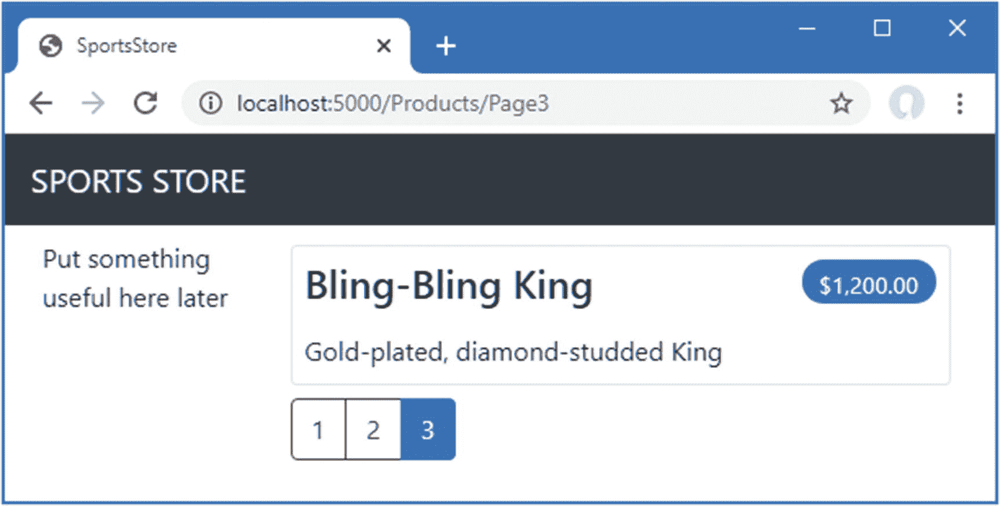

# 七、SportsStore：一个真正的应用

在前几章中，我构建了快速简单的 ASP.NET Core 应用。我描述了 ASP.NET Core 模式、基本的 C# 特性以及优秀的 ASP.NET Core 开发人员需要的工具。现在是时候把所有东西放在一起，构建一个简单但现实的电子商务应用了。

我的应用名为 SportsStore，将遵循各地在线商店采用的经典方法。我将创建一个客户可以按类别和页面浏览的在线产品目录，一个用户可以添加和删除产品的购物车，以及一个客户可以输入送货细节的收银台。我还将创建一个管理区域，其中包括用于管理目录的创建、读取、更新和删除(CRUD)工具，我将保护它，以便只有登录的管理员才能进行更改。

我在这一章和接下来几章的目标是通过创造尽可能真实的例子，让你了解什么是真正的 ASP.NET Core 发展。当然，我想专注于 ASP.NET Core，所以我简化了与外部系统的集成，比如数据库，并完全省略了其他部分，比如支付处理。

当我建立起我所需要的基础设施时，您可能会发现进展有点慢，但是最初的投资将会产生可维护的、可扩展的、结构良好的代码，并且对单元测试有很好的支持。

Unit Testing

我在整个开发过程中对 SportsStore 应用中的不同组件进行了单元测试，演示了如何隔离和测试不同的 ASP.NET Core 组件。

我知道单元测试并不被所有人接受。如果你不想参加单元测试，我没意见。为此，当我有纯粹关于测试的话要说时，我会把它放在这样的边栏中。如果您对单元测试不感兴趣，您可以直接跳过这些部分，SportsStore 应用会工作得很好。您不需要进行任何类型的单元测试就能获得 ASP.NET Core 的技术优势，当然，测试支持是在许多项目中采用 ASP.NET Core 的一个关键原因。

我在 SportsStore 应用中使用的大多数特性在本书的后面都有自己的章节。我不会在这里重复所有的内容，我只告诉您足够理解示例应用的意义，并指引您到另一章获取更深入的信息。

我将说出构建应用所需的每个步骤，以便您可以看到 ASP.NET Core 功能是如何组合在一起的。当我创建视图时，您应该特别注意。如果你不密切关注这些例子，你会得到一些奇怪的结果。

## 创建项目

我将从一个最小的 ASP.NET Core 项目开始，并根据需要添加我需要的功能。从 Windows 开始菜单打开一个新的 PowerShell 命令提示符，并运行清单 [7-1](#PC1) 中所示的命令开始。

Tip

你可以从 [`https://github.com/apress/pro-asp.net-core-3`](https://github.com/apress/pro-asp.net-core-3) 下载本章以及本书其他章节的示例项目。如果在运行示例时遇到问题，请参见第 [1](01.html) 章获取帮助。

```cs
dotnet new globaljson --sdk-version 3.1.101 --output SportsSln/SportsStore
dotnet new web --no-https --output SportsSln/SportsStore --framework netcoreapp3.1
dotnet new sln -o SportsSln

dotnet sln SportsSln add SportsSln/SportsStore

Listing 7-1.Creating the SportsStore Project

```

这些命令创建一个`SportsSln`解决方案文件夹，其中包含一个用`web`项目模板创建的`SportsStore`项目文件夹。`SportsSln`文件夹还包含一个解决方案文件，其中添加了`SportsStore`项目。

我对解决方案和项目文件夹使用了不同的名称，以使示例更容易理解，但是如果您使用 Visual Studio 创建项目，默认情况下两个文件夹使用相同的名称。没有“正确”的方法，您可以使用适合您项目的任何名称。

### 创建单元测试项目

为了创建单元测试项目，在与清单 [7-1](#PC1) 中所示命令相同的位置运行清单 [7-2](#PC2) 中所示的命令。

```cs
dotnet new xunit -o SportsSln/SportsStore.Tests --framework netcoreapp3.1
dotnet sln SportsSln add SportsSln/SportsStore.Tests
dotnet add SportsSln/SportsStore.Tests reference SportsSln/SportsStore

Listing 7-2.Creating the Unit Test Project

```

我将使用 Moq 包来创建模拟对象。运行清单 [7-3](#PC3) 中所示的命令，将 Moq 包安装到单元测试项目中。从与清单 [7-1](#PC1) 和 [7-2](#PC2) 中的命令相同的位置运行该命令。

```cs
dotnet add SportsSln/SportsStore.Tests package Moq --version 4.13.1

Listing 7-3.Installing the Moq Package

```

### 创建应用项目文件夹

下一步是创建包含应用组件的文件夹。在 Visual Studio 解决方案资源管理器或 Visual Studio 代码资源管理器窗格中右键单击 SportsStore 项，然后选择“添加➤新文件夹”或“新文件夹”以创建表 [7-1](#Tab1) 中描述的文件夹集。

表 7-1。

在清单 [7-3](#PC3) 中创建的文件夹

<colgroup><col class="tcol1 align-left"> <col class="tcol2 align-left"></colgroup> 
| 

名字

 | 

描述

 |
| --- | --- |
| `Models` | 该文件夹将包含数据模型和提供对应用数据库中数据的访问的类。 |
| `Controllers` | 该文件夹将包含处理 HTTP 请求的控制器类。 |
| `Views` | 这个文件夹将包含所有 Razor 文件，分组到单独的子文件夹中。 |
| `Views/Home` | 这个文件夹将包含特定于`Home`控制器的 Razor 文件，它是我在“创建控制器和视图”一节中创建的。 |
| `Views/Shared` | 这个文件夹将包含所有控制器共有的 Razor 文件。 |

### 打开项目

如果您使用的是 Visual Studio 代码，请选择文件➤打开文件夹，导航到`SportsSln`文件夹，然后单击选择文件夹按钮。Visual Studio 代码将打开文件夹并发现解决方案和项目文件。出现提示时，如图 [7-1](#Fig1) 所示，点击【是】安装构建项目所需的资产。如果 Visual Studio 代码提示您选择要运行的项目，请选择 SportsStore。


图 7-1。

在 Visual Studio 代码中添加资产

如果您使用的是 Visual Studio，请在初始屏幕上单击“打开项目或解决方案”按钮，或者选择“文件”“➤”“打开➤项目/解决方案”。在`SportsSln`文件夹中选择`SportsSln.sln`文件，点击打开按钮打开项目。打开项目后，选择项目➤ SportsStore Properties，选择 Debug 部分，将 App URL 字段中 URL 的端口更改为 5000，如图 [7-2](#Fig2) 所示。选择文件➤全部保存以保存新的 URL。


图 7-2。

在 Visual Studio 中更改 HTTP 端口

### 准备应用服务和请求管道

`Startup`类负责配置 ASP.NET Core 应用。将清单 [7-4](#PC4) 中所示的更改应用到 SportsStore 项目中的`Startup`类，以配置基本的应用特性。

Note

`Startup`级是 ASP.NET 的一个重要核心特性。我在第 12 章中详细描述了它。

```cs
using System;
using System.Collections.Generic;
using System.Linq;
using System.Threading.Tasks;
using Microsoft.AspNetCore.Builder;
using Microsoft.AspNetCore.Hosting;
using Microsoft.AspNetCore.Http;
using Microsoft.Extensions.DependencyInjection;
using Microsoft.Extensions.Hosting;

namespace SportsStore {
    public class Startup {

        public void ConfigureServices(IServiceCollection services) {
            services.AddControllersWithViews();
        }

        public void Configure(IApplicationBuilder app, IWebHostEnvironment env) {

            app.UseDeveloperExceptionPage();
            app.UseStatusCodePages();
            app.UseStaticFiles();

            app.UseRouting();
            app.UseEndpoints(endpoints => {
                endpoints.MapDefaultControllerRoute();
            });
        }
    }
}

Listing 7-4Configuring the Application in the Startup.cs File in the SportsStore Folder

```

`ConfigureServices`方法用于设置对象，即所谓的*服务*，这些对象可以在整个应用中使用，并通过一个称为*依赖注入*的特性来访问，我在第 [14 章](14.html)中对此进行了描述。在`ConfigureServices`方法中调用的`AddControllersWithViews`方法使用 MVC 框架和 Razor 视图引擎设置应用所需的共享对象。

ASP.NET Core 接收 HTTP 请求，并沿着*请求管道*传递它们，管道中填充了在`Configure`方法中注册的中间件组件。每个中间件组件都能够检查请求、修改请求、生成响应或修改其他组件生成的响应。请求管道是 ASP.NET Core 的心脏，我将在第 [12 章](12.html)中详细描述它，在那里我还将解释如何创建定制的中间件组件。表 [7-2](#Tab2) 描述了用于设置清单 [7-4](#PC4) 中中间件组件的方法。

表 7-2。

清单 [7-4](#PC4) 中使用的中间件方法

<colgroup><col class="tcol1 align-left"> <col class="tcol2 align-left"></colgroup> 
| 

名字

 | 

描述

 |
| --- | --- |
| `UseDeveloperExceptionPage()` | 这个扩展方法显示应用中发生的异常的细节，这在开发过程中很有用，如第 [16](16.html) 章所述。它不应该在已部署的应用中启用，我在第 [11](11.html) 章中准备部署 SportsStore 应用时禁用了该功能。 |
| `UseStatusCodePages()` | 这个扩展方法将一个简单的消息添加到 HTTP 响应中，否则该消息不会有正文，比如`404 - Not Found`响应。该功能在第 [16 章](16.html)中描述。 |
| `UseStaticFiles()` | 这个扩展方法支持从`wwwroot`文件夹提供静态内容。我在第 15 章中描述了对静态内容的支持。 |

一个特别重要的中间件组件提供了端点路由特性，它将 HTTP 请求匹配到应用特性——称为端点——能够为它们产生响应，这个过程我将在第 [13 章](13.html)中详细描述。使用`UseRouting`和`UseEndpoints`方法将端点路由特性添加到请求管道中。为了将 MVC 框架注册为端点源，清单 [7-4](#PC4) 调用了`MapDefaultControllerRoute`方法。

### 配置 Razor 视图引擎

Razor 视图引擎负责处理扩展名为`.cshtml`的视图文件，以生成 HTML 响应。配置 Razor 需要一些初始准备，以便更容易地为应用创建视图。

在`Views`文件夹中添加一个名为`_ViewImports.cshtml`的 Razor 视图导入文件，内容如清单 [7-5](#PC5) 所示。

Caution

请密切注意该文件的内容。很容易出错，导致应用生成不正确的 HTML 内容。

```cs
@using SportsStore.Models
@addTagHelper *, Microsoft.AspNetCore.Mvc.TagHelpers

Listing 7-5.The Contents of the _ViewImports.cshtml File in the SportsStore/Views Folder

```

`@using`语句将允许我在视图中使用`SportsStore.Models`名称空间中的类型，而不需要引用名称空间。`@addTagHelper`语句启用了内置的标签助手，我稍后将使用它们来创建反映 SportsStore 应用配置的 HTML 元素，我将在第 [15 章](15.html)中详细描述这些元素。

在`SportsStore/Views`文件夹中添加一个名为`_ViewStart.cshtml`的 Razor 视图启动文件，内容如清单 [7-6](#PC6) 所示。(如果使用 Visual Studio 项模板创建文件，该文件将已经包含此表达式。)

```cs
@{
    Layout = "_Layout";
}

Listing 7-6.The Contents of the _ViewStart.cshtml File in the SportsStore/Views Folder

```

视图开始文件告诉 Razor 在它生成的 HTML 中使用一个布局文件，减少视图中的重复量。为了创建视图，将名为`_Layout.cshtml`的 Razor 布局添加到`Views/Shared`文件夹中，内容如清单 [7-7](#PC7) 所示。

```cs
<!DOCTYPE html>
<html>
<head>
    <meta name="viewport" content="width=device-width" />
    <title>SportsStore</title>
</head>
<body>
    <div>
        @RenderBody()
    </div>
</body>
</html>

Listing 7-7.The Contents of the _Layout.cshtml File in the SportsStore/Views/Shared Folder

```

该文件定义了一个简单的 HTML 文档，其他视图的内容将通过`@RenderBody`表达式插入其中。我会在第 21 章中详细解释 Razor 表达式是如何工作的。

### 创建控制器和视图

在`SportsStore/Controllers`文件夹中添加一个名为`HomeController.cs`的类文件，并用它来定义清单 [7-8](#PC8) 中所示的类。这是一个最小的控制器，只包含足够产生响应的功能。

```cs
using Microsoft.AspNetCore.Mvc;

namespace SportsStore.Controllers {
    public class HomeController: Controller {

        public IActionResult Index() => View();

    }
}

Listing 7-8.The Contents of the HomeController.cs File in the SportsStore/Controllers Folder

```

清单 [7-4](#PC4) 中使用的`MapDefaultControllerRoute`方法告诉 ASP.NET Core 如何将 URL 匹配到控制器类。该方法应用的配置声明由`Home`控制器定义的`Index`动作方法将用于处理请求。

`Index`动作方法还没有做任何有用的事情，只是返回调用`View`方法的结果，该方法继承自`Controller`基类。这个结果告诉 ASP.NET Core 渲染与动作方法相关联的默认视图。为了创建视图，将一个名为`Index.cshtml`的 Razor 视图文件添加到`Views/Home`文件夹中，其内容如清单 [7-9](#PC9) 所示。

```cs
<h4>Welcome to SportsStore</h4>

Listing 7-9.The Contents of the Index.cshtml File in the SportsStore/Views/Home Folder

```

### 启动数据模型

几乎所有的项目都有某种数据模型。由于这是一个电子商务应用，我需要的最明显的模型是一个产品。将名为`Product.cs`的类文件添加到`Models`文件夹中，并使用它来定义清单 [7-10](#PC10) 中所示的类。

```cs
using System.ComponentModel.DataAnnotations.Schema;

namespace SportsStore.Models {

    public class Product {

        public long ProductID { get; set; }

        public string Name { get; set; }

        public string Description { get; set; }

        [Column(TypeName = "decimal(8, 2)")]
        public decimal Price { get; set; }

        public string Category { get; set; }
    }
}

Listing 7-10.The Contents of the Product.cs File in the SportsStore/Models Folder

```

属性`Price`已经用属性`Column`进行了修饰，以指定将用于存储该属性的值的 SQL 数据类型。并不是所有的 C# 类型都能很好地映射到 SQL 类型，这个属性可以确保数据库为应用数据使用合适的类型。

### 检查和运行应用

在继续之前，最好确保应用按预期构建和运行。从调试菜单中选择启动而不调试或运行而不调试，或者运行`SportsStore`文件夹中清单 [7-11](#PC11) 中所示的命令。

```cs
dotnet run

Listing 7-11Running the Example Application

```

请求`http://localhost:5000`，你会看到如图 [7-3](#Fig3) 所示的响应。


图 7-3。

运行示例应用

## 向应用添加数据

既然 SportsStore 包含了一些基本的设置，并且可以产生一个简单的响应，那么是时候添加一些数据了，这样应用就可以显示一些更有用的内容。SportsStore 应用将把它的数据存储在 SQL Server LocalDB 数据库中，使用实体框架核心访问该数据库。实体框架核心是 Microsoft 对象到关系映射(ORM)框架，它是 ASP.NET Core 项目中最广泛使用的访问数据库的方法。

Caution

如果在第 [2](02.html) 章中准备开发环境时没有安装 LocalDB，那么现在必须安装。没有数据库，SportsStore 应用将无法工作。

### 安装实体框架核心包

第一步是向项目添加实体框架核心。使用 PowerShell 命令提示符运行清单`SportsStore`文件夹中的 [7-12](#PC12) 所示的命令。

```cs
dotnet add package Microsoft.EntityFrameworkCore.Design --version 3.1.1
dotnet add package Microsoft.EntityFrameworkCore.SqlServer --version 3.1.1

Listing 7-12.Adding the Entity Framework Core Packages to the SportsStore Project

```

这些软件包安装实体框架核心和对使用 SQL Server 的支持。实体框架核心还需要一个工具包，其中包括为 ASP.NET Core 应用准备和创建数据库所需的命令行工具。运行清单 [7-13](#PC13) 中所示的命令，删除工具包的任何现有版本，如果有的话，并安装本书中使用的版本。(由于该软件包是全局安装的，因此您可以在任何文件夹中运行这些命令。)

```cs
dotnet tool uninstall --global dotnet-ef
dotnet tool install --global dotnet-ef --version 3.1.1

Listing 7-13.Installing the Entity Framework Core Tool Package

```

### 定义连接字符串

配置设置，比如数据库连接字符串，存储在 JSON 配置文件中。为了描述将用于 SportsStore 数据的数据库的连接，将清单 [7-14](#PC14) 中所示的条目添加到`SportsStore`文件夹中的`appsettings.json`文件中。

该项目还包含一个`appsettings.Development.json`文件，该文件包含仅在开发中使用的配置设置。该文件在解决方案资源管理器中显示为嵌套在`appsettings.json`文件中，但在 Visual Studio 代码中始终可见。我在开发 SportsStore 项目时只使用了`appsettings.json`文件，但是我会在第 [15 章](15.html)中详细解释文件之间的关系以及如何使用它们。

Tip

连接字符串必须表示为一个完整的行，这在代码编辑器中很好，但不适合打印出来的页面，这是清单 [7-14](#PC14) 中笨拙格式的原因。当您在自己的项目中定义连接字符串时，请确保`SportsStoreConnection`项的值在一行中。

```cs
{
  "Logging": {
    "LogLevel": {
      "Default": "Information",
      "Microsoft": "Warning",
      "Microsoft.Hosting.Lifetime": "Information"
    }
  },
  "AllowedHosts": "*",
  "ConnectionStrings": {
    "SportsStoreConnection": "Server=(localdb)\\MSSQLLocalDB;Database=SportsStore;MultipleActiveResultSets=true"
  }
}

Listing 7-14.Adding a Configuration Setting in the appsettings.json File in the SportsStore Folder

```

该配置字符串指定了一个名为`SportsStore`的 LocalDB 数据库，并启用了多活动结果集特性(MARS)，这是 SportsStore 应用使用实体框架核心进行的一些数据库查询所必需的。

添加配置设置时要特别注意。JSON 数据必须完全按照清单所示来表达，这意味着必须确保正确引用属性名和值。如果有困难，可以从 GitHub 库下载配置文件。

Tip

每个数据库服务器都需要自己的连接字符串格式。一个有助于形成连接字符串的网站是 [`www.connectionstrings.com`](http://www.connectionstrings.com) 。

### 创建数据库上下文类

实体框架核心通过上下文类提供对数据库的访问。将名为`StoreDbContext.cs`的类文件添加到`Models`文件夹中，并使用它来定义清单 [7-15](#PC15) 中所示的类。

```cs
using Microsoft.EntityFrameworkCore;

namespace SportsStore.Models {
    public class StoreDbContext: DbContext {

        public StoreDbContext(DbContextOptions<StoreDbContext> options)
            : base(options) { }

        public DbSet<Product> Products { get; set; }
    }
}

Listing 7-15.The Contents of the StoreDbContext.cs File in the SportsStore/Models Folder

```

`DbContext`基类提供对实体框架核心的底层功能的访问，`Products`属性将提供对数据库中的`Product`对象的访问。`StoreDbContext`类是从`DbContext`中派生出来的，它添加了用于读写应用数据的属性。现在只有一个属性，它将提供对`Product`对象的访问。

### 配置实体框架核心

必须配置实体框架核心，以便它知道它将连接到的数据库的类型、描述该连接的连接字符串，以及哪个上下文类将在数据库中呈现数据。清单 [7-16](#PC16) 显示了对`Startup`类所需的更改。

```cs
using System;
using System.Collections.Generic;
using System.Linq;
using System.Threading.Tasks;
using Microsoft.AspNetCore.Builder;
using Microsoft.AspNetCore.Hosting;
using Microsoft.AspNetCore.Http;
using Microsoft.Extensions.DependencyInjection;
using Microsoft.Extensions.Hosting;
using Microsoft.Extensions.Configuration;
using Microsoft.EntityFrameworkCore;
using SportsStore.Models;

namespace SportsStore {
    public class Startup {

        public Startup(IConfiguration config) {
            Configuration = config;
        }

        private IConfiguration Configuration { get; set; }

        public void ConfigureServices(IServiceCollection services) {
            services.AddControllersWithViews();
            services.AddDbContext<StoreDbContext>(opts => {
                opts.UseSqlServer(
                    Configuration["ConnectionStrings:SportsStoreConnection"]);
            });
        }

        public void Configure(IApplicationBuilder app, IWebHostEnvironment env) {

            app.UseDeveloperExceptionPage();
            app.UseStatusCodePages();
            app.UseStaticFiles();

            app.UseRouting();
            app.UseEndpoints(endpoints => {
                endpoints.MapDefaultControllerRoute();
            });
        }
    }
}

Listing 7-16.Configuring Entity Framework Core in the Startup.cs File in the SportsStore Folder

```

`IConfiguration`接口提供对 ASP.NET Core 配置系统的访问，该系统包括`appsettings.json`文件的内容，我在第 [15 章](15.html)中对此进行了详细描述。构造函数通过其构造函数接收一个`IConfiguration`对象，并将其分配给`Configuration`属性，该属性用于访问连接字符串。

实体框架核心用`AddDbContext`方法配置，注册数据库上下文类，配置与数据库的关系。`UseSQLServer`方法声明正在使用 SQL Server，并且通过`IConfiguration`对象读取连接字符串。

### 创建存储库

下一步是创建存储库接口和实现类。repository 模式是使用最广泛的模式之一，它提供了一种一致的方式来访问数据库上下文类提供的特性。不是每个人都觉得存储库有用，但是我的经验是它可以减少重复，并确保对数据库的操作是一致的。将名为`IStoreRepository.cs`的类文件添加到`Models`文件夹中，并使用它来定义清单 [7-17](#PC17) 中所示的接口。

```cs
using System.Linq;

namespace SportsStore.Models {
    public interface IStoreRepository {

        IQueryable<Product> Products { get; }
    }
}

Listing 7-17.The Contents of the IStoreRepository.cs File in the SportsStore/Models Folder

```

这个接口使用`IQueryable<T>`来允许调用者获得一系列`Product`对象。`IQueryable<T>`接口是从更熟悉的`IEnumerable<T>`接口派生出来的，它代表了可以被查询的对象的集合，比如那些由数据库管理的对象。

依赖于`IProductRepository`接口的类可以获得`Product`对象，而不需要知道它们是如何存储的或者实现类将如何交付它们的细节。

Understanding IEnumerable<T> and IQueryable<T> Interfaces

`IQueryable<T>`接口很有用，因为它允许高效地查询一组对象。在本章的后面，我添加了对从数据库中检索`Product`对象子集的支持，使用`IQueryable<T>`接口允许我使用标准的 LINQ 语句向数据库请求我需要的对象，而不需要知道哪个数据库服务器存储数据或者它如何处理查询。如果没有`IQueryable<T>`接口，我将不得不从数据库中检索所有的`Product`对象，然后丢弃我不想要的对象，随着应用使用的数据量的增加，这将成为一项昂贵的操作。正是由于这个原因，在数据库存储库接口和类中通常使用`IQueryable<T>`接口而不是`IEnumerable<T>`。

然而，必须小心使用`IQueryable<T>`接口，因为每次枚举对象集合时，查询将被再次评估，这意味着新的查询将被发送到数据库。这可能会破坏使用`IQueryable<T>`的效率收益。在这种情况下，您可以使用`ToList`或`ToArray`扩展方法将`IQueryable<T>`接口转换成更可预测的形式。

为了创建存储库接口的实现，在`Models`文件夹中添加一个名为`EFStoreRepository.cs`的类文件，并使用它来定义清单 [7-18](#PC18) 中所示的类。

```cs
using System.Linq;

namespace SportsStore.Models {
    public class EFStoreRepository : IStoreRepository {
        private StoreDbContext context;

        public EFStoreRepository(StoreDbContext ctx) {
            context = ctx;
        }

        public IQueryable<Product> Products => context.Products;
    }
}

Listing 7-18.The Contents of the EFStoreRepository.cs File in the SportsStore/Models Folder

```

当我向应用添加特性时，我会添加额外的功能，但是目前，存储库实现只是将由`IStoreRepository`接口定义的`Products`属性映射到由`StoreDbContext`类定义的`Products`属性上。context 类中的`Products`属性返回一个`DbSet<Product>`对象，该对象实现了`IQueryable<T>`接口，使得在使用实体框架核心时实现存储库接口变得容易。

在本章的前面，我解释了 ASP.NET Core 支持允许在整个应用中访问对象的服务。服务的一个好处是它们允许类使用接口，而不需要知道正在使用哪个实现类。我在第 [14 章](14.html)中详细解释了这一点，但对于 SportsStore 章节，这意味着应用组件可以访问实现`IStoreRepository`接口的对象，而不知道它们使用的是`EFStoreRepository`实现类。这使得更改应用使用的实现类变得容易，而不需要对单个组件进行更改。将清单 [7-19](#PC19) 中所示的语句添加到`Startup`类中，为使用`EFStoreRepository`作为实现类的`IStoreRepository`接口创建一个服务。

Tip

不要担心，如果这是没有意义的。这个主题是使用 ASP.NET Core 最令人困惑的方面之一，需要一段时间才能理解。

```cs
using System;
using System.Collections.Generic;
using System.Linq;
using System.Threading.Tasks;
using Microsoft.AspNetCore.Builder;
using Microsoft.AspNetCore.Hosting;
using Microsoft.AspNetCore.Http;
using Microsoft.Extensions.DependencyInjection;
using Microsoft.Extensions.Hosting;
using Microsoft.Extensions.Configuration;
using Microsoft.EntityFrameworkCore;
using SportsStore.Models;

namespace SportsStore {
    public class Startup {

        public Startup(IConfiguration config) {
            Configuration = config;
        }

        private IConfiguration Configuration { get; set; }

        public void ConfigureServices(IServiceCollection services) {
            services.AddControllersWithViews();

            services.AddDbContext<StoreDbContext>(opts => {
                opts.UseSqlServer(
                    Configuration["ConnectionStrings:SportsStoreConnection"]);
            });
            services.AddScoped<IStoreRepository, EFStoreRepository>();
        }

        public void Configure(IApplicationBuilder app, IWebHostEnvironment env) {

            app.UseDeveloperExceptionPage();
            app.UseStatusCodePages();
            app.UseStaticFiles();

            app.UseRouting();
            app.UseEndpoints(endpoints => {
                endpoints.MapDefaultControllerRoute();
            });
        }
    }
}

Listing 7-19.Creating the Repository Service in the Startup.cs File in the SportsStore Folder

```

`AddScoped`方法创建一个服务，其中每个 HTTP 请求都获得自己的存储库对象，这是实体框架核心通常使用的方式。

### 创建数据库迁移

Entity Framework Core 能够通过一个名为 *migrations* 的特性使用数据模型类为数据库生成模式。准备迁移时，Entity Framework Core 会创建一个 C# 类，其中包含准备数据库所需的 SQL 命令。如果您需要修改您的模型类，那么您可以创建一个新的迁移，其中包含反映这些更改所需的 SQL 命令。通过这种方式，您不必担心手动编写和测试 SQL 命令，只需关注应用中的 C# 模型类。

实体框架核心命令是从命令行执行的。打开一个 PowerShell 命令提示符并运行清单 [7-20](#PC20) 中的命令来创建迁移类，该类将为数据库的第一次使用做准备。

```cs
dotnet ef migrations add Initial

Listing 7-20.Creating the Database Migration

```

当这个命令完成后，`SportsStore`项目将包含一个`Migrations`文件夹。这是实体框架核心存储其迁移类的地方。其中一个文件名是时间戳，后跟`_Initial.cs`，这个类将用于创建数据库的初始模式。如果您检查这个文件的内容，您可以看到如何使用`Product`模型类来创建模式。

What About the Add-Migration and Update-Database Commands?

如果您是一名经验丰富的实体框架开发人员，您可能习惯于使用`Add-Migration`命令创建数据库迁移，并使用`Update-Database`命令将其应用于数据库。

随着……的引入。NET Core，Entity Framework Core 已经添加了集成到`dotnet`命令行工具中的命令，使用了`Microsoft.EntityFrameworkCore.Tools.DotNet`包添加的命令。这些是我用过的命令，因为它们与其他命令一致。NET 命令，它们可以在任何命令提示符或 PowerShell 窗口中使用，不像`Add-Migration`和`Update-Database`命令只能在特定的 Visual Studio 窗口中使用。

### 创建种子数据

为了填充数据库并提供一些样本数据，我在`Models`文件夹中添加了一个名为`SeedData.cs`的类文件，并定义了清单 [7-21](#PC21) 中所示的类。

```cs
using System.Linq;
using Microsoft.AspNetCore.Builder;
using Microsoft.Extensions.DependencyInjection;
using Microsoft.EntityFrameworkCore;

namespace SportsStore.Models {

    public static class SeedData {

        public static void EnsurePopulated(IApplicationBuilder app) {
            StoreDbContext context = app.ApplicationServices
                .CreateScope().ServiceProvider.GetRequiredService<StoreDbContext>();

            if (context.Database.GetPendingMigrations().Any()) {
                context.Database.Migrate();
            }

            if (!context.Products.Any()) {
                context.Products.AddRange(
                    new Product {
                        Name = "Kayak", Description = "A boat for one person",
                        Category = "Watersports", Price = 275
                    },
                    new Product {
                        Name = "Lifejacket",
                        Description = "Protective and fashionable",
                        Category = "Watersports", Price = 48.95m
                    },
                    new Product {
                        Name = "Soccer Ball",
                        Description = "FIFA-approved size and weight",
                        Category = "Soccer", Price = 19.50m
                    },
                    new Product {
                        Name = "Corner Flags",
                        Description = "Give your playing field a professional touch",
                        Category = "Soccer", Price = 34.95m
                    },
                    new Product {
                        Name = "Stadium",
                        Description = "Flat-packed 35,000-seat stadium",
                        Category = "Soccer", Price = 79500
                    },
                    new Product {
                        Name = "Thinking Cap",
                        Description = "Improve brain efficiency by 75%",
                        Category = "Chess", Price = 16
                    },
                    new Product {
                        Name = "Unsteady Chair",
                        Description = "Secretly give your opponent a disadvantage",
                        Category = "Chess", Price = 29.95m
                    },
                    new Product {
                        Name = "Human Chess Board",
                        Description = "A fun game for the family",
                        Category = "Chess", Price = 75
                    },
                    new Product {
                        Name = "Bling-Bling King",
                        Description = "Gold-plated, diamond-studded King",
                        Category = "Chess", Price = 1200
                    }
                );
                context.SaveChanges();
            }
        }
    }
}

Listing 7-21.The Contents of the SeedData.cs File in the SportsStore/Models Folder

```

静态的`EnsurePopulated`方法接收一个`IApplicationBuilder`参数，这是在`Startup`类的`Configure`方法中使用的接口，用于注册中间件组件来处理 HTTP 请求。`IApplicationBuilder`还提供对应用服务的访问，包括实体框架核心数据库上下文服务。

`EnsurePopulated`方法通过`IApplicationBuilder`接口获得一个`StoreDbContext`对象，如果有任何挂起的迁移，则调用`Database.Migrate`方法，这意味着将创建并准备数据库，以便它可以存储`Product`对象。接下来，检查数据库中`Product`对象的数量。如果数据库中没有对象，那么使用`AddRange`方法使用`Product`对象的集合填充数据库，然后使用`SaveChanges`方法写入数据库。

最后一个变化是在应用启动时播种数据库，我通过从`Startup`类添加对`EnsurePopulated`方法的调用来完成，如清单 [7-22](#PC22) 所示。

```cs
using System;
using System.Collections.Generic;
using System.Linq;
using System.Threading.Tasks;
using Microsoft.AspNetCore.Builder;
using Microsoft.AspNetCore.Hosting;
using Microsoft.AspNetCore.Http;
using Microsoft.Extensions.DependencyInjection;
using Microsoft.Extensions.Hosting;
using Microsoft.Extensions.Configuration;
using Microsoft.EntityFrameworkCore;
using SportsStore.Models;

namespace SportsStore {
    public class Startup {

        public Startup(IConfiguration config) {
            Configuration = config;
        }

        private IConfiguration Configuration { get; set; }

        public void ConfigureServices(IServiceCollection services) {
            services.AddControllersWithViews();

            services.AddDbContext<StoreDbContext>(opts => {
                opts.UseSqlServer(
                    Configuration["ConnectionStrings:SportsStoreConnection"]);
            });
            services.AddScoped<IStoreRepository, EFStoreRepository>();
        }

        public void Configure(IApplicationBuilder app, IWebHostEnvironment env) {

            app.UseDeveloperExceptionPage();
            app.UseStatusCodePages();
            app.UseStaticFiles();

            app.UseRouting();
            app.UseEndpoints(endpoints => {
                endpoints.MapDefaultControllerRoute();
            });
            SeedData.EnsurePopulated(app);
        }
    }
}

Listing 7-22.Seeding the Database in the Startup.cs File in the SportsStore Folder

```

RESETTING THE DATABASE

如果需要重置数据库，那么在`SportsStore`文件夹中运行该命令:

```cs
...
dotnet ef database drop --force --context StoreDbContext
...

```

启动 ASP.NET Core，数据库将被重新创建并植入数据。

## 显示产品列表

如您所见，ASP.NET Core 项目的初始准备工作需要一些时间。但好消息是，一旦基础到位，速度就会加快，功能添加的速度也会更快。在本节中，我将创建一个控制器和一个动作方法，它可以显示存储库中产品的详细信息。

USING THE VISUAL STUDIO SCAFFOLDING

正如我在第 [4](04.html) 章中提到的，Visual Studio 支持搭建来向项目添加项目。

我不使用这本书里的脚手架。脚手架生成的代码和标记非常普通，几乎毫无用处，支持的场景也很狭窄，不能解决常见的开发问题。我在这本书里的目标不仅是确保你知道如何创建 ASP.NET Core 应用，而且要解释一切是如何在幕后工作的，而当创建组件的责任被交给脚手架的时候，这是很难做到的。

如果在解决方案资源管理器中使用 Visual Scer，请从弹出菜单中选择“添加➤新项”,然后从“添加新项”窗口中选择一个项模板。

您可能会发现您的开发风格与我的不同，并且您可能会发现您更喜欢在自己的项目中使用脚手架。这是完全合理的，尽管我建议你花时间去理解脚手架是做什么的，这样你就知道如果你没有得到你期望的结果，去哪里找。

### 准备控制器

添加清单 [7-23](#PC24) 中所示的语句，以准备控制器显示产品列表。

```cs
using Microsoft.AspNetCore.Mvc;
using SportsStore.Models;

namespace SportsStore.Controllers {
    public class HomeController : Controller {
        private IStoreRepository repository;

        public HomeController(IStoreRepository repo) {
            repository = repo;
        }

        public IActionResult Index() => View(repository.Products);
    }
}

Listing 7-23.Preparing the Controller in the HomeController.cs File in the SportsStore/Controllers Folder

```

当 ASP.NET 内核需要创建一个新的`HomeController`类实例来处理 HTTP 请求时，它将检查构造函数，并查看它是否需要一个实现`IStoreRepository`接口的对象。为了确定应该使用什么实现类，ASP.NET Core 查询`Startup`类中的配置，它告诉它应该使用`EFStoreRepository`，并且应该为每个请求创建一个新实例。ASP.NET 内核创建一个新的`EFStoreRepository`对象，并使用它调用`HomeController`构造函数来创建将处理 HTTP 请求的控制器对象。

这被称为*依赖注入*，它的方法允许`HomeController`对象通过`IStoreRepository`接口访问应用的存储库，而不知道已经配置了哪个实现类。我可以重新配置服务以使用不同的实现类——例如，不使用实体框架核心的实现类——并且依赖注入意味着控制器将继续工作而无需更改。

Note

一些开发人员不喜欢依赖注入，认为它会使应用更加复杂。这不是我的观点，但是如果你是依赖注入的新手，那么我建议你等到读完第 14 章后再做决定。

UNIT TEST: REPOSITORY ACCESS

我可以通过创建一个模拟存储库，将它注入到`HomeController`类的构造函数中，然后调用`Index`方法来获得包含产品列表的响应，从而对控制器正在正确访问存储库进行单元测试。然后，我将得到的`Product`对象与模拟实现中的测试数据进行比较。有关如何设置单元测试的详细信息，请参见第 [6](06.html) 章。下面是我为此创建的单元测试，在我添加到`SportsStore.Tests`项目中的名为`HomeControllerTests.cs`的类文件中:

```cs
using System.Collections.Generic;
using System.Linq;
using Microsoft.AspNetCore.Mvc;
using Moq;
using SportsStore.Controllers;
using SportsStore.Models;
using Xunit;

namespace SportsStore.Tests {

    public class ProductControllerTests {

        [Fact]
        public void Can_Use_Repository() {
            // Arrange
            Mock<IStoreRepository> mock = new Mock<IStoreRepository>();
            mock.Setup(m => m.Products).Returns((new Product[] {
                new Product {ProductID = 1, Name = "P1"},
                new Product {ProductID = 2, Name = "P2"}
            }).AsQueryable<Product>());

            HomeController controller = new HomeController(mock.Object);

            // Act
            IEnumerable<Product> result =
                (controller.Index() as ViewResult).ViewData.Model
                     as IEnumerable<Product>;

            // Assert
            Product[] prodArray = result.ToArray();
            Assert.True(prodArray.Length == 2);
            Assert.Equal("P1", prodArray[0].Name);
            Assert.Equal("P2", prodArray[1].Name);
        }
    }
}

```

获取 action 方法返回的数据有点别扭。结果是一个`ViewResult`对象，我必须将其`ViewData.Model`属性的值转换为预期的数据类型。我在第 2 部分解释了动作方法可以返回的不同结果类型，以及如何使用它们。

### 更新视图

清单 [7-23](#PC24) 中的`Index`动作方法将存储库中的`Product`对象集合传递给`View`方法，这意味着这些对象将是 Razor 从视图生成 HTML 内容时使用的视图模型。对清单 [7-24](#PC26) 中所示的视图进行修改，以使用`Product`视图模型对象生成内容。

```cs
@model IQueryable<Product>

@foreach (var p in Model) {
    <div>
        <h3>@p.Name</h3>
        @p.Description
        <h4>@p.Price.ToString("c")</h4>
    </div>
}

Listing 7-24.Using the Product Data in the Index.cshtml File in the SportsStore/Views/Home Folder

```

文件顶部的`@model`表达式指定视图期望从 action 方法接收一系列`Product`对象作为其模型数据。我使用一个`@foreach`表达式来遍历序列，并为接收到的每个`Product`对象生成一组简单的 HTML 元素。

视图不知道`Product`对象来自哪里，它们是如何获得的，或者它们是否代表应用已知的所有产品。相反，视图只处理如何使用 HTML 元素显示每个`Product`的细节。

Tip

我使用`ToString("c")`方法将`Price`属性转换为字符串，该方法根据服务器上有效的文化设置将数值呈现为货币。例如，如果服务器设置为`en-US`，那么`(1002.3).ToString("c")`将返回`$1,002.30`，但是如果服务器设置为`en-GB`，那么同样的方法将返回`£1,002.30`。

### 运行应用

启动 ASP.NET Core，请求`http://localhost:5000`查看产品列表，如图 [7-4](#Fig4) 所示。这是 ASP.NET Core 的典型发展模式。最初投入时间设置一切是必要的，然后应用的基本功能会很快整合起来。


图 7-4。

显示产品列表

## 添加分页

从图 [7-4](#Fig4) 中可以看到，`Index.cshtml`视图在单页上显示了数据库中的产品。在这一节中，我将添加对分页的支持，以便视图在一页上显示较少的产品，并且用户可以从一页移动到另一页来查看整个目录。为此，我将向`Home`控制器中的`Index`方法添加一个参数，如清单 [7-25](#PC27) 所示。

```cs
using Microsoft.AspNetCore.Mvc;
using SportsStore.Models;
using System.Linq;

namespace SportsStore.Controllers {
    public class HomeController : Controller {
        private IStoreRepository repository;
        public int PageSize = 4;

        public HomeController(IStoreRepository repo) {
            repository = repo;
        }

        public ViewResult Index(int productPage = 1)
            => View(repository.Products
                .OrderBy(p => p.ProductID)
                .Skip((productPage - 1) * PageSize)
                .Take(PageSize));
    }
}

Listing 7-25.Adding Pagination in the HomeController.cs File in the SportsStore/Controllers Folder

```

`PageSize`字段指定我希望每页有四个产品。我在`Index`方法中添加了一个可选的参数，这意味着如果该方法在没有参数的情况下被调用，那么该调用将被视为我已经提供了参数定义中指定的值，其结果是当 action 方法在没有参数的情况下被调用时，它将显示产品的第一页。在 action 方法的主体中，我获取了`Product`对象，通过主键对它们进行排序，跳过在当前页面开始之前出现的产品，并获取由`PageSize`字段指定的产品数量。

UNIT TEST: PAGINATION

我可以通过模仿存储库、从控制器请求特定页面并确保获得预期的数据子集来对分页特性进行单元测试。下面是我为此创建的单元测试，并添加到了`SportsStore.Tests`项目的`HomeControllerTests.cs`文件中:

```cs
using System.Collections.Generic;
using System.Linq;
using Microsoft.AspNetCore.Mvc;
using Moq;
using SportsStore.Controllers;
using SportsStore.Models;
using Xunit;

namespace SportsStore.Tests {

    public class ProductControllerTests {

        [Fact]
        public void Can_Use_Repository() {
            // ...statements omitted for brevity...
        }

        [Fact]
        public void Can_Paginate() {
            // Arrange
            Mock<IStoreRepository> mock = new Mock<IStoreRepository>();
            mock.Setup(m => m.Products).Returns((new Product[] {
                new Product {ProductID = 1, Name = "P1"},
                new Product {ProductID = 2, Name = "P2"},
                new Product {ProductID = 3, Name = "P3"},
                new Product {ProductID = 4, Name = "P4"},
                new Product {ProductID = 5, Name = "P5"}
            }).AsQueryable<Product>());

            HomeController controller = new HomeController(mock.Object);
            controller.PageSize = 3;

            // Act
            IEnumerable<Product> result =
                (controller.Index(2) as ViewResult).ViewData.Model
                    as IEnumerable<Product>;

            // Assert
            Product[] prodArray = result.ToArray();
            Assert.True(prodArray.Length == 2);
            Assert.Equal("P4", prodArray[0].Name);
            Assert.Equal("P5", prodArray[1].Name);
        }
    }
}

```

您可以看到新的测试遵循了现有测试的模式，依靠 Moq 来提供一组已知的数据。

### 显示页面链接

重启 ASP.NET Core 并请求`http://localhost:5000`，你会看到现在页面上显示了四个项目，如图 [7-5](#Fig5) 所示。如果要查看另一个页面，可以将查询字符串参数追加到 URL 的末尾，如下所示:


图 7-5。

翻阅数据

```cs
http://localhost:5000/?productPage=2

```

使用这些查询字符串，您可以在产品目录中导航。客户没有办法知道这些查询字符串参数是否存在，即使存在，客户也不会想要以这种方式导航。相反，我需要在每个产品列表的底部呈现一些页面链接，以便客户可以在页面之间导航。为此，我将创建一个*标签助手*，它为我需要的链接生成 HTML 标记。

#### 添加视图模型

为了支持 tag helper，我将向视图传递关于可用页面数量、当前页面和存储库中产品总数的信息。最简单的方法是创建一个视图模型类，专门用于在控制器和视图之间传递数据。在`SportsStore`项目中创建一个`Models/ViewModels`文件夹，向其中添加一个名为`PagingInfo.cs`的类文件，并定义清单 [7-26](#PC30) 中所示的类。

```cs
using System;

namespace SportsStore.Models.ViewModels {

    public class PagingInfo {
        public int TotalItems { get; set; }
        public int ItemsPerPage { get; set; }
        public int CurrentPage { get; set; }

        public int TotalPages =>
            (int)Math.Ceiling((decimal)TotalItems / ItemsPerPage);
    }
}

Listing 7-26.The Contents of the PagingInfo.cs File in the SportsStore/Models/ViewModels Folder

```

#### 添加标记助手类

现在我有了一个视图模型，是时候创建一个标记助手类了。在`SportsStore`项目中创建一个名为`Infrastructure`的文件夹，并在其中添加一个名为`PageLinkTagHelper.cs`的类文件，代码如清单 [7-27](#PC31) 所示。标签助手是 ASP.NET Core 开发的一大部分，我会在第[25](25.html)–[27](27.html)章解释它们是如何工作的以及如何使用和创建它们。

Tip

文件夹`Infrastructure`是我放类的地方，这些类为应用提供了管道，但与应用的主要功能无关。您不必在自己的项目中遵循这一约定。

```cs
using Microsoft.AspNetCore.Mvc;
using Microsoft.AspNetCore.Mvc.Rendering;
using Microsoft.AspNetCore.Mvc.Routing;
using Microsoft.AspNetCore.Mvc.ViewFeatures;
using Microsoft.AspNetCore.Razor.TagHelpers;
using SportsStore.Models.ViewModels;

namespace SportsStore.Infrastructure {

    [HtmlTargetElement("div", Attributes = "page-model")]
    public class PageLinkTagHelper : TagHelper {
        private IUrlHelperFactory urlHelperFactory;

        public PageLinkTagHelper(IUrlHelperFactory helperFactory) {
            urlHelperFactory = helperFactory;
        }

        [ViewContext]
        [HtmlAttributeNotBound]
        public ViewContext ViewContext { get; set; }

        public PagingInfo PageModel { get; set; }

        public string PageAction { get; set; }

        public override void Process(TagHelperContext context,
                TagHelperOutput output) {
            IUrlHelper urlHelper = urlHelperFactory.GetUrlHelper(ViewContext);
            TagBuilder result = new TagBuilder("div");
            for (int i = 1; i <= PageModel.TotalPages; i++) {
                TagBuilder tag = new TagBuilder("a");
                tag.Attributes["href"] = urlHelper.Action(PageAction,
                   new { productPage = i });
                tag.InnerHtml.Append(i.ToString());
                result.InnerHtml.AppendHtml(tag);
            }
            output.Content.AppendHtml(result.InnerHtml);
        }
    }
}

Listing 7-27.The Contents of the PageLinkTagHelper.cs File in the SportsStore/Infrastructure Folder

```

这个标签助手用对应于产品页面的`a`元素填充一个`div`元素。我现在不打算详细介绍标记助手；知道它们是将 C# 逻辑引入视图的最有用的方法之一就足够了。标记助手的代码看起来很复杂，因为 C# 和 HTML 不容易混合。但是使用标签助手比在视图中包含 C# 代码块更可取，因为标签助手可以很容易地进行单元测试。

大多数 ASP.NET Core 组件，比如控制器和视图，是自动发现的，但是标签助手必须注册。在清单 [7-28](#PC32) 中，我向`Views`文件夹中的`_ViewImports.cshtml`文件添加了一条语句，告诉 ASP.NET Core 在`SportsStore`项目中寻找标签助手类。我还添加了一个`@using`表达式，这样我就可以在视图中引用视图模型类，而不必用名称空间来限定它们的名称。

```cs
@using SportsStore.Models
@using SportsStore.Models.ViewModels
@addTagHelper *, Microsoft.AspNetCore.Mvc.TagHelpers
@addTagHelper *, SportsStore

Listing 7-28.Registering a Tag Helper in the _ViewImports.cshtml File in the SportsStore/Views Folder

```

UNIT TEST: CREATING PAGE LINKS

为了测试`PageLinkTagHelper`标签助手类，我用测试数据调用了`Process`方法，并提供了一个`TagHelperOutput`对象，我检查该对象以查看生成的 HTML，如下所示，这是我在`SportsStore.Tests`项目的一个新的`PageLinkTagHelperTests.cs`文件中定义的:

```cs
using System.Collections.Generic;
using System.Threading.Tasks;
using Microsoft.AspNetCore.Mvc;
using Microsoft.AspNetCore.Mvc.Routing;
using Microsoft.AspNetCore.Razor.TagHelpers;
using Moq;
using SportsStore.Infrastructure;
using SportsStore.Models.ViewModels;
using Xunit;

namespace SportsStore.Tests {

    public class PageLinkTagHelperTests {

        [Fact]
        public void Can_Generate_Page_Links() {
            // Arrange
            var urlHelper = new Mock<IUrlHelper>();
            urlHelper.SetupSequence(x => x.Action(It.IsAny<UrlActionContext>()))
                .Returns("Test/Page1")
                .Returns("Test/Page2")
                .Returns("Test/Page3");

            var urlHelperFactory = new Mock<IUrlHelperFactory>();
            urlHelperFactory.Setup(f =>
                    f.GetUrlHelper(It.IsAny<ActionContext>()))
                        .Returns(urlHelper.Object);

            PageLinkTagHelper helper =
                    new PageLinkTagHelper(urlHelperFactory.Object) {
                PageModel = new PagingInfo {
                    CurrentPage = 2,
                    TotalItems = 28,
                    ItemsPerPage = 10
                },
                PageAction = "Test"
            };

            TagHelperContext ctx = new TagHelperContext(
                new TagHelperAttributeList(),
                new Dictionary<object, object>(), "");

            var content = new Mock<TagHelperContent>();
            TagHelperOutput output = new TagHelperOutput("div",
                new TagHelperAttributeList(),
                (cache, encoder) => Task.FromResult(content.Object));

            // Act
            helper.Process(ctx, output);

            // Assert
            Assert.Equal(@"<a href=""Test/Page1"">1</a>"
                + @"<a href=""Test/Page2"">2</a>"
                + @"<a href=""Test/Page3"">3</a>",
                 output.Content.GetContent());
        }
    }
}

```

这个测试的复杂性在于创建创建和使用标记助手所需的对象。标签助手使用`IUrlHelperFactory`对象来生成针对应用不同部分的 URL，我已经使用 Moq 创建了这个接口的实现和提供测试数据的相关`IUrlHelper`接口。

测试的核心部分通过使用包含双引号的文字字符串值来验证标记助手输出。C# 完全能够处理这样的字符串，只要字符串以`@`为前缀，并使用两组双引号(`""`代替一组双引号。您必须记住不要将文字字符串拆分成单独的行，除非您要比较的字符串也有类似的拆分。例如，我在测试方法中使用的文字已经换行，因为打印页面的宽度很窄。我没有添加换行符；如果我这么做了，测试就会失败。

#### 添加视图模型数据

我还没有准备好使用标签助手，因为我还没有为视图提供一个视图模型类的实例。为此，我在`SportsStore`项目的`Models/ViewModels`文件夹中添加了一个名为`ProductsListViewModel.cs`的类文件，其内容如清单 [7-29](#PC34) 所示。

```cs
using System.Collections.Generic;
using SportsStore.Models;

namespace SportsStore.Models.ViewModels {

    public class ProductsListViewModel {
        public IEnumerable<Product> Products { get; set; }
        public PagingInfo PagingInfo { get; set; }
    }
}

Listing 7-29.The Contents of the ProductsListViewModel.cs File in the SportsStore/Models/ViewModels Folder

```

我可以更新`HomeController`类中的`Index`动作方法，以使用`ProductsListViewModel`类为视图提供要在页面上显示的产品的详细信息以及分页的详细信息，如清单 [7-30](#PC35) 所示。

```cs
using Microsoft.AspNetCore.Mvc;
using SportsStore.Models;
using System.Linq;
using SportsStore.Models.ViewModels;

namespace SportsStore.Controllers {
    public class HomeController : Controller {
        private IStoreRepository repository;
        public int PageSize = 4;

        public HomeController(IStoreRepository repo) {
            repository = repo;
        }

        public ViewResult Index(int productPage = 1)
           => View(new ProductsListViewModel {
               Products = repository.Products
                   .OrderBy(p => p.ProductID)
                   .Skip((productPage - 1) * PageSize)
                   .Take(PageSize),
               PagingInfo = new PagingInfo {
                   CurrentPage = productPage,
                   ItemsPerPage = PageSize,
                   TotalItems = repository.Products.Count()
               }
           });
    }
}

Listing 7-30.Updating the Action Method in the HomeController.cs File in the SportsStore/Controllers Folder

```

这些更改将一个`ProductsListViewModel`对象作为模型数据传递给视图。

UNIT TEST: PAGE MODEL VIEW DATA

我需要确保控制器向视图发送正确的分页数据。下面是我添加到测试项目中的`HomeControllerTests`类的单元测试，以确保:

```cs
...
[Fact]
public void Can_Send_Pagination_View_Model() {

    // Arrange
    Mock<IStoreRepository> mock = new Mock<IStoreRepository>();
    mock.Setup(m => m.Products).Returns((new Product[] {
        new Product {ProductID = 1, Name = "P1"},
        new Product {ProductID = 2, Name = "P2"},
        new Product {ProductID = 3, Name = "P3"},
        new Product {ProductID = 4, Name = "P4"},
        new Product {ProductID = 5, Name = "P5"}
    }).AsQueryable<Product>());

    // Arrange
    HomeController controller =
        new HomeController(mock.Object) { PageSize = 3 };

    // Act
    ProductsListViewModel result =
        controller.Index(2).ViewData.Model as ProductsListViewModel;

    // Assert
    PagingInfo pageInfo = result.PagingInfo;
    Assert.Equal(2, pageInfo.CurrentPage);
    Assert.Equal(3, pageInfo.ItemsPerPage);
    Assert.Equal(5, pageInfo.TotalItems);
    Assert.Equal(2, pageInfo.TotalPages);
}
...

```

我还需要修改早期的单元测试，以反映来自`Index`动作方法的新结果。以下是修订后的测试:

```cs
...
[Fact]
public void Can_Use_Repository() {
    // Arrange
    Mock<IStoreRepository> mock = new Mock<IStoreRepository>();
    mock.Setup(m => m.Products).Returns((new Product[] {
        new Product {ProductID = 1, Name = "P1"},
        new Product {ProductID = 2, Name = "P2"}
    }).AsQueryable<Product>());

    HomeController controller = new HomeController(mock.Object);

    // Act
    ProductsListViewModel result =
        controller.Index().ViewData.Model as ProductsListViewModel;

    // Assert
    Product[] prodArray = result.Products.ToArray();
    Assert.True(prodArray.Length == 2);
    Assert.Equal("P1", prodArray[0].Name);
    Assert.Equal("P2", prodArray[1].Name);
}

[Fact]
public void Can_Paginate() {
    // Arrange
    Mock<IStoreRepository> mock = new Mock<IStoreRepository>();
    mock.Setup(m => m.Products).Returns((new Product[] {
        new Product {ProductID = 1, Name = "P1"},
        new Product {ProductID = 2, Name = "P2"},
        new Product {ProductID = 3, Name = "P3"},
        new Product {ProductID = 4, Name = "P4"},
        new Product {ProductID = 5, Name = "P5"}
    }).AsQueryable<Product>());

    HomeController controller = new HomeController(mock.Object);
    controller.PageSize = 3;

    // Act
    ProductsListViewModel result =
        controller.Index(2).ViewData.Model as ProductsListViewModel;

    // Assert
    Product[] prodArray = result.Products.ToArray();
    Assert.True(prodArray.Length == 2);
    Assert.Equal("P4", prodArray[0].Name);
    Assert.Equal("P5", prodArray[1].Name);
}
...

```

考虑到这两种测试方法之间的重复程度，我通常会创建一个通用的设置方法。然而，由于我是在像这样的单独的边栏中交付单元测试的，所以我将所有的东西都分开，这样你就可以单独看到每个测试。

视图当前需要一系列的`Product`对象，所以我需要更新`Index.cshtml`文件，如清单 [7-31](#PC38) 所示，以处理新的视图模型类型。

```cs
@model ProductsListViewModel

@foreach (var p in Model.Products) {
    <div>
        <h3>@p.Name</h3>
        @p.Description
        <h4>@p.Price.ToString("c")</h4>
    </div>
}

Listing 7-31.Updating the Index.cshtml File in the SportsStore/Views/Home Folder

```

我已经更改了`@model`指令，告诉 Razor 我现在正在使用一种不同的数据类型。我更新了`foreach`循环，这样数据源就是模型数据的`Products`属性。

#### 显示页面链接

我已经准备好将页面链接添加到`Index`视图。我创建了包含分页信息的视图模型，更新了控制器以便它将该信息传递给视图，并更改了`@model`指令以匹配新的模型视图类型。剩下的就是添加一个 HTML 元素，标签助手将处理该元素以创建页面链接，如清单 [7-32](#PC39) 所示。

```cs
@model ProductsListViewModel

@foreach (var p in Model.Products) {
    <div>
        <h3>@p.Name</h3>
        @p.Description
        <h4>@p.Price.ToString("c")</h4>
    </div>
}

<div page-model="@Model.PagingInfo" page-action="Index"></div>

Listing 7-32.Adding the Pagination Links in the Index.cshtml File in the SportsStore/Views/Home Folder

```

重启 ASP.NET Core 并请求`http://localhost:5000`，你会看到新的页面链接，如图 [7-6](#Fig6) 。这种风格仍然是基本的，我将在这一章的后面修正它。目前最重要的是，这些链接将用户从目录中的一页带到另一页，并允许用户浏览待售产品。当 Razor 在`div`元素上找到`page-model`属性时，它要求`PageLinkTagHelper`类转换该元素，这产生了如图所示的一组链接。


图 7-6。

显示页面导航链接

### 改进 URL

我让页面链接工作，但它们仍然使用查询字符串将页面信息传递给服务器，如下所示:

```cs
http://localhost/?productPage=2

```

我可以通过创建一个遵循*可组合 URL*模式的方案来创建更有吸引力的 URL。可组合 URL 是对用户有意义的 URL，如下所示:

```cs
http://localhost/Page2

```

ASP.NET Core 路由功能使更改应用中的 URL 方案变得很容易。我需要做的就是在`Startup`类中添加一条新的路线，如清单 [7-33](#PC42) 所示。

```cs
using System;
using System.Collections.Generic;
using System.Linq;
using System.Threading.Tasks;
using Microsoft.AspNetCore.Builder;
using Microsoft.AspNetCore.Hosting;
using Microsoft.AspNetCore.Http;
using Microsoft.Extensions.DependencyInjection;
using Microsoft.Extensions.Hosting;
using Microsoft.Extensions.Configuration;
using Microsoft.EntityFrameworkCore;
using SportsStore.Models;

namespace SportsStore {
    public class Startup {

        public Startup(IConfiguration config) {
            Configuration = config;
        }

        private IConfiguration Configuration { get; set; }

        public void ConfigureServices(IServiceCollection services) {
            services.AddControllersWithViews();

            services.AddDbContext<StoreDbContext>(opts => {
                opts.UseSqlServer(
                    Configuration["ConnectionStrings:SportsStoreConnection"]);
            });
            services.AddScoped<IStoreRepository, EFStoreRepository>();
        }

        public void Configure(IApplicationBuilder app, IWebHostEnvironment env) {

            app.UseDeveloperExceptionPage();
            app.UseStatusCodePages();
            app.UseStaticFiles();

            app.UseRouting();
            app.UseEndpoints(endpoints => {
                endpoints.MapControllerRoute("pagination",
                    "Products/Page{productPage}",
                    new { Controller = "Home", action = "Index" });
                endpoints.MapDefaultControllerRoute();
            });

            SeedData.EnsurePopulated(app);
        }
    }
}

Listing 7-33.Adding a New Route in the Startup.cs File in the SportsStore Folder

```

在调用`MapDefaultControllerRoute`方法之前添加新路线是很重要的。正如你将在第 [13 章](13.html)中了解到的，路由系统按照列出的顺序处理路由，我需要新路由优先于现有路由。

这是更改产品分页的 URL 方案所需的唯一改动。ASP.NET Core 和路由功能紧密集成，因此应用会自动在应用使用的 URL 中反映这样的变化，包括由标记帮助程序生成的 URL，比如我用来生成页面导航链接的标记帮助程序。

重启 ASP.NET Core，请求`http://localhost:5000`，并点击其中一个分页链接。浏览器将导航到使用新 URL 方案的 URL，如图 [7-7](#Fig7) 所示。


图 7-7。

浏览器中显示的新 URL 方案

## 设计内容的样式

我已经构建了大量的基础设施，应用的基本功能也开始组合在一起，但是我还没有注意到外观。尽管这本书不是关于设计或 CSS，但 SportsStore 应用的设计是如此的简单，以至于削弱了它的技术优势。在本节中，我将纠正一些错误。我将实现一个带有标题的经典两列布局，如图 [7-8](#Fig8) 所示。


图 7-8。

SportsStore 应用的设计目标

### 安装引导软件包

我将使用 Bootstrap 包来提供我将应用于应用的 CSS 样式。如第 [4](04.html) 章所述，客户端软件包是使用 LibMan 安装的。如果您在遵循第 [4](04.html) 章中的示例时没有安装 LibMan 包，请使用 PowerShell 命令提示符运行清单 [7-34](#PC43) 中所示的命令，这将删除任何现有的 LibMan 包并安装本书所需的版本。

```cs
dotnet tool uninstall --global Microsoft.Web.LibraryManager.Cli
dotnet tool install --global Microsoft.Web.LibraryManager.Cli --version 2.0.96

Listing 7-34.Installing the LibMan Tool Package

```

一旦安装了 LibMan，运行清单 [7-35](#PC44) 中的命令来初始化示例项目并安装引导包。

```cs
libman init -p cdnjs
libman install twitter-bootstrap@4.3.1 -d wwwroot/lib/twitter-bootstrap

Listing 7-35.Initializing the Example Project

```

### 应用引导样式

Razor 布局提供了共同的内容，因此不必在多个视图中重复。将清单 [7-36](#PC45) 中所示的元素添加到`Views/Shared`文件夹中的`_Layout.cshtml`文件中，以将引导 CSS 样式表包含在发送到浏览器的内容中，并定义一个将在整个 SportsStore 应用中使用的公共头。

```cs
<!DOCTYPE html>
<html>
<head>
    <meta name="viewport" content="width=device-width" />
    <title>SportsStore</title>
    <link href="/lib/twitter-bootstrap/css/bootstrap.min.css" rel="stylesheet" />
</head>
<body>
    <div class="bg-dark text-white p-2">
        <span class="navbar-brand ml-2">SPORTS STORE</span>
    </div>
    <div class="row m-1 p-1">
        <div id="categories" class="col-3">
            Put something useful here later
        </div>
        <div class="col-9">
            @RenderBody()
        </div>
    </div>
</body>
</html>

Listing 7-36.Applying Bootstrap CSS to the _Layout.cshtml File in the SportsStore/Views/Shared Folder

```

将 Bootstrap CSS 样式表添加到布局中意味着我可以在依赖于该布局的任何视图中使用它定义的样式。清单 [7-37](#PC46) 显示了我应用于`Index.cshtml`文件的样式。

```cs
@model ProductsListViewModel

@foreach (var p in Model.Products) {
    <div class="card card-outline-primary m-1 p-1">
        <div class="bg-faded p-1">
            <h4>
                @p.Name
                <span class="badge badge-pill badge-primary" style="float:right">
                    <small>@p.Price.ToString("c")</small>
                </span>
            </h4>
        </div>
        <div class="card-text p-1">@p.Description</div>
    </div>
}

<div page-model="@Model.PagingInfo" page-action="Index" page-classes-enabled="true"
     page-class="btn" page-class-normal="btn-outline-dark"
     page-class-selected="btn-primary" class="btn-group pull-right m-1">
</div>

Listing 7-37.Styling Content in the Index.cshtml File in the SportsStore/Views/HomeFolder

```

我需要设计由`PageLinkTagHelper`类生成的按钮的样式，但是我不想将引导类硬连接到 C# 代码中，因为这使得在应用的其他地方重用标签助手或者改变按钮的外观变得更加困难。相反，我在`div`元素上定义了自定义属性，这些属性指定了我需要的类，并且这些属性对应于我添加到标记助手类的属性，这些属性然后被用来样式化产生的`a`元素，如清单 [7-38](#PC47) 所示。

```cs
using Microsoft.AspNetCore.Mvc;
using Microsoft.AspNetCore.Mvc.Rendering;
using Microsoft.AspNetCore.Mvc.Routing;
using Microsoft.AspNetCore.Mvc.ViewFeatures;
using Microsoft.AspNetCore.Razor.TagHelpers;
using SportsStore.Models.ViewModels;

namespace SportsStore.Infrastructure {

    [HtmlTargetElement("div", Attributes = "page-model")]
    public class PageLinkTagHelper : TagHelper {
        private IUrlHelperFactory urlHelperFactory;

        public PageLinkTagHelper(IUrlHelperFactory helperFactory) {
            urlHelperFactory = helperFactory;
        }

        [ViewContext]
        [HtmlAttributeNotBound]
        public ViewContext ViewContext { get; set; }

        public PagingInfo PageModel { get; set; }

        public string PageAction { get; set; }

        public bool PageClassesEnabled { get; set; } = false;
        public string PageClass { get; set; }
        public string PageClassNormal { get; set; }
        public string PageClassSelected { get; set; }

        public override void Process(TagHelperContext context,
                TagHelperOutput output) {
            IUrlHelper urlHelper = urlHelperFactory.GetUrlHelper(ViewContext);
            TagBuilder result = new TagBuilder("div");
            for (int i = 1; i <= PageModel.TotalPages; i++) {
                TagBuilder tag = new TagBuilder("a");
                tag.Attributes["href"] = urlHelper.Action(PageAction,
                   new { productPage = i });
                if (PageClassesEnabled) {
                    tag.AddCssClass(PageClass);
                    tag.AddCssClass(i == PageModel.CurrentPage
                        ? PageClassSelected : PageClassNormal);
                }
                tag.InnerHtml.Append(i.ToString());
                result.InnerHtml.AppendHtml(tag);
            }
            output.Content.AppendHtml(result.InnerHtml);
        }
    }
}

Listing 7-38.Adding Classes to Elements in the PageLinkTagHelper.cs File in the SportsStore/Infrastructure Folder

```

考虑到 HTML 属性名称格式(`page-class-normal`)和 C# 属性名称格式(`PageClassNormal`)之间的映射，属性的值被自动用于设置标签助手属性值。这允许标记帮助器根据 HTML 元素的属性做出不同的响应，为在 ASP.NET Core 应用中生成内容创造了一种更加灵活的方式。

重启 ASP.NET Core 并请求`http://localhost:5000`，你会看到应用的外观已经得到了改进——至少有一点——如图 [7-9](#Fig9) 所示。



图 7-9。

将样式应用于 SportsStore 应用

### 创建局部视图

作为本章的收尾工作，我将重构应用以简化`Index.cshtml`视图。我将创建一个*局部视图*，它是一个内容片段，您可以将其嵌入到另一个视图中，就像模板一样。我在第 22 章[中详细描述了局部视图，当你需要相同的内容出现在应用的不同位置时，它们有助于减少重复。您可以在局部视图中定义一次，而不是将相同的 Razor 标记复制并粘贴到多个视图中。为了创建局部视图，我在`Views/Shared`文件夹中添加了一个名为`ProductSummary.cshtml`的 Razor 视图，并添加了清单](22.html) [7-39](#PC48) 中所示的标记。

```cs
@model Product

<div class="card card-outline-primary m-1 p-1">
    <div class="bg-faded p-1">
        <h4>
            @Model.Name
            <span class="badge badge-pill badge-primary" style="float:right">
                <small>@Model.Price.ToString("c")</small>
            </span>
        </h4>
    </div>
    <div class="card-text p-1">@Model.Description</div>
</div>

Listing 7-39.The Contents of the ProductSummary.cshtml File in the SportsStore/Views/Shared Folder

```

现在我需要更新`Views/Home`文件夹中的`Index.cshtml`文件，以便它使用局部视图，如清单 [7-40](#PC49) 所示。

```cs
@model ProductsListViewModel

@foreach (var p in Model.Products) {
    <partial name="ProductSummary" model="p" />
}

<div page-model="@Model.PagingInfo" page-action="Index" page-classes-enabled="true"
     page-class="btn" page-class-normal="btn-outline-dark"
     page-class-selected="btn-primary" class="btn-group pull-right m-1">
</div>

Listing 7-40.Using a Partial View in the Index.cshtml File in the SportsStore/Views/Home Folder

```

我已经将之前在`Index.cshtml`视图的`@foreach`表达式中的标记移动到新的局部视图中。我使用一个`partial`元素调用局部视图，使用`name`和`model`属性指定局部视图的名称及其视图模型。使用局部视图允许将相同的标记插入到任何需要显示产品摘要的视图中。

重启 ASP.NET Core 并请求`http://localhost:5000`，你会看到引入局部视图并没有改变应用的外观；它只是改变了 Razor 在哪里找到用于生成发送给浏览器的响应的内容。

## 摘要

在本章中，我为 SportsStore 应用构建了核心基础设施。在这一点上，它没有太多您可以向客户演示的特性，但是在幕后，有一个域模型的开端，它有一个由 SQL Server 和 Entity Framework 核心支持的产品存储库。有一个单独的控制器`HomeController`，可以产生产品的分页列表，我设置了一个干净友好的 URL 方案。

如果这一章感觉像是一大堆没什么好处的设置，那么下一章将会平衡这个等式。既然基本结构已经就绪，我们可以继续前进，添加所有面向客户的功能:按类别导航和购物车的启动。