# 八、SportsStore：导航和购物车

在本章中，我将继续构建 SportsStore 示例应用。我添加了对应用导航的支持，并开始构建购物车。

Tip

你可以从 [`https://github.com/apress/pro-asp.net-core-3`](https://github.com/apress/pro-asp.net-core-3) 下载本章以及本书其他章节的示例项目。如果在运行示例时遇到问题，请参见第 [1](01.html) 章获取帮助。

## 添加导航控件

如果客户可以按类别浏览产品，SportsStore 应用将更加有用。我将分三个阶段来做这件事。

*   增强`HomeController`类中的`Index`动作方法，以便它可以过滤存储库中的`Product`对象

*   重新审视并改进 URL 方案

*   创建一个类别列表，该列表将进入网站的侧边栏，突出显示当前类别并链接到其他类别

### 过滤产品列表

我将从增强视图模型类`ProductsListViewModel`开始，它是我在前一章添加到`SportsStore`项目中的。我需要将当前类别传递给视图来呈现侧栏，这是一个很好的起点。清单 [8-1](#PC1) 显示了我对`Models/ViewModels`文件夹中的`ProductsListViewModel.cs`文件所做的修改。

```cs
using System.Collections.Generic;
using SportsStore.Models;

namespace SportsStore.Models.ViewModels {

    public class ProductsListViewModel {
        public IEnumerable<Product> Products { get; set; }
        public PagingInfo PagingInfo { get; set; }
        public string CurrentCategory { get; set; }
    }
}

Listing 8-1.Modifying the ProductsListViewModel.cs File in the SportsStore/Models/ViewModels Folder

```

我添加了一个名为`CurrentCategory`的属性。下一步是更新`Home`控制器，这样`Index`动作方法将按类别过滤`Product`对象，并使用我添加到视图模型的属性来指示哪个类别已被选中，如清单 [8-2](#PC2) 所示。

```cs
using Microsoft.AspNetCore.Mvc;
using SportsStore.Models;
using System.Linq;
using SportsStore.Models.ViewModels;

namespace SportsStore.Controllers {
    public class HomeController : Controller {
        private IStoreRepository repository;
        public int PageSize = 4;

        public HomeController(IStoreRepository repo) {
            repository = repo;
        }

        public ViewResult Index(string category, int productPage = 1)
            => View(new ProductsListViewModel {
                Products = repository.Products
                    .Where(p => category == null || p.Category == category)
                    .OrderBy(p => p.ProductID)
                    .Skip((productPage - 1) * PageSize)
                    .Take(PageSize),
                PagingInfo = new PagingInfo {
                   CurrentPage = productPage,
                   ItemsPerPage = PageSize,
                   TotalItems = repository.Products.Count()
                },
                CurrentCategory = category
            });
    }
}

Listing 8-2.Adding Category Support in the HomeController.cs File in the SportsStore/Controllers Folder

```

我对动作方法做了三个改动。首先，我添加了一个名为`category`的参数。清单中的第二个变化使用了这个`category`参数，这是对 LINQ 查询的增强:如果`category`不是`null`，那么只选择那些具有匹配`Category`属性的`Product`对象。最后一个变化是设置我添加到`ProductsListViewModel`类的`CurrentCategory`属性的值。然而，这些变化意味着`PagingInfo.TotalItems`的值计算不正确，因为它没有考虑类别过滤器。我一会儿会修理这个。

Unit Test: Updating Existing Unit Tests

我更改了`Index`动作方法的签名，这将阻止一些现有的单元测试方法编译。为了解决这个问题，我需要将`null`作为第一个参数传递给那些使用控制器的单元测试中的`Index`方法。例如，在`HomeControllerTests.cs`文件中的`Can_Use_Repository`测试中，单元测试的动作部分如下所示:

```cs
...
[Fact]
public void Can_Use_Repository() {
    // Arrange
    Mock<IStoreRepository> mock = new Mock<IStoreRepository>();
    mock.Setup(m => m.Products).Returns((new Product[] {
        new Product {ProductID = 1, Name = "P1"},
        new Product {ProductID = 2, Name = "P2"}
    }).AsQueryable<Product>());

    HomeController controller = new HomeController(mock.Object);

    // Act
    ProductsListViewModel result =
        controller.Index(null).ViewData.Model as ProductsListViewModel;

    // Assert
    Product[] prodArray = result.Products.ToArray();
    Assert.True(prodArray.Length == 2);
    Assert.Equal("P1", prodArray[0].Name);
    Assert.Equal("P2", prodArray[1].Name);
}
...

```

通过使用`null`作为`category`参数，我接收了控制器从存储库中获得的所有`Product`对象，这与添加新参数之前的情况相同。我需要对`Can_Paginate`和`Can_Send_Pagination_View_Model`测试做同样的改变。

```cs
...
[Fact]
public void Can_Paginate() {
    // Arrange
    Mock<IStoreRepository> mock = new Mock<IStoreRepository>();
    mock.Setup(m => m.Products).Returns((new Product[] {
        new Product {ProductID = 1, Name = "P1"},
        new Product {ProductID = 2, Name = "P2"},
        new Product {ProductID = 3, Name = "P3"},
        new Product {ProductID = 4, Name = "P4"},
        new Product {ProductID = 5, Name = "P5"}
    }).AsQueryable<Product>());

    HomeController controller = new HomeController(mock.Object);
    controller.PageSize = 3;

    // Act
    ProductsListViewModel result =
        controller.Index(null, 2).ViewData.Model as ProductsListViewModel;

    // Assert
    Product[] prodArray = result.Products.ToArray();

    Assert.True(prodArray.Length == 2);
    Assert.Equal("P4", prodArray[0].Name);
    Assert.Equal("P5", prodArray[1].Name);
}

[Fact]
public void Can_Send_Pagination_View_Model() {

    // Arrange
    Mock<IStoreRepository> mock = new Mock<IStoreRepository>();
    mock.Setup(m => m.Products).Returns((new Product[] {
        new Product {ProductID = 1, Name = "P1"},
        new Product {ProductID = 2, Name = "P2"},
        new Product {ProductID = 3, Name = "P3"},
        new Product {ProductID = 4, Name = "P4"},
        new Product {ProductID = 5, Name = "P5"}
    }).AsQueryable<Product>());

    // Arrange
    HomeController controller =
        new HomeController(mock.Object) { PageSize = 3 };

    // Act
    ProductsListViewModel result =
        controller.Index(null, 2).ViewData.Model as ProductsListViewModel;

    // Assert
    PagingInfo pageInfo = result.PagingInfo;
    Assert.Equal(2, pageInfo.CurrentPage);
    Assert.Equal(3, pageInfo.ItemsPerPage);
    Assert.Equal(5, pageInfo.TotalItems);
    Assert.Equal(2, pageInfo.TotalPages);
}
...

```

当你进入测试思维模式时，让你的单元测试与你的代码变化保持同步很快就成了你的第二天性。

要查看类别过滤的效果，启动 ASP.NET Core，使用以下 URL 选择一个类别，注意使用大写的`S`代表`Soccer`:

```cs
http://localhost:5000/?category=Soccer

```

您将只看到`Soccer`类别的产品，如图 [8-1](#Fig1) 所示。

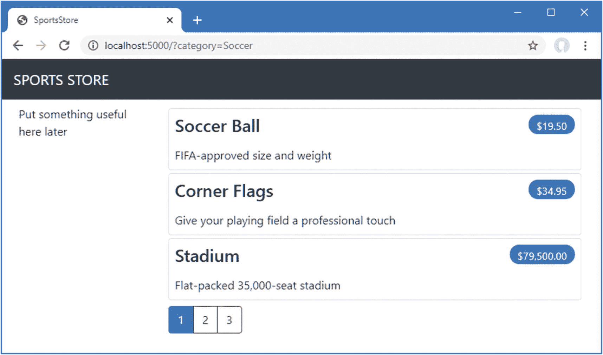

图 8-1。

使用查询字符串按类别进行筛选

显然，用户不希望使用 URL 导航到类别，但是一旦 ASP.NET Core 应用的基本结构就绪，您可以看到小的变化会产生大的影响。

Unit Test: Category Filtering

我需要一个单元测试来正确地测试类别过滤功能，以确保过滤器能够正确地生成指定类别中的产品。下面是我添加到`ProductControllerTests`类的测试方法:

```cs
...
[Fact]
public void Can_Filter_Products() {

    // Arrange
    // - create the mock repository
    Mock<IStoreRepository> mock = new Mock<IStoreRepository>();
    mock.Setup(m => m.Products).Returns((new Product[] {
        new Product {ProductID = 1, Name = "P1", Category = "Cat1"},
        new Product {ProductID = 2, Name = "P2", Category = "Cat2"},
        new Product {ProductID = 3, Name = "P3", Category = "Cat1"},
        new Product {ProductID = 4, Name = "P4", Category = "Cat2"},
        new Product {ProductID = 5, Name = "P5", Category = "Cat3"}
    }).AsQueryable<Product>());

    // Arrange - create a controller and make the page size 3 items
    HomeController controller = new HomeController(mock.Object);
    controller.PageSize = 3;

    // Action
    Product[] result =
        (controller.Index("Cat2", 1).ViewData.Model as ProductsListViewModel)
            .Products.ToArray();

    // Assert
    Assert.Equal(2, result.Length);
    Assert.True(result[0].Name == "P2" && result[0].Category == "Cat2");
    Assert.True(result[1].Name == "P4" && result[1].Category == "Cat2");
}
...

```

这个测试创建了一个包含属于某个类别范围的`Product`对象的模拟存储库。使用 action 方法请求一个特定的类别，并检查结果以确保结果是正确顺序的正确对象。

### 优化 URL 方案

没有人愿意看到或使用`/?category=Soccer`这样难看的网址。为了解决这个问题，我将改变`Startup`类的`Configure`方法中的路由配置，以创建一组更有用的 URL，如清单 [8-3](#PC7) 所示。

Caution

按照显示的顺序在清单 [8-3](#PC7) 中添加新路线是很重要的。路线是按照定义的顺序应用的，如果改变顺序，您会得到一些奇怪的效果。

```cs
using System;
using System.Collections.Generic;
using System.Linq;
using System.Threading.Tasks;
using Microsoft.AspNetCore.Builder;
using Microsoft.AspNetCore.Hosting;
using Microsoft.AspNetCore.Http;
using Microsoft.Extensions.DependencyInjection;
using Microsoft.Extensions.Hosting;
using Microsoft.Extensions.Configuration;
using Microsoft.EntityFrameworkCore;
using SportsStore.Models;

namespace SportsStore {
    public class Startup {

        public Startup(IConfiguration config) {
            Configuration = config;
        }

        private IConfiguration Configuration { get; set; }

        public void ConfigureServices(IServiceCollection services) {
            services.AddControllersWithViews();

            services.AddDbContext<StoreDbContext>(opts => {
                opts.UseSqlServer(
                    Configuration["ConnectionStrings:SportsStoreConnection"]);
            });
            services.AddScoped<IStoreRepository, EFStoreRepository>();
        }

        public void Configure(IApplicationBuilder app, IWebHostEnvironment env) {
            app.UseDeveloperExceptionPage();
            app.UseStatusCodePages();
            app.UseStaticFiles();

            app.UseRouting();
            app.UseEndpoints(endpoints => {
                endpoints.MapControllerRoute("catpage",
                    "{category}/Page{productPage:int}",
                    new { Controller = "Home", action = "Index" });

                endpoints.MapControllerRoute("page", "Page{productPage:int}",
                    new { Controller = "Home", action = "Index", productPage = 1 });

                endpoints.MapControllerRoute("category", "{category}",
                    new { Controller = "Home", action = "Index", productPage = 1 });

                endpoints.MapControllerRoute("pagination",
                    "Products/Page{productPage}",
                    new { Controller = "Home", action = "Index", productPage = 1 });
                endpoints.MapDefaultControllerRoute();
            });

            SeedData.EnsurePopulated(app);
        }
    }
}

Listing 8-3.Changing the Routing Schema in the Startup.cs File in the SportsStore Folder

```

表 [8-1](#Tab1) 描述了这些路由代表的 URL 方案。我在第 13 章[中详细解释了路由系统。](13.html)

表 8-1。

路线总结

<colgroup><col class="tcol1 align-left"> <col class="tcol2 align-left"></colgroup> 
| 

统一资源定位器

 | 

导致

 |
| --- | --- |
| `/` | 列出所有类别产品的首页 |
| `/Page2` | 列出指定的页面(在本例中是第`2`页)，显示所有类别的项目 |
| `/Soccer` | 显示特定类别(在本例中为`Soccer`类别)中项目的第一页 |
| `/Soccer/Page2` | 显示指定类别(在本例中为`Soccer`)中项目的指定页面(在本例中为第`2`页) |

ASP.NET Core 路由系统处理来自客户端的*传入*请求，但它也生成符合 URL 方案的*传出*URL，这些 URL 可以嵌入到网页中。通过使用路由系统来处理传入的请求和生成传出的 URL，我可以确保应用中的所有 URL 都是一致的。

`IUrlHelper`接口提供了对 URL 生成功能的访问。我在前一章创建的标签助手中使用了这个接口和它定义的`Action`方法。既然我想开始生成更复杂的 URL，我需要一种方法从视图接收附加信息，而不必向 tag helper 类添加额外的属性。幸运的是，标记帮助器有一个很好的特性，允许在一个集合中接收所有带有公共前缀的属性，如清单 [8-4](#PC8) 所示。

```cs
using Microsoft.AspNetCore.Mvc;
using Microsoft.AspNetCore.Mvc.Rendering;
using Microsoft.AspNetCore.Mvc.Routing;
using Microsoft.AspNetCore.Mvc.ViewFeatures;
using Microsoft.AspNetCore.Razor.TagHelpers;
using SportsStore.Models.ViewModels;
using System.Collections.Generic;

namespace SportsStore.Infrastructure {

    [HtmlTargetElement("div", Attributes = "page-model")]
    public class PageLinkTagHelper : TagHelper {
        private IUrlHelperFactory urlHelperFactory;

        public PageLinkTagHelper(IUrlHelperFactory helperFactory) {
            urlHelperFactory = helperFactory;
        }

        [ViewContext]
        [HtmlAttributeNotBound]
        public ViewContext ViewContext { get; set; }

        public PagingInfo PageModel { get; set; }

        public string PageAction { get; set; }

        [HtmlAttributeName(DictionaryAttributePrefix = "page-url-")]
        public Dictionary<string, object> PageUrlValues { get; set; }
            = new Dictionary<string, object>();

        public bool PageClassesEnabled { get; set; } = false;
        public string PageClass { get; set; }
        public string PageClassNormal { get; set; }
        public string PageClassSelected { get; set; }

        public override void Process(TagHelperContext context,
                TagHelperOutput output) {
            IUrlHelper urlHelper = urlHelperFactory.GetUrlHelper(ViewContext);
            TagBuilder result = new TagBuilder("div");
            for (int i = 1; i <= PageModel.TotalPages; i++) {
                TagBuilder tag = new TagBuilder("a");
                PageUrlValues["productPage"] = i;
                tag.Attributes["href"] = urlHelper.Action(PageAction, PageUrlValues);
                if (PageClassesEnabled) {
                    tag.AddCssClass(PageClass);
                    tag.AddCssClass(i == PageModel.CurrentPage
                        ? PageClassSelected : PageClassNormal);
                }
                tag.InnerHtml.Append(i.ToString());
                result.InnerHtml.AppendHtml(tag);
            }
            output.Content.AppendHtml(result.InnerHtml);
        }
    }
}

Listing 8-4.Prefixed Values in the PageLinkTagHelper.cs File in the SportsStore/Infrastructure Folder

```

用`HtmlAttributeName`属性修饰标签助手属性允许我为元素上的属性名指定一个前缀，在本例中是`page-url-`。名称以这个前缀开头的任何属性的值都将被添加到分配给`PageUrlValues`属性的字典中，然后被传递给`IUrlHelper.Action`方法，为标签助手生成的`a`元素的`href`属性生成 URL。

在清单 [8-5](#PC9) 中，我为标签助手处理的`div`元素添加了一个新属性，指定将用于生成 URL 的类别。我只向视图添加了一个新属性，但是任何具有相同前缀的属性都将被添加到字典中。

```cs
@model ProductsListViewModel

@foreach (var p in Model.Products) {
    <partial name="ProductSummary" model="p" />
}

<div page-model="@Model.PagingInfo" page-action="Index" page-classes-enabled="true"
     page-class="btn" page-class-normal="btn-outline-dark"
     page-class-selected="btn-primary" page-url-category="@Model.CurrentCategory"
     class="btn-group pull-right m-1">
</div>

Listing 8-5.Adding a New Attribute in the Index.cshtml File in the SportsStore/Views/Home Folder

```

在此更改之前，为分页链接生成的链接如下所示:

```cs
http://localhost:5000/Page1

```

如果用户单击这样的页面链接，类别过滤器将会丢失，应用将显示一个包含所有类别产品的页面。通过添加来自视图模型的当前类别，我生成如下 URL:

```cs
http://localhost:5000/Chess/Page1

```

当用户点击这类链接时，当前类别将被传递给`Index`动作方法，过滤将被保留。要查看这一更改的效果，启动 ASP.NET Core 并请求`http://localhost:5000/Chess`，它将只显示`Chess`类别中的产品，如图 [8-2](#Fig2) 所示。

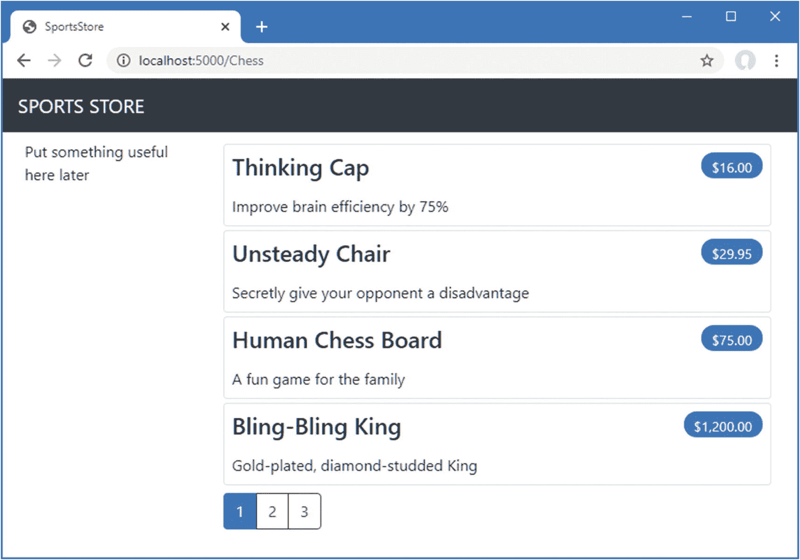

图 8-2。

按类别过滤数据

### 构建类别导航菜单

我需要为用户提供一种选择类别的方法，不需要输入 URL。这意味着显示一个可用类别的列表，并指出当前选择了哪个类别(如果有的话)。

ASP.NET Core 有*视图组件*的概念，它非常适合创建诸如可重用导航控件之类的项目。视图组件是一个 C# 类，它提供了少量可重用的应用逻辑，能够选择和显示 Razor 局部视图。我在第 24 章[中详细描述了视图组件。](24.html)

在本例中，我将创建一个呈现导航菜单的视图组件，并通过从共享布局中调用该组件将其集成到应用中。这种方法给了我一个常规的 C# 类，它可以包含我需要的任何应用逻辑，并且可以像任何其他类一样进行单元测试。

#### 创建导航视图组件

我在 SportsStore 项目中创建了一个名为`Components`的文件夹，这是视图组件的常规 home，并向其中添加了一个名为`NavigationMenuViewComponent.cs`的类文件，我用它来定义清单 [8-6](#PC12) 中所示的类。

```cs
using Microsoft.AspNetCore.Mvc;

namespace SportsStore.Components {

    public class NavigationMenuViewComponent : ViewComponent {

        public string Invoke() {
            return "Hello from the Nav View Component";
        }
    }
}

Listing 8-6.The Contents of the NavigationMenuViewComponent.cs File in the SportsStore/Components Folder

```

在 Razor 视图中使用视图组件时，会调用该组件的`Invoke`方法，并将`Invoke`方法的结果插入到发送给浏览器的 HTML 中。我从一个返回字符串的简单视图组件开始，但是我很快会用 HTML 替换它。

我希望类别列表出现在所有页面上，所以我将在共享布局中使用视图组件，而不是在特定视图中。在一个视图中，使用一个标签助手来应用视图组件，如清单 [8-7](#PC13) 所示。

```cs
<!DOCTYPE html>
<html>
<head>
    <meta name="viewport" content="width=device-width" />
    <title>SportsStore</title>
    <link href="/lib/twitter-bootstrap/css/bootstrap.min.css" rel="stylesheet" />
</head>
<body>
    <div class="bg-dark text-white p-2">
        <span class="navbar-brand ml-2">SPORTS STORE</span>
    </div>
    <div class="row m-1 p-1">
        <div id="categories" class="col-3">
            <vc:navigation-menu />
        </div>
        <div class="col-9">
            @RenderBody()
        </div>
    </div>
</body>
</html>

Listing 8-7.Using a View Component in the _Layout.cshtml File in the SportsStore/Views/Shared Folder

```

我删除了占位符文本，并用插入视图组件的`vc:navigation-menu`元素替换它。元素省略了类名的`ViewComponent`部分并用连字符连接，这样`vc:navigation-menu`指定了`NavigationMenuViewComponent`类。

重启 ASP.NET Core 并请求`http://localhost:5000`，你会看到`Invoke`方法的输出包含在发送给浏览器的 HTML 中，如图 [8-3](#Fig3) 所示。

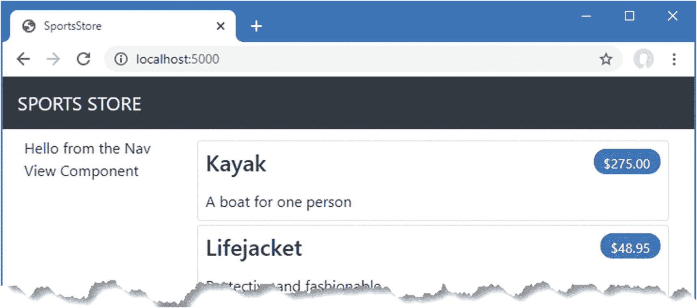

图 8-3。

使用视图组件

#### 生成类别列表

我现在可以返回到导航视图组件，并生成一组真正的类别。我可以用编程的方式为类别构建 HTML，就像我为 page tag helper 所做的那样，但是使用视图组件的一个好处是它们可以呈现极其局部的视图。这意味着我可以使用视图组件来生成组件列表，然后使用更具表现力的 Razor 语法来呈现将显示它们的 HTML。第一步是更新视图组件，如清单 [8-8](#PC14) 所示。

```cs
using Microsoft.AspNetCore.Mvc;
using System.Linq;
using SportsStore.Models;

namespace SportsStore.Components {

    public class NavigationMenuViewComponent : ViewComponent {
        private IStoreRepository  repository;

        public NavigationMenuViewComponent(IStoreRepository repo) {
            repository = repo;
        }

        public IViewComponentResult Invoke() {
            return View(repository.Products
                .Select(x => x.Category)
                .Distinct()
                .OrderBy(x => x));
        }
    }
}

Listing 8-8.Adding Categories in the NavigationMenuViewComponent.cs File in the SportsStore/Components Folder

```

清单 [8-8](#PC14) 中定义的构造函数定义了一个`IStoreRepository`参数。当 ASP.NET Core 需要创建视图组件类的实例时，它会注意到需要为该参数提供一个值，并检查`Startup`类中的配置以确定应该使用哪个实现对象。这与我在第 7 章[第 7 章](07.html)中在控制器中使用的依赖注入特性是相同的，它具有相同的效果，即允许视图组件在不知道将使用哪个存储库实现的情况下访问数据，这个特性我在第 14 章[第 14 章](14.html)中详细描述。

在`Invoke`方法中，我使用 LINQ 来选择和排序存储库中的类别集，并将它们作为参数传递给`View`方法，这将呈现默认的 Razor 局部视图，其细节使用`IViewComponentResult`对象从该方法返回，我将在第 [24 章](24.html)中更详细地描述这个过程。

Unit Test: Generating The Category List

对我生成类别列表能力的单元测试相对简单。目标是创建一个按字母顺序排序并且不包含重复项的列表，最简单的方法是提供一些测试数据，证明*有重复的类别，并且是*而不是*按顺序排列，将它传递给 tag helper 类，并断言数据已经被正确清理。下面是单元测试，我在`SportsStore.Tests`项目中一个名为`NavigationMenuViewComponentTests.cs`的新类文件中定义了它:*

```cs
using System.Collections.Generic;
using System.Linq;
using Microsoft.AspNetCore.Components;
using Microsoft.AspNetCore.Mvc.Rendering;
using Microsoft.AspNetCore.Mvc.ViewComponents;
using Moq;
using SportsStore.Components;
using SportsStore.Models;
using Xunit;

namespace SportsStore.Tests {

    public class NavigationMenuViewComponentTests {

        [Fact]
        public void Can_Select_Categories() {
            // Arrange
            Mock<IStoreRepository> mock = new Mock<IStoreRepository>();
            mock.Setup(m => m.Products).Returns((new Product[] {
                new Product {ProductID = 1, Name = "P1", Category = "Apples"},
                new Product {ProductID = 2, Name = "P2", Category = "Apples"},
                new Product {ProductID = 3, Name = "P3", Category = "Plums"},
                new Product {ProductID = 4, Name = "P4", Category = "Oranges"},
            }).AsQueryable<Product>());

            NavigationMenuViewComponent target =
                new NavigationMenuViewComponent(mock.Object);

            // Act = get the set of categories
            string[] results = ((IEnumerable<string>)(target.Invoke()
                as ViewViewComponentResult).ViewData.Model).ToArray();

            // Assert
            Assert.True(Enumerable.SequenceEqual(new string[] { "Apples",
                "Oranges", "Plums" }, results));
        }
    }
}

```

我创建了一个模拟存储库实现，它包含重复的类别和不按顺序排列的类别。我断言重复的内容已经被删除，并且按照字母顺序排列。

#### 创建视图

Razor 使用不同的约定来定位由视图组件选择的视图。视图的默认名称和为视图搜索的位置都不同于用于控制器的名称和位置。为此，我在`SportsStore`项目中创建了`Views/Shared/Components/NavigationMenu`文件夹，并向其中添加了一个名为`Default.cshtml`的 Razor 视图，我向其中添加了清单 [8-9](#PC16) 中所示的内容。

```cs
@model IEnumerable<string>

<a class="btn btn-block btn-outline-secondary"asp-action="Index"
   asp-controller="Home" asp-route-category="">
    Home
</a>

@foreach (string category in Model) {
    <a class="btn btn-block btn-outline-secondary"
       asp-action="Index" asp-controller="Home"
       asp-route-category="@category"
       asp-route-productPage="1">
        @category
    </a>
}

Listing 8-9.The Contents of the Default.cshtml File in the SportsStore/Views/Shared/Components/NavigationMenu Folder

```

这个视图使用了一个内置的标签助手(我在第 [25 章](25.html)–[27 章](27.html)中描述过)来创建锚元素，锚元素的`href`属性包含一个选择不同产品类别的 URL。

重启 ASP.NET Core 并请求`http://localhost:5000`查看类别导航按钮。如果您点击一个按钮，项目列表会更新，仅显示所选类别中的项目，如图 [8-4](#Fig4) 所示。

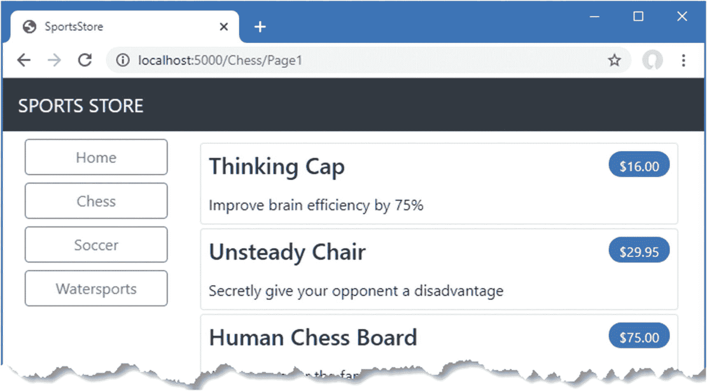

图 8-4。

用视图组件生成类别链接

#### 突出显示当前类别

没有反馈给用户来指示已经选择了哪个类别。也许可以从列表中的项目推断出类别，但是一些清晰的视觉反馈似乎是个好主意。ASP.NET Core 组件(如控制器和视图组件)可以通过请求上下文对象来接收关于当前请求的信息。大多数时候，您可以依靠用于创建组件的基类来为您获取上下文对象，比如当您使用`Controller`基类来创建控制器时。

`ViewComponent`基类也不例外，它通过一组属性提供对上下文对象的访问。其中一个属性叫做`RouteData`，它提供了路由系统如何处理请求 URL 的信息。

在清单 [8-10](#PC17) 中，我使用`RouteData`属性来访问请求数据，以便获得当前所选类别的值。我可以通过创建另一个视图模型类将类别传递给视图(这就是我在实际项目中会做的)，但是为了多样化，我将使用视图包特性，它允许非结构化数据与视图模型对象一起传递给视图。我在第 22 章中详细描述了这个特性是如何工作的。

```cs
using Microsoft.AspNetCore.Mvc;
using System.Linq;
using SportsStore.Models;

namespace SportsStore.Components {

    public class NavigationMenuViewComponent : ViewComponent {
        private IStoreRepository  repository;

        public NavigationMenuViewComponent(IStoreRepository repo) {
            repository = repo;
        }

        public IViewComponentResult Invoke() {
            ViewBag.SelectedCategory = RouteData?.Values["category"];
            return View(repository.Products
                .Select(x => x.Category)
                .Distinct()
                .OrderBy(x => x));
        }
    }
}

Listing 8-10.Passing the Selected Category in the NavigationMenuViewComponent.cs File in the SportsStore/Components Folder

```

在`Invoke`方法中，我动态地给`ViewBag`对象分配了一个`SelectedCategory`属性，并将其值设置为当前类别，该类别是通过`RouteData`属性返回的上下文对象获得的。`ViewBag`是一个动态对象，允许我简单地通过赋值来定义新的属性。

Unit Test: Reporting The Selected Category

我可以通过在单元测试中读取`ViewBag`属性的值来测试视图组件是否正确地添加了所选类别的细节，这个值可以通过`ViewViewComponentResult`类获得。下面是我添加到`NavigatioMenuViewComponentTests`类的测试:

```cs
...
[Fact]
public void Indicates_Selected_Category() {

    // Arrange
    string categoryToSelect = "Apples";
    Mock<IStoreRepository> mock = new Mock<IStoreRepository>();
    mock.Setup(m => m.Products).Returns((new Product[] {
        new Product {ProductID = 1, Name = "P1", Category = "Apples"},
        new Product {ProductID = 4, Name = "P2", Category = "Oranges"},
    }).AsQueryable<Product>());

    NavigationMenuViewComponent target =
        new NavigationMenuViewComponent(mock.Object);
    target.ViewComponentContext = new ViewComponentContext {
        ViewContext = new ViewContext {
            RouteData = new Microsoft.AspNetCore.Routing.RouteData()
        }
    };
    target.RouteData.Values["category"] = categoryToSelect;

    // Action
    string result = (string)(target.Invoke() as
        ViewViewComponentResult).ViewData["SelectedCategory"];

    // Assert
    Assert.Equal(categoryToSelect, result);
}
...

```

这个单元测试通过`ViewComponentContext`属性为视图组件提供路由数据，这是视图组件接收所有上下文数据的方式。`ViewComponentContext`属性通过其`ViewContext`属性提供对特定于视图的上下文数据的访问，后者又通过其`RouteData`属性提供对路由信息的访问。单元测试中的大部分代码用于创建上下文对象，这些对象将以与应用运行时相同的方式提供所选类别，并且上下文数据由 ASP.NET Core MVC 提供。

现在我提供了关于选择了哪个类别的信息，我可以更新由视图组件选择的视图，并改变用于样式化链接的 CSS 类，以便表示当前类别的类是不同的。清单 [8-11](#PC19) 显示了我对`Default.cshtml`文件所做的更改。

```cs
@model IEnumerable<string>

<a class="btn btn-block btn-outline-secondary"asp-action="Index"
   asp-controller="Home" asp-route-category="">
    Home
</a>

@foreach (string category in Model) {
    <a class="btn btn-block
       @(category == ViewBag.SelectedCategory
           ? "btn-primary": "btn-outline-secondary")"
       asp-action="Index" asp-controller="Home"
       asp-route-category="@category"
       asp-route-productPage="1">
        @category
    </a>
}

Listing 8-11.Highlighting in the Default.cshtml File in the SportsStore/Views/Shared/Components/NavigationMenu Folder

```

我在`class`属性中使用了一个 Razor 表达式，将`btn-primary`类应用于表示所选类别的元素，否则应用`btn-secondary`类。这些类应用了不同的引导样式，并使活动按钮变得明显，你可以通过重启 ASP.NET Core，请求`http://localhost:5000`，点击其中一个类别按钮来看到，如图 [8-5](#Fig5) 所示。

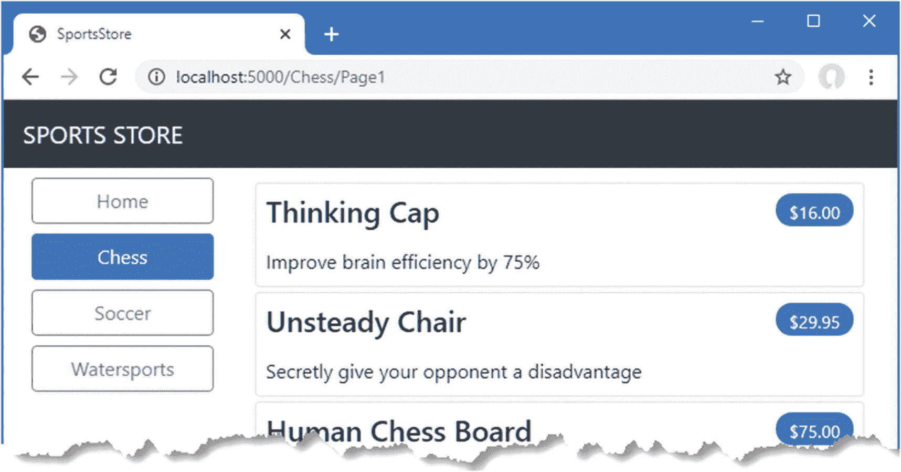

图 8-5。

突出显示选定的类别

### 更正页数

我需要更正页面链接，以便它们在选择类别时能够正常工作。目前，页面链接的数量由存储库中的产品总数决定，而不是由所选类别中的产品数量决定。这意味着客户可以点击`Chess`类别的第 2 页的链接，并以一个空白页面结束，因为没有足够的象棋产品来填充两个页面。你可以在图 [8-6](#Fig6) 中看到问题。

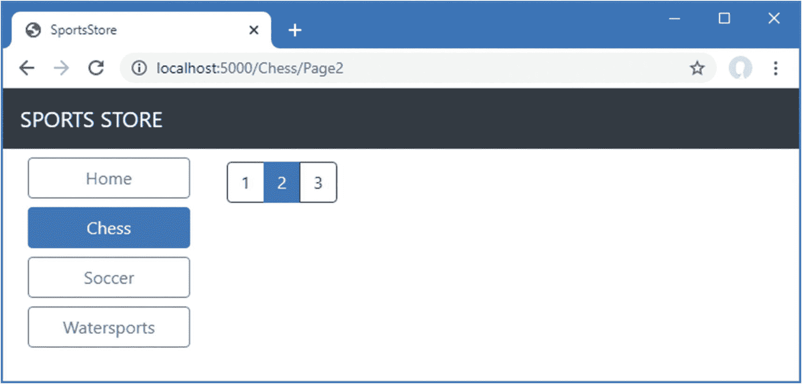

图 8-6。

选择类别时显示错误的页面链接

我可以通过更新`Home`控制器中的`Index`动作方法来解决这个问题，这样分页信息就会考虑类别，如清单 [8-12](#PC20) 所示。

```cs
using Microsoft.AspNetCore.Mvc;
using SportsStore.Models;
using System.Linq;
using SportsStore.Models.ViewModels;

namespace SportsStore.Controllers {
    public class HomeController : Controller {
        private IStoreRepository repository;
        public int PageSize = 4;

        public HomeController(IStoreRepository repo) {
            repository = repo;
        }

        public ViewResult Index(string category, int productPage = 1)
            => View(new ProductsListViewModel {
                Products = repository.Products
                    .Where(p => category == null || p.Category == category)
                    .OrderBy(p => p.ProductID)
                    .Skip((productPage - 1) * PageSize)
                    .Take(PageSize),
                PagingInfo = new PagingInfo {
                    CurrentPage = productPage,
                    ItemsPerPage = PageSize,
                    TotalItems = category == null ?
                        repository.Products.Count() :
                        repository.Products.Where(e =>
                            e.Category == category).Count()
                },
                CurrentCategory = category
            });
    }
}

Listing 8-12.Creating Category Pagination Data in the HomeController.cs File in the SportsStore/Controllers Folder

```

如果选择了一个类别，我返回该类别中的项目数；如果没有，我返回产品的总数。重启 ASP.NET Core，请求`http://localhost:5000`查看选择类别后的变化，如图 [8-7](#Fig7) 所示。

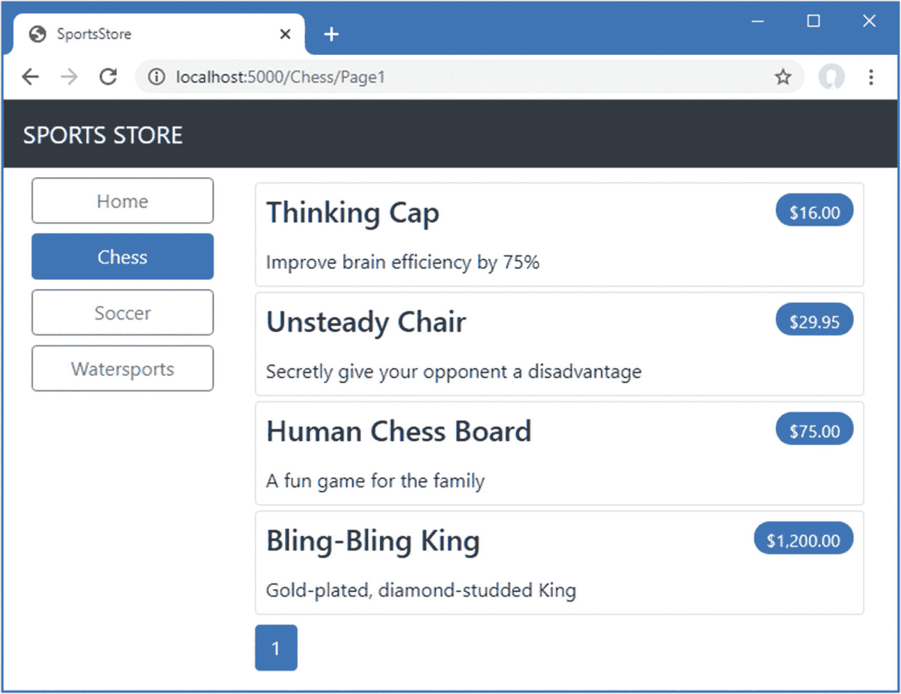

图 8-7。

显示特定类别的页数

Unit Test: Category-Specific Product Counts

测试我是否能够生成不同类别的当前产品数量很简单。我创建了一个模拟存储库，其中包含一系列类别中的已知数据，然后调用`List` action 方法依次请求每个类别。下面是我添加到`HomeControllerTests`类中的单元测试方法(对于这个测试，您需要导入`System`名称空间):

```cs
...
[Fact]
public void Generate_Category_Specific_Product_Count() {
    // Arrange
    Mock<IStoreRepository> mock = new Mock<IStoreRepository>();
    mock.Setup(m => m.Products).Returns((new Product[] {
        new Product {ProductID = 1, Name = "P1", Category = "Cat1"},
        new Product {ProductID = 2, Name = "P2", Category = "Cat2"},
        new Product {ProductID = 3, Name = "P3", Category = "Cat1"},
        new Product {ProductID = 4, Name = "P4", Category = "Cat2"},
        new Product {ProductID = 5, Name = "P5", Category = "Cat3"}
    }).AsQueryable<Product>());

    HomeController target = new HomeController(mock.Object);
    target.PageSize = 3;

    Func<ViewResult, ProductsListViewModel> GetModel = result =>
        result?.ViewData?.Model as ProductsListViewModel;

    // Action
    int? res1 = GetModel(target.Index("Cat1"))?.PagingInfo.TotalItems;
    int? res2 = GetModel(target.Index("Cat2"))?.PagingInfo.TotalItems;
    int? res3 = GetModel(target.Index("Cat3"))?.PagingInfo.TotalItems;
    int? resAll = GetModel(target.Index(null))?.PagingInfo.TotalItems;

    // Assert
    Assert.Equal(2, res1);
    Assert.Equal(2, res2);
    Assert.Equal(1, res3);
    Assert.Equal(5, resAll);
}
...

```

注意，我还调用了`Index`方法，没有指定类别，以确保得到正确的总数。

## 构建购物车

该应用进展顺利，但我不能出售任何产品，直到我实现了购物车。在本节中，我将创建如图 [8-8](#Fig8) 所示的购物车体验。任何曾经在网上购物的人对此都很熟悉。

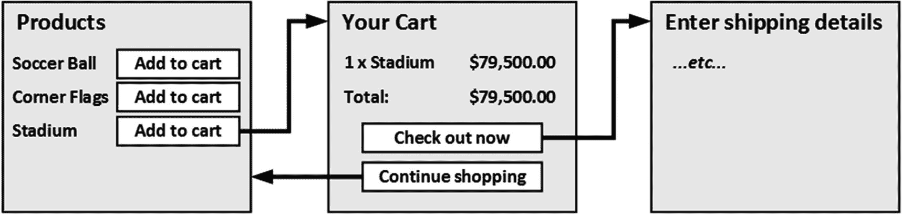

图 8-8。

基本的购物车流程

“添加到购物车”按钮将显示在目录中每个产品的旁边。点击此按钮将显示客户目前已选择产品的摘要，包括总成本。此时，用户可以单击“继续购物”按钮返回到产品目录，或者单击“立即结账”按钮完成订单并结束购物会话。

### 配置 Razor 页面

到目前为止，我已经使用 MVC 框架定义了 SportsStore 项目特性。为了多样化，我将使用 Razor Pages——ASP.NET Core 支持的另一个应用框架——来实现购物车。清单 [8-13](#PC22) 配置`Startup`类来启用 SportsStore 应用中的 Razor 页面。

```cs
using System;
using System.Collections.Generic;
using System.Linq;
using System.Threading.Tasks;
using Microsoft.AspNetCore.Builder;
using Microsoft.AspNetCore.Hosting;
using Microsoft.AspNetCore.Http;
using Microsoft.Extensions.DependencyInjection;
using Microsoft.Extensions.Hosting;
using Microsoft.Extensions.Configuration;
using Microsoft.EntityFrameworkCore;
using SportsStore.Models;

namespace SportsStore {
    public class Startup {

        public Startup(IConfiguration config) {
            Configuration = config;
        }

        private IConfiguration Configuration { get; set; }

        public void ConfigureServices(IServiceCollection services) {
            services.AddControllersWithViews();
            services.AddDbContext<StoreDbContext>(opts => {
                opts.UseSqlServer(
                    Configuration["ConnectionStrings:SportsStoreConnection"]);
            });
            services.AddScoped<IStoreRepository, EFStoreRepository>();
            services.AddRazorPages();
        }

        public void Configure(IApplicationBuilder app, IWebHostEnvironment env) {
            app.UseDeveloperExceptionPage();
            app.UseStatusCodePages();
            app.UseStaticFiles();

            app.UseRouting();
            app.UseEndpoints(endpoints => {
                endpoints.MapControllerRoute("catpage",
                    "{category}/Page{productPage:int}",
                    new { Controller = "Home", action = "Index" });

                endpoints.MapControllerRoute("page", "Page{productPage:int}",
                    new { Controller = "Home", action = "Index", productPage = 1 });

                endpoints.MapControllerRoute("category", "{category}",
                    new { Controller = "Home", action = "Index", productPage = 1 });

                endpoints.MapControllerRoute("pagination",
                    "Products/Page{productPage}",
                    new { Controller = "Home", action = "Index", productPage = 1 });
                endpoints.MapDefaultControllerRoute();
                endpoints.MapRazorPages();
            });

            SeedData.EnsurePopulated(app);
        }
    }
}

Listing 8-13.Enabling Razor Pages in the Startup.cs File in the SportsStore Folder

```

`AddRazorPages`方法设置 Razor 页面使用的服务，`MapRazorPages`方法将 Razor 页面注册为 URL 路由系统可以用来处理请求的端点。

向`SportsStore`项目添加一个名为`Pages`的文件夹，这是 Razor 页面的常规位置。在`Pages`文件夹中添加一个名为`_ViewImports.cshtml`的 Razor 视图导入文件，内容如清单 [8-14](#PC23) 所示。这些表达式设置了 Razor 页面所属的名称空间，并允许在 Razor 页面中使用 SportsStore 类，而无需指定它们的名称空间。

```cs
@namespace SportsStore.Pages
@using Microsoft.AspNetCore.Mvc.RazorPages
@using SportsStore.Models
@using SportsStore.Infrastructure
@addTagHelper *, Microsoft.AspNetCore.Mvc.TagHelpers

Listing 8-14.The Contents of the _ViewImports.cshtml File in the SportsStore/Pages Folder

```

接下来，在`Pages`文件夹中添加一个名为`_ViewStart.cshtml`的 Razor 视图启动文件，内容如清单 [8-15](#PC24) 所示。Razor 页面有自己的配置文件，这个文件指定 SportsStore 项目中的 Razor 页面将默认使用一个名为`_CartLayout`的布局文件。

```cs
@{
    Layout = "_CartLayout";
}

Listing 8-15.The Contents of the _ViewStart.cshtml File in the SportsStore/Pages Folder

```

最后，为了提供 Razor 页面将使用的布局，向`Pages`文件夹添加一个名为`_CartLayout.cshtml`的 Razor 视图，其内容如清单 [8-16](#PC25) 所示。

```cs
<!DOCTYPE html>
<html>
<head>
    <meta name="viewport" content="width=device-width" />
    <title>SportsStore</title>
    <link href="/lib/twitter-bootstrap/css/bootstrap.min.css" rel="stylesheet" />
</head>
<body>
    <div class="bg-dark text-white p-2">
        <span class="navbar-brand ml-2">SPORTS STORE</span>
    </div>
    <div class="m-1 p-1">
            @RenderBody()
    </div>
</body>
</html>

Listing 8-16.The Contents of the _CartLayout.cshtml File in the SportsStore/Pages Folder

```

### 创建 Razor 页面

如果您使用的是 Visual Studio，请使用 Razor 页面模板项，并将该项的名称设置为`Cart.cshtml`。这将创建一个`Cart.cshtml`文件和一个`Cart.cshtml.cs`类文件。将文件内容替换为清单 [8-17](#PC26) 中所示的内容。如果您使用的是 Visual Studio 代码，只需创建一个`Cart.cshtml`文件，其内容如清单 [8-17](#PC26) 所示。

```cs
@page

<h4>This is the Cart Page</h4>

Listing 8-17.The Contents of the Cart.cshtml File in the SportsStore/Pages Folder

```

重启 ASP.NET Core 并请求`http://localhost:5000/cart`查看清单 [8-17](#PC26) 中的占位符内容，如图 [8-9](#Fig9) 所示。请注意，我不需要注册页面，URL 路径和 Razor 页面之间的映射是自动处理的。

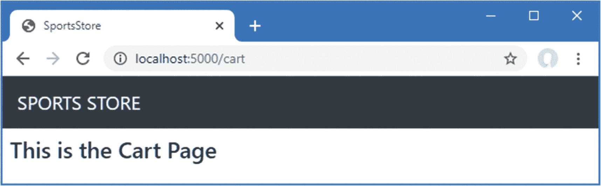

图 8-9。

Razor 页面中的占位符内容

### 创建添加到购物车按钮

在实现购物车功能之前，我需要做一些准备工作。首先，我需要创建将产品添加到购物车的按钮。为此，我在`Infrastructure`文件夹中添加了一个名为`UrlExtensions.cs`的类文件，并定义了清单 [8-18](#PC27) 中所示的扩展方法。

```cs
using Microsoft.AspNetCore.Http;

namespace SportsStore.Infrastructure {

    public static class UrlExtensions {

        public static string PathAndQuery(this HttpRequest request) =>
            request.QueryString.HasValue
                ? $"{request.Path}{request.QueryString}"
                : request.Path.ToString();
    }
}

Listing 8-18.The Contents of the UrlExtensions.cs File in the SportsStore/Infrastructure Folder

```

`PathAndQuery`扩展方法在`HttpRequest`类上运行，ASP.NET Core 用它来描述 HTTP 请求。extension 方法生成一个 URL，在购物车更新后，浏览器将返回到该 URL，如果有查询字符串的话，还会考虑查询字符串。在清单 [8-19](#PC28) 中，我已经将包含扩展方法的名称空间添加到视图导入文件中，这样我就可以在局部视图中使用它。

Note

这是`Views`文件夹中的视图导入文件，而不是添加到`Pages`文件夹中的文件。

```cs
@using SportsStore.Models
@using SportsStore.Models.ViewModels
@using SportsStore.Infrastructure
@addTagHelper *, Microsoft.AspNetCore.Mvc.TagHelpers
@addTagHelper *, SportsStore

Listing 8-19.Adding a Namespace in the _ViewImports.cshtml File in the SportsStore/Views Folder

```

在清单 [8-20](#PC29) 中，我已经更新了描述每个产品的局部视图，因此它包含一个添加到购物车按钮。

```cs
@model Product

<div class="card card-outline-primary m-1 p-1">
    <div class="bg-faded p-1">
        <h4>
            @Model.Name
            <span class="badge badge-pill badge-primary" style="float:right">
                <small>@Model.Price.ToString("c")</small>
            </span>
        </h4>
    </div>
    <form id="@Model.ProductID" asp-page="/Cart" method="post">
        <input type="hidden" asp-for="ProductID" />
        <input type="hidden" name="returnUrl"
               value="@ViewContext.HttpContext.Request.PathAndQuery()" />
        <span class="card-text p-1">
            @Model.Description
            <button type="submit"
                class="btn btn-success btn-sm pull-right" style="float:right">
                Add To Cart
            </button>
        </span>
    </form>
</div>

Listing 8-20.Adding the Buttons to the ProductSummary.cshtml File View in the SportsStore/Views/Shared Folder

```

我添加了一个包含隐藏的`input`元素的`form`元素，这些元素指定了视图模型中的`ProductID`值和购物车更新后浏览器应该返回的 URL。如第 [27 章](27.html)所述，`form`元素和其中一个`input`元素是使用内置标签助手配置的，这是一种生成包含模型值和目标控制器或 Razor 页面的表单的有用方式。另一个`input`元素使用我创建的扩展方法来设置返回 URL。我还添加了一个将表单提交给应用的`button`元素。

Note

注意，我已经将表单元素上的`method`属性设置为`post`，这指示浏览器使用 HTTP `POST`请求提交表单数据。您可以改变这一点，使表单使用`GET`方法，但是您应该仔细考虑这样做。HTTP 规范要求`GET`请求必须是*幂等的*，这意味着它们不能引起变化，向购物车添加产品肯定是一种变化。

### 启用会话

我将使用*会话状态*存储用户购物车的详细信息，这是与用户发出的一系列请求相关联的数据。ASP.NET 提供了一系列不同的方法来存储会话状态，包括将它存储在内存中，这是我将要使用的方法。这具有简单的优点，但这意味着当应用停止或重新启动时，会话数据会丢失。启用会话需要在`Startup`类中添加服务和中间件，如清单 [8-21](#PC30) 所示。

```cs
using System;
using System.Collections.Generic;
using System.Linq;
using System.Threading.Tasks;
using Microsoft.AspNetCore.Builder;
using Microsoft.AspNetCore.Hosting;
using Microsoft.AspNetCore.Http;
using Microsoft.Extensions.DependencyInjection;
using Microsoft.Extensions.Hosting;
using Microsoft.Extensions.Configuration;
using Microsoft.EntityFrameworkCore;
using SportsStore.Models;

namespace SportsStore {
    public class Startup {

        public Startup(IConfiguration config) {
            Configuration = config;
        }

        private IConfiguration Configuration { get; set; }

        public void ConfigureServices(IServiceCollection services) {
            services.AddControllersWithViews();
            services.AddDbContext<StoreDbContext>(opts => {
                opts.UseSqlServer(
                    Configuration["ConnectionStrings:SportsStoreConnection"]);
            });
            services.AddScoped<IStoreRepository, EFStoreRepository>();
            services.AddRazorPages();
            services.AddDistributedMemoryCache();
            services.AddSession();
        }

        public void Configure(IApplicationBuilder app, IWebHostEnvironment env) {
            app.UseDeveloperExceptionPage();
            app.UseStatusCodePages();
            app.UseStaticFiles();
            app.UseSession();
            app.UseRouting();
            app.UseEndpoints(endpoints => {
                endpoints.MapControllerRoute("catpage",
                    "{category}/Page{productPage:int}",
                    new { Controller = "Home", action = "Index" });

                endpoints.MapControllerRoute("page", "Page{productPage:int}",
                    new { Controller = "Home", action = "Index", productPage = 1 });

                endpoints.MapControllerRoute("category", "{category}",
                    new { Controller = "Home", action = "Index", productPage = 1 });

                endpoints.MapControllerRoute("pagination",
                    "Products/Page{productPage}",
                    new { Controller = "Home", action = "Index", productPage = 1 });
                endpoints.MapDefaultControllerRoute();
                endpoints.MapRazorPages();
            });

            SeedData.EnsurePopulated(app);
        }
    }
}

Listing 8-21.Enabling Sessions in the Startup.cs File in the SportsStore Folder

```

`AddDistributedMemoryCache`方法调用设置内存中的数据存储。`AddSession`方法注册用于访问会话数据的服务，而`UseSession`方法允许会话系统在请求从客户端到达时自动将请求与会话相关联。

### 实现购物车功能

现在准备工作已经完成，我可以实现购物车功能了。我首先在`SportsStore`项目的`Models`文件夹中添加一个名为`Cart.cs`的类文件，并用它来定义清单 [8-22](#PC31) 中所示的类。

```cs
using System.Collections.Generic;
using System.Linq;

namespace SportsStore.Models {

    public class Cart {

        public List<CartLine> Lines { get; set; } = new List<CartLine>();

        public void AddItem(Product product, int quantity) {
            CartLine line = Lines
                .Where(p => p.Product.ProductID == product.ProductID)
                .FirstOrDefault();

            if (line == null) {
                Lines.Add(new CartLine {
                    Product = product,
                    Quantity = quantity
                });
            } else {
                line.Quantity += quantity;
            }
        }

        public void RemoveLine(Product product) =>
            Lines.RemoveAll(l => l.Product.ProductID == product.ProductID);

        public decimal ComputeTotalValue() =>
            Lines.Sum(e => e.Product.Price * e.Quantity);

        public void Clear() => Lines.Clear();
    }

    public class CartLine {
        public int CartLineID { get; set; }
        public Product Product { get; set; }
        public int Quantity { get; set; }
    }
}

Listing 8-22.The Contents of the Cart.cs File in the SportsStore/Models Folder

```

`Cart`类使用在同一个文件中定义的`CartLine`类来表示客户选择的产品和用户想要购买的数量。我定义了向购物车中添加商品、从购物车中移除之前添加的商品、计算购物车中商品的总成本以及通过移除所有商品来重置购物车的方法。

Unit Test: Testing The Cart

`Cart`类相对简单，但是它有一系列必须正常工作的重要行为。功能不佳的购物车会破坏整个 SportsStore 应用。我对这些特性进行了分解，并分别进行了测试。我在`SportsStore.Tests`项目中创建了一个名为`CartTests.cs`的新单元测试文件来包含这些测试。

第一个行为与我何时向购物车添加商品有关。如果这是第一次给定的`Product`被添加到购物车，我希望添加一个新的`CartLine`。下面是测试，包括单元测试类定义:

```cs
using System.Linq;
using SportsStore.Models;
using Xunit;

namespace SportsStore.Tests {

    public class CartTests {

        [Fact]
        public void Can_Add_New_Lines() {

            // Arrange - create some test products
            Product p1 = new Product { ProductID = 1, Name = "P1" };
            Product p2 = new Product { ProductID = 2, Name = "P2" };

            // Arrange - create a new cart
            Cart target = new Cart();

            // Act
            target.AddItem(p1, 1);
            target.AddItem(p2, 1);
            CartLine[] results = target.Lines.ToArray();

            // Assert
            Assert.Equal(2, results.Length);
            Assert.Equal(p1, results[0].Product);
            Assert.Equal(p2, results[1].Product);
        }
    }
}

```

但是，如果客户已经在购物车中添加了一个`Product`，我想增加相应的`CartLine`的数量，而不是创建一个新的。测试如下:

```cs
...
[Fact]
public void Can_Add_Quantity_For_Existing_Lines() {
    // Arrange - create some test products
    Product p1 = new Product { ProductID = 1, Name = "P1" };
    Product p2 = new Product { ProductID = 2, Name = "P2" };

    // Arrange - create a new cart
    Cart target = new Cart();

    // Act
    target.AddItem(p1, 1);
    target.AddItem(p2, 1);
    target.AddItem(p1, 10);
    CartLine[] results = target.Lines
        .OrderBy(c => c.Product.ProductID).ToArray();

    // Assert
    Assert.Equal(2, results.Length);
    Assert.Equal(11, results[0].Quantity);
    Assert.Equal(1, results[1].Quantity);
}
...

```

我还需要检查用户是否可以改变主意，从购物车中删除产品。该功能通过`RemoveLine`方法实现。测试如下:

```cs
...
[Fact]
public void Can_Remove_Line() {
    // Arrange - create some test products
    Product p1 = new Product { ProductID = 1, Name = "P1" };
    Product p2 = new Product { ProductID = 2, Name = "P2" };
    Product p3 = new Product { ProductID = 3, Name = "P3" };

    // Arrange - create a new cart
    Cart target = new Cart();
    // Arrange - add some products to the cart
    target.AddItem(p1, 1);
    target.AddItem(p2, 3);
    target.AddItem(p3, 5);
    target.AddItem(p2, 1);

    // Act
    target.RemoveLine(p2);

    // Assert
    Assert.Empty(target.Lines.Where(c => c.Product == p2));
    Assert.Equal(2, target.Lines.Count());
}
...

```

我想测试的下一个行为是计算购物车中商品的总成本的能力。下面是对这种行为的测试:

```cs
...
[Fact]
public void Calculate_Cart_Total() {
    // Arrange - create some test products
    Product p1 = new Product { ProductID = 1, Name = "P1", Price = 100M };
    Product p2 = new Product { ProductID = 2, Name = "P2", Price = 50M };

    // Arrange - create a new cart
    Cart target = new Cart();

    // Act
    target.AddItem(p1, 1);
    target.AddItem(p2, 1);
    target.AddItem(p1, 3);
    decimal result = target.ComputeTotalValue();

    // Assert
    Assert.Equal(450M, result);
}
...

```

最后的测试很简单。我想确保重置时购物车中的物品被正确移除。测试如下:

```cs
...
[Fact]
public void Can_Clear_Contents() {
    // Arrange - create some test products
    Product p1 = new Product { ProductID = 1, Name = "P1", Price = 100M };
    Product p2 = new Product { ProductID = 2, Name = "P2", Price = 50M };

    // Arrange - create a new cart
    Cart target = new Cart();

    // Arrange - add some items
    target.AddItem(p1, 1);
    target.AddItem(p2, 1);

    // Act - reset the cart
    target.Clear();

    // Assert
    Assert.Empty(target.Lines);
}
...

```

有时，就像在这种情况下，测试类的功能所需的代码比类本身更长更复杂。不要因此而推迟编写单元测试。简单类中的缺陷会产生巨大的影响，尤其是那些在示例应用中扮演如此重要角色的缺陷。

#### 定义会话状态扩展方法

ASP.NET Core 中的会话状态功能仅存储`int`、`string`和`byte[]`值。因为我想存储一个`Cart`对象，所以我需要定义对`ISession`接口的扩展方法，该接口提供对会话状态数据的访问，以将`Cart`对象序列化为 JSON 并转换回来。我在`Infrastructure`文件夹中添加了一个名为`SessionExtensions.cs`的类文件，并定义了清单 [8-23](#PC37) 中所示的扩展方法。

```cs
using Microsoft.AspNetCore.Http;
using System.Text.Json;

namespace SportsStore.Infrastructure {

    public static class SessionExtensions {

        public static void SetJson(this ISession session, string key, object value) {
            session.SetString(key, JsonSerializer.Serialize(value));
        }

        public static T GetJson<T>(this ISession session, string key) {
            var sessionData = session.GetString(key);
            return sessionData == null
                ? default(T) : JsonSerializer.Deserialize<T>(sessionData);
        }
    }
}

Listing 8-23.The Contents of the SessionExtensions.cs File in the SportsStore/Infrastructure Folder

```

这些方法将对象序列化为 JavaScript 对象符号格式，使得存储和检索`Cart`对象变得容易。

#### 完成 Razor 页面

当用户单击 Add To Cart 按钮时，Cart Razor 页面将接收浏览器发送的 HTTP POST 请求。它将使用请求表单数据从数据库中获取`Product`对象，并使用它来更新用户的购物车，该购物车将被存储为会话数据，供将来的请求使用。清单 [8-24](#PC38) 实现了这些特性。

```cs
@page
@model CartModel

<h2>Your cart</h2>
<table class="table table-bordered table-striped">
    <thead>
        <tr>
            <th>Quantity</th>
            <th>Item</th>
            <th class="text-right">Price</th>
            <th class="text-right">Subtotal</th>
        </tr>
    </thead>
    <tbody>
        @foreach (var line in Model.Cart.Lines) {
            <tr>
                <td class="text-center">@line.Quantity</td>
                <td class="text-left">@line.Product.Name</td>
                <td class="text-right">@line.Product.Price.ToString("c")</td>
                <td class="text-right">
                    @((line.Quantity * line.Product.Price).ToString("c"))
                </td>
            </tr>
        }
    </tbody>
    <tfoot>
        <tr>
            <td colspan="3" class="text-right">Total:</td>
            <td class="text-right">
                @Model.Cart.ComputeTotalValue().ToString("c")
            </td>
        </tr>
    </tfoot>
</table>

<div class="text-center">
    <a class="btn btn-primary" href="@Model.ReturnUrl">Continue shopping</a>
</div>

Listing 8-24.Handling Requests in the Cart.cshtml File in the SportsStore/Pages Folder

```

Razor 页面允许 HTML 内容、Razor 表达式和代码组合在一个文件中，正如我在第 23 章[中解释的，但是如果你想对 Razor 页面进行单元测试，那么你需要使用一个单独的类文件。如果您使用的是 Visual Studio，那么在`Pages`文件夹中已经有一个名为`Cart.cshtml.cs`的类文件，它是由 Razor 页面模板项创建的。如果使用 Visual Studio 代码，则需要单独创建类文件。使用已经创建的类文件来定义清单](23.html) [8-25](#PC39) 中所示的类。

```cs
using Microsoft.AspNetCore.Mvc;
using Microsoft.AspNetCore.Mvc.RazorPages;
using SportsStore.Infrastructure;
using SportsStore.Models;
using System.Linq;

namespace SportsStore.Pages {

    public class CartModel : PageModel {
        private IStoreRepository repository;

        public CartModel(IStoreRepository repo) {
            repository = repo;
        }

        public Cart Cart { get; set; }
        public string ReturnUrl { get; set; }

        public void OnGet(string returnUrl) {
            ReturnUrl = returnUrl ?? "/";
            Cart = HttpContext.Session.GetJson<Cart>("cart") ?? new Cart();
        }

        public IActionResult OnPost(long productId, string returnUrl) {
            Product product = repository.Products
                .FirstOrDefault(p => p.ProductID == productId);
            Cart = HttpContext.Session.GetJson<Cart>("cart") ?? new Cart();
            Cart.AddItem(product, 1);
            HttpContext.Session.SetJson("cart", Cart);
            return RedirectToPage(new { returnUrl = returnUrl });
        }
    }

}

Listing 8-25.The Contents of the Cart.cshtml.cs File in the SportsStore/Pages Folder

```

与 Razor 页面相关联的类被称为其页面模型类，它定义了为不同类型的 HTTP 请求调用的处理程序方法，这些方法在呈现视图之前更新状态。清单 [8-25](#PC39) 中名为`CartModel`的页面模型类定义了一个`OnPost` hander 方法，调用该方法来处理 HTTP POST 请求。它通过从数据库中检索一个`Product`，从会话数据中检索用户的`Cart`，并使用`Product`更新其内容。修改后的`Cart`被存储，浏览器被重定向到同一个 Razor 页面，这将使用 GET 请求来完成(这可以防止重新加载浏览器触发重复的 POST 请求)。

GET 请求由`OnGet`处理程序方法处理，该方法设置`ReturnUrl`和`Cart`属性的值，之后呈现页面的 Razor 内容部分。使用`CartModel`作为视图模型对象来评估 HTML 内容中的表达式，这意味着可以在表达式中访问分配给`ReturnUrl`和`Cart`属性的值。Razor 页面生成的内容详细描述了添加到用户购物车的产品，并提供了一个按钮来导航回产品被添加到购物车的位置。

处理程序方法使用与由`ProductSummary.cshtml`视图生成的 HTML 表单中的`input`元素相匹配的参数名。这允许 ASP.NET Core 将传入的表单 POST 变量与这些参数相关联，这意味着我不需要直接处理表单。这被称为*模型绑定*，是简化开发的强大工具，正如我在第 [28 章](28.html)中详细解释的。

Understanding Razor Pages

当你第一次开始使用 Razor Pages 时，可能会感觉有点奇怪，尤其是如果你以前有过使用 ASP.NET Core 提供的 MVC 框架特性的经验。但是 Razor 页面是对 MVC 框架的补充，我发现自己在控制器和视图旁边使用它们，因为它们非常适合不需要 MVC 框架的复杂性的自包含特性。我在第 [23](23.html) 章中描述了 Razor 页面，并在本书的第 3 部分和第 4 部分中展示了它们与控制器的用法。

结果就是购物车的基本功能都到位了。首先，产品与一个将它们添加到购物车的按钮一起列出，你可以通过重启 ASP.NET Core 并请求`http://localhost:5000`来看到，如图 [8-10](#Fig10) 所示。

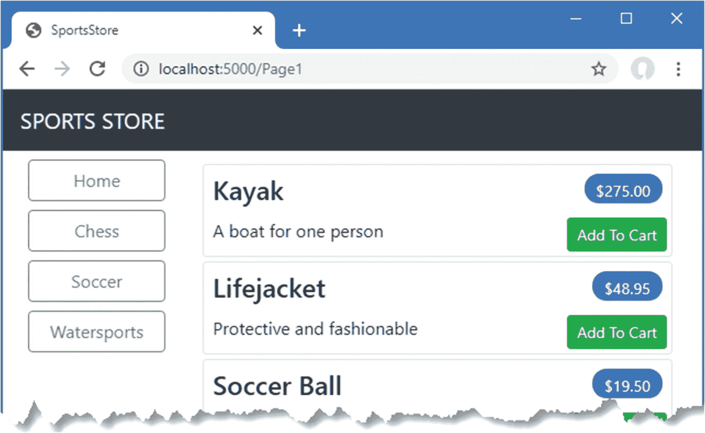

图 8-10。

添加到购物车按钮

第二，当用户点击 Add To Cart 按钮时，适当的产品被添加到他们的购物车中，并显示购物车的摘要，如图 [8-11](#Fig11) 所示。单击“继续购物”按钮，用户将返回到他们来自的产品页面。

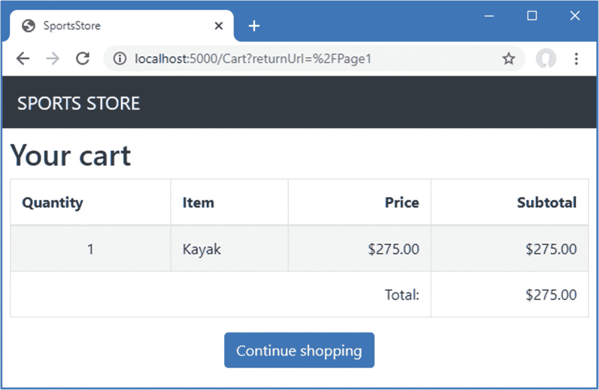

图 8-11。

显示购物车的内容

Unit Testing: Razor Pages

测试 Razor 页面可能需要大量的模仿来创建页面模型类所需的上下文对象。为了测试由`CartModel`类定义的`OnGet`方法的行为，我向`SportsStore.Tests`项目添加了一个名为`CartPageTests.cs`的类文件，并定义了这个测试:

```cs
using Microsoft.AspNetCore.Http;
using Microsoft.AspNetCore.Mvc;
using Microsoft.AspNetCore.Mvc.RazorPages;
using Microsoft.AspNetCore.Routing;
using Moq;
using SportsStore.Models;
using SportsStore.Pages;
using System.Linq;
using System.Text;
using System.Text.Json;
using Xunit;

namespace SportsStore.Tests {

    public class CartPageTests {

        [Fact]
        public void Can_Load_Cart() {

            // Arrange
            // - create a mock repository
            Product p1 = new Product { ProductID = 1, Name = "P1" };
            Product p2 = new Product { ProductID = 2, Name = "P2" };
            Mock<IStoreRepository> mockRepo = new Mock<IStoreRepository>();
            mockRepo.Setup(m => m.Products).Returns((new Product[] {
                p1, p2
            }).AsQueryable<Product>());

            // - create a cart
            Cart testCart = new Cart();
            testCart.AddItem(p1, 2);
            testCart.AddItem(p2, 1);
            // - create a mock page context and session
            Mock<ISession> mockSession = new Mock<ISession>();
            byte[] data =
                Encoding.UTF8.GetBytes(JsonSerializer.Serialize(testCart));
            mockSession.Setup(c => c.TryGetValue(It.IsAny<string>(), out data));
            Mock<HttpContext> mockContext = new Mock<HttpContext>();
            mockContext.SetupGet(c => c.Session).Returns(mockSession.Object);

            // Action
            CartModel cartModel = new CartModel(mockRepo.Object) {
                PageContext = new PageContext(new ActionContext {
                    HttpContext = mockContext.Object,
                    RouteData = new RouteData(),
                    ActionDescriptor = new PageActionDescriptor()
                })
            };
            cartModel.OnGet("myUrl");

            //Assert
            Assert.Equal(2, cartModel.Cart.Lines.Count());
            Assert.Equal("myUrl", cartModel.ReturnUrl);
        }
    }
}

```

我不打算详细描述这些单元测试，因为有一种更简单的方法来执行这些测试，我将在下一章解释。这个测试的复杂性是模仿`ISession`接口，以便页面模型类可以使用扩展方法来检索一个`Cart`对象的 JSON 表示。`ISession`接口只存储字节数组，字符串的获取和反序列化由扩展方法执行。一旦定义了模拟对象，就可以将它们包装在上下文对象中，并用于配置页面模型类的实例，该实例可以接受测试。

测试页面模型类的`OnPost`方法的过程意味着捕获传递给`ISession`接口 mock 的字节数组，然后反序列化它以确保它包含预期的内容。下面是我添加到`CartTestsPage`类的单元测试:

```cs
...
[Fact]
public void Can_Update_Cart() {
    // Arrange
    // - create a mock repository
    Mock<IStoreRepository> mockRepo = new Mock<IStoreRepository>();
    mockRepo.Setup(m => m.Products).Returns((new Product[] {
        new Product { ProductID = 1, Name = "P1" }
    }).AsQueryable<Product>());

    Cart testCart = new Cart();

    Mock<ISession> mockSession = new Mock<ISession>();
    mockSession.Setup(s => s.Set(It.IsAny<string>(), It.IsAny<byte[]>()))
        .Callback<string, byte[]>((key, val) => {
            testCart =
                JsonSerializer.Deserialize<Cart>(Encoding.UTF8.GetString(val));
        });

    Mock<HttpContext> mockContext = new Mock<HttpContext>();
    mockContext.SetupGet(c => c.Session).Returns(mockSession.Object);

    // Action
    CartModel cartModel = new CartModel(mockRepo.Object) {
        PageContext = new PageContext(new ActionContext {
            HttpContext = mockContext.Object,
            RouteData = new RouteData(),
            ActionDescriptor = new PageActionDescriptor()
        })
    };
    cartModel.OnPost(1, "myUrl");

    //Assert
    Assert.Single(testCart.Lines);
    Assert.Equal("P1", testCart.Lines.First().Product.Name);
    Assert.Equal(1, testCart.Lines.First().Quantity);
}
...

```

编写有效的单元测试需要耐心和一些实验，尤其是当你测试的特性在 ASP.NET Core 提供的上下文对象上运行时。

## 摘要

在这一章，我开始充实 SportsStore 应用面向客户的部分。我提供了一种方法，通过这种方法，用户可以按类别导航，并为向购物车添加商品放置基本的构建块。我还有更多工作要做，我将在下一章继续开发这个应用。*