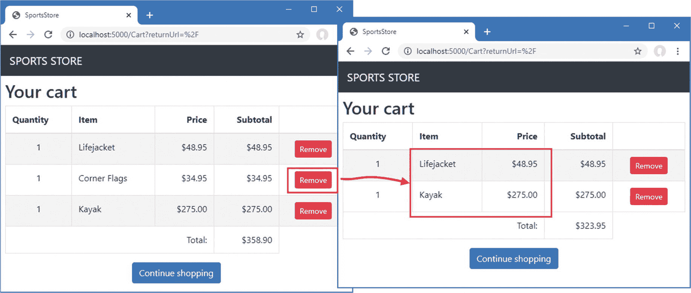
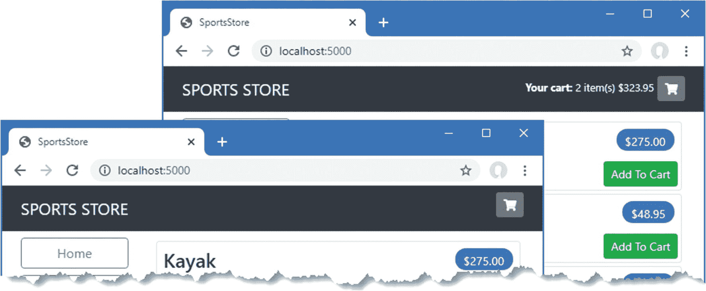
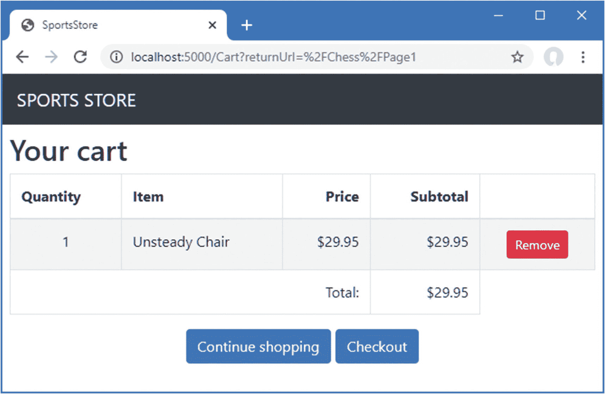
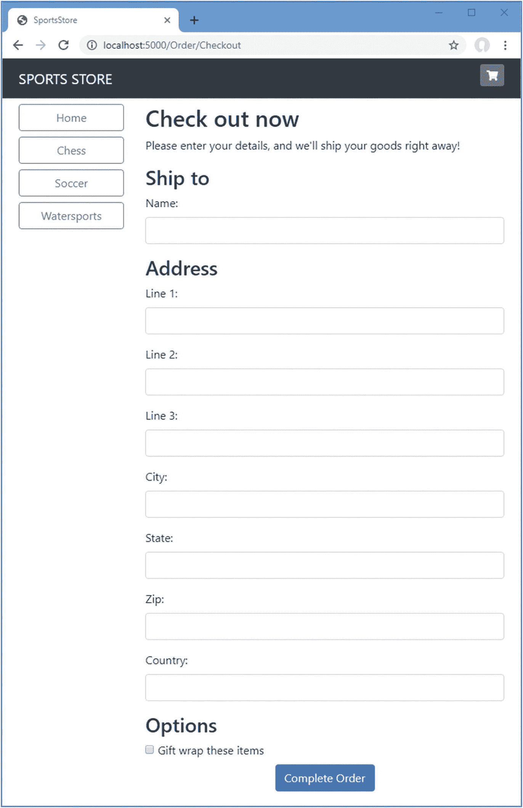
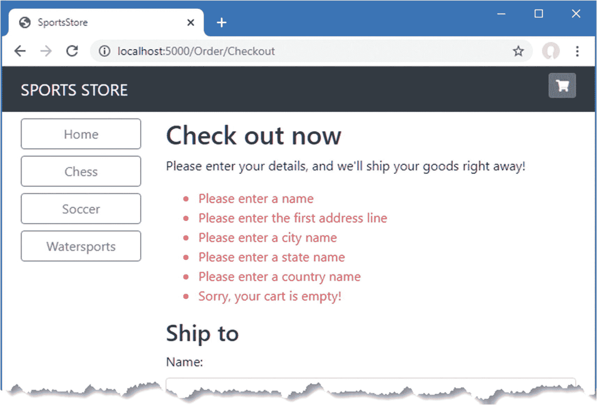
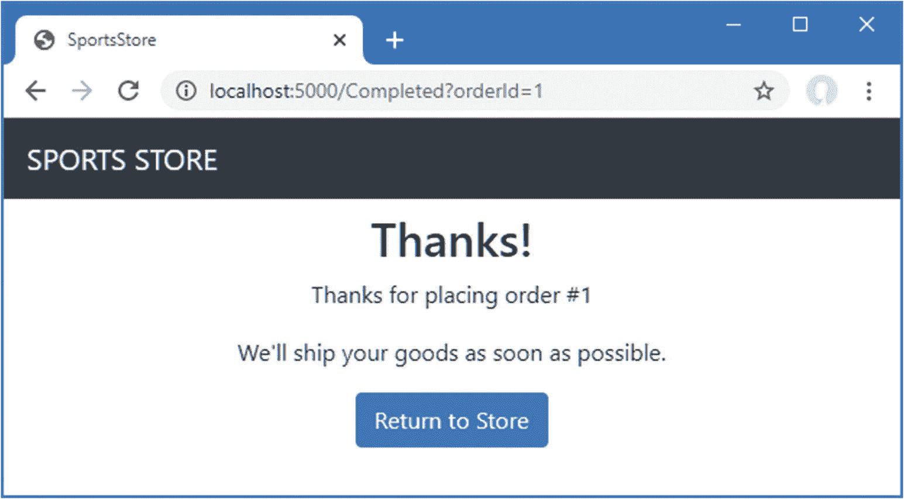

# 九、SportsStore：完成购物车

在本章中，我继续构建 SportsStore 示例应用。在前一章中，我添加了对购物车的基本支持，现在我将改进并完善该功能。

Tip

你可以从 [`https://github.com/apress/pro-asp.net-core-3`](https://github.com/apress/pro-asp.net-core-3) 下载本章以及本书其他章节的示例项目。如果在运行示例时遇到问题，请参见第 [1](01.html) 章获取帮助。

## 用服务细化购物车模型

我在前一章中定义了一个`Cart`模型类，并演示了如何使用会话特性来存储它，从而允许用户构建一组要购买的产品。管理`Cart`类持久性的责任落在了`Cart` Razor 页面上，它必须处理获取和存储作为会话数据的`Cart`对象。

这种方法的问题是，我将不得不在任何其他使用它们的 Razor 页面或控制器中复制获取和存储`Cart`对象的代码。在这一节中，我将使用位于 ASP.NET Core 核心的服务特性来简化管理`Cart`对象的方式，将诸如`Cart`控制器之类的单个组件从需要直接处理细节中解放出来。

服务通常用于对依赖于它们的组件隐藏接口如何实现的细节。但是服务也可以用来解决许多其他问题，可以用来塑造和重新塑造一个应用，甚至当你在使用像`Cart`这样的具体类时。

### 创建存储感知购物车类

整理使用`Cart`类的方法的第一步是创建一个子类，它知道如何使用会话状态存储自己。为了做好准备，我将关键字`virtual`应用于`Cart`类，如清单 [9-1](#PC1) 所示，这样我就可以覆盖成员。

```cs
using System.Collections.Generic;
using System.Linq;

namespace SportsStore.Models {

    public class Cart {

        public List<CartLine> Lines { get; set; } = new List<CartLine>();

        public virtual void AddItem(Product product, int quantity) {
            CartLine line = Lines
                .Where(p => p.Product.ProductID == product.ProductID)
                .FirstOrDefault();

            if (line == null) {
                Lines.Add(new CartLine {
                    Product = product,
                    Quantity = quantity
                });
            } else {
                line.Quantity += quantity;
            }
        }

        public virtual void RemoveLine(Product product) =>
            Lines.RemoveAll(l => l.Product.ProductID == product.ProductID);

        public decimal ComputeTotalValue() =>
            Lines.Sum(e => e.Product.Price * e.Quantity);

        public virtual void Clear() => Lines.Clear();
    }

    public class CartLine {
        public int CartLineID { get; set; }
        public Product Product { get; set; }
        public int Quantity { get; set; }
    }
}

Listing 9-1.Applying the Virtual Keyword in the Cart.cs File in the SportsStore/Models Folder

```

接下来，我将名为`SessionCart.cs`的类文件添加到`Models`文件夹中，并使用它来定义清单 [9-2](#PC2) 中所示的类。

```cs
using System;
using System.Text.Json.Serialization;
using Microsoft.AspNetCore.Http;
using Microsoft.Extensions.DependencyInjection;
using SportsStore.Infrastructure;

namespace SportsStore.Models {

    public class SessionCart : Cart {

        public static Cart GetCart(IServiceProvider services) {
            ISession session = services.GetRequiredService<IHttpContextAccessor>()?
                .HttpContext.Session;
            SessionCart cart = session?.GetJson<SessionCart>("Cart")
                ?? new SessionCart();
            cart.Session = session;
            return cart;
        }

        [JsonIgnore]
        public ISession Session { get; set; }

        public override void AddItem(Product product, int quantity) {
            base.AddItem(product, quantity);
            Session.SetJson("Cart", this);
        }

        public override void RemoveLine(Product product) {
            base.RemoveLine(product);
            Session.SetJson("Cart", this);
        }

        public override void Clear() {
            base.Clear();
            Session.Remove("Cart");
        }
    }
}

Listing 9-2.The Contents of the SessionCart.cs File in the SportsStore/Models Folder

```

`SessionCart`类继承了`Cart`类并覆盖了`AddItem`、`RemoveLine`和`Clear`方法，因此它们调用基本实现，然后使用`ISession`接口上的扩展方法将更新后的状态存储在会话中。静态的`GetCart`方法是一个工厂，用于创建`SessionCart`对象，并为它们提供一个`ISession`对象，以便它们可以存储自己。

获取`ISession`对象有点复杂。我获得了一个`IHttpContextAccessor`服务的实例，它为我提供了对一个`HttpContext`对象的访问，而这个对象又为我提供了`ISession`。这种间接方法是必需的，因为会话不是作为常规服务提供的。

### 注册服务

下一步是为`Cart`类创建一个服务。我的目标是用能够无缝存储自身的`SessionCart`对象来满足对`Cart`对象的请求。您可以在清单 9-3 中看到我是如何创建服务的。

```cs
using System;
using System.Collections.Generic;
using System.Linq;
using System.Threading.Tasks;
using Microsoft.AspNetCore.Builder;
using Microsoft.AspNetCore.Hosting;
using Microsoft.AspNetCore.Http;
using Microsoft.Extensions.DependencyInjection;
using Microsoft.Extensions.Hosting;
using Microsoft.Extensions.Configuration;
using Microsoft.EntityFrameworkCore;
using SportsStore.Models;

namespace SportsStore {
    public class Startup {

        public Startup(IConfiguration config) {
            Configuration = config;
        }

        private IConfiguration Configuration { get; set; }

        public void ConfigureServices(IServiceCollection services) {
            services.AddControllersWithViews();
            services.AddDbContext<StoreDbContext>(opts => {
                opts.UseSqlServer(
                    Configuration["ConnectionStrings:SportsStoreConnection"]);
            });
            services.AddScoped<IStoreRepository, EFStoreRepository>();
            services.AddRazorPages();
            services.AddDistributedMemoryCache();
            services.AddSession();
            services.AddScoped<Cart>(sp => SessionCart.GetCart(sp));
            services.AddSingleton<IHttpContextAccessor, HttpContextAccessor>();
        }

        public void Configure(IApplicationBuilder app, IWebHostEnvironment env) {
            app.UseDeveloperExceptionPage();
            app.UseStatusCodePages();
            app.UseStaticFiles();
            app.UseSession();
            app.UseRouting();
            app.UseEndpoints(endpoints => {
                endpoints.MapControllerRoute("catpage",
                    "{category}/Page{productPage:int}",
                    new { Controller = "Home", action = "Index" });

                endpoints.MapControllerRoute("page", "Page{productPage:int}",
                    new { Controller = "Home", action = "Index", productPage = 1 });

                endpoints.MapControllerRoute("category", "{category}",
                    new { Controller = "Home", action = "Index", productPage = 1 });

                endpoints.MapControllerRoute("pagination",
                    "Products/Page{productPage}",
                    new { Controller = "Home", action = "Index", productPage = 1 });
                endpoints.MapDefaultControllerRoute();
                endpoints.MapRazorPages();
            });

            SeedData.EnsurePopulated(app);
        }
    }
}

Listing 9-3.Creating the Cart Service in the Startup.cs File in the SportsStore Folder

```

`AddScoped`方法指定应该使用相同的对象来满足对`Cart`实例的相关请求。可以配置请求之间的关系，但默认情况下，这意味着处理相同 HTTP 请求的组件所需的任何`Cart`都将接收相同的对象。

我没有为`AddScoped`方法提供类型映射，就像我对存储库所做的那样，而是指定了一个 lambda 表达式，它将被调用来满足`Cart`请求。该表达式接收已注册的服务集合，并将该集合传递给`SessionCart`类的`GetCart`方法。结果是对`Cart`服务的请求将通过创建`SessionCart`对象来处理，这些对象在被修改时将自身序列化为会话数据。

我还使用`AddSingleton`方法添加了一个服务，它指定应该总是使用同一个对象。我创建的服务告诉 ASP.NET Core 在需要实现`IHttpContextAccessor`接口时使用`HttpContextAccessor`类。这个服务是必需的，这样我就可以访问`SessionCart`类中的当前会话。

### 简化购物车 Razor 页面

创建这种服务的好处是它允许我简化使用`Cart`对象的代码。在清单 [9-4](#PC4) 中，我为`Cart` Razor 页面重新编写了页面模型类，以利用新的服务。

```cs
using Microsoft.AspNetCore.Mvc;
using Microsoft.AspNetCore.Mvc.RazorPages;
using SportsStore.Infrastructure;
using SportsStore.Models;
using System.Linq;

namespace SportsStore.Pages {

    public class CartModel : PageModel {
        private IStoreRepository repository;

        public CartModel(IStoreRepository repo, Cart cartService) {
            repository = repo;
            Cart = cartService;
        }

        public Cart Cart { get; set; }
        public string ReturnUrl { get; set; }

        public void OnGet(string returnUrl) {
            ReturnUrl = returnUrl ?? "/";
        }

        public IActionResult OnPost(long productId, string returnUrl) {
            Product product = repository.Products
                .FirstOrDefault(p => p.ProductID == productId);
            Cart.AddItem(product, 1);
            return RedirectToPage(new { returnUrl = returnUrl });
        }
    }
}

Listing 9-4.Using the Cart Service in the Cart.cshtml.cs File in the SportsStore/Pages Folder

```

页面模型类通过声明一个构造函数参数来指示它需要一个`Cart`对象，这允许我从处理程序方法中删除加载和存储会话的语句。结果是一个更简单的页面模型类，它专注于它在应用中的角色，而不必担心如何创建或保存`Cart`对象。而且，因为服务在整个应用中都是可用的，所以任何组件都可以使用相同的技术获得用户的购物车。

Updating the Unit Tests

清单 [9-4](#PC4) 中的`CartModel`类的简化需要对单元测试项目中的`CartPageTests.cs`文件中的单元测试进行相应的更改，以便将`Cart`作为构造函数参数提供，而不是通过上下文对象来访问。下面是对阅读购物车测试的更改:

```cs
...
[Fact]
public void Can_Load_Cart() {

    // Arrange
    // - create a mock repository
    Product p1 = new Product { ProductID = 1, Name = "P1" };
    Product p2 = new Product { ProductID = 2, Name = "P2" };
    Mock<IStoreRepository> mockRepo = new Mock<IStoreRepository>();
    mockRepo.Setup(m => m.Products).Returns((new Product[] {
        p1, p2
    }).AsQueryable<Product>());

    // - create a cart
    Cart testCart = new Cart();
    testCart.AddItem(p1, 2);
    testCart.AddItem(p2, 1);

    // Action
    CartModel cartModel = new CartModel(mockRepo.Object, testCart);
    cartModel.OnGet("myUrl");

    //Assert
    Assert.Equal(2, cartModel.Cart.Lines.Count());
    Assert.Equal("myUrl", cartModel.ReturnUrl);
}
...

```

我将相同的更改应用到检查购物车更改的单元测试中:

```cs
...
[Fact]
public void Can_Update_Cart() {
    // Arrange
    // - create a mock repository
    Mock<IStoreRepository> mockRepo = new Mock<IStoreRepository>();
    mockRepo.Setup(m => m.Products).Returns((new Product[] {
        new Product { ProductID = 1, Name = "P1" }
    }).AsQueryable<Product>());

    Cart testCart = new Cart();

    // Action
    CartModel cartModel = new CartModel(mockRepo.Object, testCart);
    cartModel.OnPost(1, "myUrl");

    //Assert
    Assert.Single(testCart.Lines);
    Assert.Equal("P1", testCart.Lines.First().Product.Name);
    Assert.Equal(1, testCart.Lines.First().Quantity);
}
...

```

使用服务简化了测试过程，并使向被测试的类提供其依赖项变得更加容易。

## 完成购物车功能

现在我已经介绍了`Cart`服务，是时候通过添加两个新特性来完成购物车功能了。第一个将允许客户从购物车中移除商品。第二个功能将在页面顶部显示购物车的摘要。

### 从购物车中移除商品

为了从购物车中移除商品，我需要向提交 HTTP POST 请求的`Cart` Razor 页面呈现的内容添加一个移除按钮。清单 [9-5](#PC7) 中显示了这些变化。

```cs
@page
@model CartModel

<h2>Your cart</h2>
<table class="table table-bordered table-striped">
    <thead>
        <tr>
            <th>Quantity</th>
            <th>Item</th>
            <th class="text-right">Price</th>
            <th class="text-right">Subtotal</th>
            <th></th>
        </tr>
    </thead>
    <tbody>
        @foreach (var line in Model.Cart.Lines) {
            <tr>
                <td class="text-center">@line.Quantity</td>
                <td class="text-left">@line.Product.Name</td>
                <td class="text-right">@line.Product.Price.ToString("c")</td>
                <td class="text-right">
                    @((line.Quantity * line.Product.Price).ToString("c"))
                </td>
                <td class="text-center">
                    <form asp-page-handler="Remove" method="post">
                        <input type="hidden" name="ProductID"
                               value="@line.Product.ProductID" />
                        <input type="hidden" name="returnUrl"
                               value="@Model.ReturnUrl" />
                        <button type="submit" class="btn btn-sm btn-danger">
                            Remove
                        </button>
                    </form>
                </td>
            </tr>
        }
    </tbody>
    <tfoot>
        <tr>
            <td colspan="3" class="text-right">Total:</td>
            <td class="text-right">
                @Model.Cart.ComputeTotalValue().ToString("c")
            </td>
        </tr>
    </tfoot>
</table>

<div class="text-center">
    <a class="btn btn-primary" href="@Model.ReturnUrl">Continue shopping</a>
</div>

Listing 9-5.Removing Cart Items in the Cart.cshtml File in the SportsStore/Pages Folder

```

该按钮需要页面模型类中的一个新的处理程序方法，该方法将接收请求并修改购物车，如清单 [9-6](#PC8) 所示。

```cs
using Microsoft.AspNetCore.Mvc;
using Microsoft.AspNetCore.Mvc.RazorPages;
using SportsStore.Infrastructure;
using SportsStore.Models;
using System.Linq;

namespace SportsStore.Pages {

    public class CartModel : PageModel {
        private IStoreRepository repository;

        public CartModel(IStoreRepository repo, Cart cartService) {
            repository = repo;
            Cart = cartService;
        }

        public Cart Cart { get; set; }
        public string ReturnUrl { get; set; }

        public void OnGet(string returnUrl) {
            ReturnUrl = returnUrl ?? "/";
        }

        public IActionResult OnPost(long productId, string returnUrl) {
            Product product = repository.Products
                .FirstOrDefault(p => p.ProductID == productId);
            Cart.AddItem(product, 1);
            return RedirectToPage(new { returnUrl = returnUrl });
        }

        public IActionResult OnPostRemove(long productId, string returnUrl) {
            Cart.RemoveLine(Cart.Lines.First(cl =>
                cl.Product.ProductID == productId).Product);
            return RedirectToPage(new { returnUrl = returnUrl });
        }
    }
}

Listing 9-6.Removing an Item in the Cart.cshtml.cs File in the SportsStore/Pages Folder

```

新的 HTML 内容定义了一个 HTML 表单。将接收请求的处理程序方法用`asp-page-handler`标记助手属性指定，如下所示:

```cs
...
<form asp-page-handler="Remove" method="post">
...

```

指定的名称以`On`为前缀，并给出一个与请求类型匹配的后缀，因此值`Remove`选择`OnRemovePost`处理程序方法。handler 方法使用它收到的值来定位购物车中的商品并删除它。

重启 ASP.NET Core 并请求`http://localhost:5000`。单击“添加到购物车”按钮将商品添加到购物车，然后单击“删除”按钮。购物车将被更新以移除您指定的商品，如图 [9-1](#Fig1) 所示。



图 9-1。

从购物车中移除商品

### 添加购物车摘要小部件

我可能有一个功能正常的购物车，但它集成到界面的方式有问题。客户只能通过查看购物车摘要屏幕来了解购物车中的商品。他们只能通过向购物车添加新商品来查看购物车摘要屏幕。

为了解决这个问题，我将添加一个小部件来汇总购物车的内容，单击它可以在整个应用中显示购物车的内容。我将使用与添加导航小部件大致相同的方式来实现这一点——作为一个视图组件，我可以将其输出包含在 Razor 布局中。

#### 添加字体 Awesome 包

作为购物车摘要的一部分，我将显示一个按钮，允许用户结帐。我不想在按钮中显示单词 *checkout* ，而是想使用一个购物车符号。由于我没有艺术技能，所以我将使用 Font Awesome 软件包，这是一组优秀的开源图标，它们作为字体集成到应用中，其中字体中的每个字符都是不同的图像。您可以在 [`http://fortawesome.github.io/Font-Awesome`](http://fortawesome.github.io/Font-Awesome) 了解更多关于字体牛逼的内容，包括查看其包含的图标。

要安装客户端包，请使用 PowerShell 命令提示符运行 SportsStore 项目中清单 [9-7](#PC10) 所示的命令。

```cs
libman install font-awesome@5.12.0 -d wwwroot/lib/font-awesome

Listing 9-7.Installing the Icon Package

```

#### 创建视图组件类和视图

我在`Components`文件夹中添加了一个名为`CartSummaryViewComponent.cs`的类文件，并用它来定义清单 [9-8](#PC11) 中所示的视图组件。

```cs
using Microsoft.AspNetCore.Mvc;
using SportsStore.Models;

namespace SportsStore.Components {

    public class CartSummaryViewComponent : ViewComponent {
        private Cart cart;

        public CartSummaryViewComponent(Cart cartService) {
            cart = cartService;
        }

        public IViewComponentResult Invoke() {
            return View(cart);
        }
    }
}

Listing 9-8.The Contents of the CartSummaryViewComponent.cs File in the SportsStore/Components Folder

```

这个视图组件能够利用我在本章前面创建的服务来接收一个`Cart`对象作为构造函数参数。结果是一个简单的视图组件类，它将`Cart`传递给`View`方法，以生成将包含在布局中的 HTML 片段。为了创建组件的视图，我创建了`Views/Shared/Components/CartSummary`文件夹，并向其中添加了一个名为`Default.cshtml`的 Razor 视图，其内容如清单 [9-9](#PC12) 所示。

```cs
@model Cart

<div class="">
    @if (Model.Lines.Count() > 0) {
        <small class="navbar-text">
            <b>Your cart:</b>
            @Model.Lines.Sum(x => x.Quantity) item(s)
            @Model.ComputeTotalValue().ToString("c")
        </small>
    }
    <a class="btn btn-sm btn-secondary navbar-btn" asp-page="/Cart"
       asp-route-returnurl="@ViewContext.HttpContext.Request.PathAndQuery()">
        <i class="fa fa-shopping-cart"></i>
    </a>
</div>

Listing 9-9.The Default.cshtml File in the Views/Shared/Components/CartSummary Folder

```

该视图显示一个带有字体 Awesome cart 图标的按钮，如果购物车中有商品，则提供一个快照，详细说明商品的数量及其总价值。现在我有了一个视图组件和一个视图，我可以修改布局，使购物车摘要包含在由`Home`控制器生成的响应中，如清单 [9-10](#PC13) 所示。

```cs
<!DOCTYPE html>
<html>
<head>
    <meta name="viewport" content="width=device-width" />
    <title>SportsStore</title>
    <link href="/lib/twitter-bootstrap/css/bootstrap.min.css" rel="stylesheet" />
    <link href="/lib/font-awesome/css/all.min.css" rel="stylesheet" />
</head>
<body>
    <div class="bg-dark text-white p-2">
        <div class="container-fluid">
            <div class="row">
                <div class="col navbar-brand">SPORTS STORE</div>
                <div class="col-6 text-right">
                    <vc:cart-summary />
                </div>
            </div>
        </div>
    </div>
    <div class="row m-1 p-1">
        <div id="categories" class="col-3">
            <vc:navigation-menu />
        </div>
        <div class="col-9">
            @RenderBody()
        </div>
    </div>
</body>
</html>

Listing 9-10.Adding the Cart Summary in the _Layout.cshtml File in the Views/Shared Folder

```

您可以通过启动应用来查看购物车摘要。当购物车为空时，只显示结帐按钮。如果您将商品添加到购物车中，则会显示商品的数量及其合计价格，如图 [9-2](#Fig2) 所示。有了这个附加功能，顾客就知道他们的购物车里有什么，并有一个明显的方法从商店结账。



图 9-2。

显示购物车的摘要

## 提交订单

我现在已经实现了 SportsStore 的最后一个客户功能:结账和完成订单的能力。在接下来的几节中，我将扩展数据模型，以支持从用户处捕获运输细节，并添加应用支持来处理这些细节。

### 创建模型类

我在`Models`文件夹中添加了一个名为`Order.cs`的类文件，并用它来定义清单 [9-11](#PC14) 中所示的类。这是我将用来为客户表示送货细节的类。

```cs
using System.Collections.Generic;
using System.ComponentModel.DataAnnotations;
using Microsoft.AspNetCore.Mvc.ModelBinding;

namespace SportsStore.Models {

    public class Order {

        [BindNever]
        public int OrderID { get; set; }
        [BindNever]
        public ICollection<CartLine> Lines { get; set; }

        [Required(ErrorMessage = "Please enter a name")]
        public string Name { get; set; }

        [Required(ErrorMessage = "Please enter the first address line")]
        public string Line1 { get; set; }
        public string Line2 { get; set; }
        public string Line3 { get; set; }

        [Required(ErrorMessage = "Please enter a city name")]
        public string City { get; set; }

        [Required(ErrorMessage = "Please enter a state name")]
        public string State { get; set; }

        public string Zip { get; set; }

        [Required(ErrorMessage = "Please enter a country name")]
        public string Country { get; set; }

        public bool GiftWrap { get; set; }
    }
}

Listing 9-11.The Contents of the Order.cs File in the SportsStore/Models Folder

```

我使用了来自`System.ComponentModel.DataAnnotations`名称空间的验证属性，就像我在第 [3 章](03.html)中所做的一样。我将在第 29 章中进一步描述验证。

我还使用了`BindNever`属性，它防止用户在 HTTP 请求中为这些属性提供值。这是模型绑定系统的一个特性，我在第 [28 章](28.html)中描述过，它阻止 ASP.NET Core 使用来自 HTTP 请求的值来填充敏感或重要的模型属性。

### 添加结账流程

目标是让用户能够输入他们的运输细节并提交订单。首先，我需要向购物车视图添加一个结帐按钮，如清单 [9-12](#PC15) 所示。

```cs
...
<div class="text-center">
    <a class="btn btn-primary" href="@Model.ReturnUrl">Continue shopping</a>
    <a class="btn btn-primary" asp-action="Checkout" asp-controller="Order">
        Checkout
    </a>
</div>
...

Listing 9-12.Adding a Button in the Cart.cshtml File in the SportsStore/Pages Folder

```

这一更改生成了一个链接，我将它设计为一个按钮，当单击它时，调用`Order`控制器的`Checkout`动作方法，这是我在下一节中创建的。为了展示 Razor 页面和控制器如何协同工作，我将在控制器中处理订单处理，然后在处理结束时返回 Razor 页面。要看到`Checkout`按钮，重启 ASP.NET Core，请求`http://localhost:5000`，并点击其中一个添加到购物车按钮。新建按钮显示为购物车摘要的一部分，如图 [9-3](#Fig3) 所示。



图 9-3。

结账按钮

### 创建控制器和视图

我现在需要定义处理订单的控制器。我在`Controllers`文件夹中添加了一个名为`OrderController.cs`的类文件，并用它来定义清单 [9-13](#PC16) 中所示的类。

```cs
using Microsoft.AspNetCore.Mvc;
using SportsStore.Models;

namespace SportsStore.Controllers {

    public class OrderController : Controller {

        public ViewResult Checkout() => View(new Order());
    }
}

Listing 9-13.The Contents of the OrderController.cs File in the SportsStore/Controllers Folder

```

`Checkout`方法返回默认视图，并传递一个新的`Order`对象作为视图模型。为了创建视图，我创建了`Views/Order`文件夹，并添加了一个名为`Checkout.cshtml`的 Razor 视图，其标记如清单 [9-14](#PC17) 所示。

```cs
@model Order

<h2>Check out now</h2>
<p>Please enter your details, and we'll ship your goods right away!</p>

<form asp-action="Checkout" method="post">
    <h3>Ship to</h3>
    <div class="form-group">
        <label>Name:</label><input asp-for="Name" class="form-control" />
    </div>
    <h3>Address</h3>
    <div class="form-group">
        <label>Line 1:</label><input asp-for="Line1" class="form-control" />
    </div>
    <div class="form-group">
        <label>Line 2:</label><input asp-for="Line2" class="form-control" />
    </div>
    <div class="form-group">
        <label>Line 3:</label><input asp-for="Line3" class="form-control" />
    </div>
    <div class="form-group">
        <label>City:</label><input asp-for="City" class="form-control" />
    </div>
    <div class="form-group">
        <label>State:</label><input asp-for="State" class="form-control" />
    </div>
    <div class="form-group">
        <label>Zip:</label><input asp-for="Zip" class="form-control" />
    </div>
    <div class="form-group">
        <label>Country:</label><input asp-for="Country" class="form-control" />
    </div>
    <h3>Options</h3>
    <div class="checkbox">
        <label>
            <input asp-for="GiftWrap" /> Gift wrap these items
        </label>
    </div>
    <div class="text-center">
        <input class="btn btn-primary" type="submit" value="Complete Order" />
    </div>
</form>

Listing 9-14.The Contents of the Checkout.cshtml File in the SportsStore/Views/Order Folder

```

对于模型中的每个属性，我已经创建了一个`label`和`input`元素来捕获用户输入，使用 Bootstrap 进行样式化，并使用标记助手进行配置。`input`元素上的`asp-for`属性由一个内置的标签助手处理，该助手根据指定的模型属性生成`type`、`id`、`name`和`value`属性，如第 [27 章](27.html)所述。

你可以看到如图 [9-4](#Fig4) 所示的表单，重启 ASP.NET Core，请求`http://localhost:5000`，添加一个商品到购物篮，然后点击结账按钮。或者，更直接的，你可以请求`http://localhost:5000/order/checkout`。



图 9-4。

运输详细信息表单

### 实施订单处理

我将通过将订单写入数据库来处理它们。当然，大多数电子商务网站不会就此止步，我也没有为处理信用卡或其他形式的支付提供支持。但是我想把事情集中在 ASP.NET Core，所以一个简单的数据库条目就可以了。

#### 扩展数据库

向数据库中添加一种新的模型很简单，因为我在第 [7](07.html) 章中经历了初始设置。首先，我向数据库上下文类添加了一个新属性，如清单 [9-15](#PC18) 所示。

```cs
using Microsoft.EntityFrameworkCore;

namespace SportsStore.Models {
    public class StoreDbContext: DbContext {

        public StoreDbContext(DbContextOptions<StoreDbContext> options)
            : base(options) { }

        public DbSet<Product> Products { get; set; }
        public DbSet<Order> Orders { get; set; }
    }
}

Listing 9-15.Adding a Property in the StoreDbContext.cs File in the SportsStore/Models Folder

```

这一变化足以让 Entity Framework Core 创建一个数据库迁移，允许将`Order`对象存储在数据库中。要创建迁移，使用 PowerShell 命令提示符运行清单`SportsStore`文件夹中的 [9-16](#PC19) 所示的命令。

```cs
dotnet ef migrations add Orders

Listing 9-16.Creating a Migration

```

这个命令告诉 Entity Framework Core 获取应用数据模型的新快照，找出它与以前的数据库版本有何不同，并生成一个名为`Orders`的新迁移。新的迁移将在应用启动时自动应用，因为`SeedData`调用实体框架核心提供的`Migrate`方法。

Resetting the Database

当您频繁地对模型进行更改时，您的迁移和数据库模式会出现不同步的情况。最简单的方法是删除数据库并重新开始。然而，这仅适用于开发期间，当然，因为您将丢失任何您已经存储的数据。运行以下命令删除数据库:

```cs
dotnet ef database drop --force --context StoreDbContext

```

删除数据库后，从`SportsStore`文件夹运行以下命令来重新创建数据库，并应用您通过运行以下命令创建的迁移:

```cs
dotnet ef database update --context StoreDbContext

```

如果您刚刚启动应用，迁移也将由`SeedData`类应用。无论哪种方式，数据库都将被重置，以便它准确地反映您的数据模型，并允许您继续开发您的应用。

#### 创建订单存储库

我将遵循我用于产品存储库的相同模式来提供对`Order`对象的访问。我在`Models`文件夹中添加了一个名为`IOrderRepository.cs`的类文件，并用它来定义清单 [9-17](#PC22) 中所示的接口。

```cs
using System.Linq;

namespace SportsStore.Models {

    public interface IOrderRepository {

        IQueryable<Order> Orders { get; }
        void SaveOrder(Order order);
    }
}

Listing 9-17.The Contents of the IOrderRepository.cs File in the SportsStore/Models Folder

```

为了实现订单存储库接口，我在`Models`文件夹中添加了一个名为`EFOrderRepository.cs`的类文件，并定义了清单 [9-18](#PC23) 中所示的类。

```cs
using Microsoft.EntityFrameworkCore;
using System.Linq;

namespace SportsStore.Models {

    public class EFOrderRepository : IOrderRepository {
        private StoreDbContext context;

        public EFOrderRepository(StoreDbContext ctx) {
            context = ctx;
        }

        public IQueryable<Order> Orders => context.Orders
                            .Include(o => o.Lines)
                            .ThenInclude(l => l.Product);

        public void SaveOrder(Order order) {
            context.AttachRange(order.Lines.Select(l => l.Product));
            if (order.OrderID == 0) {
                context.Orders.Add(order);
            }
            context.SaveChanges();
        }
    }
}

Listing 9-18.The Contents of the EFOrderRepository.cs File in the SportsStore/Models Folder

```

该类使用实体框架核心实现了`IOrderRepository`接口，允许检索已经存储的一组`Order`对象，并允许创建或更改订单。

Understanding the Order Repository

如果实体框架核心跨越多个表，则需要指令来加载相关数据。在清单 [9-18](#PC23) 中，我使用了`Include`和`ThenInclude`方法来指定当从数据库中读取一个`Order`对象时，与`Lines`属性相关联的集合也应该和与每个集合对象相关联的每个`Product`对象一起被加载。

```cs
...
public IQueryable<Order> Orders => context.Orders
    .Include(o => o.Lines)
    .ThenInclude(l => l.Product);
...

```

这确保了我接收到我需要的所有数据对象，而不必执行单独的查询，然后自己组装数据。

当我在数据库中存储一个`Order`对象时，还需要一个额外的步骤。当从会话存储中反序列化用户的购物车数据时，会创建实体框架核心不知道的新对象，然后尝试将所有对象写入数据库。对于与一个`Order`相关联的`Product`对象，这意味着实体框架核心试图写入已经被存储的对象，这会导致一个错误。为了避免这个问题，我通知 Entity Framework Core 这些对象存在，并且不应该存储在数据库中，除非它们被修改，如下所示:

```cs
...
context.AttachRange(order.Lines.Select(l => l.Product));
...

```

这确保了实体框架核心不会试图写入与`Order`对象相关联的反序列化的`Product`对象。

在清单 [9-19](#PC26) 中，我在`Startup`类的`ConfigureServices`方法中将订单存储库注册为服务。

```cs
...
public void ConfigureServices(IServiceCollection services) {
    services.AddControllersWithViews();
    services.AddDbContext<StoreDbContext>(opts => {
        opts.UseSqlServer(
            Configuration["ConnectionStrings:SportsStoreConnection"]);
    });
    services.AddScoped<IStoreRepository, EFStoreRepository>();
    services.AddScoped<IOrderRepository, EFOrderRepository>();
    services.AddRazorPages();
    services.AddDistributedMemoryCache();
    services.AddSession();
    services.AddScoped<Cart>(sp => SessionCart.GetCart(sp));
    services.AddSingleton<IHttpContextAccessor, HttpContextAccessor>();
}
...

Listing 9-19.Registering the Order Repository Service in the Startup.cs File in the SportsStore Folder

```

### 完成订单控制器

为了完成`OrderController`类，我需要修改构造函数，以便它接收处理订单所需的服务，并添加一个动作方法，当用户单击完成订单按钮时，该方法将处理 HTTP 表单`POST`请求。清单 [9-20](#PC27) 显示了这两种变化。

```cs
using Microsoft.AspNetCore.Mvc;
using SportsStore.Models;
using System.Linq;

namespace SportsStore.Controllers {

    public class OrderController : Controller {
        private IOrderRepository repository;
        private Cart cart;

        public OrderController(IOrderRepository repoService, Cart cartService) {
            repository = repoService;
            cart = cartService;
        }

        public ViewResult Checkout() => View(new Order());

        [HttpPost]
        public IActionResult Checkout(Order order) {
            if (cart.Lines.Count() == 0) {
                ModelState.AddModelError("", "Sorry, your cart is empty!");
            }
            if (ModelState.IsValid) {
                order.Lines = cart.Lines.ToArray();
                repository.SaveOrder(order);
                cart.Clear();
                return RedirectToPage("/Completed", new { orderId = order.OrderID });
            } else {
                return View();
            }
        }
    }
}

Listing 9-20.Completing the Controller in the OrderController.cs File in the SportsStore/Controllers Folder

```

`Checkout`动作方法用`HttpPost`属性修饰，这意味着它将用于处理`POST`请求——在本例中，当用户提交表单时。

在第 8 章中，我使用 ASP.NET Core 模型绑定特性从请求中接收简单的数据值。在新的 action 方法中使用了相同的特性来接收一个完整的`Order`对象。当一个请求被处理时，模型绑定系统试图寻找由`Order`类定义的属性值。这在尽力而为的基础上工作，这意味着如果请求中没有相应的数据项，我可能会收到一个缺少属性值的`Order`对象。

为了确保我有我需要的数据，我对`Order`类应用了验证属性。ASP.NET Core 检查我应用到`Order`类的验证约束，并通过`ModelState`属性提供结果的细节。我可以通过检查`ModelState.IsValid`属性来查看是否有问题。如果购物车中没有商品，我调用`ModelState.AddModelError`方法来记录一条错误消息。我将很快解释如何显示这样的错误，在第 [28](28.html) 和 [29](29.html) 章中，我还有更多关于模型绑定和验证的内容要说。

Unit Test: Order Processing

为了对`OrderController`类执行单元测试，我需要测试`Checkout`方法的`POST`版本的行为。尽管该方法看起来简短而简单，但是模型绑定的使用意味着在幕后有很多事情需要测试。

只有当购物车*和*中有商品并且顾客提供了有效的送货细节时，我才想要处理订单。在所有其他情况下，应该向客户显示一个错误。下面是第一个测试方法，我在`SportsStore.Tests`项目中名为`OrderControllerTests.cs`的类文件中定义了它:

```cs
using Microsoft.AspNetCore.Mvc;
using Moq;
using SportsStore.Controllers;
using SportsStore.Models;
using Xunit;

namespace SportsStore.Tests {

    public class OrderControllerTests {

        [Fact]
        public void Cannot_Checkout_Empty_Cart() {
            // Arrange - create a mock repository
            Mock<IOrderRepository> mock = new Mock<IOrderRepository>();
            // Arrange - create an empty cart
            Cart cart = new Cart();
            // Arrange - create the order
            Order order = new Order();
            // Arrange - create an instance of the controller
            OrderController target = new OrderController(mock.Object, cart);

            // Act
            ViewResult result = target.Checkout(order) as ViewResult;

            // Assert - check that the order hasn't been stored
            mock.Verify(m => m.SaveOrder(It.IsAny<Order>()), Times.Never);
            // Assert - check that the method is returning the default view
            Assert.True(string.IsNullOrEmpty(result.ViewName));
            // Assert - check that I am passing an invalid model to the view
            Assert.False(result.ViewData.ModelState.IsValid);
        }
    }
}

```

这个测试确保我不能空着购物车结账。我通过确保 mock `IOrderRepository`实现的`SaveOrder`永远不会被调用，该方法返回的视图是默认视图(它将重新显示客户输入的数据，并给他们一个纠正它的机会)，以及传递给视图的模型状态已经被标记为无效来检查这一点。这可能看起来像一组严格的断言，但是我需要这三个来确保我有正确的行为。下一个测试方法以大致相同的方式工作，但是将一个错误注入到视图模型中，以模拟模型绑定器报告的问题(当客户输入无效的运输数据时，这将在生产中发生):

```cs
...
[Fact]
public void Cannot_Checkout_Invalid_ShippingDetails() {

    // Arrange - create a mock order repository
    Mock<IOrderRepository> mock = new Mock<IOrderRepository>();
    // Arrange - create a cart with one item
    Cart cart = new Cart();
    cart.AddItem(new Product(), 1);
    // Arrange - create an instance of the controller
    OrderController target = new OrderController(mock.Object, cart);
    // Arrange - add an error to the model
    target.ModelState.AddModelError("error", "error");

    // Act - try to checkout
    ViewResult result = target.Checkout(new Order()) as ViewResult;

    // Assert - check that the order hasn't been passed stored
    mock.Verify(m => m.SaveOrder(It.IsAny<Order>()), Times.Never);
    // Assert - check that the method is returning the default view
    Assert.True(string.IsNullOrEmpty(result.ViewName));
    // Assert - check that I am passing an invalid model to the view
    Assert.False(result.ViewData.ModelState.IsValid);
}
...

```

已经确定空购物车或无效的详细信息会妨碍订单的处理，我需要确保在适当的时候处理订单。测试如下:

```cs
...
[Fact]
public void Can_Checkout_And_Submit_Order() {
    // Arrange - create a mock order repository
    Mock<IOrderRepository> mock = new Mock<IOrderRepository>();
    // Arrange - create a cart with one item
    Cart cart = new Cart();
    cart.AddItem(new Product(), 1);
    // Arrange - create an instance of the controller
    OrderController target = new OrderController(mock.Object, cart);

    // Act - try to checkout
    RedirectToPageResult result =
            target.Checkout(new Order()) as RedirectToPageResult;

    // Assert - check that the order has been stored
    mock.Verify(m => m.SaveOrder(It.IsAny<Order>()), Times.Once);
    // Assert - check that the method is redirecting to the Completed action
    Assert.Equal("/Completed", result.PageName);
}
...

```

我不需要测试，我可以识别有效的运输细节。这是由模型绑定器使用应用于`Order`类属性的属性自动为我处理的。

### 显示验证错误

ASP.NET Core 使用应用于`Order`类的验证属性来验证用户数据，但是我需要做一个简单的修改来显示任何问题。这依赖于另一个内置的标记助手，它检查用户提供的数据的验证状态，并为发现的每个问题添加警告消息。清单 [9-21](#PC31) 显示了将由标签助手处理的 HTML 元素添加到`Checkout.cshtml`文件中。

```cs
@model Order

<h2>Check out now</h2>
<p>Please enter your details, and we'll ship your goods right away!</p>

<div asp-validation-summary="All" class="text-danger"></div>

<form asp-action="Checkout" method="post">
    <h3>Ship to</h3>
    <div class="form-group">
        <label>Name:</label><input asp-for="Name" class="form-control" />
    </div>
    <h3>Address</h3>
    <div class="form-group">
        <label>Line 1:</label><input asp-for="Line1" class="form-control" />
    </div>
    <div class="form-group">
        <label>Line 2:</label><input asp-for="Line2" class="form-control" />
    </div>
    <div class="form-group">
        <label>Line 3:</label><input asp-for="Line3" class="form-control" />
    </div>
    <div class="form-group">
        <label>City:</label><input asp-for="City" class="form-control" />
    </div>
    <div class="form-group">
        <label>State:</label><input asp-for="State" class="form-control" />
    </div>
    <div class="form-group">
        <label>Zip:</label><input asp-for="Zip" class="form-control" />
    </div>
    <div class="form-group">
        <label>Country:</label><input asp-for="Country" class="form-control" />
    </div>
    <h3>Options</h3>
    <div class="checkbox">
        <label>
            <input asp-for="GiftWrap" /> Gift wrap these items
        </label>
    </div>
    <div class="text-center">
        <input class="btn btn-primary" type="submit" value="Complete Order" />
    </div>
</form>

Listing 9-21.Adding a Validation Summary to the Checkout.cshtml File in the SportsStore/Views/Order Folder

```

通过这个简单的更改，验证错误将被报告给用户。要查看效果，重新启动 ASP.NET Core，请求`http://localhost:5000/Order/Checkout`，并单击完成订单按钮，而不填写表单。ASP.NET Core 将处理表单数据，检测未找到所需的值，并生成如图 [9-5](#Fig5) 所示的验证错误。



图 9-5。

显示验证消息

Tip

用户提交的数据在被验证之前被发送到服务器，这被称为*服务器端验证*，ASP.NET Core 对此提供了出色的支持。服务器端验证的问题在于，直到数据被发送到服务器并被处理以及结果页面生成之后，用户才被告知错误——在繁忙的服务器上，这可能需要几秒钟的时间。因此，服务器端验证通常由*客户端验证*来补充，在表单数据发送到服务器之前，使用 JavaScript 来检查用户输入的值。我在第 29 章[中描述了客户端验证。](29.html)

### 显示摘要页面

为了完成结帐过程，我将创建一个 Razor 页面，显示一条带有订单摘要的感谢消息。在`Pages`文件夹中添加一个名为`Completed.cshtml`的 Razor 页面，内容如清单 [9-22](#PC32) 所示。

```cs
@page

<div class="text-center">
    <h2>Thanks!</h2>
    <p>Thanks for placing order #@OrderId</p>
    <p>We'll ship your goods as soon as possible.</p>
    <a class="btn btn-primary" asp-controller="Home">Return to Store</a>
</div>

@functions {

    [BindProperty(SupportsGet = true)]
    public string OrderId { get; set; }
}

Listing 9-22.The Contents of the Completed.cshtml File in the SportsStore/Pages Folder

```

尽管 Razor 页面通常有页面模型类，但它们不是必需的，简单的功能也可以不用它们来开发。在这个例子中，我定义了一个名为`OrderId`的属性，并用`BindProperty`属性修饰它，它指定这个属性的值应该由模型绑定系统从请求中获得

现在顾客可以经历从选择产品到结账的整个过程。如果他们提供了有效的发货详细信息(并且购物车中有商品)，当他们单击完成订单按钮时，将会看到摘要页面，如图 [9-6](#Fig6) 所示。



图 9-6。

已完成订单汇总视图

注意应用在控制器和 Razor 页面之间移动的方式。ASP.NET Core 提供的应用功能是互补的，可以在项目中自由混合。

## 摘要

我已经完成了 SportsStore 面向客户部分的所有主要部分。这可能不足以让亚马逊担心，但我有一个可以按类别和页面浏览的产品目录、一个整洁的购物车和一个简单的结账流程。

我采用的方法意味着我可以很容易地改变应用的任何部分的行为，而不会在其他地方引起问题或不一致。例如，我可以更改订单的存储方式，这不会对购物车、产品目录或应用的任何其他区域产生任何影响。在下一章中，我将添加管理 SportsStore 应用所需的特性。